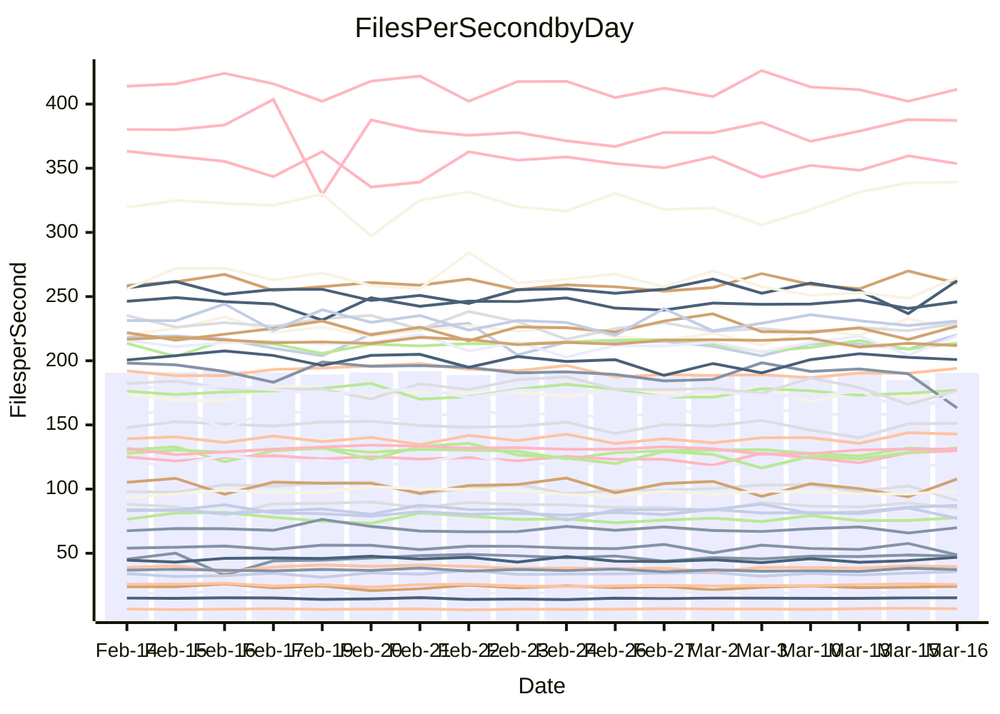

<!---
# This file is auto-generated. Do not edit.
# cspell:disable
--->
# Performance Report

Daily Performance

```mermaid
xychart-beta
    title Files Per Second by Day
    y-axis Files per Second
    x-axis Date [Feb-14, Feb-15, Feb-16, Feb-17, Feb-19, Feb-20, Feb-21, Feb-22, Feb-23, Feb-24, Feb-26, Feb-27, Mar-2, Mar-3, Mar-10, Mar-13, Mar-15, Mar-16]
    bar [190.65, 191.15, 192.54, 190.97, 189.21, 190.95, 191.93, 188.84, 190.95, 190.14, 188.86, 187.47, 189.15, 187.99, 188.38, 189.98, 185.21, 190.52]
    line [45.43, 50.01, 33.04, 44.04, 44.67, 46.36, 48.18, 49.05, 48.06, 46.41, 47.91, 43.77, 46.60, 45.68, 47.70, 47.47, 48.64, 47.69]
    line [139.27, 140.69, 136.31, 141.26, 136.95, 140.26, 134.61, 141.79, 137.76, 142.75, 135.42, 139.26, 136.06, 139.99, 140.01, 135.63, 143.93, 142.82]
    line [98.06, 97.55, 103.52, 102.20, 104.64, 105.41, 96.15, 100.38, 103.85, 96.33, 99.09, 99.19, 100.48, 103.18, 103.33, 98.05, 102.55, 91.08]
    line [130.41, 132.90, 121.26, 129.83, 131.86, 128.62, 131.04, 130.26, 129.44, 123.58, 128.31, 129.87, 130.27, 130.71, 127.81, 125.76, 132.01, 130.34]
    line [23.95, 23.93, 26.14, 23.05, 24.64, 20.92, 22.32, 25.16, 23.04, 24.66, 23.19, 24.07, 21.50, 23.56, 24.56, 23.16, 23.57, 24.19]
    line [218.78, 219.30, 216.79, 209.78, 203.99, 220.72, 225.56, 229.20, 204.56, 214.62, 214.22, 215.21, 211.23, 203.79, 213.30, 213.00, 209.05, 220.03]
    line [125.01, 121.92, 124.63, 126.05, 123.51, 125.30, 123.36, 124.67, 122.06, 125.40, 123.31, 123.27, 118.58, 127.90, 124.38, 120.45, 128.40, 129.95]
    line [44.68, 43.13, 46.03, 46.35, 45.95, 47.66, 45.50, 46.89, 43.13, 47.48, 43.86, 43.58, 44.95, 42.68, 45.79, 43.00, 44.30, 46.80]
    line [220.20, 225.26, 234.21, 221.97, 226.10, 219.20, 223.30, 227.37, 223.02, 226.36, 218.81, 215.75, 221.50, 212.02, 224.11, 219.75, 232.68, 224.13]
    line [18.59, 19.07, 20.25, 18.95, 19.76, 18.01, 18.46, 18.38, 19.68, 18.34, 19.60, 19.60, 19.63, 18.78, 19.22, 18.67, 19.78, 18.08]
    line [53.98, 54.67, 55.62, 52.95, 56.33, 56.16, 52.87, 55.45, 55.44, 54.09, 53.55, 56.91, 50.34, 56.33, 53.77, 52.96, 57.64, 48.67]
    line [25.72, 25.93, 26.65, 24.45, 25.52, 23.53, 25.65, 25.87, 24.49, 24.03, 24.62, 25.06, 24.45, 24.76, 24.74, 25.60, 26.18, 25.66]
    line [88.35, 86.20, 79.88, 88.50, 88.86, 89.95, 85.47, 89.64, 87.93, 87.72, 85.68, 85.69, 83.26, 89.40, 86.73, 86.09, 89.20, 85.26]
    line [76.45, 81.35, 81.75, 78.06, 74.92, 73.32, 81.29, 78.95, 76.37, 76.80, 73.75, 75.77, 77.40, 74.68, 79.36, 75.39, 75.58, 77.70]
    line [105.24, 108.38, 96.07, 105.42, 104.57, 104.52, 96.66, 102.79, 103.56, 108.60, 97.11, 104.32, 106.04, 94.30, 104.19, 100.36, 94.07, 107.84]
    line [34.12, 31.87, 32.51, 34.43, 31.35, 34.71, 33.66, 36.75, 33.50, 33.75, 33.98, 34.43, 34.99, 32.10, 34.36, 33.03, 34.53, 35.68]
    line [380.17, 380.03, 383.65, 403.62, 329.33, 387.65, 379.15, 375.70, 377.89, 371.33, 366.95, 377.92, 377.66, 385.69, 370.91, 378.91, 387.90, 387.17]
    line [15.09, 14.85, 15.30, 15.16, 14.06, 14.46, 15.41, 14.08, 14.28, 13.96, 14.98, 14.69, 15.09, 15.05, 14.93, 14.92, 15.23, 15.36]
    line [319.43, 324.88, 322.69, 320.99, 329.84, 297.30, 325.03, 331.76, 320.00, 316.72, 330.45, 317.84, 319.02, 305.87, 317.67, 331.44, 338.69, 339.16]
    line [120.64, 118.92, 126.15, 122.12, 122.32, 119.71, 119.61, 127.43, 118.55, 121.57, 118.53, 115.70, 116.93, 121.24, 118.95, 118.40, 114.99, 122.23]
    line [67.54, 69.24, 69.14, 67.84, 76.41, 70.89, 67.31, 66.82, 66.94, 70.88, 67.89, 70.56, 67.78, 66.98, 69.18, 70.51, 65.83, 69.90]
    line [38.93, 40.19, 35.66, 39.21, 40.89, 39.79, 40.82, 39.75, 38.29, 38.55, 38.02, 38.35, 35.65, 38.90, 38.99, 38.46, 40.13, 39.61]
    line [147.88, 152.57, 150.80, 149.13, 152.26, 152.78, 149.55, 148.15, 148.90, 152.11, 143.30, 150.41, 149.07, 153.47, 146.06, 140.05, 150.95, 151.14]
    line [213.52, 203.34, 215.88, 213.12, 205.73, 212.95, 211.55, 213.31, 213.15, 214.61, 215.98, 216.39, 213.20, 207.00, 210.46, 215.67, 209.05, 213.75]
    line [258.76, 261.47, 267.24, 254.70, 257.67, 260.94, 258.83, 263.71, 255.40, 259.16, 257.65, 254.22, 257.02, 267.92, 259.39, 256.02, 269.97, 260.43]
    line [83.91, 83.57, 87.71, 81.51, 80.83, 78.91, 82.42, 80.37, 81.15, 79.72, 81.93, 80.10, 84.29, 81.35, 81.66, 80.93, 85.41, 77.21]
    line [363.25, 359.22, 355.34, 343.44, 363.00, 335.36, 339.22, 362.80, 356.26, 358.85, 353.61, 350.32, 358.90, 343.06, 352.21, 348.39, 359.59, 353.61]
    line [256.71, 261.76, 251.74, 255.44, 255.70, 246.95, 250.90, 244.70, 255.35, 256.03, 252.54, 255.82, 263.63, 252.65, 260.43, 254.55, 236.73, 262.40]
    line [173.78, 169.32, 168.80, 179.63, 179.91, 171.61, 176.10, 175.03, 175.02, 172.48, 176.50, 175.06, 173.05, 179.29, 168.17, 175.84, 172.23, 171.80]
    line [215.87, 211.04, 214.14, 215.28, 213.09, 213.97, 220.46, 207.58, 214.51, 202.85, 211.79, 211.44, 214.66, 206.78, 214.22, 219.20, 204.44, 219.44]
    line [36.82, 37.56, 36.77, 36.33, 37.40, 36.62, 38.51, 36.10, 37.37, 36.52, 37.66, 35.60, 37.02, 36.08, 36.38, 35.91, 38.37, 37.26]
    line [192.15, 188.44, 188.43, 193.17, 194.32, 195.93, 197.80, 193.32, 192.22, 196.28, 187.50, 189.10, 188.54, 189.19, 186.81, 190.52, 190.26, 194.02]
    line [235.22, 226.17, 229.70, 226.87, 232.74, 235.31, 224.47, 238.32, 230.44, 216.76, 225.02, 229.69, 222.82, 225.14, 221.56, 225.82, 223.33, 229.25]
    line [176.28, 173.64, 175.63, 176.43, 178.51, 182.28, 170.09, 171.99, 177.77, 181.65, 177.93, 171.71, 171.61, 178.31, 176.56, 173.19, 174.63, 177.13]
    line [216.77, 218.28, 216.31, 214.05, 214.67, 213.49, 218.19, 216.61, 212.54, 214.33, 212.86, 215.99, 216.40, 215.81, 217.40, 210.64, 213.63, 211.82]
    line [83.13, 83.66, 80.84, 83.02, 84.44, 80.37, 87.47, 84.08, 83.91, 75.76, 83.59, 84.08, 83.89, 88.30, 81.02, 82.11, 85.90, 87.16]
    line [413.93, 415.75, 423.97, 415.82, 402.21, 417.90, 421.85, 402.15, 417.55, 417.69, 405.05, 412.32, 405.86, 426.09, 413.29, 411.20, 402.18, 411.51]
    line [246.33, 249.20, 246.02, 244.24, 231.62, 249.13, 242.45, 246.48, 246.10, 248.98, 240.98, 239.52, 244.96, 243.99, 244.22, 247.23, 240.74, 245.88]
    line [93.47, 96.18, 99.12, 97.35, 97.51, 101.87, 100.27, 99.76, 98.90, 95.69, 94.30, 98.50, 95.82, 98.55, 97.82, 96.22, 96.21, 98.46]
    line [156.43, 163.15, 147.05, 161.97, 157.72, 155.61, 153.59, 162.30, 157.06, 159.96, 153.79, 161.66, 159.28, 163.36, 159.01, 157.48, 159.10, 173.91]
    line [198.18, 196.78, 191.66, 183.24, 198.97, 195.69, 196.29, 194.82, 190.50, 191.36, 189.34, 184.31, 185.47, 198.42, 191.68, 193.62, 189.84, 163.24]
    line [6.52, 6.16, 6.48, 6.78, 6.24, 6.45, 6.67, 5.92, 6.38, 6.30, 6.44, 6.78, 6.62, 6.55, 6.32, 6.79, 7.12, 6.74]
    line [182.26, 184.13, 178.63, 177.91, 178.13, 170.26, 181.98, 177.56, 185.31, 187.50, 177.93, 177.54, 178.41, 174.58, 186.65, 179.06, 166.05, 176.63]
    line [127.78, 130.44, 128.86, 131.22, 132.26, 123.16, 133.27, 135.57, 126.55, 124.20, 119.96, 129.35, 126.96, 116.50, 125.61, 123.50, 128.64, 132.07]
    line [221.91, 216.06, 220.67, 225.17, 231.02, 220.24, 226.17, 215.58, 226.36, 225.70, 222.46, 230.96, 236.51, 222.64, 222.38, 225.56, 216.60, 227.08]
    line [231.34, 231.21, 244.19, 223.55, 239.70, 229.90, 235.21, 223.87, 231.37, 229.84, 219.75, 240.64, 223.28, 229.19, 235.85, 231.18, 227.46, 230.83]
    line [131.69, 126.77, 128.95, 131.05, 132.77, 134.30, 133.46, 131.83, 132.27, 131.01, 131.00, 133.00, 131.45, 127.22, 127.60, 130.54, 131.20, 131.21]
    line [200.63, 203.97, 207.62, 204.11, 196.35, 204.19, 205.00, 194.87, 203.28, 199.45, 200.84, 188.59, 197.81, 190.62, 200.86, 205.50, 202.63, 200.91]
    line [256.03, 271.88, 272.11, 262.81, 268.41, 258.56, 256.27, 284.25, 260.54, 263.62, 267.57, 257.62, 270.01, 257.62, 250.97, 253.10, 248.68, 264.85]
    line [178.74, 179.75, 180.11, 177.55, 173.68, 176.25, 178.32, 171.39, 176.96, 177.51, 175.27, 171.69, 175.82, 173.02, 172.27, 176.52, 160.55, 175.11]
```

Time to Process Files

| Repository                                      | Elapsed | Min/Avg/Max           |   SD | SD Graph                |
| ----------------------------------------------- | ------: | :-------------------: | ---: | ----------------------- |
| AdaDoom3/AdaDoom3                    |    2.76 | 2.7 /   2.8 /   3.0   | 0.08 | `    ┣━━┻━●╋━━┻━━┫    ` |
| alexiosc/megistos                    |    7.55 | 6.6 /   7.1 /   8.1   | 0.32 | `    ┣━━┻━━╋━━┻●━┫    ` |
| apollographql/apollo-server          |    2.79 | 2.4 /   2.5 /   2.9   | 0.12 | `    ┣━━┻━━╋━━┻━━●    ` |
| aspnetboilerplate/aspnetboilerplate  |    8.78 | 8.5 /   8.9 /   9.2   | 0.19 | `    ┣━━┻━●╋━━┻━━┫    ` |
| aws-amplify/docs                     |   11.69 | 11.4 /  11.7 /  12.4  | 0.22 | `    ┣━━┻━●╋━━┻━━┫    ` |
| Azure/azure-rest-api-specs           |    9.36 | 8.6 /   9.4 /  10.4   | 0.43 | `    ┣━━┻━━●━━┻━━┫    ` |
| bitjson/typescript-starter           |    1.11 | 0.9 /   1.0 /   1.2   | 0.06 | `     ┣━┻━━╋━━●━┫     ` |
| caddyserver/caddy                    |    3.53 | 3.2 /   3.4 /   3.7   | 0.12 | `    ┣━━┻━━╋━━●━━┫    ` |
| canada-ca/open-source-logiciel-libre |    1.04 | 1.0 /   1.1 /   1.2   | 0.06 | `     ┣━┻●━╋━━┻━┫     ` |
| chef/chef                            |    5.35 | 5.1 /   5.4 /   5.8   | 0.17 | `    ┣━━┻━●╋━━┻━━┫    ` |
| dart-lang/sdk                        |   55.38 | 52.6 /  54.8 /  60.9  | 1.45 | `  ┣━━━┻━━━╋●━━┻━━━┫  ` |
| django/django                        |   13.68 | 12.9 /  13.5 /  14.8  | 0.37 | `   ┣━━━┻━━╋━●┻━━━┫   ` |
| eslint/eslint                        |    9.34 | 9.1 /   9.6 /  10.4   | 0.28 | `    ┣━━●━━╋━━┻━━┫    ` |
| exonum/exonum                        |    3.24 | 3.3 /   3.4 /   3.7   | 0.10 | `    ┣●━┻━━╋━━┻━━┫    ` |
| flutter/samples                      |   14.52 | 14.1 /  14.7 /  17.3  | 0.57 | `   ┣━━━┻━●╋━━┻━━━┫   ` |
| gitbucket/gitbucket                  |    3.18 | 3.0 /   3.2 /   3.7   | 0.14 | `    ┣━━┻━●╋━━┻━━┫    ` |
| googleapis/google-cloud-cpp          |  118.76 | 112.8 / 118.1 / 129.5 | 3.29 | `  ┣━━━┻━━━╋●━━┻━━━┫  ` |
| graphql/express-graphql              |    1.07 | 1.0 /   1.1 /   1.2   | 0.06 | `     ┣━┻━●╋━━┻━┫     ` |
| graphql/graphql-js                   |    2.60 | 2.5 /   2.7 /   2.9   | 0.09 | `    ┣━━┻●━╋━━┻━━┫    ` |
| graphql/graphql-relay-js             |    1.09 | 1.0 /   1.1 /   1.3   | 0.06 | `     ┣━┻━●╋━━┻━┫     ` |
| graphql/graphql-spec                 |    1.24 | 1.2 /   1.3 /   1.5   | 0.05 | `     ┣━┻●━╋━━┻━┫     ` |
| iluwatar/java-design-patterns        |   11.63 | 10.9 /  11.7 /  12.3  | 0.33 | `    ┣━━┻━━●━━┻━━┫    ` |
| ktaranov/sqlserver-kit               |    5.62 | 5.5 /   5.9 /   6.6   | 0.26 | `    ┣━━●━━╋━━┻━━┫    ` |
| liriliri/licia                       |    3.71 | 3.4 /   3.8 /   4.4   | 0.15 | `    ┣━━┻●━╋━━┻━━┫    ` |
| MartinThoma/LaTeX-examples           |    6.15 | 5.8 /   6.2 /   7.0   | 0.23 | `    ┣━━┻━●╋━━┻━━┫    ` |
| mdx-js/mdx                           |    1.80 | 1.7 /   1.8 /   2.1   | 0.10 | `    ┣━━┻━●╋━━┻━━┫    ` |
| microsoft/TypeScript-Website         |    5.00 | 4.9 /   5.1 /   5.7   | 0.21 | `    ┣━━┻●━╋━━┻━━┫    ` |
| MicrosoftDocs/PowerShell-Docs        |   20.18 | 19.6 /  20.3 /  21.9  | 0.51 | `   ┣━━━┻━━●━━┻━━━┫   ` |
| neovim/nvim-lspconfig                |    5.13 | 3.8 /   4.0 /   4.6   | 0.16 | `       ┣┻━╋━┻┫      ●` |
| pagekit/pagekit                      |    3.37 | 3.2 /   3.5 /   4.7   | 0.23 | `    ┣━━┻●━╋━━┻━━┫    ` |
| php/php-src                          |   23.10 | 22.3 /  23.4 /  28.7  | 1.00 | `   ┣━━┻━━●╋━━━┻━━┫   ` |
| plasticrake/tplink-smarthome-api     |    1.30 | 1.2 /   1.3 /   1.9   | 0.11 | `    ┣━━┻━●╋━━┻━━┫    ` |
| prettier/prettier                    |    7.54 | 7.2 /   7.5 /   8.1   | 0.22 | `    ┣━━┻━━●━━┻━━┫    ` |
| pycontribs/jira                      |    1.62 | 1.3 /   1.5 /   1.7   | 0.08 | `     ┣━┻━━╋━━┻━┫●    ` |
| RustPython/RustPython                |    6.25 | 5.9 /   6.3 /   6.9   | 0.21 | `    ┣━━┻━●╋━━┻━━┫    ` |
| shoelace-style/shoelace              |    2.53 | 2.6 /   2.8 /   3.1   | 0.11 | `   ●┣━━┻━━╋━━┻━━┫    ` |
| slint-ui/slint                       |   13.14 | 12.7 /  13.1 /  13.9  | 0.31 | `    ┣━━┻━━●━━┻━━┫    ` |
| SoftwareBrothers/admin-bro           |    2.50 | 2.3 /   2.4 /   2.7   | 0.10 | `    ┣━━┻━━╋━●┻━━┫    ` |
| sveltejs/svelte                      |   20.87 | 19.8 /  20.6 /  22.1  | 0.55 | `   ┣━━━┻━━╋━●┻━━━┫   ` |
| TheAlgorithms/Python                 |    5.36 | 5.2 /   5.5 /   5.9   | 0.17 | `    ┣━━┻●━╋━━┻━━┫    ` |
| twbs/bootstrap                       |    1.69 | 1.5 /   1.7 /   2.0   | 0.08 | `     ┣━┻━●╋━━┻━┫     ` |
| typescript-cheatsheets/react         |    1.34 | 1.2 /   1.4 /   1.6   | 0.08 | `     ┣━┻━●╋━━┻━┫     ` |
| typescript-eslint/typescript-eslint  |    3.86 | 3.8 /   4.1 /   4.5   | 0.16 | `    ┣━●┻━━╋━━┻━━┫    ` |
| vitest-dev/vitest                    |   11.12 | 10.2 /  11.0 /  11.8  | 0.41 | `    ┣━━┻━━╋●━┻━━┫    ` |
| w3c/aria-practices                   |    3.13 | 3.1 /   3.3 /   4.1   | 0.19 | `    ┣━━┻●━╋━━┻━━┫    ` |
| w3c/specberus                        |    1.83 | 1.8 /   1.9 /   2.3   | 0.11 | `    ┣━━●━━╋━━┻━━┫    ` |
| webdeveric/webpack-assets-manifest   |    1.18 | 1.1 /   1.2 /   1.4   | 0.08 | `     ┣━┻●━╋━━┻━┫     ` |
| webpack/webpack                      |    5.06 | 4.8 /   5.1 /   5.6   | 0.19 | `    ┣━━┻━●╋━━┻━━┫    ` |
| wireapp/wire-desktop                 |    1.23 | 1.2 /   1.3 /   1.5   | 0.06 | `     ┣━●━━╋━━┻━┫     ` |
| wireapp/wire-webapp                  |   10.94 | 10.5 /  11.0 /  12.1  | 0.35 | `    ┣━━┻━━●━━┻━━┫    ` |

Note:
- Elapsed time is in seconds.

Files per Second over Time

| Repository                                      | Files |    Sec |    Fps |     Rel | Trend Fps              |    N |
| ----------------------------------------------- | ----: | -----: | -----: | ------: | ---------------------- | ---: |
| AdaDoom3/AdaDoom3                    |   103 |   2.76 |  37.26 |   0.94% | `▆██▇▇▄▆▇▆█▆▆▆▅▅▅▆▅█▇` |   43 |
| alexiosc/megistos                    |   583 |   7.55 |  77.21 |  -5.77% | `▆▇█▅▅▇█▆▆▆█▇▇▇▃▅▆▇█▅` |   43 |
| apollographql/apollo-server          |   254 |   2.79 |  91.08 |  -9.70% | `▆█▆▆▆██▆███████▇▆▆█▄` |   43 |
| aspnetboilerplate/aspnetboilerplate  |  2286 |   8.78 | 260.43 |   0.78% | `█▅▅▇▆▅▆▆█▇▅█▆▆▇▆▇▅█▇` |   43 |
| aws-amplify/docs                     |  2874 |  11.69 | 245.88 |   0.49% | `▆▇▆▇▇▅▇█▇███▆▆▇█▇█▆▇` |   43 |
| Azure/azure-rest-api-specs           |  2478 |   9.36 | 264.85 |   1.70% | `▇▇██▅███▆▃▆█▅▄▅▄█▄▅▇` |   43 |
| bitjson/typescript-starter           |    20 |   1.11 |  18.08 |  -5.72% | `▆▆█▇▇▇▇▇▆▆█▅▆▆▇▇▇▃▇▅` |   43 |
| caddyserver/caddy                    |   301 |   3.53 |  85.26 |  -1.94% | `▇█▅▅▅▇▆▄█▇▇██▆▅█▅▇█▆` |   43 |
| canada-ca/open-source-logiciel-libre |     7 |   1.04 |   6.74 |   4.06% | `▃▆▆▇▇▇▆▇▆▆▅▄▃▆▅▇▆▇█▇` |   43 |
| chef/chef                            |  1200 |   5.35 | 224.13 |   0.77% | `▆▇▇▅▅▆█▅▅▆▆▇▇▇█▇▇▄█▇` |   43 |
| dart-lang/sdk                        | 11126 |  55.38 | 200.91 |  -0.10% | `▇▆▇▆▃▆▇▆▅▆▇▇▆▇▇██▆▇▇` |   43 |
| django/django                        |  2897 |  13.68 | 211.82 |  -1.43% | `▆▇▆▇▆▇▇▇▇█▇█▇▇▇█▄▆▇▆` |   43 |
| eslint/eslint                        |  2050 |   9.34 | 219.44 |   2.77% | `▅▅▇▇▆▆▇▆▅▇▅▆▇▆██▇▆▅▇` |   43 |
| exonum/exonum                        |   421 |   3.24 | 129.95 |   5.26% | `▅▇▇▇▇▆▆▄█▇▇▇▆▆▇▆▅▆██` |   43 |
| flutter/samples                      |  2494 |  14.52 | 171.80 |  -1.19% | `██▇▇█▇▇▇█▇▄█▃█▇▇██▇▇` |   43 |
| gitbucket/gitbucket                  |   415 |   3.18 | 130.34 |   1.09% | `▇█▄▇▆▇▇▇▇▃▇▇█▇▇▅▆▇▇▇` |   43 |
| googleapis/google-cloud-cpp          | 20796 | 118.76 | 175.11 |  -0.28% | `▇▆██▆▆█▇▇▇▇▅▇▇▆█▇▇▄▇` |   43 |
| graphql/express-graphql              |    26 |   1.07 |  24.19 |   2.70% | `▆▅▄▅▅▇▄▃▅█▆▇▆▅▆▆▆▃▅▆` |   43 |
| graphql/graphql-js                   |   371 |   2.60 | 142.82 |   3.10% | `▇▃▆▆▇▆▅▇▇▇▇▆▇█▆█▅▅██` |   43 |
| graphql/graphql-relay-js             |    28 |   1.09 |  25.66 |   2.70% | `▇▇▇▄▆▇▇▆▇▇▅▇▅██▇████` |   43 |
| graphql/graphql-spec                 |    19 |   1.24 |  15.36 |   3.93% | `▇▇▇▇▆▆▆█▇▇▆▇▇▇▇█▆▇▇█` |   43 |
| iluwatar/java-design-patterns        |  2060 |  11.63 | 177.13 |   0.62% | `█▇▆▆▅▆▆▅▇▆█▅█▇▆▆▅▇▆▇` |   43 |
| ktaranov/sqlserver-kit               |   490 |   5.62 |  87.16 |   4.97% | `▇▇▆▆▇▆▇▆█▆▃▆▄▇▆▇▅▅▇█` |   43 |
| liriliri/licia                       |  1437 |   3.71 | 387.17 |   2.75% | `▅▇▆▆▇█▇▇██▅▇▇▅█▇▇▇██` |   43 |
| MartinThoma/LaTeX-examples           |  1409 |   6.15 | 229.25 |   0.91% | `▇▇█▅▇█▆▇▇▃▅▆██▆▆▇█▆▇` |   43 |
| mdx-js/mdx                           |   140 |   1.80 |  77.70 |   0.80% | `▅▄▇▆▇▅▆█▆██▇▇█▇▄█▆▆▇` |   43 |
| microsoft/TypeScript-Website         |   756 |   5.00 | 151.14 |   2.08% | `▆▄▄█▆█▇▇█▅▆██▃▇▃▆▅▇▇` |   43 |
| MicrosoftDocs/PowerShell-Docs        |  2648 |  20.18 | 131.21 |   0.28% | `▇█▇▆█▇█▆▆▄▆▇▇▇▅█▆▇▇▇` |   43 |
| neovim/nvim-lspconfig                |   837 |   5.13 | 163.24 | -14.91% | `▆▇▇▄▆▅▄▇▇▃▆▇▇▇▇▆▅█▆▂` |   43 |
| pagekit/pagekit                      |   741 |   3.37 | 220.03 |   3.27% | `▇▇█▆▇▇▆▇▆▇▆█▇▇▆▇▇▇▆▇` |   43 |
| php/php-src                          |  2274 |  23.10 |  98.46 |   1.32% | `▆█▆▇██▆███▇███▇▇▇▇▇█` |   43 |
| plasticrake/tplink-smarthome-api     |    62 |   1.30 |  47.69 |   1.93% | `▆▇▇▆▅▆▅█▆█▅▇▇▇▆▆▆▇▇▇` |   43 |
| prettier/prettier                    |  2665 |   7.54 | 353.61 |  -0.06% | `▇▆█▇▆██▇▆▆▇▆▇█▇▆▅██▇` |   43 |
| pycontribs/jira                      |    79 |   1.62 |  48.67 | -10.43% | `▇▅▆▇▇█▃▇▇▆▅▇▇▅█▇▅▆█▄` |   43 |
| RustPython/RustPython                |   764 |   6.25 | 122.23 |   2.35% | `█▄▇▆▄▇▅▇▇▆▆█▆▇▅▆▆▇▅▇` |   43 |
| shoelace-style/shoelace              |   440 |   2.53 | 173.91 |  10.16% | `▄▆▆▄▆▆▇▅▆▆▅▆▅▄▇▆▄▆▆█` |   43 |
| slint-ui/slint                       |  2808 |  13.14 | 213.75 |   0.55% | `▇▆█▇▇▇▇▆▆▅█▆▆▅▇▇▇▇▆▇` |   43 |
| SoftwareBrothers/admin-bro           |   441 |   2.50 | 176.63 |  -2.63% | `▅▅▇▆▅▆▄▇▅███▇▇▆▄▆▇▃▅` |   43 |
| sveltejs/svelte                      |  8589 |  20.87 | 411.51 |  -0.49% | `▆▅▆▇▆█▅▇█▆▇▄███▅▇█▆▇` |   43 |
| TheAlgorithms/Python                 |  1407 |   5.36 | 262.40 |   2.75% | `▇▇▆▅▆▇██▆▇█▇██▇▇▅█▄█` |   43 |
| twbs/bootstrap                       |   118 |   1.69 |  69.90 |   1.99% | `▆▇▆███▇▇▆▇▇██▆▇▇██▆█` |   43 |
| typescript-cheatsheets/react         |    53 |   1.34 |  39.61 |   2.34% | `▅▇▅▇█▅▅▄▇█▇▅▇▇▇▇▅█▇▇` |   43 |
| typescript-eslint/typescript-eslint  |  1308 |   3.86 | 339.16 |   5.41% | `▇▆█▇▆▆▅▇▅▆▄▇▇▃▇▇▇▇██` |   43 |
| vitest-dev/vitest                    |  2566 |  11.12 | 230.83 |  -0.00% | `▅▄▃▄▆█▅▄▅██▅▅▅▆▆▆▄▅▅` |   43 |
| w3c/aria-practices                   |   414 |   3.13 | 132.07 |   4.33% | `▇█▇▂▇█▇▇▅█▆▇▄██▇▆▇▇█` |   43 |
| w3c/specberus                        |   197 |   1.83 | 107.84 |   4.93% | `▇▆▂▅▆▇▆█▅▇▅▇▇█▇▅▇▆▄█` |   43 |
| webdeveric/webpack-assets-manifest   |    55 |   1.18 |  46.80 |   4.89% | `▅▆▆▂▅▅▆▅▄▆▃█▆▆▆▆▄▄▅▆` |   43 |
| webpack/webpack                      |  1148 |   5.06 | 227.08 |   1.21% | `▅▇▇▅▇▇██▆█▅▇▇▄▄▆▆▇▅▇` |   43 |
| wireapp/wire-desktop                 |    44 |   1.23 |  35.68 |   5.55% | `▃▅▆▆▆▆▅█▄▇▃▇▆▆▆▄▆▅▆▇` |   42 |
| wireapp/wire-webapp                  |  2123 |  10.94 | 194.02 |   1.66% | `███▄▆██▆▇▆▇▆█▆▇█▇▇▇█` |   43 |

Data Throughput

| Repository                                      | Files |    Sec |     Kps |     Rel | Trend Kps              |    N |
| ----------------------------------------------- | ----: | -----: | ------: | ------: | ---------------------- | ---: |
| AdaDoom3/AdaDoom3                    |   103 |   2.76 |  791.91 |   0.94% | `▆██▇▇▄▆▇▆█▆▆▆▅▅▅▆▅█▇` |   43 |
| alexiosc/megistos                    |   583 |   7.55 |  606.68 |  -5.77% | `▆▇█▅▅▇█▆▆▆█▇▇▇▃▅▆▇█▅` |   43 |
| apollographql/apollo-server          |   254 |   2.79 |  748.32 |  -9.70% | `▆█▆▆▆██▆███████▇▆▆█▄` |   43 |
| aspnetboilerplate/aspnetboilerplate  |  2286 |   8.78 |  633.65 |   0.78% | `█▅▅▇▆▅▆▆█▇▅█▆▆▇▆▇▅█▇` |   43 |
| aws-amplify/docs                     |  2874 |  11.69 |  859.73 |   0.49% | `▆▇▆▇▇▅▇█▇███▆▆▇█▇█▆▇` |   43 |
| Azure/azure-rest-api-specs           |  2478 |   9.36 |  777.33 |  10.64% | `▄▄▅▅▃▅▅▅▄▄▆█▆▅▆▅█▅▆▇` |   43 |
| bitjson/typescript-starter           |    20 |   1.11 |   72.32 |  -5.72% | `▆▆█▇▇▇▇▇▆▆█▅▆▆▇▇▇▃▇▅` |   43 |
| caddyserver/caddy                    |   301 |   3.53 |  759.15 |  -0.75% | `▇▇▅▅▅▇▆▄▇▇▇██▇▅█▅▇█▆` |   43 |
| canada-ca/open-source-logiciel-libre |     7 |   1.04 |   55.85 |   4.06% | `▃▆▆▇▇▇▆▇▆▆▅▄▃▆▅▇▆▇█▇` |   43 |
| chef/chef                            |  1200 |   5.35 | 1052.47 |   0.82% | `▆▇▇▅▅▆█▅▅▆▆▇▇▇█▇▇▄█▇` |   43 |
| dart-lang/sdk                        | 11126 |  55.38 | 1359.30 |  -0.53% | `▇▆▇▇▃▆▇▆▅▆▇▇▆▇▇██▆▇▆` |   43 |
| django/django                        |  2897 |  13.68 | 1341.19 |  -1.26% | `▆▇▆▇▆▇▇▇▇█▇█▇▇▇█▄▆▇▆` |   43 |
| eslint/eslint                        |  2050 |   9.34 | 1523.96 |   2.81% | `▅▅▇▇▆▆▇▆▅▇▅▆▇▆██▇▆▅▇` |   43 |
| exonum/exonum                        |   421 |   3.24 | 1243.06 |   5.26% | `▅▇▇▇▇▆▆▄█▇▇▇▆▆▇▆▅▆██` |   43 |
| flutter/samples                      |  2494 |  14.52 | 1481.23 |   0.47% | `██▇▇█▇▇▇█▇▄█▃█▇▇██▇▇` |   43 |
| gitbucket/gitbucket                  |   415 |   3.18 |  602.06 |   1.90% | `▇█▃▇▆▇▇▇▇▃▇██▇▇▅▆▇█▇` |   43 |
| googleapis/google-cloud-cpp          | 20796 | 118.76 | 1481.43 |   1.57% | `▆▆▇█▆▆█▇▇▇▇▆▇▇▆██▇▄▇` |   43 |
| graphql/express-graphql              |    26 |   1.07 |  110.71 |   2.70% | `▆▅▄▅▅▇▄▃▅█▆▇▆▅▆▆▆▃▅▆` |   43 |
| graphql/graphql-js                   |   371 |   2.60 |  837.27 |   3.69% | `▇▃▆▆▇▆▅▇▇▇▇▆▇█▆█▅▅██` |   43 |
| graphql/graphql-relay-js             |    28 |   1.09 |  100.79 |   2.70% | `▇▇▇▄▆▇▇▆▇▇▅▇▅██▇████` |   43 |
| graphql/graphql-spec                 |    19 |   1.24 |  512.46 |   3.93% | `▇▇▇▇▆▆▆█▇▇▆▇▇▇▇█▆▇▇█` |   43 |
| iluwatar/java-design-patterns        |  2060 |  11.63 |  545.91 |   0.49% | `█▇▆▆▅▆▆▅▇▆█▅█▇▆▆▅▇▆▇` |   43 |
| ktaranov/sqlserver-kit               |   490 |   5.62 | 1320.37 |   5.20% | `▇▇▆▆▇▆▇▆█▆▃▆▄▇▆▇▅▅▇█` |   43 |
| liriliri/licia                       |  1437 |   3.71 |  461.26 |   2.75% | `▅▇▆▆▇█▇▇██▅▇▇▅█▇▇▇██` |   43 |
| MartinThoma/LaTeX-examples           |  1409 |   6.15 |  473.48 |   0.91% | `▇▇█▅▇█▆▇▇▃▅▆██▆▆▇█▆▇` |   43 |
| mdx-js/mdx                           |   140 |   1.80 |  363.51 |   1.52% | `▅▄▇▆▇▅▆█▆██▇▇█▇▄█▆▆▇` |   43 |
| microsoft/TypeScript-Website         |   756 |   5.00 | 1043.95 |   1.64% | `▆▄▅█▆█▇▇█▅▆█▇▃▇▃▆▅▇▇` |   43 |
| MicrosoftDocs/PowerShell-Docs        |  2648 |  20.18 | 1372.27 |   0.31% | `▇█▇▆█▇█▆▆▄▆▇▇▇▅█▆▇▇▇` |   43 |
| neovim/nvim-lspconfig                |   837 |   5.13 |  438.43 |  20.17% | `▄▅▅▃▄▃▃▄▅▂▄▅▅▅▅▄▄▆▄█` |   43 |
| pagekit/pagekit                      |   741 |   3.37 |  458.77 |   3.27% | `▇▇█▆▇▇▆▇▆▇▆█▇▇▆▇▇▇▆▇` |   43 |
| php/php-src                          |  2274 |  23.10 | 1716.69 |   1.45% | `▆█▆▇██▆███▇███▇█▇▇▇█` |   43 |
| plasticrake/tplink-smarthome-api     |    62 |   1.30 |  257.68 |   1.93% | `▆▇▇▆▅▆▅█▆█▅▇▇▇▆▆▆▇▇▇` |   43 |
| prettier/prettier                    |  2665 |   7.54 |  486.30 |  -0.09% | `▇▆█▇▆██▇▆▆▇▆▇█▇▆▅██▇` |   43 |
| pycontribs/jira                      |    79 |   1.62 |  344.98 | -10.43% | `▇▅▆▇▇█▃▇▇▆▅▇▇▅█▇▅▆█▄` |   43 |
| RustPython/RustPython                |   764 |   6.25 | 1889.17 |   6.77% | `▇▃▆▅▄▅▅▆▇▇▆█▇▇▆▆▆█▆█` |   43 |
| shoelace-style/shoelace              |   440 |   2.53 |  839.12 |  10.11% | `▄▆▆▄▆▆▇▅▆▆▅▆▅▄▇▆▄▆▆█` |   43 |
| slint-ui/slint                       |  2808 |  13.14 | 1336.53 |   1.00% | `▇▆█▇▇▇▇▆▆▆█▆▆▅█▇▇▇▆▇` |   43 |
| SoftwareBrothers/admin-bro           |   441 |   2.50 |  389.31 |  -2.63% | `▅▅▇▆▅▆▄▇▅███▇▇▆▄▆▇▃▅` |   43 |
| sveltejs/svelte                      |  8589 |  20.87 |  278.51 |  -0.25% | `▆▅▆▇▆█▅▇█▆▇▄███▅▇█▆▇` |   43 |
| TheAlgorithms/Python                 |  1407 |   5.36 |  670.09 |   2.98% | `▇▇▅▅▆▇█▇▆▇█▇██▇▇▅█▄█` |   43 |
| twbs/bootstrap                       |   118 |   1.69 |  574.04 |   1.99% | `▆▇▆███▇▇▆▇▇██▆▇▇██▆█` |   43 |
| typescript-cheatsheets/react         |    53 |   1.34 |  293.68 |   2.38% | `▅▇▅▇█▅▅▄▇█▇▅▇▇▇▇▅█▇▇` |   43 |
| typescript-eslint/typescript-eslint  |  1308 |   3.86 | 1790.96 |   5.49% | `▇▅█▇▆▆▅▇▅▆▄▇▇▃▇▇▇▇██` |   43 |
| vitest-dev/vitest                    |  2566 |  11.12 |  705.43 |   1.00% | `▅▄▃▄▆█▅▄▅██▅▅▅▆▆▆▄▅▆` |   43 |
| w3c/aria-practices                   |   414 |   3.13 | 1233.63 |   4.33% | `▇█▇▂▇█▇▇▅█▆▇▄██▇▆▇▇█` |   43 |
| w3c/specberus                        |   197 |   1.83 |  357.46 |   7.16% | `▇▆▂▅▆▇▆█▅▇▆▇██▇▅▇▆▅█` |   43 |
| webdeveric/webpack-assets-manifest   |    55 |   1.18 |  107.21 |   4.89% | `▅▆▆▂▅▅▆▅▄▆▃█▆▆▆▆▄▄▅▆` |   43 |
| webpack/webpack                      |  1148 |   5.06 | 1065.56 |   1.62% | `▅▇▇▅▇▇██▆█▆▇▇▄▅▆▆▇▅▇` |   43 |
| wireapp/wire-desktop                 |    44 |   1.23 |  158.95 |   5.55% | `▃▅▆▆▆▆▅█▄▇▃▇▆▆▆▄▆▅▆▇` |   42 |
| wireapp/wire-webapp                  |  2123 |  10.94 |  767.68 |   2.95% | `▇▇█▄▆▇▇▆▇▆▇▆█▆▆▇▇▇▇█` |   43 |

