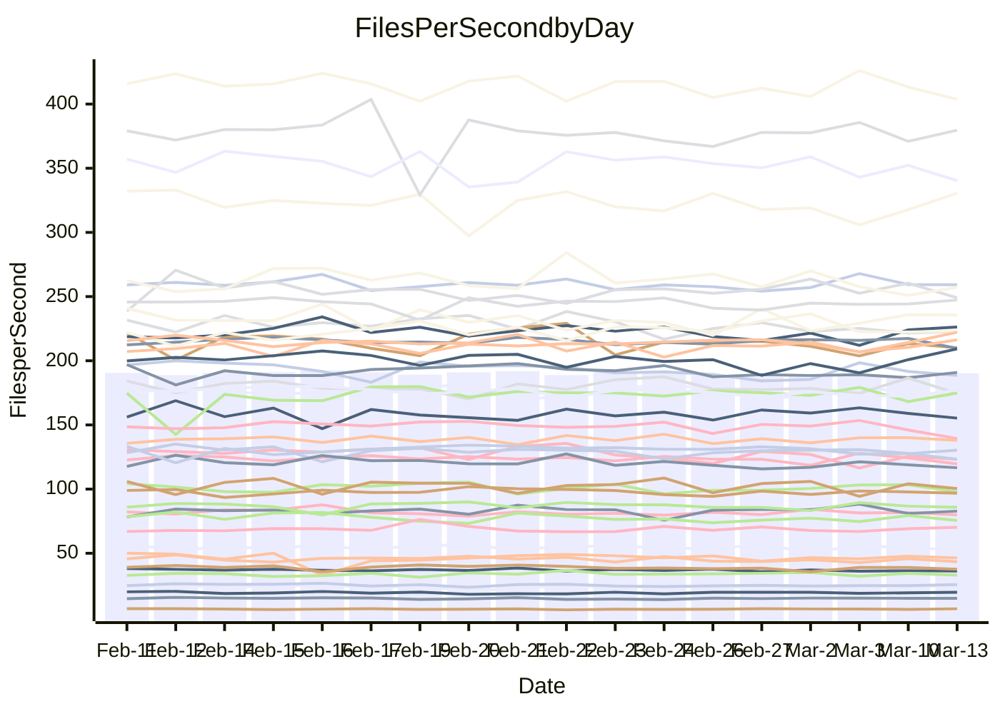

<!---
# This file is auto-generated. Do not edit.
# cspell:disable
--->
# Performance Report

Daily Performance

```mermaid
xychart-beta
    title Files Per Second by Day
    y-axis Files per Second
    x-axis Date [Feb-11, Feb-12, Feb-14, Feb-15, Feb-16, Feb-17, Feb-19, Feb-20, Feb-21, Feb-22, Feb-23, Feb-24, Feb-26, Feb-27, Mar-2, Mar-3, Mar-10, Mar-13]
    bar [190.54, 188.86, 190.65, 191.15, 192.54, 190.97, 189.21, 190.95, 191.93, 188.84, 190.95, 190.14, 188.86, 187.47, 189.15, 187.99, 188.38, 190.31]
    line [14.61, 15.64, 15.09, 14.85, 15.30, 15.16, 14.06, 14.46, 15.41, 14.08, 14.28, 13.96, 14.98, 14.69, 15.09, 15.05, 14.93, 14.94]
    line [50.07, 49.29, 45.43, 50.01, 33.04, 44.04, 44.67, 46.36, 48.18, 49.05, 48.06, 46.41, 47.91, 43.77, 46.60, 45.68, 47.70, 46.39]
    line [231.61, 222.35, 235.22, 226.17, 229.70, 226.87, 232.74, 235.31, 224.47, 238.32, 230.44, 216.76, 225.02, 229.69, 222.82, 225.14, 221.56, 222.76]
    line [104.26, 101.58, 98.06, 97.55, 103.52, 102.20, 104.64, 105.41, 96.15, 100.38, 103.85, 96.33, 99.09, 99.19, 100.48, 103.18, 103.33, 97.83]
    line [221.76, 200.54, 218.78, 219.30, 216.79, 209.78, 203.99, 220.72, 225.56, 229.20, 204.56, 214.62, 214.22, 215.21, 211.23, 203.79, 213.30, 210.08]
    line [259.10, 261.07, 258.76, 261.47, 267.24, 254.70, 257.67, 260.94, 258.83, 263.71, 255.40, 259.16, 257.65, 254.22, 257.02, 267.92, 259.39, 259.20]
    line [82.18, 80.51, 83.91, 83.57, 87.71, 81.51, 80.83, 78.91, 82.42, 80.37, 81.15, 79.72, 81.93, 80.10, 84.29, 81.35, 81.66, 80.01]
    line [38.10, 37.49, 36.82, 37.56, 36.77, 36.33, 37.40, 36.62, 38.51, 36.10, 37.37, 36.52, 37.66, 35.60, 37.02, 36.08, 36.38, 36.21]
    line [332.16, 332.97, 319.43, 324.88, 322.69, 320.99, 329.84, 297.30, 325.03, 331.76, 320.00, 316.72, 330.45, 317.84, 319.02, 305.87, 317.67, 330.58]
    line [175.80, 180.86, 176.28, 173.64, 175.63, 176.43, 178.51, 182.28, 170.09, 171.99, 177.77, 181.65, 177.93, 171.71, 171.61, 178.31, 176.56, 170.68]
    line [78.33, 84.47, 83.13, 83.66, 80.84, 83.02, 84.44, 80.37, 87.47, 84.08, 83.91, 75.76, 83.59, 84.08, 83.89, 88.30, 81.02, 82.82]
    line [135.67, 138.79, 139.27, 140.69, 136.31, 141.26, 136.95, 140.26, 134.61, 141.79, 137.76, 142.75, 135.42, 139.26, 136.06, 139.99, 140.01, 137.94]
    line [238.72, 270.54, 256.71, 261.76, 251.74, 255.44, 255.70, 246.95, 250.90, 244.70, 255.35, 256.03, 252.54, 255.82, 263.63, 252.65, 260.43, 248.99]
    line [85.89, 88.80, 88.35, 86.20, 79.88, 88.50, 88.86, 89.95, 85.47, 89.64, 87.93, 87.72, 85.68, 85.69, 83.26, 89.40, 86.73, 85.82]
    line [6.86, 6.86, 6.52, 6.16, 6.48, 6.78, 6.24, 6.45, 6.67, 5.92, 6.38, 6.30, 6.44, 6.78, 6.62, 6.55, 6.32, 6.74]
    line [196.64, 199.99, 198.18, 196.78, 191.66, 183.24, 198.97, 195.69, 196.29, 194.82, 190.50, 191.36, 189.34, 184.31, 185.47, 198.42, 191.68, 188.59]
    line [130.68, 129.17, 127.78, 130.44, 128.86, 131.22, 132.26, 123.16, 133.27, 135.57, 126.55, 124.20, 119.96, 129.35, 126.96, 116.50, 125.61, 123.25]
    line [218.83, 217.74, 220.20, 225.26, 234.21, 221.97, 226.10, 219.20, 223.30, 227.37, 223.02, 226.36, 218.81, 215.75, 221.50, 212.02, 224.11, 226.33]
    line [240.89, 231.65, 231.34, 231.21, 244.19, 223.55, 239.70, 229.90, 235.21, 223.87, 231.37, 229.84, 219.75, 240.64, 223.28, 229.19, 235.85, 235.66]
    line [23.32, 24.52, 23.95, 23.93, 26.14, 23.05, 24.64, 20.92, 22.32, 25.16, 23.04, 24.66, 23.19, 24.07, 21.50, 23.56, 24.56, 24.07]
    line [212.34, 214.45, 216.77, 218.28, 216.31, 214.05, 214.67, 213.49, 218.19, 216.61, 212.54, 214.33, 212.86, 215.99, 216.40, 215.81, 217.40, 209.57]
    line [207.17, 209.51, 213.52, 203.34, 215.88, 213.12, 205.73, 212.95, 211.55, 213.31, 213.15, 214.61, 215.98, 216.39, 213.20, 207.00, 210.46, 216.26]
    line [245.77, 245.71, 246.33, 249.20, 246.02, 244.24, 231.62, 249.13, 242.45, 246.48, 246.10, 248.98, 240.98, 239.52, 244.96, 243.99, 244.22, 247.37]
    line [32.76, 34.39, 34.12, 31.87, 32.51, 34.43, 31.35, 34.71, 33.66, 36.75, 33.50, 33.75, 33.98, 34.43, 34.99, 32.10, 34.36, 33.02]
    line [39.06, 40.44, 38.93, 40.19, 35.66, 39.21, 40.89, 39.79, 40.82, 39.75, 38.29, 38.55, 38.02, 38.35, 35.65, 38.90, 38.99, 37.57]
    line [24.73, 26.32, 25.72, 25.93, 26.65, 24.45, 25.52, 23.53, 25.65, 25.87, 24.49, 24.03, 24.62, 25.06, 24.45, 24.76, 24.74, 25.59]
    line [122.70, 126.21, 125.01, 121.92, 124.63, 126.05, 123.51, 125.30, 123.36, 124.67, 122.06, 125.40, 123.31, 123.27, 118.58, 127.90, 124.38, 119.61]
    line [156.17, 168.86, 156.43, 163.15, 147.05, 161.97, 157.72, 155.61, 153.59, 162.30, 157.06, 159.96, 153.79, 161.66, 159.28, 163.36, 159.01, 155.30]
    line [221.89, 211.43, 221.91, 216.06, 220.67, 225.17, 231.02, 220.24, 226.17, 215.58, 226.36, 225.70, 222.46, 230.96, 236.51, 222.64, 222.38, 223.28]
    line [56.27, 53.18, 53.98, 54.67, 55.62, 52.95, 56.33, 56.16, 52.87, 55.45, 55.44, 54.09, 53.55, 56.91, 50.34, 56.33, 53.77, 53.21]
    line [196.97, 181.19, 192.15, 188.44, 188.43, 193.17, 194.32, 195.93, 197.80, 193.32, 192.22, 196.28, 187.50, 189.10, 188.54, 189.19, 186.81, 190.89]
    line [45.64, 48.81, 44.68, 43.13, 46.03, 46.35, 45.95, 47.66, 45.50, 46.89, 43.13, 47.48, 43.86, 43.58, 44.95, 42.68, 45.79, 43.39]
    line [379.16, 371.95, 380.17, 380.03, 383.65, 403.62, 329.33, 387.65, 379.15, 375.70, 377.89, 371.33, 366.95, 377.92, 377.66, 385.69, 370.91, 379.64]
    line [78.44, 82.16, 76.45, 81.35, 81.75, 78.06, 74.92, 73.32, 81.29, 78.95, 76.37, 76.80, 73.75, 75.77, 77.40, 74.68, 79.36, 75.53]
    line [98.95, 99.68, 93.47, 96.18, 99.12, 97.35, 97.51, 101.87, 100.27, 99.76, 98.90, 95.69, 94.30, 98.50, 95.82, 98.55, 97.82, 96.78]
    line [128.37, 135.10, 130.41, 132.90, 121.26, 129.83, 131.86, 128.62, 131.04, 130.26, 129.44, 123.58, 128.31, 129.87, 130.27, 130.71, 127.81, 123.28]
    line [66.96, 67.81, 67.54, 69.24, 69.14, 67.84, 76.41, 70.89, 67.31, 66.82, 66.94, 70.88, 67.89, 70.56, 67.78, 66.98, 69.18, 70.20]
    line [19.96, 20.29, 18.59, 19.07, 20.25, 18.95, 19.76, 18.01, 18.46, 18.38, 19.68, 18.34, 19.60, 19.60, 19.63, 18.78, 19.22, 19.62]
    line [415.79, 423.61, 413.93, 415.75, 423.97, 415.82, 402.21, 417.90, 421.85, 402.15, 417.55, 417.69, 405.05, 412.32, 405.86, 426.09, 413.29, 403.69]
    line [357.06, 346.78, 363.25, 359.22, 355.34, 343.44, 363.00, 335.36, 339.22, 362.80, 356.26, 358.85, 353.61, 350.32, 358.90, 343.06, 352.21, 340.37]
    line [117.66, 126.41, 120.64, 118.92, 126.15, 122.12, 122.32, 119.71, 119.61, 127.43, 118.55, 121.57, 118.53, 115.70, 116.93, 121.24, 118.95, 116.63]
    line [215.55, 219.85, 215.87, 211.04, 214.14, 215.28, 213.09, 213.97, 220.46, 207.58, 214.51, 202.85, 211.79, 211.44, 214.66, 206.78, 214.22, 222.18]
    line [184.20, 174.99, 182.26, 184.13, 178.63, 177.91, 178.13, 170.26, 181.98, 177.56, 185.31, 187.50, 177.93, 177.54, 178.41, 174.58, 186.65, 174.46]
    line [174.76, 142.58, 173.78, 169.32, 168.80, 179.63, 179.91, 171.61, 176.10, 175.03, 175.02, 172.48, 176.50, 175.06, 173.05, 179.29, 168.17, 174.80]
    line [105.95, 95.68, 105.24, 108.38, 96.07, 105.42, 104.57, 104.52, 96.66, 102.79, 103.56, 108.60, 97.11, 104.32, 106.04, 94.30, 104.19, 100.46]
    line [133.33, 120.48, 131.69, 126.77, 128.95, 131.05, 132.77, 134.30, 133.46, 131.83, 132.27, 131.01, 131.00, 133.00, 131.45, 127.22, 127.60, 130.36]
    line [148.59, 146.97, 147.88, 152.57, 150.80, 149.13, 152.26, 152.78, 149.55, 148.15, 148.90, 152.11, 143.30, 150.41, 149.07, 153.47, 146.06, 139.44]
    line [199.89, 202.61, 200.63, 203.97, 207.62, 204.11, 196.35, 204.19, 205.00, 194.87, 203.28, 199.45, 200.84, 188.59, 197.81, 190.62, 200.86, 209.26]
    line [262.38, 253.84, 256.03, 271.88, 272.11, 262.81, 268.41, 258.56, 256.27, 284.25, 260.54, 263.62, 267.57, 257.62, 270.01, 257.62, 250.97, 257.32]
    line [176.92, 176.20, 178.74, 179.75, 180.11, 177.55, 173.68, 176.25, 178.32, 171.39, 176.96, 177.51, 175.27, 171.69, 175.82, 173.02, 172.27, 177.14]
```

Time to Process Files

| Repository                                      | Elapsed | Min/Avg/Max           |   SD | SD Graph                |
| ----------------------------------------------- | ------: | :-------------------: | ---: | ----------------------- |
| AdaDoom3/AdaDoom3                    |    2.80 | 2.7 /   2.8 /   3.0   | 0.08 | `    ┣━━┻━━●━━┻━━┫    ` |
| alexiosc/megistos                    |    7.20 | 6.6 /   7.1 /   8.1   | 0.32 | `    ┣━━┻━━╋●━┻━━┫    ` |
| apollographql/apollo-server          |    2.65 | 2.4 /   2.5 /   2.9   | 0.12 | `    ┣━━┻━━╋━━●━━┫    ` |
| aspnetboilerplate/aspnetboilerplate  |    8.76 | 8.5 /   8.9 /   9.2   | 0.18 | `    ┣━━┻●━╋━━┻━━┫    ` |
| aws-amplify/docs                     |   11.76 | 11.4 /  11.7 /  12.4  | 0.22 | `    ┣━━┻━━●━━┻━━┫    ` |
| Azure/azure-rest-api-specs           |    8.89 | 8.6 /   9.4 /  10.4   | 0.41 | `    ┣━●┻━━╋━━┻━━┫    ` |
| bitjson/typescript-starter           |    1.01 | 0.9 /   1.0 /   1.2   | 0.05 | `     ┣━┻━●╋━━┻━┫     ` |
| caddyserver/caddy                    |    3.65 | 3.2 /   3.4 /   3.7   | 0.12 | `    ┣━━┻━━╋━━┻━━●    ` |
| canada-ca/open-source-logiciel-libre |    1.07 | 1.0 /   1.1 /   1.2   | 0.06 | `     ┣━┻━●╋━━┻━┫     ` |
| chef/chef                            |    5.26 | 5.1 /   5.4 /   5.7   | 0.16 | `    ┣━━●━━╋━━┻━━┫    ` |
| dart-lang/sdk                        |   52.61 | 52.9 /  54.8 /  60.9  | 1.42 | `  ┣━●━┻━━━╋━━━┻━━━┫  ` |
| django/django                        |   14.76 | 12.9 /  13.4 /  14.7  | 0.34 | `     ┣━┻━━╋━━┻━┫    ●` |
| eslint/eslint                        |    9.30 | 9.1 /   9.6 /  10.4   | 0.27 | `    ┣━●┻━━╋━━┻━━┫    ` |
| exonum/exonum                        |    3.57 | 3.3 /   3.4 /   3.7   | 0.10 | `    ┣━━┻━━╋━━┻━●┫    ` |
| flutter/samples                      |   14.43 | 13.9 /  14.7 /  17.4  | 0.71 | `   ┣━━━┻━●╋━━┻━━━┫   ` |
| gitbucket/gitbucket                  |    3.31 | 3.0 /   3.2 /   3.7   | 0.14 | `    ┣━━┻━━╋━●┻━━┫    ` |
| googleapis/google-cloud-cpp          |  118.12 | 112.8 / 118.0 / 124.4 | 2.86 | `  ┣━━━┻━━━●━━━┻━━━┫  ` |
| graphql/express-graphql              |    1.08 | 1.0 /   1.1 /   1.2   | 0.06 | `     ┣━┻━●╋━━┻━┫     ` |
| graphql/graphql-js                   |    2.84 | 2.5 /   2.7 /   2.9   | 0.08 | `    ┣━━┻━━╋━━┻━━●    ` |
| graphql/graphql-relay-js             |    1.07 | 1.0 /   1.1 /   1.3   | 0.06 | `     ┣━┻●━╋━━┻━┫     ` |
| graphql/graphql-spec                 |    1.34 | 1.2 /   1.3 /   1.5   | 0.06 | `     ┣━┻━━╋━●┻━┫     ` |
| iluwatar/java-design-patterns        |   12.21 | 10.9 /  11.6 /  12.3  | 0.32 | `    ┣━━┻━━╋━━┻━━●    ` |
| ktaranov/sqlserver-kit               |    6.15 | 5.5 /   5.9 /   6.9   | 0.29 | `    ┣━━┻━━╋━●┻━━┫    ` |
| liriliri/licia                       |    3.77 | 3.4 /   3.8 /   4.4   | 0.15 | `    ┣━━┻━●╋━━┻━━┫    ` |
| MartinThoma/LaTeX-examples           |    6.28 | 5.8 /   6.2 /   7.0   | 0.23 | `    ┣━━┻━━╋●━┻━━┫    ` |
| mdx-js/mdx                           |    1.76 | 1.7 /   1.8 /   2.1   | 0.10 | `    ┣━━┻●━╋━━┻━━┫    ` |
| microsoft/TypeScript-Website         |    5.19 | 4.9 /   5.1 /   5.7   | 0.21 | `    ┣━━┻━━╋●━┻━━┫    ` |
| MicrosoftDocs/PowerShell-Docs        |   20.72 | 19.6 /  20.3 /  22.0  | 0.57 | `   ┣━━━┻━━╋━━●━━━┫   ` |
| neovim/nvim-lspconfig                |    4.15 | 3.8 /   4.0 /   4.6   | 0.16 | `    ┣━━┻━━╋━━●━━┫    ` |
| pagekit/pagekit                      |    3.54 | 3.2 /   3.5 /   4.7   | 0.23 | `    ┣━━┻━━╋●━┻━━┫    ` |
| php/php-src                          |   23.66 | 22.3 /  23.4 /  28.7  | 0.99 | `   ┣━━┻━━━╋●━━┻━━┫   ` |
| plasticrake/tplink-smarthome-api     |    1.32 | 1.2 /   1.3 /   1.9   | 0.11 | `    ┣━━┻━━●━━┻━━┫    ` |
| prettier/prettier                    |    7.98 | 7.2 /   7.5 /   8.1   | 0.20 | `    ┣━━┻━━╋━━┻━━┫●   ` |
| pycontribs/jira                      |    1.56 | 1.3 /   1.5 /   1.7   | 0.08 | `     ┣━┻━━╋━━┻●┫     ` |
| RustPython/RustPython                |    6.55 | 5.9 /   6.3 /   6.9   | 0.22 | `    ┣━━┻━━╋━━●━━┫    ` |
| shoelace-style/shoelace              |    2.93 | 2.6 /   2.8 /   3.1   | 0.11 | `    ┣━━┻━━╋━━┻●━┫    ` |
| slint-ui/slint                       |   13.03 | 12.7 /  13.2 /  14.1  | 0.34 | `   ┣━━━┻━●╋━━┻━━━┫   ` |
| SoftwareBrothers/admin-bro           |    2.47 | 2.3 /   2.4 /   2.6   | 0.09 | `    ┣━━┻━━╋●━┻━━┫    ` |
| sveltejs/svelte                      |   20.65 | 19.8 /  20.5 /  22.1  | 0.56 | `   ┣━━━┻━━╋●━┻━━━┫   ` |
| TheAlgorithms/Python                 |    5.81 | 5.2 /   5.5 /   6.4   | 0.23 | `    ┣━━┻━━╋━━┻●━┫    ` |
| twbs/bootstrap                       |    1.66 | 1.5 /   1.7 /   2.0   | 0.08 | `    ┣━━●━━╋━━┻━━┫    ` |
| typescript-cheatsheets/react         |    1.49 | 1.2 /   1.4 /   1.6   | 0.08 | `     ┣━┻━━╋━━┻●┫     ` |
| typescript-eslint/typescript-eslint  |    3.98 | 3.8 /   4.1 /   4.5   | 0.16 | `    ┣━━┻●━╋━━┻━━┫    ` |
| vitest-dev/vitest                    |   10.91 | 9.9 /  10.9 /  11.8   | 0.43 | `   ┣━━━┻━━●━━┻━━━┫   ` |
| w3c/aria-practices                   |    3.47 | 3.1 /   3.3 /   4.1   | 0.19 | `    ┣━━┻━━╋━━●━━┫    ` |
| w3c/specberus                        |    1.88 | 1.8 /   1.9 /   2.3   | 0.10 | `    ┣━━┻━●╋━━┻━━┫    ` |
| webdeveric/webpack-assets-manifest   |    1.34 | 1.1 /   1.2 /   1.4   | 0.08 | `     ┣━┻━━╋━━┻●┫     ` |
| webpack/webpack                      |    5.11 | 4.8 /   5.1 /   5.6   | 0.20 | `    ┣━━┻━━●━━┻━━┫    ` |
| wireapp/wire-desktop                 |    1.29 | 1.2 /   1.3 /   1.5   | 0.07 | `     ┣━┻━●╋━━┻━┫     ` |
| wireapp/wire-webapp                  |   11.07 | 10.5 /  10.9 /  12.1  | 0.37 | `    ┣━━┻━━╋●━┻━━┫    ` |

Note:
- Elapsed time is in seconds.

Files per Second over Time

| Repository                                      | Files |    Sec |    Fps |    Rel | Trend Fps              |    N |
| ----------------------------------------------- | ----: | -----: | -----: | -----: | ---------------------- | ---: |
| AdaDoom3/AdaDoom3                    |   103 |   2.80 |  36.81 | -0.55% | `█▆▆▆██▇▇▄▆▇▆█▆▆▆▅▅▅▆` |   44 |
| alexiosc/megistos                    |   583 |   7.20 |  80.95 | -1.09% | `▅▄▇▆▇█▅▅▇█▆▆▆█▇▇▇▃▅▆` |   44 |
| apollographql/apollo-server          |   254 |   2.65 |  95.79 | -5.39% | `▇█▃▆█▆▆▅▇▇▆▇▇█▇▇▇▇▆▅` |   44 |
| aspnetboilerplate/aspnetboilerplate  |  2286 |   8.76 | 260.89 |  0.97% | `▆▇▇█▅▆▇▆▆▇▆█▇▅█▆▆▇▆▇` |   44 |
| aws-amplify/docs                     |  2874 |  11.76 | 244.41 | -0.17% | `███▆▇▆▇▇▅▇█▇███▆▆▇█▇` |   44 |
| Azure/azure-rest-api-specs           |  2441 |   8.89 | 274.51 |  5.30% | `▆▆▇▇▇██▅███▆▃▆█▅▄▅▄█` |   44 |
| bitjson/typescript-starter           |    20 |   1.01 |  19.75 |  2.43% | `█▆▅▆▆█▇▇▇▇▇▆▆█▅▆▆▇▇▇` |   44 |
| caddyserver/caddy                    |   301 |   3.65 |  82.36 | -5.31% | `█▆█▇▇▅▄▅▇▆▄▇▆▆▇█▆▅▇▅` |   44 |
| canada-ca/open-source-logiciel-libre |     7 |   1.07 |   6.55 |  0.93% | `▇▃█▃▇▆▇▇▇▆▇▆▇▅▄▃▇▆█▆` |   44 |
| chef/chef                            |  1200 |   5.26 | 228.14 |  2.74% | `█▇▆▅▆▆▄▄▅▇▄▄▅▅▇▆▆▇▆▇` |   44 |
| dart-lang/sdk                        | 11085 |  52.61 | 210.68 |  4.88% | `▇▆▆▇▆▇▆▃▆▇▆▅▆▇▇▆▇▇██` |   44 |
| django/django                        |  2897 |  14.76 | 196.23 | -8.82% | `▇▆▇▆▇▆▇▆▇▇▇▇█▇█▇▇▇█▄` |   44 |
| eslint/eslint                        |  2049 |   9.30 | 220.22 |  2.98% | `▆▄▅▅▅▇▇▆▆▇▆▅▇▅▆▇▆██▇` |   44 |
| exonum/exonum                        |   421 |   3.57 | 117.93 | -4.53% | `▅█▇▅█▇▇▇▆▆▄█▇▇▇▇▇▇▆▅` |   44 |
| flutter/samples                      |  2562 |  14.43 | 177.60 |  2.62% | `█▆▇██▇▇█▇▇▇██▄█▃█▇▇█` |   44 |
| gitbucket/gitbucket                  |   415 |   3.31 | 125.19 | -2.96% | `▇▅▆▇█▄▇▆▇▇▇▇▃▇▇█▇▇▅▆` |   44 |
| googleapis/google-cloud-cpp          | 20794 | 118.12 | 176.04 | -0.01% | `██▇▆▆██▆▆█▇▆▇▇▅▇▆▅█▇` |   44 |
| graphql/express-graphql              |    26 |   1.08 |  24.17 |  2.43% | `▄▆▇▆▅▄▅▅▇▄▃▅█▆▇▆▅▆▆▆` |   44 |
| graphql/graphql-js                   |   371 |   2.84 | 130.68 | -5.68% | `▆█▇▇▃▆▆▇▆▅▇▇▇▇▆▇█▆█▅` |   44 |
| graphql/graphql-relay-js             |    28 |   1.07 |  26.17 |  4.98% | `▅█▃▇▇▆▄▆▇▆▅▆▇▄▆▄▇▇▆▇` |   44 |
| graphql/graphql-spec                 |    19 |   1.34 |  14.19 | -4.00% | `▆▅▅▇▇▇▇▆▆▆█▇▇▆▇▇▇▇█▆` |   44 |
| iluwatar/java-design-patterns        |  2060 |  12.21 | 168.75 | -4.27% | `▆▅█▇▆▅▅▅▅▅▄▆▅▇▄▆▆▅▅▄` |   44 |
| ktaranov/sqlserver-kit               |   490 |   6.15 |  79.68 | -3.77% | `█▄▅▇▇▆▆▇▆▇▆█▆▄▆▅▇▆▇▅` |   44 |
| liriliri/licia                       |  1437 |   3.77 | 381.62 |  1.36% | `▇▇▆▅▇▆▆▇█▇▇██▅▇▇▅█▇▇` |   44 |
| MartinThoma/LaTeX-examples           |  1409 |   6.28 | 224.24 | -1.41% | `▆▆▅▇▇█▅▇█▆▇▇▃▅▆██▆▆▇` |   44 |
| mdx-js/mdx                           |   141 |   1.76 |  80.22 |  3.77% | `██▅▅▄▇▆▇▅▆█▆▇█▇▇█▇▄█` |   44 |
| microsoft/TypeScript-Website         |   756 |   5.19 | 145.78 | -1.64% | `▇█▇▆▄▄█▆█▇▇█▅▆██▃▇▃▆` |   44 |
| MicrosoftDocs/PowerShell-Docs        |  2648 |  20.72 | 127.78 | -2.33% | `▇▇▇▇█▇▆█▇█▆▆▄▆▇▇▇▅█▆` |   44 |
| neovim/nvim-lspconfig                |   772 |   4.15 | 185.85 | -3.34% | `▆▆█▇█▇▄▇▅▅▇█▃▇████▇▆` |   44 |
| pagekit/pagekit                      |   741 |   3.54 | 209.57 | -1.80% | `██▆▇▇█▆▇▇▆▇▆▇▆█▇▇▆▇▇` |   44 |
| php/php-src                          |  2274 |  23.66 |  96.12 | -1.36% | `█▇▇▆█▆▇██▆███▇███▇▇▇` |   44 |
| plasticrake/tplink-smarthome-api     |    62 |   1.32 |  47.00 |  0.08% | `▇▇▆▆▇▇▆▅▆▅█▆█▅▇▇▇▆▆▆` |   44 |
| prettier/prettier                    |  2665 |   7.98 | 333.77 | -5.71% | `█▇█▇▆█▇▆██▇▆▆▇▆▇█▇▆▅` |   44 |
| pycontribs/jira                      |    79 |   1.56 |  50.53 | -7.28% | `█▆▇▇▅▆▇▇█▃▇▇▆▅▇▇▅█▇▅` |   44 |
| RustPython/RustPython                |   762 |   6.55 | 116.30 | -2.75% | `▅█▇█▄▇▆▄▇▅▇▇▆▆█▆▇▅▆▆` |   44 |
| shoelace-style/shoelace              |   440 |   2.93 | 150.10 | -5.04% | `▆▇▇▄▇▇▄▇▇█▅▇▇▆▇▆▅█▇▅` |   44 |
| slint-ui/slint                       |  2813 |  13.03 | 215.84 |  1.76% | `▇▇▇▇▆██▇▇▇▆▆▆█▆▆▅▇▇▇` |   44 |
| SoftwareBrothers/admin-bro           |   441 |   2.47 | 178.77 | -1.61% | `▆▆█▄▄▆▆▅▆▄▆▅▇▇█▆▆▆▄▅` |   44 |
| sveltejs/svelte                      |  8554 |  20.65 | 414.24 |  0.08% | `█▇▇▆▅▆▇▆▇▅▇█▅▇▄█▇█▅▇` |   44 |
| TheAlgorithms/Python                 |  1406 |   5.81 | 242.04 | -5.12% | `▆▆█▇▇▆▆▆▇█▇▆▇█▇█▇▇▇▅` |   44 |
| twbs/bootstrap                       |   118 |   1.66 |  71.27 |  4.27% | `▇█▇▅▆▆▇▇▇▆▆▆▇▇▇▇▆▆▇▇` |   44 |
| typescript-cheatsheets/react         |    53 |   1.49 |  35.54 | -8.33% | `▅▅█▅▇▅▇█▅▅▄▇█▇▅▇▇▇▇▅` |   44 |
| typescript-eslint/typescript-eslint  |  1307 |   3.98 | 328.71 |  2.11% | `▇▅▇▇▆█▇▆▆▅▇▅▆▄▇▇▃▇▇▇` |   44 |
| vitest-dev/vitest                    |  2564 |  10.91 | 235.03 |  1.43% | `▇▆▅▅▄▃▄▆█▅▄▅██▅▅▅▆▆▆` |   44 |
| w3c/aria-practices                   |   414 |   3.47 | 119.32 | -6.13% | `█▇▆▇█▇▂▇██▇▅█▆▇▄██▇▆` |   44 |
| w3c/specberus                        |   197 |   1.88 | 104.94 |  1.85% | `███▇▆▂▅▆▇▆█▅▇▅▇▇█▇▅▇` |   44 |
| webdeveric/webpack-assets-manifest   |    55 |   1.34 |  41.06 | -8.60% | `▃▇▆▅▆▆▂▅▅▆▅▄▆▃█▆▆▆▆▄` |   44 |
| webpack/webpack                      |  1145 |   5.11 | 224.25 |  0.14% | `▇▇▆▅▇▇▅▇▇██▆█▅▇▇▄▄▆▆` |   44 |
| wireapp/wire-desktop                 |    44 |   1.29 |  34.09 |  1.03% | `▅▆█▃▅▆▆▆▆▅█▄▇▃▇▆▆▆▄▆` |   43 |
| wireapp/wire-webapp                  |  2112 |  11.07 | 190.72 | -0.20% | `▇▇█▇▇▇▄▆▇▇▆▆▆▇▅▇▆▆▇▇` |   44 |

Data Throughput

| Repository                                      | Files |    Sec |     Kps |    Rel | Trend Kps              |    N |
| ----------------------------------------------- | ----: | -----: | ------: | -----: | ---------------------- | ---: |
| AdaDoom3/AdaDoom3                    |   103 |   2.80 |  782.28 | -0.55% | `█▆▆▆██▇▇▄▆▇▆█▆▆▆▅▅▅▆` |   44 |
| alexiosc/megistos                    |   583 |   7.20 |  636.08 | -1.09% | `▅▄▇▆▇█▅▅▇█▆▆▆█▇▇▇▃▅▆` |   44 |
| apollographql/apollo-server          |   254 |   2.65 |  787.04 | -5.39% | `▇█▃▆█▆▆▅▇▇▆▇▇█▇▇▇▇▆▅` |   44 |
| aspnetboilerplate/aspnetboilerplate  |  2286 |   8.76 |  634.77 |  0.97% | `▆▇▇█▅▆▇▆▆▇▆█▇▅█▆▆▇▆▇` |   44 |
| aws-amplify/docs                     |  2874 |  11.76 |  854.60 | -0.17% | `███▆▇▆▇▇▅▇█▇███▆▆▇█▇` |   44 |
| Azure/azure-rest-api-specs           |  2441 |   8.89 |  803.18 | 15.05% | `▄▄▅▄▄▅▅▃▅▅▅▄▄▆█▆▅▆▅█` |   44 |
| bitjson/typescript-starter           |    20 |   1.01 |   79.00 |  2.43% | `█▆▅▆▆█▇▇▇▇▇▆▆█▅▆▆▇▇▇` |   44 |
| caddyserver/caddy                    |   301 |   3.65 |  733.01 | -4.10% | `█▆█▇▇▅▅▅▇▆▄▇▇▇██▇▅█▅` |   44 |
| canada-ca/open-source-logiciel-libre |     7 |   1.07 |   54.25 |  0.93% | `▇▃█▃▇▆▇▇▇▆▇▆▇▅▄▃▇▆█▆` |   44 |
| chef/chef                            |  1200 |   5.26 | 1070.92 |  2.76% | `█▇▆▅▆▆▄▄▅▇▄▄▅▅▇▆▆▇▆▇` |   44 |
| dart-lang/sdk                        | 11085 |  52.61 | 1427.75 |  4.54% | `▇▆▆▇▆▇▇▃▆▇▆▅▆▇▇▆▇▇██` |   44 |
| django/django                        |  2897 |  14.76 | 1241.61 | -8.71% | `▇▆▇▆▇▆▇▆▇▇▇▇█▇█▇▇▇█▄` |   44 |
| eslint/eslint                        |  2049 |   9.30 | 1529.62 |  3.04% | `▆▄▅▅▅▇▇▆▆▇▆▅▇▅▆▇▆██▇` |   44 |
| exonum/exonum                        |   421 |   3.57 | 1128.02 | -4.53% | `▅█▇▅█▇▇▇▆▆▄█▇▇▇▇▇▇▆▅` |   44 |
| flutter/samples                      |  2562 |  14.43 | 1499.54 |  1.92% | `█▆▇██▇▇█▇▇▇█▇▄█▃█▇▇█` |   44 |
| gitbucket/gitbucket                  |   415 |   3.31 |  578.28 | -2.10% | `▇▄▆▇█▃▇▆▇▇▇▇▃▇██▇▇▅▆` |   44 |
| googleapis/google-cloud-cpp          | 20794 | 118.12 | 1489.09 |  2.17% | `▇█▇▆▆▇█▆▆█▇▇▇▇▅▇▇▆██` |   44 |
| graphql/express-graphql              |    26 |   1.08 |  110.61 |  2.43% | `▄▆▇▆▅▄▅▅▇▄▃▅█▆▇▆▅▆▆▆` |   44 |
| graphql/graphql-js                   |   371 |   2.84 |  765.78 | -5.12% | `▆▇▇▇▃▆▆▇▆▅▇▇▇▇▆▇█▆█▅` |   44 |
| graphql/graphql-relay-js             |    28 |   1.07 |  102.80 |  4.98% | `▅█▃▇▇▆▄▆▇▆▅▆▇▄▆▄▇▇▆▇` |   44 |
| graphql/graphql-spec                 |    19 |   1.34 |  473.66 | -4.00% | `▆▅▅▇▇▇▇▆▆▆█▇▇▆▇▇▇▇█▆` |   44 |
| iluwatar/java-design-patterns        |  2060 |  12.21 |  520.10 | -4.42% | `▆▅█▇▆▅▅▅▅▅▄▆▅▇▄▆▆▅▅▄` |   44 |
| ktaranov/sqlserver-kit               |   490 |   6.15 | 1204.53 | -3.77% | `█▄▅▇▇▆▆▇▆▇▆█▆▄▆▅▇▆▇▅` |   44 |
| liriliri/licia                       |  1437 |   3.77 |  454.65 |  1.36% | `▇▇▆▅▇▆▆▇█▇▇██▅▇▇▅█▇▇` |   44 |
| MartinThoma/LaTeX-examples           |  1409 |   6.28 |  463.11 | -1.41% | `▆▆▅▇▇█▅▇█▆▇▇▃▅▆██▆▆▇` |   44 |
| mdx-js/mdx                           |   141 |   1.76 |  372.64 |  3.77% | `██▅▅▄▇▆▇▅▆█▆▇█▇▇█▇▄█` |   44 |
| microsoft/TypeScript-Website         |   756 |   5.19 | 1006.99 | -2.06% | `██▇▆▄▅█▆█▇▇█▅▆█▇▃▇▃▆` |   44 |
| MicrosoftDocs/PowerShell-Docs        |  2648 |  20.72 | 1336.35 | -2.31% | `▇▇▇▇█▇▆█▇█▆▆▄▆▇▇▇▅█▆` |   44 |
| neovim/nvim-lspconfig                |   772 |   4.15 |  354.37 | -2.98% | `▆▆▇▇█▇▄▇▅▅▇█▃▇████▇▆` |   44 |
| pagekit/pagekit                      |   741 |   3.54 |  436.97 | -1.80% | `██▆▇▇█▆▇▇▆▇▆▇▆█▇▇▆▇▇` |   44 |
| php/php-src                          |  2274 |  23.66 | 1676.01 | -1.22% | `█▇▇▆█▆▇██▆███▇███▇█▇` |   44 |
| plasticrake/tplink-smarthome-api     |    62 |   1.32 |  253.93 |  0.08% | `▇▇▆▆▇▇▆▅▆▅█▆█▅▇▇▇▆▆▆` |   44 |
| prettier/prettier                    |  2665 |   7.98 |  459.01 | -5.74% | `█▇█▇▆█▇▆██▇▆▆▇▆▇█▇▆▅` |   44 |
| pycontribs/jira                      |    79 |   1.56 |  358.18 | -7.28% | `█▆▇▇▅▆▇▇█▃▇▇▆▅▇▇▅█▇▅` |   44 |
| RustPython/RustPython                |   762 |   6.55 | 1791.93 |  1.67% | `▄▇▅▇▃▆▅▄▅▅▆▇▇▆█▇▇▆▆▆` |   44 |
| shoelace-style/shoelace              |   440 |   2.93 |  724.21 | -5.10% | `▆▇▇▄▇▇▄▇▇█▅▇▇▆▇▆▅█▇▅` |   44 |
| slint-ui/slint                       |  2813 |  13.03 | 1347.66 |  2.11% | `▇▇▇▇▆██▇▇▇▇▆▆█▆▆▅██▇` |   44 |
| SoftwareBrothers/admin-bro           |   441 |   2.47 |  394.03 | -1.61% | `▆▆█▄▄▆▆▅▆▄▆▅▇▇█▆▆▆▄▅` |   44 |
| sveltejs/svelte                      |  8554 |  20.65 |  280.48 |  0.45% | `█▇▇▆▅▆▇▆▇▅▇█▅▇▄███▅▇` |   44 |
| TheAlgorithms/Python                 |  1406 |   5.81 |  618.18 | -4.87% | `▆▆█▇▇▆▆▆▇█▇▆▇█▇██▇▇▅` |   44 |
| twbs/bootstrap                       |   118 |   1.66 |  585.28 |  4.27% | `▇█▇▅▆▆▇▇▇▆▆▆▇▇▇▇▆▆▇▇` |   44 |
| typescript-cheatsheets/react         |    53 |   1.49 |  263.53 | -8.27% | `▅▅█▅▇▅▇█▅▅▄▇█▇▅▇▇▇▇▅` |   44 |
| typescript-eslint/typescript-eslint  |  1307 |   3.98 | 1736.62 |  2.25% | `▇▅▇▇▅█▇▆▆▅▇▅▆▄▇▇▃▇▇▇` |   44 |
| vitest-dev/vitest                    |  2564 |  10.91 |  714.34 |  1.98% | `▇▆▅▅▄▃▄▆█▅▄▅██▅▅▅▆▆▆` |   44 |
| w3c/aria-practices                   |   414 |   3.47 | 1114.52 | -6.13% | `█▇▆▇█▇▂▇██▇▅█▆▇▄██▇▆` |   44 |
| w3c/specberus                        |   197 |   1.88 |  347.85 |  4.38% | `███▇▆▂▅▆▇▆█▅▇▆▇██▇▅▇` |   44 |
| webdeveric/webpack-assets-manifest   |    55 |   1.34 |   94.06 | -8.60% | `▃▇▆▅▆▆▂▅▅▆▅▄▆▃█▆▆▆▆▄` |   44 |
| webpack/webpack                      |  1145 |   5.11 | 1051.51 |  0.50% | `▇▇▆▅▇▇▅▇▇██▆█▆▇▇▄▅▆▆` |   44 |
| wireapp/wire-desktop                 |    44 |   1.29 |  151.85 |  1.03% | `▅▆█▃▅▆▆▆▆▅█▄▇▃▇▆▆▆▄▆` |   43 |
| wireapp/wire-webapp                  |  2112 |  11.07 |  748.72 |  0.38% | `▇▇█▇▇▇▄▆▇▇▅▆▆▇▅▇▆▆▇▇` |   44 |

