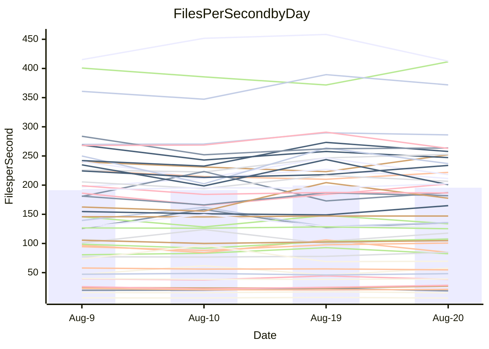

<!---
# This file is auto-generated. Do not edit.
# cspell:disable
--->
# Performance Report

Daily Performance

```mermaid
xychart-beta
    title Files Per Second by Day
    y-axis Files per Second
    x-axis Date [Aug-9, Aug-10, Aug-19, Aug-20]
    bar [191.27, 191.48, 199.45, 195.67]
    line [19.76, 19.87, 23.15, 18.80]
    line [94.45, 88.13, 97.66, 100.71]
    line [106.66, 99.38, 103.80, 117.71]
    line [80.61, 83.15, 92.81, 82.44]
    line [239.79, 231.09, 223.10, 252.00]
    line [269.81, 270.47, 289.77, 286.14]
    line [39.52, 37.52, 44.46, 38.46]
    line [268.54, 243.09, 257.77, 247.18]
    line [6.78, 6.60, 7.51, 6.38]
    line [240.17, 211.99, 227.00, 211.38]
    line [125.68, 158.27, 127.25, 135.61]
    line [225.24, 214.74, 210.02, 221.88]
    line [225.91, 222.58, 246.74, 252.74]
    line [145.75, 128.32, 148.05, 133.76]
    line [24.65, 23.72, 23.68, 26.94]
    line [139.45, 161.93, 128.87, 135.71]
    line [25.95, 22.03, 24.86, 28.29]
    line [154.75, 150.93, 149.02, 164.86]
    line [15.80, 15.53, 17.25, 15.28]
    line [196.97, 211.99, 246.59, 218.10]
    line [180.75, 223.35, 172.94, 187.16]
    line [96.93, 84.41, 106.12, 84.61]
    line [77.16, 76.75, 77.91, 84.91]
    line [400.74, 385.62, 371.65, 411.46]
    line [145.79, 145.58, 147.10, 147.08]
    line [249.96, 202.34, 263.67, 236.99]
    line [186.27, 165.43, 184.07, 202.12]
    line [224.37, 213.27, 217.89, 233.79]
    line [47.00, 61.84, 45.89, 57.63]
    line [127.47, 149.55, 129.16, 129.10]
    line [181.18, 166.12, 186.93, 181.85]
    line [57.90, 56.15, 56.35, 54.76]
    line [101.07, 123.80, 99.87, 108.06]
    line [98.84, 91.76, 103.43, 107.49]
    line [162.48, 155.40, 204.32, 177.59]
    line [360.76, 347.31, 389.41, 371.89]
    line [198.91, 184.05, 187.41, 186.67]
    line [242.10, 232.62, 273.32, 257.69]
    line [73.60, 96.61, 68.89, 69.48]
    line [415.14, 451.69, 458.22, 412.53]
    line [283.77, 252.09, 262.36, 263.68]
    line [22.84, 20.59, 20.47, 21.22]
    line [205.56, 193.98, 216.67, 206.61]
    line [126.64, 126.17, 128.45, 125.27]
    line [105.46, 100.11, 102.43, 104.89]
    line [47.26, 48.66, 46.00, 48.26]
    line [268.09, 268.70, 290.78, 262.94]
    line [234.76, 198.61, 243.75, 200.90]
    line [39.98, 38.63, 38.64, 39.11]
    line [192.03, 195.48, 194.87, 202.54]
```

Time to Process Files

| Repository                                      | Elapsed | Min/Avg/Max          |    SD | SD Graph                |
| ----------------------------------------------- | ------: | :------------------: | ----: | ----------------------- |
| AdaDoom3/AdaDoom3                    |    2.80 | 2.1 /   2.6 /   2.9  |  0.28 | `    ┣━━┻━━╋━●┻━━┫    ` |
| alexiosc/megistos                    |    6.92 | 5.5 /   7.0 /   7.9  |  0.52 | `    ┣━━┻━●╋━━┻━━┫    ` |
| apollographql/apollo-server          |    2.46 | 1.8 /   2.4 /   2.8  |  0.27 | `    ┣━━┻━━╋●━┻━━┫    ` |
| aspnetboilerplate/aspnetboilerplate  |    8.73 | 6.3 /   8.3 /   9.1  |  1.00 | `    ┣━━┻━━╋●━┻━━┫    ` |
| aws-amplify/docs                     |   13.18 | 9.6 /  12.8 /  14.0  |  1.19 | `    ┣━━┻━━╋●━┻━━┫    ` |
| Azure/azure-rest-api-specs           |   10.38 | 7.2 /  10.0 /  11.2  |  0.93 | `    ┣━━┻━━╋●━┻━━┫    ` |
| bitjson/typescript-starter           |    1.05 | 0.6 /   1.0 /   1.1  |  0.11 | `     ┣━┻━━╋●━┻━┫     ` |
| caddyserver/caddy                    |    2.53 | 2.8 /   3.5 /   3.9  |  0.31 | ` ●  ┣━━┻━━╋━━┻━━┫    ` |
| canada-ca/open-source-logiciel-libre |    1.13 | 0.8 /   1.0 /   1.3  |  0.13 | `     ┣━┻━━╋━●┻━┫     ` |
| chef/chef                            |    5.02 | 3.0 /   4.6 /   5.3  |  0.60 | `    ┣━━┻━━╋━●┻━━┫    ` |
| dart-lang/sdk                        |   58.84 | 34.3 /  55.4 /  64.6 |  7.41 | `  ┣━━━┻━━━╋━●━┻━━━┫  ` |
| django/django                        |   12.11 | 10.2 /  12.6 /  14.6 |  1.62 | `   ┣━━━┻━●╋━━┻━━━┫   ` |
| eslint/eslint                        |   10.10 | 7.6 /   9.5 /  10.3  |  0.84 | `    ┣━━┻━━╋━●┻━━┫    ` |
| exonum/exonum                        |    3.42 | 2.6 /   3.2 /   3.7  |  0.27 | `    ┣━━┻━━╋━●┻━━┫    ` |
| flutter/samples                      |   12.78 | 8.0 /  12.1 /  13.4  |  1.38 | `    ┣━━┻━━╋━●┻━━┫    ` |
| gitbucket/gitbucket                  |    3.26 | 2.5 /   3.1 /   3.4  |  0.33 | `    ┣━━┻━━╋━●┻━━┫    ` |
| googleapis/google-cloud-cpp          |  125.85 | 96.3 / 117.8 / 127.8 | 12.04 | `  ┣━━━┻━━━╋━━●┻━━━┫  ` |
| graphql/express-graphql              |    0.75 | 0.8 /   1.1 /   1.2  |  0.07 | `●    ┣━━┻━╋━┻━━┫     ` |
| graphql/graphql-js                   |    3.47 | 2.8 /   3.6 /   3.9  |  0.28 | `    ┣━━┻━●╋━━┻━━┫    ` |
| graphql/graphql-relay-js             |    1.07 | 0.7 /   1.1 /   1.3  |  0.12 | `     ┣━┻━━●━━┻━┫     ` |
| graphql/graphql-spec                 |    1.25 | 0.8 /   1.2 /   1.3  |  0.15 | `     ┣━┻━━╋●━┻━┫     ` |
| iluwatar/java-design-patterns        |   10.45 | 8.8 /  11.8 /  12.8  |  1.20 | `    ┣━●┻━━╋━━┻━━┫    ` |
| ktaranov/sqlserver-kit               |    5.95 | 3.3 /   5.3 /   6.2  |  0.91 | `    ┣━━┻━━╋━●┻━━┫    ` |
| liriliri/licia                       |    3.67 | 2.9 /   3.7 /   4.1  |  0.37 | `    ┣━━┻━━●━━┻━━┫    ` |
| MartinThoma/LaTeX-examples           |    6.34 | 4.5 /   5.8 /   7.0  |  0.75 | `    ┣━━┻━━╋━●┻━━┫    ` |
| mdx-js/mdx                           |    1.61 | 1.5 /   1.8 /   1.9  |  0.10 | `     ┣●┻━━╋━━┻━┫     ` |
| microsoft/TypeScript-Website         |    5.10 | 5.0 /   5.2 /   5.6  |  0.21 | `    ┣━━┻●━╋━━┻━━┫    ` |
| MicrosoftDocs/PowerShell-Docs        |   23.69 | 20.9 /  24.2 /  25.8 |  1.05 | `   ┣━━━┻●━╋━━┻━━━┫   ` |
| neovim/nvim-lspconfig                |    5.31 | 3.7 /   4.6 /   5.6  |  0.61 | `    ┣━━┻━━╋━━●━━┫    ` |
| pagekit/pagekit                      |    3.41 | 2.5 /   3.3 /   3.6  |  0.30 | `    ┣━━┻━━╋●━┻━━┫    ` |
| php/php-src                          |   21.06 | 19.2 /  23.3 /  26.1 |  2.31 | `   ┣━━━●━━╋━━┻━━━┫   ` |
| plasticrake/tplink-smarthome-api     |    0.86 | 1.0 /   1.3 /   1.4  |  0.12 | ` ●   ┣━┻━━╋━━┻━┫     ` |
| prettier/prettier                    |    7.78 | 5.8 /   7.3 /   8.0  |  0.73 | `    ┣━━┻━━╋━●┻━━┫    ` |
| pycontribs/jira                      |    1.43 | 1.1 /   1.4 /   1.5  |  0.08 | `     ┣━┻━━╋●━┻━┫     ` |
| RustPython/RustPython                |    9.50 | 5.8 /   8.7 /  11.1  |  1.37 | `    ┣━━┻━━╋━●┻━━┫    ` |
| shoelace-style/shoelace              |    1.95 | 1.8 /   2.6 /   3.0  |  0.35 | `    ●━━┻━━╋━━┻━━┫    ` |
| slint-ui/slint                       |   15.93 | 11.6 /  15.0 /  16.1 |  1.31 | `   ┣━━━┻━━╋━●┻━━━┫   ` |
| SoftwareBrothers/admin-bro           |    2.44 | 1.6 /   2.3 /   2.6  |  0.23 | `    ┣━━┻━━╋━●┻━━┫    ` |
| sveltejs/svelte                      |   22.36 | 16.9 /  21.2 /  23.0 |  2.11 | `   ┣━━━┻━━╋━●┻━━━┫   ` |
| TheAlgorithms/Python                 |    5.37 | 3.0 /   5.3 /   5.9  |  0.66 | `    ┣━━┻━━●━━┻━━┫    ` |
| twbs/bootstrap                       |    1.71 | 1.2 /   1.6 /   1.9  |  0.18 | `     ┣━┻━━╋●━┻━┫     ` |
| typescript-cheatsheets/react         |    1.11 | 0.7 /   1.1 /   1.3  |  0.12 | `     ┣━┻━━●━━┻━┫     ` |
| typescript-eslint/typescript-eslint  |    4.08 | 3.9 /   4.2 /   4.7  |  0.27 | `    ┣━━┻━●╋━━┻━━┫    ` |
| vitest-dev/vitest                    |   10.71 | 8.2 /  10.2 /  10.8  |  0.74 | `    ┣━━┻━━╋━●┻━━┫    ` |
| w3c/aria-practices                   |    3.36 | 3.1 /   3.3 /   3.5  |  0.11 | `     ┣━┻━━╋━●┻━┫     ` |
| w3c/specberus                        |    1.73 | 1.5 /   1.8 /   2.2  |  0.17 | `     ┣━┻●━╋━━┻━┫     ` |
| webdeveric/webpack-assets-manifest   |    1.40 | 0.9 /   1.2 /   1.3  |  0.09 | `     ┣━┻━━╋━━┻━┫ ●   ` |
| webpack/webpack                      |    6.85 | 3.7 /   6.0 /   7.0  |  1.06 | `    ┣━━┻━━╋━━●━━┫    ` |
| wireapp/wire-desktop                 |    1.21 | 1.1 /   1.3 /   1.5  |  0.11 | `     ┣━┻●━╋━━┻━┫     ` |
| wireapp/wire-webapp                  |   10.31 | 12.5 /  13.0 /  14.2 |  0.43 | `●      ┣┻━╋━┻┫       ` |

Note:
- Elapsed time is in seconds.

Files per Second over Time

| Repository                                      | Files |    Sec |    Fps |     Rel | Trend Fps         |    N |
| ----------------------------------------------- | ----: | -----: | -----: | ------: | ----------------- | ---: |
| AdaDoom3/AdaDoom3                    |   103 |   2.80 |  36.80 |  -8.75% | `▇▃▃▇▂▂▃▃▃█▇▃▃▆▃` |   14 |
| alexiosc/megistos                    |   583 |   6.92 |  84.24 |   0.68% | `▃▄▃▃▃▂▄▄▄█▄▃▄▃▄` |   14 |
| apollographql/apollo-server          |   256 |   2.46 | 104.08 |  -4.40% | `▂▂▃▂▃▆▅▂▃▃▃█▃▅▃` |   14 |
| aspnetboilerplate/aspnetboilerplate  |  2288 |   8.73 | 262.05 |  -6.19% | `▂▂▂▃▃▂▇▃█▂▂▃▂█▃` |   14 |
| aws-amplify/docs                     |  3030 |  13.18 | 229.93 |  -4.11% | `▂▂▃▂▃▆▅▃▃▂▃▃▃█▃` |   14 |
| Azure/azure-rest-api-specs           |  2561 |  10.38 | 246.68 |  -5.08% | `█▃▅▃▃▂▃▂▃▃▃▂▃▂▃` |   14 |
| bitjson/typescript-starter           |    20 |   1.05 |  19.10 |  -5.76% | `▄▃▃▃▂▂▂▃█▂▃▂▁▂▂` |   14 |
| caddyserver/caddy                    |   333 |   2.53 | 131.45 |  40.08% | `▃▃▂▂▆▄▂▂▂▅▃▃▂▃█` |   14 |
| canada-ca/open-source-logiciel-libre |     7 |   1.13 |   6.18 |  -9.73% | `▄▃▄▃▇▁▄▃█▄▃▂▄▄▃` |   14 |
| chef/chef                            |  1034 |   5.02 | 206.13 | -10.20% | `▃▁▆▂▂▂█▂▂▂▄▂▂▂▂` |   14 |
| dart-lang/sdk                        | 11618 |  58.84 | 197.46 |  -8.02% | `▂▂▂▁▂▂▂▃▂█▂▅▂▂▂` |   14 |
| django/django                        |  2931 |  12.11 | 242.07 |   2.29% | `▂▃▂▂▆▃█▃▇▃▅█▂█▅` |   14 |
| eslint/eslint                        |  2082 |  10.10 | 206.04 |  -7.04% | `▃▇█▂▃▂▃▃▃▃▂▆▃▃▃` |   14 |
| exonum/exonum                        |   421 |   3.42 | 122.99 |  -6.38% | `▂▃▃▅▄▃▄█▃▄▄▄█▄▃` |   14 |
| flutter/samples                      |  1703 |  12.78 | 133.26 |  -6.46% | `▃▁▂▂█▂▂▂▂▄▄▂▂▂▂` |   14 |
| gitbucket/gitbucket                  |   418 |   3.26 | 128.11 |  -7.52% | `▃█▃▂▃▇▃▇▂▂▄▇▂▃▃` |   14 |
| googleapis/google-cloud-cpp          | 21238 | 125.85 | 168.76 |  -7.48% | `█▇▂▂▃▃▃▂█▃▃▇▃▃▃` |   14 |
| graphql/express-graphql              |    26 |   0.75 |  34.74 |  42.91% | `▃▆▂▃▂▂▃▃▃▂▂▃▃▃█` |   14 |
| graphql/graphql-js                   |   551 |   3.47 | 158.94 |   1.99% | `▄▃▃▂▃▇▃▃▃▃▃█▃▃▄` |   14 |
| graphql/graphql-relay-js             |    28 |   1.07 |  26.10 |  -0.01% | `▃▃▃▃▃▅▂▁▃▃▃▃▃█▃` |   14 |
| graphql/graphql-spec                 |    19 |   1.25 |  15.23 |  -4.70% | `▂▂▂█▂▂▂▃▇▂▃▃▃▂▂` |   14 |
| iluwatar/java-design-patterns        |  2183 |  10.45 | 208.83 |  14.78% | `▃▃▂▃▂▄█▇▂▃▃▃▃▄▆` |   14 |
| ktaranov/sqlserver-kit               |   490 |   5.95 |  82.38 | -13.76% | `▂▁▂█▁▅▂▂▂█▂▂▂▂▂` |   14 |
| liriliri/licia                       |  1442 |   3.67 | 392.81 |  -1.07% | `▃▂▃▂█▇▄▃▃▃▃▃█▄▄` |   14 |
| MartinThoma/LaTeX-examples           |  1409 |   6.34 | 222.25 | -10.30% | `▂▄█▄▇▃▃▂▃▇▅▃▃▆▃` |   14 |
| mdx-js/mdx                           |   139 |   1.61 |  86.23 |   9.34% | `▆▄▃▅▃▅▃▄▅▅▃▅▆█▇` |   14 |
| microsoft/TypeScript-Website         |   765 |   5.10 | 150.09 |   2.72% | `▆█▇▅▄▆▇▆█▅██▄▇▇` |   14 |
| MicrosoftDocs/PowerShell-Docs        |  3126 |  23.69 | 131.93 |   1.84% | `▄▄▄▃▄▄▅█▄▄▅▄▄▄▅` |   14 |
| neovim/nvim-lspconfig                |   869 |   5.31 | 163.73 | -14.03% | `▂▂▅█▆▃▅▃▃▆▄▆▆█▃` |   14 |
| pagekit/pagekit                      |   741 |   3.41 | 217.15 |  -3.66% | `▃▃▂▃▂▆▂▂▃▃▃█▂▂▃` |   14 |
| php/php-src                          |  2389 |  21.06 | 113.45 |   9.56% | `▃▄▃▃▃█▄█▃▆▂▃█▃▆` |   14 |
| plasticrake/tplink-smarthome-api     |    62 |   0.86 |  72.49 |  47.81% | `▂▂▃▂▂▁▃▆▂▂▂▆▃▂█` |   14 |
| prettier/prettier                    |  2685 |   7.78 | 345.01 |  -6.82% | `▃▂▃█▃▂▃▃▃█▃▇▃▃▃` |   14 |
| pycontribs/jira                      |    80 |   1.43 |  55.84 |  -1.77% | `█▄▃▃▃▃▄▃▃▄▃▂▃▃`  |   13 |
| RustPython/RustPython                |   874 |   9.50 |  92.04 | -10.00% | `▁▂▂▃▃▆▅▃▃▃▅▃▃█▃` |   14 |
| shoelace-style/shoelace              |   440 |   1.95 | 225.36 |  31.97% | `▂▁▂▂▅▂▂▂▂█▆▂▂▂▇` |   14 |
| slint-ui/slint                       |  3815 |  15.93 | 239.44 |  -5.27% | `▃▃▂▂▃▃▂▂▃█▃▂▃▇▂` |   14 |
| SoftwareBrothers/admin-bro           |   441 |   2.44 | 180.86 |  -6.37% | `█▃▃▃▂▃▂▂▃▃▃▅▂▂▂` |   14 |
| sveltejs/svelte                      |  8954 |  22.36 | 400.40 |  -6.29% | `▂▂▂▂▃▃█▅█▅▂▅▂▃▃` |   14 |
| TheAlgorithms/Python                 |  1411 |   5.37 | 262.80 |  -3.62% | `▂▁▁▂▂█▂▂▂▂▂▂▂▂▂` |   14 |
| twbs/bootstrap                       |   118 |   1.71 |  68.90 |  -6.12% | `▃▄▂▆▃▂▆█▃▃▃▃▃▄▃` |   14 |
| typescript-cheatsheets/react         |    24 |   1.11 |  21.60 |  -0.91% | `▂▃█▁▃▂▃▂▂▂▂▃▂▃▃` |   14 |
| typescript-eslint/typescript-eslint  |   866 |   4.08 | 212.03 |   2.45% | `▃█▄▅▆▇▇▄█▇▇▇▇▃▇` |   14 |
| vitest-dev/vitest                    |  2769 |  10.71 | 258.64 |  -4.98% | `▂▃▃▃▂▂▇▃▃█▃▃▂▄▃` |   14 |
| w3c/aria-practices                   |   417 |   3.36 | 124.20 |  -2.04% | `█▇▄▆▄▇▇▆▇▆▆▅▆▇▅` |   14 |
| w3c/specberus                        |   190 |   1.73 | 109.63 |   5.44% | `█▅▄▄▄▃▅▄▄▅▄▂▇▄▅` |   14 |
| webdeveric/webpack-assets-manifest   |    55 |   1.40 |  39.36 | -17.91% | `▃▅▃▃▂▃▅▄▃▃▃▃█▃▁` |   14 |
| webpack/webpack                      |  1319 |   6.85 | 192.52 | -15.36% | `▄▂▄▁▂█▂▂▁█▂▂▃▁▁` |   14 |
| wireapp/wire-desktop                 |    51 |   1.21 |  42.23 |   7.76% | `▃▂█▄▄▃█▄▄▄▄▃▄▄▆` |   14 |
| wireapp/wire-webapp                  |  2526 |  10.31 | 244.92 |  27.49% | `▄▃▃▃▃▄▄▄▄▃▄▄▂▃█` |   14 |

Data Throughput

| Repository                                      | Files |    Sec |     Kps |     Rel | Trend Kps         |    N |
| ----------------------------------------------- | ----: | -----: | ------: | ------: | ----------------- | ---: |
| AdaDoom3/AdaDoom3                    |   103 |   2.80 |  782.11 |  -8.75% | `▇▃▃▇▂▂▃▃▃█▇▃▃▆▃` |   14 |
| alexiosc/megistos                    |   583 |   6.92 |  661.91 |   0.68% | `▃▄▃▃▃▂▄▄▄█▄▃▄▃▄` |   14 |
| apollographql/apollo-server          |   256 |   2.46 |  857.07 |  -4.40% | `▂▂▃▂▃▆▅▂▃▃▃█▃▅▃` |   14 |
| aspnetboilerplate/aspnetboilerplate  |  2288 |   8.73 |  640.81 |  -6.19% | `▂▂▂▃▃▂▇▃█▂▂▃▂█▃` |   14 |
| aws-amplify/docs                     |  3030 |  13.18 |  898.85 |  -4.00% | `▂▂▃▂▃▆▅▃▃▂▃▃▃█▃` |   14 |
| Azure/azure-rest-api-specs           |  2561 |  10.38 |  755.75 |  -4.52% | `█▃▅▃▃▂▃▂▃▃▃▃▃▂▃` |   14 |
| bitjson/typescript-starter           |    20 |   1.05 |   76.39 |  -5.76% | `▄▃▃▃▂▂▂▃█▂▃▂▁▂▂` |   14 |
| caddyserver/caddy                    |   333 |   2.53 | 1197.62 |  39.90% | `▃▃▂▂▆▄▂▂▂▅▃▃▂▃█` |   14 |
| canada-ca/open-source-logiciel-libre |     7 |   1.13 |   51.25 |  -9.73% | `▄▃▄▃▇▁▄▃█▄▃▂▄▄▃` |   14 |
| chef/chef                            |  1034 |   5.02 | 1012.10 | -10.20% | `▃▁▆▂▂▂█▂▂▂▄▂▂▂▂` |   14 |
| dart-lang/sdk                        | 11618 |  58.84 | 1371.36 |  -7.69% | `▂▂▂▁▂▂▂▃▂█▂▅▂▂▂` |   14 |
| django/django                        |  2931 |  12.11 | 1561.25 |   2.44% | `▂▃▂▂▆▃█▃▇▃▅█▂█▅` |   14 |
| eslint/eslint                        |  2082 |  10.10 | 1446.45 |  -7.04% | `▃▇█▂▃▂▃▃▃▃▂▆▃▃▃` |   14 |
| exonum/exonum                        |   421 |   3.42 | 1176.47 |  -6.38% | `▂▃▃▅▄▃▄█▃▄▄▄█▄▃` |   14 |
| flutter/samples                      |  1703 |  12.78 |  794.32 |  -6.67% | `▃▁▂▂█▂▂▂▂▄▄▂▂▂▂` |   14 |
| gitbucket/gitbucket                  |   418 |   3.26 |  633.82 |  -6.99% | `▃█▃▂▂▇▃▇▂▂▄▇▂▃▃` |   14 |
| googleapis/google-cloud-cpp          | 21238 | 125.85 | 1466.14 |  -7.43% | `█▇▂▂▃▃▃▂█▃▃▇▃▃▃` |   14 |
| graphql/express-graphql              |    26 |   0.75 |  158.99 |  42.91% | `▃▆▂▃▂▂▃▃▃▂▂▃▃▃█` |   14 |
| graphql/graphql-js                   |   551 |   3.47 | 1185.25 |   1.99% | `▄▃▃▂▃▇▃▃▃▃▃█▃▃▄` |   14 |
| graphql/graphql-relay-js             |    28 |   1.07 |  102.52 |  -0.01% | `▃▃▃▃▃▅▂▁▃▃▃▃▃█▃` |   14 |
| graphql/graphql-spec                 |    19 |   1.25 |  509.82 |  -4.70% | `▂▂▂█▂▂▂▃▇▂▃▃▃▂▂` |   14 |
| iluwatar/java-design-patterns        |  2183 |  10.45 |  645.16 |  14.94% | `▃▃▂▃▂▄█▇▃▃▃▃▃▄▆` |   14 |
| ktaranov/sqlserver-kit               |   490 |   5.95 | 1247.94 | -13.76% | `▂▁▂█▁▅▂▂▂█▂▂▂▂▂` |   14 |
| liriliri/licia                       |  1442 |   3.67 |  470.99 |  -0.80% | `▃▂▃▂█▇▄▃▃▃▃▃█▄▄` |   14 |
| MartinThoma/LaTeX-examples           |  1409 |   6.34 |  459.01 | -10.30% | `▂▄█▄▇▃▃▂▃▇▅▃▃▆▃` |   14 |
| mdx-js/mdx                           |   139 |   1.61 |  406.32 |   9.34% | `▆▄▃▅▃▅▃▄▅▅▃▅▆█▇` |   14 |
| microsoft/TypeScript-Website         |   765 |   5.10 | 1034.91 |   2.73% | `▆█▇▅▄▆▇▆█▅██▄▇▇` |   14 |
| MicrosoftDocs/PowerShell-Docs        |  3126 |  23.69 | 1409.07 |   1.89% | `▄▄▄▃▄▄▅█▄▄▅▄▄▄▅` |   14 |
| neovim/nvim-lspconfig                |   869 |   5.31 |  480.28 | -14.12% | `▂▂▅█▆▃▅▃▃▆▄▆▆█▃` |   14 |
| pagekit/pagekit                      |   741 |   3.41 |  452.77 |  -3.66% | `▃▃▂▃▂▆▂▂▃▃▃█▂▂▃` |   14 |
| php/php-src                          |  2389 |  21.06 | 2007.07 |   9.59% | `▃▄▃▃▃█▄█▃▆▂▃█▃▆` |   14 |
| plasticrake/tplink-smarthome-api     |    62 |   0.86 |  391.68 |  47.81% | `▂▂▃▂▂▁▃▆▂▂▂▆▃▂█` |   14 |
| prettier/prettier                    |  2685 |   7.78 |  487.64 |  -7.10% | `▃▂▃█▃▂▃▃▃█▃▇▃▃▃` |   14 |
| pycontribs/jira                      |    80 |   1.43 |  394.34 |  -1.77% | `█▄▃▃▃▃▄▃▃▄▃▂▃▃`  |   13 |
| RustPython/RustPython                |   874 |   9.50 | 2026.87 |  -9.83% | `▁▂▂▃▃▆▅▃▃▃▅▃▃█▃` |   14 |
| shoelace-style/shoelace              |   440 |   1.95 | 1088.40 |  31.97% | `▂▁▂▂▅▂▂▂▂█▆▂▂▂▇` |   14 |
| slint-ui/slint                       |  3815 |  15.93 | 1288.24 |  -5.09% | `▃▃▂▂▃▃▂▂▃█▃▂▃▇▂` |   14 |
| SoftwareBrothers/admin-bro           |   441 |   2.44 |  398.63 |  -6.37% | `█▃▃▃▂▃▂▂▃▃▃▅▂▂▂` |   14 |
| sveltejs/svelte                      |  8954 |  22.36 |  274.97 |  -6.23% | `▂▂▂▂▃▃█▅█▅▂▅▂▃▃` |   14 |
| TheAlgorithms/Python                 |  1411 |   5.37 |  672.19 |  -3.62% | `▂▁▁▂▂█▂▂▂▂▂▂▂▂▂` |   14 |
| twbs/bootstrap                       |   118 |   1.71 |  565.23 |  -6.12% | `▃▄▂▆▃▂▆█▃▃▃▃▃▄▃` |   14 |
| typescript-cheatsheets/react         |    24 |   1.11 |  195.31 |  -0.91% | `▂▃█▁▃▂▃▂▂▂▂▃▂▃▃` |   14 |
| typescript-eslint/typescript-eslint  |   866 |   4.08 |  712.48 |   2.41% | `▃█▄▅▆▇▇▄█▇▇▇▇▃▇` |   14 |
| vitest-dev/vitest                    |  2769 |  10.71 |  747.54 |  -3.65% | `▂▃▃▃▂▂▆▃▃█▄▃▃▄▃` |   14 |
| w3c/aria-practices                   |   417 |   3.36 | 1168.10 |  -2.04% | `█▇▄▆▄▇▇▆▇▆▆▅▆▇▅` |   14 |
| w3c/specberus                        |   190 |   1.73 |  358.31 |   5.54% | `█▅▄▄▄▃▅▄▄▅▄▂▇▄▅` |   14 |
| webdeveric/webpack-assets-manifest   |    55 |   1.40 |   90.88 | -17.91% | `▃▅▃▃▂▃▅▄▃▃▃▃█▃▁` |   14 |
| webpack/webpack                      |  1319 |   6.85 | 1314.80 |  -9.58% | `▃▁▃▁▁▇▂▁▂█▂▂▃▂▂` |   14 |
| wireapp/wire-desktop                 |    51 |   1.21 |  179.70 |   7.76% | `▃▂█▄▄▃█▄▄▄▄▃▄▄▆` |   14 |
| wireapp/wire-webapp                  |  2526 |  10.31 | 1033.77 |  27.85% | `▃▃▃▃▃▄▄▄▄▃▄▄▂▃█` |   14 |

