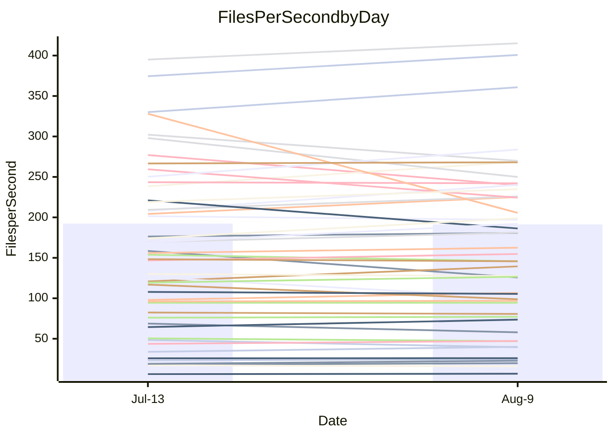

<!---
# This file is auto-generated. Do not edit.
# cspell:disable
--->
# Performance Report

Daily Performance

```mermaid
xychart-beta
    title Files Per Second by Day
    y-axis Files per Second
    x-axis Date [Jul-13, Aug-9]
    bar [192.31, 191.27]
    line [17.82, 19.76]
    line [97.93, 106.66]
    line [302.24, 269.81]
    line [94.47, 94.45]
    line [82.41, 80.61]
    line [48.47, 39.52]
    line [277.07, 239.79]
    line [6.29, 6.78]
    line [238.39, 268.54]
    line [208.19, 240.17]
    line [158.48, 125.68]
    line [204.20, 225.24]
    line [209.39, 225.91]
    line [153.81, 145.75]
    line [120.84, 139.45]
    line [23.34, 24.65]
    line [146.76, 154.75]
    line [25.88, 25.95]
    line [17.18, 15.80]
    line [201.45, 196.97]
    line [176.39, 180.75]
    line [96.02, 96.93]
    line [298.01, 249.96]
    line [76.00, 77.16]
    line [148.29, 145.79]
    line [374.43, 400.74]
    line [259.46, 224.37]
    line [221.06, 186.27]
    line [129.95, 127.47]
    line [126.09, 101.07]
    line [68.71, 57.90]
    line [155.87, 162.48]
    line [169.41, 181.18]
    line [50.42, 47.00]
    line [116.87, 98.84]
    line [330.04, 360.76]
    line [243.47, 242.10]
    line [64.41, 73.60]
    line [174.01, 198.91]
    line [250.26, 283.77]
    line [18.90, 22.84]
    line [328.06, 205.56]
    line [395.07, 415.14]
    line [119.39, 126.64]
    line [266.63, 268.09]
    line [33.78, 39.98]
    line [43.65, 47.26]
    line [107.84, 105.46]
    line [218.96, 234.76]
    line [169.05, 192.03]
```

Time to Process Files

| Repository                                      | Elapsed | Min/Avg/Max          |    SD | SD Graph                |
| ----------------------------------------------- | ------: | :------------------: | ----: | ----------------------- |
| AdaDoom3/AdaDoom3                    |    2.76 | 2.1 /   2.5 /   2.9  |  0.32 | `    ┣━━┻━━╋━●┻━━┫    ` |
| alexiosc/megistos                    |    6.92 | 6.9 /   7.3 /   7.9  |  0.32 | `    ┣━━●━━╋━━┻━━┫    ` |
| apollographql/apollo-server          |    2.14 | 2.0 /   2.5 /   2.8  |  0.23 | `    ┣━●┻━━╋━━┻━━┫    ` |
| aspnetboilerplate/aspnetboilerplate  |    6.73 | 7.6 /   8.7 /   9.1  |  0.48 | `●    ┣━┻━━╋━━┻━┫     ` |
| aws-amplify/docs                     |   11.49 | 10.7 /  12.6 /  13.6 |  1.20 | `    ┣━━●━━╋━━┻━━┫    ` |
| Azure/azure-rest-api-specs           |    9.87 | 7.2 /   9.8 /  11.2  |  1.26 | `    ┣━━┻━━●━━┻━━┫    ` |
| bitjson/typescript-starter           |    1.03 | 0.9 /   1.0 /   1.1  |  0.07 | `     ┣━┻━━●━━┻━┫     ` |
| caddyserver/caddy                    |    3.79 | 2.8 /   3.4 /   3.9  |  0.32 | `    ┣━━┻━━╋━━●━━┫    ` |
| canada-ca/open-source-logiciel-libre |    1.03 | 0.8 /   1.1 /   1.3  |  0.12 | `     ┣━┻━━●━━┻━┫     ` |
| chef/chef                            |    3.01 | 3.6 /   4.7 /   5.3  |  0.50 | `●   ┣━━┻━━╋━━┻━━┫    ` |
| dart-lang/sdk                        |   58.35 | 56.0 /  58.9 /  64.6 |  2.87 | `   ┣━━┻━━●╋━━━┻━━┫   ` |
| django/django                        |   10.16 | 11.5 /  13.7 /  14.6 |  0.97 | `●   ┣━━┻━━╋━━┻━━┫    ` |
| eslint/eslint                        |    9.76 | 7.6 /   9.4 /  10.3  |  1.06 | `    ┣━━┻━━╋●━┻━━┫    ` |
| exonum/exonum                        |    3.27 | 2.7 /   3.3 /   3.7  |  0.30 | `    ┣━━┻━━●━━┻━━┫    ` |
| flutter/samples                      |   12.69 | 8.0 /  11.7 /  13.4  |  1.73 | `   ┣━━━┻━━╋━●┻━━━┫   ` |
| gitbucket/gitbucket                  |    3.15 | 2.5 /   3.1 /   3.5  |  0.36 | `    ┣━━┻━━╋●━┻━━┫    ` |
| googleapis/google-cloud-cpp          |  123.26 | 96.9 / 118.9 / 127.7 | 12.11 | `  ┣━━━┻━━━╋━●━┻━━━┫  ` |
| graphql/express-graphql              |    1.04 | 0.8 /   1.1 /   1.2  |  0.10 | `     ┣━┻━●╋━━┻━┫     ` |
| graphql/graphql-js                   |    3.60 | 3.0 /   3.6 /   3.9  |  0.25 | `    ┣━━┻━━●━━┻━━┫    ` |
| graphql/graphql-relay-js             |    1.17 | 0.9 /   1.1 /   1.1  |  0.06 | `     ┣━┻━━╋━━┻━●     ` |
| graphql/graphql-spec                 |    1.31 | 0.8 /   1.2 /   1.3  |  0.16 | `     ┣━┻━━╋━●┻━┫     ` |
| iluwatar/java-design-patterns        |    8.78 | 11.4 /  12.2 /  12.8 |  0.46 | `●      ┣━┻╋┻━┫       ` |
| ktaranov/sqlserver-kit               |    5.57 | 3.3 /   5.2 /   6.2  |  0.99 | `    ┣━━┻━━╋●━┻━━┫    ` |
| liriliri/licia                       |    3.70 | 2.9 /   3.7 /   4.1  |  0.42 | `    ┣━━┻━━●━━┻━━┫    ` |
| MartinThoma/LaTeX-examples           |    6.21 | 4.5 /   5.5 /   6.9  |  0.83 | `    ┣━━┻━━╋━●┻━━┫    ` |
| mdx-js/mdx                           |    1.86 | 1.7 /   1.8 /   1.9  |  0.08 | `     ┣━┻━━╋━●┻━┫     ` |
| microsoft/TypeScript-Website         |    5.09 | 5.0 /   5.3 /   5.6  |  0.19 | `    ┣━━●━━╋━━┻━━┫    ` |
| MicrosoftDocs/PowerShell-Docs        |   23.52 | 24.1 /  24.6 /  25.8 |  0.55 | `    ●━━┻━━╋━━┻━━┫    ` |
| neovim/nvim-lspconfig                |    4.49 | 3.9 /   4.7 /   5.6  |  0.71 | `    ┣━━┻━●╋━━┻━━┫    ` |
| pagekit/pagekit                      |    3.44 | 2.7 /   3.2 /   3.6  |  0.30 | `    ┣━━┻━━╋━●┻━━┫    ` |
| php/php-src                          |   23.49 | 18.3 /  23.0 /  25.3 |  2.62 | `   ┣━━━┻━━╋●━┻━━━┫   ` |
| plasticrake/tplink-smarthome-api     |    1.27 | 1.2 /   1.3 /   1.4  |  0.06 | `     ┣━┻●━╋━━┻━┫     ` |
| prettier/prettier                    |    7.44 | 5.9 /   7.5 /   8.0  |  0.70 | `    ┣━━┻━━●━━┻━━┫    ` |
| pycontribs/jira                      |    1.39 | 1.1 /   1.4 /   1.5  |  0.13 | `     ┣━┻━━╋●━┻━┫     ` |
| RustPython/RustPython                |    7.21 | 6.6 /   8.9 /  11.1  |  1.43 | `    ┣━●┻━━╋━━┻━━┫    ` |
| shoelace-style/shoelace              |    2.88 | 2.1 /   2.7 /   3.0  |  0.25 | `    ┣━━┻━━╋━●┻━━┫    ` |
| slint-ui/slint                       |   15.60 | 14.0 /  15.2 /  15.9 |  0.55 | `    ┣━━┻━━╋━●┻━━┫    ` |
| SoftwareBrothers/admin-bro           |    2.41 | 1.6 /   2.3 /   2.5  |  0.28 | `    ┣━━┻━━╋●━┻━━┫    ` |
| sveltejs/svelte                      |   16.94 | 22.1 /  22.5 /  22.9 |  0.21 | `●        ┣┻┫         ` |
| TheAlgorithms/Python                 |    5.36 | 3.0 /   5.3 /   5.9  |  0.93 | `    ┣━━┻━━●━━┻━━┫    ` |
| twbs/bootstrap                       |    1.34 | 1.4 /   1.7 /   1.9  |  0.16 | `    ●┣━┻━━╋━━┻━┫     ` |
| typescript-cheatsheets/react         |    1.04 | 0.7 /   1.1 /   1.3  |  0.17 | `     ┣━┻━●╋━━┻━┫     ` |
| typescript-eslint/typescript-eslint  |    4.06 | 3.9 /   4.2 /   4.7  |  0.27 | `    ┣━━┻●━╋━━┻━━┫    ` |
| vitest-dev/vitest                    |    8.72 | 10.2 /  10.5 /  10.8 |  0.22 | `●      ┣━┻╋┻━┫       ` |
| w3c/aria-practices                   |    3.25 | 3.1 /   3.3 /   3.5  |  0.16 | `     ┣━┻━●╋━━┻━┫     ` |
| w3c/specberus                        |    1.79 | 1.5 /   1.8 /   2.0  |  0.15 | `     ┣━┻━●╋━━┻━┫     ` |
| webdeveric/webpack-assets-manifest   |    1.08 | 1.0 /   1.2 /   1.3  |  0.07 | `     ┣●┻━━╋━━┻━┫     ` |
| webpack/webpack                      |    6.40 | 3.7 /   5.6 /   6.7  |  0.98 | `    ┣━━┻━━╋━●┻━━┫    ` |
| wireapp/wire-desktop                 |    1.08 | 1.1 /   1.3 /   1.5  |  0.13 | `     ●━┻━━╋━━┻━┫     ` |
| wireapp/wire-webapp                  |   12.52 | 12.5 /  13.1 /  13.9 |  0.41 | `    ┣━●┻━━╋━━┻━━┫    ` |

Note:
- Elapsed time is in seconds.

Files per Second over Time

| Repository                                      | Files |    Sec |    Fps |     Rel | Trend Fps  |    N |
| ----------------------------------------------- | ----: | -----: | -----: | ------: | ---------- | ---: |
| AdaDoom3/AdaDoom3                    |   103 |   2.76 |  37.37 |  -9.10% | `█▇▃▃▇▂▂▃` |    7 |
| alexiosc/megistos                    |   583 |   6.92 |  84.22 |   4.81% | `▇▇█▅▆▇▄█` |    7 |
| apollographql/apollo-server          |   256 |   2.14 | 119.87 |  15.79% | `▃▂▃▄▃▄█▇` |    7 |
| aspnetboilerplate/aspnetboilerplate  |  2288 |   6.73 | 339.89 |  28.53% | `▆▂▃▂▃▃▃█` |    7 |
| aws-amplify/docs                     |  3030 |  11.49 | 263.76 |   9.13% | `█▃▃▄▃▃█▇` |    7 |
| Azure/azure-rest-api-specs           |  2561 |   9.87 | 259.50 |  -2.27% | `▂█▃▅▃▃▂▃` |    7 |
| bitjson/typescript-starter           |    20 |   1.03 |  19.46 |  -0.32% | `▃█▅▆▅▅▃▅` |    7 |
| caddyserver/caddy                    |   325 |   3.79 |  85.73 | -10.42% | `▄▄▄▃▂█▅▂` |    7 |
| canada-ca/open-source-logiciel-libre |     7 |   1.03 |   6.77 |   0.77% | `▃▄▄▅▄█▂▄` |    7 |
| chef/chef                            |  1034 |   3.01 | 343.50 |  55.54% | `▂▃▁▆▂▂▂█` |    7 |
| dart-lang/sdk                        | 11611 |  58.35 | 198.97 |   0.84% | `▇▇▇▇▄▅█▇` |    7 |
| django/django                        |  2930 |  10.16 | 288.28 |  34.31% | `▃▂▃▂▂▆▃█` |    7 |
| eslint/eslint                        |  2080 |   9.76 | 213.01 |  -4.90% | `▂▃▇█▂▃▂▃` |    7 |
| exonum/exonum                        |   421 |   3.27 | 128.65 |  -0.99% | `█▂▃▃▅▄▄▄` |    7 |
| flutter/samples                      |  1696 |  12.69 | 133.60 | -10.12% | `▄▃▁▂▂█▂▂` |    7 |
| gitbucket/gitbucket                  |   418 |   3.15 | 132.77 |  -3.61% | `▂▃█▃▃▃▇▄` |    7 |
| googleapis/google-cloud-cpp          | 21238 | 123.26 | 172.30 |  -4.69% | `▃█▇▂▂▃▃▃` |    7 |
| graphql/express-graphql              |    26 |   1.04 |  25.06 |   2.71% | `▃▄█▂▄▃▃▄` |    7 |
| graphql/graphql-js                   |   551 |   3.60 | 153.16 |  -0.44% | `▃▄▄▄▃▃█▄` |    7 |
| graphql/graphql-relay-js             |    28 |   1.17 |  23.84 |  -9.19% | `▄▃▄▄▃▃█▂` |    7 |
| graphql/graphql-spec                 |    19 |   1.31 |  14.47 | -10.57% | `▄▂▂▂█▂▂▂` |    7 |
| iluwatar/java-design-patterns        |  2089 |   8.78 | 237.85 |  38.31% | `▃▃▃▂▃▂▄█` |    7 |
| ktaranov/sqlserver-kit               |   490 |   5.57 |  87.96 | -10.31% | `▃▂▁▂█▁▅▂` |    7 |
| liriliri/licia                       |  1438 |   3.70 | 388.48 |  -2.57% | `▃▃▂▃▂█▇▄` |    7 |
| MartinThoma/LaTeX-examples           |  1409 |   6.21 | 226.85 | -12.79% | `▇▂▃█▄▇▃▃` |    7 |
| mdx-js/mdx                           |   139 |   1.86 |  74.73 |  -3.38% | `▅█▅▄▇▅▇▅` |    7 |
| microsoft/TypeScript-Website         |   765 |   5.09 | 150.37 |   3.36% | `▇▆█▇▅▄▆▇` |    7 |
| MicrosoftDocs/PowerShell-Docs        |  3126 |  23.52 | 132.89 |   4.60% | `▇▇▆▆▄▆▇█` |    7 |
| neovim/nvim-lspconfig                |   867 |   4.49 | 193.14 |   1.51% | `█▂▂▆█▇▃▅` |    7 |
| pagekit/pagekit                      |   741 |   3.44 | 215.18 |  -6.73% | `▇▄▄▃▄▂█▃` |    7 |
| php/php-src                          |  2383 |  23.49 | 101.43 |  -3.03% | `█▃▃▂▃▂▇▄` |    7 |
| plasticrake/tplink-smarthome-api     |    62 |   1.27 |  48.67 |   2.99% | `█▆▆▇▆▆▃▇` |    7 |
| prettier/prettier                    |  2664 |   7.44 | 358.07 |   0.37% | `▂▃▃▃█▃▂▃` |    7 |
| pycontribs/jira                      |    80 |   1.39 |  57.45 |  -3.46% | `██▃▃▃▃▃▄` |    7 |
| RustPython/RustPython                |   860 |   7.21 | 119.24 |  21.06% | `▇▁▃▃▃▃█▇` |    7 |
| shoelace-style/shoelace              |   440 |   2.88 | 152.80 |  -6.21% | `▃▃▂▃▃█▃▂` |    7 |
| slint-ui/slint                       |  3726 |  15.60 | 238.92 |  -1.58% | `▇█▇▆▅▇▇▆` |    7 |
| SoftwareBrothers/admin-bro           |   441 |   2.41 | 182.89 |  -7.46% | `▂█▂▃▃▂▃▂` |    7 |
| sveltejs/svelte                      |  8935 |  16.94 | 527.59 |  33.16% | `▂▂▂▂▂▃▃█` |    7 |
| TheAlgorithms/Python                 |  1411 |   5.36 | 263.26 |  -6.62% | `▂▂▁▁▂▂█▂` |    7 |
| twbs/bootstrap                       |   118 |   1.34 |  87.84 |  25.04% | `▃▄▅▃█▄▂█` |    7 |
| typescript-cheatsheets/react         |    24 |   1.04 |  23.02 |   3.46% | `▁▂▃█▁▃▂▃` |    7 |
| typescript-eslint/typescript-eslint  |   865 |   4.06 | 212.89 |  -4.11% | `█▁▃▂▂▃▃▃` |    7 |
| vitest-dev/vitest                    |  2752 |   8.72 | 315.60 |  20.87% | `▄▃▄▃▄▃▃█` |    7 |
| w3c/aria-practices                   |   417 |   3.25 | 128.18 |   2.23% | `▄█▇▄▆▄▇▇` |    7 |
| w3c/specberus                        |   190 |   1.79 | 106.24 |   0.52% | `▄█▄▃▄▃▂▄` |    7 |
| webdeveric/webpack-assets-manifest   |    55 |   1.08 |  50.80 |   9.86% | `▃▅█▄▅▃▄▇` |    7 |
| webpack/webpack                      |  1296 |   6.40 | 202.48 | -14.61% | `▂▄▂▃▁▂█▂` |    7 |
| wireapp/wire-desktop                 |    51 |   1.08 |  47.37 |  24.52% | `▂▃▂█▄▄▃█` |    7 |
| wireapp/wire-webapp                  |  2476 |  12.52 | 197.74 |   5.22% | `▃▇▇▇▇▆██` |    7 |

Data Throughput

| Repository                                      | Files |    Sec |     Kps |     Rel | Trend Kps  |    N |
| ----------------------------------------------- | ----: | -----: | ------: | ------: | ---------- | ---: |
| AdaDoom3/AdaDoom3                    |   103 |   2.76 |  794.17 |  -9.10% | `█▇▃▃▇▂▂▃` |    7 |
| alexiosc/megistos                    |   583 |   6.92 |  661.73 |   4.81% | `▇▇█▅▆▇▄█` |    7 |
| apollographql/apollo-server          |   256 |   2.14 |  987.08 |  15.74% | `▃▂▃▄▃▄█▇` |    7 |
| aspnetboilerplate/aspnetboilerplate  |  2288 |   6.73 |  831.15 |  28.54% | `▆▂▃▂▃▃▃█` |    7 |
| aws-amplify/docs                     |  3030 |  11.49 | 1029.10 |  10.45% | `▆▃▃▄▃▃█▇` |    7 |
| Azure/azure-rest-api-specs           |  2561 |   9.87 |  787.12 |  -2.37% | `▂█▃▅▃▃▂▃` |    7 |
| bitjson/typescript-starter           |    20 |   1.03 |   77.84 |  -0.32% | `▃█▅▆▅▅▃▅` |    7 |
| caddyserver/caddy                    |   325 |   3.79 |  782.91 | -10.32% | `▄▄▄▃▂█▅▂` |    7 |
| canada-ca/open-source-logiciel-libre |     7 |   1.03 |   56.05 |   0.77% | `▃▄▄▅▄█▂▄` |    7 |
| chef/chef                            |  1034 |   3.01 | 1686.63 |  55.55% | `▂▃▁▆▂▂▂█` |    7 |
| dart-lang/sdk                        | 11611 |  58.35 | 1372.44 |   0.98% | `▇▇▇▇▄▅█▇` |    7 |
| django/django                        |  2930 |  10.16 | 1854.34 |  34.35% | `▃▂▃▂▂▆▃█` |    7 |
| eslint/eslint                        |  2080 |   9.76 | 1495.27 |  -4.81% | `▂▃▇█▂▃▂▃` |    7 |
| exonum/exonum                        |   421 |   3.27 | 1230.63 |  -0.99% | `█▂▃▃▅▄▄▄` |    7 |
| flutter/samples                      |  1696 |  12.69 |  799.38 | -10.12% | `▄▃▁▂▂█▂▂` |    7 |
| gitbucket/gitbucket                  |   418 |   3.15 |  650.51 |  -3.31% | `▂▄█▃▃▃▇▄` |    7 |
| googleapis/google-cloud-cpp          | 21238 | 123.26 | 1495.39 |  -4.64% | `▃█▇▂▂▃▃▃` |    7 |
| graphql/express-graphql              |    26 |   1.04 |  114.72 |   2.71% | `▃▄█▂▄▃▃▄` |    7 |
| graphql/graphql-js                   |   551 |   3.60 | 1142.15 |  -0.41% | `▃▄▄▄▃▃█▄` |    7 |
| graphql/graphql-relay-js             |    28 |   1.17 |   93.64 |  -9.19% | `▄▃▄▄▃▃█▂` |    7 |
| graphql/graphql-spec                 |    19 |   1.31 |  484.46 | -10.57% | `▄▂▂▂█▂▂▂` |    7 |
| iluwatar/java-design-patterns        |  2089 |   8.78 |  733.03 |  38.32% | `▃▃▃▂▃▂▄█` |    7 |
| ktaranov/sqlserver-kit               |   490 |   5.57 | 1332.54 | -10.31% | `▃▂▁▂█▁▅▂` |    7 |
| liriliri/licia                       |  1438 |   3.70 |  463.58 |  -2.57% | `▃▃▂▃▂█▇▄` |    7 |
| MartinThoma/LaTeX-examples           |  1409 |   6.21 |  468.52 | -12.79% | `▇▂▃█▄▇▃▃` |    7 |
| mdx-js/mdx                           |   139 |   1.86 |  352.12 |  -3.26% | `▅█▅▄▇▅▇▅` |    7 |
| microsoft/TypeScript-Website         |   765 |   5.09 | 1036.67 |   3.36% | `▇▆█▇▅▄▆▇` |    7 |
| MicrosoftDocs/PowerShell-Docs        |  3126 |  23.52 | 1418.06 |   4.61% | `▇▇▆▆▄▆▇█` |    7 |
| neovim/nvim-lspconfig                |   867 |   4.49 |  567.62 |   1.58% | `█▂▂▆█▇▃▅` |    7 |
| pagekit/pagekit                      |   741 |   3.44 |  448.65 |  -6.73% | `▇▄▄▃▄▂█▃` |    7 |
| php/php-src                          |  2383 |  23.49 | 1793.58 |  -2.91% | `█▃▃▂▃▂▇▄` |    7 |
| plasticrake/tplink-smarthome-api     |    62 |   1.27 |  262.97 |   2.99% | `█▆▆▇▆▆▃▇` |    7 |
| prettier/prettier                    |  2664 |   7.44 |  508.88 |   0.35% | `▂▃▃▃█▃▂▃` |    7 |
| pycontribs/jira                      |    80 |   1.39 |  405.71 |  -3.46% | `██▃▃▃▃▃▄` |    7 |
| RustPython/RustPython                |   860 |   7.21 | 2616.79 |  20.75% | `▇▁▃▃▃▃█▇` |    7 |
| shoelace-style/shoelace              |   440 |   2.88 |  737.98 |  -6.21% | `▃▃▂▃▃█▃▂` |    7 |
| slint-ui/slint                       |  3726 |  15.60 | 1281.01 |  -1.31% | `▆█▇▆▅▇▇▆` |    7 |
| SoftwareBrothers/admin-bro           |   441 |   2.41 |  403.11 |  -7.46% | `▂█▂▃▃▂▃▂` |    7 |
| sveltejs/svelte                      |  8935 |  16.94 |  361.90 |  33.21% | `▂▂▂▂▂▃▃█` |    7 |
| TheAlgorithms/Python                 |  1411 |   5.36 |  673.35 |  -6.61% | `▂▂▁▁▂▂█▂` |    7 |
| twbs/bootstrap                       |   118 |   1.34 |  720.60 |  25.04% | `▃▄▅▃█▄▂█` |    7 |
| typescript-cheatsheets/react         |    24 |   1.04 |  208.17 |   3.46% | `▁▂▃█▁▃▂▃` |    7 |
| typescript-eslint/typescript-eslint  |   865 |   4.06 |  715.95 | -15.35% | `█▁▂▁▁▁▂▁` |    7 |
| vitest-dev/vitest                    |  2752 |   8.72 |  889.80 |  20.90% | `▄▃▄▃▄▃▃█` |    7 |
| w3c/aria-practices                   |   417 |   3.25 | 1205.57 |   2.23% | `▄█▇▄▆▄▇▇` |    7 |
| w3c/specberus                        |   190 |   1.79 |  346.67 |   0.53% | `▄█▄▃▄▃▂▄` |    7 |
| webdeveric/webpack-assets-manifest   |    55 |   1.08 |  117.31 |   9.98% | `▃▅█▄▅▃▄▇` |    7 |
| webpack/webpack                      |  1296 |   6.40 | 1230.03 | -13.31% | `▁▄▂▃▁▂█▂` |    7 |
| wireapp/wire-desktop                 |    51 |   1.08 |  201.56 |  23.61% | `▃▃▂█▄▄▃█` |    7 |
| wireapp/wire-webapp                  |  2476 |  12.52 |  830.50 |   5.41% | `▃▇▇▇▇▆██` |    7 |

