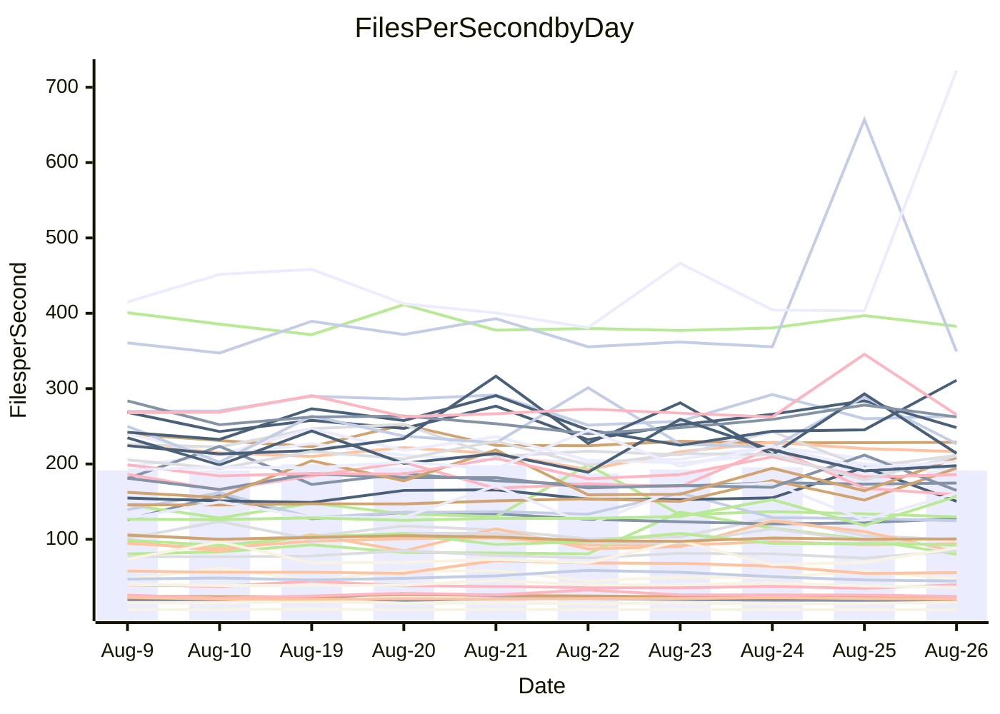

<!---
# This file is auto-generated. Do not edit.
# cspell:disable
--->
# Performance Report

Daily Performance

```mermaid
xychart-beta
    title Files Per Second by Day
    y-axis Files per Second
    x-axis Date [Aug-9, Aug-10, Aug-19, Aug-20, Aug-21, Aug-22, Aug-23, Aug-24, Aug-25, Aug-26]
    bar [191.27, 191.48, 199.45, 195.67, 198.22, 187.40, 192.61, 195.61, 200.69, 191.21]
    line [19.76, 19.87, 23.15, 18.80, 21.30, 21.70, 20.11, 19.24, 18.97, 18.60]
    line [94.45, 88.13, 97.66, 100.71, 101.93, 92.80, 92.11, 97.07, 92.83, 94.21]
    line [106.66, 99.38, 103.80, 117.71, 112.47, 100.50, 103.30, 128.71, 104.89, 99.29]
    line [80.61, 83.15, 92.81, 82.44, 81.86, 80.75, 136.22, 114.72, 99.92, 80.06]
    line [239.79, 231.09, 223.10, 252.00, 224.60, 224.17, 230.06, 227.93, 228.22, 228.65]
    line [269.81, 270.47, 289.77, 286.14, 291.59, 251.52, 256.69, 292.19, 260.02, 263.43]
    line [39.52, 37.52, 44.46, 38.46, 37.42, 35.96, 35.65, 37.61, 34.82, 39.63]
    line [268.54, 243.09, 257.77, 247.18, 276.72, 232.23, 252.08, 266.01, 283.94, 248.34]
    line [6.78, 6.60, 7.51, 6.38, 6.72, 6.55, 6.77, 6.55, 6.58, 6.59]
    line [240.17, 211.99, 227.00, 211.38, 205.51, 203.10, 206.43, 223.33, 206.89, 190.22]
    line [125.68, 158.27, 127.25, 135.61, 133.76, 126.70, 123.28, 120.42, 121.90, 127.45]
    line [225.24, 214.74, 210.02, 221.88, 213.58, 192.56, 216.27, 228.68, 220.47, 216.37]
    line [225.91, 222.58, 246.74, 252.74, 209.47, 217.12, 212.13, 242.98, 195.81, 211.42]
    line [145.75, 128.32, 148.05, 133.76, 130.09, 198.58, 132.66, 136.89, 133.84, 129.75]
    line [24.65, 23.72, 23.68, 26.94, 25.51, 24.79, 23.76, 23.53, 22.75, 23.51]
    line [139.45, 161.93, 128.87, 135.71, 136.66, 133.36, 161.38, 128.87, 127.62, 124.67]
    line [25.95, 22.03, 24.86, 28.29, 26.21, 32.71, 26.20, 26.09, 26.00, 24.23]
    line [154.75, 150.93, 149.02, 164.86, 165.64, 153.35, 152.64, 155.02, 195.52, 150.49]
    line [15.80, 15.53, 17.25, 15.28, 15.49, 14.84, 15.46, 14.39, 15.01, 16.42]
    line [196.97, 211.99, 246.59, 218.10, 236.31, 204.94, 201.38, 212.81, 200.01, 195.01]
    line [180.75, 223.35, 172.94, 187.16, 177.68, 172.01, 170.49, 175.09, 173.22, 174.63]
    line [96.93, 84.41, 106.12, 84.61, 114.12, 87.31, 89.99, 124.55, 110.24, 83.67]
    line [77.16, 76.75, 77.91, 84.91, 78.76, 75.34, 81.46, 80.77, 74.97, 84.82]
    line [400.74, 385.62, 371.65, 411.46, 377.61, 379.88, 377.18, 380.64, 396.91, 382.80]
    line [145.79, 145.58, 147.10, 147.08, 151.07, 153.94, 150.27, 178.09, 152.08, 194.45]
    line [249.96, 202.34, 263.67, 236.99, 228.06, 301.20, 226.40, 222.40, 289.06, 226.80]
    line [186.27, 165.43, 184.07, 202.12, 167.51, 173.85, 169.85, 221.75, 167.75, 159.31]
    line [224.37, 213.27, 217.89, 233.79, 316.48, 227.32, 281.23, 212.31, 293.11, 214.05]
    line [47.00, 61.84, 45.89, 57.63, 58.67, 44.77, 49.92, 49.06, 57.90, 47.24]
    line [127.47, 149.55, 129.16, 129.10, 170.99, 119.13, 167.47, 175.06, 125.57, 161.32]
    line [181.18, 166.12, 186.93, 181.85, 181.88, 168.34, 171.35, 169.12, 211.70, 164.93]
    line [57.90, 56.15, 56.35, 54.76, 71.89, 68.47, 68.09, 64.39, 54.76, 55.76]
    line [101.07, 123.80, 99.87, 108.06, 107.98, 95.34, 94.96, 114.12, 97.84, 91.84]
    line [98.84, 91.76, 103.43, 107.49, 93.08, 97.11, 107.90, 94.53, 94.47, 92.63]
    line [162.48, 155.40, 204.32, 177.59, 218.64, 159.00, 159.79, 194.26, 164.45, 208.14]
    line [360.76, 347.31, 389.41, 371.89, 392.82, 355.53, 361.83, 355.43, 657.12, 349.27]
    line [198.91, 184.05, 187.41, 186.67, 207.48, 180.49, 185.92, 209.38, 182.67, 185.76]
    line [242.10, 232.62, 273.32, 257.69, 290.62, 245.10, 224.83, 243.49, 245.36, 311.06]
    line [73.60, 96.61, 68.89, 69.48, 73.38, 68.77, 97.84, 66.15, 69.59, 88.48]
    line [415.14, 451.69, 458.22, 412.53, 400.53, 380.98, 466.37, 404.40, 403.18, 722.14]
    line [283.77, 252.09, 262.36, 263.68, 253.37, 240.18, 248.22, 259.20, 278.18, 262.46]
    line [22.84, 20.59, 20.47, 21.22, 20.90, 21.42, 21.40, 22.88, 21.36, 20.63]
    line [205.56, 193.98, 216.67, 206.61, 230.20, 198.53, 213.69, 212.64, 179.07, 210.76]
    line [126.64, 126.17, 128.45, 125.27, 127.94, 127.77, 130.20, 152.67, 118.34, 156.81]
    line [105.46, 100.11, 102.43, 104.89, 103.21, 98.21, 97.36, 101.78, 100.00, 100.54]
    line [47.26, 48.66, 46.00, 48.26, 51.42, 58.83, 56.30, 50.38, 45.97, 44.56]
    line [268.09, 268.70, 290.78, 262.94, 266.60, 272.93, 267.45, 262.37, 345.57, 265.40]
    line [234.76, 198.61, 243.75, 200.90, 213.71, 188.91, 259.37, 218.53, 190.79, 197.62]
    line [39.98, 38.63, 38.64, 39.11, 45.24, 39.50, 39.66, 42.07, 38.23, 36.39]
    line [192.03, 195.48, 194.87, 202.54, 193.62, 244.63, 196.70, 223.56, 194.58, 203.27]
```

Time to Process Files

| Repository                                      | Elapsed | Min/Avg/Max          |    SD | SD Graph                |
| ----------------------------------------------- | ------: | :------------------: | ----: | ----------------------- |
| AdaDoom3/AdaDoom3                    |    2.60 | 2.1 /   2.7 /   3.0  |  0.25 | `    ┣━━┻━●╋━━┻━━┫    ` |
| alexiosc/megistos                    |    7.28 | 4.1 /   6.7 /   7.9  |  0.92 | `    ┣━━┻━━╋━●┻━━┫    ` |
| apollographql/apollo-server          |    2.58 | 1.8 /   2.4 /   2.8  |  0.26 | `    ┣━━┻━━╋━●┻━━┫    ` |
| aspnetboilerplate/aspnetboilerplate  |    8.69 | 6.3 /   8.4 /   9.1  |  0.97 | `    ┣━━┻━━╋●━┻━━┫    ` |
| aws-amplify/docs                     |   13.25 | 9.6 /  13.0 /  14.0  |  1.00 | `    ┣━━┻━━╋●━┻━━┫    ` |
| Azure/azure-rest-api-specs           |   10.37 | 7.2 /   9.9 /  11.2  |  0.93 | `    ┣━━┻━━╋━●┻━━┫    ` |
| bitjson/typescript-starter           |    1.08 | 0.6 /   1.0 /   1.1  |  0.10 | `     ┣━┻━━╋━●┻━┫     ` |
| caddyserver/caddy                    |    3.59 | 2.5 /   3.5 /   3.9  |  0.35 | `    ┣━━┻━━╋●━┻━━┫    ` |
| canada-ca/open-source-logiciel-libre |    1.06 | 0.8 /   1.0 /   1.3  |  0.10 | `     ┣━┻━━●━━┻━┫     ` |
| chef/chef                            |    5.44 | 3.0 /   4.7 /   5.3  |  0.51 | `    ┣━━┻━━╋━━┻●━┫    ` |
| dart-lang/sdk                        |   59.66 | 34.3 /  55.3 /  64.6 |  7.04 | `  ┣━━━┻━━━╋━●━┻━━━┫  ` |
| django/django                        |   13.87 | 10.2 /  12.9 /  15.0 |  1.61 | `   ┣━━━┻━━╋━●┻━━━┫   ` |
| eslint/eslint                        |    9.62 | 7.6 /   9.6 /  10.8  |  0.75 | `    ┣━━┻━━●━━┻━━┫    ` |
| exonum/exonum                        |    3.30 | 2.6 /   3.3 /   3.7  |  0.26 | `    ┣━━┻━━●━━┻━━┫    ` |
| flutter/samples                      |   13.13 | 8.0 /  12.2 /  14.0  |  1.39 | `    ┣━━┻━━╋━●┻━━┫    ` |
| gitbucket/gitbucket                  |    3.35 | 2.5 /   3.1 /   3.4  |  0.31 | `    ┣━━┻━━╋━━●━━┫    ` |
| googleapis/google-cloud-cpp          |  133.29 | 96.3 / 119.3 / 132.7 | 11.70 | `  ┣━━━┻━━━╋━━━┻●━━┫  ` |
| graphql/express-graphql              |    1.11 | 0.7 /   1.1 /   1.2  |  0.10 | `     ┣━┻━━╋●━┻━┫     ` |
| graphql/graphql-js                   |    3.66 | 2.8 /   3.5 /   3.9  |  0.29 | `    ┣━━┻━━╋━●┻━━┫    ` |
| graphql/graphql-relay-js             |    1.16 | 0.7 /   1.1 /   1.3  |  0.10 | `     ┣━┻━━╋━●┻━┫     ` |
| graphql/graphql-spec                 |    1.16 | 0.8 /   1.2 /   1.4  |  0.13 | `     ┣━┻●━╋━━┻━┫     ` |
| iluwatar/java-design-patterns        |   12.50 | 8.8 /  12.0 /  12.8  |  1.05 | `    ┣━━┻━━╋━●┻━━┫    ` |
| ktaranov/sqlserver-kit               |    5.86 | 3.1 /   5.1 /   6.2  |  0.97 | `    ┣━━┻━━╋━●┻━━┫    ` |
| liriliri/licia                       |    3.77 | 2.9 /   3.7 /   4.1  |  0.30 | `    ┣━━┻━━╋●━┻━━┫    ` |
| MartinThoma/LaTeX-examples           |    6.21 | 4.5 /   5.8 /   7.0  |  0.70 | `    ┣━━┻━━╋━●┻━━┫    ` |
| mdx-js/mdx                           |    1.64 | 1.5 /   1.8 /   1.9  |  0.09 | `     ┣●┻━━╋━━┻━┫     ` |
| microsoft/TypeScript-Website         |    3.93 | 3.7 /   5.1 /   5.6  |  0.36 | `●   ┣━━┻━━╋━━┻━━┫    ` |
| MicrosoftDocs/PowerShell-Docs        |   19.38 | 13.9 /  23.0 /  26.2 |  3.27 | `   ┣━━●━━━╋━━━┻━━┫   ` |
| neovim/nvim-lspconfig                |    5.47 | 3.7 /   4.7 /   5.6  |  0.59 | `    ┣━━┻━━╋━━┻●━┫    ` |
| pagekit/pagekit                      |    3.46 | 1.9 /   3.2 /   3.6  |  0.47 | `    ┣━━┻━━╋━●┻━━┫    ` |
| php/php-src                          |   26.01 | 18.2 /  23.1 /  26.1 |  2.51 | `   ┣━━━┻━━╋━━┻●━━┫   ` |
| plasticrake/tplink-smarthome-api     |    1.31 | 0.8 /   1.2 /   1.4  |  0.16 | `     ┣━┻━━╋●━┻━┫     ` |
| prettier/prettier                    |    7.73 | 4.1 /   7.2 /   8.0  |  0.92 | `    ┣━━┻━━╋━●┻━━┫    ` |
| pycontribs/jira                      |    1.43 | 0.9 /   1.3 /   1.5  |  0.16 | `     ┣━┻━━╋━●┻━┫     ` |
| RustPython/RustPython                |    9.47 | 5.8 /   8.9 /  11.1  |  1.13 | `    ┣━━┻━━╋━●┻━━┫    ` |
| shoelace-style/shoelace              |    2.11 | 1.8 /   2.5 /   3.0  |  0.39 | `    ┣━━●━━╋━━┻━━┫    ` |
| slint-ui/slint                       |   12.46 | 11.3 /  15.1 /  17.0 |  1.48 | `   ┣●━━┻━━╋━━┻━━━┫   ` |
| SoftwareBrothers/admin-bro           |    2.37 | 1.6 /   2.3 /   2.6  |  0.25 | `    ┣━━┻━━╋●━┻━━┫    ` |
| sveltejs/svelte                      |   12.49 | 16.9 /  21.5 /  23.5 |  1.85 | `●     ┣━┻━╋━┻━┫      ` |
| TheAlgorithms/Python                 |    5.38 | 3.0 /   5.4 /   5.9  |  0.55 | `    ┣━━┻━━●━━┻━━┫    ` |
| twbs/bootstrap                       |    1.33 | 1.2 /   1.6 /   1.9  |  0.18 | `     ┣●┻━━╋━━┻━┫     ` |
| typescript-cheatsheets/react         |    1.16 | 0.7 /   1.1 /   1.3  |  0.10 | `     ┣━┻━━╋●━┻━┫     ` |
| typescript-eslint/typescript-eslint  |    4.12 | 3.3 /   4.2 /   4.9  |  0.33 | `    ┣━━┻━━●━━┻━━┫    ` |
| vitest-dev/vitest                    |   10.51 | 8.1 /  10.2 /  10.8  |  0.75 | `    ┣━━┻━━╋●━┻━━┫    ` |
| w3c/aria-practices                   |    2.66 | 2.3 /   3.3 /   3.5  |  0.23 | `   ●┣━━┻━━╋━━┻━━┫    ` |
| w3c/specberus                        |    1.89 | 1.5 /   1.9 /   2.2  |  0.14 | `     ┣━┻━━╋●━┻━┫     ` |
| webdeveric/webpack-assets-manifest   |    1.23 | 0.9 /   1.1 /   1.4  |  0.12 | `     ┣━┻━━╋━●┻━┫     ` |
| webpack/webpack                      |    6.90 | 3.7 /   6.2 /   7.4  |  1.03 | `    ┣━━┻━━╋━●┻━━┫    ` |
| wireapp/wire-desktop                 |    1.40 | 1.0 /   1.3 /   1.5  |  0.12 | `     ┣━┻━━╋━━●━┫     ` |
| wireapp/wire-webapp                  |   12.68 | 10.3 /  12.7 /  14.2 |  0.96 | `    ┣━━┻━━●━━┻━━┫    ` |

Note:
- Elapsed time is in seconds.

Files per Second over Time

| Repository                                      | Files |    Sec |    Fps |     Rel | Trend Fps              |    N |
| ----------------------------------------------- | ----: | -----: | -----: | ------: | ---------------------- | ---: |
| AdaDoom3/AdaDoom3                    |   103 |   2.60 |  39.63 |   1.81% | `▂▂▃▃▃█▇▃▃▆▃▃▃▃▂▂▃▃▂▄` |   23 |
| alexiosc/megistos                    |   583 |   7.28 |  80.06 | -10.07% | `▂▁▂▂▃▅▂▂▂▂▂▂▂▂▂██▃▄▂` |   23 |
| apollographql/apollo-server          |   256 |   2.58 |  99.29 |  -9.80% | `▃▆▅▂▃▃▃█▃▅▃▃▆▃▃▃▆▆▃▂` |   23 |
| aspnetboilerplate/aspnetboilerplate  |  2288 |   8.69 | 263.43 |  -5.34% | `▃▂▇▃█▂▂▃▂█▃▂█▂▂▂▂▆▂▃` |   23 |
| aws-amplify/docs                     |  3030 |  13.25 | 228.65 |  -2.59% | `▃▆▅▃▃▂▃▃▃█▃▂▂▃▂▃▃▂▃▃` |   23 |
| Azure/azure-rest-api-specs           |  2576 |  10.37 | 248.34 |  -5.05% | `▃▂▄▃▄▄▄▃▄▃▃▄█▄▂▄▆▃▆▃` |   23 |
| bitjson/typescript-starter           |    20 |   1.08 |  18.60 |  -8.19% | `▂▂▂▃█▂▃▂▁▂▂▂▃▄▃▃▂▂▂▂` |   23 |
| caddyserver/caddy                    |   338 |   3.59 |  94.21 |  -2.52% | `▆▄▂▂▂▅▃▃▂▃█▆▃▃▃▃▃▄▃▃` |   23 |
| canada-ca/open-source-logiciel-libre |     7 |   1.06 |   6.59 |  -2.31% | `▇▁▄▃█▄▃▂▄▄▃▃▄▃▃▄▃▃▃▃` |   23 |
| chef/chef                            |  1035 |   5.44 | 190.22 | -14.20% | `▂▂█▂▂▂▄▂▂▂▂▂▂▂▂▂▂▃▂▁` |   23 |
| dart-lang/sdk                        | 11634 |  59.66 | 195.01 |  -9.28% | `▂▂▂▃▂█▂▅▂▂▂▂▇▂▂▂▂▃▂▂` |   23 |
| django/django                        |  2932 |  13.87 | 211.42 |  -8.16% | `▆▃█▄▇▃▅█▃█▅▃▂▃▃▃▂█▂▃` |   23 |
| eslint/eslint                        |  2082 |   9.62 | 216.37 |  -1.19% | `▄▃▄▅▄▅▄█▄▅▄▅▄▅▂▅▅▇▅▅` |   23 |
| exonum/exonum                        |   421 |   3.30 | 127.45 |  -1.51% | `▄▃▄█▃▄▄▄█▄▃▄▃▇▄▃▂▃▃▄` |   23 |
| flutter/samples                      |  1703 |  13.13 | 129.75 |  -8.37% | `█▃▂▂▂▄▄▂▂▂▂▁▂▂▇▂▃▂▂▂` |   23 |
| gitbucket/gitbucket                  |   418 |   3.35 | 124.67 |  -9.19% | `▃█▄█▂▃▅█▂▃▃▇▃▃▄█▃▃▃▃` |   23 |
| googleapis/google-cloud-cpp          | 21983 | 133.29 | 164.93 |  -8.77% | `▃▃▃▂█▃▃▇▃▃▃▂▇▂▃▃▃▂▇▂` |   23 |
| graphql/express-graphql              |    26 |   1.11 |  23.51 |  -5.12% | `▂▂▃▃▃▂▂▃▃▃█▅▃▃▃▃▂▃▂▃` |   23 |
| graphql/graphql-js                   |   551 |   3.66 | 150.49 |  -5.15% | `▃▇▃▃▃▃▃█▃▃▄▄▇▄▃▃▃▄█▃` |   23 |
| graphql/graphql-relay-js             |    28 |   1.16 |  24.23 |  -8.20% | `▃▅▂▁▃▃▃▃▃█▃▃▃▃▆▃▃▃▃▂` |   23 |
| graphql/graphql-spec                 |    19 |   1.16 |  16.42 |   5.02% | `▃▂▂▃█▂▃▃▃▃▃▃▄▃▃▃▃▂▃▄` |   23 |
| iluwatar/java-design-patterns        |  2183 |  12.50 | 174.63 |  -3.33% | `▂▄█▇▂▃▃▃▃▄▆▃▃▃▃▂▃▃▃▃` |   23 |
| ktaranov/sqlserver-kit               |   490 |   5.86 |  83.67 | -16.28% | `▁▄▂▂▂▇▂▁▂▂▂▃▂█▂▂▄▇▄▂` |   23 |
| liriliri/licia                       |  1442 |   3.77 | 382.80 |  -2.17% | `█▇▄▃▃▃▃▃█▄▄▃▃▃▃▃▃▃▄▃` |   23 |
| MartinThoma/LaTeX-examples           |  1409 |   6.21 | 226.80 |  -7.46% | `█▄▃▂▄█▆▃▃▆▃▃▃▄█▃▃▃▇▃` |   23 |
| mdx-js/mdx                           |   139 |   1.64 |  84.82 |   7.20% | `▃▅▃▄▅▅▃▅▆█▇▅▄▅▄▅▅▅▃▆` |   23 |
| microsoft/TypeScript-Website         |   765 |   3.93 | 194.45 |  29.21% | `▂▃▃▃▃▂▃▃▂▃▃▃▃▃▃▃▃█▃▇` |   23 |
| MicrosoftDocs/PowerShell-Docs        |  3126 |  19.38 | 161.32 |  15.19% | `▂▂▂▃▂▂▂▂▂▂▂█▄▂▁▄▂█▂▄` |   23 |
| neovim/nvim-lspconfig                |   871 |   5.47 | 159.31 | -14.54% | `▆▃▅▃▃▆▄▆▆█▃▃▃▃▃▃▇▇▃▂` |   23 |
| pagekit/pagekit                      |   741 |   3.46 | 214.05 | -11.27% | `▁▄▂▂▂▂▂▅▂▁▂▆█▂▂▄▁▂▅▂` |   23 |
| php/php-src                          |  2389 |  26.01 |  91.84 | -12.11% | `▃▇▃▇▃▅▂▃▇▃▅█▃▂▃▂▃█▃▂` |   23 |
| plasticrake/tplink-smarthome-api     |    62 |   1.31 |  47.24 |  -8.38% | `▂▁▂▅▁▂▂▅▃▂▇▂▃█▂▃▂▃▄▂` |   23 |
| prettier/prettier                    |  2699 |   7.73 | 349.27 |  -8.63% | `▁▁▂▂▂▄▂▃▁▂▁▄▂▂▂▂▂▂█▂` |   23 |
| pycontribs/jira                      |    80 |   1.43 |  55.76 |  -7.80% | `▂▂▂▂▂▂▂▂▂▂▂█▂▅▄▄▂▅▂▂` |   22 |
| RustPython/RustPython                |   877 |   9.47 |  92.63 |  -7.03% | `▃▆▅▃▃▃▅▃▃█▃▂▃▃▃▄▃▃▃▃` |   23 |
| shoelace-style/shoelace              |   440 |   2.11 | 208.14 |  15.53% | `▅▂▂▂▂█▆▂▂▂▇▇▇▄▂▂▇▂▃▅` |   23 |
| slint-ui/slint                       |  3875 |  12.46 | 311.06 |  22.25% | `▃▃▃▂▃█▃▂▃▇▃▆█▃▃▂▃▃▃▇` |   23 |
| SoftwareBrothers/admin-bro           |   441 |   2.37 | 185.76 |  -4.54% | `▃▃▃▃▃▃▃▅▂▂▂▂▃█▂▃▂▇▃▃` |   23 |
| sveltejs/svelte                      |  9020 |  12.49 | 722.14 |  72.23% | `▂▂▄▃▄▃▁▃▁▂▂▂▁▂▁▃▂▂▂█` |   23 |
| TheAlgorithms/Python                 |  1411 |   5.38 | 262.46 |  -1.45% | `▂█▂▂▂▂▂▂▂▂▂▁▂▂▁▂▂▂▂▂` |   23 |
| twbs/bootstrap                       |   118 |   1.33 |  88.48 |  20.78% | `▃▂▆█▃▃▃▃▃▄▃▅▃▂▃█▃▂▃▆` |   23 |
| typescript-cheatsheets/react         |    24 |   1.16 |  20.63 |  -4.97% | `▆▅▇▄▅▅▃▅▄▅▆▄▅▅▅▅█▆▅▄` |   23 |
| typescript-eslint/typescript-eslint  |   869 |   4.12 | 210.76 |   0.64% | `▄▄▄▃▅▄▅▅▄▂▄█▅▄▃▄▄▄▂▄` |   23 |
| vitest-dev/vitest                    |  2790 |  10.51 | 265.40 |  -2.80% | `▂▂▆▃▃█▃▃▂▃▂▃▃▃▃▃▂▃█▃` |   23 |
| w3c/aria-practices                   |   417 |   2.66 | 156.81 |  21.66% | `▂▃▃▃▃▃▃▂▂▃▂▃▃▂▃▃█▂▂▆` |   23 |
| w3c/specberus                        |   190 |   1.89 | 100.54 |  -2.59% | `▄▄▅▄▄▅▅▂█▄▆▅▄▅▄▄▄▅▄▄` |   23 |
| webdeveric/webpack-assets-manifest   |    55 |   1.23 |  44.56 |  -9.03% | `▃▃▅▄▄▃▃▄█▄▂█▄▄▇▇▆▄▄▃` |   23 |
| webpack/webpack                      |  1364 |   6.90 | 197.62 | -10.77% | `▂█▂▂▂█▂▂▃▂▂▁▂▅▂▄▂▄▂▂` |   23 |
| wireapp/wire-desktop                 |    51 |   1.40 |  36.39 |  -9.81% | `▄▃▇▄▄▃▄▃▄▄▅▄▇█▄▄▇▄▄▃` |   23 |
| wireapp/wire-webapp                  |  2578 |  12.68 | 203.27 |   1.67% | `▃▄▄▄▄▃▄▄▂▃█▄▃▄█▄▄█▄▄` |   23 |

Data Throughput

| Repository                                      | Files |    Sec |     Kps |     Rel | Trend Kps              |    N |
| ----------------------------------------------- | ----: | -----: | ------: | ------: | ---------------------- | ---: |
| AdaDoom3/AdaDoom3                    |   103 |   2.60 |  842.29 |   1.81% | `▂▂▃▃▃█▇▃▃▆▃▃▃▃▂▂▃▃▂▄` |   23 |
| alexiosc/megistos                    |   583 |   7.28 |  629.10 | -10.07% | `▂▁▂▂▃▅▂▂▂▂▂▂▂▂▂██▃▄▂` |   23 |
| apollographql/apollo-server          |   256 |   2.58 |  817.62 |  -9.80% | `▃▆▅▂▃▃▃█▃▅▃▃▆▃▃▃▆▆▃▂` |   23 |
| aspnetboilerplate/aspnetboilerplate  |  2288 |   8.69 |  644.30 |  -5.32% | `▃▂▇▃█▂▂▃▂█▃▂█▂▂▂▂▆▂▃` |   23 |
| aws-amplify/docs                     |  3030 |  13.25 |  893.86 |  -2.53% | `▃▆▅▃▃▂▃▃▃█▃▂▂▃▂▃▃▂▃▃` |   23 |
| Azure/azure-rest-api-specs           |  2576 |  10.37 |  762.85 |  -4.49% | `▃▂▄▃▄▄▄▃▄▃▃▄█▄▂▄▆▃▆▄` |   23 |
| bitjson/typescript-starter           |    20 |   1.08 |   74.40 |  -8.19% | `▂▂▂▃█▂▃▂▁▂▂▂▃▄▃▃▂▂▂▂` |   23 |
| caddyserver/caddy                    |   338 |   3.59 |  855.10 |  -2.92% | `▆▄▂▂▂▅▃▃▂▃█▆▃▃▃▃▃▄▃▃` |   23 |
| canada-ca/open-source-logiciel-libre |     7 |   1.06 |   54.64 |  -2.31% | `▇▁▄▃█▄▃▂▄▄▃▃▄▃▃▄▃▃▃▃` |   23 |
| chef/chef                            |  1035 |   5.44 |  933.81 | -14.22% | `▂▂█▂▂▂▄▂▂▂▂▂▂▂▂▂▂▃▂▁` |   23 |
| dart-lang/sdk                        | 11634 |  59.66 | 1356.35 |  -8.96% | `▂▂▂▃▂█▂▅▂▂▂▂▇▂▂▂▂▃▂▂` |   23 |
| django/django                        |  2932 |  13.87 | 1361.47 |  -8.20% | `▆▃█▄▇▃▅█▃█▅▃▂▃▃▃▂█▂▃` |   23 |
| eslint/eslint                        |  2082 |   9.62 | 1519.08 |  -1.18% | `▄▃▄▅▄▅▄█▄▅▄▅▄▅▂▅▅▇▅▅` |   23 |
| exonum/exonum                        |   421 |   3.30 | 1219.12 |  -1.51% | `▄▃▄█▃▄▄▄█▄▃▄▃▇▄▃▂▃▃▄` |   23 |
| flutter/samples                      |  1703 |  13.13 |  773.40 |  -8.49% | `█▃▂▂▂▄▄▂▂▂▂▁▂▂▇▂▃▂▂▂` |   23 |
| gitbucket/gitbucket                  |   418 |   3.35 |  616.81 |  -8.87% | `▃█▄█▂▃▅█▂▃▃█▃▃▄█▃▃▃▃` |   23 |
| googleapis/google-cloud-cpp          | 21983 | 133.29 | 1434.86 |  -8.62% | `▃▃▃▂█▃▃▇▃▃▃▂▇▂▃▃▃▂▇▂` |   23 |
| graphql/express-graphql              |    26 |   1.11 |  107.61 |  -5.12% | `▂▂▃▃▃▂▂▃▃▃█▅▃▃▃▃▂▃▂▃` |   23 |
| graphql/graphql-js                   |   551 |   3.66 | 1122.26 |  -5.15% | `▃▇▃▃▃▃▃█▃▃▄▄▇▄▃▃▃▄█▃` |   23 |
| graphql/graphql-relay-js             |    28 |   1.16 |   95.21 |  -8.20% | `▃▅▂▁▃▃▃▃▃█▃▃▃▃▆▃▃▃▃▂` |   23 |
| graphql/graphql-spec                 |    19 |   1.16 |  549.52 |   5.02% | `▃▂▂▃█▂▃▃▃▃▃▃▄▃▃▃▃▂▃▄` |   23 |
| iluwatar/java-design-patterns        |  2183 |  12.50 |  539.49 |  -3.25% | `▂▄█▇▃▃▃▃▃▄▆▃▃▃▃▃▃▃▃▃` |   23 |
| ktaranov/sqlserver-kit               |   490 |   5.86 | 1267.56 | -16.28% | `▁▄▂▂▂▇▂▁▂▂▂▃▂█▂▂▄▇▄▂` |   23 |
| liriliri/licia                       |  1442 |   3.77 |  458.99 |  -2.01% | `█▇▄▃▃▃▃▃█▄▄▃▃▄▃▃▃▃▄▃` |   23 |
| MartinThoma/LaTeX-examples           |  1409 |   6.21 |  468.41 |  -7.46% | `█▄▃▂▄█▆▃▃▆▃▃▃▄█▃▃▃▇▃` |   23 |
| mdx-js/mdx                           |   139 |   1.64 |  399.69 |   7.20% | `▃▅▃▄▅▅▃▅▆█▇▅▄▅▄▅▅▅▃▆` |   23 |
| microsoft/TypeScript-Website         |   765 |   3.93 | 1340.79 |  29.21% | `▂▃▃▃▃▂▃▃▂▃▃▃▃▃▃▃▃█▃▇` |   23 |
| MicrosoftDocs/PowerShell-Docs        |  3126 |  19.38 | 1723.67 |  15.27% | `▂▂▂▃▂▂▂▂▂▂▂█▄▂▁▄▂█▂▄` |   23 |
| neovim/nvim-lspconfig                |   871 |   5.47 |  467.87 | -14.51% | `▆▃▅▃▃▆▄▆▆█▃▃▃▃▃▃▇▇▃▂` |   23 |
| pagekit/pagekit                      |   741 |   3.46 |  446.30 | -11.27% | `▁▄▂▂▂▂▂▅▂▁▂▆█▂▂▄▁▂▅▂` |   23 |
| php/php-src                          |  2389 |  26.01 | 1625.99 | -12.04% | `▃▇▃▇▃▅▂▃▇▃▅█▃▂▃▂▃█▃▂` |   23 |
| plasticrake/tplink-smarthome-api     |    62 |   1.31 |  255.23 |  -8.38% | `▂▁▂▅▁▂▂▅▃▂▇▂▃█▂▃▂▃▄▂` |   23 |
| prettier/prettier                    |  2699 |   7.73 |  492.26 |  -9.01% | `▁▁▂▂▂▄▂▃▁▂▁▄▂▂▂▂▂▂█▂` |   23 |
| pycontribs/jira                      |    80 |   1.43 |  393.80 |  -7.80% | `▂▂▂▂▂▂▂▂▂▂▂█▂▅▄▄▂▅▂▂` |   22 |
| RustPython/RustPython                |   877 |   9.47 | 2047.72 |  -6.61% | `▃▆▅▃▃▃▅▃▃█▃▂▃▃▃▄▃▃▃▃` |   23 |
| shoelace-style/shoelace              |   440 |   2.11 | 1005.23 |  15.53% | `▅▂▂▂▂█▆▂▂▂▇▇▇▄▂▂▇▂▃▅` |   23 |
| slint-ui/slint                       |  3875 |  12.46 | 1678.21 |  22.68% | `▃▃▃▂▃█▃▂▃▇▃▆█▃▃▂▃▃▃▇` |   23 |
| SoftwareBrothers/admin-bro           |   441 |   2.37 |  409.43 |  -4.54% | `▃▃▃▃▃▃▃▅▂▂▂▂▃█▂▃▂▇▃▃` |   23 |
| sveltejs/svelte                      |  9020 |  12.49 |  497.49 |  72.78% | `▂▂▄▃▄▃▁▃▁▂▂▂▁▂▁▃▂▂▂█` |   23 |
| TheAlgorithms/Python                 |  1411 |   5.38 |  671.31 |  -1.45% | `▂█▂▂▂▂▂▂▂▂▂▁▂▂▁▂▂▂▂▂` |   23 |
| twbs/bootstrap                       |   118 |   1.33 |  725.87 |  20.78% | `▃▂▆█▃▃▃▃▃▄▃▅▃▂▃█▃▂▃▆` |   23 |
| typescript-cheatsheets/react         |    24 |   1.16 |  186.57 |  -4.97% | `▆▅▇▄▅▅▃▅▄▅▆▄▅▅▅▅█▆▅▄` |   23 |
| typescript-eslint/typescript-eslint  |   869 |   4.12 |  707.96 |   0.58% | `▄▄▄▃▅▄▅▅▄▂▄█▅▄▃▄▄▄▂▄` |   23 |
| vitest-dev/vitest                    |  2790 |  10.51 |  769.67 |  -1.69% | `▂▂▆▃▃▇▃▃▃▄▃▃▃▃▄▃▃▃█▃` |   23 |
| w3c/aria-practices                   |   417 |   2.66 | 1474.84 |  21.66% | `▂▃▃▃▃▃▃▂▂▃▂▃▃▂▃▃█▂▂▆` |   23 |
| w3c/specberus                        |   190 |   1.89 |  328.61 |  -2.53% | `▄▄▅▄▄▅▅▂█▄▆▅▄▅▄▄▄▅▄▄` |   23 |
| webdeveric/webpack-assets-manifest   |    55 |   1.23 |  102.90 |  -9.03% | `▃▃▅▄▄▃▃▄█▄▂█▄▄▇▇▆▄▄▃` |   23 |
| webpack/webpack                      |  1364 |   6.90 | 1341.20 |  -7.57% | `▁▇▂▁▂█▂▂▃▂▂▁▂▅▂▅▂▄▂▂` |   23 |
| wireapp/wire-desktop                 |    51 |   1.40 |  154.85 |  -9.81% | `▄▃▇▄▄▃▄▃▄▄▅▄▇█▄▄▇▄▄▃` |   23 |
| wireapp/wire-webapp                  |  2578 |  12.68 |  866.54 |   2.71% | `▃▄▄▃▄▃▄▃▂▃█▄▃▄█▄▄█▄▄` |   23 |

