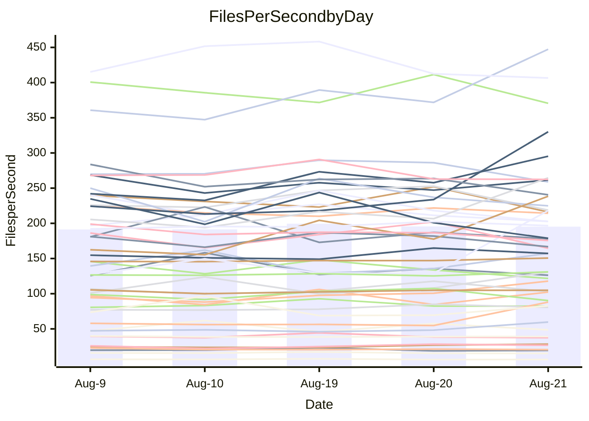

<!---
# This file is auto-generated. Do not edit.
# cspell:disable
--->
# Performance Report

Daily Performance

```mermaid
xychart-beta
    title Files Per Second by Day
    y-axis Files per Second
    x-axis Date [Aug-9, Aug-10, Aug-19, Aug-20, Aug-21]
    bar [191.27, 191.48, 199.45, 195.67, 195.28]
    line [19.76, 19.87, 23.15, 18.80, 19.44]
    line [94.45, 88.13, 97.66, 100.71, 117.87]
    line [106.66, 99.38, 103.80, 117.71, 103.06]
    line [80.61, 83.15, 92.81, 82.44, 82.28]
    line [239.79, 231.09, 223.10, 252.00, 216.10]
    line [269.81, 270.47, 289.77, 286.14, 258.82]
    line [39.52, 37.52, 44.46, 38.46, 37.55]
    line [268.54, 243.09, 257.77, 247.18, 261.52]
    line [6.78, 6.60, 7.51, 6.38, 6.46]
    line [240.17, 211.99, 227.00, 211.38, 202.65]
    line [125.68, 158.27, 127.25, 135.61, 126.31]
    line [225.24, 214.74, 210.02, 221.88, 214.31]
    line [225.91, 222.58, 246.74, 252.74, 218.76]
    line [145.75, 128.32, 148.05, 133.76, 121.69]
    line [24.65, 23.72, 23.68, 26.94, 28.23]
    line [139.45, 161.93, 128.87, 135.71, 157.41]
    line [25.95, 22.03, 24.86, 28.29, 26.71]
    line [154.75, 150.93, 149.02, 164.86, 157.25]
    line [15.80, 15.53, 17.25, 15.28, 15.17]
    line [196.97, 211.99, 246.59, 218.10, 202.63]
    line [180.75, 223.35, 172.94, 187.16, 178.01]
    line [96.93, 84.41, 106.12, 84.61, 102.23]
    line [77.16, 76.75, 77.91, 84.91, 80.55]
    line [400.74, 385.62, 371.65, 411.46, 370.61]
    line [145.79, 145.58, 147.10, 147.08, 150.58]
    line [249.96, 202.34, 263.67, 236.99, 224.88]
    line [186.27, 165.43, 184.07, 202.12, 164.56]
    line [224.37, 213.27, 217.89, 233.79, 330.15]
    line [47.00, 61.84, 45.89, 57.63, 48.63]
    line [127.47, 149.55, 129.16, 129.10, 218.14]
    line [181.18, 166.12, 186.93, 181.85, 166.73]
    line [57.90, 56.15, 56.35, 54.76, 88.05]
    line [101.07, 123.80, 99.87, 108.06, 130.68]
    line [98.84, 91.76, 103.43, 107.49, 90.18]
    line [162.48, 155.40, 204.32, 177.59, 238.45]
    line [360.76, 347.31, 389.41, 371.89, 447.40]
    line [198.91, 184.05, 187.41, 186.67, 175.57]
    line [242.10, 232.62, 273.32, 257.69, 295.30]
    line [73.60, 96.61, 68.89, 69.48, 82.76]
    line [415.14, 451.69, 458.22, 412.53, 406.57]
    line [283.77, 252.09, 262.36, 263.68, 240.51]
    line [22.84, 20.59, 20.47, 21.22, 20.56]
    line [205.56, 193.98, 216.67, 206.61, 264.70]
    line [126.64, 126.17, 128.45, 125.27, 130.99]
    line [105.46, 100.11, 102.43, 104.89, 104.87]
    line [47.26, 48.66, 46.00, 48.26, 59.72]
    line [268.09, 268.70, 290.78, 262.94, 262.44]
    line [234.76, 198.61, 243.75, 200.90, 178.74]
    line [39.98, 38.63, 38.64, 39.11, 39.12]
    line [192.03, 195.48, 194.87, 202.54, 196.68]
```

Time to Process Files

| Repository                                      | Elapsed | Min/Avg/Max          |    SD | SD Graph                |
| ----------------------------------------------- | ------: | :------------------: | ----: | ----------------------- |
| AdaDoom3/AdaDoom3                    |    2.74 | 2.1 /   2.6 /   2.9  |  0.27 | `    ┣━━┻━━╋●━┻━━┫    ` |
| alexiosc/megistos                    |    7.09 | 5.5 /   7.0 /   7.9  |  0.50 | `    ┣━━┻━━●━━┻━━┫    ` |
| apollographql/apollo-server          |    2.48 | 1.8 /   2.4 /   2.8  |  0.26 | `    ┣━━┻━━╋●━┻━━┫    ` |
| aspnetboilerplate/aspnetboilerplate  |    8.84 | 6.3 /   8.4 /   9.1  |  0.97 | `    ┣━━┻━━╋━●┻━━┫    ` |
| aws-amplify/docs                     |   14.02 | 9.6 /  12.8 /  14.0  |  1.16 | `    ┣━━┻━━╋━━●━━┫    ` |
| Azure/azure-rest-api-specs           |    9.79 | 7.2 /  10.0 /  11.2  |  0.90 | `    ┣━━┻━●╋━━┻━━┫    ` |
| bitjson/typescript-starter           |    1.03 | 0.6 /   1.0 /   1.1  |  0.11 | `     ┣━┻━━╋●━┻━┫     ` |
| caddyserver/caddy                    |    2.83 | 2.5 /   3.5 /   3.9  |  0.39 | `    ┣●━┻━━╋━━┻━━┫    ` |
| canada-ca/open-source-logiciel-libre |    1.08 | 0.8 /   1.0 /   1.3  |  0.12 | `     ┣━┻━━╋●━┻━┫     ` |
| chef/chef                            |    5.10 | 3.0 /   4.6 /   5.3  |  0.59 | `    ┣━━┻━━╋━●┻━━┫    ` |
| dart-lang/sdk                        |   57.34 | 34.3 /  55.7 /  64.6 |  7.21 | `  ┣━━━┻━━━╋●━━┻━━━┫  ` |
| django/django                        |   13.40 | 10.2 /  12.6 /  14.6 |  1.57 | `   ┣━━━┻━━╋━●┻━━━┫   ` |
| eslint/eslint                        |    9.71 | 7.6 /   9.5 /  10.3  |  0.82 | `    ┣━━┻━━╋●━┻━━┫    ` |
| exonum/exonum                        |    3.33 | 2.6 /   3.2 /   3.7  |  0.27 | `    ┣━━┻━━╋●━┻━━┫    ` |
| flutter/samples                      |   13.99 | 8.0 /  12.2 /  13.4  |  1.34 | `    ┣━━┻━━╋━━┻●━┫    ` |
| gitbucket/gitbucket                  |    2.66 | 2.5 /   3.1 /   3.4  |  0.32 | `    ┣━●┻━━╋━━┻━━┫    ` |
| googleapis/google-cloud-cpp          |  127.38 | 96.3 / 118.3 / 127.8 | 11.80 | `  ┣━━━┻━━━╋━━●┻━━━┫  ` |
| graphql/express-graphql              |    0.92 | 0.7 /   1.1 /   1.2  |  0.11 | `     ┣━●━━╋━━┻━┫     ` |
| graphql/graphql-js                   |    3.50 | 2.8 /   3.6 /   3.9  |  0.27 | `    ┣━━┻━●╋━━┻━━┫    ` |
| graphql/graphql-relay-js             |    1.05 | 0.7 /   1.1 /   1.3  |  0.11 | `     ┣━┻━●╋━━┻━┫     ` |
| graphql/graphql-spec                 |    1.25 | 0.8 /   1.2 /   1.3  |  0.15 | `     ┣━┻━━╋●━┻━┫     ` |
| iluwatar/java-design-patterns        |   12.26 | 8.8 /  11.7 /  12.8  |  1.21 | `    ┣━━┻━━╋●━┻━━┫    ` |
| ktaranov/sqlserver-kit               |    4.79 | 3.3 /   5.4 /   6.2  |  0.90 | `    ┣━━┻●━╋━━┻━━┫    ` |
| liriliri/licia                       |    3.89 | 2.9 /   3.7 /   4.1  |  0.35 | `    ┣━━┻━━╋━●┻━━┫    ` |
| MartinThoma/LaTeX-examples           |    6.27 | 4.5 /   5.8 /   7.0  |  0.73 | `    ┣━━┻━━╋━●┻━━┫    ` |
| mdx-js/mdx                           |    1.73 | 1.5 /   1.8 /   1.9  |  0.10 | `     ┣━┻━●╋━━┻━┫     ` |
| microsoft/TypeScript-Website         |    5.08 | 5.0 /   5.2 /   5.6  |  0.21 | `    ┣━━┻●━╋━━┻━━┫    ` |
| MicrosoftDocs/PowerShell-Docs        |   14.33 | 20.9 /  24.1 /  25.8 |  1.02 | `●       ┣┻╋┻┫        ` |
| neovim/nvim-lspconfig                |    5.28 | 3.7 /   4.7 /   5.6  |  0.61 | `    ┣━━┻━━╋━━●━━┫    ` |
| pagekit/pagekit                      |    2.24 | 2.5 /   3.3 /   3.6  |  0.29 | `●   ┣━━┻━━╋━━┻━━┫    ` |
| php/php-src                          |   18.28 | 19.2 /  23.1 /  26.1 |  2.30 | `   ●━━━┻━━╋━━┻━━━┫   ` |
| plasticrake/tplink-smarthome-api     |    1.27 | 0.9 /   1.2 /   1.4  |  0.16 | `     ┣━┻━━●━━┻━┫     ` |
| prettier/prettier                    |    6.00 | 5.8 /   7.3 /   8.0  |  0.72 | `    ●━━┻━━╋━━┻━━┫    ` |
| pycontribs/jira                      |    0.91 | 1.1 /   1.4 /   1.5  |  0.08 | `●      ┣┻━╋━┻┫       ` |
| RustPython/RustPython                |    9.69 | 5.8 /   8.8 /  11.1  |  1.34 | `    ┣━━┻━━╋━●┻━━┫    ` |
| shoelace-style/shoelace              |    1.85 | 1.8 /   2.6 /   3.0  |  0.38 | `    ●━━┻━━╋━━┻━━┫    ` |
| slint-ui/slint                       |   12.92 | 11.6 /  15.1 /  16.1 |  1.28 | `   ┣●━━┻━━╋━━┻━━━┫   ` |
| SoftwareBrothers/admin-bro           |    2.51 | 1.6 /   2.3 /   2.6  |  0.22 | `     ┣━┻━━╋━●┻━┫     ` |
| sveltejs/svelte                      |   22.02 | 16.9 /  21.2 /  23.0 |  2.06 | `   ┣━━━┻━━╋●━┻━━━┫   ` |
| TheAlgorithms/Python                 |    5.87 | 3.0 /   5.3 /   5.9  |  0.64 | `    ┣━━┻━━╋━━●━━┫    ` |
| twbs/bootstrap                       |    1.43 | 1.2 /   1.6 /   1.9  |  0.18 | `     ┣━●━━╋━━┻━┫     ` |
| typescript-cheatsheets/react         |    1.17 | 0.7 /   1.1 /   1.3  |  0.12 | `     ┣━┻━━╋●━┻━┫     ` |
| typescript-eslint/typescript-eslint  |    3.27 | 3.9 /   4.2 /   4.7  |  0.27 | `●   ┣━━┻━━╋━━┻━━┫    ` |
| vitest-dev/vitest                    |   10.55 | 8.2 /  10.2 /  10.8  |  0.73 | `    ┣━━┻━━╋●━┻━━┫    ` |
| w3c/aria-practices                   |    3.18 | 3.1 /   3.3 /   3.5  |  0.11 | `     ┣━●━━╋━━┻━┫     ` |
| w3c/specberus                        |    1.81 | 1.5 /   1.8 /   2.2  |  0.16 | `     ┣━┻━━●━━┻━┫     ` |
| webdeveric/webpack-assets-manifest   |    0.92 | 0.9 /   1.2 /   1.4  |  0.11 | `    ●┣━┻━━╋━━┻━┫     ` |
| webpack/webpack                      |    7.38 | 3.7 /   6.0 /   7.0  |  1.05 | `    ┣━━┻━━╋━━┻●━┫    ` |
| wireapp/wire-desktop                 |    1.30 | 1.1 /   1.3 /   1.5  |  0.11 | `     ┣━┻━━●━━┻━┫     ` |
| wireapp/wire-webapp                  |   12.84 | 10.3 /  12.8 /  14.2 |  0.79 | `    ┣━━┻━━●━━┻━━┫    ` |

Note:
- Elapsed time is in seconds.

Files per Second over Time

| Repository                                      | Files |    Sec |    Fps |     Rel | Trend Fps          |    N |
| ----------------------------------------------- | ----: | -----: | -----: | ------: | ------------------ | ---: |
| AdaDoom3/AdaDoom3                    |   103 |   2.74 |  37.55 |  -6.36% | `▇▃▃▇▂▂▃▃▃█▇▃▃▆▃▃` |   15 |
| alexiosc/megistos                    |   583 |   7.09 |  82.28 |  -1.71% | `▃▄▃▃▃▂▄▄▄█▄▃▄▃▄▄` |   15 |
| apollographql/apollo-server          |   256 |   2.48 | 103.06 |  -5.05% | `▂▂▃▂▃▆▅▂▃▃▃█▃▅▃▃` |   15 |
| aspnetboilerplate/aspnetboilerplate  |  2288 |   8.84 | 258.82 |  -6.97% | `▂▂▂▃▃▂▇▃█▂▂▃▂█▃▂` |   15 |
| aws-amplify/docs                     |  3030 |  14.02 | 216.10 |  -9.63% | `▂▂▃▂▃▆▅▃▃▂▃▃▃█▃▂` |   15 |
| Azure/azure-rest-api-specs           |  2561 |   9.79 | 261.52 |   0.98% | `█▃▅▃▃▂▃▂▃▃▃▂▃▂▃▃` |   15 |
| bitjson/typescript-starter           |    20 |   1.03 |  19.44 |  -3.70% | `▄▃▃▃▂▂▂▃█▂▃▂▁▂▂▂` |   15 |
| caddyserver/caddy                    |   333 |   2.83 | 117.87 |  22.35% | `▃▃▂▂▆▄▂▂▂▅▃▃▂▃█▆` |   15 |
| canada-ca/open-source-logiciel-libre |     7 |   1.08 |   6.46 |  -5.07% | `▄▃▄▃▇▁▄▃█▄▃▂▄▄▃▃` |   15 |
| chef/chef                            |  1034 |   5.10 | 202.65 | -11.11% | `▃▁▆▂▂▂█▂▂▂▄▂▂▂▂▂` |   15 |
| dart-lang/sdk                        | 11618 |  57.34 | 202.63 |  -5.10% | `▂▂▂▁▂▂▂▃▂█▂▅▂▂▂▂` |   15 |
| django/django                        |  2931 |  13.40 | 218.76 |  -7.70% | `▂▃▂▂▆▃█▃▇▃▅█▂█▅▃` |   15 |
| eslint/eslint                        |  2082 |   9.71 | 214.31 |  -2.85% | `▃▇█▂▃▂▃▃▃▃▂▆▃▃▃▃` |   15 |
| exonum/exonum                        |   421 |   3.33 | 126.31 |  -3.44% | `▂▃▃▅▄▃▄█▃▄▄▄█▄▃▄` |   15 |
| flutter/samples                      |  1703 |  13.99 | 121.69 | -14.21% | `▃▁▂▂█▂▂▂▂▄▄▂▂▂▂▁` |   15 |
| gitbucket/gitbucket                  |   418 |   2.66 | 157.41 |  14.21% | `▃█▃▂▃▇▃▇▂▂▄▇▂▃▃▇` |   15 |
| googleapis/google-cloud-cpp          | 21238 | 127.38 | 166.73 |  -8.14% | `█▇▂▂▃▃▃▂█▃▃▇▃▃▃▂` |   15 |
| graphql/express-graphql              |    26 |   0.92 |  28.23 |  12.91% | `▃▆▂▃▂▂▃▃▃▂▂▃▃▃█▅` |   15 |
| graphql/graphql-js                   |   551 |   3.50 | 157.25 |   0.77% | `▄▃▃▂▃▇▃▃▃▃▃█▃▃▄▄` |   15 |
| graphql/graphql-relay-js             |    28 |   1.05 |  26.71 |   2.35% | `▃▃▃▃▃▅▂▁▃▃▃▃▃█▃▃` |   15 |
| graphql/graphql-spec                 |    19 |   1.25 |  15.17 |  -4.81% | `▂▂▂█▂▂▂▃▇▂▃▃▃▂▂▂` |   15 |
| iluwatar/java-design-patterns        |  2183 |  12.26 | 178.01 |  -3.11% | `▃▃▂▃▂▄█▇▂▃▃▃▃▄▆▃` |   15 |
| ktaranov/sqlserver-kit               |   490 |   4.79 | 102.23 |   8.01% | `▂▁▂█▁▅▂▂▂█▂▂▂▂▂▄` |   15 |
| liriliri/licia                       |  1442 |   3.89 | 370.61 |  -6.59% | `▃▂▃▂█▇▄▃▃▃▃▃█▄▄▃` |   15 |
| MartinThoma/LaTeX-examples           |  1409 |   6.27 | 224.88 |  -8.61% | `▂▄█▄▇▃▃▂▃▇▅▃▃▆▃▃` |   15 |
| mdx-js/mdx                           |   139 |   1.73 |  80.55 |   1.51% | `▆▄▃▅▃▅▃▄▅▅▃▅▆█▇▅` |   15 |
| microsoft/TypeScript-Website         |   765 |   5.08 | 150.58 |   2.87% | `▆█▇▅▄▆▇▆█▅██▄▇▇▇` |   15 |
| MicrosoftDocs/PowerShell-Docs        |  3126 |  14.33 | 218.14 |  68.16% | `▂▂▂▁▂▂▂▃▂▂▂▂▂▂▂█` |   15 |
| neovim/nvim-lspconfig                |   869 |   5.28 | 164.56 | -12.78% | `▂▂▅█▆▃▅▃▃▆▄▆▆█▃▃` |   15 |
| pagekit/pagekit                      |   741 |   2.24 | 330.15 |  46.83% | `▂▂▂▂▂▅▂▂▂▂▂▆▂▂▂█` |   15 |
| php/php-src                          |  2389 |  18.28 | 130.68 |  25.40% | `▃▃▂▃▃▇▄▇▃▅▂▃▇▃▅█` |   15 |
| plasticrake/tplink-smarthome-api     |    62 |   1.27 |  48.63 |  -3.90% | `▂▂▃▂▂▁▃▆▂▂▂▆▃▂█▃` |   15 |
| prettier/prettier                    |  2685 |   6.00 | 447.40 |  21.39% | `▃▂▃█▃▂▃▃▃█▃▇▃▃▃▇` |   15 |
| pycontribs/jira                      |    80 |   0.91 |  88.05 |  55.10% | `▅▂▂▂▂▂▂▂▂▂▂▂▂▂█`  |   14 |
| RustPython/RustPython                |   874 |   9.69 |  90.18 | -11.23% | `▁▂▂▃▃▆▅▃▃▃▅▃▃█▃▂` |   15 |
| shoelace-style/shoelace              |   440 |   1.85 | 238.45 |  36.73% | `▂▁▂▂▅▂▂▂▂█▆▂▂▂▇▇` |   15 |
| slint-ui/slint                       |  3815 |  12.92 | 295.30 |  17.24% | `▃▃▂▂▃▃▂▂▃█▃▂▃▇▂▆` |   15 |
| SoftwareBrothers/admin-bro           |   441 |   2.51 | 175.57 |  -8.73% | `█▃▃▃▂▃▂▂▃▃▃▅▂▂▂▂` |   15 |
| sveltejs/svelte                      |  8954 |  22.02 | 406.57 |  -4.45% | `▂▂▂▂▃▃█▅█▅▂▅▂▃▃▃` |   15 |
| TheAlgorithms/Python                 |  1411 |   5.87 | 240.51 | -11.58% | `▂▁▁▂▂█▂▂▂▂▂▂▂▂▂▁` |   15 |
| twbs/bootstrap                       |   118 |   1.43 |  82.76 |  13.22% | `▃▄▂▆▃▂▆█▃▃▃▃▃▄▃▆` |   15 |
| typescript-cheatsheets/react         |    24 |   1.17 |  20.56 |  -5.62% | `▂▃█▁▃▂▃▂▂▂▂▃▂▃▃▂` |   15 |
| typescript-eslint/typescript-eslint  |   866 |   3.27 | 264.70 |  27.70% | `▂▅▃▃▄▄▄▃▅▄▄▄▄▂▄█` |   15 |
| vitest-dev/vitest                    |  2769 |  10.55 | 262.44 |  -3.27% | `▂▃▃▃▂▂▇▃▃█▃▃▂▄▃▃` |   15 |
| w3c/aria-practices                   |   417 |   3.18 | 130.99 |   3.46% | `█▇▄▆▄▇▇▆▇▆▆▅▆▇▅▇` |   15 |
| w3c/specberus                        |   190 |   1.81 | 104.87 |   0.50% | `█▅▄▄▄▃▅▄▄▅▄▂▇▄▅▅` |   15 |
| webdeveric/webpack-assets-manifest   |    55 |   0.92 |  59.72 |  26.08% | `▄▆▃▄▃▃▅▄▄▃▃▄█▄▂█` |   15 |
| webpack/webpack                      |  1319 |   7.38 | 178.74 | -20.60% | `▄▂▄▁▂█▂▂▁█▂▂▃▁▁▁` |   15 |
| wireapp/wire-desktop                 |    51 |   1.30 |  39.12 |  -0.70% | `▃▂█▄▄▃█▄▄▄▄▃▄▄▆▄` |   15 |
| wireapp/wire-webapp                  |  2526 |  12.84 | 196.68 |   0.54% | `▄▃▃▃▃▄▄▄▄▃▄▄▂▃█▄` |   15 |

Data Throughput

| Repository                                      | Files |    Sec |     Kps |     Rel | Trend Kps          |    N |
| ----------------------------------------------- | ----: | -----: | ------: | ------: | ------------------ | ---: |
| AdaDoom3/AdaDoom3                    |   103 |   2.74 |  797.92 |  -6.36% | `▇▃▃▇▂▂▃▃▃█▇▃▃▆▃▃` |   15 |
| alexiosc/megistos                    |   583 |   7.09 |  646.51 |  -1.71% | `▃▄▃▃▃▂▄▄▄█▄▃▄▃▄▄` |   15 |
| apollographql/apollo-server          |   256 |   2.48 |  848.67 |  -5.05% | `▂▂▃▂▃▆▅▂▃▃▃█▃▅▃▃` |   15 |
| aspnetboilerplate/aspnetboilerplate  |  2288 |   8.84 |  632.92 |  -6.97% | `▂▂▂▃▃▂▇▃█▂▂▃▂█▃▂` |   15 |
| aws-amplify/docs                     |  3030 |  14.02 |  844.80 |  -9.53% | `▂▂▃▂▃▆▅▃▃▂▃▃▃█▃▂` |   15 |
| Azure/azure-rest-api-specs           |  2561 |   9.79 |  801.21 |   1.53% | `█▃▅▃▃▂▃▂▃▃▃▃▃▂▃▃` |   15 |
| bitjson/typescript-starter           |    20 |   1.03 |   77.76 |  -3.70% | `▄▃▃▃▂▂▂▃█▂▃▂▁▂▂▂` |   15 |
| caddyserver/caddy                    |   333 |   2.83 | 1073.94 |  22.20% | `▃▃▂▂▆▄▂▂▂▅▃▃▂▃█▆` |   15 |
| canada-ca/open-source-logiciel-libre |     7 |   1.08 |   53.55 |  -5.07% | `▄▃▄▃▇▁▄▃█▄▃▂▄▄▃▃` |   15 |
| chef/chef                            |  1034 |   5.10 |  995.03 | -11.11% | `▃▁▆▂▂▂█▂▂▂▄▂▂▂▂▂` |   15 |
| dart-lang/sdk                        | 11618 |  57.34 | 1407.31 |  -4.78% | `▂▂▂▁▂▂▂▃▂█▂▅▂▂▂▂` |   15 |
| django/django                        |  2931 |  13.40 | 1410.91 |  -7.58% | `▂▃▂▂▆▃█▃▇▃▅█▂█▅▃` |   15 |
| eslint/eslint                        |  2082 |   9.71 | 1504.51 |  -2.85% | `▃▇█▂▃▂▃▃▃▃▂▆▃▃▃▃` |   15 |
| exonum/exonum                        |   421 |   3.33 | 1208.21 |  -3.44% | `▂▃▃▅▄▃▄█▃▄▄▄█▄▃▄` |   15 |
| flutter/samples                      |  1703 |  13.99 |  725.36 | -14.39% | `▃▁▂▂█▂▂▂▂▄▄▂▂▂▂▁` |   15 |
| gitbucket/gitbucket                  |   418 |   2.66 |  778.78 |  14.82% | `▃█▃▂▂▇▃▇▂▂▄▇▂▃▃▇` |   15 |
| googleapis/google-cloud-cpp          | 21238 | 127.38 | 1448.48 |  -8.09% | `█▇▂▂▃▃▃▂█▃▃▇▃▃▃▂` |   15 |
| graphql/express-graphql              |    26 |   0.92 |  129.21 |  12.91% | `▃▆▂▃▂▂▃▃▃▂▂▃▃▃█▅` |   15 |
| graphql/graphql-js                   |   551 |   3.50 | 1172.69 |   0.77% | `▄▃▃▂▃▇▃▃▃▃▃█▃▃▄▄` |   15 |
| graphql/graphql-relay-js             |    28 |   1.05 |  104.93 |   2.35% | `▃▃▃▃▃▅▂▁▃▃▃▃▃█▃▃` |   15 |
| graphql/graphql-spec                 |    19 |   1.25 |  507.67 |  -4.81% | `▂▂▂█▂▂▂▃▇▂▃▃▃▂▂▂` |   15 |
| iluwatar/java-design-patterns        |  2183 |  12.26 |  549.94 |  -2.99% | `▃▃▂▃▂▄█▇▃▃▃▃▃▄▆▃` |   15 |
| ktaranov/sqlserver-kit               |   490 |   4.79 | 1548.67 |   8.01% | `▂▁▂█▁▅▂▂▂█▂▂▂▂▂▄` |   15 |
| liriliri/licia                       |  1442 |   3.89 |  444.37 |  -6.36% | `▃▂▃▂█▇▄▃▃▃▃▃█▄▄▃` |   15 |
| MartinThoma/LaTeX-examples           |  1409 |   6.27 |  464.45 |  -8.61% | `▂▄█▄▇▃▃▂▃▇▅▃▃▆▃▃` |   15 |
| mdx-js/mdx                           |   139 |   1.73 |  379.58 |   1.51% | `▆▄▃▅▃▅▃▄▅▅▃▅▆█▇▅` |   15 |
| microsoft/TypeScript-Website         |   765 |   5.08 | 1038.32 |   2.88% | `▆█▇▅▄▆▇▆█▅██▄▇▇▇` |   15 |
| MicrosoftDocs/PowerShell-Docs        |  3126 |  14.33 | 2329.71 |  68.24% | `▂▂▂▁▂▂▂▃▂▂▂▂▂▂▂█` |   15 |
| neovim/nvim-lspconfig                |   869 |   5.28 |  482.70 | -12.87% | `▂▂▅█▆▃▅▃▃▆▄▆▆█▃▃` |   15 |
| pagekit/pagekit                      |   741 |   2.24 |  688.36 |  46.83% | `▂▂▂▂▂▅▂▂▂▂▂▆▂▂▂█` |   15 |
| php/php-src                          |  2389 |  18.28 | 2311.91 |  25.43% | `▃▃▂▃▃▇▄▇▃▅▂▃▇▃▅█` |   15 |
| plasticrake/tplink-smarthome-api     |    62 |   1.27 |  262.77 |  -3.90% | `▂▂▃▂▂▁▃▆▂▂▂▆▃▂█▃` |   15 |
| prettier/prettier                    |  2685 |   6.00 |  632.36 |  21.05% | `▃▂▃█▃▂▃▃▃█▃▇▃▃▃▇` |   15 |
| pycontribs/jira                      |    80 |   0.91 |  621.86 |  55.10% | `▅▂▂▂▂▂▂▂▂▂▂▂▂▂█`  |   14 |
| RustPython/RustPython                |   874 |   9.69 | 1985.89 | -11.07% | `▁▂▂▃▃▆▅▃▃▃▅▃▃█▃▂` |   15 |
| shoelace-style/shoelace              |   440 |   1.85 | 1151.62 |  36.73% | `▂▁▂▂▅▂▂▂▂█▆▂▂▂▇▇` |   15 |
| slint-ui/slint                       |  3815 |  12.92 | 1588.81 |  17.45% | `▃▃▂▂▃▃▂▂▃█▃▂▃▇▂▆` |   15 |
| SoftwareBrothers/admin-bro           |   441 |   2.51 |  386.97 |  -8.73% | `█▃▃▃▂▃▂▂▃▃▃▅▂▂▂▂` |   15 |
| sveltejs/svelte                      |  8954 |  22.02 |  279.21 |  -4.39% | `▂▂▂▂▃▃█▅█▅▂▅▂▃▃▃` |   15 |
| TheAlgorithms/Python                 |  1411 |   5.87 |  615.15 | -11.58% | `▂▁▁▂▂█▂▂▂▂▂▂▂▂▂▁` |   15 |
| twbs/bootstrap                       |   118 |   1.43 |  678.88 |  13.22% | `▃▄▂▆▃▂▆█▃▃▃▃▃▄▃▆` |   15 |
| typescript-cheatsheets/react         |    24 |   1.17 |  185.91 |  -5.62% | `▂▃█▁▃▂▃▂▂▂▂▃▂▃▃▂` |   15 |
| typescript-eslint/typescript-eslint  |   866 |   3.27 |  889.47 |  27.64% | `▂▅▃▃▄▄▄▃▅▄▄▄▄▂▄█` |   15 |
| vitest-dev/vitest                    |  2769 |  10.55 |  758.51 |  -2.00% | `▂▃▃▃▂▂▆▃▃█▄▃▃▄▃▃` |   15 |
| w3c/aria-practices                   |   417 |   3.18 | 1232.03 |   3.46% | `█▇▄▆▄▇▇▆▇▆▆▅▆▇▅▇` |   15 |
| w3c/specberus                        |   190 |   1.81 |  342.76 |   0.59% | `█▅▄▄▄▃▅▄▄▅▄▂▇▄▅▅` |   15 |
| webdeveric/webpack-assets-manifest   |    55 |   0.92 |  137.91 |  26.08% | `▄▆▃▄▃▃▅▄▄▃▃▄█▄▂█` |   15 |
| webpack/webpack                      |  1319 |   7.38 | 1220.72 | -15.51% | `▃▁▃▁▁▇▂▁▂█▂▂▃▂▂▁` |   15 |
| wireapp/wire-desktop                 |    51 |   1.30 |  166.45 |  -0.70% | `▃▂█▄▄▃█▄▄▄▄▃▄▄▆▄` |   15 |
| wireapp/wire-webapp                  |  2526 |  12.84 |  830.18 |   0.80% | `▃▃▃▃▃▄▄▄▄▃▄▄▂▃█▄` |   15 |

