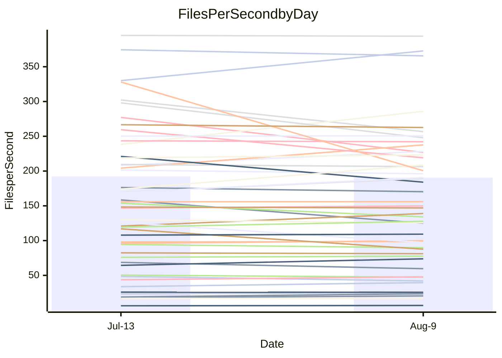

<!---
# This file is auto-generated. Do not edit.
# cspell:disable
--->
# Performance Report

Daily Performance

```mermaid
xychart-beta
    title Files Per Second by Day
    y-axis Files per Second
    x-axis Date [Jul-13, Aug-9]
    bar [192.31, 190.47]
    line [17.82, 20.46]
    line [97.93, 98.72]
    line [302.24, 256.64]
    line [94.47, 89.76]
    line [82.41, 81.19]
    line [48.47, 42.05]
    line [277.07, 226.77]
    line [6.29, 6.69]
    line [238.39, 285.90]
    line [208.19, 228.22]
    line [158.48, 124.99]
    line [204.20, 237.64]
    line [209.39, 206.36]
    line [153.81, 134.11]
    line [120.84, 138.97]
    line [23.34, 25.28]
    line [146.76, 149.90]
    line [25.88, 25.69]
    line [17.18, 16.70]
    line [201.45, 196.10]
    line [176.39, 170.29]
    line [96.02, 99.76]
    line [298.01, 247.91]
    line [76.00, 77.63]
    line [148.29, 146.98]
    line [374.43, 365.68]
    line [259.46, 219.06]
    line [221.06, 184.00]
    line [129.95, 125.65]
    line [126.09, 97.29]
    line [68.71, 59.61]
    line [155.87, 156.07]
    line [169.41, 189.57]
    line [50.42, 47.38]
    line [116.87, 87.65]
    line [330.04, 372.69]
    line [243.47, 242.15]
    line [64.41, 73.81]
    line [174.01, 208.71]
    line [250.26, 250.59]
    line [18.90, 23.53]
    line [328.06, 200.44]
    line [395.07, 393.89]
    line [119.39, 127.67]
    line [266.63, 262.63]
    line [33.78, 39.60]
    line [43.65, 47.87]
    line [107.84, 109.23]
    line [218.96, 223.24]
    line [169.05, 190.65]
```

Time to Process Files

| Repository                                      | Elapsed | Min/Avg/Max          |    SD | SD Graph                |
| ----------------------------------------------- | ------: | :------------------: | ----: | ----------------------- |
| AdaDoom3/AdaDoom3                    |    2.19 | 2.1 /   2.5 /   2.8  |  0.28 | `    ┣━━●━━╋━━┻━━┫    ` |
| alexiosc/megistos                    |    7.36 | 6.9 /   7.1 /   7.4  |  0.20 | `    ┣━━┻━━╋━━●━━┫    ` |
| apollographql/apollo-server          |    2.60 | 2.4 /   2.6 /   2.8  |  0.13 | `     ┣━┻━━●━━┻━┫     ` |
| aspnetboilerplate/aspnetboilerplate  |    8.62 | 7.6 /   8.7 /   9.1  |  0.63 | `    ┣━━┻━━●━━┻━━┫    ` |
| aws-amplify/docs                     |   13.45 | 10.7 /  12.7 /  13.6 |  1.18 | `    ┣━━┻━━╋━●┻━━┫    ` |
| Azure/azure-rest-api-specs           |   10.36 | 7.2 /   9.2 /  10.4  |  1.34 | `    ┣━━┻━━╋━━●━━┫    ` |
| bitjson/typescript-starter           |    1.01 | 0.9 /   1.0 /   1.1  |  0.08 | `     ┣━┻━━●━━┻━┫     ` |
| caddyserver/caddy                    |    3.89 | 3.4 /   3.5 /   3.7  |  0.11 | `     ┣━┻━━╋━━┻━┫    ●` |
| canada-ca/open-source-logiciel-libre |    1.06 | 1.0 /   1.1 /   1.1  |  0.04 | `     ┣━━┻━●━┻━━┫     ` |
| chef/chef                            |    4.88 | 3.6 /   4.6 /   5.3  |  0.64 | `    ┣━━┻━━╋●━┻━━┫    ` |
| dart-lang/sdk                        |   64.64 | 57.0 /  57.5 /  58.0 |  0.36 | `         ┣╋┫        ●` |
| django/django                        |   14.65 | 13.7 /  14.0 /  14.4 |  0.26 | `    ┣━━┻━━╋━━┻━━┫●   ` |
| eslint/eslint                        |   10.31 | 7.6 /   8.9 /  10.2  |  1.12 | `    ┣━━┻━━╋━━┻●━┫    ` |
| exonum/exonum                        |    3.04 | 2.7 /   3.3 /   3.7  |  0.38 | `    ┣━━┻●━╋━━┻━━┫    ` |
| flutter/samples                      |   13.26 | 11.0 /  12.1 /  13.4 |  0.96 | `    ┣━━┻━━╋━━┻●━┫    ` |
| gitbucket/gitbucket                  |    3.35 | 2.5 /   3.1 /   3.5  |  0.37 | `    ┣━━┻━━╋━●┻━━┫    ` |
| googleapis/google-cloud-cpp          |  127.39 | 96.9 / 113.4 / 127.7 | 13.57 | `  ┣━━━┻━━━╋━━━●━━━┫  ` |
| graphql/express-graphql              |    1.05 | 0.8 /   1.1 /   1.2  |  0.13 | `     ┣━┻━━●━━┻━┫     ` |
| graphql/graphql-js                   |    3.85 | 3.5 /   3.7 /   3.7  |  0.08 | `     ┣━┻━━╋━━┻━┫ ●   ` |
| graphql/graphql-relay-js             |    1.10 | 1.1 /   1.1 /   1.1  |  0.01 | `     ┣━━┻━╋━●━━┫     ` |
| graphql/graphql-spec                 |    0.84 | 1.1 /   1.2 /   1.3  |  0.08 | `●     ┣━┻━╋━┻━┫      ` |
| iluwatar/java-design-patterns        |   12.13 | 11.8 /  12.2 /  12.8 |  0.36 | `    ┣━━┻━●╋━━┻━━┫    ` |
| ktaranov/sqlserver-kit               |    3.31 | 5.1 /   5.7 /   6.1  |  0.38 | `●      ┣┻━╋━┻┫       ` |
| liriliri/licia                       |    4.07 | 3.8 /   3.9 /   4.0  |  0.07 | `     ┣━┻━━╋━━┻━┫ ●   ` |
| MartinThoma/LaTeX-examples           |    5.92 | 4.5 /   5.5 /   6.9  |  0.96 | `    ┣━━┻━━╋●━┻━━┫    ` |
| mdx-js/mdx                           |    1.73 | 1.7 /   1.8 /   1.9  |  0.08 | `     ┣━●━━╋━━┻━┫     ` |
| microsoft/TypeScript-Website         |    5.44 | 5.0 /   5.1 /   5.3  |  0.11 | `     ┣━┻━━╋━━┻━┫  ●  ` |
| MicrosoftDocs/PowerShell-Docs        |   25.75 | 24.1 /  24.5 /  24.8 |  0.37 | `    ┣━━┻━━╋━━┻━━┫   ●` |
| neovim/nvim-lspconfig                |    3.86 | 3.9 /   4.8 /   5.6  |  0.73 | `    ┣━●┻━━╋━━┻━━┫    ` |
| pagekit/pagekit                      |    3.34 | 2.9 /   3.3 /   3.5  |  0.25 | `    ┣━━┻━━╋●━┻━━┫    ` |
| php/php-src                          |   24.31 | 18.3 /  23.0 /  25.3 |  2.76 | `   ┣━━━┻━━╋━●┻━━━┫   ` |
| plasticrake/tplink-smarthome-api     |    1.31 | 1.2 /   1.3 /   1.3  |  0.04 | `     ┣━━┻━╋━●━━┫     ` |
| prettier/prettier                    |    5.85 | 7.6 /   7.8 /   8.0  |  0.14 | `●        ┣╋┫         ` |
| pycontribs/jira                      |    1.44 | 1.1 /   1.3 /   1.4  |  0.13 | `     ┣━┻━━╋━━●━┫     ` |
| RustPython/RustPython                |    9.29 | 7.1 /   9.3 /  11.1  |  1.44 | `    ┣━━┻━━●━━┻━━┫    ` |
| shoelace-style/shoelace              |    2.73 | 2.7 /   2.8 /   3.0  |  0.07 | `     ┣●┻━━╋━━┻━┫     ` |
| slint-ui/slint                       |   15.88 | 14.0 /  14.9 /  15.5 |  0.57 | `    ┣━━┻━━╋━━┻━●┫    ` |
| SoftwareBrothers/admin-bro           |    2.32 | 1.6 /   2.2 /   2.5  |  0.35 | `    ┣━━┻━━╋●━┻━━┫    ` |
| sveltejs/svelte                      |   22.61 | 22.5 /  22.7 /  22.9 |  0.14 | `    ┣━━┻━●╋━━┻━━┫    ` |
| TheAlgorithms/Python                 |    5.48 | 5.4 /   5.7 /   5.9  |  0.21 | `    ┣━━●━━╋━━┻━━┫    ` |
| twbs/bootstrap                       |    1.37 | 1.6 /   1.7 /   1.8  |  0.10 | `●    ┣━┻━━╋━━┻━┫     ` |
| typescript-cheatsheets/react         |    1.26 | 0.7 /   1.1 /   1.3  |  0.20 | `     ┣━┻━━╋━━●━┫     ` |
| typescript-eslint/typescript-eslint  |    4.33 | 3.9 /   4.3 /   4.7  |  0.33 | `    ┣━━┻━━╋●━┻━━┫    ` |
| vitest-dev/vitest                    |   10.33 | 10.2 /  10.5 /  10.7 |  0.19 | `    ┣━━┻●━╋━━┻━━┫    ` |
| w3c/aria-practices                   |    3.28 | 3.1 /   3.3 /   3.5  |  0.17 | `    ┣━━┻━●╋━━┻━━┫    ` |
| w3c/specberus                        |    1.84 | 1.5 /   1.7 /   1.9  |  0.15 | `     ┣━┻━━╋━●┻━┫     ` |
| webdeveric/webpack-assets-manifest   |    1.17 | 1.0 /   1.2 /   1.3  |  0.08 | `     ┣━┻━━●━━┻━┫     ` |
| webpack/webpack                      |    6.71 | 5.1 /   5.6 /   6.4  |  0.51 | `    ┣━━┻━━╋━━┻━━●    ` |
| wireapp/wire-desktop                 |    1.32 | 1.1 /   1.3 /   1.5  |  0.16 | `     ┣━┻━━●━━┻━┫     ` |
| wireapp/wire-webapp                  |   13.03 | 12.7 /  13.2 /  13.9 |  0.41 | `    ┣━━┻━●╋━━┻━━┫    ` |

Note:
- Elapsed time is in seconds.

Files per Second over Time

| Repository                                      | Files |    Sec |    Fps |     Rel | Trend Fps |    N |
| ----------------------------------------------- | ----: | -----: | -----: | ------: | --------- | ---: |
| AdaDoom3/AdaDoom3                    |   103 |   2.19 |  46.97 |  10.71% | `█▇▂▃▇`   |    4 |
| alexiosc/megistos                    |   583 |   7.36 |  79.22 |  -3.38% | `▇▇█▅▅`   |    4 |
| apollographql/apollo-server          |   256 |   2.60 |  98.41 |  -0.19% | `▅▄▅█▅`   |    4 |
| aspnetboilerplate/aspnetboilerplate  |  2288 |   8.62 | 265.32 |  -0.21% | `█▃▄▃▄`   |    4 |
| aws-amplify/docs                     |  3030 |  13.45 | 225.27 |  -6.03% | `█▃▃▄▃`   |    4 |
| Azure/azure-rest-api-specs           |  2561 |  10.36 | 247.27 | -12.84% | `▂█▂▅▂`   |    4 |
| bitjson/typescript-starter           |    20 |   1.01 |  19.79 |  -0.86% | `▃█▅▆▅`   |    4 |
| caddyserver/caddy                    |   325 |   3.89 |  83.57 |  -9.63% | `██▇▅▃`   |    4 |
| canada-ca/open-source-logiciel-libre |     7 |   1.06 |   6.59 |  -0.44% | `▄▇▆█▆`   |    4 |
| chef/chef                            |  1034 |   4.88 | 211.74 |  -6.86% | `▃▄▂█▃`   |    4 |
| dart-lang/sdk                        | 11611 |  64.64 | 179.64 | -10.87% | `█▇██ `   |    4 |
| django/django                        |  2930 |  14.65 | 200.01 |  -4.17% | `▇▅█▆▅`   |    4 |
| eslint/eslint                        |  2080 |  10.31 | 201.83 | -15.28% | `▂▃▇█▂`   |    4 |
| exonum/exonum                        |   421 |   3.04 | 138.40 |   6.45% | `█▂▃▃▅`   |    4 |
| flutter/samples                      |  1696 |  13.26 | 127.95 |  -8.98% | `█▇▃▄▃`   |    4 |
| gitbucket/gitbucket                  |   418 |   3.35 | 124.71 |  -9.63% | `▂▃█▃▃`   |    4 |
| googleapis/google-cloud-cpp          | 21238 | 127.39 | 166.71 | -12.37% | `▃█▇▂▂`   |    4 |
| graphql/express-graphql              |    26 |   1.05 |  24.83 |  -0.33% | `▃▄█▂▄`   |    4 |
| graphql/graphql-js                   |   551 |   3.85 | 143.04 |  -5.16% | `▅█▇▆▄`   |    4 |
| graphql/graphql-relay-js             |    28 |   1.10 |  25.51 |  -1.05% | `▇▆█▇▇`   |    4 |
| graphql/graphql-spec                 |    19 |   0.84 |  22.67 |  47.90% | `▄▂▂▂█`   |    4 |
| iluwatar/java-design-patterns        |  2089 |  12.13 | 172.25 |   0.54% | `█▇▇▅▇`   |    4 |
| ktaranov/sqlserver-kit               |   490 |   3.31 | 147.83 |  70.30% | `▃▂▁▂█`   |    4 |
| liriliri/licia                       |  1438 |   4.07 | 353.37 |  -4.74% | `▇▆▆█▄`   |    4 |
| MartinThoma/LaTeX-examples           |  1409 |   5.92 | 238.03 |  -9.46% | `▇▂▃█▄`   |    4 |
| mdx-js/mdx                           |   139 |   1.73 |  80.41 |   5.07% | `▅█▅▄▇`   |    4 |
| microsoft/TypeScript-Website         |   765 |   5.44 | 140.75 |  -5.45% | `▆▅█▇▄`   |    4 |
| MicrosoftDocs/PowerShell-Docs        |  3126 |  25.75 | 121.38 |  -5.02% | `██▆▆▄`   |    4 |
| neovim/nvim-lspconfig                |   867 |   3.86 | 224.41 |  22.52% | `█▂▂▆█`   |    4 |
| pagekit/pagekit                      |   741 |   3.34 | 222.04 |  -2.79% | `█▄▄▃▄`   |    4 |
| php/php-src                          |  2383 |  24.31 |  98.01 |  -6.04% | `█▃▃▂▃`   |    4 |
| plasticrake/tplink-smarthome-api     |    62 |   1.31 |  47.17 |  -2.11% | `█▆▅▆▅`   |    4 |
| prettier/prettier                    |  2664 |   5.85 | 455.05 |  33.27% | `▂▃▃▃█`   |    4 |
| pycontribs/jira                      |    80 |   1.44 |  55.64 | -11.52% | `██▃▃▃`   |    4 |
| RustPython/RustPython                |   860 |   9.29 |  92.59 |  -1.21% | `█▂▄▄▄`   |    4 |
| shoelace-style/shoelace              |   440 |   2.73 | 161.24 |   4.20% | `▇█▅▆█`   |    4 |
| slint-ui/slint                       |  3726 |  15.88 | 234.65 |  -3.97% | `▇█▇▆▅`   |    4 |
| SoftwareBrothers/admin-bro           |   441 |   2.32 | 190.31 |  -7.00% | `▂█▂▃▃`   |    4 |
| sveltejs/svelte                      |  8935 |  22.61 | 395.14 |   0.32% | `███▇█`   |    4 |
| TheAlgorithms/Python                 |  1411 |   5.48 | 257.47 |   3.49% | `▆█▄▅▇`   |    4 |
| twbs/bootstrap                       |   118 |   1.37 |  85.88 |  25.47% | `▂▄▅▂█`   |    4 |
| typescript-cheatsheets/react         |    24 |   1.26 |  19.01 | -19.12% | `▁▂▃█▁`   |    4 |
| typescript-eslint/typescript-eslint  |   865 |   4.33 | 199.62 | -14.16% | `█▁▃▂▂`   |    4 |
| vitest-dev/vitest                    |  2752 |  10.33 | 266.49 |   1.46% | `█▆█▇█`   |    4 |
| w3c/aria-practices                   |   417 |   3.28 | 127.03 |   1.02% | `▄█▇▄▆`   |    4 |
| w3c/specberus                        |   190 |   1.84 | 103.17 |  -6.55% | `▄█▄▃▃`   |    4 |
| webdeveric/webpack-assets-manifest   |    55 |   1.17 |  46.98 |  -0.11% | `▃▅█▄▅`   |    4 |
| webpack/webpack                      |  1296 |   6.71 | 193.15 | -15.91% | `▄█▃▇▂`   |    4 |
| wireapp/wire-desktop                 |    51 |   1.32 |  38.76 |   1.04% | `▂▃▂█▄`   |    4 |
| wireapp/wire-webapp                  |  2476 |  13.03 | 190.06 |   2.52% | `▄█▇▇▇`   |    4 |

Data Throughput

| Repository                                      | Files |    Sec |     Kps |     Rel | Trend Kps |    N |
| ----------------------------------------------- | ----: | -----: | ------: | ------: | --------- | ---: |
| AdaDoom3/AdaDoom3                    |   103 |   2.19 |  998.31 |  10.71% | `█▇▂▃▇`   |    4 |
| alexiosc/megistos                    |   583 |   7.36 |  622.50 |  -3.38% | `▇▇█▅▅`   |    4 |
| apollographql/apollo-server          |   256 |   2.60 |  810.35 |  -0.28% | `▅▄▅█▅`   |    4 |
| aspnetboilerplate/aspnetboilerplate  |  2288 |   8.62 |  648.80 |  -0.20% | `█▃▄▃▄`   |    4 |
| aws-amplify/docs                     |  3030 |  13.45 |  878.93 |  -4.00% | `█▄▄▅▄`   |    4 |
| Azure/azure-rest-api-specs           |  2561 |  10.36 |  750.02 | -12.99% | `▂█▂▄▂`   |    4 |
| bitjson/typescript-starter           |    20 |   1.01 |   79.18 |  -0.86% | `▃█▅▆▅`   |    4 |
| caddyserver/caddy                    |   325 |   3.89 |  763.23 |  -9.45% | `██▇▅▃`   |    4 |
| canada-ca/open-source-logiciel-libre |     7 |   1.06 |   54.59 |  -0.44% | `▄▇▆█▆`   |    4 |
| chef/chef                            |  1034 |   4.88 | 1039.66 |  -6.85% | `▃▄▂█▃`   |    4 |
| dart-lang/sdk                        | 11611 |  64.64 | 1239.07 | -10.65% | `▇▇██▁`   |    4 |
| django/django                        |  2930 |  14.65 | 1286.58 |  -4.12% | `▇▅█▆▅`   |    4 |
| eslint/eslint                        |  2080 |  10.31 | 1416.78 | -15.15% | `▂▃▇█▂`   |    4 |
| exonum/exonum                        |   421 |   3.04 | 1323.83 |   6.45% | `█▂▃▃▅`   |    4 |
| flutter/samples                      |  1696 |  13.26 |  765.58 |  -8.98% | `█▇▃▄▃`   |    4 |
| gitbucket/gitbucket                  |   418 |   3.35 |  611.02 |  -9.14% | `▂▄█▃▃`   |    4 |
| googleapis/google-cloud-cpp          | 21238 | 127.39 | 1446.95 | -12.30% | `▃█▇▂▂`   |    4 |
| graphql/express-graphql              |    26 |   1.05 |  113.64 |  -0.33% | `▃▄█▂▄`   |    4 |
| graphql/graphql-js                   |   551 |   3.85 | 1066.72 |  -5.11% | `▅█▇▆▄`   |    4 |
| graphql/graphql-relay-js             |    28 |   1.10 |  100.22 |  -1.05% | `▇▆█▇▇`   |    4 |
| graphql/graphql-spec                 |    19 |   0.84 |  758.90 |  47.90% | `▄▂▂▂█`   |    4 |
| iluwatar/java-design-patterns        |  2089 |  12.13 |  530.84 |   0.54% | `█▇▇▅▇`   |    4 |
| ktaranov/sqlserver-kit               |   490 |   3.31 | 2239.42 |  70.30% | `▃▂▁▂█`   |    4 |
| liriliri/licia                       |  1438 |   4.07 |  421.68 |  -4.74% | `▇▆▆█▄`   |    4 |
| MartinThoma/LaTeX-examples           |  1409 |   5.92 |  491.60 |  -9.46% | `▇▂▃█▄`   |    4 |
| mdx-js/mdx                           |   139 |   1.73 |  378.89 |   5.31% | `▅█▅▄▇`   |    4 |
| microsoft/TypeScript-Website         |   765 |   5.44 |  970.33 |  -5.45% | `▆▅█▇▄`   |    4 |
| MicrosoftDocs/PowerShell-Docs        |  3126 |  25.75 | 1295.23 |  -5.00% | `██▆▆▄`   |    4 |
| neovim/nvim-lspconfig                |   867 |   3.86 |  659.51 |  22.66% | `█▂▂▆█`   |    4 |
| pagekit/pagekit                      |   741 |   3.34 |  462.96 |  -2.79% | `█▄▄▃▄`   |    4 |
| php/php-src                          |  2383 |  24.31 | 1733.19 |  -5.84% | `█▃▃▂▃`   |    4 |
| plasticrake/tplink-smarthome-api     |    62 |   1.31 |  254.90 |  -2.11% | `█▆▅▆▅`   |    4 |
| prettier/prettier                    |  2664 |   5.85 |  646.71 |  33.24% | `▂▃▃▃█`   |    4 |
| pycontribs/jira                      |    80 |   1.44 |  392.94 | -11.52% | `██▃▃▃`   |    4 |
| RustPython/RustPython                |   860 |   9.29 | 2031.88 |  -1.67% | `█▂▄▄▄`   |    4 |
| shoelace-style/shoelace              |   440 |   2.73 |  778.69 |   4.20% | `▇█▅▆█`   |    4 |
| slint-ui/slint                       |  3726 |  15.88 | 1258.13 |  -3.52% | `▆█▇▆▅`   |    4 |
| SoftwareBrothers/admin-bro           |   441 |   2.32 |  419.46 |  -7.00% | `▂█▂▃▃`   |    4 |
| sveltejs/svelte                      |  8935 |  22.61 |  271.05 |   0.39% | `███▇█`   |    4 |
| TheAlgorithms/Python                 |  1411 |   5.48 |  658.56 |   3.51% | `▆█▄▅▇`   |    4 |
| twbs/bootstrap                       |   118 |   1.37 |  704.52 |  25.47% | `▂▄▅▂█`   |    4 |
| typescript-cheatsheets/react         |    24 |   1.26 |  171.89 | -19.12% | `▁▂▃█▁`   |    4 |
| typescript-eslint/typescript-eslint  |   865 |   4.33 |  671.32 | -29.74% | `█▁▂▁▁`   |    4 |
| vitest-dev/vitest                    |  2752 |  10.33 |  751.35 |   1.50% | `█▆█▇█`   |    4 |
| w3c/aria-practices                   |   417 |   3.28 | 1194.79 |   1.02% | `▄█▇▄▆`   |    4 |
| w3c/specberus                        |   190 |   1.84 |  336.67 |  -6.53% | `▄█▄▃▃`   |    4 |
| webdeveric/webpack-assets-manifest   |    55 |   1.17 |  108.49 |   0.08% | `▃▅█▄▅`   |    4 |
| webpack/webpack                      |  1296 |   6.71 | 1173.36 | -13.58% | `▂█▃▇▂`   |    4 |
| wireapp/wire-desktop                 |    51 |   1.32 |  164.90 |  -0.23% | `▃▃▂█▄`   |    4 |
| wireapp/wire-webapp                  |  2476 |  13.03 |  798.23 |   2.85% | `▃█▇▇▇`   |    4 |

