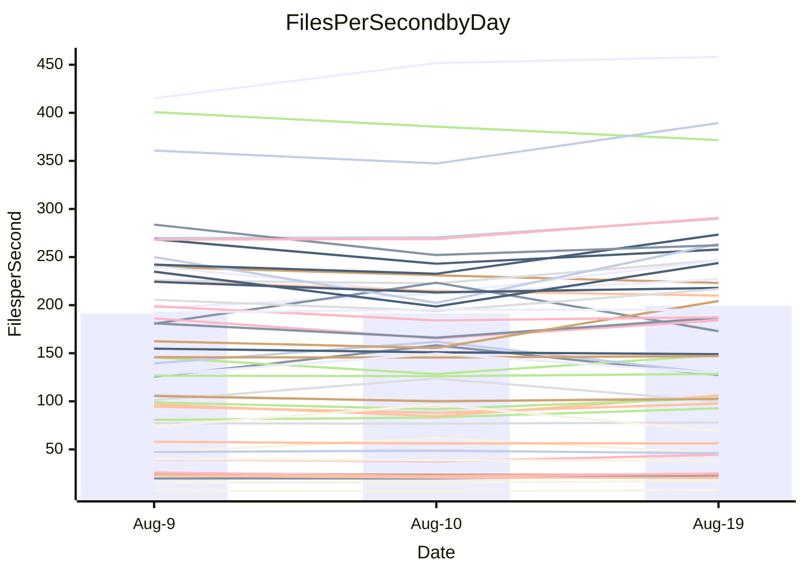

<!---
# This file is auto-generated. Do not edit.
# cspell:disable
--->
# Performance Report

Daily Performance

```mermaid
xychart-beta
    title Files Per Second by Day
    y-axis Files per Second
    x-axis Date [Aug-9, Aug-10, Aug-19]
    bar [191.27, 191.48, 199.45]
    line [19.76, 19.87, 23.15]
    line [94.45, 88.13, 97.66]
    line [106.66, 99.38, 103.80]
    line [80.61, 83.15, 92.81]
    line [239.79, 231.09, 223.10]
    line [269.81, 270.47, 289.77]
    line [39.52, 37.52, 44.46]
    line [268.54, 243.09, 257.77]
    line [6.78, 6.60, 7.51]
    line [240.17, 211.99, 227.00]
    line [125.68, 158.27, 127.25]
    line [225.24, 214.74, 210.02]
    line [225.91, 222.58, 246.74]
    line [145.75, 128.32, 148.05]
    line [24.65, 23.72, 23.68]
    line [139.45, 161.93, 128.87]
    line [25.95, 22.03, 24.86]
    line [154.75, 150.93, 149.02]
    line [15.80, 15.53, 17.25]
    line [196.97, 211.99, 246.59]
    line [180.75, 223.35, 172.94]
    line [96.93, 84.41, 106.12]
    line [77.16, 76.75, 77.91]
    line [400.74, 385.62, 371.65]
    line [145.79, 145.58, 147.10]
    line [249.96, 202.34, 263.67]
    line [186.27, 165.43, 184.07]
    line [224.37, 213.27, 217.89]
    line [47.00, 61.84, 45.89]
    line [127.47, 149.55, 129.16]
    line [181.18, 166.12, 186.93]
    line [57.90, 56.15, 56.35]
    line [101.07, 123.80, 99.87]
    line [98.84, 91.76, 103.43]
    line [162.48, 155.40, 204.32]
    line [360.76, 347.31, 389.41]
    line [198.91, 184.05, 187.41]
    line [242.10, 232.62, 273.32]
    line [73.60, 96.61, 68.89]
    line [415.14, 451.69, 458.22]
    line [283.77, 252.09, 262.36]
    line [22.84, 20.59, 20.47]
    line [205.56, 193.98, 216.67]
    line [126.64, 126.17, 128.45]
    line [105.46, 100.11, 102.43]
    line [47.26, 48.66, 46.00]
    line [268.09, 268.70, 290.78]
    line [234.76, 198.61, 243.75]
    line [39.98, 38.63, 38.64]
    line [192.03, 195.48, 194.87]
```

Time to Process Files

| Repository                                      | Elapsed | Min/Avg/Max          |    SD | SD Graph                |
| ----------------------------------------------- | ------: | :------------------: | ----: | ----------------------- |
| AdaDoom3/AdaDoom3                    |    2.22 | 2.1 /   2.6 /   2.9  |  0.29 | `    ┣━●┻━━╋━━┻━━┫    ` |
| alexiosc/megistos                    |    6.93 | 5.5 /   7.0 /   7.9  |  0.61 | `    ┣━━┻━━●━━┻━━┫    ` |
| apollographql/apollo-server          |    2.50 | 2.0 /   2.4 /   2.8  |  0.22 | `     ┣━┻━━╋●━┻━┫     ` |
| aspnetboilerplate/aspnetboilerplate  |    8.90 | 6.4 /   8.4 /   9.1  |  0.95 | `    ┣━━┻━━╋━●┻━━┫    ` |
| aws-amplify/docs                     |   13.40 | 10.8 /  13.0 /  14.0 |  0.96 | `    ┣━━┻━━╋●━┻━━┫    ` |
| Azure/azure-rest-api-specs           |    9.83 | 7.2 /   9.9 /  11.2  |  1.06 | `    ┣━━┻━━●━━┻━━┫    ` |
| bitjson/typescript-starter           |    1.01 | 0.6 /   1.0 /   1.1  |  0.12 | `     ┣━┻━━●━━┻━┫     ` |
| caddyserver/caddy                    |    3.61 | 2.8 /   3.5 /   3.9  |  0.34 | `    ┣━━┻━━╋●━┻━━┫    ` |
| canada-ca/open-source-logiciel-libre |    1.14 | 0.8 /   1.0 /   1.3  |  0.13 | `     ┣━┻━━╋━●┻━┫     ` |
| chef/chef                            |    4.08 | 3.0 /   4.6 /   5.3  |  0.67 | `    ┣━━┻●━╋━━┻━━┫    ` |
| dart-lang/sdk                        |   56.84 | 34.3 /  56.2 /  64.6 |  7.75 | `  ┣━━━┻━━━●━━━┻━━━┫  ` |
| django/django                        |   11.86 | 10.2 /  13.0 /  14.6 |  1.53 | `   ┣━━━┻●━╋━━┻━━━┫   ` |
| eslint/eslint                        |   10.21 | 7.6 /   9.5 /  10.3  |  0.88 | `    ┣━━┻━━╋━━●━━┫    ` |
| exonum/exonum                        |    3.20 | 2.7 /   3.3 /   3.7  |  0.25 | `    ┣━━┻━●╋━━┻━━┫    ` |
| flutter/samples                      |   10.94 | 8.0 /  12.1 /  13.4  |  1.55 | `    ┣━━┻●━╋━━┻━━┫    ` |
| gitbucket/gitbucket                  |    3.02 | 2.5 /   3.1 /   3.4  |  0.34 | `    ┣━━┻━━●━━┻━━┫    ` |
| googleapis/google-cloud-cpp          |  123.39 | 96.3 / 118.0 / 127.8 | 12.78 | `  ┣━━━┻━━━╋━●━┻━━━┫  ` |
| graphql/express-graphql              |    1.12 | 0.8 /   1.1 /   1.2  |  0.09 | `     ┣━┻━━╋●━┻━┫     ` |
| graphql/graphql-js                   |    3.74 | 3.0 /   3.6 /   3.9  |  0.21 | `    ┣━━┻━━╋━●┻━━┫    ` |
| graphql/graphql-relay-js             |    1.13 | 0.9 /   1.1 /   1.3  |  0.08 | `     ┣━┻━━╋●━┻━┫     ` |
| graphql/graphql-spec                 |    1.21 | 0.8 /   1.2 /   1.3  |  0.18 | `     ┣━┻━━●━━┻━┫     ` |
| iluwatar/java-design-patterns        |   12.77 | 8.8 /  11.7 /  12.8  |  1.36 | `    ┣━━┻━━╋━━●━━┫    ` |
| ktaranov/sqlserver-kit               |    5.64 | 3.3 /   5.2 /   6.2  |  1.04 | `    ┣━━┻━━╋●━┻━━┫    ` |
| liriliri/licia                       |    3.89 | 2.9 /   3.7 /   4.1  |  0.36 | `    ┣━━┻━━╋━●┻━━┫    ` |
| MartinThoma/LaTeX-examples           |    5.28 | 4.5 /   5.8 /   7.0  |  0.82 | `    ┣━━┻●━╋━━┻━━┫    ` |
| mdx-js/mdx                           |    1.87 | 1.7 /   1.8 /   1.9  |  0.07 | `     ┣━┻━━╋━━●━┫     ` |
| microsoft/TypeScript-Website         |    5.08 | 5.0 /   5.3 /   5.6  |  0.20 | `    ┣━━●━━╋━━┻━━┫    ` |
| MicrosoftDocs/PowerShell-Docs        |   23.81 | 20.9 /  24.2 /  25.8 |  1.23 | `   ┣━━━┻━●╋━━┻━━━┫   ` |
| neovim/nvim-lspconfig                |    4.77 | 3.9 /   4.8 /   5.6  |  0.61 | `    ┣━━┻━━●━━┻━━┫    ` |
| pagekit/pagekit                      |    3.41 | 2.7 /   3.4 /   3.6  |  0.22 | `    ┣━━┻━━╋●━┻━━┫    ` |
| php/php-src                          |   26.13 | 19.2 /  23.2 /  25.3 |  2.18 | `   ┣━━━┻━━╋━━┻━●━┫   ` |
| plasticrake/tplink-smarthome-api     |    1.32 | 1.0 /   1.3 /   1.4  |  0.11 | `     ┣━┻━━╋●━┻━┫     ` |
| prettier/prettier                    |    7.49 | 5.8 /   7.3 /   8.0  |  0.77 | `    ┣━━┻━━╋●━┻━━┫    ` |
| pycontribs/jira                      |    1.41 | 1.1 /   1.4 /   1.5  |  0.09 | `     ┣━┻━━●━━┻━┫     ` |
| RustPython/RustPython                |    7.28 | 6.6 /   9.0 /  11.1  |  1.18 | `    ┣●━┻━━╋━━┻━━┫    ` |
| shoelace-style/shoelace              |    2.09 | 1.8 /   2.7 /   3.0  |  0.37 | `    ┣━●┻━━╋━━┻━━┫    ` |
| slint-ui/slint                       |   15.48 | 11.6 /  15.1 /  16.0 |  1.21 | `    ┣━━┻━━╋●━┻━━┫    ` |
| SoftwareBrothers/admin-bro           |    2.38 | 1.6 /   2.3 /   2.4  |  0.23 | `     ┣━┻━━╋●━┻━┫     ` |
| sveltejs/svelte                      |   23.05 | 16.9 /  20.8 /  22.9 |  2.24 | `   ┣━━━┻━━╋━━●━━━┫   ` |
| TheAlgorithms/Python                 |    5.46 | 3.0 /   5.3 /   5.9  |  0.78 | `    ┣━━┻━━╋●━┻━━┫    ` |
| twbs/bootstrap                       |    1.71 | 1.2 /   1.6 /   1.9  |  0.21 | `     ┣━┻━━╋●━┻━┫     ` |
| typescript-cheatsheets/react         |    1.25 | 0.7 /   1.1 /   1.3  |  0.13 | `     ┣━┻━━╋━━●━┫     ` |
| typescript-eslint/typescript-eslint  |    4.02 | 3.9 /   4.2 /   4.7  |  0.26 | `    ┣━━┻●━╋━━┻━━┫    ` |
| vitest-dev/vitest                    |   10.21 | 8.2 /  10.1 /  10.8  |  0.85 | `    ┣━━┻━━●━━┻━━┫    ` |
| w3c/aria-practices                   |    3.28 | 3.1 /   3.3 /   3.5  |  0.13 | `     ┣━┻━━●━━┻━┫     ` |
| w3c/specberus                        |    1.84 | 1.5 /   1.8 /   2.0  |  0.13 | `     ┣━┻━━●━━┻━┫     ` |
| webdeveric/webpack-assets-manifest   |    1.21 | 1.0 /   1.2 /   1.3  |  0.06 | `     ┣━┻━━╋━●┻━┫     ` |
| webpack/webpack                      |    6.74 | 3.7 /   5.8 /   7.0  |  1.15 | `    ┣━━┻━━╋━━●━━┫    ` |
| wireapp/wire-desktop                 |    1.30 | 1.1 /   1.3 /   1.5  |  0.13 | `     ┣━┻━━●━━┻━┫     ` |
| wireapp/wire-webapp                  |   12.90 | 12.5 /  12.9 /  13.4 |  0.33 | `    ┣━━┻━━●━━┻━━┫    ` |

Note:
- Elapsed time is in seconds.

Files per Second over Time

| Repository                                      | Files |    Sec |    Fps |     Rel | Trend Fps     |    N |
| ----------------------------------------------- | ----: | -----: | -----: | ------: | ------------- | ---: |
| AdaDoom3/AdaDoom3                    |   103 |   2.22 |  46.43 |  15.75% | `▇▃▃▇▂▂▃▃▃█▇` |   10 |
| alexiosc/megistos                    |   583 |   6.93 |  84.12 |  -0.06% | `▃▄▃▃▃▂▄▄▄█▄` |   10 |
| apollographql/apollo-server          |   256 |   2.50 | 102.37 |  -2.97% | `▂▃▄▃▄█▇▃▄▄▄` |   10 |
| aspnetboilerplate/aspnetboilerplate  |  2288 |   8.90 | 257.19 |  -7.19% | `▂▂▂▃▃▂▇▃█▂▂` |   10 |
| aws-amplify/docs                     |  3030 |  13.40 | 226.14 |  -3.89% | `▃▃▄▃▃█▇▄▃▂▃` |   10 |
| Azure/azure-rest-api-specs           |  2561 |   9.83 | 260.48 |  -1.17% | `█▃▅▃▃▂▃▂▃▃▃` |   10 |
| bitjson/typescript-starter           |    20 |   1.01 |  19.88 |  -4.29% | `▄▃▃▂▂▁▂▂█▂▂` |   10 |
| caddyserver/caddy                    |   333 |   3.61 |  92.19 |  -2.97% | `▄▄▃▂█▅▂▃▃▇▄` |   10 |
| canada-ca/open-source-logiciel-libre |     7 |   1.14 |   6.15 | -12.64% | `▄▃▄▃▇▁▄▃█▄▃` |   10 |
| chef/chef                            |  1034 |   4.08 | 253.31 |   9.14% | `▃▁▆▂▂▂█▂▂▂▄` |   10 |
| dart-lang/sdk                        | 11618 |  56.84 | 204.40 |  -3.87% | `▂▂▂▁▂▂▂▃▂█▂` |   10 |
| django/django                        |  2931 |  11.86 | 247.14 |   7.59% | `▂▃▂▂▆▃█▃▇▃▅` |   10 |
| eslint/eslint                        |  2082 |  10.21 | 203.95 |  -8.03% | `▃▇█▂▃▂▃▃▃▃▂` |   10 |
| exonum/exonum                        |   421 |   3.20 | 131.57 |   2.14% | `▂▃▃▅▄▄▄█▃▄▄` |   10 |
| flutter/samples                      |  1703 |  10.94 | 155.62 |   8.29% | `▃▁▂▂█▂▂▂▂▄▄` |   10 |
| gitbucket/gitbucket                  |   418 |   3.02 | 138.49 |  -0.09% | `▃█▃▂▃▇▃▇▂▂▄` |   10 |
| googleapis/google-cloud-cpp          | 21238 | 123.39 | 172.12 |  -5.58% | `█▇▂▂▃▃▃▂█▃▃` |   10 |
| graphql/express-graphql              |    26 |   1.12 |  23.31 |  -4.46% | `▄█▂▄▃▃▄▃▄▃▃` |   10 |
| graphql/graphql-js                   |   551 |   3.74 | 147.23 |  -4.02% | `▄▄▄▃▃█▄▄▃▄▃` |   10 |
| graphql/graphql-relay-js             |    28 |   1.13 |  24.83 |  -2.02% | `▅▅▅▅▅█▄▂▄▄▄` |   10 |
| graphql/graphql-spec                 |    19 |   1.21 |  15.67 |  -3.38% | `▂▂▂█▂▂▂▃▇▂▃` |   10 |
| iluwatar/java-design-patterns        |  2183 |  12.77 | 170.95 |  -6.91% | `▃▃▂▃▂▄█▇▂▃▃` |   10 |
| ktaranov/sqlserver-kit               |   490 |   5.64 |  86.93 | -12.58% | `▂▁▂█▁▅▂▂▂█▂` |   10 |
| liriliri/licia                       |  1442 |   3.89 | 370.79 |  -5.77% | `▃▂▃▂█▇▄▃▃▃▃` |   10 |
| MartinThoma/LaTeX-examples           |  1409 |   5.28 | 267.09 |   7.87% | `▂▄█▄▇▃▃▂▃▇▅` |   10 |
| mdx-js/mdx                           |   139 |   1.87 |  74.15 |  -4.50% | `█▅▄▇▅▇▅▆▇█▅` |   10 |
| microsoft/TypeScript-Website         |   765 |   5.08 | 150.73 |   3.47% | `▆█▇▅▄▆▇▆█▅▇` |   10 |
| MicrosoftDocs/PowerShell-Docs        |  3126 |  23.81 | 131.31 |   1.16% | `▄▄▄▃▄▄▅█▄▄▅` |   10 |
| neovim/nvim-lspconfig                |   869 |   4.77 | 182.24 |  -0.92% | `▂▂▆█▇▃▅▃▃▆▄` |   10 |
| pagekit/pagekit                      |   741 |   3.41 | 217.15 |  -2.20% | `▄▄▃▄▂█▃▃▃▃▃` |   10 |
| php/php-src                          |  2389 |  26.13 |  91.43 | -12.04% | `▃▄▂▃▃█▄█▃▆▂` |   10 |
| plasticrake/tplink-smarthome-api     |    62 |   1.32 |  46.83 |  -2.78% | `▃▃▄▃▃▂▄█▂▃▃` |   10 |
| prettier/prettier                    |  2685 |   7.49 | 358.43 |  -2.66% | `▃▂▃█▃▂▃▃▃█▃` |   10 |
| pycontribs/jira                      |    80 |   1.41 |  56.61 |  -1.35% | `█▃▃▃▃▃▄▃▃▃▃` |   10 |
| RustPython/RustPython                |   874 |   7.28 | 120.07 |  23.29% | `▁▃▃▃▃█▇▃▄▄▇` |   10 |
| shoelace-style/shoelace              |   440 |   2.09 | 210.48 |  24.16% | `▂▁▂▂▅▂▂▂▂█▆` |   10 |
| slint-ui/slint                       |  3815 |  15.48 | 246.46 |  -1.45% | `▃▃▂▂▃▃▂▂▃█▃` |   10 |
| SoftwareBrothers/admin-bro           |   441 |   2.38 | 184.95 |  -5.34% | `█▂▂▂▂▂▂▂▂▂▂` |   10 |
| sveltejs/svelte                      |  8954 |  23.05 | 388.48 | -10.57% | `▂▂▂▂▃▃█▅█▅▂` |   10 |
| TheAlgorithms/Python                 |  1411 |   5.46 | 258.42 |  -6.61% | `▂▁▁▂▂█▂▂▂▂▂` |   10 |
| twbs/bootstrap                       |   118 |   1.71 |  69.14 |  -7.73% | `▃▄▂▆▃▂▆█▃▃▃` |   10 |
| typescript-cheatsheets/react         |    24 |   1.25 |  19.25 | -13.53% | `▂▃█▁▃▂▃▂▂▂▂` |   10 |
| typescript-eslint/typescript-eslint  |   866 |   4.02 | 215.58 |   4.28% | `▃█▄▅▆▇▇▄█▇▇` |   10 |
| vitest-dev/vitest                    |  2769 |  10.21 | 271.24 |  -1.24% | `▂▃▃▃▂▂▇▃▃█▃` |   10 |
| w3c/aria-practices                   |   417 |   3.28 | 127.23 |   0.12% | `█▇▄▆▄▇▇▆▇▆▆` |   10 |
| w3c/specberus                        |   190 |   1.84 | 103.51 |  -0.68% | `█▄▃▄▃▂▄▃▃▄▄` |   10 |
| webdeveric/webpack-assets-manifest   |    55 |   1.21 |  45.54 |  -3.50% | `▅█▄▅▃▄▇▆▅▄▄` |   10 |
| webpack/webpack                      |  1319 |   6.74 | 195.76 | -17.66% | `▄▂▄▁▂█▂▂▁█▂` |   10 |
| wireapp/wire-desktop                 |    51 |   1.30 |  39.21 |  -0.79% | `▃▂█▄▄▃█▄▄▄▄` |   10 |
| wireapp/wire-webapp                  |  2526 |  12.90 | 195.75 |   1.50% | `▇▅▆▆▅█▇▇█▅▇` |   10 |

Data Throughput

| Repository                                      | Files |    Sec |     Kps |     Rel | Trend Kps     |    N |
| ----------------------------------------------- | ----: | -----: | ------: | ------: | ------------- | ---: |
| AdaDoom3/AdaDoom3                    |   103 |   2.22 |  986.84 |  15.75% | `▇▃▃▇▂▂▃▃▃█▇` |   10 |
| alexiosc/megistos                    |   583 |   6.93 |  660.98 |  -0.06% | `▃▄▃▃▃▂▄▄▄█▄` |   10 |
| apollographql/apollo-server          |   256 |   2.50 |  842.92 |  -2.97% | `▂▃▄▃▄█▇▃▄▄▄` |   10 |
| aspnetboilerplate/aspnetboilerplate  |  2288 |   8.90 |  628.92 |  -7.19% | `▂▂▂▃▃▂▇▃█▂▂` |   10 |
| aws-amplify/docs                     |  3030 |  13.40 |  884.02 |  -3.73% | `▃▃▄▃▃█▇▄▃▂▃` |   10 |
| Azure/azure-rest-api-specs           |  2561 |   9.83 |  798.03 |  -0.37% | `█▃▅▃▃▂▃▂▃▃▃` |   10 |
| bitjson/typescript-starter           |    20 |   1.01 |   79.53 |  -4.29% | `▄▃▃▂▂▁▂▂█▂▂` |   10 |
| caddyserver/caddy                    |   333 |   3.61 |  839.96 |  -3.14% | `▄▄▃▂█▅▂▃▃▇▄` |   10 |
| canada-ca/open-source-logiciel-libre |     7 |   1.14 |   50.99 | -12.64% | `▄▃▄▃▇▁▄▃█▄▃` |   10 |
| chef/chef                            |  1034 |   4.08 | 1243.76 |   9.14% | `▃▁▆▂▂▂█▂▂▂▄` |   10 |
| dart-lang/sdk                        | 11618 |  56.84 | 1419.56 |  -3.37% | `▂▂▂▁▂▂▂▃▂█▂` |   10 |
| django/django                        |  2931 |  11.86 | 1593.95 |   7.82% | `▂▃▂▂▆▃█▃▇▃▅` |   10 |
| eslint/eslint                        |  2082 |  10.21 | 1431.75 |  -8.03% | `▃▇█▂▃▂▃▃▃▃▂` |   10 |
| exonum/exonum                        |   421 |   3.20 | 1258.55 |   2.14% | `▂▃▃▅▄▄▄█▃▄▄` |   10 |
| flutter/samples                      |  1703 |  10.94 |  927.60 |   7.96% | `▃▁▂▂█▂▂▂▂▄▄` |   10 |
| gitbucket/gitbucket                  |   418 |   3.02 |  685.16 |   0.71% | `▃█▃▂▂▇▃▇▂▂▄` |   10 |
| googleapis/google-cloud-cpp          | 21238 | 123.39 | 1495.36 |  -5.51% | `█▇▂▂▃▃▃▂█▃▃` |   10 |
| graphql/express-graphql              |    26 |   1.12 |  106.69 |  -4.46% | `▄█▂▄▃▃▄▃▄▃▃` |   10 |
| graphql/graphql-js                   |   551 |   3.74 | 1097.95 |  -4.02% | `▄▄▄▃▃█▄▄▃▄▃` |   10 |
| graphql/graphql-relay-js             |    28 |   1.13 |   97.56 |  -2.02% | `▅▅▅▅▅█▄▂▄▄▄` |   10 |
| graphql/graphql-spec                 |    19 |   1.21 |  524.54 |  -3.38% | `▂▂▂█▂▂▂▃▇▂▃` |   10 |
| iluwatar/java-design-patterns        |  2183 |  12.77 |  528.13 |  -6.73% | `▃▃▂▃▂▄█▇▃▃▃` |   10 |
| ktaranov/sqlserver-kit               |   490 |   5.64 | 1316.88 | -12.58% | `▂▁▂█▁▅▂▂▂█▂` |   10 |
| liriliri/licia                       |  1442 |   3.89 |  444.59 |  -5.41% | `▃▂▃▂█▇▄▃▃▃▃` |   10 |
| MartinThoma/LaTeX-examples           |  1409 |   5.28 |  551.61 |   7.87% | `▂▄█▄▇▃▃▂▃▇▅` |   10 |
| mdx-js/mdx                           |   139 |   1.87 |  349.42 |  -4.50% | `█▅▄▇▅▇▅▆▇█▅` |   10 |
| microsoft/TypeScript-Website         |   765 |   5.08 | 1039.33 |   3.49% | `▆█▇▅▄▆▇▆█▅█` |   10 |
| MicrosoftDocs/PowerShell-Docs        |  3126 |  23.81 | 1402.38 |   1.23% | `▄▄▄▃▄▄▅█▄▄▅` |   10 |
| neovim/nvim-lspconfig                |   869 |   4.77 |  534.56 |  -1.07% | `▂▂▆█▇▃▅▃▃▆▄` |   10 |
| pagekit/pagekit                      |   741 |   3.41 |  452.76 |  -2.20% | `▄▄▃▄▂█▃▃▃▃▃` |   10 |
| php/php-src                          |  2389 |  26.13 | 1617.53 | -12.01% | `▃▄▂▃▃█▄█▃▆▂` |   10 |
| plasticrake/tplink-smarthome-api     |    62 |   1.32 |  253.03 |  -2.78% | `▃▃▄▃▃▂▄█▂▃▃` |   10 |
| prettier/prettier                    |  2685 |   7.49 |  506.61 |  -3.08% | `▃▂▃█▃▂▃▃▃█▃` |   10 |
| pycontribs/jira                      |    80 |   1.41 |  399.82 |  -1.35% | `█▃▃▃▃▃▄▃▃▃▃` |   10 |
| RustPython/RustPython                |   874 |   7.28 | 2643.91 |  23.63% | `▁▃▃▃▃█▇▃▄▄▇` |   10 |
| shoelace-style/shoelace              |   440 |   2.09 | 1016.50 |  24.16% | `▂▁▂▂▅▂▂▂▂█▆` |   10 |
| slint-ui/slint                       |  3815 |  15.48 | 1326.04 |  -1.18% | `▃▃▂▂▃▃▂▂▃█▃` |   10 |
| SoftwareBrothers/admin-bro           |   441 |   2.38 |  407.64 |  -5.34% | `█▂▂▂▂▂▂▂▂▂▂` |   10 |
| sveltejs/svelte                      |  8954 |  23.05 |  266.78 | -10.49% | `▂▂▂▂▃▃█▅█▅▂` |   10 |
| TheAlgorithms/Python                 |  1411 |   5.46 |  660.97 |  -6.61% | `▂▁▁▂▂█▂▂▂▂▂` |   10 |
| twbs/bootstrap                       |   118 |   1.71 |  567.20 |  -7.73% | `▃▄▂▆▃▂▆█▃▃▃` |   10 |
| typescript-cheatsheets/react         |    24 |   1.25 |  174.08 | -13.53% | `▂▃█▁▃▂▃▂▂▂▂` |   10 |
| typescript-eslint/typescript-eslint  |   866 |   4.02 |  724.40 |   4.21% | `▃█▄▅▆▇▇▄█▇▇` |   10 |
| vitest-dev/vitest                    |  2769 |  10.21 |  783.94 |   0.69% | `▂▃▃▃▂▂▆▃▃█▄` |   10 |
| w3c/aria-practices                   |   417 |   3.28 | 1196.64 |   0.12% | `█▇▄▆▄▇▇▆▇▆▆` |   10 |
| w3c/specberus                        |   190 |   1.84 |  338.30 |  -0.55% | `█▄▃▄▃▂▄▃▃▄▄` |   10 |
| webdeveric/webpack-assets-manifest   |    55 |   1.21 |  105.16 |  -3.50% | `▅█▄▅▃▄▇▆▅▄▄` |   10 |
| webpack/webpack                      |  1319 |   6.74 | 1336.93 |  -9.95% | `▃▁▃▁▁▇▂▁▂█▂` |   10 |
| wireapp/wire-desktop                 |    51 |   1.30 |  166.84 |  -0.79% | `▃▂█▄▄▃█▄▄▄▄` |   10 |
| wireapp/wire-webapp                  |  2526 |  12.90 |  826.25 |   1.91% | `▇▅▅▆▅▇▇▇█▅▇` |   10 |

