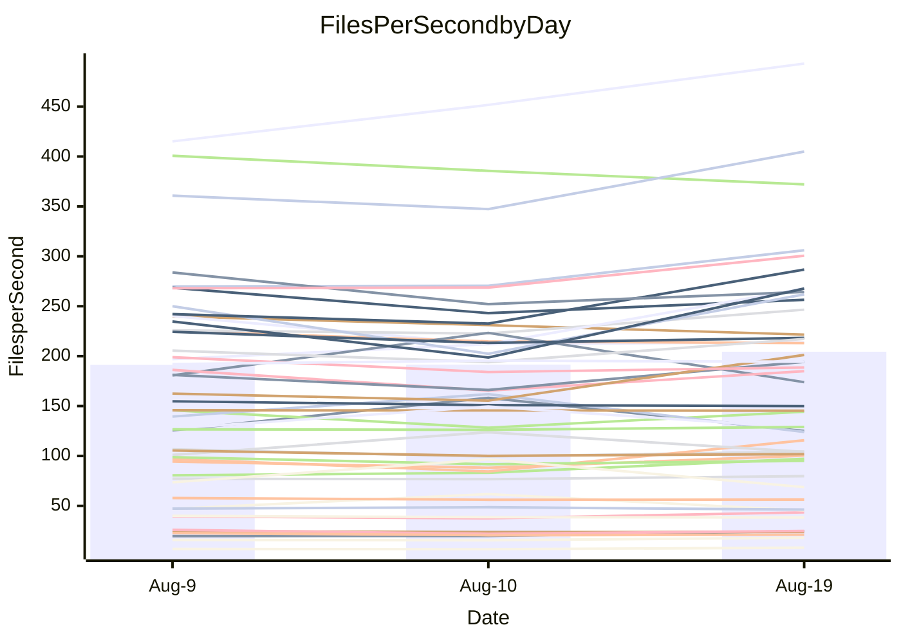

<!---
# This file is auto-generated. Do not edit.
# cspell:disable
--->
# Performance Report

Daily Performance

```mermaid
xychart-beta
    title Files Per Second by Day
    y-axis Files per Second
    x-axis Date [Aug-9, Aug-10, Aug-19]
    bar [191.27, 191.48, 204.45]
    line [19.76, 19.87, 24.78]
    line [94.45, 88.13, 100.40]
    line [106.66, 99.38, 104.52]
    line [80.61, 83.15, 97.15]
    line [239.79, 231.09, 221.57]
    line [269.81, 270.47, 306.05]
    line [39.52, 37.52, 43.48]
    line [268.54, 243.09, 256.41]
    line [6.78, 6.60, 8.19]
    line [240.17, 211.99, 213.85]
    line [125.68, 158.27, 125.09]
    line [225.24, 214.74, 213.06]
    line [225.91, 222.58, 246.55]
    line [145.75, 128.32, 144.27]
    line [24.65, 23.72, 23.86]
    line [139.45, 161.93, 124.06]
    line [25.95, 22.03, 24.88]
    line [154.75, 150.93, 149.92]
    line [15.80, 15.53, 18.04]
    line [196.97, 211.99, 267.68]
    line [180.75, 223.35, 173.93]
    line [96.93, 84.41, 115.72]
    line [77.16, 76.75, 79.80]
    line [400.74, 385.62, 372.08]
    line [145.79, 145.58, 145.29]
    line [249.96, 202.34, 261.96]
    line [186.27, 165.43, 184.98]
    line [224.37, 213.27, 218.26]
    line [47.00, 61.84, 45.42]
    line [127.47, 149.55, 128.08]
    line [181.18, 166.12, 194.34]
    line [57.90, 56.15, 56.22]
    line [101.07, 123.80, 104.09]
    line [98.84, 91.76, 95.12]
    line [162.48, 155.40, 201.24]
    line [360.76, 347.31, 404.89]
    line [198.91, 184.05, 188.64]
    line [242.10, 232.62, 286.76]
    line [73.60, 96.61, 68.77]
    line [415.14, 451.69, 493.10]
    line [283.77, 252.09, 264.33]
    line [22.84, 20.59, 21.08]
    line [205.56, 193.98, 217.22]
    line [126.64, 126.17, 129.06]
    line [105.46, 100.11, 101.89]
    line [47.26, 48.66, 46.23]
    line [268.09, 268.70, 300.56]
    line [234.76, 198.61, 267.74]
    line [39.98, 38.63, 38.36]
    line [192.03, 195.48, 194.42]
```

Time to Process Files

| Repository                                      | Elapsed | Min/Avg/Max          |    SD | SD Graph                |
| ----------------------------------------------- | ------: | :------------------: | ----: | ----------------------- |
| AdaDoom3/AdaDoom3                    |    2.10 | 2.2 /   2.7 /   2.9  |  0.25 | `    ●━━┻━━╋━━┻━━┫    ` |
| alexiosc/megistos                    |    5.45 | 6.7 /   7.2 /   7.9  |  0.35 | `●     ┣━┻━╋━┻━┫      ` |
| apollographql/apollo-server          |    2.48 | 2.0 /   2.4 /   2.8  |  0.23 | `    ┣━━┻━━●━━┻━━┫    ` |
| aspnetboilerplate/aspnetboilerplate  |    9.08 | 6.4 /   8.3 /   9.1  |  0.97 | `    ┣━━┻━━╋━━●━━┫    ` |
| aws-amplify/docs                     |   14.03 | 10.8 /  12.8 /  13.6 |  0.94 | `    ┣━━┻━━╋━━┻●━┫    ` |
| Azure/azure-rest-api-specs           |    9.94 | 7.2 /   9.8 /  11.2  |  1.12 | `    ┣━━┻━━●━━┻━━┫    ` |
| bitjson/typescript-starter           |    1.07 | 0.6 /   1.0 /   1.1  |  0.13 | `     ┣━┻━━╋━●┻━┫     ` |
| caddyserver/caddy                    |    3.00 | 2.8 /   3.5 /   3.9  |  0.32 | `    ┣●━┻━━╋━━┻━━┫    ` |
| canada-ca/open-source-logiciel-libre |    0.98 | 0.8 /   1.0 /   1.3  |  0.14 | `     ┣━┻━●╋━━┻━┫     ` |
| chef/chef                            |    4.75 | 3.0 /   4.6 /   5.3  |  0.70 | `    ┣━━┻━━╋●━┻━━┫    ` |
| dart-lang/sdk                        |   34.32 | 54.8 /  58.6 /  64.6 |  2.81 | `●       ┣┻╋┻┫        ` |
| django/django                        |   13.55 | 10.2 /  12.9 /  14.6 |  1.60 | `   ┣━━━┻━━╋●━┻━━━┫   ` |
| eslint/eslint                        |    9.70 | 7.6 /   9.5 /  10.3  |  0.93 | `    ┣━━┻━━╋●━┻━━┫    ` |
| exonum/exonum                        |    3.32 | 2.7 /   3.3 /   3.7  |  0.27 | `    ┣━━┻━━●━━┻━━┫    ` |
| flutter/samples                      |   10.98 | 8.0 /  12.2 /  13.4  |  1.59 | `   ┣━━━┻●━╋━━┻━━━┫   ` |
| gitbucket/gitbucket                  |    3.34 | 2.5 /   3.0 /   3.4  |  0.35 | `    ┣━━┻━━╋━●┻━━┫    ` |
| googleapis/google-cloud-cpp          |  126.25 | 96.3 / 117.1 / 127.8 | 13.16 | `  ┣━━━┻━━━╋━━●┻━━━┫  ` |
| graphql/express-graphql              |    1.11 | 0.8 /   1.1 /   1.2  |  0.09 | `     ┣━┻━━╋●━┻━┫     ` |
| graphql/graphql-js                   |    3.66 | 3.0 /   3.6 /   3.9  |  0.22 | `    ┣━━┻━━╋●━┻━━┫    ` |
| graphql/graphql-relay-js             |    1.13 | 0.9 /   1.1 /   1.3  |  0.08 | `     ┣━┻━━╋●━┻━┫     ` |
| graphql/graphql-spec                 |    1.33 | 0.8 /   1.2 /   1.3  |  0.18 | `     ┣━┻━━╋━●┻━┫     ` |
| iluwatar/java-design-patterns        |   12.31 | 8.8 /  11.6 /  12.8  |  1.42 | `    ┣━━┻━━╋━●┻━━┫    ` |
| ktaranov/sqlserver-kit               |    3.39 | 3.3 /   5.4 /   6.2  |  0.90 | `   ●┣━━┻━━╋━━┻━━┫    ` |
| liriliri/licia                       |    3.94 | 2.9 /   3.7 /   4.1  |  0.37 | `    ┣━━┻━━╋━●┻━━┫    ` |
| MartinThoma/LaTeX-examples           |    4.81 | 4.5 /   5.9 /   7.0  |  0.79 | `    ┣━●┻━━╋━━┻━━┫    ` |
| mdx-js/mdx                           |    1.72 | 1.7 /   1.8 /   1.9  |  0.07 | `     ┣━●━━╋━━┻━┫     ` |
| microsoft/TypeScript-Website         |    5.51 | 5.0 /   5.2 /   5.6  |  0.19 | `    ┣━━┻━━╋━━┻●━┫    ` |
| MicrosoftDocs/PowerShell-Docs        |   24.04 | 20.9 /  24.2 /  25.8 |  1.29 | `   ┣━━━┻━━●━━┻━━━┫   ` |
| neovim/nvim-lspconfig                |    4.23 | 3.9 /   4.9 /   5.6  |  0.61 | `    ┣━━●━━╋━━┻━━┫    ` |
| pagekit/pagekit                      |    3.42 | 2.7 /   3.3 /   3.6  |  0.24 | `    ┣━━┻━━╋●━┻━━┫    ` |
| php/php-src                          |   21.21 | 19.2 /  23.4 /  25.3 |  2.19 | `   ┣━━━●━━╋━━┻━━━┫   ` |
| plasticrake/tplink-smarthome-api     |    1.31 | 1.0 /   1.3 /   1.4  |  0.12 | `     ┣━┻━━●━━┻━┫     ` |
| prettier/prettier                    |    5.81 | 5.9 /   7.5 /   8.0  |  0.60 | `  ● ┣━━┻━━╋━━┻━━┫    ` |
| pycontribs/jira                      |    1.41 | 1.1 /   1.4 /   1.5  |  0.09 | `     ┣━┻━━●━━┻━┫     ` |
| RustPython/RustPython                |    9.31 | 6.6 /   9.0 /  11.1  |  1.24 | `    ┣━━┻━━╋●━┻━━┫    ` |
| shoelace-style/shoelace              |    1.77 | 2.1 /   2.8 /   3.0  |  0.23 | `●    ┣━━┻━╋━┻━━┫     ` |
| slint-ui/slint                       |   11.60 | 14.9 /  15.5 /  16.0 |  0.32 | `●       ┣┻╋┻┫        ` |
| SoftwareBrothers/admin-bro           |    2.36 | 1.6 /   2.3 /   2.4  |  0.24 | `     ┣━┻━━╋●━┻━┫     ` |
| sveltejs/svelte                      |   19.36 | 16.9 /  21.0 /  22.9 |  2.31 | `   ┣━━━┻●━╋━━┻━━━┫   ` |
| TheAlgorithms/Python                 |    5.36 | 3.0 /   5.3 /   5.9  |  0.82 | `    ┣━━┻━━●━━┻━━┫    ` |
| twbs/bootstrap                       |    1.73 | 1.2 /   1.6 /   1.9  |  0.22 | `     ┣━┻━━╋━●┻━┫     ` |
| typescript-cheatsheets/react         |    1.14 | 0.7 /   1.1 /   1.3  |  0.14 | `     ┣━┻━━╋●━┻━┫     ` |
| typescript-eslint/typescript-eslint  |    4.04 | 3.9 /   4.2 /   4.7  |  0.26 | `    ┣━━┻●━╋━━┻━━┫    ` |
| vitest-dev/vitest                    |    8.22 | 8.7 /  10.3 /  10.8  |  0.60 | `●   ┣━━┻━━╋━━┻━━┫    ` |
| w3c/aria-practices                   |    3.27 | 3.1 /   3.3 /   3.5  |  0.13 | `     ┣━┻━━●━━┻━┫     ` |
| w3c/specberus                        |    1.81 | 1.5 /   1.8 /   2.0  |  0.13 | `     ┣━┻━●╋━━┻━┫     ` |
| webdeveric/webpack-assets-manifest   |    1.21 | 1.0 /   1.2 /   1.3  |  0.06 | `     ┣━┻━━╋━●┻━┫     ` |
| webpack/webpack                      |    3.81 | 3.7 /   6.0 /   7.0  |  1.00 | `   ●┣━━┻━━╋━━┻━━┫    ` |
| wireapp/wire-desktop                 |    1.36 | 1.1 /   1.3 /   1.5  |  0.14 | `     ┣━┻━━╋●━┻━┫     ` |
| wireapp/wire-webapp                  |   13.41 | 12.5 /  12.8 /  13.4 |  0.29 | `    ┣━━┻━━╋━━┻━━●    ` |

Note:
- Elapsed time is in seconds.

Files per Second over Time

| Repository                                      | Files |    Sec |    Fps |     Rel | Trend Fps    |    N |
| ----------------------------------------------- | ----: | -----: | -----: | ------: | ------------ | ---: |
| AdaDoom3/AdaDoom3                    |   103 |   2.10 |  49.04 |  25.34% | `▇▃▃▇▂▂▃▃▃█` |    9 |
| alexiosc/megistos                    |   583 |   5.45 | 106.91 |  30.94% | `▃▄▃▃▃▂▄▄▄█` |    9 |
| apollographql/apollo-server          |   256 |   2.48 | 103.13 |  -2.50% | `▂▃▄▃▄█▇▃▄▄` |    9 |
| aspnetboilerplate/aspnetboilerplate  |  2288 |   9.08 | 251.87 | -10.03% | `▂▂▂▃▃▂▇▃█▂` |    9 |
| aws-amplify/docs                     |  3030 |  14.03 | 216.01 |  -9.02% | `▃▃▄▃▃█▇▃▃▂` |    9 |
| Azure/azure-rest-api-specs           |  2561 |   9.94 | 257.77 |  -2.44% | `█▃▅▃▃▂▃▂▃▃` |    9 |
| bitjson/typescript-starter           |    20 |   1.07 |  18.64 | -11.29% | `▄▃▃▂▂▁▂▂█▂` |    9 |
| caddyserver/caddy                    |   333 |   3.00 | 110.96 |  19.01% | `▄▄▃▂█▅▂▃▃▇` |    9 |
| canada-ca/open-source-logiciel-libre |     7 |   0.98 |   7.15 |   1.60% | `▄▃▄▃▇▁▄▃█▄` |    9 |
| chef/chef                            |  1034 |   4.75 | 217.56 |  -6.91% | `▃▁▆▂▂▂█▂▂▂` |    9 |
| dart-lang/sdk                        | 11618 |  34.32 | 338.54 |  70.44% | `▂▂▂▁▂▂▂▃▂█` |    9 |
| django/django                        |  2931 |  13.55 | 216.36 |  -6.41% | `▂▃▂▂▆▃█▃▇▃` |    9 |
| eslint/eslint                        |  2082 |   9.70 | 214.68 |  -3.53% | `▃▇█▂▃▂▃▃▃▃` |    9 |
| exonum/exonum                        |   421 |   3.32 | 126.89 |  -1.66% | `▂▃▃▅▄▄▄█▃▄` |    9 |
| flutter/samples                      |  1703 |  10.98 | 155.08 |   8.87% | `▃▁▂▂█▂▂▂▂▄` |    9 |
| gitbucket/gitbucket                  |   418 |   3.34 | 125.34 | -10.53% | `▃█▃▂▃▇▃▇▂▂` |    9 |
| googleapis/google-cloud-cpp          | 21238 | 126.25 | 168.22 |  -8.51% | `█▇▂▂▃▃▃▂█▃` |    9 |
| graphql/express-graphql              |    26 |   1.11 |  23.33 |  -4.85% | `▄█▂▄▃▃▄▃▄▃` |    9 |
| graphql/graphql-js                   |   551 |   3.66 | 150.73 |  -1.93% | `▄▄▄▃▃█▄▄▃▄` |    9 |
| graphql/graphql-relay-js             |    28 |   1.13 |  24.77 |  -2.54% | `▅▅▅▅▅█▄▂▄▄` |    9 |
| graphql/graphql-spec                 |    19 |   1.33 |  14.29 | -13.06% | `▂▂▂█▂▂▂▃▇▂` |    9 |
| iluwatar/java-design-patterns        |  2183 |  12.31 | 177.40 |  -3.76% | `▃▃▂▃▂▄█▇▂▃` |    9 |
| ktaranov/sqlserver-kit               |   490 |   3.39 | 144.34 |  52.83% | `▂▁▂█▁▅▂▂▂█` |    9 |
| liriliri/licia                       |  1442 |   3.94 | 366.23 |  -7.64% | `▃▂▃▂█▇▄▃▃▃` |    9 |
| MartinThoma/LaTeX-examples           |  1409 |   4.81 | 292.71 |  20.67% | `▂▄█▄▇▃▃▂▃▇` |    9 |
| mdx-js/mdx                           |   139 |   1.72 |  80.85 |   4.61% | `█▅▄▇▅▇▅▆▇█` |    9 |
| microsoft/TypeScript-Website         |   765 |   5.51 | 138.95 |  -5.10% | `▆█▇▅▄▆▇▆█▅` |    9 |
| MicrosoftDocs/PowerShell-Docs        |  3126 |  24.04 | 130.04 |   0.20% | `▄▄▄▃▄▄▅█▄▄` |    9 |
| neovim/nvim-lspconfig                |   869 |   4.23 | 205.64 |  13.29% | `▂▂▆█▇▃▅▃▃▆` |    9 |
| pagekit/pagekit                      |   741 |   3.42 | 216.45 |  -2.79% | `▄▄▃▄▂█▃▃▃▃` |    9 |
| php/php-src                          |  2389 |  21.21 | 112.66 |   9.40% | `▃▄▂▃▃█▄█▃▆` |    9 |
| plasticrake/tplink-smarthome-api     |    62 |   1.31 |  47.26 |  -2.10% | `▃▃▄▃▃▂▄█▂▃` |    9 |
| prettier/prettier                    |  2685 |   5.81 | 461.77 |  29.04% | `▃▂▃█▃▂▃▃▃█` |    9 |
| pycontribs/jira                      |    80 |   1.41 |  56.81 |  -1.11% | `█▃▃▃▃▃▄▃▃▃` |    9 |
| RustPython/RustPython                |   874 |   9.31 |  93.93 |  -3.93% | `▁▃▃▃▃█▇▃▄▄` |    9 |
| shoelace-style/shoelace              |   440 |   1.77 | 249.12 |  55.05% | `▂▁▂▂▅▂▂▂▂█` |    9 |
| slint-ui/slint                       |  3815 |  11.60 | 328.95 |  36.31% | `▃▃▂▂▃▃▂▂▃█` |    9 |
| SoftwareBrothers/admin-bro           |   441 |   2.36 | 187.25 |  -4.59% | `█▂▂▂▂▂▂▂▂▂` |    9 |
| sveltejs/svelte                      |  8954 |  19.36 | 462.41 |   7.22% | `▂▂▂▂▃▃█▅█▅` |    9 |
| TheAlgorithms/Python                 |  1411 |   5.36 | 263.43 |  -5.31% | `▂▁▁▂▂█▂▂▂▂` |    9 |
| twbs/bootstrap                       |   118 |   1.73 |  68.19 |  -9.91% | `▃▄▂▆▃▂▆█▃▃` |    9 |
| typescript-cheatsheets/react         |    24 |   1.14 |  21.09 |  -5.85% | `▂▃█▁▃▂▃▂▂▂` |    9 |
| typescript-eslint/typescript-eslint  |   866 |   4.04 | 214.14 |   4.00% | `▃█▄▅▆▇▇▄█▇` |    9 |
| vitest-dev/vitest                    |  2769 |   8.22 | 336.71 |  25.76% | `▂▃▃▃▂▂▇▃▃█` |    9 |
| w3c/aria-practices                   |   417 |   3.27 | 127.46 |   0.34% | `█▇▄▆▄▇▇▆▇▆` |    9 |
| w3c/specberus                        |   190 |   1.81 | 105.23 |   1.08% | `█▄▃▄▃▂▄▃▃▄` |    9 |
| webdeveric/webpack-assets-manifest   |    55 |   1.21 |  45.46 |  -4.07% | `▅█▄▅▃▄▇▆▅▄` |    9 |
| webpack/webpack                      |  1319 |   3.81 | 346.17 |  53.38% | `▄▂▄▁▂█▂▂▁█` |    9 |
| wireapp/wire-desktop                 |    51 |   1.36 |  37.55 |  -5.53% | `▃▂█▄▄▃█▄▄▄` |    9 |
| wireapp/wire-webapp                  |  2526 |  13.41 | 188.36 |  -2.58% | `▇▅▆▆▅█▇▇█▅` |    9 |

Data Throughput

| Repository                                      | Files |    Sec |     Kps |     Rel | Trend Kps    |    N |
| ----------------------------------------------- | ----: | -----: | ------: | ------: | ------------ | ---: |
| AdaDoom3/AdaDoom3                    |   103 |   2.10 | 1042.14 |  25.34% | `▇▃▃▇▂▂▃▃▃█` |    9 |
| alexiosc/megistos                    |   583 |   5.45 |  840.05 |  30.94% | `▃▄▃▃▃▂▄▄▄█` |    9 |
| apollographql/apollo-server          |   256 |   2.48 |  849.18 |  -2.50% | `▂▃▄▃▄█▇▃▄▄` |    9 |
| aspnetboilerplate/aspnetboilerplate  |  2288 |   9.08 |  615.91 | -10.03% | `▂▂▂▃▃▂▇▃█▂` |    9 |
| aws-amplify/docs                     |  3030 |  14.03 |  844.42 |  -8.86% | `▃▃▄▃▃█▇▃▃▂` |    9 |
| Azure/azure-rest-api-specs           |  2561 |   9.94 |  789.72 |  -1.56% | `█▃▅▃▃▂▃▂▃▃` |    9 |
| bitjson/typescript-starter           |    20 |   1.07 |   74.56 | -11.29% | `▄▃▃▂▂▁▂▂█▂` |    9 |
| caddyserver/caddy                    |   333 |   3.00 | 1010.98 |  18.76% | `▄▄▃▂█▅▂▃▃▇` |    9 |
| canada-ca/open-source-logiciel-libre |     7 |   0.98 |   59.21 |   1.60% | `▄▃▄▃▇▁▄▃█▄` |    9 |
| chef/chef                            |  1034 |   4.75 | 1068.24 |  -6.91% | `▃▁▆▂▂▂█▂▂▂` |    9 |
| dart-lang/sdk                        | 11618 |  34.32 | 2351.23 |  71.49% | `▂▂▂▁▂▂▂▃▂█` |    9 |
| django/django                        |  2931 |  13.55 | 1395.43 |  -6.20% | `▂▃▂▂▆▃█▃▇▃` |    9 |
| eslint/eslint                        |  2082 |   9.70 | 1507.10 |  -3.53% | `▃▇█▂▃▂▃▃▃▃` |    9 |
| exonum/exonum                        |   421 |   3.32 | 1213.75 |  -1.66% | `▂▃▃▅▄▄▄█▃▄` |    9 |
| flutter/samples                      |  1703 |  10.98 |  924.37 |   8.49% | `▃▁▂▂█▂▂▂▂▄` |    9 |
| gitbucket/gitbucket                  |   418 |   3.34 |  620.09 |  -9.75% | `▃█▃▂▂▇▃▇▂▂` |    9 |
| googleapis/google-cloud-cpp          | 21238 | 126.25 | 1461.46 |  -8.43% | `█▇▂▂▃▃▃▂█▃` |    9 |
| graphql/express-graphql              |    26 |   1.11 |  106.77 |  -4.85% | `▄█▂▄▃▃▄▃▄▃` |    9 |
| graphql/graphql-js                   |   551 |   3.66 | 1124.05 |  -1.93% | `▄▄▄▃▃█▄▄▃▄` |    9 |
| graphql/graphql-relay-js             |    28 |   1.13 |   97.29 |  -2.54% | `▅▅▅▅▅█▄▂▄▄` |    9 |
| graphql/graphql-spec                 |    19 |   1.33 |  478.26 | -13.06% | `▂▂▂█▂▂▂▃▇▂` |    9 |
| iluwatar/java-design-patterns        |  2183 |  12.31 |  548.06 |  -3.55% | `▃▃▂▃▂▄█▇▃▃` |    9 |
| ktaranov/sqlserver-kit               |   490 |   3.39 | 2186.55 |  52.83% | `▂▁▂█▁▅▂▂▂█` |    9 |
| liriliri/licia                       |  1442 |   3.94 |  439.13 |  -7.25% | `▃▂▃▂█▇▄▃▃▃` |    9 |
| MartinThoma/LaTeX-examples           |  1409 |   4.81 |  604.54 |  20.67% | `▂▄█▄▇▃▃▂▃▇` |    9 |
| mdx-js/mdx                           |   139 |   1.72 |  380.98 |   4.61% | `█▅▄▇▅▇▅▆▇█` |    9 |
| microsoft/TypeScript-Website         |   765 |   5.51 |  958.12 |  -5.08% | `▆█▇▅▄▆▇▆█▅` |    9 |
| MicrosoftDocs/PowerShell-Docs        |  3126 |  24.04 | 1388.84 |   0.28% | `▄▄▄▃▄▄▅█▄▄` |    9 |
| neovim/nvim-lspconfig                |   869 |   4.23 |  603.20 |  13.09% | `▂▂▆█▇▃▅▃▃▆` |    9 |
| pagekit/pagekit                      |   741 |   3.42 |  451.30 |  -2.79% | `▄▄▃▄▂█▃▃▃▃` |    9 |
| php/php-src                          |  2389 |  21.21 | 1993.11 |   9.45% | `▃▄▂▃▃█▄█▃▆` |    9 |
| plasticrake/tplink-smarthome-api     |    62 |   1.31 |  255.36 |  -2.10% | `▃▃▄▃▃▂▄█▂▃` |    9 |
| prettier/prettier                    |  2685 |   5.81 |  652.67 |  28.41% | `▃▂▃█▃▂▃▃▃█` |    9 |
| pycontribs/jira                      |    80 |   1.41 |  401.22 |  -1.11% | `█▃▃▃▃▃▄▃▃▃` |    9 |
| RustPython/RustPython                |   874 |   9.31 | 2068.31 |  -3.64% | `▁▃▃▃▃█▇▃▄▄` |    9 |
| shoelace-style/shoelace              |   440 |   1.77 | 1203.15 |  55.05% | `▂▁▂▂▅▂▂▂▂█` |    9 |
| slint-ui/slint                       |  3815 |  11.60 | 1769.86 |  36.73% | `▃▃▂▂▃▃▂▂▃█` |    9 |
| SoftwareBrothers/admin-bro           |   441 |   2.36 |  412.72 |  -4.59% | `█▂▂▂▂▂▂▂▂▂` |    9 |
| sveltejs/svelte                      |  8954 |  19.36 |  317.55 |   7.32% | `▂▂▂▂▃▃█▅█▅` |    9 |
| TheAlgorithms/Python                 |  1411 |   5.36 |  673.79 |  -5.31% | `▂▁▁▂▂█▂▂▂▂` |    9 |
| twbs/bootstrap                       |   118 |   1.73 |  559.36 |  -9.91% | `▃▄▂▆▃▂▆█▃▃` |    9 |
| typescript-cheatsheets/react         |    24 |   1.14 |  190.66 |  -5.85% | `▂▃█▁▃▂▃▂▂▂` |    9 |
| typescript-eslint/typescript-eslint  |   866 |   4.04 |  719.56 |   3.92% | `▃█▄▅▆▇▇▄█▇` |    9 |
| vitest-dev/vitest                    |  2769 |   8.22 |  973.18 |  28.56% | `▂▃▃▃▂▂▆▃▃█` |    9 |
| w3c/aria-practices                   |   417 |   3.27 | 1198.82 |   0.34% | `█▇▄▆▄▇▇▆▇▆` |    9 |
| w3c/specberus                        |   190 |   1.81 |  343.92 |   1.23% | `█▄▃▄▃▂▄▃▃▄` |    9 |
| webdeveric/webpack-assets-manifest   |    55 |   1.21 |  104.98 |  -4.07% | `▅█▄▅▃▄▇▆▅▄` |    9 |
| webpack/webpack                      |  1319 |   3.81 | 2364.14 |  70.46% | `▃▁▃▁▁▇▂▁▂█` |    9 |
| wireapp/wire-desktop                 |    51 |   1.36 |  159.76 |  -5.53% | `▃▂█▄▄▃█▄▄▄` |    9 |
| wireapp/wire-webapp                  |  2526 |  13.41 |  795.03 |  -2.15% | `▇▅▅▆▅▇▇▇█▅` |    9 |

