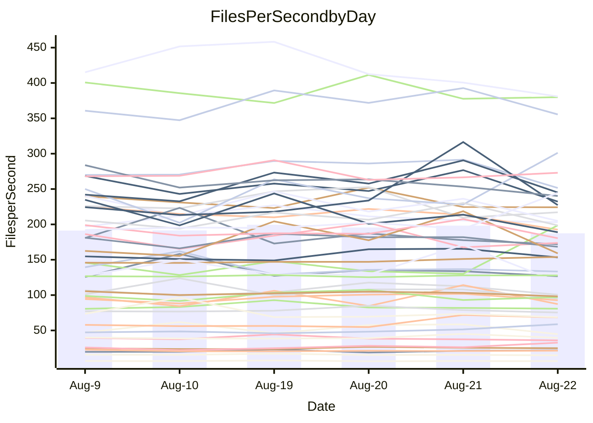

<!---
# This file is auto-generated. Do not edit.
# cspell:disable
--->
# Performance Report

Daily Performance

```mermaid
xychart-beta
    title Files Per Second by Day
    y-axis Files per Second
    x-axis Date [Aug-9, Aug-10, Aug-19, Aug-20, Aug-21, Aug-22]
    bar [191.27, 191.48, 199.45, 195.67, 198.22, 187.40]
    line [19.76, 19.87, 23.15, 18.80, 21.30, 21.70]
    line [94.45, 88.13, 97.66, 100.71, 101.93, 92.80]
    line [106.66, 99.38, 103.80, 117.71, 112.47, 100.50]
    line [80.61, 83.15, 92.81, 82.44, 81.86, 80.75]
    line [239.79, 231.09, 223.10, 252.00, 224.60, 224.17]
    line [269.81, 270.47, 289.77, 286.14, 291.59, 251.52]
    line [39.52, 37.52, 44.46, 38.46, 37.42, 35.96]
    line [268.54, 243.09, 257.77, 247.18, 276.72, 232.23]
    line [6.78, 6.60, 7.51, 6.38, 6.72, 6.55]
    line [240.17, 211.99, 227.00, 211.38, 205.51, 203.10]
    line [125.68, 158.27, 127.25, 135.61, 133.76, 126.70]
    line [225.24, 214.74, 210.02, 221.88, 213.58, 192.56]
    line [225.91, 222.58, 246.74, 252.74, 209.47, 217.12]
    line [145.75, 128.32, 148.05, 133.76, 130.09, 198.58]
    line [24.65, 23.72, 23.68, 26.94, 25.51, 24.79]
    line [139.45, 161.93, 128.87, 135.71, 136.66, 133.36]
    line [25.95, 22.03, 24.86, 28.29, 26.21, 32.71]
    line [154.75, 150.93, 149.02, 164.86, 165.64, 153.35]
    line [15.80, 15.53, 17.25, 15.28, 15.49, 14.84]
    line [196.97, 211.99, 246.59, 218.10, 236.31, 204.94]
    line [180.75, 223.35, 172.94, 187.16, 177.68, 172.01]
    line [96.93, 84.41, 106.12, 84.61, 114.12, 87.31]
    line [77.16, 76.75, 77.91, 84.91, 78.76, 75.34]
    line [400.74, 385.62, 371.65, 411.46, 377.61, 379.88]
    line [145.79, 145.58, 147.10, 147.08, 151.07, 153.94]
    line [249.96, 202.34, 263.67, 236.99, 228.06, 301.20]
    line [186.27, 165.43, 184.07, 202.12, 167.51, 173.85]
    line [224.37, 213.27, 217.89, 233.79, 316.48, 227.32]
    line [47.00, 61.84, 45.89, 57.63, 58.67, 44.77]
    line [127.47, 149.55, 129.16, 129.10, 170.99, 119.13]
    line [181.18, 166.12, 186.93, 181.85, 181.88, 168.34]
    line [57.90, 56.15, 56.35, 54.76, 71.89, 68.47]
    line [101.07, 123.80, 99.87, 108.06, 107.98, 95.34]
    line [98.84, 91.76, 103.43, 107.49, 93.08, 97.11]
    line [162.48, 155.40, 204.32, 177.59, 218.64, 159.00]
    line [360.76, 347.31, 389.41, 371.89, 392.82, 355.53]
    line [198.91, 184.05, 187.41, 186.67, 207.48, 180.49]
    line [242.10, 232.62, 273.32, 257.69, 290.62, 245.10]
    line [73.60, 96.61, 68.89, 69.48, 73.38, 68.77]
    line [415.14, 451.69, 458.22, 412.53, 400.53, 380.98]
    line [283.77, 252.09, 262.36, 263.68, 253.37, 240.18]
    line [22.84, 20.59, 20.47, 21.22, 20.90, 21.42]
    line [205.56, 193.98, 216.67, 206.61, 230.20, 198.53]
    line [126.64, 126.17, 128.45, 125.27, 127.94, 127.77]
    line [105.46, 100.11, 102.43, 104.89, 103.21, 98.21]
    line [47.26, 48.66, 46.00, 48.26, 51.42, 58.83]
    line [268.09, 268.70, 290.78, 262.94, 266.60, 272.93]
    line [234.76, 198.61, 243.75, 200.90, 213.71, 188.91]
    line [39.98, 38.63, 38.64, 39.11, 45.24, 39.50]
    line [192.03, 195.48, 194.87, 202.54, 193.62, 244.63]
```

Time to Process Files

| Repository                                      | Elapsed | Min/Avg/Max          |    SD | SD Graph                |
| ----------------------------------------------- | ------: | :------------------: | ----: | ----------------------- |
| AdaDoom3/AdaDoom3                    |    2.86 | 2.1 /   2.6 /   2.9  |  0.26 | `    ┣━━┻━━╋━━●━━┫    ` |
| alexiosc/megistos                    |    7.22 | 5.5 /   7.0 /   7.9  |  0.46 | `    ┣━━┻━━╋●━┻━━┫    ` |
| apollographql/apollo-server          |    2.55 | 1.8 /   2.4 /   2.8  |  0.26 | `    ┣━━┻━━╋━●┻━━┫    ` |
| aspnetboilerplate/aspnetboilerplate  |    9.10 | 6.3 /   8.3 /   9.1  |  1.02 | `    ┣━━┻━━╋━●┻━━┫    ` |
| aws-amplify/docs                     |   13.52 | 9.6 /  12.9 /  14.0  |  1.10 | `    ┣━━┻━━╋━●┻━━┫    ` |
| Azure/azure-rest-api-specs           |   11.03 | 7.2 /   9.9 /  11.2  |  0.94 | `    ┣━━┻━━╋━━┻●━┫    ` |
| bitjson/typescript-starter           |    0.92 | 0.6 /   1.0 /   1.1  |  0.11 | `     ┣━┻●━╋━━┻━┫     ` |
| caddyserver/caddy                    |    3.59 | 2.5 /   3.4 /   3.9  |  0.39 | `    ┣━━┻━━╋●━┻━━┫    ` |
| canada-ca/open-source-logiciel-libre |    1.07 | 0.8 /   1.0 /   1.3  |  0.11 | `     ┣━┻━━╋●━┻━┫     ` |
| chef/chef                            |    5.09 | 3.0 /   4.7 /   5.3  |  0.56 | `    ┣━━┻━━╋━●┻━━┫    ` |
| dart-lang/sdk                        |   56.69 | 34.3 /  54.9 /  64.6 |  7.84 | `  ┣━━━┻━━━╋●━━┻━━━┫  ` |
| django/django                        |   13.50 | 10.2 /  12.8 /  15.0 |  1.56 | `   ┣━━━┻━━╋●━┻━━━┫   ` |
| eslint/eslint                        |   10.81 | 7.6 /   9.6 /  10.3  |  0.76 | `    ┣━━┻━━╋━━┻━●┫    ` |
| exonum/exonum                        |    3.32 | 2.6 /   3.2 /   3.7  |  0.27 | `    ┣━━┻━━╋●━┻━━┫    ` |
| flutter/samples                      |    8.58 | 8.0 /  12.3 /  14.0  |  1.30 | ` ●  ┣━━┻━━╋━━┻━━┫    ` |
| gitbucket/gitbucket                  |    3.13 | 2.5 /   3.1 /   3.4  |  0.32 | `    ┣━━┻━━╋●━┻━━┫    ` |
| googleapis/google-cloud-cpp          |  126.16 | 96.3 / 118.3 / 127.8 | 11.97 | `  ┣━━━┻━━━╋━━●┻━━━┫  ` |
| graphql/express-graphql              |    1.05 | 0.7 /   1.0 /   1.2  |  0.10 | `     ┣━┻━━●━━┻━┫     ` |
| graphql/graphql-js                   |    3.59 | 2.8 /   3.5 /   3.9  |  0.28 | `    ┣━━┻━━╋●━┻━━┫    ` |
| graphql/graphql-relay-js             |    0.86 | 0.7 /   1.1 /   1.3  |  0.10 | `    ●┣━┻━━╋━━┻━┫     ` |
| graphql/graphql-spec                 |    1.28 | 0.8 /   1.2 /   1.3  |  0.14 | `     ┣━┻━━╋●━┻━┫     ` |
| iluwatar/java-design-patterns        |   12.69 | 8.8 /  11.8 /  12.8  |  1.12 | `    ┣━━┻━━╋━●┻━━┫    ` |
| ktaranov/sqlserver-kit               |    5.61 | 3.1 /   5.3 /   6.2  |  0.99 | `    ┣━━┻━━╋●━┻━━┫    ` |
| liriliri/licia                       |    3.80 | 2.9 /   3.7 /   4.1  |  0.33 | `    ┣━━┻━━╋●━┻━━┫    ` |
| MartinThoma/LaTeX-examples           |    4.68 | 4.5 /   5.9 /   7.0  |  0.68 | `    ┣●━┻━━╋━━┻━━┫    ` |
| mdx-js/mdx                           |    1.85 | 1.5 /   1.8 /   1.9  |  0.09 | `     ┣━┻━━╋━●┻━┫     ` |
| microsoft/TypeScript-Website         |    4.97 | 5.0 /   5.2 /   5.6  |  0.20 | `    ┣━━●━━╋━━┻━━┫    ` |
| MicrosoftDocs/PowerShell-Docs        |   26.24 | 14.3 /  23.3 /  25.8 |  2.65 | `   ┣━━━┻━━╋━━┻●━━┫   ` |
| neovim/nvim-lspconfig                |    5.00 | 3.7 /   4.8 /   5.6  |  0.59 | `    ┣━━┻━━╋●━┻━━┫    ` |
| pagekit/pagekit                      |    3.26 | 1.9 /   3.2 /   3.6  |  0.48 | `    ┣━━┻━━●━━┻━━┫    ` |
| php/php-src                          |   25.06 | 18.3 /  23.0 /  26.1 |  2.47 | `   ┣━━━┻━━╋━━●━━━┫   ` |
| plasticrake/tplink-smarthome-api     |    1.39 | 0.8 /   1.2 /   1.4  |  0.18 | `     ┣━┻━━╋━●┻━┫     ` |
| prettier/prettier                    |    7.55 | 5.8 /   7.3 /   8.0  |  0.72 | `    ┣━━┻━━╋●━┻━━┫    ` |
| pycontribs/jira                      |    1.17 | 0.9 /   1.4 /   1.5  |  0.16 | `     ┣━●━━╋━━┻━┫     ` |
| RustPython/RustPython                |    9.00 | 5.8 /   8.9 /  11.1  |  1.25 | `    ┣━━┻━━●━━┻━━┫    ` |
| shoelace-style/shoelace              |    2.77 | 1.8 /   2.5 /   3.0  |  0.41 | `    ┣━━┻━━╋━●┻━━┫    ` |
| slint-ui/slint                       |   15.56 | 11.3 /  14.8 /  16.1 |  1.55 | `   ┣━━━┻━━╋━●┻━━━┫   ` |
| SoftwareBrothers/admin-bro           |    2.44 | 1.6 /   2.3 /   2.6  |  0.25 | `    ┣━━┻━━╋━●┻━━┫    ` |
| sveltejs/svelte                      |   23.50 | 16.9 /  21.4 /  23.0 |  1.93 | `   ┣━━━┻━━╋━━┻●━━┫   ` |
| TheAlgorithms/Python                 |    5.87 | 3.0 /   5.4 /   5.9  |  0.60 | `    ┣━━┻━━╋━━●━━┫    ` |
| twbs/bootstrap                       |    1.72 | 1.2 /   1.6 /   1.9  |  0.17 | `     ┣━┻━━╋●━┻━┫     ` |
| typescript-cheatsheets/react         |    1.12 | 0.7 /   1.1 /   1.3  |  0.11 | `     ┣━┻━━●━━┻━┫     ` |
| typescript-eslint/typescript-eslint  |    4.36 | 3.3 /   4.1 /   4.7  |  0.32 | `    ┣━━┻━━╋━●┻━━┫    ` |
| vitest-dev/vitest                    |   10.15 | 8.2 /  10.3 /  10.8  |  0.67 | `    ┣━━┻━●╋━━┻━━┫    ` |
| w3c/aria-practices                   |    3.26 | 3.1 /   3.3 /   3.5  |  0.10 | `     ┣━┻━●╋━━┻━┫     ` |
| w3c/specberus                        |    1.93 | 1.5 /   1.8 /   2.2  |  0.15 | `     ┣━┻━━╋━●┻━┫     ` |
| webdeveric/webpack-assets-manifest   |    0.93 | 0.9 /   1.2 /   1.4  |  0.11 | `     ●━┻━━╋━━┻━┫     ` |
| webpack/webpack                      |    6.98 | 3.7 /   6.1 /   7.4  |  1.05 | `    ┣━━┻━━╋━━●━━┫    ` |
| wireapp/wire-desktop                 |    1.29 | 1.0 /   1.3 /   1.5  |  0.13 | `     ┣━┻━━●━━┻━┫     ` |
| wireapp/wire-webapp                  |   10.33 | 10.3 /  12.9 /  14.2 |  0.74 | `●   ┣━━┻━━╋━━┻━━┫    ` |

Note:
- Elapsed time is in seconds.

Files per Second over Time

| Repository                                      | Files |    Sec |    Fps |     Rel | Trend Fps             |    N |
| ----------------------------------------------- | ----: | -----: | -----: | ------: | --------------------- | ---: |
| AdaDoom3/AdaDoom3                    |   103 |   2.86 |  35.96 |  -9.32% | `▇▃▃▇▂▂▃▃▃█▇▃▃▆▃▃▃▃▂` |   18 |
| alexiosc/megistos                    |   583 |   7.22 |  80.75 |  -3.17% | `▃▄▃▃▃▂▄▄▄█▄▃▄▃▄▄▃▃▃` |   18 |
| apollographql/apollo-server          |   256 |   2.55 | 100.50 |  -7.97% | `▂▂▃▂▃▆▅▂▃▃▃█▃▅▃▃▆▃▃` |   18 |
| aspnetboilerplate/aspnetboilerplate  |  2288 |   9.10 | 251.52 | -10.31% | `▂▂▂▃▃▂▇▃█▂▂▃▂█▃▂█▂▂` |   18 |
| aws-amplify/docs                     |  3030 |  13.52 | 224.17 |  -5.30% | `▂▂▃▂▃▆▅▃▃▂▃▃▃█▃▂▂▃▂` |   18 |
| Azure/azure-rest-api-specs           |  2561 |  11.03 | 232.23 | -11.35% | `█▃▅▃▃▂▃▂▃▃▃▂▃▂▃▃▆▃▂` |   18 |
| bitjson/typescript-starter           |    20 |   0.92 |  21.70 |   6.50% | `▄▃▃▃▂▂▂▃█▂▃▂▁▂▂▂▃▄▃` |   18 |
| caddyserver/caddy                    |   333 |   3.59 |  92.80 |  -4.59% | `▃▃▂▂▆▄▂▂▂▅▃▃▂▃█▆▃▃▃` |   18 |
| canada-ca/open-source-logiciel-libre |     7 |   1.07 |   6.55 |  -3.57% | `▄▃▄▃▇▁▄▃█▄▃▂▄▄▃▃▄▃▃` |   18 |
| chef/chef                            |  1034 |   5.09 | 203.10 |  -9.43% | `▃▁▆▂▂▂█▂▂▂▄▂▂▂▂▂▂▂▂` |   18 |
| dart-lang/sdk                        | 11618 |  56.69 | 204.94 |  -5.70% | `▂▂▂▁▂▂▂▃▂█▂▅▂▂▂▂▇▂▂` |   18 |
| django/django                        |  2931 |  13.50 | 217.12 |  -6.58% | `▂▃▃▂▆▃█▄▇▃▅█▃█▅▃▂▃▃` |   18 |
| eslint/eslint                        |  2082 |  10.81 | 192.56 | -12.25% | `▃▇█▂▃▂▃▃▃▃▂▆▃▃▃▃▃▃▁` |   18 |
| exonum/exonum                        |   421 |   3.32 | 126.70 |  -3.51% | `▂▃▃▅▄▃▄█▃▄▄▄█▄▃▄▃▇▄` |   18 |
| flutter/samples                      |  1703 |   8.58 | 198.58 |  41.95% | `▃▂▂▂█▃▂▂▂▄▄▂▂▂▂▁▂▂▇` |   18 |
| gitbucket/gitbucket                  |   418 |   3.13 | 133.36 |  -3.10% | `▃█▃▂▃▇▃▇▂▂▄▇▂▃▃▇▂▃▃` |   18 |
| googleapis/google-cloud-cpp          | 21238 | 126.16 | 168.34 |  -7.28% | `█▇▂▂▃▃▃▂█▃▃▇▃▃▃▂▇▂▃` |   18 |
| graphql/express-graphql              |    26 |   1.05 |  24.79 |  -1.19% | `▃▆▂▃▂▂▃▃▃▂▂▃▃▃█▅▃▃▃` |   18 |
| graphql/graphql-js                   |   551 |   3.59 | 153.35 |  -2.73% | `▄▃▃▂▃▇▃▃▃▃▃█▃▃▄▄▇▄▃` |   18 |
| graphql/graphql-relay-js             |    28 |   0.86 |  32.71 |  25.26% | `▃▃▃▃▃▅▂▁▃▃▃▃▃█▃▃▃▃▆` |   18 |
| graphql/graphql-spec                 |    19 |   1.28 |  14.84 |  -6.39% | `▂▂▂█▂▂▂▃▇▂▃▃▃▂▂▂▄▂▂` |   18 |
| iluwatar/java-design-patterns        |  2183 |  12.69 | 172.01 |  -5.86% | `▃▃▂▃▂▄█▇▂▃▃▃▃▄▆▃▃▃▃` |   18 |
| ktaranov/sqlserver-kit               |   490 |   5.61 |  87.31 | -10.81% | `▂▁▂▇▁▄▂▂▂▇▂▁▂▂▂▃▂█▂` |   18 |
| liriliri/licia                       |  1442 |   3.80 | 379.88 |  -3.48% | `▃▂▃▂█▇▄▃▃▃▃▃█▄▄▃▃▃▃` |   18 |
| MartinThoma/LaTeX-examples           |  1409 |   4.68 | 301.20 |  23.92% | `▂▄█▄▇▃▃▂▃▇▅▃▃▆▃▃▃▃▇` |   18 |
| mdx-js/mdx                           |   139 |   1.85 |  75.34 |  -4.94% | `▆▄▃▅▃▅▃▄▅▅▃▅▆█▇▅▄▅▄` |   18 |
| microsoft/TypeScript-Website         |   765 |   4.97 | 153.94 |   4.61% | `▆█▇▅▄▆▇▆█▄▇█▄▇▇▇▇██` |   18 |
| MicrosoftDocs/PowerShell-Docs        |  3126 |  26.24 | 119.13 | -12.78% | `▂▂▂▁▂▂▂▃▂▂▂▂▂▂▂█▄▂▁` |   18 |
| neovim/nvim-lspconfig                |   869 |   5.00 | 173.85 |  -6.10% | `▂▂▅█▆▃▅▃▃▆▄▆▆█▃▃▃▃▃` |   18 |
| pagekit/pagekit                      |   741 |   3.26 | 227.32 |  -5.33% | `▂▂▁▂▁▄▂▂▂▂▂▅▂▁▂▆█▂▂` |   18 |
| php/php-src                          |  2389 |  25.06 |  95.34 |  -9.06% | `▃▃▂▃▃▇▄▇▃▅▂▃▇▃▅█▃▂▃` |   18 |
| plasticrake/tplink-smarthome-api     |    62 |   1.39 |  44.77 | -13.83% | `▂▂▂▂▂▁▂▅▁▂▂▅▃▂▇▂▃█▂` |   18 |
| prettier/prettier                    |  2685 |   7.55 | 355.53 |  -4.58% | `▃▂▃█▃▂▃▃▃█▃▇▃▃▃▇▄▄▃` |   18 |
| pycontribs/jira                      |    80 |   1.17 |  68.47 |  15.20% | `▅▂▂▂▂▂▂▂▂▂▂▂▂▂█▂▅▄`  |   17 |
| RustPython/RustPython                |   874 |   9.00 |  97.11 |  -3.06% | `▁▂▂▃▃▆▅▃▃▃▅▃▃█▃▂▃▃▃` |   18 |
| shoelace-style/shoelace              |   440 |   2.77 | 159.00 | -12.53% | `▂▁▂▂▅▂▂▂▂█▆▂▂▂▇▇▇▄▂` |   18 |
| slint-ui/slint                       |  3815 |  15.56 | 245.10 |  -5.12% | `▃▃▂▂▂▃▂▂▃█▃▂▂▆▂▆█▂▃` |   18 |
| SoftwareBrothers/admin-bro           |   441 |   2.44 | 180.49 |  -7.38% | `█▃▃▃▂▃▂▂▃▃▃▅▂▂▂▂▃▇▂` |   18 |
| sveltejs/svelte                      |  8954 |  23.50 | 380.98 |  -9.58% | `▂▂▂▂▃▃█▅█▅▂▅▂▃▃▃▂▃▂` |   18 |
| TheAlgorithms/Python                 |  1411 |   5.87 | 240.18 | -10.68% | `▂▁▁▂▂█▂▂▂▂▂▂▂▂▂▁▂▂▁` |   18 |
| twbs/bootstrap                       |   118 |   1.72 |  68.77 |  -5.97% | `▃▄▂▆▃▂▆█▃▃▃▃▃▄▃▆▃▂▃` |   18 |
| typescript-cheatsheets/react         |    24 |   1.12 |  21.42 |  -1.03% | `▂▃█▁▃▂▃▂▂▂▂▃▂▃▃▂▂▃▃` |   18 |
| typescript-eslint/typescript-eslint  |   866 |   4.36 | 198.53 |  -5.96% | `▂▅▃▃▄▄▄▃▅▄▄▄▄▂▄█▅▄▃` |   18 |
| vitest-dev/vitest                    |  2769 |  10.15 | 272.93 |   0.89% | `▂▃▃▃▂▂▇▃▃█▃▃▂▄▃▃▃▃▄` |   18 |
| w3c/aria-practices                   |   417 |   3.26 | 127.77 |   0.74% | `█▇▄▆▄▇▇▆▇▆▆▅▆▇▅▇▇▅▆` |   18 |
| w3c/specberus                        |   190 |   1.93 |  98.21 |  -5.70% | `█▅▄▄▄▃▅▄▄▅▄▂▇▄▅▅▄▅▄` |   18 |
| webdeveric/webpack-assets-manifest   |    55 |   0.93 |  58.83 |  22.45% | `▄▆▃▄▃▃▅▄▄▃▃▄█▄▂█▄▄▇` |   18 |
| webpack/webpack                      |  1319 |   6.98 | 188.91 | -15.37% | `▄▂▄▂▂█▂▂▂█▂▂▃▂▂▁▂▅▂` |   18 |
| wireapp/wire-desktop                 |    51 |   1.29 |  39.50 |  -2.15% | `▃▂█▄▄▃▇▄▄▃▄▃▄▄▅▄▇█▄` |   18 |
| wireapp/wire-webapp                  |  2526 |  10.33 | 244.63 |  25.26% | `▄▃▃▃▃▄▄▄▄▃▄▄▂▃█▄▃▄█` |   18 |

Data Throughput

| Repository                                      | Files |    Sec |     Kps |     Rel | Trend Kps             |    N |
| ----------------------------------------------- | ----: | -----: | ------: | ------: | --------------------- | ---: |
| AdaDoom3/AdaDoom3                    |   103 |   2.86 |  764.16 |  -9.32% | `▇▃▃▇▂▂▃▃▃█▇▃▃▆▃▃▃▃▂` |   18 |
| alexiosc/megistos                    |   583 |   7.22 |  634.53 |  -3.17% | `▃▄▃▃▃▂▄▄▄█▄▃▄▃▄▄▃▃▃` |   18 |
| apollographql/apollo-server          |   256 |   2.55 |  827.59 |  -7.97% | `▂▂▃▂▃▆▅▂▃▃▃█▃▅▃▃▆▃▃` |   18 |
| aspnetboilerplate/aspnetboilerplate  |  2288 |   9.10 |  615.06 | -10.31% | `▂▂▂▃▃▂▇▃█▂▂▃▂█▃▂█▂▂` |   18 |
| aws-amplify/docs                     |  3030 |  13.52 |  876.34 |  -5.21% | `▂▂▃▂▃▆▅▃▃▂▃▃▃█▃▂▂▃▂` |   18 |
| Azure/azure-rest-api-specs           |  2561 |  11.03 |  711.46 | -10.95% | `█▃▅▃▃▂▃▂▃▃▃▃▃▂▃▃▆▃▂` |   18 |
| bitjson/typescript-starter           |    20 |   0.92 |   86.79 |   6.50% | `▄▃▃▃▂▂▂▃█▂▃▂▁▂▂▂▃▄▃` |   18 |
| caddyserver/caddy                    |   333 |   3.59 |  845.55 |  -4.69% | `▃▃▂▂▆▄▂▂▂▅▃▃▂▃█▆▃▃▃` |   18 |
| canada-ca/open-source-logiciel-libre |     7 |   1.07 |   54.27 |  -3.57% | `▄▃▄▃▇▁▄▃█▄▃▂▄▄▃▃▄▃▃` |   18 |
| chef/chef                            |  1034 |   5.09 |  997.23 |  -9.43% | `▃▁▆▂▂▂█▂▂▂▄▂▂▂▂▂▂▂▂` |   18 |
| dart-lang/sdk                        | 11618 |  56.69 | 1423.35 |  -5.44% | `▂▂▂▁▂▂▂▃▂█▂▅▂▂▂▂▇▂▂` |   18 |
| django/django                        |  2931 |  13.50 | 1400.32 |  -6.48% | `▂▃▃▂▆▃█▄▇▃▅█▃█▅▃▂▃▃` |   18 |
| eslint/eslint                        |  2082 |  10.81 | 1351.82 | -12.24% | `▃▇█▂▃▂▃▃▃▃▂▆▃▃▃▃▃▃▁` |   18 |
| exonum/exonum                        |   421 |   3.32 | 1211.91 |  -3.51% | `▂▃▃▅▄▃▄█▃▄▄▄█▄▃▄▃▇▄` |   18 |
| flutter/samples                      |  1703 |   8.58 | 1183.64 |  41.70% | `▃▂▂▂█▃▂▂▂▄▄▂▂▂▂▁▂▂▇` |   18 |
| gitbucket/gitbucket                  |   418 |   3.13 |  659.80 |  -2.67% | `▃█▃▂▂▇▃▇▂▂▄▇▂▃▃▇▃▃▄` |   18 |
| googleapis/google-cloud-cpp          | 21238 | 126.16 | 1462.47 |  -7.25% | `█▇▂▂▃▃▃▂█▃▃▇▃▃▃▂▇▂▃` |   18 |
| graphql/express-graphql              |    26 |   1.05 |  113.45 |  -1.19% | `▃▆▂▃▂▂▃▃▃▂▂▃▃▃█▅▃▃▃` |   18 |
| graphql/graphql-js                   |   551 |   3.59 | 1143.56 |  -2.73% | `▄▃▃▂▃▇▃▃▃▃▃█▃▃▄▄▇▄▃` |   18 |
| graphql/graphql-relay-js             |    28 |   0.86 |  128.51 |  25.26% | `▃▃▃▃▃▅▂▁▃▃▃▃▃█▃▃▃▃▆` |   18 |
| graphql/graphql-spec                 |    19 |   1.28 |  496.91 |  -6.39% | `▂▂▂█▂▂▂▃▇▂▃▃▃▂▂▂▄▂▂` |   18 |
| iluwatar/java-design-patterns        |  2183 |  12.69 |  531.39 |  -5.76% | `▃▃▂▃▂▄█▇▃▃▃▃▃▄▆▃▃▃▃` |   18 |
| ktaranov/sqlserver-kit               |   490 |   5.61 | 1322.71 | -10.81% | `▂▁▂▇▁▄▂▂▂▇▂▁▂▂▂▃▂█▂` |   18 |
| liriliri/licia                       |  1442 |   3.80 |  455.49 |  -3.27% | `▃▂▃▂█▇▄▃▃▃▃▃█▄▄▃▃▄▃` |   18 |
| MartinThoma/LaTeX-examples           |  1409 |   4.68 |  622.07 |  23.92% | `▂▄█▄▇▃▃▂▃▇▅▃▃▆▃▃▃▃▇` |   18 |
| mdx-js/mdx                           |   139 |   1.85 |  355.01 |  -4.94% | `▆▄▃▅▃▅▃▄▅▅▃▅▆█▇▅▄▅▄` |   18 |
| microsoft/TypeScript-Website         |   765 |   4.97 | 1061.48 |   4.61% | `▆█▇▅▄▆▇▆█▄▇█▄▇▇▇▇██` |   18 |
| MicrosoftDocs/PowerShell-Docs        |  3126 |  26.24 | 1272.37 | -12.75% | `▂▂▂▁▂▂▂▃▂▂▂▂▂▂▂█▄▂▁` |   18 |
| neovim/nvim-lspconfig                |   869 |   5.00 |  509.94 |  -6.18% | `▂▂▅█▆▃▅▃▃▆▄▆▆█▃▃▃▃▃` |   18 |
| pagekit/pagekit                      |   741 |   3.26 |  473.97 |  -5.33% | `▂▂▁▂▁▄▂▂▂▂▂▅▂▁▂▆█▂▂` |   18 |
| php/php-src                          |  2389 |  25.06 | 1686.69 |  -9.04% | `▃▃▂▃▃▇▄▇▃▅▂▃▇▃▅█▃▂▃` |   18 |
| plasticrake/tplink-smarthome-api     |    62 |   1.39 |  241.88 | -13.83% | `▂▂▂▂▂▁▂▅▁▂▂▅▃▂▇▂▃█▂` |   18 |
| prettier/prettier                    |  2685 |   7.55 |  502.51 |  -4.81% | `▃▂▃█▃▂▃▃▃█▃▇▃▃▃▇▄▄▃` |   18 |
| pycontribs/jira                      |    80 |   1.17 |  483.60 |  15.20% | `▅▂▂▂▂▂▂▂▂▂▂▂▂▂█▂▅▄`  |   17 |
| RustPython/RustPython                |   874 |   9.00 | 2138.36 |  -2.92% | `▁▂▂▃▃▆▅▃▃▃▅▃▃█▃▂▃▃▃` |   18 |
| shoelace-style/shoelace              |   440 |   2.77 |  767.91 | -12.53% | `▂▁▂▂▅▂▂▂▂█▆▂▂▂▇▇▇▄▂` |   18 |
| slint-ui/slint                       |  3815 |  15.56 | 1318.74 |  -4.98% | `▃▃▂▂▂▃▂▂▃█▃▂▃▆▂▆█▂▃` |   18 |
| SoftwareBrothers/admin-bro           |   441 |   2.44 |  397.82 |  -7.38% | `█▃▃▃▂▃▂▂▃▃▃▅▂▂▂▂▃▇▂` |   18 |
| sveltejs/svelte                      |  8954 |  23.50 |  261.63 |  -9.53% | `▂▂▂▂▃▃█▅█▅▂▅▂▃▃▃▂▃▂` |   18 |
| TheAlgorithms/Python                 |  1411 |   5.87 |  614.32 | -10.68% | `▂▁▁▂▂█▂▂▂▂▂▂▂▂▂▁▂▂▁` |   18 |
| twbs/bootstrap                       |   118 |   1.72 |  564.18 |  -5.97% | `▃▄▂▆▃▂▆█▃▃▃▃▃▄▃▆▃▂▃` |   18 |
| typescript-cheatsheets/react         |    24 |   1.12 |  193.63 |  -1.03% | `▂▃█▁▃▂▃▂▂▂▂▃▂▃▃▂▂▃▃` |   18 |
| typescript-eslint/typescript-eslint  |   866 |   4.36 |  667.12 |  -5.99% | `▂▅▃▃▄▄▄▃▅▄▄▄▄▂▄█▅▄▃` |   18 |
| vitest-dev/vitest                    |  2769 |  10.15 |  788.82 |   1.99% | `▂▃▃▃▂▂▆▃▃█▄▃▃▄▃▃▃▄▄` |   18 |
| w3c/aria-practices                   |   417 |   3.26 | 1201.74 |   0.74% | `█▇▄▆▄▇▇▆▇▆▆▅▆▇▅▇▇▅▆` |   18 |
| w3c/specberus                        |   190 |   1.93 |  321.00 |  -5.64% | `█▅▄▄▄▃▅▄▄▅▄▂▇▄▅▅▄▅▄` |   18 |
| webdeveric/webpack-assets-manifest   |    55 |   0.93 |  135.84 |  22.45% | `▄▆▃▄▃▃▅▄▄▃▃▄█▄▂█▄▄▇` |   18 |
| webpack/webpack                      |  1319 |   6.98 | 1290.12 | -10.86% | `▃▁▃▁▁▇▂▁▂█▂▂▃▂▂▁▂▅▂` |   18 |
| wireapp/wire-desktop                 |    51 |   1.29 |  168.07 |  -2.15% | `▃▂█▄▄▃▇▄▄▃▄▃▄▄▅▄▇█▄` |   18 |
| wireapp/wire-webapp                  |  2526 |  10.33 | 1032.56 |  25.54% | `▃▃▃▃▃▄▄▄▄▃▄▄▂▃█▄▃▄█` |   18 |

