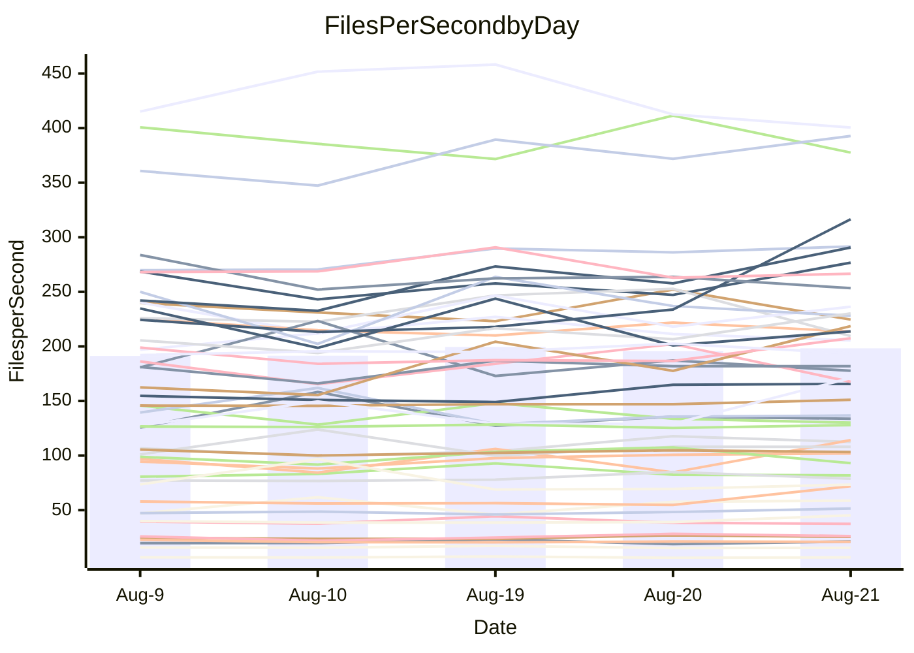

<!---
# This file is auto-generated. Do not edit.
# cspell:disable
--->
# Performance Report

Daily Performance

```mermaid
xychart-beta
    title Files Per Second by Day
    y-axis Files per Second
    x-axis Date [Aug-9, Aug-10, Aug-19, Aug-20, Aug-21]
    bar [191.27, 191.48, 199.45, 195.67, 198.22]
    line [19.76, 19.87, 23.15, 18.80, 21.30]
    line [94.45, 88.13, 97.66, 100.71, 101.93]
    line [106.66, 99.38, 103.80, 117.71, 112.47]
    line [80.61, 83.15, 92.81, 82.44, 81.86]
    line [239.79, 231.09, 223.10, 252.00, 224.60]
    line [269.81, 270.47, 289.77, 286.14, 291.59]
    line [39.52, 37.52, 44.46, 38.46, 37.42]
    line [268.54, 243.09, 257.77, 247.18, 276.72]
    line [6.78, 6.60, 7.51, 6.38, 6.72]
    line [240.17, 211.99, 227.00, 211.38, 205.51]
    line [125.68, 158.27, 127.25, 135.61, 133.76]
    line [225.24, 214.74, 210.02, 221.88, 213.58]
    line [225.91, 222.58, 246.74, 252.74, 209.47]
    line [145.75, 128.32, 148.05, 133.76, 130.09]
    line [24.65, 23.72, 23.68, 26.94, 25.51]
    line [139.45, 161.93, 128.87, 135.71, 136.66]
    line [25.95, 22.03, 24.86, 28.29, 26.21]
    line [154.75, 150.93, 149.02, 164.86, 165.64]
    line [15.80, 15.53, 17.25, 15.28, 15.49]
    line [196.97, 211.99, 246.59, 218.10, 236.31]
    line [180.75, 223.35, 172.94, 187.16, 177.68]
    line [96.93, 84.41, 106.12, 84.61, 114.12]
    line [77.16, 76.75, 77.91, 84.91, 78.76]
    line [400.74, 385.62, 371.65, 411.46, 377.61]
    line [145.79, 145.58, 147.10, 147.08, 151.07]
    line [249.96, 202.34, 263.67, 236.99, 228.06]
    line [186.27, 165.43, 184.07, 202.12, 167.51]
    line [224.37, 213.27, 217.89, 233.79, 316.48]
    line [47.00, 61.84, 45.89, 57.63, 58.67]
    line [127.47, 149.55, 129.16, 129.10, 170.99]
    line [181.18, 166.12, 186.93, 181.85, 181.88]
    line [57.90, 56.15, 56.35, 54.76, 71.89]
    line [101.07, 123.80, 99.87, 108.06, 107.98]
    line [98.84, 91.76, 103.43, 107.49, 93.08]
    line [162.48, 155.40, 204.32, 177.59, 218.64]
    line [360.76, 347.31, 389.41, 371.89, 392.82]
    line [198.91, 184.05, 187.41, 186.67, 207.48]
    line [242.10, 232.62, 273.32, 257.69, 290.62]
    line [73.60, 96.61, 68.89, 69.48, 73.38]
    line [415.14, 451.69, 458.22, 412.53, 400.53]
    line [283.77, 252.09, 262.36, 263.68, 253.37]
    line [22.84, 20.59, 20.47, 21.22, 20.90]
    line [205.56, 193.98, 216.67, 206.61, 230.20]
    line [126.64, 126.17, 128.45, 125.27, 127.94]
    line [105.46, 100.11, 102.43, 104.89, 103.21]
    line [47.26, 48.66, 46.00, 48.26, 51.42]
    line [268.09, 268.70, 290.78, 262.94, 266.60]
    line [234.76, 198.61, 243.75, 200.90, 213.71]
    line [39.98, 38.63, 38.64, 39.11, 45.24]
    line [192.03, 195.48, 194.87, 202.54, 193.62]
```

Time to Process Files

| Repository                                      | Elapsed | Min/Avg/Max          |    SD | SD Graph                |
| ----------------------------------------------- | ------: | :------------------: | ----: | ----------------------- |
| AdaDoom3/AdaDoom3                    |    2.79 | 2.1 /   2.6 /   2.9  |  0.26 | `    ┣━━┻━━╋━●┻━━┫    ` |
| alexiosc/megistos                    |    7.10 | 5.5 /   7.0 /   7.9  |  0.48 | `    ┣━━┻━━╋●━┻━━┫    ` |
| apollographql/apollo-server          |    2.48 | 1.8 /   2.4 /   2.8  |  0.26 | `    ┣━━┻━━╋●━┻━━┫    ` |
| aspnetboilerplate/aspnetboilerplate  |    8.94 | 6.3 /   8.3 /   9.1  |  1.03 | `    ┣━━┻━━╋━●┻━━┫    ` |
| aws-amplify/docs                     |   12.98 | 9.6 /  12.9 /  14.0  |  1.13 | `    ┣━━┻━━●━━┻━━┫    ` |
| Azure/azure-rest-api-specs           |   10.19 | 7.2 /   9.9 /  11.2  |  0.96 | `    ┣━━┻━━╋●━┻━━┫    ` |
| bitjson/typescript-starter           |    0.86 | 0.6 /   1.0 /   1.1  |  0.10 | `     ┣●┻━━╋━━┻━┫     ` |
| caddyserver/caddy                    |    3.50 | 2.5 /   3.4 /   3.9  |  0.40 | `    ┣━━┻━━╋●━┻━━┫    ` |
| canada-ca/open-source-logiciel-libre |    1.06 | 0.8 /   1.0 /   1.3  |  0.12 | `     ┣━┻━━●━━┻━┫     ` |
| chef/chef                            |    4.83 | 3.0 /   4.7 /   5.3  |  0.57 | `    ┣━━┻━━╋●━┻━━┫    ` |
| dart-lang/sdk                        |   58.69 | 34.3 /  54.7 /  64.6 |  8.01 | `  ┣━━━┻━━━╋━●━┻━━━┫  ` |
| django/django                        |   13.69 | 10.2 /  12.8 /  15.0 |  1.59 | `   ┣━━━┻━━╋━●┻━━━┫   ` |
| eslint/eslint                        |    9.64 | 7.6 /   9.5 /  10.3  |  0.78 | `    ┣━━┻━━●━━┻━━┫    ` |
| exonum/exonum                        |    2.78 | 2.6 /   3.3 /   3.7  |  0.25 | `    ┣●━┻━━╋━━┻━━┫    ` |
| flutter/samples                      |   12.58 | 8.0 /  12.3 /  14.0  |  1.34 | `    ┣━━┻━━╋●━┻━━┫    ` |
| gitbucket/gitbucket                  |    3.30 | 2.5 /   3.1 /   3.4  |  0.32 | `    ┣━━┻━━╋━●┻━━┫    ` |
| googleapis/google-cloud-cpp          |  127.23 | 96.3 / 117.8 / 127.8 | 12.12 | `  ┣━━━┻━━━╋━━●┻━━━┫  ` |
| graphql/express-graphql              |    1.10 | 0.7 /   1.0 /   1.2  |  0.11 | `     ┣━┻━━╋●━┻━┫     ` |
| graphql/graphql-js                   |    3.52 | 2.8 /   3.5 /   3.9  |  0.28 | `    ┣━━┻━━●━━┻━━┫    ` |
| graphql/graphql-relay-js             |    1.08 | 0.7 /   1.1 /   1.3  |  0.11 | `     ┣━┻━━●━━┻━┫     ` |
| graphql/graphql-spec                 |    1.30 | 0.8 /   1.2 /   1.3  |  0.14 | `     ┣━┻━━╋━●┻━┫     ` |
| iluwatar/java-design-patterns        |   12.39 | 8.8 /  11.8 /  12.8  |  1.15 | `    ┣━━┻━━╋━●┻━━┫    ` |
| ktaranov/sqlserver-kit               |    3.12 | 3.3 /   5.4 /   6.2  |  0.86 | `  ● ┣━━┻━━╋━━┻━━┫    ` |
| liriliri/licia                       |    3.74 | 2.9 /   3.7 /   4.1  |  0.34 | `    ┣━━┻━━●━━┻━━┫    ` |
| MartinThoma/LaTeX-examples           |    6.06 | 4.5 /   5.9 /   7.0  |  0.70 | `    ┣━━┻━━╋●━┻━━┫    ` |
| mdx-js/mdx                           |    1.76 | 1.5 /   1.8 /   1.9  |  0.10 | `     ┣━┻━━●━━┻━┫     ` |
| microsoft/TypeScript-Website         |    5.00 | 5.0 /   5.2 /   5.6  |  0.20 | `    ┣━━●━━╋━━┻━━┫    ` |
| MicrosoftDocs/PowerShell-Docs        |   24.03 | 14.3 /  23.3 /  25.8 |  2.72 | `   ┣━━━┻━━╋●━┻━━━┫   ` |
| neovim/nvim-lspconfig                |    5.08 | 3.7 /   4.7 /   5.6  |  0.60 | `    ┣━━┻━━╋━●┻━━┫    ` |
| pagekit/pagekit                      |    3.17 | 1.9 /   3.2 /   3.6  |  0.49 | `    ┣━━┻━━●━━┻━━┫    ` |
| php/php-src                          |   25.67 | 18.3 /  22.9 /  26.1 |  2.46 | `   ┣━━━┻━━╋━━┻●━━┫   ` |
| plasticrake/tplink-smarthome-api     |    0.80 | 0.9 /   1.3 /   1.4  |  0.15 | `  ●  ┣━┻━━╋━━┻━┫     ` |
| prettier/prettier                    |    7.37 | 5.8 /   7.3 /   8.0  |  0.74 | `    ┣━━┻━━●━━┻━━┫    ` |
| pycontribs/jira                      |    1.09 | 0.9 /   1.4 /   1.5  |  0.14 | `     ●━┻━━╋━━┻━┫     ` |
| RustPython/RustPython                |    9.34 | 5.8 /   8.8 /  11.1  |  1.28 | `    ┣━━┻━━╋●━┻━━┫    ` |
| shoelace-style/shoelace              |    2.36 | 1.8 /   2.5 /   3.0  |  0.42 | `    ┣━━┻━●╋━━┻━━┫    ` |
| slint-ui/slint                       |   16.02 | 11.3 /  14.7 /  16.1 |  1.57 | `   ┣━━━┻━━╋━━●━━━┫   ` |
| SoftwareBrothers/admin-bro           |    1.69 | 1.6 /   2.3 /   2.6  |  0.21 | `  ●  ┣━┻━━╋━━┻━┫     ` |
| sveltejs/svelte                      |   22.15 | 16.9 /  21.4 /  23.0 |  1.98 | `   ┣━━━┻━━╋●━┻━━━┫   ` |
| TheAlgorithms/Python                 |    5.36 | 3.0 /   5.4 /   5.9  |  0.61 | `    ┣━━┻━━●━━┻━━┫    ` |
| twbs/bootstrap                       |    1.78 | 1.2 /   1.6 /   1.9  |  0.17 | `     ┣━┻━━╋━●┻━┫     ` |
| typescript-cheatsheets/react         |    1.13 | 0.7 /   1.1 /   1.3  |  0.11 | `     ┣━┻━━●━━┻━┫     ` |
| typescript-eslint/typescript-eslint  |    4.15 | 3.3 /   4.1 /   4.7  |  0.33 | `    ┣━━┻━━●━━┻━━┫    ` |
| vitest-dev/vitest                    |   10.28 | 8.2 /  10.3 /  10.8  |  0.69 | `    ┣━━┻━━●━━┻━━┫    ` |
| w3c/aria-practices                   |    3.38 | 3.1 /   3.3 /   3.5  |  0.10 | `     ┣━┻━━╋━●┻━┫     ` |
| w3c/specberus                        |    1.82 | 1.5 /   1.8 /   2.2  |  0.15 | `     ┣━┻━━●━━┻━┫     ` |
| webdeveric/webpack-assets-manifest   |    1.14 | 0.9 /   1.2 /   1.4  |  0.12 | `     ┣━┻━━●━━┻━┫     ` |
| webpack/webpack                      |    4.91 | 3.7 /   6.2 /   7.4  |  1.04 | `    ┣━●┻━━╋━━┻━━┫    ` |
| wireapp/wire-desktop                 |    1.02 | 1.1 /   1.3 /   1.5  |  0.12 | `    ●┣━┻━━╋━━┻━┫     ` |
| wireapp/wire-webapp                  |   12.93 | 10.3 /  12.9 /  14.2 |  0.76 | `    ┣━━┻━━●━━┻━━┫    ` |

Note:
- Elapsed time is in seconds.

Files per Second over Time

| Repository                                      | Files |    Sec |    Fps |     Rel | Trend Fps            |    N |
| ----------------------------------------------- | ----: | -----: | -----: | ------: | -------------------- | ---: |
| AdaDoom3/AdaDoom3                    |   103 |   2.79 |  36.94 |  -7.20% | `▇▃▃▇▂▂▃▃▃█▇▃▃▆▃▃▃▃` |   17 |
| alexiosc/megistos                    |   583 |   7.10 |  82.09 |  -1.65% | `▃▄▃▃▃▂▄▄▄█▄▃▄▃▄▄▃▃` |   17 |
| apollographql/apollo-server          |   256 |   2.48 | 103.36 |  -5.65% | `▂▂▃▂▃▆▅▂▃▃▃█▃▅▃▃▆▃` |   17 |
| aspnetboilerplate/aspnetboilerplate  |  2288 |   8.94 | 255.99 |  -9.18% | `▂▂▂▃▃▂▇▃█▂▂▃▂█▃▂█▂` |   17 |
| aws-amplify/docs                     |  3030 |  12.98 | 233.36 |  -1.50% | `▂▂▃▂▃▆▅▃▃▂▃▃▃█▃▂▂▃` |   17 |
| Azure/azure-rest-api-specs           |  2561 |  10.19 | 251.44 |  -4.24% | `█▃▅▃▃▂▃▂▃▃▃▂▃▂▃▃▆▃` |   17 |
| bitjson/typescript-starter           |    20 |   0.86 |  23.32 |  15.45% | `▄▃▃▃▂▂▂▃█▂▃▂▁▂▂▂▃▄` |   17 |
| caddyserver/caddy                    |   333 |   3.50 |  95.05 |  -2.42% | `▃▃▂▂▆▄▂▂▂▅▃▃▂▃█▆▃▃` |   17 |
| canada-ca/open-source-logiciel-libre |     7 |   1.06 |   6.59 |  -3.12% | `▄▃▄▃▇▁▄▃█▄▃▂▄▄▃▃▄▃` |   17 |
| chef/chef                            |  1034 |   4.83 | 213.91 |  -4.86% | `▃▁▆▂▂▂█▂▂▂▄▂▂▂▂▂▂▂` |   17 |
| dart-lang/sdk                        | 11618 |  58.69 | 197.97 |  -9.38% | `▂▂▂▁▂▂▂▃▂█▂▅▂▂▂▂▇▂` |   17 |
| django/django                        |  2931 |  13.69 | 214.16 |  -8.28% | `▂▃▃▂▆▃█▄▇▃▅█▃█▅▃▂▃` |   17 |
| eslint/eslint                        |  2082 |   9.64 | 215.94 |  -1.68% | `▃▇█▂▃▂▃▃▃▃▂▆▃▃▃▃▃▃` |   17 |
| exonum/exonum                        |   421 |   2.78 | 151.28 |  16.25% | `▂▃▃▅▄▃▄█▃▄▄▄█▄▃▄▃▇` |   17 |
| flutter/samples                      |  1703 |  12.58 | 135.35 |  -3.43% | `▃▂▂▂█▃▂▂▂▄▄▂▂▂▂▁▂▂` |   17 |
| gitbucket/gitbucket                  |   418 |   3.30 | 126.75 |  -8.34% | `▃█▃▂▃▇▃▇▂▂▄▇▂▃▃▇▂▃` |   17 |
| googleapis/google-cloud-cpp          | 21238 | 127.23 | 166.93 |  -8.50% | `█▇▂▂▃▃▃▂█▃▃▇▃▃▃▂▇▂` |   17 |
| graphql/express-graphql              |    26 |   1.10 |  23.74 |  -5.66% | `▃▆▂▃▂▂▃▃▃▂▂▃▃▃█▅▃▃` |   17 |
| graphql/graphql-js                   |   551 |   3.52 | 156.54 |  -0.74% | `▄▃▃▂▃▇▃▃▃▃▃█▃▃▄▄▇▄` |   17 |
| graphql/graphql-relay-js             |    28 |   1.08 |  26.04 |  -0.31% | `▃▃▃▃▃▅▂▁▃▃▃▃▃█▃▃▃▃` |   17 |
| graphql/graphql-spec                 |    19 |   1.30 |  14.59 |  -8.43% | `▂▂▂█▂▂▂▃▇▂▃▃▃▂▂▂▄▂` |   17 |
| iluwatar/java-design-patterns        |  2183 |  12.39 | 176.15 |  -3.80% | `▃▃▂▃▂▄█▇▂▃▃▃▃▄▆▃▃▃` |   17 |
| ktaranov/sqlserver-kit               |   490 |   3.12 | 157.18 |  66.49% | `▂▁▂▇▁▄▂▂▂▇▂▁▂▂▂▃▂█` |   17 |
| liriliri/licia                       |  1442 |   3.74 | 385.78 |  -2.10% | `▃▂▃▂█▇▄▃▃▃▃▃█▄▄▃▃▃` |   17 |
| MartinThoma/LaTeX-examples           |  1409 |   6.06 | 232.57 |  -4.56% | `▂▄█▄▇▃▃▂▃▇▅▃▃▆▃▃▃▃` |   17 |
| mdx-js/mdx                           |   139 |   1.76 |  79.17 |  -0.11% | `▆▄▃▅▃▅▃▄▅▅▃▅▆█▇▅▄▅` |   17 |
| microsoft/TypeScript-Website         |   765 |   5.00 | 152.93 |   4.16% | `▆█▇▅▄▆▇▆█▅██▄▇▇▇▇█` |   17 |
| MicrosoftDocs/PowerShell-Docs        |  3126 |  24.03 | 130.07 |  -5.04% | `▂▂▂▁▂▂▂▃▂▂▂▂▂▂▂█▄▂` |   17 |
| neovim/nvim-lspconfig                |   869 |   5.08 | 170.99 |  -8.06% | `▂▂▅█▆▃▅▃▃▆▄▆▆█▃▃▃▃` |   17 |
| pagekit/pagekit                      |   741 |   3.17 | 233.57 |  -2.88% | `▂▂▁▂▁▄▂▂▂▂▂▅▂▁▂▆█▂` |   17 |
| php/php-src                          |  2389 |  25.67 |  93.07 | -11.81% | `▃▃▂▃▃▇▄▇▃▅▂▃▇▃▅█▃▂` |   17 |
| plasticrake/tplink-smarthome-api     |    62 |   0.80 |  77.56 |  53.75% | `▂▂▂▂▂▁▂▅▁▂▂▅▃▂▇▂▃█` |   17 |
| prettier/prettier                    |  2685 |   7.37 | 364.53 |  -2.29% | `▃▂▃█▃▂▃▃▃█▃▇▃▃▃▇▄▄` |   17 |
| pycontribs/jira                      |    80 |   1.09 |  73.12 |  24.82% | `▅▂▂▂▂▂▂▂▂▂▂▂▂▂█▂▅`  |   16 |
| RustPython/RustPython                |   874 |   9.34 |  93.55 |  -6.97% | `▁▂▂▃▃▆▅▃▃▃▅▃▃█▃▂▃▃` |   17 |
| shoelace-style/shoelace              |   440 |   2.36 | 186.30 |   2.64% | `▂▁▂▂▅▂▂▂▂█▆▂▂▂▇▇▇▄` |   17 |
| slint-ui/slint                       |  3815 |  16.02 | 238.10 |  -8.25% | `▃▃▂▂▂▃▂▂▃█▃▂▂▆▂▆█▂` |   17 |
| SoftwareBrothers/admin-bro           |   441 |   1.69 | 260.94 |  36.62% | `█▃▃▃▂▃▂▂▃▃▃▅▂▂▂▂▃▇` |   17 |
| sveltejs/svelte                      |  8954 |  22.15 | 404.28 |  -4.28% | `▂▂▂▂▃▃█▅█▅▂▅▂▃▃▃▂▃` |   17 |
| TheAlgorithms/Python                 |  1411 |   5.36 | 263.16 |  -2.26% | `▂▁▁▂▂█▂▂▂▂▂▂▂▂▂▁▂▂` |   17 |
| twbs/bootstrap                       |   118 |   1.78 |  66.20 |  -9.99% | `▃▄▂▆▃▂▆█▃▃▃▃▃▄▃▆▃▂` |   17 |
| typescript-cheatsheets/react         |    24 |   1.13 |  21.24 |  -1.96% | `▂▃█▁▃▂▃▂▂▂▂▃▂▃▃▂▂▃` |   17 |
| typescript-eslint/typescript-eslint  |   866 |   4.15 | 208.43 |  -1.34% | `▂▅▃▃▄▄▄▃▅▄▄▄▄▂▄█▅▄` |   17 |
| vitest-dev/vitest                    |  2769 |  10.28 | 269.26 |  -0.49% | `▂▃▃▃▂▂▇▃▃█▃▃▂▄▃▃▃▃` |   17 |
| w3c/aria-practices                   |   417 |   3.38 | 123.49 |  -2.78% | `█▇▄▆▄▇▇▆▇▆▆▅▆▇▅▇▇▅` |   17 |
| w3c/specberus                        |   190 |   1.82 | 104.15 |  -0.00% | `█▅▄▄▄▃▅▄▄▅▄▂▇▄▅▅▄▅` |   17 |
| webdeveric/webpack-assets-manifest   |    55 |   1.14 |  48.22 |   0.39% | `▄▆▃▄▃▃▅▄▄▃▃▄█▄▂█▄▄` |   17 |
| webpack/webpack                      |  1319 |   4.91 | 268.46 |  21.72% | `▄▂▄▂▂█▂▂▂█▂▂▃▂▂▁▂▅` |   17 |
| wireapp/wire-desktop                 |    51 |   1.02 |  49.77 |  25.00% | `▃▂█▄▄▃▇▄▄▃▄▃▄▄▅▄▇█` |   17 |
| wireapp/wire-webapp                  |  2526 |  12.93 | 195.34 |   0.03% | `▄▃▃▃▃▄▄▄▄▃▄▄▂▃█▄▃▄` |   17 |

Data Throughput

| Repository                                      | Files |    Sec |     Kps |     Rel | Trend Kps            |    N |
| ----------------------------------------------- | ----: | -----: | ------: | ------: | -------------------- | ---: |
| AdaDoom3/AdaDoom3                    |   103 |   2.79 |  785.11 |  -7.20% | `▇▃▃▇▂▂▃▃▃█▇▃▃▆▃▃▃▃` |   17 |
| alexiosc/megistos                    |   583 |   7.10 |  645.07 |  -1.65% | `▃▄▃▃▃▂▄▄▄█▄▃▄▃▄▄▃▃` |   17 |
| apollographql/apollo-server          |   256 |   2.48 |  851.10 |  -5.65% | `▂▂▃▂▃▆▅▂▃▃▃█▃▅▃▃▆▃` |   17 |
| aspnetboilerplate/aspnetboilerplate  |  2288 |   8.94 |  625.98 |  -9.18% | `▂▂▂▃▃▂▇▃█▂▂▃▂█▃▂█▂` |   17 |
| aws-amplify/docs                     |  3030 |  12.98 |  912.25 |  -1.41% | `▂▂▃▂▃▆▅▃▃▂▃▃▃█▃▂▂▃` |   17 |
| Azure/azure-rest-api-specs           |  2561 |  10.19 |  770.32 |  -3.78% | `█▃▅▃▃▂▃▂▃▃▃▃▃▂▃▃▆▃` |   17 |
| bitjson/typescript-starter           |    20 |   0.86 |   93.28 |  15.45% | `▄▃▃▃▂▂▂▃█▂▃▂▁▂▂▂▃▄` |   17 |
| caddyserver/caddy                    |   333 |   3.50 |  866.01 |  -2.52% | `▃▃▂▂▆▄▂▂▂▅▃▃▂▃█▆▃▃` |   17 |
| canada-ca/open-source-logiciel-libre |     7 |   1.06 |   54.62 |  -3.12% | `▄▃▄▃▇▁▄▃█▄▃▂▄▄▃▃▄▃` |   17 |
| chef/chef                            |  1034 |   4.83 | 1050.31 |  -4.86% | `▃▁▆▂▂▂█▂▂▂▄▂▂▂▂▂▂▂` |   17 |
| dart-lang/sdk                        | 11618 |  58.69 | 1374.95 |  -9.11% | `▂▂▂▁▂▂▂▃▂█▂▅▂▂▂▂▇▂` |   17 |
| django/django                        |  2931 |  13.69 | 1381.27 |  -8.17% | `▂▃▃▂▆▃█▄▇▃▅█▃█▅▃▂▃` |   17 |
| eslint/eslint                        |  2082 |   9.64 | 1515.96 |  -1.68% | `▃▇█▂▃▂▃▃▃▃▂▆▃▃▃▃▃▃` |   17 |
| exonum/exonum                        |   421 |   2.78 | 1447.06 |  16.25% | `▂▃▃▅▄▃▄█▃▄▄▄█▄▃▄▃▇` |   17 |
| flutter/samples                      |  1703 |  12.58 |  806.75 |  -3.61% | `▃▂▂▂█▃▂▂▂▄▄▂▂▂▂▁▂▂` |   17 |
| gitbucket/gitbucket                  |   418 |   3.30 |  627.08 |  -7.91% | `▃█▃▂▂▇▃▇▂▂▄▇▂▃▃▇▃▃` |   17 |
| googleapis/google-cloud-cpp          | 21238 | 127.23 | 1450.19 |  -8.46% | `█▇▂▂▃▃▃▂█▃▃▇▃▃▃▂▇▂` |   17 |
| graphql/express-graphql              |    26 |   1.10 |  108.66 |  -5.66% | `▃▆▂▃▂▂▃▃▃▂▂▃▃▃█▅▃▃` |   17 |
| graphql/graphql-js                   |   551 |   3.52 | 1167.37 |  -0.74% | `▄▃▃▂▃▇▃▃▃▃▃█▃▃▄▄▇▄` |   17 |
| graphql/graphql-relay-js             |    28 |   1.08 |  102.30 |  -0.31% | `▃▃▃▃▃▅▂▁▃▃▃▃▃█▃▃▃▃` |   17 |
| graphql/graphql-spec                 |    19 |   1.30 |  488.38 |  -8.43% | `▂▂▂█▂▂▂▃▇▂▃▃▃▂▂▂▄▂` |   17 |
| iluwatar/java-design-patterns        |  2183 |  12.39 |  544.20 |  -3.69% | `▃▃▂▃▂▄█▇▃▃▃▃▃▄▆▃▃▃` |   17 |
| ktaranov/sqlserver-kit               |   490 |   3.12 | 2381.11 |  66.49% | `▂▁▂▇▁▄▂▂▂▇▂▁▂▂▂▃▂█` |   17 |
| liriliri/licia                       |  1442 |   3.74 |  462.56 |  -1.87% | `▃▂▃▂█▇▄▃▃▃▃▃█▄▄▃▃▄` |   17 |
| MartinThoma/LaTeX-examples           |  1409 |   6.06 |  480.32 |  -4.56% | `▂▄█▄▇▃▃▂▃▇▅▃▃▆▃▃▃▃` |   17 |
| mdx-js/mdx                           |   139 |   1.76 |  373.07 |  -0.11% | `▆▄▃▅▃▅▃▄▅▅▃▅▆█▇▅▄▅` |   17 |
| microsoft/TypeScript-Website         |   765 |   5.00 | 1054.49 |   4.17% | `▆█▇▅▄▆▇▆█▅██▄▇▇▇▇█` |   17 |
| MicrosoftDocs/PowerShell-Docs        |  3126 |  24.03 | 1389.20 |  -5.00% | `▂▂▂▁▂▂▂▃▂▂▂▂▂▂▂█▄▂` |   17 |
| neovim/nvim-lspconfig                |   869 |   5.08 |  501.56 |  -8.14% | `▂▂▅█▆▃▅▃▃▆▄▆▆█▃▃▃▃` |   17 |
| pagekit/pagekit                      |   741 |   3.17 |  487.01 |  -2.88% | `▂▂▁▂▁▄▂▂▂▂▂▅▂▁▂▆█▂` |   17 |
| php/php-src                          |  2389 |  25.67 | 1646.53 | -11.79% | `▃▃▂▃▃▇▄▇▃▅▂▃▇▃▅█▃▂` |   17 |
| plasticrake/tplink-smarthome-api     |    62 |   0.80 |  419.06 |  53.75% | `▂▂▂▂▂▁▂▅▁▂▂▅▃▂▇▂▃█` |   17 |
| prettier/prettier                    |  2685 |   7.37 |  515.22 |  -2.53% | `▃▂▃█▃▂▃▃▃█▃▇▃▃▃▇▄▄` |   17 |
| pycontribs/jira                      |    80 |   1.09 |  516.44 |  24.82% | `▅▂▂▂▂▂▂▂▂▂▂▂▂▂█▂▅`  |   16 |
| RustPython/RustPython                |   874 |   9.34 | 2060.05 |  -6.83% | `▁▂▂▃▃▆▅▃▃▃▅▃▃█▃▂▃▃` |   17 |
| shoelace-style/shoelace              |   440 |   2.36 |  899.75 |   2.64% | `▂▁▂▂▅▂▂▂▂█▆▂▂▂▇▇▇▄` |   17 |
| slint-ui/slint                       |  3815 |  16.02 | 1281.06 |  -8.11% | `▃▃▂▂▂▃▂▂▃█▃▂▃▆▂▆█▂` |   17 |
| SoftwareBrothers/admin-bro           |   441 |   1.69 |  575.13 |  36.62% | `█▃▃▃▂▃▂▂▃▃▃▅▂▂▂▂▃▇` |   17 |
| sveltejs/svelte                      |  8954 |  22.15 |  277.63 |  -4.23% | `▂▂▂▂▃▃█▅█▅▂▅▂▃▃▃▂▃` |   17 |
| TheAlgorithms/Python                 |  1411 |   5.36 |  673.10 |  -2.26% | `▂▁▁▂▂█▂▂▂▂▂▂▂▂▂▁▂▂` |   17 |
| twbs/bootstrap                       |   118 |   1.78 |  543.06 |  -9.99% | `▃▄▂▆▃▂▆█▃▃▃▃▃▄▃▆▃▂` |   17 |
| typescript-cheatsheets/react         |    24 |   1.13 |  192.02 |  -1.96% | `▂▃█▁▃▂▃▂▂▂▂▃▂▃▃▂▂▃` |   17 |
| typescript-eslint/typescript-eslint  |   866 |   4.15 |  700.39 |  -1.38% | `▂▅▃▃▄▄▄▃▅▄▄▄▄▂▄█▅▄` |   17 |
| vitest-dev/vitest                    |  2769 |  10.28 |  778.23 |   0.66% | `▂▃▃▃▂▂▆▃▃█▄▃▃▄▃▃▃▄` |   17 |
| w3c/aria-practices                   |   417 |   3.38 | 1161.46 |  -2.78% | `█▇▄▆▄▇▇▆▇▆▆▅▆▇▅▇▇▅` |   17 |
| w3c/specberus                        |   190 |   1.82 |  340.41 |   0.07% | `█▅▄▄▄▃▅▄▄▅▄▂▇▄▅▅▄▅` |   17 |
| webdeveric/webpack-assets-manifest   |    55 |   1.14 |  111.35 |   0.39% | `▄▆▃▄▃▃▅▄▄▃▃▄█▄▂█▄▄` |   17 |
| webpack/webpack                      |  1319 |   4.91 | 1833.44 |  28.71% | `▃▁▃▁▁▇▂▁▂█▂▂▃▂▂▁▂▅` |   17 |
| wireapp/wire-desktop                 |    51 |   1.02 |  211.76 |  25.00% | `▃▂█▄▄▃▇▄▄▃▄▃▄▄▅▄▇█` |   17 |
| wireapp/wire-webapp                  |  2526 |  12.93 |  824.52 |   0.26% | `▃▃▃▃▃▄▄▄▄▃▄▄▂▃█▄▃▄` |   17 |

