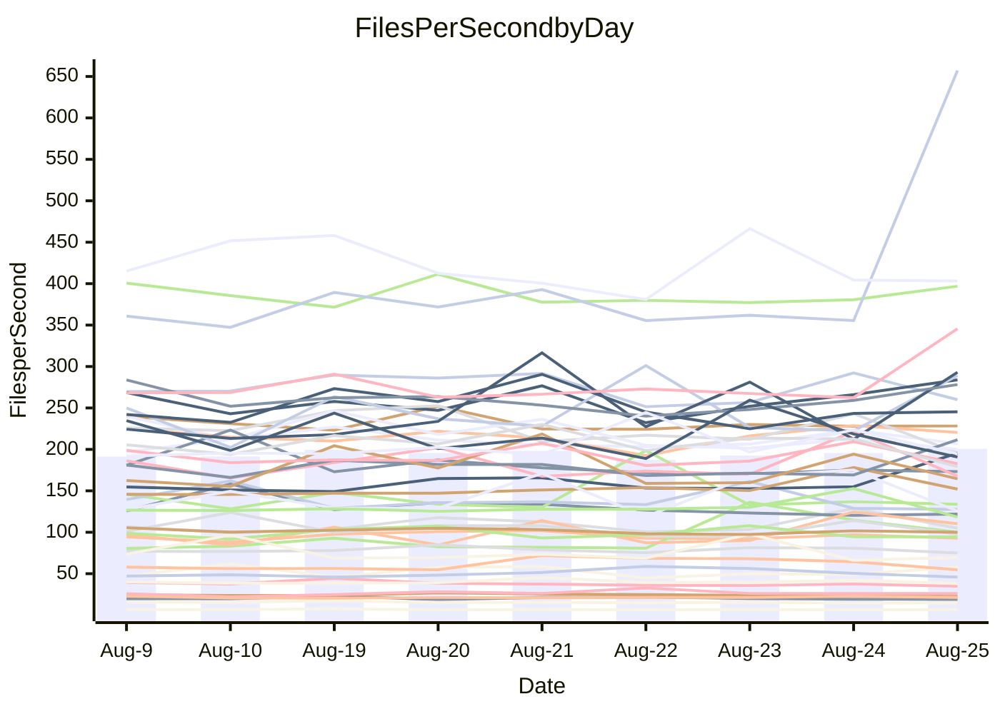

<!---
# This file is auto-generated. Do not edit.
# cspell:disable
--->
# Performance Report

Daily Performance

```mermaid
xychart-beta
    title Files Per Second by Day
    y-axis Files per Second
    x-axis Date [Aug-9, Aug-10, Aug-19, Aug-20, Aug-21, Aug-22, Aug-23, Aug-24, Aug-25]
    bar [191.27, 191.48, 199.45, 195.67, 198.22, 187.40, 192.61, 195.61, 200.69]
    line [19.76, 19.87, 23.15, 18.80, 21.30, 21.70, 20.11, 19.24, 18.97]
    line [94.45, 88.13, 97.66, 100.71, 101.93, 92.80, 92.11, 97.07, 92.83]
    line [106.66, 99.38, 103.80, 117.71, 112.47, 100.50, 103.30, 128.71, 104.89]
    line [80.61, 83.15, 92.81, 82.44, 81.86, 80.75, 136.22, 114.72, 99.92]
    line [239.79, 231.09, 223.10, 252.00, 224.60, 224.17, 230.06, 227.93, 228.22]
    line [269.81, 270.47, 289.77, 286.14, 291.59, 251.52, 256.69, 292.19, 260.02]
    line [39.52, 37.52, 44.46, 38.46, 37.42, 35.96, 35.65, 37.61, 34.82]
    line [268.54, 243.09, 257.77, 247.18, 276.72, 232.23, 252.08, 266.01, 283.94]
    line [6.78, 6.60, 7.51, 6.38, 6.72, 6.55, 6.77, 6.55, 6.58]
    line [240.17, 211.99, 227.00, 211.38, 205.51, 203.10, 206.43, 223.33, 206.89]
    line [125.68, 158.27, 127.25, 135.61, 133.76, 126.70, 123.28, 120.42, 121.90]
    line [225.24, 214.74, 210.02, 221.88, 213.58, 192.56, 216.27, 228.68, 220.47]
    line [225.91, 222.58, 246.74, 252.74, 209.47, 217.12, 212.13, 242.98, 195.81]
    line [145.75, 128.32, 148.05, 133.76, 130.09, 198.58, 132.66, 136.89, 133.84]
    line [24.65, 23.72, 23.68, 26.94, 25.51, 24.79, 23.76, 23.53, 22.75]
    line [139.45, 161.93, 128.87, 135.71, 136.66, 133.36, 161.38, 128.87, 127.62]
    line [25.95, 22.03, 24.86, 28.29, 26.21, 32.71, 26.20, 26.09, 26.00]
    line [154.75, 150.93, 149.02, 164.86, 165.64, 153.35, 152.64, 155.02, 195.52]
    line [15.80, 15.53, 17.25, 15.28, 15.49, 14.84, 15.46, 14.39, 15.01]
    line [196.97, 211.99, 246.59, 218.10, 236.31, 204.94, 201.38, 212.81, 200.01]
    line [180.75, 223.35, 172.94, 187.16, 177.68, 172.01, 170.49, 175.09, 173.22]
    line [96.93, 84.41, 106.12, 84.61, 114.12, 87.31, 89.99, 124.55, 110.24]
    line [77.16, 76.75, 77.91, 84.91, 78.76, 75.34, 81.46, 80.77, 74.97]
    line [400.74, 385.62, 371.65, 411.46, 377.61, 379.88, 377.18, 380.64, 396.91]
    line [145.79, 145.58, 147.10, 147.08, 151.07, 153.94, 150.27, 178.09, 152.08]
    line [249.96, 202.34, 263.67, 236.99, 228.06, 301.20, 226.40, 222.40, 289.06]
    line [186.27, 165.43, 184.07, 202.12, 167.51, 173.85, 169.85, 221.75, 167.75]
    line [224.37, 213.27, 217.89, 233.79, 316.48, 227.32, 281.23, 212.31, 293.11]
    line [47.00, 61.84, 45.89, 57.63, 58.67, 44.77, 49.92, 49.06, 57.90]
    line [127.47, 149.55, 129.16, 129.10, 170.99, 119.13, 167.47, 175.06, 125.57]
    line [181.18, 166.12, 186.93, 181.85, 181.88, 168.34, 171.35, 169.12, 211.70]
    line [57.90, 56.15, 56.35, 54.76, 71.89, 68.47, 68.09, 64.39, 54.76]
    line [101.07, 123.80, 99.87, 108.06, 107.98, 95.34, 94.96, 114.12, 97.84]
    line [98.84, 91.76, 103.43, 107.49, 93.08, 97.11, 107.90, 94.53, 94.47]
    line [162.48, 155.40, 204.32, 177.59, 218.64, 159.00, 159.79, 194.26, 164.45]
    line [360.76, 347.31, 389.41, 371.89, 392.82, 355.53, 361.83, 355.43, 657.12]
    line [198.91, 184.05, 187.41, 186.67, 207.48, 180.49, 185.92, 209.38, 182.67]
    line [242.10, 232.62, 273.32, 257.69, 290.62, 245.10, 224.83, 243.49, 245.36]
    line [73.60, 96.61, 68.89, 69.48, 73.38, 68.77, 97.84, 66.15, 69.59]
    line [415.14, 451.69, 458.22, 412.53, 400.53, 380.98, 466.37, 404.40, 403.18]
    line [283.77, 252.09, 262.36, 263.68, 253.37, 240.18, 248.22, 259.20, 278.18]
    line [22.84, 20.59, 20.47, 21.22, 20.90, 21.42, 21.40, 22.88, 21.36]
    line [205.56, 193.98, 216.67, 206.61, 230.20, 198.53, 213.69, 212.64, 179.07]
    line [126.64, 126.17, 128.45, 125.27, 127.94, 127.77, 130.20, 152.67, 118.34]
    line [105.46, 100.11, 102.43, 104.89, 103.21, 98.21, 97.36, 101.78, 100.00]
    line [47.26, 48.66, 46.00, 48.26, 51.42, 58.83, 56.30, 50.38, 45.97]
    line [268.09, 268.70, 290.78, 262.94, 266.60, 272.93, 267.45, 262.37, 345.57]
    line [234.76, 198.61, 243.75, 200.90, 213.71, 188.91, 259.37, 218.53, 190.79]
    line [39.98, 38.63, 38.64, 39.11, 45.24, 39.50, 39.66, 42.07, 38.23]
    line [192.03, 195.48, 194.87, 202.54, 193.62, 244.63, 196.70, 223.56, 194.58]
```

Time to Process Files

| Repository                                      | Elapsed | Min/Avg/Max          |    SD | SD Graph                |
| ----------------------------------------------- | ------: | :------------------: | ----: | ----------------------- |
| AdaDoom3/AdaDoom3                    |    2.96 | 2.1 /   2.7 /   2.9  |  0.24 | `    ┣━━┻━━╋━━●━━┫    ` |
| alexiosc/megistos                    |    5.83 | 4.1 /   6.8 /   7.9  |  0.92 | `    ┣━━●━━╋━━┻━━┫    ` |
| apollographql/apollo-server          |    2.44 | 1.8 /   2.4 /   2.8  |  0.26 | `    ┣━━┻━━╋●━┻━━┫    ` |
| aspnetboilerplate/aspnetboilerplate  |    8.80 | 6.3 /   8.3 /   9.1  |  0.99 | `    ┣━━┻━━╋●━┻━━┫    ` |
| aws-amplify/docs                     |   13.28 | 9.6 /  13.0 /  14.0  |  1.02 | `    ┣━━┻━━╋●━┻━━┫    ` |
| Azure/azure-rest-api-specs           |    9.07 | 7.2 /   9.9 /  11.2  |  0.93 | `    ┣━━●━━╋━━┻━━┫    ` |
| bitjson/typescript-starter           |    1.05 | 0.6 /   1.0 /   1.1  |  0.10 | `     ┣━┻━━╋●━┻━┫     ` |
| caddyserver/caddy                    |    3.64 | 2.5 /   3.5 /   3.9  |  0.36 | `    ┣━━┻━━╋●━┻━━┫    ` |
| canada-ca/open-source-logiciel-libre |    1.06 | 0.8 /   1.0 /   1.3  |  0.10 | `     ┣━┻━━●━━┻━┫     ` |
| chef/chef                            |    5.00 | 3.0 /   4.7 /   5.3  |  0.52 | `    ┣━━┻━━╋━●┻━━┫    ` |
| dart-lang/sdk                        |   58.17 | 34.3 /  55.1 /  64.6 |  7.17 | `  ┣━━━┻━━━╋━●━┻━━━┫  ` |
| django/django                        |   14.97 | 10.2 /  12.9 /  15.0 |  1.59 | `   ┣━━━┻━━╋━━┻●━━┫   ` |
| eslint/eslint                        |    9.44 | 7.6 /   9.6 /  10.8  |  0.76 | `    ┣━━┻━●╋━━┻━━┫    ` |
| exonum/exonum                        |    3.45 | 2.6 /   3.3 /   3.7  |  0.26 | `    ┣━━┻━━╋━●┻━━┫    ` |
| flutter/samples                      |   12.72 | 8.0 /  12.2 /  14.0  |  1.42 | `   ┣━━━┻━━╋●━┻━━━┫   ` |
| gitbucket/gitbucket                  |    3.28 | 2.5 /   3.1 /   3.4  |  0.31 | `    ┣━━┻━━╋━●┻━━┫    ` |
| googleapis/google-cloud-cpp          |  103.84 | 96.3 / 120.0 / 132.7 | 11.48 | `  ┣━●━┻━━━╋━━━┻━━━┫  ` |
| graphql/express-graphql              |    1.14 | 0.7 /   1.1 /   1.2  |  0.10 | `     ┣━┻━━╋━●┻━┫     ` |
| graphql/graphql-js                   |    2.82 | 2.8 /   3.5 /   3.9  |  0.25 | `  ● ┣━━┻━━╋━━┻━━┫    ` |
| graphql/graphql-relay-js             |    1.08 | 0.7 /   1.1 /   1.3  |  0.11 | `     ┣━┻━━●━━┻━┫     ` |
| graphql/graphql-spec                 |    1.27 | 0.8 /   1.2 /   1.4  |  0.13 | `     ┣━┻━━╋●━┻━┫     ` |
| iluwatar/java-design-patterns        |   12.60 | 8.8 /  12.0 /  12.8  |  1.06 | `    ┣━━┻━━╋━●┻━━┫    ` |
| ktaranov/sqlserver-kit               |    4.44 | 3.1 /   5.2 /   6.2  |  0.98 | `    ┣━━┻●━╋━━┻━━┫    ` |
| liriliri/licia                       |    3.63 | 2.9 /   3.7 /   4.1  |  0.30 | `    ┣━━┻━●╋━━┻━━┫    ` |
| MartinThoma/LaTeX-examples           |    4.87 | 4.5 /   5.9 /   7.0  |  0.69 | `    ┣━●┻━━╋━━┻━━┫    ` |
| mdx-js/mdx                           |    1.85 | 1.5 /   1.8 /   1.9  |  0.09 | `     ┣━┻━━╋━━●━┫     ` |
| microsoft/TypeScript-Website         |    5.03 | 3.7 /   5.1 /   5.6  |  0.37 | `    ┣━━┻━●╋━━┻━━┫    ` |
| MicrosoftDocs/PowerShell-Docs        |   24.89 | 13.9 /  22.9 /  26.2 |  3.32 | `   ┣━━┻━━━╋━●━┻━━┫   ` |
| neovim/nvim-lspconfig                |    5.19 | 3.7 /   4.7 /   5.6  |  0.60 | `    ┣━━┻━━╋━●┻━━┫    ` |
| pagekit/pagekit                      |    2.53 | 1.9 /   3.2 /   3.6  |  0.46 | `    ┣━●┻━━╋━━┻━━┫    ` |
| php/php-src                          |   24.42 | 18.2 /  23.1 /  26.1 |  2.56 | `   ┣━━━┻━━╋━●┻━━━┫   ` |
| plasticrake/tplink-smarthome-api     |    1.07 | 0.8 /   1.2 /   1.4  |  0.16 | `     ┣━●━━╋━━┻━┫     ` |
| prettier/prettier                    |    4.11 | 5.8 /   7.3 /   8.0  |  0.66 | `●     ┣━┻━╋━┻━┫      ` |
| pycontribs/jira                      |    1.46 | 0.9 /   1.3 /   1.5  |  0.16 | `     ┣━┻━━╋━●┻━┫     ` |
| RustPython/RustPython                |    9.28 | 5.8 /   8.9 /  11.1  |  1.15 | `    ┣━━┻━━╋●━┻━━┫    ` |
| shoelace-style/shoelace              |    2.68 | 1.8 /   2.5 /   3.0  |  0.40 | `    ┣━━┻━━╋●━┻━━┫    ` |
| slint-ui/slint                       |   15.79 | 11.3 /  15.0 /  17.0 |  1.51 | `   ┣━━━┻━━╋━●┻━━━┫   ` |
| SoftwareBrothers/admin-bro           |    2.41 | 1.6 /   2.3 /   2.6  |  0.25 | `    ┣━━┻━━╋●━┻━━┫    ` |
| sveltejs/svelte                      |   22.37 | 16.9 /  21.5 /  23.5 |  1.88 | `   ┣━━━┻━━╋━●┻━━━┫   ` |
| TheAlgorithms/Python                 |    5.07 | 3.0 /   5.4 /   5.9  |  0.55 | `    ┣━━┻●━╋━━┻━━┫    ` |
| twbs/bootstrap                       |    1.70 | 1.2 /   1.6 /   1.9  |  0.19 | `     ┣━┻━━╋●━┻━┫     ` |
| typescript-cheatsheets/react         |    1.12 | 0.7 /   1.1 /   1.3  |  0.10 | `     ┣━┻━━●━━┻━┫     ` |
| typescript-eslint/typescript-eslint  |    4.85 | 3.3 /   4.1 /   4.7  |  0.30 | `    ┣━━┻━━╋━━┻━━┫●   ` |
| vitest-dev/vitest                    |    8.07 | 8.2 /  10.3 /  10.8  |  0.62 | `●   ┣━━┻━━╋━━┻━━┫    ` |
| w3c/aria-practices                   |    3.52 | 2.3 /   3.2 /   3.5  |  0.23 | `    ┣━━┻━━╋━━●━━┫    ` |
| w3c/specberus                        |    1.90 | 1.5 /   1.8 /   2.2  |  0.14 | `     ┣━┻━━╋●━┻━┫     ` |
| webdeveric/webpack-assets-manifest   |    1.20 | 0.9 /   1.1 /   1.4  |  0.12 | `     ┣━┻━━╋●━┻━┫     ` |
| webpack/webpack                      |    7.15 | 3.7 /   6.1 /   7.4  |  1.03 | `    ┣━━┻━━╋━━●━━┫    ` |
| wireapp/wire-desktop                 |    1.33 | 1.0 /   1.3 /   1.5  |  0.12 | `     ┣━┻━━╋●━┻━┫     ` |
| wireapp/wire-webapp                  |   13.25 | 10.3 /  12.6 /  14.2 |  0.97 | `    ┣━━┻━━╋━●┻━━┫    ` |

Note:
- Elapsed time is in seconds.

Files per Second over Time

| Repository                                      | Files |    Sec |    Fps |     Rel | Trend Fps              |    N |
| ----------------------------------------------- | ----: | -----: | -----: | ------: | ---------------------- | ---: |
| AdaDoom3/AdaDoom3                    |   103 |   2.96 |  34.82 | -10.99% | `▇▂▂▃▃▃█▇▃▃▆▃▃▃▃▂▂▃▃▂` |   22 |
| alexiosc/megistos                    |   583 |   5.83 |  99.92 |  12.87% | `▂▂▁▂▂▃▅▂▂▂▂▂▂▂▂▂██▃▄` |   22 |
| apollographql/apollo-server          |   256 |   2.44 | 104.89 |  -4.91% | `▂▃▆▅▂▃▃▃█▃▅▃▃▆▃▃▃▆▆▃` |   22 |
| aspnetboilerplate/aspnetboilerplate  |  2288 |   8.80 | 260.02 |  -6.84% | `▃▃▂▇▃█▂▂▃▂█▃▂█▂▂▂▂▆▂` |   22 |
| aws-amplify/docs                     |  3030 |  13.28 | 228.22 |  -2.90% | `▂▃▆▅▃▃▂▃▃▃█▃▂▂▃▂▃▃▂▃` |   22 |
| Azure/azure-rest-api-specs           |  2576 |   9.07 | 283.94 |   8.99% | `▃▃▂▄▃▄▄▄▃▄▃▃▄█▄▂▄▆▃▆` |   22 |
| bitjson/typescript-starter           |    20 |   1.05 |  18.97 |  -6.64% | `▃▂▂▂▃█▂▃▂▁▂▂▂▃▄▃▃▂▂▂` |   22 |
| caddyserver/caddy                    |   338 |   3.64 |  92.83 |  -4.12% | `▂▆▄▂▂▂▅▃▃▂▃█▆▃▃▃▃▃▄▃` |   22 |
| canada-ca/open-source-logiciel-libre |     7 |   1.06 |   6.58 |  -2.69% | `▃▇▁▄▃█▄▃▂▄▄▃▃▄▃▃▄▃▃▃` |   22 |
| chef/chef                            |  1035 |   5.00 | 206.89 |  -6.97% | `▂▂▂█▂▂▂▄▂▂▂▂▂▂▂▂▂▂▃▂` |   22 |
| dart-lang/sdk                        | 11634 |  58.17 | 200.01 |  -7.24% | `▁▂▂▂▃▂█▂▅▂▂▂▂▇▂▂▂▂▃▂` |   22 |
| django/django                        |  2932 |  14.97 | 195.81 | -15.51% | `▂▆▃█▄▇▃▅█▃█▅▃▂▃▃▃▂█▂` |   22 |
| eslint/eslint                        |  2082 |   9.44 | 220.47 |   0.71% | `▃▄▃▄▅▄▅▄█▄▅▄▅▄▅▂▅▅▇▅` |   22 |
| exonum/exonum                        |   421 |   3.45 | 121.90 |  -6.04% | `▅▄▃▄█▃▄▄▄█▄▃▄▃▇▄▃▂▃▃` |   22 |
| flutter/samples                      |  1703 |  12.72 | 133.84 |  -5.72% | `▂█▃▂▂▂▄▄▂▂▂▂▁▂▂▇▂▃▂▂` |   22 |
| gitbucket/gitbucket                  |   418 |   3.28 | 127.62 |  -7.34% | `▃▃█▄█▂▃▅█▂▃▃▇▃▃▄█▃▃▃` |   22 |
| googleapis/google-cloud-cpp          | 21983 | 103.84 | 211.70 |  18.02% | `▂▃▃▃▂█▃▃▇▃▃▃▂▇▂▃▃▃▂▇` |   22 |
| graphql/express-graphql              |    26 |   1.14 |  22.75 |  -8.52% | `▃▂▂▃▃▃▂▂▃▃▃█▅▃▃▃▃▂▃▂` |   22 |
| graphql/graphql-js                   |   551 |   2.82 | 195.52 |  24.55% | `▂▃▇▃▃▃▃▃█▃▃▄▄▇▄▃▃▃▄█` |   22 |
| graphql/graphql-relay-js             |    28 |   1.08 |  26.00 |  -1.56% | `▃▃▅▂▁▃▃▃▃▃█▃▃▃▃▆▃▃▃▃` |   22 |
| graphql/graphql-spec                 |    19 |   1.27 |  15.01 |  -4.14% | `█▃▂▂▃▇▂▃▃▃▃▃▃▄▂▃▃▃▁▃` |   22 |
| iluwatar/java-design-patterns        |  2183 |  12.60 | 173.22 |  -4.29% | `▃▂▄█▇▂▃▃▃▃▄▆▃▃▃▃▂▃▃▃` |   22 |
| ktaranov/sqlserver-kit               |   490 |   4.44 | 110.24 |  10.82% | `▇▁▄▂▂▂▇▂▁▂▂▂▃▂█▂▂▄▇▄` |   22 |
| liriliri/licia                       |  1442 |   3.63 | 396.91 |   1.50% | `▂█▇▄▃▃▃▃▃█▄▄▃▃▃▃▃▃▃▄` |   22 |
| MartinThoma/LaTeX-examples           |  1409 |   4.87 | 289.06 |  18.92% | `▄█▄▃▂▄█▆▃▃▆▃▃▃▄█▃▃▃▇` |   22 |
| mdx-js/mdx                           |   139 |   1.85 |  74.97 |  -5.47% | `▅▃▅▃▄▅▅▃▅▆█▇▅▄▅▄▅▅▅▃` |   22 |
| microsoft/TypeScript-Website         |   765 |   5.03 | 152.08 |   1.10% | `▂▂▃▃▃▃▂▃▃▂▃▃▃▃▃▃▃▃█▃` |   22 |
| MicrosoftDocs/PowerShell-Docs        |  3126 |  24.89 | 125.57 | -10.75% | `▁▂▂▂▃▂▂▂▂▂▂▂█▄▂▁▄▂█▂` |   22 |
| neovim/nvim-lspconfig                |   871 |   5.19 | 167.75 | -10.42% | `█▆▃▅▃▃▆▄▆▆█▃▃▃▃▃▃▇▇▃` |   22 |
| pagekit/pagekit                      |   741 |   2.53 | 293.11 |  22.70% | `▂▁▄▂▂▂▂▂▅▂▁▂▆█▂▂▄▁▂▅` |   22 |
| php/php-src                          |  2389 |  24.42 |  97.84 |  -6.64% | `▃▃▇▃▇▃▅▂▃▇▃▅█▃▂▃▂▃█▃` |   22 |
| plasticrake/tplink-smarthome-api     |    62 |   1.07 |  57.90 |  12.95% | `▂▂▁▂▅▁▂▂▅▃▂▇▂▃█▂▃▂▃▄` |   22 |
| prettier/prettier                    |  2699 |   4.11 | 657.12 |  77.71% | `▄▁▁▂▂▂▄▂▃▁▂▁▄▂▂▂▂▂▂█` |   22 |
| pycontribs/jira                      |    80 |   1.46 |  54.76 |  -9.86% | `▂▂▂▂▂▂▂▂▂▂▂▂█▂▅▄▄▂▅▂` |   21 |
| RustPython/RustPython                |   877 |   9.28 |  94.47 |  -5.41% | `▃▃▆▅▃▃▃▅▃▃█▃▂▃▃▃▄▃▃▃` |   22 |
| shoelace-style/shoelace              |   440 |   2.68 | 164.45 |  -9.08% | `▂▅▂▂▂▂█▆▂▂▂▇▇▇▄▂▂▇▂▃` |   22 |
| slint-ui/slint                       |  3875 |  15.79 | 245.36 |  -3.73% | `▂▃▃▃▂▃█▃▂▃▇▃▆█▃▃▂▃▃▃` |   22 |
| SoftwareBrothers/admin-bro           |   441 |   2.41 | 182.67 |  -6.39% | `▃▃▃▃▃▃▃▃▅▂▂▂▂▃█▂▃▂▇▃` |   22 |
| sveltejs/svelte                      |  9020 |  22.37 | 403.18 |  -4.01% | `▃▃▃█▅█▅▂▅▂▃▃▃▂▃▂▆▃▃▃` |   22 |
| TheAlgorithms/Python                 |  1411 |   5.07 | 278.18 |   4.67% | `▂▂█▂▂▂▂▂▂▂▂▂▁▂▂▁▂▂▂▂` |   22 |
| twbs/bootstrap                       |   118 |   1.70 |  69.59 |  -5.22% | `▆▃▂▆█▃▃▃▃▃▄▃▅▃▂▃█▃▂▃` |   22 |
| typescript-cheatsheets/react         |    24 |   1.12 |  21.36 |  -1.71% | `▃▆▅▇▄▅▅▃▅▄▅▆▄▅▅▅▅█▆▅` |   22 |
| typescript-eslint/typescript-eslint  |   869 |   4.85 | 179.07 | -15.05% | `▃▄▄▄▃▅▄▄▄▄▂▄█▅▄▃▄▄▄▂` |   22 |
| vitest-dev/vitest                    |  2790 |   8.07 | 345.57 |  28.11% | `▃▂▂▆▃▃█▃▃▂▃▂▃▃▃▃▃▂▃█` |   22 |
| w3c/aria-practices                   |   417 |   3.52 | 118.34 |  -8.53% | `▃▂▃▃▃▃▃▃▂▂▃▂▃▃▂▃▃█▂▂` |   22 |
| w3c/specberus                        |   190 |   1.90 | 100.00 |  -3.25% | `▅▄▄▅▄▄▅▅▂█▄▆▅▄▅▄▄▄▅▄` |   22 |
| webdeveric/webpack-assets-manifest   |    55 |   1.20 |  45.97 |  -6.42% | `▄▃▃▅▄▄▃▃▄█▄▂█▄▄▇▇▆▄▄` |   22 |
| webpack/webpack                      |  1364 |   7.15 | 190.79 | -14.39% | `▂▂█▂▂▂█▂▂▃▂▂▁▂▅▂▄▂▄▂` |   22 |
| wireapp/wire-desktop                 |    51 |   1.33 |  38.23 |  -5.49% | `▄▄▃▇▄▄▃▄▃▄▄▅▄▇█▄▄▇▄▄` |   22 |
| wireapp/wire-webapp                  |  2578 |  13.25 | 194.58 |  -2.79% | `▃▃▄▄▄▄▃▄▄▂▃█▄▃▄█▄▄█▄` |   22 |

Data Throughput

| Repository                                      | Files |    Sec |     Kps |     Rel | Trend Kps              |    N |
| ----------------------------------------------- | ----: | -----: | ------: | ------: | ---------------------- | ---: |
| AdaDoom3/AdaDoom3                    |   103 |   2.96 |  739.95 | -10.99% | `▇▂▂▃▃▃█▇▃▃▆▃▃▃▃▂▂▃▃▂` |   22 |
| alexiosc/megistos                    |   583 |   5.83 |  785.13 |  12.87% | `▂▂▁▂▂▃▅▂▂▂▂▂▂▂▂▂██▃▄` |   22 |
| apollographql/apollo-server          |   256 |   2.44 |  863.72 |  -4.91% | `▂▃▆▅▂▃▃▃█▃▅▃▃▆▃▃▃▆▆▃` |   22 |
| aspnetboilerplate/aspnetboilerplate  |  2288 |   8.80 |  635.97 |  -6.82% | `▃▃▂▇▃█▂▂▃▂█▃▂█▂▂▂▂▆▂` |   22 |
| aws-amplify/docs                     |  3030 |  13.28 |  892.18 |  -2.83% | `▂▃▆▅▃▃▂▃▃▃█▃▂▂▃▂▃▃▂▃` |   22 |
| Azure/azure-rest-api-specs           |  2576 |   9.07 |  872.22 |   9.66% | `▃▃▂▄▃▄▄▄▃▄▃▃▄█▄▂▄▆▃▆` |   22 |
| bitjson/typescript-starter           |    20 |   1.05 |   75.87 |  -6.64% | `▃▂▂▂▃█▂▃▂▁▂▂▂▃▄▃▃▂▂▂` |   22 |
| caddyserver/caddy                    |   338 |   3.64 |  842.57 |  -4.53% | `▂▆▄▂▂▂▅▃▃▂▃█▆▃▃▃▃▃▄▃` |   22 |
| canada-ca/open-source-logiciel-libre |     7 |   1.06 |   54.49 |  -2.69% | `▃▇▁▄▃█▄▃▂▄▄▃▃▄▃▃▄▃▃▃` |   22 |
| chef/chef                            |  1035 |   5.00 | 1015.66 |  -6.98% | `▂▂▂█▂▂▂▄▂▂▂▂▂▂▂▂▂▂▃▂` |   22 |
| dart-lang/sdk                        | 11634 |  58.17 | 1391.10 |  -6.91% | `▁▂▂▂▃▂█▂▅▂▂▂▂▇▂▂▂▂▃▂` |   22 |
| django/django                        |  2932 |  14.97 | 1260.97 | -15.55% | `▂▆▃█▄▇▃▅█▃█▅▃▂▃▃▃▂█▂` |   22 |
| eslint/eslint                        |  2082 |   9.44 | 1547.83 |   0.72% | `▃▄▃▄▅▄▅▄█▄▅▄▅▄▅▂▅▅▇▅` |   22 |
| exonum/exonum                        |   421 |   3.45 | 1166.01 |  -6.04% | `▅▄▃▄█▃▄▄▄█▄▃▄▃▇▄▃▂▃▃` |   22 |
| flutter/samples                      |  1703 |  12.72 |  797.78 |  -5.85% | `▂█▃▂▂▂▄▄▂▂▂▂▁▂▂▇▂▃▂▂` |   22 |
| gitbucket/gitbucket                  |   418 |   3.28 |  631.36 |  -7.00% | `▂▃█▄█▂▃▅█▂▃▃█▃▃▄█▃▃▃` |   22 |
| googleapis/google-cloud-cpp          | 21983 | 103.84 | 1841.77 |  18.22% | `▂▃▃▃▂█▃▃▇▃▃▃▂▇▂▃▃▃▂▇` |   22 |
| graphql/express-graphql              |    26 |   1.14 |  104.14 |  -8.52% | `▃▂▂▃▃▃▂▂▃▃▃█▅▃▃▃▃▂▃▂` |   22 |
| graphql/graphql-js                   |   551 |   2.82 | 1458.03 |  24.55% | `▂▃▇▃▃▃▃▃█▃▃▄▄▇▄▃▃▃▄█` |   22 |
| graphql/graphql-relay-js             |    28 |   1.08 |  102.16 |  -1.56% | `▃▃▅▂▁▃▃▃▃▃█▃▃▃▃▆▃▃▃▃` |   22 |
| graphql/graphql-spec                 |    19 |   1.27 |  502.48 |  -4.14% | `█▃▂▂▃▇▂▃▃▃▃▃▃▄▂▃▃▃▁▃` |   22 |
| iluwatar/java-design-patterns        |  2183 |  12.60 |  535.13 |  -4.21% | `▃▂▄█▇▃▃▃▃▃▄▆▃▃▃▃▃▃▃▃` |   22 |
| ktaranov/sqlserver-kit               |   490 |   4.44 | 1670.02 |  10.82% | `▇▁▄▂▂▂▇▂▁▂▂▂▃▂█▂▂▄▇▄` |   22 |
| liriliri/licia                       |  1442 |   3.63 |  475.91 |   1.68% | `▂█▇▄▃▃▃▃▃█▄▄▃▃▄▃▃▃▃▄` |   22 |
| MartinThoma/LaTeX-examples           |  1409 |   4.87 |  596.99 |  18.92% | `▄█▄▃▂▄█▆▃▃▆▃▃▃▄█▃▃▃▇` |   22 |
| mdx-js/mdx                           |   139 |   1.85 |  353.28 |  -5.47% | `▅▃▅▃▄▅▅▃▅▆█▇▅▄▅▄▅▅▅▃` |   22 |
| microsoft/TypeScript-Website         |   765 |   5.03 | 1048.64 |   1.11% | `▂▂▃▃▃▃▂▃▃▂▃▃▃▃▃▃▃▃█▃` |   22 |
| MicrosoftDocs/PowerShell-Docs        |  3126 |  24.89 | 1341.72 | -10.69% | `▁▂▂▂▃▂▂▂▂▂▂▂█▄▂▁▄▂█▂` |   22 |
| neovim/nvim-lspconfig                |   871 |   5.19 |  492.65 | -10.38% | `█▆▃▅▃▃▆▄▆▆█▃▃▃▃▃▃▇▇▃` |   22 |
| pagekit/pagekit                      |   741 |   2.53 |  611.14 |  22.70% | `▂▁▄▂▂▂▂▂▅▂▁▂▆█▂▂▄▁▂▅` |   22 |
| php/php-src                          |  2389 |  24.42 | 1732.22 |  -6.57% | `▃▃▇▃▇▃▅▂▃▇▃▅█▃▂▃▂▃█▃` |   22 |
| plasticrake/tplink-smarthome-api     |    62 |   1.07 |  312.87 |  12.95% | `▂▂▁▂▅▁▂▂▅▃▂▇▂▃█▂▃▂▃▄` |   22 |
| prettier/prettier                    |  2699 |   4.11 |  926.16 |  76.91% | `▄▁▁▂▂▂▄▂▃▁▂▁▄▂▂▂▂▂▂█` |   22 |
| pycontribs/jira                      |    80 |   1.46 |  386.75 |  -9.86% | `▂▂▂▂▂▂▂▂▂▂▂▂█▂▅▄▄▂▅▂` |   21 |
| RustPython/RustPython                |   877 |   9.28 | 2088.37 |  -4.96% | `▃▃▆▅▃▃▃▅▃▃█▃▂▃▃▃▄▃▃▃` |   22 |
| shoelace-style/shoelace              |   440 |   2.68 |  794.22 |  -9.08% | `▂▅▂▂▂▂█▆▂▂▂▇▇▇▄▂▂▇▂▃` |   22 |
| slint-ui/slint                       |  3875 |  15.79 | 1323.73 |  -3.37% | `▂▃▃▃▂▃█▃▂▃▇▃▆█▃▃▂▃▃▃` |   22 |
| SoftwareBrothers/admin-bro           |   441 |   2.41 |  402.62 |  -6.39% | `▃▃▃▃▃▃▃▃▅▂▂▂▂▃█▂▃▂▇▃` |   22 |
| sveltejs/svelte                      |  9020 |  22.37 |  277.76 |  -3.69% | `▃▃▃█▅█▅▂▅▂▃▃▃▂▃▂▆▃▃▃` |   22 |
| TheAlgorithms/Python                 |  1411 |   5.07 |  711.52 |   4.67% | `▂▂█▂▂▂▂▂▂▂▂▂▁▂▂▁▂▂▂▂` |   22 |
| twbs/bootstrap                       |   118 |   1.70 |  570.91 |  -5.22% | `▆▃▂▆█▃▃▃▃▃▄▃▅▃▂▃█▃▂▃` |   22 |
| typescript-cheatsheets/react         |    24 |   1.12 |  193.12 |  -1.71% | `▃▆▅▇▄▅▅▃▅▄▅▆▄▅▅▅▅█▆▅` |   22 |
| typescript-eslint/typescript-eslint  |   869 |   4.85 |  601.52 | -15.10% | `▃▄▄▄▃▅▄▄▄▄▂▄█▅▄▃▄▄▄▂` |   22 |
| vitest-dev/vitest                    |  2790 |   8.07 | 1002.15 |  29.65% | `▃▂▂▆▃▃▇▃▃▃▄▃▃▃▃▄▃▃▃█` |   22 |
| w3c/aria-practices                   |   417 |   3.52 | 1113.01 |  -8.53% | `▃▂▃▃▃▃▃▃▂▂▃▂▃▃▂▃▃█▂▂` |   22 |
| w3c/specberus                        |   190 |   1.90 |  326.84 |  -3.20% | `▅▄▄▅▄▄▅▅▂█▄▆▅▄▅▄▄▄▅▄` |   22 |
| webdeveric/webpack-assets-manifest   |    55 |   1.20 |  106.15 |  -6.42% | `▄▃▃▅▄▄▃▃▄█▄▂█▄▄▇▇▆▄▄` |   22 |
| webpack/webpack                      |  1364 |   7.15 | 1294.84 | -11.20% | `▁▁▇▂▁▂█▂▂▃▂▂▁▂▅▂▅▂▄▂` |   22 |
| wireapp/wire-desktop                 |    51 |   1.33 |  162.66 |  -5.49% | `▄▄▃▇▄▄▃▄▃▄▄▅▄▇█▄▄▇▄▄` |   22 |
| wireapp/wire-webapp                  |  2578 |  13.25 |  829.50 |  -1.75% | `▃▃▄▄▃▄▃▄▃▂▃█▄▃▄█▄▄█▄` |   22 |

