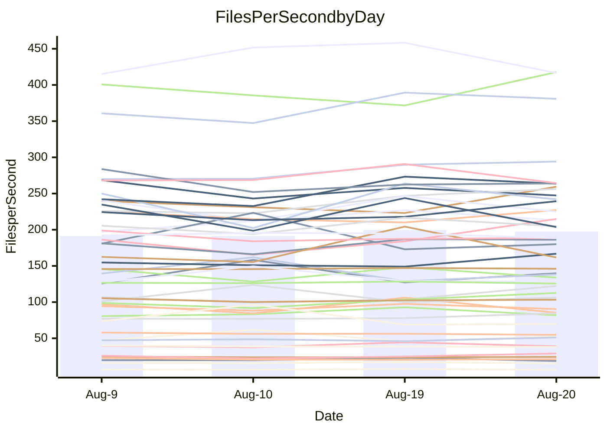

<!---
# This file is auto-generated. Do not edit.
# cspell:disable
--->
# Performance Report

Daily Performance

```mermaid
xychart-beta
    title Files Per Second by Day
    y-axis Files per Second
    x-axis Date [Aug-9, Aug-10, Aug-19, Aug-20]
    bar [191.27, 191.48, 199.45, 197.51]
    line [19.76, 19.87, 23.15, 18.70]
    line [94.45, 88.13, 97.66, 90.46]
    line [106.66, 99.38, 103.80, 122.25]
    line [80.61, 83.15, 92.81, 81.84]
    line [239.79, 231.09, 223.10, 259.35]
    line [269.81, 270.47, 289.77, 294.17]
    line [39.52, 37.52, 44.46, 39.02]
    line [268.54, 243.09, 257.77, 247.35]
    line [6.78, 6.60, 7.51, 6.44]
    line [240.17, 211.99, 227.00, 213.12]
    line [125.68, 158.27, 127.25, 139.81]
    line [225.24, 214.74, 210.02, 227.16]
    line [225.91, 222.58, 246.74, 256.30]
    line [145.75, 128.32, 148.05, 133.92]
    line [24.65, 23.72, 23.68, 24.34]
    line [139.45, 161.93, 128.87, 138.24]
    line [25.95, 22.03, 24.86, 29.03]
    line [154.75, 150.93, 149.02, 166.83]
    line [15.80, 15.53, 17.25, 15.30]
    line [196.97, 211.99, 246.59, 224.98]
    line [180.75, 223.35, 172.94, 179.93]
    line [96.93, 84.41, 106.12, 85.35]
    line [77.16, 76.75, 77.91, 84.48]
    line [400.74, 385.62, 371.65, 417.68]
    line [145.79, 145.58, 147.10, 146.08]
    line [249.96, 202.34, 263.67, 241.91]
    line [186.27, 165.43, 184.07, 214.92]
    line [224.37, 213.27, 217.89, 239.33]
    line [47.00, 61.84, 45.89, 52.68]
    line [127.47, 149.55, 129.16, 128.16]
    line [181.18, 166.12, 186.93, 186.21]
    line [57.90, 56.15, 56.35, 54.76]
    line [101.07, 123.80, 99.87, 106.26]
    line [98.84, 91.76, 103.43, 112.64]
    line [162.48, 155.40, 204.32, 161.66]
    line [360.76, 347.31, 389.41, 380.85]
    line [198.91, 184.05, 187.41, 188.61]
    line [242.10, 232.62, 273.32, 263.78]
    line [73.60, 96.61, 68.89, 69.67]
    line [415.14, 451.69, 458.22, 416.58]
    line [283.77, 252.09, 262.36, 263.98]
    line [22.84, 20.59, 20.47, 21.10]
    line [205.56, 193.98, 216.67, 204.80]
    line [126.64, 126.17, 128.45, 125.63]
    line [105.46, 100.11, 102.43, 103.31]
    line [47.26, 48.66, 46.00, 51.23]
    line [268.09, 268.70, 290.78, 264.38]
    line [234.76, 198.61, 243.75, 203.70]
    line [39.98, 38.63, 38.64, 38.08]
    line [192.03, 195.48, 194.87, 188.41]
```

Time to Process Files

| Repository                                      | Elapsed | Min/Avg/Max          |    SD | SD Graph                |
| ----------------------------------------------- | ------: | :------------------: | ----: | ----------------------- |
| AdaDoom3/AdaDoom3                    |    2.38 | 2.1 /   2.6 /   2.9  |  0.28 | `    ┣━━┻●━╋━━┻━━┫    ` |
| alexiosc/megistos                    |    7.24 | 5.5 /   7.0 /   7.9  |  0.54 | `    ┣━━┻━━╋●━┻━━┫    ` |
| apollographql/apollo-server          |    2.15 | 1.8 /   2.4 /   2.8  |  0.27 | `    ┣━━●━━╋━━┻━━┫    ` |
| aspnetboilerplate/aspnetboilerplate  |    6.33 | 6.4 /   8.5 /   9.1  |  0.86 | `  ● ┣━━┻━━╋━━┻━━┫    ` |
| aws-amplify/docs                     |    9.64 | 10.8 /  13.0 /  14.0 |  0.85 | `●    ┣━┻━━╋━━┻━┫     ` |
| Azure/azure-rest-api-specs           |   10.55 | 7.2 /   9.9 /  11.2  |  0.95 | `    ┣━━┻━━╋━●┻━━┫    ` |
| bitjson/typescript-starter           |    1.02 | 0.6 /   1.0 /   1.1  |  0.12 | `     ┣━┻━━●━━┻━┫     ` |
| caddyserver/caddy                    |    3.64 | 2.8 /   3.5 /   3.9  |  0.32 | `    ┣━━┻━━╋●━┻━━┫    ` |
| canada-ca/open-source-logiciel-libre |    1.04 | 0.8 /   1.0 /   1.3  |  0.13 | `     ┣━┻━━●━━┻━┫     ` |
| chef/chef                            |    4.93 | 3.0 /   4.6 /   5.3  |  0.61 | `    ┣━━┻━━╋━●┻━━┫    ` |
| dart-lang/sdk                        |   57.65 | 34.3 /  55.3 /  64.6 |  7.66 | `  ┣━━━┻━━━╋●━━┻━━━┫  ` |
| django/django                        |   10.41 | 10.2 /  12.8 /  14.6 |  1.56 | `   ┣━●━┻━━╋━━┻━━━┫   ` |
| eslint/eslint                        |    9.61 | 7.6 /   9.5 /  10.3  |  0.87 | `    ┣━━┻━━╋●━┻━━┫    ` |
| exonum/exonum                        |    3.26 | 2.6 /   3.2 /   3.7  |  0.28 | `    ┣━━┻━━●━━┻━━┫    ` |
| flutter/samples                      |   12.51 | 8.0 /  12.1 /  13.4  |  1.43 | `    ┣━━┻━━╋●━┻━━┫    ` |
| gitbucket/gitbucket                  |    3.20 | 2.5 /   3.0 /   3.4  |  0.34 | `    ┣━━┻━━╋●━┻━━┫    ` |
| googleapis/google-cloud-cpp          |  122.40 | 96.3 / 117.4 / 127.8 | 12.42 | `  ┣━━━┻━━━╋━●━┻━━━┫  ` |
| graphql/express-graphql              |    1.06 | 0.8 /   1.1 /   1.2  |  0.08 | `     ┣━┻━●╋━━┻━┫     ` |
| graphql/graphql-js                   |    3.70 | 2.8 /   3.6 /   3.9  |  0.29 | `    ┣━━┻━━╋●━┻━━┫    ` |
| graphql/graphql-relay-js             |    0.75 | 0.9 /   1.1 /   1.3  |  0.07 | `●     ┣━┻━╋━┻━┫      ` |
| graphql/graphql-spec                 |    1.27 | 0.8 /   1.2 /   1.3  |  0.16 | `     ┣━┻━━╋●━┻━┫     ` |
| iluwatar/java-design-patterns        |   11.87 | 8.8 /  11.8 /  12.8  |  1.25 | `    ┣━━┻━━●━━┻━━┫    ` |
| ktaranov/sqlserver-kit               |    5.64 | 3.3 /   5.3 /   6.2  |  0.95 | `    ┣━━┻━━╋●━┻━━┫    ` |
| liriliri/licia                       |    3.72 | 2.9 /   3.7 /   4.1  |  0.38 | `    ┣━━┻━━●━━┻━━┫    ` |
| MartinThoma/LaTeX-examples           |    5.17 | 4.5 /   5.8 /   7.0  |  0.75 | `    ┣━━●━━╋━━┻━━┫    ` |
| mdx-js/mdx                           |    1.54 | 1.7 /   1.8 /   1.9  |  0.07 | ` ●   ┣━┻━━╋━━┻━┫     ` |
| microsoft/TypeScript-Website         |    5.08 | 5.0 /   5.3 /   5.6  |  0.21 | `    ┣━━┻●━╋━━┻━━┫    ` |
| MicrosoftDocs/PowerShell-Docs        |   24.49 | 20.9 /  24.2 /  25.8 |  1.09 | `   ┣━━━┻━━╋●━┻━━━┫   ` |
| neovim/nvim-lspconfig                |    3.75 | 3.9 /   4.7 /   5.6  |  0.58 | `    ┣●━┻━━╋━━┻━━┫    ` |
| pagekit/pagekit                      |    3.55 | 2.5 /   3.3 /   3.6  |  0.31 | `    ┣━━┻━━╋━●┻━━┫    ` |
| php/php-src                          |   24.62 | 19.2 /  23.2 /  26.1 |  2.37 | `   ┣━━━┻━━╋━●┻━━━┫   ` |
| plasticrake/tplink-smarthome-api     |    1.35 | 1.0 /   1.3 /   1.4  |  0.13 | `     ┣━┻━━╋━●┻━┫     ` |
| prettier/prettier                    |    7.47 | 5.8 /   7.3 /   8.0  |  0.76 | `    ┣━━┻━━╋●━┻━━┫    ` |
| pycontribs/jira                      |    1.43 | 1.1 /   1.4 /   1.5  |  0.08 | `     ┣━┻━━╋●━┻━┫     ` |
| RustPython/RustPython                |    5.79 | 6.6 /   8.9 /  11.1  |  1.15 | ` ●  ┣━━┻━━╋━━┻━━┫    ` |
| shoelace-style/shoelace              |    2.73 | 1.8 /   2.6 /   3.0  |  0.36 | `    ┣━━┻━━╋●━┻━━┫    ` |
| slint-ui/slint                       |   12.27 | 11.6 /  15.2 /  16.1 |  1.10 | ` ●  ┣━━┻━━╋━━┻━━┫    ` |
| SoftwareBrothers/admin-bro           |    2.58 | 1.6 /   2.3 /   2.5  |  0.22 | `     ┣━┻━━╋━━┻●┫     ` |
| sveltejs/svelte                      |   22.38 | 16.9 /  21.1 /  23.0 |  2.16 | `   ┣━━━┻━━╋━●┻━━━┫   ` |
| TheAlgorithms/Python                 |    5.46 | 3.0 /   5.3 /   5.9  |  0.68 | `    ┣━━┻━━╋●━┻━━┫    ` |
| twbs/bootstrap                       |    1.63 | 1.2 /   1.6 /   1.9  |  0.19 | `     ┣━┻━━●━━┻━┫     ` |
| typescript-cheatsheets/react         |    1.12 | 0.7 /   1.1 /   1.3  |  0.12 | `     ┣━┻━━●━━┻━┫     ` |
| typescript-eslint/typescript-eslint  |    4.73 | 3.9 /   4.2 /   4.7  |  0.24 | `    ┣━━┻━━╋━━┻━━┫●   ` |
| vitest-dev/vitest                    |   10.14 | 8.2 /  10.2 /  10.8  |  0.77 | `    ┣━━┻━━●━━┻━━┫    ` |
| w3c/aria-practices                   |    3.25 | 3.1 /   3.3 /   3.5  |  0.11 | `     ┣━┻━●╋━━┻━┫     ` |
| w3c/specberus                        |    1.89 | 1.5 /   1.8 /   2.2  |  0.17 | `     ┣━┻━━╋●━┻━┫     ` |
| webdeveric/webpack-assets-manifest   |    1.20 | 0.9 /   1.2 /   1.3  |  0.09 | `     ┣━┻━━╋●━┻━┫     ` |
| webpack/webpack                      |    6.92 | 3.7 /   5.9 /   7.0  |  1.07 | `    ┣━━┻━━╋━━●━━┫    ` |
| wireapp/wire-desktop                 |    1.30 | 1.1 /   1.3 /   1.5  |  0.12 | `     ┣━┻━━●━━┻━┫     ` |
| wireapp/wire-webapp                  |   13.09 | 12.5 /  13.0 /  14.2 |  0.45 | `    ┣━━┻━━╋●━┻━━┫    ` |

Note:
- Elapsed time is in seconds.

Files per Second over Time

| Repository                                      | Files |    Sec |    Fps |     Rel | Trend Fps        |    N |
| ----------------------------------------------- | ----: | -----: | -----: | ------: | ---------------- | ---: |
| AdaDoom3/AdaDoom3                    |   103 |   2.38 |  43.26 |   7.87% | `▇▃▃▇▂▂▃▃▃█▇▃▃▆` |   13 |
| alexiosc/megistos                    |   583 |   7.24 |  80.57 |  -3.97% | `▃▄▃▃▃▂▄▄▄█▄▃▄▃` |   13 |
| apollographql/apollo-server          |   256 |   2.15 | 118.82 |   9.91% | `▂▂▃▂▃▆▅▂▃▃▃█▃▅` |   13 |
| aspnetboilerplate/aspnetboilerplate  |  2288 |   6.33 | 361.44 |  32.38% | `▂▂▂▃▃▂▇▃█▂▂▃▂█` |   13 |
| aws-amplify/docs                     |  3030 |   9.64 | 314.40 |  34.33% | `▂▂▃▂▃▆▅▃▃▂▃▃▃█` |   13 |
| Azure/azure-rest-api-specs           |  2561 |  10.55 | 242.65 |  -7.10% | `█▃▅▃▃▂▃▂▃▃▃▂▃▂` |   13 |
| bitjson/typescript-starter           |    20 |   1.02 |  19.60 |  -3.51% | `▄▃▃▃▂▂▂▃█▂▃▂▁▂` |   13 |
| caddyserver/caddy                    |   333 |   3.64 |  91.55 |  -2.61% | `▄▄▃▂█▅▂▃▃▇▄▄▂▄` |   13 |
| canada-ca/open-source-logiciel-libre |     7 |   1.04 |   6.74 |  -1.69% | `▄▃▄▃▇▁▄▃█▄▃▂▄▄` |   13 |
| chef/chef                            |  1034 |   4.93 | 209.61 |  -9.29% | `▃▁▆▂▂▂█▂▂▂▄▂▂▂` |   13 |
| dart-lang/sdk                        | 11618 |  57.65 | 201.51 |  -6.57% | `▂▂▂▁▂▂▂▃▂█▂▅▂▂` |   13 |
| django/django                        |  2931 |  10.41 | 281.45 |  20.69% | `▂▃▂▂▆▃█▃▇▃▅█▂█` |   13 |
| eslint/eslint                        |  2082 |   9.61 | 216.76 |  -2.37% | `▃▇█▂▃▂▃▃▃▃▂▆▃▃` |   13 |
| exonum/exonum                        |   421 |   3.26 | 129.24 |  -1.75% | `▂▃▃▅▄▃▄█▃▄▄▄█▄` |   13 |
| flutter/samples                      |  1703 |  12.51 | 136.10 |  -4.79% | `▃▁▂▂█▂▂▂▂▄▄▂▂▂` |   13 |
| gitbucket/gitbucket                  |   418 |   3.20 | 130.53 |  -6.19% | `▃█▃▂▃▇▃▇▂▂▄▇▂▃` |   13 |
| googleapis/google-cloud-cpp          | 21238 | 122.40 | 173.51 |  -5.24% | `█▇▂▂▃▃▃▂█▃▃▇▃▃` |   13 |
| graphql/express-graphql              |    26 |   1.06 |  24.51 |   0.90% | `▄█▂▄▃▃▄▃▄▃▃▄▄▄` |   13 |
| graphql/graphql-js                   |   551 |   3.70 | 148.95 |  -4.75% | `▄▃▃▂▃▇▃▃▃▃▃█▃▃` |   13 |
| graphql/graphql-relay-js             |    28 |   0.75 |  37.51 |  48.75% | `▃▃▃▃▃▅▂▁▃▃▃▃▃█` |   13 |
| graphql/graphql-spec                 |    19 |   1.27 |  14.94 |  -7.01% | `▂▂▂█▂▂▂▃▇▂▃▃▃▂` |   13 |
| iluwatar/java-design-patterns        |  2183 |  11.87 | 183.91 |   1.17% | `▃▃▂▃▂▄█▇▂▃▃▃▃▄` |   13 |
| ktaranov/sqlserver-kit               |   490 |   5.64 |  86.89 |  -9.67% | `▂▁▂█▁▅▂▂▂█▂▂▂▂` |   13 |
| liriliri/licia                       |  1442 |   3.72 | 387.77 |  -2.51% | `▃▂▃▂█▇▄▃▃▃▃▃█▄` |   13 |
| MartinThoma/LaTeX-examples           |  1409 |   5.17 | 272.59 |  10.87% | `▂▄█▄▇▃▃▂▃▇▅▃▃▆` |   13 |
| mdx-js/mdx                           |   139 |   1.54 |  90.39 |  15.92% | `▆▄▃▅▃▅▃▄▅▅▃▅▆█` |   13 |
| microsoft/TypeScript-Website         |   765 |   5.08 | 150.48 |   3.22% | `▆█▇▅▄▆▇▆█▅██▄▇` |   13 |
| MicrosoftDocs/PowerShell-Docs        |  3126 |  24.49 | 127.66 |  -1.57% | `▄▄▄▃▄▄▅█▄▄▅▄▄▄` |   13 |
| neovim/nvim-lspconfig                |   869 |   3.75 | 231.95 |  23.87% | `▂▂▅█▆▃▅▃▃▆▄▆▆█` |   13 |
| pagekit/pagekit                      |   741 |   3.55 | 208.58 |  -7.99% | `▃▃▂▃▂▆▂▂▃▃▃█▂▂` |   13 |
| php/php-src                          |  2389 |  24.62 |  97.03 |  -6.74% | `▃▄▃▃▃█▄█▃▆▂▃█▃` |   13 |
| plasticrake/tplink-smarthome-api     |    62 |   1.35 |  46.06 |  -6.52% | `▃▃▄▃▃▂▄█▂▃▃█▄▃` |   13 |
| prettier/prettier                    |  2685 |   7.47 | 359.66 |  -3.07% | `▃▂▃█▃▂▃▃▃█▃▇▃▃` |   13 |
| pycontribs/jira                      |    80 |   1.43 |  55.84 |  -1.77% | `█▄▃▃▃▃▄▃▃▄▃▂▃▃` |   13 |
| RustPython/RustPython                |   874 |   5.79 | 150.86 |  53.10% | `▁▂▂▃▃▆▅▃▃▃▅▃▃█` |   13 |
| shoelace-style/shoelace              |   440 |   2.73 | 161.20 |  -6.00% | `▂▁▂▂▅▂▂▂▂█▆▂▂▂` |   13 |
| slint-ui/slint                       |  3815 |  12.27 | 310.86 |  25.20% | `▃▃▂▂▃▃▂▂▃█▃▂▃▇` |   13 |
| SoftwareBrothers/admin-bro           |   441 |   2.58 | 170.91 | -12.30% | `█▂▂▃▂▃▂▂▃▂▂▅▂▁` |   13 |
| sveltejs/svelte                      |  8954 |  22.38 | 400.08 |  -6.82% | `▂▂▂▂▃▃█▅█▅▂▅▂▃` |   13 |
| TheAlgorithms/Python                 |  1411 |   5.46 | 258.47 |  -5.59% | `▂▁▁▂▂█▂▂▂▂▂▂▂▂` |   13 |
| twbs/bootstrap                       |   118 |   1.63 |  72.46 |  -1.37% | `▃▄▂▆▃▂▆█▃▃▃▃▃▄` |   13 |
| typescript-cheatsheets/react         |    24 |   1.12 |  21.50 |  -1.48% | `▂▃█▁▃▂▃▂▂▂▂▃▂▃` |   13 |
| typescript-eslint/typescript-eslint  |   866 |   4.73 | 183.03 | -12.34% | `▃█▄▅▆▇▇▄█▇▇▇▇▃` |   13 |
| vitest-dev/vitest                    |  2769 |  10.14 | 273.02 |   0.32% | `▂▃▃▃▂▂▇▃▃█▃▃▂▄` |   13 |
| w3c/aria-practices                   |   417 |   3.25 | 128.26 |   1.26% | `█▇▄▆▄▇▇▆▇▆▆▅▆▇` |   13 |
| w3c/specberus                        |   190 |   1.89 | 100.60 |  -3.48% | `█▅▄▄▄▃▅▄▄▅▄▂▇▄` |   13 |
| webdeveric/webpack-assets-manifest   |    55 |   1.20 |  45.74 |  -4.92% | `▃▅▃▃▂▃▅▄▃▃▃▃█▃` |   13 |
| webpack/webpack                      |  1319 |   6.92 | 190.58 | -17.24% | `▄▂▄▁▂█▂▂▁█▂▂▃▁` |   13 |
| wireapp/wire-desktop                 |    51 |   1.30 |  39.26 |   0.19% | `▃▂█▄▄▃█▄▄▄▄▃▄▄` |   13 |
| wireapp/wire-webapp                  |  2526 |  13.09 | 192.94 |   0.47% | `▇▆▆▆▅██▇█▆▇▇▄▇` |   13 |

Data Throughput

| Repository                                      | Files |    Sec |     Kps |     Rel | Trend Kps        |    N |
| ----------------------------------------------- | ----: | -----: | ------: | ------: | ---------------- | ---: |
| AdaDoom3/AdaDoom3                    |   103 |   2.38 |  919.44 |   7.87% | `▇▃▃▇▂▂▃▃▃█▇▃▃▆` |   13 |
| alexiosc/megistos                    |   583 |   7.24 |  633.13 |  -3.97% | `▃▄▃▃▃▂▄▄▄█▄▃▄▃` |   13 |
| apollographql/apollo-server          |   256 |   2.15 |  978.37 |   9.91% | `▂▂▃▂▃▆▅▂▃▃▃█▃▅` |   13 |
| aspnetboilerplate/aspnetboilerplate  |  2288 |   6.33 |  883.86 |  32.38% | `▂▂▂▃▃▂▇▃█▂▂▃▂█` |   13 |
| aws-amplify/docs                     |  3030 |   9.64 | 1229.08 |  34.50% | `▂▂▃▂▃▆▅▃▃▂▃▃▃█` |   13 |
| Azure/azure-rest-api-specs           |  2561 |  10.55 |  743.41 |  -6.52% | `█▃▅▃▃▂▃▂▃▃▃▃▃▂` |   13 |
| bitjson/typescript-starter           |    20 |   1.02 |   78.41 |  -3.51% | `▄▃▃▃▂▂▂▃█▂▃▂▁▂` |   13 |
| caddyserver/caddy                    |   333 |   3.64 |  834.13 |  -2.75% | `▄▄▃▂█▅▂▃▃▇▄▄▂▃` |   13 |
| canada-ca/open-source-logiciel-libre |     7 |   1.04 |   55.88 |  -1.69% | `▄▃▄▃▇▁▄▃█▄▃▂▄▄` |   13 |
| chef/chef                            |  1034 |   4.93 | 1029.20 |  -9.29% | `▃▁▆▂▂▂█▂▂▂▄▂▂▂` |   13 |
| dart-lang/sdk                        | 11618 |  57.65 | 1399.55 |  -6.21% | `▂▂▂▁▂▂▂▃▂█▂▅▂▂` |   13 |
| django/django                        |  2931 |  10.41 | 1815.28 |  20.88% | `▂▃▂▂▆▃█▃▇▃▅█▂█` |   13 |
| eslint/eslint                        |  2082 |   9.61 | 1521.66 |  -2.37% | `▃▇█▂▃▂▃▃▃▃▂▆▃▃` |   13 |
| exonum/exonum                        |   421 |   3.26 | 1236.17 |  -1.75% | `▂▃▃▅▄▃▄█▃▄▄▄█▄` |   13 |
| flutter/samples                      |  1703 |  12.51 |  811.25 |  -5.02% | `▃▁▂▂█▂▂▂▂▄▄▂▂▂` |   13 |
| gitbucket/gitbucket                  |   418 |   3.20 |  645.77 |  -5.62% | `▃█▃▂▂▇▃▇▂▂▄▇▂▃` |   13 |
| googleapis/google-cloud-cpp          | 21238 | 122.40 | 1507.42 |  -5.18% | `█▇▂▂▃▃▃▂█▃▃▇▃▃` |   13 |
| graphql/express-graphql              |    26 |   1.06 |  112.19 |   0.90% | `▄█▂▄▃▃▄▃▄▃▃▄▄▄` |   13 |
| graphql/graphql-js                   |   551 |   3.70 | 1110.76 |  -4.75% | `▄▃▃▂▃▇▃▃▃▃▃█▃▃` |   13 |
| graphql/graphql-relay-js             |    28 |   0.75 |  147.37 |  48.75% | `▃▃▃▃▃▅▂▁▃▃▃▃▃█` |   13 |
| graphql/graphql-spec                 |    19 |   1.27 |  499.98 |  -7.01% | `▂▂▂█▂▂▂▃▇▂▃▃▃▂` |   13 |
| iluwatar/java-design-patterns        |  2183 |  11.87 |  568.16 |   1.32% | `▃▃▂▃▂▄█▇▃▃▃▃▃▄` |   13 |
| ktaranov/sqlserver-kit               |   490 |   5.64 | 1316.29 |  -9.67% | `▂▁▂█▁▅▂▂▂█▂▂▂▂` |   13 |
| liriliri/licia                       |  1442 |   3.72 |  464.95 |  -2.23% | `▃▂▃▂█▇▄▃▃▃▃▃█▄` |   13 |
| MartinThoma/LaTeX-examples           |  1409 |   5.17 |  562.98 |  10.87% | `▂▄█▄▇▃▃▂▃▇▅▃▃▆` |   13 |
| mdx-js/mdx                           |   139 |   1.54 |  425.92 |  15.92% | `▆▄▃▅▃▅▃▄▅▅▃▅▆█` |   13 |
| microsoft/TypeScript-Website         |   765 |   5.08 | 1037.60 |   3.23% | `▆█▇▅▄▆▇▆█▅██▄▇` |   13 |
| MicrosoftDocs/PowerShell-Docs        |  3126 |  24.49 | 1363.46 |  -1.52% | `▄▄▄▃▄▄▅█▄▄▅▄▄▄` |   13 |
| neovim/nvim-lspconfig                |   869 |   3.75 |  680.37 |  23.72% | `▂▂▅█▆▃▅▃▃▆▄▆▆█` |   13 |
| pagekit/pagekit                      |   741 |   3.55 |  434.89 |  -7.99% | `▃▃▂▃▂▆▂▂▃▃▃█▂▂` |   13 |
| php/php-src                          |  2389 |  24.62 | 1716.73 |  -6.71% | `▃▄▃▃▃█▄█▃▆▂▃█▃` |   13 |
| plasticrake/tplink-smarthome-api     |    62 |   1.35 |  248.86 |  -6.52% | `▃▃▄▃▃▂▄█▂▃▃█▄▃` |   13 |
| prettier/prettier                    |  2685 |   7.47 |  508.35 |  -3.39% | `▃▂▃█▃▂▃▃▃█▃▇▃▃` |   13 |
| pycontribs/jira                      |    80 |   1.43 |  394.34 |  -1.77% | `█▄▃▃▃▃▄▃▃▄▃▂▃▃` |   13 |
| RustPython/RustPython                |   874 |   5.79 | 3321.94 |  53.42% | `▁▂▂▃▃▆▅▃▃▃▅▃▃█` |   13 |
| shoelace-style/shoelace              |   440 |   2.73 |  778.54 |  -6.00% | `▂▁▂▂▅▂▂▂▂█▆▂▂▂` |   13 |
| slint-ui/slint                       |  3815 |  12.27 | 1672.55 |  25.46% | `▃▃▂▂▃▃▂▂▃█▃▂▃▇` |   13 |
| SoftwareBrothers/admin-bro           |   441 |   2.58 |  376.70 | -12.30% | `█▂▂▃▂▃▂▂▃▂▂▅▂▁` |   13 |
| sveltejs/svelte                      |  8954 |  22.38 |  274.75 |  -6.76% | `▂▂▂▂▃▃█▅█▅▂▅▂▃` |   13 |
| TheAlgorithms/Python                 |  1411 |   5.46 |  661.11 |  -5.59% | `▂▁▁▂▂█▂▂▂▂▂▂▂▂` |   13 |
| twbs/bootstrap                       |   118 |   1.63 |  594.39 |  -1.37% | `▃▄▂▆▃▂▆█▃▃▃▃▃▄` |   13 |
| typescript-cheatsheets/react         |    24 |   1.12 |  194.39 |  -1.48% | `▂▃█▁▃▂▃▂▂▂▂▃▂▃` |   13 |
| typescript-eslint/typescript-eslint  |   866 |   4.73 |  615.04 | -12.38% | `▃█▄▅▆▇▇▄█▇▇▇▇▃` |   13 |
| vitest-dev/vitest                    |  2769 |  10.14 |  789.08 |   1.84% | `▂▃▃▃▂▂▆▃▃█▄▃▃▄` |   13 |
| w3c/aria-practices                   |   417 |   3.25 | 1206.28 |   1.26% | `█▇▄▆▄▇▇▆▇▆▆▅▆▇` |   13 |
| w3c/specberus                        |   190 |   1.89 |  328.81 |  -3.38% | `█▅▄▄▄▃▅▄▄▅▄▂▇▄` |   13 |
| webdeveric/webpack-assets-manifest   |    55 |   1.20 |  105.63 |  -4.92% | `▃▅▃▃▂▃▅▄▃▃▃▃█▃` |   13 |
| webpack/webpack                      |  1319 |   6.92 | 1301.54 | -11.21% | `▃▁▃▁▁▇▂▁▂█▂▂▃▂` |   13 |
| wireapp/wire-desktop                 |    51 |   1.30 |  167.05 |   0.19% | `▃▂█▄▄▃█▄▄▄▄▃▄▄` |   13 |
| wireapp/wire-webapp                  |  2526 |  13.09 |  814.39 |   0.78% | `▇▆▆▆▅█▇▇█▆▇▇▄▇` |   13 |

