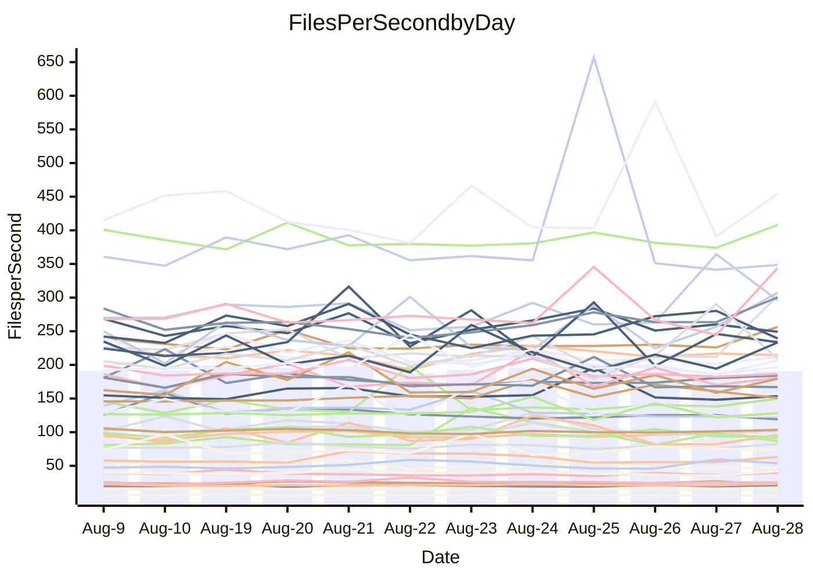

<!---
# This file is auto-generated. Do not edit.
# cspell:disable
--->
# Performance Report

Daily Performance

```mermaid
xychart-beta
    title Files Per Second by Day
    y-axis Files per Second
    x-axis Date [Aug-9, Aug-10, Aug-19, Aug-20, Aug-21, Aug-22, Aug-23, Aug-24, Aug-25, Aug-26, Aug-27, Aug-28]
    bar [191.27, 191.48, 199.45, 195.67, 198.22, 187.40, 192.61, 195.61, 200.69, 190.24, 185.15, 190.50]
    line [19.76, 19.87, 23.15, 18.80, 21.30, 21.70, 20.11, 19.24, 18.97, 21.74, 19.44, 21.30]
    line [94.45, 88.13, 97.66, 100.71, 101.93, 92.80, 92.11, 97.07, 92.83, 96.14, 97.78, 91.24]
    line [106.66, 99.38, 103.80, 117.71, 112.47, 100.50, 103.30, 128.71, 104.89, 98.28, 96.78, 102.17]
    line [80.61, 83.15, 92.81, 82.44, 81.86, 80.75, 136.22, 114.72, 99.92, 81.00, 98.60, 86.76]
    line [239.79, 231.09, 223.10, 252.00, 224.60, 224.17, 230.06, 227.93, 228.22, 229.99, 225.97, 256.46]
    line [269.81, 270.47, 289.77, 286.14, 291.59, 251.52, 256.69, 292.19, 260.02, 262.94, 364.38, 295.92]
    line [39.52, 37.52, 44.46, 38.46, 37.42, 35.96, 35.65, 37.61, 34.82, 39.47, 36.12, 39.71]
    line [268.54, 243.09, 257.77, 247.18, 276.72, 232.23, 252.08, 266.01, 283.94, 251.01, 260.27, 249.20]
    line [6.78, 6.60, 7.51, 6.38, 6.72, 6.55, 6.77, 6.55, 6.58, 6.64, 6.06, 6.58]
    line [240.17, 211.99, 227.00, 211.38, 205.51, 203.10, 206.43, 223.33, 206.89, 208.72, 201.20, 211.92]
    line [125.68, 158.27, 127.25, 135.61, 133.76, 126.70, 123.28, 120.42, 121.90, 125.42, 125.26, 119.07]
    line [225.24, 214.74, 210.02, 221.88, 213.58, 192.56, 216.27, 228.68, 220.47, 211.98, 216.89, 214.66]
    line [225.91, 222.58, 246.74, 252.74, 209.47, 217.12, 212.13, 242.98, 195.81, 213.43, 211.78, 302.76]
    line [145.75, 128.32, 148.05, 133.76, 130.09, 198.58, 132.66, 136.89, 133.84, 140.74, 138.14, 149.64]
    line [24.65, 23.72, 23.68, 26.94, 25.51, 24.79, 23.76, 23.53, 22.75, 24.32, 26.78, 22.73]
    line [139.45, 161.93, 128.87, 135.71, 136.66, 133.36, 161.38, 128.87, 127.62, 123.35, 123.11, 122.97]
    line [25.95, 22.03, 24.86, 28.29, 26.21, 32.71, 26.20, 26.09, 26.00, 24.43, 25.37, 25.30]
    line [154.75, 150.93, 149.02, 164.86, 165.64, 153.35, 152.64, 155.02, 195.52, 151.70, 148.17, 153.51]
    line [15.80, 15.53, 17.25, 15.28, 15.49, 14.84, 15.46, 14.39, 15.01, 15.63, 14.69, 15.59]
    line [196.97, 211.99, 246.59, 218.10, 236.31, 204.94, 201.38, 212.81, 200.01, 195.34, 186.50, 196.65]
    line [180.75, 223.35, 172.94, 187.16, 177.68, 172.01, 170.49, 175.09, 173.22, 173.59, 180.48, 184.11]
    line [96.93, 84.41, 106.12, 84.61, 114.12, 87.31, 89.99, 124.55, 110.24, 81.92, 82.24, 96.03]
    line [77.16, 76.75, 77.91, 84.91, 78.76, 75.34, 81.46, 80.77, 74.97, 79.78, 75.90, 82.49]
    line [400.74, 385.62, 371.65, 411.46, 377.61, 379.88, 377.18, 380.64, 396.91, 381.52, 374.08, 408.05]
    line [145.79, 145.58, 147.10, 147.08, 151.07, 153.94, 150.27, 178.09, 152.08, 170.66, 160.71, 150.87]
    line [249.96, 202.34, 263.67, 236.99, 228.06, 301.20, 226.40, 222.40, 289.06, 224.56, 256.87, 307.43]
    line [186.27, 165.43, 184.07, 202.12, 167.51, 173.85, 169.85, 221.75, 167.75, 195.90, 170.00, 181.07]
    line [224.37, 213.27, 217.89, 233.79, 316.48, 227.32, 281.23, 212.31, 293.11, 198.49, 245.94, 233.69]
    line [47.00, 61.84, 45.89, 57.63, 58.67, 44.77, 49.92, 49.06, 57.90, 45.60, 46.71, 47.88]
    line [127.47, 149.55, 129.16, 129.10, 170.99, 119.13, 167.47, 175.06, 125.57, 143.51, 123.67, 124.64]
    line [181.18, 166.12, 186.93, 181.85, 181.88, 168.34, 171.35, 169.12, 211.70, 166.64, 168.34, 166.99]
    line [57.90, 56.15, 56.35, 54.76, 71.89, 68.47, 68.09, 64.39, 54.76, 55.64, 55.71, 63.34]
    line [101.07, 123.80, 99.87, 108.06, 107.98, 95.34, 94.96, 114.12, 97.84, 103.09, 93.25, 93.04]
    line [98.84, 91.76, 103.43, 107.49, 93.08, 97.11, 107.90, 94.53, 94.47, 104.38, 94.67, 92.66]
    line [162.48, 155.40, 204.32, 177.59, 218.64, 159.00, 159.79, 194.26, 164.45, 184.75, 158.60, 179.41]
    line [360.76, 347.31, 389.41, 371.89, 392.82, 355.53, 361.83, 355.43, 657.12, 351.25, 341.51, 348.71]
    line [198.91, 184.05, 187.41, 186.67, 207.48, 180.49, 185.92, 209.38, 182.67, 186.49, 182.43, 186.64]
    line [242.10, 232.62, 273.32, 257.69, 290.62, 245.10, 224.83, 243.49, 245.36, 272.30, 280.33, 239.27]
    line [73.60, 96.61, 68.89, 69.48, 73.38, 68.77, 97.84, 66.15, 69.59, 78.77, 75.57, 73.42]
    line [415.14, 451.69, 458.22, 412.53, 400.53, 380.98, 466.37, 404.40, 403.18, 591.49, 390.96, 454.33]
    line [283.77, 252.09, 262.36, 263.68, 253.37, 240.18, 248.22, 259.20, 278.18, 263.50, 263.68, 300.36]
    line [22.84, 20.59, 20.47, 21.22, 20.90, 21.42, 21.40, 22.88, 21.36, 21.22, 21.19, 23.48]
    line [205.56, 193.98, 216.67, 206.61, 230.20, 198.53, 213.69, 212.64, 179.07, 214.07, 290.22, 209.19]
    line [126.64, 126.17, 128.45, 125.27, 127.94, 127.77, 130.20, 152.67, 118.34, 143.02, 122.15, 128.36]
    line [105.46, 100.11, 102.43, 104.89, 103.21, 98.21, 97.36, 101.78, 100.00, 99.58, 101.28, 103.38]
    line [47.26, 48.66, 46.00, 48.26, 51.42, 58.83, 56.30, 50.38, 45.97, 45.91, 59.43, 53.83]
    line [268.09, 268.70, 290.78, 262.94, 266.60, 272.93, 267.45, 262.37, 345.57, 266.69, 244.68, 344.12]
    line [234.76, 198.61, 243.75, 200.90, 213.71, 188.91, 259.37, 218.53, 190.79, 215.33, 194.36, 233.28]
    line [39.98, 38.63, 38.64, 39.11, 45.24, 39.50, 39.66, 42.07, 38.23, 36.94, 35.58, 42.11]
    line [192.03, 195.48, 194.87, 202.54, 193.62, 244.63, 196.70, 223.56, 194.58, 199.46, 185.25, 206.78]
```

Time to Process Files

| Repository                                      | Elapsed | Min/Avg/Max          |    SD | SD Graph                |
| ----------------------------------------------- | ------: | :------------------: | ----: | ----------------------- |
| AdaDoom3/AdaDoom3                    |    2.36 | 2.1 /   2.7 /   3.0  |  0.23 | `    ┣━●┻━━╋━━┻━━┫    ` |
| alexiosc/megistos                    |    6.55 | 4.1 /   6.7 /   7.9  |  0.89 | `    ┣━━┻━●╋━━┻━━┫    ` |
| apollographql/apollo-server          |    2.55 | 1.8 /   2.4 /   2.8  |  0.25 | `    ┣━━┻━━╋━●┻━━┫    ` |
| aspnetboilerplate/aspnetboilerplate  |    8.91 | 4.9 /   8.2 /   9.1  |  1.13 | `    ┣━━┻━━╋━●┻━━┫    ` |
| aws-amplify/docs                     |   13.82 | 9.6 /  12.9 /  14.0  |  1.04 | `    ┣━━┻━━╋━━●━━┫    ` |
| Azure/azure-rest-api-specs           |   10.51 | 7.2 /   9.9 /  11.2  |  0.86 | `    ┣━━┻━━╋━●┻━━┫    ` |
| bitjson/typescript-starter           |    0.83 | 0.6 /   1.0 /   1.1  |  0.10 | `     ●━┻━━╋━━┻━┫     ` |
| caddyserver/caddy                    |    3.57 | 2.5 /   3.5 /   3.9  |  0.34 | `    ┣━━┻━━╋●━┻━━┫    ` |
| canada-ca/open-source-logiciel-libre |    1.07 | 0.8 /   1.1 /   1.3  |  0.10 | `     ┣━┻━━●━━┻━┫     ` |
| chef/chef                            |    4.87 | 3.0 /   4.8 /   5.4  |  0.50 | `    ┣━━┻━━●━━┻━━┫    ` |
| dart-lang/sdk                        |   58.59 | 34.3 /  56.2 /  64.6 |  6.74 | `  ┣━━━┻━━━╋●━━┻━━━┫  ` |
| django/django                        |   13.66 | 7.5 /  12.9 /  15.0  |  1.82 | `   ┣━━━┻━━╋●━┻━━━┫   ` |
| eslint/eslint                        |    9.62 | 7.6 /   9.6 /  10.8  |  0.68 | `    ┣━━┻━━●━━┻━━┫    ` |
| exonum/exonum                        |    3.54 | 2.6 /   3.3 /   3.7  |  0.24 | `    ┣━━┻━━╋━━●━━┫    ` |
| flutter/samples                      |   13.91 | 8.0 /  12.1 /  14.0  |  1.38 | `    ┣━━┻━━╋━━┻●━┫    ` |
| gitbucket/gitbucket                  |    3.25 | 2.5 /   3.1 /   3.6  |  0.31 | `    ┣━━┻━━╋●━┻━━┫    ` |
| googleapis/google-cloud-cpp          |  130.32 | 96.3 / 121.5 / 133.3 | 11.62 | `  ┣━━━┻━━━╋━━●┻━━━┫  ` |
| graphql/express-graphql              |    1.16 | 0.7 /   1.1 /   1.2  |  0.10 | `     ┣━┻━━╋━━●━┫     ` |
| graphql/graphql-js                   |    3.63 | 2.8 /   3.5 /   3.9  |  0.27 | `    ┣━━┻━━╋●━┻━━┫    ` |
| graphql/graphql-relay-js             |    1.13 | 0.7 /   1.1 /   1.3  |  0.10 | `     ┣━┻━━╋●━┻━┫     ` |
| graphql/graphql-spec                 |    1.27 | 0.8 /   1.2 /   1.4  |  0.12 | `     ┣━┻━━╋●━┻━┫     ` |
| iluwatar/java-design-patterns        |   11.28 | 8.8 /  12.1 /  12.8  |  0.96 | `    ┣━━●━━╋━━┻━━┫    ` |
| ktaranov/sqlserver-kit               |    5.94 | 3.1 /   5.2 /   6.2  |  0.94 | `    ┣━━┻━━╋━●┻━━┫    ` |
| liriliri/licia                       |    3.83 | 2.9 /   3.7 /   4.1  |  0.29 | `    ┣━━┻━━╋●━┻━━┫    ` |
| MartinThoma/LaTeX-examples           |    6.15 | 3.7 /   5.8 /   7.0  |  0.81 | `    ┣━━┻━━╋●━┻━━┫    ` |
| mdx-js/mdx                           |    1.59 | 1.5 /   1.8 /   1.9  |  0.09 | `     ●━┻━━╋━━┻━┫     ` |
| microsoft/TypeScript-Website         |    5.06 | 3.7 /   5.1 /   5.6  |  0.41 | `    ┣━━┻━━●━━┻━━┫    ` |
| MicrosoftDocs/PowerShell-Docs        |   24.48 | 13.9 /  23.2 /  26.2 |  3.17 | `   ┣━━┻━━━╋●━━┻━━┫   ` |
| neovim/nvim-lspconfig                |    4.51 | 3.7 /   4.8 /   5.6  |  0.60 | `    ┣━━┻━●╋━━┻━━┫    ` |
| pagekit/pagekit                      |    2.91 | 1.9 /   3.2 /   4.1  |  0.47 | `    ┣━━┻●━╋━━┻━━┫    ` |
| php/php-src                          |   26.47 | 18.2 /  23.4 /  26.1 |  2.48 | `   ┣━━━┻━━╋━━┻●━━┫   ` |
| plasticrake/tplink-smarthome-api     |    1.26 | 0.8 /   1.3 /   1.4  |  0.16 | `     ┣━┻━━●━━┻━┫     ` |
| prettier/prettier                    |    7.71 | 4.1 /   7.3 /   8.2  |  0.87 | `    ┣━━┻━━╋●━┻━━┫    ` |
| pycontribs/jira                      |    1.11 | 0.9 /   1.4 /   1.5  |  0.15 | `     ●━┻━━╋━━┻━┫     ` |
| RustPython/RustPython                |    9.35 | 5.8 /   8.9 /  11.1  |  1.07 | `    ┣━━┻━━╋●━┻━━┫    ` |
| shoelace-style/shoelace              |    2.77 | 1.8 /   2.5 /   3.0  |  0.38 | `    ┣━━┻━━╋━●┻━━┫    ` |
| slint-ui/slint                       |   16.52 | 11.3 /  15.0 /  17.0 |  1.58 | `   ┣━━━┻━━╋━━●━━━┫   ` |
| SoftwareBrothers/admin-bro           |    2.35 | 1.6 /   2.3 /   2.6  |  0.23 | `    ┣━━┻━━●━━┻━━┫    ` |
| sveltejs/svelte                      |   23.64 | 12.5 /  21.1 /  23.5 |  2.56 | `   ┣━━━┻━━╋━━●━━━┫   ` |
| TheAlgorithms/Python                 |    5.12 | 3.0 /   5.3 /   5.9  |  0.53 | `    ┣━━┻━●╋━━┻━━┫    ` |
| twbs/bootstrap                       |    1.75 | 1.2 /   1.6 /   1.9  |  0.19 | `     ┣━┻━━╋━●┻━┫     ` |
| typescript-cheatsheets/react         |    1.11 | 0.7 /   1.1 /   1.3  |  0.09 | `     ┣━┻━━●━━┻━┫     ` |
| typescript-eslint/typescript-eslint  |    4.13 | 2.4 /   4.1 /   4.9  |  0.44 | `    ┣━━┻━━●━━┻━━┫    ` |
| vitest-dev/vitest                    |   10.47 | 6.6 /  10.2 /  11.9  |  1.03 | `    ┣━━┻━━╋●━┻━━┫    ` |
| w3c/aria-practices                   |    3.24 | 2.3 /   3.2 /   3.6  |  0.24 | `    ┣━━┻━━●━━┻━━┫    ` |
| w3c/specberus                        |    1.82 | 1.5 /   1.9 /   2.2  |  0.12 | `     ┣━┻━●╋━━┻━┫     ` |
| webdeveric/webpack-assets-manifest   |    1.19 | 0.8 /   1.1 /   1.4  |  0.14 | `     ┣━┻━━╋●━┻━┫     ` |
| webpack/webpack                      |    5.40 | 3.7 /   6.2 /   7.4  |  0.97 | `    ┣━━●━━╋━━┻━━┫    ` |
| wireapp/wire-desktop                 |    1.07 | 1.0 /   1.3 /   1.5  |  0.12 | `     ●━┻━━╋━━┻━┫     ` |
| wireapp/wire-webapp                  |   14.07 | 10.3 /  12.7 /  14.5 |  0.99 | `    ┣━━┻━━╋━━┻●━┫    ` |

Note:
- Elapsed time is in seconds.

Files per Second over Time

| Repository                                      | Files |    Sec |    Fps |     Rel | Trend Fps              |    N |
| ----------------------------------------------- | ----: | -----: | -----: | ------: | ---------------------- | ---: |
| AdaDoom3/AdaDoom3                    |   103 |   2.36 |  43.69 |  13.02% | `█▇▃▃▆▃▃▃▃▂▂▃▃▂▄▄▃▃▂▆` |   28 |
| alexiosc/megistos                    |   583 |   6.55 |  89.04 |   0.08% | `▅▂▂▂▂▂▂▂▂▂██▃▄▂▂▃▅▂▃` |   28 |
| apollographql/apollo-server          |   256 |   2.55 | 100.32 |  -7.17% | `▃▃█▃▅▃▃▆▃▃▃▆▆▃▂▂▂▂▃▃` |   28 |
| aspnetboilerplate/aspnetboilerplate  |  2288 |   8.91 | 256.92 |  -9.97% | `▁▁▂▁▅▂▂▅▁▁▁▂▄▂▂▂█▂▄▁` |   28 |
| aws-amplify/docs                     |  3030 |  13.82 | 219.29 |  -7.03% | `▂▃▃▃█▃▂▂▃▂▃▃▂▃▃▃▂▃▇▂` |   28 |
| Azure/azure-rest-api-specs           |  2576 |  10.51 | 245.08 |  -5.88% | `▄▄▃▄▃▃▄█▄▂▄▆▃▆▃▄▅▃▄▃` |   28 |
| bitjson/typescript-starter           |    20 |   0.83 |  24.21 |  19.63% | `▃▄▃▂▄▃▄▅▇▅▄▄▃▃▃█▄▃▃█` |   28 |
| caddyserver/caddy                    |   338 |   3.57 |  94.64 |  -1.80% | `▅▃▃▂▃█▆▃▃▃▃▃▄▃▃▄▂▅▂▃` |   28 |
| canada-ca/open-source-logiciel-libre |     7 |   1.07 |   6.54 |  -2.26% | `█▅▄▇▇▅▆█▆▆▇▆▆▆▆▇▆▃▆▆` |   28 |
| chef/chef                            |  1035 |   4.87 | 212.55 |  -2.92% | `▅█▄▅▄▄▃▃▄▃▄▄▆▄▂▆▄▃▄▄` |   28 |
| dart-lang/sdk                        | 11634 |  58.59 | 198.57 |  -5.80% | `█▂▅▂▂▂▂▇▂▂▂▂▃▂▂▂▂▂▂▂` |   28 |
| django/django                        |  2932 |  13.66 | 214.60 |  -8.07% | `▂▃▄▂▄▃▂▁▂▂▂▁▄▁▂▂▂▂█▂` |   28 |
| eslint/eslint                        |  2082 |   9.62 | 216.45 |  -0.76% | `▅▄█▄▅▄▅▄▅▂▅▅▇▅▅▄▅▅▄▅` |   28 |
| exonum/exonum                        |   421 |   3.54 | 118.98 |  -7.38% | `▄▄▄█▄▃▄▃▇▄▃▂▃▃▄▃▄▃▃▃` |   28 |
| flutter/samples                      |  1703 |  13.91 | 122.47 | -14.08% | `▄▄▂▃▃▃▂▃▃█▂▃▃▃▂▄▃▂▆▂` |   28 |
| gitbucket/gitbucket                  |   418 |   3.25 | 128.70 |  -4.36% | `▃▅█▃▄▄█▃▃▄█▄▄▄▃▃▃▃▂▄` |   28 |
| googleapis/google-cloud-cpp          | 21983 | 130.32 | 168.69 |  -5.40% | `▃▃█▃▃▃▃█▃▃▃▃▃█▂▃▃▃▃▃` |   28 |
| graphql/express-graphql              |    26 |   1.16 |  22.37 |  -9.89% | `▂▂▃▃▃█▅▃▃▃▃▂▃▂▃▃▂▆▂▂` |   28 |
| graphql/graphql-js                   |   551 |   3.63 | 151.98 |  -3.37% | `▃▃█▃▃▄▄▇▄▃▃▃▄█▃▃▂▃▃▃` |   28 |
| graphql/graphql-relay-js             |    28 |   1.13 |  24.72 |  -5.53% | `▃▃▃▃█▃▃▃▃▆▃▃▃▃▂▃▃▃▃▃` |   28 |
| graphql/graphql-spec                 |    19 |   1.27 |  14.97 |  -3.97% | `▄▆▆▆▅▆▆█▅▅▆▆▃▅█▅▆▄▇▅` |   28 |
| iluwatar/java-design-patterns        |  2183 |  11.28 | 193.60 |   7.60% | `▄▃▅▄▅█▄▄▄▄▃▄▄▄▄▄▅▅▄▆` |   28 |
| ktaranov/sqlserver-kit               |   490 |   5.94 |  82.45 | -15.64% | `▇▂▁▂▂▂▃▂█▂▂▄▇▄▂▁▁▂▄▂` |   28 |
| liriliri/licia                       |  1442 |   3.83 | 376.87 |  -3.63% | `▃▃▃█▄▄▃▃▄▃▃▃▃▄▃▃▂▄▆▃` |   28 |
| MartinThoma/LaTeX-examples           |  1409 |   6.15 | 229.10 |  -8.17% | `▅▄▂▂▄▂▂▂▂▅▂▂▂▅▂▂▅▂█▂` |   28 |
| mdx-js/mdx                           |   139 |   1.59 |  87.67 |  11.15% | `▅▃▅▆█▇▅▄▅▄▅▅▅▃▆▃▅▃▄▇` |   28 |
| microsoft/TypeScript-Website         |   765 |   5.06 | 151.17 |  -0.98% | `▂▃▃▂▃▃▃▃▃▃▃▃█▃▇▃▃▅▃▃` |   28 |
| MicrosoftDocs/PowerShell-Docs        |  3126 |  24.48 | 127.71 |  -7.76% | `▂▂▂▂▂▂█▄▂▁▄▂█▂▄▂▂▁▁▂` |   28 |
| neovim/nvim-lspconfig                |   871 |   4.51 | 193.22 |   4.28% | `▆▄▆▆█▃▃▃▃▃▃▇▇▃▂█▃▃▃▅` |   28 |
| pagekit/pagekit                      |   741 |   2.91 | 254.55 |   7.18% | `▂▂▅▂▂▂▆█▃▃▅▂▂▅▂▁▄▂▂▄` |   28 |
| php/php-src                          |  2389 |  26.47 |  90.26 | -12.61% | `▅▂▃▇▃▅█▃▂▃▂▃█▃▂▆▂▂▃▂` |   28 |
| plasticrake/tplink-smarthome-api     |    62 |   1.26 |  49.30 |  -2.57% | `▂▂▅▃▂▇▂▃█▂▃▂▃▄▂▂▂▂▂▃` |   28 |
| prettier/prettier                    |  2699 |   7.71 | 350.23 |  -6.83% | `▄▂▃▂▂▂▄▂▂▂▂▂▂█▂▂▂▁▂▂` |   28 |
| pycontribs/jira                      |    80 |   1.11 |  72.14 |  21.14% | `▂▂▂▂▂▂█▂▅▄▄▂▅▂▂▂▂▂▂▅` |   27 |
| RustPython/RustPython                |   877 |   9.35 |  93.80 |  -5.57% | `▃▅▃▃█▃▂▃▃▃▄▃▃▃▃▅▃▃▃▃` |   28 |
| shoelace-style/shoelace              |   440 |   2.77 | 158.76 | -11.63% | `█▆▂▂▂▇▇▇▄▂▂▇▂▃▅▂▂▂▅▂` |   28 |
| slint-ui/slint                       |  3875 |  16.52 | 234.58 |  -8.79% | `█▃▂▃▇▃▆█▃▃▂▃▃▃▇▂▃▇▃▂` |   28 |
| SoftwareBrothers/admin-bro           |   441 |   2.35 | 187.52 |  -2.75% | `▃▃▅▂▂▂▂▃█▂▃▂▇▃▃▃▃▃▃▃` |   28 |
| sveltejs/svelte                      |  9020 |  23.64 | 381.60 | -11.95% | `▃▁▃▁▂▂▂▁▂▁▃▂▂▂█▃▁▂▄▁` |   28 |
| TheAlgorithms/Python                 |  1411 |   5.12 | 275.79 |   2.90% | `▄▄▄▄▄▄▂▃▄▂▃▄▄▅▄▄▄▄█▅` |   28 |
| twbs/bootstrap                       |   118 |   1.75 |  67.35 |  -9.04% | `▃▃▃▃▄▃▅▃▂▃█▃▂▃▆▃▆▂▅▃` |   28 |
| typescript-cheatsheets/react         |    24 |   1.11 |  21.55 |  -1.04% | `▄▂▄▃▅▅▄▄▄▄▄▇▅▄▄▅▄▄█▅` |   28 |
| typescript-eslint/typescript-eslint  |   869 |   4.13 | 210.57 |  -2.27% | `▃▃▃▃▁▂▄▃▂▂▂▂▂▁▂▃█▃▂▂` |   28 |
| vitest-dev/vitest                    |  2790 |  10.47 | 266.56 |  -3.37% | `▅▃▂▂▃▂▂▃▃▃▃▂▂▅▂▃▂▁█▃` |   28 |
| w3c/aria-practices                   |   417 |   3.24 | 128.90 |  -0.37% | `▃▃▂▂▃▂▃▃▂▃▃█▂▂▆▃▂▃▃▃` |   28 |
| w3c/specberus                        |   190 |   1.82 | 104.61 |   1.78% | `▅▅▂█▄▆▅▄▅▄▄▄▅▄▄▄▅▄▅▅` |   28 |
| webdeveric/webpack-assets-manifest   |    55 |   1.19 |  46.34 |  -7.23% | `▃▃▃▆▃▁▆▃▃▆▅▅▃▃▂▃▃█▆▃` |   28 |
| webpack/webpack                      |  1364 |   5.40 | 252.40 |  15.33% | `█▂▂▃▂▂▁▂▅▂▅▂▄▂▂▃▂▂▃▄` |   28 |
| wireapp/wire-desktop                 |    51 |   1.07 |  47.65 |  20.21% | `▃▄▃▄▄▅▄▇█▄▄▇▄▄▃▃▃▂▃▇` |   28 |
| wireapp/wire-webapp                  |  2578 |  14.07 | 183.20 |  -8.37% | `▃▄▄▂▃█▄▃▄█▄▄█▄▄▄▃▂▇▃` |   28 |

Data Throughput

| Repository                                      | Files |    Sec |     Kps |     Rel | Trend Kps              |    N |
| ----------------------------------------------- | ----: | -----: | ------: | ------: | ---------------------- | ---: |
| AdaDoom3/AdaDoom3                    |   103 |   2.36 |  928.43 |  13.02% | `█▇▃▃▆▃▃▃▃▂▂▃▃▂▄▄▃▃▂▆` |   28 |
| alexiosc/megistos                    |   583 |   6.55 |  699.64 |   0.08% | `▅▂▂▂▂▂▂▂▂▂██▃▄▂▂▃▅▂▃` |   28 |
| apollographql/apollo-server          |   256 |   2.55 |  826.11 |  -7.17% | `▃▃█▃▅▃▃▆▃▃▃▆▆▃▂▂▂▂▃▃` |   28 |
| aspnetboilerplate/aspnetboilerplate  |  2288 |   8.91 |  628.37 |  -9.95% | `▁▁▂▁▅▂▂▅▁▁▁▂▄▂▂▂█▂▄▁` |   28 |
| aws-amplify/docs                     |  3030 |  13.82 |  857.27 |  -6.98% | `▂▃▃▃█▃▂▂▃▂▃▃▂▃▃▃▂▃▇▂` |   28 |
| Azure/azure-rest-api-specs           |  2576 |  10.51 |  752.85 |  -5.43% | `▄▄▃▄▃▃▄█▄▂▄▆▃▆▄▄▅▃▄▃` |   28 |
| bitjson/typescript-starter           |    20 |   0.83 |   96.85 |  19.63% | `▃▄▃▂▄▃▄▅▇▅▄▄▃▃▃█▄▃▃█` |   28 |
| caddyserver/caddy                    |   338 |   3.57 |  859.03 |  -2.13% | `▅▃▃▂▃█▆▃▃▃▃▃▄▃▃▄▂▅▂▃` |   28 |
| canada-ca/open-source-logiciel-libre |     7 |   1.07 |   54.17 |  -2.26% | `█▅▄▇▇▅▆█▆▆▇▆▆▆▆▇▆▃▆▆` |   28 |
| chef/chef                            |  1035 |   4.87 | 1043.44 |  -2.93% | `▅█▄▅▄▄▃▃▄▃▄▄▆▄▂▆▄▃▄▄` |   28 |
| dart-lang/sdk                        | 11634 |  58.59 | 1381.08 |  -5.53% | `█▂▅▂▂▂▂▇▂▂▂▂▃▂▂▂▂▂▂▂` |   28 |
| django/django                        |  2932 |  13.66 | 1381.94 |  -8.10% | `▂▃▄▂▄▃▂▁▂▂▂▁▄▁▂▂▂▁█▂` |   28 |
| eslint/eslint                        |  2082 |   9.62 | 1519.59 |  -0.76% | `▅▄█▄▅▄▅▄▅▂▅▅▇▅▅▄▅▅▄▅` |   28 |
| exonum/exonum                        |   421 |   3.54 | 1138.05 |  -7.38% | `▄▄▄█▄▃▄▃▇▄▃▂▃▃▄▃▄▃▃▃` |   28 |
| flutter/samples                      |  1703 |  13.91 |  730.02 | -14.18% | `▄▄▂▃▃▃▂▃▃█▂▃▃▃▂▄▃▂▆▂` |   28 |
| gitbucket/gitbucket                  |   418 |   3.25 |  636.73 |  -4.08% | `▃▅█▃▄▄█▃▃▄█▄▄▄▃▃▃▃▂▄` |   28 |
| googleapis/google-cloud-cpp          | 21983 | 130.32 | 1467.58 |  -5.28% | `▃▃█▃▃▃▃█▃▃▃▃▃█▂▃▃▃▃▃` |   28 |
| graphql/express-graphql              |    26 |   1.16 |  102.40 |  -9.89% | `▂▂▃▃▃█▅▃▃▃▃▂▃▂▃▃▂▆▂▂` |   28 |
| graphql/graphql-js                   |   551 |   3.63 | 1133.33 |  -3.37% | `▃▃█▃▃▄▄▇▄▃▃▃▄█▃▃▂▃▃▃` |   28 |
| graphql/graphql-relay-js             |    28 |   1.13 |   97.12 |  -5.53% | `▃▃▃▃█▃▃▃▃▆▃▃▃▃▂▃▃▃▃▃` |   28 |
| graphql/graphql-spec                 |    19 |   1.27 |  501.00 |  -3.97% | `▄▆▆▆▅▆▆█▅▅▆▆▃▅█▅▆▄▇▅` |   28 |
| iluwatar/java-design-patterns        |  2183 |  11.28 |  598.10 |   7.68% | `▄▃▅▄▅█▄▄▄▄▃▄▄▄▄▄▅▅▄▆` |   28 |
| ktaranov/sqlserver-kit               |   490 |   5.94 | 1248.99 | -15.64% | `▇▂▁▂▂▂▃▂█▂▂▄▇▄▂▁▁▂▄▂` |   28 |
| liriliri/licia                       |  1442 |   3.83 |  451.88 |  -3.50% | `▃▃▃█▄▄▃▃▄▃▃▄▃▄▃▃▂▄▆▃` |   28 |
| MartinThoma/LaTeX-examples           |  1409 |   6.15 |  473.16 |  -8.17% | `▅▄▂▂▄▂▂▂▂▅▂▂▂▅▂▂▅▂█▂` |   28 |
| mdx-js/mdx                           |   139 |   1.59 |  413.14 |  11.15% | `▅▃▅▆█▇▅▄▅▄▅▅▅▃▆▃▅▃▄▇` |   28 |
| microsoft/TypeScript-Website         |   765 |   5.06 | 1042.36 |  -0.98% | `▂▃▃▂▃▃▃▃▃▃▃▃█▃▇▃▃▅▃▃` |   28 |
| MicrosoftDocs/PowerShell-Docs        |  3126 |  24.48 | 1364.58 |  -7.71% | `▂▂▂▂▂▂█▄▂▁▄▂█▂▄▂▂▁▁▂` |   28 |
| neovim/nvim-lspconfig                |   871 |   4.51 |  567.47 |   4.31% | `▆▄▆▆█▃▃▃▃▃▃▇▇▃▂█▃▃▃▅` |   28 |
| pagekit/pagekit                      |   741 |   2.91 |  530.73 |   7.18% | `▂▂▅▂▂▂▆█▃▃▅▂▂▅▂▁▄▂▂▄` |   28 |
| php/php-src                          |  2389 |  26.47 | 1597.93 | -12.56% | `▅▂▃▇▃▅█▃▂▃▂▃█▃▂▆▂▂▃▂` |   28 |
| plasticrake/tplink-smarthome-api     |    62 |   1.26 |  266.39 |  -2.57% | `▂▂▅▃▂▇▂▃█▂▃▂▃▄▂▂▂▂▂▃` |   28 |
| prettier/prettier                    |  2699 |   7.71 |  493.62 |  -7.15% | `▄▂▄▂▂▂▄▂▂▂▂▂▂█▂▂▂▁▂▂` |   28 |
| pycontribs/jira                      |    80 |   1.11 |  509.47 |  21.14% | `▂▂▂▂▂▂█▂▅▄▄▂▅▂▂▂▂▂▂▅` |   27 |
| RustPython/RustPython                |   877 |   9.35 | 2073.61 |  -5.21% | `▃▅▃▃█▃▂▃▃▃▄▃▃▃▃▅▃▃▃▃` |   28 |
| shoelace-style/shoelace              |   440 |   2.77 |  766.74 | -11.63% | `█▆▂▂▂▇▇▇▄▂▂▇▂▃▅▂▂▂▅▂` |   28 |
| slint-ui/slint                       |  3875 |  16.52 | 1265.57 |  -8.53% | `█▃▂▃▇▃▆█▃▃▂▃▃▃▇▂▃▇▃▂` |   28 |
| SoftwareBrothers/admin-bro           |   441 |   2.35 |  413.31 |  -2.75% | `▃▃▅▂▂▂▂▃█▂▃▂▇▃▃▃▃▃▃▃` |   28 |
| sveltejs/svelte                      |  9020 |  23.64 |  262.89 | -11.73% | `▃▁▃▁▂▂▂▁▂▁▃▂▂▂█▃▁▂▄▁` |   28 |
| TheAlgorithms/Python                 |  1411 |   5.12 |  705.40 |   2.90% | `▄▄▄▄▄▄▂▃▄▂▃▄▄▅▄▄▄▄█▅` |   28 |
| twbs/bootstrap                       |   118 |   1.75 |  552.51 |  -9.04% | `▃▃▃▃▄▃▅▃▂▃█▃▂▃▆▃▆▂▅▃` |   28 |
| typescript-cheatsheets/react         |    24 |   1.11 |  194.83 |  -1.04% | `▄▂▄▃▅▅▄▄▄▄▄▇▅▄▄▅▄▄█▅` |   28 |
| typescript-eslint/typescript-eslint  |   869 |   4.13 |  707.31 |  -2.32% | `▃▃▃▃▁▂▄▃▂▂▂▂▂▁▂▃█▃▂▂` |   28 |
| vitest-dev/vitest                    |  2790 |  10.47 |  773.03 |  -2.48% | `▅▃▂▂▃▂▂▃▃▃▃▂▂▅▂▃▂▁█▃` |   28 |
| w3c/aria-practices                   |   417 |   3.24 | 1212.32 |  -0.37% | `▃▃▂▂▃▂▃▃▂▃▃█▂▂▆▃▂▃▃▃` |   28 |
| w3c/specberus                        |   190 |   1.82 |  341.92 |   1.83% | `▅▅▂█▄▆▅▄▅▄▄▄▅▄▄▄▅▄▅▅` |   28 |
| webdeveric/webpack-assets-manifest   |    55 |   1.19 |  107.00 |  -7.23% | `▃▃▃▆▃▁▆▃▃▆▅▅▃▃▂▃▃█▆▃` |   28 |
| webpack/webpack                      |  1364 |   5.40 | 1712.94 |  18.76% | `█▂▂▃▂▂▁▂▅▂▅▂▄▂▂▄▂▂▃▄` |   28 |
| wireapp/wire-desktop                 |    51 |   1.07 |  202.73 |  20.21% | `▃▄▃▄▄▅▄▇█▄▄▇▄▄▃▃▃▂▃▇` |   28 |
| wireapp/wire-webapp                  |  2578 |  14.07 |  780.97 |  -7.60% | `▃▄▃▂▃█▄▃▄█▄▄█▄▄▄▄▂▇▃` |   28 |

