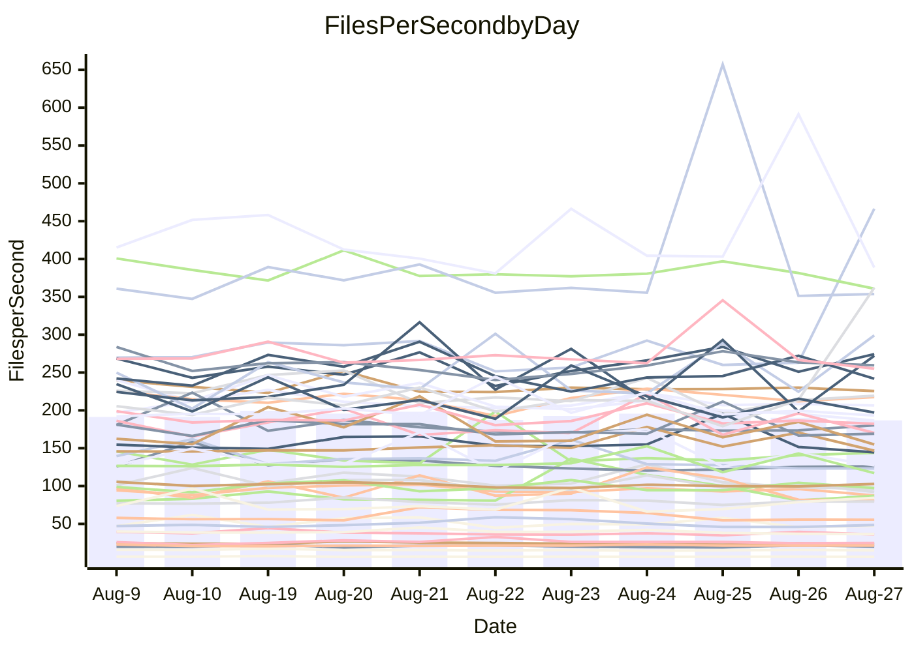

<!---
# This file is auto-generated. Do not edit.
# cspell:disable
--->
# Performance Report

Daily Performance

```mermaid
xychart-beta
    title Files Per Second by Day
    y-axis Files per Second
    x-axis Date [Aug-9, Aug-10, Aug-19, Aug-20, Aug-21, Aug-22, Aug-23, Aug-24, Aug-25, Aug-26, Aug-27]
    bar [191.27, 191.48, 199.45, 195.67, 198.22, 187.40, 192.61, 195.61, 200.69, 190.24, 186.81]
    line [19.76, 19.87, 23.15, 18.80, 21.30, 21.70, 20.11, 19.24, 18.97, 21.74, 19.97]
    line [94.45, 88.13, 97.66, 100.71, 101.93, 92.80, 92.11, 97.07, 92.83, 96.14, 87.59]
    line [106.66, 99.38, 103.80, 117.71, 112.47, 100.50, 103.30, 128.71, 104.89, 98.28, 96.39]
    line [80.61, 83.15, 92.81, 82.44, 81.86, 80.75, 136.22, 114.72, 99.92, 81.00, 86.97]
    line [239.79, 231.09, 223.10, 252.00, 224.60, 224.17, 230.06, 227.93, 228.22, 229.99, 225.56]
    line [269.81, 270.47, 289.77, 286.14, 291.59, 251.52, 256.69, 292.19, 260.02, 262.94, 466.46]
    line [39.52, 37.52, 44.46, 38.46, 37.42, 35.96, 35.65, 37.61, 34.82, 39.47, 36.02]
    line [268.54, 243.09, 257.77, 247.18, 276.72, 232.23, 252.08, 266.01, 283.94, 251.01, 274.39]
    line [6.78, 6.60, 7.51, 6.38, 6.72, 6.55, 6.77, 6.55, 6.58, 6.64, 6.42]
    line [240.17, 211.99, 227.00, 211.38, 205.51, 203.10, 206.43, 223.33, 206.89, 208.72, 206.49]
    line [125.68, 158.27, 127.25, 135.61, 133.76, 126.70, 123.28, 120.42, 121.90, 125.42, 126.14]
    line [225.24, 214.74, 210.02, 221.88, 213.58, 192.56, 216.27, 228.68, 220.47, 211.98, 217.51]
    line [225.91, 222.58, 246.74, 252.74, 209.47, 217.12, 212.13, 242.98, 195.81, 213.43, 219.29]
    line [145.75, 128.32, 148.05, 133.76, 130.09, 198.58, 132.66, 136.89, 133.84, 140.74, 143.87]
    line [24.65, 23.72, 23.68, 26.94, 25.51, 24.79, 23.76, 23.53, 22.75, 24.32, 23.37]
    line [139.45, 161.93, 128.87, 135.71, 136.66, 133.36, 161.38, 128.87, 127.62, 123.35, 123.16]
    line [25.95, 22.03, 24.86, 28.29, 26.21, 32.71, 26.20, 26.09, 26.00, 24.43, 24.72]
    line [154.75, 150.93, 149.02, 164.86, 165.64, 153.35, 152.64, 155.02, 195.52, 151.70, 144.52]
    line [15.80, 15.53, 17.25, 15.28, 15.49, 14.84, 15.46, 14.39, 15.01, 15.63, 15.11]
    line [196.97, 211.99, 246.59, 218.10, 236.31, 204.94, 201.38, 212.81, 200.01, 195.34, 186.53]
    line [180.75, 223.35, 172.94, 187.16, 177.68, 172.01, 170.49, 175.09, 173.22, 173.59, 180.21]
    line [96.93, 84.41, 106.12, 84.61, 114.12, 87.31, 89.99, 124.55, 110.24, 81.92, 80.95]
    line [77.16, 76.75, 77.91, 84.91, 78.76, 75.34, 81.46, 80.77, 74.97, 79.78, 79.48]
    line [400.74, 385.62, 371.65, 411.46, 377.61, 379.88, 377.18, 380.64, 396.91, 381.52, 360.83]
    line [145.79, 145.58, 147.10, 147.08, 151.07, 153.94, 150.27, 178.09, 152.08, 170.66, 146.72]
    line [249.96, 202.34, 263.67, 236.99, 228.06, 301.20, 226.40, 222.40, 289.06, 224.56, 299.11]
    line [186.27, 165.43, 184.07, 202.12, 167.51, 173.85, 169.85, 221.75, 167.75, 195.90, 170.16]
    line [224.37, 213.27, 217.89, 233.79, 316.48, 227.32, 281.23, 212.31, 293.11, 198.49, 272.12]
    line [47.00, 61.84, 45.89, 57.63, 58.67, 44.77, 49.92, 49.06, 57.90, 45.60, 47.39]
    line [127.47, 149.55, 129.16, 129.10, 170.99, 119.13, 167.47, 175.06, 125.57, 143.51, 127.26]
    line [181.18, 166.12, 186.93, 181.85, 181.88, 168.34, 171.35, 169.12, 211.70, 166.64, 169.19]
    line [57.90, 56.15, 56.35, 54.76, 71.89, 68.47, 68.09, 64.39, 54.76, 55.64, 55.50]
    line [101.07, 123.80, 99.87, 108.06, 107.98, 95.34, 94.96, 114.12, 97.84, 103.09, 92.24]
    line [98.84, 91.76, 103.43, 107.49, 93.08, 97.11, 107.90, 94.53, 94.47, 104.38, 97.34]
    line [162.48, 155.40, 204.32, 177.59, 218.64, 159.00, 159.79, 194.26, 164.45, 184.75, 154.91]
    line [360.76, 347.31, 389.41, 371.89, 392.82, 355.53, 361.83, 355.43, 657.12, 351.25, 353.69]
    line [198.91, 184.05, 187.41, 186.67, 207.48, 180.49, 185.92, 209.38, 182.67, 186.49, 182.27]
    line [242.10, 232.62, 273.32, 257.69, 290.62, 245.10, 224.83, 243.49, 245.36, 272.30, 241.75]
    line [73.60, 96.61, 68.89, 69.48, 73.38, 68.77, 97.84, 66.15, 69.59, 78.77, 84.52]
    line [415.14, 451.69, 458.22, 412.53, 400.53, 380.98, 466.37, 404.40, 403.18, 591.49, 388.78]
    line [283.77, 252.09, 262.36, 263.68, 253.37, 240.18, 248.22, 259.20, 278.18, 263.50, 259.54]
    line [22.84, 20.59, 20.47, 21.22, 20.90, 21.42, 21.40, 22.88, 21.36, 21.22, 21.34]
    line [205.56, 193.98, 216.67, 206.61, 230.20, 198.53, 213.69, 212.64, 179.07, 214.07, 361.94]
    line [126.64, 126.17, 128.45, 125.27, 127.94, 127.77, 130.20, 152.67, 118.34, 143.02, 117.15]
    line [105.46, 100.11, 102.43, 104.89, 103.21, 98.21, 97.36, 101.78, 100.00, 99.58, 102.72]
    line [47.26, 48.66, 46.00, 48.26, 51.42, 58.83, 56.30, 50.38, 45.97, 45.91, 48.45]
    line [268.09, 268.70, 290.78, 262.94, 266.60, 272.93, 267.45, 262.37, 345.57, 266.69, 254.99]
    line [234.76, 198.61, 243.75, 200.90, 213.71, 188.91, 259.37, 218.53, 190.79, 215.33, 197.14]
    line [39.98, 38.63, 38.64, 39.11, 45.24, 39.50, 39.66, 42.07, 38.23, 36.94, 36.40]
    line [192.03, 195.48, 194.87, 202.54, 193.62, 244.63, 196.70, 223.56, 194.58, 199.46, 193.17]
```

Time to Process Files

| Repository                                      | Elapsed | Min/Avg/Max          |    SD | SD Graph                |
| ----------------------------------------------- | ------: | :------------------: | ----: | ----------------------- |
| AdaDoom3/AdaDoom3                    |    2.86 | 2.1 /   2.7 /   3.0  |  0.24 | `    ┣━━┻━━╋━●┻━━┫    ` |
| alexiosc/megistos                    |    6.70 | 4.1 /   6.8 /   7.9  |  0.89 | `    ┣━━┻━━●━━┻━━┫    ` |
| apollographql/apollo-server          |    2.66 | 1.8 /   2.4 /   2.8  |  0.26 | `    ┣━━┻━━╋━━●━━┫    ` |
| aspnetboilerplate/aspnetboilerplate  |    4.91 | 6.3 /   8.4 /   9.1  |  0.94 | `●   ┣━━┻━━╋━━┻━━┫    ` |
| aws-amplify/docs                     |   13.43 | 9.6 /  13.0 /  14.0  |  0.96 | `    ┣━━┻━━╋●━┻━━┫    ` |
| Azure/azure-rest-api-specs           |    9.39 | 7.2 /   9.9 /  11.2  |  0.89 | `    ┣━━┻●━╋━━┻━━┫    ` |
| bitjson/typescript-starter           |    1.00 | 0.6 /   1.0 /   1.1  |  0.10 | `     ┣━┻━━●━━┻━┫     ` |
| caddyserver/caddy                    |    3.86 | 2.5 /   3.5 /   3.9  |  0.34 | `    ┣━━┻━━╋━━●━━┫    ` |
| canada-ca/open-source-logiciel-libre |    1.09 | 0.8 /   1.0 /   1.3  |  0.10 | `     ┣━┻━━╋●━┻━┫     ` |
| chef/chef                            |    5.01 | 3.0 /   4.8 /   5.4  |  0.51 | `    ┣━━┻━━╋●━┻━━┫    ` |
| dart-lang/sdk                        |   62.37 | 34.3 /  55.6 /  64.6 |  6.85 | `  ┣━━━┻━━━╋━━━●━━━┫  ` |
| django/django                        |   13.37 | 10.2 /  13.0 /  15.0 |  1.56 | `   ┣━━━┻━━╋●━┻━━━┫   ` |
| eslint/eslint                        |    9.57 | 7.6 /   9.6 /  10.8  |  0.72 | `    ┣━━┻━━●━━┻━━┫    ` |
| exonum/exonum                        |    3.34 | 2.6 /   3.3 /   3.7  |  0.25 | `    ┣━━┻━━╋●━┻━━┫    ` |
| flutter/samples                      |   11.84 | 8.0 /  12.2 /  14.0  |  1.36 | `    ┣━━┻━●╋━━┻━━┫    ` |
| gitbucket/gitbucket                  |    3.39 | 2.5 /   3.1 /   3.4  |  0.31 | `    ┣━━┻━━╋━━●━━┫    ` |
| googleapis/google-cloud-cpp          |  129.93 | 96.3 / 120.3 / 133.3 | 11.74 | `  ┣━━━┻━━━╋━━●┻━━━┫  ` |
| graphql/express-graphql              |    1.11 | 0.7 /   1.1 /   1.2  |  0.09 | `     ┣━┻━━╋●━┻━┫     ` |
| graphql/graphql-js                   |    3.81 | 2.8 /   3.5 /   3.9  |  0.28 | `    ┣━━┻━━╋━━●━━┫    ` |
| graphql/graphql-relay-js             |    1.13 | 0.7 /   1.1 /   1.3  |  0.10 | `     ┣━┻━━╋●━┻━┫     ` |
| graphql/graphql-spec                 |    1.26 | 0.8 /   1.2 /   1.4  |  0.12 | `     ┣━┻━━╋●━┻━┫     ` |
| iluwatar/java-design-patterns        |   12.11 | 8.8 /  12.0 /  12.8  |  1.02 | `    ┣━━┻━━●━━┻━━┫    ` |
| ktaranov/sqlserver-kit               |    6.05 | 3.1 /   5.2 /   6.2  |  0.96 | `    ┣━━┻━━╋━━●━━┫    ` |
| liriliri/licia                       |    4.00 | 2.9 /   3.7 /   4.1  |  0.28 | `    ┣━━┻━━╋━━●━━┫    ` |
| MartinThoma/LaTeX-examples           |    4.71 | 4.5 /   5.9 /   7.0  |  0.69 | `    ┣●━┻━━╋━━┻━━┫    ` |
| mdx-js/mdx                           |    1.75 | 1.5 /   1.8 /   1.9  |  0.09 | `     ┣━┻━━●━━┻━┫     ` |
| microsoft/TypeScript-Website         |    5.21 | 3.7 /   5.1 /   5.6  |  0.41 | `    ┣━━┻━━╋●━┻━━┫    ` |
| MicrosoftDocs/PowerShell-Docs        |   24.56 | 13.9 /  22.9 /  26.2 |  3.24 | `   ┣━━┻━━━╋━●━┻━━┫   ` |
| neovim/nvim-lspconfig                |    5.12 | 3.7 /   4.7 /   5.6  |  0.62 | `    ┣━━┻━━╋━●┻━━┫    ` |
| pagekit/pagekit                      |    2.72 | 1.9 /   3.2 /   4.1  |  0.48 | `    ┣━━●━━╋━━┻━━┫    ` |
| php/php-src                          |   25.90 | 18.2 /  23.2 /  26.1 |  2.52 | `   ┣━━━┻━━╋━━┻●━━┫   ` |
| plasticrake/tplink-smarthome-api     |    1.31 | 0.8 /   1.2 /   1.4  |  0.16 | `     ┣━┻━━╋●━┻━┫     ` |
| prettier/prettier                    |    7.63 | 4.1 /   7.2 /   8.0  |  0.89 | `    ┣━━┻━━╋●━┻━━┫    ` |
| pycontribs/jira                      |    1.44 | 0.9 /   1.4 /   1.5  |  0.15 | `     ┣━┻━━╋━●┻━┫     ` |
| RustPython/RustPython                |    9.01 | 5.8 /   8.9 /  11.1  |  1.12 | `    ┣━━┻━━●━━┻━━┫    ` |
| shoelace-style/shoelace              |    2.84 | 1.8 /   2.5 /   3.0  |  0.39 | `    ┣━━┻━━╋━●┻━━┫    ` |
| slint-ui/slint                       |   16.03 | 11.3 /  15.0 /  17.0 |  1.54 | `   ┣━━━┻━━╋━●┻━━━┫   ` |
| SoftwareBrothers/admin-bro           |    2.42 | 1.6 /   2.3 /   2.6  |  0.24 | `    ┣━━┻━━╋●━┻━━┫    ` |
| sveltejs/svelte                      |   23.20 | 12.5 /  21.1 /  23.5 |  2.53 | `   ┣━━━┻━━╋━━●━━━┫   ` |
| TheAlgorithms/Python                 |    5.44 | 3.0 /   5.4 /   5.9  |  0.52 | `    ┣━━┻━━●━━┻━━┫    ` |
| twbs/bootstrap                       |    1.40 | 1.2 /   1.6 /   1.9  |  0.19 | `     ┣━●━━╋━━┻━┫     ` |
| typescript-cheatsheets/react         |    1.12 | 0.7 /   1.1 /   1.3  |  0.09 | `     ┣━┻━━●━━┻━┫     ` |
| typescript-eslint/typescript-eslint  |    2.40 | 3.3 /   4.2 /   4.9  |  0.31 | `●     ┣━┻━╋━┻━┫      ` |
| vitest-dev/vitest                    |   10.94 | 8.1 /  10.2 /  10.8  |  0.73 | `    ┣━━┻━━╋━━●━━┫    ` |
| w3c/aria-practices                   |    3.56 | 2.3 /   3.2 /   3.5  |  0.25 | `    ┣━━┻━━╋━━┻●━┫    ` |
| w3c/specberus                        |    1.85 | 1.5 /   1.9 /   2.2  |  0.13 | `     ┣━┻━━●━━┻━┫     ` |
| webdeveric/webpack-assets-manifest   |    1.14 | 0.9 /   1.1 /   1.4  |  0.12 | `     ┣━┻━━●━━┻━┫     ` |
| webpack/webpack                      |    6.92 | 3.7 /   6.2 /   7.4  |  1.00 | `    ┣━━┻━━╋━●┻━━┫    ` |
| wireapp/wire-desktop                 |    1.40 | 1.0 /   1.3 /   1.5  |  0.12 | `     ┣━┻━━╋━━●━┫     ` |
| wireapp/wire-webapp                  |   13.35 | 10.3 /  12.7 /  14.2 |  0.92 | `    ┣━━┻━━╋━●┻━━┫    ` |

Note:
- Elapsed time is in seconds.

Files per Second over Time

| Repository                                      | Files |    Sec |    Fps |     Rel | Trend Fps              |    N |
| ----------------------------------------------- | ----: | -----: | -----: | ------: | ---------------------- | ---: |
| AdaDoom3/AdaDoom3                    |   103 |   2.86 |  36.02 |  -7.58% | `▃▃▃█▇▃▃▆▃▃▃▃▂▂▃▃▂▄▄▃` |   25 |
| alexiosc/megistos                    |   583 |   6.70 |  86.97 |  -1.60% | `▂▂▃▅▂▂▂▂▂▂▂▂▂██▃▄▂▂▃` |   25 |
| apollographql/apollo-server          |   256 |   2.66 |  96.39 | -11.68% | `▅▂▃▃▃█▃▅▃▃▆▃▃▃▆▆▃▂▂▂` |   25 |
| aspnetboilerplate/aspnetboilerplate  |  2288 |   4.91 | 466.46 |  68.36% | `▄▂▅▁▁▂▁▅▂▂▅▁▁▁▂▄▂▂▂█` |   25 |
| aws-amplify/docs                     |  3030 |  13.43 | 225.56 |  -3.76% | `▅▃▃▂▃▃▃█▃▂▂▃▂▃▃▂▃▃▃▂` |   25 |
| Azure/azure-rest-api-specs           |  2576 |   9.39 | 274.39 |   5.26% | `▄▃▄▄▄▃▄▃▃▄█▄▂▄▆▃▆▃▄▅` |   25 |
| bitjson/typescript-starter           |    20 |   1.00 |  19.97 |  -2.02% | `▂▃█▂▃▂▁▂▂▂▃▄▃▃▂▂▂▂▅▃` |   25 |
| caddyserver/caddy                    |   338 |   3.86 |  87.59 |  -9.33% | `▂▂▂▅▃▃▂▃█▆▃▃▃▃▃▄▃▃▄▂` |   25 |
| canada-ca/open-source-logiciel-libre |     7 |   1.09 |   6.42 |  -4.75% | `▄▃█▄▃▂▄▄▃▃▄▃▃▄▃▃▃▃▄▃` |   25 |
| chef/chef                            |  1035 |   5.01 | 206.49 |  -6.43% | `█▂▂▃▄▂▃▂▂▂▂▂▂▂▂▃▂▁▃▂` |   25 |
| dart-lang/sdk                        | 11634 |  62.37 | 186.53 | -12.58% | `▂▃▂█▂▅▂▂▂▂▇▂▂▂▂▃▂▂▂▂` |   25 |
| django/django                        |  2932 |  13.37 | 219.29 |  -4.18% | `█▄▇▃▅█▃█▅▃▂▃▃▃▂█▂▃▃▃` |   25 |
| eslint/eslint                        |  2082 |   9.57 | 217.51 |  -0.42% | `▄▅▄▅▄█▄▅▄▅▄▅▂▅▅▇▅▅▄▅` |   25 |
| exonum/exonum                        |   421 |   3.34 | 126.14 |  -2.28% | `▄█▃▄▄▄█▄▃▄▃▇▄▃▂▃▃▄▃▄` |   25 |
| flutter/samples                      |  1703 |  11.84 | 143.87 |   1.65% | `▃▂▃▄▄▂▃▃▃▂▃▃█▂▃▃▃▂▄▃` |   25 |
| gitbucket/gitbucket                  |   418 |   3.39 | 123.16 |  -9.56% | `▄█▂▃▅█▃▄▃▇▃▃▄█▃▃▃▃▂▂` |   25 |
| googleapis/google-cloud-cpp          | 21983 | 129.93 | 169.19 |  -5.82% | `▃▂█▃▃▇▃▃▃▂▇▂▃▃▃▂▇▂▃▃` |   25 |
| graphql/express-graphql              |    26 |   1.11 |  23.37 |  -5.55% | `▃▃▃▂▂▃▃▃█▅▃▃▃▃▂▃▂▃▃▂` |   25 |
| graphql/graphql-js                   |   551 |   3.81 | 144.52 |  -8.59% | `▃▃▃▃▃█▃▃▄▄▇▄▃▃▃▄█▃▃▂` |   25 |
| graphql/graphql-relay-js             |    28 |   1.13 |  24.72 |  -5.79% | `▂▁▃▃▃▃▃█▃▃▃▃▆▃▃▃▃▂▃▃` |   25 |
| graphql/graphql-spec                 |    19 |   1.26 |  15.11 |  -3.31% | `▂▃█▂▃▃▃▃▃▃▄▃▃▃▃▂▃▄▃▃` |   25 |
| iluwatar/java-design-patterns        |  2183 |  12.11 | 180.21 |   0.07% | `█▇▂▃▃▃▃▄▆▃▃▃▃▂▃▃▃▃▃▃` |   25 |
| ktaranov/sqlserver-kit               |   490 |   6.05 |  80.95 | -17.82% | `▂▂▂▇▂▁▂▂▂▃▂█▂▂▄▇▄▂▁▁` |   25 |
| liriliri/licia                       |  1442 |   4.00 | 360.83 |  -7.60% | `▄▄▃▃▃▃█▄▄▃▃▄▃▃▃▃▄▃▃▂` |   25 |
| MartinThoma/LaTeX-examples           |  1409 |   4.71 | 299.11 |  22.87% | `▃▂▄█▆▃▃▆▃▃▃▄█▃▃▃▇▃▃█` |   25 |
| mdx-js/mdx                           |   139 |   1.75 |  79.48 |   0.39% | `▃▄▅▅▃▅▆█▇▅▄▅▄▅▅▅▃▆▃▅` |   25 |
| microsoft/TypeScript-Website         |   765 |   5.21 | 146.72 |  -3.54% | `▃▃▃▂▃▃▂▃▃▃▃▃▃▃▃█▃▇▃▃` |   25 |
| MicrosoftDocs/PowerShell-Docs        |  3126 |  24.56 | 127.26 |  -9.31% | `▂▃▂▂▂▂▂▂▂█▄▂▁▄▂█▂▄▂▂` |   25 |
| neovim/nvim-lspconfig                |   871 |   5.12 | 170.16 |  -9.09% | `▅▃▃▆▄▆▆█▃▃▃▃▃▃▇▇▃▂█▃` |   25 |
| pagekit/pagekit                      |   741 |   2.72 | 272.12 |  14.43% | `▂▂▂▂▂▅▂▂▂▆█▃▃▅▂▂▅▂▁▄` |   25 |
| php/php-src                          |  2389 |  25.90 |  92.24 | -11.63% | `▃▇▃▅▂▃▇▃▅█▃▂▃▂▃█▃▂▆▂` |   25 |
| plasticrake/tplink-smarthome-api     |    62 |   1.31 |  47.39 |  -7.22% | `▂▅▁▂▂▅▃▂▇▂▃█▂▃▂▃▄▂▂▂` |   25 |
| prettier/prettier                    |  2699 |   7.63 | 353.69 |  -6.87% | `▂▂▂▄▂▃▁▂▁▄▂▂▂▂▂▂█▂▂▂` |   25 |
| pycontribs/jira                      |    80 |   1.44 |  55.50 |  -7.62% | `▂▂▂▂▂▂▂▂▂█▂▅▄▄▂▅▂▂▂▂` |   24 |
| RustPython/RustPython                |   877 |   9.01 |  97.34 |  -2.68% | `▅▃▃▃▅▃▃█▃▂▃▃▃▄▃▃▃▃▅▃` |   25 |
| shoelace-style/shoelace              |   440 |   2.84 | 154.91 | -14.19% | `▂▂▂█▆▂▂▂▇▇▇▄▂▂▇▂▃▅▂▂` |   25 |
| slint-ui/slint                       |  3875 |  16.03 | 241.75 |  -5.52% | `▃▂▃█▃▂▃▇▃▆█▃▃▂▃▃▃▇▂▃` |   25 |
| SoftwareBrothers/admin-bro           |   441 |   2.42 | 182.27 |  -6.02% | `▃▃▃▃▃▅▂▂▂▂▃█▂▃▂▇▃▃▃▃` |   25 |
| sveltejs/svelte                      |  9020 |  23.20 | 388.78 | -10.22% | `▄▃▄▃▁▃▁▂▂▂▁▂▁▃▂▂▂█▃▁` |   25 |
| TheAlgorithms/Python                 |  1411 |   5.44 | 259.54 |  -2.46% | `▆▅▇▆▆▇▆▆▆▄▆▆▄▅▆▆█▆▆▆` |   25 |
| twbs/bootstrap                       |   118 |   1.40 |  84.52 |  14.68% | `▆█▃▃▃▃▃▄▃▅▃▂▃█▃▂▃▆▃▆` |   25 |
| typescript-cheatsheets/react         |    24 |   1.12 |  21.34 |  -1.53% | `▇▄▅▅▃▅▄▅▆▄▅▅▅▅█▆▅▄▆▅` |   25 |
| typescript-eslint/typescript-eslint  |   869 |   2.40 | 361.94 |  72.53% | `▂▂▃▃▃▃▃▁▂▄▃▂▂▂▂▂▁▂▃█` |   25 |
| vitest-dev/vitest                    |  2790 |  10.94 | 254.99 |  -6.44% | `▆▃▃█▃▃▂▃▂▃▃▃▃▃▂▃█▃▃▂` |   25 |
| w3c/aria-practices                   |   417 |   3.56 | 117.15 |  -9.90% | `▃▃▃▃▃▂▂▃▂▃▃▂▃▃█▂▂▆▃▂` |   25 |
| w3c/specberus                        |   190 |   1.85 | 102.72 |  -0.19% | `▅▄▄▅▅▂█▄▆▅▄▅▄▄▄▅▄▄▄▅` |   25 |
| webdeveric/webpack-assets-manifest   |    55 |   1.14 |  48.45 |  -0.60% | `▅▄▄▃▃▄█▄▂█▄▄▇▇▆▄▄▃▄▄` |   25 |
| webpack/webpack                      |  1364 |   6.92 | 197.14 | -10.79% | `▂▂▂█▂▂▃▂▂▁▂▅▂▅▂▄▂▂▃▂` |   25 |
| wireapp/wire-desktop                 |    51 |   1.40 |  36.40 |  -9.18% | `▇▄▄▃▄▃▄▄▅▄▇█▄▄▇▄▄▃▃▃` |   25 |
| wireapp/wire-webapp                  |  2578 |  13.35 | 193.17 |  -3.36% | `▄▄▄▃▄▄▂▃█▄▃▄█▄▄█▄▄▄▃` |   25 |

Data Throughput

| Repository                                      | Files |    Sec |     Kps |     Rel | Trend Kps              |    N |
| ----------------------------------------------- | ----: | -----: | ------: | ------: | ---------------------- | ---: |
| AdaDoom3/AdaDoom3                    |   103 |   2.86 |  765.46 |  -7.58% | `▃▃▃█▇▃▃▆▃▃▃▃▂▂▃▃▂▄▄▃` |   25 |
| alexiosc/megistos                    |   583 |   6.70 |  683.37 |  -1.60% | `▂▂▃▅▂▂▂▂▂▂▂▂▂██▃▄▂▂▃` |   25 |
| apollographql/apollo-server          |   256 |   2.66 |  793.71 | -11.68% | `▅▂▃▃▃█▃▅▃▃▆▃▃▃▆▆▃▂▂▂` |   25 |
| aspnetboilerplate/aspnetboilerplate  |  2288 |   4.91 | 1140.87 |  68.39% | `▄▂▅▁▁▂▁▅▂▂▅▁▁▁▂▄▂▂▂█` |   25 |
| aws-amplify/docs                     |  3030 |  13.43 |  881.75 |  -3.70% | `▅▃▃▂▃▃▃█▃▂▂▃▂▃▃▂▃▃▃▂` |   25 |
| Azure/azure-rest-api-specs           |  2576 |   9.39 |  842.89 |   5.82% | `▄▃▄▄▄▃▄▃▃▄█▄▂▄▆▃▆▄▄▅` |   25 |
| bitjson/typescript-starter           |    20 |   1.00 |   79.86 |  -2.02% | `▂▃█▂▃▂▁▂▂▂▃▄▃▃▂▂▂▂▅▃` |   25 |
| caddyserver/caddy                    |   338 |   3.86 |  795.04 |  -9.67% | `▂▂▂▅▃▃▂▃█▆▃▃▃▃▃▄▃▃▄▂` |   25 |
| canada-ca/open-source-logiciel-libre |     7 |   1.09 |   53.21 |  -4.75% | `▄▃█▄▃▂▄▄▃▃▄▃▃▄▃▃▃▃▄▃` |   25 |
| chef/chef                            |  1035 |   5.01 | 1013.68 |  -6.44% | `█▂▂▃▄▂▃▂▂▂▂▂▂▂▂▃▂▁▃▂` |   25 |
| dart-lang/sdk                        | 11634 |  62.37 | 1297.41 | -12.30% | `▂▃▂█▂▅▂▂▂▂▇▂▂▂▂▃▂▂▂▂` |   25 |
| django/django                        |  2932 |  13.37 | 1412.17 |  -4.22% | `█▄▇▃▅█▃█▅▃▂▃▃▃▂█▂▃▃▃` |   25 |
| eslint/eslint                        |  2082 |   9.57 | 1527.03 |  -0.41% | `▄▅▄▅▄█▄▅▄▅▄▅▂▅▅▇▅▅▄▅` |   25 |
| exonum/exonum                        |   421 |   3.34 | 1206.55 |  -2.28% | `▄█▃▄▄▄█▄▃▄▃▇▄▃▂▃▃▄▃▄` |   25 |
| flutter/samples                      |  1703 |  11.84 |  857.54 |   1.52% | `▃▂▃▄▄▂▃▃▃▂▃▃█▂▃▃▃▂▄▃` |   25 |
| gitbucket/gitbucket                  |   418 |   3.39 |  609.30 |  -9.26% | `▄█▂▃▅█▃▄▃█▃▃▄█▃▃▃▃▂▂` |   25 |
| googleapis/google-cloud-cpp          | 21983 | 129.93 | 1471.93 |  -5.68% | `▃▂█▃▃▇▃▃▃▂▇▂▃▃▃▂▇▂▃▃` |   25 |
| graphql/express-graphql              |    26 |   1.11 |  106.96 |  -5.55% | `▃▃▃▂▂▃▃▃█▅▃▃▃▃▂▃▂▃▃▂` |   25 |
| graphql/graphql-js                   |   551 |   3.81 | 1077.77 |  -8.59% | `▃▃▃▃▃█▃▃▄▄▇▄▃▃▃▄█▃▃▂` |   25 |
| graphql/graphql-relay-js             |    28 |   1.13 |   97.13 |  -5.79% | `▂▁▃▃▃▃▃█▃▃▃▃▆▃▃▃▃▂▃▃` |   25 |
| graphql/graphql-spec                 |    19 |   1.26 |  505.92 |  -3.31% | `▂▃█▂▃▃▃▃▃▃▄▃▃▃▃▂▃▄▃▃` |   25 |
| iluwatar/java-design-patterns        |  2183 |  12.11 |  556.73 |   0.15% | `█▇▃▃▃▃▃▄▆▃▃▃▃▃▃▃▃▃▃▃` |   25 |
| ktaranov/sqlserver-kit               |   490 |   6.05 | 1226.29 | -17.82% | `▂▂▂▇▂▁▂▂▂▃▂█▂▂▄▇▄▂▁▁` |   25 |
| liriliri/licia                       |  1442 |   4.00 |  432.65 |  -7.46% | `▄▃▃▃▃▃█▄▄▃▃▄▃▃▄▃▄▃▃▂` |   25 |
| MartinThoma/LaTeX-examples           |  1409 |   4.71 |  617.75 |  22.87% | `▃▂▄█▆▃▃▆▃▃▃▄█▃▃▃▇▃▃█` |   25 |
| mdx-js/mdx                           |   139 |   1.75 |  374.54 |   0.39% | `▃▄▅▅▃▅▆█▇▅▄▅▄▅▅▅▃▆▃▅` |   25 |
| microsoft/TypeScript-Website         |   765 |   5.21 | 1011.72 |  -3.53% | `▃▃▃▂▃▃▂▃▃▃▃▃▃▃▃█▃▇▃▃` |   25 |
| MicrosoftDocs/PowerShell-Docs        |  3126 |  24.56 | 1359.73 |  -9.25% | `▂▃▂▂▂▂▂▂▂█▄▂▁▄▂█▂▄▂▂` |   25 |
| neovim/nvim-lspconfig                |   871 |   5.12 |  499.74 |  -9.06% | `▅▃▃▆▄▆▆█▃▃▃▃▃▃▇▇▃▂█▃` |   25 |
| pagekit/pagekit                      |   741 |   2.72 |  567.38 |  14.43% | `▂▂▂▂▂▅▂▂▂▆█▃▃▅▂▂▅▂▁▄` |   25 |
| php/php-src                          |  2389 |  25.90 | 1633.14 | -11.57% | `▃▇▃▅▂▃▇▃▅█▃▂▃▂▃█▃▂▆▂` |   25 |
| plasticrake/tplink-smarthome-api     |    62 |   1.31 |  256.06 |  -7.22% | `▂▅▁▂▂▅▃▂▇▂▃█▂▃▂▃▄▂▂▂` |   25 |
| prettier/prettier                    |  2699 |   7.63 |  498.49 |  -7.23% | `▂▂▂▄▂▃▁▂▁▄▂▂▂▂▂▂█▂▂▂` |   25 |
| pycontribs/jira                      |    80 |   1.44 |  391.94 |  -7.62% | `▂▂▂▂▂▂▂▂▂█▂▅▄▄▂▅▂▂▂▂` |   24 |
| RustPython/RustPython                |   877 |   9.01 | 2151.78 |  -2.27% | `▅▃▃▃▅▃▃█▃▂▃▃▃▄▃▃▃▃▅▃` |   25 |
| shoelace-style/shoelace              |   440 |   2.84 |  748.14 | -14.19% | `▂▂▂█▆▂▂▂▇▇▇▄▂▂▇▂▃▅▂▂` |   25 |
| slint-ui/slint                       |  3875 |  16.03 | 1304.27 |  -5.21% | `▃▂▃█▃▂▃▇▃▆█▃▃▂▃▃▃▇▂▃` |   25 |
| SoftwareBrothers/admin-bro           |   441 |   2.42 |  401.75 |  -6.02% | `▃▃▃▃▃▅▂▂▂▂▃█▂▃▂▇▃▃▃▃` |   25 |
| sveltejs/svelte                      |  9020 |  23.20 |  267.84 |  -9.97% | `▄▃▄▃▁▃▁▂▂▂▁▂▁▃▂▂▂█▃▁` |   25 |
| TheAlgorithms/Python                 |  1411 |   5.44 |  663.83 |  -2.46% | `▆▅▇▆▆▇▆▆▆▄▆▆▄▅▆▆█▆▆▆` |   25 |
| twbs/bootstrap                       |   118 |   1.40 |  693.37 |  14.68% | `▆█▃▃▃▃▃▄▃▅▃▂▃█▃▂▃▆▃▆` |   25 |
| typescript-cheatsheets/react         |    24 |   1.12 |  192.98 |  -1.53% | `▇▄▅▅▃▅▄▅▆▄▅▅▅▅█▆▅▄▆▅` |   25 |
| typescript-eslint/typescript-eslint  |   869 |   2.40 | 1215.78 |  72.43% | `▂▂▃▃▃▃▃▁▂▄▃▂▂▂▂▂▁▂▃█` |   25 |
| vitest-dev/vitest                    |  2790 |  10.94 |  739.48 |  -5.46% | `▆▃▃▇▃▃▃▄▃▃▃▃▄▃▃▃█▃▃▂` |   25 |
| w3c/aria-practices                   |   417 |   3.56 | 1101.85 |  -9.90% | `▃▃▃▃▃▂▂▃▂▃▃▂▃▃█▂▂▆▃▂` |   25 |
| w3c/specberus                        |   190 |   1.85 |  335.75 |  -0.14% | `▅▄▄▅▅▂█▄▆▅▄▅▄▄▄▅▄▄▄▅` |   25 |
| webdeveric/webpack-assets-manifest   |    55 |   1.14 |  111.87 |  -0.60% | `▅▄▄▃▃▄█▄▂█▄▄▇▇▆▄▄▃▄▄` |   25 |
| webpack/webpack                      |  1364 |   6.92 | 1337.94 |  -7.84% | `▂▁▂█▂▂▃▂▂▁▂▅▂▅▂▄▂▂▄▂` |   25 |
| wireapp/wire-desktop                 |    51 |   1.40 |  154.89 |  -9.18% | `▇▄▄▃▄▃▄▄▅▄▇█▄▄▇▄▄▃▃▃` |   25 |
| wireapp/wire-webapp                  |  2578 |  13.35 |  823.47 |  -2.45% | `▄▃▄▃▄▃▂▃█▄▃▄█▄▄█▄▄▄▄` |   25 |

