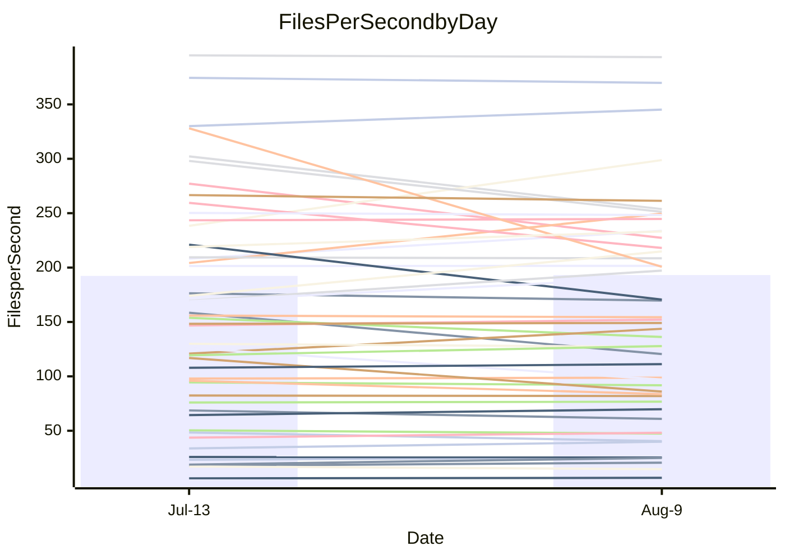

<!---
# This file is auto-generated. Do not edit.
# cspell:disable
--->
# Performance Report

Daily Performance

```mermaid
xychart-beta
    title Files Per Second by Day
    y-axis Files per Second
    x-axis Date [Jul-13, Aug-9]
    bar [192.31, 193.11]
    line [17.82, 20.68]
    line [97.93, 98.82]
    line [302.24, 253.74]
    line [94.47, 91.82]
    line [82.41, 81.85]
    line [48.47, 40.41]
    line [277.07, 227.27]
    line [6.29, 6.73]
    line [238.39, 298.78]
    line [208.19, 233.71]
    line [158.48, 120.52]
    line [204.20, 249.58]
    line [209.39, 208.48]
    line [153.81, 136.16]
    line [120.84, 143.72]
    line [23.34, 25.44]
    line [146.76, 152.19]
    line [25.88, 25.75]
    line [17.18, 14.71]
    line [201.45, 201.58]
    line [176.39, 169.63]
    line [96.02, 83.73]
    line [298.01, 251.21]
    line [76.00, 76.70]
    line [148.29, 149.06]
    line [374.43, 369.78]
    line [259.46, 218.06]
    line [221.06, 170.53]
    line [129.95, 127.08]
    line [126.09, 97.05]
    line [68.71, 60.93]
    line [155.87, 154.35]
    line [169.41, 197.19]
    line [50.42, 47.45]
    line [116.87, 86.00]
    line [330.04, 345.24]
    line [243.47, 244.65]
    line [64.41, 69.79]
    line [174.01, 214.84]
    line [250.26, 248.30]
    line [18.90, 25.04]
    line [328.06, 200.72]
    line [395.07, 393.48]
    line [119.39, 127.88]
    line [266.63, 261.34]
    line [33.78, 39.88]
    line [43.65, 48.16]
    line [107.84, 111.25]
    line [218.96, 233.27]
    line [169.05, 190.84]
```

Time to Process Files

| Repository                                      | Elapsed | Min/Avg/Max          |    SD | SD Graph                |
| ----------------------------------------------- | ------: | :------------------: | ----: | ----------------------- |
| AdaDoom3/AdaDoom3                    |    2.70 | 2.1 /   2.4 /   2.8  |  0.28 | `    ┣━━┻━━╋━━●━━┫    ` |
| alexiosc/megistos                    |    7.43 | 6.9 /   7.0 /   7.1  |  0.10 | `     ┣━┻━━╋━━┻━┫    ●` |
| apollographql/apollo-server          |    2.39 | 2.6 /   2.7 /   2.8  |  0.06 | `●    ┣━━┻━╋━┻━━┫     ` |
| aspnetboilerplate/aspnetboilerplate  |    9.07 | 7.6 /   8.5 /   9.1  |  0.68 | `    ┣━━┻━━╋━●┻━━┫    ` |
| aws-amplify/docs                     |   12.93 | 10.7 /  12.6 /  13.6 |  1.35 | `   ┣━━━┻━━╋●━┻━━━┫   ` |
| Azure/azure-rest-api-specs           |    8.82 | 7.2 /   9.3 /  10.4  |  1.52 | `    ┣━━┻━●╋━━┻━━┫    ` |
| bitjson/typescript-starter           |    1.00 | 0.9 /   1.0 /   1.1  |  0.09 | `     ┣━┻━━●━━┻━┫     ` |
| caddyserver/caddy                    |    3.68 | 3.4 /   3.5 /   3.5  |  0.05 | `      ┣━┻━╋━┻━┫     ●` |
| canada-ca/open-source-logiciel-libre |    1.01 | 1.0 /   1.1 /   1.1  |  0.03 | `     ●━━┻━╋━┻━━┫     ` |
| chef/chef                            |    3.60 | 4.7 /   5.0 /   5.3  |  0.25 | `●     ┣━┻━╋━┻━┫      ` |
| dart-lang/sdk                        |   57.48 | 57.0 /  57.5 /  58.0 |  0.41 | `   ┣━━━┻━━●━━┻━━━┫   ` |
| django/django                        |   14.14 | 13.7 /  14.0 /  14.4 |  0.30 | `    ┣━━┻━━╋●━┻━━┫    ` |
| eslint/eslint                        |    7.62 | 7.9 /   9.3 /  10.2  |  0.99 | `    ┣●━┻━━╋━━┻━━┫    ` |
| exonum/exonum                        |    3.40 | 2.7 /   3.2 /   3.7  |  0.43 | `    ┣━━┻━━╋●━┻━━┫    ` |
| flutter/samples                      |   12.73 | 11.0 /  11.9 /  13.4 |  1.04 | `    ┣━━┻━━╋━●┻━━┫    ` |
| gitbucket/gitbucket                  |    3.22 | 2.5 /   3.0 /   3.5  |  0.41 | `    ┣━━┻━━╋●━┻━━┫    ` |
| googleapis/google-cloud-cpp          |  127.68 | 96.9 / 108.6 / 125.8 | 12.44 | `  ┣━━━┻━━━╋━━━┻━●━┫  ` |
| graphql/express-graphql              |    1.20 | 0.8 /   1.0 /   1.1  |  0.12 | `     ┣━┻━━╋━━┻●┫     ` |
| graphql/graphql-js                   |    3.68 | 3.5 /   3.6 /   3.7  |  0.09 | `     ┣━┻━━╋●━┻━┫     ` |
| graphql/graphql-relay-js             |    1.08 | 1.1 /   1.1 /   1.1  |  0.02 | `     ┣━━┻━●━┻━━┫     ` |
| graphql/graphql-spec                 |    1.27 | 1.1 /   1.2 /   1.3  |  0.09 | `     ┣━┻━━╋●━┻━┫     ` |
| iluwatar/java-design-patterns        |   12.81 | 11.8 /  12.0 /  12.1 |  0.12 | `       ┣┻━╋━┻┫      ●` |
| ktaranov/sqlserver-kit               |    5.94 | 5.1 /   5.6 /   6.1  |  0.40 | `    ┣━━┻━━╋━━●━━┫    ` |
| liriliri/licia                       |    3.78 | 3.8 /   3.9 /   4.0  |  0.05 | `   ● ┣━┻━━╋━━┻━┫     ` |
| MartinThoma/LaTeX-examples           |    4.50 | 4.7 /   5.9 /   6.9  |  0.87 | `    ┣●━┻━━╋━━┻━━┫    ` |
| mdx-js/mdx                           |    1.92 | 1.7 /   1.8 /   1.8  |  0.07 | `     ┣━┻━━╋━━┻━●     ` |
| microsoft/TypeScript-Website         |    5.12 | 5.0 /   5.1 /   5.3  |  0.12 | `    ┣━━┻━●╋━━┻━━┫    ` |
| MicrosoftDocs/PowerShell-Docs        |   24.83 | 24.1 /  24.3 /  24.8 |  0.35 | `    ┣━━┻━━╋━━┻●━┫    ` |
| neovim/nvim-lspconfig                |    4.35 | 3.9 /   5.0 /   5.6  |  0.78 | `    ┣━━●━━╋━━┻━━┫    ` |
| pagekit/pagekit                      |    3.54 | 2.9 /   3.2 /   3.4  |  0.23 | `    ┣━━┻━━╋━━┻●━┫    ` |
| php/php-src                          |   25.30 | 18.3 /  22.2 /  24.6 |  2.79 | `   ┣━━━┻━━╋━━┻●━━┫   ` |
| plasticrake/tplink-smarthome-api     |    1.28 | 1.2 /   1.3 /   1.3  |  0.04 | `     ┣━┻━━●━━┻━┫     ` |
| prettier/prettier                    |    7.63 | 7.7 /   7.8 /   8.0  |  0.12 | `    ┣●━┻━━╋━━┻━━┫    ` |
| pycontribs/jira                      |    1.43 | 1.1 /   1.2 /   1.4  |  0.12 | `     ┣━┻━━╋━━┻●┫     ` |
| RustPython/RustPython                |    9.54 | 7.1 /   9.2 /  11.1  |  1.66 | `    ┣━━┻━━╋●━┻━━┫    ` |
| shoelace-style/shoelace              |    2.86 | 2.7 /   2.8 /   3.0  |  0.08 | `     ┣━┻━━╋●━┻━┫     ` |
| slint-ui/slint                       |   15.51 | 14.0 /  14.7 /  15.3 |  0.54 | `    ┣━━┻━━╋━━┻━●┫    ` |
| SoftwareBrothers/admin-bro           |    2.36 | 1.6 /   2.2 /   2.5  |  0.40 | `    ┣━━┻━━╋●━┻━━┫    ` |
| sveltejs/svelte                      |   22.87 | 22.5 /  22.6 /  22.7 |  0.07 | `    ┣━━┻━━╋━━┻━━┫   ●` |
| TheAlgorithms/Python                 |    5.81 | 5.4 /   5.6 /   5.9  |  0.23 | `    ┣━━┻━━╋━●┻━━┫    ` |
| twbs/bootstrap                       |    1.81 | 1.6 /   1.7 /   1.8  |  0.10 | `     ┣━┻━━╋━━●━┫     ` |
| typescript-cheatsheets/react         |    0.74 | 1.1 /   1.2 /   1.3  |  0.08 | `●     ┣━┻━╋━┻━┫      ` |
| typescript-eslint/typescript-eslint  |    4.46 | 3.9 /   4.2 /   4.7  |  0.36 | `    ┣━━┻━━╋━●┻━━┫    ` |
| vitest-dev/vitest                    |   10.48 | 10.2 /  10.5 /  10.7 |  0.22 | `    ┣━━┻━━●━━┻━━┫    ` |
| w3c/aria-practices                   |    3.50 | 3.1 /   3.3 /   3.5  |  0.16 | `    ┣━━┻━━╋━━┻●━┫    ` |
| w3c/specberus                        |    1.88 | 1.5 /   1.7 /   1.8  |  0.15 | `     ┣━┻━━╋━━●━┫     ` |
| webdeveric/webpack-assets-manifest   |    1.21 | 1.0 /   1.2 /   1.3  |  0.09 | `     ┣━┻━━╋●━┻━┫     ` |
| webpack/webpack                      |    5.34 | 5.1 /   5.7 /   6.4  |  0.56 | `    ┣━━┻●━╋━━┻━━┫    ` |
| wireapp/wire-desktop                 |    1.05 | 1.3 /   1.4 /   1.5  |  0.08 | `●    ┣━┻━━╋━━┻━┫     ` |
| wireapp/wire-webapp                  |   13.07 | 12.7 /  13.2 /  13.9 |  0.46 | `    ┣━━┻━●╋━━┻━━┫    ` |

Note:
- Elapsed time is in seconds.

Files per Second over Time

| Repository                                      | Files |    Sec |    Fps |     Rel | Trend Fps |    N |
| ----------------------------------------------- | ----: | -----: | -----: | ------: | --------- | ---: |
| AdaDoom3/AdaDoom3                    |   103 |   2.70 |  38.12 | -13.09% | `█▇▂▃`    |    3 |
| alexiosc/megistos                    |   583 |   7.43 |  78.49 |  -5.61% | `▆▆█▄`    |    3 |
| apollographql/apollo-server          |   256 |   2.39 | 106.97 |  11.64% | `▅▄▅█`    |    3 |
| aspnetboilerplate/aspnetboilerplate  |  2288 |   9.07 | 252.34 |  -6.67% | `█▃▄▃`    |    3 |
| aws-amplify/docs                     |  3030 |  12.93 | 234.30 |  -2.99% | `█▃▃▄`    |    3 |
| Azure/azure-rest-api-specs           |  2561 |   8.82 | 290.20 |   3.09% | `▂█▂▅`    |    3 |
| bitjson/typescript-starter           |    20 |   1.00 |  20.02 |   0.39% | `▃█▅▆`    |    3 |
| caddyserver/caddy                    |   325 |   3.68 |  88.30 |  -5.94% | `██▇▄`    |    3 |
| canada-ca/open-source-logiciel-libre |     7 |   1.01 |   6.92 |   6.21% | `▄▇▆█`    |    3 |
| chef/chef                            |  1034 |   3.60 | 287.24 |  38.52% | `▃▄▂█`    |    3 |
| dart-lang/sdk                        | 11611 |  57.48 | 202.01 |   0.31% | `█▇██`    |    3 |
| django/django                        |  2930 |  14.14 | 207.20 |  -0.96% | `▇▅█▆`    |    3 |
| eslint/eslint                        |  2080 |   7.62 | 272.96 |  20.43% | `▂▃▇█`    |    3 |
| exonum/exonum                        |   421 |   3.40 | 123.91 |  -6.16% | `█▂▃▃`    |    3 |
| flutter/samples                      |  1696 |  12.73 | 133.22 |  -6.85% | `█▇▃▄`    |    3 |
| gitbucket/gitbucket                  |   418 |   3.22 | 129.91 |  -7.67% | `▂▃█▃`    |    3 |
| googleapis/google-cloud-cpp          | 21238 | 127.68 | 166.34 | -16.08% | `▂█▇▂`    |    3 |
| graphql/express-graphql              |    26 |   1.20 |  21.58 | -17.06% | `▂▃█▁`    |    3 |
| graphql/graphql-js                   |   551 |   3.68 | 149.90 |  -0.82% | `▅█▇▆`    |    3 |
| graphql/graphql-relay-js             |    28 |   1.08 |  25.82 |   0.22% | `▇▆█▇`    |    3 |
| graphql/graphql-spec                 |    19 |   1.27 |  14.90 |  -3.67% | `█▄▃▄`    |    3 |
| iluwatar/java-design-patterns        |  2089 |  12.81 | 163.11 |  -6.29% | `█▇▇▃`    |    3 |
| ktaranov/sqlserver-kit               |   490 |   5.94 |  82.46 |  -6.57% | `█▆▃▄`    |    3 |
| liriliri/licia                       |  1438 |   3.78 | 380.77 |   3.56% | `▇▆▆█`    |    3 |
| MartinThoma/LaTeX-examples           |  1409 |   4.50 | 313.25 |  27.27% | `▇▂▃█`    |    3 |
| mdx-js/mdx                           |   139 |   1.92 |  72.55 |  -6.81% | `▅█▅▃`    |    3 |
| microsoft/TypeScript-Website         |   765 |   5.12 | 149.43 |   0.50% | `▆▅█▇`    |    3 |
| MicrosoftDocs/PowerShell-Docs        |  3126 |  24.83 | 125.90 |  -1.97% | `██▆▆`    |    3 |
| neovim/nvim-lspconfig                |   867 |   4.35 | 199.30 |  12.11% | `█▂▂▆`    |    3 |
| pagekit/pagekit                      |   741 |   3.54 | 209.54 | -10.72% | `█▄▃▂`    |    3 |
| php/php-src                          |  2383 |  25.30 |  94.19 | -12.53% | `█▂▃▂`    |    3 |
| plasticrake/tplink-smarthome-api     |    62 |   1.28 |  48.26 |   0.20% | `█▆▅▆`    |    3 |
| prettier/prettier                    |  2664 |   7.63 | 349.34 |   3.11% | `▅█▇█`    |    3 |
| pycontribs/jira                      |    80 |   1.43 |  55.96 | -14.15% | `██▃▂`    |    3 |
| RustPython/RustPython                |   860 |   9.54 |  90.14 |  -5.02% | `█▂▄▄`    |    3 |
| shoelace-style/shoelace              |   440 |   2.86 | 153.68 |  -0.91% | `▇█▅▆`    |    3 |
| slint-ui/slint                       |  3726 |  15.51 | 240.23 |  -2.24% | `▇█▇▆`    |    3 |
| SoftwareBrothers/admin-bro           |   441 |   2.36 | 187.15 | -11.08% | `▂█▂▃`    |    3 |
| sveltejs/svelte                      |  8935 |  22.87 | 390.69 |  -1.07% | `███▇`    |    3 |
| TheAlgorithms/Python                 |  1411 |   5.81 | 242.99 |  -3.08% | `▆█▄▅`    |    3 |
| twbs/bootstrap                       |   118 |   1.81 |  65.05 |  -6.51% | `▄▇█▄`    |    3 |
| typescript-cheatsheets/react         |    24 |   0.74 |  32.48 |  58.30% | `▁▂▃█`    |    3 |
| typescript-eslint/typescript-eslint  |   865 |   4.46 | 194.07 | -20.91% | `█▁▃▂`    |    3 |
| vitest-dev/vitest                    |  2752 |  10.48 | 262.67 |   0.00% | `█▆█▇`    |    3 |
| w3c/aria-practices                   |   417 |   3.50 | 119.09 |  -6.95% | `▄█▇▄`    |    3 |
| w3c/specberus                        |   190 |   1.88 | 100.95 | -11.10% | `▄█▃▂`    |    3 |
| webdeveric/webpack-assets-manifest   |    55 |   1.21 |  45.45 |  -4.44% | `▃▅█▄`    |    3 |
| webpack/webpack                      |  1296 |   5.34 | 242.90 |   7.82% | `▄█▃▇`    |    3 |
| wireapp/wire-desktop                 |    51 |   1.05 |  48.34 |  38.01% | `▂▃▂█`    |    3 |
| wireapp/wire-webapp                  |  2476 |  13.07 | 189.50 |   2.97% | `▄█▇▇`    |    3 |

Data Throughput

| Repository                                      | Files |    Sec |     Kps |     Rel | Trend Kps |    N |
| ----------------------------------------------- | ----: | -----: | ------: | ------: | --------- | ---: |
| AdaDoom3/AdaDoom3                    |   103 |   2.70 |  810.17 | -13.09% | `█▇▂▃`    |    3 |
| alexiosc/megistos                    |   583 |   7.43 |  616.76 |  -5.61% | `▆▆█▄`    |    3 |
| apollographql/apollo-server          |   256 |   2.39 |  880.80 |  11.51% | `▅▄▅█`    |    3 |
| aspnetboilerplate/aspnetboilerplate  |  2288 |   9.07 |  617.06 |  -6.66% | `█▃▄▃`    |    3 |
| aws-amplify/docs                     |  3030 |  12.93 |  914.17 |  -0.20% | `█▄▄▅`    |    3 |
| Azure/azure-rest-api-specs           |  2561 |   8.82 |  880.23 |   2.85% | `▂█▂▄`    |    3 |
| bitjson/typescript-starter           |    20 |   1.00 |   80.10 |   0.39% | `▃█▅▆`    |    3 |
| caddyserver/caddy                    |   325 |   3.68 |  806.40 |  -5.68% | `▇█▇▄`    |    3 |
| canada-ca/open-source-logiciel-libre |     7 |   1.01 |   57.35 |   6.21% | `▄▇▆█`    |    3 |
| chef/chef                            |  1034 |   3.60 | 1410.36 |  38.53% | `▃▄▂█`    |    3 |
| dart-lang/sdk                        | 11611 |  57.48 | 1393.41 |   0.64% | `▇▇██`    |    3 |
| django/django                        |  2930 |  14.14 | 1332.78 |  -0.90% | `▇▅█▆`    |    3 |
| eslint/eslint                        |  2080 |   7.62 | 1916.11 |  20.68% | `▂▃▇█`    |    3 |
| exonum/exonum                        |   421 |   3.40 | 1185.24 |  -6.16% | `█▂▃▃`    |    3 |
| flutter/samples                      |  1696 |  12.73 |  797.14 |  -6.85% | `█▇▃▄`    |    3 |
| gitbucket/gitbucket                  |   418 |   3.22 |  636.48 |  -7.01% | `▂▄█▃`    |    3 |
| googleapis/google-cloud-cpp          | 21238 | 127.68 | 1443.71 | -16.00% | `▂█▇▂`    |    3 |
| graphql/express-graphql              |    26 |   1.20 |   98.78 | -17.06% | `▂▃█▁`    |    3 |
| graphql/graphql-js                   |   551 |   3.68 | 1117.87 |  -0.75% | `▅█▇▆`    |    3 |
| graphql/graphql-relay-js             |    28 |   1.08 |  101.45 |   0.22% | `▇▆█▇`    |    3 |
| graphql/graphql-spec                 |    19 |   1.27 |  498.87 |  -3.67% | `█▄▃▄`    |    3 |
| iluwatar/java-design-patterns        |  2089 |  12.81 |  502.68 |  -6.29% | `█▇▇▃`    |    3 |
| ktaranov/sqlserver-kit               |   490 |   5.94 | 1249.12 |  -6.57% | `█▆▃▄`    |    3 |
| liriliri/licia                       |  1438 |   3.78 |  454.38 |   3.56% | `▇▆▆█`    |    3 |
| MartinThoma/LaTeX-examples           |  1409 |   4.50 |  646.96 |  27.27% | `▇▂▃█`    |    3 |
| mdx-js/mdx                           |   139 |   1.92 |  341.86 |  -6.54% | `▅█▅▃`    |    3 |
| microsoft/TypeScript-Website         |   765 |   5.12 | 1030.17 |   0.50% | `▆▅█▇`    |    3 |
| MicrosoftDocs/PowerShell-Docs        |  3126 |  24.83 | 1343.45 |  -1.94% | `██▆▆`    |    3 |
| neovim/nvim-lspconfig                |   867 |   4.35 |  585.71 |  12.28% | `█▂▂▆`    |    3 |
| pagekit/pagekit                      |   741 |   3.54 |  436.88 | -10.72% | `█▄▃▂`    |    3 |
| php/php-src                          |  2383 |  25.30 | 1665.70 | -12.29% | `█▂▃▂`    |    3 |
| plasticrake/tplink-smarthome-api     |    62 |   1.28 |  260.78 |   0.20% | `█▆▅▆`    |    3 |
| prettier/prettier                    |  2664 |   7.63 |  496.47 |   3.07% | `▅█▇█`    |    3 |
| pycontribs/jira                      |    80 |   1.43 |  395.23 | -14.15% | `██▃▂`    |    3 |
| RustPython/RustPython                |   860 |   9.54 | 1978.22 |  -5.61% | `█▂▄▄`    |    3 |
| shoelace-style/shoelace              |   440 |   2.86 |  742.21 |  -0.91% | `▇█▅▆`    |    3 |
| slint-ui/slint                       |  3726 |  15.51 | 1288.05 |  -1.63% | `▆█▇▆`    |    3 |
| SoftwareBrothers/admin-bro           |   441 |   2.36 |  412.48 | -11.08% | `▂█▂▃`    |    3 |
| sveltejs/svelte                      |  8935 |  22.87 |  268.00 |  -0.98% | `███▇`    |    3 |
| TheAlgorithms/Python                 |  1411 |   5.81 |  621.51 |  -3.07% | `▆█▄▅`    |    3 |
| twbs/bootstrap                       |   118 |   1.81 |  533.63 |  -6.51% | `▄▇█▄`    |    3 |
| typescript-cheatsheets/react         |    24 |   0.74 |  293.64 |  58.30% | `▁▂▃█`    |    3 |
| typescript-eslint/typescript-eslint  |   865 |   4.46 |  652.66 | -38.22% | `█▁▂▁`    |    3 |
| vitest-dev/vitest                    |  2752 |  10.48 |  740.56 |   0.05% | `█▆█▇`    |    3 |
| w3c/aria-practices                   |   417 |   3.50 | 1120.03 |  -6.94% | `▄█▇▄`    |    3 |
| w3c/specberus                        |   190 |   1.88 |  329.41 | -11.07% | `▄█▃▂`    |    3 |
| webdeveric/webpack-assets-manifest   |    55 |   1.21 |  104.94 |  -4.21% | `▃▅█▄`    |    3 |
| webpack/webpack                      |  1296 |   5.34 | 1475.61 |  11.92% | `▂█▃▇`    |    3 |
| wireapp/wire-desktop                 |    51 |   1.05 |  205.70 |  35.50% | `▃▃▂█`    |    3 |
| wireapp/wire-webapp                  |  2476 |  13.07 |  795.88 |   3.42% | `▃█▇▇`    |    3 |

