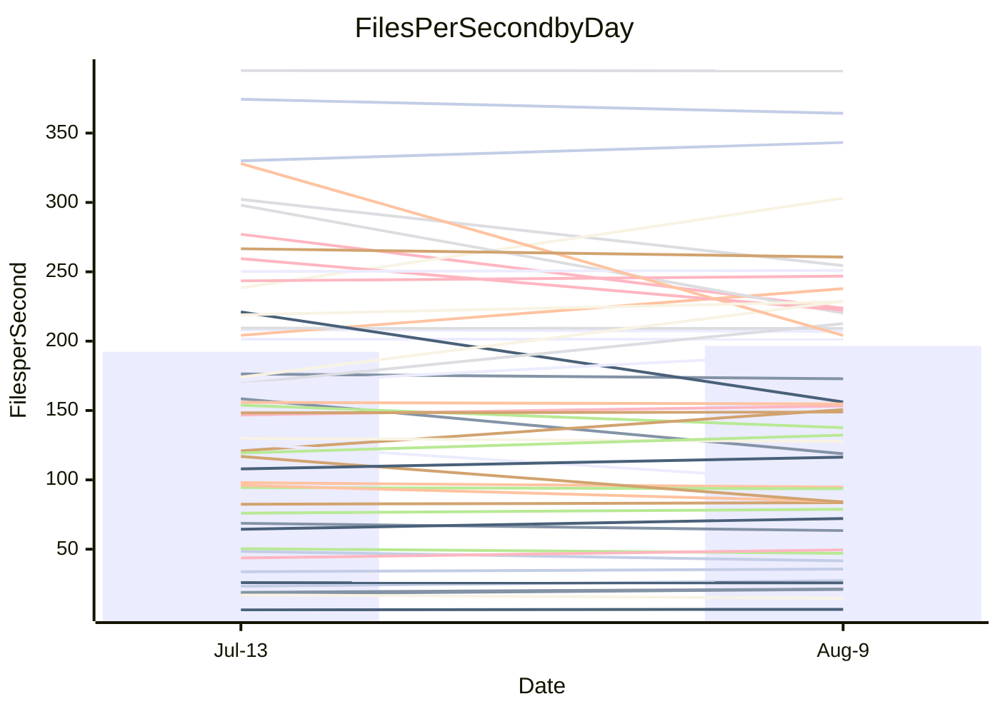

<!---
# This file is auto-generated. Do not edit.
# cspell:disable
--->
# Performance Report

Daily Performance

```mermaid
xychart-beta
    title Files Per Second by Day
    y-axis Files per Second
    x-axis Date [Jul-13, Aug-9]
    bar [192.31, 196.65]
    line [17.82, 21.01]
    line [97.93, 94.75]
    line [302.24, 254.45]
    line [94.47, 93.58]
    line [82.41, 83.53]
    line [48.47, 41.56]
    line [277.07, 223.75]
    line [6.29, 6.63]
    line [238.39, 303.07]
    line [208.19, 206.95]
    line [158.48, 118.82]
    line [204.20, 237.89]
    line [209.39, 209.12]
    line [153.81, 137.63]
    line [120.84, 150.63]
    line [23.34, 27.36]
    line [146.76, 153.33]
    line [25.88, 25.71]
    line [17.18, 14.62]
    line [201.45, 201.37]
    line [176.39, 172.90]
    line [96.02, 84.37]
    line [298.01, 220.18]
    line [76.00, 78.78]
    line [148.29, 148.87]
    line [374.43, 364.28]
    line [259.46, 222.33]
    line [221.06, 156.14]
    line [129.95, 127.66]
    line [126.09, 98.48]
    line [68.71, 63.42]
    line [155.87, 154.69]
    line [169.41, 212.61]
    line [50.42, 47.04]
    line [116.87, 83.93]
    line [330.04, 343.19]
    line [243.47, 246.86]
    line [64.41, 72.16]
    line [174.01, 228.69]
    line [250.26, 250.95]
    line [18.90, 21.33]
    line [328.06, 204.04]
    line [395.07, 394.87]
    line [119.39, 132.27]
    line [266.63, 260.68]
    line [33.78, 35.66]
    line [43.65, 49.52]
    line [107.84, 116.40]
    line [218.96, 228.46]
    line [169.05, 191.52]
```

Time to Process Files

| Repository                                      | Elapsed | Min/Avg/Max          |    SD | SD Graph                |
| ----------------------------------------------- | ------: | :------------------: | ----: | ----------------------- |
| AdaDoom3/AdaDoom3                    |    2.77 | 2.1 /   2.2 /   2.2  |  0.06 | `        ┣┻╋┻┫       ●` |
| alexiosc/megistos                    |    6.86 | 7.1 /   7.1 /   7.1  |  0.01 | `●        ┣╋┫         ` |
| apollographql/apollo-server          |    2.65 | 2.6 /   2.7 /   2.8  |  0.08 | `     ┣━┻━●╋━━┻━┫     ` |
| aspnetboilerplate/aspnetboilerplate  |    8.89 | 7.6 /   8.3 /   9.1  |  0.76 | `    ┣━━┻━━╋━●┻━━┫    ` |
| aws-amplify/docs                     |   13.47 | 10.7 /  12.1 /  13.6 |  1.47 | `    ┣━━┻━━╋━━●━━┫    ` |
| Azure/azure-rest-api-specs           |   10.32 | 7.2 /   8.8 /  10.4  |  1.65 | `    ┣━━┻━━╋━━●━━┫    ` |
| bitjson/typescript-starter           |    1.00 | 0.9 /   1.0 /   1.1  |  0.11 | `     ┣━┻━━●━━┻━┫     ` |
| caddyserver/caddy                    |    3.52 | 3.4 /   3.4 /   3.4  |  0.01 | `        ┣┻╋┻┫       ●` |
| canada-ca/open-source-logiciel-libre |    1.07 | 1.0 /   1.1 /   1.1  |  0.03 | `     ┣━━┻●╋━┻━━┫     ` |
| chef/chef                            |    5.32 | 4.7 /   4.8 /   5.0  |  0.12 | `     ┣━┻━━╋━━┻━┫    ●` |
| dart-lang/sdk                        |   57.31 | 57.0 /  57.5 /  58.0 |  0.49 | `   ┣━━━┻●━╋━━┻━━━┫   ` |
| django/django                        |   13.66 | 14.0 /  14.2 /  14.4 |  0.20 | `  ● ┣━━┻━━╋━━┻━━┫    ` |
| eslint/eslint                        |    7.91 | 9.8 /  10.0 /  10.2  |  0.20 | `●       ┣┻╋┻┫        ` |
| exonum/exonum                        |    3.44 | 2.7 /   3.2 /   3.7  |  0.50 | `    ┣━━┻━━╋━●┻━━┫    ` |
| flutter/samples                      |   13.40 | 11.0 /  11.2 /  11.4 |  0.19 | `        ┣┻╋┻┫       ●` |
| gitbucket/gitbucket                  |    2.47 | 3.2 /   3.3 /   3.5  |  0.14 | `●      ┣┻━╋━┻┫       ` |
| googleapis/google-cloud-cpp          |  103.11 | 96.9 / 111.3 / 125.8 | 14.47 | `  ┣━━━┻━●━╋━━━┻━━━┫  ` |
| graphql/express-graphql              |    0.85 | 1.1 /   1.1 /   1.1  |  0.02 | `●       ┣┻╋┻┫        ` |
| graphql/graphql-js                   |    3.65 | 3.5 /   3.6 /   3.7  |  0.11 | `     ┣━┻━━●━━┻━┫     ` |
| graphql/graphql-relay-js             |    1.07 | 1.1 /   1.1 /   1.1  |  0.01 | `     ●━━┻━╋━┻━━┫     ` |
| graphql/graphql-spec                 |    1.31 | 1.1 /   1.2 /   1.3  |  0.09 | `     ┣━┻━━╋━━●━┫     ` |
| iluwatar/java-design-patterns        |   12.13 | 11.8 /  11.9 /  12.0 |  0.09 | `    ┣━━┻━━╋━━┻━━●    ` |
| ktaranov/sqlserver-kit               |    6.09 | 5.1 /   5.3 /   5.5  |  0.22 | `    ┣━━┻━━╋━━┻━━┫   ●` |
| liriliri/licia                       |    3.96 | 3.8 /   3.9 /   3.9  |  0.05 | `     ┣━┻━━╋━━┻●┫     ` |
| MartinThoma/LaTeX-examples           |    6.00 | 4.7 /   5.8 /   6.9  |  1.06 | `    ┣━━┻━━╋●━┻━━┫    ` |
| mdx-js/mdx                           |    1.84 | 1.7 /   1.8 /   1.8  |  0.07 | `     ┣━┻━━╋━━●━┫     ` |
| microsoft/TypeScript-Website         |    4.99 | 5.2 /   5.2 /   5.3  |  0.07 | ` ●   ┣━┻━━╋━━┻━┫     ` |
| MicrosoftDocs/PowerShell-Docs        |   24.83 | 24.1 /  24.1 /  24.1 |  0.05 | `         ┣╋┫        ●` |
| neovim/nvim-lspconfig                |    5.48 | 3.9 /   4.8 /   5.6  |  0.86 | `    ┣━━┻━━╋━━●━━┫    ` |
| pagekit/pagekit                      |    3.35 | 2.9 /   3.1 /   3.3  |  0.23 | `    ┣━━┻━━╋━━●━━┫    ` |
| php/php-src                          |   23.79 | 18.3 /  21.5 /  24.6 |  3.15 | `   ┣━━━┻━━╋━━●━━━┫   ` |
| plasticrake/tplink-smarthome-api     |    1.33 | 1.2 /   1.3 /   1.3  |  0.04 | `     ┣━━┻━╋━┻━━●     ` |
| prettier/prettier                    |    7.85 | 7.7 /   7.8 /   8.0  |  0.14 | `    ┣━━┻━━╋●━┻━━┫    ` |
| pycontribs/jira                      |    1.40 | 1.1 /   1.2 /   1.2  |  0.01 | `         ┣┻┫        ●` |
| RustPython/RustPython                |    9.54 | 7.1 /   9.1 /  11.1  |  2.01 | `    ┣━━┻━━╋●━┻━━┫    ` |
| shoelace-style/shoelace              |    2.95 | 2.7 /   2.8 /   2.8  |  0.04 | `     ┣━━┻━╋━┻━━┫    ●` |
| slint-ui/slint                       |   15.29 | 14.0 /  14.5 /  14.9 |  0.45 | `    ┣━━┻━━╋━━┻━━●    ` |
| SoftwareBrothers/admin-bro           |    2.38 | 1.6 /   2.1 /   2.5  |  0.46 | `    ┣━━┻━━╋━●┻━━┫    ` |
| sveltejs/svelte                      |   22.56 | 22.5 /  22.6 /  22.7 |  0.09 | `    ┣━━┻●━╋━━┻━━┫    ` |
| TheAlgorithms/Python                 |    5.91 | 5.4 /   5.5 /   5.6  |  0.14 | `    ┣━━┻━━╋━━┻━━┫ ●  ` |
| twbs/bootstrap                       |    1.60 | 1.7 /   1.8 /   1.8  |  0.08 | `     ●━┻━━╋━━┻━┫     ` |
| typescript-cheatsheets/react         |    1.07 | 1.2 /   1.2 /   1.3  |  0.04 | ` ●   ┣━━┻━╋━┻━━┫     ` |
| typescript-eslint/typescript-eslint  |    3.86 | 4.0 /   4.4 /   4.7  |  0.33 | `    ┣━●┻━━╋━━┻━━┫    ` |
| vitest-dev/vitest                    |   10.37 | 10.2 /  10.5 /  10.7 |  0.25 | `    ┣━━┻━●╋━━┻━━┫    ` |
| w3c/aria-practices                   |    3.19 | 3.1 /   3.3 /   3.5  |  0.19 | `    ┣━━┻●━╋━━┻━━┫    ` |
| w3c/specberus                        |    1.80 | 1.5 /   1.7 /   1.8  |  0.16 | `     ┣━┻━━╋━●┻━┫     ` |
| webdeveric/webpack-assets-manifest   |    1.05 | 1.2 /   1.2 /   1.3  |  0.04 | `●    ┣━━┻━╋━┻━━┫     ` |
| webpack/webpack                      |    6.43 | 5.1 /   5.4 /   5.6  |  0.29 | `    ┣━━┻━━╋━━┻━━┫   ●` |
| wireapp/wire-desktop                 |    1.50 | 1.3 /   1.3 /   1.4  |  0.03 | `      ┣━┻━╋━┻━┫     ●` |
| wireapp/wire-webapp                  |   13.12 | 12.7 /  13.3 /  13.9 |  0.56 | `    ┣━━┻━●╋━━┻━━┫    ` |

Note:
- Elapsed time is in seconds.

Files per Second over Time

| Repository                                      | Files |    Sec |    Fps |     Rel | Trend Fps |    N |
| ----------------------------------------------- | ----: | -----: | -----: | ------: | --------- | ---: |
| AdaDoom3/AdaDoom3                    |   103 |   2.77 |  37.12 | -21.41% | `█▅ `     |    2 |
| alexiosc/megistos                    |   583 |   6.86 |  84.93 |   3.22% | `▆▆█`     |    2 |
| apollographql/apollo-server          |   256 |   2.65 |  96.66 |   1.34% | `█▅▇`     |    2 |
| aspnetboilerplate/aspnetboilerplate  |  2288 |   8.89 | 257.41 |  -7.03% | `█▃▄`     |    2 |
| aws-amplify/docs                     |  3030 |  13.47 | 224.92 |  -9.97% | `█▃▃`     |    2 |
| Azure/azure-rest-api-specs           |  2561 |  10.32 | 248.19 | -16.76% | `▂█▂`     |    2 |
| bitjson/typescript-starter           |    20 |   1.00 |  19.96 |   0.09% | `▃█▅`     |    2 |
| caddyserver/caddy                    |   325 |   3.52 |  92.40 |  -2.34% | `██▆`     |    2 |
| canada-ca/open-source-logiciel-libre |     7 |   1.07 |   6.54 |   0.61% | `▅█▇`     |    2 |
| chef/chef                            |  1034 |   5.32 | 194.32 |  -9.15% | `▅█▂`     |    2 |
| dart-lang/sdk                        | 11611 |  57.31 | 202.60 |   0.90% | `█▇█`     |    2 |
| django/django                        |  2930 |  13.66 | 214.52 |   3.85% | `▇▅█`     |    2 |
| eslint/eslint                        |  2080 |   7.91 | 263.11 |  26.23% | `▂▃█`     |    2 |
| exonum/exonum                        |   421 |   3.44 | 122.43 | -10.53% | `█▂▃`     |    2 |
| flutter/samples                      |  1696 |  13.40 | 126.58 | -16.31% | `█▆ `     |    2 |
| gitbucket/gitbucket                  |   418 |   2.47 | 169.53 |  34.25% | `▂▃█`     |    2 |
| googleapis/google-cloud-cpp          | 21238 | 103.11 | 205.97 |   5.99% | `▂█▇`     |    2 |
| graphql/express-graphql              |    26 |   0.85 |  30.60 |  28.93% | `▂▃█`     |    2 |
| graphql/graphql-js                   |   551 |   3.65 | 150.90 |  -0.23% | `▅█▇`     |    2 |
| graphql/graphql-relay-js             |    28 |   1.07 |  26.19 |   2.51% | `▇▆█`     |    2 |
| graphql/graphql-spec                 |    19 |   1.31 |  14.50 |  -9.09% | `█▃▃`     |    2 |
| iluwatar/java-design-patterns        |  2089 |  12.13 | 172.17 |  -1.62% | `█▇▇`     |    2 |
| ktaranov/sqlserver-kit               |   490 |   6.09 |  80.44 | -12.73% | `█▅▁`     |    2 |
| liriliri/licia                       |  1438 |   3.96 | 363.22 |  -1.80% | `█▇▆`     |    2 |
| MartinThoma/LaTeX-examples           |  1409 |   6.00 | 234.79 |  -6.75% | `█▂▄`     |    2 |
| mdx-js/mdx                           |   139 |   1.84 |  75.60 |  -4.28% | `▅█▅`     |    2 |
| microsoft/TypeScript-Website         |   765 |   4.99 | 153.20 |   4.64% | `▆▅█`     |    2 |
| MicrosoftDocs/PowerShell-Docs        |  3126 |  24.83 | 125.87 |  -2.96% | `██▆`     |    2 |
| neovim/nvim-lspconfig                |   867 |   5.48 | 158.16 | -15.68% | `█▂▂`     |    2 |
| pagekit/pagekit                      |   741 |   3.35 | 221.02 |  -8.50% | `█▃▃`     |    2 |
| php/php-src                          |  2383 |  23.79 | 100.17 | -10.12% | `█▂▃`     |    2 |
| plasticrake/tplink-smarthome-api     |    62 |   1.33 |  46.46 |  -5.22% | `█▅▄`     |    2 |
| prettier/prettier                    |  2664 |   7.85 | 339.35 |   0.24% | `▆█▇`     |    2 |
| pycontribs/jira                      |    80 |   1.40 |  57.10 | -17.53% | `▇█ `     |    2 |
| RustPython/RustPython                |   860 |   9.54 |  90.17 |  -7.31% | `█▂▄`     |    2 |
| shoelace-style/shoelace              |   440 |   2.95 | 149.10 |  -5.68% | `▆█▄`     |    2 |
| slint-ui/slint                       |  3726 |  15.29 | 243.70 |  -1.24% | `▇█▇`     |    2 |
| SoftwareBrothers/admin-bro           |   441 |   2.38 | 185.26 | -16.95% | `▂█▂`     |    2 |
| sveltejs/svelte                      |  8935 |  22.56 | 396.10 |   0.44% | `███`     |    2 |
| TheAlgorithms/Python                 |  1411 |   5.91 | 238.63 |  -7.06% | `▆█▃`     |    2 |
| twbs/bootstrap                       |   118 |   1.60 |  73.83 |   9.45% | `▄▇█`     |    2 |
| typescript-cheatsheets/react         |    24 |   1.07 |  22.34 |  13.93% | `▃▅█`     |    2 |
| typescript-eslint/typescript-eslint  |   865 |   3.86 | 223.81 | -12.63% | `█▁▃`     |    2 |
| vitest-dev/vitest                    |  2752 |  10.37 | 265.30 |   1.51% | `█▆█`     |    2 |
| w3c/aria-practices                   |   417 |   3.19 | 130.88 |   3.44% | `▄█▇`     |    2 |
| w3c/specberus                        |   190 |   1.80 | 105.41 | -10.38% | `▃█▃`     |    2 |
| webdeveric/webpack-assets-manifest   |    55 |   1.05 |  52.50 |  16.42% | `▃▅█`     |    2 |
| webpack/webpack                      |  1296 |   6.43 | 201.42 | -15.09% | `▃█▁`     |    2 |
| wireapp/wire-desktop                 |    51 |   1.50 |  33.90 |  -4.75% | `▄█▄`     |    2 |
| wireapp/wire-webapp                  |  2476 |  13.12 | 188.72 |   3.87% | `▄█▇`     |    2 |

Data Throughput

| Repository                                      | Files |    Sec |     Kps |     Rel | Trend Kps |    N |
| ----------------------------------------------- | ----: | -----: | ------: | ------: | --------- | ---: |
| AdaDoom3/AdaDoom3                    |   103 |   2.77 |  788.93 | -21.41% | `█▅ `     |    2 |
| alexiosc/megistos                    |   583 |   6.86 |  667.32 |   3.22% | `▆▆█`     |    2 |
| apollographql/apollo-server          |   256 |   2.65 |  795.96 |   1.16% | `█▅▇`     |    2 |
| aspnetboilerplate/aspnetboilerplate  |  2288 |   8.89 |  629.46 |  -7.01% | `█▃▄`     |    2 |
| aws-amplify/docs                     |  3030 |  13.47 |  877.57 |  -6.16% | `█▄▄`     |    2 |
| Azure/azure-rest-api-specs           |  2561 |  10.32 |  752.81 | -17.03% | `▂█▂`     |    2 |
| bitjson/typescript-starter           |    20 |   1.00 |   79.83 |   0.09% | `▃█▅`     |    2 |
| caddyserver/caddy                    |   325 |   3.52 |  843.87 |  -1.94% | `▇█▆`     |    2 |
| canada-ca/open-source-logiciel-libre |     7 |   1.07 |   54.21 |   0.61% | `▅█▇`     |    2 |
| chef/chef                            |  1034 |   5.32 |  954.13 |  -9.14% | `▅█▂`     |    2 |
| dart-lang/sdk                        | 11611 |  57.31 | 1397.48 |   1.41% | `▇▇█`     |    2 |
| django/django                        |  2930 |  13.66 | 1379.88 |   3.95% | `▇▅█`     |    2 |
| eslint/eslint                        |  2080 |   7.91 | 1846.94 |  26.66% | `▂▃█`     |    2 |
| exonum/exonum                        |   421 |   3.44 | 1171.10 | -10.53% | `█▂▃`     |    2 |
| flutter/samples                      |  1696 |  13.40 |  757.36 | -16.31% | `█▆ `     |    2 |
| gitbucket/gitbucket                  |   418 |   2.47 |  830.63 |  35.87% | `▂▄█`     |    2 |
| googleapis/google-cloud-cpp          | 21238 | 103.11 | 1787.64 |   6.14% | `▂█▇`     |    2 |
| graphql/express-graphql              |    26 |   0.85 |  140.04 |  28.93% | `▂▃█`     |    2 |
| graphql/graphql-js                   |   551 |   3.65 | 1125.35 |  -0.12% | `▅█▇`     |    2 |
| graphql/graphql-relay-js             |    28 |   1.07 |  102.91 |   2.51% | `▇▆█`     |    2 |
| graphql/graphql-spec                 |    19 |   1.31 |  485.51 |  -9.09% | `█▃▃`     |    2 |
| iluwatar/java-design-patterns        |  2089 |  12.13 |  530.60 |  -1.61% | `█▇▇`     |    2 |
| ktaranov/sqlserver-kit               |   490 |   6.09 | 1218.52 | -12.73% | `█▅▁`     |    2 |
| liriliri/licia                       |  1438 |   3.96 |  433.44 |  -1.80% | `█▇▆`     |    2 |
| MartinThoma/LaTeX-examples           |  1409 |   6.00 |  484.90 |  -6.75% | `█▂▄`     |    2 |
| mdx-js/mdx                           |   139 |   1.84 |  356.24 |  -3.86% | `▅█▅`     |    2 |
| microsoft/TypeScript-Website         |   765 |   4.99 | 1056.21 |   4.64% | `▆▅█`     |    2 |
| MicrosoftDocs/PowerShell-Docs        |  3126 |  24.83 | 1343.15 |  -2.91% | `██▆`     |    2 |
| neovim/nvim-lspconfig                |   867 |   5.48 |  464.82 | -15.50% | `█▂▂`     |    2 |
| pagekit/pagekit                      |   741 |   3.35 |  460.83 |  -8.50% | `█▃▃`     |    2 |
| php/php-src                          |  2383 |  23.79 | 1771.28 |  -9.76% | `█▂▃`     |    2 |
| plasticrake/tplink-smarthome-api     |    62 |   1.33 |  251.05 |  -5.22% | `█▅▄`     |    2 |
| prettier/prettier                    |  2664 |   7.85 |  482.28 |   0.19% | `▆█▇`     |    2 |
| pycontribs/jira                      |    80 |   1.40 |  403.23 | -17.53% | `▇█ `     |    2 |
| RustPython/RustPython                |   860 |   9.54 | 1978.80 |  -8.14% | `█▂▄`     |    2 |
| shoelace-style/shoelace              |   440 |   2.95 |  720.08 |  -5.68% | `▆█▄`     |    2 |
| slint-ui/slint                       |  3726 |  15.29 | 1306.64 |  -0.31% | `▆█▇`     |    2 |
| SoftwareBrothers/admin-bro           |   441 |   2.38 |  408.34 | -16.95% | `▂█▂`     |    2 |
| sveltejs/svelte                      |  8935 |  22.56 |  271.71 |   0.58% | `███`     |    2 |
| TheAlgorithms/Python                 |  1411 |   5.91 |  610.37 |  -7.04% | `▅█▃`     |    2 |
| twbs/bootstrap                       |   118 |   1.60 |  605.64 |   9.45% | `▄▇█`     |    2 |
| typescript-cheatsheets/react         |    24 |   1.07 |  201.96 |  13.93% | `▃▅█`     |    2 |
| typescript-eslint/typescript-eslint  |   865 |   3.86 |  752.66 | -37.71% | `█▁▂`     |    2 |
| vitest-dev/vitest                    |  2752 |  10.37 |  747.98 |   1.59% | `█▆█`     |    2 |
| w3c/aria-practices                   |   417 |   3.19 | 1230.98 |   3.45% | `▄█▇`     |    2 |
| w3c/specberus                        |   190 |   1.80 |  343.98 | -10.34% | `▃█▃`     |    2 |
| webdeveric/webpack-assets-manifest   |    55 |   1.05 |  121.22 |  16.86% | `▃▅█`     |    2 |
| webpack/webpack                      |  1296 |   6.43 | 1223.61 | -10.42% | `▂█▃`     |    2 |
| wireapp/wire-desktop                 |    51 |   1.50 |  144.25 |  -7.29% | `▆█▃`     |    2 |
| wireapp/wire-webapp                  |  2476 |  13.12 |  792.59 |   4.56% | `▃█▇`     |    2 |

