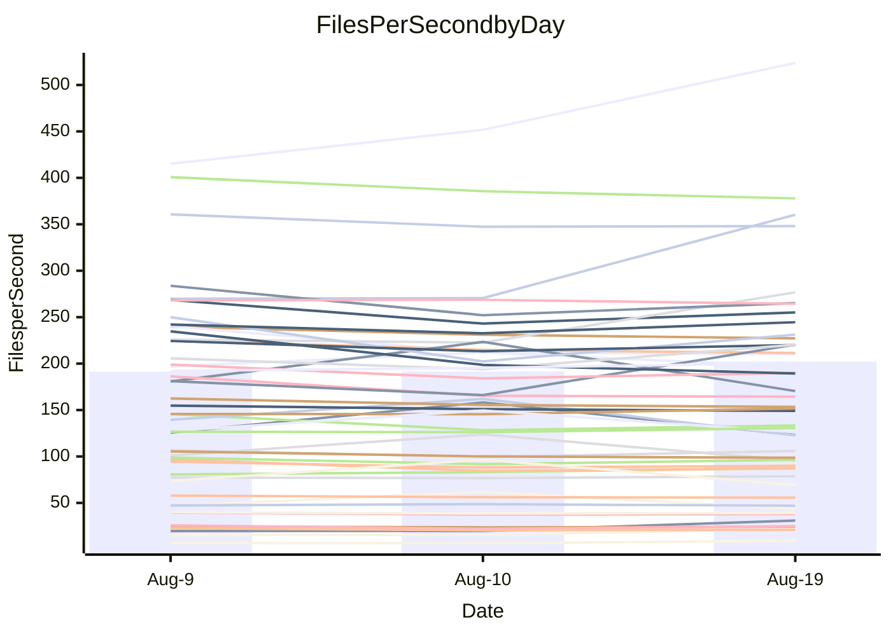

<!---
# This file is auto-generated. Do not edit.
# cspell:disable
--->
# Performance Report

Daily Performance

```mermaid
xychart-beta
    title Files Per Second by Day
    y-axis Files per Second
    x-axis Date [Aug-9, Aug-10, Aug-19]
    bar [191.27, 191.48, 202.17]
    line [19.76, 19.87, 30.93]
    line [94.45, 88.13, 89.83]
    line [106.66, 99.38, 105.91]
    line [80.61, 83.15, 87.40]
    line [239.79, 231.09, 227.14]
    line [269.81, 270.47, 360.24]
    line [39.52, 37.52, 37.92]
    line [268.54, 243.09, 255.05]
    line [6.78, 6.60, 9.24]
    line [240.17, 211.99, 210.14]
    line [125.68, 158.27, 123.28]
    line [225.24, 214.74, 211.44]
    line [225.91, 222.58, 276.73]
    line [145.75, 128.32, 133.46]
    line [24.65, 23.72, 24.39]
    line [139.45, 161.93, 122.79]
    line [25.95, 22.03, 24.99]
    line [154.75, 150.93, 149.10]
    line [15.80, 15.53, 21.79]
    line [196.97, 211.99, 196.83]
    line [180.75, 223.35, 170.46]
    line [96.93, 84.41, 87.10]
    line [77.16, 76.75, 78.74]
    line [400.74, 385.62, 377.93]
    line [145.79, 145.58, 151.63]
    line [249.96, 202.34, 231.21]
    line [186.27, 165.43, 164.33]
    line [224.37, 213.27, 220.07]
    line [47.00, 61.84, 43.58]
    line [127.47, 149.55, 126.13]
    line [181.18, 166.12, 220.45]
    line [57.90, 56.15, 55.63]
    line [101.07, 123.80, 95.52]
    line [98.84, 91.76, 96.31]
    line [162.48, 155.40, 153.35]
    line [360.76, 347.31, 348.02]
    line [198.91, 184.05, 190.03]
    line [242.10, 232.62, 244.56]
    line [73.60, 96.61, 69.36]
    line [415.14, 451.69, 523.79]
    line [283.77, 252.09, 265.24]
    line [22.84, 20.59, 21.08]
    line [205.56, 193.98, 220.30]
    line [126.64, 126.17, 130.66]
    line [105.46, 100.11, 98.55]
    line [47.26, 48.66, 46.99]
    line [268.09, 268.70, 264.40]
    line [234.76, 198.61, 189.31]
    line [39.98, 38.63, 39.17]
    line [192.03, 195.48, 200.49]
```

Time to Process Files

| Repository                                      | Elapsed | Min/Avg/Max          |    SD | SD Graph                |
| ----------------------------------------------- | ------: | :------------------: | ----: | ----------------------- |
| AdaDoom3/AdaDoom3                    |    2.72 | 2.2 /   2.7 /   2.9  |  0.26 | `    ┣━━┻━━╋●━┻━━┫    ` |
| alexiosc/megistos                    |    6.67 | 6.9 /   7.2 /   7.9  |  0.32 | `    ┣●━┻━━╋━━┻━━┫    ` |
| apollographql/apollo-server          |    2.42 | 2.0 /   2.4 /   2.8  |  0.25 | `    ┣━━┻━━●━━┻━━┫    ` |
| aspnetboilerplate/aspnetboilerplate  |    6.35 | 6.7 /   8.5 /   9.1  |  0.72 | ` ●  ┣━━┻━━╋━━┻━━┫    ` |
| aws-amplify/docs                     |   13.34 | 10.8 /  12.8 /  13.6 |  0.98 | `    ┣━━┻━━╋━●┻━━┫    ` |
| Azure/azure-rest-api-specs           |   10.04 | 7.2 /   9.8 /  11.2  |  1.19 | `    ┣━━┻━━╋●━┻━━┫    ` |
| bitjson/typescript-starter           |    0.65 | 0.9 /   1.0 /   1.1  |  0.06 | `●      ┣┻━╋━┻┫       ` |
| caddyserver/caddy                    |    3.71 | 2.8 /   3.5 /   3.9  |  0.33 | `    ┣━━┻━━╋━●┻━━┫    ` |
| canada-ca/open-source-logiciel-libre |    0.76 | 0.8 /   1.0 /   1.3  |  0.11 | `   ● ┣━┻━━╋━━┻━┫     ` |
| chef/chef                            |    4.92 | 3.0 /   4.5 /   5.3  |  0.74 | `    ┣━━┻━━╋━●┻━━┫    ` |
| dart-lang/sdk                        |   59.03 | 54.8 /  58.5 /  64.6 |  2.97 | `   ┣━━┻━━━╋●━━┻━━┫   ` |
| django/django                        |   10.59 | 10.2 /  13.2 /  14.6 |  1.46 | `   ┣●━━┻━━╋━━┻━━━┫   ` |
| eslint/eslint                        |    9.85 | 7.6 /   9.4 /  10.3  |  0.97 | `    ┣━━┻━━╋●━┻━━┫    ` |
| exonum/exonum                        |    3.41 | 2.7 /   3.3 /   3.7  |  0.28 | `    ┣━━┻━━╋●━┻━━┫    ` |
| flutter/samples                      |   12.76 | 8.0 /  12.1 /  13.4  |  1.67 | `   ┣━━━┻━━╋●━┻━━━┫   ` |
| gitbucket/gitbucket                  |    3.40 | 2.5 /   3.0 /   3.4  |  0.34 | `    ┣━━┻━━╋━━┻●━┫    ` |
| googleapis/google-cloud-cpp          |   96.34 | 96.9 / 119.7 / 127.8 | 11.58 | `  ●━━━┻━━━╋━━━┻━━━┫  ` |
| graphql/express-graphql              |    1.07 | 0.8 /   1.1 /   1.2  |  0.10 | `     ┣━┻━━●━━┻━┫     ` |
| graphql/graphql-js                   |    3.70 | 3.0 /   3.6 /   3.9  |  0.23 | `    ┣━━┻━━╋●━┻━━┫    ` |
| graphql/graphql-relay-js             |    1.12 | 0.9 /   1.1 /   1.3  |  0.09 | `     ┣━┻━━●━━┻━┫     ` |
| graphql/graphql-spec                 |    0.87 | 0.8 /   1.2 /   1.3  |  0.15 | `    ●┣━┻━━╋━━┻━┫     ` |
| iluwatar/java-design-patterns        |   12.81 | 8.8 /  11.4 /  12.8  |  1.43 | `    ┣━━┻━━╋━━●━━┫    ` |
| ktaranov/sqlserver-kit               |    5.63 | 3.3 /   5.4 /   6.2  |  0.95 | `    ┣━━┻━━╋●━┻━━┫    ` |
| liriliri/licia                       |    3.82 | 2.9 /   3.7 /   4.1  |  0.39 | `    ┣━━┻━━╋●━┻━━┫    ` |
| MartinThoma/LaTeX-examples           |    6.09 | 4.5 /   5.9 /   7.0  |  0.84 | `    ┣━━┻━━╋●━┻━━┫    ` |
| mdx-js/mdx                           |    1.77 | 1.7 /   1.8 /   1.9  |  0.07 | `     ┣━┻━●╋━━┻━┫     ` |
| microsoft/TypeScript-Website         |    5.05 | 5.0 /   5.3 /   5.6  |  0.19 | `    ┣━━●━━╋━━┻━━┫    ` |
| MicrosoftDocs/PowerShell-Docs        |   24.78 | 20.9 /  24.1 /  25.8 |  1.35 | `   ┣━━━┻━━╋━●┻━━━┫   ` |
| neovim/nvim-lspconfig                |    5.29 | 3.9 /   4.8 /   5.6  |  0.63 | `    ┣━━┻━━╋━●┻━━┫    ` |
| pagekit/pagekit                      |    3.37 | 2.7 /   3.3 /   3.6  |  0.25 | `    ┣━━┻━━●━━┻━━┫    ` |
| php/php-src                          |   25.01 | 19.2 /  23.2 /  25.3 |  2.24 | `   ┣━━━┻━━╋━━●━━━┫   ` |
| plasticrake/tplink-smarthome-api     |    1.42 | 1.0 /   1.3 /   1.4  |  0.12 | `     ┣━┻━━╋━━●━┫     ` |
| prettier/prettier                    |    7.72 | 5.9 /   7.5 /   8.0  |  0.64 | `    ┣━━┻━━╋●━┻━━┫    ` |
| pycontribs/jira                      |    1.44 | 1.1 /   1.4 /   1.5  |  0.10 | `     ┣━┻━━╋●━┻━┫     ` |
| RustPython/RustPython                |    9.07 | 6.6 /   9.0 /  11.1  |  1.32 | `    ┣━━┻━━●━━┻━━┫    ` |
| shoelace-style/shoelace              |    2.87 | 2.1 /   2.7 /   3.0  |  0.24 | `    ┣━━┻━━╋●━┻━━┫    ` |
| slint-ui/slint                       |   15.60 | 14.9 /  15.5 /  16.0 |  0.34 | `    ┣━━┻━━╋●━┻━━┫    ` |
| SoftwareBrothers/admin-bro           |    2.32 | 1.6 /   2.3 /   2.4  |  0.25 | `    ┣━━┻━━╋●━┻━━┫    ` |
| sveltejs/svelte                      |   17.09 | 16.9 /  21.5 /  22.9 |  1.96 | `  ●┣━━━┻━━╋━━┻━━━┫   ` |
| TheAlgorithms/Python                 |    5.32 | 3.0 /   5.3 /   5.9  |  0.87 | `    ┣━━┻━━●━━┻━━┫    ` |
| twbs/bootstrap                       |    1.70 | 1.2 /   1.6 /   1.9  |  0.22 | `     ┣━┻━━╋━●┻━┫     ` |
| typescript-cheatsheets/react         |    1.14 | 0.7 /   1.1 /   1.3  |  0.15 | `     ┣━┻━━╋●━┻━┫     ` |
| typescript-eslint/typescript-eslint  |    3.93 | 3.9 /   4.3 /   4.7  |  0.26 | `    ┣━●┻━━╋━━┻━━┫    ` |
| vitest-dev/vitest                    |   10.47 | 8.7 /  10.3 /  10.8  |  0.63 | `    ┣━━┻━━╋●━┻━━┫    ` |
| w3c/aria-practices                   |    3.19 | 3.1 /   3.3 /   3.5  |  0.14 | `     ┣━┻●━╋━━┻━┫     ` |
| w3c/specberus                        |    1.93 | 1.5 /   1.8 /   2.0  |  0.14 | `     ┣━┻━━╋━●┻━┫     ` |
| webdeveric/webpack-assets-manifest   |    1.17 | 1.0 /   1.2 /   1.3  |  0.07 | `     ┣━┻━━●━━┻━┫     ` |
| webpack/webpack                      |    6.97 | 3.7 /   5.8 /   6.7  |  0.99 | `    ┣━━┻━━╋━━┻●━┫    ` |
| wireapp/wire-desktop                 |    1.30 | 1.1 /   1.3 /   1.5  |  0.15 | `     ┣━┻━━●━━┻━┫     ` |
| wireapp/wire-webapp                  |   12.60 | 12.5 /  12.9 /  13.4 |  0.30 | `    ┣━━●━━╋━━┻━━┫    ` |

Note:
- Elapsed time is in seconds.

Files per Second over Time

| Repository                                      | Files |   Sec |    Fps |     Rel | Trend Fps   |    N |
| ----------------------------------------------- | ----: | ----: | -----: | ------: | ----------- | ---: |
| AdaDoom3/AdaDoom3                    |   103 |  2.72 |  37.92 |  -3.44% | `█▃▄█▂▂▃▃▄` |    8 |
| alexiosc/megistos                    |   583 |  6.67 |  87.40 |   8.00% | `▆▇▅▅▆▃▇▇█` |    8 |
| apollographql/apollo-server          |   256 |  2.42 | 105.91 |   0.15% | `▂▃▄▃▄█▇▃▄` |    8 |
| aspnetboilerplate/aspnetboilerplate  |  2288 |  6.35 | 360.24 |  33.47% | `▂▂▂▃▃▂▇▃█` |    8 |
| aws-amplify/docs                     |  3030 | 13.34 | 227.14 |  -4.84% | `▃▃▄▃▃█▇▃▃` |    8 |
| Azure/azure-rest-api-specs           |  2561 | 10.04 | 255.05 |  -3.88% | `█▃▅▃▃▂▃▂▃` |    8 |
| bitjson/typescript-starter           |    20 |  0.65 |  30.93 |  56.44% | `▄▃▃▂▂▁▂▂█` |    8 |
| caddyserver/caddy                    |   333 |  3.71 |  89.83 |  -4.09% | `▄▄▃▂█▅▂▃▃` |    8 |
| canada-ca/open-source-logiciel-libre |     7 |  0.76 |   9.24 |  36.67% | `▄▃▄▃▇▁▄▃█` |    8 |
| chef/chef                            |  1034 |  4.92 | 210.14 | -11.20% | `▃▁▆▂▂▂█▂▂` |    8 |
| dart-lang/sdk                        | 11618 | 59.03 | 196.83 |  -1.02% | `▆▇▇▃▅▇▆█▆` |    8 |
| django/django                        |  2931 | 10.59 | 276.73 |  22.73% | `▂▃▂▂▆▃█▃▇` |    8 |
| eslint/eslint                        |  2082 |  9.85 | 211.44 |  -5.58% | `▃▇█▂▃▂▃▃▃` |    8 |
| exonum/exonum                        |   421 |  3.41 | 123.28 |  -4.99% | `▂▃▃▅▄▄▄█▃` |    8 |
| flutter/samples                      |  1703 | 12.76 | 133.46 |  -7.04% | `▃▁▂▂█▂▂▂▂` |    8 |
| gitbucket/gitbucket                  |   418 |  3.40 | 122.79 | -13.69% | `▃█▃▂▂▇▃▇▂` |    8 |
| googleapis/google-cloud-cpp          | 21238 | 96.34 | 220.45 |  22.95% | `█▇▂▂▃▃▃▂█` |    8 |
| graphql/express-graphql              |    26 |  1.07 |  24.39 |  -0.58% | `▄█▂▄▃▃▄▃▄` |    8 |
| graphql/graphql-js                   |   551 |  3.70 | 149.10 |  -3.35% | `▄▄▄▃▃█▄▄▃` |    8 |
| graphql/graphql-relay-js             |    28 |  1.12 |  24.99 |  -1.87% | `▅▅▅▅▅█▄▂▄` |    8 |
| graphql/graphql-spec                 |    19 |  0.87 |  21.79 |  38.22% | `▂▂▂█▂▂▂▃▇` |    8 |
| iluwatar/java-design-patterns        |  2183 | 12.81 | 170.46 |  -8.39% | `▃▃▂▃▂▄█▇▂` |    8 |
| ktaranov/sqlserver-kit               |   490 |  5.63 |  87.10 |  -8.67% | `▂▁▂█▁▅▂▂▂` |    8 |
| liriliri/licia                       |  1442 |  3.82 | 377.93 |  -5.25% | `▃▂▃▂█▇▄▃▃` |    8 |
| MartinThoma/LaTeX-examples           |  1409 |  6.09 | 231.21 |  -5.24% | `▂▄█▄▇▃▃▂▃` |    8 |
| mdx-js/mdx                           |   139 |  1.77 |  78.74 |   2.12% | `█▅▄▇▅▇▅▆▇` |    8 |
| microsoft/TypeScript-Website         |   765 |  5.05 | 151.63 |   4.02% | `▆█▇▅▄▆▇▆█` |    8 |
| MicrosoftDocs/PowerShell-Docs        |  3126 | 24.78 | 126.13 |  -3.15% | `▄▄▄▃▄▄▅█▄` |    8 |
| neovim/nvim-lspconfig                |   869 |  5.29 | 164.33 | -10.53% | `▂▂▆█▇▃▅▃▃` |    8 |
| pagekit/pagekit                      |   741 |  3.37 | 220.07 |  -1.31% | `▄▄▃▄▂█▃▃▃` |    8 |
| php/php-src                          |  2389 | 25.01 |  95.52 |  -8.08% | `▃▄▂▃▃█▄█▃` |    8 |
| plasticrake/tplink-smarthome-api     |    62 |  1.42 |  43.58 | -10.80% | `▃▃▄▃▃▂▄█▂` |    8 |
| prettier/prettier                    |  2685 |  7.72 | 348.02 |  -3.08% | `▃▂▃█▃▂▃▃▃` |    8 |
| pycontribs/jira                      |    80 |  1.44 |  55.63 |  -3.54% | `█▃▃▃▃▃▄▃▃` |    8 |
| RustPython/RustPython                |   874 |  9.07 |  96.31 |  -1.68% | `▁▃▃▃▃█▇▃▄` |    8 |
| shoelace-style/shoelace              |   440 |  2.87 | 153.35 |  -5.10% | `▃▂▃▃█▃▂▃▃` |    8 |
| slint-ui/slint                       |  3815 | 15.60 | 244.56 |   1.52% | `█▇▆▅▇▇▆▅▇` |    8 |
| SoftwareBrothers/admin-bro           |   441 |  2.32 | 190.03 |  -3.56% | `█▂▂▂▂▂▂▂▂` |    8 |
| sveltejs/svelte                      |  8954 | 17.09 | 523.79 |  24.80% | `▂▂▂▂▃▃█▅█` |    8 |
| TheAlgorithms/Python                 |  1411 |  5.32 | 265.24 |  -5.21% | `▂▁▁▂▂█▂▂▂` |    8 |
| twbs/bootstrap                       |   118 |  1.70 |  69.36 |  -9.31% | `▃▄▂▆▃▂▆█▃` |    8 |
| typescript-cheatsheets/react         |    24 |  1.14 |  21.08 |  -6.57% | `▂▃█▁▃▂▃▂▂` |    8 |
| typescript-eslint/typescript-eslint  |   866 |  3.93 | 220.30 |   7.93% | `▃█▄▅▆▇▇▄█` |    8 |
| vitest-dev/vitest                    |  2769 | 10.47 | 264.40 |  -1.41% | `▃▄▃▄▃▃█▄▄` |    8 |
| w3c/aria-practices                   |   417 |  3.19 | 130.66 |   3.22% | `█▇▄▆▄▇▇▆▇` |    8 |
| w3c/specberus                        |   190 |  1.93 |  98.55 |  -5.96% | `█▄▃▄▃▂▄▃▃` |    8 |
| webdeveric/webpack-assets-manifest   |    55 |  1.17 |  46.99 |  -0.94% | `▅█▄▅▃▄▇▆▅` |    8 |
| webpack/webpack                      |  1319 |  6.97 | 189.31 | -17.78% | `▄▂▃▁▂█▂▂▁` |    8 |
| wireapp/wire-desktop                 |    51 |  1.30 |  39.17 |  -1.61% | `▃▂█▄▄▃█▄▄` |    8 |
| wireapp/wire-webapp                  |  2526 | 12.60 | 200.49 |   4.17% | `▇▅▆▆▅█▇▇█` |    8 |

Data Throughput

| Repository                                      | Files |   Sec |     Kps |     Rel | Trend Kps   |    N |
| ----------------------------------------------- | ----: | ----: | ------: | ------: | ----------- | ---: |
| AdaDoom3/AdaDoom3                    |   103 |  2.72 |  805.98 |  -3.44% | `█▃▄█▂▂▃▃▄` |    8 |
| alexiosc/megistos                    |   583 |  6.67 |  686.75 |   8.00% | `▆▇▅▅▆▃▇▇█` |    8 |
| apollographql/apollo-server          |   256 |  2.42 |  872.07 |   0.15% | `▂▃▄▃▄█▇▃▄` |    8 |
| aspnetboilerplate/aspnetboilerplate  |  2288 |  6.35 |  880.92 |  33.47% | `▂▂▂▃▃▂▇▃█` |    8 |
| aws-amplify/docs                     |  3030 | 13.34 |  887.96 |  -4.66% | `▃▃▄▃▃█▇▃▃` |    8 |
| Azure/azure-rest-api-specs           |  2561 | 10.04 |  781.39 |  -2.92% | `█▃▅▃▃▂▃▂▃` |    8 |
| bitjson/typescript-starter           |    20 |  0.65 |  123.71 |  56.44% | `▄▃▃▂▂▁▂▂█` |    8 |
| caddyserver/caddy                    |   333 |  3.71 |  818.47 |  -4.31% | `▄▄▃▂█▅▂▃▃` |    8 |
| canada-ca/open-source-logiciel-libre |     7 |  0.76 |   76.53 |  36.67% | `▄▃▄▃▇▁▄▃█` |    8 |
| chef/chef                            |  1034 |  4.92 | 1031.80 | -11.20% | `▃▁▆▂▂▂█▂▂` |    8 |
| dart-lang/sdk                        | 11618 | 59.03 | 1366.99 |  -0.33% | `▆▇▇▃▅▇▆█▆` |    8 |
| django/django                        |  2931 | 10.59 | 1784.85 |  23.05% | `▂▃▂▂▆▃█▃▇` |    8 |
| eslint/eslint                        |  2082 |  9.85 | 1484.38 |  -5.57% | `▃▇█▂▃▂▃▃▃` |    8 |
| exonum/exonum                        |   421 |  3.41 | 1179.23 |  -4.99% | `▂▃▃▅▄▄▄█▃` |    8 |
| flutter/samples                      |  1703 | 12.76 |  795.53 |  -7.39% | `▃▁▂▂█▂▂▂▂` |    8 |
| gitbucket/gitbucket                  |   418 |  3.40 |  607.49 | -12.84% | `▃█▃▂▂▇▃▇▂` |    8 |
| googleapis/google-cloud-cpp          | 21238 | 96.34 | 1915.20 |  23.07% | `█▇▂▂▃▃▃▂█` |    8 |
| graphql/express-graphql              |    26 |  1.07 |  111.63 |  -0.58% | `▄█▂▄▃▃▄▃▄` |    8 |
| graphql/graphql-js                   |   551 |  3.70 | 1111.92 |  -3.35% | `▄▄▄▃▃█▄▄▃` |    8 |
| graphql/graphql-relay-js             |    28 |  1.12 |   98.16 |  -1.87% | `▅▅▅▅▅█▄▂▄` |    8 |
| graphql/graphql-spec                 |    19 |  0.87 |  729.38 |  38.22% | `▂▂▂█▂▂▂▃▇` |    8 |
| iluwatar/java-design-patterns        |  2183 | 12.81 |  526.59 |  -8.17% | `▃▃▂▃▂▄█▇▃` |    8 |
| ktaranov/sqlserver-kit               |   490 |  5.63 | 1319.44 |  -8.67% | `▂▁▂█▁▅▂▂▂` |    8 |
| liriliri/licia                       |  1442 |  3.82 |  453.15 |  -4.79% | `▃▂▃▂█▇▄▃▃` |    8 |
| MartinThoma/LaTeX-examples           |  1409 |  6.09 |  477.51 |  -5.24% | `▂▄█▄▇▃▃▂▃` |    8 |
| mdx-js/mdx                           |   139 |  1.77 |  371.05 |   2.12% | `█▅▄▇▅▇▅▆▇` |    8 |
| microsoft/TypeScript-Website         |   765 |  5.05 | 1045.53 |   4.04% | `▆█▇▅▄▆▇▆█` |    8 |
| MicrosoftDocs/PowerShell-Docs        |  3126 | 24.78 | 1347.07 |  -3.06% | `▄▄▄▃▄▄▅█▄` |    8 |
| neovim/nvim-lspconfig                |   869 |  5.29 |  482.01 | -10.70% | `▂▂▆█▇▃▅▃▃` |    8 |
| pagekit/pagekit                      |   741 |  3.37 |  458.84 |  -1.31% | `▄▄▃▄▂█▃▃▃` |    8 |
| php/php-src                          |  2389 | 25.01 | 1689.91 |  -8.03% | `▃▄▂▃▃█▄█▃` |    8 |
| plasticrake/tplink-smarthome-api     |    62 |  1.42 |  235.49 | -10.80% | `▃▃▄▃▃▂▄█▂` |    8 |
| prettier/prettier                    |  2685 |  7.72 |  491.89 |  -3.61% | `▃▂▃█▃▂▃▃▃` |    8 |
| pycontribs/jira                      |    80 |  1.44 |  392.91 |  -3.54% | `█▃▃▃▃▃▄▃▃` |    8 |
| RustPython/RustPython                |   874 |  9.07 | 2120.79 |  -1.34% | `▁▃▃▃▃█▇▃▄` |    8 |
| shoelace-style/shoelace              |   440 |  2.87 |  740.60 |  -5.10% | `▃▂▃▃█▃▂▃▃` |    8 |
| slint-ui/slint                       |  3815 | 15.60 | 1315.82 |   1.87% | `█▇▆▅▇▇▆▅▇` |    8 |
| SoftwareBrothers/admin-bro           |   441 |  2.32 |  418.85 |  -3.56% | `█▂▂▂▂▂▂▂▂` |    8 |
| sveltejs/svelte                      |  8954 | 17.09 |  359.70 |  24.94% | `▂▂▂▂▃▃█▅█` |    8 |
| TheAlgorithms/Python                 |  1411 |  5.32 |  678.41 |  -5.21% | `▂▁▁▂▂█▂▂▂` |    8 |
| twbs/bootstrap                       |   118 |  1.70 |  568.95 |  -9.31% | `▃▄▂▆▃▂▆█▃` |    8 |
| typescript-cheatsheets/react         |    24 |  1.14 |  190.58 |  -6.57% | `▂▃█▁▃▂▃▂▂` |    8 |
| typescript-eslint/typescript-eslint  |   866 |  3.93 |  740.26 |   7.84% | `▃█▄▅▆▇▇▄█` |    8 |
| vitest-dev/vitest                    |  2769 | 10.47 |  764.16 |   1.07% | `▃▄▃▄▃▃█▄▄` |    8 |
| w3c/aria-practices                   |   417 |  3.19 | 1228.92 |   3.22% | `█▇▄▆▄▇▇▆▇` |    8 |
| w3c/specberus                        |   190 |  1.93 |  322.09 |  -5.81% | `█▄▃▄▃▂▄▃▃` |    8 |
| webdeveric/webpack-assets-manifest   |    55 |  1.17 |  108.51 |  -0.94% | `▅█▄▅▃▄▇▆▅` |    8 |
| webpack/webpack                      |  1319 |  6.97 | 1292.90 |  -7.56% | `▄▂▃▁▂█▂▂▂` |    8 |
| wireapp/wire-desktop                 |    51 |  1.30 |  166.68 |  -1.61% | `▃▂█▄▄▃█▄▄` |    8 |
| wireapp/wire-webapp                  |  2526 | 12.60 |  846.24 |   4.69% | `▇▅▅▆▅▇▇▇█` |    8 |

