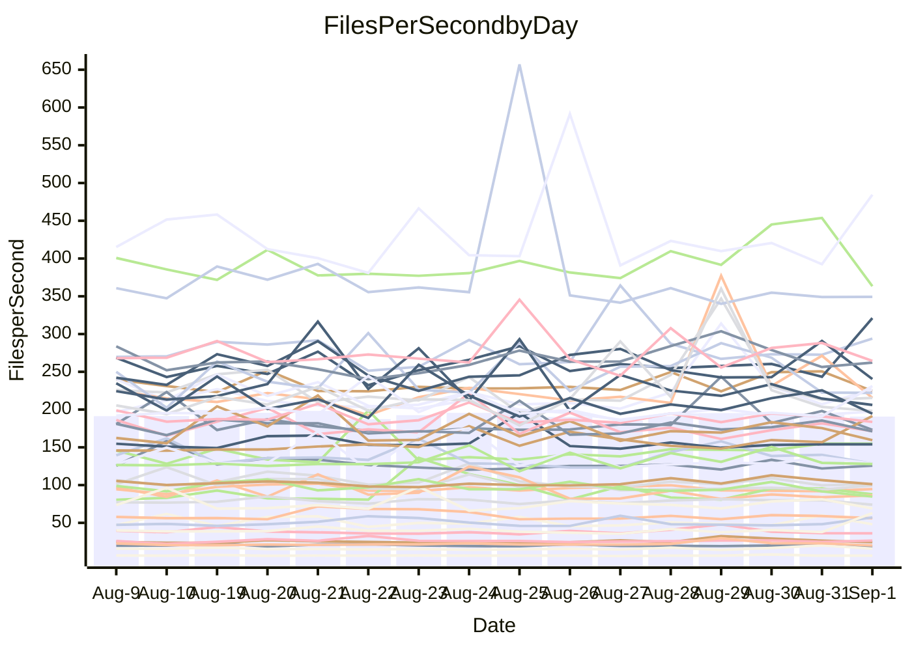

<!---
# This file is auto-generated. Do not edit.
# cspell:disable
--->
# Performance Report

Daily Performance

```mermaid
xychart-beta
    title Files Per Second by Day
    y-axis Files per Second
    x-axis Date [Aug-9, Aug-10, Aug-19, Aug-20, Aug-21, Aug-22, Aug-23, Aug-24, Aug-25, Aug-26, Aug-27, Aug-28, Aug-29, Aug-30, Aug-31, Sep-1]
    bar [191.27, 191.48, 199.45, 195.67, 198.22, 187.40, 192.61, 195.61, 200.69, 190.24, 185.15, 191.23, 195.37, 191.39, 193.00, 190.75]
    line [19.76, 19.87, 23.15, 18.80, 21.30, 21.70, 20.11, 19.24, 18.97, 21.74, 19.44, 19.50, 19.20, 19.98, 20.35, 18.20]
    line [94.45, 88.13, 97.66, 100.71, 101.93, 92.80, 92.11, 97.07, 92.83, 96.14, 97.78, 99.79, 92.99, 92.61, 91.86, 94.75]
    line [106.66, 99.38, 103.80, 117.71, 112.47, 100.50, 103.30, 128.71, 104.89, 98.28, 96.78, 104.60, 101.13, 109.23, 99.73, 101.36]
    line [80.61, 83.15, 92.81, 82.44, 81.86, 80.75, 136.22, 114.72, 99.92, 81.00, 98.60, 83.62, 80.81, 95.31, 95.53, 87.87]
    line [239.79, 231.09, 223.10, 252.00, 224.60, 224.17, 230.06, 227.93, 228.22, 229.99, 225.97, 249.68, 224.12, 249.45, 250.62, 224.68]
    line [269.81, 270.47, 289.77, 286.14, 291.59, 251.52, 256.69, 292.19, 260.02, 262.94, 364.38, 287.21, 267.07, 273.26, 272.63, 293.89]
    line [39.52, 37.52, 44.46, 38.46, 37.42, 35.96, 35.65, 37.61, 34.82, 39.47, 36.12, 40.86, 48.01, 38.35, 36.34, 36.12]
    line [268.54, 243.09, 257.77, 247.18, 276.72, 232.23, 252.08, 266.01, 283.94, 251.01, 260.27, 254.92, 257.60, 260.42, 243.47, 321.12]
    line [6.78, 6.60, 7.51, 6.38, 6.72, 6.55, 6.77, 6.55, 6.58, 6.64, 6.06, 6.53, 6.57, 8.03, 6.52, 6.59]
    line [240.17, 211.99, 227.00, 211.38, 205.51, 203.10, 206.43, 223.33, 206.89, 208.72, 201.20, 222.72, 313.85, 230.65, 207.01, 226.55]
    line [125.68, 158.27, 127.25, 135.61, 133.76, 126.70, 123.28, 120.42, 121.90, 125.42, 125.26, 127.33, 120.64, 133.49, 122.01, 125.69]
    line [225.24, 214.74, 210.02, 221.88, 213.58, 192.56, 216.27, 228.68, 220.47, 211.98, 216.89, 208.83, 377.28, 231.14, 271.29, 215.41]
    line [225.91, 222.58, 246.74, 252.74, 209.47, 217.12, 212.13, 242.98, 195.81, 213.43, 211.78, 245.83, 346.89, 231.16, 212.83, 215.37]
    line [145.75, 128.32, 148.05, 133.76, 130.09, 198.58, 132.66, 136.89, 133.84, 140.74, 138.14, 147.54, 146.55, 146.02, 154.94, 154.92]
    line [24.65, 23.72, 23.68, 26.94, 25.51, 24.79, 23.76, 23.53, 22.75, 24.32, 26.78, 24.44, 32.43, 29.19, 26.35, 24.36]
    line [139.45, 161.93, 128.87, 135.71, 136.66, 133.36, 161.38, 128.87, 127.62, 123.35, 123.11, 143.71, 157.94, 138.50, 140.06, 128.47]
    line [25.95, 22.03, 24.86, 28.29, 26.21, 32.71, 26.20, 26.09, 26.00, 24.43, 25.37, 25.72, 26.51, 26.59, 24.79, 26.51]
    line [154.75, 150.93, 149.02, 164.86, 165.64, 153.35, 152.64, 155.02, 195.52, 151.70, 148.17, 156.31, 149.39, 153.11, 153.94, 154.04]
    line [15.80, 15.53, 17.25, 15.28, 15.49, 14.84, 15.46, 14.39, 15.01, 15.63, 14.69, 17.08, 14.10, 16.71, 20.24, 15.82]
    line [196.97, 211.99, 246.59, 218.10, 236.31, 204.94, 201.38, 212.81, 200.01, 195.34, 186.50, 194.59, 201.00, 192.78, 193.23, 197.26]
    line [180.75, 223.35, 172.94, 187.16, 177.68, 172.01, 170.49, 175.09, 173.22, 173.59, 180.48, 179.74, 243.56, 182.28, 198.12, 173.20]
    line [96.93, 84.41, 106.12, 84.61, 114.12, 87.31, 89.99, 124.55, 110.24, 81.92, 82.24, 92.49, 81.67, 87.59, 83.98, 86.34]
    line [77.16, 76.75, 77.91, 84.91, 78.76, 75.34, 81.46, 80.77, 74.97, 79.78, 75.90, 79.64, 81.40, 79.85, 79.89, 74.06]
    line [400.74, 385.62, 371.65, 411.46, 377.61, 379.88, 377.18, 380.64, 396.91, 381.52, 374.08, 409.79, 391.59, 445.01, 453.72, 363.41]
    line [145.79, 145.58, 147.10, 147.08, 151.07, 153.94, 150.27, 178.09, 152.08, 170.66, 160.71, 152.01, 148.28, 159.68, 156.83, 191.47]
    line [249.96, 202.34, 263.67, 236.99, 228.06, 301.20, 226.40, 222.40, 289.06, 224.56, 256.87, 257.70, 287.97, 268.68, 222.58, 222.07]
    line [186.27, 165.43, 184.07, 202.12, 167.51, 173.85, 169.85, 221.75, 167.75, 195.90, 170.00, 175.89, 161.05, 172.78, 181.80, 171.34]
    line [224.37, 213.27, 217.89, 233.79, 316.48, 227.32, 281.23, 212.31, 293.11, 198.49, 245.94, 225.24, 218.17, 233.60, 214.50, 206.09]
    line [47.00, 61.84, 45.89, 57.63, 58.67, 44.77, 49.92, 49.06, 57.90, 45.60, 46.71, 50.51, 48.37, 46.85, 59.90, 48.04]
    line [127.47, 149.55, 129.16, 129.10, 170.99, 119.13, 167.47, 175.06, 125.57, 143.51, 123.67, 127.21, 130.16, 128.18, 136.84, 128.57]
    line [181.18, 166.12, 186.93, 181.85, 181.88, 168.34, 171.35, 169.12, 211.70, 166.64, 168.34, 182.86, 173.63, 176.66, 185.43, 171.13]
    line [57.90, 56.15, 56.35, 54.76, 71.89, 68.47, 68.09, 64.39, 54.76, 55.64, 55.71, 59.28, 54.85, 60.20, 59.04, 56.12]
    line [101.07, 123.80, 99.87, 108.06, 107.98, 95.34, 94.96, 114.12, 97.84, 103.09, 93.25, 94.27, 95.28, 96.54, 94.13, 99.46]
    line [98.84, 91.76, 103.43, 107.49, 93.08, 97.11, 107.90, 94.53, 94.47, 104.38, 94.67, 92.38, 93.95, 104.17, 91.62, 84.72]
    line [162.48, 155.40, 204.32, 177.59, 218.64, 159.00, 159.79, 194.26, 164.45, 184.75, 158.60, 171.47, 169.60, 183.25, 175.44, 159.48]
    line [360.76, 347.31, 389.41, 371.89, 392.82, 355.53, 361.83, 355.43, 657.12, 351.25, 341.51, 360.76, 340.11, 354.77, 349.07, 349.21]
    line [198.91, 184.05, 187.41, 186.67, 207.48, 180.49, 185.92, 209.38, 182.67, 186.49, 182.43, 194.97, 183.27, 194.85, 191.03, 183.63]
    line [242.10, 232.62, 273.32, 257.69, 290.62, 245.10, 224.83, 243.49, 245.36, 272.30, 280.33, 252.18, 242.64, 242.97, 290.78, 240.40]
    line [73.60, 96.61, 68.89, 69.48, 73.38, 68.77, 97.84, 66.15, 69.59, 78.77, 75.57, 73.80, 69.15, 78.35, 81.24, 69.03]
    line [415.14, 451.69, 458.22, 412.53, 400.53, 380.98, 466.37, 404.40, 403.18, 591.49, 390.96, 423.25, 409.89, 420.57, 392.45, 484.50]
    line [283.77, 252.09, 262.36, 263.68, 253.37, 240.18, 248.22, 259.20, 278.18, 263.50, 263.68, 284.05, 303.63, 278.91, 256.34, 262.12]
    line [22.84, 20.59, 20.47, 21.22, 20.90, 21.42, 21.40, 22.88, 21.36, 21.22, 21.19, 22.04, 29.75, 23.02, 22.87, 20.05]
    line [205.56, 193.98, 216.67, 206.61, 230.20, 198.53, 213.69, 212.64, 179.07, 214.07, 290.22, 216.81, 359.94, 225.73, 203.55, 198.31]
    line [126.64, 126.17, 128.45, 125.27, 127.94, 127.77, 130.20, 152.67, 118.34, 143.02, 122.15, 142.33, 130.77, 150.54, 129.50, 127.85]
    line [105.46, 100.11, 102.43, 104.89, 103.21, 98.21, 97.36, 101.78, 100.00, 99.58, 101.28, 109.08, 102.06, 113.06, 106.63, 101.22]
    line [47.26, 48.66, 46.00, 48.26, 51.42, 58.83, 56.30, 50.38, 45.97, 45.91, 59.43, 48.16, 47.53, 46.75, 48.25, 57.12]
    line [268.09, 268.70, 290.78, 262.94, 266.60, 272.93, 267.45, 262.37, 345.57, 266.69, 244.68, 307.76, 255.74, 281.64, 288.18, 264.41]
    line [234.76, 198.61, 243.75, 200.90, 213.71, 188.91, 259.37, 218.53, 190.79, 215.33, 194.36, 206.72, 199.24, 215.14, 225.49, 194.47]
    line [39.98, 38.63, 38.64, 39.11, 45.24, 39.50, 39.66, 42.07, 38.23, 36.94, 35.58, 41.81, 37.53, 40.57, 37.73, 62.90]
    line [192.03, 195.48, 194.87, 202.54, 193.62, 244.63, 196.70, 223.56, 194.58, 199.46, 185.25, 194.89, 191.72, 195.81, 191.06, 231.16]
```

Time to Process Files

| Repository                                      | Elapsed | Min/Avg/Max          |    SD | SD Graph                |
| ----------------------------------------------- | ------: | :------------------: | ----: | ----------------------- |
| AdaDoom3/AdaDoom3                    |    2.85 | 2.1 /   2.7 /   3.0  |  0.27 | `    ┣━━┻━━╋━●┻━━┫    ` |
| alexiosc/megistos                    |    6.63 | 4.1 /   6.7 /   7.9  |  0.89 | `    ┣━━┻━━●━━┻━━┫    ` |
| apollographql/apollo-server          |    2.53 | 1.8 /   2.4 /   2.8  |  0.25 | `    ┣━━┻━━╋●━┻━━┫    ` |
| aspnetboilerplate/aspnetboilerplate  |    7.79 | 4.9 /   8.3 /   9.3  |  1.04 | `    ┣━━┻●━╋━━┻━━┫    ` |
| aws-amplify/docs                     |   13.49 | 8.6 /  12.8 /  14.3  |  1.27 | `    ┣━━┻━━╋━●┻━━┫    ` |
| Azure/azure-rest-api-specs           |    8.03 | 7.2 /  10.0 /  11.2  |  0.76 | `  ● ┣━━┻━━╋━━┻━━┫    ` |
| bitjson/typescript-starter           |    1.10 | 0.6 /   1.0 /   1.1  |  0.09 | `     ┣━┻━━╋━━●━┫     ` |
| caddyserver/caddy                    |    3.58 | 2.5 /   3.5 /   3.9  |  0.33 | `    ┣━━┻━━╋●━┻━━┫    ` |
| canada-ca/open-source-logiciel-libre |    1.06 | 0.6 /   1.0 /   1.3  |  0.12 | `     ┣━┻━━╋●━┻━┫     ` |
| chef/chef                            |    4.57 | 3.0 /   4.7 /   5.4  |  0.55 | `    ┣━━┻━●╋━━┻━━┫    ` |
| dart-lang/sdk                        |   59.06 | 34.3 /  57.6 /  64.6 |  5.84 | `  ┣━━━┻━━━╋●━━┻━━━┫  ` |
| django/django                        |   13.61 | 7.5 /  12.9 /  15.1  |  1.76 | `   ┣━━━┻━━╋●━┻━━━┫   ` |
| eslint/eslint                        |    9.67 | 5.4 /   9.4 /  10.8  |  1.14 | `    ┣━━┻━━╋●━┻━━┫    ` |
| exonum/exonum                        |    3.35 | 2.6 /   3.3 /   3.7  |  0.25 | `    ┣━━┻━━╋●━┻━━┫    ` |
| flutter/samples                      |   10.99 | 8.0 /  12.0 /  14.0  |  1.40 | `    ┣━━┻●━╋━━┻━━┫    ` |
| gitbucket/gitbucket                  |    3.25 | 2.1 /   3.1 /   3.6  |  0.38 | `    ┣━━┻━━╋●━┻━━┫    ` |
| googleapis/google-cloud-cpp          |  128.76 | 83.3 / 122.3 / 142.3 | 12.93 | `  ┣━━━┻━━━╋━●━┻━━━┫  ` |
| graphql/express-graphql              |    1.07 | 0.7 /   1.0 /   1.2  |  0.13 | `     ┣━┻━━╋●━┻━┫     ` |
| graphql/graphql-js                   |    3.58 | 2.8 /   3.6 /   3.9  |  0.25 | `    ┣━━┻━━●━━┻━━┫    ` |
| graphql/graphql-relay-js             |    1.06 | 0.7 /   1.1 /   1.3  |  0.09 | `     ┣━┻━●╋━━┻━┫     ` |
| graphql/graphql-spec                 |    1.20 | 0.8 /   1.2 /   1.4  |  0.16 | `     ┣━┻━━●━━┻━┫     ` |
| iluwatar/java-design-patterns        |   12.79 | 8.8 /  11.9 /  13.3  |  1.10 | `    ┣━━┻━━╋━●┻━━┫    ` |
| ktaranov/sqlserver-kit               |    5.68 | 3.1 /   5.4 /   6.2  |  0.85 | `    ┣━━┻━━╋●━┻━━┫    ` |
| liriliri/licia                       |    3.97 | 2.8 /   3.6 /   4.1  |  0.38 | `    ┣━━┻━━╋━━●━━┫    ` |
| MartinThoma/LaTeX-examples           |    6.34 | 3.5 /   5.8 /   7.0  |  0.79 | `    ┣━━┻━━╋━●┻━━┫    ` |
| mdx-js/mdx                           |    1.88 | 1.3 /   1.8 /   2.0  |  0.13 | `     ┣━┻━━╋━●┻━┫     ` |
| microsoft/TypeScript-Website         |    4.00 | 3.7 /   5.0 /   5.6  |  0.45 | `   ●┣━━┻━━╋━━┻━━┫    ` |
| MicrosoftDocs/PowerShell-Docs        |   24.31 | 13.9 /  23.5 /  28.2 |  2.82 | `   ┣━━━┻━━╋●━┻━━━┫   ` |
| neovim/nvim-lspconfig                |    5.10 | 3.7 /   4.9 /   5.6  |  0.57 | `    ┣━━┻━━╋●━┻━━┫    ` |
| pagekit/pagekit                      |    3.60 | 1.9 /   3.2 /   4.1  |  0.41 | `    ┣━━┻━━╋━●┻━━┫    ` |
| php/php-src                          |   24.03 | 18.2 /  24.0 /  26.8 |  2.21 | `   ┣━━━┻━━●━━┻━━━┫   ` |
| plasticrake/tplink-smarthome-api     |    1.29 | 0.8 /   1.2 /   1.4  |  0.15 | `     ┣━┻━━╋●━┻━┫     ` |
| prettier/prettier                    |    7.74 | 4.1 /   7.4 /   8.2  |  0.77 | `    ┣━━┻━━╋●━┻━━┫    ` |
| pycontribs/jira                      |    1.43 | 0.9 /   1.4 /   1.5  |  0.14 | `     ┣━┻━━╋●━┻━┫     ` |
| RustPython/RustPython                |   10.66 | 5.6 /   9.0 /  11.1  |  1.06 | `    ┣━━┻━━╋━━┻━●┫    ` |
| shoelace-style/shoelace              |    2.76 | 1.8 /   2.5 /   3.0  |  0.36 | `    ┣━━┻━━╋━●┻━━┫    ` |
| slint-ui/slint                       |   16.83 | 11.3 /  15.1 /  17.0 |  1.55 | `   ┣━━━┻━━╋━━┻●━━┫   ` |
| SoftwareBrothers/admin-bro           |    2.40 | 1.6 /   2.3 /   2.6  |  0.22 | `     ┣━┻━━╋●━┻━┫     ` |
| sveltejs/svelte                      |   18.74 | 12.5 /  21.5 /  23.6 |  2.32 | `   ┣━━●┻━━╋━━┻━━━┫   ` |
| TheAlgorithms/Python                 |    5.42 | 3.0 /   5.3 /   5.9  |  0.52 | `    ┣━━┻━━╋●━┻━━┫    ` |
| twbs/bootstrap                       |    1.71 | 1.2 /   1.6 /   1.9  |  0.20 | `     ┣━┻━━╋●━┻━┫     ` |
| typescript-cheatsheets/react         |    1.20 | 0.7 /   1.1 /   1.3  |  0.11 | `     ┣━┻━━╋━●┻━┫     ` |
| typescript-eslint/typescript-eslint  |    4.38 | 2.4 /   4.0 /   4.9  |  0.46 | `    ┣━━┻━━╋━●┻━━┫    ` |
| vitest-dev/vitest                    |   10.59 | 6.6 /  10.1 /  11.9  |  1.06 | `    ┣━━┻━━╋●━┻━━┫    ` |
| w3c/aria-practices                   |    3.26 | 2.1 /   3.1 /   3.6  |  0.33 | `    ┣━━┻━━╋●━┻━━┫    ` |
| w3c/specberus                        |    1.88 | 1.3 /   1.8 /   2.2  |  0.17 | `     ┣━┻━━╋●━┻━┫     ` |
| webdeveric/webpack-assets-manifest   |    0.96 | 0.8 /   1.1 /   1.4  |  0.12 | `     ┣●┻━━╋━━┻━┫     ` |
| webpack/webpack                      |    7.11 | 3.7 /   6.3 /   7.6  |  0.91 | `    ┣━━┻━━╋━━●━━┫    ` |
| wireapp/wire-desktop                 |    1.11 | 0.9 /   1.3 /   1.5  |  0.13 | `     ┣●┻━━╋━━┻━┫     ` |
| wireapp/wire-webapp                  |   11.21 | 10.3 /  13.0 /  14.5 |  0.89 | `    ●━━┻━━╋━━┻━━┫    ` |

Note:
- Elapsed time is in seconds.

Files per Second over Time

| Repository                                      | Files |    Sec |    Fps |     Rel | Trend Fps              |    N |
| ----------------------------------------------- | ----: | -----: | -----: | ------: | ---------------------- | ---: |
| AdaDoom3/AdaDoom3                    |   103 |   2.85 |  36.12 |  -7.44% | `▃▃▃▆█▂▂▇██▃▃▃▃▂▃▃▂▃▃` |   44 |
| alexiosc/megistos                    |   583 |   6.63 |  87.87 |  -1.94% | `▃▆▃▄▂▃▂▄▂▃▃▆▃▆▃█▃█▃▃` |   44 |
| apollographql/apollo-server          |   256 |   2.53 | 101.36 |  -5.40% | `▂▃▄▃█▃▃▃▃▃▇▄▄▂█▃▂▄▃▃` |   44 |
| aspnetboilerplate/aspnetboilerplate  |  2288 |   7.79 | 293.89 |   4.48% | `█▂▄▂▅▂▁▂▂▁▂▂▄▂▂▂▃▁▂▃` |   44 |
| aws-amplify/docs                     |  3030 |  13.49 | 224.68 |  -6.13% | `▂▂▅▂▂▁▇▂▂▂▃█▂▂▂▃▅▂▂▂` |   44 |
| Azure/azure-rest-api-specs           |  2580 |   8.03 | 321.12 |  24.18% | `▅▃▄▃▃▃▃▆▄▃▅▃▄▆▄▃▃▃▃█` |   44 |
| bitjson/typescript-starter           |    20 |   1.10 |  18.20 |  -9.58% | `▄▃▃█▃▄▃▃▄▅▇▄▄▄▄▃▄▃▇▃` |   44 |
| caddyserver/caddy                    |   339 |   3.58 |  94.75 |  -1.36% | `▃▆▃▄█▃▃▇▃▄▄▄▃▄▃▃▃▃▃▄` |   44 |
| canada-ca/open-source-logiciel-libre |     7 |   1.06 |   6.59 |  -4.01% | `▂▁▃▂▂▃▂▃▂▅▂▃▄▃▄█▃▂▂▃` |   44 |
| chef/chef                            |  1035 |   4.57 | 226.55 |   1.67% | `▂▂▃▃▃▃▇▂█▂▇▂▃▃▅▄▃▂▃▃` |   44 |
| dart-lang/sdk                        | 11650 |  59.06 | 197.26 |  -3.62% | `▅▅▆▇▆▅▇▆▇▇▆▆▇▄█▄▇▆▄▇` |   44 |
| django/django                        |  2932 |  13.61 | 215.37 |  -7.31% | `▂▂█▂▂▂▂▂▇▂▂▄▂▄▂▁▂▂▂▂` |   44 |
| eslint/eslint                        |  2082 |   9.67 | 215.41 |  -4.80% | `▂▂▂▂▂▁▂▂█▂▄▂▂▂▄▂▂█▂▂` |   44 |
| exonum/exonum                        |   421 |   3.35 | 125.69 |  -2.34% | `▃▃▃▃▃▇▄▃▃▇▄▃▄▃█▃▃▃▃▃` |   44 |
| flutter/samples                      |  1703 |  10.99 | 154.92 |   7.63% | `▃▂▆▂▄▄▄▂▄▂█▄▂▂▄▃▆▃▄▄` |   44 |
| gitbucket/gitbucket                  |   418 |   3.25 | 128.47 |  -6.73% | `▂▂▁▂▂█▅▂▅▁▃▂▃▆▄▂▆▂▂▂` |   44 |
| googleapis/google-cloud-cpp          | 22036 | 128.76 | 171.13 |  -4.58% | `▂▂▂▂▁▃▂█▃▃▂▂▂▂▃▅▂▂▅▂` |   44 |
| graphql/express-graphql              |    26 |   1.07 |  24.36 |  -5.55% | `▂▅▂▂▂▂▂▄▅▂▃▅▄█▄▂▆▂▂▂` |   44 |
| graphql/graphql-js                   |   551 |   3.58 | 154.04 |  -1.33% | `▃▃▄▃▂▂█▄▃▄▃▄▃▄▄▃▄▃▄▄` |   44 |
| graphql/graphql-relay-js             |    28 |   1.06 |  26.51 |   1.59% | `▃▄▄▃▃▆▃▃▄▃▄▄▃█▄▄▃▃▃▄` |   44 |
| graphql/graphql-spec                 |    19 |   1.20 |  15.82 |  -2.59% | `▂▂▃▂▄▂▂▇▂█▄▂▂▂▂▃▃▅█▃` |   44 |
| iluwatar/java-design-patterns        |  2216 |  12.79 | 173.20 |  -5.40% | `▃▃▃▄▃▃▃▃█▂▃▃▇▃▃▃█▃▃▃` |   44 |
| ktaranov/sqlserver-kit               |   490 |   5.68 |  86.34 |  -7.99% | `▂▂▆▂█▂▃▂▂▆▂▃▂▂▃▃▃▂▃▃` |   44 |
| liriliri/licia                       |  1442 |   3.97 | 363.41 | -10.36% | `▂▃▅▃▃▃▂█▃▃▃███▃▅█▂▇▂` |   44 |
| MartinThoma/LaTeX-examples           |  1409 |   6.34 | 222.07 | -11.03% | `▄▂▇▂▂▂▂▂▄█▂▄▂▄▂▂▂▂▂▂` |   44 |
| mdx-js/mdx                           |   139 |   1.88 |  74.06 |  -6.61% | `▃▂▃▅▃▂▅▂▃▂▂▃▂█▃▂▅▃▂▂` |   44 |
| microsoft/TypeScript-Website         |   765 |   4.00 | 191.47 |  24.39% | `▃▅▃▃▃▅▃▃▃▃▂▃▅▃█▃▃▆▂▇` |   44 |
| MicrosoftDocs/PowerShell-Docs        |  3126 |  24.31 | 128.57 |  -5.03% | `▄▃▃▄▄▄▄▄▄▄▄▇▄▃▄▂▃█▄▄` |   44 |
| neovim/nvim-lspconfig                |   873 |   5.10 | 171.34 |  -5.65% | `▄▄▄▆▃▂▇▄▃▃▄▂█▄▃▃▇▄▄▄` |   44 |
| pagekit/pagekit                      |   741 |   3.60 | 206.09 | -11.84% | `▆▃▃▅▃▄▃▃▃▃▄█▄▃▃▃▃▃▃▃` |   44 |
| php/php-src                          |  2390 |  24.03 |  99.46 |  -0.89% | `▅▅▆▄▅▄█▆▆▆▇▅▆▇▆▅▄▆▆▇` |   44 |
| plasticrake/tplink-smarthome-api     |    62 |   1.29 |  48.04 |  -5.19% | `▃▂▂▃▃▃▇▃▃▃▂▃▂▃▃▂█▆▄▃` |   44 |
| prettier/prettier                    |  2703 |   7.74 | 349.21 |  -5.23% | `▃▂▃▃▂▃█▂▃▃▄▂▄▄▄▃▃▃▃▃` |   44 |
| pycontribs/jira                      |    80 |   1.43 |  56.12 |  -5.81% | `▃▃▃█▃▆▂▄▃▃██▃▃▃▃▅▄▄▃` |   43 |
| RustPython/RustPython                |   903 |  10.66 |  84.72 | -14.15% | `▃▂▂▃▂▂▂▃▃█▂▃▂▄▂▃▂▂▂▂` |   44 |
| shoelace-style/shoelace              |   440 |   2.76 | 159.48 | -10.47% | `▂▃▆▂▅▃▃▂▃▃▂▂▄█▃█▂▇▂▂` |   44 |
| slint-ui/slint                       |  4046 |  16.83 | 240.40 |  -6.28% | `▃█▃▃▃▇▃▃▃▃▃▃▃▃▃▃█▃▇▃` |   44 |
| SoftwareBrothers/admin-bro           |   441 |   2.40 | 183.63 |  -4.98% | `▃▃▃▃▃▃▃█▃▃█▃▃▃▃▅▅▃▃▃` |   44 |
| sveltejs/svelte                      |  9081 |  18.74 | 484.50 |  14.13% | `▂▃█▂▅▂▃▃▃▅█▃▃▃▂▃▃▃▂▆` |   44 |
| TheAlgorithms/Python                 |  1420 |   5.42 | 262.12 |  -3.15% | `▃▄█▄█▃▃▃▆▃▃█▄█▄▃▃▃▃▄` |   44 |
| twbs/bootstrap                       |   118 |   1.71 |  69.03 |  -7.90% | `▆▂▅▃▇▂▃▃▃█▃▃▂█▅▃▇▆▃▃` |   44 |
| typescript-cheatsheets/react         |    24 |   1.20 |  20.05 |  -9.60% | `▃▃▆▃▃▃▂▄█▇▃▃▂▃▇▃▃▆▂▂` |   44 |
| typescript-eslint/typescript-eslint  |   869 |   4.38 | 198.31 |  -9.83% | `█▃▂▂▂▂▂▄█▂▂▄▃▃▂▃▂▂▂▂` |   44 |
| vitest-dev/vitest                    |  2799 |  10.59 | 264.41 |  -4.96% | `▂▁█▃▂▅▄▂▂▅▅▂▂▂▂▃▃▂▅▂` |   44 |
| w3c/aria-practices                   |   417 |   3.26 | 127.85 |  -5.01% | `▁▂▂▂▃▅▆▂▃▅▅▂▂▃▄█▃▃▂▂` |   44 |
| w3c/specberus                        |   190 |   1.88 | 101.22 |  -4.09% | `▄▃▃▄█▄▃▄▃█▅▄▃▃▃▇▃▆▃▃` |   44 |
| webdeveric/webpack-assets-manifest   |    55 |   0.96 |  57.12 |  17.13% | `▃█▆▃▃▂▃▃▃▂▃▃▃▃▃▄▄▃▄▅` |   44 |
| webpack/webpack                      |  1383 |   7.11 | 194.47 | -10.27% | `▄▃▅█▃▃▃▃▄▇▆▆▃▃▂██▇▂▃` |   44 |
| wireapp/wire-desktop                 |    70 |   1.11 |  62.90 |  57.37% | `▂▁▂▅▅▂▃▃▂▂▂▇▂▂▂▂▃▂▂█` |   44 |
| wireapp/wire-webapp                  |  2592 |  11.21 | 231.16 |  17.28% | `▄▂█▃▃▄▃▄▄▄▅▅▅▄▅▄▃▄▄█` |   44 |

Data Throughput

| Repository                                      | Files |    Sec |     Kps |     Rel | Trend Kps              |    N |
| ----------------------------------------------- | ----: | -----: | ------: | ------: | ---------------------- | ---: |
| AdaDoom3/AdaDoom3                    |   103 |   2.85 |  767.67 |  -7.44% | `▃▃▃▆█▂▂▇██▃▃▃▃▂▃▃▂▃▃` |   44 |
| alexiosc/megistos                    |   583 |   6.63 |  690.46 |  -1.94% | `▃▆▃▄▂▃▂▄▂▃▃▆▃▆▃█▃█▃▃` |   44 |
| apollographql/apollo-server          |   256 |   2.53 |  834.60 |  -5.40% | `▂▃▄▃█▃▃▃▃▃▇▄▄▂█▃▂▄▃▃` |   44 |
| aspnetboilerplate/aspnetboilerplate  |  2288 |   7.79 |  718.79 |   4.49% | `█▂▄▂▅▂▁▂▂▁▂▂▄▂▂▂▃▁▂▃` |   44 |
| aws-amplify/docs                     |  3030 |  13.49 |  878.33 |  -6.09% | `▂▂▅▂▂▁▇▂▂▂▃█▂▂▂▃▅▂▂▂` |   44 |
| Azure/azure-rest-api-specs           |  2580 |   8.03 |  986.90 |  24.62% | `▅▃▄▃▃▃▄▆▄▃▅▃▄▆▄▃▃▃▃█` |   44 |
| bitjson/typescript-starter           |    20 |   1.10 |   72.79 |  -9.58% | `▄▃▃█▃▄▃▃▄▅▇▄▄▄▄▃▄▃▇▃` |   44 |
| caddyserver/caddy                    |   339 |   3.58 |  863.33 |  -1.19% | `▂▆▃▄█▃▂▇▃▄▄▄▃▄▃▃▃▃▃▄` |   44 |
| canada-ca/open-source-logiciel-libre |     7 |   1.06 |   54.63 |  -4.01% | `▂▁▃▂▂▃▂▃▂▅▂▃▄▃▄█▃▂▂▃` |   44 |
| chef/chef                            |  1035 |   4.57 | 1112.41 |   1.68% | `▂▂▃▃▃▃▇▂█▂▇▂▃▃▅▄▃▂▃▃` |   44 |
| dart-lang/sdk                        | 11650 |  59.06 | 1372.40 |  -3.41% | `▅▅▆▇▆▅▇▆▇▇▆▆▇▄█▄▇▆▄▇` |   44 |
| django/django                        |  2932 |  13.61 | 1387.14 |  -7.31% | `▂▂█▂▂▂▂▂▇▂▂▄▂▄▂▁▂▂▂▂` |   44 |
| eslint/eslint                        |  2082 |   9.67 | 1515.93 |  -4.57% | `▂▂▂▂▂▁▂▂█▂▄▂▂▂▄▂▂█▂▂` |   44 |
| exonum/exonum                        |   421 |   3.35 | 1202.25 |  -2.34% | `▃▃▃▃▃▇▄▃▃▇▄▃▄▃█▃▃▃▃▃` |   44 |
| flutter/samples                      |  1703 |  10.99 |  923.45 |   7.56% | `▃▂▆▂▄▄▄▂▄▂█▄▂▂▄▃▆▃▄▄` |   44 |
| gitbucket/gitbucket                  |   418 |   3.25 |  635.57 |  -6.56% | `▂▂▁▂▂█▅▂▅▁▃▂▃▆▄▂▆▂▂▂` |   44 |
| googleapis/google-cloud-cpp          | 22036 | 128.76 | 1489.16 |  -4.48% | `▂▂▂▂▁▃▂█▃▃▂▂▂▂▃▅▂▂▅▂` |   44 |
| graphql/express-graphql              |    26 |   1.07 |  111.48 |  -5.55% | `▂▅▂▂▂▂▂▄▅▂▃▅▄█▄▂▆▂▂▂` |   44 |
| graphql/graphql-js                   |   551 |   3.58 | 1148.76 |  -1.33% | `▃▃▄▃▂▂█▄▃▄▃▄▃▄▄▃▄▃▄▄` |   44 |
| graphql/graphql-relay-js             |    28 |   1.06 |  104.15 |   1.59% | `▃▄▄▃▃▆▃▃▄▃▄▄▃█▄▄▃▃▃▄` |   44 |
| graphql/graphql-spec                 |    19 |   1.20 |  529.44 |  -2.59% | `▂▂▃▂▄▂▂▇▂█▄▂▂▂▂▃▃▅█▃` |   44 |
| iluwatar/java-design-patterns        |  2216 |  12.79 |  534.68 |  -5.42% | `▃▃▃▄▃▃▃▃█▂▃▃▇▃▃▃█▃▃▃` |   44 |
| ktaranov/sqlserver-kit               |   490 |   5.68 | 1307.96 |  -7.99% | `▂▂▆▂█▂▃▂▂▆▂▃▂▂▃▃▃▂▃▃` |   44 |
| liriliri/licia                       |  1442 |   3.97 |  435.74 | -10.28% | `▂▃▅▃▃▃▂█▃▃▃███▃▅█▂▇▂` |   44 |
| MartinThoma/LaTeX-examples           |  1409 |   6.34 |  458.65 | -11.03% | `▄▂▇▂▂▂▂▂▄█▂▄▂▄▂▂▂▂▂▂` |   44 |
| mdx-js/mdx                           |   139 |   1.88 |  348.97 |  -6.61% | `▃▂▃▅▃▂▅▂▃▂▂▃▂█▃▂▅▃▂▂` |   44 |
| microsoft/TypeScript-Website         |   765 |   4.00 | 1320.03 |  24.37% | `▃▅▃▃▃▅▃▃▃▃▂▃▅▃█▃▃▆▂▇` |   44 |
| MicrosoftDocs/PowerShell-Docs        |  3126 |  24.31 | 1374.04 |  -4.97% | `▄▃▃▄▄▄▄▄▄▄▄▇▄▃▄▂▃█▄▄` |   44 |
| neovim/nvim-lspconfig                |   873 |   5.10 |  504.01 |  -5.48% | `▄▄▄▆▃▂▇▄▃▃▄▂█▄▃▃▇▄▄▄` |   44 |
| pagekit/pagekit                      |   741 |   3.60 |  429.71 | -11.84% | `▆▃▃▅▃▄▃▃▃▃▄█▄▃▃▃▃▃▃▃` |   44 |
| php/php-src                          |  2390 |  24.03 | 1762.30 |  -0.76% | `▅▅▆▄▅▄█▆▆▆▇▅▆▇▆▅▄▆▆▇` |   44 |
| plasticrake/tplink-smarthome-api     |    62 |   1.29 |  259.58 |  -5.19% | `▃▂▂▃▃▃▇▃▃▃▂▃▂▃▃▂█▆▄▃` |   44 |
| prettier/prettier                    |  2703 |   7.74 |  492.22 |  -5.44% | `▃▂▃▃▂▃█▂▃▃▄▂▄▄▄▃▃▃▃▃` |   44 |
| pycontribs/jira                      |    80 |   1.43 |  396.38 |  -5.81% | `▃▃▃█▃▆▂▄▃▃██▃▃▃▃▅▄▄▃` |   43 |
| RustPython/RustPython                |   903 |  10.66 | 2169.87 |  -0.29% | `▃▂▂▃▂▃▂▃▃█▂▃▂▄▂▃▂▂▂▃` |   44 |
| shoelace-style/shoelace              |   440 |   2.76 |  770.21 | -10.47% | `▂▃▆▂▅▃▃▂▃▃▂▂▄█▃█▂▇▂▂` |   44 |
| slint-ui/slint                       |  4046 |  16.83 | 1336.95 |  -3.21% | `▃█▃▃▃▇▃▃▃▃▃▃▃▃▃▃█▃▇▃` |   44 |
| SoftwareBrothers/admin-bro           |   441 |   2.40 |  404.74 |  -4.98% | `▃▃▃▃▃▃▃█▃▃█▃▃▃▃▅▅▃▃▃` |   44 |
| sveltejs/svelte                      |  9081 |  18.74 |  334.15 |  14.44% | `▂▃█▂▅▂▃▃▃▅█▃▃▃▂▃▃▃▂▆` |   44 |
| TheAlgorithms/Python                 |  1420 |   5.42 |  675.98 |  -2.35% | `▃▄█▄█▃▃▃▆▃▃█▄█▄▃▃▃▃▄` |   44 |
| twbs/bootstrap                       |   118 |   1.71 |  566.89 |  -7.80% | `▆▂▅▃▇▂▃▃▃█▃▃▂█▅▃▇▆▃▃` |   44 |
| typescript-cheatsheets/react         |    24 |   1.20 |  181.31 |  -9.60% | `▃▃▆▃▃▃▂▄█▇▃▃▂▃▇▃▃▆▂▂` |   44 |
| typescript-eslint/typescript-eslint  |   869 |   4.38 |  667.28 |  -9.70% | `█▃▂▂▂▂▂▄█▂▂▄▃▃▂▃▂▂▂▂` |   44 |
| vitest-dev/vitest                    |  2799 |  10.59 |  767.45 |  -4.32% | `▂▁█▃▂▅▄▂▂▅▅▂▂▂▂▃▃▂▅▂` |   44 |
| w3c/aria-practices                   |   417 |   3.26 | 1202.47 |  -5.01% | `▁▂▂▂▃▅▆▂▃▅▅▂▂▃▄█▃▃▂▂` |   44 |
| w3c/specberus                        |   190 |   1.88 |  330.83 |  -4.06% | `▄▃▃▄█▄▃▄▃█▅▄▃▃▃▇▃▆▃▃` |   44 |
| webdeveric/webpack-assets-manifest   |    55 |   0.96 |  131.90 |  17.13% | `▃█▆▃▃▂▃▃▃▂▃▃▃▃▃▄▄▃▄▅` |   44 |
| webpack/webpack                      |  1383 |   7.11 | 1339.06 |  -7.24% | `▄▃▅█▄▃▃▄▄▇▆▆▄▄▂██▇▃▄` |   44 |
| wireapp/wire-desktop                 |    70 |   1.11 |  261.50 |  53.76% | `▂▂▂▅▅▂▃▃▂▂▂▇▂▂▃▂▃▂▂█` |   44 |
| wireapp/wire-webapp                  |  2592 |  11.21 |  990.64 |  18.53% | `▄▂█▃▃▄▄▄▄▄▅▅▅▄▅▄▃▄▄█` |   44 |

