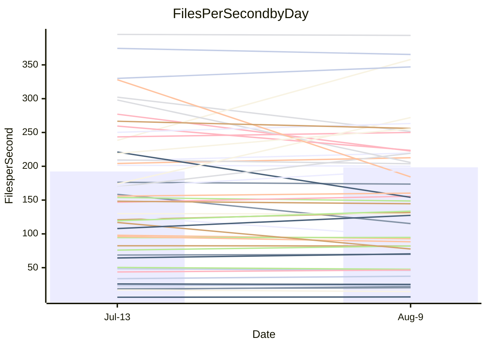

<!---
# This file is auto-generated. Do not edit.
# cspell:disable
--->
# Performance Report

Daily Performance

```mermaid
xychart-beta
    title Files Per Second by Day
    y-axis Files per Second
    x-axis Date [Jul-13, Aug-9]
    bar [192.31, 198.47]
    line [17.82, 22.06]
    line [97.93, 92.84]
    line [302.24, 251.48]
    line [94.47, 94.76]
    line [82.41, 82.14]
    line [48.47, 46.00]
    line [277.07, 222.59]
    line [6.29, 6.71]
    line [238.39, 357.94]
    line [208.19, 219.58]
    line [158.48, 115.21]
    line [204.20, 212.66]
    line [209.39, 203.73]
    line [153.81, 148.68]
    line [120.84, 131.73]
    line [23.34, 24.13]
    line [146.76, 155.76]
    line [25.88, 25.22]
    line [17.18, 14.73]
    line [201.45, 200.13]
    line [176.39, 173.62]
    line [96.02, 88.31]
    line [298.01, 205.58]
    line [76.00, 81.96]
    line [148.29, 144.54]
    line [374.43, 365.35]
    line [259.46, 223.63]
    line [221.06, 154.11]
    line [129.95, 129.46]
    line [126.09, 96.79]
    line [68.71, 69.75]
    line [155.87, 160.28]
    line [169.41, 219.25]
    line [50.42, 47.62]
    line [116.87, 77.69]
    line [330.04, 347.03]
    line [243.47, 250.03]
    line [64.41, 70.49]
    line [174.01, 272.12]
    line [250.26, 263.27]
    line [18.90, 20.31]
    line [328.06, 184.28]
    line [395.07, 393.63]
    line [119.39, 133.67]
    line [266.63, 256.06]
    line [33.78, 37.41]
    line [43.65, 46.54]
    line [107.84, 127.39]
    line [218.96, 255.50]
    line [169.05, 194.32]
```

Time to Process Files

| Repository                                      | Elapsed | Min/Avg/Max           |   SD | SD Graph |
| ----------------------------------------------- | ------: | :-------------------: | ---: | -------- |
| AdaDoom3/AdaDoom3                    |    2.24 | 2.1 /   2.1 /   2.1   | 0.00 | ``       |
| alexiosc/megistos                    |    7.10 | 7.1 /   7.1 /   7.1   | 0.00 | ``       |
| apollographql/apollo-server          |    2.76 | 2.6 /   2.6 /   2.6   | 0.00 | ``       |
| aspnetboilerplate/aspnetboilerplate  |    9.10 | 7.6 /   7.6 /   7.6   | 0.00 | ``       |
| aws-amplify/docs                     |   13.61 | 10.7 /  10.7 /  10.7  | 0.00 | ``       |
| Azure/azure-rest-api-specs           |    7.15 | 10.4 /  10.4 /  10.4  | 0.00 | ``       |
| bitjson/typescript-starter           |    0.91 | 1.1 /   1.1 /   1.1   | 0.00 | ``       |
| caddyserver/caddy                    |    3.43 | 3.4 /   3.4 /   3.4   | 0.00 | ``       |
| canada-ca/open-source-logiciel-libre |    1.04 | 1.1 /   1.1 /   1.1   | 0.00 | ``       |
| chef/chef                            |    4.71 | 5.0 /   5.0 /   5.0   | 0.00 | ``       |
| dart-lang/sdk                        |   58.02 | 57.0 /  57.0 /  57.0  | 0.00 | ``       |
| django/django                        |   14.38 | 14.0 /  14.0 /  14.0  | 0.00 | ``       |
| eslint/eslint                        |    9.78 | 10.2 /  10.2 /  10.2  | 0.00 | ``       |
| exonum/exonum                        |    3.65 | 2.7 /   2.7 /   2.7   | 0.00 | ``       |
| flutter/samples                      |   11.41 | 11.0 /  11.0 /  11.0  | 0.00 | ``       |
| gitbucket/gitbucket                  |    3.17 | 3.5 /   3.5 /   3.5   | 0.00 | ``       |
| googleapis/google-cloud-cpp          |   96.87 | 125.8 / 125.8 / 125.8 | 0.00 | ``       |
| graphql/express-graphql              |    1.08 | 1.1 /   1.1 /   1.1   | 0.00 | ``       |
| graphql/graphql-js                   |    3.54 | 3.7 /   3.7 /   3.7   | 0.00 | ``       |
| graphql/graphql-relay-js             |    1.11 | 1.1 /   1.1 /   1.1   | 0.00 | ``       |
| graphql/graphql-spec                 |    1.29 | 1.1 /   1.1 /   1.1   | 0.00 | ``       |
| iluwatar/java-design-patterns        |   12.03 | 11.8 /  11.8 /  11.8  | 0.00 | ``       |
| ktaranov/sqlserver-kit               |    5.55 | 5.1 /   5.1 /   5.1   | 0.00 | ``       |
| liriliri/licia                       |    3.94 | 3.8 /   3.8 /   3.8   | 0.00 | ``       |
| MartinThoma/LaTeX-examples           |    6.85 | 4.7 /   4.7 /   4.7   | 0.00 | ``       |
| mdx-js/mdx                           |    1.70 | 1.8 /   1.8 /   1.8   | 0.00 | ``       |
| microsoft/TypeScript-Website         |    5.29 | 5.2 /   5.2 /   5.2   | 0.00 | ``       |
| MicrosoftDocs/PowerShell-Docs        |   24.15 | 24.1 /  24.1 /  24.1  | 0.00 | ``       |
| neovim/nvim-lspconfig                |    5.63 | 3.9 /   3.9 /   3.9   | 0.00 | ``       |
| pagekit/pagekit                      |    3.31 | 2.9 /   2.9 /   2.9   | 0.00 | ``       |
| php/php-src                          |   24.62 | 18.3 /  18.3 /  18.3  | 0.00 | ``       |
| plasticrake/tplink-smarthome-api     |    1.30 | 1.2 /   1.2 /   1.2   | 0.00 | ``       |
| prettier/prettier                    |    7.68 | 8.0 /   8.0 /   8.0   | 0.00 | ``       |
| pycontribs/jira                      |    1.15 | 1.2 /   1.2 /   1.2   | 0.00 | ``       |
| RustPython/RustPython                |   11.07 | 7.1 /   7.1 /   7.1   | 0.00 | ``       |
| shoelace-style/shoelace              |    2.75 | 2.8 /   2.8 /   2.8   | 0.00 | ``       |
| slint-ui/slint                       |   14.90 | 14.0 /  14.0 /  14.0  | 0.00 | ``       |
| SoftwareBrothers/admin-bro           |    1.62 | 2.5 /   2.5 /   2.5   | 0.00 | ``       |
| sveltejs/svelte                      |   22.70 | 22.5 /  22.5 /  22.5  | 0.00 | ``       |
| TheAlgorithms/Python                 |    5.36 | 5.6 /   5.6 /   5.6   | 0.00 | ``       |
| twbs/bootstrap                       |    1.67 | 1.8 /   1.8 /   1.8   | 0.00 | ``       |
| typescript-cheatsheets/react         |    1.18 | 1.3 /   1.3 /   1.3   | 0.00 | ``       |
| typescript-eslint/typescript-eslint  |    4.69 | 4.0 /   4.0 /   4.0   | 0.00 | ``       |
| vitest-dev/vitest                    |   10.75 | 10.2 /  10.2 /  10.2  | 0.00 | ``       |
| w3c/aria-practices                   |    3.12 | 3.5 /   3.5 /   3.5   | 0.00 | ``       |
| w3c/specberus                        |    1.49 | 1.8 /   1.8 /   1.8   | 0.00 | ``       |
| webdeveric/webpack-assets-manifest   |    1.18 | 1.3 /   1.3 /   1.3   | 0.00 | ``       |
| webpack/webpack                      |    5.07 | 5.6 /   5.6 /   5.6   | 0.00 | ``       |
| wireapp/wire-desktop                 |    1.36 | 1.3 /   1.3 /   1.3   | 0.00 | ``       |
| wireapp/wire-webapp                  |   12.74 | 13.9 /  13.9 /  13.9  | 0.00 | ``       |

Note:
- Elapsed time is in seconds.

Files per Second over Time

| Repository                                      | Files |   Sec |    Fps |     Rel | Trend Fps |    N |
| ----------------------------------------------- | ----: | ----: | -----: | ------: | --------- | ---: |
| AdaDoom3/AdaDoom3                    |   103 |  2.24 |  46.00 |  -5.10% | `█▄`      |    1 |
| alexiosc/megistos                    |   583 |  7.10 |  82.14 |  -0.33% | `██`      |    1 |
| apollographql/apollo-server          |   256 |  2.76 |  92.84 |  -5.19% | `█▄`      |    1 |
| aspnetboilerplate/aspnetboilerplate  |  2288 |  9.10 | 251.48 | -16.79% | `█ `      |    1 |
| aws-amplify/docs                     |  3030 | 13.61 | 222.59 | -19.66% | `█ `      |    1 |
| Azure/azure-rest-api-specs           |  2561 |  7.15 | 357.94 |  50.15% | `▂█`      |    1 |
| bitjson/typescript-starter           |    20 |  0.91 |  22.06 |  23.74% | `▃█`      |    1 |
| caddyserver/caddy                    |   325 |  3.43 |  94.76 |   0.30% | `██`      |    1 |
| canada-ca/open-source-logiciel-libre |     7 |  1.04 |   6.71 |   6.70% | `▅█`      |    1 |
| chef/chef                            |  1034 |  4.71 | 219.58 |   5.47% | `▅█`      |    1 |
| dart-lang/sdk                        | 11611 | 58.02 | 200.13 |  -0.66% | `██`      |    1 |
| django/django                        |  2930 | 14.38 | 203.73 |  -2.70% | `█▆`      |    1 |
| eslint/eslint                        |  2080 |  9.78 | 212.66 |   4.14% | `▆█`      |    1 |
| exonum/exonum                        |   421 |  3.65 | 115.21 | -27.30% | `█ `      |    1 |
| flutter/samples                      |  1696 | 11.41 | 148.68 |  -3.34% | `█▆`      |    1 |
| gitbucket/gitbucket                  |   418 |  3.17 | 131.73 |   9.02% | `▅█`      |    1 |
| googleapis/google-cloud-cpp          | 21238 | 96.87 | 219.25 |  29.42% | `▂█`      |    1 |
| graphql/express-graphql              |    26 |  1.08 |  24.13 |   3.39% | `▆█`      |    1 |
| graphql/graphql-js                   |   551 |  3.54 | 155.76 |   6.13% | `▅█`      |    1 |
| graphql/graphql-relay-js             |    28 |  1.11 |  25.22 |  -2.56% | `█▆`      |    1 |
| graphql/graphql-spec                 |    19 |  1.29 |  14.73 | -14.23% | `█ `      |    1 |
| iluwatar/java-design-patterns        |  2089 | 12.03 | 173.62 |  -1.57% | `█▇`      |    1 |
| ktaranov/sqlserver-kit               |   490 |  5.55 |  88.31 |  -8.04% | `█▂`      |    1 |
| liriliri/licia                       |  1438 |  3.94 | 365.35 |  -2.43% | `█▆`      |    1 |
| MartinThoma/LaTeX-examples           |  1409 |  6.85 | 205.58 | -31.02% | `█ `      |    1 |
| mdx-js/mdx                           |   139 |  1.70 |  81.96 |   7.84% | `▅█`      |    1 |
| microsoft/TypeScript-Website         |   765 |  5.29 | 144.54 |  -2.53% | `█▆`      |    1 |
| MicrosoftDocs/PowerShell-Docs        |  3126 | 24.15 | 129.46 |  -0.38% | `██`      |    1 |
| neovim/nvim-lspconfig                |   867 |  5.63 | 154.11 | -30.28% | `█ `      |    1 |
| pagekit/pagekit                      |   741 |  3.31 | 223.63 | -13.81% | `█ `      |    1 |
| php/php-src                          |  2383 | 24.62 |  96.79 | -23.24% | `█ `      |    1 |
| plasticrake/tplink-smarthome-api     |    62 |  1.30 |  47.62 |  -5.55% | `█▄`      |    1 |
| prettier/prettier                    |  2664 |  7.68 | 347.03 |   5.15% | `▆█`      |    1 |
| pycontribs/jira                      |    80 |  1.15 |  69.75 |   1.51% | `▇█`      |    1 |
| RustPython/RustPython                |   860 | 11.07 |  77.69 | -33.52% | `█ `      |    1 |
| shoelace-style/shoelace              |   440 |  2.75 | 160.28 |   2.83% | `▆█`      |    1 |
| slint-ui/slint                       |  3726 | 14.90 | 250.03 |   2.69% | `▇█`      |    1 |
| SoftwareBrothers/admin-bro           |   441 |  1.62 | 272.12 |  56.39% | `▂█`      |    1 |
| sveltejs/svelte                      |  8935 | 22.70 | 393.63 |  -0.36% | `██`      |    1 |
| TheAlgorithms/Python                 |  1411 |  5.36 | 263.27 |   5.20% | `▆█`      |    1 |
| twbs/bootstrap                       |   118 |  1.67 |  70.49 |   9.45% | `▄█`      |    1 |
| typescript-cheatsheets/react         |    24 |  1.18 |  20.31 |   7.50% | `▅█`      |    1 |
| typescript-eslint/typescript-eslint  |   865 |  4.69 | 184.28 | -43.83% | `█ `      |    1 |
| vitest-dev/vitest                    |  2752 | 10.75 | 256.06 |  -3.96% | `█▅`      |    1 |
| w3c/aria-practices                   |   417 |  3.12 | 133.67 |  11.96% | `▄█`      |    1 |
| w3c/specberus                        |   190 |  1.49 | 127.39 |  18.12% | `▃█`      |    1 |
| webdeveric/webpack-assets-manifest   |    55 |  1.18 |  46.54 |   6.64% | `▅█`      |    1 |
| webpack/webpack                      |  1296 |  5.07 | 255.50 |  16.69% | `▃█`      |    1 |
| wireapp/wire-desktop                 |    51 |  1.36 |  37.41 |  10.74% | `▄█`      |    1 |
| wireapp/wire-webapp                  |  2476 | 12.74 | 194.32 |  14.95% | `▄█`      |    1 |

Data Throughput

| Repository                                      | Files |   Sec |     Kps |     Rel | Trend Kps |    N |
| ----------------------------------------------- | ----: | ----: | ------: | ------: | --------- | ---: |
| AdaDoom3/AdaDoom3                    |   103 |  2.24 |  977.60 |  -5.10% | `█▄`      |    1 |
| alexiosc/megistos                    |   583 |  7.10 |  645.40 |  -0.33% | `██`      |    1 |
| apollographql/apollo-server          |   256 |  2.76 |  764.50 |  -5.52% | `█▄`      |    1 |
| aspnetboilerplate/aspnetboilerplate  |  2288 |  9.10 |  614.97 | -16.76% | `█ `      |    1 |
| aws-amplify/docs                     |  3030 | 13.61 |  868.46 | -13.32% | `█ `      |    1 |
| Azure/azure-rest-api-specs           |  2561 |  7.15 | 1085.70 |  48.92% | `▂█`      |    1 |
| bitjson/typescript-starter           |    20 |  0.91 |   88.22 |  23.74% | `▃█`      |    1 |
| caddyserver/caddy                    |   325 |  3.43 |  865.36 |   1.12% | `▇█`      |    1 |
| canada-ca/open-source-logiciel-libre |     7 |  1.04 |   55.63 |   6.70% | `▅█`      |    1 |
| chef/chef                            |  1034 |  4.71 | 1078.13 |   5.49% | `▅█`      |    1 |
| dart-lang/sdk                        | 11611 | 58.02 | 1380.39 |   0.34% | `██`      |    1 |
| django/django                        |  2930 | 14.38 | 1310.46 |  -2.52% | `█▆`      |    1 |
| eslint/eslint                        |  2080 |  9.78 | 1492.83 |   4.87% | `▆█`      |    1 |
| exonum/exonum                        |   421 |  3.65 | 1102.02 | -27.30% | `█ `      |    1 |
| flutter/samples                      |  1696 | 11.41 |  889.63 |  -3.34% | `█▆`      |    1 |
| gitbucket/gitbucket                  |   418 |  3.17 |  645.43 |  11.81% | `▄█`      |    1 |
| googleapis/google-cloud-cpp          | 21238 | 96.87 | 1902.90 |  29.84% | `▂█`      |    1 |
| graphql/express-graphql              |    26 |  1.08 |  110.43 |   3.39% | `▆█`      |    1 |
| graphql/graphql-js                   |   551 |  3.54 | 1161.55 |   6.38% | `▅█`      |    1 |
| graphql/graphql-relay-js             |    28 |  1.11 |   99.08 |  -2.56% | `█▆`      |    1 |
| graphql/graphql-spec                 |    19 |  1.29 |  493.13 | -14.23% | `█ `      |    1 |
| iluwatar/java-design-patterns        |  2089 | 12.03 |  535.08 |  -1.56% | `█▇`      |    1 |
| ktaranov/sqlserver-kit               |   490 |  5.55 | 1337.77 |  -8.04% | `█▂`      |    1 |
| liriliri/licia                       |  1438 |  3.94 |  435.98 |  -2.43% | `█▆`      |    1 |
| MartinThoma/LaTeX-examples           |  1409 |  6.85 |  424.58 | -31.02% | `█ `      |    1 |
| mdx-js/mdx                           |   139 |  1.70 |  386.22 |   8.84% | `▅█`      |    1 |
| microsoft/TypeScript-Website         |   765 |  5.29 |  996.50 |  -2.53% | `█▆`      |    1 |
| MicrosoftDocs/PowerShell-Docs        |  3126 | 24.15 | 1381.41 |  -0.29% | `██`      |    1 |
| neovim/nvim-lspconfig                |   867 |  5.63 |  452.92 | -30.03% | `█ `      |    1 |
| pagekit/pagekit                      |   741 |  3.31 |  466.28 | -13.81% | `█ `      |    1 |
| php/php-src                          |  2383 | 24.62 | 1711.61 | -22.70% | `█ `      |    1 |
| plasticrake/tplink-smarthome-api     |    62 |  1.30 |  257.31 |  -5.55% | `█▄`      |    1 |
| prettier/prettier                    |  2664 |  7.68 |  493.19 |   5.04% | `▆█`      |    1 |
| pycontribs/jira                      |    80 |  1.15 |  492.59 |   1.51% | `▇█`      |    1 |
| RustPython/RustPython                |   860 | 11.07 | 1704.97 | -34.51% | `█ `      |    1 |
| shoelace-style/shoelace              |   440 |  2.75 |  774.10 |   2.83% | `▆█`      |    1 |
| slint-ui/slint                       |  3726 | 14.90 | 1340.59 |   4.66% | `▆█`      |    1 |
| SoftwareBrothers/admin-bro           |   441 |  1.62 |  599.79 |  56.39% | `▂█`      |    1 |
| sveltejs/svelte                      |  8935 | 22.70 |  270.01 |  -0.09% | `██`      |    1 |
| TheAlgorithms/Python                 |  1411 |  5.36 |  673.38 |   5.25% | `▅█`      |    1 |
| twbs/bootstrap                       |   118 |  1.67 |  578.29 |   9.45% | `▄█`      |    1 |
| typescript-cheatsheets/react         |    24 |  1.18 |  183.67 |   7.50% | `▅█`      |    1 |
| typescript-eslint/typescript-eslint  |   865 |  4.69 |  619.74 | -65.51% | `█ `      |    1 |
| vitest-dev/vitest                    |  2752 | 10.75 |  721.94 |  -3.83% | `█▅`      |    1 |
| w3c/aria-practices                   |   417 |  3.12 | 1257.16 |  11.99% | `▄█`      |    1 |
| w3c/specberus                        |   190 |  1.49 |  415.69 |  18.23% | `▃█`      |    1 |
| webdeveric/webpack-assets-manifest   |    55 |  1.18 |  107.47 |   7.48% | `▅█`      |    1 |
| webpack/webpack                      |  1296 |  5.07 | 1552.10 |  31.56% | `▂█`      |    1 |
| wireapp/wire-desktop                 |    51 |  1.36 |  159.17 |   4.71% | `▆█`      |    1 |
| wireapp/wire-webapp                  |  2476 | 12.74 |  816.11 |  16.60% | `▃█`      |    1 |

