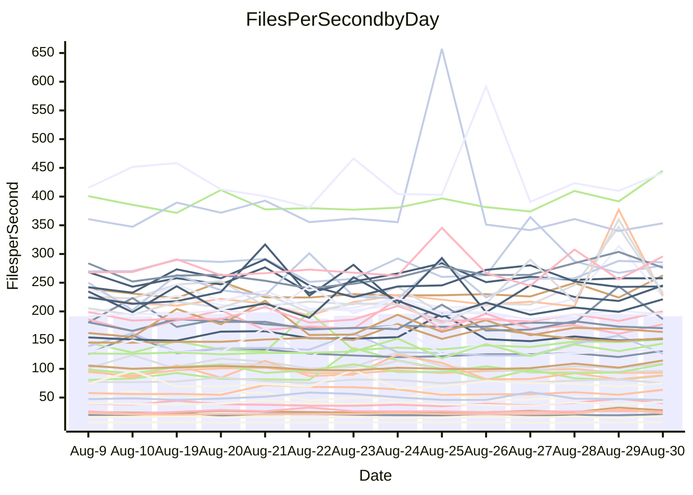

<!---
# This file is auto-generated. Do not edit.
# cspell:disable
--->
# Performance Report

Daily Performance

```mermaid
xychart-beta
    title Files Per Second by Day
    y-axis Files per Second
    x-axis Date [Aug-9, Aug-10, Aug-19, Aug-20, Aug-21, Aug-22, Aug-23, Aug-24, Aug-25, Aug-26, Aug-27, Aug-28, Aug-29, Aug-30]
    bar [191.27, 191.48, 199.45, 195.67, 198.22, 187.40, 192.61, 195.61, 200.69, 190.24, 185.15, 191.23, 195.37, 191.74]
    line [19.76, 19.87, 23.15, 18.80, 21.30, 21.70, 20.11, 19.24, 18.97, 21.74, 19.44, 19.50, 19.20, 20.73]
    line [94.45, 88.13, 97.66, 100.71, 101.93, 92.80, 92.11, 97.07, 92.83, 96.14, 97.78, 99.79, 92.99, 93.36]
    line [106.66, 99.38, 103.80, 117.71, 112.47, 100.50, 103.30, 128.71, 104.89, 98.28, 96.78, 104.60, 101.13, 109.45]
    line [80.61, 83.15, 92.81, 82.44, 81.86, 80.75, 136.22, 114.72, 99.92, 81.00, 98.60, 83.62, 80.81, 88.25]
    line [239.79, 231.09, 223.10, 252.00, 224.60, 224.17, 230.06, 227.93, 228.22, 229.99, 225.97, 249.68, 224.12, 262.60]
    line [269.81, 270.47, 289.77, 286.14, 291.59, 251.52, 256.69, 292.19, 260.02, 262.94, 364.38, 287.21, 267.07, 280.17]
    line [39.52, 37.52, 44.46, 38.46, 37.42, 35.96, 35.65, 37.61, 34.82, 39.47, 36.12, 40.86, 48.01, 40.27]
    line [268.54, 243.09, 257.77, 247.18, 276.72, 232.23, 252.08, 266.01, 283.94, 251.01, 260.27, 254.92, 257.60, 257.72]
    line [6.78, 6.60, 7.51, 6.38, 6.72, 6.55, 6.77, 6.55, 6.58, 6.64, 6.06, 6.53, 6.57, 7.52]
    line [240.17, 211.99, 227.00, 211.38, 205.51, 203.10, 206.43, 223.33, 206.89, 208.72, 201.20, 222.72, 313.85, 225.83]
    line [125.68, 158.27, 127.25, 135.61, 133.76, 126.70, 123.28, 120.42, 121.90, 125.42, 125.26, 127.33, 120.64, 131.40]
    line [225.24, 214.74, 210.02, 221.88, 213.58, 192.56, 216.27, 228.68, 220.47, 211.98, 216.89, 208.83, 377.28, 227.87]
    line [225.91, 222.58, 246.74, 252.74, 209.47, 217.12, 212.13, 242.98, 195.81, 213.43, 211.78, 245.83, 346.89, 231.11]
    line [145.75, 128.32, 148.05, 133.76, 130.09, 198.58, 132.66, 136.89, 133.84, 140.74, 138.14, 147.54, 146.55, 151.16]
    line [24.65, 23.72, 23.68, 26.94, 25.51, 24.79, 23.76, 23.53, 22.75, 24.32, 26.78, 24.44, 32.43, 27.83]
    line [139.45, 161.93, 128.87, 135.71, 136.66, 133.36, 161.38, 128.87, 127.62, 123.35, 123.11, 143.71, 157.94, 126.45]
    line [25.95, 22.03, 24.86, 28.29, 26.21, 32.71, 26.20, 26.09, 26.00, 24.43, 25.37, 25.72, 26.51, 25.38]
    line [154.75, 150.93, 149.02, 164.86, 165.64, 153.35, 152.64, 155.02, 195.52, 151.70, 148.17, 156.31, 149.39, 152.39]
    line [15.80, 15.53, 17.25, 15.28, 15.49, 14.84, 15.46, 14.39, 15.01, 15.63, 14.69, 17.08, 14.10, 18.05]
    line [196.97, 211.99, 246.59, 218.10, 236.31, 204.94, 201.38, 212.81, 200.01, 195.34, 186.50, 194.59, 201.00, 195.28]
    line [180.75, 223.35, 172.94, 187.16, 177.68, 172.01, 170.49, 175.09, 173.22, 173.59, 180.48, 179.74, 243.56, 186.42]
    line [96.93, 84.41, 106.12, 84.61, 114.12, 87.31, 89.99, 124.55, 110.24, 81.92, 82.24, 92.49, 81.67, 88.72]
    line [77.16, 76.75, 77.91, 84.91, 78.76, 75.34, 81.46, 80.77, 74.97, 79.78, 75.90, 79.64, 81.40, 74.87]
    line [400.74, 385.62, 371.65, 411.46, 377.61, 379.88, 377.18, 380.64, 396.91, 381.52, 374.08, 409.79, 391.59, 445.08]
    line [145.79, 145.58, 147.10, 147.08, 151.07, 153.94, 150.27, 178.09, 152.08, 170.66, 160.71, 152.01, 148.28, 153.10]
    line [249.96, 202.34, 263.67, 236.99, 228.06, 301.20, 226.40, 222.40, 289.06, 224.56, 256.87, 257.70, 287.97, 285.39]
    line [186.27, 165.43, 184.07, 202.12, 167.51, 173.85, 169.85, 221.75, 167.75, 195.90, 170.00, 175.89, 161.05, 177.57]
    line [224.37, 213.27, 217.89, 233.79, 316.48, 227.32, 281.23, 212.31, 293.11, 198.49, 245.94, 225.24, 218.17, 245.25]
    line [47.00, 61.84, 45.89, 57.63, 58.67, 44.77, 49.92, 49.06, 57.90, 45.60, 46.71, 50.51, 48.37, 46.56]
    line [127.47, 149.55, 129.16, 129.10, 170.99, 119.13, 167.47, 175.06, 125.57, 143.51, 123.67, 127.21, 130.16, 133.68]
    line [181.18, 166.12, 186.93, 181.85, 181.88, 168.34, 171.35, 169.12, 211.70, 166.64, 168.34, 182.86, 173.63, 170.89]
    line [57.90, 56.15, 56.35, 54.76, 71.89, 68.47, 68.09, 64.39, 54.76, 55.64, 55.71, 59.28, 54.85, 63.52]
    line [101.07, 123.80, 99.87, 108.06, 107.98, 95.34, 94.96, 114.12, 97.84, 103.09, 93.25, 94.27, 95.28, 96.43]
    line [98.84, 91.76, 103.43, 107.49, 93.08, 97.11, 107.90, 94.53, 94.47, 104.38, 94.67, 92.38, 93.95, 107.95]
    line [162.48, 155.40, 204.32, 177.59, 218.64, 159.00, 159.79, 194.26, 164.45, 184.75, 158.60, 171.47, 169.60, 164.23]
    line [360.76, 347.31, 389.41, 371.89, 392.82, 355.53, 361.83, 355.43, 657.12, 351.25, 341.51, 360.76, 340.11, 353.59]
    line [198.91, 184.05, 187.41, 186.67, 207.48, 180.49, 185.92, 209.38, 182.67, 186.49, 182.43, 194.97, 183.27, 200.10]
    line [242.10, 232.62, 273.32, 257.69, 290.62, 245.10, 224.83, 243.49, 245.36, 272.30, 280.33, 252.18, 242.64, 243.53]
    line [73.60, 96.61, 68.89, 69.48, 73.38, 68.77, 97.84, 66.15, 69.59, 78.77, 75.57, 73.80, 69.15, 74.94]
    line [415.14, 451.69, 458.22, 412.53, 400.53, 380.98, 466.37, 404.40, 403.18, 591.49, 390.96, 423.25, 409.89, 441.73]
    line [283.77, 252.09, 262.36, 263.68, 253.37, 240.18, 248.22, 259.20, 278.18, 263.50, 263.68, 284.05, 303.63, 276.04]
    line [22.84, 20.59, 20.47, 21.22, 20.90, 21.42, 21.40, 22.88, 21.36, 21.22, 21.19, 22.04, 29.75, 22.71]
    line [205.56, 193.98, 216.67, 206.61, 230.20, 198.53, 213.69, 212.64, 179.07, 214.07, 290.22, 216.81, 359.94, 231.63]
    line [126.64, 126.17, 128.45, 125.27, 127.94, 127.77, 130.20, 152.67, 118.34, 143.02, 122.15, 142.33, 130.77, 144.08]
    line [105.46, 100.11, 102.43, 104.89, 103.21, 98.21, 97.36, 101.78, 100.00, 99.58, 101.28, 109.08, 102.06, 114.62]
    line [47.26, 48.66, 46.00, 48.26, 51.42, 58.83, 56.30, 50.38, 45.97, 45.91, 59.43, 48.16, 47.53, 45.87]
    line [268.09, 268.70, 290.78, 262.94, 266.60, 272.93, 267.45, 262.37, 345.57, 266.69, 244.68, 307.76, 255.74, 295.87]
    line [234.76, 198.61, 243.75, 200.90, 213.71, 188.91, 259.37, 218.53, 190.79, 215.33, 194.36, 206.72, 199.24, 221.08]
    line [39.98, 38.63, 38.64, 39.11, 45.24, 39.50, 39.66, 42.07, 38.23, 36.94, 35.58, 41.81, 37.53, 42.47]
    line [192.03, 195.48, 194.87, 202.54, 193.62, 244.63, 196.70, 223.56, 194.58, 199.46, 185.25, 194.89, 191.72, 196.76]
```

Time to Process Files

| Repository                                      | Elapsed | Min/Avg/Max          |    SD | SD Graph                |
| ----------------------------------------------- | ------: | :------------------: | ----: | ----------------------- |
| AdaDoom3/AdaDoom3                    |    2.71 | 2.1 /   2.6 /   3.0  |  0.28 | `    ┣━━┻━━╋●━┻━━┫    ` |
| alexiosc/megistos                    |    7.07 | 4.1 /   6.8 /   7.9  |  0.83 | `    ┣━━┻━━╋●━┻━━┫    ` |
| apollographql/apollo-server          |    2.33 | 1.8 /   2.4 /   2.8  |  0.25 | `    ┣━━┻━●╋━━┻━━┫    ` |
| aspnetboilerplate/aspnetboilerplate  |    6.63 | 4.9 /   8.3 /   9.3  |  1.07 | `    ┣●━┻━━╋━━┻━━┫    ` |
| aws-amplify/docs                     |   13.29 | 8.6 /  12.8 /  14.3  |  1.32 | `    ┣━━┻━━╋●━┻━━┫    ` |
| Azure/azure-rest-api-specs           |    9.92 | 7.2 /  10.0 /  11.2  |  0.80 | `    ┣━━┻━━●━━┻━━┫    ` |
| bitjson/typescript-starter           |    1.02 | 0.6 /   1.0 /   1.1  |  0.10 | `     ┣━┻━━●━━┻━┫     ` |
| caddyserver/caddy                    |    3.76 | 2.5 /   3.5 /   3.9  |  0.35 | `    ┣━━┻━━╋━●┻━━┫    ` |
| canada-ca/open-source-logiciel-libre |    0.85 | 0.8 /   1.1 /   1.3  |  0.10 | `     ●━┻━━╋━━┻━┫     ` |
| chef/chef                            |    4.86 | 3.0 /   4.7 /   5.4  |  0.57 | `    ┣━━┻━━╋●━┻━━┫    ` |
| dart-lang/sdk                        |   58.95 | 34.3 /  57.1 /  64.6 |  6.07 | `  ┣━━━┻━━━╋●━━┻━━━┫  ` |
| django/django                        |   13.53 | 7.5 /  12.8 /  15.0  |  1.81 | `   ┣━━━┻━━╋●━┻━━━┫   ` |
| eslint/eslint                        |   10.29 | 5.5 /   9.5 /  10.8  |  0.97 | `    ┣━━┻━━╋━━●━━┫    ` |
| exonum/exonum                        |    3.33 | 2.6 /   3.3 /   3.7  |  0.25 | `    ┣━━┻━━●━━┻━━┫    ` |
| flutter/samples                      |   13.14 | 8.0 /  12.0 /  14.0  |  1.44 | `    ┣━━┻━━╋━●┻━━┫    ` |
| gitbucket/gitbucket                  |    3.19 | 2.1 /   3.1 /   3.6  |  0.35 | `    ┣━━┻━━╋●━┻━━┫    ` |
| googleapis/google-cloud-cpp          |  130.60 | 83.3 / 122.3 / 142.3 | 12.69 | `  ┣━━━┻━━━╋━━●┻━━━┫  ` |
| graphql/express-graphql              |    0.87 | 0.7 /   1.0 /   1.2  |  0.11 | `     ┣●┻━━╋━━┻━┫     ` |
| graphql/graphql-js                   |    3.68 | 2.8 /   3.5 /   3.9  |  0.28 | `    ┣━━┻━━╋●━┻━━┫    ` |
| graphql/graphql-relay-js             |    1.11 | 0.7 /   1.1 /   1.3  |  0.09 | `     ┣━┻━━╋●━┻━┫     ` |
| graphql/graphql-spec                 |    1.33 | 0.8 /   1.2 /   1.4  |  0.15 | `     ┣━┻━━╋━●┻━┫     ` |
| iluwatar/java-design-patterns        |    9.52 | 8.8 /  12.0 /  13.3  |  1.02 | `  ● ┣━━┻━━╋━━┻━━┫    ` |
| ktaranov/sqlserver-kit               |    6.17 | 3.1 /   5.3 /   6.2  |  0.91 | `    ┣━━┻━━╋━━●━━┫    ` |
| liriliri/licia                       |    2.83 | 2.8 /   3.7 /   4.1  |  0.32 | `   ●┣━━┻━━╋━━┻━━┫    ` |
| MartinThoma/LaTeX-examples           |    6.14 | 3.5 /   5.7 /   7.0  |  0.83 | `    ┣━━┻━━╋━●┻━━┫    ` |
| mdx-js/mdx                           |    1.96 | 1.5 /   1.8 /   1.9  |  0.10 | `     ┣━┻━━╋━━┻━●     ` |
| microsoft/TypeScript-Website         |    4.31 | 3.7 /   5.1 /   5.6  |  0.38 | `    ●━━┻━━╋━━┻━━┫    ` |
| MicrosoftDocs/PowerShell-Docs        |   24.28 | 13.9 /  23.4 /  26.2 |  2.86 | `   ┣━━━┻━━╋●━┻━━━┫   ` |
| neovim/nvim-lspconfig                |    4.05 | 3.7 /   4.9 /   5.6  |  0.58 | `    ┣━●┻━━╋━━┻━━┫    ` |
| pagekit/pagekit                      |    3.32 | 1.9 /   3.2 /   4.1  |  0.44 | `    ┣━━┻━━╋●━┻━━┫    ` |
| php/php-src                          |   24.98 | 18.2 /  23.8 /  26.8 |  2.35 | `   ┣━━━┻━━╋━●┻━━━┫   ` |
| plasticrake/tplink-smarthome-api     |    1.37 | 0.8 /   1.3 /   1.4  |  0.15 | `     ┣━┻━━╋━●┻━┫     ` |
| prettier/prettier                    |    7.45 | 4.1 /   7.4 /   8.2  |  0.83 | `    ┣━━┻━━●━━┻━━┫    ` |
| pycontribs/jira                      |    1.45 | 0.9 /   1.4 /   1.5  |  0.15 | `     ┣━┻━━╋━●┻━┫     ` |
| RustPython/RustPython                |    9.52 | 5.6 /   9.0 /  11.1  |  1.12 | `    ┣━━┻━━╋━●┻━━┫    ` |
| shoelace-style/shoelace              |    2.49 | 1.8 /   2.6 /   3.0  |  0.34 | `    ┣━━┻━●╋━━┻━━┫    ` |
| slint-ui/slint                       |   15.92 | 11.3 /  15.2 /  17.0 |  1.50 | `   ┣━━━┻━━╋━●┻━━━┫   ` |
| SoftwareBrothers/admin-bro           |    2.43 | 1.6 /   2.3 /   2.6  |  0.23 | `     ┣━┻━━╋━●┻━┫     ` |
| sveltejs/svelte                      |   22.68 | 12.5 /  21.2 /  23.6 |  2.43 | `   ┣━━━┻━━╋━●┻━━━┫   ` |
| TheAlgorithms/Python                 |    5.34 | 3.0 /   5.3 /   5.9  |  0.53 | `    ┣━━┻━━●━━┻━━┫    ` |
| twbs/bootstrap                       |    1.78 | 1.2 /   1.6 /   1.9  |  0.19 | `     ┣━┻━━╋━●┻━┫     ` |
| typescript-cheatsheets/react         |    1.21 | 0.7 /   1.1 /   1.3  |  0.11 | `     ┣━┻━━╋━━●━┫     ` |
| typescript-eslint/typescript-eslint  |    3.69 | 2.4 /   4.0 /   4.9  |  0.50 | `    ┣━━┻●━╋━━┻━━┫    ` |
| vitest-dev/vitest                    |   11.62 | 6.6 /  10.1 /  11.9  |  1.08 | `    ┣━━┻━━╋━━┻━●┫    ` |
| w3c/aria-practices                   |    3.32 | 2.3 /   3.2 /   3.6  |  0.31 | `    ┣━━┻━━╋●━┻━━┫    ` |
| w3c/specberus                        |    1.89 | 1.3 /   1.8 /   2.2  |  0.16 | `     ┣━┻━━╋●━┻━┫     ` |
| webdeveric/webpack-assets-manifest   |    1.19 | 0.8 /   1.1 /   1.4  |  0.13 | `     ┣━┻━━╋●━┻━┫     ` |
| webpack/webpack                      |    7.02 | 3.7 /   6.3 /   7.4  |  0.91 | `    ┣━━┻━━╋━●┻━━┫    ` |
| wireapp/wire-desktop                 |    1.32 | 0.9 /   1.3 /   1.5  |  0.14 | `     ┣━┻━━╋●━┻━┫     ` |
| wireapp/wire-webapp                  |   13.04 | 10.3 /  12.9 /  14.5 |  0.95 | `    ┣━━┻━━●━━┻━━┫    ` |

Note:
- Elapsed time is in seconds.

Files per Second over Time

| Repository                                      | Files |    Sec |    Fps |     Rel | Trend Fps              |    N |
| ----------------------------------------------- | ----: | -----: | -----: | ------: | ---------------------- | ---: |
| AdaDoom3/AdaDoom3                    |   103 |   2.71 |  38.02 |  -3.83% | `▃▂▃▃▂▄▄▃▃▃▆█▂▂▇██▃▃▃` |   37 |
| alexiosc/megistos                    |   583 |   7.07 |  82.47 |  -6.39% | `▂██▃▄▂▂▃▅▂▃▂▂▂▃▂▂▂▄▂` |   37 |
| apollographql/apollo-server          |   256 |   2.33 | 109.71 |   2.02% | `▃▄██▄▃▃▃▃▄▃█▃▃▃▃▃▇▄▅` |   37 |
| aspnetboilerplate/aspnetboilerplate  |  2288 |   6.63 | 345.34 |  22.62% | `▁▂▂▄▂▂▂█▂▄▂▅▂▁▂▂▁▂▂▄` |   37 |
| aws-amplify/docs                     |  3030 |  13.29 | 228.07 |  -4.71% | `▂▂▃▂▂▂▂▂▂▅▂▂▁▇▂▂▂▃█▂` |   37 |
| Azure/azure-rest-api-specs           |  2576 |   9.92 | 259.64 |   0.11% | `▃▅█▃▇▄▅▇▄▅▄▄▄▄█▅▄▇▄▅` |   37 |
| bitjson/typescript-starter           |    20 |   1.02 |  19.62 |  -2.95% | `▅▄▄▃▃▃█▄▃▃█▂▃▃▃▃▄▇▄▄` |   37 |
| caddyserver/caddy                    |   338 |   3.76 |  89.92 |  -7.22% | `▃▃▃▅▃▄▄▃▆▃▄█▃▃▇▃▄▄▄▃` |   37 |
| canada-ca/open-source-logiciel-libre |     7 |   0.85 |   8.21 |  22.28% | `▄▄▄▄▄▄▄▃▂▄▄▃▄▃▄▄█▃▄▇` |   37 |
| chef/chef                            |  1035 |   4.86 | 212.83 |  -4.66% | `▂▂▃▄▂▂▃▂▂▃▃▃▃▇▂█▂▇▂▃` |   37 |
| dart-lang/sdk                        | 11634 |  58.95 | 197.35 |  -4.67% | `▆▅▅█▅▅▅▄▄▅▅▅▃▅▅▅▅▄▄▅` |   37 |
| django/django                        |  2932 |  13.53 | 216.71 |  -7.57% | `▂▂▁▄▁▂▂▂▂█▂▂▂▂▂▇▂▂▄▂` |   37 |
| eslint/eslint                        |  2082 |  10.29 | 202.42 |  -9.04% | `▁▂▂▃▂▂▂▂▂▂▂▂▁▂▂█▂▄▂▂` |   37 |
| exonum/exonum                        |   421 |   3.33 | 126.44 |  -1.75% | `▄▄▃▄▃▄▄▄▄▃▃▄█▄▄▃█▄▄▄` |   37 |
| flutter/samples                      |  1703 |  13.14 | 129.62 |  -9.87% | `█▂▃▃▃▂▄▃▂▆▂▄▄▄▂▄▂█▄▂` |   37 |
| gitbucket/gitbucket                  |   418 |   3.19 | 131.08 |  -3.87% | `▃▅▂▂▂▂▂▂▂▁▂▂█▅▂▅▁▃▂▃` |   37 |
| googleapis/google-cloud-cpp          | 21983 | 130.60 | 168.33 |  -5.83% | `▂▂▃▂▅▂▂▂▂▂▂▁▃▂█▃▃▂▂▂` |   37 |
| graphql/express-graphql              |    26 |   0.87 |  29.86 |  18.46% | `▄▃▃▃▂▃▄▃▇▃▂▃▃▃▇█▃▅▇▇` |   37 |
| graphql/graphql-js                   |   551 |   3.68 | 149.67 |  -4.45% | `▃▃▄▄█▃▃▂▃▄▃▂▂█▄▃▃▃▃▃` |   37 |
| graphql/graphql-relay-js             |    28 |   1.11 |  25.22 |  -3.19% | `█▄▅▄▄▃▃▃▄▄▃▃▇▃▃▄▃▅▄▄` |   37 |
| graphql/graphql-spec                 |    19 |   1.33 |  14.30 | -11.03% | `▂▃▃▁▂▃▂▂▂▃▂▄▃▂▇▂█▄▂▂` |   37 |
| iluwatar/java-design-patterns        |  2183 |   9.52 | 229.29 |  26.60% | `▂▂▃▃▃▃▃▃▃▃▄▃▃▃▃█▂▃▃▇` |   37 |
| ktaranov/sqlserver-kit               |   490 |   6.17 |  79.46 | -16.93% | `▂▃▄█▅▂▁▂▂▅▂▆▁▂▁▂▄▂▂▁` |   37 |
| liriliri/licia                       |  1442 |   2.83 | 508.71 |  28.63% | `▃▃▃▃▄▃▃▂▃▅▃▃▃▂█▃▃▃██` |   37 |
| MartinThoma/LaTeX-examples           |  1409 |   6.14 | 229.34 |  -9.20% | `▅▂▂▂▄▂▂▄▂▇▂▂▂▂▂▄█▂▄▂` |   37 |
| mdx-js/mdx                           |   139 |   1.96 |  71.05 |  -9.94% | `▄▆▆▅▄▇▄▅▃▄█▄▃█▄▆▄▄▅▂` |   37 |
| microsoft/TypeScript-Website         |   765 |   4.31 | 177.52 |  16.88% | `▃▃▃█▃▇▃▃▅▃▃▃▅▃▃▃▃▂▃▅` |   37 |
| MicrosoftDocs/PowerShell-Docs        |  3126 |  24.28 | 128.73 |  -5.77% | `▁▄▂█▂▄▂▂▁▁▂▂▂▂▂▂▂▂▄▂` |   37 |
| neovim/nvim-lspconfig                |   871 |   4.05 | 214.95 |  18.16% | `▃▃▇▇▃▂█▃▃▃▅▂▂▆▃▂▃▃▂▇` |   37 |
| pagekit/pagekit                      |   741 |   3.32 | 222.93 |  -5.89% | `▄▇▃▃▇▃▁▆▃▃▅▃▄▃▃▃▃▄█▄` |   37 |
| php/php-src                          |  2389 |  24.98 |  95.64 |  -5.57% | `▃▃▃█▃▂▆▂▃▃▂▂▂▄▃▃▃▃▂▃` |   37 |
| plasticrake/tplink-smarthome-api     |    62 |   1.37 |  45.37 |  -9.87% | `▂▄▄▄▇▃▂▃▃▃▄▃▃█▄▄▃▂▄▃` |   37 |
| prettier/prettier                    |  2699 |   7.45 | 362.51 |  -2.34% | `▂▂▂▂█▂▂▂▁▂▂▁▁▄▁▁▂▂▁▂` |   37 |
| pycontribs/jira                      |    80 |   1.45 |  55.24 |  -8.04% | `▇▇▄█▃▃▃▃▃▃█▃▆▂▄▃▃██▃` |   36 |
| RustPython/RustPython                |   877 |   9.52 |  92.09 |  -7.35% | `▃▄▃▃▃▂▅▃▂▂▃▂▂▂▃▃█▂▃▂` |   37 |
| shoelace-style/shoelace              |   440 |   2.49 | 176.81 |   0.51% | `▃▃█▃▃▇▃▂▃▆▃▅▃▃▂▃▃▃▃▄` |   37 |
| slint-ui/slint                       |  3875 |  15.92 | 243.43 |  -4.63% | `▃▂▃▃▃█▃▃█▃▃▃▇▃▃▃▃▃▃▃` |   37 |
| SoftwareBrothers/admin-bro           |   441 |   2.43 | 181.83 |  -6.37% | `▃▃▃█▃▃▃▃▃▃▃▃▃▃█▃▃█▃▃` |   37 |
| sveltejs/svelte                      |  9020 |  22.68 | 397.71 |  -7.61% | `▁▃▂▂▂█▃▁▂▄▁▃▁▂▂▂▃▄▂▂` |   37 |
| TheAlgorithms/Python                 |  1411 |   5.34 | 264.36 |  -2.46% | `▂▃▃▄▅▄▄▄▄█▅█▄▄▃▇▄▃█▄` |   37 |
| twbs/bootstrap                       |   118 |   1.78 |  66.42 | -10.27% | `▃█▃▂▃▆▃▆▂▅▃▇▂▃▃▃█▃▃▂` |   37 |
| typescript-cheatsheets/react         |    24 |   1.21 |  19.82 | -10.27% | `▃▃▅▃▃▃▃▃▃▆▃▃▃▂▄█▇▃▃▂` |   37 |
| typescript-eslint/typescript-eslint  |   869 |   3.69 | 235.20 |   6.42% | `▂▂▂▂▁▂▃█▃▂▂▂▂▂▄█▂▂▄▃` |   37 |
| vitest-dev/vitest                    |  2790 |  11.62 | 240.20 | -14.12% | `▃▃▂▂▅▂▃▂▁█▃▂▅▄▂▂▅▅▂▂` |   37 |
| w3c/aria-practices                   |   417 |   3.32 | 125.43 |  -5.87% | `▃▃█▂▂▆▃▂▃▃▃▃▆█▃▃▆▆▃▃` |   37 |
| w3c/specberus                        |   190 |   1.89 | 100.72 |  -4.20% | `▃▃▃▃▃▃▃▄▃▃▄█▄▃▄▃█▅▄▃` |   37 |
| webdeveric/webpack-assets-manifest   |    55 |   1.19 |  46.31 |  -5.38% | `▆▅▅▃▃▂▃▃█▆▃▃▂▃▃▃▂▃▃▃` |   37 |
| webpack/webpack                      |  1364 |   7.02 | 194.22 | -10.65% | `▃█▃▇▃▃▆▃▃▅█▃▃▃▃▃▆▆▆▃` |   37 |
| wireapp/wire-desktop                 |    51 |   1.32 |  38.51 |  -4.55% | `▃▃▅▃▃▂▂▂▂▂▅▆▃▃▃▂▂▂█▃` |   37 |
| wireapp/wire-webapp                  |  2578 |  13.04 | 197.75 |  -0.02% | `█▄▄█▄▄▄▃▂▇▃▂▃▃▄▃▃▄▄▄` |   37 |

Data Throughput

| Repository                                      | Files |    Sec |     Kps |     Rel | Trend Kps              |    N |
| ----------------------------------------------- | ----: | -----: | ------: | ------: | ---------------------- | ---: |
| AdaDoom3/AdaDoom3                    |   103 |   2.71 |  807.97 |  -3.83% | `▃▂▃▃▂▄▄▃▃▃▆█▂▂▇██▃▃▃` |   37 |
| alexiosc/megistos                    |   583 |   7.07 |  648.03 |  -6.39% | `▂██▃▄▂▂▃▅▂▃▂▂▂▃▂▂▂▄▂` |   37 |
| apollographql/apollo-server          |   256 |   2.33 |  903.39 |   2.02% | `▃▄██▄▃▃▃▃▄▃█▃▃▃▃▃▇▄▅` |   37 |
| aspnetboilerplate/aspnetboilerplate  |  2288 |   6.63 |  844.65 |  22.63% | `▁▂▂▄▂▂▂█▂▄▂▅▂▁▂▂▁▂▂▄` |   37 |
| aws-amplify/docs                     |  3030 |  13.29 |  891.60 |  -4.67% | `▂▂▃▂▂▂▂▂▂▅▂▂▁▇▂▂▂▃█▂` |   37 |
| Azure/azure-rest-api-specs           |  2576 |   9.92 |  797.57 |   0.47% | `▃▅█▄▇▄▅▇▄▅▄▄▄▄█▅▄▇▄▅` |   37 |
| bitjson/typescript-starter           |    20 |   1.02 |   78.46 |  -2.95% | `▅▄▄▃▃▃█▄▃▃█▂▃▃▃▃▄▇▄▄` |   37 |
| caddyserver/caddy                    |   338 |   3.76 |  816.19 |  -7.45% | `▃▃▃▅▃▄▄▂▆▃▄█▃▂▇▃▄▄▄▃` |   37 |
| canada-ca/open-source-logiciel-libre |     7 |   0.85 |   68.00 |  22.28% | `▄▄▄▄▄▄▄▃▂▄▄▃▄▃▄▄█▃▄▇` |   37 |
| chef/chef                            |  1035 |   4.86 | 1044.80 |  -4.67% | `▂▂▃▄▂▂▃▂▂▃▃▃▃▇▂█▂▇▂▃` |   37 |
| dart-lang/sdk                        | 11634 |  58.95 | 1372.61 |  -4.46% | `▆▅▅█▅▅▅▄▄▅▅▅▄▅▅▅▅▅▅▅` |   37 |
| django/django                        |  2932 |  13.53 | 1395.53 |  -7.59% | `▂▂▁▄▁▂▂▂▁█▂▂▂▂▂▇▂▂▄▂` |   37 |
| eslint/eslint                        |  2082 |  10.29 | 1421.11 |  -9.03% | `▁▂▂▃▂▂▂▂▂▂▂▂▁▂▂█▂▄▂▂` |   37 |
| exonum/exonum                        |   421 |   3.33 | 1209.40 |  -1.75% | `▄▄▃▄▃▄▄▄▄▃▃▄█▄▄▃█▄▄▄` |   37 |
| flutter/samples                      |  1703 |  13.14 |  772.62 |  -9.95% | `█▂▃▃▃▂▄▃▂▆▂▄▄▄▂▄▂█▄▂` |   37 |
| gitbucket/gitbucket                  |   418 |   3.19 |  648.50 |  -3.66% | `▃▅▂▂▂▂▂▂▂▁▂▂█▅▂▅▁▃▂▃` |   37 |
| googleapis/google-cloud-cpp          | 21983 | 130.60 | 1464.43 |  -5.74% | `▂▂▃▂▅▂▂▂▂▂▂▁▃▂█▃▃▂▂▂` |   37 |
| graphql/express-graphql              |    26 |   0.87 |  136.68 |  18.46% | `▄▃▃▃▂▃▄▃▇▃▂▃▃▃▇█▃▅▇▇` |   37 |
| graphql/graphql-js                   |   551 |   3.68 | 1116.16 |  -4.45% | `▃▃▄▄█▃▃▂▃▄▃▂▂█▄▃▃▃▃▃` |   37 |
| graphql/graphql-relay-js             |    28 |   1.11 |   99.08 |  -3.19% | `█▄▅▄▄▃▃▃▄▄▃▃▇▃▃▄▃▅▄▄` |   37 |
| graphql/graphql-spec                 |    19 |   1.33 |  478.64 | -11.03% | `▂▃▃▁▂▃▂▂▂▃▂▄▃▂▇▂█▄▂▂` |   37 |
| iluwatar/java-design-patterns        |  2183 |   9.52 |  708.36 |  26.66% | `▃▂▃▃▃▃▃▃▃▃▄▃▃▃▃█▂▃▃▇` |   37 |
| ktaranov/sqlserver-kit               |   490 |   6.17 | 1203.70 | -16.93% | `▂▃▄█▅▂▁▂▂▅▂▆▁▂▁▂▄▂▂▁` |   37 |
| liriliri/licia                       |  1442 |   2.83 |  609.96 |  28.76% | `▃▃▃▃▄▃▃▂▃▅▃▃▃▂█▃▃▃██` |   37 |
| MartinThoma/LaTeX-examples           |  1409 |   6.14 |  473.66 |  -9.20% | `▅▂▂▂▄▂▂▄▂▇▂▂▂▂▂▄█▂▄▂` |   37 |
| mdx-js/mdx                           |   139 |   1.96 |  334.81 |  -9.94% | `▄▆▆▅▄▇▄▅▃▄█▄▃█▄▆▄▄▅▂` |   37 |
| microsoft/TypeScript-Website         |   765 |   4.31 | 1224.05 |  16.89% | `▃▃▃█▃▇▃▃▅▃▃▃▅▃▃▃▃▂▃▅` |   37 |
| MicrosoftDocs/PowerShell-Docs        |  3126 |  24.28 | 1375.47 |  -5.73% | `▁▄▂█▂▄▂▂▁▁▂▂▂▂▂▂▂▂▄▂` |   37 |
| neovim/nvim-lspconfig                |   871 |   4.05 |  631.28 |  18.19% | `▃▃▇▇▃▂█▃▃▃▅▂▂▆▃▂▃▃▂▇` |   37 |
| pagekit/pagekit                      |   741 |   3.32 |  464.82 |  -5.89% | `▄▇▃▃▇▃▁▆▃▃▅▃▄▃▃▃▃▄█▄` |   37 |
| php/php-src                          |  2389 |  24.98 | 1693.20 |  -5.52% | `▃▃▃█▃▂▆▂▃▃▂▂▂▄▃▃▃▃▂▃` |   37 |
| plasticrake/tplink-smarthome-api     |    62 |   1.37 |  245.17 |  -9.87% | `▂▄▄▄▇▃▂▃▃▃▄▃▃█▄▄▃▂▄▃` |   37 |
| prettier/prettier                    |  2699 |   7.45 |  510.93 |  -2.60% | `▂▂▂▂█▂▂▂▁▂▂▁▁▄▁▁▂▂▁▂` |   37 |
| pycontribs/jira                      |    80 |   1.45 |  390.14 |  -8.04% | `▇▇▄█▃▃▃▃▃▃█▃▆▂▄▃▃██▃` |   36 |
| RustPython/RustPython                |   877 |   9.52 | 2035.74 |  -7.09% | `▃▄▃▃▃▃▅▃▂▂▃▂▃▂▃▃█▂▃▂` |   37 |
| shoelace-style/shoelace              |   440 |   2.49 |  853.90 |   0.51% | `▃▃█▃▃▇▃▂▃▆▃▅▃▃▂▃▃▃▃▄` |   37 |
| slint-ui/slint                       |  3875 |  15.92 | 1313.35 |  -4.42% | `▃▂▃▃▃█▃▃█▃▃▃▇▃▃▃▃▃▃▃` |   37 |
| SoftwareBrothers/admin-bro           |   441 |   2.43 |  400.76 |  -6.37% | `▃▃▃█▃▃▃▃▃▃▃▃▃▃█▃▃█▃▃` |   37 |
| sveltejs/svelte                      |  9020 |  22.68 |  273.98 |  -7.43% | `▁▃▂▂▂█▃▁▂▄▁▃▁▂▂▂▃▄▂▂` |   37 |
| TheAlgorithms/Python                 |  1411 |   5.34 |  676.16 |  -2.46% | `▂▃▃▄▅▄▄▄▄█▅█▄▄▃▇▄▃█▄` |   37 |
| twbs/bootstrap                       |   118 |   1.78 |  544.89 | -10.27% | `▃█▃▂▃▆▃▆▂▅▃▇▂▃▃▃█▃▃▂` |   37 |
| typescript-cheatsheets/react         |    24 |   1.21 |  179.21 | -10.27% | `▃▃▅▃▃▃▃▃▃▆▃▃▃▂▄█▇▃▃▂` |   37 |
| typescript-eslint/typescript-eslint  |   869 |   3.69 |  790.05 |   6.39% | `▂▂▂▂▁▂▃█▃▂▂▂▂▂▄█▂▂▄▃` |   37 |
| vitest-dev/vitest                    |  2790 |  11.62 |  696.59 | -13.53% | `▃▃▂▂▅▂▃▂▁█▃▂▅▄▂▂▅▅▂▂` |   37 |
| w3c/aria-practices                   |   417 |   3.32 | 1179.71 |  -5.87% | `▃▃█▂▂▆▃▂▃▃▃▃▆█▃▃▆▆▃▃` |   37 |
| w3c/specberus                        |   190 |   1.89 |  329.19 |  -4.17% | `▃▃▃▃▃▃▃▄▃▃▄█▄▃▄▃█▅▄▃` |   37 |
| webdeveric/webpack-assets-manifest   |    55 |   1.19 |  106.94 |  -5.38% | `▆▅▅▃▃▂▃▃█▆▃▃▂▃▃▃▂▃▃▃` |   37 |
| webpack/webpack                      |  1364 |   7.02 | 1318.10 |  -8.65% | `▃█▃▇▃▄▆▄▃▅▇▃▃▃▃▄▆▆▆▃` |   37 |
| wireapp/wire-desktop                 |    51 |   1.32 |  163.88 |  -4.55% | `▃▃▅▃▃▂▂▂▂▂▅▆▃▃▃▂▂▂█▃` |   37 |
| wireapp/wire-webapp                  |  2578 |  13.04 |  843.02 |   0.62% | `█▄▄█▄▄▄▄▂▇▃▃▃▃▄▃▃▄▄▄` |   37 |

