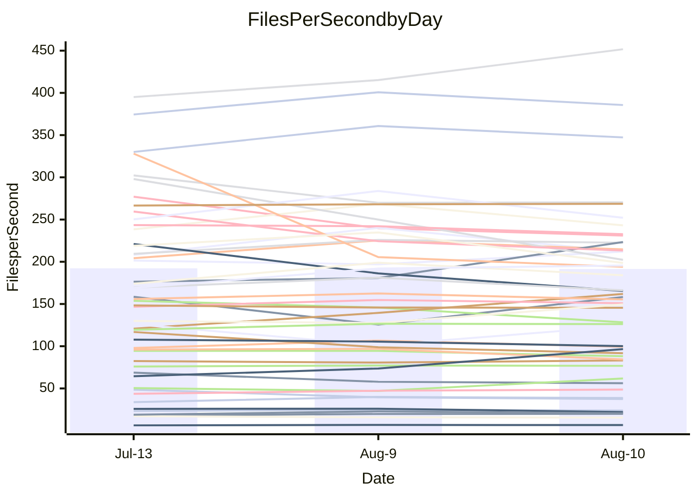

<!---
# This file is auto-generated. Do not edit.
# cspell:disable
--->
# Performance Report

Daily Performance

```mermaid
xychart-beta
    title Files Per Second by Day
    y-axis Files per Second
    x-axis Date [Jul-13, Aug-9, Aug-10]
    bar [192.31, 191.27, 191.48]
    line [17.82, 19.76, 19.87]
    line [97.93, 106.66, 99.38]
    line [302.24, 269.81, 270.47]
    line [94.47, 94.45, 88.13]
    line [82.41, 80.61, 83.15]
    line [48.47, 39.52, 37.52]
    line [277.07, 239.79, 231.09]
    line [6.29, 6.78, 6.60]
    line [238.39, 268.54, 243.09]
    line [208.19, 240.17, 211.99]
    line [158.48, 125.68, 158.27]
    line [204.20, 225.24, 214.74]
    line [209.39, 225.91, 222.58]
    line [153.81, 145.75, 128.32]
    line [120.84, 139.45, 161.93]
    line [23.34, 24.65, 23.72]
    line [146.76, 154.75, 150.93]
    line [25.88, 25.95, 22.03]
    line [17.18, 15.80, 15.53]
    line [201.45, 196.97, 211.99]
    line [176.39, 180.75, 223.35]
    line [96.02, 96.93, 84.41]
    line [298.01, 249.96, 202.34]
    line [76.00, 77.16, 76.75]
    line [148.29, 145.79, 145.58]
    line [374.43, 400.74, 385.62]
    line [259.46, 224.37, 213.27]
    line [221.06, 186.27, 165.43]
    line [129.95, 127.47, 149.55]
    line [126.09, 101.07, 123.80]
    line [68.71, 57.90, 56.15]
    line [155.87, 162.48, 155.40]
    line [169.41, 181.18, 166.12]
    line [50.42, 47.00, 61.84]
    line [116.87, 98.84, 91.76]
    line [330.04, 360.76, 347.31]
    line [243.47, 242.10, 232.62]
    line [64.41, 73.60, 96.61]
    line [174.01, 198.91, 184.05]
    line [250.26, 283.77, 252.09]
    line [18.90, 22.84, 20.59]
    line [328.06, 205.56, 193.98]
    line [395.07, 415.14, 451.69]
    line [119.39, 126.64, 126.17]
    line [266.63, 268.09, 268.70]
    line [33.78, 39.98, 38.63]
    line [43.65, 47.26, 48.66]
    line [107.84, 105.46, 100.11]
    line [218.96, 234.76, 198.61]
    line [169.05, 192.03, 195.48]
```

Time to Process Files

| Repository                                      | Elapsed | Min/Avg/Max          |    SD | SD Graph                |
| ----------------------------------------------- | ------: | :------------------: | ----: | ----------------------- |
| AdaDoom3/AdaDoom3                    |    2.75 | 2.1 /   2.6 /   2.9  |  0.31 | `    ┣━━┻━━╋━●┻━━┫    ` |
| alexiosc/megistos                    |    7.01 | 6.9 /   7.2 /   7.9  |  0.32 | `    ┣━━┻●━╋━━┻━━┫    ` |
| apollographql/apollo-server          |    2.58 | 2.0 /   2.5 /   2.8  |  0.25 | `    ┣━━┻━━╋●━┻━━┫    ` |
| aspnetboilerplate/aspnetboilerplate  |    8.46 | 6.7 /   8.4 /   9.1  |  0.79 | `    ┣━━┻━━●━━┻━━┫    ` |
| aws-amplify/docs                     |   13.11 | 10.7 /  12.5 /  13.6 |  1.18 | `    ┣━━┻━━╋━●┻━━┫    ` |
| Azure/azure-rest-api-specs           |   10.54 | 7.2 /   9.8 /  11.2  |  1.18 | `    ┣━━┻━━╋━●┻━━┫    ` |
| bitjson/typescript-starter           |    1.01 | 0.9 /   1.0 /   1.1  |  0.07 | `     ┣━┻━●╋━━┻━┫     ` |
| caddyserver/caddy                    |    3.69 | 2.8 /   3.5 /   3.9  |  0.32 | `    ┣━━┻━━╋━●┻━━┫    ` |
| canada-ca/open-source-logiciel-libre |    1.06 | 0.8 /   1.1 /   1.3  |  0.12 | `     ┣━┻━━●━━┻━┫     ` |
| chef/chef                            |    4.88 | 3.0 /   4.5 /   5.3  |  0.74 | `    ┣━━┻━━╋●━┻━━┫    ` |
| dart-lang/sdk                        |   54.77 | 56.0 /  58.8 /  64.6 |  2.69 | `   ┣●━┻━━━╋━━━┻━━┫   ` |
| django/django                        |   13.16 | 10.2 /  13.3 /  14.6 |  1.49 | `   ┣━━━┻━━●━━┻━━━┫   ` |
| eslint/eslint                        |    9.69 | 7.6 /   9.5 /  10.3  |  1.00 | `    ┣━━┻━━╋●━┻━━┫    ` |
| exonum/exonum                        |    2.66 | 2.7 /   3.3 /   3.7  |  0.28 | `    ●━━┻━━╋━━┻━━┫    ` |
| flutter/samples                      |   13.22 | 8.0 /  11.8 /  13.4  |  1.65 | `   ┣━━━┻━━╋━━●━━━┫   ` |
| gitbucket/gitbucket                  |    2.58 | 2.5 /   3.1 /   3.5  |  0.34 | `    ┣━●┻━━╋━━┻━━┫    ` |
| googleapis/google-cloud-cpp          |  127.85 | 96.9 / 119.5 / 127.7 | 11.42 | `  ┣━━━┻━━━╋━━●┻━━━┫  ` |
| graphql/express-graphql              |    1.10 | 0.8 /   1.1 /   1.2  |  0.10 | `     ┣━┻━━╋●━┻━┫     ` |
| graphql/graphql-js                   |    3.65 | 3.0 /   3.6 /   3.9  |  0.24 | `    ┣━━┻━━╋●━┻━━┫    ` |
| graphql/graphql-relay-js             |    1.27 | 0.9 /   1.1 /   1.2  |  0.06 | `     ┣━┻━━╋━━┻━┫ ●   ` |
| graphql/graphql-spec                 |    1.22 | 0.8 /   1.2 /   1.3  |  0.16 | `     ┣━┻━━●━━┻━┫     ` |
| iluwatar/java-design-patterns        |    9.35 | 8.8 /  11.7 /  12.8  |  1.20 | `    ●━━┻━━╋━━┻━━┫    ` |
| ktaranov/sqlserver-kit               |    5.80 | 3.3 /   5.3 /   6.2  |  0.93 | `    ┣━━┻━━╋━●┻━━┫    ` |
| liriliri/licia                       |    3.73 | 2.9 /   3.7 /   4.1  |  0.39 | `    ┣━━┻━━●━━┻━━┫    ` |
| MartinThoma/LaTeX-examples           |    6.96 | 4.5 /   5.6 /   6.9  |  0.81 | `    ┣━━┻━━╋━━┻━●┫    ` |
| mdx-js/mdx                           |    1.81 | 1.7 /   1.8 /   1.9  |  0.07 | `     ┣━┻━━●━━┻━┫     ` |
| microsoft/TypeScript-Website         |    5.25 | 5.0 /   5.2 /   5.6  |  0.19 | `    ┣━━┻━━●━━┻━━┫    ` |
| MicrosoftDocs/PowerShell-Docs        |   20.90 | 23.5 /  24.5 /  25.8 |  0.63 | `●     ┣━┻━╋━┻━┫      ` |
| neovim/nvim-lspconfig                |    5.24 | 3.9 /   4.6 /   5.6  |  0.67 | `    ┣━━┻━━╋━━●━━┫    ` |
| pagekit/pagekit                      |    3.47 | 2.7 /   3.3 /   3.6  |  0.29 | `    ┣━━┻━━╋━●┻━━┫    ` |
| php/php-src                          |   19.25 | 18.3 /  23.1 /  25.3 |  2.45 | `   ┣━●━┻━━╋━━┻━━━┫   ` |
| plasticrake/tplink-smarthome-api     |    1.00 | 1.2 /   1.3 /   1.4  |  0.06 | `●     ┣━┻━╋━┻━┫      ` |
| prettier/prettier                    |    7.67 | 5.9 /   7.5 /   8.0  |  0.65 | `    ┣━━┻━━╋●━┻━━┫    ` |
| pycontribs/jira                      |    1.42 | 1.1 /   1.4 /   1.5  |  0.12 | `     ┣━┻━━╋●━┻━┫     ` |
| RustPython/RustPython                |    9.37 | 6.6 /   8.7 /  11.1  |  1.45 | `    ┣━━┻━━╋●━┻━━┫    ` |
| shoelace-style/shoelace              |    2.83 | 2.1 /   2.7 /   3.0  |  0.24 | `    ┣━━┻━━╋●━┻━━┫    ` |
| slint-ui/slint                       |   16.02 | 14.0 /  15.2 /  15.9 |  0.53 | `    ┣━━┻━━╋━━┻━●┫    ` |
| SoftwareBrothers/admin-bro           |    2.40 | 1.6 /   2.3 /   2.5  |  0.26 | `    ┣━━┻━━╋●━┻━━┫    ` |
| sveltejs/svelte                      |   19.78 | 16.9 /  21.8 /  22.9 |  1.86 | `   ┣━━●┻━━╋━━┻━━━┫   ` |
| TheAlgorithms/Python                 |    5.60 | 3.0 /   5.3 /   5.9  |  0.87 | `    ┣━━┻━━╋●━┻━━┫    ` |
| twbs/bootstrap                       |    1.22 | 1.3 /   1.7 /   1.9  |  0.19 | `    ●┣━┻━━╋━━┻━┫     ` |
| typescript-cheatsheets/react         |    1.17 | 0.7 /   1.1 /   1.3  |  0.16 | `     ┣━┻━━╋●━┻━┫     ` |
| typescript-eslint/typescript-eslint  |    4.46 | 3.9 /   4.2 /   4.7  |  0.26 | `    ┣━━┻━━╋━━●━━┫    ` |
| vitest-dev/vitest                    |   10.24 | 8.7 /  10.3 /  10.8  |  0.63 | `    ┣━━┻━━●━━┻━━┫    ` |
| w3c/aria-practices                   |    3.31 | 3.1 /   3.3 /   3.5  |  0.15 | `     ┣━┻━━●━━┻━┫     ` |
| w3c/specberus                        |    1.90 | 1.5 /   1.8 /   2.0  |  0.14 | `     ┣━┻━━╋━●┻━┫     ` |
| webdeveric/webpack-assets-manifest   |    1.13 | 1.0 /   1.2 /   1.3  |  0.07 | `     ┣━┻●━╋━━┻━┫     ` |
| webpack/webpack                      |    6.53 | 3.7 /   5.7 /   6.7  |  0.96 | `    ┣━━┻━━╋━━●━━┫    ` |
| wireapp/wire-desktop                 |    1.32 | 1.1 /   1.3 /   1.5  |  0.15 | `     ┣━┻━━●━━┻━┫     ` |
| wireapp/wire-webapp                  |   12.67 | 12.5 /  13.0 /  13.9 |  0.43 | `    ┣━━●━━╋━━┻━━┫    ` |

Note:
- Elapsed time is in seconds.

Files per Second over Time

| Repository                                      | Files |    Sec |    Fps |     Rel | Trend Fps   |    N |
| ----------------------------------------------- | ----: | -----: | -----: | ------: | ----------- | ---: |
| AdaDoom3/AdaDoom3                    |   103 |   2.75 |  37.52 |  -7.69% | `█▇▃▃▇▂▂▃▃` |    8 |
| alexiosc/megistos                    |   583 |   7.01 |  83.15 |   2.86% | `▇▇█▅▆▇▄█▇` |    8 |
| apollographql/apollo-server          |   256 |   2.58 |  99.38 |  -5.86% | `▃▂▃▄▃▄█▇▃` |    8 |
| aspnetboilerplate/aspnetboilerplate  |  2288 |   8.46 | 270.47 |  -1.24% | `▆▂▃▂▃▃▃█▃` |    8 |
| aws-amplify/docs                     |  3030 |  13.11 | 231.09 |  -5.47% | `█▃▃▄▃▃█▇▃` |    8 |
| Azure/azure-rest-api-specs           |  2561 |  10.54 | 243.09 |  -8.19% | `▂█▃▅▃▃▂▃▂` |    8 |
| bitjson/typescript-starter           |    20 |   1.01 |  19.87 |   1.80% | `▃█▅▆▅▅▃▅▅` |    8 |
| caddyserver/caddy                    |   325 |   3.69 |  88.13 |  -6.69% | `▄▄▄▃▂█▅▂▃` |    8 |
| canada-ca/open-source-logiciel-libre |     7 |   1.06 |   6.60 |  -1.79% | `▃▄▄▅▄█▂▄▄` |    8 |
| chef/chef                            |  1034 |   4.88 | 211.99 | -10.24% | `▂▃▁▆▂▂▂█▂` |    8 |
| dart-lang/sdk                        | 11611 |  54.77 | 211.99 |   7.32% | `▇▆▇▇▃▅▇▆█` |    8 |
| django/django                        |  2930 |  13.16 | 222.58 |  -0.56% | `▃▂▃▂▂▆▃█▃` |    8 |
| eslint/eslint                        |  2080 |   9.69 | 214.74 |  -3.54% | `▂▃▇█▂▃▂▃▃` |    8 |
| exonum/exonum                        |   421 |   2.66 | 158.27 |  21.95% | `█▂▃▃▅▄▄▄█` |    8 |
| flutter/samples                      |  1696 |  13.22 | 128.32 | -12.56% | `▄▃▁▂▂█▂▂▂` |    8 |
| gitbucket/gitbucket                  |   418 |   2.58 | 161.93 |  18.09% | `▂▃█▃▃▃▇▄▇` |    8 |
| googleapis/google-cloud-cpp          | 21238 | 127.85 | 166.12 |  -7.56% | `▃█▇▂▂▃▃▃▂` |    8 |
| graphql/express-graphql              |    26 |   1.10 |  23.72 |  -3.15% | `▃▄█▂▄▃▃▄▃` |    8 |
| graphql/graphql-js                   |   551 |   3.65 | 150.93 |  -1.84% | `▃▄▄▄▃▃█▄▄` |    8 |
| graphql/graphql-relay-js             |    28 |   1.27 |  22.03 | -15.08% | `▄▄▅▄▄▄█▃▁` |    8 |
| graphql/graphql-spec                 |    19 |   1.22 |  15.53 |  -2.76% | `▄▂▂▂█▂▂▂▃` |    8 |
| iluwatar/java-design-patterns        |  2089 |   9.35 | 223.35 |  23.94% | `▃▃▃▂▃▂▄█▇` |    8 |
| ktaranov/sqlserver-kit               |   490 |   5.80 |  84.41 | -12.81% | `▃▂▁▂█▁▅▂▂` |    8 |
| liriliri/licia                       |  1438 |   3.73 | 385.62 |  -2.98% | `▃▃▂▃▂█▇▄▃` |    8 |
| MartinThoma/LaTeX-examples           |  1409 |   6.96 | 202.34 | -20.95% | `▇▂▃█▄▇▃▃▂` |    8 |
| mdx-js/mdx                           |   139 |   1.81 |  76.75 |  -0.34% | `▅█▅▄▇▅▇▅▆` |    8 |
| microsoft/TypeScript-Website         |   765 |   5.25 | 145.58 |  -0.35% | `▇▆█▇▅▄▆▇▆` |    8 |
| MicrosoftDocs/PowerShell-Docs        |  3126 |  20.90 | 149.55 |  17.04% | `▄▄▄▄▃▄▄▅█` |    8 |
| neovim/nvim-lspconfig                |   867 |   5.24 | 165.43 | -13.22% | `█▂▂▆█▇▃▅▃` |    8 |
| pagekit/pagekit                      |   741 |   3.47 | 213.27 |  -6.77% | `▇▄▄▃▄▂█▃▃` |    8 |
| php/php-src                          |  2383 |  19.25 | 123.80 |  18.82% | `█▃▃▂▃▂▇▄█` |    8 |
| plasticrake/tplink-smarthome-api     |    62 |   1.00 |  61.84 |  30.37% | `▄▃▃▄▃▃▂▄█` |    8 |
| prettier/prettier                    |  2664 |   7.67 | 347.31 |  -2.69% | `▂▃▃▃█▃▂▃▃` |    8 |
| pycontribs/jira                      |    80 |   1.42 |  56.15 |  -5.23% | `██▃▃▃▃▃▄▃` |    8 |
| RustPython/RustPython                |   860 |   9.37 |  91.76 |  -9.23% | `▇▁▃▃▃▃█▇▃` |    8 |
| shoelace-style/shoelace              |   440 |   2.83 | 155.40 |  -3.87% | `▃▃▂▃▃█▃▂▃` |    8 |
| slint-ui/slint                       |  3726 |  16.02 | 232.62 |  -3.98% | `▇█▇▆▅▇▇▆▅` |    8 |
| SoftwareBrothers/admin-bro           |   441 |   2.40 | 184.05 |  -6.00% | `▂█▂▃▃▂▃▂▂` |    8 |
| sveltejs/svelte                      |  8935 |  19.78 | 451.69 |   9.47% | `▂▂▂▂▂▃▃█▅` |    8 |
| TheAlgorithms/Python                 |  1411 |   5.60 | 252.09 |  -9.83% | `▂▂▁▁▂▂█▂▂` |    8 |
| twbs/bootstrap                       |   118 |   1.22 |  96.61 |  33.36% | `▂▃▄▂▆▃▂▆█` |    8 |
| typescript-cheatsheets/react         |    24 |   1.17 |  20.59 |  -7.88% | `▁▂▃█▁▃▂▃▂` |    8 |
| typescript-eslint/typescript-eslint  |   865 |   4.46 | 193.98 | -12.18% | `█▁▃▂▂▃▃▃▂` |    8 |
| vitest-dev/vitest                    |  2752 |  10.24 | 268.70 |   0.30% | `▄▃▄▃▄▃▃█▄` |    8 |
| w3c/aria-practices                   |   417 |   3.31 | 126.17 |   0.35% | `▄█▇▄▆▄▇▇▆` |    8 |
| w3c/specberus                        |   190 |   1.90 | 100.11 |  -5.34% | `▄█▄▃▄▃▂▄▃` |    8 |
| webdeveric/webpack-assets-manifest   |    55 |   1.13 |  48.66 |   3.96% | `▃▅█▄▅▃▄▇▆` |    8 |
| webpack/webpack                      |  1296 |   6.53 | 198.61 | -14.68% | `▂▄▂▃▁▂█▂▂` |    8 |
| wireapp/wire-desktop                 |    51 |   1.32 |  38.63 |  -1.47% | `▂▃▂█▄▄▃█▄` |    8 |
| wireapp/wire-webapp                  |  2476 |  12.67 | 195.48 |   3.35% | `▃▇▇▇▇▆███` |    8 |

Data Throughput

| Repository                                      | Files |    Sec |     Kps |     Rel | Trend Kps   |    N |
| ----------------------------------------------- | ----: | -----: | ------: | ------: | ----------- | ---: |
| AdaDoom3/AdaDoom3                    |   103 |   2.75 |  797.35 |  -7.69% | `█▇▃▃▇▂▂▃▃` |    8 |
| alexiosc/megistos                    |   583 |   7.01 |  653.35 |   2.86% | `▇▇█▅▆▇▄█▇` |    8 |
| apollographql/apollo-server          |   256 |   2.58 |  818.32 |  -5.90% | `▃▂▃▄▃▄█▇▃` |    8 |
| aspnetboilerplate/aspnetboilerplate  |  2288 |   8.46 |  661.40 |  -1.23% | `▆▂▃▂▃▃▃█▃` |    8 |
| aws-amplify/docs                     |  3030 |  13.11 |  901.64 |  -4.48% | `▆▃▃▄▃▃█▇▃` |    8 |
| Azure/azure-rest-api-specs           |  2561 |  10.54 |  737.35 |  -8.27% | `▂█▃▅▃▃▂▃▂` |    8 |
| bitjson/typescript-starter           |    20 |   1.01 |   79.47 |   1.80% | `▃█▅▆▅▅▃▅▅` |    8 |
| caddyserver/caddy                    |   325 |   3.69 |  804.86 |  -6.60% | `▄▄▄▃▂█▅▂▃` |    8 |
| canada-ca/open-source-logiciel-libre |     7 |   1.06 |   54.68 |  -1.79% | `▃▄▄▅▄█▂▄▄` |    8 |
| chef/chef                            |  1034 |   4.88 | 1040.90 | -10.24% | `▂▃▁▆▂▂▂█▂` |    8 |
| dart-lang/sdk                        | 11611 |  54.77 | 1462.21 |   7.46% | `▆▆▇▇▃▅▇▆█` |    8 |
| django/django                        |  2930 |  13.16 | 1431.76 |  -0.54% | `▃▂▃▂▂▆▃█▃` |    8 |
| eslint/eslint                        |  2080 |   9.69 | 1507.39 |  -3.46% | `▂▃▇█▂▃▂▃▃` |    8 |
| exonum/exonum                        |   421 |   2.66 | 1513.90 |  21.95% | `█▂▃▃▅▄▄▄█` |    8 |
| flutter/samples                      |  1696 |  13.22 |  767.81 | -12.56% | `▄▃▁▂▂█▂▂▂` |    8 |
| gitbucket/gitbucket                  |   418 |   2.58 |  793.38 |  18.42% | `▂▄█▃▃▃▇▄▇` |    8 |
| googleapis/google-cloud-cpp          | 21238 | 127.85 | 1441.78 |  -7.53% | `▃█▇▂▂▃▃▃▂` |    8 |
| graphql/express-graphql              |    26 |   1.10 |  108.54 |  -3.15% | `▃▄█▂▄▃▃▄▃` |    8 |
| graphql/graphql-js                   |   551 |   3.65 | 1125.53 |  -1.81% | `▃▄▄▄▃▃█▄▄` |    8 |
| graphql/graphql-relay-js             |    28 |   1.27 |   86.56 | -15.08% | `▄▄▅▄▄▄█▃▁` |    8 |
| graphql/graphql-spec                 |    19 |   1.22 |  519.84 |  -2.76% | `▄▂▂▂█▂▂▂▃` |    8 |
| iluwatar/java-design-patterns        |  2089 |   9.35 |  688.32 |  23.95% | `▃▃▃▂▃▂▄█▇` |    8 |
| ktaranov/sqlserver-kit               |   490 |   5.80 | 1278.80 | -12.81% | `▃▂▁▂█▁▅▂▂` |    8 |
| liriliri/licia                       |  1438 |   3.73 |  460.17 |  -2.98% | `▃▃▂▃▂█▇▄▃` |    8 |
| MartinThoma/LaTeX-examples           |  1409 |   6.96 |  417.88 | -20.95% | `▇▂▃█▄▇▃▃▂` |    8 |
| mdx-js/mdx                           |   139 |   1.81 |  361.68 |  -0.23% | `▅█▅▄▇▅▇▅▆` |    8 |
| microsoft/TypeScript-Website         |   765 |   5.25 | 1003.67 |  -0.35% | `▇▆█▇▅▄▆▇▆` |    8 |
| MicrosoftDocs/PowerShell-Docs        |  3126 |  20.90 | 1595.85 |  17.05% | `▄▄▄▄▃▄▄▅█` |    8 |
| neovim/nvim-lspconfig                |   867 |   5.24 |  486.18 | -13.17% | `█▂▂▆█▇▃▅▃` |    8 |
| pagekit/pagekit                      |   741 |   3.47 |  444.68 |  -6.77% | `▇▄▄▃▄▂█▃▃` |    8 |
| php/php-src                          |  2383 |  19.25 | 2189.25 |  18.94% | `█▃▃▂▃▂▇▄█` |    8 |
| plasticrake/tplink-smarthome-api     |    62 |   1.00 |  334.12 |  30.37% | `▄▃▃▄▃▃▂▄█` |    8 |
| prettier/prettier                    |  2664 |   7.67 |  493.58 |  -2.70% | `▂▃▃▃█▃▂▃▃` |    8 |
| pycontribs/jira                      |    80 |   1.42 |  396.57 |  -5.23% | `██▃▃▃▃▃▄▃` |    8 |
| RustPython/RustPython                |   860 |   9.37 | 2013.74 |  -9.43% | `▇▁▃▃▃▃█▇▃` |    8 |
| shoelace-style/shoelace              |   440 |   2.83 |  750.52 |  -3.87% | `▃▃▂▃▃█▃▂▃` |    8 |
| slint-ui/slint                       |  3726 |  16.02 | 1247.26 |  -3.75% | `▆█▇▆▅▇▇▆▅` |    8 |
| SoftwareBrothers/admin-bro           |   441 |   2.40 |  405.65 |  -6.00% | `▂█▂▃▃▂▃▂▂` |    8 |
| sveltejs/svelte                      |  8935 |  19.78 |  309.84 |   9.50% | `▂▂▂▂▂▃▃█▅` |    8 |
| TheAlgorithms/Python                 |  1411 |   5.60 |  644.79 |  -9.82% | `▂▂▁▁▂▂█▂▂` |    8 |
| twbs/bootstrap                       |   118 |   1.22 |  792.56 |  33.36% | `▂▃▄▂▆▃▂▆█` |    8 |
| typescript-cheatsheets/react         |    24 |   1.17 |  186.16 |  -7.88% | `▁▂▃█▁▃▂▃▂` |    8 |
| typescript-eslint/typescript-eslint  |   865 |   4.46 |  652.36 | -21.36% | `█▁▂▁▁▁▂▁▁` |    8 |
| vitest-dev/vitest                    |  2752 |  10.24 |  757.58 |   0.31% | `▄▃▄▃▄▃▃█▄` |    8 |
| w3c/aria-practices                   |   417 |   3.31 | 1186.69 |   0.35% | `▄█▇▄▆▄▇▇▆` |    8 |
| w3c/specberus                        |   190 |   1.90 |  326.67 |  -5.33% | `▄█▄▃▄▃▂▄▃` |    8 |
| webdeveric/webpack-assets-manifest   |    55 |   1.13 |  112.37 |   4.05% | `▃▅█▄▅▃▄▇▆` |    8 |
| webpack/webpack                      |  1296 |   6.53 | 1206.53 | -13.53% | `▁▄▂▃▁▂█▂▂` |    8 |
| wireapp/wire-desktop                 |    51 |   1.32 |  164.37 |  -2.08% | `▃▃▂█▄▄▃█▄` |    8 |
| wireapp/wire-webapp                  |  2476 |  12.67 |  821.02 |   3.51% | `▃▇▇▇▇▆███` |    8 |

