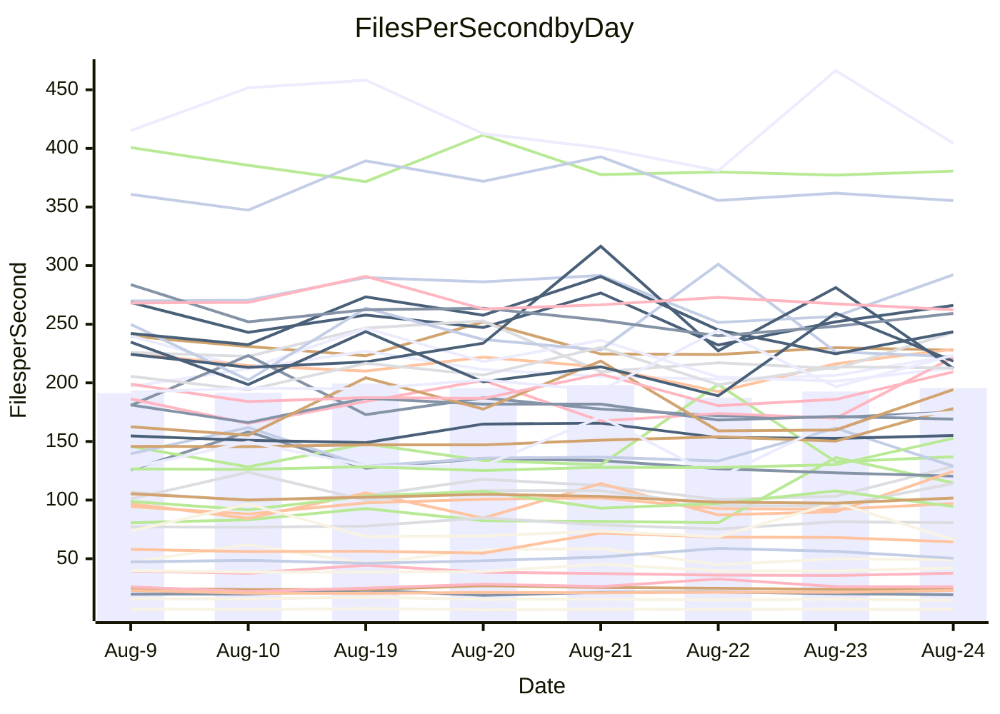

<!---
# This file is auto-generated. Do not edit.
# cspell:disable
--->
# Performance Report

Daily Performance

```mermaid
xychart-beta
    title Files Per Second by Day
    y-axis Files per Second
    x-axis Date [Aug-9, Aug-10, Aug-19, Aug-20, Aug-21, Aug-22, Aug-23, Aug-24]
    bar [191.27, 191.48, 199.45, 195.67, 198.22, 187.40, 192.61, 195.61]
    line [19.76, 19.87, 23.15, 18.80, 21.30, 21.70, 20.11, 19.24]
    line [94.45, 88.13, 97.66, 100.71, 101.93, 92.80, 92.11, 97.07]
    line [106.66, 99.38, 103.80, 117.71, 112.47, 100.50, 103.30, 128.71]
    line [80.61, 83.15, 92.81, 82.44, 81.86, 80.75, 136.22, 114.72]
    line [239.79, 231.09, 223.10, 252.00, 224.60, 224.17, 230.06, 227.93]
    line [269.81, 270.47, 289.77, 286.14, 291.59, 251.52, 256.69, 292.19]
    line [39.52, 37.52, 44.46, 38.46, 37.42, 35.96, 35.65, 37.61]
    line [268.54, 243.09, 257.77, 247.18, 276.72, 232.23, 252.08, 266.01]
    line [6.78, 6.60, 7.51, 6.38, 6.72, 6.55, 6.77, 6.55]
    line [240.17, 211.99, 227.00, 211.38, 205.51, 203.10, 206.43, 223.33]
    line [125.68, 158.27, 127.25, 135.61, 133.76, 126.70, 123.28, 120.42]
    line [225.24, 214.74, 210.02, 221.88, 213.58, 192.56, 216.27, 228.68]
    line [225.91, 222.58, 246.74, 252.74, 209.47, 217.12, 212.13, 242.98]
    line [145.75, 128.32, 148.05, 133.76, 130.09, 198.58, 132.66, 136.89]
    line [24.65, 23.72, 23.68, 26.94, 25.51, 24.79, 23.76, 23.53]
    line [139.45, 161.93, 128.87, 135.71, 136.66, 133.36, 161.38, 128.87]
    line [25.95, 22.03, 24.86, 28.29, 26.21, 32.71, 26.20, 26.09]
    line [154.75, 150.93, 149.02, 164.86, 165.64, 153.35, 152.64, 155.02]
    line [15.80, 15.53, 17.25, 15.28, 15.49, 14.84, 15.46, 14.39]
    line [196.97, 211.99, 246.59, 218.10, 236.31, 204.94, 201.38, 212.81]
    line [180.75, 223.35, 172.94, 187.16, 177.68, 172.01, 170.49, 175.09]
    line [96.93, 84.41, 106.12, 84.61, 114.12, 87.31, 89.99, 124.55]
    line [77.16, 76.75, 77.91, 84.91, 78.76, 75.34, 81.46, 80.77]
    line [400.74, 385.62, 371.65, 411.46, 377.61, 379.88, 377.18, 380.64]
    line [145.79, 145.58, 147.10, 147.08, 151.07, 153.94, 150.27, 178.09]
    line [249.96, 202.34, 263.67, 236.99, 228.06, 301.20, 226.40, 222.40]
    line [186.27, 165.43, 184.07, 202.12, 167.51, 173.85, 169.85, 221.75]
    line [224.37, 213.27, 217.89, 233.79, 316.48, 227.32, 281.23, 212.31]
    line [47.00, 61.84, 45.89, 57.63, 58.67, 44.77, 49.92, 49.06]
    line [127.47, 149.55, 129.16, 129.10, 170.99, 119.13, 167.47, 175.06]
    line [181.18, 166.12, 186.93, 181.85, 181.88, 168.34, 171.35, 169.12]
    line [57.90, 56.15, 56.35, 54.76, 71.89, 68.47, 68.09, 64.39]
    line [101.07, 123.80, 99.87, 108.06, 107.98, 95.34, 94.96, 114.12]
    line [98.84, 91.76, 103.43, 107.49, 93.08, 97.11, 107.90, 94.53]
    line [162.48, 155.40, 204.32, 177.59, 218.64, 159.00, 159.79, 194.26]
    line [360.76, 347.31, 389.41, 371.89, 392.82, 355.53, 361.83, 355.43]
    line [198.91, 184.05, 187.41, 186.67, 207.48, 180.49, 185.92, 209.38]
    line [242.10, 232.62, 273.32, 257.69, 290.62, 245.10, 224.83, 243.49]
    line [73.60, 96.61, 68.89, 69.48, 73.38, 68.77, 97.84, 66.15]
    line [415.14, 451.69, 458.22, 412.53, 400.53, 380.98, 466.37, 404.40]
    line [283.77, 252.09, 262.36, 263.68, 253.37, 240.18, 248.22, 259.20]
    line [22.84, 20.59, 20.47, 21.22, 20.90, 21.42, 21.40, 22.88]
    line [205.56, 193.98, 216.67, 206.61, 230.20, 198.53, 213.69, 212.64]
    line [126.64, 126.17, 128.45, 125.27, 127.94, 127.77, 130.20, 152.67]
    line [105.46, 100.11, 102.43, 104.89, 103.21, 98.21, 97.36, 101.78]
    line [47.26, 48.66, 46.00, 48.26, 51.42, 58.83, 56.30, 50.38]
    line [268.09, 268.70, 290.78, 262.94, 266.60, 272.93, 267.45, 262.37]
    line [234.76, 198.61, 243.75, 200.90, 213.71, 188.91, 259.37, 218.53]
    line [39.98, 38.63, 38.64, 39.11, 45.24, 39.50, 39.66, 42.07]
    line [192.03, 195.48, 194.87, 202.54, 193.62, 244.63, 196.70, 223.56]
```

Time to Process Files

| Repository                                      | Elapsed | Min/Avg/Max          |    SD | SD Graph                |
| ----------------------------------------------- | ------: | :------------------: | ----: | ----------------------- |
| AdaDoom3/AdaDoom3                    |    2.71 | 2.1 /   2.7 /   2.9  |  0.25 | `    ┣━━┻━━╋●━┻━━┫    ` |
| alexiosc/megistos                    |    6.69 | 4.1 /   6.8 /   7.9  |  0.94 | `    ┣━━┻━━●━━┻━━┫    ` |
| apollographql/apollo-server          |    2.00 | 1.8 /   2.4 /   2.8  |  0.26 | `    ┣━●┻━━╋━━┻━━┫    ` |
| aspnetboilerplate/aspnetboilerplate  |    7.04 | 6.3 /   8.4 /   9.1  |  0.97 | `    ┣━●┻━━╋━━┻━━┫    ` |
| aws-amplify/docs                     |   13.64 | 9.6 /  13.0 /  14.0  |  1.03 | `    ┣━━┻━━╋━●┻━━┫    ` |
| Azure/azure-rest-api-specs           |   10.74 | 7.2 /   9.9 /  11.2  |  0.93 | `    ┣━━┻━━╋━━●━━┫    ` |
| bitjson/typescript-starter           |    1.04 | 0.6 /   1.0 /   1.1  |  0.10 | `     ┣━┻━━╋●━┻━┫     ` |
| caddyserver/caddy                    |    3.28 | 2.5 /   3.5 /   3.9  |  0.37 | `    ┣━━┻━●╋━━┻━━┫    ` |
| canada-ca/open-source-logiciel-libre |    1.08 | 0.8 /   1.0 /   1.3  |  0.11 | `     ┣━┻━━╋●━┻━┫     ` |
| chef/chef                            |    4.40 | 3.0 /   4.7 /   5.3  |  0.53 | `    ┣━━┻●━╋━━┻━━┫    ` |
| dart-lang/sdk                        |   51.97 | 34.3 /  55.3 /  64.6 |  7.31 | `  ┣━━━┻━●━╋━━━┻━━━┫  ` |
| django/django                        |   10.24 | 10.2 /  13.0 /  15.0 |  1.51 | `   ┣●━━┻━━╋━━┻━━━┫   ` |
| eslint/eslint                        |    8.63 | 7.6 /   9.6 /  10.8  |  0.75 | `    ┣━●┻━━╋━━┻━━┫    ` |
| exonum/exonum                        |    3.42 | 2.6 /   3.3 /   3.7  |  0.26 | `    ┣━━┻━━╋━●┻━━┫    ` |
| flutter/samples                      |   12.53 | 8.0 /  12.2 /  14.0  |  1.45 | `   ┣━━━┻━━╋●━┻━━━┫   ` |
| gitbucket/gitbucket                  |    3.22 | 2.5 /   3.1 /   3.4  |  0.32 | `    ┣━━┻━━╋●━┻━━┫    ` |
| googleapis/google-cloud-cpp          |  132.68 | 96.3 / 119.4 / 127.8 | 11.40 | `  ┣━━━┻━━━╋━━━┻●━━┫  ` |
| graphql/express-graphql              |    1.10 | 0.7 /   1.1 /   1.2  |  0.10 | `     ┣━┻━━╋●━┻━┫     ` |
| graphql/graphql-js                   |    3.53 | 2.8 /   3.5 /   3.9  |  0.26 | `    ┣━━┻━━●━━┻━━┫    ` |
| graphql/graphql-relay-js             |    1.10 | 0.7 /   1.1 /   1.3  |  0.11 | `     ┣━┻━━╋●━┻━┫     ` |
| graphql/graphql-spec                 |    1.42 | 0.8 /   1.2 /   1.3  |  0.13 | `     ┣━┻━━╋━━┻●┫     ` |
| iluwatar/java-design-patterns        |   12.32 | 8.8 /  12.0 /  12.8  |  1.08 | `    ┣━━┻━━╋●━┻━━┫    ` |
| ktaranov/sqlserver-kit               |    3.40 | 3.1 /   5.2 /   6.2  |  0.93 | `    ●━━┻━━╋━━┻━━┫    ` |
| liriliri/licia                       |    3.83 | 2.9 /   3.7 /   4.1  |  0.31 | `    ┣━━┻━━╋●━┻━━┫    ` |
| MartinThoma/LaTeX-examples           |    6.42 | 4.5 /   5.9 /   7.0  |  0.69 | `    ┣━━┻━━╋━●┻━━┫    ` |
| mdx-js/mdx                           |    1.72 | 1.5 /   1.8 /   1.9  |  0.09 | `     ┣━┻━●╋━━┻━┫     ` |
| microsoft/TypeScript-Website         |    3.68 | 5.0 /   5.2 /   5.6  |  0.19 | `●      ┣━┻╋┻━┫       ` |
| MicrosoftDocs/PowerShell-Docs        |   13.94 | 14.3 /  23.3 /  26.2 |  2.75 | `●   ┣━━┻━━╋━━┻━━┫    ` |
| neovim/nvim-lspconfig                |    3.90 | 3.7 /   4.8 /   5.6  |  0.58 | `    ┣━●┻━━╋━━┻━━┫    ` |
| pagekit/pagekit                      |    3.39 | 1.9 /   3.2 /   3.6  |  0.47 | `    ┣━━┻━━╋●━┻━━┫    ` |
| php/php-src                          |   18.23 | 18.3 /  23.3 /  26.1 |  2.38 | `   ●━━━┻━━╋━━┻━━━┫   ` |
| plasticrake/tplink-smarthome-api     |    1.25 | 0.8 /   1.2 /   1.4  |  0.17 | `     ┣━┻━━●━━┻━┫     ` |
| prettier/prettier                    |    7.66 | 5.8 /   7.3 /   8.0  |  0.68 | `    ┣━━┻━━╋━●┻━━┫    ` |
| pycontribs/jira                      |    1.13 | 0.9 /   1.3 /   1.5  |  0.16 | `     ┣●┻━━╋━━┻━┫     ` |
| RustPython/RustPython                |    9.18 | 5.8 /   8.9 /  11.1  |  1.17 | `    ┣━━┻━━╋●━┻━━┫    ` |
| shoelace-style/shoelace              |    2.69 | 1.8 /   2.5 /   3.0  |  0.41 | `    ┣━━┻━━╋●━┻━━┫    ` |
| slint-ui/slint                       |   15.79 | 11.3 /  15.0 /  17.0 |  1.53 | `   ┣━━━┻━━╋━●┻━━━┫   ` |
| SoftwareBrothers/admin-bro           |    1.84 | 1.6 /   2.3 /   2.6  |  0.24 | `    ●━━┻━━╋━━┻━━┫    ` |
| sveltejs/svelte                      |   22.41 | 16.9 /  21.5 /  23.5 |  1.92 | `   ┣━━━┻━━╋━●┻━━━┫   ` |
| TheAlgorithms/Python                 |    5.43 | 3.0 /   5.4 /   5.9  |  0.57 | `    ┣━━┻━━●━━┻━━┫    ` |
| twbs/bootstrap                       |    1.82 | 1.2 /   1.6 /   1.9  |  0.19 | `     ┣━┻━━╋━━●━┫     ` |
| typescript-cheatsheets/react         |    1.10 | 0.7 /   1.1 /   1.3  |  0.10 | `     ┣━┻━━●━━┻━┫     ` |
| typescript-eslint/typescript-eslint  |    4.10 | 3.3 /   4.1 /   4.7  |  0.30 | `    ┣━━┻━━●━━┻━━┫    ` |
| vitest-dev/vitest                    |   10.51 | 8.2 /  10.3 /  10.8  |  0.63 | `    ┣━━┻━━╋●━┻━━┫    ` |
| w3c/aria-practices                   |    3.36 | 2.3 /   3.2 /   3.5  |  0.23 | `    ┣━━┻━━╋●━┻━━┫    ` |
| w3c/specberus                        |    1.86 | 1.5 /   1.8 /   2.2  |  0.14 | `     ┣━┻━━●━━┻━┫     ` |
| webdeveric/webpack-assets-manifest   |    1.20 | 0.9 /   1.1 /   1.4  |  0.12 | `     ┣━┻━━╋●━┻━┫     ` |
| webpack/webpack                      |    5.48 | 3.7 /   6.1 /   7.4  |  1.05 | `    ┣━━┻●━╋━━┻━━┫    ` |
| wireapp/wire-desktop                 |    1.33 | 1.0 /   1.3 /   1.5  |  0.13 | `     ┣━┻━━╋●━┻━┫     ` |
| wireapp/wire-webapp                  |   10.48 | 10.3 /  12.7 /  14.2 |  0.87 | `  ● ┣━━┻━━╋━━┻━━┫    ` |

Note:
- Elapsed time is in seconds.

Files per Second over Time

| Repository                                      | Files |    Sec |    Fps |     Rel | Trend Fps              |    N |
| ----------------------------------------------- | ----: | -----: | -----: | ------: | ---------------------- | ---: |
| AdaDoom3/AdaDoom3                    |   103 |   2.71 |  38.04 |  -2.88% | `▃▇▂▂▃▃▃█▇▃▃▆▃▃▃▃▂▂▃▃` |   21 |
| alexiosc/megistos                    |   583 |   6.69 |  87.09 |  -1.70% | `▂▂▂▁▂▂▃▅▂▂▂▂▂▂▂▂▂██▃` |   21 |
| apollographql/apollo-server          |   256 |   2.00 | 128.02 |  16.94% | `▃▂▃▆▅▂▃▃▃█▃▅▃▃▆▃▃▃▆▆` |   21 |
| aspnetboilerplate/aspnetboilerplate  |  2288 |   7.04 | 324.82 |  17.29% | `▂▃▃▂▇▃█▂▂▃▂█▃▂█▂▂▂▂▆` |   21 |
| aws-amplify/docs                     |  3030 |  13.64 | 222.14 |  -5.73% | `▃▂▃▆▅▃▃▂▃▃▃█▃▂▂▃▂▃▃▂` |   21 |
| Azure/azure-rest-api-specs           |  2576 |  10.74 | 239.82 |  -8.29% | `▆▃▃▂▄▃▄▄▄▃▄▃▃▄█▄▂▄▆▃` |   21 |
| bitjson/typescript-starter           |    20 |   1.04 |  19.14 |  -6.05% | `▃▃▂▂▂▃█▂▃▂▁▂▂▂▃▄▃▃▂▂` |   21 |
| caddyserver/caddy                    |   338 |   3.28 | 103.02 |   6.73% | `▂▂▆▄▂▂▂▅▃▃▂▃█▆▃▃▃▃▃▄` |   21 |
| canada-ca/open-source-logiciel-libre |     7 |   1.08 |   6.48 |  -4.26% | `▄▃▇▁▄▃█▄▃▂▄▄▃▃▄▃▃▄▃▃` |   21 |
| chef/chef                            |  1035 |   4.40 | 235.32 |   6.11% | `▆▂▂▂█▂▂▂▄▂▂▂▂▂▂▂▂▂▂▃` |   21 |
| dart-lang/sdk                        | 11634 |  51.97 | 223.86 |   4.01% | `▂▁▂▂▂▃▂█▂▅▂▂▂▂▇▂▂▂▂▃` |   21 |
| django/django                        |  2932 |  10.24 | 286.29 |  24.93% | `▃▂▆▃█▄▇▃▅█▃█▅▃▂▃▃▃▂█` |   21 |
| eslint/eslint                        |  2082 |   8.63 | 241.27 |  10.76% | `█▃▃▃▄▄▃▄▃▆▄▄▃▄▃▄▂▄▄▆` |   21 |
| exonum/exonum                        |   421 |   3.42 | 123.15 |  -5.31% | `▃▅▄▃▄█▃▄▄▄█▄▃▄▃▇▄▃▂▃` |   21 |
| flutter/samples                      |  1703 |  12.53 | 135.97 |  -4.41% | `▂▂█▃▂▂▂▄▄▂▂▂▂▁▂▂▇▂▃▂` |   21 |
| gitbucket/gitbucket                  |   418 |   3.22 | 129.79 |  -6.02% | `▃▃▃█▄█▂▃▅█▂▃▃▇▃▃▄█▃▃` |   21 |
| googleapis/google-cloud-cpp          | 21983 | 132.68 | 165.68 |  -7.97% | `▂▂▃▃▃▂█▃▃▇▃▃▃▂▇▂▃▃▃▂` |   21 |
| graphql/express-graphql              |    26 |   1.10 |  23.68 |  -5.00% | `▂▃▂▂▃▃▃▂▂▃▃▃█▅▃▃▃▃▂▃` |   21 |
| graphql/graphql-js                   |   551 |   3.53 | 155.89 |  -0.73% | `▃▂▃▇▃▃▃▃▃█▃▃▄▄▇▄▃▃▃▄` |   21 |
| graphql/graphql-relay-js             |    28 |   1.10 |  25.46 |  -3.78% | `▃▃▃▅▂▁▃▃▃▃▃█▃▃▃▃▆▃▃▃` |   21 |
| graphql/graphql-spec                 |    19 |   1.42 |  13.33 | -15.45% | `▂█▂▂▂▃▇▂▃▃▃▂▂▂▄▂▂▃▃▁` |   21 |
| iluwatar/java-design-patterns        |  2183 |  12.32 | 177.13 |  -2.23% | `▂▃▂▄█▇▂▃▃▃▃▄▆▃▃▃▃▂▃▃` |   21 |
| ktaranov/sqlserver-kit               |   490 |   3.40 | 144.20 |  48.13% | `▂▇▁▄▂▂▂▇▂▁▂▂▂▃▂█▂▂▄▇` |   21 |
| liriliri/licia                       |  1442 |   3.83 | 376.10 |  -3.99% | `▃▂█▇▄▃▃▃▃▃█▄▄▃▃▃▃▃▃▃` |   21 |
| MartinThoma/LaTeX-examples           |  1409 |   6.42 | 219.53 | -10.10% | `█▄▇▃▃▂▃▇▅▃▃▆▃▃▃▃▇▃▃▃` |   21 |
| mdx-js/mdx                           |   139 |   1.72 |  80.61 |   1.72% | `▃▅▃▅▃▄▅▅▃▅▆█▇▅▄▅▄▅▅▅` |   21 |
| microsoft/TypeScript-Website         |   765 |   3.68 | 207.87 |  40.75% | `▃▂▂▃▃▃▃▂▃▃▂▃▃▃▃▃▃▃▃█` |   21 |
| MicrosoftDocs/PowerShell-Docs        |  3126 |  13.94 | 224.26 |  64.03% | `▂▁▂▂▂▃▂▂▂▂▂▂▂█▄▂▁▄▂█` |   21 |
| neovim/nvim-lspconfig                |   871 |   3.90 | 223.36 |  20.38% | `▅█▆▃▅▃▃▆▄▆▆█▃▃▃▃▃▃▇▇` |   21 |
| pagekit/pagekit                      |   741 |   3.39 | 218.42 |  -8.93% | `▁▂▁▄▂▂▂▂▂▅▂▁▂▆█▂▂▄▁▂` |   21 |
| php/php-src                          |  2389 |  18.23 | 131.06 |  26.56% | `▂▃▃▇▃▇▃▅▂▃▇▃▅█▃▂▃▂▃█` |   21 |
| plasticrake/tplink-smarthome-api     |    62 |   1.25 |  49.46 |  -3.68% | `▂▂▂▁▂▅▁▂▂▅▃▂▇▂▃█▂▃▂▃` |   21 |
| prettier/prettier                    |  2699 |   7.66 | 352.14 |  -4.99% | `▃█▃▂▃▃▃█▃▇▃▃▃▇▄▄▃▃▃▃` |   21 |
| pycontribs/jira                      |    80 |   1.13 |  70.83 |  17.57% | `▂▂▂▂▂▂▂▂▂▂▂▂▂█▂▅▄▄▂▅` |   20 |
| RustPython/RustPython                |   877 |   9.18 |  95.55 |  -4.53% | `▂▃▃▆▅▃▃▃▅▃▃█▃▂▃▃▃▄▃▃` |   21 |
| shoelace-style/shoelace              |   440 |   2.69 | 163.58 |  -9.97% | `▂▂▅▂▂▂▂█▆▂▂▂▇▇▇▄▂▂▇▂` |   21 |
| slint-ui/slint                       |  3875 |  15.79 | 245.42 |  -3.87% | `▃▂▃▃▃▂▃█▃▂▃▇▃▆█▃▃▂▃▃` |   21 |
| SoftwareBrothers/admin-bro           |   441 |   1.84 | 240.23 |  24.48% | `▃▃▃▃▃▃▃▃▃▅▂▂▂▂▃█▂▃▂▇` |   21 |
| sveltejs/svelte                      |  9020 |  22.41 | 402.51 |  -4.36% | `▂▃▃▃█▅█▅▂▅▂▃▃▃▂▃▂▆▃▃` |   21 |
| TheAlgorithms/Python                 |  1411 |   5.43 | 260.02 |  -2.27% | `▁▂▂█▂▂▂▂▂▂▂▂▂▁▂▂▁▂▂▂` |   21 |
| twbs/bootstrap                       |   118 |   1.82 |  65.00 | -11.96% | `▂▆▃▂▆█▃▃▃▃▃▄▃▅▃▂▃█▃▂` |   21 |
| typescript-cheatsheets/react         |    24 |   1.10 |  21.80 |   0.36% | `█▁▃▂▃▂▂▂▂▃▂▃▃▂▂▃▃▃▄▃` |   21 |
| typescript-eslint/typescript-eslint  |   869 |   4.10 | 211.97 |   0.58% | `▃▃▄▄▄▃▅▄▄▄▄▂▄█▅▄▃▄▄▄` |   21 |
| vitest-dev/vitest                    |  2790 |  10.51 | 265.45 |  -1.67% | `▃▃▂▂▇▃▃█▃▃▂▄▃▃▃▃▄▃▃▃` |   21 |
| w3c/aria-practices                   |   417 |   3.36 | 124.25 |  -4.14% | `▂▃▂▃▃▃▃▃▃▂▂▃▂▃▃▂▃▃█▂` |   21 |
| w3c/specberus                        |   190 |   1.86 | 102.39 |  -0.99% | `▄▅▄▄▅▄▄▅▅▂█▄▆▅▄▅▄▄▄▅` |   21 |
| webdeveric/webpack-assets-manifest   |    55 |   1.20 |  45.93 |  -6.78% | `▃▄▃▃▅▄▄▃▃▄█▄▂█▄▄▇▇▆▄` |   21 |
| webpack/webpack                      |  1364 |   5.48 | 248.82 |  12.26% | `▄▂▂█▂▂▂█▂▂▃▂▂▁▂▅▂▄▂▄` |   21 |
| wireapp/wire-desktop                 |    51 |   1.33 |  38.37 |  -5.37% | `█▄▄▃▇▄▄▃▄▃▄▄▅▄▇█▄▄▇▄` |   21 |
| wireapp/wire-webapp                  |  2578 |  10.48 | 245.92 |  24.21% | `▃▃▃▄▄▄▄▃▄▄▂▃█▄▃▄█▄▄█` |   21 |

Data Throughput

| Repository                                      | Files |    Sec |     Kps |     Rel | Trend Kps              |    N |
| ----------------------------------------------- | ----: | -----: | ------: | ------: | ---------------------- | ---: |
| AdaDoom3/AdaDoom3                    |   103 |   2.71 |  808.40 |  -2.88% | `▃▇▂▂▃▃▃█▇▃▃▆▃▃▃▃▂▂▃▃` |   21 |
| alexiosc/megistos                    |   583 |   6.69 |  684.32 |  -1.70% | `▂▂▂▁▂▂▃▅▂▂▂▂▂▂▂▂▂██▃` |   21 |
| apollographql/apollo-server          |   256 |   2.00 | 1054.15 |  16.94% | `▃▂▃▆▅▂▃▃▃█▃▅▃▃▆▃▃▃▆▆` |   21 |
| aspnetboilerplate/aspnetboilerplate  |  2288 |   7.04 |  794.44 |  17.31% | `▂▃▃▂▇▃█▂▂▃▂█▃▂█▂▂▂▂▆` |   21 |
| aws-amplify/docs                     |  3030 |  13.64 |  868.40 |  -5.66% | `▃▂▃▆▅▃▃▂▃▃▃█▃▂▂▃▂▃▃▂` |   21 |
| Azure/azure-rest-api-specs           |  2576 |  10.74 |  736.67 |  -7.71% | `▆▃▃▂▄▃▄▄▄▃▄▃▃▄█▄▂▄▆▃` |   21 |
| bitjson/typescript-starter           |    20 |   1.04 |   76.57 |  -6.05% | `▃▃▂▂▂▃█▂▃▂▁▂▂▂▃▄▃▃▂▂` |   21 |
| caddyserver/caddy                    |   338 |   3.28 |  935.07 |   6.25% | `▂▂▆▄▂▂▂▅▃▃▂▃█▆▃▃▃▃▃▄` |   21 |
| canada-ca/open-source-logiciel-libre |     7 |   1.08 |   53.72 |  -4.26% | `▄▃▇▁▄▃█▄▃▂▄▄▃▃▄▃▃▄▃▃` |   21 |
| chef/chef                            |  1035 |   4.40 | 1155.24 |   6.09% | `▆▂▂▂█▂▂▂▄▂▂▂▂▂▂▂▂▂▂▃` |   21 |
| dart-lang/sdk                        | 11634 |  51.97 | 1556.98 |   4.40% | `▂▁▂▂▂▃▂█▂▅▂▂▂▂▇▂▂▂▂▃` |   21 |
| django/django                        |  2932 |  10.24 | 1843.62 |  24.87% | `▃▂▆▃█▄▇▃▅█▃█▅▃▂▃▃▃▂█` |   21 |
| eslint/eslint                        |  2082 |   8.63 | 1693.89 |  10.77% | `█▃▃▃▄▄▃▄▃▆▄▄▃▄▃▄▂▄▄▆` |   21 |
| exonum/exonum                        |   421 |   3.42 | 1177.95 |  -5.31% | `▃▅▄▃▄█▃▄▄▄█▄▃▄▃▇▄▃▂▃` |   21 |
| flutter/samples                      |  1703 |  12.53 |  810.45 |  -4.55% | `▂▂█▃▂▂▂▄▄▂▂▂▂▁▂▂▇▂▃▂` |   21 |
| gitbucket/gitbucket                  |   418 |   3.22 |  642.10 |  -5.66% | `▃▂▃█▄█▂▃▅█▂▃▃█▃▃▄█▃▃` |   21 |
| googleapis/google-cloud-cpp          | 21983 | 132.68 | 1441.40 |  -7.81% | `▂▂▃▃▃▂█▃▃▇▃▃▃▂▇▂▃▃▃▂` |   21 |
| graphql/express-graphql              |    26 |   1.10 |  108.39 |  -5.00% | `▂▃▂▂▃▃▃▂▂▃▃▃█▅▃▃▃▃▂▃` |   21 |
| graphql/graphql-js                   |   551 |   3.53 | 1162.53 |  -0.73% | `▃▂▃▇▃▃▃▃▃█▃▃▄▄▇▄▃▃▃▄` |   21 |
| graphql/graphql-relay-js             |    28 |   1.10 |  100.04 |  -3.78% | `▃▃▃▅▂▁▃▃▃▃▃█▃▃▃▃▆▃▃▃` |   21 |
| graphql/graphql-spec                 |    19 |   1.42 |  446.33 | -15.45% | `▂█▂▂▂▃▇▂▃▃▃▂▂▂▄▂▂▃▃▁` |   21 |
| iluwatar/java-design-patterns        |  2183 |  12.32 |  547.22 |  -2.14% | `▂▃▂▄█▇▃▃▃▃▃▄▆▃▃▃▃▃▃▃` |   21 |
| ktaranov/sqlserver-kit               |   490 |   3.40 | 2184.51 |  48.13% | `▂▇▁▄▂▂▂▇▂▁▂▂▂▃▂█▂▂▄▇` |   21 |
| liriliri/licia                       |  1442 |   3.83 |  450.96 |  -3.82% | `▃▂█▇▄▃▃▃▃▃█▄▄▃▃▄▃▃▃▃` |   21 |
| MartinThoma/LaTeX-examples           |  1409 |   6.42 |  453.39 | -10.10% | `█▄▇▃▃▂▃▇▅▃▃▆▃▃▃▃▇▃▃▃` |   21 |
| mdx-js/mdx                           |   139 |   1.72 |  379.88 |   1.72% | `▃▅▃▅▃▄▅▅▃▅▆█▇▅▄▅▄▅▅▅` |   21 |
| microsoft/TypeScript-Website         |   765 |   3.68 | 1433.38 |  40.76% | `▃▂▂▃▃▃▃▂▃▃▂▃▃▃▃▃▃▃▃█` |   21 |
| MicrosoftDocs/PowerShell-Docs        |  3126 |  13.94 | 2396.24 |  64.15% | `▂▁▂▂▂▃▂▂▂▂▂▂▂█▄▂▁▄▂█` |   21 |
| neovim/nvim-lspconfig                |   871 |   3.90 |  655.98 |  20.43% | `▅█▆▃▅▃▃▆▄▆▆█▃▃▃▃▃▃▇▇` |   21 |
| pagekit/pagekit                      |   741 |   3.39 |  455.41 |  -8.93% | `▁▂▁▄▂▂▂▂▂▅▂▁▂▆█▂▂▄▁▂` |   21 |
| php/php-src                          |  2389 |  18.23 | 2320.29 |  26.67% | `▂▃▃▇▃▇▃▅▂▃▇▃▅█▃▂▃▂▃█` |   21 |
| plasticrake/tplink-smarthome-api     |    62 |   1.25 |  267.27 |  -3.68% | `▂▂▂▁▂▅▁▂▂▅▃▂▇▂▃█▂▃▂▃` |   21 |
| prettier/prettier                    |  2699 |   7.66 |  496.31 |  -5.43% | `▃█▃▂▃▃▃█▃▇▃▃▃▇▄▄▃▃▃▃` |   21 |
| pycontribs/jira                      |    80 |   1.13 |  500.27 |  17.57% | `▂▂▂▂▂▂▂▂▂▂▂▂▂█▂▅▄▄▂▅` |   20 |
| RustPython/RustPython                |   877 |   9.18 | 2112.15 |  -4.05% | `▂▃▃▆▅▃▃▃▅▃▃█▃▂▃▃▃▄▃▃` |   21 |
| shoelace-style/shoelace              |   440 |   2.69 |  790.01 |  -9.97% | `▂▂▅▂▂▂▂█▆▂▂▂▇▇▇▄▂▂▇▂` |   21 |
| slint-ui/slint                       |  3875 |  15.79 | 1324.06 |  -3.50% | `▃▂▃▃▃▂▃█▃▂▃▇▃▆█▃▃▂▃▃` |   21 |
| SoftwareBrothers/admin-bro           |   441 |   1.84 |  529.50 |  24.48% | `▃▃▃▃▃▃▃▃▃▅▂▂▂▂▃█▂▃▂▇` |   21 |
| sveltejs/svelte                      |  9020 |  22.41 |  277.29 |  -4.03% | `▂▃▃▃█▅█▅▂▅▂▃▃▃▂▃▂▆▃▃` |   21 |
| TheAlgorithms/Python                 |  1411 |   5.43 |  665.07 |  -2.27% | `▁▂▂█▂▂▂▂▂▂▂▂▂▁▂▂▁▂▂▂` |   21 |
| twbs/bootstrap                       |   118 |   1.82 |  533.20 | -11.96% | `▂▆▃▂▆█▃▃▃▃▃▄▃▅▃▂▃█▃▂` |   21 |
| typescript-cheatsheets/react         |    24 |   1.10 |  197.15 |   0.36% | `█▁▃▂▃▂▂▂▂▃▂▃▃▂▂▃▃▃▄▃` |   21 |
| typescript-eslint/typescript-eslint  |   869 |   4.10 |  712.01 |   0.52% | `▃▃▄▄▄▃▅▄▄▄▄▂▄█▅▄▃▄▄▄` |   21 |
| vitest-dev/vitest                    |  2790 |  10.51 |  769.80 |  -0.43% | `▃▃▂▂▆▃▃█▄▃▃▄▃▃▃▄▄▃▃▃` |   21 |
| w3c/aria-practices                   |   417 |   3.36 | 1168.58 |  -4.14% | `▂▃▂▃▃▃▃▃▃▂▂▃▂▃▃▂▃▃█▂` |   21 |
| w3c/specberus                        |   190 |   1.86 |  334.64 |  -0.93% | `▄▅▄▄▅▄▄▅▅▂█▄▆▅▄▅▄▄▄▅` |   21 |
| webdeveric/webpack-assets-manifest   |    55 |   1.20 |  106.07 |  -6.78% | `▃▄▃▃▅▄▄▃▃▄█▄▂█▄▄▇▇▆▄` |   21 |
| webpack/webpack                      |  1364 |   5.48 | 1688.62 |  16.69% | `▃▁▁▇▂▁▂█▂▂▃▂▂▁▂▅▂▅▂▄` |   21 |
| wireapp/wire-desktop                 |    51 |   1.33 |  163.27 |  -5.37% | `█▄▄▃▇▄▄▃▄▃▄▄▅▄▇█▄▄▇▄` |   21 |
| wireapp/wire-webapp                  |  2578 |  10.48 | 1048.35 |  25.62% | `▃▃▃▄▄▃▄▃▄▃▂▃█▄▃▄█▄▄█` |   21 |

