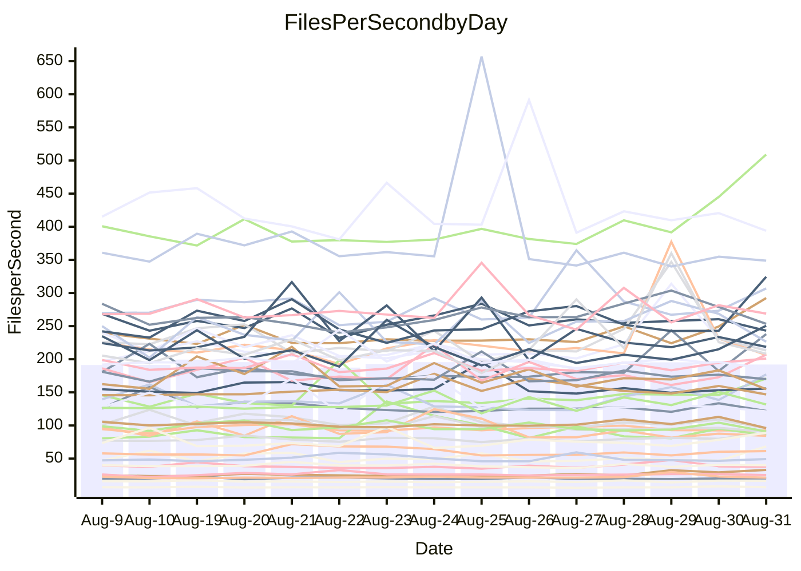

<!---
# This file is auto-generated. Do not edit.
# cspell:disable
--->
# Performance Report

Daily Performance

```mermaid
xychart-beta
    title Files Per Second by Day
    y-axis Files per Second
    x-axis Date [Aug-9, Aug-10, Aug-19, Aug-20, Aug-21, Aug-22, Aug-23, Aug-24, Aug-25, Aug-26, Aug-27, Aug-28, Aug-29, Aug-30, Aug-31]
    bar [191.27, 191.48, 199.45, 195.67, 198.22, 187.40, 192.61, 195.61, 200.69, 190.24, 185.15, 191.23, 195.37, 191.39, 192.02]
    line [19.76, 19.87, 23.15, 18.80, 21.30, 21.70, 20.11, 19.24, 18.97, 21.74, 19.44, 19.50, 19.20, 19.98, 20.11]
    line [94.45, 88.13, 97.66, 100.71, 101.93, 92.80, 92.11, 97.07, 92.83, 96.14, 97.78, 99.79, 92.99, 92.61, 92.32]
    line [106.66, 99.38, 103.80, 117.71, 112.47, 100.50, 103.30, 128.71, 104.89, 98.28, 96.78, 104.60, 101.13, 109.23, 95.45]
    line [80.61, 83.15, 92.81, 82.44, 81.86, 80.75, 136.22, 114.72, 99.92, 81.00, 98.60, 83.62, 80.81, 95.31, 85.20]
    line [239.79, 231.09, 223.10, 252.00, 224.60, 224.17, 230.06, 227.93, 228.22, 229.99, 225.97, 249.68, 224.12, 249.45, 292.39]
    line [269.81, 270.47, 289.77, 286.14, 291.59, 251.52, 256.69, 292.19, 260.02, 262.94, 364.38, 287.21, 267.07, 273.26, 306.93]
    line [39.52, 37.52, 44.46, 38.46, 37.42, 35.96, 35.65, 37.61, 34.82, 39.47, 36.12, 40.86, 48.01, 38.35, 37.65]
    line [268.54, 243.09, 257.77, 247.18, 276.72, 232.23, 252.08, 266.01, 283.94, 251.01, 260.27, 254.92, 257.60, 260.42, 243.17]
    line [6.78, 6.60, 7.51, 6.38, 6.72, 6.55, 6.77, 6.55, 6.58, 6.64, 6.06, 6.53, 6.57, 8.03, 6.79]
    line [240.17, 211.99, 227.00, 211.38, 205.51, 203.10, 206.43, 223.33, 206.89, 208.72, 201.20, 222.72, 313.85, 230.65, 214.26]
    line [125.68, 158.27, 127.25, 135.61, 133.76, 126.70, 123.28, 120.42, 121.90, 125.42, 125.26, 127.33, 120.64, 133.49, 121.99]
    line [225.24, 214.74, 210.02, 221.88, 213.58, 192.56, 216.27, 228.68, 220.47, 211.98, 216.89, 208.83, 377.28, 231.14, 206.45]
    line [225.91, 222.58, 246.74, 252.74, 209.47, 217.12, 212.13, 242.98, 195.81, 213.43, 211.78, 245.83, 346.89, 231.16, 213.21]
    line [145.75, 128.32, 148.05, 133.76, 130.09, 198.58, 132.66, 136.89, 133.84, 140.74, 138.14, 147.54, 146.55, 146.02, 170.88]
    line [24.65, 23.72, 23.68, 26.94, 25.51, 24.79, 23.76, 23.53, 22.75, 24.32, 26.78, 24.44, 32.43, 29.19, 32.91]
    line [139.45, 161.93, 128.87, 135.71, 136.66, 133.36, 161.38, 128.87, 127.62, 123.35, 123.11, 143.71, 157.94, 138.50, 177.17]
    line [25.95, 22.03, 24.86, 28.29, 26.21, 32.71, 26.20, 26.09, 26.00, 24.43, 25.37, 25.72, 26.51, 26.59, 25.17]
    line [154.75, 150.93, 149.02, 164.86, 165.64, 153.35, 152.64, 155.02, 195.52, 151.70, 148.17, 156.31, 149.39, 153.11, 155.75]
    line [15.80, 15.53, 17.25, 15.28, 15.49, 14.84, 15.46, 14.39, 15.01, 15.63, 14.69, 17.08, 14.10, 16.71, 16.57]
    line [196.97, 211.99, 246.59, 218.10, 236.31, 204.94, 201.38, 212.81, 200.01, 195.34, 186.50, 194.59, 201.00, 192.78, 201.08]
    line [180.75, 223.35, 172.94, 187.16, 177.68, 172.01, 170.49, 175.09, 173.22, 173.59, 180.48, 179.74, 243.56, 182.28, 237.89]
    line [96.93, 84.41, 106.12, 84.61, 114.12, 87.31, 89.99, 124.55, 110.24, 81.92, 82.24, 92.49, 81.67, 87.59, 84.38]
    line [77.16, 76.75, 77.91, 84.91, 78.76, 75.34, 81.46, 80.77, 74.97, 79.78, 75.90, 79.64, 81.40, 79.85, 88.60]
    line [400.74, 385.62, 371.65, 411.46, 377.61, 379.88, 377.18, 380.64, 396.91, 381.52, 374.08, 409.79, 391.59, 445.01, 509.04]
    line [145.79, 145.58, 147.10, 147.08, 151.07, 153.94, 150.27, 178.09, 152.08, 170.66, 160.71, 152.01, 148.28, 159.68, 146.89]
    line [249.96, 202.34, 263.67, 236.99, 228.06, 301.20, 226.40, 222.40, 289.06, 224.56, 256.87, 257.70, 287.97, 268.68, 226.41]
    line [186.27, 165.43, 184.07, 202.12, 167.51, 173.85, 169.85, 221.75, 167.75, 195.90, 170.00, 175.89, 161.05, 172.78, 207.09]
    line [224.37, 213.27, 217.89, 233.79, 316.48, 227.32, 281.23, 212.31, 293.11, 198.49, 245.94, 225.24, 218.17, 233.60, 218.68]
    line [47.00, 61.84, 45.89, 57.63, 58.67, 44.77, 49.92, 49.06, 57.90, 45.60, 46.71, 50.51, 48.37, 46.85, 68.37]
    line [127.47, 149.55, 129.16, 129.10, 170.99, 119.13, 167.47, 175.06, 125.57, 143.51, 123.67, 127.21, 130.16, 128.18, 121.29]
    line [181.18, 166.12, 186.93, 181.85, 181.88, 168.34, 171.35, 169.12, 211.70, 166.64, 168.34, 182.86, 173.63, 176.66, 169.92]
    line [57.90, 56.15, 56.35, 54.76, 71.89, 68.47, 68.09, 64.39, 54.76, 55.64, 55.71, 59.28, 54.85, 60.20, 61.33]
    line [101.07, 123.80, 99.87, 108.06, 107.98, 95.34, 94.96, 114.12, 97.84, 103.09, 93.25, 94.27, 95.28, 96.54, 90.56]
    line [98.84, 91.76, 103.43, 107.49, 93.08, 97.11, 107.90, 94.53, 94.47, 104.38, 94.67, 92.38, 93.95, 104.17, 90.92]
    line [162.48, 155.40, 204.32, 177.59, 218.64, 159.00, 159.79, 194.26, 164.45, 184.75, 158.60, 171.47, 169.60, 183.25, 154.77]
    line [360.76, 347.31, 389.41, 371.89, 392.82, 355.53, 361.83, 355.43, 657.12, 351.25, 341.51, 360.76, 340.11, 354.77, 348.81]
    line [198.91, 184.05, 187.41, 186.67, 207.48, 180.49, 185.92, 209.38, 182.67, 186.49, 182.43, 194.97, 183.27, 194.85, 201.06]
    line [242.10, 232.62, 273.32, 257.69, 290.62, 245.10, 224.83, 243.49, 245.36, 272.30, 280.33, 252.18, 242.64, 242.97, 324.49]
    line [73.60, 96.61, 68.89, 69.48, 73.38, 68.77, 97.84, 66.15, 69.59, 78.77, 75.57, 73.80, 69.15, 78.35, 89.02]
    line [415.14, 451.69, 458.22, 412.53, 400.53, 380.98, 466.37, 404.40, 403.18, 591.49, 390.96, 423.25, 409.89, 420.57, 394.01]
    line [283.77, 252.09, 262.36, 263.68, 253.37, 240.18, 248.22, 259.20, 278.18, 263.50, 263.68, 284.05, 303.63, 278.91, 253.41]
    line [22.84, 20.59, 20.47, 21.22, 20.90, 21.42, 21.40, 22.88, 21.36, 21.22, 21.19, 22.04, 29.75, 23.02, 21.29]
    line [205.56, 193.98, 216.67, 206.61, 230.20, 198.53, 213.69, 212.64, 179.07, 214.07, 290.22, 216.81, 359.94, 225.73, 208.40]
    line [126.64, 126.17, 128.45, 125.27, 127.94, 127.77, 130.20, 152.67, 118.34, 143.02, 122.15, 142.33, 130.77, 150.54, 131.68]
    line [105.46, 100.11, 102.43, 104.89, 103.21, 98.21, 97.36, 101.78, 100.00, 99.58, 101.28, 109.08, 102.06, 113.06, 96.04]
    line [47.26, 48.66, 46.00, 48.26, 51.42, 58.83, 56.30, 50.38, 45.97, 45.91, 59.43, 48.16, 47.53, 46.75, 49.29]
    line [268.09, 268.70, 290.78, 262.94, 266.60, 272.93, 267.45, 262.37, 345.57, 266.69, 244.68, 307.76, 255.74, 281.64, 268.92]
    line [234.76, 198.61, 243.75, 200.90, 213.71, 188.91, 259.37, 218.53, 190.79, 215.33, 194.36, 206.72, 199.24, 215.14, 250.48]
    line [39.98, 38.63, 38.64, 39.11, 45.24, 39.50, 39.66, 42.07, 38.23, 36.94, 35.58, 41.81, 37.53, 40.57, 39.90]
    line [192.03, 195.48, 194.87, 202.54, 193.62, 244.63, 196.70, 223.56, 194.58, 199.46, 185.25, 194.89, 191.72, 195.81, 185.88]
```

Time to Process Files

| Repository                                      | Elapsed | Min/Avg/Max          |    SD | SD Graph                |
| ----------------------------------------------- | ------: | :------------------: | ----: | ----------------------- |
| AdaDoom3/AdaDoom3                    |    2.74 | 2.1 /   2.7 /   3.0  |  0.27 | `    ┣━━┻━━╋●━┻━━┫    ` |
| alexiosc/megistos                    |    6.84 | 4.1 /   6.7 /   7.9  |  0.87 | `    ┣━━┻━━╋●━┻━━┫    ` |
| apollographql/apollo-server          |    2.68 | 1.8 /   2.4 /   2.8  |  0.26 | `    ┣━━┻━━╋━━●━━┫    ` |
| aspnetboilerplate/aspnetboilerplate  |    7.45 | 4.9 /   8.3 /   9.3  |  1.06 | `    ┣━━┻●━╋━━┻━━┫    ` |
| aws-amplify/docs                     |   10.36 | 8.6 /  12.9 /  14.3  |  1.26 | `    ●━━┻━━╋━━┻━━┫    ` |
| Azure/azure-rest-api-specs           |   10.59 | 7.2 /  10.0 /  11.2  |  0.77 | `    ┣━━┻━━╋━━●━━┫    ` |
| bitjson/typescript-starter           |    0.99 | 0.6 /   1.0 /   1.1  |  0.09 | `     ┣━┻━━●━━┻━┫     ` |
| caddyserver/caddy                    |    3.66 | 2.5 /   3.5 /   3.9  |  0.34 | `    ┣━━┻━━╋●━┻━━┫    ` |
| canada-ca/open-source-logiciel-libre |    1.03 | 0.6 /   1.0 /   1.3  |  0.12 | `     ┣━┻━━●━━┻━┫     ` |
| chef/chef                            |    4.83 | 3.0 /   4.7 /   5.4  |  0.56 | `    ┣━━┻━━╋●━┻━━┫    ` |
| dart-lang/sdk                        |   57.86 | 34.3 /  57.4 /  64.6 |  5.97 | `  ┣━━━┻━━━●━━━┻━━━┫  ` |
| django/django                        |   13.75 | 7.5 /  12.9 /  15.1  |  1.81 | `   ┣━━━┻━━╋━●┻━━━┫   ` |
| eslint/eslint                        |   10.08 | 5.5 /   9.5 /  10.8  |  0.98 | `    ┣━━┻━━╋━●┻━━┫    ` |
| exonum/exonum                        |    3.45 | 2.6 /   3.3 /   3.7  |  0.26 | `    ┣━━┻━━╋━●┻━━┫    ` |
| flutter/samples                      |    9.97 | 8.0 /  12.1 /  14.0  |  1.40 | `    ┣●━┻━━╋━━┻━━┫    ` |
| gitbucket/gitbucket                  |    2.36 | 2.1 /   3.1 /   3.6  |  0.36 | `    ●━━┻━━╋━━┻━━┫    ` |
| googleapis/google-cloud-cpp          |  129.37 | 83.3 / 122.4 / 142.3 | 12.78 | `  ┣━━━┻━━━╋━●━┻━━━┫  ` |
| graphql/express-graphql              |    0.79 | 0.7 /   1.0 /   1.2  |  0.13 | `     ●━┻━━╋━━┻━┫     ` |
| graphql/graphql-js                   |    3.54 | 2.8 /   3.5 /   3.9  |  0.26 | `    ┣━━┻━━●━━┻━━┫    ` |
| graphql/graphql-relay-js             |    1.11 | 0.7 /   1.1 /   1.3  |  0.09 | `     ┣━┻━━╋●━┻━┫     ` |
| graphql/graphql-spec                 |    1.15 | 0.8 /   1.2 /   1.4  |  0.15 | `     ┣━┻━●╋━━┻━┫     ` |
| iluwatar/java-design-patterns        |    9.18 | 8.8 /  12.0 /  13.3  |  1.05 | ` ●  ┣━━┻━━╋━━┻━━┫    ` |
| ktaranov/sqlserver-kit               |    5.81 | 3.1 /   5.4 /   6.2  |  0.88 | `    ┣━━┻━━╋━●┻━━┫    ` |
| liriliri/licia                       |    2.83 | 2.8 /   3.6 /   4.1  |  0.36 | `    ●━━┻━━╋━━┻━━┫    ` |
| MartinThoma/LaTeX-examples           |    6.22 | 3.5 /   5.7 /   7.0  |  0.80 | `    ┣━━┻━━╋━●┻━━┫    ` |
| mdx-js/mdx                           |    1.57 | 1.3 /   1.8 /   2.0  |  0.12 | `     ┣●┻━━╋━━┻━┫     ` |
| microsoft/TypeScript-Website         |    5.21 | 3.7 /   5.0 /   5.6  |  0.44 | `    ┣━━┻━━╋●━┻━━┫    ` |
| MicrosoftDocs/PowerShell-Docs        |   25.77 | 13.9 /  23.6 /  28.2 |  2.83 | `   ┣━━━┻━━╋━━●━━━┫   ` |
| neovim/nvim-lspconfig                |    4.21 | 3.7 /   4.9 /   5.6  |  0.58 | `    ┣━━●━━╋━━┻━━┫    ` |
| pagekit/pagekit                      |    3.39 | 1.9 /   3.2 /   4.1  |  0.42 | `    ┣━━┻━━╋●━┻━━┫    ` |
| php/php-src                          |   26.38 | 18.2 /  23.9 /  26.8 |  2.25 | `   ┣━━━┻━━╋━━┻●━━┫   ` |
| plasticrake/tplink-smarthome-api     |    0.91 | 0.8 /   1.3 /   1.4  |  0.14 | `   ● ┣━┻━━╋━━┻━┫     ` |
| prettier/prettier                    |    7.74 | 4.1 /   7.4 /   8.2  |  0.79 | `    ┣━━┻━━╋●━┻━━┫    ` |
| pycontribs/jira                      |    1.30 | 0.9 /   1.4 /   1.5  |  0.15 | `     ┣━┻━●╋━━┻━┫     ` |
| RustPython/RustPython                |    9.65 | 5.6 /   9.0 /  11.1  |  1.09 | `    ┣━━┻━━╋━●┻━━┫    ` |
| shoelace-style/shoelace              |    2.84 | 1.8 /   2.5 /   3.0  |  0.35 | `    ┣━━┻━━╋━━●━━┫    ` |
| slint-ui/slint                       |   11.94 | 11.3 /  15.2 /  17.0 |  1.45 | `   ●━━━┻━━╋━━┻━━━┫   ` |
| SoftwareBrothers/admin-bro           |    2.19 | 1.6 /   2.3 /   2.6  |  0.22 | `     ┣━┻━●╋━━┻━┫     ` |
| sveltejs/svelte                      |   22.89 | 12.5 /  21.4 /  23.6 |  2.37 | `   ┣━━━┻━━╋━●┻━━━┫   ` |
| TheAlgorithms/Python                 |    5.57 | 3.0 /   5.3 /   5.9  |  0.54 | `    ┣━━┻━━╋━●┻━━┫    ` |
| twbs/bootstrap                       |    1.33 | 1.2 /   1.6 /   1.9  |  0.20 | `     ┣●┻━━╋━━┻━┫     ` |
| typescript-cheatsheets/react         |    1.13 | 0.7 /   1.1 /   1.3  |  0.11 | `     ┣━┻━━╋●━┻━┫     ` |
| typescript-eslint/typescript-eslint  |    4.17 | 2.4 /   4.0 /   4.9  |  0.48 | `    ┣━━┻━━╋●━┻━━┫    ` |
| vitest-dev/vitest                    |   10.37 | 6.6 /  10.1 /  11.9  |  1.06 | `    ┣━━┻━━╋●━┻━━┫    ` |
| w3c/aria-practices                   |    3.17 | 2.1 /   3.1 /   3.6  |  0.34 | `    ┣━━┻━━●━━┻━━┫    ` |
| w3c/specberus                        |    1.98 | 1.3 /   1.8 /   2.2  |  0.17 | `     ┣━┻━━╋━━●━┫     ` |
| webdeveric/webpack-assets-manifest   |    1.12 | 0.8 /   1.1 /   1.4  |  0.12 | `     ┣━┻━●╋━━┻━┫     ` |
| webpack/webpack                      |    5.45 | 3.7 /   6.3 /   7.6  |  0.91 | `    ┣━━●━━╋━━┻━━┫    ` |
| wireapp/wire-desktop                 |    1.28 | 0.9 /   1.3 /   1.5  |  0.13 | `     ┣━┻━━●━━┻━┫     ` |
| wireapp/wire-webapp                  |   13.87 | 10.3 /  12.9 /  14.5 |  0.91 | `    ┣━━┻━━╋━━●━━┫    ` |

Note:
- Elapsed time is in seconds.

Files per Second over Time

| Repository                                      | Files |    Sec |    Fps |     Rel | Trend Fps              |    N |
| ----------------------------------------------- | ----: | -----: | -----: | ------: | ---------------------- | ---: |
| AdaDoom3/AdaDoom3                    |   103 |   2.74 |  37.65 |  -4.00% | `▂▄▄▃▃▃▆█▂▂▇██▃▃▃▃▂▃▃` |   41 |
| alexiosc/megistos                    |   583 |   6.84 |  85.20 |  -4.46% | `▅▂▃▃▆▃▄▂▃▂▄▂▃▃▆▃▆▃█▃` |   41 |
| apollographql/apollo-server          |   256 |   2.68 |  95.45 | -11.36% | `▄▃▃▂▃▄▃█▃▃▃▃▃▇▄▄▂█▃▂` |   41 |
| aspnetboilerplate/aspnetboilerplate  |  2288 |   7.45 | 306.93 |   8.88% | `▂▂▂█▂▄▂▅▂▁▂▂▁▂▂▄▂▂▂▃` |   41 |
| aws-amplify/docs                     |  3030 |  10.36 | 292.39 |  22.58% | `▂▂▂▂▂▅▂▂▁▇▂▂▂▃█▂▂▂▃▅` |   41 |
| Azure/azure-rest-api-specs           |  2576 |  10.59 | 243.17 |  -6.37% | `█▄▅▇▄▅▄▄▄▅█▅▄▇▄▅█▅▄▄` |   41 |
| bitjson/typescript-starter           |    20 |   0.99 |  20.11 |   0.03% | `▃▃█▄▃▃█▂▃▃▃▃▄▇▄▄▄▄▃▄` |   41 |
| caddyserver/caddy                    |   338 |   3.66 |  92.32 |  -4.19% | `▃▄▄▃▆▃▄█▃▃▇▃▄▄▄▃▄▃▃▃` |   41 |
| canada-ca/open-source-logiciel-libre |     7 |   1.03 |   6.79 |  -1.53% | `▂▃▃▂▁▃▂▂▃▂▃▂▅▂▃▄▃▄█▃` |   41 |
| chef/chef                            |  1035 |   4.83 | 214.26 |  -4.35% | `▂▂▃▂▂▃▃▃▃▇▂█▂▇▂▃▃▅▄▃` |   41 |
| dart-lang/sdk                        | 11634 |  57.86 | 201.08 |  -2.15% | `▇▆▆▅▅▆▇▆▅▇▆▇▇▆▆▇▄█▄▇` |   41 |
| django/django                        |  2932 |  13.75 | 213.21 |  -8.80% | `▁▂▂▂▂█▂▂▂▂▂▇▂▂▄▂▄▂▁▂` |   41 |
| eslint/eslint                        |  2082 |  10.08 | 206.45 |  -7.42% | `▂▂▂▂▂▂▂▂▁▂▂█▂▄▂▂▂▄▂▂` |   41 |
| exonum/exonum                        |   421 |   3.45 | 121.99 |  -5.57% | `▃▄▃▃▃▃▃▃▇▄▃▃▇▄▃▄▃█▃▃` |   41 |
| flutter/samples                      |  1703 |   9.97 | 170.88 |  19.38% | `▃▂▄▃▂▆▂▄▄▄▂▄▂█▄▂▂▄▃▆` |   41 |
| gitbucket/gitbucket                  |   418 |   2.36 | 177.17 |  28.79% | `▂▂▂▂▂▁▂▂█▅▂▅▁▃▂▃▆▄▂▆` |   41 |
| googleapis/google-cloud-cpp          | 21983 | 129.37 | 169.92 |  -5.02% | `▅▂▂▂▂▂▂▁▃▂█▃▃▂▂▂▂▃▅▂` |   41 |
| graphql/express-graphql              |    26 |   0.79 |  32.91 |  27.84% | `▂▂▃▂▅▂▂▂▂▂▄▅▂▃▅▄█▄▂▆` |   41 |
| graphql/graphql-js                   |   551 |   3.54 | 155.75 |  -0.34% | `█▃▃▂▃▄▃▂▂█▄▃▃▃▃▃▄▄▃▄` |   41 |
| graphql/graphql-relay-js             |    28 |   1.11 |  25.17 |  -3.90% | `▄▃▃▃▄▄▃▃▆▃▃▄▃▄▄▃█▄▄▃` |   41 |
| graphql/graphql-spec                 |    19 |   1.15 |  16.57 |   3.91% | `▂▃▂▂▂▃▂▄▃▂▇▂█▄▂▂▂▂▃▃` |   41 |
| iluwatar/java-design-patterns        |  2183 |   9.18 | 237.89 |  30.73% | `▃▃▃▃▃▃▄▃▃▃▃█▂▃▃▇▃▃▃█` |   41 |
| ktaranov/sqlserver-kit               |   490 |   5.81 |  84.38 | -10.76% | `▇▂▂▂▂▆▂█▂▃▂▂▆▂▃▂▂▃▃▃` |   41 |
| liriliri/licia                       |  1442 |   2.83 | 509.04 |  26.67% | `▄▃▃▂▃▅▃▃▃▂█▃▃▃███▃▅█` |   41 |
| MartinThoma/LaTeX-examples           |  1409 |   6.22 | 226.41 | -10.00% | `▄▂▂▄▂▇▂▂▂▂▂▄█▂▄▂▄▂▂▂` |   41 |
| mdx-js/mdx                           |   139 |   1.57 |  88.60 |  11.79% | `▂▄▂▃▂▃▅▃▂▅▂▃▂▂▃▂█▃▂▅` |   41 |
| microsoft/TypeScript-Website         |   765 |   5.21 | 146.89 |  -4.44% | `▃▇▃▃▅▃▃▃▅▃▃▃▃▂▃▅▃█▃▃` |   41 |
| MicrosoftDocs/PowerShell-Docs        |  3126 |  25.77 | 121.29 | -10.34% | `▄█▄▄▃▃▄▄▄▄▄▄▄▄▇▄▃▄▂▃` |   41 |
| neovim/nvim-lspconfig                |   871 |   4.21 | 207.09 |  14.04% | `▃▂█▃▃▃▅▂▂▆▃▂▃▃▂▇▃▃▂▆` |   41 |
| pagekit/pagekit                      |   741 |   3.39 | 218.68 |  -7.01% | `▇▃▁▆▃▃▅▃▄▃▃▃▃▄█▄▃▃▃▃` |   41 |
| php/php-src                          |  2389 |  26.38 |  90.56 | -10.16% | `▄▃█▃▄▄▃▃▂▅▄▄▄▅▃▄▅▄▄▃` |   41 |
| plasticrake/tplink-smarthome-api     |    62 |   0.91 |  68.37 |  36.76% | `▅▃▂▃▂▂▃▃▃▇▃▃▃▂▃▂▃▃▂█` |   41 |
| prettier/prettier                    |  2699 |   7.74 | 348.81 |  -5.70% | `█▂▂▂▁▂▂▁▁▄▁▁▂▂▁▂▂▂▂▂` |   41 |
| pycontribs/jira                      |    80 |   1.30 |  61.33 |   2.85% | `▃▃▃▃▃▃█▃▆▂▄▃▃██▃▃▃▃▅` |   40 |
| RustPython/RustPython                |   877 |   9.65 |  90.92 |  -8.35% | `▃▂▅▃▂▂▃▂▂▂▃▃█▂▃▂▄▂▃▂` |   41 |
| shoelace-style/shoelace              |   440 |   2.84 | 154.77 | -13.21% | `▃▆▃▂▃▆▂▅▃▃▂▃▃▂▂▄█▃█▂` |   41 |
| slint-ui/slint                       |  3875 |  11.94 | 324.49 |  27.75% | `▃▇▂▃█▃▃▃▇▃▃▃▃▃▃▃▃▃▃█` |   41 |
| SoftwareBrothers/admin-bro           |   441 |   2.19 | 201.06 |   3.95% | `▃▃▃▃▃▃▃▃▃▃█▃▃█▃▃▃▃▅▅` |   41 |
| sveltejs/svelte                      |  9020 |  22.89 | 394.01 |  -7.70% | `▂█▃▁▂▄▁▃▁▂▂▂▃▄▂▂▂▁▂▂` |   41 |
| TheAlgorithms/Python                 |  1411 |   5.57 | 253.41 |  -6.73% | `▅▄▄▃▄█▄█▃▃▃▆▃▃█▄█▄▃▃` |   41 |
| twbs/bootstrap                       |   118 |   1.33 |  89.02 |  19.51% | `▃▆▃▆▂▅▃▇▂▃▃▃█▃▃▂█▅▃▇` |   41 |
| typescript-cheatsheets/react         |    24 |   1.13 |  21.29 |  -3.79% | `▃▃▃▃▃▆▃▃▃▂▄█▇▃▃▂▃▇▃▃` |   41 |
| typescript-eslint/typescript-eslint  |   869 |   4.17 | 208.40 |  -5.75% | `▁▂▃█▃▂▂▂▂▂▄█▂▂▄▃▃▂▃▂` |   41 |
| vitest-dev/vitest                    |  2790 |  10.37 | 268.92 |  -3.08% | `▅▂▃▂▁█▃▂▅▄▂▂▅▅▂▂▂▂▃▃` |   41 |
| w3c/aria-practices                   |   417 |   3.17 | 131.68 |  -2.43% | `▂▅▂▁▂▂▂▃▅▆▂▃▅▅▂▂▃▄█▃` |   41 |
| w3c/specberus                        |   190 |   1.98 |  96.04 |  -8.93% | `▃▃▃▄▃▃▄█▄▃▄▃█▅▄▃▃▃▇▃` |   41 |
| webdeveric/webpack-assets-manifest   |    55 |   1.12 |  49.29 |   0.99% | `▃▂▃▃█▆▃▃▂▃▃▃▂▃▃▃▃▃▄▄` |   41 |
| webpack/webpack                      |  1364 |   5.45 | 250.48 |  15.92% | `▃▄▇▄▃▅█▃▃▃▃▄▇▆▆▃▃▂██` |   41 |
| wireapp/wire-desktop                 |    51 |   1.28 |  39.90 |  -0.59% | `▃▂▂▂▂▂▅▆▃▃▃▂▂▂█▃▂▃▃▃` |   41 |
| wireapp/wire-webapp                  |  2578 |  13.87 | 185.88 |  -5.90% | `▄▅▄▄▂█▃▃▄▄▄▄▄▅▅▅▄▅▄▃` |   41 |

Data Throughput

| Repository                                      | Files |    Sec |     Kps |     Rel | Trend Kps              |    N |
| ----------------------------------------------- | ----: | -----: | ------: | ------: | ---------------------- | ---: |
| AdaDoom3/AdaDoom3                    |   103 |   2.74 |  800.23 |  -4.00% | `▂▄▄▃▃▃▆█▂▂▇██▃▃▃▃▂▃▃` |   41 |
| alexiosc/megistos                    |   583 |   6.84 |  669.50 |  -4.46% | `▅▂▃▃▆▃▄▂▃▂▄▂▃▃▆▃▆▃█▃` |   41 |
| apollographql/apollo-server          |   256 |   2.68 |  786.00 | -11.36% | `▄▃▃▂▃▄▃█▃▃▃▃▃▇▄▄▂█▃▂` |   41 |
| aspnetboilerplate/aspnetboilerplate  |  2288 |   7.45 |  750.69 |   8.89% | `▂▂▂█▂▄▂▅▂▁▂▂▁▂▂▄▂▂▂▃` |   41 |
| aws-amplify/docs                     |  3030 |  10.36 | 1143.01 |  22.63% | `▂▂▂▂▂▅▂▂▁▇▂▂▂▃█▂▂▂▃▅` |   41 |
| Azure/azure-rest-api-specs           |  2576 |  10.59 |  746.98 |  -6.06% | `█▅▅▇▄▅▄▄▅▅█▅▅▇▄▆█▆▄▄` |   41 |
| bitjson/typescript-starter           |    20 |   0.99 |   80.45 |   0.03% | `▃▃█▄▃▃█▂▃▃▃▃▄▇▄▄▄▄▃▄` |   41 |
| caddyserver/caddy                    |   338 |   3.66 |  837.99 |  -4.41% | `▃▄▄▂▆▃▄█▃▂▇▃▄▄▄▃▄▃▃▃` |   41 |
| canada-ca/open-source-logiciel-libre |     7 |   1.03 |   56.25 |  -1.53% | `▂▃▃▂▁▃▂▂▃▂▃▂▅▂▃▄▃▄█▃` |   41 |
| chef/chef                            |  1035 |   4.83 | 1051.82 |  -4.36% | `▂▂▃▂▂▃▃▃▃▇▂█▂▇▂▃▃▅▄▃` |   41 |
| dart-lang/sdk                        | 11634 |  57.86 | 1398.55 |  -1.95% | `▇▆▇▅▅▆▇▆▅▇▆▇▇▆▆▇▄█▄▇` |   41 |
| django/django                        |  2932 |  13.75 | 1373.01 |  -8.82% | `▁▂▂▂▂█▂▂▂▂▂▇▂▂▄▂▄▂▁▂` |   41 |
| eslint/eslint                        |  2082 |  10.08 | 1449.39 |  -7.41% | `▂▂▂▂▂▂▂▂▁▂▂█▂▄▂▂▂▄▂▂` |   41 |
| exonum/exonum                        |   421 |   3.45 | 1166.90 |  -5.57% | `▃▄▃▃▃▃▃▃▇▄▃▃▇▄▃▄▃█▃▃` |   41 |
| flutter/samples                      |  1703 |   9.97 | 1018.55 |  19.29% | `▃▂▄▃▂▆▂▄▄▄▂▄▂█▄▂▂▄▃▆` |   41 |
| gitbucket/gitbucket                  |   418 |   2.36 |  876.53 |  29.04% | `▂▂▂▂▂▁▂▂█▅▂▅▁▃▂▃▆▄▂▆` |   41 |
| googleapis/google-cloud-cpp          | 21983 | 129.37 | 1478.28 |  -4.94% | `▅▂▂▂▂▂▂▁▃▂█▃▃▂▂▂▂▃▅▂` |   41 |
| graphql/express-graphql              |    26 |   0.79 |  150.64 |  27.84% | `▂▂▃▂▅▂▂▂▂▂▄▅▂▃▅▄█▄▂▆` |   41 |
| graphql/graphql-js                   |   551 |   3.54 | 1161.49 |  -0.34% | `█▃▃▂▃▄▃▂▂█▄▃▃▃▃▃▄▄▃▄` |   41 |
| graphql/graphql-relay-js             |    28 |   1.11 |   98.88 |  -3.90% | `▄▃▃▃▄▄▃▃▆▃▃▄▃▄▄▃█▄▄▃` |   41 |
| graphql/graphql-spec                 |    19 |   1.15 |  554.56 |   3.91% | `▂▃▂▂▂▃▂▄▃▂▇▂█▄▂▂▂▂▃▃` |   41 |
| iluwatar/java-design-patterns        |  2183 |   9.18 |  734.92 |  30.79% | `▃▃▃▃▃▃▄▃▃▃▃█▂▃▃▇▃▃▃█` |   41 |
| ktaranov/sqlserver-kit               |   490 |   5.81 | 1278.32 | -10.76% | `▇▂▂▂▂▆▂█▂▃▂▂▆▂▃▂▂▃▃▃` |   41 |
| liriliri/licia                       |  1442 |   2.83 |  610.36 |  26.79% | `▄▃▃▂▃▅▃▃▃▂█▃▃▃███▃▅█` |   41 |
| MartinThoma/LaTeX-examples           |  1409 |   6.22 |  467.60 | -10.00% | `▄▂▂▄▂▇▂▂▂▂▂▄█▂▄▂▄▂▂▂` |   41 |
| mdx-js/mdx                           |   139 |   1.57 |  417.51 |  11.79% | `▂▄▂▃▂▃▅▃▂▅▂▃▂▂▃▂█▃▂▅` |   41 |
| microsoft/TypeScript-Website         |   765 |   5.21 | 1012.86 |  -4.44% | `▃▇▃▃▅▃▃▃▅▃▃▃▃▂▃▅▃█▃▃` |   41 |
| MicrosoftDocs/PowerShell-Docs        |  3126 |  25.77 | 1295.92 | -10.30% | `▄█▄▄▃▃▄▄▄▄▄▄▄▄▇▄▃▄▂▃` |   41 |
| neovim/nvim-lspconfig                |   871 |   4.21 |  608.18 |  14.07% | `▃▂█▃▃▃▅▂▂▆▃▂▃▃▂▇▃▃▂▆` |   41 |
| pagekit/pagekit                      |   741 |   3.39 |  455.96 |  -7.01% | `▇▃▁▆▃▃▅▃▄▃▃▃▃▄█▄▃▃▃▃` |   41 |
| php/php-src                          |  2389 |  26.38 | 1603.31 | -10.12% | `▄▃█▃▄▄▃▃▂▅▄▄▄▅▃▄▅▄▄▃` |   41 |
| plasticrake/tplink-smarthome-api     |    62 |   0.91 |  369.43 |  36.76% | `▅▃▂▃▂▂▃▃▃▇▃▃▃▂▃▂▃▃▂█` |   41 |
| prettier/prettier                    |  2699 |   7.74 |  491.61 |  -5.93% | `█▂▂▂▁▂▂▁▁▄▁▁▂▂▁▂▂▂▂▂` |   41 |
| pycontribs/jira                      |    80 |   1.30 |  433.13 |   2.85% | `▃▃▃▃▃▃█▃▆▂▄▃▃██▃▃▃▃▅` |   40 |
| RustPython/RustPython                |   877 |   9.65 | 2009.79 |  -8.11% | `▃▃▅▃▂▂▃▂▃▂▃▃█▂▃▂▄▂▃▂` |   41 |
| shoelace-style/shoelace              |   440 |   2.84 |  747.45 | -13.21% | `▃▆▃▂▃▆▂▅▃▃▂▃▃▂▂▄█▃█▂` |   41 |
| slint-ui/slint                       |  3875 |  11.94 | 1750.63 |  28.00% | `▃▇▂▃█▃▃▃▇▃▃▃▃▃▃▃▃▃▃█` |   41 |
| SoftwareBrothers/admin-bro           |   441 |   2.19 |  443.16 |   3.95% | `▃▃▃▃▃▃▃▃▃▃█▃▃█▃▃▃▃▅▅` |   41 |
| sveltejs/svelte                      |  9020 |  22.89 |  271.44 |  -7.54% | `▂█▃▁▂▄▁▃▁▂▂▂▃▄▂▂▂▁▂▂` |   41 |
| TheAlgorithms/Python                 |  1411 |   5.57 |  648.17 |  -6.73% | `▅▄▄▃▄█▄█▃▃▃▆▃▃█▄█▄▃▃` |   41 |
| twbs/bootstrap                       |   118 |   1.33 |  730.30 |  19.51% | `▃▆▃▆▂▅▃▇▂▃▃▃█▃▃▂█▅▃▇` |   41 |
| typescript-cheatsheets/react         |    24 |   1.13 |  192.52 |  -3.79% | `▃▃▃▃▃▆▃▃▃▂▄█▇▃▃▂▃▇▃▃` |   41 |
| typescript-eslint/typescript-eslint  |   869 |   4.17 |  700.02 |  -5.78% | `▁▂▃█▃▂▂▂▂▂▄█▂▂▄▃▃▂▃▂` |   41 |
| vitest-dev/vitest                    |  2790 |  10.37 |  779.87 |  -2.48% | `▅▂▃▂▁█▃▂▅▄▂▂▅▅▂▂▂▂▃▃` |   41 |
| w3c/aria-practices                   |   417 |   3.17 | 1238.46 |  -2.43% | `▂▅▂▁▂▂▂▃▅▆▂▃▅▅▂▂▃▄█▃` |   41 |
| w3c/specberus                        |   190 |   1.98 |  313.90 |  -8.90% | `▃▃▃▄▃▃▄█▄▃▄▃█▅▄▃▃▃▇▃` |   41 |
| webdeveric/webpack-assets-manifest   |    55 |   1.12 |  113.82 |   0.99% | `▃▂▃▃█▆▃▃▂▃▃▃▂▃▃▃▃▃▄▄` |   41 |
| webpack/webpack                      |  1364 |   5.45 | 1699.91 |  18.28% | `▃▄▇▄▃▅█▄▃▃▄▄▇▆▆▄▄▂██` |   41 |
| wireapp/wire-desktop                 |    51 |   1.28 |  169.76 |  -0.59% | `▃▂▂▂▂▂▅▆▃▃▃▂▂▂█▃▂▃▃▃` |   41 |
| wireapp/wire-webapp                  |  2578 |  13.87 |  792.42 |  -5.36% | `▄▅▄▄▃█▃▃▄▄▅▄▄▅▅▅▄▅▄▃` |   41 |

