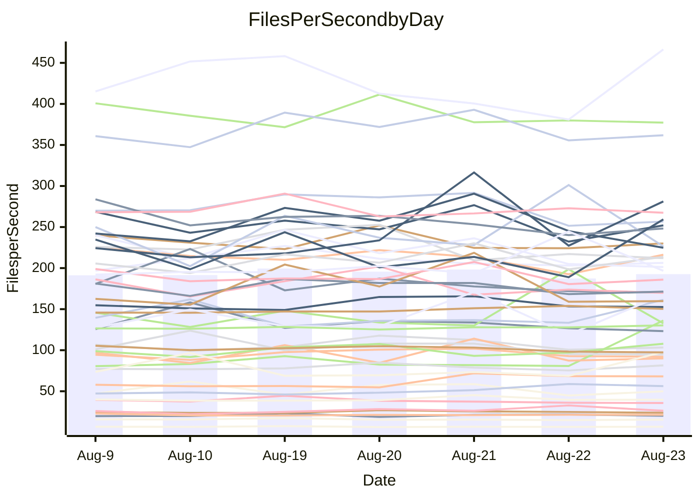

<!---
# This file is auto-generated. Do not edit.
# cspell:disable
--->
# Performance Report

Daily Performance

```mermaid
xychart-beta
    title Files Per Second by Day
    y-axis Files per Second
    x-axis Date [Aug-9, Aug-10, Aug-19, Aug-20, Aug-21, Aug-22, Aug-23]
    bar [191.27, 191.48, 199.45, 195.67, 198.22, 187.40, 192.61]
    line [19.76, 19.87, 23.15, 18.80, 21.30, 21.70, 20.11]
    line [94.45, 88.13, 97.66, 100.71, 101.93, 92.80, 92.11]
    line [106.66, 99.38, 103.80, 117.71, 112.47, 100.50, 103.30]
    line [80.61, 83.15, 92.81, 82.44, 81.86, 80.75, 136.22]
    line [239.79, 231.09, 223.10, 252.00, 224.60, 224.17, 230.06]
    line [269.81, 270.47, 289.77, 286.14, 291.59, 251.52, 256.69]
    line [39.52, 37.52, 44.46, 38.46, 37.42, 35.96, 35.65]
    line [268.54, 243.09, 257.77, 247.18, 276.72, 232.23, 252.08]
    line [6.78, 6.60, 7.51, 6.38, 6.72, 6.55, 6.77]
    line [240.17, 211.99, 227.00, 211.38, 205.51, 203.10, 206.43]
    line [125.68, 158.27, 127.25, 135.61, 133.76, 126.70, 123.28]
    line [225.24, 214.74, 210.02, 221.88, 213.58, 192.56, 216.27]
    line [225.91, 222.58, 246.74, 252.74, 209.47, 217.12, 212.13]
    line [145.75, 128.32, 148.05, 133.76, 130.09, 198.58, 132.66]
    line [24.65, 23.72, 23.68, 26.94, 25.51, 24.79, 23.76]
    line [139.45, 161.93, 128.87, 135.71, 136.66, 133.36, 161.38]
    line [25.95, 22.03, 24.86, 28.29, 26.21, 32.71, 26.20]
    line [154.75, 150.93, 149.02, 164.86, 165.64, 153.35, 152.64]
    line [15.80, 15.53, 17.25, 15.28, 15.49, 14.84, 15.46]
    line [196.97, 211.99, 246.59, 218.10, 236.31, 204.94, 201.38]
    line [180.75, 223.35, 172.94, 187.16, 177.68, 172.01, 170.49]
    line [96.93, 84.41, 106.12, 84.61, 114.12, 87.31, 89.99]
    line [77.16, 76.75, 77.91, 84.91, 78.76, 75.34, 81.46]
    line [400.74, 385.62, 371.65, 411.46, 377.61, 379.88, 377.18]
    line [145.79, 145.58, 147.10, 147.08, 151.07, 153.94, 150.27]
    line [249.96, 202.34, 263.67, 236.99, 228.06, 301.20, 226.40]
    line [186.27, 165.43, 184.07, 202.12, 167.51, 173.85, 169.85]
    line [224.37, 213.27, 217.89, 233.79, 316.48, 227.32, 281.23]
    line [47.00, 61.84, 45.89, 57.63, 58.67, 44.77, 49.92]
    line [127.47, 149.55, 129.16, 129.10, 170.99, 119.13, 167.47]
    line [181.18, 166.12, 186.93, 181.85, 181.88, 168.34, 171.35]
    line [57.90, 56.15, 56.35, 54.76, 71.89, 68.47, 68.09]
    line [101.07, 123.80, 99.87, 108.06, 107.98, 95.34, 94.96]
    line [98.84, 91.76, 103.43, 107.49, 93.08, 97.11, 107.90]
    line [162.48, 155.40, 204.32, 177.59, 218.64, 159.00, 159.79]
    line [360.76, 347.31, 389.41, 371.89, 392.82, 355.53, 361.83]
    line [198.91, 184.05, 187.41, 186.67, 207.48, 180.49, 185.92]
    line [242.10, 232.62, 273.32, 257.69, 290.62, 245.10, 224.83]
    line [73.60, 96.61, 68.89, 69.48, 73.38, 68.77, 97.84]
    line [415.14, 451.69, 458.22, 412.53, 400.53, 380.98, 466.37]
    line [283.77, 252.09, 262.36, 263.68, 253.37, 240.18, 248.22]
    line [22.84, 20.59, 20.47, 21.22, 20.90, 21.42, 21.40]
    line [205.56, 193.98, 216.67, 206.61, 230.20, 198.53, 213.69]
    line [126.64, 126.17, 128.45, 125.27, 127.94, 127.77, 130.20]
    line [105.46, 100.11, 102.43, 104.89, 103.21, 98.21, 97.36]
    line [47.26, 48.66, 46.00, 48.26, 51.42, 58.83, 56.30]
    line [268.09, 268.70, 290.78, 262.94, 266.60, 272.93, 267.45]
    line [234.76, 198.61, 243.75, 200.90, 213.71, 188.91, 259.37]
    line [39.98, 38.63, 38.64, 39.11, 45.24, 39.50, 39.66]
    line [192.03, 195.48, 194.87, 202.54, 193.62, 244.63, 196.70]
```

Time to Process Files

| Repository                                      | Elapsed | Min/Avg/Max          |    SD | SD Graph                |
| ----------------------------------------------- | ------: | :------------------: | ----: | ----------------------- |
| AdaDoom3/AdaDoom3                    |    2.89 | 2.1 /   2.6 /   2.9  |  0.26 | `    ┣━━┻━━╋━━●━━┫    ` |
| alexiosc/megistos                    |    4.28 | 5.5 /   7.0 /   7.9  |  0.45 | `●      ┣┻━╋━┻┫       ` |
| apollographql/apollo-server          |    2.48 | 1.8 /   2.4 /   2.8  |  0.25 | `    ┣━━┻━━╋●━┻━━┫    ` |
| aspnetboilerplate/aspnetboilerplate  |    8.91 | 6.3 /   8.3 /   9.1  |  1.01 | `    ┣━━┻━━╋━●┻━━┫    ` |
| aws-amplify/docs                     |   13.17 | 9.6 /  12.9 /  14.0  |  1.08 | `    ┣━━┻━━╋●━┻━━┫    ` |
| Azure/azure-rest-api-specs           |   10.16 | 7.2 /   9.9 /  11.2  |  0.95 | `    ┣━━┻━━╋●━┻━━┫    ` |
| bitjson/typescript-starter           |    0.99 | 0.6 /   1.0 /   1.1  |  0.11 | `     ┣━┻━━●━━┻━┫     ` |
| caddyserver/caddy                    |    3.62 | 2.5 /   3.4 /   3.9  |  0.38 | `    ┣━━┻━━╋●━┻━━┫    ` |
| canada-ca/open-source-logiciel-libre |    1.03 | 0.8 /   1.0 /   1.3  |  0.11 | `     ┣━┻━━●━━┻━┫     ` |
| chef/chef                            |    5.01 | 3.0 /   4.7 /   5.3  |  0.55 | `    ┣━━┻━━╋━●┻━━┫    ` |
| dart-lang/sdk                        |   57.69 | 34.3 /  55.0 /  64.6 |  7.64 | `  ┣━━━┻━━━╋●━━┻━━━┫  ` |
| django/django                        |   13.82 | 10.2 /  12.8 /  15.0 |  1.53 | `   ┣━━━┻━━╋━●┻━━━┫   ` |
| eslint/eslint                        |    9.63 | 7.6 /   9.6 /  10.8  |  0.79 | `    ┣━━┻━━●━━┻━━┫    ` |
| exonum/exonum                        |    3.42 | 2.6 /   3.2 /   3.7  |  0.26 | `    ┣━━┻━━╋━●┻━━┫    ` |
| flutter/samples                      |   12.84 | 8.0 /  12.1 /  14.0  |  1.52 | `   ┣━━━┻━━╋━●┻━━━┫   ` |
| gitbucket/gitbucket                  |    2.59 | 2.5 /   3.1 /   3.4  |  0.31 | `    ┣━●┻━━╋━━┻━━┫    ` |
| googleapis/google-cloud-cpp          |  123.95 | 96.3 / 118.7 / 127.8 | 11.78 | `  ┣━━━┻━━━╋━●━┻━━━┫  ` |
| graphql/express-graphql              |    1.09 | 0.7 /   1.0 /   1.2  |  0.10 | `     ┣━┻━━╋●━┻━┫     ` |
| graphql/graphql-js                   |    3.61 | 2.8 /   3.5 /   3.9  |  0.27 | `    ┣━━┻━━╋●━┻━━┫    ` |
| graphql/graphql-relay-js             |    1.07 | 0.7 /   1.1 /   1.3  |  0.11 | `     ┣━┻━━●━━┻━┫     ` |
| graphql/graphql-spec                 |    1.23 | 0.8 /   1.2 /   1.3  |  0.13 | `     ┣━┻━━●━━┻━┫     ` |
| iluwatar/java-design-patterns        |   12.80 | 8.8 /  11.9 /  12.8  |  1.11 | `    ┣━━┻━━╋━━●━━┫    ` |
| ktaranov/sqlserver-kit               |    5.44 | 3.1 /   5.3 /   6.2  |  0.96 | `    ┣━━┻━━╋●━┻━━┫    ` |
| liriliri/licia                       |    3.82 | 2.9 /   3.7 /   4.1  |  0.32 | `    ┣━━┻━━╋●━┻━━┫    ` |
| MartinThoma/LaTeX-examples           |    6.22 | 4.5 /   5.8 /   7.0  |  0.72 | `    ┣━━┻━━╋━●┻━━┫    ` |
| mdx-js/mdx                           |    1.71 | 1.5 /   1.8 /   1.9  |  0.09 | `     ┣━┻●━╋━━┻━┫     ` |
| microsoft/TypeScript-Website         |    5.09 | 5.0 /   5.2 /   5.6  |  0.20 | `    ┣━━┻━●╋━━┻━━┫    ` |
| MicrosoftDocs/PowerShell-Docs        |   18.67 | 14.3 /  23.5 /  26.2 |  2.66 | `   ┣●━━┻━━╋━━┻━━━┫   ` |
| neovim/nvim-lspconfig                |    5.12 | 3.7 /   4.8 /   5.6  |  0.58 | `    ┣━━┻━━╋━●┻━━┫    ` |
| pagekit/pagekit                      |    2.63 | 1.9 /   3.2 /   3.6  |  0.46 | `    ┣━━●━━╋━━┻━━┫    ` |
| php/php-src                          |   25.16 | 18.3 /  23.2 /  26.1 |  2.44 | `   ┣━━━┻━━╋━━●━━━┫   ` |
| plasticrake/tplink-smarthome-api     |    1.24 | 0.8 /   1.2 /   1.4  |  0.18 | `     ┣━┻━━●━━┻━┫     ` |
| prettier/prettier                    |    7.42 | 5.8 /   7.3 /   8.0  |  0.71 | `    ┣━━┻━━╋●━┻━━┫    ` |
| pycontribs/jira                      |    1.17 | 0.9 /   1.4 /   1.5  |  0.16 | `     ┣━●━━╋━━┻━┫     ` |
| RustPython/RustPython                |    8.10 | 5.8 /   8.9 /  11.1  |  1.22 | `    ┣━━┻●━╋━━┻━━┫    ` |
| shoelace-style/shoelace              |    2.75 | 1.8 /   2.5 /   3.0  |  0.40 | `    ┣━━┻━━╋━●┻━━┫    ` |
| slint-ui/slint                       |   16.97 | 11.3 /  14.9 /  16.1 |  1.52 | `   ┣━━━┻━━╋━━┻━●━┫   ` |
| SoftwareBrothers/admin-bro           |    2.37 | 1.6 /   2.3 /   2.6  |  0.25 | `    ┣━━┻━━╋●━┻━━┫    ` |
| sveltejs/svelte                      |   19.20 | 16.9 /  21.5 /  23.5 |  1.94 | `   ┣━━●┻━━╋━━┻━━━┫   ` |
| TheAlgorithms/Python                 |    5.68 | 3.0 /   5.4 /   5.9  |  0.59 | `    ┣━━┻━━╋━●┻━━┫    ` |
| twbs/bootstrap                       |    1.21 | 1.2 /   1.6 /   1.9  |  0.17 | `   ● ┣━┻━━╋━━┻━┫     ` |
| typescript-cheatsheets/react         |    1.12 | 0.7 /   1.1 /   1.3  |  0.10 | `     ┣━┻━━●━━┻━┫     ` |
| typescript-eslint/typescript-eslint  |    4.05 | 3.3 /   4.1 /   4.7  |  0.32 | `    ┣━━┻━●╋━━┻━━┫    ` |
| vitest-dev/vitest                    |   10.35 | 8.2 /  10.3 /  10.8  |  0.65 | `    ┣━━┻━━●━━┻━━┫    ` |
| w3c/aria-practices                   |    3.20 | 3.1 /   3.3 /   3.5  |  0.10 | `     ┣━┻●━╋━━┻━┫     ` |
| w3c/specberus                        |    1.95 | 1.5 /   1.8 /   2.2  |  0.15 | `     ┣━┻━━╋━●┻━┫     ` |
| webdeveric/webpack-assets-manifest   |    0.98 | 0.9 /   1.1 /   1.4  |  0.12 | `     ┣●┻━━╋━━┻━┫     ` |
| webpack/webpack                      |    5.09 | 3.7 /   6.1 /   7.4  |  1.05 | `    ┣━━●━━╋━━┻━━┫    ` |
| wireapp/wire-desktop                 |    1.29 | 1.0 /   1.3 /   1.5  |  0.13 | `     ┣━┻━━●━━┻━┫     ` |
| wireapp/wire-webapp                  |   12.84 | 10.3 /  12.7 /  14.2 |  0.91 | `    ┣━━┻━━●━━┻━━┫    ` |

Note:
- Elapsed time is in seconds.

Files per Second over Time

| Repository                                      | Files |    Sec |    Fps |     Rel | Trend Fps              |    N |
| ----------------------------------------------- | ----: | -----: | -----: | ------: | ---------------------- | ---: |
| AdaDoom3/AdaDoom3                    |   103 |   2.89 |  35.65 |  -9.64% | `▇▃▃▇▂▂▃▃▃█▇▃▃▆▃▃▃▃▂▂` |   19 |
| alexiosc/megistos                    |   583 |   4.28 | 136.22 |  63.61% | `▂▃▂▂▂▁▂▂▃▅▂▂▂▂▂▂▂▂▂█` |   19 |
| apollographql/apollo-server          |   256 |   2.48 | 103.30 |  -5.00% | `▂▂▃▂▃▆▅▂▃▃▃█▃▅▃▃▆▃▃▃` |   19 |
| aspnetboilerplate/aspnetboilerplate  |  2288 |   8.91 | 256.69 |  -7.97% | `▂▂▂▃▃▂▇▃█▂▂▃▂█▃▂█▂▂▂` |   19 |
| aws-amplify/docs                     |  3030 |  13.17 | 230.06 |  -2.53% | `▂▂▃▂▃▆▅▃▃▂▃▃▃█▃▂▂▃▂▃` |   19 |
| Azure/azure-rest-api-specs           |  2561 |  10.16 | 252.08 |  -3.19% | `█▃▅▃▃▂▃▂▃▃▃▂▃▂▃▃▆▃▂▃` |   19 |
| bitjson/typescript-starter           |    20 |   0.99 |  20.11 |  -1.63% | `▄▃▃▃▂▂▂▃█▂▃▂▁▂▂▂▃▄▃▃` |   19 |
| caddyserver/caddy                    |   333 |   3.62 |  92.11 |  -5.07% | `▃▃▂▂▆▄▂▂▂▅▃▃▂▃█▆▃▃▃▃` |   19 |
| canada-ca/open-source-logiciel-libre |     7 |   1.03 |   6.77 |  -0.12% | `▄▃▄▃▇▁▄▃█▄▃▂▄▄▃▃▄▃▃▄` |   19 |
| chef/chef                            |  1034 |   5.01 | 206.43 |  -7.48% | `▃▁▆▂▂▂█▂▂▂▄▂▂▂▂▂▂▂▂▂` |   19 |
| dart-lang/sdk                        | 11618 |  57.69 | 201.38 |  -7.06% | `▂▂▂▁▂▂▂▃▂█▂▅▂▂▂▂▇▂▂▂` |   19 |
| django/django                        |  2931 |  13.82 | 212.13 |  -8.41% | `▂▃▃▂▆▃█▄▇▃▅█▃█▅▃▂▃▃▃` |   19 |
| eslint/eslint                        |  2082 |   9.63 | 216.27 |  -0.80% | `▄▇█▃▃▃▄▄▃▄▃▆▄▄▃▄▃▄▂▄` |   19 |
| exonum/exonum                        |   421 |   3.42 | 123.28 |  -5.94% | `▂▃▃▅▄▃▄█▃▄▄▄█▄▃▄▃▇▄▃` |   19 |
| flutter/samples                      |  1703 |  12.84 | 132.66 |  -7.22% | `▃▂▂▂█▃▂▂▂▄▄▂▂▂▂▁▂▂▇▂` |   19 |
| gitbucket/gitbucket                  |   418 |   2.59 | 161.38 |  17.44% | `▃█▃▂▃▇▃▇▂▂▄▇▂▃▃▇▂▃▃▇` |   19 |
| googleapis/google-cloud-cpp          | 21238 | 123.95 | 171.35 |  -5.26% | `█▇▂▂▃▃▃▂█▃▃▇▃▃▃▂▇▂▃▃` |   19 |
| graphql/express-graphql              |    26 |   1.09 |  23.76 |  -5.23% | `▃▆▂▃▂▂▃▃▃▂▂▃▃▃█▅▃▃▃▃` |   19 |
| graphql/graphql-js                   |   551 |   3.61 | 152.64 |  -3.04% | `▄▃▃▂▃▇▃▃▃▃▃█▃▃▄▄▇▄▃▃` |   19 |
| graphql/graphql-relay-js             |    28 |   1.07 |  26.20 |  -0.99% | `▃▃▃▃▃▅▂▁▃▃▃▃▃█▃▃▃▃▆▃` |   19 |
| graphql/graphql-spec                 |    19 |   1.23 |  15.46 |  -2.16% | `▂▂▂█▂▂▂▃▇▂▃▃▃▂▂▂▄▂▂▃` |   19 |
| iluwatar/java-design-patterns        |  2183 |  12.80 | 170.49 |  -6.41% | `▃▃▂▃▂▄█▇▂▃▃▃▃▄▆▃▃▃▃▂` |   19 |
| ktaranov/sqlserver-kit               |   490 |   5.44 |  89.99 |  -7.54% | `▂▁▂▇▁▄▂▂▂▇▂▁▂▂▂▃▂█▂▂` |   19 |
| liriliri/licia                       |  1442 |   3.82 | 377.18 |  -3.99% | `▃▂▃▂█▇▄▃▃▃▃▃█▄▄▃▃▃▃▃` |   19 |
| MartinThoma/LaTeX-examples           |  1409 |   6.22 | 226.40 |  -8.01% | `▂▄█▄▇▃▃▂▃▇▅▃▃▆▃▃▃▃▇▃` |   19 |
| mdx-js/mdx                           |   139 |   1.71 |  81.46 |   3.06% | `▆▄▃▅▃▅▃▄▅▅▃▅▆█▇▅▄▅▄▅` |   19 |
| microsoft/TypeScript-Website         |   765 |   5.09 | 150.27 |   1.86% | `▆█▇▅▄▆▇▆█▄▇█▄▇▇▇▇██▇` |   19 |
| MicrosoftDocs/PowerShell-Docs        |  3126 |  18.67 | 167.47 |  23.44% | `▂▂▂▁▂▂▂▃▂▂▂▂▂▂▂█▄▂▁▅` |   19 |
| neovim/nvim-lspconfig                |   869 |   5.12 | 169.85 |  -7.97% | `▂▂▅█▆▃▅▃▃▆▄▆▆█▃▃▃▃▃▃` |   19 |
| pagekit/pagekit                      |   741 |   2.63 | 281.23 |  17.45% | `▂▂▁▂▁▄▂▂▂▂▂▅▂▁▂▆█▂▂▄` |   19 |
| php/php-src                          |  2389 |  25.16 |  94.96 |  -8.99% | `▃▃▂▃▃▇▄▇▃▅▂▃▇▃▅█▃▂▃▂` |   19 |
| plasticrake/tplink-smarthome-api     |    62 |   1.24 |  49.92 |  -3.21% | `▂▂▂▂▂▁▂▅▁▂▂▅▃▂▇▂▃█▂▃` |   19 |
| prettier/prettier                    |  2685 |   7.42 | 361.83 |  -2.66% | `▃▂▃█▃▂▃▃▃█▃▇▃▃▃▇▄▄▃▃` |   19 |
| pycontribs/jira                      |    80 |   1.17 |  68.09 |  13.60% | `▅▂▂▂▂▂▂▂▂▂▂▂▂▂█▂▅▄▄`  |   18 |
| RustPython/RustPython                |   874 |   8.10 | 107.90 |   7.89% | `▁▂▂▃▃▆▅▃▃▃▅▃▃█▃▂▃▃▃▄` |   19 |
| shoelace-style/shoelace              |   440 |   2.75 | 159.79 | -11.51% | `▂▁▂▂▅▂▂▂▂█▆▂▂▂▇▇▇▄▂▂` |   19 |
| slint-ui/slint                       |  3815 |  16.97 | 224.83 | -12.73% | `▃▃▂▂▂▃▂▂▃█▃▂▂▆▂▆█▂▃▁` |   19 |
| SoftwareBrothers/admin-bro           |   441 |   2.37 | 185.92 |  -4.23% | `█▃▃▃▂▃▂▂▃▃▃▅▂▂▂▂▃▇▂▃` |   19 |
| sveltejs/svelte                      |  8954 |  19.20 | 466.37 |  11.25% | `▃▃▂▃▃▃█▅█▅▂▅▂▃▃▃▂▃▂▆` |   19 |
| TheAlgorithms/Python                 |  1411 |   5.68 | 248.22 |  -7.17% | `▂▁▁▂▂█▂▂▂▂▂▂▂▂▂▁▂▂▁▂` |   19 |
| twbs/bootstrap                       |   118 |   1.21 |  97.84 |  34.20% | `▃▄▂▆▃▂▆█▃▃▃▃▃▄▃▅▃▂▃█` |   19 |
| typescript-cheatsheets/react         |    24 |   1.12 |  21.40 |  -1.03% | `▂▃█▁▃▂▃▂▂▂▂▃▂▃▃▂▂▃▃▃` |   19 |
| typescript-eslint/typescript-eslint  |   866 |   4.05 | 213.69 |   1.54% | `▂▅▃▃▄▄▄▃▅▄▄▄▄▂▄█▅▄▃▄` |   19 |
| vitest-dev/vitest                    |  2769 |  10.35 | 267.45 |  -1.18% | `▂▃▃▃▂▂▇▃▃█▃▃▂▄▃▃▃▃▄▃` |   19 |
| w3c/aria-practices                   |   417 |   3.20 | 130.20 |   2.61% | `█▇▄▆▄▇▇▆▇▆▆▅▆▇▅▇▇▅▆▇` |   19 |
| w3c/specberus                        |   190 |   1.95 |  97.36 |  -6.24% | `█▅▄▄▄▃▅▄▄▅▄▂▇▄▅▅▄▅▄▄` |   19 |
| webdeveric/webpack-assets-manifest   |    55 |   0.98 |  56.30 |  15.82% | `▄▆▃▄▃▃▅▄▄▃▃▄█▄▂█▄▄▇▇` |   19 |
| webpack/webpack                      |  1319 |   5.09 | 259.37 |  17.14% | `▄▂▄▂▂█▂▂▂█▂▂▃▂▂▁▂▅▂▄` |   19 |
| wireapp/wire-desktop                 |    51 |   1.29 |  39.66 |  -1.65% | `▃▂█▄▄▃▇▄▄▃▄▃▄▄▅▄▇█▄▄` |   19 |
| wireapp/wire-webapp                  |  2526 |  12.84 | 196.70 |  -0.60% | `▄▃▃▃▃▄▄▄▄▃▄▄▂▃█▄▃▄█▄` |   19 |

Data Throughput

| Repository                                      | Files |    Sec |     Kps |     Rel | Trend Kps              |    N |
| ----------------------------------------------- | ----: | -----: | ------: | ------: | ---------------------- | ---: |
| AdaDoom3/AdaDoom3                    |   103 |   2.89 |  757.70 |  -9.64% | `▇▃▃▇▂▂▃▃▃█▇▃▃▆▃▃▃▃▂▂` |   19 |
| alexiosc/megistos                    |   583 |   4.28 | 1070.40 |  63.61% | `▂▃▂▂▂▁▂▂▃▅▂▂▂▂▂▂▂▂▂█` |   19 |
| apollographql/apollo-server          |   256 |   2.48 |  850.64 |  -5.00% | `▂▂▃▂▃▆▅▂▃▃▃█▃▅▃▃▆▃▃▃` |   19 |
| aspnetboilerplate/aspnetboilerplate  |  2288 |   8.91 |  627.71 |  -7.97% | `▂▂▂▃▃▂▇▃█▂▂▃▂█▃▂█▂▂▂` |   19 |
| aws-amplify/docs                     |  3030 |  13.17 |  899.37 |  -2.45% | `▂▂▃▂▃▆▅▃▃▂▃▃▃█▃▂▂▃▂▃` |   19 |
| Azure/azure-rest-api-specs           |  2561 |  10.16 |  772.27 |  -2.78% | `█▃▅▃▃▂▃▂▃▃▃▃▃▂▃▃▆▃▂▃` |   19 |
| bitjson/typescript-starter           |    20 |   0.99 |   80.44 |  -1.63% | `▄▃▃▃▂▂▂▃█▂▃▂▁▂▂▂▃▄▃▃` |   19 |
| caddyserver/caddy                    |   333 |   3.62 |  839.26 |  -5.16% | `▃▃▂▂▆▄▂▂▂▅▃▃▂▃█▆▃▃▃▃` |   19 |
| canada-ca/open-source-logiciel-libre |     7 |   1.03 |   56.11 |  -0.12% | `▄▃▄▃▇▁▄▃█▄▃▂▄▄▃▃▄▃▃▄` |   19 |
| chef/chef                            |  1034 |   5.01 | 1013.60 |  -7.48% | `▃▁▆▂▂▂█▂▂▂▄▂▂▂▂▂▂▂▂▂` |   19 |
| dart-lang/sdk                        | 11618 |  57.69 | 1398.63 |  -6.81% | `▂▂▂▁▂▂▂▃▂█▂▅▂▂▂▂▇▂▂▂` |   19 |
| django/django                        |  2931 |  13.82 | 1368.17 |  -8.31% | `▂▃▃▂▆▃█▄▇▃▅█▃█▅▃▂▃▃▃` |   19 |
| eslint/eslint                        |  2082 |   9.63 | 1518.28 |  -0.80% | `▄▇█▃▃▃▄▄▃▄▃▆▄▄▃▄▃▄▂▄` |   19 |
| exonum/exonum                        |   421 |   3.42 | 1179.19 |  -5.94% | `▂▃▃▅▄▃▄█▃▄▄▄█▄▃▄▃▇▄▃` |   19 |
| flutter/samples                      |  1703 |  12.84 |  790.73 |  -7.37% | `▃▂▂▂█▃▂▂▂▄▄▂▂▂▂▁▂▂▇▂` |   19 |
| gitbucket/gitbucket                  |   418 |   2.59 |  798.42 |  17.94% | `▃█▃▂▂▇▃▇▂▂▄▇▂▃▃▇▃▃▄▇` |   19 |
| googleapis/google-cloud-cpp          | 21238 | 123.95 | 1488.62 |  -5.23% | `█▇▂▂▃▃▃▂█▃▃▇▃▃▃▂▇▂▃▃` |   19 |
| graphql/express-graphql              |    26 |   1.09 |  108.76 |  -5.23% | `▃▆▂▃▂▂▃▃▃▂▂▃▃▃█▅▃▃▃▃` |   19 |
| graphql/graphql-js                   |   551 |   3.61 | 1138.27 |  -3.04% | `▄▃▃▂▃▇▃▃▃▃▃█▃▃▄▄▇▄▃▃` |   19 |
| graphql/graphql-relay-js             |    28 |   1.07 |  102.94 |  -0.99% | `▃▃▃▃▃▅▂▁▃▃▃▃▃█▃▃▃▃▆▃` |   19 |
| graphql/graphql-spec                 |    19 |   1.23 |  517.60 |  -2.16% | `▂▂▂█▂▂▂▃▇▂▃▃▃▂▂▂▄▂▂▃` |   19 |
| iluwatar/java-design-patterns        |  2183 |  12.80 |  526.68 |  -6.31% | `▃▃▂▃▂▄█▇▃▃▃▃▃▄▆▃▃▃▃▃` |   19 |
| ktaranov/sqlserver-kit               |   490 |   5.44 | 1363.32 |  -7.54% | `▂▁▂▇▁▄▂▂▂▇▂▁▂▂▂▃▂█▂▂` |   19 |
| liriliri/licia                       |  1442 |   3.82 |  452.26 |  -3.79% | `▃▂▃▂█▇▄▃▃▃▃▃█▄▄▃▃▄▃▃` |   19 |
| MartinThoma/LaTeX-examples           |  1409 |   6.22 |  467.58 |  -8.01% | `▂▄█▄▇▃▃▂▃▇▅▃▃▆▃▃▃▃▇▃` |   19 |
| mdx-js/mdx                           |   139 |   1.71 |  383.88 |   3.06% | `▆▄▃▅▃▅▃▄▅▅▃▅▆█▇▅▄▅▄▅` |   19 |
| microsoft/TypeScript-Website         |   765 |   5.09 | 1036.14 |   1.87% | `▆█▇▅▄▆▇▆█▄▇█▄▇▇▇▇██▇` |   19 |
| MicrosoftDocs/PowerShell-Docs        |  3126 |  18.67 | 1788.62 |  23.48% | `▂▂▂▁▂▂▂▃▂▂▂▂▂▂▂█▄▂▁▅` |   19 |
| neovim/nvim-lspconfig                |   869 |   5.12 |  498.20 |  -8.04% | `▂▂▅█▆▃▅▃▃▆▄▆▆█▃▃▃▃▃▃` |   19 |
| pagekit/pagekit                      |   741 |   2.63 |  586.36 |  17.45% | `▂▂▁▂▁▄▂▂▂▂▂▅▂▁▂▆█▂▂▄` |   19 |
| php/php-src                          |  2389 |  25.16 | 1680.03 |  -8.97% | `▃▃▂▃▃▇▄▇▃▅▂▃▇▃▅█▃▂▃▂` |   19 |
| plasticrake/tplink-smarthome-api     |    62 |   1.24 |  269.72 |  -3.21% | `▂▂▂▂▂▁▂▅▁▂▂▅▃▂▇▂▃█▂▃` |   19 |
| prettier/prettier                    |  2685 |   7.42 |  511.42 |  -2.87% | `▃▂▃█▃▂▃▃▃█▃▇▃▃▃▇▄▄▃▃` |   19 |
| pycontribs/jira                      |    80 |   1.17 |  480.90 |  13.60% | `▅▂▂▂▂▂▂▂▂▂▂▂▂▂█▂▅▄▄`  |   18 |
| RustPython/RustPython                |   874 |   8.10 | 2376.06 |   8.04% | `▁▂▂▃▃▆▅▃▃▃▅▃▃█▃▂▃▃▃▄` |   19 |
| shoelace-style/shoelace              |   440 |   2.75 |  771.73 | -11.51% | `▂▁▂▂▅▂▂▂▂█▆▂▂▂▇▇▇▄▂▂` |   19 |
| slint-ui/slint                       |  3815 |  16.97 | 1209.68 | -12.61% | `▃▃▂▂▂▃▂▂▃█▃▂▃▆▂▆█▂▃▁` |   19 |
| SoftwareBrothers/admin-bro           |   441 |   2.37 |  409.78 |  -4.23% | `█▃▃▃▂▃▂▂▃▃▃▅▂▂▂▂▃▇▂▃` |   19 |
| sveltejs/svelte                      |  8954 |  19.20 |  320.27 |  11.30% | `▃▃▂▃▃▃█▅█▅▂▅▂▃▃▃▂▃▂▆` |   19 |
| TheAlgorithms/Python                 |  1411 |   5.68 |  634.88 |  -7.17% | `▂▁▁▂▂█▂▂▂▂▂▂▂▂▂▁▂▂▁▂` |   19 |
| twbs/bootstrap                       |   118 |   1.21 |  802.65 |  34.20% | `▃▄▂▆▃▂▆█▃▃▃▃▃▄▃▅▃▂▃█` |   19 |
| typescript-cheatsheets/react         |    24 |   1.12 |  193.53 |  -1.03% | `▂▃█▁▃▂▃▂▂▂▂▃▂▃▃▂▂▃▃▃` |   19 |
| typescript-eslint/typescript-eslint  |   866 |   4.05 |  718.07 |   1.51% | `▂▅▃▃▄▄▄▃▅▄▄▄▄▂▄█▅▄▃▄` |   19 |
| vitest-dev/vitest                    |  2769 |  10.35 |  772.98 |  -0.16% | `▂▃▃▃▂▂▆▃▃█▄▃▃▄▃▃▃▄▄▃` |   19 |
| w3c/aria-practices                   |   417 |   3.20 | 1224.52 |   2.61% | `█▇▄▆▄▇▇▆▇▆▆▅▆▇▅▇▇▅▆▇` |   19 |
| w3c/specberus                        |   190 |   1.95 |  318.22 |  -6.18% | `█▅▄▄▄▃▅▄▄▅▄▂▇▄▅▅▄▅▄▄` |   19 |
| webdeveric/webpack-assets-manifest   |    55 |   0.98 |  130.01 |  15.82% | `▄▆▃▄▃▃▅▄▄▃▃▄█▄▂█▄▄▇▇` |   19 |
| webpack/webpack                      |  1319 |   5.09 | 1771.32 |  23.10% | `▃▁▃▁▁▇▂▁▂█▂▂▃▂▂▁▂▅▂▅` |   19 |
| wireapp/wire-desktop                 |    51 |   1.29 |  168.73 |  -1.65% | `▃▂█▄▄▃▇▄▄▃▄▃▄▄▅▄▇█▄▄` |   19 |
| wireapp/wire-webapp                  |  2526 |  12.84 |  830.27 |  -0.40% | `▃▃▃▃▃▄▄▄▄▃▄▄▂▃█▄▃▄█▄` |   19 |

