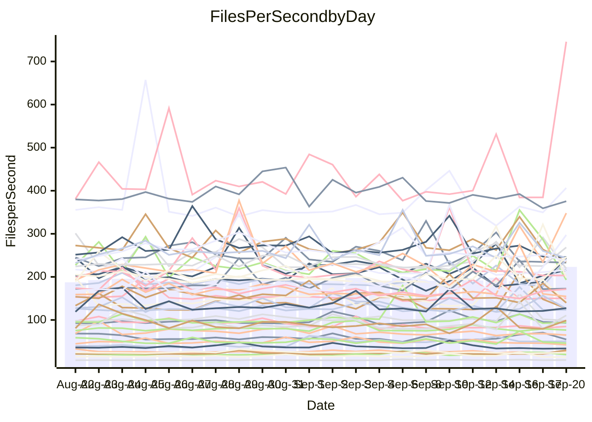

<!---
# This file is auto-generated. Do not edit.
# cspell:disable
--->
# Performance Report

Daily Performance

```mermaid
xychart-beta
    title Files Per Second by Day
    y-axis Files per Second
    x-axis Date [Aug-22, Aug-23, Aug-24, Aug-25, Aug-26, Aug-27, Aug-28, Aug-29, Aug-30, Aug-31, Sep-1, Sep-2, Sep-3, Sep-4, Sep-6, Sep-8, Sep-10, Sep-12, Sep-14, Sep-16, Sep-17, Sep-20]
    bar [187.40, 192.61, 195.61, 200.69, 190.24, 185.15, 191.23, 195.37, 191.39, 193.00, 190.75, 190.15, 197.37, 189.85, 196.95, 191.17, 190.61, 191.83, 197.87, 189.83, 198.93, 223.14]
    line [68.47, 68.09, 64.39, 54.76, 55.64, 55.71, 59.28, 54.85, 60.20, 59.04, 56.12, 68.78, 56.21, 56.11, 49.06, 62.47, 53.43, 54.08, 56.65, 66.08, 70.58, 54.86]
    line [32.71, 26.20, 26.09, 26.00, 24.43, 25.37, 25.72, 26.51, 26.59, 24.79, 26.51, 29.88, 26.76, 29.99, 25.16, 26.46, 26.09, 28.54, 23.63, 25.87, 21.39, 25.97]
    line [6.55, 6.77, 6.55, 6.58, 6.64, 6.06, 6.53, 6.57, 8.03, 6.52, 6.59, 6.44, 6.39, 6.52, 8.53, 6.71, 7.87, 6.93, 6.69, 7.98, 6.67, 6.83]
    line [21.70, 20.11, 19.24, 18.97, 21.74, 19.44, 19.50, 19.20, 19.98, 20.35, 18.20, 18.80, 20.78, 20.30, 27.69, 23.39, 17.95, 19.65, 18.79, 24.79, 24.63, 19.73]
    line [21.42, 21.40, 22.88, 21.36, 21.22, 21.19, 22.04, 29.75, 23.02, 22.87, 20.05, 21.21, 24.74, 22.92, 26.72, 20.85, 24.50, 21.07, 20.76, 21.20, 21.42, 29.89]
    line [39.50, 39.66, 42.07, 38.23, 36.94, 35.58, 41.81, 37.53, 40.57, 37.73, 62.90, 58.74, 49.12, 53.66, 48.09, 48.30, 53.96, 52.43, 61.82, 49.92, 50.20, 50.36]
    line [153.35, 152.64, 155.02, 195.52, 151.70, 148.17, 156.31, 149.39, 153.11, 153.94, 154.04, 151.51, 150.42, 164.46, 144.04, 144.33, 151.54, 146.78, 197.07, 148.01, 150.26, 150.22]
    line [203.10, 206.43, 223.33, 206.89, 208.72, 201.20, 222.72, 313.85, 230.65, 207.01, 226.55, 228.01, 236.78, 227.33, 208.49, 230.64, 206.81, 229.76, 276.88, 185.15, 203.08, 216.06]
    line [14.84, 15.46, 14.39, 15.01, 15.63, 14.69, 17.08, 14.10, 16.71, 20.24, 15.82, 15.08, 17.27, 15.55, 14.37, 16.80, 21.93, 17.01, 17.04, 25.59, 14.10, 13.68]
    line [100.50, 103.30, 128.71, 104.89, 98.28, 96.78, 104.60, 101.13, 109.23, 99.73, 101.36, 109.96, 98.07, 116.80, 99.03, 95.60, 99.87, 99.90, 101.98, 98.46, 103.01, 98.38]
    line [92.80, 92.11, 97.07, 92.83, 96.14, 97.78, 99.79, 92.99, 92.61, 91.86, 94.75, 119.70, 107.86, 89.92, 92.48, 95.62, 122.20, 102.97, 97.36, 113.44, 95.42, 93.37]
    line [44.77, 49.92, 49.06, 57.90, 45.60, 46.71, 50.51, 48.37, 46.85, 59.90, 48.04, 50.57, 60.39, 48.74, 45.74, 54.53, 48.10, 54.31, 47.78, 46.42, 45.99, 42.51]
    line [301.20, 226.40, 222.40, 289.06, 224.56, 256.87, 257.70, 287.97, 268.68, 222.58, 222.07, 229.04, 229.68, 226.40, 222.19, 220.27, 226.37, 235.76, 281.57, 222.43, 291.44, 219.17]
    line [227.32, 281.23, 212.31, 293.11, 198.49, 245.94, 225.24, 218.17, 233.60, 214.50, 206.09, 260.46, 254.83, 225.39, 210.16, 218.01, 213.19, 249.06, 214.17, 355.08, 286.90, 193.09]
    line [133.36, 161.38, 128.87, 127.62, 123.35, 123.11, 143.71, 157.94, 138.50, 140.06, 128.47, 140.20, 125.82, 152.47, 153.10, 126.38, 125.97, 124.19, 127.77, 210.87, 148.03, 126.65]
    line [126.70, 123.28, 120.42, 121.90, 125.42, 125.26, 127.33, 120.64, 133.49, 122.01, 125.69, 124.63, 138.77, 133.95, 120.16, 123.66, 119.12, 133.12, 118.61, 125.51, 156.41, 126.36]
    line [97.11, 107.90, 94.53, 94.47, 104.38, 94.67, 92.38, 93.95, 104.17, 91.62, 84.72, 84.00, 108.68, 78.26, 88.95, 80.83, 82.91, 82.03, 82.90, 86.51, 81.41, 84.89]
    line [244.63, 196.70, 223.56, 194.58, 199.46, 185.25, 194.89, 191.72, 195.81, 191.06, 231.16, 206.13, 208.21, 222.66, 193.65, 167.61, 190.13, 221.56, 177.63, 183.43, 188.58, 244.43]
    line [24.79, 23.76, 23.53, 22.75, 24.32, 26.78, 24.44, 32.43, 29.19, 26.35, 24.36, 24.17, 24.77, 25.69, 23.39, 29.52, 23.91, 25.15, 23.74, 22.20, 23.03, 24.38]
    line [355.53, 361.83, 355.43, 657.12, 351.25, 341.51, 360.76, 340.11, 354.77, 349.07, 349.21, 351.71, 366.86, 345.42, 349.08, 401.47, 446.16, 355.63, 318.90, 363.44, 349.72, 406.48]
    line [245.10, 224.83, 243.49, 245.36, 272.30, 280.33, 252.18, 242.64, 242.97, 290.78, 240.40, 234.87, 270.15, 260.38, 238.70, 329.95, 229.46, 255.09, 303.17, 236.15, 234.71, 233.17]
    line [68.77, 97.84, 66.15, 69.59, 78.77, 75.57, 73.80, 69.15, 78.35, 81.24, 69.03, 86.32, 67.78, 71.51, 67.14, 65.29, 70.06, 74.08, 63.80, 67.85, 68.28, 64.95]
    line [98.21, 97.36, 101.78, 100.00, 99.58, 101.28, 109.08, 102.06, 113.06, 106.63, 101.22, 99.00, 102.40, 108.26, 99.53, 99.63, 98.76, 103.06, 96.78, 160.57, 101.71, 98.32]
    line [75.34, 81.46, 80.77, 74.97, 79.78, 75.90, 79.64, 81.40, 79.85, 79.89, 74.06, 94.44, 98.41, 75.35, 75.22, 74.82, 78.42, 89.26, 79.87, 74.03, 79.32, 76.57]
    line [272.93, 267.45, 262.37, 345.57, 266.69, 244.68, 307.76, 255.74, 281.64, 288.18, 264.41, 254.46, 262.80, 279.68, 349.40, 267.60, 261.93, 287.76, 262.40, 339.51, 263.75, 234.66]
    line [180.49, 185.92, 209.38, 182.67, 186.49, 182.43, 194.97, 183.27, 194.85, 191.03, 183.63, 183.06, 181.63, 179.83, 187.37, 210.54, 236.79, 184.39, 226.41, 183.84, 178.08, 240.62]
    line [198.53, 213.69, 212.64, 179.07, 214.07, 290.22, 216.81, 359.94, 225.73, 203.55, 198.31, 204.42, 207.30, 236.03, 217.73, 206.74, 361.86, 212.41, 213.84, 211.89, 203.30, 203.26]
    line [251.52, 256.69, 292.19, 260.02, 262.94, 364.38, 287.21, 267.07, 273.26, 272.63, 293.89, 254.88, 261.45, 256.16, 262.71, 281.41, 341.82, 253.99, 265.83, 272.53, 247.23, 246.03]
    line [198.58, 132.66, 136.89, 133.84, 140.74, 138.14, 147.54, 146.55, 146.02, 154.94, 154.92, 173.52, 133.16, 154.40, 151.68, 142.86, 132.44, 134.89, 191.12, 144.91, 193.30, 142.56]
    line [217.12, 212.13, 242.98, 195.81, 213.43, 211.78, 245.83, 346.89, 231.16, 212.83, 215.37, 228.66, 222.75, 208.88, 207.83, 208.53, 367.52, 230.07, 204.55, 207.72, 211.00, 215.66]
    line [172.01, 170.49, 175.09, 173.22, 173.59, 180.48, 179.74, 243.56, 182.28, 198.12, 173.20, 197.43, 208.77, 179.57, 168.18, 209.46, 169.33, 212.19, 179.89, 238.35, 171.61, 172.61]
    line [192.56, 216.27, 228.68, 220.47, 211.98, 216.89, 208.83, 377.28, 231.14, 271.29, 215.41, 231.46, 211.65, 226.30, 254.34, 225.06, 179.78, 228.82, 211.67, 318.15, 234.86, 348.02]
    line [224.17, 230.06, 227.93, 228.22, 229.99, 225.97, 249.68, 224.12, 249.45, 250.62, 224.68, 245.58, 246.49, 229.93, 221.20, 224.86, 216.89, 259.14, 277.45, 226.45, 225.10, 268.40]
    line [95.34, 94.96, 114.12, 97.84, 103.09, 93.25, 94.27, 95.28, 96.54, 94.13, 99.46, 106.04, 103.70, 101.61, 179.98, 95.75, 97.23, 107.06, 93.89, 113.70, 92.25, 94.28]
    line [153.94, 150.27, 178.09, 152.08, 170.66, 160.71, 152.01, 148.28, 159.68, 156.83, 191.47, 145.84, 161.62, 164.09, 146.75, 148.35, 206.25, 150.67, 151.50, 140.12, 185.15, 139.87]
    line [127.77, 130.20, 152.67, 118.34, 143.02, 122.15, 142.33, 130.77, 150.54, 129.50, 127.85, 161.72, 142.89, 142.67, 128.62, 122.28, 150.41, 127.69, 119.42, 176.53, 123.45, 123.33]
    line [380.98, 466.37, 404.40, 403.18, 591.49, 390.96, 423.25, 409.89, 420.57, 392.45, 484.50, 460.60, 386.17, 437.93, 376.78, 397.57, 392.00, 400.11, 531.12, 384.37, 384.60, 745.85]
    line [35.96, 35.65, 37.61, 34.82, 39.47, 36.12, 40.86, 48.01, 38.35, 36.34, 36.12, 46.76, 38.88, 37.13, 34.45, 34.97, 52.27, 41.14, 33.93, 34.79, 33.36, 33.83]
    line [188.91, 259.37, 218.53, 190.79, 215.33, 194.36, 206.72, 199.24, 215.14, 225.49, 194.47, 193.04, 188.70, 189.46, 189.29, 188.79, 176.65, 217.04, 317.36, 187.32, 321.78, 198.42]
    line [240.18, 248.22, 259.20, 278.18, 263.50, 263.68, 284.05, 303.63, 278.91, 256.34, 262.12, 254.81, 252.73, 280.38, 314.32, 249.04, 256.96, 250.64, 247.49, 246.97, 251.50, 236.84]
    line [379.88, 377.18, 380.64, 396.91, 381.52, 374.08, 409.79, 391.59, 445.01, 453.72, 363.41, 425.43, 395.65, 408.80, 430.33, 376.07, 371.64, 390.41, 381.43, 392.33, 359.21, 375.60]
    line [159.00, 159.79, 194.26, 164.45, 184.75, 158.60, 171.47, 169.60, 183.25, 175.44, 159.48, 161.70, 160.46, 160.16, 159.37, 153.77, 161.06, 165.68, 159.91, 274.11, 160.48, 154.49]
    line [87.31, 89.99, 124.55, 110.24, 81.92, 82.24, 92.49, 81.67, 87.59, 83.98, 86.34, 113.37, 99.81, 81.83, 79.32, 79.69, 86.08, 90.96, 77.91, 142.49, 79.52, 110.64]
    line [58.83, 56.30, 50.38, 45.97, 45.91, 59.43, 48.16, 47.53, 46.75, 48.25, 57.12, 55.04, 46.08, 52.57, 46.47, 56.14, 46.33, 51.70, 44.11, 74.38, 48.80, 46.22]
    line [80.75, 136.22, 114.72, 99.92, 81.00, 98.60, 83.62, 80.81, 95.31, 95.53, 87.87, 82.74, 85.96, 92.06, 85.17, 89.98, 69.10, 91.26, 130.94, 82.16, 79.40, 98.84]
    line [232.23, 252.08, 266.01, 283.94, 251.01, 260.27, 254.92, 257.60, 260.42, 243.47, 321.12, 238.92, 262.66, 250.38, 355.46, 248.94, 253.18, 270.83, 243.92, 325.88, 260.22, 243.99]
    line [173.85, 169.85, 221.75, 167.75, 195.90, 170.00, 175.89, 161.05, 172.78, 181.80, 171.34, 164.16, 172.60, 156.60, 164.51, 155.95, 162.53, 193.68, 156.67, 149.67, 167.24, 171.44]
    line [119.13, 167.47, 175.06, 125.57, 143.51, 123.67, 127.21, 130.16, 128.18, 136.84, 128.57, 138.89, 167.86, 124.57, 126.57, 119.58, 171.63, 125.66, 126.89, 119.89, 121.04, 127.46]
    line [204.94, 201.38, 212.81, 200.01, 195.34, 186.50, 194.59, 201.00, 192.78, 193.23, 197.26, 194.56, 204.26, 190.93, 174.46, 207.05, 194.56, 194.84, 248.77, 196.63, 194.10, 246.18]
    line [168.34, 171.35, 169.12, 211.70, 166.64, 168.34, 182.86, 173.63, 176.66, 185.43, 171.13, 167.67, 190.75, 177.89, 199.59, 191.33, 170.36, 179.54, 171.09, 160.76, 222.99, 297.37]
```

Time to Process Files

| Repository                                      | Elapsed | Min/Avg/Max          |    SD | SD Graph                |
| ----------------------------------------------- | ------: | :------------------: | ----: | ----------------------- |
| AdaDoom3/AdaDoom3                    |    3.04 | 2.0 /   2.7 /   3.2  |  0.31 | `    ┣━━┻━━╋━━●━━┫    ` |
| alexiosc/megistos                    |    5.90 | 4.1 /   6.5 /   8.4  |  0.96 | `    ┣━━┻●━╋━━┻━━┫    ` |
| apollographql/apollo-server          |    2.60 | 1.8 /   2.5 /   2.8  |  0.24 | `    ┣━━┻━━╋━●┻━━┫    ` |
| aspnetboilerplate/aspnetboilerplate  |    9.30 | 4.9 /   8.5 /   9.8  |  0.89 | `    ┣━━┻━━╋━━●━━┫    ` |
| aws-amplify/docs                     |   11.29 | 8.6 /  12.7 /  14.3  |  1.36 | `    ┣━━●━━╋━━┻━━┫    ` |
| Azure/azure-rest-api-specs           |   10.59 | 7.3 /  10.0 /  11.6  |  0.88 | `    ┣━━┻━━╋━●┻━━┫    ` |
| bitjson/typescript-starter           |    1.01 | 0.7 /   1.0 /   1.1  |  0.10 | `     ┣━┻━━●━━┻━┫     ` |
| caddyserver/caddy                    |    3.71 | 2.2 /   3.5 /   3.9  |  0.36 | `    ┣━━┻━━╋━●┻━━┫    ` |
| canada-ca/open-source-logiciel-libre |    1.02 | 0.6 /   1.0 /   1.2  |  0.10 | `     ┣━┻━━●━━┻━┫     ` |
| chef/chef                            |    4.80 | 3.1 /   4.7 /   5.6  |  0.58 | `    ┣━━┻━━╋●━┻━━┫    ` |
| dart-lang/sdk                        |   47.40 | 46.9 /  59.4 /  66.8 |  3.65 | `●   ┣━━┻━━╋━━┻━━┫    ` |
| django/django                        |   13.61 | 7.5 /  13.1 /  15.1  |  1.70 | `   ┣━━━┻━━╋●━┻━━━┫   ` |
| eslint/eslint                        |    5.99 | 5.4 /   9.3 /  11.6  |  1.24 | `  ● ┣━━┻━━╋━━┻━━┫    ` |
| exonum/exonum                        |    3.33 | 2.6 /   3.3 /   3.6  |  0.27 | `    ┣━━┻━━●━━┻━━┫    ` |
| flutter/samples                      |   11.95 | 7.1 /  11.7 /  13.9  |  1.50 | `    ┣━━┻━━●━━┻━━┫    ` |
| gitbucket/gitbucket                  |    3.30 | 2.0 /   3.1 /   3.6  |  0.42 | `    ┣━━┻━━╋●━┻━━┫    ` |
| googleapis/google-cloud-cpp          |   74.10 | 83.3 / 123.9 / 142.3 | 12.34 | `●    ┣━┻━━╋━━┻━┫     ` |
| graphql/express-graphql              |    1.07 | 0.7 /   1.0 /   1.2  |  0.13 | `     ┣━┻━━╋●━┻━┫     ` |
| graphql/graphql-js                   |    3.67 | 2.6 /   3.6 /   4.0  |  0.27 | `    ┣━━┻━━╋●━┻━━┫    ` |
| graphql/graphql-relay-js             |    1.08 | 0.7 /   1.1 /   1.3  |  0.12 | `     ┣━┻━━●━━┻━┫     ` |
| graphql/graphql-spec                 |    1.39 | 0.7 /   1.2 /   1.4  |  0.17 | `     ┣━┻━━╋━━●━┫     ` |
| iluwatar/java-design-patterns        |   12.84 | 7.0 /  11.8 /  13.3  |  1.38 | `    ┣━━┻━━╋━●┻━━┫    ` |
| ktaranov/sqlserver-kit               |    4.43 | 3.1 /   5.5 /   6.4  |  0.86 | `    ┣━●┻━━╋━━┻━━┫    ` |
| liriliri/licia                       |    3.84 | 2.8 /   3.6 /   4.1  |  0.38 | `    ┣━━┻━━╋━●┻━━┫    ` |
| MartinThoma/LaTeX-examples           |    6.45 | 3.5 /   5.9 /   6.7  |  0.71 | `    ┣━━┻━━╋━●┻━━┫    ` |
| mdx-js/mdx                           |    1.82 | 1.1 /   1.7 /   2.0  |  0.21 | `     ┣━┻━━╋●━┻━┫     ` |
| microsoft/TypeScript-Website         |    5.47 | 3.7 /   4.9 /   5.6  |  0.53 | `    ┣━━┻━━╋━━●━━┫    ` |
| MicrosoftDocs/PowerShell-Docs        |   24.53 | 13.9 /  23.8 /  28.2 |  3.10 | `   ┣━━━┻━━╋●━┻━━━┫   ` |
| neovim/nvim-lspconfig                |    5.10 | 3.2 /   5.1 /   5.9  |  0.57 | `    ┣━━┻━━●━━┻━━┫    ` |
| pagekit/pagekit                      |    3.84 | 1.9 /   3.2 /   4.1  |  0.45 | `    ┣━━┻━━╋━━┻●━┫    ` |
| php/php-src                          |   25.35 | 13.3 /  23.9 /  26.8 |  2.63 | `   ┣━━━┻━━╋━●┻━━━┫   ` |
| plasticrake/tplink-smarthome-api     |    1.46 | 0.9 /   1.2 /   1.4  |  0.14 | `     ┣━┻━━╋━━┻●┫     ` |
| prettier/prettier                    |    6.66 | 4.1 /   7.5 /   8.5  |  0.74 | `    ┣━●┻━━╋━━┻━━┫    ` |
| pycontribs/jira                      |    1.46 | 0.8 /   1.4 /   1.8  |  0.17 | `     ┣━┻━━╋●━┻━┫     ` |
| RustPython/RustPython                |   11.01 | 5.6 /  10.0 /  12.6  |  1.39 | `    ┣━━┻━━╋━●┻━━┫    ` |
| shoelace-style/shoelace              |    2.85 | 1.6 /   2.6 /   2.9  |  0.29 | `    ┣━━┻━━╋━●┻━━┫    ` |
| slint-ui/slint                       |   17.52 | 9.5 /  15.7 /  17.8  |  1.84 | `   ┣━━━┻━━╋━━●━━━┫   ` |
| SoftwareBrothers/admin-bro           |    1.83 | 1.8 /   2.3 /   2.5  |  0.18 | `  ●  ┣━┻━━╋━━┻━┫     ` |
| sveltejs/svelte                      |   12.18 | 12.5 /  21.8 /  26.2 |  2.54 | `●   ┣━━┻━━╋━━┻━━┫    ` |
| TheAlgorithms/Python                 |    6.08 | 4.2 /   5.4 /   6.0  |  0.46 | `    ┣━━┻━━╋━━┻●━┫    ` |
| twbs/bootstrap                       |    1.82 | 1.2 /   1.6 /   1.9  |  0.20 | `     ┣━┻━━╋━━●━┫     ` |
| typescript-cheatsheets/react         |    0.80 | 0.8 /   1.1 /   1.2  |  0.11 | `   ● ┣━┻━━╋━━┻━┫     ` |
| typescript-eslint/typescript-eslint  |    4.32 | 2.4 /   4.0 /   4.9  |  0.49 | `    ┣━━┻━━╋━●┻━━┫    ` |
| vitest-dev/vitest                    |   11.95 | 6.6 /  10.1 /  11.9  |  1.14 | `    ┣━━┻━━╋━━┻━●┫    ` |
| w3c/aria-practices                   |    3.38 | 2.1 /   3.1 /   3.6  |  0.39 | `    ┣━━┻━━╋━●┻━━┫    ` |
| w3c/specberus                        |    1.93 | 1.2 /   1.8 /   2.1  |  0.19 | `     ┣━┻━━╋━●┻━┫     ` |
| webdeveric/webpack-assets-manifest   |    1.19 | 0.7 /   1.1 /   1.3  |  0.14 | `     ┣━┻━━╋━●┻━┫     ` |
| webpack/webpack                      |    7.20 | 4.4 /   6.7 /   8.1  |  0.88 | `    ┣━━┻━━╋━●┻━━┫    ` |
| wireapp/wire-desktop                 |    1.41 | 0.9 /   1.3 /   1.5  |  0.15 | `     ┣━┻━━╋━●┻━┫     ` |
| wireapp/wire-webapp                  |   10.78 | 7.5 /  13.0 /  16.8  |  1.63 | `   ┣━━●┻━━╋━━┻━━━┫   ` |

Note:
- Elapsed time is in seconds.

Files per Second over Time

| Repository                                      | Files |   Sec |    Fps |     Rel | Trend Fps              |    N |
| ----------------------------------------------- | ----: | ----: | -----: | ------: | ---------------------- | ---: |
| AdaDoom3/AdaDoom3                    |   103 |  3.04 |  33.83 | -13.09% | `▃▄▃▃▆▂▂▂▂▂█▃▆▅▆▂▂▂▂▂` |   51 |
| alexiosc/megistos                    |   583 |  5.90 |  98.84 |   8.06% | `▃▃▇▃▃▃▃▂▅▁▆▅▂▃▄▃█▃▂▅` |   52 |
| apollographql/apollo-server          |   256 |  2.60 |  98.38 |  -6.12% | `▃█▃▃▃█▃▂▂▃▂▂▃▃▃▃▃▃▃▃` |   52 |
| aspnetboilerplate/aspnetboilerplate  |  2288 |  9.30 | 246.03 |  -9.84% | `▃▂▄▃▄▄▄▃▆█▃▃▂▃▄▃▄▄▃▃` |   52 |
| aws-amplify/docs                     |  3030 | 11.29 | 268.40 |  11.30% | `▃▃▃▃▂▃▂▃▂▂▅▂▇▃▃█▆▃▃▅` |   52 |
| Azure/azure-rest-api-specs           |  2585 | 10.59 | 243.99 |  -6.47% | `▃▃▃▂▅▃█▃▃▃▅▇▄▃▃▂▃▇▃▃` |   52 |
| bitjson/typescript-starter           |    20 |  1.01 |  19.73 |  -2.89% | `▃▂▂▇▂▂█▃▇▂▂▃▃▂▃▃▂▆▆▃` |   52 |
| caddyserver/caddy                    |   346 |  3.71 |  93.37 |  -5.71% | `▃▆▂▂▂▃▃▄▃██▃▃▃▇▃▄▆▃▃` |   51 |
| canada-ca/open-source-logiciel-libre |     7 |  1.02 |   6.83 |  -0.42% | `▃▃▄▄▃▄█▄▄▇▃▄▅▄▄▇▄▇▄▄` |   52 |
| chef/chef                            |  1037 |  4.80 | 216.06 |  -3.83% | `█▄▂▅▂▂▂▂▄▂▆▂▃▄▂▂▅▁▂▃` |   52 |
| dart-lang/sdk                        | 11668 | 47.40 | 246.18 |  24.97% | `▄▂▄▄▂▃▂▆▃▄▄▄▃▄▄▃█▄▄█` |   51 |
| django/django                        |  2935 | 13.61 | 215.66 |  -5.53% | `▂▂▂▂▂▂▂▂▂▂█▄▂▂▃▂▂▂▂▂` |   51 |
| eslint/eslint                        |  2084 |  5.99 | 348.02 |  51.87% | `▄▂▂▃▂▆▄▄▃▁▂▅▂▅▂▂▃▇▃█` |   52 |
| exonum/exonum                        |   421 |  3.33 | 126.36 |  -2.07% | `▃▃█▃█▂▃▄▃▃▄▅▅▄▄▇▃▄█▄` |   52 |
| flutter/samples                      |  1703 | 11.95 | 142.56 |  -3.77% | `▃▇▃▆▅▂▄▃▄▃▂▂▂▃▄▃█▄█▃` |   52 |
| gitbucket/gitbucket                  |   418 |  3.30 | 126.65 |  -8.03% | `▂▆▅▂▅▂▄▂▂▂▂▂▂▂▂▂▂█▄▂` |   52 |
| googleapis/google-cloud-cpp          | 22036 | 74.10 | 297.37 |  65.66% | `▂▃▃▂▂▂▃▄▂▂▂▂▂▂▂▄▂▂▅█` |   52 |
| graphql/express-graphql              |    26 |  1.07 |  24.38 |  -4.95% | `▅▂▂▂▅▅▂█▂▂▂▃▂▆▃▂▂▂▂▃` |   52 |
| graphql/graphql-js                   |   551 |  3.67 | 150.22 |  -2.66% | `▃▃▃▃▃█▂▂▃▃▃▃▂▂▂▃▇▃▃▃` |   52 |
| graphql/graphql-relay-js             |    28 |  1.08 |  25.97 |  -3.35% | `▃▇▂▅▂▅▃▃▃▃█▅▃▃▃▂▂▃▁▃` |   52 |
| graphql/graphql-spec                 |    19 |  1.39 |  13.68 | -17.81% | `▅▂▄▂▂▂▂▄▂▆▅▁▂▃▆▃▃█▂▁` |   52 |
| iluwatar/java-design-patterns        |  2216 | 12.84 | 172.61 |  -9.19% | `▄▂▂▂▂▁▁▂▄▁▂▄▃▂█▂▂▅▂▂` |   52 |
| ktaranov/sqlserver-kit               |   490 |  4.43 | 110.64 |  20.56% | `▂▃▂▂▂▂▂▂▁▂▂▅▂▂▄▂▁█▂▅` |   52 |
| liriliri/licia                       |  1442 |  3.84 | 375.60 |  -7.19% | `▄▄█▇▃▂▆▄▃▃▃▇▄▄▃▃▄▄▃▃` |   51 |
| MartinThoma/LaTeX-examples           |  1414 |  6.45 | 219.17 | -10.02% | `▃▂▄▄▄▃▃▄▂▃▃▄▂█▃▄▇▃█▃` |   52 |
| mdx-js/mdx                           |   139 |  1.82 |  76.57 |  -6.59% | `▄▁▂▂▂▂▂▂▂▂▅▂▂▂█▃▂▂▂▂` |   52 |
| microsoft/TypeScript-Website         |   765 |  5.47 | 139.87 | -11.84% | `▃▃▃▇▆▃▃▃▂█▂▂▂▃▆▂▃▂▆▂` |   52 |
| MicrosoftDocs/PowerShell-Docs        |  3127 | 24.53 | 127.46 |  -5.27% | `█▃▂▂▂▂▂▂▂▅▄▂▂▂▂▂▂▂▂▂` |   52 |
| neovim/nvim-lspconfig                |   874 |  5.10 | 171.44 |  -1.49% | `▄▂▂▂▁▂▁▂▂▂▂▅▂▂▂█▂▁▂▃` |   51 |
| pagekit/pagekit                      |   741 |  3.84 | 193.09 | -18.42% | `▂▂▂▂▂▄▂▂▂▂▂▂▄█▃▂▂▇▅▁` |   52 |
| php/php-src                          |  2390 | 25.35 |  94.28 |  -7.13% | `▂▄▂▂▂▂█▂▂▂▄▂▂▂▂▄▂▃▁▂` |   52 |
| plasticrake/tplink-smarthome-api     |    62 |  1.46 |  42.51 | -16.53% | `▅▃▂▃▇▂▃▃█▃▃█▂▃▇█▃▃▃▁` |   52 |
| prettier/prettier                    |  2708 |  6.66 | 406.48 |  12.02% | `█▃▃▂▃▄▃█▃█▃▃▃▆▃▂▂▄▃▆` |   52 |
| pycontribs/jira                      |    80 |  1.46 |  54.86 |  -6.93% | `▄▆▃▂▁▅▂▂█▃▄▃▃▄▄▃▄▆▇▃` |   52 |
| RustPython/RustPython                |   935 | 11.01 |  84.89 |  -7.62% | `█▂▂▁▂▁▃▂▂▂▂▂▂▃▂▂▂▃▂▂` |   52 |
| shoelace-style/shoelace              |   440 |  2.85 | 154.49 |  -9.43% | `▂▁▂▂▂▂▂▂▁▂▂▂▂▂▄▁▂█▂▁` |   52 |
| slint-ui/slint                       |  4084 | 17.52 | 233.17 |  -9.49% | `▄▂▂▄▂▃▂█▁▁▃▁▄▂▂▂▄▂▂▂` |   52 |
| SoftwareBrothers/admin-bro           |   441 |  1.83 | 240.62 |  26.46% | `▃▂▂▂▃▂▃▃▇█▃▃▃▃▃▃▇▃▂█` |   52 |
| sveltejs/svelte                      |  9086 | 12.18 | 745.85 |  76.61% | `▂▂▂▄▂▄▂▂▂▂▂▄▂▂▁▂▄▂▂█` |   52 |
| TheAlgorithms/Python                 |  1441 |  6.08 | 236.84 | -10.93% | `▄█▃▃▃█▇▃▃▃▃▂▃▃▄▄▃▃▃▂` |   52 |
| twbs/bootstrap                       |   118 |  1.82 |  64.95 | -12.34% | `▂▃▃▃▃▆▃▃▂▄█▆▄▃▂▃▂▃▃▂` |   51 |
| typescript-cheatsheets/react         |    24 |  0.80 |  29.89 |  33.23% | `▅▆▆▂▃▂▆▂▃▅▃▂▃▃▃▂▂▃▃█` |   52 |
| typescript-eslint/typescript-eslint  |   878 |  4.32 | 203.26 |  -8.84% | `▂▃▂▂▄▅▃▂▂█▂▂▃▃▂▂▂▂▂▂` |   52 |
| vitest-dev/vitest                    |  2805 | 11.95 | 234.66 | -16.35% | `▄▃▄█▄▃█▃▅▃▇▃▇▃▃▄▃█▃▂` |   52 |
| w3c/aria-practices                   |   417 |  3.38 | 123.33 | -11.50% | `▅▅▂▂█▃▃▂▂▅▃▃▂▃▃▃▂█▂▂` |   52 |
| w3c/specberus                        |   190 |  1.93 |  98.32 |  -6.92% | `▂▂▆▃▃▂▂▂▂▂▅▂▁▂▃▂▂█▂▂` |   52 |
| webdeveric/webpack-assets-manifest   |    55 |  1.19 |  46.22 |  -8.71% | `▂▆▂▃▂▆▂▆▃▂▃▃▂▃▃▇▂█▃▂` |   52 |
| webpack/webpack                      |  1428 |  7.20 | 198.42 |  -5.04% | `▂▂▂▂▂▂▂▂▂▁▂▂▂▆▅▃█▂█▂` |   52 |
| wireapp/wire-desktop                 |    71 |  1.41 |  50.36 |   8.60% | `▄▄▄▅██▅▅▅▆▅▅█▇▅▄█▅▅▅` |   52 |
| wireapp/wire-webapp                  |  2636 | 10.78 | 244.43 |  20.46% | `▂▂▂▂▄▅▂▂▁▂▄█▁▂▂▂▂▂▂▄` |   52 |

Data Throughput

| Repository                                      | Files |   Sec |     Kps |     Rel | Trend Kps              |    N |
| ----------------------------------------------- | ----: | ----: | ------: | ------: | ---------------------- | ---: |
| AdaDoom3/AdaDoom3                    |   103 |  3.04 |  719.04 | -13.09% | `▃▄▃▃▆▂▂▂▂▂█▃▆▅▆▂▂▂▂▂` |   51 |
| alexiosc/megistos                    |   583 |  5.90 |  776.66 |   8.06% | `▃▃▇▃▃▃▃▂▅▁▆▅▂▃▄▃█▃▂▅` |   52 |
| apollographql/apollo-server          |   256 |  2.60 |  810.11 |  -6.12% | `▃█▃▃▃█▃▂▂▃▂▂▃▃▃▃▃▃▃▃` |   52 |
| aspnetboilerplate/aspnetboilerplate  |  2288 |  9.30 |  601.73 |  -9.84% | `▃▂▄▃▄▄▄▃▆█▃▃▂▃▄▃▄▄▃▃` |   52 |
| aws-amplify/docs                     |  3030 | 11.29 | 1049.22 |  11.30% | `▃▃▃▃▂▃▂▃▂▂▅▂▇▃▃█▆▃▃▅` |   52 |
| Azure/azure-rest-api-specs           |  2585 | 10.59 |  754.34 |  -6.01% | `▃▃▃▂▅▃█▃▃▃▅▇▄▃▃▃▃▇▄▃` |   52 |
| bitjson/typescript-starter           |    20 |  1.01 |   78.92 |  -2.89% | `▃▂▂▇▂▂█▃▇▂▂▃▃▂▃▃▂▆▆▃` |   52 |
| caddyserver/caddy                    |   346 |  3.71 |  844.95 |  -6.03% | `▃▆▂▂▂▃▃▄▃██▃▃▃▇▃▃▆▃▃` |   51 |
| canada-ca/open-source-logiciel-libre |     7 |  1.02 |   56.62 |  -0.42% | `▃▃▄▄▃▄█▄▄▇▃▄▅▄▄▇▄▇▄▄` |   52 |
| chef/chef                            |  1037 |  4.80 | 1061.56 |  -3.78% | `█▄▂▅▂▂▂▂▄▂▆▂▃▄▂▂▅▁▂▃` |   52 |
| dart-lang/sdk                        | 11668 | 47.40 | 1715.92 |  25.17% | `▄▂▄▄▂▃▂▆▃▄▄▄▃▄▄▃█▄▄█` |   51 |
| django/django                        |  2935 | 13.61 | 1391.07 |  -5.42% | `▂▂▂▂▂▂▂▂▂▂█▄▂▂▃▂▂▂▂▂` |   51 |
| eslint/eslint                        |  2084 |  5.99 | 2451.83 |  52.18% | `▄▂▂▃▂▆▄▄▃▁▂▅▂▅▂▂▃▇▃█` |   52 |
| exonum/exonum                        |   421 |  3.33 | 1208.67 |  -2.07% | `▃▃█▃█▂▃▄▃▃▄▅▅▄▄▇▃▄█▄` |   52 |
| flutter/samples                      |  1703 | 11.95 |  849.76 |  -3.77% | `▃▇▃▆▅▂▄▃▄▃▂▂▂▃▄▃█▄█▃` |   52 |
| gitbucket/gitbucket                  |   418 |  3.30 |  626.60 |  -8.03% | `▂▆▅▂▅▂▄▂▂▂▂▂▂▂▂▂▂█▄▂` |   52 |
| googleapis/google-cloud-cpp          | 22036 | 74.10 | 2588.07 |  65.70% | `▂▃▃▂▂▂▃▄▂▂▂▂▂▂▂▄▂▂▅█` |   52 |
| graphql/express-graphql              |    26 |  1.07 |  111.58 |  -4.95% | `▅▂▂▂▅▅▂█▂▂▂▃▂▆▃▂▂▂▂▃` |   52 |
| graphql/graphql-js                   |   551 |  3.67 | 1120.78 |  -2.62% | `▃▃▃▃▃█▂▂▃▃▃▃▂▂▂▃▇▃▃▃` |   52 |
| graphql/graphql-relay-js             |    28 |  1.08 |  102.04 |  -3.35% | `▃▇▂▅▂▅▃▃▃▃█▅▃▃▃▂▂▃▁▃` |   52 |
| graphql/graphql-spec                 |    19 |  1.39 |  457.94 | -17.81% | `▅▂▄▂▂▂▂▄▂▆▅▁▂▃▆▃▃█▂▁` |   52 |
| iluwatar/java-design-patterns        |  2216 | 12.84 |  532.86 |  -9.22% | `▄▂▂▂▂▁▁▂▄▁▂▄▃▂█▂▂▅▂▂` |   52 |
| ktaranov/sqlserver-kit               |   490 |  4.43 | 1676.07 |  20.56% | `▂▃▂▂▂▂▂▂▁▂▂▅▂▂▄▂▁█▂▅` |   52 |
| liriliri/licia                       |  1442 |  3.84 |  450.35 |  -7.19% | `▄▄█▇▃▂▆▄▃▃▃▇▄▄▃▃▄▄▃▃` |   51 |
| MartinThoma/LaTeX-examples           |  1414 |  6.45 |  453.84 |  -9.84% | `▃▂▄▄▄▃▃▄▂▃▃▄▂█▃▄▇▃█▃` |   52 |
| mdx-js/mdx                           |   139 |  1.82 |  360.81 |  -6.59% | `▄▁▂▂▂▂▂▂▂▂▅▂▂▂█▃▂▂▂▂` |   52 |
| microsoft/TypeScript-Website         |   765 |  5.47 |  964.28 | -11.85% | `▃▃▃▇▆▃▃▃▂█▂▂▂▃▆▂▃▂▆▂` |   52 |
| MicrosoftDocs/PowerShell-Docs        |  3127 | 24.53 | 1362.02 |  -5.27% | `█▃▂▂▂▂▂▂▂▅▄▂▂▂▂▂▂▂▂▂` |   52 |
| neovim/nvim-lspconfig                |   874 |  5.10 |  504.32 |  -1.40% | `▄▂▂▂▁▂▁▂▂▂▂▅▂▂▂█▂▁▂▃` |   51 |
| pagekit/pagekit                      |   741 |  3.84 |  402.59 | -18.42% | `▂▂▂▂▂▄▂▂▂▂▂▂▄█▃▂▂▇▅▁` |   52 |
| php/php-src                          |  2390 | 25.35 | 1672.24 |  -7.03% | `▂▄▂▂▂▂█▂▂▂▄▂▂▂▂▄▂▃▁▂` |   52 |
| plasticrake/tplink-smarthome-api     |    62 |  1.46 |  229.70 | -16.53% | `▅▃▂▃▇▂▃▃█▃▃█▂▃▇█▃▃▃▁` |   52 |
| prettier/prettier                    |  2708 |  6.66 |  573.54 |  12.10% | `█▃▃▂▃▄▃█▃█▃▃▃▆▃▂▂▄▃▆` |   52 |
| pycontribs/jira                      |    80 |  1.46 |  387.41 |  -6.93% | `▄▆▃▂▁▅▂▂█▃▄▃▃▄▄▃▄▆▇▃` |   52 |
| RustPython/RustPython                |   935 | 11.01 | 2131.27 |  -1.89% | `█▂▂▁▂▁▃▂▂▂▂▂▂▂▂▂▂▂▂▂` |   52 |
| shoelace-style/shoelace              |   440 |  2.85 |  746.14 |  -9.43% | `▂▁▂▂▂▂▂▂▁▂▂▂▂▂▄▁▂█▂▁` |   52 |
| slint-ui/slint                       |  4084 | 17.52 | 1306.68 |  -7.59% | `▄▂▂▄▂▄▂█▂▂▃▂▄▂▂▂▄▂▂▂` |   52 |
| SoftwareBrothers/admin-bro           |   441 |  1.83 |  530.35 |  26.46% | `▃▂▂▂▃▂▃▃▇█▃▃▃▃▃▃▇▃▂█` |   52 |
| sveltejs/svelte                      |  9086 | 12.18 |  515.59 |  77.05% | `▂▂▂▄▂▄▂▂▂▂▂▄▂▂▁▂▄▂▂█` |   52 |
| TheAlgorithms/Python                 |  1441 |  6.08 |  630.64 |  -8.30% | `▄█▃▃▃█▇▄▃▄▃▃▄▃▄▄▃▃▄▃` |   52 |
| twbs/bootstrap                       |   118 |  1.82 |  533.38 | -12.29% | `▂▃▃▃▃▆▃▃▂▄█▆▄▃▂▃▂▃▃▂` |   51 |
| typescript-cheatsheets/react         |    24 |  0.80 |  270.23 |  33.23% | `▅▆▆▂▃▂▆▂▃▅▃▂▃▃▃▂▂▃▃█` |   52 |
| typescript-eslint/typescript-eslint  |   878 |  4.32 |  681.09 |  -9.05% | `▂▃▂▂▄▅▃▂▂█▂▂▃▃▂▂▂▂▂▂` |   52 |
| vitest-dev/vitest                    |  2805 | 11.95 |  682.14 | -16.21% | `▄▃▄█▄▃█▃▅▃▇▃█▃▃▄▃█▃▂` |   52 |
| w3c/aria-practices                   |   417 |  3.38 | 1159.92 | -11.50% | `▅▅▂▂█▃▃▂▂▅▃▃▂▃▃▃▂█▂▂` |   52 |
| w3c/specberus                        |   190 |  1.93 |  321.87 |  -6.81% | `▂▂▆▃▃▂▂▂▂▂▅▂▁▂▃▂▂█▂▂` |   52 |
| webdeveric/webpack-assets-manifest   |    55 |  1.19 |  106.73 |  -8.71% | `▂▆▂▃▂▆▂▆▃▂▃▃▂▃▃▇▂█▃▂` |   52 |
| webpack/webpack                      |  1428 |  7.20 | 1408.64 |  -2.16% | `▂▂▂▂▂▂▂▂▂▂▂▂▂▆▅▄█▂█▃` |   52 |
| wireapp/wire-desktop                 |    71 |  1.41 |  207.81 |   6.93% | `▄▄▄▄██▄▄▄▆▅▅█▆▄▄█▅▅▅` |   52 |
| wireapp/wire-webapp                  |  2636 | 10.78 | 1053.75 |  21.38% | `▂▂▂▂▄▅▂▂▁▂▄█▁▂▂▂▂▂▂▄` |   52 |

