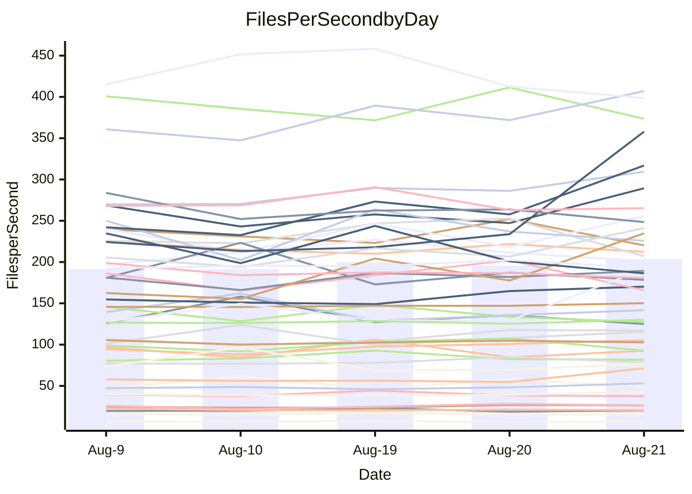

<!---
# This file is auto-generated. Do not edit.
# cspell:disable
--->
# Performance Report

Daily Performance

```mermaid
xychart-beta
    title Files Per Second by Day
    y-axis Files per Second
    x-axis Date [Aug-9, Aug-10, Aug-19, Aug-20, Aug-21]
    bar [191.27, 191.48, 199.45, 195.67, 203.66]
    line [19.76, 19.87, 23.15, 18.80, 20.30]
    line [94.45, 88.13, 97.66, 100.71, 105.37]
    line [106.66, 99.38, 103.80, 117.71, 117.03]
    line [80.61, 83.15, 92.81, 82.44, 81.74]
    line [239.79, 231.09, 223.10, 252.00, 220.22]
    line [269.81, 270.47, 289.77, 286.14, 309.39]
    line [39.52, 37.52, 44.46, 38.46, 37.66]
    line [268.54, 243.09, 257.77, 247.18, 289.36]
    line [6.78, 6.60, 7.51, 6.38, 6.78]
    line [240.17, 211.99, 227.00, 211.38, 201.30]
    line [125.68, 158.27, 127.25, 135.61, 125.00]
    line [225.24, 214.74, 210.02, 221.88, 212.40]
    line [225.91, 222.58, 246.74, 252.74, 207.13]
    line [145.75, 128.32, 148.05, 133.76, 127.46]
    line [24.65, 23.72, 23.68, 26.94, 26.39]
    line [139.45, 161.93, 128.87, 135.71, 141.61]
    line [25.95, 22.03, 24.86, 28.29, 26.30]
    line [154.75, 150.93, 149.02, 164.86, 170.19]
    line [15.80, 15.53, 17.25, 15.28, 15.93]
    line [196.97, 211.99, 246.59, 218.10, 255.48]
    line [180.75, 223.35, 172.94, 187.16, 178.45]
    line [96.93, 84.41, 106.12, 84.61, 92.60]
    line [77.16, 76.75, 77.91, 84.91, 78.56]
    line [400.74, 385.62, 371.65, 411.46, 373.53]
    line [145.79, 145.58, 147.10, 147.08, 150.14]
    line [249.96, 202.34, 263.67, 236.99, 225.80]
    line [186.27, 165.43, 184.07, 202.12, 165.77]
    line [224.37, 213.27, 217.89, 233.79, 357.93]
    line [47.00, 61.84, 45.89, 57.63, 49.23]
    line [127.47, 149.55, 129.16, 129.10, 191.45]
    line [181.18, 166.12, 186.93, 181.85, 189.35]
    line [57.90, 56.15, 56.35, 54.76, 71.27]
    line [101.07, 123.80, 99.87, 108.06, 115.44]
    line [98.84, 91.76, 103.43, 107.49, 92.84]
    line [162.48, 155.40, 204.32, 177.59, 234.82]
    line [360.76, 347.31, 389.41, 371.89, 406.97]
    line [198.91, 184.05, 187.41, 186.67, 180.76]
    line [242.10, 232.62, 273.32, 257.69, 316.88]
    line [73.60, 96.61, 68.89, 69.48, 76.97]
    line [415.14, 451.69, 458.22, 412.53, 398.65]
    line [283.77, 252.09, 262.36, 263.68, 248.47]
    line [22.84, 20.59, 20.47, 21.22, 20.73]
    line [205.56, 193.98, 216.67, 206.61, 241.09]
    line [126.64, 126.17, 128.45, 125.27, 130.16]
    line [105.46, 100.11, 102.43, 104.89, 102.74]
    line [47.26, 48.66, 46.00, 48.26, 53.02]
    line [268.09, 268.70, 290.78, 262.94, 265.27]
    line [234.76, 198.61, 243.75, 200.90, 186.33]
    line [39.98, 38.63, 38.64, 39.11, 42.97]
    line [192.03, 195.48, 194.87, 202.54, 192.76]
```

Time to Process Files

| Repository                                      | Elapsed | Min/Avg/Max          |    SD | SD Graph                |
| ----------------------------------------------- | ------: | :------------------: | ----: | ----------------------- |
| AdaDoom3/AdaDoom3                    |    2.73 | 2.1 /   2.6 /   2.9  |  0.27 | `    ┣━━┻━━╋●━┻━━┫    ` |
| alexiosc/megistos                    |    7.18 | 5.5 /   7.0 /   7.9  |  0.49 | `    ┣━━┻━━╋●━┻━━┫    ` |
| apollographql/apollo-server          |    1.95 | 1.8 /   2.4 /   2.8  |  0.25 | `    ┣●━┻━━╋━━┻━━┫    ` |
| aspnetboilerplate/aspnetboilerplate  |    6.36 | 6.3 /   8.4 /   9.1  |  0.95 | `   ●┣━━┻━━╋━━┻━━┫    ` |
| aws-amplify/docs                     |   13.51 | 9.6 /  12.9 /  14.0  |  1.16 | `    ┣━━┻━━╋━●┻━━┫    ` |
| Azure/azure-rest-api-specs           |    8.07 | 7.2 /  10.0 /  11.2  |  0.88 | `   ●┣━━┻━━╋━━┻━━┫    ` |
| bitjson/typescript-starter           |    0.95 | 0.6 /   1.0 /   1.1  |  0.11 | `     ┣━┻●━╋━━┻━┫     ` |
| caddyserver/caddy                    |    3.59 | 2.5 /   3.4 /   3.9  |  0.41 | `    ┣━━┻━━╋●━┻━━┫    ` |
| canada-ca/open-source-logiciel-libre |    0.99 | 0.8 /   1.0 /   1.3  |  0.12 | `     ┣━┻━●╋━━┻━┫     ` |
| chef/chef                            |    5.17 | 3.0 /   4.7 /   5.3  |  0.58 | `    ┣━━┻━━╋━━●━━┫    ` |
| dart-lang/sdk                        |   37.68 | 34.3 /  55.8 /  64.6 |  6.99 | `● ┣━━━┻━━━╋━━━┻━━━┫  ` |
| django/django                        |   14.99 | 10.2 /  12.6 /  14.6 |  1.53 | `   ┣━━━┻━━╋━━┻━●━┫   ` |
| eslint/eslint                        |    9.89 | 7.6 /   9.5 /  10.3  |  0.80 | `    ┣━━┻━━╋●━┻━━┫    ` |
| exonum/exonum                        |    3.40 | 2.6 /   3.2 /   3.7  |  0.26 | `    ┣━━┻━━╋━●┻━━┫    ` |
| flutter/samples                      |   12.78 | 8.0 /  12.3 /  14.0  |  1.37 | `    ┣━━┻━━╋●━┻━━┫    ` |
| gitbucket/gitbucket                  |    3.32 | 2.5 /   3.0 /   3.4  |  0.33 | `    ┣━━┻━━╋━●┻━━┫    ` |
| googleapis/google-cloud-cpp          |  100.19 | 96.3 / 118.9 / 127.8 | 11.64 | `  ┣●━━┻━━━╋━━━┻━━━┫  ` |
| graphql/express-graphql              |    1.06 | 0.7 /   1.0 /   1.2  |  0.11 | `     ┣━┻━━●━━┻━┫     ` |
| graphql/graphql-js                   |    3.01 | 2.8 /   3.6 /   3.9  |  0.26 | `    ●━━┻━━╋━━┻━━┫    ` |
| graphql/graphql-relay-js             |    1.08 | 0.7 /   1.1 /   1.3  |  0.11 | `     ┣━┻━━●━━┻━┫     ` |
| graphql/graphql-spec                 |    1.14 | 0.8 /   1.2 /   1.3  |  0.14 | `     ┣━┻━●╋━━┻━┫     ` |
| iluwatar/java-design-patterns        |   12.20 | 8.8 /  11.8 /  12.8  |  1.18 | `    ┣━━┻━━╋●━┻━━┫    ` |
| ktaranov/sqlserver-kit               |    5.91 | 3.3 /   5.3 /   6.2  |  0.88 | `    ┣━━┻━━╋━●┻━━┫    ` |
| liriliri/licia                       |    3.83 | 2.9 /   3.7 /   4.1  |  0.35 | `    ┣━━┻━━╋●━┻━━┫    ` |
| MartinThoma/LaTeX-examples           |    6.21 | 4.5 /   5.9 /   7.0  |  0.72 | `    ┣━━┻━━╋━●┻━━┫    ` |
| mdx-js/mdx                           |    1.82 | 1.5 /   1.8 /   1.9  |  0.10 | `     ┣━┻━━╋━●┻━┫     ` |
| microsoft/TypeScript-Website         |    5.11 | 5.0 /   5.2 /   5.6  |  0.20 | `    ┣━━┻●━╋━━┻━━┫    ` |
| MicrosoftDocs/PowerShell-Docs        |   18.97 | 14.3 /  23.5 /  25.8 |  2.57 | `   ┣●━━┻━━╋━━┻━━━┫   ` |
| neovim/nvim-lspconfig                |    5.20 | 3.7 /   4.7 /   5.6  |  0.61 | `    ┣━━┻━━╋━●┻━━┫    ` |
| pagekit/pagekit                      |    1.92 | 2.2 /   3.3 /   3.6  |  0.39 | `●   ┣━━┻━━╋━━┻━━┫    ` |
| php/php-src                          |   23.84 | 18.3 /  22.8 /  26.1 |  2.52 | `   ┣━━━┻━━╋●━┻━━━┫   ` |
| plasticrake/tplink-smarthome-api     |    1.24 | 0.9 /   1.3 /   1.4  |  0.15 | `     ┣━┻━━●━━┻━┫     ` |
| prettier/prettier                    |    7.33 | 5.8 /   7.3 /   8.0  |  0.77 | `    ┣━━┻━━●━━┻━━┫    ` |
| pycontribs/jira                      |    1.47 | 0.9 /   1.4 /   1.5  |  0.15 | `     ┣━┻━━╋━●┻━┫     ` |
| RustPython/RustPython                |    9.15 | 5.8 /   8.8 /  11.1  |  1.32 | `    ┣━━┻━━╋●━┻━━┫    ` |
| shoelace-style/shoelace              |    1.90 | 1.8 /   2.5 /   3.0  |  0.41 | `    ┣━●┻━━╋━━┻━━┫    ` |
| slint-ui/slint                       |   11.27 | 11.6 /  15.0 /  16.1 |  1.35 | ` ● ┣━━━┻━━╋━━┻━━━┫   ` |
| SoftwareBrothers/admin-bro           |    2.37 | 1.6 /   2.3 /   2.6  |  0.22 | `    ┣━━┻━━╋●━┻━━┫    ` |
| sveltejs/svelte                      |   22.92 | 16.9 /  21.3 /  23.0 |  2.00 | `   ┣━━━┻━━╋━━●━━━┫   ` |
| TheAlgorithms/Python                 |    5.50 | 3.0 /   5.3 /   5.9  |  0.63 | `    ┣━━┻━━╋●━┻━━┫    ` |
| twbs/bootstrap                       |    1.66 | 1.2 /   1.6 /   1.9  |  0.18 | `     ┣━┻━━╋●━┻━┫     ` |
| typescript-cheatsheets/react         |    1.15 | 0.7 /   1.1 /   1.3  |  0.11 | `     ┣━┻━━╋●━┻━┫     ` |
| typescript-eslint/typescript-eslint  |    3.98 | 3.3 /   4.1 /   4.7  |  0.34 | `    ┣━━┻━●╋━━┻━━┫    ` |
| vitest-dev/vitest                    |   10.33 | 8.2 /  10.3 /  10.8  |  0.71 | `    ┣━━┻━━●━━┻━━┫    ` |
| w3c/aria-practices                   |    3.22 | 3.1 /   3.3 /   3.5  |  0.11 | `     ┣━┻●━╋━━┻━┫     ` |
| w3c/specberus                        |    1.89 | 1.5 /   1.8 /   2.2  |  0.16 | `     ┣━┻━━╋●━┻━┫     ` |
| webdeveric/webpack-assets-manifest   |    1.19 | 0.9 /   1.2 /   1.4  |  0.12 | `     ┣━┻━━╋●━┻━┫     ` |
| webpack/webpack                      |    6.80 | 3.7 /   6.1 /   7.4  |  1.06 | `    ┣━━┻━━╋━●┻━━┫    ` |
| wireapp/wire-desktop                 |    1.09 | 1.1 /   1.3 /   1.5  |  0.11 | `     ●━┻━━╋━━┻━┫     ` |
| wireapp/wire-webapp                  |   13.38 | 10.3 /  12.8 /  14.2 |  0.77 | `    ┣━━┻━━╋━●┻━━┫    ` |

Note:
- Elapsed time is in seconds.

Files per Second over Time

| Repository                                      | Files |    Sec |    Fps |     Rel | Trend Fps           |    N |
| ----------------------------------------------- | ----: | -----: | -----: | ------: | ------------------- | ---: |
| AdaDoom3/AdaDoom3                    |   103 |   2.73 |  37.78 |  -5.40% | `▇▃▃▇▂▂▃▃▃█▇▃▃▆▃▃▃` |   16 |
| alexiosc/megistos                    |   583 |   7.18 |  81.20 |  -2.89% | `▃▄▃▃▃▂▄▄▄█▄▃▄▃▄▄▃` |   16 |
| apollographql/apollo-server          |   256 |   1.95 | 130.99 |  21.05% | `▂▂▃▂▃▆▅▂▃▃▃█▃▅▃▃▆` |   16 |
| aspnetboilerplate/aspnetboilerplate  |  2288 |   6.36 | 359.96 |  29.95% | `▂▂▂▃▃▂▇▃█▂▂▃▂█▃▂█` |   16 |
| aws-amplify/docs                     |  3030 |  13.51 | 224.33 |  -5.62% | `▂▂▃▂▃▆▅▃▃▂▃▃▃█▃▂▂` |   16 |
| Azure/azure-rest-api-specs           |  2561 |   8.07 | 317.20 |  22.40% | `█▃▅▃▃▂▃▂▃▃▃▂▃▂▃▃▆` |   16 |
| bitjson/typescript-starter           |    20 |   0.95 |  21.15 |   5.03% | `▄▃▃▃▂▂▂▃█▂▃▂▁▂▂▂▃` |   16 |
| caddyserver/caddy                    |   333 |   3.59 |  92.87 |  -4.93% | `▃▃▂▂▆▄▂▂▂▅▃▃▂▃█▆▃` |   16 |
| canada-ca/open-source-logiciel-libre |     7 |   0.99 |   7.10 |   4.68% | `▄▃▄▃▇▁▄▃█▄▃▂▄▄▃▃▄` |   16 |
| chef/chef                            |  1034 |   5.17 | 199.96 | -11.68% | `▃▁▆▂▂▂█▂▂▂▄▂▂▂▂▂▂` |   16 |
| dart-lang/sdk                        | 11618 |  37.68 | 308.33 |  44.86% | `▂▂▂▁▂▂▂▃▂█▂▅▂▂▂▂▇` |   16 |
| django/django                        |  2931 |  14.99 | 195.50 | -17.11% | `▂▃▂▂▆▃█▃▇▃▅█▂█▅▃▂` |   16 |
| eslint/eslint                        |  2082 |   9.89 | 210.50 |  -4.41% | `▃▇█▂▃▂▃▃▃▃▂▆▃▃▃▃▃` |   16 |
| exonum/exonum                        |   421 |   3.40 | 123.68 |  -5.25% | `▂▃▃▅▄▃▄█▃▄▄▄█▄▃▄▃` |   16 |
| flutter/samples                      |  1703 |  12.78 | 133.23 |  -5.24% | `▃▂▂▂█▃▂▂▂▄▄▂▂▂▂▁▂` |   16 |
| gitbucket/gitbucket                  |   418 |   3.32 | 125.81 |  -9.53% | `▃█▃▂▃▇▃▇▂▂▄▇▂▃▃▇▂` |   16 |
| googleapis/google-cloud-cpp          | 21238 | 100.19 | 211.97 |  17.38% | `█▇▂▂▃▃▃▂█▃▃▇▃▃▃▂▇` |   16 |
| graphql/express-graphql              |    26 |   1.06 |  24.56 |  -2.57% | `▃▆▂▃▂▂▃▃▃▂▂▃▃▃█▅▃` |   16 |
| graphql/graphql-js                   |   551 |   3.01 | 183.13 |  17.30% | `▄▃▃▂▃▇▃▃▃▃▃█▃▃▄▄▇` |   16 |
| graphql/graphql-relay-js             |    28 |   1.08 |  25.88 |  -0.97% | `▃▃▃▃▃▅▂▁▃▃▃▃▃█▃▃▃` |   16 |
| graphql/graphql-spec                 |    19 |   1.14 |  16.70 |   5.15% | `▂▂▂█▂▂▂▃▇▂▃▃▃▂▂▂▄` |   16 |
| iluwatar/java-design-patterns        |  2183 |  12.20 | 178.88 |  -2.45% | `▃▃▂▃▂▄█▇▂▃▃▃▃▄▆▃▃` |   16 |
| ktaranov/sqlserver-kit               |   490 |   5.91 |  82.96 | -12.78% | `▂▁▂█▁▅▂▂▂█▂▂▂▂▂▄▂` |   16 |
| liriliri/licia                       |  1442 |   3.83 | 376.45 |  -4.73% | `▃▂▃▂█▇▄▃▃▃▃▃█▄▄▃▃` |   16 |
| MartinThoma/LaTeX-examples           |  1409 |   6.21 | 226.72 |  -7.36% | `▂▄█▄▇▃▃▂▃▇▅▃▃▆▃▃▃` |   16 |
| mdx-js/mdx                           |   139 |   1.82 |  76.57 |  -3.60% | `▆▄▃▅▃▅▃▄▅▅▃▅▆█▇▅▄` |   16 |
| microsoft/TypeScript-Website         |   765 |   5.11 | 149.70 |   2.08% | `▆█▇▅▄▆▇▆█▅██▄▇▇▇▇` |   16 |
| MicrosoftDocs/PowerShell-Docs        |  3126 |  18.97 | 164.76 |  21.82% | `▂▂▂▁▂▂▂▃▂▂▂▂▂▂▂█▄` |   16 |
| neovim/nvim-lspconfig                |   869 |   5.20 | 166.98 | -10.78% | `▂▂▅█▆▃▅▃▃▆▄▆▆█▃▃▃` |   16 |
| pagekit/pagekit                      |   741 |   1.92 | 385.71 |  66.67% | `▂▂▁▂▁▄▂▂▂▂▂▅▂▁▂▆█` |   16 |
| php/php-src                          |  2389 |  23.84 | 100.21 |  -5.34% | `▃▃▂▃▃▇▄▇▃▅▂▃▇▃▅█▃` |   16 |
| plasticrake/tplink-smarthome-api     |    62 |   1.24 |  49.83 |  -1.30% | `▂▂▃▂▂▁▃▆▂▂▂▆▃▂█▃▃` |   16 |
| prettier/prettier                    |  2685 |   7.33 | 366.53 |  -1.86% | `▃▂▃█▃▂▃▃▃█▃▇▃▃▃▇▄` |   16 |
| pycontribs/jira                      |    80 |   1.47 |  54.49 |  -7.41% | `▅▂▂▂▂▂▂▂▂▂▂▂▂▂█▂`  |   15 |
| RustPython/RustPython                |   874 |   9.15 |  95.50 |  -5.34% | `▁▂▂▃▃▆▅▃▃▃▅▃▃█▃▂▃` |   16 |
| shoelace-style/shoelace              |   440 |   1.90 | 231.18 |  29.58% | `▂▁▂▂▅▂▂▂▂█▆▂▂▂▇▇▇` |   16 |
| slint-ui/slint                       |  3815 |  11.27 | 338.46 |  32.95% | `▃▃▂▂▂▃▂▂▃█▃▂▂▆▂▆█` |   16 |
| SoftwareBrothers/admin-bro           |   441 |   2.37 | 185.95 |  -2.80% | `█▃▃▃▂▃▂▂▃▃▃▅▂▂▂▂▃` |   16 |
| sveltejs/svelte                      |  8954 |  22.92 | 390.73 |  -7.92% | `▂▂▂▂▃▃█▅█▅▂▅▂▃▃▃▂` |   16 |
| TheAlgorithms/Python                 |  1411 |   5.50 | 256.44 |  -5.04% | `▂▁▁▂▂█▂▂▂▂▂▂▂▂▂▁▂` |   16 |
| twbs/bootstrap                       |   118 |   1.66 |  71.18 |  -3.42% | `▃▄▂▆▃▂▆█▃▃▃▃▃▄▃▆▃` |   16 |
| typescript-cheatsheets/react         |    24 |   1.15 |  20.90 |  -3.74% | `▂▃█▁▃▂▃▂▂▂▂▃▂▃▃▂▂` |   16 |
| typescript-eslint/typescript-eslint  |   866 |   3.98 | 217.47 |   3.13% | `▂▅▃▃▄▄▄▃▅▄▄▄▄▂▄█▅` |   16 |
| vitest-dev/vitest                    |  2769 |  10.33 | 268.10 |  -0.98% | `▂▃▃▃▂▂▇▃▃█▃▃▂▄▃▃▃` |   16 |
| w3c/aria-practices                   |   417 |   3.22 | 129.33 |   1.93% | `█▇▄▆▄▇▇▆▇▆▆▅▆▇▅▇▇` |   16 |
| w3c/specberus                        |   190 |   1.89 | 100.61 |  -3.61% | `█▅▄▄▄▃▅▄▄▅▄▂▇▄▅▅▄` |   16 |
| webdeveric/webpack-assets-manifest   |    55 |   1.19 |  46.31 |  -3.80% | `▄▆▃▄▃▃▅▄▄▃▃▄█▄▂█▄` |   16 |
| webpack/webpack                      |  1319 |   6.80 | 193.92 | -12.74% | `▄▂▄▂▂█▂▂▂█▂▂▃▂▂▁▂` |   16 |
| wireapp/wire-desktop                 |    51 |   1.09 |  46.82 |  18.91% | `▃▂█▄▄▃█▄▄▄▄▃▄▄▆▄▇` |   16 |
| wireapp/wire-webapp                  |  2526 |  13.38 | 188.84 |  -3.50% | `▄▃▃▃▃▄▄▄▄▃▄▄▂▃█▄▃` |   16 |

Data Throughput

| Repository                                      | Files |    Sec |     Kps |     Rel | Trend Kps           |    N |
| ----------------------------------------------- | ----: | -----: | ------: | ------: | ------------------- | ---: |
| AdaDoom3/AdaDoom3                    |   103 |   2.73 |  802.95 |  -5.40% | `▇▃▃▇▂▂▃▃▃█▇▃▃▆▃▃▃` |   16 |
| alexiosc/megistos                    |   583 |   7.18 |  638.02 |  -2.89% | `▃▄▃▃▃▂▄▄▄█▄▃▄▃▄▄▃` |   16 |
| apollographql/apollo-server          |   256 |   1.95 | 1078.60 |  21.05% | `▂▂▃▂▃▆▅▂▃▃▃█▃▅▃▃▆` |   16 |
| aspnetboilerplate/aspnetboilerplate  |  2288 |   6.36 |  880.23 |  29.95% | `▂▂▂▃▃▂▇▃█▂▂▃▂█▃▂█` |   16 |
| aws-amplify/docs                     |  3030 |  13.51 |  876.95 |  -5.53% | `▂▂▃▂▃▆▅▃▃▂▃▃▃█▃▂▂` |   16 |
| Azure/azure-rest-api-specs           |  2561 |   8.07 |  971.78 |  23.03% | `█▃▅▃▃▂▃▂▃▃▃▃▃▂▃▃▆` |   16 |
| bitjson/typescript-starter           |    20 |   0.95 |   84.61 |   5.03% | `▄▃▃▃▂▂▂▃█▂▃▂▁▂▂▂▃` |   16 |
| caddyserver/caddy                    |   333 |   3.59 |  846.12 |  -5.04% | `▃▃▂▂▆▄▂▂▂▅▃▃▂▃█▆▃` |   16 |
| canada-ca/open-source-logiciel-libre |     7 |   0.99 |   58.86 |   4.68% | `▄▃▄▃▇▁▄▃█▄▃▂▄▄▃▃▄` |   16 |
| chef/chef                            |  1034 |   5.17 |  981.79 | -11.68% | `▃▁▆▂▂▂█▂▂▂▄▂▂▂▂▂▂` |   16 |
| dart-lang/sdk                        | 11618 |  37.68 | 2141.38 |  45.32% | `▂▂▂▁▂▂▂▃▂█▂▅▂▂▂▂▇` |   16 |
| django/django                        |  2931 |  14.99 | 1260.93 | -17.01% | `▂▃▂▂▆▃█▃▇▃▅█▂█▅▃▂` |   16 |
| eslint/eslint                        |  2082 |   9.89 | 1477.73 |  -4.41% | `▃▇█▂▃▂▃▃▃▃▂▆▃▃▃▃▃` |   16 |
| exonum/exonum                        |   421 |   3.40 | 1183.08 |  -5.25% | `▂▃▃▅▄▃▄█▃▄▄▄█▄▃▄▃` |   16 |
| flutter/samples                      |  1703 |  12.78 |  794.12 |  -5.42% | `▃▂▂▂█▃▂▂▂▄▄▂▂▂▂▁▂` |   16 |
| gitbucket/gitbucket                  |   418 |   3.32 |  622.42 |  -9.08% | `▃█▃▂▂▇▃▇▂▂▄▇▂▃▃▇▃` |   16 |
| googleapis/google-cloud-cpp          | 21238 | 100.19 | 1841.53 |  17.44% | `█▇▂▂▃▃▃▂█▃▃▇▃▃▃▂▇` |   16 |
| graphql/express-graphql              |    26 |   1.06 |  112.40 |  -2.57% | `▃▆▂▃▂▂▃▃▃▂▂▃▃▃█▅▃` |   16 |
| graphql/graphql-js                   |   551 |   3.01 | 1365.67 |  17.30% | `▄▃▃▂▃▇▃▃▃▃▃█▃▃▄▄▇` |   16 |
| graphql/graphql-relay-js             |    28 |   1.08 |  101.68 |  -0.97% | `▃▃▃▃▃▅▂▁▃▃▃▃▃█▃▃▃` |   16 |
| graphql/graphql-spec                 |    19 |   1.14 |  559.09 |   5.15% | `▂▂▂█▂▂▂▃▇▂▃▃▃▂▂▂▄` |   16 |
| iluwatar/java-design-patterns        |  2183 |  12.20 |  552.62 |  -2.33% | `▃▃▂▃▂▄█▇▃▃▃▃▃▄▆▃▃` |   16 |
| ktaranov/sqlserver-kit               |   490 |   5.91 | 1256.77 | -12.78% | `▂▁▂█▁▅▂▂▂█▂▂▂▂▂▄▂` |   16 |
| liriliri/licia                       |  1442 |   3.83 |  451.38 |  -4.50% | `▃▂▃▂█▇▄▃▃▃▃▃█▄▄▃▃` |   16 |
| MartinThoma/LaTeX-examples           |  1409 |   6.21 |  468.25 |  -7.36% | `▂▄█▄▇▃▃▂▃▇▅▃▃▆▃▃▃` |   16 |
| mdx-js/mdx                           |   139 |   1.82 |  360.81 |  -3.60% | `▆▄▃▅▃▅▃▄▅▅▃▅▆█▇▅▄` |   16 |
| microsoft/TypeScript-Website         |   765 |   5.11 | 1032.24 |   2.09% | `▆█▇▅▄▆▇▆█▅██▄▇▇▇▇` |   16 |
| MicrosoftDocs/PowerShell-Docs        |  3126 |  18.97 | 1759.63 |  21.88% | `▂▂▂▁▂▂▂▃▂▂▂▂▂▂▂█▄` |   16 |
| neovim/nvim-lspconfig                |   869 |   5.20 |  489.79 | -10.87% | `▂▂▅█▆▃▅▃▃▆▄▆▆█▃▃▃` |   16 |
| pagekit/pagekit                      |   741 |   1.92 |  804.21 |  66.67% | `▂▂▁▂▁▄▂▂▂▂▂▅▂▁▂▆█` |   16 |
| php/php-src                          |  2389 |  23.84 | 1772.88 |  -5.32% | `▃▃▂▃▃▇▄▇▃▅▂▃▇▃▅█▃` |   16 |
| plasticrake/tplink-smarthome-api     |    62 |   1.24 |  269.23 |  -1.30% | `▂▂▃▂▂▁▃▆▂▂▂▆▃▂█▃▃` |   16 |
| prettier/prettier                    |  2685 |   7.33 |  518.06 |  -2.12% | `▃▂▃█▃▂▃▃▃█▃▇▃▃▃▇▄` |   16 |
| pycontribs/jira                      |    80 |   1.47 |  384.86 |  -7.41% | `▅▂▂▂▂▂▂▂▂▂▂▂▂▂█▂`  |   15 |
| RustPython/RustPython                |   874 |   9.15 | 2102.90 |  -5.18% | `▁▂▂▃▃▆▅▃▃▃▅▃▃█▃▂▃` |   16 |
| shoelace-style/shoelace              |   440 |   1.90 | 1116.49 |  29.58% | `▂▁▂▂▅▂▂▂▂█▆▂▂▂▇▇▇` |   16 |
| slint-ui/slint                       |  3815 |  11.27 | 1821.04 |  33.17% | `▃▃▂▂▂▃▂▂▃█▃▂▃▆▂▆█` |   16 |
| SoftwareBrothers/admin-bro           |   441 |   2.37 |  409.84 |  -2.80% | `█▃▃▃▂▃▂▂▃▃▃▅▂▂▂▂▃` |   16 |
| sveltejs/svelte                      |  8954 |  22.92 |  268.33 |  -7.86% | `▂▂▂▂▃▃█▅█▅▂▅▂▃▃▃▂` |   16 |
| TheAlgorithms/Python                 |  1411 |   5.50 |  655.92 |  -5.04% | `▂▁▁▂▂█▂▂▂▂▂▂▂▂▂▁▂` |   16 |
| twbs/bootstrap                       |   118 |   1.66 |  583.92 |  -3.42% | `▃▄▂▆▃▂▆█▃▃▃▃▃▄▃▆▃` |   16 |
| typescript-cheatsheets/react         |    24 |   1.15 |  188.95 |  -3.74% | `▂▃█▁▃▂▃▂▂▂▂▃▂▃▃▂▂` |   16 |
| typescript-eslint/typescript-eslint  |   866 |   3.98 |  730.77 |   3.09% | `▂▅▃▃▄▄▄▃▅▄▄▄▄▂▄█▅` |   16 |
| vitest-dev/vitest                    |  2769 |  10.33 |  774.87 |   0.24% | `▂▃▃▃▂▂▆▃▃█▄▃▃▄▃▃▃` |   16 |
| w3c/aria-practices                   |   417 |   3.22 | 1216.34 |   1.93% | `█▇▄▆▄▇▇▆▇▆▆▅▆▇▅▇▇` |   16 |
| w3c/specberus                        |   190 |   1.89 |  328.82 |  -3.54% | `█▅▄▄▄▃▅▄▄▅▄▂▇▄▅▅▄` |   16 |
| webdeveric/webpack-assets-manifest   |    55 |   1.19 |  106.94 |  -3.80% | `▄▆▃▄▃▃▅▄▄▃▃▄█▄▂█▄` |   16 |
| webpack/webpack                      |  1319 |   6.80 | 1324.34 |  -7.44% | `▃▁▃▁▁▇▂▁▂█▂▂▃▂▂▁▂` |   16 |
| wireapp/wire-desktop                 |    51 |   1.09 |  199.23 |  18.91% | `▃▂█▄▄▃█▄▄▄▄▃▄▄▆▄▇` |   16 |
| wireapp/wire-webapp                  |  2526 |  13.38 |  797.08 |  -3.26% | `▃▃▃▃▃▄▄▄▄▃▄▄▂▃█▄▃` |   16 |

