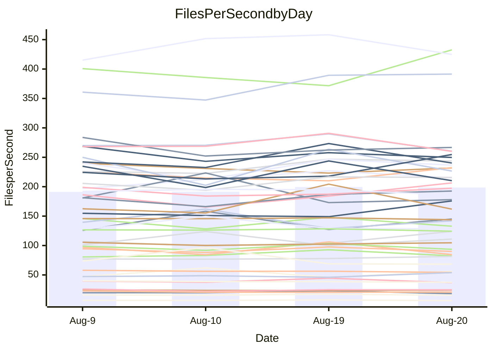

<!---
# This file is auto-generated. Do not edit.
# cspell:disable
--->
# Performance Report

Daily Performance

```mermaid
xychart-beta
    title Files Per Second by Day
    y-axis Files per Second
    x-axis Date [Aug-9, Aug-10, Aug-19, Aug-20]
    bar [191.27, 191.48, 199.45, 198.70]
    line [19.76, 19.87, 23.15, 18.24]
    line [94.45, 88.13, 97.66, 89.92]
    line [106.66, 99.38, 103.80, 123.97]
    line [80.61, 83.15, 92.81, 82.48]
    line [239.79, 231.09, 223.10, 231.83]
    line [269.81, 270.47, 289.77, 260.54]
    line [39.52, 37.52, 44.46, 36.89]
    line [268.54, 243.09, 257.77, 249.70]
    line [6.78, 6.60, 7.51, 6.29]
    line [240.17, 211.99, 227.00, 214.88]
    line [125.68, 158.27, 127.25, 145.10]
    line [225.24, 214.74, 210.02, 232.36]
    line [225.91, 222.58, 246.74, 243.72]
    line [145.75, 128.32, 148.05, 132.83]
    line [24.65, 23.72, 23.68, 24.26]
    line [139.45, 161.93, 128.87, 142.09]
    line [25.95, 22.03, 24.86, 24.78]
    line [154.75, 150.93, 149.02, 175.77]
    line [15.80, 15.53, 17.25, 15.48]
    line [196.97, 211.99, 246.59, 236.71]
    line [180.75, 223.35, 172.94, 177.94]
    line [96.93, 84.41, 106.12, 84.58]
    line [77.16, 76.75, 77.91, 81.52]
    line [400.74, 385.62, 371.65, 432.64]
    line [145.79, 145.58, 147.10, 143.88]
    line [249.96, 202.34, 263.67, 226.57]
    line [186.27, 165.43, 184.07, 206.40]
    line [224.37, 213.27, 217.89, 254.71]
    line [47.00, 61.84, 45.89, 55.99]
    line [127.47, 149.55, 129.16, 128.41]
    line [181.18, 166.12, 186.93, 192.56]
    line [57.90, 56.15, 56.35, 54.23]
    line [101.07, 123.80, 99.87, 110.88]
    line [98.84, 91.76, 103.43, 93.53]
    line [162.48, 155.40, 204.32, 161.89]
    line [360.76, 347.31, 389.41, 391.44]
    line [198.91, 184.05, 187.41, 197.46]
    line [242.10, 232.62, 273.32, 240.24]
    line [73.60, 96.61, 68.89, 68.28]
    line [415.14, 451.69, 458.22, 424.83]
    line [283.77, 252.09, 262.36, 266.73]
    line [22.84, 20.59, 20.47, 20.90]
    line [205.56, 193.98, 216.67, 215.69]
    line [126.64, 126.17, 128.45, 124.32]
    line [105.46, 100.11, 102.43, 104.67]
    line [47.26, 48.66, 46.00, 53.97]
    line [268.09, 268.70, 290.78, 260.05]
    line [234.76, 198.61, 243.75, 210.26]
    line [39.98, 38.63, 38.64, 37.48]
    line [192.03, 195.48, 194.87, 186.15]
```

Time to Process Files

| Repository                                      | Elapsed | Min/Avg/Max          |    SD | SD Graph                |
| ----------------------------------------------- | ------: | :------------------: | ----: | ----------------------- |
| AdaDoom3/AdaDoom3                    |    2.79 | 2.1 /   2.6 /   2.9  |  0.29 | `    ┣━━┻━━╋━●┻━━┫    ` |
| alexiosc/megistos                    |    6.94 | 5.5 /   7.0 /   7.9  |  0.56 | `    ┣━━┻━━●━━┻━━┫    ` |
| apollographql/apollo-server          |    2.48 | 1.8 /   2.4 /   2.8  |  0.28 | `    ┣━━┻━━╋●━┻━━┫    ` |
| aspnetboilerplate/aspnetboilerplate  |    9.11 | 6.4 /   8.4 /   9.1  |  0.88 | `    ┣━━┻━━╋━●┻━━┫    ` |
| aws-amplify/docs                     |   13.10 | 10.8 /  13.0 /  14.0 |  0.88 | `    ┣━━┻━━●━━┻━━┫    ` |
| Azure/azure-rest-api-specs           |   10.02 | 7.2 /   9.9 /  11.2  |  0.99 | `    ┣━━┻━━●━━┻━━┫    ` |
| bitjson/typescript-starter           |    1.15 | 0.6 /   1.0 /   1.1  |  0.12 | `     ┣━┻━━╋━━●━┫     ` |
| caddyserver/caddy                    |    3.92 | 2.8 /   3.5 /   3.9  |  0.31 | `    ┣━━┻━━╋━━┻●━┫    ` |
| canada-ca/open-source-logiciel-libre |    1.04 | 0.8 /   1.0 /   1.3  |  0.14 | `     ┣━┻━━●━━┻━┫     ` |
| chef/chef                            |    4.73 | 3.0 /   4.6 /   5.3  |  0.64 | `    ┣━━┻━━╋●━┻━━┫    ` |
| dart-lang/sdk                        |   57.04 | 34.3 /  55.1 /  64.6 |  7.96 | `  ┣━━━┻━━━╋●━━┻━━━┫  ` |
| django/django                        |   14.11 | 10.2 /  12.7 /  14.6 |  1.57 | `   ┣━━━┻━━╋━━●━━━┫   ` |
| eslint/eslint                        |    9.74 | 7.6 /   9.4 /  10.3  |  0.90 | `    ┣━━┻━━╋●━┻━━┫    ` |
| exonum/exonum                        |    2.64 | 2.7 /   3.3 /   3.7  |  0.23 | `  ● ┣━━┻━━╋━━┻━━┫    ` |
| flutter/samples                      |   12.74 | 8.0 /  12.0 /  13.4  |  1.47 | `    ┣━━┻━━╋━●┻━━┫    ` |
| gitbucket/gitbucket                  |    3.38 | 2.5 /   3.0 /   3.4  |  0.34 | `    ┣━━┻━━╋━━●━━┫    ` |
| googleapis/google-cloud-cpp          |  122.93 | 96.3 / 117.0 / 127.8 | 12.82 | `  ┣━━━┻━━━╋━●━┻━━━┫  ` |
| graphql/express-graphql              |    1.07 | 0.8 /   1.1 /   1.2  |  0.08 | `     ┣━┻━━●━━┻━┫     ` |
| graphql/graphql-js                   |    3.56 | 2.8 /   3.6 /   3.9  |  0.30 | `    ┣━━┻━━●━━┻━━┫    ` |
| graphql/graphql-relay-js             |    1.13 | 0.9 /   1.1 /   1.3  |  0.07 | `     ┣━┻━━●━━┻━┫     ` |
| graphql/graphql-spec                 |    1.22 | 0.8 /   1.2 /   1.3  |  0.16 | `     ┣━┻━━●━━┻━┫     ` |
| iluwatar/java-design-patterns        |   12.43 | 8.8 /  11.8 /  12.8  |  1.29 | `    ┣━━┻━━╋━●┻━━┫    ` |
| ktaranov/sqlserver-kit               |    5.61 | 3.3 /   5.3 /   6.2  |  0.98 | `    ┣━━┻━━╋●━┻━━┫    ` |
| liriliri/licia                       |    2.95 | 2.9 /   3.7 /   4.1  |  0.33 | `   ●┣━━┻━━╋━━┻━━┫    ` |
| MartinThoma/LaTeX-examples           |    6.22 | 4.5 /   5.8 /   7.0  |  0.78 | `    ┣━━┻━━╋━●┻━━┫    ` |
| mdx-js/mdx                           |    1.70 | 1.7 /   1.8 /   1.9  |  0.07 | `     ┣━●━━╋━━┻━┫     ` |
| microsoft/TypeScript-Website         |    5.61 | 5.0 /   5.2 /   5.6  |  0.19 | `    ┣━━┻━━╋━━┻━━●    ` |
| MicrosoftDocs/PowerShell-Docs        |   24.02 | 20.9 /  24.2 /  25.8 |  1.13 | `   ┣━━━┻━━●━━┻━━━┫   ` |
| neovim/nvim-lspconfig                |    4.28 | 3.9 /   4.7 /   5.6  |  0.59 | `    ┣━━┻●━╋━━┻━━┫    ` |
| pagekit/pagekit                      |    3.48 | 2.5 /   3.3 /   3.6  |  0.31 | `    ┣━━┻━━╋━●┻━━┫    ` |
| php/php-src                          |   19.28 | 19.2 /  23.5 /  26.1 |  2.17 | `   ●━━━┻━━╋━━┻━━━┫   ` |
| plasticrake/tplink-smarthome-api     |    1.24 | 1.0 /   1.3 /   1.4  |  0.13 | `     ┣━┻━●╋━━┻━┫     ` |
| prettier/prettier                    |    7.77 | 5.8 /   7.3 /   8.0  |  0.78 | `    ┣━━┻━━╋━●┻━━┫    ` |
| pycontribs/jira                      |    1.46 | 1.1 /   1.4 /   1.5  |  0.08 | `     ┣━┻━━╋●━┻━┫     ` |
| RustPython/RustPython                |    9.26 | 6.6 /   8.9 /  11.1  |  1.19 | `    ┣━━┻━━╋●━┻━━┫    ` |
| shoelace-style/shoelace              |    2.70 | 1.8 /   2.6 /   3.0  |  0.37 | `    ┣━━┻━━╋●━┻━━┫    ` |
| slint-ui/slint                       |   15.70 | 11.6 /  15.2 /  16.1 |  1.14 | `    ┣━━┻━━╋●━┻━━┫    ` |
| SoftwareBrothers/admin-bro           |    2.50 | 1.6 /   2.3 /   2.4  |  0.22 | `     ┣━┻━━╋━━●━┫     ` |
| sveltejs/svelte                      |   22.95 | 16.9 /  20.9 /  23.0 |  2.18 | `   ┣━━━┻━━╋━━●━━━┫   ` |
| TheAlgorithms/Python                 |    5.35 | 3.0 /   5.3 /   5.9  |  0.71 | `    ┣━━┻━━●━━┻━━┫    ` |
| twbs/bootstrap                       |    1.72 | 1.2 /   1.6 /   1.9  |  0.20 | `     ┣━┻━━╋●━┻━┫     ` |
| typescript-cheatsheets/react         |    1.18 | 0.7 /   1.1 /   1.3  |  0.13 | `     ┣━┻━━╋●━┻━┫     ` |
| typescript-eslint/typescript-eslint  |    4.02 | 3.9 /   4.2 /   4.7  |  0.24 | `    ┣━━┻●━╋━━┻━━┫    ` |
| vitest-dev/vitest                    |   10.80 | 8.2 /  10.2 /  10.8  |  0.78 | `    ┣━━┻━━╋━━●━━┫    ` |
| w3c/aria-practices                   |    3.35 | 3.1 /   3.3 /   3.5  |  0.12 | `     ┣━┻━━╋●━┻━┫     ` |
| w3c/specberus                        |    1.55 | 1.5 /   1.9 /   2.2  |  0.15 | `    ●┣━┻━━╋━━┻━┫     ` |
| webdeveric/webpack-assets-manifest   |    0.90 | 1.0 /   1.2 /   1.3  |  0.06 | `●     ┣━┻━╋━┻━┫      ` |
| webpack/webpack                      |    5.85 | 3.7 /   5.9 /   7.0  |  1.11 | `    ┣━━┻━━●━━┻━━┫    ` |
| wireapp/wire-desktop                 |    1.34 | 1.1 /   1.3 /   1.5  |  0.12 | `     ┣━┻━━╋●━┻━┫     ` |
| wireapp/wire-webapp                  |   14.21 | 12.5 /  12.9 /  13.4 |  0.30 | `     ┣━━┻━╋━┻━━┫    ●` |

Note:
- Elapsed time is in seconds.

Files per Second over Time

| Repository                                      | Files |    Sec |    Fps |     Rel | Trend Fps       |    N |
| ----------------------------------------------- | ----: | -----: | -----: | ------: | --------------- | ---: |
| AdaDoom3/AdaDoom3                    |   103 |   2.79 |  36.97 |  -8.40% | `▇▃▃▇▂▂▃▃▃█▇▃▃` |   12 |
| alexiosc/megistos                    |   583 |   6.94 |  83.95 |   0.06% | `▃▄▃▃▃▂▄▄▄█▄▃▄` |   12 |
| apollographql/apollo-server          |   256 |   2.48 | 103.20 |  -4.90% | `▂▂▃▂▃▆▅▂▃▃▃█▃` |   12 |
| aspnetboilerplate/aspnetboilerplate  |  2288 |   9.11 | 251.15 |  -8.63% | `▂▂▂▃▃▂▇▃█▂▂▃▂` |   12 |
| aws-amplify/docs                     |  3030 |  13.10 | 231.29 |  -1.27% | `▃▃▄▃▃█▇▄▃▂▃▄▄` |   12 |
| Azure/azure-rest-api-specs           |  2561 |  10.02 | 255.48 |  -2.36% | `█▃▅▃▃▂▃▂▃▃▃▂▃` |   12 |
| bitjson/typescript-starter           |    20 |   1.15 |  17.45 | -15.09% | `▄▃▃▂▂▁▂▂█▂▂▂▁` |   12 |
| caddyserver/caddy                    |   333 |   3.92 |  84.94 | -10.36% | `▄▄▃▂█▅▂▃▃▇▄▄▂` |   12 |
| canada-ca/open-source-logiciel-libre |     7 |   1.04 |   6.73 |  -2.00% | `▄▃▄▃▇▁▄▃█▄▃▂▄` |   12 |
| chef/chef                            |  1034 |   4.73 | 218.58 |  -5.83% | `▃▁▆▂▂▂█▂▂▂▄▂▂` |   12 |
| dart-lang/sdk                        | 11618 |  57.04 | 203.67 |  -6.01% | `▂▂▂▁▂▂▂▃▂█▂▅▂` |   12 |
| django/django                        |  2931 |  14.11 | 207.77 | -11.71% | `▂▃▂▂▆▃█▃▇▃▅█▂` |   12 |
| eslint/eslint                        |  2082 |   9.74 | 213.80 |  -4.00% | `▃▇█▂▃▂▃▃▃▃▂▆▃` |   12 |
| exonum/exonum                        |   421 |   2.64 | 159.42 |  23.37% | `▂▃▃▅▄▃▄█▃▄▄▄█` |   12 |
| flutter/samples                      |  1703 |  12.74 | 133.62 |  -7.03% | `▃▁▂▂█▂▂▂▂▄▄▂▂` |   12 |
| gitbucket/gitbucket                  |   418 |   3.38 | 123.78 | -11.85% | `▃█▃▂▃▇▃▇▂▂▄▇▂` |   12 |
| googleapis/google-cloud-cpp          | 21238 | 122.93 | 172.76 |  -6.09% | `█▇▂▂▃▃▃▂█▃▃▇▃` |   12 |
| graphql/express-graphql              |    26 |   1.07 |  24.21 |  -0.36% | `▄█▂▄▃▃▄▃▄▃▃▄▄` |   12 |
| graphql/graphql-js                   |   551 |   3.56 | 154.83 |  -1.07% | `▄▃▃▂▃▇▃▃▃▃▃█▃` |   12 |
| graphql/graphql-relay-js             |    28 |   1.13 |  24.87 |  -1.49% | `▅▅▅▅▅█▄▂▄▄▄▄▄` |   12 |
| graphql/graphql-spec                 |    19 |   1.22 |  15.55 |  -3.46% | `▂▂▂█▂▂▂▃▇▂▃▃▃` |   12 |
| iluwatar/java-design-patterns        |  2183 |  12.43 | 175.63 |  -3.66% | `▃▃▂▃▂▄█▇▂▃▃▃▃` |   12 |
| ktaranov/sqlserver-kit               |   490 |   5.61 |  87.33 |  -9.90% | `▂▁▂█▁▅▂▂▂█▂▂▂` |   12 |
| liriliri/licia                       |  1442 |   2.95 | 488.79 |  25.27% | `▃▂▃▂█▇▄▃▃▃▃▃█` |   12 |
| MartinThoma/LaTeX-examples           |  1409 |   6.22 | 226.41 |  -8.51% | `▂▄█▄▇▃▃▂▃▇▅▃▃` |   12 |
| mdx-js/mdx                           |   139 |   1.70 |  81.94 |   5.54% | `█▅▄▇▅▇▅▆▇█▅██` |   12 |
| microsoft/TypeScript-Website         |   765 |   5.61 | 136.30 |  -7.01% | `▆█▇▅▄▆▇▆█▅▇█▄` |   12 |
| MicrosoftDocs/PowerShell-Docs        |  3126 |  24.02 | 130.12 |   0.35% | `▄▄▄▃▄▄▅█▄▄▅▄▄` |   12 |
| neovim/nvim-lspconfig                |   869 |   4.28 | 203.04 |   9.20% | `▂▂▆█▇▃▅▃▃▆▄▇▆` |   12 |
| pagekit/pagekit                      |   741 |   3.48 | 212.89 |  -6.56% | `▃▃▂▃▂▆▂▂▃▃▃█▂` |   12 |
| php/php-src                          |  2389 |  19.28 | 123.90 |  21.00% | `▃▄▃▃▃█▄█▃▆▂▃█` |   12 |
| plasticrake/tplink-smarthome-api     |    62 |   1.24 |  50.11 |   1.85% | `▃▃▄▃▃▂▄█▂▃▃█▄` |   12 |
| prettier/prettier                    |  2685 |   7.77 | 345.38 |  -7.45% | `▃▂▃█▃▂▃▃▃█▃▇▃` |   12 |
| pycontribs/jira                      |    80 |   1.46 |  54.91 |  -3.67% | `█▄▃▃▃▃▄▃▃▄▃▂▃` |   12 |
| RustPython/RustPython                |   874 |   9.26 |  94.35 |  -4.59% | `▁▃▃▃▃█▇▃▄▄▇▃▄` |   12 |
| shoelace-style/shoelace              |   440 |   2.70 | 163.22 |  -5.21% | `▂▁▂▂▅▂▂▂▂█▆▂▂` |   12 |
| slint-ui/slint                       |  3815 |  15.70 | 242.98 |  -2.31% | `▃▃▂▂▃▃▂▂▃█▃▂▃` |   12 |
| SoftwareBrothers/admin-bro           |   441 |   2.50 | 176.44 | -10.18% | `█▂▂▂▂▂▂▂▂▂▂▄▁` |   12 |
| sveltejs/svelte                      |  8954 |  22.95 | 390.21 |  -9.81% | `▂▂▂▂▃▃█▅█▅▂▅▂` |   12 |
| TheAlgorithms/Python                 |  1411 |   5.35 | 263.87 |  -3.90% | `▂▁▁▂▂█▂▂▂▂▂▂▂` |   12 |
| twbs/bootstrap                       |   118 |   1.72 |  68.55 |  -7.20% | `▃▄▂▆▃▂▆█▃▃▃▃▃` |   12 |
| typescript-cheatsheets/react         |    24 |   1.18 |  20.34 |  -7.30% | `▂▃█▁▃▂▃▂▂▂▂▃▂` |   12 |
| typescript-eslint/typescript-eslint  |   866 |   4.02 | 215.49 |   3.48% | `▃█▄▅▆▇▇▄█▇▇▇▇` |   12 |
| vitest-dev/vitest                    |  2769 |  10.80 | 256.31 |  -6.27% | `▂▃▃▃▂▂▇▃▃█▃▃▂` |   12 |
| w3c/aria-practices                   |   417 |   3.35 | 124.55 |  -1.81% | `█▇▄▆▄▇▇▆▇▆▆▅▆` |   12 |
| w3c/specberus                        |   190 |   1.55 | 122.92 |  19.72% | `█▅▄▄▄▃▅▄▄▅▄▂▇` |   12 |
| webdeveric/webpack-assets-manifest   |    55 |   0.90 |  61.35 |  30.52% | `▃▅▃▃▂▃▅▄▃▃▃▃█` |   12 |
| webpack/webpack                      |  1319 |   5.85 | 225.37 |  -2.31% | `▄▂▄▁▂█▂▂▁█▂▂▃` |   12 |
| wireapp/wire-desktop                 |    51 |   1.34 |  38.12 |  -2.95% | `▃▂█▄▄▃█▄▄▄▄▃▄` |   12 |
| wireapp/wire-webapp                  |  2526 |  14.21 | 177.74 |  -8.02% | `▇▅▆▆▅█▇▇█▅▇▇▃` |   12 |

Data Throughput

| Repository                                      | Files |    Sec |     Kps |     Rel | Trend Kps       |    N |
| ----------------------------------------------- | ----: | -----: | ------: | ------: | --------------- | ---: |
| AdaDoom3/AdaDoom3                    |   103 |   2.79 |  785.78 |  -8.40% | `▇▃▃▇▂▂▃▃▃█▇▃▃` |   12 |
| alexiosc/megistos                    |   583 |   6.94 |  659.66 |   0.06% | `▃▄▃▃▃▂▄▄▄█▄▃▄` |   12 |
| apollographql/apollo-server          |   256 |   2.48 |  849.76 |  -4.90% | `▂▂▃▂▃▆▅▂▃▃▃█▃` |   12 |
| aspnetboilerplate/aspnetboilerplate  |  2288 |   9.11 |  614.15 |  -8.63% | `▂▂▂▃▃▂▇▃█▂▂▃▂` |   12 |
| aws-amplify/docs                     |  3030 |  13.10 |  904.19 |  -1.14% | `▃▃▄▃▃█▇▄▃▂▃▄▄` |   12 |
| Azure/azure-rest-api-specs           |  2561 |  10.02 |  782.71 |  -1.70% | `█▃▅▃▃▂▃▂▃▃▃▃▃` |   12 |
| bitjson/typescript-starter           |    20 |   1.15 |   69.81 | -15.09% | `▄▃▃▂▂▁▂▂█▂▂▂▁` |   12 |
| caddyserver/caddy                    |   333 |   3.92 |  773.92 | -10.50% | `▄▄▃▂█▅▂▃▃▇▄▄▂` |   12 |
| canada-ca/open-source-logiciel-libre |     7 |   1.04 |   55.79 |  -2.00% | `▄▃▄▃▇▁▄▃█▄▃▂▄` |   12 |
| chef/chef                            |  1034 |   4.73 | 1073.23 |  -5.83% | `▃▁▆▂▂▂█▂▂▂▄▂▂` |   12 |
| dart-lang/sdk                        | 11618 |  57.04 | 1414.51 |  -5.61% | `▂▂▂▁▂▂▂▃▂█▂▅▂` |   12 |
| django/django                        |  2931 |  14.11 | 1340.05 | -11.56% | `▂▃▂▂▆▃█▃▇▃▅█▂` |   12 |
| eslint/eslint                        |  2082 |   9.74 | 1500.91 |  -3.99% | `▃▇█▂▃▂▃▃▃▃▂▆▃` |   12 |
| exonum/exonum                        |   421 |   2.64 | 1524.87 |  23.37% | `▂▃▃▅▄▃▄█▃▄▄▄█` |   12 |
| flutter/samples                      |  1703 |  12.74 |  796.48 |  -7.27% | `▃▁▂▂█▂▂▂▂▄▄▂▂` |   12 |
| gitbucket/gitbucket                  |   418 |   3.38 |  612.41 | -11.27% | `▃█▃▂▂▇▃▇▂▂▄▇▂` |   12 |
| googleapis/google-cloud-cpp          | 21238 | 122.93 | 1500.86 |  -6.03% | `█▇▂▂▃▃▃▂█▃▃▇▃` |   12 |
| graphql/express-graphql              |    26 |   1.07 |  110.81 |  -0.36% | `▄█▂▄▃▃▄▃▄▃▃▄▄` |   12 |
| graphql/graphql-js                   |   551 |   3.56 | 1154.62 |  -1.07% | `▄▃▃▂▃▇▃▃▃▃▃█▃` |   12 |
| graphql/graphql-relay-js             |    28 |   1.13 |   97.71 |  -1.49% | `▅▅▅▅▅█▄▂▄▄▄▄▄` |   12 |
| graphql/graphql-spec                 |    19 |   1.22 |  520.47 |  -3.46% | `▂▂▂█▂▂▂▃▇▂▃▃▃` |   12 |
| iluwatar/java-design-patterns        |  2183 |  12.43 |  542.59 |  -3.50% | `▃▃▂▃▂▄█▇▃▃▃▃▃` |   12 |
| ktaranov/sqlserver-kit               |   490 |   5.61 | 1323.01 |  -9.90% | `▂▁▂█▁▅▂▂▂█▂▂▂` |   12 |
| liriliri/licia                       |  1442 |   2.95 |  586.07 |  25.68% | `▃▂▃▂█▇▄▃▃▃▃▃█` |   12 |
| MartinThoma/LaTeX-examples           |  1409 |   6.22 |  467.61 |  -8.51% | `▂▄█▄▇▃▃▂▃▇▅▃▃` |   12 |
| mdx-js/mdx                           |   139 |   1.70 |  386.13 |   5.54% | `█▅▄▇▅▇▅▆▇█▅██` |   12 |
| microsoft/TypeScript-Website         |   765 |   5.61 |  939.84 |  -7.00% | `▆█▇▅▄▆▇▆█▅██▄` |   12 |
| MicrosoftDocs/PowerShell-Docs        |  3126 |  24.02 | 1389.65 |   0.40% | `▄▄▄▃▄▄▅█▄▄▅▄▄` |   12 |
| neovim/nvim-lspconfig                |   869 |   4.28 |  595.58 |   9.06% | `▂▂▆█▇▃▅▃▃▆▄▇▆` |   12 |
| pagekit/pagekit                      |   741 |   3.48 |  443.87 |  -6.56% | `▃▃▂▃▂▆▂▂▃▃▃█▂` |   12 |
| php/php-src                          |  2389 |  19.28 | 2191.99 |  21.04% | `▃▄▃▃▃█▄█▃▆▂▃█` |   12 |
| plasticrake/tplink-smarthome-api     |    62 |   1.24 |  270.77 |   1.85% | `▃▃▄▃▃▂▄█▂▃▃█▄` |   12 |
| prettier/prettier                    |  2685 |   7.77 |  488.17 |  -7.78% | `▃▂▃█▃▂▃▃▃█▃▇▃` |   12 |
| pycontribs/jira                      |    80 |   1.46 |  387.81 |  -3.67% | `█▄▃▃▃▃▄▃▃▄▃▂▃` |   12 |
| RustPython/RustPython                |   874 |   9.26 | 2077.65 |  -4.37% | `▁▃▃▃▃█▇▃▄▄▇▃▄` |   12 |
| shoelace-style/shoelace              |   440 |   2.70 |  788.29 |  -5.21% | `▂▁▂▂▅▂▂▂▂█▆▂▂` |   12 |
| slint-ui/slint                       |  3815 |  15.70 | 1307.32 |  -2.09% | `▃▃▂▂▃▃▂▂▃█▃▂▃` |   12 |
| SoftwareBrothers/admin-bro           |   441 |   2.50 |  388.88 | -10.18% | `█▂▂▂▂▂▂▂▂▂▂▄▁` |   12 |
| sveltejs/svelte                      |  8954 |  22.95 |  267.97 |  -9.74% | `▂▂▂▂▃▃█▅█▅▂▅▂` |   12 |
| TheAlgorithms/Python                 |  1411 |   5.35 |  674.92 |  -3.90% | `▂▁▁▂▂█▂▂▂▂▂▂▂` |   12 |
| twbs/bootstrap                       |   118 |   1.72 |  562.38 |  -7.20% | `▃▄▂▆▃▂▆█▃▃▃▃▃` |   12 |
| typescript-cheatsheets/react         |    24 |   1.18 |  183.95 |  -7.30% | `▂▃█▁▃▂▃▂▂▂▂▃▂` |   12 |
| typescript-eslint/typescript-eslint  |   866 |   4.02 |  724.11 |   3.43% | `▃█▄▅▆▇▇▄█▇▇▇▇` |   12 |
| vitest-dev/vitest                    |  2769 |  10.80 |  740.78 |  -4.75% | `▂▃▃▃▂▂▆▃▃█▄▃▃` |   12 |
| w3c/aria-practices                   |   417 |   3.35 | 1171.45 |  -1.81% | `█▇▄▆▄▇▇▆▇▆▆▅▆` |   12 |
| w3c/specberus                        |   190 |   1.55 |  401.75 |  19.85% | `█▅▄▄▄▃▅▄▄▅▄▂▇` |   12 |
| webdeveric/webpack-assets-manifest   |    55 |   0.90 |  141.67 |  30.52% | `▃▅▃▃▂▃▅▄▃▃▃▃█` |   12 |
| webpack/webpack                      |  1319 |   5.85 | 1539.12 |   5.44% | `▃▁▃▁▁▇▂▁▂█▂▂▃` |   12 |
| wireapp/wire-desktop                 |    51 |   1.34 |  162.18 |  -2.95% | `▃▂█▄▄▃█▄▄▄▄▃▄` |   12 |
| wireapp/wire-webapp                  |  2526 |  14.21 |  750.22 |  -7.71% | `▇▅▅▆▅▇▇▇█▅▇▇▃` |   12 |

