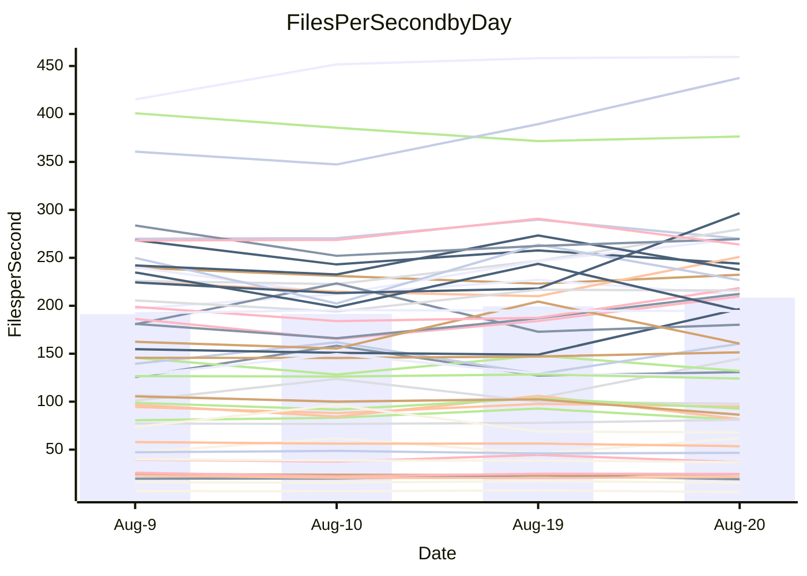

<!---
# This file is auto-generated. Do not edit.
# cspell:disable
--->
# Performance Report

Daily Performance

```mermaid
xychart-beta
    title Files Per Second by Day
    y-axis Files per Second
    x-axis Date [Aug-9, Aug-10, Aug-19, Aug-20]
    bar [191.27, 191.48, 199.45, 208.52]
    line [19.76, 19.87, 23.15, 19.04]
    line [94.45, 88.13, 97.66, 94.89]
    line [106.66, 99.38, 103.80, 144.75]
    line [80.61, 83.15, 92.81, 81.01]
    line [239.79, 231.09, 223.10, 232.36]
    line [269.81, 270.47, 289.77, 269.92]
    line [39.52, 37.52, 44.46, 36.81]
    line [268.54, 243.09, 257.77, 243.92]
    line [6.78, 6.60, 7.51, 5.84]
    line [240.17, 211.99, 227.00, 211.19]
    line [125.68, 158.27, 127.25, 130.78]
    line [225.24, 214.74, 210.02, 250.92]
    line [225.91, 222.58, 246.74, 279.67]
    line [145.75, 128.32, 148.05, 132.04]
    line [24.65, 23.72, 23.68, 24.30]
    line [139.45, 161.93, 128.87, 160.40]
    line [25.95, 22.03, 24.86, 24.69]
    line [154.75, 150.93, 149.02, 196.70]
    line [15.80, 15.53, 17.25, 15.41]
    line [196.97, 211.99, 246.59, 269.75]
    line [180.75, 223.35, 172.94, 180.24]
    line [96.93, 84.41, 106.12, 81.83]
    line [77.16, 76.75, 77.91, 81.10]
    line [400.74, 385.62, 371.65, 376.49]
    line [145.79, 145.58, 147.10, 151.45]
    line [249.96, 202.34, 263.67, 226.73]
    line [186.27, 165.43, 184.07, 209.75]
    line [224.37, 213.27, 217.89, 296.52]
    line [47.00, 61.84, 45.89, 61.87]
    line [127.47, 149.55, 129.16, 126.70]
    line [181.18, 166.12, 186.93, 212.37]
    line [57.90, 56.15, 56.35, 53.55]
    line [101.07, 123.80, 99.87, 97.86]
    line [98.84, 91.76, 103.43, 92.70]
    line [162.48, 155.40, 204.32, 160.56]
    line [360.76, 347.31, 389.41, 437.50]
    line [198.91, 184.05, 187.41, 218.48]
    line [242.10, 232.62, 273.32, 237.49]
    line [73.60, 96.61, 68.89, 68.01]
    line [415.14, 451.69, 458.22, 459.45]
    line [283.77, 252.09, 262.36, 269.59]
    line [22.84, 20.59, 20.47, 21.45]
    line [205.56, 193.98, 216.67, 215.89]
    line [126.64, 126.17, 128.45, 124.08]
    line [105.46, 100.11, 102.43, 86.41]
    line [47.26, 48.66, 46.00, 46.59]
    line [268.09, 268.70, 290.78, 263.80]
    line [234.76, 198.61, 243.75, 195.15]
    line [39.98, 38.63, 38.64, 36.85]
    line [192.03, 195.48, 194.87, 194.56]
```

Time to Process Files

| Repository                                      | Elapsed | Min/Avg/Max          |    SD | SD Graph                |
| ----------------------------------------------- | ------: | :------------------: | ----: | ----------------------- |
| AdaDoom3/AdaDoom3                    |    2.80 | 2.1 /   2.6 /   2.9  |  0.30 | `    ┣━━┻━━╋━●┻━━┫    ` |
| alexiosc/megistos                    |    7.20 | 5.5 /   7.0 /   7.9  |  0.58 | `    ┣━━┻━━╋●━┻━━┫    ` |
| apollographql/apollo-server          |    1.77 | 2.0 /   2.5 /   2.8  |  0.21 | ` ●   ┣━┻━━╋━━┻━┫     ` |
| aspnetboilerplate/aspnetboilerplate  |    8.48 | 6.4 /   8.4 /   9.1  |  0.91 | `    ┣━━┻━━●━━┻━━┫    ` |
| aws-amplify/docs                     |   13.04 | 10.8 /  13.0 /  14.0 |  0.92 | `    ┣━━┻━━●━━┻━━┫    ` |
| Azure/azure-rest-api-specs           |   10.50 | 7.2 /   9.9 /  11.2  |  1.01 | `    ┣━━┻━━╋━●┻━━┫    ` |
| bitjson/typescript-starter           |    1.05 | 0.6 /   1.0 /   1.1  |  0.12 | `     ┣━┻━━╋●━┻━┫     ` |
| caddyserver/caddy                    |    3.51 | 2.8 /   3.5 /   3.9  |  0.33 | `    ┣━━┻━━●━━┻━━┫    ` |
| canada-ca/open-source-logiciel-libre |    1.20 | 0.8 /   1.0 /   1.3  |  0.13 | `     ┣━┻━━╋━━●━┫     ` |
| chef/chef                            |    4.90 | 3.0 /   4.5 /   5.3  |  0.66 | `    ┣━━┻━━╋━●┻━━┫    ` |
| dart-lang/sdk                        |   43.07 | 34.3 /  56.2 /  64.6 |  7.40 | `  ┣●━━┻━━━╋━━━┻━━━┫  ` |
| django/django                        |   10.48 | 10.2 /  12.9 /  14.6 |  1.49 | `   ┣━●━┻━━╋━━┻━━━┫   ` |
| eslint/eslint                        |    8.30 | 7.6 /   9.5 /  10.3  |  0.87 | `    ┣━●┻━━╋━━┻━━┫    ` |
| exonum/exonum                        |    3.22 | 2.7 /   3.3 /   3.7  |  0.24 | `    ┣━━┻━●╋━━┻━━┫    ` |
| flutter/samples                      |   12.90 | 8.0 /  12.0 /  13.4  |  1.51 | `    ┣━━┻━━╋━●┻━━┫    ` |
| gitbucket/gitbucket                  |    2.61 | 2.5 /   3.1 /   3.4  |  0.33 | `    ┣━●┻━━╋━━┻━━┫    ` |
| googleapis/google-cloud-cpp          |  100.01 | 96.3 / 118.5 / 127.8 | 12.28 | `  ┣━●━┻━━━╋━━━┻━━━┫  ` |
| graphql/express-graphql              |    1.07 | 0.8 /   1.1 /   1.2  |  0.08 | `     ┣━┻━━●━━┻━┫     ` |
| graphql/graphql-js                   |    2.80 | 3.0 /   3.6 /   3.9  |  0.20 | `●    ┣━┻━━╋━━┻━┫     ` |
| graphql/graphql-relay-js             |    1.13 | 0.9 /   1.1 /   1.3  |  0.08 | `     ┣━┻━━╋●━┻━┫     ` |
| graphql/graphql-spec                 |    1.23 | 0.8 /   1.2 /   1.3  |  0.17 | `     ┣━┻━━●━━┻━┫     ` |
| iluwatar/java-design-patterns        |   12.11 | 8.8 /  11.8 /  12.8  |  1.34 | `    ┣━━┻━━╋●━┻━━┫    ` |
| ktaranov/sqlserver-kit               |    5.99 | 3.3 /   5.2 /   6.2  |  1.00 | `    ┣━━┻━━╋━●┻━━┫    ` |
| liriliri/licia                       |    3.83 | 2.9 /   3.7 /   4.1  |  0.35 | `    ┣━━┻━━╋●━┻━━┫    ` |
| MartinThoma/LaTeX-examples           |    6.21 | 4.5 /   5.8 /   7.0  |  0.80 | `    ┣━━┻━━╋━●┻━━┫    ` |
| mdx-js/mdx                           |    1.71 | 1.7 /   1.8 /   1.9  |  0.07 | `     ┣━●━━╋━━┻━┫     ` |
| microsoft/TypeScript-Website         |    5.05 | 5.0 /   5.2 /   5.6  |  0.19 | `    ┣━━●━━╋━━┻━━┫    ` |
| MicrosoftDocs/PowerShell-Docs        |   24.67 | 20.9 /  24.1 /  25.8 |  1.17 | `   ┣━━━┻━━╋━●┻━━━┫   ` |
| neovim/nvim-lspconfig                |    4.14 | 3.9 /   4.8 /   5.6  |  0.58 | `    ┣━━●━━╋━━┻━━┫    ` |
| pagekit/pagekit                      |    2.50 | 2.7 /   3.4 /   3.6  |  0.22 | `●    ┣━┻━━╋━━┻━┫     ` |
| php/php-src                          |   24.41 | 19.2 /  23.4 /  26.1 |  2.25 | `   ┣━━━┻━━╋━●┻━━━┫   ` |
| plasticrake/tplink-smarthome-api     |    1.00 | 1.0 /   1.3 /   1.4  |  0.11 | `   ● ┣━┻━━╋━━┻━┫     ` |
| prettier/prettier                    |    6.14 | 5.8 /   7.4 /   8.0  |  0.73 | `    ┣●━┻━━╋━━┻━━┫    ` |
| pycontribs/jira                      |    1.49 | 1.1 /   1.4 /   1.5  |  0.08 | `     ┣━┻━━╋━━●━┫     ` |
| RustPython/RustPython                |    9.43 | 6.6 /   8.9 /  11.1  |  1.24 | `    ┣━━┻━━╋●━┻━━┫    ` |
| shoelace-style/shoelace              |    2.74 | 1.8 /   2.6 /   3.0  |  0.39 | `    ┣━━┻━━╋●━┻━━┫    ` |
| slint-ui/slint                       |   16.06 | 11.6 /  15.1 /  16.0 |  1.15 | `    ┣━━┻━━╋━━●━━┫    ` |
| SoftwareBrothers/admin-bro           |    2.02 | 1.6 /   2.3 /   2.4  |  0.22 | `     ┣●┻━━╋━━┻━┫     ` |
| sveltejs/svelte                      |   19.49 | 16.9 /  21.0 /  23.0 |  2.23 | `   ┣━━━┻●━╋━━┻━━━┫   ` |
| TheAlgorithms/Python                 |    5.23 | 3.0 /   5.3 /   5.9  |  0.74 | `    ┣━━┻━━●━━┻━━┫    ` |
| twbs/bootstrap                       |    1.74 | 1.2 /   1.6 /   1.9  |  0.20 | `     ┣━┻━━╋━●┻━┫     ` |
| typescript-cheatsheets/react         |    1.12 | 0.7 /   1.1 /   1.3  |  0.13 | `     ┣━┻━━●━━┻━┫     ` |
| typescript-eslint/typescript-eslint  |    4.01 | 3.9 /   4.2 /   4.7  |  0.25 | `    ┣━━┻●━╋━━┻━━┫    ` |
| vitest-dev/vitest                    |   10.50 | 8.2 /  10.1 /  10.8  |  0.81 | `    ┣━━┻━━╋●━┻━━┫    ` |
| w3c/aria-practices                   |    3.36 | 3.1 /   3.3 /   3.5  |  0.12 | `     ┣━┻━━╋━●┻━┫     ` |
| w3c/specberus                        |    2.20 | 1.5 /   1.8 /   2.0  |  0.12 | `     ┣━┻━━╋━━┻━┫  ●  ` |
| webdeveric/webpack-assets-manifest   |    1.18 | 1.0 /   1.2 /   1.3  |  0.06 | `     ┣━┻━━●━━┻━┫     ` |
| webpack/webpack                      |    6.76 | 3.7 /   5.8 /   7.0  |  1.13 | `    ┣━━┻━━╋━━●━━┫    ` |
| wireapp/wire-desktop                 |    1.38 | 1.1 /   1.3 /   1.5  |  0.13 | `     ┣━┻━━╋━●┻━┫     ` |
| wireapp/wire-webapp                  |   12.98 | 12.5 /  12.9 /  13.4 |  0.31 | `    ┣━━┻━━╋●━┻━━┫    ` |

Note:
- Elapsed time is in seconds.

Files per Second over Time

| Repository                                      | Files |    Sec |    Fps |     Rel | Trend Fps      |    N |
| ----------------------------------------------- | ----: | -----: | -----: | ------: | -------------- | ---: |
| AdaDoom3/AdaDoom3                    |   103 |   2.80 |  36.81 |  -9.53% | `▇▃▃▇▂▂▃▃▃█▇▃` |   11 |
| alexiosc/megistos                    |   583 |   7.20 |  81.01 |  -3.75% | `▃▄▃▃▃▂▄▄▄█▄▃` |   11 |
| apollographql/apollo-server          |   256 |   1.77 | 144.75 |  37.57% | `▂▂▃▂▃▆▅▂▃▃▃█` |   11 |
| aspnetboilerplate/aspnetboilerplate  |  2288 |   8.48 | 269.92 |  -1.96% | `▂▂▂▃▃▂▇▃█▂▂▃` |   11 |
| aws-amplify/docs                     |  3030 |  13.04 | 232.36 |  -0.89% | `▃▃▄▃▃█▇▄▃▂▃▄` |   11 |
| Azure/azure-rest-api-specs           |  2561 |  10.50 | 243.92 |  -7.36% | `█▃▅▃▃▂▃▂▃▃▃▂` |   11 |
| bitjson/typescript-starter           |    20 |   1.05 |  19.04 |  -8.01% | `▄▃▃▂▂▁▂▂█▂▂▂` |   11 |
| caddyserver/caddy                    |   333 |   3.51 |  94.89 |   0.15% | `▄▄▃▂█▅▂▃▃▇▄▄` |   11 |
| canada-ca/open-source-logiciel-libre |     7 |   1.20 |   5.84 | -16.09% | `▄▃▄▃▇▁▄▃█▄▃▂` |   11 |
| chef/chef                            |  1034 |   4.90 | 211.19 |  -9.76% | `▃▁▆▂▂▂█▂▂▂▄▂` |   11 |
| dart-lang/sdk                        | 11618 |  43.07 | 269.75 |  27.32% | `▂▂▂▁▂▂▂▃▂█▂▅` |   11 |
| django/django                        |  2931 |  10.48 | 279.67 |  20.92% | `▂▃▂▂▆▃█▃▇▃▅█` |   11 |
| eslint/eslint                        |  2082 |   8.30 | 250.92 |  13.98% | `▃▇█▂▃▂▃▃▃▃▂▆` |   11 |
| exonum/exonum                        |   421 |   3.22 | 130.78 |   1.32% | `▂▃▃▅▄▄▄█▃▄▄▄` |   11 |
| flutter/samples                      |  1703 |  12.90 | 132.04 |  -8.81% | `▃▁▂▂█▂▂▂▂▄▄▂` |   11 |
| gitbucket/gitbucket                  |   418 |   2.61 | 160.40 |  15.72% | `▃█▃▂▃▇▃▇▂▂▄▇` |   11 |
| googleapis/google-cloud-cpp          | 21238 | 100.01 | 212.37 |  17.09% | `█▇▂▂▃▃▃▂█▃▃▇` |   11 |
| graphql/express-graphql              |    26 |   1.07 |  24.30 |  -0.00% | `▄█▂▄▃▃▄▃▄▃▃▄` |   11 |
| graphql/graphql-js                   |   551 |   2.80 | 196.70 |  28.70% | `▄▃▃▂▃▇▃▃▃▃▃█` |   11 |
| graphql/graphql-relay-js             |    28 |   1.13 |  24.69 |  -2.40% | `▅▅▅▅▅█▄▂▄▄▄▄` |   11 |
| graphql/graphql-spec                 |    19 |   1.23 |  15.41 |  -4.72% | `▂▂▂█▂▂▂▃▇▂▃▃` |   11 |
| iluwatar/java-design-patterns        |  2183 |  12.11 | 180.24 |  -1.23% | `▃▃▂▃▂▄█▇▂▃▃▃` |   11 |
| ktaranov/sqlserver-kit               |   490 |   5.99 |  81.83 | -16.75% | `▂▁▂█▁▅▂▂▂█▂▂` |   11 |
| liriliri/licia                       |  1442 |   3.83 | 376.49 |  -3.82% | `▃▂▃▂█▇▄▃▃▃▃▃` |   11 |
| MartinThoma/LaTeX-examples           |  1409 |   6.21 | 226.73 |  -9.08% | `▂▄█▄▇▃▃▂▃▇▅▃` |   11 |
| mdx-js/mdx                           |   139 |   1.71 |  81.10 |   4.88% | `█▅▄▇▅▇▅▆▇█▅█` |   11 |
| microsoft/TypeScript-Website         |   765 |   5.05 | 151.45 |   3.65% | `▆█▇▅▄▆▇▆█▅▇█` |   11 |
| MicrosoftDocs/PowerShell-Docs        |  3126 |  24.67 | 126.70 |  -2.49% | `▄▄▄▃▄▄▅█▄▄▅▄` |   11 |
| neovim/nvim-lspconfig                |   869 |   4.14 | 209.75 |  14.13% | `▂▂▆█▇▃▅▃▃▆▄▇` |   11 |
| pagekit/pagekit                      |   741 |   2.50 | 296.52 |  33.82% | `▃▃▂▃▂▆▂▂▃▃▃█` |   11 |
| php/php-src                          |  2389 |  24.41 |  97.86 |  -4.81% | `▃▄▃▃▃█▄█▃▆▂▃` |   11 |
| plasticrake/tplink-smarthome-api     |    62 |   1.00 |  61.87 |  28.76% | `▃▃▄▃▃▂▄█▂▃▃█` |   11 |
| prettier/prettier                    |  2685 |   6.14 | 437.50 |  19.10% | `▃▂▃█▃▂▃▃▃█▃▇` |   11 |
| pycontribs/jira                      |    80 |   1.49 |  53.55 |  -6.58% | `█▃▃▃▃▃▄▃▃▃▃▂` |   11 |
| RustPython/RustPython                |   874 |   9.43 |  92.70 |  -6.78% | `▁▃▃▃▃█▇▃▄▄▇▃` |   11 |
| shoelace-style/shoelace              |   440 |   2.74 | 160.56 |  -7.32% | `▂▁▂▂▅▂▂▂▂█▆▂` |   11 |
| slint-ui/slint                       |  3815 |  16.06 | 237.49 |  -4.91% | `▃▃▂▂▃▃▂▂▃█▃▂` |   11 |
| SoftwareBrothers/admin-bro           |   441 |   2.02 | 218.48 |  12.38% | `█▂▂▂▂▂▂▂▂▂▂▄` |   11 |
| sveltejs/svelte                      |  8954 |  19.49 | 459.45 |   6.80% | `▂▂▂▂▃▃█▅█▅▂▅` |   11 |
| TheAlgorithms/Python                 |  1411 |   5.23 | 269.59 |  -1.99% | `▂▁▁▂▂█▂▂▂▂▂▂` |   11 |
| twbs/bootstrap                       |   118 |   1.74 |  68.01 |  -8.60% | `▃▄▂▆▃▂▆█▃▃▃▃` |   11 |
| typescript-cheatsheets/react         |    24 |   1.12 |  21.45 |  -2.47% | `▂▃█▁▃▂▃▂▂▂▂▃` |   11 |
| typescript-eslint/typescript-eslint  |   866 |   4.01 | 215.89 |   4.02% | `▃█▄▅▆▇▇▄█▇▇▇` |   11 |
| vitest-dev/vitest                    |  2769 |  10.50 | 263.80 |  -3.84% | `▂▃▃▃▂▂▇▃▃█▃▃` |   11 |
| w3c/aria-practices                   |   417 |   3.36 | 124.08 |  -2.37% | `█▇▄▆▄▇▇▆▇▆▆▅` |   11 |
| w3c/specberus                        |   190 |   2.20 |  86.41 | -17.03% | `█▄▃▄▃▂▄▃▃▄▄▁` |   11 |
| webdeveric/webpack-assets-manifest   |    55 |   1.18 |  46.59 |  -0.96% | `▅█▄▅▃▄▇▆▅▄▄▅` |   11 |
| webpack/webpack                      |  1319 |   6.76 | 195.15 | -16.58% | `▄▂▄▁▂█▂▂▁█▂▂` |   11 |
| wireapp/wire-desktop                 |    51 |   1.38 |  36.85 |  -6.71% | `▃▂█▄▄▃█▄▄▄▄▃` |   11 |
| wireapp/wire-webapp                  |  2526 |  12.98 | 194.56 |   0.75% | `▇▅▆▆▅█▇▇█▅▇▇` |   11 |

Data Throughput

| Repository                                      | Files |    Sec |     Kps |     Rel | Trend Kps      |    N |
| ----------------------------------------------- | ----: | -----: | ------: | ------: | -------------- | ---: |
| AdaDoom3/AdaDoom3                    |   103 |   2.80 |  782.36 |  -9.53% | `▇▃▃▇▂▂▃▃▃█▇▃` |   11 |
| alexiosc/megistos                    |   583 |   7.20 |  636.52 |  -3.75% | `▃▄▃▃▃▂▄▄▄█▄▃` |   11 |
| apollographql/apollo-server          |   256 |   1.77 | 1191.91 |  37.57% | `▂▂▃▂▃▆▅▂▃▃▃█` |   11 |
| aspnetboilerplate/aspnetboilerplate  |  2288 |   8.48 |  660.06 |  -1.96% | `▂▂▂▃▃▂▇▃█▂▂▃` |   11 |
| aws-amplify/docs                     |  3030 |  13.04 |  908.35 |  -0.75% | `▃▃▄▃▃█▇▄▃▂▃▄` |   11 |
| Azure/azure-rest-api-specs           |  2561 |  10.50 |  747.27 |  -6.68% | `█▃▅▃▃▂▃▂▃▃▃▃` |   11 |
| bitjson/typescript-starter           |    20 |   1.05 |   76.14 |  -8.01% | `▄▃▃▂▂▁▂▂█▂▂▂` |   11 |
| caddyserver/caddy                    |   333 |   3.51 |  864.56 |  -0.02% | `▄▄▃▂█▅▂▃▃▇▄▄` |   11 |
| canada-ca/open-source-logiciel-libre |     7 |   1.20 |   48.41 | -16.09% | `▄▃▄▃▇▁▄▃█▄▃▂` |   11 |
| chef/chef                            |  1034 |   4.90 | 1036.93 |  -9.76% | `▃▁▆▂▂▂█▂▂▂▄▂` |   11 |
| dart-lang/sdk                        | 11618 |  43.07 | 1873.43 |  27.92% | `▂▂▂▁▂▂▂▃▂█▂▅` |   11 |
| django/django                        |  2931 |  10.48 | 1803.77 |  21.15% | `▂▃▂▂▆▃█▃▇▃▅█` |   11 |
| eslint/eslint                        |  2082 |   8.30 | 1761.49 |  13.99% | `▃▇█▂▃▂▃▃▃▃▂▆` |   11 |
| exonum/exonum                        |   421 |   3.22 | 1250.93 |   1.32% | `▂▃▃▅▄▄▄█▃▄▄▄` |   11 |
| flutter/samples                      |  1703 |  12.90 |  787.07 |  -9.06% | `▃▁▂▂█▂▂▂▂▄▄▂` |   11 |
| gitbucket/gitbucket                  |   418 |   2.61 |  793.54 |  16.56% | `▃█▃▂▂▇▃▇▂▂▄▇` |   11 |
| googleapis/google-cloud-cpp          | 21238 | 100.01 | 1844.97 |  17.17% | `█▇▂▂▃▃▃▂█▃▃▇` |   11 |
| graphql/express-graphql              |    26 |   1.07 |  111.21 |  -0.00% | `▄█▂▄▃▃▄▃▄▃▃▄` |   11 |
| graphql/graphql-js                   |   551 |   2.80 | 1466.90 |  28.70% | `▄▃▃▂▃▇▃▃▃▃▃█` |   11 |
| graphql/graphql-relay-js             |    28 |   1.13 |   97.00 |  -2.40% | `▅▅▅▅▅█▄▂▄▄▄▄` |   11 |
| graphql/graphql-spec                 |    19 |   1.23 |  515.69 |  -4.72% | `▂▂▂█▂▂▂▃▇▂▃▃` |   11 |
| iluwatar/java-design-patterns        |  2183 |  12.11 |  556.83 |  -1.05% | `▃▃▂▃▂▄█▇▃▃▃▃` |   11 |
| ktaranov/sqlserver-kit               |   490 |   5.99 | 1239.64 | -16.75% | `▂▁▂█▁▅▂▂▂█▂▂` |   11 |
| liriliri/licia                       |  1442 |   3.83 |  451.43 |  -3.48% | `▃▂▃▂█▇▄▃▃▃▃▃` |   11 |
| MartinThoma/LaTeX-examples           |  1409 |   6.21 |  468.26 |  -9.08% | `▂▄█▄▇▃▃▂▃▇▅▃` |   11 |
| mdx-js/mdx                           |   139 |   1.71 |  382.18 |   4.88% | `█▅▄▇▅▇▅▆▇█▅█` |   11 |
| microsoft/TypeScript-Website         |   765 |   5.05 | 1044.34 |   3.66% | `▆█▇▅▄▆▇▆█▅██` |   11 |
| MicrosoftDocs/PowerShell-Docs        |  3126 |  24.67 | 1353.22 |  -2.43% | `▄▄▄▃▄▄▅█▄▄▅▄` |   11 |
| neovim/nvim-lspconfig                |   869 |   4.14 |  615.26 |  13.98% | `▂▂▆█▇▃▅▃▃▆▄▇` |   11 |
| pagekit/pagekit                      |   741 |   2.50 |  618.26 |  33.82% | `▃▃▂▃▂▆▂▂▃▃▃█` |   11 |
| php/php-src                          |  2389 |  24.41 | 1731.30 |  -4.78% | `▃▄▃▃▃█▄█▃▆▂▃` |   11 |
| plasticrake/tplink-smarthome-api     |    62 |   1.00 |  334.29 |  28.76% | `▃▃▄▃▃▂▄█▂▃▃█` |   11 |
| prettier/prettier                    |  2685 |   6.14 |  618.37 |  18.63% | `▃▂▃█▃▂▃▃▃█▃▇` |   11 |
| pycontribs/jira                      |    80 |   1.49 |  378.16 |  -6.58% | `█▃▃▃▃▃▄▃▃▃▃▂` |   11 |
| RustPython/RustPython                |   874 |   9.43 | 2041.36 |  -6.56% | `▁▃▃▃▃█▇▃▄▄▇▃` |   11 |
| shoelace-style/shoelace              |   440 |   2.74 |  775.42 |  -7.32% | `▂▁▂▂▅▂▂▂▂█▆▂` |   11 |
| slint-ui/slint                       |  3815 |  16.06 | 1277.78 |  -4.68% | `▃▃▂▂▃▃▂▂▃█▃▂` |   11 |
| SoftwareBrothers/admin-bro           |   441 |   2.02 |  481.55 |  12.38% | `█▂▂▂▂▂▂▂▂▂▂▄` |   11 |
| sveltejs/svelte                      |  8954 |  19.49 |  315.52 |   6.88% | `▂▂▂▂▃▃█▅█▅▂▅` |   11 |
| TheAlgorithms/Python                 |  1411 |   5.23 |  689.54 |  -1.99% | `▂▁▁▂▂█▂▂▂▂▂▂` |   11 |
| twbs/bootstrap                       |   118 |   1.74 |  557.89 |  -8.60% | `▃▄▂▆▃▂▆█▃▃▃▃` |   11 |
| typescript-cheatsheets/react         |    24 |   1.12 |  193.92 |  -2.47% | `▂▃█▁▃▂▃▂▂▂▂▃` |   11 |
| typescript-eslint/typescript-eslint  |   866 |   4.01 |  725.44 |   3.96% | `▃█▄▅▆▇▇▄█▇▇▇` |   11 |
| vitest-dev/vitest                    |  2769 |  10.50 |  762.44 |  -2.14% | `▂▃▃▃▂▂▆▃▃█▄▃` |   11 |
| w3c/aria-practices                   |   417 |   3.36 | 1167.00 |  -2.37% | `█▇▄▆▄▇▇▆▇▆▆▅` |   11 |
| w3c/specberus                        |   190 |   2.20 |  282.44 | -16.93% | `█▄▃▄▃▂▄▃▃▄▄▁` |   11 |
| webdeveric/webpack-assets-manifest   |    55 |   1.18 |  107.59 |  -0.96% | `▅█▄▅▃▄▇▆▅▄▄▅` |   11 |
| webpack/webpack                      |  1319 |   6.76 | 1332.75 |  -9.41% | `▃▁▃▁▁▇▂▁▂█▂▂` |   11 |
| wireapp/wire-desktop                 |    51 |   1.38 |  156.78 |  -6.71% | `▃▂█▄▄▃█▄▄▄▄▃` |   11 |
| wireapp/wire-webapp                  |  2526 |  12.98 |  821.20 |   1.11% | `▇▅▅▆▅▇▇▇█▅▇▇` |   11 |

