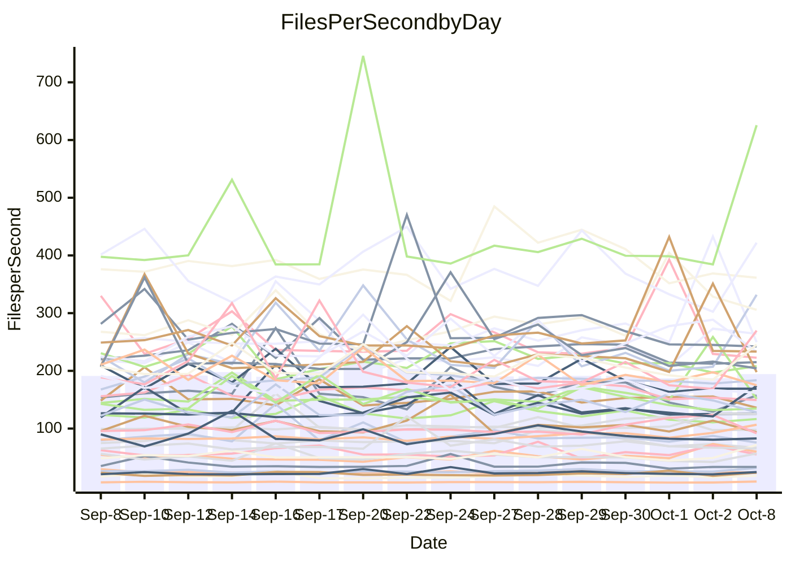

<!---
# This file is auto-generated. Do not edit.
# cspell:disable
--->
# Performance Report

Daily Performance

```mermaid
xychart-beta
    title Files Per Second by Day
    y-axis Files per Second
    x-axis Date [Sep-8, Sep-10, Sep-12, Sep-14, Sep-16, Sep-17, Sep-20, Sep-22, Sep-24, Sep-27, Sep-28, Sep-29, Sep-30, Oct-1, Oct-2, Oct-8]
    bar [191.17, 190.61, 191.83, 197.87, 189.83, 198.93, 223.14, 203.41, 191.85, 190.34, 190.33, 191.42, 191.65, 187.17, 187.29, 194.39]
    line [153.77, 161.06, 165.68, 159.91, 274.11, 160.48, 154.49, 133.29, 206.55, 172.23, 156.59, 180.95, 179.76, 145.22, 129.53, 157.39]
    line [29.52, 23.91, 25.15, 23.74, 22.20, 23.03, 24.38, 22.79, 25.90, 22.55, 24.52, 26.32, 24.36, 24.04, 25.09, 23.35]
    line [74.82, 78.42, 89.26, 79.87, 74.03, 79.32, 76.57, 77.71, 78.68, 74.59, 96.62, 94.86, 81.46, 69.18, 73.06, 66.65]
    line [123.66, 119.12, 133.12, 118.61, 125.51, 156.41, 126.36, 117.29, 122.97, 147.55, 130.31, 120.84, 131.56, 115.38, 110.82, 116.53]
    line [148.35, 206.25, 150.67, 151.50, 140.12, 185.15, 139.87, 144.59, 151.47, 163.76, 164.48, 145.07, 153.00, 154.07, 155.61, 136.07]
    line [26.46, 26.09, 28.54, 23.63, 25.87, 21.39, 25.97, 25.29, 24.28, 26.03, 27.14, 29.89, 26.22, 25.83, 25.33, 31.76]
    line [329.95, 229.46, 255.09, 303.17, 236.15, 234.71, 233.17, 234.84, 298.34, 266.72, 232.18, 229.70, 240.06, 392.72, 229.48, 222.78]
    line [126.38, 125.97, 124.19, 127.77, 210.87, 148.03, 126.65, 140.55, 188.49, 125.20, 157.87, 127.91, 135.21, 124.24, 125.20, 125.79]
    line [16.80, 21.93, 17.01, 17.04, 25.59, 14.10, 13.68, 15.06, 15.07, 17.30, 20.40, 18.84, 16.01, 18.80, 15.62, 18.14]
    line [218.01, 213.19, 249.06, 214.17, 355.08, 286.90, 193.09, 220.97, 216.09, 223.67, 208.59, 258.02, 244.00, 208.42, 273.15, 264.14]
    line [220.27, 226.37, 235.76, 281.57, 222.43, 291.44, 219.17, 221.75, 221.55, 237.73, 242.39, 246.40, 245.33, 214.25, 212.38, 215.08]
    line [54.53, 48.10, 54.31, 47.78, 46.42, 45.99, 42.51, 50.42, 46.36, 61.34, 51.99, 46.51, 53.11, 48.59, 73.40, 59.94]
    line [99.63, 98.76, 103.06, 96.78, 160.57, 101.71, 98.32, 105.51, 103.82, 101.18, 119.72, 101.30, 101.24, 103.40, 125.70, 125.48]
    line [230.64, 206.81, 229.76, 276.88, 185.15, 203.08, 216.06, 205.09, 247.61, 251.50, 220.80, 227.59, 212.73, 213.55, 197.04, 208.25]
    line [23.39, 17.95, 19.65, 18.79, 24.79, 24.63, 19.73, 20.13, 19.16, 18.74, 19.48, 22.38, 21.10, 27.10, 18.00, 23.58]
    line [79.69, 86.08, 90.96, 77.91, 142.49, 79.52, 110.64, 76.31, 85.79, 97.01, 82.92, 84.16, 84.72, 77.34, 87.34, 75.86]
    line [62.47, 53.43, 54.08, 56.65, 66.08, 70.58, 54.86, 55.17, 51.26, 53.54, 77.09, 47.84, 59.17, 54.01, 70.63, 55.18]
    line [20.85, 24.50, 21.07, 20.76, 21.20, 21.42, 29.89, 21.10, 33.29, 22.21, 22.99, 25.81, 22.79, 21.40, 20.78, 24.57]
    line [376.07, 371.64, 390.41, 381.43, 392.33, 359.21, 375.60, 366.33, 321.23, 484.87, 422.08, 444.64, 410.96, 351.78, 368.84, 361.47]
    line [249.04, 256.96, 250.64, 247.49, 246.97, 251.50, 236.84, 249.23, 243.91, 273.74, 252.33, 270.33, 282.14, 249.68, 432.83, 249.77]
    line [34.97, 52.27, 41.14, 33.93, 34.79, 33.36, 33.83, 35.26, 55.80, 33.99, 34.03, 41.23, 40.49, 30.44, 33.53, 33.57]
    line [6.71, 7.87, 6.93, 6.69, 7.98, 6.67, 6.83, 6.48, 7.18, 7.27, 6.94, 7.83, 6.98, 6.40, 6.43, 8.18]
    line [95.60, 99.87, 99.90, 101.98, 98.46, 103.01, 98.38, 99.03, 101.47, 103.27, 100.93, 105.22, 117.10, 120.39, 97.23, 97.90]
    line [144.33, 151.54, 146.78, 197.07, 148.01, 150.26, 150.22, 155.16, 146.16, 150.57, 146.25, 172.87, 161.95, 149.25, 258.77, 151.43]
    line [95.62, 122.20, 102.97, 97.36, 113.44, 95.42, 93.37, 113.84, 158.94, 91.50, 106.48, 102.03, 106.46, 94.98, 113.77, 93.63]
    line [225.06, 179.78, 228.82, 211.67, 318.15, 234.86, 348.02, 254.54, 210.42, 205.10, 287.53, 207.85, 231.21, 200.22, 207.10, 331.74]
    line [155.95, 162.53, 193.68, 156.67, 149.67, 167.24, 171.44, 166.11, 165.94, 180.17, 169.69, 179.61, 173.13, 150.88, 153.50, 149.45]
    line [209.46, 169.33, 212.19, 179.89, 238.35, 171.61, 172.61, 177.91, 241.32, 177.39, 178.05, 221.01, 182.74, 163.48, 169.32, 168.97]
    line [267.60, 261.93, 287.76, 262.40, 339.51, 263.75, 234.66, 253.01, 268.39, 293.97, 280.40, 292.26, 260.88, 404.51, 328.53, 305.64]
    line [401.47, 446.16, 355.63, 318.90, 363.44, 349.72, 406.48, 449.44, 342.12, 376.67, 347.31, 443.48, 368.45, 332.70, 302.48, 422.03]
    line [281.41, 341.82, 253.99, 265.83, 272.53, 247.23, 246.03, 470.19, 256.56, 257.27, 291.74, 296.65, 268.66, 245.94, 244.92, 242.23]
    line [80.83, 82.91, 82.03, 82.90, 86.51, 81.41, 84.89, 78.73, 86.02, 82.17, 86.87, 92.07, 92.00, 84.24, 92.67, 106.68]
    line [56.14, 46.33, 51.70, 44.11, 74.38, 48.80, 46.22, 56.03, 61.86, 55.07, 50.38, 50.26, 50.11, 43.90, 42.10, 56.81]
    line [397.57, 392.00, 400.11, 531.12, 384.37, 384.60, 745.85, 398.12, 385.90, 416.89, 405.74, 428.96, 399.50, 398.65, 384.43, 625.58]
    line [208.53, 367.52, 230.07, 204.55, 207.72, 211.00, 215.66, 277.45, 216.60, 208.75, 228.82, 225.46, 221.92, 198.17, 351.24, 197.76]
    line [167.61, 190.13, 221.56, 177.63, 183.43, 188.58, 244.43, 196.97, 192.51, 179.82, 187.80, 186.23, 183.20, 182.62, 177.99, 183.70]
    line [95.75, 97.23, 107.06, 93.89, 113.70, 92.25, 94.28, 98.57, 98.01, 93.82, 94.62, 89.71, 106.79, 118.50, 123.61, 91.76]
    line [119.58, 171.63, 125.66, 126.89, 119.89, 121.04, 127.46, 154.00, 162.49, 123.69, 144.71, 125.72, 134.25, 127.46, 121.17, 173.95]
    line [48.30, 53.96, 52.43, 61.82, 49.92, 50.20, 50.36, 50.54, 47.43, 56.40, 49.96, 64.67, 50.46, 44.40, 48.96, 71.61]
    line [224.86, 216.89, 259.14, 277.45, 226.45, 225.10, 268.40, 226.40, 290.41, 225.84, 287.60, 216.33, 247.70, 277.53, 288.63, 233.16]
    line [206.74, 361.86, 212.41, 213.84, 211.89, 203.30, 203.26, 249.81, 370.77, 255.08, 280.21, 227.10, 239.56, 208.40, 216.14, 204.22]
    line [210.54, 236.79, 184.39, 226.41, 183.84, 178.08, 240.62, 182.34, 183.11, 178.48, 227.71, 175.37, 193.07, 180.70, 197.68, 174.97]
    line [65.29, 70.06, 74.08, 63.80, 67.85, 68.28, 64.95, 121.18, 70.33, 81.37, 68.55, 70.46, 78.07, 69.43, 66.84, 65.37]
    line [142.86, 132.44, 134.89, 191.12, 144.91, 193.30, 142.56, 168.42, 145.10, 149.37, 134.63, 171.73, 154.69, 140.49, 131.94, 134.65]
    line [248.94, 253.18, 270.83, 243.92, 325.88, 260.22, 243.99, 243.96, 239.11, 261.23, 266.19, 247.38, 252.69, 432.16, 234.56, 233.40]
    line [122.28, 150.41, 127.69, 119.42, 176.53, 123.45, 123.33, 163.66, 174.86, 123.76, 140.60, 149.87, 128.75, 160.37, 148.80, 127.97]
    line [188.79, 176.65, 217.04, 317.36, 187.32, 321.78, 198.42, 179.83, 171.82, 219.08, 181.95, 180.26, 215.27, 175.03, 168.70, 269.72]
    line [89.98, 69.10, 91.26, 130.94, 82.16, 79.40, 98.84, 72.96, 83.85, 90.86, 105.55, 94.80, 87.05, 82.35, 80.71, 82.95]
    line [207.05, 194.56, 194.84, 248.77, 196.63, 194.10, 246.18, 197.54, 195.96, 190.07, 228.82, 222.46, 205.73, 192.21, 184.58, 245.51]
    line [191.33, 170.36, 179.54, 171.09, 160.76, 222.99, 297.37, 220.86, 165.88, 186.63, 165.05, 169.83, 183.91, 159.55, 166.58, 162.12]
```

Time to Process Files

| Repository                                      | Elapsed | Min/Avg/Max          |    SD | SD Graph                |
| ----------------------------------------------- | ------: | :------------------: | ----: | ----------------------- |
| AdaDoom3/AdaDoom3                    |    3.07 | 1.7 /   2.8 /   3.4  |  0.49 | `    ┣━━┻━━╋━●┻━━┫    ` |
| alexiosc/megistos                    |    7.03 | 3.9 /   6.7 /   8.4  |  1.02 | `    ┣━━┻━━╋●━┻━━┫    ` |
| apollographql/apollo-server          |    2.61 | 1.4 /   2.5 /   3.1  |  0.32 | `    ┣━━┻━━╋●━┻━━┫    ` |
| aspnetboilerplate/aspnetboilerplate  |    9.46 | 4.9 /   8.6 /   9.8  |  1.16 | `    ┣━━┻━━╋━●┻━━┫    ` |
| aws-amplify/docs                     |   13.08 | 7.4 /  12.5 /  14.6  |  1.79 | `    ┣━━┻━━╋●━┻━━┫    ` |
| Azure/azure-rest-api-specs           |   11.15 | 6.0 /  10.1 /  11.6  |  1.30 | `    ┣━━┻━━╋━━●━━┫    ` |
| bitjson/typescript-starter           |    0.85 | 0.7 /   1.0 /   1.2  |  0.13 | `     ┣━●━━╋━━┻━┫     ` |
| caddyserver/caddy                    |    3.95 | 2.2 /   3.4 /   4.1  |  0.46 | `    ┣━━┻━━╋━━●━━┫    ` |
| canada-ca/open-source-logiciel-libre |    0.86 | 0.7 /   1.0 /   1.2  |  0.11 | `     ┣●┻━━╋━━┻━┫     ` |
| chef/chef                            |    4.98 | 3.6 /   4.7 /   5.6  |  0.52 | `    ┣━━┻━━╋●━┻━━┫    ` |
| dart-lang/sdk                        |   47.91 | 39.3 /  57.5 /  65.4 |  6.03 | `  ┣━●━┻━━━╋━━━┻━━━┫  ` |
| django/django                        |   14.84 | 8.0 /  13.2 /  14.8  |  1.82 | `    ┣━━┻━━╋━━●━━┫    ` |
| eslint/eslint                        |    6.29 | 5.5 /   9.2 /  11.6  |  1.51 | `    ●━━┻━━╋━━┻━━┫    ` |
| exonum/exonum                        |    3.61 | 2.1 /   3.3 /   3.8  |  0.37 | `    ┣━━┻━━╋━●┻━━┫    ` |
| flutter/samples                      |   12.65 | 8.0 /  11.6 /  14.9  |  1.64 | `    ┣━━┻━━╋━●┻━━┫    ` |
| gitbucket/gitbucket                  |    3.38 | 2.0 /   3.2 /   3.8  |  0.41 | `    ┣━━┻━━╋━●┻━━┫    ` |
| googleapis/google-cloud-cpp          |  136.08 | 74.1 / 123.2 / 144.1 | 16.78 | `  ┣━━━┻━━━╋━━●┻━━━┫  ` |
| graphql/express-graphql              |    1.11 | 0.7 /   1.1 /   1.3  |  0.12 | `     ┣━┻━━╋●━┻━┫     ` |
| graphql/graphql-js                   |    3.64 | 2.1 /   3.5 /   4.0  |  0.38 | `    ┣━━┻━━╋●━┻━━┫    ` |
| graphql/graphql-relay-js             |    0.88 | 0.7 /   1.1 /   1.3  |  0.13 | `     ┣●┻━━╋━━┻━┫     ` |
| graphql/graphql-spec                 |    1.05 | 0.7 /   1.1 /   1.4  |  0.19 | `     ┣━┻━●╋━━┻━┫     ` |
| iluwatar/java-design-patterns        |   13.25 | 7.0 /  11.9 /  14.4  |  1.73 | `    ┣━━┻━━╋━●┻━━┫    ` |
| ktaranov/sqlserver-kit               |    6.46 | 3.4 /   5.7 /   6.5  |  0.73 | `    ┣━━┻━━╋━━●━━┫    ` |
| liriliri/licia                       |    3.99 | 2.4 /   3.7 /   4.5  |  0.52 | `    ┣━━┻━━╋━●┻━━┫    ` |
| MartinThoma/LaTeX-examples           |    6.57 | 4.8 /   6.0 /   6.7  |  0.69 | `    ┣━━┻━━╋━━●━━┫    ` |
| mdx-js/mdx                           |    2.09 | 1.0 /   1.7 /   2.0  |  0.24 | `     ┣━┻━━╋━━┻●┫     ` |
| microsoft/TypeScript-Website         |    5.62 | 3.7 /   5.0 /   5.7  |  0.51 | `    ┣━━┻━━╋━━┻●━┫    ` |
| MicrosoftDocs/PowerShell-Docs        |   17.98 | 15.5 /  24.1 /  29.6 |  2.95 | `   ●━━━┻━━╋━━┻━━━┫   ` |
| neovim/nvim-lspconfig                |    5.90 | 3.1 /   5.2 /   5.9  |  0.69 | `    ┣━━┻━━╋━━●━━┫    ` |
| pagekit/pagekit                      |    2.81 | 1.9 /   3.2 /   3.8  |  0.53 | `    ┣━━┻●━╋━━┻━━┫    ` |
| php/php-src                          |   26.06 | 15.3 /  23.9 /  29.3 |  2.93 | `   ┣━━━┻━━╋━━●━━━┫   ` |
| plasticrake/tplink-smarthome-api     |    1.03 | 0.7 /   1.2 /   1.5  |  0.17 | `     ┣━●━━╋━━┻━┫     ` |
| prettier/prettier                    |    6.48 | 4.4 /   7.5 /   9.0  |  1.05 | `    ┣━━●━━╋━━┻━━┫    ` |
| pycontribs/jira                      |    1.45 | 0.8 /   1.4 /   1.8  |  0.22 | `     ┣━┻━━╋●━┻━┫     ` |
| RustPython/RustPython                |    9.20 | 7.0 /  11.1 /  12.4  |  1.04 | `    ●━━┻━━╋━━┻━━┫    ` |
| shoelace-style/shoelace              |    2.80 | 1.6 /   2.6 /   3.4  |  0.42 | `    ┣━━┻━━╋●━┻━━┫    ` |
| slint-ui/slint                       |   19.80 | 9.5 /  17.1 /  20.4  |  2.57 | `   ┣━━━┻━━╋━━┻●━━┫   ` |
| SoftwareBrothers/admin-bro           |    2.52 | 1.6 /   2.3 /   2.8  |  0.28 | `     ┣━┻━━╋━●┻━┫     ` |
| sveltejs/svelte                      |   14.58 | 12.2 /  22.4 /  26.2 |  2.60 | `●  ┣━━━┻━━╋━━┻━━━┫   ` |
| TheAlgorithms/Python                 |    6.55 | 3.8 /   5.9 /   7.2  |  0.71 | `    ┣━━┻━━╋━━●━━┫    ` |
| twbs/bootstrap                       |    1.81 | 1.0 /   1.6 /   2.0  |  0.25 | `     ┣━┻━━╋━●┻━┫     ` |
| typescript-cheatsheets/react         |    0.98 | 0.7 /   1.1 /   1.2  |  0.15 | `     ┣━┻●━╋━━┻━┫     ` |
| typescript-eslint/typescript-eslint  |    4.33 | 2.4 /   3.8 /   4.5  |  0.64 | `    ┣━━┻━━╋━●┻━━┫    ` |
| vitest-dev/vitest                    |    9.27 | 7.0 /  10.3 /  12.3  |  1.28 | `    ┣━━┻●━╋━━┻━━┫    ` |
| w3c/aria-practices                   |    3.26 | 2.1 /   3.1 /   3.5  |  0.38 | `    ┣━━┻━━╋●━┻━━┫    ` |
| w3c/specberus                        |    1.51 | 1.2 /   1.8 /   2.2  |  0.21 | `     ┣●┻━━╋━━┻━┫     ` |
| webdeveric/webpack-assets-manifest   |    0.97 | 0.7 /   1.1 /   1.3  |  0.15 | `     ┣━┻●━╋━━┻━┫     ` |
| webpack/webpack                      |    5.56 | 4.4 /   7.3 /   8.8  |  1.29 | `    ┣━●┻━━╋━━┻━━┫    ` |
| wireapp/wire-desktop                 |    1.01 | 0.9 /   1.4 /   1.6  |  0.15 | `   ● ┣━┻━━╋━━┻━┫     ` |
| wireapp/wire-webapp                  |   14.87 | 7.5 /  14.2 /  16.8  |  1.54 | `    ┣━━┻━━╋●━┻━━┫    ` |

Note:
- Elapsed time is in seconds.

Files per Second over Time

| Repository                                      | Files |    Sec |    Fps |     Rel | Trend Fps              |    N |
| ----------------------------------------------- | ----: | -----: | -----: | ------: | ---------------------- | ---: |
| AdaDoom3/AdaDoom3                    |   103 |   3.07 |  33.57 | -13.39% | `▂▇▂▂▂▂▂▂▂▅▄▆▂▂██▂▁▂▂` |   38 |
| alexiosc/megistos                    |   583 |   7.03 |  82.95 |  -7.91% | `█▂▃▅▂▄▂▂▂▄▂▂▁▂▃▂▄▂▂▂` |   39 |
| apollographql/apollo-server          |   256 |   2.61 |  97.90 |  -8.24% | `▂▂▄▂▅▃▂▇▁█▂▃▂▃▂▅▄▄▂▂` |   39 |
| aspnetboilerplate/aspnetboilerplate  |  2292 |   9.46 | 242.23 | -11.77% | `▅▇▂▂▂▂▂▂█▂▂▁▅▂▂▂▂▂▂▂` |   39 |
| aws-amplify/docs                     |  3049 |  13.08 | 233.16 |  -6.38% | `▂▂▁▂▁▂█▂▃▁▂▃▂▂▄▂▂▄▄▂` |   38 |
| Azure/azure-rest-api-specs           |  2603 |  11.15 | 233.40 | -10.84% | `▂▂▂▂▂█▂▂▂▂▂▂▂▂▁▂▁█▂▂` |   39 |
| bitjson/typescript-starter           |    20 |   0.85 |  23.58 |  13.39% | `▂▇▆▃▃█▄▄▃▂█▃▆▆▃▃▃█▂▆` |   39 |
| caddyserver/caddy                    |   370 |   3.95 |  93.63 | -10.86% | `▂▅▃▃▃█▅▃▃▂▇▂▄▅▆▂▆▃▅▃` |   39 |
| canada-ca/open-source-logiciel-libre |     7 |   0.86 |   8.18 |  16.25% | `▂▂▂█▅▂▄▂▃▂▁▄▂▂▂▃▂▂▂▅` |   39 |
| chef/chef                            |  1037 |   4.98 | 208.25 |  -6.17% | `▃█▂▃▃▃▄▂▃▆▄▅▃▃▃▃▃▄▃▃` |   39 |
| dart-lang/sdk                        | 11763 |  47.91 | 245.51 |  19.21% | `▃▃▇▆▃▃▃▆▃▂▃▃█▇▃▃▆▃▂▇` |   39 |
| django/django                        |  2935 |  14.84 | 197.76 | -13.53% | `▂▂▂▄▂▃▂█▂▂▂▁▄▂▂▂▂▁█▁` |   38 |
| eslint/eslint                        |  2087 |   6.29 | 331.74 |  42.25% | `▅▂▂▃▅▃▆▄▂█▅▂▂▁▂▂▂▂▂█` |   39 |
| exonum/exonum                        |   421 |   3.61 | 116.53 | -10.27% | `▄▂▂▂▂▄▂▂▁▂▄▂▂█▂▂▂▂▁▂` |   39 |
| flutter/samples                      |  1703 |  12.65 | 134.65 | -10.44% | `▂▅█▃▃▆▄▅▃▁▃▃▆▆▆▃▄▃▃▃` |   39 |
| gitbucket/gitbucket                  |   425 |   3.38 | 125.79 |  -7.55% | `█▃▃▄▃▇█▄▃▇▃▂▇▃▂▃▃▃▃▃` |   39 |
| googleapis/google-cloud-cpp          | 22062 | 136.08 | 162.12 | -11.58% | `▂▂▂▂▂▂▂▂▄▂▂▄▂▁▂█▂▂▂▂` |   39 |
| graphql/express-graphql              |    26 |   1.11 |  23.35 |  -5.31% | `▄▃▃▇▂▂▃█▆▃▄▃▃▃▃▂▃▃▄▃` |   39 |
| graphql/graphql-js                   |   551 |   3.64 | 151.43 |  -4.59% | `▂▃▅▂▂▃▂▃▂▄▂▂▂▂▂▅▂▂█▂` |   39 |
| graphql/graphql-relay-js             |    28 |   0.88 |  31.76 |  19.33% | `▃▂█▂▅▃▅▃▂▃▂▃▃▂▃▂▂▃▃▅` |   39 |
| graphql/graphql-spec                 |    19 |   1.05 |  18.14 |   5.53% | `█▆▆▄▇▃▃▃▃▂▅▃▂▃▅▂▂▅▃▅` |   39 |
| iluwatar/java-design-patterns        |  2239 |  13.25 | 168.97 | -11.91% | `▃█▃▇▂▃▂▂█▃▃▃▆▆▂▂▂▂▃▂` |   39 |
| ktaranov/sqlserver-kit               |   490 |   6.46 |  75.86 | -13.55% | `▃▃▃▄▂▇▃▂█▃▂▂▄▃▃▃▃▂▄▂` |   39 |
| liriliri/licia                       |  1442 |   3.99 | 361.47 | -10.66% | `▂▇▃▃▃▃▂▂▂▂▃▃▂▁█▆█▂▂▂` |   39 |
| MartinThoma/LaTeX-examples           |  1414 |   6.57 | 215.08 | -10.14% | `██▃▃▇▇▃▃▂▂▃▂▃█▆█▇▂▂▂` |   39 |
| mdx-js/mdx                           |   139 |   2.09 |  66.65 | -19.51% | `█▂▅▅▁▃▁▂▄▆▂▂▂▅▂▂▂▁▂▁` |   39 |
| microsoft/TypeScript-Website         |   765 |   5.62 | 136.07 | -12.12% | `▄▃▅▃▄█▇▂▃▄▄▇█▃▄▃▃▅▅▂` |   39 |
| MicrosoftDocs/PowerShell-Docs        |  3127 |  17.98 | 173.95 |  31.66% | `▁▃▃▃▃█▂▃▃▂▃▃▅▃▅▃▃▃▂▆` |   39 |
| neovim/nvim-lspconfig                |   881 |   5.90 | 149.45 | -13.47% | `▂▂▂▄▂▂▅█▁▂▂▂▂▂▂▂▂▁▂▁` |   38 |
| pagekit/pagekit                      |   741 |   2.81 | 264.14 |  10.13% | `▂▂▇▂▂█▂▁▄▅▂▁▄▄▂▂▂▂▄▄` |   39 |
| php/php-src                          |  2391 |  26.06 |  91.76 | -10.23% | `▂▂▁▂▂▃▄▂▅█▂▇▂▃▂▃▂▅▅▂` |   39 |
| plasticrake/tplink-smarthome-api     |    62 |   1.03 |  59.94 |  13.78% | `▅▂▂▂▆▇▂▂▃▄▂▂▃▇▂▂▆▃█▅` |   39 |
| prettier/prettier                    |  2735 |   6.48 | 422.03 |  13.20% | `▂▂▃█▂▂▂▇▂▂▂▂▂▄▂▄▂▂▁▄` |   39 |
| pycontribs/jira                      |    80 |   1.45 |  55.18 |  -5.89% | `█▂▁▃▃▃▂▂▃▂▃█▆▃▆▃▆▃▆▃` |   39 |
| RustPython/RustPython                |   981 |   9.20 | 106.68 |  22.61% | `▂▅▂▂▂▁▄▂█▂▃▅▃▂▂▂▂▂▃▅` |   39 |
| shoelace-style/shoelace              |   440 |   2.80 | 157.39 |  -8.28% | `▂▃▃▆▂▆▃▂▂▄█▄▅▂▂▂▆▂▁▃` |   39 |
| slint-ui/slint                       |  4410 |  19.80 | 222.78 | -12.14% | `▂▂▂▂▂▂▂▂▃▄▁▂▂▁▂▆▂█▂▂` |   39 |
| SoftwareBrothers/admin-bro           |   441 |   2.52 | 174.97 | -10.11% | `▃▂▅▃▄▄▇▆▃█▃█▃▆▃▃▃▄▅▃` |   39 |
| sveltejs/svelte                      |  9120 |  14.58 | 625.58 |  51.08% | `▃▆▂▂▂▂▂▂▂▄▂▂▂▅▃▂▂▃▂█` |   39 |
| TheAlgorithms/Python                 |  1636 |   6.55 | 249.77 |  -7.00% | `▂▄▂▂▄▄▇▄▂▂▂▄▅▁▂▂▂▂█▂` |   39 |
| twbs/bootstrap                       |   118 |   1.81 |  65.37 | -12.51% | `▂▃▃▂▁▃▂▄▃▅▂▆▂▅▄█▁▃▂▂` |   39 |
| typescript-cheatsheets/react         |    24 |   0.98 |  24.57 |   7.44% | `▅▂▂█▁▇▂▆▃▂▂▂▂▅▁▂▁▂▂▄` |   39 |
| typescript-eslint/typescript-eslint  |   884 |   4.33 | 204.22 | -14.62% | `█▂▂▅▅▅▃▃▂▇▂▂▃▅▄▂▁▂▂▂` |   39 |
| vitest-dev/vitest                    |  2834 |   9.27 | 305.64 |   9.66% | `▂▆▃▃▆▂▂▂▅▂▁▂▂▂▂▂▂█▅▄` |   39 |
| w3c/aria-practices                   |   417 |   3.26 | 127.97 |  -5.27% | `▂█▂▂▂▂▂▂▂▂▂▂▅▂▂▂▂▅▄▂` |   39 |
| w3c/specberus                        |   190 |   1.51 | 125.48 |  19.50% | `▄▄▄▄▅▃▄▅▅▄▃▆▅▂▇▃▄▅██` |   39 |
| webdeveric/webpack-assets-manifest   |    55 |   0.97 |  56.81 |  10.45% | `▂▂▃▃▂▅▂▃▂▃▅▂█▃▂▂▂▂▁▅` |   38 |
| webpack/webpack                      |  1499 |   5.56 | 269.72 |  29.56% | `▂▃▂▂▂▂▇▇█▂▂▇▂▅▂▂▂▂▁▇` |   39 |
| wireapp/wire-desktop                 |    72 |   1.01 |  71.61 |  37.06% | `▃▃█▅▃▂▃▂▂▂▂▂▂▂▂▂▅▁▂▇` |   39 |
| wireapp/wire-webapp                  |  2732 |  14.87 | 183.70 |  -3.73% | `█▇▇█▇█▆▆▆▇▇▅█▆█▆▇▇▆▇` |   39 |

Data Throughput

| Repository                                      | Files |    Sec |     Kps |     Rel | Trend Kps              |    N |
| ----------------------------------------------- | ----: | -----: | ------: | ------: | ---------------------- | ---: |
| AdaDoom3/AdaDoom3                    |   103 |   3.07 |  713.48 | -13.39% | `▂▇▂▂▂▂▂▂▂▅▄▆▂▂██▂▁▂▂` |   38 |
| alexiosc/megistos                    |   583 |   7.03 |  651.82 |  -7.91% | `█▂▃▅▂▄▂▂▂▄▂▂▁▂▃▂▄▂▂▂` |   39 |
| apollographql/apollo-server          |   256 |   2.61 |  808.45 |  -8.16% | `▂▂▄▂▅▃▂▇▁█▂▃▂▃▂▅▄▄▂▂` |   39 |
| aspnetboilerplate/aspnetboilerplate  |  2292 |   9.46 |  593.73 | -11.69% | `▅▇▂▂▂▂▂▂█▂▂▁▅▂▂▂▂▂▂▂` |   39 |
| aws-amplify/docs                     |  3049 |  13.08 |  916.83 |  -6.14% | `▂▂▁▂▁▂█▂▃▁▂▃▂▂▄▂▂▄▄▂` |   38 |
| Azure/azure-rest-api-specs           |  2603 |  11.15 |  714.02 | -11.45% | `▂▂▂▂▂█▂▂▂▂▂▂▂▂▁▂▁█▂▂` |   39 |
| bitjson/typescript-starter           |    20 |   0.85 |   94.32 |  13.39% | `▂▇▆▃▃█▄▄▃▂█▃▆▆▃▃▃█▂▆` |   39 |
| caddyserver/caddy                    |   370 |   3.95 |  862.65 |  -9.02% | `▂▆▃▃▃█▅▃▃▂▇▂▄▅▆▂▆▃▅▃` |   39 |
| canada-ca/open-source-logiciel-libre |     7 |   0.86 |   67.79 |  16.25% | `▂▂▂█▅▂▄▂▃▂▁▄▂▂▂▃▂▂▂▅` |   39 |
| chef/chef                            |  1037 |   4.98 | 1023.99 |  -6.14% | `▃█▂▃▃▃▄▂▃▆▄▅▃▃▃▃▃▄▃▃` |   39 |
| dart-lang/sdk                        | 11763 |  47.91 | 1717.88 |  19.30% | `▃▃▇▆▃▃▃▆▃▂▃▃█▇▃▃▆▃▂▇` |   39 |
| django/django                        |  2935 |  14.84 | 1278.57 | -13.43% | `▂▂▂▄▂▃▂█▂▂▂▁▄▂▂▂▂▁█▁` |   38 |
| eslint/eslint                        |  2087 |   6.29 | 2345.21 |  42.53% | `▅▂▂▃▅▃▆▄▂█▅▂▂▁▂▂▂▂▂█` |   39 |
| exonum/exonum                        |   421 |   3.61 | 1114.67 | -10.27% | `▄▂▂▂▂▄▂▂▁▂▄▂▂█▂▂▂▂▁▂` |   39 |
| flutter/samples                      |  1703 |  12.65 |  802.58 | -10.44% | `▂▅█▃▃▆▄▅▃▁▃▃▆▆▆▃▄▃▃▃` |   39 |
| gitbucket/gitbucket                  |   425 |   3.38 |  616.52 |  -8.05% | `█▃▃▄▃▇█▄▃▇▃▂▇▃▂▃▃▃▃▃` |   39 |
| googleapis/google-cloud-cpp          | 22062 | 136.08 | 1415.93 | -11.44% | `▂▂▂▂▂▂▂▂▄▂▂▄▂▁▂█▂▂▂▂` |   39 |
| graphql/express-graphql              |    26 |   1.11 |  106.89 |  -5.31% | `▄▃▃▇▂▂▃█▆▃▄▃▃▃▃▂▃▃▄▃` |   39 |
| graphql/graphql-js                   |   551 |   3.64 | 1129.29 |  -4.61% | `▂▃▅▂▂▃▂▃▂▄▂▂▂▂▂▅▂▂█▂` |   39 |
| graphql/graphql-relay-js             |    28 |   0.88 |  124.76 |  19.33% | `▃▂█▂▅▃▅▃▂▃▂▃▃▂▃▂▂▃▃▅` |   39 |
| graphql/graphql-spec                 |    19 |   1.05 |  610.05 |   5.70% | `█▆▆▄▇▃▃▃▃▂▅▃▂▃▅▂▂▅▃▅` |   39 |
| iluwatar/java-design-patterns        |  2239 |  13.25 |  524.26 | -11.76% | `▃█▃▇▂▃▂▂█▃▃▃▆▆▂▂▂▂▃▂` |   39 |
| ktaranov/sqlserver-kit               |   490 |   6.46 | 1149.17 | -13.55% | `▃▃▃▄▂▇▃▂█▃▂▂▄▃▃▃▃▂▄▂` |   39 |
| liriliri/licia                       |  1442 |   3.99 |  433.42 | -10.66% | `▂▇▃▃▃▃▂▂▂▂▃▃▂▁█▆█▂▂▂` |   39 |
| MartinThoma/LaTeX-examples           |  1414 |   6.57 |  446.88 |  -9.97% | `██▃▃▇▇▃▃▂▂▃▂▃█▆█▇▂▂▂` |   39 |
| mdx-js/mdx                           |   139 |   2.09 |  314.07 | -19.51% | `█▂▅▅▁▃▁▂▄▆▂▂▂▅▂▂▂▁▂▁` |   39 |
| microsoft/TypeScript-Website         |   765 |   5.62 |  938.42 | -12.10% | `▄▃▅▃▄█▇▂▃▄▄▇█▃▄▃▃▅▅▂` |   39 |
| MicrosoftDocs/PowerShell-Docs        |  3127 |  17.98 | 1859.04 |  31.66% | `▁▃▃▃▃█▂▃▃▂▃▃▅▃▅▃▃▃▂▆` |   39 |
| neovim/nvim-lspconfig                |   881 |   5.90 |  465.31 |  -8.63% | `▂▂▂▄▂▂▅█▁▂▂▂▂▂▂▂▂▁▂▂` |   38 |
| pagekit/pagekit                      |   741 |   2.81 |  550.75 |  10.13% | `▂▂▇▂▂█▂▁▄▅▂▁▄▄▂▂▂▂▄▄` |   39 |
| php/php-src                          |  2391 |  26.06 | 1632.65 |  -9.91% | `▂▂▁▂▂▃▄▂▅█▂▇▂▃▂▃▂▅▅▂` |   39 |
| plasticrake/tplink-smarthome-api     |    62 |   1.03 |  323.87 |  13.78% | `▅▂▂▂▆▇▂▂▃▄▂▂▃▇▂▂▆▃█▅` |   39 |
| prettier/prettier                    |  2735 |   6.48 |  593.01 |  12.84% | `▂▂▃█▂▂▂▇▂▂▂▂▂▄▂▄▂▂▁▄` |   39 |
| pycontribs/jira                      |    80 |   1.45 |  389.72 |  -5.89% | `█▂▁▃▃▃▂▂▃▂▃█▆▃▆▃▆▃▆▃` |   39 |
| RustPython/RustPython                |   981 |   9.20 | 3179.07 |  35.26% | `▂▄▃▃▃▂▅▃█▃▄▅▃▃▂▃▃▃▄▅` |   39 |
| shoelace-style/shoelace              |   440 |   2.80 |  760.13 |  -8.28% | `▂▃▃▆▂▆▃▂▂▄█▄▅▂▂▂▆▂▁▃` |   39 |
| slint-ui/slint                       |  4410 |  19.80 | 1299.51 | -10.46% | `▂▂▂▂▂▂▂▂▃▄▁▂▂▁▂▆▂█▂▂` |   39 |
| SoftwareBrothers/admin-bro           |   441 |   2.52 |  385.65 | -10.11% | `▃▂▅▃▄▄▇▆▃█▃█▃▆▃▃▃▄▅▃` |   39 |
| sveltejs/svelte                      |  9120 |  14.58 |  432.28 |  51.04% | `▃▆▂▂▂▂▂▂▂▄▂▂▂▅▃▂▂▃▂█` |   39 |
| TheAlgorithms/Python                 |  1636 |   6.55 |  714.05 |  -4.48% | `▂▄▂▂▄▄▇▄▂▂▂▄▅▁▂▂▂▂█▂` |   39 |
| twbs/bootstrap                       |   118 |   1.81 |  536.79 | -12.51% | `▂▃▃▂▁▃▂▄▃▅▂▆▂▅▄█▁▃▂▂` |   39 |
| typescript-cheatsheets/react         |    24 |   0.98 |  222.14 |   7.44% | `▅▂▂█▁▇▂▆▃▂▂▂▂▅▁▂▁▂▂▄` |   39 |
| typescript-eslint/typescript-eslint  |   884 |   4.33 |  694.22 | -13.89% | `█▂▂▅▅▅▃▃▂▇▂▂▃▅▄▂▁▂▂▂` |   39 |
| vitest-dev/vitest                    |  2834 |   9.27 |  904.85 |  11.36% | `▂▆▃▃▆▂▂▂▅▂▁▂▂▂▂▂▂█▅▄` |   39 |
| w3c/aria-practices                   |   417 |   3.26 | 1204.77 |  -5.17% | `▂█▂▂▂▂▂▂▂▂▂▂▅▂▂▂▂▅▄▂` |   39 |
| w3c/specberus                        |   190 |   1.51 |  410.77 |  19.50% | `▄▄▄▄▅▃▄▅▅▄▃▆▅▂▇▃▄▅██` |   39 |
| webdeveric/webpack-assets-manifest   |    55 |   0.97 |  131.18 |  10.45% | `▂▂▃▃▂▅▂▃▂▃▅▂█▃▂▂▂▂▁▅` |   38 |
| webpack/webpack                      |  1499 |   5.56 | 2250.64 |  45.68% | `▂▂▂▂▂▂▇▇█▂▂▇▂▅▂▂▂▂▂█` |   39 |
| wireapp/wire-desktop                 |    72 |   1.01 |  300.38 |  39.41% | `▂▂█▅▃▂▃▂▂▂▂▂▂▂▂▂▅▁▂▇` |   39 |
| wireapp/wire-webapp                  |  2732 |  14.87 |  844.19 |  -0.12% | `█▇▇█▇█▆▆▆▇▇▆█▆█▆▇▇▆▇` |   39 |

