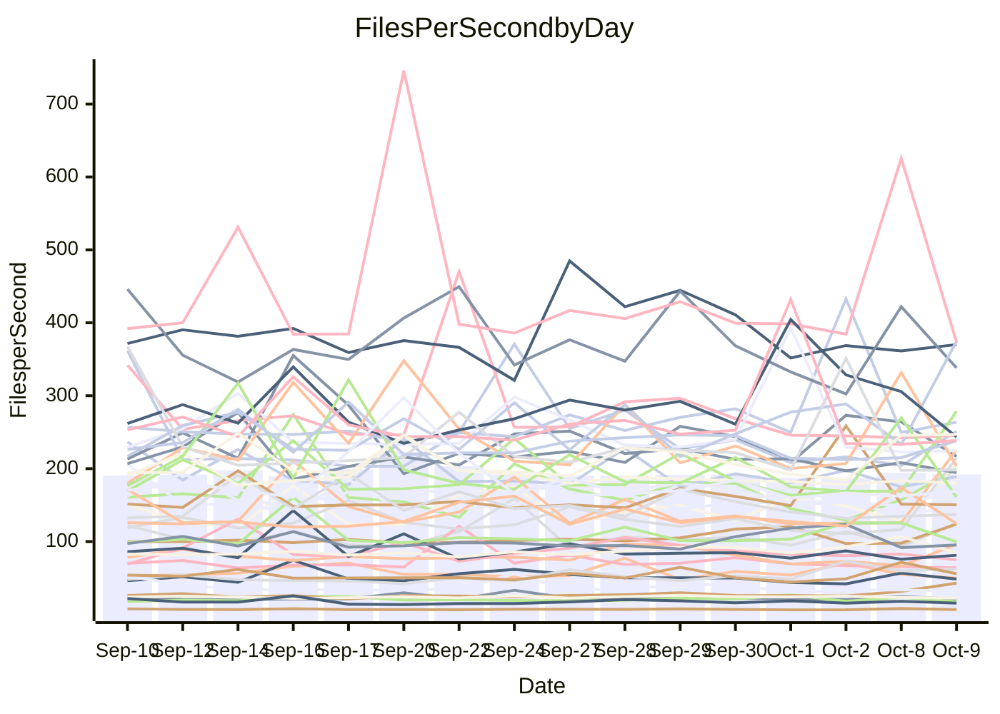

<!---
# This file is auto-generated. Do not edit.
# cspell:disable
--->
# Performance Report

Daily Performance

```mermaid
xychart-beta
    title Files Per Second by Day
    y-axis Files per Second
    x-axis Date [Sep-10, Sep-12, Sep-14, Sep-16, Sep-17, Sep-20, Sep-22, Sep-24, Sep-27, Sep-28, Sep-29, Sep-30, Oct-1, Oct-2, Oct-8, Oct-9]
    bar [190.61, 191.83, 197.87, 189.83, 198.93, 223.14, 203.41, 191.85, 190.34, 190.33, 191.42, 191.65, 187.17, 187.29, 194.39, 192.05]
    line [24.50, 21.07, 20.76, 21.20, 21.42, 29.89, 21.10, 33.29, 22.21, 22.99, 25.81, 22.79, 21.40, 20.78, 24.57, 21.27]
    line [53.43, 54.08, 56.65, 66.08, 70.58, 54.86, 55.17, 51.26, 53.54, 77.09, 47.84, 59.17, 54.01, 70.63, 55.18, 49.90]
    line [122.20, 102.97, 97.36, 113.44, 95.42, 93.37, 113.84, 158.94, 91.50, 106.48, 102.03, 106.46, 94.98, 113.77, 93.63, 125.18]
    line [161.06, 165.68, 159.91, 274.11, 160.48, 154.49, 133.29, 206.55, 172.23, 156.59, 180.95, 179.76, 145.22, 129.53, 157.39, 199.58]
    line [99.87, 99.90, 101.98, 98.46, 103.01, 98.38, 99.03, 101.47, 103.27, 100.93, 105.22, 117.10, 120.39, 97.23, 97.90, 123.96]
    line [236.79, 184.39, 226.41, 183.84, 178.08, 240.62, 182.34, 183.11, 178.48, 227.71, 175.37, 193.07, 180.70, 197.68, 174.97, 189.16]
    line [70.06, 74.08, 63.80, 67.85, 68.28, 64.95, 121.18, 70.33, 81.37, 68.55, 70.46, 78.07, 69.43, 66.84, 65.37, 64.09]
    line [46.33, 51.70, 44.11, 74.38, 48.80, 46.22, 56.03, 61.86, 55.07, 50.38, 50.26, 50.11, 43.90, 42.10, 56.81, 48.66]
    line [150.41, 127.69, 119.42, 176.53, 123.45, 123.33, 163.66, 174.86, 123.76, 140.60, 149.87, 128.75, 160.37, 148.80, 127.97, 206.50]
    line [206.25, 150.67, 151.50, 140.12, 185.15, 139.87, 144.59, 151.47, 163.76, 164.48, 145.07, 153.00, 154.07, 155.61, 136.07, 148.26]
    line [213.19, 249.06, 214.17, 355.08, 286.90, 193.09, 220.97, 216.09, 223.67, 208.59, 258.02, 244.00, 208.42, 273.15, 264.14, 216.71]
    line [78.42, 89.26, 79.87, 74.03, 79.32, 76.57, 77.71, 78.68, 74.59, 96.62, 94.86, 81.46, 69.18, 73.06, 66.65, 96.25]
    line [119.12, 133.12, 118.61, 125.51, 156.41, 126.36, 117.29, 122.97, 147.55, 130.31, 120.84, 131.56, 115.38, 110.82, 116.53, 214.42]
    line [17.95, 19.65, 18.79, 24.79, 24.63, 19.73, 20.13, 19.16, 18.74, 19.48, 22.38, 21.10, 27.10, 18.00, 23.58, 17.31]
    line [26.09, 28.54, 23.63, 25.87, 21.39, 25.97, 25.29, 24.28, 26.03, 27.14, 29.89, 26.22, 25.83, 25.33, 31.76, 42.94]
    line [361.86, 212.41, 213.84, 211.89, 203.30, 203.26, 249.81, 370.77, 255.08, 280.21, 227.10, 239.56, 208.40, 216.14, 204.22, 251.15]
    line [69.10, 91.26, 130.94, 82.16, 79.40, 98.84, 72.96, 83.85, 90.86, 105.55, 94.80, 87.05, 82.35, 80.71, 82.95, 74.90]
    line [86.08, 90.96, 77.91, 142.49, 79.52, 110.64, 76.31, 85.79, 97.01, 82.92, 84.16, 84.72, 77.34, 87.34, 75.86, 81.29]
    line [23.91, 25.15, 23.74, 22.20, 23.03, 24.38, 22.79, 25.90, 22.55, 24.52, 26.32, 24.36, 24.04, 25.09, 23.35, 22.45]
    line [162.53, 193.68, 156.67, 149.67, 167.24, 171.44, 166.11, 165.94, 180.17, 169.69, 179.61, 173.13, 150.88, 153.50, 149.45, 170.98]
    line [206.81, 229.76, 276.88, 185.15, 203.08, 216.06, 205.09, 247.61, 251.50, 220.80, 227.59, 212.73, 213.55, 197.04, 208.25, 194.51]
    line [125.97, 124.19, 127.77, 210.87, 148.03, 126.65, 140.55, 188.49, 125.20, 157.87, 127.91, 135.21, 124.24, 125.20, 125.79, 225.70]
    line [48.10, 54.31, 47.78, 46.42, 45.99, 42.51, 50.42, 46.36, 61.34, 51.99, 46.51, 53.11, 48.59, 73.40, 59.94, 62.62]
    line [98.76, 103.06, 96.78, 160.57, 101.71, 98.32, 105.51, 103.82, 101.18, 119.72, 101.30, 101.24, 103.40, 125.70, 125.48, 99.76]
    line [151.54, 146.78, 197.07, 148.01, 150.26, 150.22, 155.16, 146.16, 150.57, 146.25, 172.87, 161.95, 149.25, 258.77, 151.43, 150.43]
    line [256.96, 250.64, 247.49, 246.97, 251.50, 236.84, 249.23, 243.91, 273.74, 252.33, 270.33, 282.14, 249.68, 432.83, 249.77, 263.65]
    line [341.82, 253.99, 265.83, 272.53, 247.23, 246.03, 470.19, 256.56, 257.27, 291.74, 296.65, 268.66, 245.94, 244.92, 242.23, 245.65]
    line [371.64, 390.41, 381.43, 392.33, 359.21, 375.60, 366.33, 321.23, 484.87, 422.08, 444.64, 410.96, 351.78, 368.84, 361.47, 370.09]
    line [82.91, 82.03, 82.90, 86.51, 81.41, 84.89, 78.73, 86.02, 82.17, 86.87, 92.07, 92.00, 84.24, 92.67, 106.68, 84.76]
    line [229.46, 255.09, 303.17, 236.15, 234.71, 233.17, 234.84, 298.34, 266.72, 232.18, 229.70, 240.06, 392.72, 229.48, 222.78, 224.66]
    line [446.16, 355.63, 318.90, 363.44, 349.72, 406.48, 449.44, 342.12, 376.67, 347.31, 443.48, 368.45, 332.70, 302.48, 422.03, 338.21]
    line [179.78, 228.82, 211.67, 318.15, 234.86, 348.02, 254.54, 210.42, 205.10, 287.53, 207.85, 231.21, 200.22, 207.10, 331.74, 203.63]
    line [132.44, 134.89, 191.12, 144.91, 193.30, 142.56, 168.42, 145.10, 149.37, 134.63, 171.73, 154.69, 140.49, 131.94, 134.65, 137.28]
    line [169.33, 212.19, 179.89, 238.35, 171.61, 172.61, 177.91, 241.32, 177.39, 178.05, 221.01, 182.74, 163.48, 169.32, 168.97, 278.92]
    line [7.87, 6.93, 6.69, 7.98, 6.67, 6.83, 6.48, 7.18, 7.27, 6.94, 7.83, 6.98, 6.40, 6.43, 8.18, 6.76]
    line [216.89, 259.14, 277.45, 226.45, 225.10, 268.40, 226.40, 290.41, 225.84, 287.60, 216.33, 247.70, 277.53, 288.63, 233.16, 374.71]
    line [392.00, 400.11, 531.12, 384.37, 384.60, 745.85, 398.12, 385.90, 416.89, 405.74, 428.96, 399.50, 398.65, 384.43, 625.58, 373.38]
    line [261.93, 287.76, 262.40, 339.51, 263.75, 234.66, 253.01, 268.39, 293.97, 280.40, 292.26, 260.88, 404.51, 328.53, 305.64, 243.36]
    line [190.13, 221.56, 177.63, 183.43, 188.58, 244.43, 196.97, 192.51, 179.82, 187.80, 186.23, 183.20, 182.62, 177.99, 183.70, 179.89]
    line [52.27, 41.14, 33.93, 34.79, 33.36, 33.83, 35.26, 55.80, 33.99, 34.03, 41.23, 40.49, 30.44, 33.53, 33.57, 32.29]
    line [97.23, 107.06, 93.89, 113.70, 92.25, 94.28, 98.57, 98.01, 93.82, 94.62, 89.71, 106.79, 118.50, 123.61, 91.76, 95.32]
    line [171.63, 125.66, 126.89, 119.89, 121.04, 127.46, 154.00, 162.49, 123.69, 144.71, 125.72, 134.25, 127.46, 121.17, 173.95, 124.58]
    line [367.52, 230.07, 204.55, 207.72, 211.00, 215.66, 277.45, 216.60, 208.75, 228.82, 225.46, 221.92, 198.17, 351.24, 197.76, 198.13]
    line [176.65, 217.04, 317.36, 187.32, 321.78, 198.42, 179.83, 171.82, 219.08, 181.95, 180.26, 215.27, 175.03, 168.70, 269.72, 161.18]
    line [53.96, 52.43, 61.82, 49.92, 50.20, 50.36, 50.54, 47.43, 56.40, 49.96, 64.67, 50.46, 44.40, 48.96, 71.61, 56.00]
    line [226.37, 235.76, 281.57, 222.43, 291.44, 219.17, 221.75, 221.55, 237.73, 242.39, 246.40, 245.33, 214.25, 212.38, 215.08, 238.25]
    line [253.18, 270.83, 243.92, 325.88, 260.22, 243.99, 243.96, 239.11, 261.23, 266.19, 247.38, 252.69, 432.16, 234.56, 233.40, 238.56]
    line [21.93, 17.01, 17.04, 25.59, 14.10, 13.68, 15.06, 15.07, 17.30, 20.40, 18.84, 16.01, 18.80, 15.62, 18.14, 15.49]
    line [194.56, 194.84, 248.77, 196.63, 194.10, 246.18, 197.54, 195.96, 190.07, 228.82, 222.46, 205.73, 192.21, 184.58, 245.51, 246.82]
    line [170.36, 179.54, 171.09, 160.76, 222.99, 297.37, 220.86, 165.88, 186.63, 165.05, 169.83, 183.91, 159.55, 166.58, 162.12, 169.35]
```

Time to Process Files

| Repository                                      | Elapsed | Min/Avg/Max          |    SD | SD Graph                |
| ----------------------------------------------- | ------: | :------------------: | ----: | ----------------------- |
| AdaDoom3/AdaDoom3                    |    3.19 | 1.7 /   2.8 /   3.4  |  0.49 | `    ┣━━┻━━╋━●┻━━┫    ` |
| alexiosc/megistos                    |    7.78 | 3.9 /   6.7 /   8.4  |  1.00 | `    ┣━━┻━━╋━━●━━┫    ` |
| apollographql/apollo-server          |    2.07 | 1.4 /   2.4 /   3.1  |  0.32 | `    ┣━━●━━╋━━┻━━┫    ` |
| aspnetboilerplate/aspnetboilerplate  |    9.33 | 4.9 /   8.6 /   9.8  |  1.17 | `    ┣━━┻━━╋━●┻━━┫    ` |
| aws-amplify/docs                     |    8.14 | 7.4 /  12.5 /  14.6  |  1.80 | `  ● ┣━━┻━━╋━━┻━━┫    ` |
| Azure/azure-rest-api-specs           |   10.91 | 6.0 /  10.1 /  11.6  |  1.32 | `    ┣━━┻━━╋━●┻━━┫    ` |
| bitjson/typescript-starter           |    1.16 | 0.7 /   1.0 /   1.2  |  0.13 | `     ┣━┻━━╋━━┻●┫     ` |
| caddyserver/caddy                    |    2.96 | 2.2 /   3.4 /   4.1  |  0.47 | `    ┣━━●━━╋━━┻━━┫    ` |
| canada-ca/open-source-logiciel-libre |    1.04 | 0.7 /   1.0 /   1.2  |  0.11 | `     ┣━┻━━╋●━┻━┫     ` |
| chef/chef                            |    5.33 | 3.6 /   4.8 /   5.6  |  0.51 | `    ┣━━┻━━╋━━●━━┫    ` |
| dart-lang/sdk                        |   47.66 | 39.3 /  57.3 /  65.4 |  6.19 | `  ┣━●━┻━━━╋━━━┻━━━┫  ` |
| django/django                        |   14.81 | 8.0 /  13.2 /  14.8  |  1.85 | `    ┣━━┻━━╋━━●━━┫    ` |
| eslint/eslint                        |   10.25 | 5.5 /   9.2 /  11.6  |  1.60 | `    ┣━━┻━━╋━●┻━━┫    ` |
| exonum/exonum                        |    1.96 | 2.1 /   3.3 /   3.8  |  0.38 | `●   ┣━━┻━━╋━━┻━━┫    ` |
| flutter/samples                      |   12.41 | 8.0 /  11.6 /  14.9  |  1.67 | `    ┣━━┻━━╋━●┻━━┫    ` |
| gitbucket/gitbucket                  |    1.88 | 2.0 /   3.2 /   3.8  |  0.42 | ` ●  ┣━━┻━━╋━━┻━━┫    ` |
| googleapis/google-cloud-cpp          |  130.27 | 74.1 / 123.8 / 144.1 | 16.52 | `  ┣━━━┻━━━╋━●━┻━━━┫  ` |
| graphql/express-graphql              |    1.16 | 0.8 /   1.1 /   1.3  |  0.11 | `     ┣━┻━━╋━●┻━┫     ` |
| graphql/graphql-js                   |    3.66 | 2.1 /   3.5 /   3.9  |  0.38 | `    ┣━━┻━━╋●━┻━━┫    ` |
| graphql/graphql-relay-js             |    0.65 | 0.7 /   1.1 /   1.3  |  0.14 | `  ●  ┣━┻━━╋━━┻━┫     ` |
| graphql/graphql-spec                 |    1.23 | 0.7 /   1.1 /   1.4  |  0.19 | `     ┣━┻━━╋●━┻━┫     ` |
| iluwatar/java-design-patterns        |    8.03 | 7.0 /  12.0 /  14.4  |  1.72 | `   ●┣━━┻━━╋━━┻━━┫    ` |
| ktaranov/sqlserver-kit               |    6.03 | 3.4 /   5.7 /   6.5  |  0.74 | `    ┣━━┻━━╋●━┻━━┫    ` |
| liriliri/licia                       |    3.90 | 2.4 /   3.7 /   4.5  |  0.53 | `    ┣━━┻━━╋●━┻━━┫    ` |
| MartinThoma/LaTeX-examples           |    5.94 | 4.8 /   6.0 /   6.7  |  0.69 | `    ┣━━┻━━●━━┻━━┫    ` |
| mdx-js/mdx                           |    1.44 | 1.0 /   1.7 /   2.1  |  0.24 | `     ┣━●━━╋━━┻━┫     ` |
| microsoft/TypeScript-Website         |    5.16 | 3.7 /   5.0 /   5.7  |  0.52 | `    ┣━━┻━━╋●━┻━━┫    ` |
| MicrosoftDocs/PowerShell-Docs        |   25.10 | 15.5 /  23.8 /  29.6 |  3.09 | `   ┣━━━┻━━╋●━┻━━━┫   ` |
| neovim/nvim-lspconfig                |    5.15 | 3.1 /   5.2 /   5.9  |  0.71 | `    ┣━━┻━━●━━┻━━┫    ` |
| pagekit/pagekit                      |    3.42 | 1.9 /   3.2 /   3.8  |  0.54 | `    ┣━━┻━━╋●━┻━━┫    ` |
| php/php-src                          |   25.08 | 15.3 /  23.9 /  29.3 |  2.98 | `   ┣━━━┻━━╋●━┻━━━┫   ` |
| plasticrake/tplink-smarthome-api     |    0.99 | 0.7 /   1.2 /   1.5  |  0.18 | `     ┣━●━━╋━━┻━┫     ` |
| prettier/prettier                    |    8.09 | 4.4 /   7.5 /   9.0  |  1.04 | `    ┣━━┻━━╋━●┻━━┫    ` |
| pycontribs/jira                      |    1.60 | 0.8 /   1.4 /   1.8  |  0.21 | `     ┣━┻━━╋━━●━┫     ` |
| RustPython/RustPython                |   11.57 | 7.0 /  11.0 /  12.4  |  1.09 | `    ┣━━┻━━╋━●┻━━┫    ` |
| shoelace-style/shoelace              |    2.20 | 1.6 /   2.6 /   3.4  |  0.42 | `    ┣━━●━━╋━━┻━━┫    ` |
| slint-ui/slint                       |   19.63 | 11.0 /  17.4 /  20.4 |  2.32 | `   ┣━━━┻━━╋━━●━━━┫   ` |
| SoftwareBrothers/admin-bro           |    2.33 | 1.6 /   2.3 /   2.8  |  0.28 | `     ┣━┻━━●━━┻━┫     ` |
| sveltejs/svelte                      |   24.43 | 12.2 /  22.2 /  26.2 |  2.92 | `   ┣━━━┻━━╋━━●━━━┫   ` |
| TheAlgorithms/Python                 |    6.21 | 3.8 /   5.9 /   7.2  |  0.73 | `    ┣━━┻━━╋●━┻━━┫    ` |
| twbs/bootstrap                       |    1.84 | 1.0 /   1.6 /   2.0  |  0.25 | `     ┣━┻━━╋━●┻━┫     ` |
| typescript-cheatsheets/react         |    1.13 | 0.7 /   1.1 /   1.2  |  0.15 | `     ┣━┻━━╋●━┻━┫     ` |
| typescript-eslint/typescript-eslint  |    3.52 | 2.4 /   3.8 /   4.5  |  0.64 | `    ┣━━┻━●╋━━┻━━┫    ` |
| vitest-dev/vitest                    |   11.65 | 7.0 /  10.2 /  12.3  |  1.29 | `    ┣━━┻━━╋━━●━━┫    ` |
| w3c/aria-practices                   |    2.02 | 2.1 /   3.1 /   3.5  |  0.38 | `  ● ┣━━┻━━╋━━┻━━┫    ` |
| w3c/specberus                        |    1.90 | 1.2 /   1.8 /   2.2  |  0.22 | `     ┣━┻━━╋●━┻━┫     ` |
| webdeveric/webpack-assets-manifest   |    1.13 | 0.7 /   1.1 /   1.3  |  0.14 | `     ┣━┻━━╋●━┻━┫     ` |
| webpack/webpack                      |    9.30 | 4.4 /   7.2 /   8.8  |  1.33 | `    ┣━━┻━━╋━━┻━●┫    ` |
| wireapp/wire-desktop                 |    1.29 | 0.9 /   1.4 /   1.6  |  0.16 | `     ┣━┻━●╋━━┻━┫     ` |
| wireapp/wire-webapp                  |   15.19 | 7.5 /  14.2 /  16.2  |  1.50 | `    ┣━━┻━━╋━●┻━━┫    ` |

Note:
- Elapsed time is in seconds.

Files per Second over Time

| Repository                                      | Files |    Sec |    Fps |     Rel | Trend Fps              |    N |
| ----------------------------------------------- | ----: | -----: | -----: | ------: | ---------------------- | ---: |
| AdaDoom3/AdaDoom3                    |   103 |   3.19 |  32.29 | -16.83% | `▇▂▂▂▂▂▂▂▅▄▆▂▂██▂▁▂▂▂` |   37 |
| alexiosc/megistos                    |   583 |   7.78 |  74.90 | -16.69% | `▃▅█▃▇▄▄▃▇▄▃▂▄▅▄▇▄▃▄▂` |   38 |
| apollographql/apollo-server          |   256 |   2.07 | 123.96 |  15.81% | `▂▄▂▅▃▂▇▁█▂▃▂▃▂▅▄▄▂▂▄` |   38 |
| aspnetboilerplate/aspnetboilerplate  |  2292 |   9.33 | 245.65 | -10.13% | `▇▂▂▂▂▂▂█▂▂▁▅▂▂▂▂▂▂▂▂` |   38 |
| aws-amplify/docs                     |  3049 |   8.14 | 374.71 |  49.93% | `▂▁▂▁▂█▂▃▁▂▃▂▂▄▂▂▄▄▂▇` |   37 |
| Azure/azure-rest-api-specs           |  2603 |  10.91 | 238.56 |  -8.84% | `▂▂▂▂█▂▂▂▂▂▂▂▂▁▂▁█▂▂▂` |   38 |
| bitjson/typescript-starter           |    20 |   1.16 |  17.31 | -16.50% | `▇▆▃▃█▄▄▃▂█▃▆▆▃▃▃█▂▆▂` |   38 |
| caddyserver/caddy                    |   370 |   2.96 | 125.18 |  18.95% | `▅▃▃▃█▅▃▃▂▇▂▄▅▆▂▆▃▅▃▇` |   38 |
| canada-ca/open-source-logiciel-libre |     7 |   1.04 |   6.76 |  -4.65% | `▂▂█▅▂▄▂▃▂▁▄▂▂▂▃▂▂▂▅▃` |   38 |
| chef/chef                            |  1037 |   5.33 | 194.51 | -12.04% | `█▂▃▃▃▄▂▃▆▄▅▃▃▃▃▃▄▃▃▂` |   38 |
| dart-lang/sdk                        | 11763 |  47.66 | 246.82 |  19.27% | `▃▇▆▃▃▃▆▃▂▃▃█▇▃▃▆▃▂▇▇` |   38 |
| django/django                        |  2935 |  14.81 | 198.13 | -13.47% | `▂▂▄▂▃▂█▂▂▂▂▄▂▂▂▂▁█▁▁` |   37 |
| eslint/eslint                        |  2087 |  10.25 | 203.63 | -13.80% | `▂▂▃▅▃▆▄▂█▅▂▂▁▂▂▂▂▂█▂` |   38 |
| exonum/exonum                        |   421 |   1.96 | 214.42 |  65.14% | `▂▂▂▂▄▂▂▁▂▄▂▂▇▂▂▂▂▁▂█` |   38 |
| flutter/samples                      |  1703 |  12.41 | 137.28 |  -8.68% | `▅█▃▃▆▄▅▃▁▃▃▆▆▆▃▄▃▃▃▃` |   38 |
| gitbucket/gitbucket                  |   425 |   1.88 | 225.70 |  65.59% | `▂▂▂▂▄▅▂▂▄▂▂▄▂▁▂▂▂▂▂█` |   38 |
| googleapis/google-cloud-cpp          | 22062 | 130.27 | 169.35 |  -7.14% | `▂▂▂▂▂▂▂▄▂▂▄▂▁▂█▂▂▂▂▂` |   38 |
| graphql/express-graphql              |    26 |   1.16 |  22.45 |  -7.88% | `▃▃▇▂▂▃█▆▃▄▃▃▃▃▂▃▃▄▃▂` |   38 |
| graphql/graphql-js                   |   551 |   3.66 | 150.43 |  -5.56% | `▃▅▁▂▃▂▃▂▄▂▂▂▂▂▅▂▂█▂▂` |   38 |
| graphql/graphql-relay-js             |    28 |   0.65 |  42.94 |  60.48% | `▂▇▂▅▃▅▂▂▃▂▃▂▂▃▂▂▃▂▅█` |   38 |
| graphql/graphql-spec                 |    19 |   1.23 |  15.49 | -10.12% | `▇▇▅█▃▃▃▃▃▆▃▃▃▆▂▂▆▃▆▃` |   38 |
| iluwatar/java-design-patterns        |  2239 |   8.03 | 278.92 |  46.58% | `▇▃▆▁▃▁▂▇▂▃▂▅▅▂▂▂▂▂▂█` |   38 |
| ktaranov/sqlserver-kit               |   490 |   6.03 |  81.29 |  -7.48% | `▃▃▄▂▇▃▂█▃▂▂▄▃▃▃▃▂▄▂▃` |   38 |
| liriliri/licia                       |  1442 |   3.90 | 370.09 |  -8.62% | `▇▃▃▃▃▂▂▂▂▃▃▂▁█▆█▂▂▂▂` |   38 |
| MartinThoma/LaTeX-examples           |  1414 |   5.94 | 238.25 |  -0.61% | `█▃▃▇▇▃▃▂▂▃▂▃█▆█▇▂▂▂▄` |   38 |
| mdx-js/mdx                           |   139 |   1.44 |  96.25 |  16.25% | `▃▇▇▂▄▂▃▆█▃▃▃▇▃▃▂▂▂▁▆` |   38 |
| microsoft/TypeScript-Website         |   765 |   5.16 | 148.26 |  -4.15% | `▃▅▃▄█▇▂▃▄▄▇█▃▄▃▃▅▅▂▄` |   38 |
| MicrosoftDocs/PowerShell-Docs        |  3127 |  25.10 | 124.58 |  -6.95% | `▃▃▃▃█▂▃▃▂▃▃▅▃▅▃▃▃▂▆▃` |   38 |
| neovim/nvim-lspconfig                |   881 |   5.15 | 170.98 |  -1.17% | `▂▂▄▂▂▅█▁▂▂▂▂▂▂▂▂▁▂▁▂` |   37 |
| pagekit/pagekit                      |   741 |   3.42 | 216.71 | -10.32% | `▂▇▂▂█▂▁▄▅▂▁▄▄▂▂▂▂▄▄▂` |   38 |
| php/php-src                          |  2391 |  25.08 |  95.32 |  -6.81% | `▂▁▂▂▃▄▂▅█▂▇▂▃▂▃▂▅▅▂▂` |   38 |
| plasticrake/tplink-smarthome-api     |    62 |   0.99 |  62.62 |  18.67% | `▂▂▂▆▇▂▂▃▄▂▂▃▇▂▂▆▃█▅▆` |   38 |
| prettier/prettier                    |  2735 |   8.09 | 338.21 |  -9.23% | `▂▃█▂▂▂▇▂▂▂▂▂▄▂▄▂▂▁▄▂` |   38 |
| pycontribs/jira                      |    80 |   1.60 |  49.90 | -14.47% | `▂▁▃▃▃▂▂▃▂▃█▆▃▆▃▆▃▆▃▂` |   38 |
| RustPython/RustPython                |   981 |  11.57 |  84.76 |  -3.53% | `▅▂▂▂▁▄▂█▂▃▅▃▂▂▂▂▂▃▅▂` |   38 |
| shoelace-style/shoelace              |   440 |   2.20 | 199.58 |  15.92% | `▃▃▆▂▆▃▂▂▄█▄▅▂▂▂▆▂▁▃▅` |   38 |
| slint-ui/slint                       |  4410 |  19.63 | 224.66 |  -9.68% | `▂▂▂▂▂▂▂▃▄▁▂▂▁▂▆▂█▂▂▂` |   38 |
| SoftwareBrothers/admin-bro           |   441 |   2.33 | 189.16 |  -2.14% | `▂▅▃▄▄▇▆▃█▃█▃▆▃▃▃▄▅▃▄` |   38 |
| sveltejs/svelte                      |  9120 |  24.43 | 373.38 | -11.21% | `▆▂▂▂▂▂▂▂▄▂▂▂▅▃▂▂▃▂█▂` |   38 |
| TheAlgorithms/Python                 |  1636 |   6.21 | 263.65 |  -2.03% | `▄▂▂▄▄▇▄▂▂▂▄▅▁▂▂▂▂█▂▂` |   38 |
| twbs/bootstrap                       |   118 |   1.84 |  64.09 | -14.51% | `▃▃▂▁▃▂▄▃▅▂▆▂▅▄█▁▃▂▂▂` |   38 |
| typescript-cheatsheets/react         |    24 |   1.13 |  21.27 |  -7.59% | `▂▂█▁▇▂▆▃▂▂▂▂▅▁▂▁▂▂▄▂` |   38 |
| typescript-eslint/typescript-eslint  |   884 |   3.52 | 251.15 |   4.65% | `▂▂▅▆▆▃▄▂█▂▂▄▅▅▂▂▂▃▂▄` |   38 |
| vitest-dev/vitest                    |  2834 |  11.65 | 243.36 | -13.09% | `▆▃▃▆▂▂▂▅▂▁▂▂▂▂▂▂█▅▄▂` |   38 |
| w3c/aria-practices                   |   417 |   2.02 | 206.50 |  52.33% | `█▂▂▂▂▁▂▂▂▂▂▅▂▂▂▂▅▄▂█` |   38 |
| w3c/specberus                        |   190 |   1.90 |  99.76 |  -5.73% | `▄▄▄▅▃▄▅▅▄▃▆▅▂▇▃▄▅██▄` |   38 |
| webdeveric/webpack-assets-manifest   |    55 |   1.13 |  48.66 |  -5.19% | `▂▃▃▂▅▂▃▂▃▅▂█▃▂▂▂▂▁▅▃` |   37 |
| webpack/webpack                      |  1499 |   9.30 | 161.18 | -23.55% | `▃▂▂▂▂▇▇█▂▂▇▂▅▂▂▂▂▁▇▁` |   38 |
| wireapp/wire-desktop                 |    72 |   1.29 |  56.00 |   5.72% | `▃█▅▃▂▃▂▂▂▂▂▂▂▂▂▅▁▂▇▄` |   38 |
| wireapp/wire-webapp                  |  2732 |  15.19 | 179.89 |  -6.24% | `▇▆▇▇█▆▆▆▇▇▅█▆█▆▆▆▆▆▆` |   38 |

Data Throughput

| Repository                                      | Files |    Sec |     Kps |     Rel | Trend Kps              |    N |
| ----------------------------------------------- | ----: | -----: | ------: | ------: | ---------------------- | ---: |
| AdaDoom3/AdaDoom3                    |   103 |   3.19 |  686.32 | -16.83% | `▇▂▂▂▂▂▂▂▅▄▆▂▂██▂▁▂▂▂` |   37 |
| alexiosc/megistos                    |   583 |   7.78 |  588.51 | -16.69% | `▃▅█▃▇▄▄▃▇▄▃▂▄▅▄▇▄▃▄▂` |   38 |
| apollographql/apollo-server          |   256 |   2.07 | 1023.65 |  15.90% | `▂▄▂▅▃▂▇▁█▂▃▂▃▂▅▄▄▂▂▄` |   38 |
| aspnetboilerplate/aspnetboilerplate  |  2292 |   9.33 |  602.13 | -10.05% | `▇▂▂▂▂▂▂█▂▂▁▅▂▂▂▂▂▂▂▂` |   38 |
| aws-amplify/docs                     |  3049 |   8.14 | 1473.39 |  50.28% | `▂▁▂▁▂█▂▃▁▂▃▂▂▄▂▂▄▄▂▇` |   37 |
| Azure/azure-rest-api-specs           |  2603 |  10.91 |  729.80 |  -9.44% | `▂▂▂▂█▂▂▂▂▂▂▂▂▁▂▁█▂▂▂` |   38 |
| bitjson/typescript-starter           |    20 |   1.16 |   69.24 | -16.50% | `▇▆▃▃█▄▄▃▂█▃▆▆▃▃▃█▂▆▂` |   38 |
| caddyserver/caddy                    |   370 |   2.96 | 1153.33 |  21.37% | `▆▃▃▃█▅▃▃▂▇▂▄▅▆▂▆▃▅▃▇` |   38 |
| canada-ca/open-source-logiciel-libre |     7 |   1.04 |   55.98 |  -4.65% | `▂▂█▅▂▄▂▃▂▁▄▂▂▂▃▂▂▂▅▃` |   38 |
| chef/chef                            |  1037 |   5.33 |  956.44 | -12.01% | `█▂▃▃▃▄▂▃▆▄▅▃▃▃▃▃▄▃▃▂` |   38 |
| dart-lang/sdk                        | 11763 |  47.66 | 1727.04 |  19.34% | `▃▇▆▃▃▃▆▃▂▃▃█▇▃▃▆▃▂▇▇` |   38 |
| django/django                        |  2935 |  14.81 | 1280.93 | -13.37% | `▂▂▄▂▃▂█▂▂▂▂▄▂▂▂▂▁█▁▁` |   37 |
| eslint/eslint                        |  2087 |  10.25 | 1439.57 | -13.64% | `▂▂▃▅▃▆▄▂█▅▂▂▁▂▂▂▂▂█▂` |   38 |
| exonum/exonum                        |   421 |   1.96 | 2051.02 |  65.14% | `▂▂▂▂▄▂▂▁▂▄▂▂▇▂▂▂▂▁▂█` |   38 |
| flutter/samples                      |  1703 |  12.41 |  818.26 |  -8.68% | `▅█▃▃▆▄▅▃▁▃▃▆▆▆▃▄▃▃▃▃` |   38 |
| gitbucket/gitbucket                  |   425 |   1.88 | 1106.20 |  64.75% | `▂▂▂▂▄▅▂▂▄▂▂▄▂▁▂▂▂▂▂█` |   38 |
| googleapis/google-cloud-cpp          | 22062 | 130.27 | 1479.07 |  -7.01% | `▂▂▂▂▂▂▂▄▂▂▄▂▁▂█▂▂▂▂▂` |   38 |
| graphql/express-graphql              |    26 |   1.16 |  102.76 |  -7.88% | `▃▃▇▂▂▃█▆▃▄▃▃▃▃▂▃▃▄▃▂` |   38 |
| graphql/graphql-js                   |   551 |   3.66 | 1121.80 |  -5.58% | `▃▅▁▂▃▂▃▂▄▂▂▂▂▂▅▂▂█▂▂` |   38 |
| graphql/graphql-relay-js             |    28 |   0.65 |  168.68 |  60.48% | `▂▇▂▅▃▅▂▂▃▂▃▂▂▃▂▂▃▂▅█` |   38 |
| graphql/graphql-spec                 |    19 |   1.23 |  520.96 |  -9.99% | `▇▇▅█▃▃▃▃▃▆▃▃▃▆▃▂▆▃▆▃` |   38 |
| iluwatar/java-design-patterns        |  2239 |   8.03 |  865.41 |  46.80% | `▇▃▆▁▃▁▂▇▂▃▂▅▅▂▂▂▂▂▂█` |   38 |
| ktaranov/sqlserver-kit               |   490 |   6.03 | 1231.44 |  -7.48% | `▃▃▄▂▇▃▂█▃▂▂▄▃▃▃▃▂▄▂▃` |   38 |
| liriliri/licia                       |  1442 |   3.90 |  443.75 |  -8.62% | `▇▃▃▃▃▂▂▂▂▃▃▂▁█▆█▂▂▂▂` |   38 |
| MartinThoma/LaTeX-examples           |  1414 |   5.94 |  495.03 |  -0.43% | `█▃▄▇▇▃▃▂▂▃▂▃█▆██▂▂▃▄` |   38 |
| mdx-js/mdx                           |   139 |   1.44 |  453.57 |  16.25% | `▃▇▇▂▄▂▃▆█▃▃▃▇▃▃▂▂▂▁▆` |   38 |
| microsoft/TypeScript-Website         |   765 |   5.16 | 1022.49 |  -4.13% | `▃▅▃▄█▇▂▃▄▄▇█▃▄▃▃▅▅▂▄` |   38 |
| MicrosoftDocs/PowerShell-Docs        |  3127 |  25.10 | 1331.33 |  -6.95% | `▃▃▃▃█▂▃▃▂▃▃▅▃▅▃▃▃▂▆▃` |   38 |
| neovim/nvim-lspconfig                |   881 |   5.15 |  532.35 |   4.22% | `▂▂▄▂▂▅█▁▂▂▂▂▂▂▂▂▁▂▂▃` |   37 |
| pagekit/pagekit                      |   741 |   3.42 |  451.85 | -10.32% | `▂▇▂▂█▂▁▄▅▂▁▄▄▂▂▂▂▄▄▂` |   38 |
| php/php-src                          |  2391 |  25.08 | 1695.99 |  -6.48% | `▂▁▂▂▃▄▂▅█▂▇▂▃▂▃▂▅▅▂▃` |   38 |
| plasticrake/tplink-smarthome-api     |    62 |   0.99 |  338.37 |  18.67% | `▂▂▂▆▇▂▂▃▄▂▂▃▇▂▂▆▃█▅▆` |   38 |
| prettier/prettier                    |  2735 |   8.09 |  475.23 |  -9.51% | `▂▃█▂▂▂▇▂▂▂▂▂▄▂▄▂▂▁▄▂` |   38 |
| pycontribs/jira                      |    80 |   1.60 |  352.40 | -14.47% | `▂▁▃▃▃▂▂▃▂▃█▆▃▆▃▆▃▆▃▂` |   38 |
| RustPython/RustPython                |   981 |  11.57 | 2525.73 |   5.72% | `▄▃▃▃▂▅▃█▃▄▅▃▃▂▃▃▃▄▅▃` |   38 |
| shoelace-style/shoelace              |   440 |   2.20 |  963.86 |  15.92% | `▃▃▆▂▆▃▂▂▄█▄▅▂▂▂▆▂▁▃▅` |   38 |
| slint-ui/slint                       |  4410 |  19.63 | 1310.45 |  -8.13% | `▂▂▂▂▂▂▂▃▄▁▂▂▁▂▆▂█▂▂▂` |   38 |
| SoftwareBrothers/admin-bro           |   441 |   2.33 |  416.91 |  -2.14% | `▂▅▃▄▄▇▆▃█▃█▃▆▃▃▃▄▅▃▄` |   38 |
| sveltejs/svelte                      |  9120 |  24.43 |  258.01 | -11.23% | `▆▂▂▂▂▂▂▂▄▂▂▂▅▃▂▂▃▂█▂` |   38 |
| TheAlgorithms/Python                 |  1636 |   6.21 |  753.72 |   0.35% | `▄▂▂▄▄▇▄▂▂▂▄▅▁▂▂▂▂█▂▃` |   38 |
| twbs/bootstrap                       |   118 |   1.84 |  526.26 | -14.51% | `▃▃▂▁▃▂▄▃▅▂▆▂▅▄█▁▃▂▂▂` |   38 |
| typescript-cheatsheets/react         |    24 |   1.13 |  192.31 |  -7.59% | `▂▂█▁▇▂▆▃▂▂▂▂▅▁▂▁▂▂▄▂` |   38 |
| typescript-eslint/typescript-eslint  |   884 |   3.52 |  853.73 |   5.50% | `▂▂▅▆▆▃▄▂█▂▂▄▅▅▂▂▂▃▂▄` |   38 |
| vitest-dev/vitest                    |  2834 |  11.65 |  720.46 | -11.79% | `▆▃▃▆▂▂▂▅▂▁▂▂▂▂▂▂█▅▄▂` |   38 |
| w3c/aria-practices                   |   417 |   2.02 | 1944.16 |  52.48% | `█▂▂▂▂▁▂▂▂▂▂▅▂▂▂▂▅▄▂█` |   38 |
| w3c/specberus                        |   190 |   1.90 |  326.57 |  -5.73% | `▄▄▄▅▃▄▅▅▄▃▆▅▂▇▃▄▅██▄` |   38 |
| webdeveric/webpack-assets-manifest   |    55 |   1.13 |  112.37 |  -5.19% | `▂▃▃▂▅▂▃▂▃▅▂█▃▂▂▂▂▁▅▃` |   37 |
| webpack/webpack                      |  1499 |   9.30 | 1344.92 | -14.57% | `▂▂▂▂▂▇▇█▂▂▇▂▅▂▂▂▂▂█▂` |   38 |
| wireapp/wire-desktop                 |    72 |   1.29 |  234.88 |   7.47% | `▂█▅▃▂▃▂▂▂▂▂▂▂▂▂▅▁▂▇▄` |   38 |
| wireapp/wire-webapp                  |  2732 |  15.19 |  826.67 |  -2.93% | `▇▇█▇█▆▆▆▇▇▅█▆█▆▆▇▆▇▇` |   38 |

