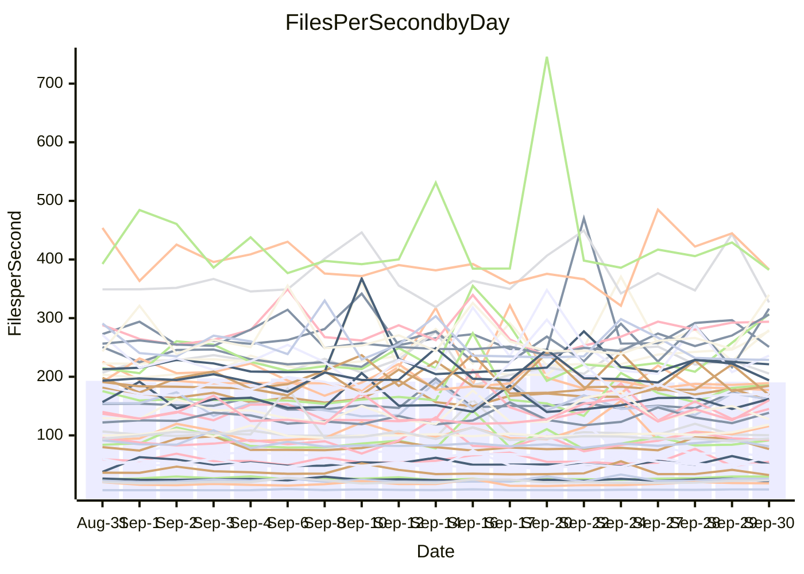

<!---
# This file is auto-generated. Do not edit.
# cspell:disable
--->
# Performance Report

Daily Performance

```mermaid
xychart-beta
    title Files Per Second by Day
    y-axis Files per Second
    x-axis Date [Aug-31, Sep-1, Sep-2, Sep-3, Sep-4, Sep-6, Sep-8, Sep-10, Sep-12, Sep-14, Sep-16, Sep-17, Sep-20, Sep-22, Sep-24, Sep-27, Sep-28, Sep-29, Sep-30]
    bar [193.00, 190.75, 190.15, 197.37, 189.85, 196.95, 191.17, 190.61, 191.83, 197.87, 189.83, 198.93, 223.14, 203.41, 191.85, 190.34, 190.33, 191.42, 190.42]
    line [153.94, 154.04, 151.51, 150.42, 164.46, 144.04, 144.33, 151.54, 146.78, 197.07, 148.01, 150.26, 150.22, 155.16, 146.16, 150.57, 146.25, 172.87, 161.52]
    line [225.49, 194.47, 193.04, 188.70, 189.46, 189.29, 188.79, 176.65, 217.04, 317.36, 187.32, 321.78, 198.42, 179.83, 171.82, 219.08, 181.95, 180.26, 177.36]
    line [106.63, 101.22, 99.00, 102.40, 108.26, 99.53, 99.63, 98.76, 103.06, 96.78, 160.57, 101.71, 98.32, 105.51, 103.82, 101.18, 119.72, 101.30, 100.17]
    line [24.79, 26.51, 29.88, 26.76, 29.99, 25.16, 26.46, 26.09, 28.54, 23.63, 25.87, 21.39, 25.97, 25.29, 24.28, 26.03, 27.14, 29.89, 29.90]
    line [181.80, 171.34, 164.16, 172.60, 156.60, 164.51, 155.95, 162.53, 193.68, 156.67, 149.67, 167.24, 171.44, 166.11, 165.94, 180.17, 169.69, 179.61, 159.37]
    line [6.52, 6.59, 6.44, 6.39, 6.52, 8.53, 6.71, 7.87, 6.93, 6.69, 7.98, 6.67, 6.83, 6.48, 7.18, 7.27, 6.94, 7.83, 7.72]
    line [59.04, 56.12, 68.78, 56.21, 56.11, 49.06, 62.47, 53.43, 54.08, 56.65, 66.08, 70.58, 54.86, 55.17, 51.26, 53.54, 77.09, 47.84, 54.81]
    line [26.35, 24.36, 24.17, 24.77, 25.69, 23.39, 29.52, 23.91, 25.15, 23.74, 22.20, 23.03, 24.38, 22.79, 25.90, 22.55, 24.52, 26.32, 21.35]
    line [203.55, 198.31, 204.42, 207.30, 236.03, 217.73, 206.74, 361.86, 212.41, 213.84, 211.89, 203.30, 203.26, 249.81, 370.77, 255.08, 280.21, 227.10, 279.54]
    line [81.24, 69.03, 86.32, 67.78, 71.51, 67.14, 65.29, 70.06, 74.08, 63.80, 67.85, 68.28, 64.95, 121.18, 70.33, 81.37, 68.55, 70.46, 64.11]
    line [272.63, 293.89, 254.88, 261.45, 256.16, 262.71, 281.41, 341.82, 253.99, 265.83, 272.53, 247.23, 246.03, 470.19, 256.56, 257.27, 291.74, 296.65, 250.84]
    line [91.86, 94.75, 119.70, 107.86, 89.92, 92.48, 95.62, 122.20, 102.97, 97.36, 113.44, 95.42, 93.37, 113.84, 158.94, 91.50, 106.48, 102.03, 115.81]
    line [207.01, 226.55, 228.01, 236.78, 227.33, 208.49, 230.64, 206.81, 229.76, 276.88, 185.15, 203.08, 216.06, 205.09, 247.61, 251.50, 220.80, 227.59, 205.45]
    line [83.98, 86.34, 113.37, 99.81, 81.83, 79.32, 79.69, 86.08, 90.96, 77.91, 142.49, 79.52, 110.64, 76.31, 85.79, 97.01, 82.92, 84.16, 91.49]
    line [79.89, 74.06, 94.44, 98.41, 75.35, 75.22, 74.82, 78.42, 89.26, 79.87, 74.03, 79.32, 76.57, 77.71, 78.68, 74.59, 96.62, 94.86, 76.62]
    line [22.87, 20.05, 21.21, 24.74, 22.92, 26.72, 20.85, 24.50, 21.07, 20.76, 21.20, 21.42, 29.89, 21.10, 33.29, 22.21, 22.99, 25.81, 26.13]
    line [95.53, 87.87, 82.74, 85.96, 92.06, 85.17, 89.98, 69.10, 91.26, 130.94, 82.16, 79.40, 98.84, 72.96, 83.85, 90.86, 105.55, 94.80, 92.19]
    line [37.73, 62.90, 58.74, 49.12, 53.66, 48.09, 48.30, 53.96, 52.43, 61.82, 49.92, 50.20, 50.36, 50.54, 47.43, 56.40, 49.96, 64.67, 50.83]
    line [222.58, 222.07, 229.04, 229.68, 226.40, 222.19, 220.27, 226.37, 235.76, 281.57, 222.43, 291.44, 219.17, 221.75, 221.55, 237.73, 242.39, 246.40, 277.97]
    line [48.25, 57.12, 55.04, 46.08, 52.57, 46.47, 56.14, 46.33, 51.70, 44.11, 74.38, 48.80, 46.22, 56.03, 61.86, 55.07, 50.38, 50.26, 50.12]
    line [250.62, 224.68, 245.58, 246.49, 229.93, 221.20, 224.86, 216.89, 259.14, 277.45, 226.45, 225.10, 268.40, 226.40, 290.41, 225.84, 287.60, 216.33, 316.20]
    line [20.24, 15.82, 15.08, 17.27, 15.55, 14.37, 16.80, 21.93, 17.01, 17.04, 25.59, 14.10, 13.68, 15.06, 15.07, 17.30, 20.40, 18.84, 18.19]
    line [20.35, 18.20, 18.80, 20.78, 20.30, 27.69, 23.39, 17.95, 19.65, 18.79, 24.79, 24.63, 19.73, 20.13, 19.16, 18.74, 19.48, 22.38, 23.28]
    line [175.44, 159.48, 161.70, 160.46, 160.16, 159.37, 153.77, 161.06, 165.68, 159.91, 274.11, 160.48, 154.49, 133.29, 206.55, 172.23, 156.59, 180.95, 186.40]
    line [36.34, 36.12, 46.76, 38.88, 37.13, 34.45, 34.97, 52.27, 41.14, 33.93, 34.79, 33.36, 33.83, 35.26, 55.80, 33.99, 34.03, 41.23, 32.35]
    line [154.94, 154.92, 173.52, 133.16, 154.40, 151.68, 142.86, 132.44, 134.89, 191.12, 144.91, 193.30, 142.56, 168.42, 145.10, 149.37, 134.63, 171.73, 161.61]
    line [140.06, 128.47, 140.20, 125.82, 152.47, 153.10, 126.38, 125.97, 124.19, 127.77, 210.87, 148.03, 126.65, 140.55, 188.49, 125.20, 157.87, 127.91, 145.18]
    line [156.83, 191.47, 145.84, 161.62, 164.09, 146.75, 148.35, 206.25, 150.67, 151.50, 140.12, 185.15, 139.87, 144.59, 151.47, 163.76, 164.48, 145.07, 161.96]
    line [99.73, 101.36, 109.96, 98.07, 116.80, 99.03, 95.60, 99.87, 99.90, 101.98, 98.46, 103.01, 98.38, 99.03, 101.47, 103.27, 100.93, 105.22, 118.54]
    line [59.90, 48.04, 50.57, 60.39, 48.74, 45.74, 54.53, 48.10, 54.31, 47.78, 46.42, 45.99, 42.51, 50.42, 46.36, 61.34, 51.99, 46.51, 64.01]
    line [122.01, 125.69, 124.63, 138.77, 133.95, 120.16, 123.66, 119.12, 133.12, 118.61, 125.51, 156.41, 126.36, 117.29, 122.97, 147.55, 130.31, 120.84, 138.52]
    line [191.06, 231.16, 206.13, 208.21, 222.66, 193.65, 167.61, 190.13, 221.56, 177.63, 183.43, 188.58, 244.43, 196.97, 192.51, 179.82, 187.80, 186.23, 189.05]
    line [349.07, 349.21, 351.71, 366.86, 345.42, 349.08, 401.47, 446.16, 355.63, 318.90, 363.44, 349.72, 406.48, 449.44, 342.12, 376.67, 347.31, 443.48, 326.75]
    line [214.50, 206.09, 260.46, 254.83, 225.39, 210.16, 218.01, 213.19, 249.06, 214.17, 355.08, 286.90, 193.09, 220.97, 216.09, 223.67, 208.59, 258.02, 306.73]
    line [191.03, 183.63, 183.06, 181.63, 179.83, 187.37, 210.54, 236.79, 184.39, 226.41, 183.84, 178.08, 240.62, 182.34, 183.11, 178.48, 227.71, 175.37, 184.43]
    line [91.62, 84.72, 84.00, 108.68, 78.26, 88.95, 80.83, 82.91, 82.03, 82.90, 86.51, 81.41, 84.89, 78.73, 86.02, 82.17, 86.87, 92.07, 81.14]
    line [288.18, 264.41, 254.46, 262.80, 279.68, 349.40, 267.60, 261.93, 287.76, 262.40, 339.51, 263.75, 234.66, 253.01, 268.39, 293.97, 280.40, 292.26, 293.91]
    line [212.83, 215.37, 228.66, 222.75, 208.88, 207.83, 208.53, 367.52, 230.07, 204.55, 207.72, 211.00, 215.66, 277.45, 216.60, 208.75, 228.82, 225.46, 221.28]
    line [129.50, 127.85, 161.72, 142.89, 142.67, 128.62, 122.28, 150.41, 127.69, 119.42, 176.53, 123.45, 123.33, 163.66, 174.86, 123.76, 140.60, 149.87, 127.46]
    line [271.29, 215.41, 231.46, 211.65, 226.30, 254.34, 225.06, 179.78, 228.82, 211.67, 318.15, 234.86, 348.02, 254.54, 210.42, 205.10, 287.53, 207.85, 235.98]
    line [256.34, 262.12, 254.81, 252.73, 280.38, 314.32, 249.04, 256.96, 250.64, 247.49, 246.97, 251.50, 236.84, 249.23, 243.91, 273.74, 252.33, 270.33, 306.20]
    line [453.72, 363.41, 425.43, 395.65, 408.80, 430.33, 376.07, 371.64, 390.41, 381.43, 392.33, 359.21, 375.60, 366.33, 321.23, 484.87, 422.08, 444.64, 383.02]
    line [94.13, 99.46, 106.04, 103.70, 101.61, 179.98, 95.75, 97.23, 107.06, 93.89, 113.70, 92.25, 94.28, 98.57, 98.01, 93.82, 94.62, 89.71, 94.69]
    line [392.45, 484.50, 460.60, 386.17, 437.93, 376.78, 397.57, 392.00, 400.11, 531.12, 384.37, 384.60, 745.85, 398.12, 385.90, 416.89, 405.74, 428.96, 382.36]
    line [198.12, 173.20, 197.43, 208.77, 179.57, 168.18, 209.46, 169.33, 212.19, 179.89, 238.35, 171.61, 172.61, 177.91, 241.32, 177.39, 178.05, 221.01, 168.70]
    line [290.78, 240.40, 234.87, 270.15, 260.38, 238.70, 329.95, 229.46, 255.09, 303.17, 236.15, 234.71, 233.17, 234.84, 298.34, 266.72, 232.18, 229.70, 228.80]
    line [136.84, 128.57, 138.89, 167.86, 124.57, 126.57, 119.58, 171.63, 125.66, 126.89, 119.89, 121.04, 127.46, 154.00, 162.49, 123.69, 144.71, 125.72, 159.93]
    line [193.23, 197.26, 194.56, 204.26, 190.93, 174.46, 207.05, 194.56, 194.84, 248.77, 196.63, 194.10, 246.18, 197.54, 195.96, 190.07, 228.82, 222.46, 193.91]
    line [243.47, 321.12, 238.92, 262.66, 250.38, 355.46, 248.94, 253.18, 270.83, 243.92, 325.88, 260.22, 243.99, 243.96, 239.11, 261.23, 266.19, 247.38, 339.76]
    line [185.43, 171.13, 167.67, 190.75, 177.89, 199.59, 191.33, 170.36, 179.54, 171.09, 160.76, 222.99, 297.37, 220.86, 165.88, 186.63, 165.05, 169.83, 170.12]
```

Time to Process Files

| Repository                                      | Elapsed | Min/Avg/Max          |    SD | SD Graph                |
| ----------------------------------------------- | ------: | :------------------: | ----: | ----------------------- |
| AdaDoom3/AdaDoom3                    |    3.19 | 1.8 /   2.7 /   3.2  |  0.38 | `    ┣━━┻━━╋━━●━━┫    ` |
| alexiosc/megistos                    |    5.44 | 3.9 /   6.6 /   8.4  |  0.98 | `    ┣━●┻━━╋━━┻━━┫    ` |
| apollographql/apollo-server          |    2.43 | 1.8 /   2.5 /   2.8  |  0.22 | `     ┣━┻━●╋━━┻━┫     ` |
| aspnetboilerplate/aspnetboilerplate  |    9.30 | 4.9 /   8.5 /   9.8  |  0.93 | `    ┣━━┻━━╋━━●━━┫    ` |
| aws-amplify/docs                     |    7.43 | 7.4 /  12.7 /  14.6  |  1.54 | `●   ┣━━┻━━╋━━┻━━┫    ` |
| Azure/azure-rest-api-specs           |    5.97 | 7.3 /  10.0 /  11.6  |  0.98 | `●    ┣━┻━━╋━━┻━┫     ` |
| bitjson/typescript-starter           |    0.73 | 0.7 /   1.0 /   1.2  |  0.11 | `    ●┣━┻━━╋━━┻━┫     ` |
| caddyserver/caddy                    |    2.68 | 2.2 /   3.4 /   4.1  |  0.45 | `    ┣●━┻━━╋━━┻━━┫    ` |
| canada-ca/open-source-logiciel-libre |    1.05 | 0.7 /   1.0 /   1.1  |  0.11 | `     ┣━┻━━╋●━┻━┫     ` |
| chef/chef                            |    4.90 | 3.1 /   4.7 /   5.6  |  0.59 | `    ┣━━┻━━╋●━┻━━┫    ` |
| dart-lang/sdk                        |   60.75 | 39.3 /  58.3 /  66.8 |  5.50 | `  ┣━━━┻━━━╋━●━┻━━━┫  ` |
| django/django                        |   12.30 | 8.0 /  13.3 /  14.5  |  1.38 | `    ┣━━┻●━╋━━┻━━┫    ` |
| eslint/eslint                        |    9.83 | 5.4 /   9.1 /  11.6  |  1.42 | `    ┣━━┻━━╋━●┻━━┫    ` |
| exonum/exonum                        |    2.74 | 2.6 /   3.3 /   3.6  |  0.31 | `    ┣●━┻━━╋━━┻━━┫    ` |
| flutter/samples                      |    9.02 | 7.1 /  11.6 /  13.5  |  1.60 | `    ┣●━┻━━╋━━┻━━┫    ` |
| gitbucket/gitbucket                  |    2.59 | 2.0 /   3.1 /   3.6  |  0.43 | `    ┣━━●━━╋━━┻━━┫    ` |
| googleapis/google-cloud-cpp          |  130.26 | 74.1 / 122.5 / 141.8 | 14.32 | `  ┣━━━┻━━━╋━●━┻━━━┫  ` |
| graphql/express-graphql              |    1.20 | 0.7 /   1.1 /   1.2  |  0.11 | `     ┣━┻━━╋━━●━┫     ` |
| graphql/graphql-js                   |    3.36 | 2.6 /   3.6 /   4.0  |  0.28 | `    ┣━━┻●━╋━━┻━━┫    ` |
| graphql/graphql-relay-js             |    1.02 | 0.7 /   1.0 /   1.3  |  0.15 | `     ┣━┻━━●━━┻━┫     ` |
| graphql/graphql-spec                 |    1.25 | 0.7 /   1.1 /   1.4  |  0.19 | `     ┣━┻━━╋━●┻━┫     ` |
| iluwatar/java-design-patterns        |   12.33 | 7.0 /  11.6 /  14.4  |  1.60 | `    ┣━━┻━━╋●━┻━━┫    ` |
| ktaranov/sqlserver-kit               |    4.57 | 3.1 /   5.6 /   6.5  |  0.86 | `    ┣━●┻━━╋━━┻━━┫    ` |
| liriliri/licia                       |    3.69 | 2.4 /   3.6 /   4.5  |  0.45 | `    ┣━━┻━━╋●━┻━━┫    ` |
| MartinThoma/LaTeX-examples           |    5.08 | 4.8 /   6.1 /   6.7  |  0.54 | `    ┣●━┻━━╋━━┻━━┫    ` |
| mdx-js/mdx                           |    1.68 | 1.0 /   1.7 /   2.0  |  0.25 | `     ┣━┻━━●━━┻━┫     ` |
| microsoft/TypeScript-Website         |    4.30 | 3.7 /   4.9 /   5.6  |  0.53 | `    ┣━●┻━━╋━━┻━━┫    ` |
| MicrosoftDocs/PowerShell-Docs        |   15.92 | 14.7 /  23.8 /  29.6 |  3.28 | `  ●┣━━━┻━━╋━━┻━━━┫   ` |
| neovim/nvim-lspconfig                |    5.72 | 3.2 /   5.2 /   5.9  |  0.55 | `    ┣━━┻━━╋━━●━━┫    ` |
| pagekit/pagekit                      |    1.93 | 1.9 /   3.2 /   3.8  |  0.48 | `  ● ┣━━┻━━╋━━┻━━┫    ` |
| php/php-src                          |   24.42 | 13.3 /  24.1 /  29.3 |  2.81 | `   ┣━━━┻━━●━━┻━━━┫   ` |
| plasticrake/tplink-smarthome-api     |    0.93 | 0.7 /   1.2 /   1.5  |  0.17 | `     ┣●┻━━╋━━┻━┫     ` |
| prettier/prettier                    |    8.41 | 4.4 /   7.5 /   8.5  |  0.85 | `    ┣━━┻━━╋━━●━━┫    ` |
| pycontribs/jira                      |    1.45 | 0.8 /   1.4 /   1.8  |  0.21 | `     ┣━┻━━●━━┻━┫     ` |
| RustPython/RustPython                |   12.42 | 6.3 /  10.9 /  12.6  |  1.17 | `    ┣━━┻━━╋━━┻●━┫    ` |
| shoelace-style/shoelace              |    1.98 | 1.6 /   2.7 /   3.3  |  0.30 | `    ●━━┻━━╋━━┻━━┫    ` |
| slint-ui/slint                       |   19.12 | 9.5 /  16.2 /  19.1  |  2.25 | `   ┣━━━┻━━╋━━┻●━━┫   ` |
| SoftwareBrothers/admin-bro           |    2.47 | 1.6 /   2.3 /   2.8  |  0.24 | `     ┣━┻━━╋●━┻━┫     ` |
| sveltejs/svelte                      |   23.76 | 12.2 /  22.0 /  26.2 |  2.71 | `   ┣━━━┻━━╋━●┻━━━┫   ` |
| TheAlgorithms/Python                 |    5.37 | 4.4 /   5.7 /   6.7  |  0.53 | `    ┣━━┻●━╋━━┻━━┫    ` |
| twbs/bootstrap                       |    1.70 | 1.0 /   1.6 /   2.0  |  0.22 | `     ┣━┻━━╋●━┻━┫     ` |
| typescript-cheatsheets/react         |    0.73 | 0.7 /   1.1 /   1.2  |  0.14 | `    ●┣━┻━━╋━━┻━┫     ` |
| typescript-eslint/typescript-eslint  |    3.19 | 2.4 /   3.9 /   4.5  |  0.60 | `    ┣━━●━━╋━━┻━━┫    ` |
| vitest-dev/vitest                    |   11.30 | 8.0 /  10.1 /  12.0  |  1.06 | `    ┣━━┻━━╋━━●━━┫    ` |
| w3c/aria-practices                   |    3.24 | 2.1 /   3.1 /   3.5  |  0.42 | `    ┣━━┻━━╋●━┻━━┫    ` |
| w3c/specberus                        |    2.07 | 1.2 /   1.8 /   2.1  |  0.20 | `     ┣━┻━━╋━━●━┫     ` |
| webdeveric/webpack-assets-manifest   |    0.96 | 0.7 /   1.1 /   1.3  |  0.14 | `     ┣━┻●━╋━━┻━┫     ` |
| webpack/webpack                      |    8.65 | 4.4 /   7.2 /   8.6  |  0.99 | `    ┣━━┻━━╋━━┻━●┫    ` |
| wireapp/wire-desktop                 |    1.41 | 0.9 /   1.3 /   1.5  |  0.16 | `     ┣━┻━━╋●━┻━┫     ` |
| wireapp/wire-webapp                  |   13.93 | 7.5 /  13.4 /  16.8  |  1.84 | `   ┣━━━┻━━╋●━┻━━━┫   ` |

Note:
- Elapsed time is in seconds.

Files per Second over Time

| Repository                                      | Files |    Sec |    Fps |     Rel | Trend Fps              |    N |
| ----------------------------------------------- | ----: | -----: | -----: | ------: | ---------------------- | ---: |
| AdaDoom3/AdaDoom3                    |   103 |   3.19 |  32.32 | -15.91% | `▅▅▂▂▂▂▂▂█▂▂▁▂▂▂█▁▂▁▁` |   41 |
| alexiosc/megistos                    |   583 |   5.44 | 107.25 |  18.30% | `▂▃▂▆▂▂▄▁▂▂▅▂▂▃█▂▃▅▂▄` |   42 |
| apollographql/apollo-server          |   256 |   2.43 | 105.14 |   1.31% | `▄▄▃▃▃▄▃▃▃▃▄▃▃▃▃▃▆▃█▄` |   42 |
| aspnetboilerplate/aspnetboilerplate  |  2292 |   9.30 | 246.51 |  -9.54% | `▂▂▂▂▂▂▂█▂▂▂▂▃▂▄▅▂▂▂▂` |   42 |
| aws-amplify/docs                     |  3049 |   7.43 | 410.13 |  68.59% | `▂▂▅▄▂▂▃▂▄▂▂▂█▂▂▁▂▁▂█` |   42 |
| Azure/azure-rest-api-specs           |  2586 |   5.97 | 433.49 |  66.58% | `▂▂▂▂▅▂▂▂▂▂▁▄▂▄▂▂▂▂▂█` |   42 |
| bitjson/typescript-starter           |    20 |   0.73 |  27.23 |  33.17% | `▃▄▃▃▇▇▃▄▃▃▃▃▆▂▂▇▆▃▃█` |   42 |
| caddyserver/caddy                    |   357 |   2.68 | 133.23 |  29.59% | `▂▄▂▂▄▂▂▄█▂▂▂▂▆▁▄▂▂▂▆` |   41 |
| canada-ca/open-source-logiciel-libre |     7 |   1.05 |   6.65 |  -4.28% | `▂▂▄▂▄▂▂▂▃▂▅▂▄▂▂▂▂█▅▂` |   42 |
| chef/chef                            |  1037 |   4.90 | 211.45 |  -6.55% | `▆▃▃█▂▃▄▃▆▇█▃▆▃▃█▂▃▃▃` |   42 |
| dart-lang/sdk                        | 11717 |  60.75 | 192.89 |  -4.62% | `▃▃▂▅▃▃▅▃▃▂▂▂█▃▂▃▅▄▃▂` |   41 |
| django/django                        |  2935 |  12.30 | 238.53 |   6.95% | `▃▅▃▂▃▃▃█▃▃▃▃█▂▂▃▃▆▂▅` |   41 |
| eslint/eslint                        |  2087 |   9.83 | 212.27 |  -9.93% | `▄▂▂▂▆▃▇▄▂▂▂▂▂█▄▂▂▂▄▂` |   42 |
| exonum/exonum                        |   421 |   2.74 | 153.80 |  18.26% | `▃▄▆▂▃▇▃▂▃██▃▂▃▆▂▃▃▃▇` |   42 |
| flutter/samples                      |  1703 |   9.02 | 188.70 |  25.58% | `▂▃▂▆▃▇▃▅▃▂▆▂▃▂▂▅█▂▂▆` |   42 |
| gitbucket/gitbucket                  |   422 |   2.59 | 162.82 |  17.60% | `▂▂▂▂█▄▂▃▇▂▂▂▂▆▅▂▂▂▂▅` |   42 |
| googleapis/google-cloud-cpp          | 22056 | 130.26 | 169.32 |  -7.49% | `▂▂▄▂▂▅█▄▂▅▂▂▂▁▂▂▂▂▂▂` |   42 |
| graphql/express-graphql              |    26 |   1.20 |  21.58 | -13.18% | `█▄▃▃▂▃▄▃▄▃▃▂▄▃▄▃▃█▂▂` |   42 |
| graphql/graphql-js                   |   551 |   3.36 | 164.05 |   6.43% | `▂▂▃█▃▃▃▄▃▃▃▃▃▃▃▅█▂▄▄` |   42 |
| graphql/graphql-relay-js             |    28 |   1.02 |  27.47 |   0.25% | `▃▃▂▂▃▁▃▃▂▂▂▅▂▅▃▂█▂▅▃` |   42 |
| graphql/graphql-spec                 |    19 |   1.25 |  15.18 | -12.89% | `▃▆▃▃█▂▁▂▂▂▂▇▂▇▇▅▅▃▆▂` |   42 |
| iluwatar/java-design-patterns        |  2239 |  12.33 | 181.52 |  -6.91% | `▂█▂▂▅▂▂▂▅▂▂▂▂▂▂▅▂▄▁▂` |   42 |
| ktaranov/sqlserver-kit               |   490 |   4.57 | 107.33 |  18.69% | `▂▄▂▂█▂▅▁▂▅▄▁▂▂▂▂▂▂▁▅` |   42 |
| liriliri/licia                       |  1442 |   3.69 | 391.02 |  -4.24% | `▃▃▃▃▃▂▃▂▁▃█▅▄▅▂▇▃▃▃▃` |   41 |
| MartinThoma/LaTeX-examples           |  1414 |   5.08 | 278.08 |  18.61% | `▇▃▄▇▃█▃▃▃▃▂▇▂▃██▃▃▇▇` |   42 |
| mdx-js/mdx                           |   139 |   1.68 |  82.63 |  -2.01% | `▂▇▂▂▂▂▂▂▂▂▂▂▂▂█▂▅▅▁▃` |   42 |
| microsoft/TypeScript-Website         |   765 |   4.30 | 177.89 |  13.22% | `▃▇▃▃▂▇▂▃▃█▃▃█▃▃▂▄▂▃▆` |   42 |
| MicrosoftDocs/PowerShell-Docs        |  3127 |  15.92 | 196.42 |  45.78% | `▂▂▂▃▂▂▃▅▅▃▂▂█▃▁▃▃▂▃█` |   42 |
| neovim/nvim-lspconfig                |   879 |   5.72 | 153.75 | -10.21% | `▂▂█▂▁▂▃▂▂▂▂▅▂▄▂▂▂▅▂▂` |   41 |
| pagekit/pagekit                      |   741 |   1.93 | 384.82 |  62.98% | `█▂▂▂▇▅▁▂▂▁▄▂▁▂▂▂▇▂▂█` |   42 |
| php/php-src                          |  2395 |  24.42 |  98.08 |  -3.08% | `▃▄█▃▆▃▃▄▄▄▃▃▃▃▃▃▂▃▃▄` |   42 |
| plasticrake/tplink-smarthome-api     |    62 |   0.93 |  66.37 |  25.90% | `▂▄▅▂▂▂▁▃▂▂▃█▂▂▄▂▂▂▄▅` |   42 |
| prettier/prettier                    |  2727 |   8.41 | 324.40 | -11.75% | `▃▂▁▁▂▂▃▄▂▂▅▁▂▂▂▂▂█▁▁` |   42 |
| pycontribs/jira                      |    80 |   1.45 |  55.23 |  -4.99% | `▃▃▃▃▄▅▃▃▂▃▂▂█▃▆▁▁▂▂▃` |   42 |
| RustPython/RustPython                |   972 |  12.42 |  78.28 |  -9.45% | `▄▃▄▄▄▃▄▃▄▃▄▄▃▆▄█▄▄▄▃` |   42 |
| shoelace-style/shoelace              |   440 |   1.98 | 221.88 |  33.04% | `▂▄▂▂█▃▂▁▅▂▅▂▂▂▂▃▃▅▂▆` |   42 |
| slint-ui/slint                       |  4339 |  19.12 | 226.97 | -11.86% | `▂▃▂▆▂▂▂▂▆▂▂█▂▂▂▂▂▂▂▂` |   42 |
| SoftwareBrothers/admin-bro           |   441 |   2.47 | 178.65 |  -6.36% | `▃▃▃▅▃▃▆▃▃▃▁▃▆█▂▁▃▂▃▃` |   42 |
| sveltejs/svelte                      |  9110 |  23.76 | 383.37 |  -9.07% | `▂▁▂▄▂▂█▂▂▂▂▃▂▂▂▄▂▂▂▂` |   42 |
| TheAlgorithms/Python                 |  1635 |   5.37 | 304.46 |  16.73% | `▃▄▄▃▃▃▂▃▃▃█▄▃▄▃█▃▃▇▇` |   42 |
| twbs/bootstrap                       |   118 |   1.70 |  69.27 |  -5.89% | `▂▂▂▂▂▂▂█▂▇▂▂▃▂▂▃▃▂▁▂` |   41 |
| typescript-cheatsheets/react         |    24 |   0.73 |  32.87 |  43.01% | `▂▂▂▂▂▂▆▂▇▃▂▂▂▂▅▂▂█▁▇` |   42 |
| typescript-eslint/typescript-eslint  |   881 |   3.19 | 276.30 |  19.36% | `▂▁▂▂▂▂▂▃█▂▇▂▅▂▇▂▂▄▅▄` |   42 |
| vitest-dev/vitest                    |  2815 |  11.30 | 249.19 | -11.12% | `▃▃▄▃█▃▂▃▄▆▆▄▇▃▃█▃▄█▃` |   42 |
| w3c/aria-practices                   |   417 |   3.24 | 128.62 |  -7.29% | `▂▂▂▂▆▂▂▅▆▁▂▂▆▁▂█▂▂▂▂` |   42 |
| w3c/specberus                        |   190 |   2.07 |  91.98 | -12.73% | `▂▃▂▂█▂▂▃▃▂▁▃█▂▂▂▂▂▃▁` |   42 |
| webdeveric/webpack-assets-manifest   |    55 |   0.96 |  57.38 |  10.95% | `▂▃▃▇▂█▃▂▄▅▂▅▅▅▂▂▃▃▁▅` |   41 |
| webpack/webpack                      |  1486 |   8.65 | 171.76 | -15.14% | `▆▅▄█▂█▂▂▁▂▄▄▂▂▂▂▁▁▂▁` |   42 |
| wireapp/wire-desktop                 |    71 |   1.41 |  50.20 |  -4.38% | `▅▃▃▅▃▃▃▃▃▇▃▃▄▃▃▃█▆▄▃` |   42 |
| wireapp/wire-webapp                  |  2693 |  13.93 | 193.28 |  -3.90% | `▄▄▄▃▄▄█▅▄▂▄▄▄▄▄▄▄▄▄▄` |   42 |

Data Throughput

| Repository                                      | Files |    Sec |     Kps |     Rel | Trend Kps              |    N |
| ----------------------------------------------- | ----: | -----: | ------: | ------: | ---------------------- | ---: |
| AdaDoom3/AdaDoom3                    |   103 |   3.19 |  686.96 | -15.91% | `▅▅▂▂▂▂▂▂█▂▂▁▂▂▂█▁▂▁▁` |   41 |
| alexiosc/megistos                    |   583 |   5.44 |  842.73 |  18.30% | `▂▃▂▆▂▂▄▁▂▂▅▂▂▃█▂▃▅▂▄` |   42 |
| apollographql/apollo-server          |   256 |   2.43 |  868.20 |   1.51% | `▄▄▃▃▃▄▃▃▃▃▄▃▃▃▃▃▆▃█▄` |   42 |
| aspnetboilerplate/aspnetboilerplate  |  2292 |   9.30 |  604.22 |  -9.38% | `▂▂▂▂▂▂▂█▂▂▂▂▃▂▄▅▂▂▂▂` |   42 |
| aws-amplify/docs                     |  3049 |   7.43 | 1612.69 |  69.38% | `▂▂▅▃▂▂▃▂▄▂▂▂█▂▂▁▂▁▂█` |   42 |
| Azure/azure-rest-api-specs           |  2586 |   5.97 | 1330.81 |  65.98% | `▂▂▂▂▅▃▂▂▂▂▁▄▂▄▂▂▂▂▂█` |   42 |
| bitjson/typescript-starter           |    20 |   0.73 |  108.94 |  33.17% | `▃▄▃▃▇▇▃▄▃▃▃▃▆▂▂▇▆▃▃█` |   42 |
| caddyserver/caddy                    |   357 |   2.68 | 1199.43 |  28.69% | `▂▄▂▂▄▂▂▄█▂▂▂▂▆▁▄▂▂▂▆` |   41 |
| canada-ca/open-source-logiciel-libre |     7 |   1.05 |   55.11 |  -4.28% | `▂▂▄▂▄▂▂▂▃▂▅▂▄▂▂▂▂█▅▂` |   42 |
| chef/chef                            |  1037 |   4.90 | 1039.50 |  -6.49% | `▆▃▃█▂▃▄▃▆▇█▃▆▃▃█▂▃▃▃` |   42 |
| dart-lang/sdk                        | 11717 |  60.75 | 1350.20 |  -4.30% | `▃▃▂▅▃▃▅▃▃▂▂▂█▃▂▃▅▄▃▂` |   41 |
| django/django                        |  2935 |  12.30 | 1541.32 |   7.16% | `▃▅▃▂▃▃▃█▃▃▃▃█▂▂▃▃▆▂▅` |   41 |
| eslint/eslint                        |  2087 |   9.83 | 1499.41 |  -9.68% | `▄▂▂▂▆▃▇▄▂▂▂▂▂█▄▂▂▂▄▂` |   42 |
| exonum/exonum                        |   421 |   2.74 | 1471.15 |  18.26% | `▃▄▆▂▃▇▃▂▃██▃▂▃▆▂▃▃▃▇` |   42 |
| flutter/samples                      |  1703 |   9.02 | 1124.79 |  25.58% | `▂▃▂▆▃▇▃▅▃▂▆▂▃▂▂▅█▂▂▆` |   42 |
| gitbucket/gitbucket                  |   422 |   2.59 |  800.97 |  17.14% | `▂▂▂▂█▄▂▃▆▂▂▂▁▆▅▂▂▂▂▅` |   42 |
| googleapis/google-cloud-cpp          | 22056 | 130.26 | 1479.94 |  -7.12% | `▂▂▄▂▂▅█▄▂▅▂▂▂▁▂▂▂▂▂▂` |   42 |
| graphql/express-graphql              |    26 |   1.20 |   98.78 | -13.18% | `█▄▃▃▂▃▄▃▄▃▃▂▄▃▄▃▃█▂▂` |   42 |
| graphql/graphql-js                   |   551 |   3.36 | 1223.40 |   6.41% | `▂▂▃█▃▃▃▄▃▃▃▃▂▃▃▅█▂▄▄` |   42 |
| graphql/graphql-relay-js             |    28 |   1.02 |  107.92 |   0.25% | `▃▃▂▂▃▁▃▃▂▂▂▅▂▅▃▂█▂▅▃` |   42 |
| graphql/graphql-spec                 |    19 |   1.25 |  510.55 | -12.60% | `▃▆▃▃█▂▁▂▂▂▂▇▂▇▇▅▅▄▆▂` |   42 |
| iluwatar/java-design-patterns        |  2239 |  12.33 |  563.20 |  -6.57% | `▂█▂▂▅▂▂▂▅▂▂▂▂▂▂▅▂▄▁▂` |   42 |
| ktaranov/sqlserver-kit               |   490 |   4.57 | 1625.95 |  18.69% | `▂▄▂▂█▂▅▁▂▅▄▁▂▂▂▂▂▂▁▅` |   42 |
| liriliri/licia                       |  1442 |   3.69 |  468.84 |  -4.24% | `▃▃▃▃▃▂▃▂▁▃█▅▄▅▂▇▃▃▃▃` |   41 |
| MartinThoma/LaTeX-examples           |  1414 |   5.08 |  577.79 |  19.11% | `▇▃▄▇▃█▃▃▃▃▂▇▂▃██▃▃▇▇` |   42 |
| mdx-js/mdx                           |   139 |   1.68 |  389.35 |  -2.01% | `▂▇▂▂▂▂▂▂▂▂▂▂▂▂█▂▅▅▁▃` |   42 |
| microsoft/TypeScript-Website         |   765 |   4.30 | 1226.87 |  13.26% | `▃▇▃▃▂▇▂▃▃█▃▃█▃▃▂▄▂▃▆` |   42 |
| MicrosoftDocs/PowerShell-Docs        |  3127 |  15.92 | 2099.08 |  45.78% | `▂▂▂▃▂▂▃▅▅▃▂▂█▃▁▃▃▂▃█` |   42 |
| neovim/nvim-lspconfig                |   879 |   5.72 |  453.90 |  -9.95% | `▂▂█▂▁▂▃▂▂▂▂▅▂▄▂▂▂▅▂▂` |   41 |
| pagekit/pagekit                      |   741 |   1.93 |  802.36 |  62.98% | `█▂▂▂▇▅▁▂▂▁▄▂▁▂▂▂▇▂▂█` |   42 |
| php/php-src                          |  2395 |  24.42 | 1739.02 |  -3.05% | `▃▄█▃▆▃▃▄▄▄▃▃▃▃▃▃▂▃▃▄` |   42 |
| plasticrake/tplink-smarthome-api     |    62 |   0.93 |  358.62 |  25.90% | `▂▄▅▂▂▂▁▃▂▂▃█▂▂▄▂▂▂▄▅` |   42 |
| prettier/prettier                    |  2727 |   8.41 |  456.81 | -11.87% | `▃▂▁▁▂▂▃▄▂▂▅▁▂▂▂▂▂█▁▁` |   42 |
| pycontribs/jira                      |    80 |   1.45 |  390.05 |  -4.99% | `▃▃▃▃▄▅▃▃▂▃▂▂█▃▆▁▁▂▂▃` |   42 |
| RustPython/RustPython                |   972 |  12.42 | 2290.38 |   4.46% | `▄▃▄▄▄▃▄▃▄▃▄▄▃▆▄█▆▇▆▅` |   42 |
| shoelace-style/shoelace              |   440 |   1.98 | 1071.57 |  33.04% | `▂▄▂▂█▃▂▁▅▂▅▂▂▂▂▃▃▅▂▆` |   42 |
| slint-ui/slint                       |  4339 |  19.12 | 1322.13 |  -8.49% | `▂▂▂▆▂▂▂▂▆▂▂█▂▂▂▂▂▂▂▂` |   42 |
| SoftwareBrothers/admin-bro           |   441 |   2.47 |  393.75 |  -6.36% | `▃▃▃▅▃▃▆▃▃▃▁▃▆█▂▁▃▂▃▃` |   42 |
| sveltejs/svelte                      |  9110 |  23.76 |  264.95 |  -9.00% | `▂▁▂▄▂▂█▂▂▂▂▃▂▂▂▄▂▂▂▂` |   42 |
| TheAlgorithms/Python                 |  1635 |   5.37 |  868.12 |  24.55% | `▃▃▃▃▃▃▂▄▃▃█▄▄▄▄█▄▃█▇` |   42 |
| twbs/bootstrap                       |   118 |   1.70 |  568.80 |  -5.88% | `▂▂▂▂▂▂▂█▂▇▂▂▃▂▂▃▃▂▁▂` |   41 |
| typescript-cheatsheets/react         |    24 |   0.73 |  297.19 |  43.01% | `▂▂▂▂▂▂▆▂▇▃▂▂▂▂▅▂▂█▁▇` |   42 |
| typescript-eslint/typescript-eslint  |   881 |   3.19 |  936.15 |  20.29% | `▂▁▂▂▂▂▂▃█▂▇▂▅▂▇▂▂▄▅▅` |   42 |
| vitest-dev/vitest                    |  2815 |  11.30 |  728.36 | -10.65% | `▃▃▄▃█▃▂▃▄▆▆▄▇▃▃█▄▄█▃` |   42 |
| w3c/aria-practices                   |   417 |   3.24 | 1209.66 |  -7.29% | `▂▂▂▂▆▂▂▅▆▁▂▂▆▁▂█▂▂▂▂` |   42 |
| w3c/specberus                        |   190 |   2.07 |  301.10 | -12.67% | `▂▃▂▂█▂▂▃▃▂▁▃█▂▂▂▂▂▃▁` |   42 |
| webdeveric/webpack-assets-manifest   |    55 |   0.96 |  132.50 |  10.95% | `▂▃▃▇▂█▃▂▄▅▂▅▅▅▂▂▃▃▁▅` |   41 |
| webpack/webpack                      |  1486 |   8.65 | 1315.86 |  -8.69% | `▆▅▄█▂█▂▂▂▂▅▄▂▂▂▃▂▂▂▂` |   42 |
| wireapp/wire-desktop                 |    71 |   1.41 |  207.18 |  -4.70% | `▄▃▃▅▃▃▃▃▃▇▃▃▃▃▃▃█▆▄▃` |   42 |
| wireapp/wire-webapp                  |  2693 |  13.93 |  872.51 |  -0.07% | `▄▄▄▃▄▄█▅▅▃▅▄▄▄▅▄▄▅▄▅` |   42 |

