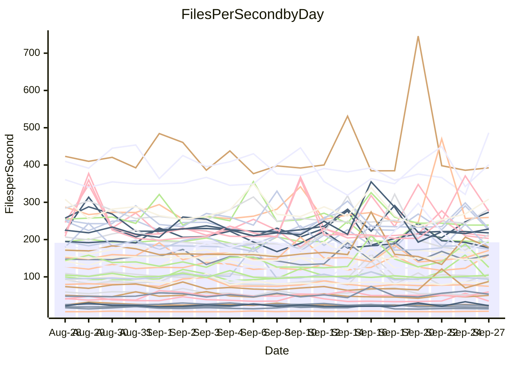

<!---
# This file is auto-generated. Do not edit.
# cspell:disable
--->
# Performance Report

Daily Performance

```mermaid
xychart-beta
    title Files Per Second by Day
    y-axis Files per Second
    x-axis Date [Aug-28, Aug-29, Aug-30, Aug-31, Sep-1, Sep-2, Sep-3, Sep-4, Sep-6, Sep-8, Sep-10, Sep-12, Sep-14, Sep-16, Sep-17, Sep-20, Sep-22, Sep-24, Sep-27]
    bar [191.23, 195.37, 191.39, 193.00, 190.75, 190.15, 197.37, 189.85, 196.95, 191.17, 190.61, 191.83, 197.87, 189.83, 198.93, 223.14, 203.41, 191.85, 192.66]
    line [19.50, 19.20, 19.98, 20.35, 18.20, 18.80, 20.78, 20.30, 27.69, 23.39, 17.95, 19.65, 18.79, 24.79, 24.63, 19.73, 20.13, 19.16, 18.38]
    line [127.33, 120.64, 133.49, 122.01, 125.69, 124.63, 138.77, 133.95, 120.16, 123.66, 119.12, 133.12, 118.61, 125.51, 156.41, 126.36, 117.29, 122.97, 159.25]
    line [92.49, 81.67, 87.59, 83.98, 86.34, 113.37, 99.81, 81.83, 79.32, 79.69, 86.08, 90.96, 77.91, 142.49, 79.52, 110.64, 76.31, 85.79, 107.31]
    line [99.79, 92.99, 92.61, 91.86, 94.75, 119.70, 107.86, 89.92, 92.48, 95.62, 122.20, 102.97, 97.36, 113.44, 95.42, 93.37, 113.84, 158.94, 89.91]
    line [24.44, 32.43, 29.19, 26.35, 24.36, 24.17, 24.77, 25.69, 23.39, 29.52, 23.91, 25.15, 23.74, 22.20, 23.03, 24.38, 22.79, 25.90, 22.73]
    line [249.68, 224.12, 249.45, 250.62, 224.68, 245.58, 246.49, 229.93, 221.20, 224.86, 216.89, 259.14, 277.45, 226.45, 225.10, 268.40, 226.40, 290.41, 225.49]
    line [40.86, 48.01, 38.35, 36.34, 36.12, 46.76, 38.88, 37.13, 34.45, 34.97, 52.27, 41.14, 33.93, 34.79, 33.36, 33.83, 35.26, 55.80, 34.92]
    line [222.72, 313.85, 230.65, 207.01, 226.55, 228.01, 236.78, 227.33, 208.49, 230.64, 206.81, 229.76, 276.88, 185.15, 203.08, 216.06, 205.09, 247.61, 273.39]
    line [142.33, 130.77, 150.54, 129.50, 127.85, 161.72, 142.89, 142.67, 128.62, 122.28, 150.41, 127.69, 119.42, 176.53, 123.45, 123.33, 163.66, 174.86, 123.18]
    line [83.62, 80.81, 95.31, 95.53, 87.87, 82.74, 85.96, 92.06, 85.17, 89.98, 69.10, 91.26, 130.94, 82.16, 79.40, 98.84, 72.96, 83.85, 94.84]
    line [17.08, 14.10, 16.71, 20.24, 15.82, 15.08, 17.27, 15.55, 14.37, 16.80, 21.93, 17.01, 17.04, 25.59, 14.10, 13.68, 15.06, 15.07, 14.37]
    line [79.64, 81.40, 79.85, 79.89, 74.06, 94.44, 98.41, 75.35, 75.22, 74.82, 78.42, 89.26, 79.87, 74.03, 79.32, 76.57, 77.71, 78.68, 74.65]
    line [59.28, 54.85, 60.20, 59.04, 56.12, 68.78, 56.21, 56.11, 49.06, 62.47, 53.43, 54.08, 56.65, 66.08, 70.58, 54.86, 55.17, 51.26, 54.99]
    line [194.59, 201.00, 192.78, 193.23, 197.26, 194.56, 204.26, 190.93, 174.46, 207.05, 194.56, 194.84, 248.77, 196.63, 194.10, 246.18, 197.54, 195.96, 192.21]
    line [423.25, 409.89, 420.57, 392.45, 484.50, 460.60, 386.17, 437.93, 376.78, 397.57, 392.00, 400.11, 531.12, 384.37, 384.60, 745.85, 398.12, 385.90, 392.52]
    line [194.97, 183.27, 194.85, 191.03, 183.63, 183.06, 181.63, 179.83, 187.37, 210.54, 236.79, 184.39, 226.41, 183.84, 178.08, 240.62, 182.34, 183.11, 174.40]
    line [208.83, 377.28, 231.14, 271.29, 215.41, 231.46, 211.65, 226.30, 254.34, 225.06, 179.78, 228.82, 211.67, 318.15, 234.86, 348.02, 254.54, 210.42, 203.04]
    line [194.89, 191.72, 195.81, 191.06, 231.16, 206.13, 208.21, 222.66, 193.65, 167.61, 190.13, 221.56, 177.63, 183.43, 188.58, 244.43, 196.97, 192.51, 177.91]
    line [92.38, 93.95, 104.17, 91.62, 84.72, 84.00, 108.68, 78.26, 88.95, 80.83, 82.91, 82.03, 82.90, 86.51, 81.41, 84.89, 78.73, 86.02, 82.00]
    line [409.79, 391.59, 445.01, 453.72, 363.41, 425.43, 395.65, 408.80, 430.33, 376.07, 371.64, 390.41, 381.43, 392.33, 359.21, 375.60, 366.33, 321.23, 486.50]
    line [25.72, 26.51, 26.59, 24.79, 26.51, 29.88, 26.76, 29.99, 25.16, 26.46, 26.09, 28.54, 23.63, 25.87, 21.39, 25.97, 25.29, 24.28, 23.34]
    line [287.21, 267.07, 273.26, 272.63, 293.89, 254.88, 261.45, 256.16, 262.71, 281.41, 341.82, 253.99, 265.83, 272.53, 247.23, 246.03, 470.19, 256.56, 259.35]
    line [109.08, 102.06, 113.06, 106.63, 101.22, 99.00, 102.40, 108.26, 99.53, 99.63, 98.76, 103.06, 96.78, 160.57, 101.71, 98.32, 105.51, 103.82, 97.19]
    line [254.92, 257.60, 260.42, 243.47, 321.12, 238.92, 262.66, 250.38, 355.46, 248.94, 253.18, 270.83, 243.92, 325.88, 260.22, 243.99, 243.96, 239.11, 238.76]
    line [50.51, 48.37, 46.85, 59.90, 48.04, 50.57, 60.39, 48.74, 45.74, 54.53, 48.10, 54.31, 47.78, 46.42, 45.99, 42.51, 50.42, 46.36, 50.20]
    line [94.27, 95.28, 96.54, 94.13, 99.46, 106.04, 103.70, 101.61, 179.98, 95.75, 97.23, 107.06, 93.89, 113.70, 92.25, 94.28, 98.57, 98.01, 93.78]
    line [245.83, 346.89, 231.16, 212.83, 215.37, 228.66, 222.75, 208.88, 207.83, 208.53, 367.52, 230.07, 204.55, 207.72, 211.00, 215.66, 277.45, 216.60, 209.47]
    line [257.70, 287.97, 268.68, 222.58, 222.07, 229.04, 229.68, 226.40, 222.19, 220.27, 226.37, 235.76, 281.57, 222.43, 291.44, 219.17, 221.75, 221.55, 218.01]
    line [175.89, 161.05, 172.78, 181.80, 171.34, 164.16, 172.60, 156.60, 164.51, 155.95, 162.53, 193.68, 156.67, 149.67, 167.24, 171.44, 166.11, 165.94, 158.71]
    line [127.21, 130.16, 128.18, 136.84, 128.57, 138.89, 167.86, 124.57, 126.57, 119.58, 171.63, 125.66, 126.89, 119.89, 121.04, 127.46, 154.00, 162.49, 125.79]
    line [147.54, 146.55, 146.02, 154.94, 154.92, 173.52, 133.16, 154.40, 151.68, 142.86, 132.44, 134.89, 191.12, 144.91, 193.30, 142.56, 168.42, 145.10, 158.80]
    line [152.01, 148.28, 159.68, 156.83, 191.47, 145.84, 161.62, 164.09, 146.75, 148.35, 206.25, 150.67, 151.50, 140.12, 185.15, 139.87, 144.59, 151.47, 170.89]
    line [206.72, 199.24, 215.14, 225.49, 194.47, 193.04, 188.70, 189.46, 189.29, 188.79, 176.65, 217.04, 317.36, 187.32, 321.78, 198.42, 179.83, 171.82, 214.37]
    line [143.71, 157.94, 138.50, 140.06, 128.47, 140.20, 125.82, 152.47, 153.10, 126.38, 125.97, 124.19, 127.77, 210.87, 148.03, 126.65, 140.55, 188.49, 125.64]
    line [73.80, 69.15, 78.35, 81.24, 69.03, 86.32, 67.78, 71.51, 67.14, 65.29, 70.06, 74.08, 63.80, 67.85, 68.28, 64.95, 121.18, 70.33, 87.53]
    line [179.74, 243.56, 182.28, 198.12, 173.20, 197.43, 208.77, 179.57, 168.18, 209.46, 169.33, 212.19, 179.89, 238.35, 171.61, 172.61, 177.91, 241.32, 178.43]
    line [41.81, 37.53, 40.57, 37.73, 62.90, 58.74, 49.12, 53.66, 48.09, 48.30, 53.96, 52.43, 61.82, 49.92, 50.20, 50.36, 50.54, 47.43, 59.71]
    line [22.04, 29.75, 23.02, 22.87, 20.05, 21.21, 24.74, 22.92, 26.72, 20.85, 24.50, 21.07, 20.76, 21.20, 21.42, 29.89, 21.10, 33.29, 22.63]
    line [156.31, 149.39, 153.11, 153.94, 154.04, 151.51, 150.42, 164.46, 144.04, 144.33, 151.54, 146.78, 197.07, 148.01, 150.26, 150.22, 155.16, 146.16, 149.31]
    line [360.76, 340.11, 354.77, 349.07, 349.21, 351.71, 366.86, 345.42, 349.08, 401.47, 446.16, 355.63, 318.90, 363.44, 349.72, 406.48, 449.44, 342.12, 400.72]
    line [48.16, 47.53, 46.75, 48.25, 57.12, 55.04, 46.08, 52.57, 46.47, 56.14, 46.33, 51.70, 44.11, 74.38, 48.80, 46.22, 56.03, 61.86, 53.56]
    line [6.53, 6.57, 8.03, 6.52, 6.59, 6.44, 6.39, 6.52, 8.53, 6.71, 7.87, 6.93, 6.69, 7.98, 6.67, 6.83, 6.48, 7.18, 7.72]
    line [284.05, 303.63, 278.91, 256.34, 262.12, 254.81, 252.73, 280.38, 314.32, 249.04, 256.96, 250.64, 247.49, 246.97, 251.50, 236.84, 249.23, 243.91, 281.38]
    line [104.60, 101.13, 109.23, 99.73, 101.36, 109.96, 98.07, 116.80, 99.03, 95.60, 99.87, 99.90, 101.98, 98.46, 103.01, 98.38, 99.03, 101.47, 104.08]
    line [171.47, 169.60, 183.25, 175.44, 159.48, 161.70, 160.46, 160.16, 159.37, 153.77, 161.06, 165.68, 159.91, 274.11, 160.48, 154.49, 133.29, 206.55, 179.01]
    line [252.18, 242.64, 242.97, 290.78, 240.40, 234.87, 270.15, 260.38, 238.70, 329.95, 229.46, 255.09, 303.17, 236.15, 234.71, 233.17, 234.84, 298.34, 229.63]
    line [216.81, 359.94, 225.73, 203.55, 198.31, 204.42, 207.30, 236.03, 217.73, 206.74, 361.86, 212.41, 213.84, 211.89, 203.30, 203.26, 249.81, 370.77, 276.32]
    line [225.24, 218.17, 233.60, 214.50, 206.09, 260.46, 254.83, 225.39, 210.16, 218.01, 213.19, 249.06, 214.17, 355.08, 286.90, 193.09, 220.97, 216.09, 228.46]
    line [307.76, 255.74, 281.64, 288.18, 264.41, 254.46, 262.80, 279.68, 349.40, 267.60, 261.93, 287.76, 262.40, 339.51, 263.75, 234.66, 253.01, 268.39, 308.41]
    line [182.86, 173.63, 176.66, 185.43, 171.13, 167.67, 190.75, 177.89, 199.59, 191.33, 170.36, 179.54, 171.09, 160.76, 222.99, 297.37, 220.86, 165.88, 197.58]
```

Time to Process Files

| Repository                                      | Elapsed | Min/Avg/Max          |    SD | SD Graph                |
| ----------------------------------------------- | ------: | :------------------: | ----: | ----------------------- |
| AdaDoom3/AdaDoom3                    |    2.93 | 1.8 /   2.7 /   3.2  |  0.35 | `    ┣━━┻━━╋━●┻━━┫    ` |
| alexiosc/megistos                    |    5.31 | 4.5 /   6.7 /   8.4  |  0.88 | `    ┣●━┻━━╋━━┻━━┫    ` |
| apollographql/apollo-server          |    2.39 | 1.8 /   2.5 /   2.8  |  0.23 | `     ┣━┻━●╋━━┻━┫     ` |
| aspnetboilerplate/aspnetboilerplate  |    8.86 | 4.9 /   8.5 /   9.8  |  0.91 | `    ┣━━┻━━╋●━┻━━┫    ` |
| aws-amplify/docs                     |   13.33 | 8.6 /  12.6 /  14.3  |  1.46 | `    ┣━━┻━━╋━●┻━━┫    ` |
| Azure/azure-rest-api-specs           |   11.31 | 7.3 /  10.0 /  11.6  |  0.89 | `    ┣━━┻━━╋━━┻━●┫    ` |
| bitjson/typescript-starter           |    1.08 | 0.7 /   1.0 /   1.1  |  0.10 | `     ┣━┻━━╋━●┻━┫     ` |
| caddyserver/caddy                    |    3.92 | 2.2 /   3.4 /   3.9  |  0.42 | `    ┣━━┻━━╋━━●━━┫    ` |
| canada-ca/open-source-logiciel-libre |    0.80 | 0.6 /   1.0 /   1.1  |  0.10 | `    ●┣━┻━━╋━━┻━┫     ` |
| chef/chef                            |    3.75 | 3.1 /   4.6 /   5.6  |  0.60 | `    ┣━●┻━━╋━━┻━━┫    ` |
| dart-lang/sdk                        |   60.71 | 46.9 /  59.3 /  66.8 |  4.01 | `   ┣━━┻━━━╋●━━┻━━┫   ` |
| django/django                        |   14.00 | 7.5 /  13.0 /  15.1  |  1.73 | `    ┣━━┻━━╋━●┻━━┫    ` |
| eslint/eslint                        |    9.94 | 5.4 /   9.2 /  11.6  |  1.38 | `    ┣━━┻━━╋━●┻━━┫    ` |
| exonum/exonum                        |    2.61 | 2.6 /   3.3 /   3.6  |  0.30 | `    ●━━┻━━╋━━┻━━┫    ` |
| flutter/samples                      |    8.97 | 7.1 /  11.7 /  13.9  |  1.50 | `    ●━━┻━━╋━━┻━━┫    ` |
| gitbucket/gitbucket                  |    3.29 | 2.0 /   3.1 /   3.6  |  0.44 | `    ┣━━┻━━╋●━┻━━┫    ` |
| googleapis/google-cloud-cpp          |  128.23 | 74.1 / 121.5 / 142.3 | 15.09 | `  ┣━━━┻━━━╋━●━┻━━━┫  ` |
| graphql/express-graphql              |    1.13 | 0.7 /   1.0 /   1.2  |  0.13 | `     ┣━┻━━╋━●┻━┫     ` |
| graphql/graphql-js                   |    3.69 | 2.6 /   3.6 /   4.0  |  0.25 | `    ┣━━┻━━╋●━┻━━┫    ` |
| graphql/graphql-relay-js             |    1.25 | 0.7 /   1.1 /   1.3  |  0.13 | `     ┣━┻━━╋━━┻●┫     ` |
| graphql/graphql-spec                 |    1.30 | 0.7 /   1.2 /   1.4  |  0.18 | `     ┣━┻━━╋━●┻━┫     ` |
| iluwatar/java-design-patterns        |   12.60 | 7.0 /  11.6 /  13.3  |  1.47 | `    ┣━━┻━━╋━●┻━━┫    ` |
| ktaranov/sqlserver-kit               |    4.62 | 3.1 /   5.5 /   6.4  |  0.85 | `    ┣━━●━━╋━━┻━━┫    ` |
| liriliri/licia                       |    2.42 | 2.8 /   3.6 /   4.5  |  0.41 | `  ● ┣━━┻━━╋━━┻━━┫    ` |
| MartinThoma/LaTeX-examples           |    6.74 | 3.5 /   6.0 /   6.7  |  0.68 | `    ┣━━┻━━╋━━●━━┫    ` |
| mdx-js/mdx                           |    1.87 | 1.1 /   1.7 /   2.0  |  0.22 | `     ┣━┻━━╋━●┻━┫     ` |
| microsoft/TypeScript-Website         |    5.10 | 3.7 /   4.9 /   5.6  |  0.52 | `    ┣━━┻━━╋●━┻━━┫    ` |
| MicrosoftDocs/PowerShell-Docs        |   25.79 | 14.7 /  23.8 /  28.2 |  2.82 | `   ┣━━━┻━━╋━●┻━━━┫   ` |
| neovim/nvim-lspconfig                |    5.45 | 3.2 /   5.2 /   5.9  |  0.51 | `    ┣━━┻━━╋━●┻━━┫    ` |
| pagekit/pagekit                      |    2.86 | 1.9 /   3.2 /   3.8  |  0.44 | `    ┣━━┻●━╋━━┻━━┫    ` |
| php/php-src                          |   26.36 | 13.3 /  24.0 /  26.8 |  2.55 | `   ┣━━━┻━━╋━━●━━━┫   ` |
| plasticrake/tplink-smarthome-api     |    1.22 | 0.9 /   1.2 /   1.5  |  0.15 | `     ┣━┻━━●━━┻━┫     ` |
| prettier/prettier                    |    5.83 | 5.9 /   7.6 /   8.5  |  0.65 | `  ● ┣━━┻━━╋━━┻━━┫    ` |
| pycontribs/jira                      |    1.47 | 0.8 /   1.4 /   1.8  |  0.17 | `     ┣━┻━━╋●━┻━┫     ` |
| RustPython/RustPython                |   11.29 | 5.6 /  10.3 /  12.6  |  1.42 | `    ┣━━┻━━╋━●┻━━┫    ` |
| shoelace-style/shoelace              |    2.13 | 1.6 /   2.6 /   3.3  |  0.31 | `    ┣●━┻━━╋━━┻━━┫    ` |
| slint-ui/slint                       |   18.35 | 9.5 /  15.8 /  18.0  |  1.87 | `   ┣━━━┻━━╋━━┻●━━┫   ` |
| SoftwareBrothers/admin-bro           |    2.82 | 1.8 /   2.3 /   2.5  |  0.19 | `     ┣━┻━━╋━━┻━┫ ●   ` |
| sveltejs/svelte                      |   23.46 | 12.2 /  21.9 /  26.2 |  2.65 | `   ┣━━━┻━━╋━●┻━━━┫   ` |
| TheAlgorithms/Python                 |    5.02 | 4.2 /   5.5 /   6.6  |  0.56 | `    ┣━━┻●━╋━━┻━━┫    ` |
| twbs/bootstrap                       |    1.74 | 1.0 /   1.6 /   1.9  |  0.23 | `     ┣━┻━━╋━●┻━┫     ` |
| typescript-cheatsheets/react         |    1.11 | 0.7 /   1.1 /   1.2  |  0.13 | `     ┣━┻━━╋●━┻━┫     ` |
| typescript-eslint/typescript-eslint  |    2.50 | 2.4 /   4.0 /   4.5  |  0.51 | `  ● ┣━━┻━━╋━━┻━━┫    ` |
| vitest-dev/vitest                    |    9.12 | 6.6 /  10.1 /  12.0  |  1.16 | `    ┣━━●━━╋━━┻━━┫    ` |
| w3c/aria-practices                   |    3.24 | 2.1 /   3.0 /   3.5  |  0.40 | `    ┣━━┻━━╋━●┻━━┫    ` |
| w3c/specberus                        |    2.06 | 1.2 /   1.8 /   2.1  |  0.19 | `     ┣━┻━━╋━━●━┫     ` |
| webdeveric/webpack-assets-manifest   |    0.93 | 0.7 /   1.1 /   1.3  |  0.13 | `     ┣●┻━━╋━━┻━┫     ` |
| webpack/webpack                      |    6.05 | 4.4 /   6.9 /   8.5  |  0.92 | `    ┣━━●━━╋━━┻━━┫    ` |
| wireapp/wire-desktop                 |    1.46 | 0.9 /   1.3 /   1.5  |  0.16 | `     ┣━┻━━╋━●┻━┫     ` |
| wireapp/wire-webapp                  |   14.09 | 7.5 /  13.2 /  16.8  |  1.71 | `    ┣━━┻━━╋━●┻━━┫    ` |

Note:
- Elapsed time is in seconds.

Files per Second over Time

| Repository                                      | Files |    Sec |    Fps |     Rel | Trend Fps              |    N |
| ----------------------------------------------- | ----: | -----: | -----: | ------: | ---------------------- | ---: |
| AdaDoom3/AdaDoom3                    |   103 |   2.93 |  35.21 | -10.62% | `▅▁▂▂▂▂▇▂▅▅▅▂▂▂▂▂▂█▂▂` |   46 |
| alexiosc/megistos                    |   583 |   5.31 | 109.74 |  23.20% | `▃▃▃▂▅▁▆▅▂▃▄▃█▃▂▅▂▃▂▆` |   47 |
| apollographql/apollo-server          |   256 |   2.39 | 107.10 |   2.88% | `▃█▃▂▂▃▂▂▃▃▃▃▃▃▃▃▃▃▃▄` |   47 |
| aspnetboilerplate/aspnetboilerplate  |  2290 |   8.86 | 258.59 |  -5.17% | `▂▂▂▂▃▄▂▂▂▂▂▂▂▂▂▂█▂▂▂` |   47 |
| aws-amplify/docs                     |  3048 |  13.33 | 228.64 |  -6.53% | `▂▃▂▃▂▂▅▂▇▃▃█▆▃▃▅▃▇▂▃` |   47 |
| Azure/azure-rest-api-specs           |  2583 |  11.31 | 228.28 | -12.19% | `▅▃█▃▃▃▅▇▄▃▃▂▃▇▃▃▃▂▃▂` |   47 |
| bitjson/typescript-starter           |    20 |   1.08 |  18.50 |  -8.69% | `▂▂█▃▇▂▂▃▃▂▃▃▂▆▆▃▃▂▂▂` |   47 |
| caddyserver/caddy                    |   350 |   3.92 |  89.36 | -11.55% | `▁▂▂▂▂▅▅▂▂▂▄▂▂▄▂▂▄█▂▂` |   46 |
| canada-ca/open-source-logiciel-libre |     7 |   0.80 |   8.71 |  25.69% | `▂▃█▃▄▆▂▄▄▃▃▆▃▆▃▄▃▄▃█` |   47 |
| chef/chef                            |  1037 |   3.75 | 276.86 |  21.17% | `▃▃▃▃▆▃█▃▄▆▃▃█▂▃▄▃▆▇█` |   47 |
| dart-lang/sdk                        | 11695 |  60.71 | 192.63 |  -2.44% | `▂▃▂▆▃▄▄▄▃▄▄▃█▄▄█▄▄▃▃` |   46 |
| django/django                        |  2935 |  14.00 | 209.61 |  -9.04% | `▂▂▂▂▂▂█▄▂▂▃▂▂▂▂▂▅▂▂▂` |   46 |
| eslint/eslint                        |  2088 |   9.94 | 210.05 | -10.10% | `▂▆▄▄▃▁▂▅▂▅▂▂▃▇▃█▄▂▂▂` |   47 |
| exonum/exonum                        |   421 |   2.61 | 161.22 |  23.83% | `▇▂▃▃▃▂▃▅▅▃▄▆▂▃▇▃▂▃██` |   47 |
| flutter/samples                      |  1703 |   8.97 | 189.95 |  27.70% | `▅▂▄▃▄▃▂▂▂▃▄▃█▄█▃▆▄▂█` |   47 |
| gitbucket/gitbucket                  |   422 |   3.29 | 128.13 |  -8.30% | `▅▂▄▂▂▂▂▂▂▂▂▂▂█▄▂▃▇▂▂` |   47 |
| googleapis/google-cloud-cpp          | 22038 | 128.23 | 171.87 |  -6.96% | `▂▂▃▄▂▂▂▂▂▂▂▄▂▂▅█▄▂▅▂` |   47 |
| graphql/express-graphql              |    26 |   1.13 |  22.93 | -10.82% | `▅▅▂█▂▂▂▃▂▆▃▂▂▂▂▃▂▃▂▂` |   47 |
| graphql/graphql-js                   |   551 |   3.69 | 149.50 |  -2.60% | `▃█▂▂▃▃▃▃▂▂▂▃▇▃▃▃▃▂▃▃` |   47 |
| graphql/graphql-relay-js             |    28 |   1.25 |  22.34 | -16.71% | `▂▅▃▃▃▃█▅▃▃▃▂▂▃▁▃▃▂▂▂` |   47 |
| graphql/graphql-spec                 |    19 |   1.30 |  14.57 | -13.18% | `▂▂▂▄▂▆▅▁▂▃▆▃▃█▂▁▂▂▂▂` |   47 |
| iluwatar/java-design-patterns        |  2239 |  12.60 | 177.72 |  -8.02% | `▂▁▁▂▄▁▂▄▃▂█▂▂▅▂▂▂▅▂▂` |   47 |
| ktaranov/sqlserver-kit               |   490 |   4.62 | 106.02 |  16.19% | `▂▂▂▂▁▂▂▅▂▂▄▂▁█▂▅▁▂▅▄` |   47 |
| liriliri/licia                       |  1442 |   2.42 | 594.66 |  46.63% | `▂▂▄▃▃▃▂▅▃▃▃▃▃▃▂▃▂▁▃█` |   46 |
| MartinThoma/LaTeX-examples           |  1414 |   6.74 | 209.92 | -12.92% | `▄▃▃▄▂▃▃▄▂█▃▄▇▃█▃▃▃▃▂` |   47 |
| mdx-js/mdx                           |   139 |   1.87 |  74.15 |  -9.85% | `▂▂▂▂▂▂▅▂▂▂█▃▂▂▂▂▂▂▂▂` |   47 |
| microsoft/TypeScript-Website         |   765 |   5.10 | 150.13 |  -4.68% | `▆▃▃▃▂█▂▂▂▃▆▂▃▂▆▂▂▃▇▃` |   47 |
| MicrosoftDocs/PowerShell-Docs        |  3127 |  25.79 | 121.23 |  -9.19% | `▃▃▃▃▂█▆▃▂▃▂▃▃▃▃▃▆▇▄▃` |   47 |
| neovim/nvim-lspconfig                |   878 |   5.45 | 161.18 |  -5.54% | `▁▂▁▂▂▂▂▅▂▂▂█▂▁▂▃▂▂▂▂` |   46 |
| pagekit/pagekit                      |   741 |   2.86 | 259.36 |  10.62% | `▂▃▂▂▂▂▂▂▄█▂▂▂▇▅▁▂▂▁▄` |   47 |
| php/php-src                          |  2395 |  26.36 |  90.84 | -10.26% | `▂▂█▂▂▂▄▂▂▂▂▄▂▃▁▂▂▂▂▁` |   47 |
| plasticrake/tplink-smarthome-api     |    62 |   1.22 |  50.70 |  -0.80% | `▇▂▃▃█▄▃█▃▄▇█▃▃▃▂▄▃▄▄` |   47 |
| prettier/prettier                    |  2722 |   5.83 | 466.71 |  29.56% | `▃▄▃█▃▇▃▃▃▆▃▂▂▄▃▆▇▃▃█` |   47 |
| pycontribs/jira                      |    80 |   1.47 |  54.42 |  -6.61% | `▁▅▂▂█▃▄▃▃▄▄▃▄▆▇▃▃▃▄▃` |   47 |
| RustPython/RustPython                |   958 |  11.29 |  84.86 |  -5.49% | `▆▃█▆▆▆▆▆▅▇▄▇▆▇▆▇▅▇▅▇` |   47 |
| shoelace-style/shoelace              |   440 |   2.13 | 206.81 |  22.16% | `▃▃▂▂▂▃▃▂▃▂▄▂▂█▃▂▁▅▂▅` |   47 |
| slint-ui/slint                       |  4171 |  18.35 | 227.28 | -11.62% | `▂▃▂█▁▁▃▁▄▁▂▂▄▂▁▁▁▄▁▁` |   47 |
| SoftwareBrothers/admin-bro           |   441 |   2.82 | 156.61 | -18.09% | `▃▂▃▃▇█▃▃▃▃▃▃▇▃▂█▃▃▄ ` |   47 |
| sveltejs/svelte                      |  9094 |  23.46 | 387.68 |  -8.27% | `▂▄▂▂▂▂▂▄▂▂▁▂▄▂▂█▂▂▂▂` |   47 |
| TheAlgorithms/Python                 |  1605 |   5.02 | 320.01 |  20.70% | `▃██▃▃▄▃▂▃▃▄▄▃▃▃▂▃▃▃█` |   47 |
| twbs/bootstrap                       |   118 |   1.74 |  67.99 |  -9.73% | `▂▄▂▂▁▂▅▃▂▂▁▂▁▂▂▂█▂▆▂` |   46 |
| typescript-cheatsheets/react         |    24 |   1.11 |  21.70 |  -5.52% | `▂▂▅▂▂▄▃▂▂▂▂▂▂▂▂▆▂█▃▂` |   47 |
| typescript-eslint/typescript-eslint  |   880 |   2.50 | 351.74 |  56.05% | `▄▅▂▂▂█▂▁▃▂▁▂▂▂▂▂▃█▂▇` |   47 |
| vitest-dev/vitest                    |  2809 |   9.12 | 307.92 |   9.48% | `▄▃█▃▅▃▇▃▇▃▃▄▃█▃▂▃▄▆▆` |   47 |
| w3c/aria-practices                   |   417 |   3.24 | 128.55 |  -8.65% | `█▃▃▂▂▅▃▃▂▃▃▃▂█▂▂▆▇▂▃` |   47 |
| w3c/specberus                        |   190 |   2.06 |  92.16 | -13.40% | `▃▂▂▂▂▂▅▂▁▂▃▂▂█▂▂▃▃▂▁` |   47 |
| webdeveric/webpack-assets-manifest   |    55 |   0.93 |  59.45 |  17.78% | `▂▆▂▆▃▂▃▃▂▃▃▇▂█▃▂▄▆▃▅` |   47 |
| webpack/webpack                      |  1466 |   6.05 | 242.13 |  17.24% | `▂▂▂▂▂▂▂▂▂▆▅▄█▂█▂▂▁▂▄` |   47 |
| wireapp/wire-desktop                 |    71 |   1.46 |  48.58 |  -0.03% | `▇▆▄▄▄▅▄▄▆▅▄▃▆▄▄▄▄▄█▄` |   47 |
| wireapp/wire-webapp                  |  2684 |  14.09 | 190.44 |  -5.76% | `▄▅▂▂▁▂▄█▁▂▂▂▂▂▂▄▂▂▁▂` |   47 |

Data Throughput

| Repository                                      | Files |    Sec |     Kps |     Rel | Trend Kps              |    N |
| ----------------------------------------------- | ----: | -----: | ------: | ------: | ---------------------- | ---: |
| AdaDoom3/AdaDoom3                    |   103 |   2.93 |  748.35 | -10.62% | `▅▁▂▂▂▂▇▂▅▅▅▂▂▂▂▂▂█▂▂` |   46 |
| alexiosc/megistos                    |   583 |   5.31 |  862.28 |  23.20% | `▃▃▃▂▅▁▆▅▂▃▄▃█▃▂▅▂▃▂▆` |   47 |
| apollographql/apollo-server          |   256 |   2.39 |  884.45 |   3.16% | `▃█▃▂▂▃▂▂▃▃▃▃▃▃▃▃▃▃▃▄` |   47 |
| aspnetboilerplate/aspnetboilerplate  |  2290 |   8.86 |  633.14 |  -5.07% | `▂▂▂▂▃▄▂▂▂▂▂▂▂▂▂▂█▂▂▂` |   47 |
| aws-amplify/docs                     |  3048 |  13.33 |  896.93 |  -6.22% | `▂▃▂▃▂▂▅▂▇▃▃█▆▃▃▅▃▇▂▃` |   47 |
| Azure/azure-rest-api-specs           |  2583 |  11.31 |  703.94 | -12.05% | `▅▃█▃▃▃▅▇▄▃▃▃▃▇▄▃▃▂▃▂` |   47 |
| bitjson/typescript-starter           |    20 |   1.08 |   73.99 |  -8.69% | `▂▂█▃▇▂▂▃▃▂▃▃▂▆▆▃▃▂▂▂` |   47 |
| caddyserver/caddy                    |   350 |   3.92 |  807.77 | -11.90% | `▁▂▂▂▂▅▅▂▂▂▄▂▂▄▂▂▄█▂▁` |   46 |
| canada-ca/open-source-logiciel-libre |     7 |   0.80 |   72.15 |  25.69% | `▂▃█▃▄▆▂▄▄▃▃▆▃▆▃▄▃▄▃█` |   47 |
| chef/chef                            |  1037 |   3.75 | 1361.05 |  21.29% | `▃▃▃▃▆▃█▃▄▆▃▃█▂▃▄▃▆▇█` |   47 |
| dart-lang/sdk                        | 11695 |  60.71 | 1350.02 |  -1.81% | `▂▃▂▆▃▄▄▄▃▄▄▃█▄▄█▄▄▃▄` |   46 |
| django/django                        |  2935 |  14.00 | 1353.78 |  -8.83% | `▂▂▂▂▂▂█▄▂▂▃▂▂▂▂▂▅▂▂▂` |   46 |
| eslint/eslint                        |  2088 |   9.94 | 1482.42 |  -9.80% | `▂▆▄▄▃▁▂▅▂▅▂▂▃▇▃█▄▃▂▂` |   47 |
| exonum/exonum                        |   421 |   2.61 | 1542.08 |  23.83% | `▇▂▃▃▃▂▃▅▅▃▄▆▂▃▇▃▂▃██` |   47 |
| flutter/samples                      |  1703 |   8.97 | 1132.20 |  27.70% | `▅▂▄▃▄▃▂▂▂▃▄▃█▄█▃▆▄▂█` |   47 |
| gitbucket/gitbucket                  |   422 |   3.29 |  630.03 |  -8.82% | `▅▂▄▂▂▂▂▂▂▂▂▂▂█▄▂▃▆▂▂` |   47 |
| googleapis/google-cloud-cpp          | 22038 | 128.23 | 1496.82 |  -6.89% | `▂▂▃▄▂▂▂▂▂▂▂▄▂▂▅█▄▂▅▂` |   47 |
| graphql/express-graphql              |    26 |   1.13 |  104.96 | -10.82% | `▅▅▂█▂▂▂▃▂▆▃▂▂▂▂▃▂▃▂▂` |   47 |
| graphql/graphql-js                   |   551 |   3.69 | 1114.89 |  -2.61% | `▃█▂▂▃▃▃▃▂▂▂▃▇▃▃▃▃▂▃▃` |   47 |
| graphql/graphql-relay-js             |    28 |   1.25 |   87.77 | -16.71% | `▂▅▃▃▃▃█▅▃▃▃▂▂▃▁▃▃▂▂▂` |   47 |
| graphql/graphql-spec                 |    19 |   1.30 |  490.06 | -12.79% | `▂▂▂▄▂▆▅▁▂▃▆▃▃█▂▁▂▂▂▂` |   47 |
| iluwatar/java-design-patterns        |  2239 |  12.60 |  551.42 |  -7.61% | `▂▁▁▂▄▁▂▄▃▂█▂▂▅▂▂▂▅▂▂` |   47 |
| ktaranov/sqlserver-kit               |   490 |   4.62 | 1606.03 |  16.19% | `▂▂▂▂▁▂▂▅▂▂▄▂▁█▂▅▁▂▅▄` |   47 |
| liriliri/licia                       |  1442 |   2.42 |  713.02 |  46.63% | `▂▂▄▃▃▃▂▅▃▃▃▃▃▃▂▃▂▁▃█` |   46 |
| MartinThoma/LaTeX-examples           |  1414 |   6.74 |  434.68 | -12.77% | `▄▃▃▄▂▃▃▄▂█▃▄▇▃█▃▃▃▃▂` |   47 |
| mdx-js/mdx                           |   139 |   1.87 |  349.42 |  -9.85% | `▂▂▂▂▂▂▅▂▂▂█▃▂▂▂▂▂▂▂▂` |   47 |
| microsoft/TypeScript-Website         |   765 |   5.10 | 1034.99 |  -4.69% | `▆▃▃▃▂█▂▂▂▃▆▂▃▂▆▂▂▃▇▃` |   47 |
| MicrosoftDocs/PowerShell-Docs        |  3127 |  25.79 | 1295.50 |  -9.19% | `▃▃▃▃▂█▆▃▂▃▂▃▃▃▃▃▆▇▄▃` |   47 |
| neovim/nvim-lspconfig                |   878 |   5.45 |  475.47 |  -5.23% | `▁▂▁▂▂▂▂▅▂▂▂█▂▁▂▃▂▂▂▂` |   46 |
| pagekit/pagekit                      |   741 |   2.86 |  540.77 |  10.62% | `▂▃▂▂▂▂▂▂▄█▂▂▂▇▅▁▂▂▁▄` |   47 |
| php/php-src                          |  2395 |  26.36 | 1609.67 | -10.26% | `▂▂█▂▂▂▄▂▂▂▂▄▂▃▁▂▂▂▂▁` |   47 |
| plasticrake/tplink-smarthome-api     |    62 |   1.22 |  273.92 |  -0.80% | `▇▂▃▃█▄▃█▃▄▇█▃▃▃▂▄▃▄▄` |   47 |
| prettier/prettier                    |  2722 |   5.83 |  658.23 |  29.60% | `▃▄▃█▃▇▃▃▃▆▃▂▂▄▃▆▇▃▃█` |   47 |
| pycontribs/jira                      |    80 |   1.47 |  384.37 |  -6.61% | `▁▅▂▂█▃▄▃▃▄▄▃▄▆▇▃▃▃▄▃` |   47 |
| RustPython/RustPython                |   958 |  11.29 | 2137.78 |  -1.16% | `▆▃█▅▅▆▆▆▅▆▄▆▆▇▅▆▅▇▅▆` |   47 |
| shoelace-style/shoelace              |   440 |   2.13 |  998.78 |  22.16% | `▃▃▂▂▂▃▃▂▃▂▄▂▂█▃▂▁▅▂▅` |   47 |
| slint-ui/slint                       |  4171 |  18.35 | 1299.33 |  -8.54% | `▂▃▂█▁▁▃▁▄▂▂▂▄▂▂▂▂▄▂▁` |   47 |
| SoftwareBrothers/admin-bro           |   441 |   2.82 |  345.18 | -18.09% | `▃▂▃▃▇█▃▃▃▃▃▃▇▃▂█▃▃▄ ` |   47 |
| sveltejs/svelte                      |  9094 |  23.46 |  267.97 |  -8.10% | `▂▄▂▂▂▂▂▄▂▂▁▂▄▂▂█▂▂▂▂` |   47 |
| TheAlgorithms/Python                 |  1605 |   5.02 |  899.01 |  30.11% | `▂▆▆▃▃▃▃▂▃▃▃▃▃▃▃▂▄▃▃█` |   47 |
| twbs/bootstrap                       |   118 |   1.74 |  558.36 |  -9.70% | `▂▄▂▂▁▂▅▃▂▂▁▂▁▂▂▂█▂▆▂` |   46 |
| typescript-cheatsheets/react         |    24 |   1.11 |  196.21 |  -5.52% | `▂▂▅▂▂▄▃▂▂▂▂▂▂▂▂▆▂█▃▂` |   47 |
| typescript-eslint/typescript-eslint  |   880 |   2.50 | 1183.53 |  56.33% | `▄▅▂▂▂█▂▁▃▂▁▂▂▂▂▂▃█▂▇` |   47 |
| vitest-dev/vitest                    |  2809 |   9.12 |  897.01 |   9.84% | `▄▃█▃▅▃▇▃█▃▃▄▃█▃▂▃▄▆▆` |   47 |
| w3c/aria-practices                   |   417 |   3.24 | 1209.02 |  -8.65% | `█▃▃▂▂▅▃▃▂▃▃▃▂█▂▂▆▇▂▃` |   47 |
| w3c/specberus                        |   190 |   2.06 |  301.69 | -13.31% | `▃▂▂▂▂▂▅▂▁▂▃▂▂█▂▂▃▃▂▁` |   47 |
| webdeveric/webpack-assets-manifest   |    55 |   0.93 |  137.28 |  17.78% | `▂▆▂▆▃▂▃▃▂▃▃▇▂█▃▂▄▆▃▅` |   47 |
| webpack/webpack                      |  1466 |   6.05 | 1809.39 |  26.15% | `▂▂▂▂▂▂▂▂▂▆▅▄█▂█▃▂▂▂▅` |   47 |
| wireapp/wire-desktop                 |    71 |   1.46 |  199.79 |  -1.50% | `▇▆▄▄▄▅▄▄▆▅▄▃▆▄▄▄▄▃█▄` |   47 |
| wireapp/wire-webapp                  |  2684 |  14.09 |  849.02 |  -2.18% | `▄▅▂▂▁▂▄█▁▂▂▂▂▂▂▄▃▃▂▂` |   47 |

