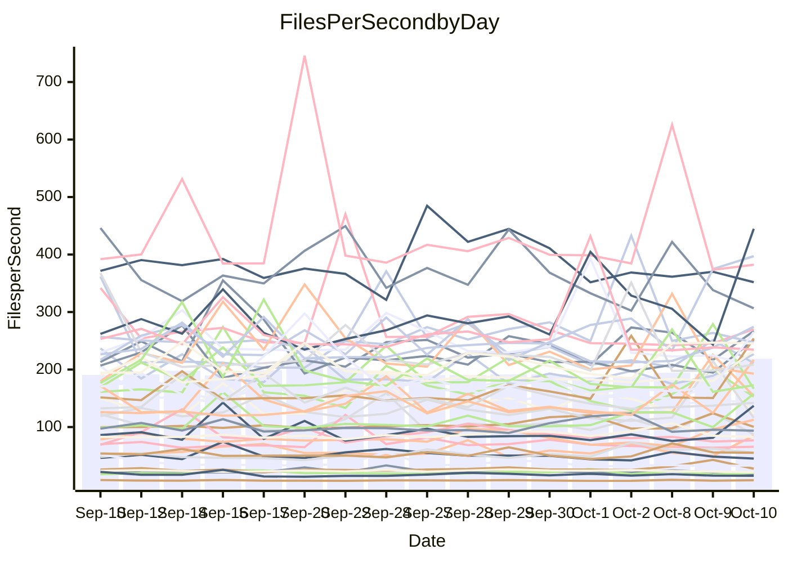

<!---
# This file is auto-generated. Do not edit.
# cspell:disable
--->
# Performance Report

Daily Performance

```mermaid
xychart-beta
    title Files Per Second by Day
    y-axis Files per Second
    x-axis Date [Sep-10, Sep-12, Sep-14, Sep-16, Sep-17, Sep-20, Sep-22, Sep-24, Sep-27, Sep-28, Sep-29, Sep-30, Oct-1, Oct-2, Oct-8, Oct-9, Oct-10]
    bar [190.61, 191.83, 197.87, 189.83, 198.93, 223.14, 203.41, 191.85, 190.34, 190.33, 191.42, 191.65, 187.17, 187.29, 194.39, 192.05, 218.83]
    line [24.50, 21.07, 20.76, 21.20, 21.42, 29.89, 21.10, 33.29, 22.21, 22.99, 25.81, 22.79, 21.40, 20.78, 24.57, 21.27, 19.07]
    line [53.43, 54.08, 56.65, 66.08, 70.58, 54.86, 55.17, 51.26, 53.54, 77.09, 47.84, 59.17, 54.01, 70.63, 55.18, 49.90, 84.72]
    line [122.20, 102.97, 97.36, 113.44, 95.42, 93.37, 113.84, 158.94, 91.50, 106.48, 102.03, 106.46, 94.98, 113.77, 93.63, 125.18, 87.00]
    line [161.06, 165.68, 159.91, 274.11, 160.48, 154.49, 133.29, 206.55, 172.23, 156.59, 180.95, 179.76, 145.22, 129.53, 157.39, 199.58, 152.82]
    line [99.87, 99.90, 101.98, 98.46, 103.01, 98.38, 99.03, 101.47, 103.27, 100.93, 105.22, 117.10, 120.39, 97.23, 97.90, 123.96, 100.36]
    line [236.79, 184.39, 226.41, 183.84, 178.08, 240.62, 182.34, 183.11, 178.48, 227.71, 175.37, 193.07, 180.70, 197.68, 174.97, 189.16, 226.87]
    line [70.06, 74.08, 63.80, 67.85, 68.28, 64.95, 121.18, 70.33, 81.37, 68.55, 70.46, 78.07, 69.43, 66.84, 65.37, 64.09, 65.74]
    line [46.33, 51.70, 44.11, 74.38, 48.80, 46.22, 56.03, 61.86, 55.07, 50.38, 50.26, 50.11, 43.90, 42.10, 56.81, 48.66, 45.19]
    line [150.41, 127.69, 119.42, 176.53, 123.45, 123.33, 163.66, 174.86, 123.76, 140.60, 149.87, 128.75, 160.37, 148.80, 127.97, 206.50, 122.84]
    line [206.25, 150.67, 151.50, 140.12, 185.15, 139.87, 144.59, 151.47, 163.76, 164.48, 145.07, 153.00, 154.07, 155.61, 136.07, 148.26, 141.19]
    line [213.19, 249.06, 214.17, 355.08, 286.90, 193.09, 220.97, 216.09, 223.67, 208.59, 258.02, 244.00, 208.42, 273.15, 264.14, 216.71, 266.75]
    line [78.42, 89.26, 79.87, 74.03, 79.32, 76.57, 77.71, 78.68, 74.59, 96.62, 94.86, 81.46, 69.18, 73.06, 66.65, 96.25, 112.51]
    line [119.12, 133.12, 118.61, 125.51, 156.41, 126.36, 117.29, 122.97, 147.55, 130.31, 120.84, 131.56, 115.38, 110.82, 116.53, 214.42, 116.00]
    line [17.95, 19.65, 18.79, 24.79, 24.63, 19.73, 20.13, 19.16, 18.74, 19.48, 22.38, 21.10, 27.10, 18.00, 23.58, 17.31, 20.37]
    line [26.09, 28.54, 23.63, 25.87, 21.39, 25.97, 25.29, 24.28, 26.03, 27.14, 29.89, 26.22, 25.83, 25.33, 31.76, 42.94, 27.61]
    line [361.86, 212.41, 213.84, 211.89, 203.30, 203.26, 249.81, 370.77, 255.08, 280.21, 227.10, 239.56, 208.40, 216.14, 204.22, 251.15, 211.26]
    line [69.10, 91.26, 130.94, 82.16, 79.40, 98.84, 72.96, 83.85, 90.86, 105.55, 94.80, 87.05, 82.35, 80.71, 82.95, 74.90, 76.80]
    line [86.08, 90.96, 77.91, 142.49, 79.52, 110.64, 76.31, 85.79, 97.01, 82.92, 84.16, 84.72, 77.34, 87.34, 75.86, 81.29, 136.91]
    line [23.91, 25.15, 23.74, 22.20, 23.03, 24.38, 22.79, 25.90, 22.55, 24.52, 26.32, 24.36, 24.04, 25.09, 23.35, 22.45, 21.51]
    line [162.53, 193.68, 156.67, 149.67, 167.24, 171.44, 166.11, 165.94, 180.17, 169.69, 179.61, 173.13, 150.88, 153.50, 149.45, 170.98, 162.38]
    line [206.81, 229.76, 276.88, 185.15, 203.08, 216.06, 205.09, 247.61, 251.50, 220.80, 227.59, 212.73, 213.55, 197.04, 208.25, 194.51, 251.63]
    line [125.97, 124.19, 127.77, 210.87, 148.03, 126.65, 140.55, 188.49, 125.20, 157.87, 127.91, 135.21, 124.24, 125.20, 125.79, 225.70, 154.24]
    line [48.10, 54.31, 47.78, 46.42, 45.99, 42.51, 50.42, 46.36, 61.34, 51.99, 46.51, 53.11, 48.59, 73.40, 59.94, 62.62, 55.56]
    line [98.76, 103.06, 96.78, 160.57, 101.71, 98.32, 105.51, 103.82, 101.18, 119.72, 101.30, 101.24, 103.40, 125.70, 125.48, 99.76, 158.05]
    line [151.54, 146.78, 197.07, 148.01, 150.26, 150.22, 155.16, 146.16, 150.57, 146.25, 172.87, 161.95, 149.25, 258.77, 151.43, 150.43, 254.02]
    line [256.96, 250.64, 247.49, 246.97, 251.50, 236.84, 249.23, 243.91, 273.74, 252.33, 270.33, 282.14, 249.68, 432.83, 249.77, 263.65, 247.10]
    line [341.82, 253.99, 265.83, 272.53, 247.23, 246.03, 470.19, 256.56, 257.27, 291.74, 296.65, 268.66, 245.94, 244.92, 242.23, 245.65, 270.12]
    line [371.64, 390.41, 381.43, 392.33, 359.21, 375.60, 366.33, 321.23, 484.87, 422.08, 444.64, 410.96, 351.78, 368.84, 361.47, 370.09, 351.86]
    line [82.91, 82.03, 82.90, 86.51, 81.41, 84.89, 78.73, 86.02, 82.17, 86.87, 92.07, 92.00, 84.24, 92.67, 106.68, 84.76, 82.82]
    line [229.46, 255.09, 303.17, 236.15, 234.71, 233.17, 234.84, 298.34, 266.72, 232.18, 229.70, 240.06, 392.72, 229.48, 222.78, 224.66, 204.36]
    line [446.16, 355.63, 318.90, 363.44, 349.72, 406.48, 449.44, 342.12, 376.67, 347.31, 443.48, 368.45, 332.70, 302.48, 422.03, 338.21, 306.48]
    line [179.78, 228.82, 211.67, 318.15, 234.86, 348.02, 254.54, 210.42, 205.10, 287.53, 207.85, 231.21, 200.22, 207.10, 331.74, 203.63, 192.81]
    line [132.44, 134.89, 191.12, 144.91, 193.30, 142.56, 168.42, 145.10, 149.37, 134.63, 171.73, 154.69, 140.49, 131.94, 134.65, 137.28, 142.04]
    line [169.33, 212.19, 179.89, 238.35, 171.61, 172.61, 177.91, 241.32, 177.39, 178.05, 221.01, 182.74, 163.48, 169.32, 168.97, 278.92, 166.54]
    line [7.87, 6.93, 6.69, 7.98, 6.67, 6.83, 6.48, 7.18, 7.27, 6.94, 7.83, 6.98, 6.40, 6.43, 8.18, 6.76, 7.44]
    line [216.89, 259.14, 277.45, 226.45, 225.10, 268.40, 226.40, 290.41, 225.84, 287.60, 216.33, 247.70, 277.53, 288.63, 233.16, 374.71, 397.16]
    line [392.00, 400.11, 531.12, 384.37, 384.60, 745.85, 398.12, 385.90, 416.89, 405.74, 428.96, 399.50, 398.65, 384.43, 625.58, 373.38, 382.28]
    line [261.93, 287.76, 262.40, 339.51, 263.75, 234.66, 253.01, 268.39, 293.97, 280.40, 292.26, 260.88, 404.51, 328.53, 305.64, 243.36, 444.70]
    line [190.13, 221.56, 177.63, 183.43, 188.58, 244.43, 196.97, 192.51, 179.82, 187.80, 186.23, 183.20, 182.62, 177.99, 183.70, 179.89, 233.14]
    line [52.27, 41.14, 33.93, 34.79, 33.36, 33.83, 35.26, 55.80, 33.99, 34.03, 41.23, 40.49, 30.44, 33.53, 33.57, 32.29, 33.27]
    line [97.23, 107.06, 93.89, 113.70, 92.25, 94.28, 98.57, 98.01, 93.82, 94.62, 89.71, 106.79, 118.50, 123.61, 91.76, 95.32, 93.61]
    line [171.63, 125.66, 126.89, 119.89, 121.04, 127.46, 154.00, 162.49, 123.69, 144.71, 125.72, 134.25, 127.46, 121.17, 173.95, 124.58, 216.72]
    line [367.52, 230.07, 204.55, 207.72, 211.00, 215.66, 277.45, 216.60, 208.75, 228.82, 225.46, 221.92, 198.17, 351.24, 197.76, 198.13, 208.30]
    line [176.65, 217.04, 317.36, 187.32, 321.78, 198.42, 179.83, 171.82, 219.08, 181.95, 180.26, 215.27, 175.03, 168.70, 269.72, 161.18, 172.81]
    line [53.96, 52.43, 61.82, 49.92, 50.20, 50.36, 50.54, 47.43, 56.40, 49.96, 64.67, 50.46, 44.40, 48.96, 71.61, 56.00, 55.29]
    line [226.37, 235.76, 281.57, 222.43, 291.44, 219.17, 221.75, 221.55, 237.73, 242.39, 246.40, 245.33, 214.25, 212.38, 215.08, 238.25, 274.47]
    line [253.18, 270.83, 243.92, 325.88, 260.22, 243.99, 243.96, 239.11, 261.23, 266.19, 247.38, 252.69, 432.16, 234.56, 233.40, 238.56, 234.64]
    line [21.93, 17.01, 17.04, 25.59, 14.10, 13.68, 15.06, 15.07, 17.30, 20.40, 18.84, 16.01, 18.80, 15.62, 18.14, 15.49, 15.23]
    line [194.56, 194.84, 248.77, 196.63, 194.10, 246.18, 197.54, 195.96, 190.07, 228.82, 222.46, 205.73, 192.21, 184.58, 245.51, 246.82, 245.36]
    line [170.36, 179.54, 171.09, 160.76, 222.99, 297.37, 220.86, 165.88, 186.63, 165.05, 169.83, 183.91, 159.55, 166.58, 162.12, 169.35, 265.31]
```

Time to Process Files

| Repository                                      | Elapsed | Min/Avg/Max          |    SD | SD Graph                |
| ----------------------------------------------- | ------: | :------------------: | ----: | ----------------------- |
| AdaDoom3/AdaDoom3                    |    3.10 | 1.7 /   2.8 /   3.4  |  0.49 | `    ┣━━┻━━╋━●┻━━┫    ` |
| alexiosc/megistos                    |    7.59 | 3.9 /   6.7 /   8.4  |  1.00 | `    ┣━━┻━━╋━━●━━┫    ` |
| apollographql/apollo-server          |    2.55 | 1.4 /   2.4 /   3.1  |  0.32 | `    ┣━━┻━━╋●━┻━━┫    ` |
| aspnetboilerplate/aspnetboilerplate  |    8.48 | 4.9 /   8.6 /   9.8  |  1.16 | `    ┣━━┻━━●━━┻━━┫    ` |
| aws-amplify/docs                     |    7.68 | 7.4 /  12.4 /  14.6  |  1.90 | `  ● ┣━━┻━━╋━━┻━━┫    ` |
| Azure/azure-rest-api-specs           |   11.09 | 6.0 /  10.1 /  11.6  |  1.31 | `    ┣━━┻━━╋━●┻━━┫    ` |
| bitjson/typescript-starter           |    0.98 | 0.7 /   1.0 /   1.2  |  0.13 | `     ┣━┻━━●━━┻━┫     ` |
| caddyserver/caddy                    |    4.25 | 2.2 /   3.4 /   4.1  |  0.47 | `    ┣━━┻━━╋━━┻━●┫    ` |
| canada-ca/open-source-logiciel-libre |    0.94 | 0.7 /   1.0 /   1.2  |  0.11 | `     ┣━┻━●╋━━┻━┫     ` |
| chef/chef                            |    4.12 | 3.6 /   4.8 /   5.6  |  0.51 | `    ┣━●┻━━╋━━┻━━┫    ` |
| dart-lang/sdk                        |   47.94 | 39.3 /  57.1 /  65.4 |  6.29 | `  ┣━━●┻━━━╋━━━┻━━━┫  ` |
| django/django                        |   14.09 | 8.0 /  13.2 /  14.8  |  1.85 | `    ┣━━┻━━╋━●┻━━┫    ` |
| eslint/eslint                        |   10.82 | 5.5 /   9.2 /  11.6  |  1.58 | `    ┣━━┻━━╋━━●━━┫    ` |
| exonum/exonum                        |    3.63 | 2.0 /   3.3 /   3.8  |  0.43 | `    ┣━━┻━━╋━●┻━━┫    ` |
| flutter/samples                      |   11.99 | 8.0 /  11.6 /  14.9  |  1.65 | `    ┣━━┻━━╋●━┻━━┫    ` |
| gitbucket/gitbucket                  |    2.76 | 1.9 /   3.1 /   3.8  |  0.46 | `    ┣━━┻●━╋━━┻━━┫    ` |
| googleapis/google-cloud-cpp          |   83.16 | 74.1 / 124.0 / 144.1 | 16.34 | `● ┣━━━┻━━━╋━━━┻━━━┫  ` |
| graphql/express-graphql              |    1.21 | 0.8 /   1.1 /   1.3  |  0.11 | `     ┣━┻━━╋━━●━┫     ` |
| graphql/graphql-js                   |    2.17 | 2.1 /   3.5 /   3.9  |  0.37 | `●   ┣━━┻━━╋━━┻━━┫    ` |
| graphql/graphql-relay-js             |    1.01 | 0.7 /   1.1 /   1.3  |  0.15 | `     ┣━┻━●╋━━┻━┫     ` |
| graphql/graphql-spec                 |    1.25 | 0.7 /   1.1 /   1.4  |  0.19 | `     ┣━┻━━╋●━┻━┫     ` |
| iluwatar/java-design-patterns        |   13.44 | 7.0 /  11.9 /  14.4  |  1.81 | `    ┣━━┻━━╋━━●━━┫    ` |
| ktaranov/sqlserver-kit               |    3.58 | 3.4 /   5.7 /   6.5  |  0.73 | ` ●  ┣━━┻━━╋━━┻━━┫    ` |
| liriliri/licia                       |    4.10 | 2.4 /   3.7 /   4.5  |  0.53 | `    ┣━━┻━━╋━●┻━━┫    ` |
| MartinThoma/LaTeX-examples           |    5.15 | 4.8 /   6.0 /   6.7  |  0.68 | `    ┣━●┻━━╋━━┻━━┫    ` |
| mdx-js/mdx                           |    1.24 | 1.0 /   1.7 /   2.1  |  0.25 | `     ●━┻━━╋━━┻━┫     ` |
| microsoft/TypeScript-Website         |    5.42 | 3.7 /   5.0 /   5.7  |  0.51 | `    ┣━━┻━━╋━●┻━━┫    ` |
| MicrosoftDocs/PowerShell-Docs        |   14.43 | 15.5 /  23.9 /  29.6 |  3.06 | `●  ┣━━━┻━━╋━━┻━━━┫   ` |
| neovim/nvim-lspconfig                |    5.43 | 3.1 /   5.2 /   5.9  |  0.70 | `    ┣━━┻━━╋●━┻━━┫    ` |
| pagekit/pagekit                      |    2.78 | 1.9 /   3.2 /   3.8  |  0.54 | `    ┣━━┻●━╋━━┻━━┫    ` |
| php/php-src                          |   25.54 | 15.3 /  23.9 /  29.3 |  2.95 | `   ┣━━━┻━━╋━●┻━━━┫   ` |
| plasticrake/tplink-smarthome-api     |    1.12 | 0.7 /   1.2 /   1.5  |  0.18 | `     ┣━┻━●╋━━┻━┫     ` |
| prettier/prettier                    |    8.92 | 4.4 /   7.5 /   9.0  |  1.03 | `    ┣━━┻━━╋━━┻●━┫    ` |
| pycontribs/jira                      |    0.94 | 0.8 /   1.4 /   1.8  |  0.21 | `    ●┣━┻━━╋━━┻━┫     ` |
| RustPython/RustPython                |   11.85 | 7.0 /  11.1 /  12.4  |  1.08 | `    ┣━━┻━━╋━●┻━━┫    ` |
| shoelace-style/shoelace              |    2.88 | 1.6 /   2.6 /   3.4  |  0.42 | `    ┣━━┻━━╋━●┻━━┫    ` |
| slint-ui/slint                       |   21.58 | 11.0 /  17.4 /  20.4 |  2.32 | `   ┣━━━┻━━╋━━┻━━●┫   ` |
| SoftwareBrothers/admin-bro           |    1.94 | 1.6 /   2.3 /   2.8  |  0.28 | `     ┣●┻━━╋━━┻━┫     ` |
| sveltejs/svelte                      |   23.86 | 12.2 /  22.2 /  26.2 |  2.90 | `   ┣━━━┻━━╋━●┻━━━┫   ` |
| TheAlgorithms/Python                 |    6.62 | 3.8 /   6.0 /   7.2  |  0.72 | `    ┣━━┻━━╋━━●━━┫    ` |
| twbs/bootstrap                       |    1.79 | 1.0 /   1.6 /   2.0  |  0.25 | `     ┣━┻━━╋━●┻━┫     ` |
| typescript-cheatsheets/react         |    1.26 | 0.7 /   1.1 /   1.2  |  0.15 | `     ┣━┻━━╋━━●━┫     ` |
| typescript-eslint/typescript-eslint  |    4.18 | 2.4 /   3.8 /   4.5  |  0.64 | `    ┣━━┻━━╋━●┻━━┫    ` |
| vitest-dev/vitest                    |    6.37 | 7.0 /  10.3 /  12.3  |  1.30 | ` ●  ┣━━┻━━╋━━┻━━┫    ` |
| w3c/aria-practices                   |    3.39 | 2.0 /   3.1 /   3.5  |  0.42 | `    ┣━━┻━━╋━●┻━━┫    ` |
| w3c/specberus                        |    1.20 | 1.2 /   1.8 /   2.2  |  0.21 | `  ●  ┣━┻━━╋━━┻━┫     ` |
| webdeveric/webpack-assets-manifest   |    1.22 | 0.7 /   1.1 /   1.3  |  0.14 | `     ┣━┻━━╋━●┻━┫     ` |
| webpack/webpack                      |    8.67 | 4.4 /   7.3 /   9.3  |  1.36 | `    ┣━━┻━━╋━━●━━┫    ` |
| wireapp/wire-desktop                 |    1.30 | 0.9 /   1.4 /   1.6  |  0.16 | `     ┣━┻━●╋━━┻━┫     ` |
| wireapp/wire-webapp                  |   11.72 | 7.5 /  14.2 /  16.2  |  1.49 | `    ┣●━┻━━╋━━┻━━┫    ` |

Note:
- Elapsed time is in seconds.

Files per Second over Time

| Repository                                      | Files |   Sec |    Fps |     Rel | Trend Fps              |    N |
| ----------------------------------------------- | ----: | ----: | -----: | ------: | ---------------------- | ---: |
| AdaDoom3/AdaDoom3                    |   103 |  3.10 |  33.27 | -13.93% | `▂▂▂▂▂▂▂▅▄▆▂▂██▂▁▂▂▂▂` |   38 |
| alexiosc/megistos                    |   583 |  7.59 |  76.80 | -14.20% | `▅█▃▇▄▄▃▇▄▃▂▄▅▄▇▄▃▄▂▃` |   39 |
| apollographql/apollo-server          |   256 |  2.55 | 100.36 |  -6.62% | `▄▂▅▃▂▇▁█▂▃▂▃▂▅▄▄▂▂▄▂` |   39 |
| aspnetboilerplate/aspnetboilerplate  |  2292 |  8.48 | 270.12 |  -0.92% | `▂▂▂▂▂▂█▂▂▁▅▂▂▂▂▂▂▂▂▃` |   39 |
| aws-amplify/docs                     |  3049 |  7.68 | 397.16 |  56.85% | `▁▂▁▂█▂▃▁▂▃▂▂▄▂▂▄▄▂▇█` |   38 |
| Azure/azure-rest-api-specs           |  2603 | 11.09 | 234.64 | -10.14% | `▂▂▂█▂▂▂▂▂▂▂▂▁▂▁█▂▂▂▂` |   39 |
| bitjson/typescript-starter           |    20 |  0.98 |  20.37 |  -1.35% | `▆▃▃█▄▄▃▂█▃▆▆▃▃▃█▂▆▂▄` |   39 |
| caddyserver/caddy                    |   370 |  4.25 |  87.00 | -17.73% | `▃▃▃█▅▃▃▂▇▂▄▅▆▂▆▃▅▃▇▂` |   39 |
| canada-ca/open-source-logiciel-libre |     7 |  0.94 |   7.44 |   5.20% | `▂█▅▂▄▂▃▂▁▄▂▂▂▃▂▂▂▅▃▃` |   39 |
| chef/chef                            |  1037 |  4.12 | 251.63 |  14.14% | `▃▄▃▅▅▃▃█▅▇▄▄▄▄▄▅▃▄▃█` |   39 |
| dart-lang/sdk                        | 11763 | 47.94 | 245.36 |  17.99% | `▇▆▃▃▃▆▃▂▃▃█▇▃▃▆▃▂▇▇▇` |   39 |
| django/django                        |  2935 | 14.09 | 208.30 |  -8.71% | `▂▄▂▃▂█▂▂▂▂▄▂▂▂▂▁█▁▁▂` |   38 |
| eslint/eslint                        |  2087 | 10.82 | 192.81 | -18.09% | `▂▃▅▃▆▄▂█▅▂▂▁▂▂▂▂▂█▂▂` |   39 |
| exonum/exonum                        |   421 |  3.63 | 116.00 | -12.13% | `▂▂▂▄▂▂▁▂▄▂▂▇▂▂▂▂▁▂█▂` |   39 |
| flutter/samples                      |  1703 | 11.99 | 142.04 |  -5.30% | `█▃▃▆▄▅▃▁▃▃▆▆▆▃▄▃▃▃▃▃` |   39 |
| gitbucket/gitbucket                  |   425 |  2.76 | 154.24 |  11.29% | `▂▂▂▄▅▂▂▄▂▂▄▂▁▂▂▂▂▂█▄` |   39 |
| googleapis/google-cloud-cpp          | 22062 | 83.16 | 265.31 |  45.74% | `▂▂▂▂▂▂▄▂▂▄▂▁▂█▂▂▂▂▂▇` |   39 |
| graphql/express-graphql              |    26 |  1.21 |  21.51 | -11.58% | `▃▇▂▂▃█▆▃▄▃▃▃▃▂▃▃▄▃▂▂` |   39 |
| graphql/graphql-js                   |   551 |  2.17 | 254.02 |  59.70% | `▅▁▂▃▂▃▂▄▂▂▂▂▂▅▂▂█▂▂█` |   39 |
| graphql/graphql-relay-js             |    28 |  1.01 |  27.61 |   1.63% | `▇▂▅▃▅▂▂▃▂▃▂▂▃▂▂▃▂▅█▃` |   39 |
| graphql/graphql-spec                 |    19 |  1.25 |  15.23 | -11.39% | `▇▅█▃▃▃▃▃▆▃▃▃▆▂▂▆▃▆▃▃` |   39 |
| iluwatar/java-design-patterns        |  2239 | 13.44 | 166.54 | -13.51% | `▃▆▁▃▁▂▇▂▃▂▅▅▂▂▂▂▂▂█▂` |   39 |
| ktaranov/sqlserver-kit               |   490 |  3.58 | 136.91 |  56.13% | `▂▃▁▅▂▂▅▂▂▁▂▂▂▂▂▂▃▁▂█` |   39 |
| liriliri/licia                       |  1442 |  4.10 | 351.86 | -12.93% | `▃▃▃▃▂▂▂▂▃▃▂▁█▆█▂▂▂▂▂` |   39 |
| MartinThoma/LaTeX-examples           |  1414 |  5.15 | 274.47 |  14.51% | `▃▄▇▇▃▃▂▂▃▂▃█▆██▂▂▃▄▇` |   39 |
| mdx-js/mdx                           |   139 |  1.24 | 112.51 |  35.33% | `▇▇▂▄▂▃▅█▃▃▃▇▃▃▂▂▂▁▆█` |   39 |
| microsoft/TypeScript-Website         |   765 |  5.42 | 141.19 |  -8.62% | `▅▃▄█▇▂▃▄▄▇█▃▄▃▃▅▅▂▄▃` |   39 |
| MicrosoftDocs/PowerShell-Docs        |  3127 | 14.43 | 216.72 |  62.16% | `▃▂▂▇▂▂▂▂▃▂▄▃▄▃▂▃▂▅▂█` |   39 |
| neovim/nvim-lspconfig                |   881 |  5.43 | 162.38 |  -6.11% | `▂▄▂▂▅█▁▂▂▂▂▂▂▂▂▁▂▁▂▂` |   38 |
| pagekit/pagekit                      |   741 |  2.78 | 266.75 |  10.68% | `▇▂▂█▂▁▄▅▂▁▄▄▂▂▂▂▄▄▂▄` |   39 |
| php/php-src                          |  2391 | 25.54 |  93.61 |  -8.32% | `▁▂▂▃▄▂▅█▂▇▂▃▂▃▂▅▅▂▂▂` |   39 |
| plasticrake/tplink-smarthome-api     |    62 |  1.12 |  55.56 |   4.78% | `▂▂▆▇▂▂▃▄▂▂▃▇▂▂▆▃█▅▆▄` |   39 |
| prettier/prettier                    |  2735 |  8.92 | 306.48 | -17.55% | `▃█▂▂▂▇▂▂▂▂▂▄▂▄▂▂▁▄▂▁` |   39 |
| pycontribs/jira                      |    80 |  0.94 |  84.72 |  45.76% | `▁▃▃▃▂▂▃▂▃█▅▃▆▃▆▃▆▃▂█` |   39 |
| RustPython/RustPython                |   981 | 11.85 |  82.82 |  -5.65% | `▂▂▂▁▄▂█▂▃▅▃▂▂▂▂▂▃▅▂▂` |   39 |
| shoelace-style/shoelace              |   440 |  2.88 | 152.82 | -11.60% | `▃▆▂▆▃▂▂▄█▄▅▂▂▂▆▂▁▃▅▂` |   39 |
| slint-ui/slint                       |  4410 | 21.58 | 204.36 | -17.64% | `▂▂▂▂▂▂▃▄▁▂▂▁▂▆▂█▂▂▂▁` |   39 |
| SoftwareBrothers/admin-bro           |   441 |  1.94 | 226.87 |  17.43% | `▅▃▄▄▇▆▃█▃█▃▆▃▃▃▄▅▃▄▇` |   39 |
| sveltejs/svelte                      |  9120 | 23.86 | 382.28 |  -8.83% | `▂▂▂▂▂▂▂▄▂▂▂▅▃▂▂▃▂█▂▂` |   39 |
| TheAlgorithms/Python                 |  1636 |  6.62 | 247.10 |  -8.13% | `▂▂▄▄▇▄▂▂▂▄▅▁▂▂▂▂█▂▂▂` |   39 |
| twbs/bootstrap                       |   118 |  1.79 |  65.74 | -11.98% | `▃▂▁▃▂▄▃▅▂▆▂▅▄█▁▃▂▂▂▂` |   39 |
| typescript-cheatsheets/react         |    24 |  1.26 |  19.07 | -16.97% | `▂█▁▇▂▆▃▂▂▂▂▅▁▂▁▂▂▄▂▁` |   39 |
| typescript-eslint/typescript-eslint  |   884 |  4.18 | 211.26 | -12.07% | `▂▅▆▆▃▄▂█▂▂▄▅▅▂▂▂▃▂▄▂` |   39 |
| vitest-dev/vitest                    |  2834 |  6.37 | 444.70 |  59.35% | `▂▂▅▂▂▂▄▂▁▂▂▂▂▂▂▇▄▄▂█` |   39 |
| w3c/aria-practices                   |   417 |  3.39 | 122.84 | -10.58% | `▂▂▂▂▁▂▂▂▂▂▅▂▂▂▂▅▄▂█▂` |   39 |
| w3c/specberus                        |   190 |  1.20 | 158.05 |  49.58% | `▃▃▃▂▃▃▃▃▂▄▃▁▅▂▂▃▅▅▃█` |   39 |
| webdeveric/webpack-assets-manifest   |    55 |  1.22 |  45.19 | -11.84% | `▃▃▂▅▂▃▂▃▅▂█▃▂▂▂▂▁▅▃▂` |   38 |
| webpack/webpack                      |  1499 |  8.67 | 172.81 | -17.53% | `▂▂▂▂▇▇█▂▂▇▂▅▂▂▂▂▂▇▁▂` |   39 |
| wireapp/wire-desktop                 |    72 |  1.30 |  55.29 |   4.23% | `█▅▃▂▃▂▂▂▂▂▂▂▂▂▅▁▂▇▄▃` |   39 |
| wireapp/wire-webapp                  |  2732 | 11.72 | 233.14 |  21.71% | `▄▄▄▅▃▃▃▄▄▃▄▃▄▃▄▄▃▄▃█` |   39 |

Data Throughput

| Repository                                      | Files |   Sec |     Kps |     Rel | Trend Kps              |    N |
| ----------------------------------------------- | ----: | ----: | ------: | ------: | ---------------------- | ---: |
| AdaDoom3/AdaDoom3                    |   103 |  3.10 |  707.12 | -13.93% | `▂▂▂▂▂▂▂▅▄▆▂▂██▂▁▂▂▂▂` |   38 |
| alexiosc/megistos                    |   583 |  7.59 |  603.50 | -14.20% | `▅█▃▇▄▄▃▇▄▃▂▄▅▄▇▄▃▄▂▃` |   39 |
| apollographql/apollo-server          |   256 |  2.55 |  828.73 |  -6.55% | `▄▂▅▃▂▇▁█▂▃▂▃▂▅▄▄▂▂▄▂` |   39 |
| aspnetboilerplate/aspnetboilerplate  |  2292 |  8.48 |  662.11 |  -0.83% | `▂▂▂▂▂▂█▂▂▁▅▂▂▂▂▂▂▂▂▃` |   39 |
| aws-amplify/docs                     |  3049 |  7.68 | 1561.68 |  57.20% | `▁▂▁▂█▂▃▁▂▃▂▂▄▂▂▄▄▂▇█` |   38 |
| Azure/azure-rest-api-specs           |  2603 | 11.09 |  717.80 | -10.71% | `▂▂▂█▂▂▂▂▂▂▂▂▁▂▁█▂▂▂▂` |   39 |
| bitjson/typescript-starter           |    20 |  0.98 |   81.46 |  -1.35% | `▆▃▃█▄▄▃▂█▃▆▆▃▃▃█▂▆▂▄` |   39 |
| caddyserver/caddy                    |   370 |  4.25 |  801.58 | -16.11% | `▃▃▃█▅▃▃▂▇▂▄▅▆▂▆▃▅▃▇▂` |   39 |
| canada-ca/open-source-logiciel-libre |     7 |  0.94 |   61.69 |   5.20% | `▂█▅▂▄▂▃▂▁▄▂▂▂▃▂▂▂▅▃▃` |   39 |
| chef/chef                            |  1037 |  4.12 | 1237.29 |  14.18% | `▃▄▃▅▅▃▃█▅▇▄▄▄▄▄▅▃▄▃█` |   39 |
| dart-lang/sdk                        | 11763 | 47.94 | 1716.81 |  18.05% | `▇▆▃▃▃▆▃▂▃▃█▇▃▃▆▃▂▇▇▇` |   39 |
| django/django                        |  2935 | 14.09 | 1346.68 |  -8.61% | `▂▄▂▃▂█▂▂▂▂▄▂▂▂▂▁█▁▁▂` |   38 |
| eslint/eslint                        |  2087 | 10.82 | 1363.07 | -17.95% | `▂▃▅▃▆▄▂█▅▂▂▁▂▂▂▂▂█▂▂` |   39 |
| exonum/exonum                        |   421 |  3.63 | 1109.53 | -12.13% | `▂▂▂▄▂▂▁▂▄▂▂▇▂▂▂▂▁▂█▂` |   39 |
| flutter/samples                      |  1703 | 11.99 |  846.63 |  -5.30% | `█▃▃▆▄▅▃▁▃▃▆▆▆▃▄▃▃▃▃▃` |   39 |
| gitbucket/gitbucket                  |   425 |  2.76 |  755.97 |  10.75% | `▂▂▂▄▅▂▂▄▂▂▄▂▁▂▂▂▂▂█▄` |   39 |
| googleapis/google-cloud-cpp          | 22062 | 83.16 | 2317.14 |  45.94% | `▂▂▂▂▂▂▄▂▂▄▂▁▂█▂▂▂▂▂▇` |   39 |
| graphql/express-graphql              |    26 |  1.21 |   98.44 | -11.58% | `▃▇▂▂▃█▆▃▄▃▃▃▃▂▃▃▄▃▂▂` |   39 |
| graphql/graphql-js                   |   551 |  2.17 | 1894.28 |  59.68% | `▅▁▂▃▂▃▂▄▂▂▂▂▂▅▂▂█▂▂█` |   39 |
| graphql/graphql-relay-js             |    28 |  1.01 |  108.48 |   1.63% | `▇▂▅▃▅▂▂▃▂▃▂▂▃▂▂▃▂▅█▃` |   39 |
| graphql/graphql-spec                 |    19 |  1.25 |  512.27 | -11.27% | `▇▅█▃▃▃▃▃▆▃▃▃▆▃▂▆▃▆▃▃` |   39 |
| iluwatar/java-design-patterns        |  2239 | 13.44 |  516.74 | -13.38% | `▃▆▁▃▁▂▇▂▃▂▅▅▂▂▂▂▂▂█▂` |   39 |
| ktaranov/sqlserver-kit               |   490 |  3.58 | 2074.08 |  56.13% | `▂▃▁▅▂▂▅▂▂▁▂▂▂▂▂▂▃▁▂█` |   39 |
| liriliri/licia                       |  1442 |  4.10 |  421.89 | -12.93% | `▃▃▃▃▂▂▂▂▃▃▂▁█▆█▂▂▂▂▂` |   39 |
| MartinThoma/LaTeX-examples           |  1414 |  5.15 |  570.29 |  14.71% | `▃▄▇▇▃▃▂▂▃▂▃█▆██▂▂▃▄▇` |   39 |
| mdx-js/mdx                           |   139 |  1.24 |  530.18 |  35.33% | `▇▇▂▄▂▃▅█▃▃▃▇▃▃▂▂▂▁▆█` |   39 |
| microsoft/TypeScript-Website         |   765 |  5.42 |  973.78 |  -8.60% | `▅▃▄█▇▂▃▄▄▇█▃▄▃▃▅▅▂▄▃` |   39 |
| MicrosoftDocs/PowerShell-Docs        |  3127 | 14.43 | 2316.04 |  62.16% | `▃▂▂▇▂▂▂▂▃▂▄▃▄▃▂▃▂▅▂█` |   39 |
| neovim/nvim-lspconfig                |   881 |  5.43 |  505.56 |  -1.13% | `▂▄▂▂▅█▁▂▂▂▂▂▂▂▂▁▂▂▃▂` |   38 |
| pagekit/pagekit                      |   741 |  2.78 |  556.18 |  10.68% | `▇▂▂█▂▁▄▅▂▁▄▄▂▂▂▂▄▄▂▄` |   39 |
| php/php-src                          |  2391 | 25.54 | 1665.55 |  -8.01% | `▁▂▂▃▄▂▅█▂▇▂▃▂▃▂▅▅▂▃▂` |   39 |
| plasticrake/tplink-smarthome-api     |    62 |  1.12 |  300.21 |   4.78% | `▂▂▆▇▂▂▃▄▂▂▃▇▂▂▆▃█▅▆▄` |   39 |
| prettier/prettier                    |  2735 |  8.92 |  430.64 | -17.80% | `▃█▂▂▂▇▂▂▂▂▂▄▂▄▂▂▁▄▂▁` |   39 |
| pycontribs/jira                      |    80 |  0.94 |  598.35 |  45.76% | `▁▃▃▃▂▂▃▂▃█▅▃▆▃▆▃▆▃▂█` |   39 |
| RustPython/RustPython                |   981 | 11.85 | 2468.00 |   3.16% | `▃▃▃▂▅▃█▃▄▅▃▃▂▃▃▃▄▅▃▃` |   39 |
| shoelace-style/shoelace              |   440 |  2.88 |  738.03 | -11.60% | `▃▆▂▆▃▂▂▄█▄▅▂▂▂▆▂▁▃▅▂` |   39 |
| slint-ui/slint                       |  4410 | 21.58 | 1192.03 | -16.26% | `▂▂▂▂▂▂▃▄▁▂▂▁▂▆▂█▂▂▂▁` |   39 |
| SoftwareBrothers/admin-bro           |   441 |  1.94 |  500.03 |  17.43% | `▅▃▄▄▇▆▃█▃█▃▆▃▃▃▄▅▃▄▇` |   39 |
| sveltejs/svelte                      |  9120 | 23.86 |  264.16 |  -8.85% | `▂▂▂▂▂▂▂▄▂▂▂▅▃▂▂▃▂█▂▂` |   39 |
| TheAlgorithms/Python                 |  1636 |  6.62 |  706.41 |  -5.96% | `▂▂▄▄▇▄▂▂▂▄▅▁▂▂▂▂█▂▃▂` |   39 |
| twbs/bootstrap                       |   118 |  1.79 |  539.84 | -11.98% | `▃▂▁▃▂▄▃▅▂▆▂▅▄█▁▃▂▂▂▂` |   39 |
| typescript-cheatsheets/react         |    24 |  1.26 |  172.47 | -16.97% | `▂█▁▇▂▆▃▂▂▂▂▅▁▂▁▂▂▄▂▁` |   39 |
| typescript-eslint/typescript-eslint  |   884 |  4.18 |  718.15 | -11.38% | `▂▅▆▆▃▄▂█▂▂▄▅▅▂▂▂▃▂▄▂` |   39 |
| vitest-dev/vitest                    |  2834 |  6.37 | 1316.52 |  61.67% | `▂▂▅▂▂▂▄▂▁▂▁▂▂▂▂▇▄▄▂█` |   39 |
| w3c/aria-practices                   |   417 |  3.39 | 1156.56 | -10.50% | `▂▂▂▂▁▂▂▂▂▂▅▂▂▂▂▅▄▂█▂` |   39 |
| w3c/specberus                        |   190 |  1.20 |  517.41 |  49.58% | `▃▃▃▂▃▃▃▃▂▄▃▁▅▂▂▃▅▅▃█` |   39 |
| webdeveric/webpack-assets-manifest   |    55 |  1.22 |  104.34 | -11.84% | `▃▃▂▅▂▃▂▃▅▂█▃▂▂▂▂▁▅▃▂` |   38 |
| webpack/webpack                      |  1499 |  8.67 | 1441.95 |  -8.06% | `▂▂▂▂▇▇█▂▂▇▂▅▂▂▂▂▂█▂▃` |   39 |
| wireapp/wire-desktop                 |    72 |  1.30 |  231.91 |   5.91% | `█▅▃▂▃▂▂▂▂▂▂▂▂▂▅▁▂▇▄▄` |   39 |
| wireapp/wire-webapp                  |  2732 | 11.72 | 1071.40 |  25.90% | `▄▄▄▅▃▃▃▄▄▃▄▄▄▃▄▄▃▄▄█` |   39 |

