<!---
# This file is auto-generated. Do not edit.
# cspell:disable
--->
# Performance Report

## Daily Performance

```mermaid
xychart-beta
    title Files Per Second by Day
    y-axis Files per Second
    x-axis Date [Oct-5, Oct-6, Oct-7, Oct-8, Oct-11, Oct-12, Oct-13, Oct-14, Oct-16, Oct-17, Oct-18, Oct-21, Oct-22, Oct-23, Oct-26, Oct-27, Oct-28, Oct-30, Nov-2, Nov-3, Nov-4]
    bar [173.76, 175.18, 167.77, 172.56, 174.72, 174.80, 173.09, 173.37, 171.88, 174.30, 173.86, 172.74, 172.61, 171.88, 173.89, 170.56, 170.37, 173.88, 181.41, 181.83, 178.19]
    line [30.33, 30.00, 31.45, 30.76, 31.21, 29.46, 30.45, 30.91, 31.66, 29.92, 29.27, 30.95, 30.84, 29.94, 26.75, 31.16, 0.00, 30.03, 31.49, 27.98, 30.49]
    line [117.07, 113.67, 118.94, 116.57, 114.56, 116.10, 116.86, 116.83, 117.87, 118.37, 115.66, 119.79, 118.77, 110.34, 106.93, 114.25, 117.62, 116.69, 112.83, 118.13, 115.64]
    line [34.91, 35.03, 36.57, 35.78, 36.79, 36.72, 35.66, 36.75, 36.68, 36.03, 36.10, 36.43, 36.94, 36.71, 36.95, 35.92, 0.00, 36.38, 36.34, 35.21, 37.19]
    line [136.68, 137.77, 141.66, 138.90, 142.32, 142.51, 137.71, 135.01, 140.27, 135.89, 138.60, 124.39, 134.27, 131.42, 126.95, 139.16, 0.00, 136.48, 142.08, 141.79, 137.88]
    line [218.51, 213.71, 226.50, 211.28, 231.85, 230.37, 233.32, 218.23, 222.04, 221.33, 231.29, 252.64, 228.25, 218.34, 233.39, 233.79, 227.55, 225.16, 233.46, 237.64, 229.22]
    line [79.10, 80.49, 80.39, 81.56, 80.21, 80.63, 79.72, 79.95, 79.77, 80.38, 79.55, 82.21, 78.31, 78.28, 76.65, 81.85, 0.00, 79.53, 82.90, 85.80, 88.07]
    line [9.30, 8.76, 9.01, 8.84, 9.20, 8.48, 9.17, 9.48, 9.28, 9.10, 9.12, 8.95, 8.89, 8.49, 7.70, 9.21, 0.00, 8.54, 9.31, 9.31, 9.07]
    line [137.96, 132.77, 133.94, 139.73, 137.65, 140.36, 140.00, 123.61, 135.20, 129.27, 133.50, 139.86, 140.61, 126.03, 137.46, 131.41, 141.42, 135.85, 137.42, 138.47, 137.77]
    line [87.11, 90.10, 90.92, 89.47, 92.20, 91.07, 91.35, 87.96, 91.83, 91.01, 90.68, 93.39, 91.11, 88.57, 86.74, 88.89, 92.25, 89.49, 91.13, 92.48, 94.15]
    line [253.94, 247.24, 250.16, 247.84, 257.30, 241.45, 254.85, 253.81, 253.85, 248.10, 247.42, 238.80, 262.90, 249.00, 240.92, 252.96, 0.00, 236.88, 251.19, 246.42, 244.96]
    line [209.81, 203.73, 200.20, 213.26, 206.70, 211.33, 212.01, 211.48, 206.48, 206.94, 210.10, 211.32, 199.45, 204.87, 207.91, 212.07, 202.67, 201.52, 209.94, 210.45, 209.65]
    line [243.98, 250.11, 234.68, 247.40, 251.29, 257.74, 255.41, 250.57, 247.95, 253.44, 242.56, 254.11, 256.86, 246.34, 203.15, 250.81, 239.84, 243.76, 249.82, 255.91, 243.76]
    line [213.52, 209.33, 205.65, 212.19, 211.98, 207.11, 214.60, 202.46, 213.50, 213.81, 214.92, 213.00, 213.41, 206.58, 215.77, 215.45, 210.62, 210.07, 213.81, 209.04, 218.37]
    line [167.31, 168.16, 155.92, 171.13, 172.58, 170.12, 170.46, 174.49, 152.64, 164.05, 168.36, 163.48, 159.34, 164.78, 174.46, 161.39, 168.18, 167.34, 169.29, 170.21, 170.25]
    line [39.36, 39.89, 40.71, 37.67, 39.08, 38.81, 40.21, 39.36, 39.94, 38.11, 38.52, 41.37, 37.05, 39.96, 41.37, 40.21, 0.00, 39.88, 39.20, 40.08, 40.53]
    line [149.87, 157.99, 141.60, 155.38, 153.06, 161.38, 158.74, 159.24, 161.88, 155.36, 154.50, 143.25, 156.49, 148.97, 160.33, 162.73, 160.24, 156.22, 158.57, 160.95, 160.01]
    line [172.49, 168.21, 168.21, 165.09, 168.91, 166.70, 169.55, 168.33, 170.24, 171.32, 170.52, 162.53, 171.19, 167.64, 178.18, 170.70, 158.05, 164.74, 173.21, 172.35, 172.73]
    line [18.69, 18.90, 19.50, 18.93, 19.44, 19.72, 19.51, 18.92, 19.27, 19.01, 18.84, 16.78, 19.07, 19.15, 18.86, 18.89, 0.00, 18.26, 18.82, 18.54, 18.66]
    line [37.25, 36.15, 31.44, 37.05, 36.96, 37.36, 36.75, 36.38, 37.98, 37.80, 36.32, 38.40, 38.32, 37.34, 37.60, 38.10, 0.00, 37.55, 36.80, 39.02, 38.98]
    line [419.89, 411.38, 400.59, 419.52, 424.04, 423.37, 423.41, 407.55, 424.20, 415.41, 410.40, 414.96, 405.79, 416.01, 429.12, 407.23, 0.00, 412.16, 413.22, 414.38, 423.18]
    line [91.45, 89.01, 89.93, 92.54, 91.94, 92.43, 91.86, 91.14, 90.69, 91.18, 87.36, 93.34, 93.18, 83.29, 91.26, 89.28, 0.00, 89.81, 95.01, 87.81, 90.81]
    line [69.72, 69.41, 70.25, 70.73, 71.85, 70.24, 72.17, 71.82, 69.22, 70.57, 67.77, 67.10, 70.17, 71.84, 70.98, 69.93, 0.00, 63.29, 68.50, 72.61, 69.12]
    line [69.13, 67.47, 67.16, 68.00, 67.55, 64.68, 61.84, 67.72, 68.13, 67.23, 67.46, 65.60, 71.06, 67.80, 68.76, 67.37, 65.87, 66.92, 67.26, 68.82, 69.39]
    line [81.07, 83.35, 85.60, 81.23, 82.10, 82.91, 83.29, 81.05, 81.24, 77.20, 84.94, 83.46, 82.34, 80.92, 79.29, 81.13, 0.00, 82.62, 82.09, 84.81, 82.32]
    line [361.68, 365.40, 347.49, 364.22, 351.61, 365.32, 378.13, 367.52, 369.90, 372.60, 361.81, 376.06, 362.13, 361.03, 375.79, 366.87, 356.05, 347.75, 366.29, 362.14, 363.76]
    line [124.82, 124.36, 126.90, 126.65, 124.16, 125.33, 122.83, 128.73, 120.08, 122.38, 126.17, 124.19, 125.87, 126.72, 129.89, 125.78, 127.43, 122.27, 128.47, 126.54, 125.90]
    line [141.05, 142.08, 136.09, 140.30, 140.84, 142.21, 147.18, 133.82, 140.49, 141.85, 141.91, 145.10, 135.69, 142.74, 145.23, 141.08, 0.00, 146.35, 144.69, 143.99, 153.10]
    line [218.12, 224.03, 220.33, 226.62, 230.28, 218.75, 223.84, 224.67, 219.28, 231.16, 225.93, 229.67, 218.18, 227.76, 237.77, 226.97, 0.00, 226.09, 225.89, 219.34, 227.88]
    line [164.65, 167.66, 167.88, 167.80, 168.10, 174.64, 169.36, 170.48, 169.67, 166.46, 169.00, 171.27, 164.48, 170.36, 169.22, 171.31, 0.00, 165.69, 170.56, 173.64, 163.58]
    line [152.02, 145.55, 150.72, 145.51, 147.65, 155.73, 148.69, 146.82, 150.02, 148.38, 148.64, 146.42, 146.46, 153.74, 157.59, 153.18, 0.00, 145.79, 154.88, 156.33, 153.80]
    line [187.14, 186.91, 184.49, 190.34, 184.90, 191.40, 193.56, 191.09, 191.36, 187.40, 185.38, 193.38, 182.52, 182.29, 192.94, 194.04, 190.43, 184.26, 190.47, 194.38, 180.31]
    line [230.80, 223.37, 230.96, 230.80, 237.38, 239.08, 243.71, 228.11, 235.14, 233.58, 229.04, 209.70, 222.69, 235.21, 223.01, 233.96, 0.00, 237.68, 238.13, 248.60, 227.63]
    line [264.03, 258.40, 245.57, 255.62, 256.53, 267.31, 267.66, 271.96, 270.84, 266.39, 258.05, 257.69, 259.44, 261.13, 264.92, 265.93, 252.89, 258.82, 265.53, 262.27, 263.58]
    line [361.50, 361.77, 337.36, 348.77, 353.66, 372.23, 376.04, 354.55, 358.07, 353.81, 350.92, 362.82, 350.78, 363.57, 350.00, 351.95, 377.37, 358.99, 355.86, 364.55, 365.38]
    line [218.65, 218.73, 213.23, 218.63, 223.89, 215.19, 205.22, 220.23, 216.68, 218.16, 220.43, 223.97, 228.35, 222.07, 203.88, 227.29, 0.00, 222.52, 224.45, 225.63, 221.46]
    line [51.74, 50.84, 49.20, 50.07, 51.24, 50.63, 50.15, 51.45, 51.01, 50.35, 51.32, 53.46, 46.12, 49.52, 51.24, 50.76, 0.00, 50.60, 49.95, 51.96, 50.58]
    line [142.41, 140.78, 134.58, 143.93, 146.90, 145.68, 147.98, 140.44, 144.66, 137.91, 137.66, 138.36, 127.76, 137.79, 139.29, 148.91, 140.68, 142.52, 142.98, 143.73, 143.19]
    line [28.75, 26.92, 29.01, 28.90, 29.46, 28.10, 29.78, 29.63, 29.09, 29.33, 28.60, 29.80, 28.33, 27.93, 27.99, 29.64, 0.00, 29.85, 27.90, 29.48, 29.61]
    line [174.57, 174.90, 177.64, 175.96, 179.86, 179.47, 169.37, 180.42, 175.22, 172.19, 177.33, 175.53, 181.52, 173.65, 175.38, 177.37, 162.19, 179.55, 173.75, 173.21, 162.88]
    line [124.90, 124.88, 121.42, 120.13, 125.23, 126.18, 127.75, 127.77, 117.26, 121.50, 127.79, 127.14, 125.32, 125.76, 123.18, 125.67, 124.73, 126.71, 126.18, 126.17, 126.92]
    line [263.10, 252.70, 241.96, 249.38, 255.08, 251.27, 258.06, 251.04, 251.87, 258.44, 260.62, 266.74, 272.86, 259.88, 256.30, 256.87, 266.32, 254.88, 263.29, 262.92, 252.28]
    line [119.24, 117.86, 123.32, 114.00, 121.45, 118.50, 116.19, 118.44, 119.43, 121.65, 119.33, 124.21, 117.86, 120.08, 121.43, 123.62, 120.10, 122.23, 120.57, 121.21, 121.57]
    line [106.73, 104.92, 104.71, 106.75, 108.13, 101.27, 106.27, 109.34, 109.10, 105.65, 106.04, 107.40, 108.94, 102.34, 111.48, 106.51, 103.12, 104.26, 107.07, 102.94, 102.81]
    line [397.51, 404.63, 387.08, 393.22, 408.11, 410.12, 411.75, 386.03, 403.96, 419.31, 408.08, 401.79, 399.31, 396.38, 411.45, 395.67, 400.69, 402.14, 395.05, 414.08, 387.02]
    line [244.73, 243.65, 240.74, 243.74, 239.12, 246.59, 246.26, 243.61, 240.37, 233.15, 240.44, 229.84, 231.76, 242.57, 251.11, 237.75, 241.93, 228.86, 238.45, 230.34, 244.76]
    line [168.37, 169.06, 165.80, 166.84, 164.39, 168.52, 168.53, 167.35, 169.36, 164.97, 162.63, 164.65, 169.49, 164.80, 170.67, 171.40, 160.91, 162.39, 166.03, 163.82, 171.63]
    line [51.81, 51.47, 51.46, 49.27, 52.29, 51.68, 51.92, 50.91, 49.80, 51.60, 51.57, 50.73, 49.55, 50.59, 49.42, 52.03, 51.91, 49.28, 50.64, 52.57, 51.86]
    line [91.86, 93.63, 92.24, 93.65, 93.28, 96.70, 96.06, 93.00, 96.27, 92.47, 95.96, 96.28, 93.87, 91.71, 96.07, 97.00, 89.69, 96.76, 102.94, 97.99, 100.91]
    line [144.74, 149.38, 131.76, 142.06, 143.05, 142.42, 140.40, 142.06, 140.23, 146.76, 143.25, 139.48, 140.37, 142.19, 143.63, 133.31, 137.82, 144.72, 162.92, 163.47, 159.81]
```

## Time to Process Files

| Repository                                      | Elapsed | Min/Avg/Max           |   SD | SD Graph                |
| ----------------------------------------------- | ------: | :-------------------: | ---: | ----------------------- |
| AdaDoom3/AdaDoom3                    |    2.77 | 2.7 /   2.9 /   3.1   | 0.07 | `     ┣━●━━╋━━┻━┫     ` |
| alexiosc/megistos                    |    6.62 | 6.8 /   7.2 /   7.7   | 0.22 | `  ● ┣━━┻━━╋━━┻━━┫    ` |
| apollographql/apollo-server          |    2.20 | 2.0 /   2.2 /   2.6   | 0.12 | `     ┣━┻━━╋●━┻━┫     ` |
| aspnetboilerplate/aspnetboilerplate  |    9.14 | 8.5 /   9.8 /  11.6   | 0.94 | `    ┣━━┻●━╋━━┻━━┫    ` |
| aws-amplify/docs                     |   11.22 | 10.9 /  11.5 /  14.0  | 0.52 | `    ┣━━┻━●╋━━┻━━┫    ` |
| Azure/azure-rest-api-specs           |   13.92 | 13.5 /  14.4 /  15.6  | 0.53 | `    ┣━━●━━╋━━┻━━┫    ` |
| bitjson/typescript-starter           |    0.66 | 0.6 /   0.7 /   0.8   | 0.04 | `     ┣━━┻━●━┻━━┫     ` |
| caddyserver/caddy                    |    3.01 | 2.9 /   3.1 /   3.3   | 0.12 | `     ┣━┻━●╋━━┻━┫     ` |
| canada-ca/open-source-logiciel-libre |    0.77 | 0.7 /   0.8 /   0.9   | 0.05 | `     ┣━━┻━●━┻━━┫     ` |
| chef/chef                            |    5.31 | 4.8 /   5.3 /   5.9   | 0.24 | `    ┣━━┻━━●━━┻━━┫    ` |
| dart-lang/sdk                        |   63.56 | 52.9 /  55.7 /  60.5  | 1.43 | `      ┣━┻━╋━┻━┫     ●` |
| django/django                        |   13.12 | 12.9 /  13.4 /  14.7  | 0.36 | `    ┣━━●━━╋━━┻━━┫    ` |
| eslint/eslint                        |    9.34 | 9.1 /   9.5 /  10.3   | 0.27 | `    ┣━━┻●━╋━━┻━━┫    ` |
| exonum/exonum                        |    3.05 | 2.9 /   3.1 /   3.6   | 0.14 | `    ┣━━┻━━●━━┻━━┫    ` |
| flutter/samples                      |   16.36 | 16.0 /  16.9 /  22.6  | 1.03 | `   ┣━━━┻●━╋━━┻━━━┫   ` |
| gitbucket/gitbucket                  |    2.99 | 2.8 /   3.0 /   3.7   | 0.16 | `    ┣━━┻━●╋━━┻━━┫    ` |
| googleapis/google-cloud-cpp          |  120.79 | 114.9 / 135.6 / 163.1 | 8.49 | `  ┣●━━┻━━━╋━━━┻━━━┫  ` |
| graphql/express-graphql              |    0.67 | 0.7 /   0.7 /   0.8   | 0.04 | `     ┣━━●━╋━┻━━┫     ` |
| graphql/graphql-js                   |    2.15 | 2.0 /   2.1 /   2.4   | 0.10 | `     ┣━┻━━●━━┻━┫     ` |
| graphql/graphql-relay-js             |    0.69 | 0.7 /   0.7 /   0.9   | 0.03 | `     ┣━━●━╋━┻━━┫     ` |
| graphql/graphql-spec                 |    0.80 | 0.8 /   0.8 /   0.9   | 0.03 | `     ┣━━┻━╋●┻━━┫     ` |
| iluwatar/java-design-patterns        |   11.06 | 10.4 /  10.9 /  11.9  | 0.29 | `    ┣━━┻━━╋━●┻━━┫    ` |
| ktaranov/sqlserver-kit               |    5.85 | 5.7 /   6.0 /   6.4   | 0.20 | `    ┣━━┻●━╋━━┻━━┫    ` |
| liriliri/licia                       |    3.37 | 3.3 /   3.4 /   3.7   | 0.11 | `     ┣━┻━●╋━━┻━┫     ` |
| MartinThoma/LaTeX-examples           |    6.18 | 5.9 /   6.3 /   6.9   | 0.21 | `    ┣━━┻━●╋━━┻━━┫    ` |
| mdx-js/mdx                           |    1.58 | 1.5 /   1.6 /   1.8   | 0.08 | `     ┣━┻━━●━━┻━┫     ` |
| microsoft/TypeScript-Website         |    4.91 | 4.8 /   5.0 /   5.5   | 0.19 | `    ┣━━┻●━╋━━┻━━┫    ` |
| MicrosoftDocs/PowerShell-Docs        |   22.16 | 21.4 /  22.4 /  24.1  | 0.66 | `   ┣━━━┻━●╋━━┻━━━┫   ` |
| neovim/nvim-lspconfig                |    2.89 | 2.8 /   2.9 /   3.3   | 0.10 | `     ┣━┻━━●━━┻━┫     ` |
| pagekit/pagekit                      |    3.26 | 2.9 /   3.2 /   3.6   | 0.14 | `    ┣━━┻━━╋━●┻━━┫    ` |
| php/php-src                          |   21.24 | 20.7 /  23.2 /  26.0  | 1.05 | `   ┣●━━┻━━╋━━┻━━━┫   ` |
| plasticrake/tplink-smarthome-api     |    0.90 | 0.8 /   0.9 /   1.2   | 0.06 | `     ┣━┻━━●━━┻━┫     ` |
| prettier/prettier                    |    5.99 | 5.8 /   6.1 /   7.0   | 0.24 | `    ┣━━┻━●╋━━┻━━┫    ` |
| pycontribs/jira                      |    1.15 | 1.1 /   1.2 /   1.4   | 0.05 | `     ┣━┻●━╋━━┻━┫     ` |
| RustPython/RustPython                |    4.18 | 3.9 /   4.4 /   4.8   | 0.17 | `    ┣━━●━━╋━━┻━━┫    ` |
| shoelace-style/shoelace              |    2.33 | 2.2 /   2.3 /   2.6   | 0.08 | `     ┣━┻━━●━━┻━┫     ` |
| SoftwareBrothers/admin-bro           |    1.99 | 1.9 /   2.0 /   2.3   | 0.08 | `     ┣━┻━━●━━┻━┫     ` |
| sveltejs/svelte                      |   20.31 | 17.8 /  18.7 /  20.2  | 0.53 | `    ┣━━┻━━╋━━┻━━┫   ●` |
| TheAlgorithms/Python                 |    5.14 | 4.9 /   5.2 /   6.2   | 0.21 | `    ┣━━┻━●╋━━┻━━┫    ` |
| twbs/bootstrap                       |    1.17 | 1.1 /   1.1 /   1.3   | 0.04 | `     ┣━┻━━╋━●┻━┫     ` |
| typescript-cheatsheets/react         |    1.05 | 1.0 /   1.0 /   1.1   | 0.03 | `     ┣━━┻━●━┻━━┫     ` |
| typescript-eslint/typescript-eslint  |    3.48 | 3.3 /   3.5 /   3.7   | 0.10 | `     ┣━┻━━●━━┻━┫     ` |
| vitest-dev/vitest                    |    7.03 | 6.6 /   7.1 /   7.6   | 0.24 | `    ┣━━┻━━●━━┻━━┫    ` |
| w3c/aria-practices                   |    2.73 | 2.7 /   2.8 /   3.2   | 0.12 | `     ┣━┻●━╋━━┻━┫     ` |
| w3c/specberus                        |    1.58 | 1.5 /   1.6 /   1.8   | 0.05 | `     ┣━┻━●╋━━┻━┫     ` |
| webdeveric/webpack-assets-manifest   |    0.63 | 0.6 /   0.7 /   0.8   | 0.04 | `     ┣━━●━╋━┻━━┫     ` |
| webpack/webpack                      |    4.42 | 4.3 /   4.5 /   5.0   | 0.16 | `    ┣━━┻●━╋━━┻━━┫    ` |
| wireapp/wire-desktop                 |    0.83 | 0.8 /   0.8 /   0.9   | 0.03 | `     ┣━━┻●╋━┻━━┫     ` |
| wireapp/wire-webapp                  |    7.50 | 6.9 /   7.4 /   8.2   | 0.24 | `    ┣━━┻━━╋●━┻━━┫    ` |

Note:
- Elapsed time is in seconds.

## Files per Second over Time

| Repository                                      | Files |    Sec |    Fps |     Rel | Trend Fps              |    N |
| ----------------------------------------------- | ----: | -----: | -----: | ------: | ---------------------- | ---: |
| AdaDoom3/AdaDoom3                    |   103 |   2.77 |  37.19 |   2.85% | `▇▇▇█▆▇▆▅▇▇▇▆▅▇▆▇▇▇▄▇` |   47 |
| alexiosc/megistos                    |   583 |   6.62 |  88.07 |   9.38% | `▆▄▄▄▅▄▆▆▅▆▄▅▅▅▇▆▇▇▇█` |   47 |
| apollographql/apollo-server          |   252 |   2.20 | 114.50 |  -0.86% | `▂█▇▅▅▇▇▇█▇▆▃▇▇▆▇█▇▇▇` |   49 |
| aspnetboilerplate/aspnetboilerplate  |  2246 |   9.14 | 245.74 |  -1.53% | `█▆▆▆▅▆▇▇▄▅▄▇▆▆▇▆▆▆▅▆` |   48 |
| aws-amplify/docs                     |  2836 |  11.22 | 252.82 |   2.06% | `▇█▆▃▇█▆▆▆▆▇▇▇▇█▇██▆▇` |   49 |
| Azure/azure-rest-api-specs           |  2478 |  13.92 | 178.07 |   5.15% | `▆▅██▆█▆▄▆▆▅█▇█▇▅▆█▆█` |   49 |
| bitjson/typescript-starter           |    20 |   0.66 |  30.49 |   0.38% | `▇▇▆▆▆▄▇▇▇▇▆▅█▇▇▆▇▇▃▆` |   47 |
| caddyserver/caddy                    |   277 |   3.01 |  92.14 |   1.86% | `▅▄▇▅▅▇▄▇▇▇▄▅█▆▆▇█▆█▇` |   49 |
| canada-ca/open-source-logiciel-libre |     7 |   0.77 |   9.07 |   0.57% | `▆▆▅▇▃▃▇█▇▃█▅▇▇█▇▇█▇▇` |   47 |
| chef/chef                            |  1203 |   5.31 | 226.62 |  -0.13% | `▅▅▅▇▇▇▇▆▆▆▅█▇█▅███▇▆` |   49 |
| dart-lang/sdk                        |  9833 |  63.56 | 154.71 | -11.93% | `▇▆▆▇██▇▄████▆▆▇▇▇▇▆▂` |   49 |
| django/django                        |  2796 |  13.12 | 213.13 |   2.48% | `█▇▄▇█▇▇▆▄▇▆█▇▇▆█▇▇▇█` |   49 |
| eslint/eslint                        |  2024 |   9.34 | 216.68 |   2.30% | `▇▅▅▇█▇▇▆▇▇▅▇▇▇▇█▅▇██` |   49 |
| exonum/exonum                        |   421 |   3.05 | 137.88 |  -0.15% | `▄▆▃▅█▄▆▇▆▅▇▆█▇▇▇█▆█▆` |   47 |
| flutter/samples                      |  2786 |  16.36 | 170.25 |   1.93% | `▆██▅█▇█▅▇█▇▇▇██▇████` |   48 |
| gitbucket/gitbucket                  |   411 |   2.99 | 137.66 |   1.84% | `▅▄▅▇▆█▂▇▇▅▇▇▇▇▆▆▆▇▇▇` |   49 |
| googleapis/google-cloud-cpp          | 19705 | 120.79 | 163.13 |  11.93% | `▄▅▅▄▅▂▄▅▅▅▅██▇█▇▇▆▇▇` |   50 |
| graphql/express-graphql              |    26 |   0.67 |  38.98 |   5.00% | `██▇▇▆▇▇█▇█▇▇▇▇▄▆▇███` |   47 |
| graphql/graphql-js                   |   336 |   2.15 | 156.49 |   0.06% | `▄▇▃▇▇▇█▇▇▇▄▆▇▇▇▇▇██▆` |   49 |
| graphql/graphql-relay-js             |    28 |   0.69 |  40.53 |   2.78% | `█▅█▆██▇▇▇▇█▇▇█▇▄█▇▇█` |   47 |
| graphql/graphql-spec                 |    15 |   0.80 |  18.66 |  -1.46% | `▃▇█▇█▇▇▇▇▇▇▄▆█▇▆██▅▇` |   47 |
| iluwatar/java-design-patterns        |  1838 |  11.06 | 166.15 |  -1.64% | `▆▇█▆▇▆█▇█▆▄▆▇█▇▇█▇▅▆` |   48 |
| ktaranov/sqlserver-kit               |   489 |   5.85 |  83.65 |   1.84% | `▇▇▅▅▅▇▅▇█▇▅▇▆▇▆▇▇█▆▇` |   48 |
| liriliri/licia                       |  1430 |   3.37 | 424.72 |   2.16% | `▆█▅██▆▅▇▅▆██▄▇▆██▆▇█` |   48 |
| MartinThoma/LaTeX-examples           |  1409 |   6.18 | 227.88 |   1.27% | `▇▅▇▆▇█▇▆▆▇▇▆▇▆▅█▇▃█▇` |   47 |
| mdx-js/mdx                           |   142 |   1.58 |  89.64 |  -1.00% | `▇▄▅▃▆▃▇▇▄▇▇███▇▆▃▇▆▆` |   48 |
| microsoft/TypeScript-Website         |   757 |   4.91 | 154.23 |   2.56% | `▅▇▆▇█▇▇▆▄▇▅▆█▇█▇█▇▇▇` |   48 |
| MicrosoftDocs/PowerShell-Docs        |  2692 |  22.16 | 121.48 |   1.20% | `▆▇▆▇██▇▆██▆█▇█▅▆▇▇▇▇` |   49 |
| neovim/nvim-lspconfig                |   366 |   2.89 | 126.48 |   0.93% | `▆▇▇██▆▇▇▇▇▃▇█▇▇█▇▇▇▇` |   49 |
| pagekit/pagekit                      |   741 |   3.26 | 227.63 |  -2.55% | `▃▅▇▄▇▅▅▆▆▇▆▆▆▆▇▇▆▇█▅` |   47 |
| php/php-src                          |  2211 |  21.24 | 104.10 |   9.02% | `▅▃▅▅▆▅▅▄▅▆▅▆██▇█▆▆▆▇` |   49 |
| plasticrake/tplink-smarthome-api     |    62 |   0.90 |  69.12 |  -0.84% | `▆▇███▇█▆▇█▂▆▆▇▆█▇██▇` |   47 |
| prettier/prettier                    |  2207 |   5.99 | 368.16 |   1.35% | `▆▇███▇█▆█▅▄██▇▆█▆█▇▇` |   49 |
| pycontribs/jira                      |    80 |   1.15 |  69.39 |   3.06% | `█▆▇▇▇▇▆▇▆▇▇▆▇▇▅▇▇▇█▇` |   48 |
| RustPython/RustPython                |   621 |   4.18 | 148.42 |   4.24% | `▄▆▆▄▆▃▇▅▆▆▆▄▇▇▅▆▅▆█▆` |   48 |
| shoelace-style/shoelace              |   437 |   2.33 | 187.86 |  -0.21% | `▅▃█▇█▇▇▇▇▆▄▇▇▆▇▇█▇▄▆` |   49 |
| SoftwareBrothers/admin-bro           |   441 |   1.99 | 221.46 |   0.54% | `▇██▇▆▅█████▆▇▇▇█▇█▇▇` |   47 |
| sveltejs/svelte                      |  7597 |  20.31 | 374.04 |  -7.01% | `▅▇▇█▅▆█▇▇▆▇▄▇▆▇▇██▇▄` |   49 |
| TheAlgorithms/Python                 |  1358 |   5.14 | 264.22 |   0.76% | `▇▇▇▇█▇▇▆▇█▅██▇▇▇▇▇▇▇` |   49 |
| twbs/bootstrap                       |   120 |   1.17 | 102.81 |  -3.12% | `▇▄▇▅█▅█▇▆▇▆▆▇▇▇▇▆▆▆▆` |   48 |
| typescript-cheatsheets/react         |    53 |   1.05 |  50.58 |  -0.22% | `█▃▆▆▆▇▆▇▆▆▇▅▆▄▆█▆▇▇▆` |   47 |
| typescript-eslint/typescript-eslint  |  1253 |   3.48 | 360.06 |   0.51% | `▇▇▆▅▆▄▆█▆▆▇▇▅▅▆▇▇▇▇▆` |   49 |
| vitest-dev/vitest                    |  1844 |   7.03 | 262.23 |   1.93% | `▆▇▅▆▄▇▆▇▆▆▅▅▇▇█▆▇▆▄▆` |   49 |
| w3c/aria-practices                   |   403 |   2.73 | 147.37 |   3.70% | `▅▅▆▆█▇█▆▄█▇▇▆██▃▇▇▆▇` |   49 |
| w3c/specberus                        |   200 |   1.58 | 126.92 |   1.55% | `▇█▆█▇▇▇▇▇▇█▇▇██▆█▇██` |   48 |
| webdeveric/webpack-assets-manifest   |    19 |   0.63 |  30.07 |   4.35% | `▆▄▇▆▆▆█▇▇▇▇▇▄▃▇▇▆▇▇▇` |   48 |
| webpack/webpack                      |  1089 |   4.42 | 246.47 |   2.78% | `▇█▆█▆▇▅▇▅▅▄█▆▇▄▇▇▄▇▇` |   49 |
| wireapp/wire-desktop                 |    43 |   0.83 |  51.78 |   1.31% | `▆▆▇▆█▆█▇▇▄▅▇▆▇▇▄▇█▇▇` |   49 |
| wireapp/wire-webapp                  |  1276 |   7.50 | 170.23 |   2.23% | `▆█▅██▇█▆▇▃▇▇▇▆▇▇▆▆█▇` |   49 |

## Data Throughput

| Repository                                      | Files |    Sec |     Kps |     Rel | Trend Kps              |    N |
| ----------------------------------------------- | ----: | -----: | ------: | ------: | ---------------------- | ---: |
| AdaDoom3/AdaDoom3                    |   103 |   2.77 |  790.35 |   2.85% | `▇▇▇█▆▇▆▅▇▇▇▆▅▇▆▇▇▇▄▇` |   47 |
| alexiosc/megistos                    |   583 |   6.62 |  691.99 |   9.38% | `▆▄▄▄▅▄▆▆▅▆▄▅▅▅▇▆▇▇▇█` |   47 |
| apollographql/apollo-server          |   252 |   2.20 |  909.62 |  -0.58% | `▂█▇▅▅▇▇▇█▇▆▃▇▇▆▇█▇▇▇` |   49 |
| aspnetboilerplate/aspnetboilerplate  |  2246 |   9.14 |  577.91 |  -1.09% | `█▆▆▆▅▆▇▇▄▅▄▇▆▆▇▆▆▆▅▆` |   48 |
| aws-amplify/docs                     |  2836 |  11.22 |  845.11 |   2.14% | `▇█▆▃▇█▆▆▆▆▇▇▇▇█▇██▆▇` |   49 |
| Azure/azure-rest-api-specs           |  2478 |  13.92 |  505.54 |   4.32% | `▆▅██▆█▆▄▅▆▅█▇█▇▅▆▇▆█` |   49 |
| bitjson/typescript-starter           |    20 |   0.66 |  121.97 |   0.38% | `▇▇▆▆▆▄▇▇▇▇▆▅█▇▇▆▇▇▃▆` |   47 |
| caddyserver/caddy                    |   277 |   3.01 |  762.39 |   2.15% | `▆▄▇▅▅█▄▇▇▇▄▅█▆▆▇█▆█▇` |   49 |
| canada-ca/open-source-logiciel-libre |     7 |   0.77 |   75.15 |   0.57% | `▆▆▅▇▃▃▇█▇▃█▅▇▇█▇▇█▇▇` |   47 |
| chef/chef                            |  1203 |   5.31 | 1041.00 |  -0.06% | `▅▅▅▇▇▇▇▆▆▆▅█▇█▅███▇▆` |   49 |
| dart-lang/sdk                        |  9833 |  63.56 | 1115.39 | -12.02% | `▇▆▆▇██▇▄████▆▆▇▇▇▇▆▂` |   49 |
| django/django                        |  2796 |  13.12 | 1308.42 |   2.62% | `█▇▄▇█▇▇▆▄▇▆█▇▇▆█▇▇▇█` |   49 |
| eslint/eslint                        |  2024 |   9.34 | 1767.49 |   2.17% | `▇▅▅▇█▇▇▇▇▇▅▇▇▇▇█▆▇█▇` |   49 |
| exonum/exonum                        |   421 |   3.05 | 1318.90 |  -0.15% | `▄▆▃▅█▄▆▇▆▅▇▆█▇▇▇█▆█▆` |   47 |
| flutter/samples                      |  2786 |  16.36 | 1344.14 |   2.66% | `▆██▅█▇█▅▇█▇▇▇██▇████` |   48 |
| gitbucket/gitbucket                  |   411 |   2.99 |  621.96 |   1.84% | `▅▄▅▇▆█▂▇▇▅▇▇▇▇▆▆▆▇▇▇` |   49 |
| googleapis/google-cloud-cpp          | 19705 | 120.79 | 1272.36 |  13.78% | `▄▅▅▄▅▂▄▅▅▅▅██▇█▇▇▇▇▇` |   50 |
| graphql/express-graphql              |    26 |   0.67 |  178.39 |   5.00% | `██▇▇▆▇▇█▇█▇▇▇▇▄▆▇███` |   47 |
| graphql/graphql-js                   |   336 |   2.15 |  887.22 |  -0.29% | `▄▇▃▇▇▇█▇▇▇▄▆▇▇▇▇▇██▆` |   49 |
| graphql/graphql-relay-js             |    28 |   0.69 |  159.21 |   2.78% | `█▅█▆██▇▇▇▇█▇▇█▇▄█▇▇█` |   47 |
| graphql/graphql-spec                 |    15 |   0.80 |  685.56 |  -1.46% | `▃▇█▇█▇▇▇▇▇▇▄▆█▇▆██▅▇` |   47 |
| iluwatar/java-design-patterns        |  1838 |  11.06 |  511.54 |  -1.62% | `▆▇█▆▇▆█▇█▆▄▆▇█▇▇█▇▅▆` |   48 |
| ktaranov/sqlserver-kit               |   489 |   5.85 | 1265.63 |   1.87% | `▇▇▅▅▅▇▅▇█▇▅▇▆▇▆▇▇█▆▇` |   48 |
| liriliri/licia                       |  1430 |   3.37 |  500.16 |   2.08% | `▆█▅██▆▅▇▅▆██▄▇▆██▆▇█` |   48 |
| MartinThoma/LaTeX-examples           |  1409 |   6.18 |  470.64 |   1.23% | `▇▅▇▆▇█▇▆▆▇▇▆▇▆▅█▇▃█▇` |   47 |
| mdx-js/mdx                           |   142 |   1.58 |  416.02 |  -0.42% | `▇▄▅▃▆▃▇▇▄▇▇███▇▆▃▇▆▆` |   48 |
| microsoft/TypeScript-Website         |   757 |   4.91 | 1055.74 |   2.58% | `▅▇▆▇█▇▇▆▄▇▅▆█▇█▇█▇▇▇` |   48 |
| MicrosoftDocs/PowerShell-Docs        |  2692 |  22.16 | 1241.67 |   1.21% | `▆▇▆▇██▇▆██▆█▇█▅▆▇▇▇▇` |   49 |
| neovim/nvim-lspconfig                |   366 |   2.89 |  328.98 |   1.23% | `▆▇▇██▅▇▇▇▇▃▇█▇▇█▇▇▇▇` |   49 |
| pagekit/pagekit                      |   741 |   3.26 |  474.62 |  -2.55% | `▃▅▇▄▇▅▅▆▆▇▆▆▆▆▇▇▆▇█▅` |   47 |
| php/php-src                          |  2211 |  21.24 | 1523.03 |   9.10% | `▅▃▅▅▆▅▅▄▅▆▅▆██▇█▆▆▆▇` |   49 |
| plasticrake/tplink-smarthome-api     |    62 |   0.90 |  373.45 |  -0.84% | `▆▇███▇█▆▇█▂▆▆▇▆█▇██▇` |   47 |
| prettier/prettier                    |  2207 |   5.99 |  513.96 |   1.47% | `▆▇███▇█▇█▅▄██▇▆█▆█▇▇` |   49 |
| pycontribs/jira                      |    80 |   1.15 |  477.91 |   3.06% | `█▆▇▇▇▇▆▇▆▇▇▆▇▇▅▇▇▇█▇` |   48 |
| RustPython/RustPython                |   621 |   4.18 | 1092.46 |   4.24% | `▄▆▆▄▆▃▇▅▆▆▆▄▇▇▅▆▅▆█▆` |   48 |
| shoelace-style/shoelace              |   437 |   2.33 |  899.75 |   0.16% | `▅▃█▇█▇▇▇▇▆▄▇▇▆▇▇█▇▄▆` |   49 |
| SoftwareBrothers/admin-bro           |   441 |   1.99 |  488.11 |   0.54% | `▇██▇▆▅█████▆▇▇▇█▇█▇▇` |   47 |
| sveltejs/svelte                      |  7597 |  20.31 |  266.66 |  -8.07% | `▅▇▇█▅▆█▆▇▆▇▄▆▆▇▇█▇▆▄` |   49 |
| TheAlgorithms/Python                 |  1358 |   5.14 |  669.12 |   0.76% | `▇▇▇▇█▇▇▆▇█▅██▇▇▇▇▇▇▇` |   49 |
| twbs/bootstrap                       |   120 |   1.17 |  824.20 |  -3.08% | `▇▄▇▆█▅█▇▆▇▆▆▇▇▇▇▆▆▆▆` |   48 |
| typescript-cheatsheets/react         |    53 |   1.05 |  370.31 |  -0.06% | `█▃▆▆▆▇▆▇▆▆▇▅▆▄▆█▆▇▇▆` |   47 |
| typescript-eslint/typescript-eslint  |  1253 |   3.48 | 1699.44 |   1.39% | `▇▇▆▅▆▄▆█▆▆▇▇▅▅▆▇▇▇█▇` |   49 |
| vitest-dev/vitest                    |  1844 |   7.03 |  529.02 |   0.76% | `▆▇▅▆▄▇▆▇▆▆▅▅▇▇█▆▇▆▄▆` |   49 |
| w3c/aria-practices                   |   403 |   2.73 | 1373.83 |   3.69% | `▅▅▆▆█▇█▆▄█▇▇▆██▃▇▇▆▇` |   49 |
| w3c/specberus                        |   200 |   1.58 |  404.87 |   1.55% | `▇█▆█▇▇▇▇▇▇█▇▇██▆█▇██` |   48 |
| webdeveric/webpack-assets-manifest   |    19 |   0.63 |  161.42 |   4.35% | `▆▄▇▆▆▆█▇▇▇▇▇▄▃▇▇▆▇▇▇` |   48 |
| webpack/webpack                      |  1089 |   4.42 | 1087.96 |   3.60% | `▇█▆█▆▇▅▇▆▅▄█▆▇▄▇▇▄▇█` |   49 |
| wireapp/wire-desktop                 |    43 |   0.83 |  227.60 |   1.31% | `▆▆▇▆█▆█▇▇▄▅▇▆▇▇▄▇█▇▇` |   49 |
| wireapp/wire-webapp                  |  1276 |   7.50 |  701.72 |  -0.38% | `▆█▅██▇█▆▇▃▇▇▇▆▇▇▆▆▇▇` |   49 |

