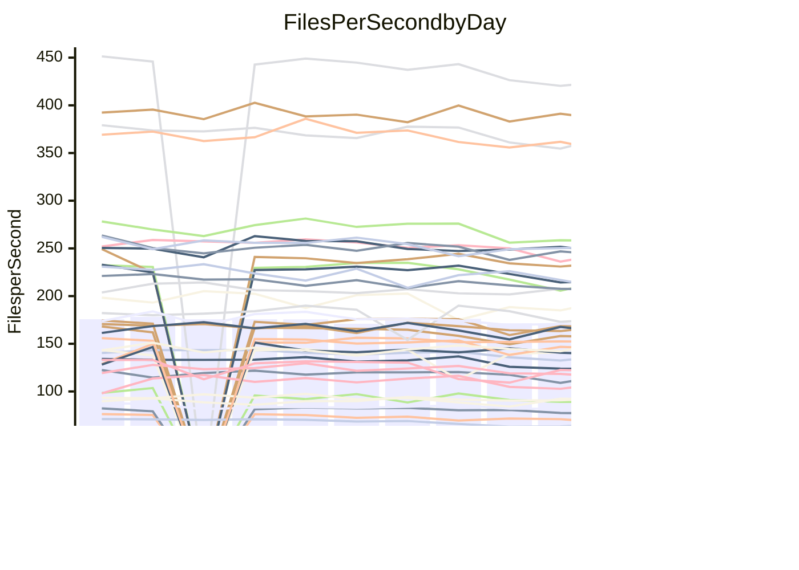

<!---
# This file is auto-generated. Do not edit.
# cspell:disable
--->
# Performance Report

## Daily Performance

## Time to Process Files

| Repository                                      | Elapsed | Min/Avg/Max           |   SD | SD Graph                |
| ----------------------------------------------- | ------: | :-------------------: | ---: | ----------------------- |
| AdaDoom3/AdaDoom3                    |    2.98 | 2.7 /   2.9 /   3.1   | 0.10 | `    ┣━━┻━━╋━●┻━━┫    ` |
| alexiosc/megistos                    |    7.67 | 6.6 /   7.2 /   7.6   | 0.24 | `    ┣━━┻━━╋━━┻━━●    ` |
| apollographql/apollo-server          |    2.23 | 2.0 /   2.1 /   2.3   | 0.08 | `     ┣━┻━━╋━━┻●┫     ` |
| aspnetboilerplate/aspnetboilerplate  |   11.99 | 10.5 /  10.8 /  11.6  | 0.27 | `     ┣━┻━━╋━━┻━┫    ●` |
| aws-amplify/docs                     |   11.45 | 10.7 /  11.3 /  12.6  | 0.42 | `    ┣━━┻━━╋●━┻━━┫    ` |
| Azure/azure-rest-api-specs           |   14.94 | 12.9 /  13.9 /  15.4  | 0.59 | `   ┣━━━┻━━╋━━┻━━●┫   ` |
| bitjson/typescript-starter           |    0.64 | 0.6 /   0.6 /   0.7   | 0.03 | `     ┣━━┻━╋━●━━┫     ` |
| caddyserver/caddy                    |    3.02 | 2.8 /   3.0 /   3.5   | 0.16 | `    ┣━━┻━━●━━┻━━┫    ` |
| canada-ca/open-source-logiciel-libre |    0.75 | 0.7 /   0.8 /   0.9   | 0.05 | `     ┣━┻━━●━━┻━┫     ` |
| chef/chef                            |    5.77 | 5.1 /   5.4 /   6.0   | 0.22 | `    ┣━━┻━━╋━━┻━━●    ` |
| dart-lang/sdk                        |   55.64 | 55.6 /  58.3 /  70.4  | 3.15 | `  ┣━━━┻●━━╋━━━┻━━━┫  ` |
| django/django                        |   13.38 | 13.0 /  13.6 /  14.3  | 0.32 | `    ┣━━┻●━╋━━┻━━┫    ` |
| eslint/eslint                        |    9.79 | 8.9 /   9.4 /  10.0   | 0.31 | `    ┣━━┻━━╋━━┻●━┫    ` |
| exonum/exonum                        |    3.07 | 2.9 /   3.0 /   3.7   | 0.19 | `    ┣━━┻━━╋●━┻━━┫    ` |
| flutter/samples                      |   16.87 | 13.7 /  15.0 /  18.4  | 1.43 | `   ┣━━━┻━━╋━━┻━●━┫   ` |
| gitbucket/gitbucket                  |    3.06 | 2.8 /   3.0 /   3.3   | 0.12 | `    ┣━━┻━━╋━●┻━━┫    ` |
| googleapis/google-cloud-cpp          |  133.49 | 129.1 / 136.1 / 145.8 | 4.11 | `  ┣━━━┻●━━╋━━━┻━━━┫  ` |
| graphql/express-graphql              |    0.69 | 0.6 /   0.7 /   0.8   | 0.04 | `     ┣━┻━━╋●━┻━┫     ` |
| graphql/graphql-js                   |    2.17 | 1.9 /   2.1 /   2.2   | 0.08 | `     ┣━┻━━╋━━●━┫     ` |
| graphql/graphql-relay-js             |    0.81 | 0.6 /   0.7 /   0.7   | 0.03 | `     ┣━┻━━╋━━┻━┫   ● ` |
| graphql/graphql-spec                 |    0.90 | 0.7 /   0.8 /   1.1   | 0.08 | `     ┣━┻━━╋━━●━┫     ` |
| iluwatar/java-design-patterns        |   11.04 | 10.3 /  10.8 /  12.5  | 0.47 | `    ┣━━┻━━╋━●┻━━┫    ` |
| ktaranov/sqlserver-kit               |    6.30 | 5.6 /   5.9 /   6.1   | 0.13 | `    ┣━━┻━━╋━━┻━━┫   ●` |
| liriliri/licia                       |    3.38 | 3.1 /   3.3 /   3.5   | 0.11 | `    ┣━━┻━━╋━━●━━┫    ` |
| MartinThoma/LaTeX-examples           |    6.23 | 5.9 /   6.3 /   7.0   | 0.26 | `    ┣━━┻━━●━━┻━━┫    ` |
| mdx-js/mdx                           |    1.54 | 1.4 /   1.5 /   1.8   | 0.08 | `     ┣━┻━━●━━┻━┫     ` |
| microsoft/TypeScript-Website         |    5.49 | 4.7 /   5.0 /   5.9   | 0.23 | `    ┣━━┻━━╋━━┻━━●    ` |
| MicrosoftDocs/PowerShell-Docs        |   22.79 | 20.6 /  22.1 /  23.9  | 0.94 | `   ┣━━━┻━━╋━●┻━━━┫   ` |
| neovim/nvim-lspconfig                |    2.85 | 2.6 /   2.7 /   2.9   | 0.12 | `    ┣━━┻━━╋━━●━━┫    ` |
| pagekit/pagekit                      |    3.21 | 3.0 /   3.1 /   3.3   | 0.09 | `    ┣━━┻━━╋━●┻━━┫    ` |
| php/php-src                          |   23.49 | 23.2 /  24.3 /  26.1  | 0.72 | `   ┣━━●┻━━╋━━┻━━━┫   ` |
| plasticrake/tplink-smarthome-api     |    0.87 | 0.8 /   0.9 /   0.9   | 0.04 | `     ┣━┻━━╋●━┻━┫     ` |
| prettier/prettier                    |    6.34 | 5.7 /   5.9 /   6.4   | 0.16 | `    ┣━━┻━━╋━━┻━━┫●   ` |
| pycontribs/jira                      |    1.15 | 1.1 /   1.2 /   1.3   | 0.06 | `     ┣━┻━●╋━━┻━┫     ` |
| RustPython/RustPython                |    4.95 | 4.0 /   4.4 /   6.1   | 0.40 | `    ┣━━┻━━╋━━┻●━┫    ` |
| shoelace-style/shoelace              |    2.29 | 2.1 /   2.3 /   2.5   | 0.12 | `    ┣━━┻━━●━━┻━━┫    ` |
| SoftwareBrothers/admin-bro           |    2.13 | 1.8 /   2.0 /   2.2   | 0.09 | `     ┣━┻━━╋━━┻━●     ` |
| sveltejs/svelte                      |   18.58 | 18.1 /  18.9 /  20.3  | 0.53 | `   ┣━━━┻●━╋━━┻━━━┫   ` |
| TheAlgorithms/Python                 |    5.26 | 4.7 /   5.0 /   5.5   | 0.22 | `    ┣━━┻━━╋━━●━━┫    ` |
| twbs/bootstrap                       |    1.14 | 1.0 /   1.1 /   1.4   | 0.08 | `     ┣━┻━━╋●━┻━┫     ` |
| typescript-cheatsheets/react         |    1.17 | 1.0 /   1.0 /   1.1   | 0.03 | `      ┣━┻━╋━┻━┫     ●` |
| typescript-eslint/typescript-eslint  |    3.52 | 3.2 /   3.4 /   3.7   | 0.13 | `    ┣━━┻━━╋━━●━━┫    ` |
| vitest-dev/vitest                    |    7.40 | 6.6 /   7.0 /   7.4   | 0.22 | `    ┣━━┻━━╋━━┻━━●    ` |
| w3c/aria-practices                   |    2.76 | 2.5 /   2.7 /   3.0   | 0.12 | `    ┣━━┻━━╋━●┻━━┫    ` |
| w3c/specberus                        |    1.69 | 1.5 /   1.6 /   2.1   | 0.14 | `    ┣━━┻━━╋━●┻━━┫    ` |
| webdeveric/webpack-assets-manifest   |    0.67 | 0.6 /   0.6 /   0.8   | 0.05 | `     ┣━┻━━╋━●┻━┫     ` |
| webpack/webpack                      |    4.39 | 4.1 /   4.4 /   4.8   | 0.19 | `    ┣━━┻━━●━━┻━━┫    ` |
| wireapp/wire-desktop                 |    0.85 | 0.7 /   0.8 /   0.9   | 0.05 | `     ┣━┻━━╋━●┻━┫     ` |
| wireapp/wire-webapp                  |    7.24 | 7.0 /   7.4 /   8.0   | 0.30 | `    ┣━━┻●━╋━━┻━━┫    ` |

Note:
- Elapsed time is in seconds.

## Files per Second over Time

| Repository                                      | Files |    Sec |    Fps |     Rel | Trend Fps              |    N |
| ----------------------------------------------- | ----: | -----: | -----: | ------: | ---------------------- | ---: |
| AdaDoom3/AdaDoom3                    |   103 |   2.98 |  34.61 |  -2.58% | `▇▆▇█▇▇▆▇▅▇▅▅▅▄▅▆▆▅▅`  |   18 |
| alexiosc/megistos                    |   583 |   7.67 |  76.02 |  -5.83% | `▆▅▆▅▆▆▇▅▄█▅▅▅▄▄▄▅▅▃`  |   18 |
| apollographql/apollo-server          |   250 |   2.23 | 112.32 |  -4.49% | `▇█▇▇▆█▇▇▇▇▇▆▇▄▆▆▅▄▇▅` |   21 |
| aspnetboilerplate/aspnetboilerplate  |  2739 |  11.99 | 228.37 |  -9.63% | `██▇████▇█▆█▇▆▇▄▆▇▆▆▃` |   21 |
| aws-amplify/docs                     |  2832 |  11.45 | 247.29 |  -1.34% | `▅██▇▇▇▇█▆▇▆▆▇▇▆▆▃▇▆▆` |   22 |
| Azure/azure-rest-api-specs           |  2426 |  14.94 | 162.38 |  -6.96% | `▅█▆▇█▇▅▆▇▆▆▆▄▅▅▅▆▇▃▄` |   22 |
| bitjson/typescript-starter           |    20 |   0.64 |  31.02 |  -2.81% | `▆▇▇████▇▅▅█▃▅▆▅▅▅▅▅`  |   18 |
| caddyserver/caddy                    |   276 |   3.02 |  91.52 |  -0.13% | `█▆███▇▇▄▇▆▅▃▆▆▆▅▅▆▅▆` |   22 |
| canada-ca/open-source-logiciel-libre |     7 |   0.75 |   9.28 |  -0.41% | `▅▆██▇▇▇▇██▇▇▆▆▄▅▆▂▆`  |   18 |
| chef/chef                            |  1201 |   5.77 | 208.28 |  -6.73% | `█▆▇▅▅▆▇█▃▅▆▇▇▆▄▆▇█▇▄` |   22 |
| dart-lang/sdk                        |  9723 |  55.64 | 174.74 |   4.76% | `█▇▇▇▇██▃▇█▇▆▇▆▇█▅▆██` |   22 |
| django/django                        |  2792 |  13.38 | 208.71 |   1.44% | `█▇▆▇▆▆▇▄█▆▆▆▅▇▇▆▇▇▆▇` |   22 |
| eslint/eslint                        |  2016 |   9.79 | 205.90 |  -3.22% | `▇▇█▅▇▇▇█▆▅▇▆▇▅▅▅▄▆▅▅` |   22 |
| exonum/exonum                        |   421 |   3.07 | 137.11 |  -1.68% | `▇▇▇▇█▇█▆█▇▂▇▇▇▇▇▆▇▆`  |   18 |
| flutter/samples                      |  2850 |  16.87 | 168.92 |  -4.95% | `▇█▇███▇█▅▂█▇█▆▆▅▅▆▅▆` |   22 |
| gitbucket/gitbucket                  |   411 |   3.06 | 134.36 |  -2.57% | `███▇▇▇▅█▇▇▇▅▇▅▇▅▄▅▅▆` |   22 |
| googleapis/google-cloud-cpp          | 19694 | 133.49 | 147.53 |   2.03% | `▅▆▇▆▆▅▄▄▆▆▇▆▆▆█▆▇█▇▇` |   22 |
| graphql/express-graphql              |    26 |   0.69 |  37.42 |  -3.08% | `█▇▆███▇█▇▃▇▆▅▅▅▅▅▅▅`  |   18 |
| graphql/graphql-js                   |   333 |   2.17 | 153.48 |  -4.98% | `▆▇▇▅█▇▇▆▇▆▅▃▃▅▅▆▅▄▆▄` |   20 |
| graphql/graphql-relay-js             |    28 |   0.81 |  34.73 | -14.73% | `█▇█▄▆█▇▅█▆▄▅▅▄▄▅▅▄▁`  |   18 |
| graphql/graphql-spec                 |    15 |   0.90 |  16.75 | -11.97% | `▅███▇█▇▇█▇▇▇▇▆▆▂▆▆▄`  |   18 |
| iluwatar/java-design-patterns        |  1838 |  11.04 | 166.43 |  -2.47% | `▇▇▇▇▇▆█▇███▇▃▆▇▇▆▆▆`  |   18 |
| ktaranov/sqlserver-kit               |   489 |   6.30 |  77.57 |  -7.11% | `██▅▆▆▆▇▆▆▅▇▇▅▆▅▆▆▆▆▃` |   19 |
| liriliri/licia                       |  1421 |   3.38 | 420.54 |  -3.29% | `██▇███▇█▇▆▇▅▆▅▆▄▅▅▅`  |   18 |
| MartinThoma/LaTeX-examples           |  1407 |   6.23 | 225.72 |   0.52% | `▇▆▆▇▆▇▇▇█▅▇▆▆▅▅▅▃▇▆`  |   18 |
| mdx-js/mdx                           |   144 |   1.54 |  93.32 |  -0.47% | `▇█▆▆▄▆▆▇▆▆▃▇▅▅▄▄▅▅▄▅` |   20 |
| microsoft/TypeScript-Website         |   758 |   5.49 | 138.13 |  -8.63% | `▆▇▆▆▇▇██▇█▇▇▆▇▇▅▆▇▇▄` |   20 |
| MicrosoftDocs/PowerShell-Docs        |  2692 |  22.79 | 118.10 |  -2.88% | `▆▇▆██▆▆▆▆▇▇▆▅▅▄▃▅▅▄▅` |   22 |
| neovim/nvim-lspconfig                |   355 |   2.85 | 124.74 |  -4.13% | `▇▇▇██▇█▄▇▆█▆▄▄▄▄▄▅▄▅` |   22 |
| pagekit/pagekit                      |   741 |   3.21 | 231.19 |  -2.24% | `█▄█▆▇▆▅▇▆▇▇▆▆▅▆▅▆▅▅`  |   18 |
| php/php-src                          |  2211 |  23.49 |  94.13 |   3.58% | `▅▄▅▅▇▆▅▆██▇▆▆▆▇▆████` |   22 |
| plasticrake/tplink-smarthome-api     |    62 |   0.87 |  70.88 |  -2.13% | `▇▇▇██▆▇▅▆▇▅▅▆▅▄▅▄▃▅`  |   18 |
| prettier/prettier                    |  2196 |   6.34 | 346.26 |  -6.16% | `▇▇▇▇▇▆▅▇█▇▇▆▆▅▇▆▄▇▆▄` |   21 |
| pycontribs/jira                      |    80 |   1.15 |  69.35 |   1.92% | `██▇█▇█▇█▆▆█▆▆▃▅▅▇▆▅▇` |   20 |
| RustPython/RustPython                |   621 |   4.95 | 125.51 | -11.59% | `▇███▆▆█▆▇▇▇▇▇▇▆▆▇▇▇▅` |   21 |
| shoelace-style/shoelace              |   437 |   2.29 | 190.71 |  -1.18% | `█▇█▇▃█▇▇▇█▃▆▅▅▆▅▅▃▅▆` |   21 |
| SoftwareBrothers/admin-bro           |   441 |   2.13 | 206.73 |  -8.34% | `▇▇▇▇▇█▆▇███▇▅▅▄▅▅▆▃▄` |   19 |
| sveltejs/svelte                      |  7455 |  18.58 | 401.17 |   2.71% | `▆▇▇▆▆▇▆▆▇▄▇▅▆▆▆▅▇█▆▇` |   22 |
| TheAlgorithms/Python                 |  1352 |   5.26 | 256.94 |  -4.16% | `▅▇▇▇█▆▇▆▇▇▇▄▅▅▅▅▄▃▆▅` |   22 |
| twbs/bootstrap                       |   120 |   1.14 | 105.71 |  -2.55% | `█▇▆▇█▇▇▅█▇█▆▅▅▆▅▅▆▆▆` |   22 |
| typescript-cheatsheets/react         |    53 |   1.17 |  45.43 | -12.58% | `▇▆▇▅▇█▅▇▆▇▆▅▅▄▅▅▆▆▁`  |   18 |
| typescript-eslint/typescript-eslint  |  1247 |   3.52 | 354.12 |  -3.16% | `▅▅▇▇███▃▆▇▅▅▅▅▄▄▅▅▅▅` |   22 |
| vitest-dev/vitest                    |  1801 |   7.40 | 243.28 |  -4.42% | `▇█▄▇▅▇▆█▆▆▄▅▅▅▆▇▄▆▆▄` |   22 |
| w3c/aria-practices                   |   403 |   2.76 | 145.95 |  -2.45% | `▇█▇▇██▅▇█▆▇▃▅▆▅▅▆▆▅▆` |   21 |
| w3c/specberus                        |   200 |   1.69 | 118.04 |  -6.18% | `█▅▇▇▇█▇█▇█▆▅▂▆▆▆▇▇▇▅` |   21 |
| webdeveric/webpack-assets-manifest   |    19 |   0.67 |  28.20 |  -5.63% | `▇▆▇▇▅██▇███▆▆▆▃▆▂▆▅`  |   18 |
| webpack/webpack                      |  1086 |   4.39 | 247.16 |  -0.31% | `▆▇▇█▇█▇▅▇█▇▄▇▇▆▆▃█▄▇` |   22 |
| wireapp/wire-desktop                 |    43 |   0.85 |  50.82 |  -4.19% | `█▇█▆█▄█▇█▇▆▅▅▄▅▅▅▅▃▅` |   22 |
| wireapp/wire-webapp                  |  1227 |   7.24 | 169.47 |   3.16% | `█▅▇█▇▅▆▆█▇▆▄▄▇▅▅▅▆▅▇` |   22 |

## Data Throughput

| Repository                                      | Files |    Sec |     Kps |     Rel | Trend Kps              |    N |
| ----------------------------------------------- | ----: | -----: | ------: | ------: | ---------------------- | ---: |
| AdaDoom3/AdaDoom3                    |   103 |   2.98 |  735.58 |  -2.58% | `▇▆▇█▇▇▆▇▅▇▅▅▅▄▅▆▆▅▅`  |   18 |
| alexiosc/megistos                    |   583 |   7.67 |  597.37 |  -5.83% | `▆▅▆▅▆▆▇▅▄█▅▅▅▄▄▄▅▅▃`  |   18 |
| apollographql/apollo-server          |   250 |   2.23 |  890.04 |  -4.49% | `▇█▇▇▆█▇▇▇▇▇▆▇▄▆▆▅▄▇▅` |   21 |
| aspnetboilerplate/aspnetboilerplate  |  2739 |  11.99 |  530.95 | -11.07% | `██▇████▇█▆█▇▆▇▄▅▇▅▆▃` |   21 |
| aws-amplify/docs                     |  2832 |  11.45 |  825.51 |  -0.95% | `▅██▇▇▇▇█▆▇▆▆▇▇▆▆▃▇▆▆` |   22 |
| Azure/azure-rest-api-specs           |  2426 |  14.94 |  463.65 |  -6.77% | `▅█▆▇█▇▅▆▇▆▆▆▄▅▅▅▆▇▃▄` |   22 |
| bitjson/typescript-starter           |    20 |   0.64 |  124.08 |  -2.81% | `▆▇▇████▇▅▅█▃▅▆▅▅▅▅▅`  |   18 |
| caddyserver/caddy                    |   276 |   3.02 |  745.08 |   0.08% | `█▆███▇▇▄▇▆▆▃▆▇▆▅▆▆▅▆` |   22 |
| canada-ca/open-source-logiciel-libre |     7 |   0.75 |   76.88 |  -0.41% | `▅▆██▇▇▇▇██▇▇▆▆▄▅▆▂▆`  |   18 |
| chef/chef                            |  1201 |   5.77 |  955.74 |  -7.01% | `█▆▇▆▆▆▇█▃▅▆▇▇▆▄▆▇█▇▄` |   22 |
| dart-lang/sdk                        |  9723 |  55.64 | 1263.61 |   4.53% | `█▇▇█▇██▃▇█▇▆▇▆▇█▅▆██` |   22 |
| django/django                        |  2792 |  13.38 | 1277.29 |   1.58% | `█▇▆▇▆▆▇▄█▆▆▆▅▇▇▆▇▇▆▇` |   22 |
| eslint/eslint                        |  2016 |   9.79 | 1681.02 |  -3.34% | `▇▇█▅▇▇▇█▆▅▇▆▇▅▅▅▄▆▅▅` |   22 |
| exonum/exonum                        |   421 |   3.07 | 1311.54 |  -1.68% | `▇▇▇▇█▇█▆█▇▂▇▇▇▇▇▆▇▆`  |   18 |
| flutter/samples                      |  2850 |  16.87 | 1310.01 |  -2.32% | `▇█▇███▇█▅▂█▇█▆▆▆▆▆▅▆` |   22 |
| gitbucket/gitbucket                  |   411 |   3.06 |  607.05 |  -2.57% | `███▇▇▇▅█▇▇▇▅▇▅▇▅▄▅▅▆` |   22 |
| googleapis/google-cloud-cpp          | 19694 | 133.49 | 1053.09 |   2.05% | `▅▆▇▆▆▅▄▄▆▆▇▆▆▆█▆▇█▇▇` |   22 |
| graphql/express-graphql              |    26 |   0.69 |  171.29 |  -3.08% | `█▇▆███▇█▇▃▇▆▅▅▅▅▅▅▅`  |   18 |
| graphql/graphql-js                   |   333 |   2.17 |  875.23 |  -4.82% | `▆▇▇▅█▇▇▆▇▆▅▃▃▅▅▆▅▄▆▄` |   20 |
| graphql/graphql-relay-js             |    28 |   0.81 |  136.42 | -14.73% | `█▇█▄▆█▇▅█▆▄▅▅▄▄▅▅▄▁`  |   18 |
| graphql/graphql-spec                 |    15 |   0.90 |  615.18 | -11.97% | `▅███▇█▇▇█▇▇▇▇▆▆▂▆▆▄`  |   18 |
| iluwatar/java-design-patterns        |  1838 |  11.04 |  512.14 |  -2.47% | `▇▇▇▇▇▆█▇███▇▃▆▇▇▆▆▆`  |   18 |
| ktaranov/sqlserver-kit               |   489 |   6.30 | 1173.34 |  -7.11% | `██▅▆▆▆▇▆▆▅▇▇▅▆▅▆▆▆▆▃` |   19 |
| liriliri/licia                       |  1421 |   3.38 |  495.71 |  -3.21% | `██▇███▇█▇▆▇▅▆▅▆▄▅▅▅`  |   18 |
| MartinThoma/LaTeX-examples           |  1407 |   6.23 |  466.53 |   0.52% | `▇▆▆▇▆▇▇▇█▅▇▆▆▅▅▅▃▇▆`  |   18 |
| mdx-js/mdx                           |   144 |   1.54 |  427.71 |  -0.25% | `▇█▆▆▄▆▆▇▆▆▃▇▅▅▄▄▅▅▄▆` |   20 |
| microsoft/TypeScript-Website         |   758 |   5.49 |  945.19 |  -8.70% | `▆▇▆▆▇▇██▇█▇▇▆▇▇▅▆▇▇▄` |   20 |
| MicrosoftDocs/PowerShell-Docs        |  2692 |  22.79 | 1206.71 |  -2.92% | `▆▇▆██▆▆▆▆▇▇▆▅▅▄▃▅▅▄▅` |   22 |
| neovim/nvim-lspconfig                |   355 |   2.85 |  326.43 |  -4.53% | `▇█▇██▇█▄▇▆█▆▄▄▄▄▄▅▄▅` |   22 |
| pagekit/pagekit                      |   741 |   3.21 |  482.05 |  -2.24% | `█▄█▆▇▆▅▇▆▇▇▆▆▅▆▅▆▅▅`  |   18 |
| php/php-src                          |  2211 |  23.49 | 1374.23 |   3.64% | `▅▄▅▅▇▆▅▆██▇▆▆▆▇▆████` |   22 |
| plasticrake/tplink-smarthome-api     |    62 |   0.87 |  382.97 |  -2.13% | `▇▇▇██▆▇▅▆▇▅▅▆▅▄▅▄▃▅`  |   18 |
| prettier/prettier                    |  2196 |   6.34 |  482.81 |  -6.13% | `▇▇▇▇▇▆▅▇█▇▇▆▆▅▇▆▄▇▆▄` |   21 |
| pycontribs/jira                      |    80 |   1.15 |  477.66 |   1.91% | `██▇█▇█▇█▆▆█▆▆▃▅▅▇▆▅▇` |   20 |
| RustPython/RustPython                |   621 |   4.95 |  923.83 | -11.37% | `▇███▆▆█▆▇▇▇▇▇▇▆▆▇▇▇▅` |   21 |
| shoelace-style/shoelace              |   437 |   2.29 |  905.96 |  -0.64% | `█▇▇▇▃█▇▇▇█▃▆▅▅▇▆▅▃▅▆` |   21 |
| SoftwareBrothers/admin-bro           |   441 |   2.13 |  455.65 |  -8.42% | `▇▇▇▇▇█▆▇███▇▅▅▃▅▅▆▃▄` |   19 |
| sveltejs/svelte                      |  7455 |  18.58 |  289.08 |   2.46% | `▆█▇▆▆▇▆▆▇▄▇▅▆▆▆▅▇█▆▇` |   22 |
| TheAlgorithms/Python                 |  1352 |   5.26 |  649.37 |  -4.42% | `▅▇▇▇█▆▇▆▇▇▇▅▅▅▅▅▄▃▆▅` |   22 |
| twbs/bootstrap                       |   120 |   1.14 |  846.58 |  -2.55% | `█▇▆▇█▇▇▅█▇█▆▅▅▆▅▅▆▆▆` |   22 |
| typescript-cheatsheets/react         |    53 |   1.17 |  331.72 | -12.58% | `▇▆▇▅▇█▅▇▆▇▆▅▅▄▅▅▆▆▁`  |   18 |
| typescript-eslint/typescript-eslint  |  1247 |   3.52 | 1647.90 |  -2.61% | `▅▅▇▇███▃▆▇▅▅▅▅▅▄▅▅▆▅` |   22 |
| vitest-dev/vitest                    |  1801 |   7.40 |  495.62 |  -5.13% | `▇█▄▇▅▇▆█▆▆▄▅▅▅▆▆▄▆▅▄` |   22 |
| w3c/aria-practices                   |   403 |   2.76 | 1360.62 |  -2.28% | `▇█▇▇██▅▇█▆█▃▅▆▆▆▆▆▅▆` |   21 |
| w3c/specberus                        |   200 |   1.69 |  376.55 |  -6.18% | `█▅▇▇▇█▇█▇█▆▅▂▆▆▆▇▇▇▅` |   21 |
| webdeveric/webpack-assets-manifest   |    19 |   0.67 |  151.37 |  -5.63% | `▇▆▇▇▅██▇███▆▆▆▃▆▂▆▅`  |   18 |
| webpack/webpack                      |  1086 |   4.39 | 1074.69 |  -0.22% | `▆▇▇█▇█▇▅▇█▇▄▇▇▆▆▃█▄▇` |   22 |
| wireapp/wire-desktop                 |    43 |   0.85 |  223.38 |  -4.17% | `█▇█▆█▄█▇█▇▆▅▅▄▅▅▅▅▃▅` |   22 |
| wireapp/wire-webapp                  |  1227 |   7.24 |  717.12 |   3.08% | `█▅▇█▇▅▆▆█▇▆▄▄▇▅▅▅▆▅▇` |   22 |

