<!---
# This file is auto-generated. Do not edit.
# cspell:disable
--->
# Performance Report

```mermaid
xychart-beta
    title Files Per Second by Day
    y-axis Files per Second
    x-axis Date [Dec-10, Dec-13, Dec-14, Dec-15, Dec-16, Dec-20, Dec-22, Dec-23, Dec-24, Dec-27, Dec-28, Dec-29, Dec-30, Jan-1, Jan-4, Jan-5, Jan-6, Jan-7, Jan-8, Jan-9]
    bar [160.13, 162.46, 160.30, 159.32, 159.99, 160.32, 171.41, 173.30, 173.54, 170.88, 173.10, 172.87, 170.63, 172.55, 170.72, 165.99, 165.55, 169.22, 174.07, 185.09]
    line [6.11, 5.69, 6.12, 5.85, 6.27, 5.94, 6.19, 6.23, 6.06, 5.80, 6.19, 6.04, 6.09, 6.29, 6.13, 5.79, 5.41, 5.66, 6.15, 7.11]
    line [19.04, 18.41, 18.71, 17.35, 18.44, 18.66, 19.39, 19.24, 18.95, 18.61, 19.20, 19.16, 18.64, 18.56, 18.69, 15.82, 15.37, 16.82, 19.06, 19.14]
    line [94.62, 99.56, 95.79, 93.99, 95.03, 91.66, 95.50, 94.32, 94.29, 94.73, 94.34, 95.29, 95.11, 98.41, 97.41, 93.11, 86.98, 96.48, 99.80, 106.94]
    line [14.61, 14.25, 14.42, 14.66, 14.20, 14.14, 14.58, 14.66, 13.81, 14.51, 13.39, 13.58, 14.12, 14.33, 14.46, 13.75, 12.60, 13.58, 14.59, 15.78]
    line [72.32, 70.99, 69.49, 68.20, 68.29, 71.18, 72.28, 72.81, 72.16, 72.22, 72.29, 71.63, 70.43, 69.31, 70.55, 65.48, 65.68, 67.02, 74.90, 79.82]
    line [44.67, 46.00, 48.05, 47.07, 45.85, 42.75, 47.52, 47.21, 45.81, 45.88, 45.34, 46.09, 44.04, 43.96, 44.61, 40.41, 39.77, 41.67, 47.14, 51.58]
    line [128.75, 126.25, 125.99, 122.54, 125.77, 120.95, 129.07, 131.35, 128.71, 129.73, 130.21, 126.25, 125.32, 128.46, 125.36, 119.96, 121.55, 126.54, 132.92, 140.62]
    line [114.79, 114.58, 111.22, 109.33, 106.79, 113.91, 116.30, 113.89, 119.27, 121.25, 119.32, 118.60, 119.88, 120.18, 120.91, 116.77, 113.59, 115.36, 119.01, 130.59]
    line [194.91, 205.14, 200.36, 207.64, 202.85, 200.31, 210.29, 210.04, 207.76, 200.78, 205.77, 199.55, 199.57, 206.34, 210.39, 198.78, 192.42, 197.28, 209.87, 209.88]
    line [76.12, 76.57, 75.62, 71.86, 75.70, 72.52, 79.52, 79.75, 79.57, 78.19, 78.53, 81.17, 72.47, 80.44, 78.06, 78.74, 77.69, 75.81, 82.18, 86.34]
    line [21.71, 22.48, 22.26, 24.16, 21.86, 22.99, 23.86, 22.95, 22.15, 22.59, 22.93, 22.71, 21.96, 22.43, 22.76, 19.93, 19.65, 21.35, 23.88, 23.66]
    line [23.56, 24.27, 23.97, 21.89, 24.77, 24.75, 25.98, 24.78, 24.02, 24.07, 23.90, 24.05, 23.79, 23.47, 23.84, 21.71, 20.06, 22.54, 25.57, 26.81]
    line [95.93, 94.05, 97.42, 87.40, 93.20, 92.02, 98.77, 95.06, 94.41, 95.55, 97.07, 96.22, 92.57, 92.92, 91.62, 91.70, 90.24, 93.64, 97.75, 103.53]
    line [305.21, 329.78, 336.28, 339.96, 335.03, 330.81, 346.52, 335.23, 343.48, 342.97, 326.49, 346.96, 341.41, 349.59, 332.44, 321.99, 323.13, 336.38, 352.94, 367.43]
    line [244.11, 232.83, 233.41, 237.39, 235.87, 236.73, 241.85, 239.59, 240.67, 245.15, 245.04, 246.20, 235.52, 245.54, 241.43, 227.89, 226.93, 235.13, 241.29, 258.62]
    line [116.17, 113.85, 113.19, 111.86, 113.23, 116.22, 119.95, 116.76, 117.75, 118.71, 118.58, 117.32, 112.42, 116.77, 113.28, 107.29, 110.98, 110.70, 119.74, 123.99]
    line [30.70, 31.34, 29.78, 30.86, 29.89, 30.20, 33.22, 32.90, 33.40, 32.96, 33.38, 32.90, 31.64, 32.05, 31.87, 30.32, 30.13, 30.52, 32.45, 34.27]
    line [171.02, 169.99, 161.97, 169.28, 168.79, 164.45, 163.90, 173.08, 173.52, 171.67, 165.07, 170.82, 168.89, 168.46, 160.87, 163.97, 157.39, 159.96, 176.03, 183.60]
    line [125.77, 122.50, 124.97, 121.63, 124.44, 114.40, 117.66, 113.42, 116.57, 120.86, 116.04, 115.61, 111.25, 114.64, 107.26, 104.85, 102.99, 109.30, 116.77, 134.29]
    line [295.96, 306.54, 308.67, 318.29, 308.47, 312.68, 311.01, 311.87, 322.19, 317.56, 317.24, 315.38, 325.99, 315.10, 321.37, 318.36, 304.42, 303.41, 319.39, 328.53]
    line [148.64, 164.74, 167.10, 169.90, 168.25, 171.20, 165.98, 169.49, 175.43, 173.51, 166.13, 173.69, 176.28, 174.86, 172.30, 168.35, 166.48, 160.20, 176.21, 192.55]
    line [157.69, 162.41, 162.92, 155.61, 157.24, 162.25, 174.81, 169.46, 179.44, 172.82, 176.92, 167.34, 176.43, 176.94, 178.99, 168.22, 166.87, 176.13, 175.56, 180.12]
    line [193.19, 192.23, 185.43, 191.26, 188.26, 189.10, 196.56, 199.42, 199.83, 198.90, 201.82, 194.83, 201.20, 199.08, 201.68, 196.07, 191.44, 191.98, 208.77, 216.25]
    line [43.68, 45.02, 45.75, 43.43, 44.94, 44.85, 45.35, 43.98, 45.75, 48.03, 44.47, 43.53, 43.39, 44.67, 43.92, 40.38, 37.83, 41.50, 45.72, 49.73]
    line [212.77, 206.57, 216.35, 210.81, 207.51, 213.81, 235.09, 232.12, 236.13, 235.71, 228.72, 232.65, 236.79, 238.66, 239.84, 237.65, 227.69, 241.17, 242.31, 247.30]
    line [231.37, 242.80, 219.56, 233.62, 231.32, 236.32, 236.26, 240.94, 253.96, 249.85, 237.45, 249.30, 236.26, 250.59, 240.41, 245.35, 243.40, 249.06, 252.82, 279.05]
    line [75.54, 73.95, 75.07, 76.77, 72.26, 69.84, 77.03, 74.27, 74.27, 73.83, 75.96, 75.41, 73.52, 70.94, 72.13, 67.68, 66.21, 71.65, 76.02, 83.55]
    line [184.12, 199.02, 199.50, 195.58, 198.56, 202.04, 205.76, 202.04, 203.32, 201.04, 202.44, 203.10, 195.80, 206.74, 207.91, 185.17, 183.38, 197.81, 213.96, 229.30]
    line [143.97, 142.44, 148.72, 148.74, 148.66, 145.81, 145.83, 151.65, 150.82, 149.41, 147.54, 148.32, 148.24, 148.81, 152.12, 144.06, 141.46, 148.01, 153.69, 164.98]
    line [134.87, 129.94, 136.83, 140.59, 128.00, 132.13, 140.04, 140.36, 136.98, 135.57, 135.50, 134.25, 129.01, 139.25, 139.78, 129.55, 131.60, 134.11, 136.19, 143.66]
    line [181.05, 182.93, 185.74, 173.94, 185.68, 184.19, 188.28, 188.11, 196.54, 189.53, 183.55, 193.13, 194.30, 182.73, 194.72, 192.90, 184.51, 177.92, 195.10, 207.38]
    line [188.38, 180.77, 185.77, 186.35, 184.33, 182.33, 191.53, 189.75, 189.98, 177.07, 192.83, 190.79, 182.79, 190.84, 188.67, 194.33, 177.58, 179.97, 187.56, 198.84]
    line [148.76, 149.26, 148.44, 146.25, 144.57, 148.51, 160.26, 155.20, 157.30, 154.76, 157.76, 156.45, 156.97, 156.48, 161.27, 156.23, 155.16, 163.04, 163.18, 168.53]
    line [146.07, 144.49, 139.02, 141.78, 142.36, 140.50, 151.95, 150.33, 152.02, 150.72, 154.90, 153.82, 147.24, 149.99, 145.79, 146.47, 145.32, 149.61, 152.47, 166.46]
    line [183.65, 201.42, 192.31, 202.71, 196.90, 201.49, 199.06, 199.67, 194.62, 190.28, 203.79, 203.98, 206.16, 191.99, 203.06, 195.28, 197.18, 199.76, 210.90, 228.85]
    line [374.83, 359.05, 350.76, 385.22, 356.23, 361.41, 363.52, 371.74, 360.07, 349.58, 358.00, 357.09, 358.22, 365.46, 375.72, 366.42, 366.13, 364.89, 378.25, 394.44]
    line [30.84, 32.08, 31.89, 31.67, 31.01, 31.00, 31.79, 31.95, 32.72, 33.00, 31.56, 31.04, 31.19, 31.58, 30.98, 28.44, 27.47, 29.34, 33.19, 34.21]
    line [283.38, 296.25, 298.40, 299.27, 280.90, 293.45, 278.89, 296.00, 294.23, 289.77, 295.71, 297.33, 290.64, 293.31, 297.11, 291.75, 279.45, 292.30, 315.14, 317.88]
    line [102.65, 110.81, 107.51, 105.11, 109.29, 110.23, 118.20, 116.66, 113.51, 116.56, 110.18, 116.43, 113.57, 116.81, 116.74, 114.96, 116.34, 117.08, 121.26, 126.33]
    line [82.71, 84.32, 82.91, 77.95, 81.87, 81.89, 89.30, 90.84, 89.17, 86.07, 86.04, 90.94, 91.20, 88.38, 89.72, 82.57, 85.29, 87.34, 86.74, 96.68]
    line [51.93, 50.78, 49.91, 50.66, 50.34, 50.02, 51.61, 51.21, 51.38, 49.64, 48.60, 49.52, 48.09, 50.03, 48.82, 46.25, 44.36, 47.22, 53.09, 56.35]
    line [64.84, 65.11, 62.93, 65.98, 63.02, 64.70, 64.39, 64.92, 64.92, 65.76, 63.97, 65.18, 60.36, 63.48, 65.17, 62.63, 59.94, 62.94, 68.03, 70.82]
    line [199.25, 200.18, 192.55, 195.85, 196.96, 197.31, 203.68, 215.88, 203.82, 209.47, 208.55, 206.80, 208.32, 210.94, 208.87, 204.66, 200.55, 205.66, 217.93, 205.69]
    line [73.38, 70.10, 71.99, 68.96, 71.11, 72.00, 74.62, 76.21, 75.66, 76.28, 80.16, 75.45, 77.29, 76.83, 75.96, 77.04, 75.98, 75.37, 79.34, 77.07]
    line [116.99, 116.61, 109.61, 115.93, 113.66, 115.36, 122.68, 121.26, 119.81, 119.36, 122.21, 121.33, 118.71, 119.46, 120.59, 115.93, 111.61, 116.47, 122.24, 126.29]
    line [206.31, 212.61, 210.51, 204.56, 210.18, 211.34, 200.66, 223.22, 223.16, 220.54, 207.84, 221.69, 222.09, 227.69, 222.11, 226.42, 218.19, 221.48, 227.88, 236.77]
    line [224.99, 230.85, 236.16, 237.46, 237.06, 237.81, 238.36, 240.26, 242.42, 235.97, 234.05, 235.94, 244.60, 237.90, 238.37, 234.19, 223.75, 225.18, 243.31, 254.62]
    line [153.72, 160.91, 157.90, 164.74, 161.04, 164.69, 164.20, 175.57, 172.74, 173.87, 177.24, 172.99, 166.08, 180.17, 181.21, 173.75, 179.71, 177.60, 181.52, 193.37]
    line [38.10, 36.47, 38.38, 37.81, 37.32, 38.13, 39.99, 39.24, 39.22, 39.13, 37.99, 37.43, 37.30, 38.53, 37.44, 35.32, 32.27, 37.29, 39.53, 40.29]
    line [144.70, 146.06, 142.91, 137.61, 141.27, 139.39, 164.22, 164.25, 165.65, 160.55, 167.52, 164.35, 162.61, 160.21, 152.67, 150.17, 151.88, 156.83, 157.18, 168.44]
```

Daily Performance

Time to Process Files

| Repository                                      | Elapsed | Min/Avg/Max           |   SD | SD Graph                |
| ----------------------------------------------- | ------: | :-------------------: | ---: | ----------------------- |
| AdaDoom3/AdaDoom3                    |    3.01 | 3.0 /   3.3 /   3.6   | 0.16 | `    ┣●━┻━━╋━━┻━━┫    ` |
| alexiosc/megistos                    |    6.98 | 7.2 /   8.1 /   9.9   | 0.48 | `   ●┣━━┻━━╋━━┻━━┫    ` |
| apollographql/apollo-server          |    2.44 | 2.5 /   2.7 /   3.1   | 0.12 | `    ●┣━┻━━╋━━┻━┫     ` |
| aspnetboilerplate/aspnetboilerplate  |    9.24 | 9.0 /  10.0 /  12.5   | 0.61 | `    ┣━●┻━━╋━━┻━━┫    ` |
| aws-amplify/docs                     |   12.14 | 12.4 /  13.2 /  15.9  | 0.60 | `    ●━━┻━━╋━━┻━━┫    ` |
| Azure/azure-rest-api-specs           |    9.58 | 9.5 /  10.4 /  11.7   | 0.45 | `    ┣●━┻━━╋━━┻━━┫    ` |
| bitjson/typescript-starter           |    1.04 | 1.0 /   1.1 /   1.4   | 0.10 | `     ┣━┻●━╋━━┻━┫     ` |
| caddyserver/caddy                    |    3.36 | 3.3 /   3.7 /   4.3   | 0.18 | `    ●━━┻━━╋━━┻━━┫    ` |
| canada-ca/open-source-logiciel-libre |    0.98 | 1.1 /   1.2 /   1.4   | 0.07 | `   ● ┣━┻━━╋━━┻━┫     ` |
| chef/chef                            |    5.23 | 5.2 /   6.0 /   6.8   | 0.28 | `  ● ┣━━┻━━╋━━┻━━┫    ` |
| dart-lang/sdk                        |   56.37 | 58.5 /  63.5 /  70.9  | 3.31 | `  ●━━━┻━━━╋━━━┻━━━┫  ` |
| django/django                        |   13.94 | 13.4 /  15.4 /  17.0  | 0.64 | `   ●┣━━┻━━╋━━┻━━┫    ` |
| eslint/eslint                        |    9.54 | 9.4 /  10.5 /  11.3   | 0.39 | `  ● ┣━━┻━━╋━━┻━━┫    ` |
| exonum/exonum                        |    3.40 | 3.3 /   3.7 /   4.1   | 0.14 | `    ┣●━┻━━╋━━┻━━┫    ` |
| flutter/samples                      |   14.66 | 14.5 /  16.5 /  17.9  | 0.65 | ` ●  ┣━━┻━━╋━━┻━━┫    ` |
| gitbucket/gitbucket                  |    3.27 | 3.1 /   3.5 /   4.0   | 0.15 | `    ┣●━┻━━╋━━┻━━┫    ` |
| googleapis/google-cloud-cpp          |  124.75 | 123.1 / 136.4 / 155.9 | 8.65 | `  ┣━●━┻━━━╋━━━┻━━━┫  ` |
| graphql/express-graphql              |    1.10 | 1.0 /   1.2 /   1.4   | 0.09 | `     ┣━┻●━╋━━┻━┫     ` |
| graphql/graphql-js                   |    2.62 | 2.6 /   2.9 /   3.2   | 0.12 | `   ● ┣━┻━━╋━━┻━┫     ` |
| graphql/graphql-relay-js             |    1.04 | 1.1 /   1.2 /   1.5   | 0.10 | `     ┣●┻━━╋━━┻━┫     ` |
| graphql/graphql-spec                 |    1.20 | 1.2 /   1.4 /   1.6   | 0.08 | `     ●━┻━━╋━━┻━┫     ` |
| iluwatar/java-design-patterns        |   11.82 | 11.7 /  12.9 /  14.1  | 0.49 | `   ●┣━━┻━━╋━━┻━━┫    ` |
| ktaranov/sqlserver-kit               |    6.34 | 5.8 /   6.5 /   7.2   | 0.28 | `    ┣━━┻●━╋━━┻━━┫    ` |
| liriliri/licia                       |    3.91 | 3.9 /   4.3 /   4.7   | 0.18 | `    ●━━┻━━╋━━┻━━┫    ` |
| MartinThoma/LaTeX-examples           |    6.14 | 6.1 /   7.1 /   8.5   | 0.41 | `   ●┣━━┻━━╋━━┻━━┫    ` |
| mdx-js/mdx                           |    1.77 | 1.9 /   2.0 /   2.2   | 0.10 | `   ● ┣━┻━━╋━━┻━┫     ` |
| microsoft/TypeScript-Website         |    5.30 | 5.3 /   5.7 /   6.2   | 0.22 | `    ┣●━┻━━╋━━┻━━┫    ` |
| MicrosoftDocs/PowerShell-Docs        |   20.89 | 21.0 /  23.1 /  25.7  | 0.99 | `   ●━━━┻━━╋━━┻━━━┫   ` |
| neovim/nvim-lspconfig                |    3.98 | 4.1 /   4.5 /   5.1   | 0.17 | ` ●  ┣━━┻━━╋━━┻━━┫    ` |
| pagekit/pagekit                      |    3.53 | 3.4 /   3.7 /   4.0   | 0.14 | `    ┣━━●━━╋━━┻━━┫    ` |
| php/php-src                          |   23.43 | 24.7 /  26.3 /  30.2  | 1.24 | `  ●┣━━━┻━━╋━━┻━━━┫   ` |
| plasticrake/tplink-smarthome-api     |    1.20 | 1.2 /   1.4 /   1.7   | 0.10 | `     ●━┻━━╋━━┻━┫     ` |
| prettier/prettier                    |    7.64 | 7.4 /   7.9 /   8.5   | 0.25 | `    ┣━━●━━╋━━┻━━┫    ` |
| pycontribs/jira                      |    1.40 | 1.4 /   1.6 /   1.9   | 0.10 | `    ●┣━┻━━╋━━┻━┫     ` |
| RustPython/RustPython                |    5.35 | 5.6 /   6.3 /   7.4   | 0.45 | `    ●━━┻━━╋━━┻━━┫    ` |
| shoelace-style/shoelace              |    2.66 | 2.8 /   3.0 /   3.3   | 0.10 | `  ●  ┣━┻━━╋━━┻━┫     ` |
| slint-ui/slint                       |   13.23 | 13.0 /  14.2 /  15.8  | 0.52 | `    ●━━┻━━╋━━┻━━┫    ` |
| SoftwareBrothers/admin-bro           |    2.40 | 2.5 /   2.6 /   2.9   | 0.11 | `    ●┣━┻━━╋━━┻━┫     ` |
| sveltejs/svelte                      |   20.90 | 20.5 /  22.7 /  24.7  | 0.77 | `  ●┣━━━┻━━╋━━┻━━━┫   ` |
| TheAlgorithms/Python                 |    5.41 | 5.5 /   5.9 /   6.7   | 0.24 | `    ●━━┻━━╋━━┻━━┫    ` |
| twbs/bootstrap                       |    1.67 | 1.7 /   1.9 /   2.1   | 0.08 | `    ●┣━┻━━╋━━┻━┫     ` |
| typescript-cheatsheets/react         |    1.32 | 1.3 /   1.4 /   1.9   | 0.11 | `     ┣━●━━╋━━┻━┫     ` |
| typescript-eslint/typescript-eslint  |    4.08 | 3.8 /   4.4 /   4.9   | 0.17 | `    ●━━┻━━╋━━┻━━┫    ` |
| vitest-dev/vitest                    |    8.73 | 9.2 /  10.0 /  11.6   | 0.43 | ` ●  ┣━━┻━━╋━━┻━━┫    ` |
| w3c/aria-practices                   |    3.17 | 3.4 /   3.6 /   4.0   | 0.16 | `   ●┣━━┻━━╋━━┻━━┫    ` |
| w3c/specberus                        |    1.84 | 1.8 /   2.1 /   2.6   | 0.12 | `    ●┣━┻━━╋━━┻━┫     ` |
| webdeveric/webpack-assets-manifest   |    1.11 | 1.1 /   1.3 /   1.6   | 0.09 | `     ┣●┻━━╋━━┻━┫     ` |
| webpack/webpack                      |    5.54 | 5.0 /   5.6 /   6.1   | 0.23 | `    ┣━━┻━━●━━┻━━┫    ` |
| wireapp/wire-desktop                 |    1.29 | 1.3 /   1.4 /   1.7   | 0.10 | `     ┣●┻━━╋━━┻━┫     ` |
| wireapp/wire-webapp                  |   10.05 | 9.8 /  10.7 /  12.0   | 0.53 | `    ┣━●┻━━╋━━┻━━┫    ` |

Note:
- Elapsed time is in seconds.

Files per Second over Time

| Repository                                      | Files |    Sec |    Fps |    Rel | Trend Fps              |    N |
| ----------------------------------------------- | ----: | -----: | -----: | -----: | ---------------------- | ---: |
| AdaDoom3/AdaDoom3                    |   103 |   3.01 |  34.27 |  8.55% | `▆▆▇▇▇▄▄▅▄▄▅▄▄▆▅▄▅▆██` |   50 |
| alexiosc/megistos                    |   583 |   6.98 |  83.55 | 15.19% | `▅▅▅▆▅▅▅▃▂▃▅▅▄▄▅▅▅▆██` |   50 |
| apollographql/apollo-server          |   253 |   2.44 | 103.53 | 10.32% | `▄▆▆▇▆▃▅▅▅▅▄▅▅▆▅▆▆▇▇█` |   50 |
| aspnetboilerplate/aspnetboilerplate  |  2286 |   9.24 | 247.30 |  8.03% | `▇▇▇▇▇▇▇▆▆▇▆▆▅▆▇▇▇▇██` |   50 |
| aws-amplify/docs                     |  2874 |  12.14 | 236.77 |  8.49% | `▇▇█▇▆▆▇▇▆▆▆▆▇▆▇▆▇▇██` |   50 |
| Azure/azure-rest-api-specs           |  2438 |   9.58 | 254.62 |  8.03% | `▇▇▄▆▇▅▇▅▃▃▅▆▆▄▅▄▅▇██` |   50 |
| bitjson/typescript-starter           |    20 |   1.04 |  19.14 |  5.31% | `▆▆▆▇▇▅▄▂▃▂▂▂▃▄▄▄▆▆█▇` |   50 |
| caddyserver/caddy                    |   290 |   3.36 |  86.34 | 11.03% | `▅▆▇▇▅▄▆▆▆▅▅▆▆▅▄▅▅▇██` |   50 |
| canada-ca/open-source-logiciel-libre |     7 |   0.98 |   7.11 | 19.01% | `▅▆▆▄▆▅▅▃▃▃▃▃▂▅▃▄▄▆▆█` |   50 |
| chef/chef                            |  1196 |   5.23 | 228.85 | 15.21% | `▂▅▅▅▆▄▅▄▄▅▅▅▄▅▅▅▅▄██` |   50 |
| dart-lang/sdk                        | 10901 |  56.37 | 193.37 | 12.43% | `▅▇▇▆▇▆▄▇▆▆▇▆▆▆▆▆▆▆▇█` |   50 |
| django/django                        |  2891 |  13.94 | 207.38 | 10.30% | `▄▄▄▆▅▅▆▅▅▅▄▄▄▄▃▄▄▅█▇` |   50 |
| eslint/eslint                        |  2062 |   9.54 | 216.25 | 10.45% | `▆▅▅▆▆▅▅▅▅▄▄▄▅▄▆▃▇▅██` |   50 |
| exonum/exonum                        |   421 |   3.40 | 123.99 |  7.86% | `▅▆▆▆▆▄▄▃▃▄▄▄▅▆▄▅▅▆█▇` |   50 |
| flutter/samples                      |  2441 |  14.66 | 166.46 | 12.77% | `▅▅▄▅▃▅▅▄▄▄▄▅▄▅▅▅▃▅██` |   50 |
| gitbucket/gitbucket                  |   413 |   3.27 | 126.29 |  7.44% | `▅▆▆▆▆▅▆▄▄▄▄▄▂▆▅▅▆▅█▇` |   50 |
| googleapis/google-cloud-cpp          | 21013 | 124.75 | 168.44 |  8.95% | `▇▇▇▇▅▅▅▅▆▆▄▅▅▅▆▆▅▆██` |   50 |
| graphql/express-graphql              |    26 |   1.10 |  23.66 |  6.85% | `▅▆▇▆█▄▅▂▃▃▃▃▂▅▅▅▆▇█▇` |   50 |
| graphql/graphql-js                   |   368 |   2.62 | 140.62 | 11.25% | `▅▆▆▄▆▅▅▃▃▄▄▄▄▅▅▅▆▄██` |   50 |
| graphql/graphql-relay-js             |    28 |   1.04 |  26.81 | 13.49% | `▄▅▇▆▇▅▅▃▃▂▃▃▂▄▅▅▇▇▇█` |   50 |
| graphql/graphql-spec                 |    19 |   1.20 |  15.78 | 12.65% | `▆▅▇▇▇▅▇▄▃▃▄▄▂▅▄▆▆▆▇█` |   50 |
| iluwatar/java-design-patterns        |  1992 |  11.82 | 168.53 |  8.77% | `▅▆▆▇▇▆▆▅▆▅▅▅▆▅▇▇▆▆██` |   50 |
| ktaranov/sqlserver-kit               |   489 |   6.34 |  77.07 |  2.64% | `▆▆▅▅▆▅▆▅▅▅▆▅▅▆▅▅▆▆█▆` |   50 |
| liriliri/licia                       |  1437 |   3.91 | 367.43 |  9.21% | `▆▇▇▆▇▃▆▃▅▄▄▄▃▅▆▅▆▆██` |   50 |
| MartinThoma/LaTeX-examples           |  1409 |   6.14 | 229.30 | 15.04% | `▆▆▆▆▆▆▅▂▂▃▃▃▄▆▅▅▅▆██` |   50 |
| mdx-js/mdx                           |   141 |   1.77 |  79.82 | 13.77% | `▅▅▄▆▆▄▄▃▃▄▃▄▄▄▅▃▇▆▇█` |   50 |
| microsoft/TypeScript-Website         |   761 |   5.30 | 143.66 |  6.70% | `▆▇█▇█▇▇▃▄▅▆▆▅▆▆▆▇▇▆█` |   50 |
| MicrosoftDocs/PowerShell-Docs        |  2639 |  20.89 | 126.33 | 10.51% | `▆▅▇▆▇▅▆▅▄▆▇▇▆▆▅▇▇▆██` |   50 |
| neovim/nvim-lspconfig                |   767 |   3.98 | 192.55 | 13.30% | `▆▆▅▆▅▆▆▄▄▅▅▃▅▅▃▅▅▅██` |   50 |
| pagekit/pagekit                      |   741 |   3.53 | 209.88 |  3.49% | `▆▇▇▇▇▇▆▅▄▄▃▄▄▆▅▅▇▆█▇` |   50 |
| php/php-src                          |  2265 |  23.43 |  96.68 | 11.85% | `▆▆▆▇▆▆▆▂▅▅▆▅▅▅▆▆▆▄▇█` |   50 |
| plasticrake/tplink-smarthome-api     |    62 |   1.20 |  51.58 | 15.61% | `▅▅▅▅▆▄▅▂▃▄▄▃▂▄▅▃▅▆██` |   50 |
| prettier/prettier                    |  2511 |   7.64 | 328.53 |  4.84% | `▅▇▆█▅▆▇▆▄▅▄▅▅▅▅▄▇▅▇▇` |   50 |
| pycontribs/jira                      |    79 |   1.40 |  56.35 | 14.12% | `▅▆▅▆▅▃▅▃▂▃▃▂▃▄▄▅▅▆██` |   50 |
| RustPython/RustPython                |   719 |   5.35 | 134.29 | 17.07% | `▅▅▅▃▄▄▄▂▃▃▄▂▂▅▄▄▅▆▅█` |   50 |
| shoelace-style/shoelace              |   439 |   2.66 | 164.98 | 11.61% | `▅▆▅▆▆▆▅▄▄▃▄▄▄▅▅▆▅▆▇█` |   50 |
| slint-ui/slint                       |  2630 |  13.23 | 198.84 |  7.12% | `▆▇▆▆▅▆█▆▅▃▄▅▅▅▄▆▅▆▇█` |   50 |
| SoftwareBrothers/admin-bro           |   441 |   2.40 | 183.60 |  9.91% | `▅▆▆▅▆▃▅▅▃▃▄▄▄▅▅▃▇▇▇█` |   50 |
| sveltejs/svelte                      |  8245 |  20.90 | 394.44 |  8.46% | `▆▅▅▆▅▇▅▆▅▆▄▅▇▆▅▅▅▅██` |   50 |
| TheAlgorithms/Python                 |  1400 |   5.41 | 258.62 |  8.71% | `▆▇▆▇▇▅▄▅▃▅▅▅▄▇▅▆▆▆██` |   50 |
| twbs/bootstrap                       |   118 |   1.67 |  70.82 | 10.85% | `▄▅▇▇▆▅▆▄▄▄▃▄▄▅▅▅▆▇██` |   50 |
| typescript-cheatsheets/react         |    53 |   1.32 |  40.29 |  7.64% | `▆█▇▇█▅▆▅▅▂▃▅▄▅▇▇▇███` |   50 |
| typescript-eslint/typescript-eslint  |  1298 |   4.08 | 317.88 |  8.87% | `▅▅▄▅▅▅▅▄▄▃▄▃▄▄▅▄▅▆█▇` |   50 |
| vitest-dev/vitest                    |  2436 |   8.73 | 279.05 | 15.09% | `▆▆▆▄▅▅▅▆▅▅▅▅▅▅▆▅▄▆▇█` |   50 |
| w3c/aria-practices                   |   414 |   3.17 | 130.59 | 12.57% | `▅▆▆▇▆▆▆▅▅▄▅▄▄▆▅▅▆▅▆█` |   50 |
| w3c/specberus                        |   197 |   1.84 | 106.94 | 13.09% | `▆▇▆▆▇▆▆▅▄▅▄▂▅▆▆▆▆▆██` |   50 |
| webdeveric/webpack-assets-manifest   |    55 |   1.11 |  49.73 | 13.64% | `▅▇▇▆▆▅▅▄▂▄▄▃▄▄▅▅▆▇▆█` |   50 |
| webpack/webpack                      |  1139 |   5.54 | 205.69 |  0.42% | `▅▆▆▆▅▆▆▄▄▅▅▃▄▅▄▆▆▆█▅` |   50 |
| wireapp/wire-desktop                 |    44 |   1.29 |  34.21 | 10.26% | `▆▆▇▅▇▆▅▃▃▂▄▄▃▄▅▅▇▆██` |   50 |
| wireapp/wire-webapp                  |  1811 |  10.05 | 180.12 |  6.08% | `▇▇▆▇▇▇▅▆▄▅▆▅▅▆▇▇▅▆█▇` |   50 |

Data Throughput

| Repository                                      | Files |    Sec |     Kps |    Rel | Trend Kps              |    N |
| ----------------------------------------------- | ----: | -----: | ------: | -----: | ---------------------- | ---: |
| AdaDoom3/AdaDoom3                    |   103 |   3.01 |  728.31 |  8.55% | `▆▆▇▇▇▄▄▅▄▄▅▄▄▆▅▄▅▆██` |   50 |
| alexiosc/megistos                    |   583 |   6.98 |  656.54 | 15.19% | `▅▅▅▆▅▅▅▃▂▃▅▅▄▄▅▅▅▆██` |   50 |
| apollographql/apollo-server          |   253 |   2.44 |  847.03 | 10.32% | `▄▆▆▇▆▃▅▅▅▅▄▅▅▆▅▆▆▇▇█` |   50 |
| aspnetboilerplate/aspnetboilerplate  |  2286 |   9.24 |  601.71 |  8.03% | `▇▇▇▇▇▇▇▆▆▇▆▆▅▆▇▇▇▇██` |   50 |
| aws-amplify/docs                     |  2874 |  12.14 |  827.55 |  8.50% | `▇▇█▇▆▆▇▇▆▆▆▆▇▆▇▆▇▇██` |   50 |
| Azure/azure-rest-api-specs           |  2438 |   9.58 |  673.20 |  8.02% | `▇▇▄▆▇▅▇▅▃▃▅▆▆▄▅▄▅▇██` |   50 |
| bitjson/typescript-starter           |    20 |   1.04 |   76.57 |  5.31% | `▆▆▆▇▇▅▄▂▃▂▂▂▃▄▄▄▆▆█▇` |   50 |
| caddyserver/caddy                    |   290 |   3.36 |  758.00 | 11.38% | `▅▆▇▇▅▄▆▆▆▅▅▆▆▅▄▅▅▇██` |   50 |
| canada-ca/open-source-logiciel-libre |     7 |   0.98 |   58.91 | 19.01% | `▅▆▆▄▆▅▅▃▃▃▃▃▂▅▃▄▄▆▆█` |   50 |
| chef/chef                            |  1196 |   5.23 | 1062.52 | 15.10% | `▂▅▅▅▆▄▅▄▄▅▅▅▄▅▅▅▅▄██` |   50 |
| dart-lang/sdk                        | 10901 |  56.37 | 1311.02 | 12.43% | `▅▇▇▆▇▆▄▇▆▆▇▆▆▆▆▆▆▆▇█` |   50 |
| django/django                        |  2891 |  13.94 | 1306.49 | 10.38% | `▄▄▄▆▅▅▆▅▅▅▄▄▄▄▃▄▄▅█▇` |   50 |
| eslint/eslint                        |  2062 |   9.54 | 1492.86 | 10.65% | `▆▅▅▆▆▅▅▅▅▄▄▄▅▄▆▃▇▅██` |   50 |
| exonum/exonum                        |   421 |   3.40 | 1185.98 |  7.86% | `▅▆▆▆▆▄▄▃▃▄▄▄▅▆▄▅▅▆█▇` |   50 |
| flutter/samples                      |  2441 |  14.66 | 1462.51 | 12.60% | `▅▅▄▅▃▅▅▄▄▄▄▅▄▅▅▅▃▅██` |   50 |
| gitbucket/gitbucket                  |   413 |   3.27 |  574.58 |  7.45% | `▅▆▆▆▆▅▆▄▄▄▄▄▂▆▅▅▆▅█▇` |   50 |
| googleapis/google-cloud-cpp          | 21013 | 124.75 | 1370.97 |  8.91% | `▇▇▇▆▅▅▅▅▆▆▄▅▅▅▆▆▅▆██` |   50 |
| graphql/express-graphql              |    26 |   1.10 |  108.31 |  6.85% | `▅▆▇▆█▄▅▂▃▃▃▃▂▅▅▅▆▇█▇` |   50 |
| graphql/graphql-js                   |   368 |   2.62 |  816.19 | 11.25% | `▅▆▆▄▆▅▅▃▃▄▄▄▄▅▅▅▆▄██` |   50 |
| graphql/graphql-relay-js             |    28 |   1.04 |  105.31 | 13.49% | `▄▅▇▆▇▅▅▃▃▂▃▃▂▄▅▅▇▇▇█` |   50 |
| graphql/graphql-spec                 |    19 |   1.20 |  526.69 | 12.65% | `▆▅▇▇▇▅▇▄▃▃▄▄▂▅▄▆▆▆▇█` |   50 |
| iluwatar/java-design-patterns        |  1992 |  11.82 |  520.91 |  8.77% | `▅▆▆▇▇▆▆▅▆▅▅▅▆▅▇▇▆▆██` |   50 |
| ktaranov/sqlserver-kit               |   489 |   6.34 | 1167.09 |  2.64% | `▆▆▅▅▆▅▆▅▅▅▆▅▅▆▅▅▆▆█▆` |   50 |
| liriliri/licia                       |  1437 |   3.91 |  437.75 |  9.21% | `▆▇▇▆▇▃▆▃▅▄▄▄▃▅▆▅▆▆██` |   50 |
| MartinThoma/LaTeX-examples           |  1409 |   6.14 |  473.58 | 15.04% | `▆▆▆▆▆▆▅▂▂▃▃▃▄▆▅▅▅▆██` |   50 |
| mdx-js/mdx                           |   141 |   1.77 |  370.79 | 13.77% | `▅▅▄▆▆▄▄▃▃▄▃▄▄▄▅▃▇▆▇█` |   50 |
| microsoft/TypeScript-Website         |   761 |   5.30 |  993.75 |  6.70% | `▆▇█▇█▇▇▃▄▅▆▆▅▆▆▆▇▇▆█` |   50 |
| MicrosoftDocs/PowerShell-Docs        |  2639 |  20.89 | 1318.04 | 10.53% | `▆▅▇▆▇▅▆▅▄▆▇▇▆▆▅▇▇▆██` |   50 |
| neovim/nvim-lspconfig                |   767 |   3.98 |  358.74 | 13.22% | `▆▆▅▆▅▆▆▄▄▅▅▃▅▅▃▅▅▅██` |   50 |
| pagekit/pagekit                      |   741 |   3.53 |  437.60 |  3.49% | `▆▇▇▇▇▇▆▅▄▄▃▄▄▆▅▅▇▆█▇` |   50 |
| php/php-src                          |  2265 |  23.43 | 1693.13 | 11.85% | `▆▆▆▇▆▆▆▂▅▅▆▅▅▅▆▆▆▄▇█` |   50 |
| plasticrake/tplink-smarthome-api     |    62 |   1.20 |  278.68 | 15.61% | `▅▅▅▅▆▄▅▂▃▄▄▃▂▄▅▃▅▆██` |   50 |
| prettier/prettier                    |  2511 |   7.64 |  468.92 |  4.82% | `▅▇▆█▅▆▇▆▄▅▄▅▅▅▅▄▇▅▇▇` |   50 |
| pycontribs/jira                      |    79 |   1.40 |  399.44 | 14.12% | `▅▆▅▆▅▃▅▃▂▃▃▂▃▄▄▅▅▆██` |   50 |
| RustPython/RustPython                |   719 |   5.35 | 1565.92 | 22.14% | `▄▄▅▃▄▃▄▂▃▃▄▂▂▅▄▄▅▆▅█` |   50 |
| shoelace-style/shoelace              |   439 |   2.66 |  797.07 | 11.61% | `▅▆▅▆▆▆▅▄▄▃▄▄▄▅▅▆▅▆▇█` |   50 |
| slint-ui/slint                       |  2630 |  13.23 | 1227.76 |  7.01% | `▆▇▆▆▅▆█▆▅▃▄▅▅▅▄▆▅▆▇█` |   50 |
| SoftwareBrothers/admin-bro           |   441 |   2.40 |  404.68 |  9.91% | `▅▆▆▅▆▃▅▅▃▃▄▄▄▅▅▃▇▇▇█` |   50 |
| sveltejs/svelte                      |  8245 |  20.90 |  264.70 |  8.42% | `▆▅▅▆▅▇▅▆▅▆▄▅▇▆▅▅▅▅██` |   50 |
| TheAlgorithms/Python                 |  1400 |   5.41 |  658.56 |  8.75% | `▆▇▆▇▇▅▄▅▃▅▅▅▄▇▅▆▆▆██` |   50 |
| twbs/bootstrap                       |   118 |   1.67 |  581.60 | 10.85% | `▄▅▇▇▆▅▆▄▄▄▃▄▄▅▅▅▆▇██` |   50 |
| typescript-cheatsheets/react         |    53 |   1.32 |  298.00 |  7.64% | `▆█▇▇█▅▆▅▅▂▃▅▄▅▇▇▇███` |   50 |
| typescript-eslint/typescript-eslint  |  1298 |   4.08 | 1645.22 |  8.91% | `▅▅▄▅▅▅▅▄▄▃▄▃▄▄▅▄▅▆█▇` |   50 |
| vitest-dev/vitest                    |  2436 |   8.73 |  606.55 | 14.94% | `▆▆▆▄▅▅▅▆▅▅▅▅▅▅▆▅▄▆▇█` |   50 |
| w3c/aria-practices                   |   414 |   3.17 | 1217.60 | 12.57% | `▅▆▆▇▆▆▆▅▅▄▅▄▄▆▅▅▆▅▆█` |   50 |
| w3c/specberus                        |   197 |   1.84 |  338.20 | 13.09% | `▆▇▆▆▇▆▆▅▄▅▄▂▅▆▆▆▆▆██` |   50 |
| webdeveric/webpack-assets-manifest   |    55 |   1.11 |  113.93 | 13.64% | `▅▇▇▆▆▅▅▄▂▄▄▃▄▄▅▅▆▇▆█` |   50 |
| webpack/webpack                      |  1139 |   5.54 |  950.26 |  0.54% | `▅▆▆▆▅▆▆▄▄▅▅▄▄▅▄▆▆▆█▅` |   50 |
| wireapp/wire-desktop                 |    44 |   1.29 |  152.40 | 10.41% | `▆▆▇▅▇▆▅▃▃▂▄▄▃▄▅▅▇▆██` |   50 |
| wireapp/wire-webapp                  |  1811 |  10.05 |  677.50 |  6.66% | `▇▇▇▇▇▇▅▆▄▅▆▆▅▆▇▇▅▆█▇` |   50 |

