<!---
# This file is auto-generated. Do not edit.
# cspell:disable
--->
# Performance Report

## Daily Performance

```mermaid
xychart-beta
    title Files Per Second by Day
    y-axis Files per Second
    x-axis Date [Sep-13, Sep-16, Sep-17, Sep-18, Sep-22, Sep-23, Sep-29, Sep-30, Oct-1, Oct-2, Oct-5, Oct-6, Oct-7, Oct-8, Oct-11, Oct-12, Oct-13]
    bar [175.56, 170.99, 174.42, 176.15, 171.49, 170.60, 174.68, 172.58, 170.62, 174.06, 173.76, 175.18, 167.77, 172.56, 174.72, 174.80, 173.05]
    line [75.30, 72.34, 73.59, 69.54, 71.59, 70.97, 67.35, 0.00, 70.29, 68.90, 69.72, 69.41, 70.25, 70.73, 71.85, 70.24, 73.68]
    line [20.10, 19.75, 19.58, 19.44, 18.99, 18.71, 18.44, 0.00, 13.99, 17.93, 18.69, 18.90, 19.50, 18.93, 19.44, 19.72, 19.56]
    line [54.12, 51.77, 53.09, 51.40, 50.85, 49.44, 50.07, 0.00, 50.63, 49.63, 51.74, 50.84, 49.20, 50.07, 51.24, 50.63, 50.00]
    line [230.62, 234.72, 234.92, 228.04, 217.32, 205.66, 217.69, 0.00, 214.10, 212.26, 218.65, 218.73, 213.23, 218.63, 223.89, 215.19, 190.30]
    line [166.56, 165.69, 164.68, 158.25, 149.51, 158.09, 156.96, 161.98, 156.93, 156.41, 149.87, 157.99, 141.60, 155.38, 153.06, 161.38, 161.52]
    line [154.46, 150.27, 151.44, 153.53, 138.23, 146.78, 144.54, 144.66, 146.29, 145.95, 142.41, 140.78, 134.58, 143.93, 146.90, 145.68, 146.73]
    line [114.04, 109.51, 113.51, 116.46, 104.81, 102.79, 108.89, 103.13, 103.52, 105.79, 106.73, 104.92, 104.71, 106.75, 108.13, 101.27, 101.40]
    line [131.63, 130.97, 130.22, 113.06, 109.25, 122.56, 121.09, 0.00, 125.59, 123.97, 124.90, 124.88, 121.42, 120.13, 125.23, 126.18, 129.15]
    line [144.41, 139.70, 143.74, 112.39, 139.33, 141.10, 137.72, 0.00, 139.61, 138.23, 136.68, 137.77, 141.66, 138.90, 142.32, 142.51, 142.03]
    line [140.59, 138.57, 140.62, 141.72, 135.93, 132.42, 137.90, 131.39, 125.40, 131.62, 137.96, 132.77, 133.94, 139.73, 137.65, 140.36, 139.64]
    line [239.64, 234.60, 238.64, 244.36, 234.31, 230.98, 235.16, 0.00, 230.90, 232.18, 230.80, 223.37, 230.96, 230.80, 237.38, 239.08, 243.62]
    line [97.52, 91.70, 93.14, 88.50, 84.12, 92.41, 91.76, 86.84, 88.64, 90.41, 87.11, 90.10, 90.92, 89.47, 92.20, 91.07, 91.92]
    line [385.92, 371.23, 373.66, 361.57, 355.78, 361.81, 351.17, 345.43, 358.65, 356.52, 361.50, 361.77, 337.36, 348.77, 353.66, 372.23, 376.33]
    line [253.77, 247.48, 255.65, 251.83, 237.98, 246.89, 242.54, 243.09, 224.03, 244.08, 244.73, 243.65, 240.74, 243.74, 239.12, 246.59, 239.18]
    line [91.96, 97.25, 88.47, 97.89, 91.06, 89.08, 89.06, 0.00, 90.96, 91.55, 91.45, 89.01, 89.93, 92.54, 91.94, 92.43, 87.96]
    line [33.48, 33.18, 30.65, 34.02, 29.87, 31.63, 30.68, 0.00, 31.32, 30.89, 30.33, 30.00, 31.45, 30.76, 31.21, 29.46, 30.12]
    line [9.67, 9.68, 9.92, 9.37, 9.23, 9.26, 8.29, 0.00, 8.90, 8.75, 9.30, 8.76, 9.01, 8.84, 9.20, 8.48, 9.04]
    line [255.75, 261.30, 254.48, 241.79, 249.14, 250.28, 251.57, 258.18, 242.58, 250.83, 263.10, 252.70, 241.96, 249.38, 255.08, 251.27, 262.23]
    line [41.26, 40.08, 36.34, 39.18, 37.74, 37.18, 36.89, 0.00, 37.27, 36.89, 37.25, 36.15, 31.44, 37.05, 36.96, 37.36, 36.62]
    line [136.08, 131.30, 132.64, 136.81, 125.88, 123.97, 123.26, 124.35, 122.36, 124.05, 124.82, 124.36, 126.90, 126.65, 124.16, 125.33, 125.50]
    line [117.69, 120.09, 120.05, 120.31, 117.43, 109.01, 117.33, 114.51, 112.29, 112.71, 117.07, 113.67, 118.94, 116.57, 114.56, 116.10, 118.59]
    line [42.24, 41.01, 42.53, 38.05, 39.43, 38.14, 38.94, 0.00, 39.96, 38.12, 39.36, 39.89, 40.71, 37.67, 39.08, 38.81, 41.50]
    line [210.80, 216.66, 208.33, 215.69, 211.15, 207.60, 206.93, 205.06, 202.44, 206.85, 213.52, 209.33, 205.65, 212.19, 211.98, 207.11, 214.20]
    line [70.27, 68.51, 69.01, 65.91, 63.15, 63.41, 65.35, 0.00, 69.02, 66.69, 69.13, 67.47, 67.16, 68.00, 67.55, 64.68, 67.50]
    line [448.98, 444.77, 437.29, 443.15, 426.39, 420.42, 425.42, 0.00, 405.76, 418.50, 419.89, 411.38, 400.59, 419.52, 424.04, 423.37, 435.23]
    line [54.54, 52.86, 55.21, 52.35, 50.94, 48.45, 51.30, 50.59, 50.58, 49.72, 51.81, 51.47, 51.46, 49.27, 52.29, 51.68, 52.10]
    line [259.52, 256.30, 250.62, 253.31, 250.10, 236.21, 245.48, 0.00, 255.93, 241.02, 253.94, 247.24, 250.16, 247.84, 257.30, 241.45, 261.56]
    line [83.34, 82.19, 82.78, 80.29, 80.65, 77.47, 76.93, 0.00, 78.07, 78.18, 79.10, 80.49, 80.39, 81.56, 80.21, 80.63, 79.65]
    line [187.59, 200.94, 202.64, 174.86, 188.42, 184.98, 195.97, 189.74, 185.35, 183.52, 187.14, 186.91, 184.49, 190.34, 184.90, 191.40, 196.47]
    line [281.31, 272.54, 275.91, 275.97, 256.03, 258.54, 258.01, 259.58, 248.67, 257.34, 264.03, 258.40, 245.57, 255.62, 256.53, 267.31, 270.20]
    line [29.93, 31.17, 32.23, 31.60, 29.23, 29.18, 25.62, 0.00, 29.72, 27.11, 28.75, 26.92, 29.01, 28.90, 29.46, 28.10, 29.79]
    line [142.95, 141.14, 143.95, 140.92, 145.29, 140.59, 139.11, 138.01, 142.88, 137.23, 141.05, 142.08, 136.09, 140.30, 140.84, 142.21, 144.96]
    line [216.25, 228.77, 208.66, 221.89, 226.09, 216.90, 207.46, 223.39, 229.16, 221.30, 218.51, 213.71, 226.50, 211.28, 231.85, 230.37, 236.27]
    line [189.95, 185.74, 153.97, 189.99, 184.11, 172.95, 176.46, 163.78, 167.39, 166.94, 167.31, 168.16, 155.92, 171.13, 172.58, 170.12, 173.76]
    line [151.06, 156.36, 155.63, 151.63, 151.94, 152.50, 152.06, 143.32, 149.19, 148.32, 152.02, 145.55, 150.72, 145.51, 147.65, 155.73, 154.93]
    line [36.42, 35.98, 35.70, 34.54, 34.55, 33.11, 34.81, 0.00, 35.17, 34.81, 34.91, 35.03, 36.57, 35.78, 36.79, 36.72, 36.01]
    line [368.52, 365.71, 377.56, 376.77, 361.09, 354.59, 368.19, 364.07, 344.36, 361.41, 361.68, 365.40, 347.49, 364.22, 351.61, 365.32, 378.19]
    line [83.78, 82.79, 83.96, 85.57, 82.01, 81.81, 82.67, 0.00, 83.49, 80.99, 81.07, 83.35, 85.60, 81.23, 82.10, 82.91, 81.45]
    line [228.09, 230.87, 227.16, 231.88, 223.22, 214.31, 216.24, 0.00, 216.91, 219.11, 218.12, 224.03, 220.33, 226.62, 230.28, 218.75, 231.91]
    line [205.22, 203.09, 207.23, 202.88, 201.82, 207.79, 207.90, 201.29, 209.19, 206.95, 209.81, 203.73, 200.20, 213.26, 206.70, 211.33, 210.86]
    line [170.88, 163.08, 171.82, 163.97, 154.58, 167.67, 161.60, 161.14, 157.44, 164.03, 168.37, 169.06, 165.80, 166.84, 164.39, 168.52, 169.16]
    line [169.76, 175.73, 176.36, 175.75, 159.14, 168.41, 169.31, 0.00, 170.99, 166.63, 164.65, 167.66, 167.88, 167.80, 168.10, 174.64, 164.40]
    line [388.38, 390.24, 382.26, 399.81, 383.04, 391.20, 384.82, 375.34, 397.41, 398.74, 397.51, 404.63, 387.08, 393.22, 408.11, 410.12, 412.98]
    line [129.64, 121.66, 124.08, 126.72, 119.08, 118.45, 114.87, 112.49, 118.05, 117.81, 119.24, 117.86, 123.32, 114.00, 121.45, 118.50, 119.79]
    line [257.78, 257.49, 249.43, 247.25, 248.88, 251.75, 245.20, 245.06, 224.85, 248.59, 243.98, 250.11, 234.68, 247.40, 251.29, 257.74, 253.05]
    line [89.85, 89.86, 94.27, 91.54, 90.45, 90.71, 92.55, 89.39, 93.96, 94.53, 91.86, 93.63, 92.24, 93.65, 93.28, 96.70, 96.02]
    line [183.51, 175.60, 176.44, 174.39, 169.65, 170.91, 168.95, 166.28, 173.86, 166.13, 172.49, 168.21, 168.21, 165.09, 168.91, 166.70, 170.20]
    line [168.68, 161.23, 172.09, 168.48, 164.20, 163.31, 169.03, 172.29, 155.24, 169.60, 174.57, 174.90, 177.64, 175.96, 179.86, 179.47, 165.71]
    line [143.19, 137.67, 143.95, 148.30, 144.49, 142.14, 152.04, 143.84, 146.29, 149.93, 144.74, 149.38, 131.76, 142.06, 143.05, 142.42, 140.01]
```

## Time to Process Files

| Repository                                      | Elapsed | Min/Avg/Max           |   SD | SD Graph                |
| ----------------------------------------------- | ------: | :-------------------: | ---: | ----------------------- |
| AdaDoom3/AdaDoom3                    |    2.86 | 2.8 /   2.9 /   3.1   | 0.09 | `    ┣━━┻━●╋━━┻━━┫    ` |
| alexiosc/megistos                    |    7.32 | 6.6 /   7.3 /   7.7   | 0.24 | `    ┣━━┻━━╋●━┻━━┫    ` |
| apollographql/apollo-server          |    2.11 | 2.1 /   2.2 /   2.4   | 0.08 | `     ┣━┻●━╋━━┻━┫     ` |
| aspnetboilerplate/aspnetboilerplate  |   10.47 | 10.5 /  10.9 /  12.0  | 0.35 | `    ┣━●┻━━╋━━┻━━┫    ` |
| aws-amplify/docs                     |   11.19 | 10.8 /  11.4 /  12.6  | 0.36 | `    ┣━━┻●━╋━━┻━━┫    ` |
| Azure/azure-rest-api-specs           |   14.27 | 13.0 /  14.2 /  15.6  | 0.59 | `   ┣━━━┻━━●━━┻━━━┫   ` |
| bitjson/typescript-starter           |    0.66 | 0.6 /   0.6 /   0.7   | 0.03 | `     ┣━━┻━╋━●━━┫     ` |
| caddyserver/caddy                    |    3.01 | 2.8 /   3.1 /   3.5   | 0.14 | `    ┣━━┻━●╋━━┻━━┫    ` |
| canada-ca/open-source-logiciel-libre |    0.77 | 0.7 /   0.8 /   0.9   | 0.05 | `     ┣━┻━━●━━┻━┫     ` |
| chef/chef                            |    5.08 | 5.0 /   5.4 /   6.0   | 0.23 | `    ┣━●┻━━╋━━┻━━┫    ` |
| dart-lang/sdk                        |   58.88 | 53.9 /  56.9 /  70.4  | 3.18 | `  ┣━━━┻━━━╋━●━┻━━━┫  ` |
| django/django                        |   13.24 | 12.9 /  13.5 /  14.3  | 0.30 | `    ┣━━●━━╋━━┻━━┫    ` |
| eslint/eslint                        |    9.41 | 9.1 /   9.6 /  10.3   | 0.28 | `    ┣━━┻●━╋━━┻━━┫    ` |
| exonum/exonum                        |    2.96 | 2.9 /   3.0 /   3.7   | 0.15 | `    ┣━━┻━●╋━━┻━━┫    ` |
| flutter/samples                      |   16.40 | 13.7 /  16.1 /  18.4  | 1.45 | `   ┣━━━┻━━╋●━┻━━━┫   ` |
| gitbucket/gitbucket                  |    2.94 | 2.9 /   3.0 /   3.3   | 0.10 | `    ┣━━┻●━╋━━┻━━┫    ` |
| googleapis/google-cloud-cpp          |  140.57 | 129.1 / 136.6 / 149.4 | 4.38 | `  ┣━━━┻━━━╋━━━●━━━┫  ` |
| graphql/express-graphql              |    0.71 | 0.6 /   0.7 /   0.8   | 0.04 | `     ┣━┻━━╋●━┻━┫     ` |
| graphql/graphql-js                   |    2.06 | 1.9 /   2.1 /   2.4   | 0.10 | `    ┣━━┻●━╋━━┻━━┫    ` |
| graphql/graphql-relay-js             |    0.67 | 0.6 /   0.7 /   0.8   | 0.03 | `     ┣━●━━╋━━┻━┫     ` |
| graphql/graphql-spec                 |    0.77 | 0.7 /   0.8 /   1.1   | 0.06 | `     ┣━┻━●╋━━┻━┫     ` |
| iluwatar/java-design-patterns        |   11.18 | 10.3 /  10.9 /  12.5  | 0.40 | `    ┣━━┻━━╋━●┻━━┫    ` |
| ktaranov/sqlserver-kit               |    6.00 | 5.7 /   5.9 /   6.4   | 0.18 | `    ┣━━┻━━╋●━┻━━┫    ` |
| liriliri/licia                       |    3.26 | 3.1 /   3.3 /   3.5   | 0.10 | `    ┣━━┻●━╋━━┻━━┫    ` |
| MartinThoma/LaTeX-examples           |    6.07 | 5.9 /   6.3 /   7.0   | 0.24 | `    ┣━━●━━╋━━┻━━┫    ` |
| mdx-js/mdx                           |    1.64 | 1.4 /   1.6 /   1.8   | 0.06 | `     ┣━┻━━╋━━●━┫     ` |
| microsoft/TypeScript-Website         |    4.89 | 4.7 /   5.0 /   5.5   | 0.19 | `    ┣━━┻●━╋━━┻━━┫    ` |
| MicrosoftDocs/PowerShell-Docs        |   22.47 | 20.6 /  22.4 /  24.1  | 0.83 | `   ┣━━━┻━━●━━┻━━━┫   ` |
| neovim/nvim-lspconfig                |    2.88 | 2.6 /   2.8 /   3.0   | 0.12 | `    ┣━━┻━━╋●━┻━━┫    ` |
| pagekit/pagekit                      |    3.04 | 3.0 /   3.2 /   3.5   | 0.09 | `    ┣━●┻━━╋━━┻━━┫    ` |
| php/php-src                          |   23.03 | 22.3 /  23.9 /  25.2  | 0.68 | `   ┣━━●┻━━╋━━┻━━━┫   ` |
| plasticrake/tplink-smarthome-api     |    0.84 | 0.8 /   0.9 /   0.9   | 0.03 | `     ┣━●━━╋━━┻━┫     ` |
| prettier/prettier                    |    5.81 | 5.7 /   6.1 /   7.0   | 0.23 | `    ┣━━●━━╋━━┻━━┫    ` |
| pycontribs/jira                      |    1.19 | 1.1 /   1.2 /   1.3   | 0.05 | `     ┣━┻━━●━━┻━┫     ` |
| RustPython/RustPython                |    4.28 | 4.1 /   4.4 /   4.9   | 0.15 | `    ┣━━┻●━╋━━┻━━┫    ` |
| shoelace-style/shoelace              |    2.22 | 2.1 /   2.3 /   2.5   | 0.10 | `    ┣━━●━━╋━━┻━━┫    ` |
| SoftwareBrothers/admin-bro           |    2.32 | 1.8 /   2.0 /   2.2   | 0.09 | `     ┣━┻━━╋━━┻━┫    ●` |
| sveltejs/svelte                      |   18.14 | 18.1 /  18.8 /  20.3  | 0.51 | `   ┣━━●┻━━╋━━┻━━━┫   ` |
| TheAlgorithms/Python                 |    5.01 | 4.7 /   5.2 /   6.2   | 0.28 | `    ┣━━┻●━╋━━┻━━┫    ` |
| twbs/bootstrap                       |    1.18 | 1.0 /   1.1 /   1.3   | 0.05 | `     ┣━┻━━╋━━●━┫     ` |
| typescript-cheatsheets/react         |    1.06 | 1.0 /   1.0 /   1.2   | 0.04 | `     ┣━┻━━╋━●┻━┫     ` |
| typescript-eslint/typescript-eslint  |    3.32 | 3.2 /   3.5 /   3.7   | 0.13 | `    ┣━━●━━╋━━┻━━┫    ` |
| vitest-dev/vitest                    |    6.86 | 6.7 /   7.1 /   7.5   | 0.21 | `    ┣━━●━━╋━━┻━━┫    ` |
| w3c/aria-practices                   |    2.75 | 2.6 /   2.8 /   3.0   | 0.11 | `    ┣━━┻━●╋━━┻━━┫    ` |
| w3c/specberus                        |    1.55 | 1.5 /   1.6 /   2.1   | 0.11 | `     ┣━┻●━╋━━┻━┫     ` |
| webdeveric/webpack-assets-manifest   |    0.64 | 0.6 /   0.7 /   0.8   | 0.05 | `     ┣━┻━●╋━━┻━┫     ` |
| webpack/webpack                      |    4.54 | 4.2 /   4.4 /   4.8   | 0.16 | `    ┣━━┻━━╋━●┻━━┫    ` |
| wireapp/wire-desktop                 |    0.83 | 0.8 /   0.8 /   0.9   | 0.03 | `     ┣━┻━●╋━━┻━┫     ` |
| wireapp/wire-webapp                  |    7.25 | 6.9 /   7.4 /   8.0   | 0.27 | `    ┣━━┻●━╋━━┻━━┫    ` |

Note:
- Elapsed time is in seconds.

## Files per Second over Time

| Repository                                      | Files |    Sec |    Fps |     Rel | Trend Fps              |    N |
| ----------------------------------------------- | ----: | -----: | -----: | ------: | ---------------------- | ---: |
| AdaDoom3/AdaDoom3                    |   103 |   2.86 |  36.01 |   1.35% | `▆▇▅▆▅▆▇▅▅██▇▇███▇██▇` |   30 |
| alexiosc/megistos                    |   583 |   7.32 |  79.65 |  -0.84% | `▅▆▆▄▆▆▅▆▇▅▆▅█▆▅▆█▆▇▆` |   30 |
| apollographql/apollo-server          |   250 |   2.11 | 118.59 |   2.10% | `▆▄█▆█▇▇▆█▅█▇▇▇█▄▇█▇█` |   32 |
| aspnetboilerplate/aspnetboilerplate  |  2739 |  10.47 | 261.56 |   4.42% | `▇▆▆▄▆▇█▅▆▇▇▆▇█▇██▆▅█` |   31 |
| aws-amplify/docs                     |  2832 |  11.19 | 253.05 |   1.51% | `▃▇▆▆▆▆▇█▆▇▅▇▆▇█▇▇██▇` |   32 |
| Azure/azure-rest-api-specs           |  2429 |  14.27 | 170.20 |  -0.40% | `▇█▄▅▆█▇▆▆▆▆▇▄█▆▅▆▆▆▇` |   32 |
| bitjson/typescript-starter           |    20 |   0.66 |  30.12 |  -3.09% | `█▇███▇▅█▆▅█▇█▇███▄█▇` |   30 |
| caddyserver/caddy                    |   277 |   3.01 |  91.92 |   1.55% | `▆▇▆▇▆▆▄▆▆█▇▆▇▆████▆▇` |   32 |
| canada-ca/open-source-logiciel-libre |     7 |   0.77 |   9.04 |  -0.86% | `▆▇▃▇██▆▄▆▇▆▇▅█▆▇█▅▅▇` |   30 |
| chef/chef                            |  1201 |   5.08 | 236.27 |   6.71% | `▇▇▆▄▆▅▅▄▆▄▆▃▆▇▇█▆▆▇█` |   32 |
| dart-lang/sdk                        |  9757 |  58.88 | 165.71 |  -3.36% | `▅▅▇▇█▇▆▇▇▇██▇██████▆` |   32 |
| django/django                        |  2792 |  13.24 | 210.86 |   2.17% | `▇▇▆▇▇▇▇▆▅▆▅█▇▆▆▇▇▇▇▇` |   32 |
| eslint/eslint                        |  2016 |   9.41 | 214.20 |   1.86% | `▅▇▆▆▇▇▇▇▇▆▆▇▇███▅█▄▇` |   32 |
| exonum/exonum                        |   421 |   2.96 | 142.03 |   2.01% | `▇▇█▇▇▇▇▆█▇██▇███████` |   30 |
| flutter/samples                      |  2850 |  16.40 | 173.76 |   0.73% | `▆▇▆▇▇▆▆▆▇▇▅█▆█▇▇▆▇▆▇` |   32 |
| gitbucket/gitbucket                  |   411 |   2.94 | 139.64 |   2.24% | `▄▅▅▆▆▇█▆▄▇▆█▇▆▆█▇▇█▇` |   32 |
| googleapis/google-cloud-cpp          | 19680 | 140.57 | 140.01 |  -2.90% | `▇█▇▇▆▇▆▇▇█▃▆▆▆▆▆▅▆▆▅` |   32 |
| graphql/express-graphql              |    26 |   0.71 |  36.62 |  -1.93% | `▇▇▇███▇▆▇▇▃▇▇██▅█▇█▇` |   30 |
| graphql/graphql-js                   |   333 |   2.06 | 161.52 |   2.74% | `▇▆█▆▆▆▄█▇▇▄▇▆▃▇▆████` |   32 |
| graphql/graphql-relay-js             |    28 |   0.67 |  41.50 |   4.84% | `▇▇▆▃▇▇▆▇▇▇█▆▅▆▆▆▇▅▇█` |   30 |
| graphql/graphql-spec                 |    15 |   0.77 |  19.56 |   3.20% | `▂▇▇▅▇▆█▇█▆█▇▇██▇████` |   30 |
| iluwatar/java-design-patterns        |  1838 |  11.18 | 164.40 |  -2.69% | `▇▆▇▆▅▆▇▆▇▇▇▇▆▆▇▆▇█▇▆` |   30 |
| ktaranov/sqlserver-kit               |   489 |   6.00 |  81.45 |  -1.36% | `▇▇▇▅▄▇▇▇▇██▇▅▇█▅▇▆█▆` |   30 |
| liriliri/licia                       |  1421 |   3.26 | 435.23 |   2.48% | `▅▆▆▇▆▆▇▅▇▅▅▆▇▇▇▇▆▇▇█` |   30 |
| MartinThoma/LaTeX-examples           |  1407 |   6.07 | 231.91 |   3.62% | `▆▃█▇▆▅▇▆▇▇▆█▆█▇█▇▆▆█` |   30 |
| mdx-js/mdx                           |   144 |   1.64 |  87.96 |  -4.17% | `▆▇▆▇▆▆▇▆▅▆▆▇▆▇█▆▅▇▇▅` |   31 |
| microsoft/TypeScript-Website         |   758 |   4.89 | 154.93 |   2.93% | `▆▇▇▄▆█▆▅▄▇▆▆▄▄▆▆▇▇█▇` |   32 |
| MicrosoftDocs/PowerShell-Docs        |  2692 |  22.47 | 119.79 |  -0.18% | `▆▆▅▆▅█▆▅▇▆█▄▅▆█▇▇▅▇▆` |   32 |
| neovim/nvim-lspconfig                |   361 |   2.88 | 125.50 |  -1.11% | `▆▇▆▆█▅▇▇▅▇▇▆█▆▇▄█▆█▇` |   32 |
| pagekit/pagekit                      |   741 |   3.04 | 243.62 |   4.19% | `▆▇▆▆▇▇▅▅▆▄▆▆▆▇▇▇█▇██` |   30 |
| php/php-src                          |  2211 |  23.03 |  96.02 |   3.70% | `▆▆▇▆▄▇▅▆▅▇▅▇▅▅▄▇▇█▆▇` |   32 |
| plasticrake/tplink-smarthome-api     |    62 |   0.84 |  73.68 |   3.89% | `▆▅▄▇▅▆▆▆▆▅▆▅▇▇▇▇▇▆▆█` |   30 |
| prettier/prettier                    |  2197 |   5.81 | 378.19 |   4.38% | `▅█▇▆▇▇▇▇▇▇▆▇▇▇▇▃▇▇▇█` |   31 |
| pycontribs/jira                      |    80 |   1.19 |  67.50 |   0.35% | `█▇▅████▇▆█▇▇██▇▆▇▄▇▇` |   30 |
| RustPython/RustPython                |   621 |   4.28 | 144.96 |   2.74% | `▇█▇▃▆█▇▇▇█▆█▆█▇▇▆█▆█` |   32 |
| shoelace-style/shoelace              |   437 |   2.22 | 196.47 |   3.90% | `▆▄▆▇▆▇▆▆▇▆▆█▆▇▄▆▇▇▇█` |   32 |
| SoftwareBrothers/admin-bro           |   441 |   2.32 | 190.30 | -13.84% | `▆▇▄▅▅▆▇▇▅▇▆▆▇▇▆█▇▄█▂` |   30 |
| sveltejs/svelte                      |  7490 |  18.14 | 412.98 |   4.43% | `▇█▅▇▆▇▇▇▇█▆▆▇█▇▇▇▇██` |   32 |
| TheAlgorithms/Python                 |  1355 |   5.01 | 270.20 |   2.91% | `▆▅█▇▇██▇▆▇▅▆▆▇▃██▇██` |   32 |
| twbs/bootstrap                       |   120 |   1.18 | 101.40 |  -5.50% | `▆▇▆▇▇▇▆▆▆▇▆▇▇█▇▆█▃█▅` |   32 |
| typescript-cheatsheets/react         |    53 |   1.06 |  50.00 |  -2.17% | `▇▇█▃██▇▇▆▇▆▆▇██▆█▇▇▆` |   30 |
| typescript-eslint/typescript-eslint  |  1248 |   3.32 | 376.33 |   4.21% | `▆▆▇▆▇▆▇▇▇▆▄▅▅█▆▅▅███` |   32 |
| vitest-dev/vitest                    |  1800 |   6.86 | 262.23 |   3.46% | `▄▆▆▄▆█▇▅▆▅▄▅▆▆▆▇▅▄▇▇` |   32 |
| w3c/aria-practices                   |   403 |   2.75 | 146.73 |   0.68% | `▇█▇▇█▄▆▆▅▆▄▆▇█▇▇▇▆█▇` |   32 |
| w3c/specberus                        |   200 |   1.55 | 129.15 |   3.89% | `▇██▆▇▇██▇▇▇▇▆██▇▇███` |   31 |
| webdeveric/webpack-assets-manifest   |    19 |   0.64 |  29.79 |   2.67% | `█▃▇▆▆▇▇█▆▂▇▇▇▇▇██▄██` |   30 |
| webpack/webpack                      |  1086 |   4.54 | 239.18 |  -2.14% | `▄█▄▇▇▅█▆▆▇▆▆▇█▅▆▅▇▇▆` |   32 |
| wireapp/wire-desktop                 |    43 |   0.83 |  52.10 |   0.76% | `▆▇▄▆▇█▇▇▆▇▇▅▅▇▇██▆█▇` |   32 |
| wireapp/wire-webapp                  |  1227 |   7.25 | 169.16 |   2.25% | `▄▅▅▆▇▇▅▆█▅▆▆▆▇▅▄▇▆▆▆` |   32 |

## Data Throughput

| Repository                                      | Files |    Sec |     Kps |     Rel | Trend Kps              |    N |
| ----------------------------------------------- | ----: | -----: | ------: | ------: | ---------------------- | ---: |
| AdaDoom3/AdaDoom3                    |   103 |   2.86 |  765.30 |   1.35% | `▆▇▅▆▅▆▇▅▅██▇▇███▇██▇` |   30 |
| alexiosc/megistos                    |   583 |   7.32 |  625.83 |  -0.84% | `▅▆▆▄▆▆▅▆▇▅▆▅█▆▅▆█▆▇▆` |   30 |
| apollographql/apollo-server          |   250 |   2.11 |  939.74 |   2.10% | `▆▄█▆█▇▇▆█▅█▇▇▇█▄▇█▇█` |   32 |
| aspnetboilerplate/aspnetboilerplate  |  2739 |  10.47 |  608.11 |   3.71% | `▇▆▆▄▆▇█▅▆▇▇▆▇█▇██▆▅█` |   31 |
| aws-amplify/docs                     |  2832 |  11.19 |  844.85 |   1.68% | `▃▇▆▆▆▆▇█▆▇▅▇▆▇█▇▇██▇` |   32 |
| Azure/azure-rest-api-specs           |  2429 |  14.27 |  486.43 |  -0.28% | `▇█▄▅▆█▇▆▆▆▆█▄█▆▅▆▆▆▇` |   32 |
| bitjson/typescript-starter           |    20 |   0.66 |  120.48 |  -3.09% | `█▇███▇▅█▆▅█▇█▇███▄█▇` |   30 |
| caddyserver/caddy                    |   277 |   3.01 |  759.58 |   2.66% | `▆▇▆▇▆▆▄▆▆▇▇▆▇▆████▆▇` |   32 |
| canada-ca/open-source-logiciel-libre |     7 |   0.77 |   74.94 |  -0.86% | `▆▇▃▇██▆▄▆▇▆▇▅█▆▇█▅▅▇` |   30 |
| chef/chef                            |  1201 |   5.08 | 1084.35 |   6.68% | `▇▇▆▄▆▅▅▄▆▄▆▃▆▇▇█▆▆▇█` |   32 |
| dart-lang/sdk                        |  9757 |  58.88 | 1195.63 |  -3.60% | `▅▅▇▇██▆▇▇▇██▇██████▆` |   32 |
| django/django                        |  2792 |  13.24 | 1290.48 |   2.22% | `▇▇▆▇▇▇▇▆▅▆▅█▇▆▆▇▇▇▇▇` |   32 |
| eslint/eslint                        |  2016 |   9.41 | 1748.68 |   1.73% | `▅▇▆▆▇▇▇▇▇▆▆▇▇███▅█▄▇` |   32 |
| exonum/exonum                        |   421 |   2.96 | 1358.53 |   2.01% | `▇▇█▇▇▇▇▆█▇██▇███████` |   30 |
| flutter/samples                      |  2850 |  16.40 | 1347.38 |   2.02% | `▇▇▆▇▇▆▆▆▇▇▅█▆█▇█▇▇▇▇` |   32 |
| gitbucket/gitbucket                  |   411 |   2.94 |  630.95 |   2.24% | `▄▅▅▆▆▇█▆▄▇▆█▇▆▆█▇▇█▇` |   32 |
| googleapis/google-cloud-cpp          | 19680 | 140.57 | 1081.52 |   2.78% | `▆▇▇▆▅▆▅▆▆▇▅▇▇███▇▇█▇` |   32 |
| graphql/express-graphql              |    26 |   0.71 |  167.62 |  -1.93% | `▇▇▇███▇▆▇▇▃▇▇██▅█▇█▇` |   30 |
| graphql/graphql-js                   |   333 |   2.06 |  921.11 |   2.82% | `▇▆█▆▆▆▄█▇▇▄▇▆▃▇▆████` |   32 |
| graphql/graphql-relay-js             |    28 |   0.67 |  163.05 |   4.84% | `▇▇▆▃▇▇▆▇▇▇█▆▅▆▆▆▇▅▇█` |   30 |
| graphql/graphql-spec                 |    15 |   0.77 |  718.40 |   3.20% | `▂▇▇▅▇▆█▇█▆█▇▇██▇████` |   30 |
| iluwatar/java-design-patterns        |  1838 |  11.18 |  506.07 |  -2.67% | `▇▆▇▆▅▆▇▆▇▇▇▇▆▆▇▆▇█▇▆` |   30 |
| ktaranov/sqlserver-kit               |   489 |   6.00 | 1232.03 |  -1.36% | `▇▇▇▅▄▇▇▇▇██▇▅▇█▅▇▆█▆` |   30 |
| liriliri/licia                       |  1421 |   3.26 |  513.02 |   2.51% | `▅▆▆▇▆▆▇▅▇▅▅▆▇▇▇▇▆▇▇█` |   30 |
| MartinThoma/LaTeX-examples           |  1407 |   6.07 |  479.31 |   3.62% | `▆▃█▇▆▅▇▆▇▇▆█▆█▇█▇▆▆█` |   30 |
| mdx-js/mdx                           |   144 |   1.64 |  404.37 |  -3.90% | `▆▇▅▇▆▆▇▅▅▆▆▇▆▇█▆▅▇▇▅` |   31 |
| microsoft/TypeScript-Website         |   758 |   4.89 | 1059.95 |   2.90% | `▆▇▇▄▆█▆▅▄▇▆▆▄▄▆▆▇▇█▇` |   32 |
| MicrosoftDocs/PowerShell-Docs        |  2692 |  22.47 | 1224.17 |  -0.19% | `▆▆▅▆▅█▆▅▇▆█▄▅▆█▇▇▅▇▆` |   32 |
| neovim/nvim-lspconfig                |   361 |   2.88 |  324.69 |  -2.05% | `▆▇▆▇█▅▇█▅▇▇▆█▆▇▄█▆▇▇` |   32 |
| pagekit/pagekit                      |   741 |   3.04 |  507.96 |   4.19% | `▆▇▆▆▇▇▅▅▆▄▆▆▆▇▇▇█▇██` |   30 |
| php/php-src                          |  2211 |  23.03 | 1403.10 |   3.80% | `▆▆▇▆▄▆▅▆▅▆▆▇▅▅▄▇▇█▆▇` |   32 |
| plasticrake/tplink-smarthome-api     |    62 |   0.84 |  398.09 |   3.89% | `▆▅▄▇▅▆▆▆▆▅▆▅▇▇▇▇▇▆▆█` |   30 |
| prettier/prettier                    |  2197 |   5.81 |  526.92 |   4.33% | `▅█▇▆▇▇▇▇▇▇▆▇▇▇▇▃▇▇▇█` |   31 |
| pycontribs/jira                      |    80 |   1.19 |  464.93 |   0.35% | `█▇▅████▇▆█▇▇██▇▆▇▄▇▇` |   30 |
| RustPython/RustPython                |   621 |   4.28 | 1067.03 |   2.85% | `▇█▇▃▆█▇▇▇█▆█▆█▇▇▆█▆█` |   32 |
| shoelace-style/shoelace              |   437 |   2.22 |  933.79 |   4.16% | `▆▄▆▇▆▇▆▆▇▆▆█▆▇▄▆▇▇▇█` |   32 |
| SoftwareBrothers/admin-bro           |   441 |   2.32 |  419.43 | -13.87% | `▆▇▄▅▅▆▇▇▅▇▆▆▇▇▆█▇▄█▂` |   30 |
| sveltejs/svelte                      |  7490 |  18.14 |  298.30 |   4.52% | `▇█▅▇▆▇▇▇▇█▆▆▇█▇▇▇▇██` |   32 |
| TheAlgorithms/Python                 |  1355 |   5.01 |  684.98 |   3.04% | `▆▅█▇▇█▇▇▆▇▅▆▆▇▃██▇██` |   32 |
| twbs/bootstrap                       |   120 |   1.18 |  812.03 |  -5.50% | `▆▇▆▇▇▇▆▆▆▇▆▇▇█▇▆█▃█▅` |   32 |
| typescript-cheatsheets/react         |    53 |   1.06 |  365.13 |  -2.17% | `▇▇█▃██▇▇▆▇▆▆▇██▆█▇▇▆` |   30 |
| typescript-eslint/typescript-eslint  |  1248 |   3.32 | 1755.91 |   4.65% | `▆▆▆▆▇▆▇▇▆▆▄▅▅█▆▅▅███` |   32 |
| vitest-dev/vitest                    |  1800 |   6.86 |  539.17 |   3.81% | `▄▆▅▄▆█▇▅▆▅▄▅▆▇▇▇▅▄▇▇` |   32 |
| w3c/aria-practices                   |   403 |   2.75 | 1367.90 |   0.71% | `▇█▇▇█▄▆▆▅▆▄▆▇█▇▇▇▆█▇` |   32 |
| w3c/specberus                        |   200 |   1.55 |  411.99 |   3.89% | `▇██▆▇▇██▇▇▇▇▆██▇▇███` |   31 |
| webdeveric/webpack-assets-manifest   |    19 |   0.64 |  159.92 |   2.67% | `█▃▇▆▆▇▇█▆▂▇▇▇▇▇██▄██` |   30 |
| webpack/webpack                      |  1086 |   4.54 | 1042.59 |  -1.92% | `▄█▄▇▇▅█▆▆▇▆▆▇█▅▆▅▇▇▆` |   32 |
| wireapp/wire-desktop                 |    43 |   0.83 |  229.01 |   0.76% | `▆▇▄▆▇█▇▇▆▇▇▅▅▇▇██▆█▇` |   32 |
| wireapp/wire-webapp                  |  1227 |   7.25 |  715.91 |   2.27% | `▄▅▅▆▇▇▅▆█▅▆▆▆▇▅▄▇▆▆▆` |   32 |

