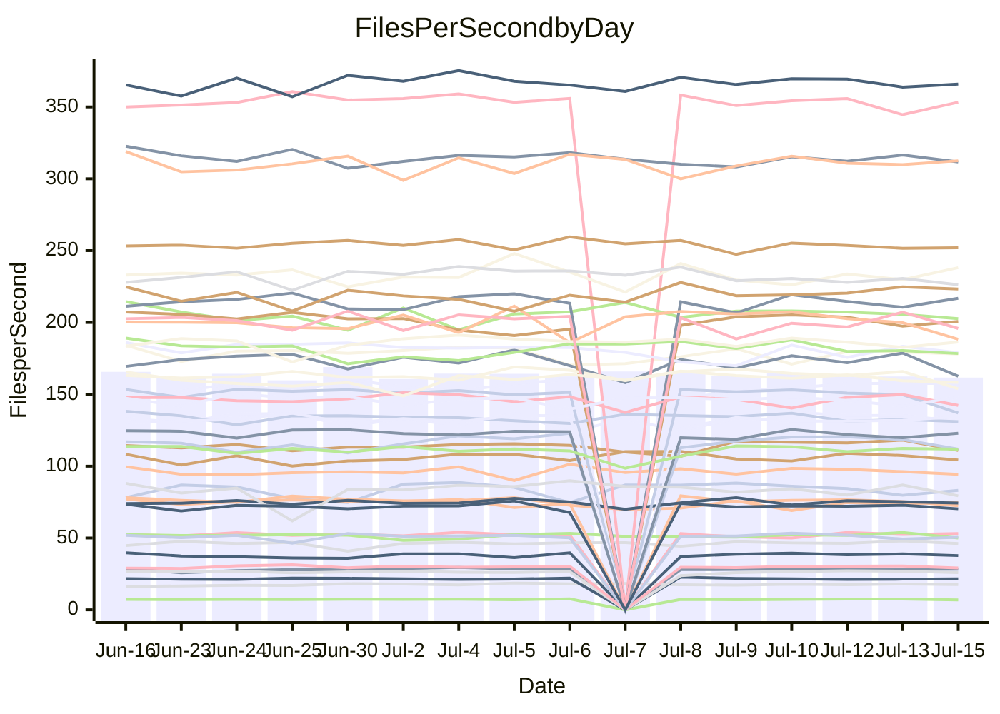

<!---
# This file is auto-generated. Do not edit.
# cspell:disable
--->
# Performance Report

## Daily Performance

## Time to Process Files

| Repository                                      | Elapsed | Min/Avg/Max           |   SD | SD Graph                |
| ----------------------------------------------- | ------: | :-------------------: | ---: | ----------------------- |
| AdaDoom3/AdaDoom3                    |    3.61 | 3.3 /   3.4 /   3.7   | 0.09 | `    ┣━━┻━━╋━━┻━━●    ` |
| alexiosc/megistos                    |    8.09 | 7.3 /   7.7 /   8.6   | 0.27 | `    ┣━━┻━━╋━━┻●━┫    ` |
| apollographql/apollo-server          |    2.72 | 2.5 /   2.6 /   3.0   | 0.11 | `    ┣━━┻━━╋━●┻━━┫    ` |
| aspnetboilerplate/aspnetboilerplate  |   10.54 | 10.2 /  10.6 /  11.1  | 0.28 | `    ┣━━┻━━●━━┻━━┫    ` |
| aws-amplify/docs                     |   12.87 | 12.6 /  13.1 /  13.9  | 0.33 | `    ┣━━┻●━╋━━┻━━┫    ` |
| Azure/azure-rest-api-specs           |    9.37 | 9.1 /   9.5 /  10.0   | 0.21 | `    ┣━━┻●━╋━━┻━━┫    ` |
| bitjson/typescript-starter           |    0.93 | 0.9 /   0.9 /   1.0   | 0.04 | `     ┣━┻━━●━━┻━┫     ` |
| caddyserver/caddy                    |    4.05 | 3.5 /   3.8 /   4.5   | 0.21 | `    ┣━━┻━━╋━━●━━┫    ` |
| canada-ca/open-source-logiciel-libre |    1.04 | 0.9 /   1.0 /   1.1   | 0.04 | `     ┣━┻━━╋━━┻━●     ` |
| chef/chef                            |    6.26 | 5.6 /   6.0 /   6.6   | 0.23 | `    ┣━━┻━━╋━━●━━┫    ` |
| dart-lang/sdk                        |   68.51 | 61.1 /  66.9 /  77.1  | 2.82 | `  ┣━━━┻━━━╋━●━┻━━━┫  ` |
| django/django                        |   15.97 | 15.0 /  15.8 /  17.8  | 0.65 | `   ┣━━━┻━━╋●━┻━━━┫   ` |
| eslint/eslint                        |   11.24 | 10.9 /  11.2 /  12.0  | 0.24 | `    ┣━━┻━━╋●━┻━━┫    ` |
| exonum/exonum                        |    3.42 | 3.4 /   3.6 /   4.5   | 0.26 | `    ┣━━┻●━╋━━┻━━┫    ` |
| flutter/samples                      |   17.16 | 17.1 /  18.0 /  19.3  | 0.50 | `   ┣●━━┻━━╋━━┻━━━┫   ` |
| gitbucket/gitbucket                  |    3.65 | 3.3 /   3.6 /   3.9   | 0.11 | `    ┣━━┻━━╋●━┻━━┫    ` |
| googleapis/google-cloud-cpp          |  136.92 | 134.4 / 140.7 / 152.7 | 4.22 | `  ┣━━━●━━━╋━━━┻━━━┫  ` |
| graphql/express-graphql              |    1.03 | 0.9 /   1.0 /   1.1   | 0.03 | `     ┣━┻━━╋━━┻●┫     ` |
| graphql/graphql-js                   |    2.72 | 2.6 /   2.7 /   3.0   | 0.10 | `    ┣━━┻━●╋━━┻━━┫    ` |
| graphql/graphql-relay-js             |    1.03 | 0.9 /   1.0 /   1.1   | 0.05 | `     ┣━┻━━╋━●┻━┫     ` |
| graphql/graphql-spec                 |    0.89 | 0.9 /   0.9 /   1.0   | 0.03 | `     ┣━┻━●╋━━┻━┫     ` |
| iluwatar/java-design-patterns        |   16.45 | 12.8 /  13.2 /  13.9  | 0.30 | `        ┣┻╋┻┫       ●` |
| ktaranov/sqlserver-kit               |    7.03 | 6.5 /   6.8 /   7.7   | 0.24 | `    ┣━━┻━━╋━━●━━┫    ` |
| liriliri/licia                       |    4.06 | 3.9 /   4.1 /   4.4   | 0.10 | `    ┣━━┻━━●━━┻━━┫    ` |
| MartinThoma/LaTeX-examples           |    6.92 | 6.6 /   7.1 /   7.5   | 0.24 | `    ┣━━┻●━╋━━┻━━┫    ` |
| mdx-js/mdx                           |    1.91 | 1.8 /   1.9 /   2.0   | 0.06 | `     ┣━┻━━╋●━┻━┫     ` |
| microsoft/TypeScript-Website         |    5.71 | 5.6 /   5.8 /   6.0   | 0.13 | `    ┣━━┻━●╋━━┻━━┫    ` |
| MicrosoftDocs/PowerShell-Docs        |   24.41 | 22.9 /  24.4 /  27.5  | 0.86 | `   ┣━━━┻━━●━━┻━━━┫   ` |
| neovim/nvim-lspconfig                |    4.85 | 4.1 /   4.3 /   4.7   | 0.15 | `    ┣━━┻━━╋━━┻━━┫   ●` |
| pagekit/pagekit                      |    3.75 | 3.6 /   3.7 /   3.9   | 0.09 | `    ┣━━┻━━╋━●┻━━┫    ` |
| php/php-src                          |   28.22 | 25.3 /  27.6 /  36.8  | 2.39 | `   ┣━━┻━━━╋●━━┻━━┫   ` |
| plasticrake/tplink-smarthome-api     |    1.15 | 1.1 /   1.2 /   1.3   | 0.03 | `     ┣━●━━╋━━┻━┫     ` |
| prettier/prettier                    |    7.29 | 7.1 /   7.3 /   7.7   | 0.16 | `    ┣━━┻━━╋●━┻━━┫    ` |
| pycontribs/jira                      |    1.59 | 1.5 /   1.5 /   1.7   | 0.06 | `     ┣━┻━━╋━●┻━┫     ` |
| RustPython/RustPython                |    5.42 | 4.9 /   5.1 /   5.5   | 0.13 | `    ┣━━┻━━╋━━┻━━┫●   ` |
| shoelace-style/shoelace              |    2.80 | 2.7 /   2.8 /   3.0   | 0.10 | `    ┣━━┻━●╋━━┻━━┫    ` |
| slint-ui/slint                       |   11.91 | 11.4 /  12.1 /  13.5  | 0.50 | `    ┣━━┻━●╋━━┻━━┫    ` |
| SoftwareBrothers/admin-bro           |    2.46 | 2.4 /   2.5 /   2.7   | 0.07 | `     ┣━┻━●╋━━┻━┫     ` |
| sveltejs/svelte                      |   21.09 | 19.5 /  20.6 /  21.7  | 0.50 | `   ┣━━━┻━━╋━━●━━━┫   ` |
| TheAlgorithms/Python                 |    5.67 | 5.6 /   6.0 /   6.3   | 0.17 | `    ┣●━┻━━╋━━┻━━┫    ` |
| twbs/bootstrap                       |    1.51 | 1.3 /   1.4 /   1.7   | 0.09 | `     ┣━┻━━╋━━●━┫     ` |
| typescript-cheatsheets/react         |    1.40 | 1.3 /   1.4 /   1.6   | 0.06 | `     ┣━┻━━●━━┻━┫     ` |
| typescript-eslint/typescript-eslint  |    4.09 | 4.0 /   4.1 /   4.3   | 0.11 | `    ┣━━┻━━●━━┻━━┫    ` |
| vitest-dev/vitest                    |    9.61 | 8.8 /   9.2 /  10.0   | 0.29 | `    ┣━━┻━━╋━━┻●━┫    ` |
| w3c/aria-practices                   |    3.30 | 3.1 /   3.3 /   3.8   | 0.13 | `    ┣━━┻━●╋━━┻━━┫    ` |
| w3c/specberus                        |    1.95 | 1.8 /   1.9 /   2.1   | 0.06 | `     ┣━┻━━╋●━┻━┫     ` |
| webdeveric/webpack-assets-manifest   |    1.14 | 1.0 /   1.0 /   1.2   | 0.04 | `     ┣━┻━━╋━━┻━┫●    ` |
| webpack/webpack                      |    5.58 | 5.1 /   5.4 /   6.0   | 0.18 | `    ┣━━┻━━╋━━┻●━┫    ` |
| wireapp/wire-desktop                 |    0.93 | 0.9 /   0.9 /   1.1   | 0.04 | `     ┣━┻━━●━━┻━┫     ` |
| wireapp/wire-webapp                  |   11.35 | 10.5 /  11.1 /  12.2  | 0.35 | `    ┣━━┻━━╋━●┻━━┫    ` |

Note:
- Elapsed time is in seconds.

## Files per Second over Time

| Repository                                      | Files |    Sec |    Fps |     Rel | Trend Fps              |    N |
| ----------------------------------------------- | ----: | -----: | -----: | ------: | ---------------------- | ---: |
| AdaDoom3/AdaDoom3                    |   103 |   3.61 |  28.50 |  -4.99% | `█▇▇▆▇▇▆▇▅▇▇█▇▇▇██▇▇▅` |   28 |
| alexiosc/megistos                    |   583 |   8.09 |  72.04 |  -4.52% | `▅█▇▇▅▆█▇▆▆█▇▇▆▇▇▆▇▅▅` |   28 |
| apollographql/apollo-server          |   252 |   2.72 |  92.57 |  -3.88% | `▅█▇▅█▆▇▇▅▇▇▇▇▇▇▅▇▇▆▅` |   30 |
| aspnetboilerplate/aspnetboilerplate  |  2259 |  10.54 | 214.23 |   0.13% | `▆▅█▆█▆▇▆▅▇█▆▆█▆▆▄▇█▇` |   29 |
| aws-amplify/docs                     |  2871 |  12.87 | 223.03 |   1.72% | `▆▅▇▄▇▆██▅▇▇▇█▆▇█▇█▇▇` |   30 |
| Azure/azure-rest-api-specs           |  2411 |   9.37 | 257.24 |   1.51% | `▇▇▆▇▇▇▄▆▅█▆▅▇█▅▇▆▆▆▇` |   31 |
| bitjson/typescript-starter           |    20 |   0.93 |  21.44 |  -0.22% | `▇▆▇▄▆▇█▆█▆▇▆▄▇▆█▄▇▆▆` |   28 |
| caddyserver/caddy                    |   285 |   4.05 |  70.29 |  -6.24% | `▅█▆▇▆▅▅▇▆▃▆█▆▆▄▅█▅█▅` |   30 |
| canada-ca/open-source-logiciel-libre |     7 |   1.04 |   6.76 |  -7.17% | `▅▅▆▅▄▆▅▅▄▅▅▅█▆▅▆▅▆▅▃` |   28 |
| chef/chef                            |  1206 |   6.26 | 192.54 |  -3.94% | `▇▅▄█▄▇▇▇▆▆█▇▇▄▇▅▅▇▃▅` |   30 |
| dart-lang/sdk                        | 10708 |  68.51 | 156.29 |  -2.38% | `▇▆▆▆▆▇▇▆▅▇█▆▆▅▆▅▅▆▆▅` |   31 |
| django/django                        |  2847 |  15.97 | 178.22 |  -1.47% | `▄▇▇████▆██▇▇▇▆█▆▇▇▆▆` |   31 |
| eslint/eslint                        |  2080 |  11.24 | 185.01 |  -0.66% | `████▇▇█▆▇▇█▇▇▇▇▇▇▅▇▇` |   30 |
| exonum/exonum                        |   421 |   3.42 | 123.24 |   5.88% | `▇▆▇█▇█▆█▆▇█▇█▆███▆▄█` |   28 |
| flutter/samples                      |  2452 |  17.16 | 142.89 |  -2.53% | `██▆▇▄▇▆█▅▆▆██▇▇██▆▅▆` |   30 |
| gitbucket/gitbucket                  |   412 |   3.65 | 113.02 |  -1.28% | `▆▆▅▆▅▄▃▆▆▆▇▆▅▇▆█▆▅▄▅` |   30 |
| googleapis/google-cloud-cpp          | 20560 | 136.92 | 150.16 |   3.04% | `█▆▇▅▇▇▇▇▇██▆█▆▅▇▅▇██` |   30 |
| graphql/express-graphql              |    26 |   1.03 |  25.34 |  -4.40% | `▇▇▇▅▆▇▃▆▅▆▇▆█▇▇▆▇▇▆▅` |   28 |
| graphql/graphql-js                   |   364 |   2.72 | 133.81 |   0.61% | `▇▄▇█▄▇▄▇▇██▇█▇▇▇█▇▅▇` |   29 |
| graphql/graphql-relay-js             |    28 |   1.03 |  27.08 |  -3.39% | `▇▇██▇▇▆▇▆▆▇▅▇▇▇█▅▇█▆` |   28 |
| graphql/graphql-spec                 |    16 |   0.89 |  18.03 |   3.15% | `█▆▅█▇█▆▅▆▆▇▆█▆▅▆█▇▅▇` |   30 |
| iluwatar/java-design-patterns        |  1992 |  16.45 | 121.08 | -20.03% | `▅█▆█▆▇▇█▆█▇█▇▆▆▅█▇▇ ` |   28 |
| ktaranov/sqlserver-kit               |   489 |   7.03 |  69.60 |  -3.12% | `▆▇▇▇█▅▇▇▆▇▇▇▅▇▇▇▆▇▆▆` |   29 |
| liriliri/licia                       |  1437 |   4.06 | 353.79 |   0.08% | `▇▇█▇▇▇▇▅█▆██▇█▆▄▇▇▇▇` |   29 |
| MartinThoma/LaTeX-examples           |  1409 |   6.92 | 203.56 |   1.75% | `▄▆▇▇▆▇▆▄▄▅▇▅▄▆▆▇▆█▄▇` |   28 |
| mdx-js/mdx                           |   141 |   1.91 |  73.89 |  -1.52% | `▄▆▅▇▆▄▆▆█▇▄▆▇▆▇▆▇▅▆▅` |   29 |
| microsoft/TypeScript-Website         |   760 |   5.71 | 133.01 |   0.62% | `█▇▅███▅▇▇▆▇▇▇█▅▆▇▇█▇` |   28 |
| MicrosoftDocs/PowerShell-Docs        |  2708 |  24.41 | 110.95 |  -0.22% | `▇▆▆▆▃▅█▆▇▇▆▇▆▆▇▆▇▇▆▆` |   31 |
| neovim/nvim-lspconfig                |   750 |   4.85 | 154.59 | -10.78% | `▇▅██▆▄▇▅▆▇▇▇▆▇▅█▇▇▆▃` |   30 |
| pagekit/pagekit                      |   741 |   3.75 | 197.43 |  -2.14% | `▇█▅▆▅▆▆▇█████▇▇▆▅██▆` |   28 |
| php/php-src                          |  2281 |  28.22 |  80.84 |  -2.61% | `█▇▇█▇▇▅█▇▇▇▅▅▆▇█▇▄▇▆` |   31 |
| plasticrake/tplink-smarthome-api     |    62 |   1.15 |  54.06 |   3.18% | `▇▆██▇▇▇▆▅▄▆██▇█▇▇▇▇█` |   28 |
| prettier/prettier                    |  2274 |   7.29 | 311.72 |  -0.66% | `██▇▇█▇▇▇▆▇██▆▆█▇▇█▇▇` |   30 |
| pycontribs/jira                      |    79 |   1.59 |  49.64 |  -2.98% | `▇▆▇▆▇▆▇▇▆███▇▇▇▅▆▅▇▆` |   28 |
| RustPython/RustPython                |   682 |   5.42 | 125.73 |  -5.80% | `▇▇▇▆▆▇▇▇▇█▇▆▇▅▇▇▆▆▇▅` |   30 |
| shoelace-style/shoelace              |   439 |   2.80 | 156.62 |   0.99% | `▆▆▅▆▇▇▄▄▇▅█▆▇█▆▇▅█▇▇` |   28 |
| slint-ui/slint                       |  2204 |  11.91 | 185.03 |   2.54% | `▆▆▇▇▇▆▅▄▅█▇▃▅█▆▅█▇▅▇` |   30 |
| SoftwareBrothers/admin-bro           |   441 |   2.46 | 179.07 |   0.49% | `▇███▅▆▇▇█▆▆▇▇▇█▇▇█▇▇` |   29 |
| sveltejs/svelte                      |  7597 |  21.09 | 360.15 |  -1.86% | `▆█▆▆▅▆▅▆█▅█▆▅▆▇▆▄▆▆▅` |   31 |
| TheAlgorithms/Python                 |  1390 |   5.67 | 245.24 |   5.62% | `▆▆▅█▆▄▇▆▅▄▅▇▅▆▆▅▅▆▆█` |   29 |
| twbs/bootstrap                       |   118 |   1.51 |  78.17 |  -6.99% | `██▇▇▄▇▇█▇▇▇▆▆▇▇▅█▄█▅` |   30 |
| typescript-cheatsheets/react         |    53 |   1.40 |  37.94 |  -0.53% | `▇▇▇█▅█▆█▇██▆▇█▆█▆█▆▇` |   28 |
| typescript-eslint/typescript-eslint  |  1272 |   4.09 | 310.82 |   0.36% | `▆█▇▆█▇▆▇▆██▅▇███▇▆█▇` |   30 |
| vitest-dev/vitest                    |  2140 |   9.61 | 222.72 |  -3.94% | `██▇▇▇█▅▇▅█▅▅▇▇▅▇▆█▄▅` |   31 |
| w3c/aria-practices                   |   409 |   3.30 | 124.07 |   1.53% | `▆█▅▇▇▆▆▅▇▇▅▆▇██▃▇▆▇▇` |   29 |
| w3c/specberus                        |   203 |   1.95 | 103.87 |  -1.98% | `▇█▇▇▆██▇▅▆▅█▇███▇▆▆▆` |   30 |
| webdeveric/webpack-assets-manifest   |    54 |   1.14 |  47.43 |  -8.05% | `▇▃▇▇▆▆▆▆▇▇▆▇▅███▇▆▆▄` |   30 |
| webpack/webpack                      |  1109 |   5.58 | 198.63 |  -3.20% | `▄▆▇▇█▆▇▇▆█▇█▇▇▆▇▇▆▇▆` |   31 |
| wireapp/wire-desktop                 |    43 |   0.93 |  46.34 |   0.19% | `▆▇▇▇▇▇▆█▇▇▆▆▆▇▇▇██▇▇` |   30 |
| wireapp/wire-webapp                  |  1811 |  11.35 | 159.61 |  -2.09% | `▆▄▇▇▇▆▇▇▇▆▇▆▆▇▆▆▆█▃▆` |   30 |

## Data Throughput

| Repository                                      | Files |    Sec |     Kps |     Rel | Trend Kps              |    N |
| ----------------------------------------------- | ----: | -----: | ------: | ------: | ---------------------- | ---: |
| AdaDoom3/AdaDoom3                    |   103 |   3.61 |  605.70 |  -4.99% | `█▇▇▆▇▇▆▇▅▇▇█▇▇▇██▇▇▅` |   28 |
| alexiosc/megistos                    |   583 |   8.09 |  566.03 |  -4.52% | `▅█▇▇▅▆█▇▆▆█▇▇▆▇▇▆▇▅▅` |   28 |
| apollographql/apollo-server          |   252 |   2.72 |  744.63 |  -2.87% | `▅█▇▅█▇█▇▆█▇█▇▇▇▆▇▇▇▆` |   30 |
| aspnetboilerplate/aspnetboilerplate  |  2259 |  10.54 |  504.14 |   0.14% | `▆▅█▆█▆▇▆▅▇█▆▆█▆▆▄▇█▇` |   29 |
| aws-amplify/docs                     |  2871 |  12.87 |  776.60 |   1.76% | `▆▅▇▅▇▆██▅▇▇▇█▆▇█▇█▇▇` |   30 |
| Azure/azure-rest-api-specs           |  2411 |   9.37 |  707.70 |   1.78% | `▇▇▆▇▇▇▄▆▅█▆▅▇█▅▇▆▆▆▇` |   31 |
| bitjson/typescript-starter           |    20 |   0.93 |   85.77 |  -0.22% | `▇▆▇▄▆▇█▆█▆▇▆▄▇▆█▄▇▆▆` |   28 |
| caddyserver/caddy                    |   285 |   4.05 |  596.63 |  -6.20% | `▅█▆▇▆▅▅▇▆▃▆█▆▆▄▅█▅█▅` |   30 |
| canada-ca/open-source-logiciel-libre |     7 |   1.04 |   56.02 |  -7.17% | `▅▅▆▅▄▆▅▅▄▅▅▅█▆▅▆▅▆▅▃` |   28 |
| chef/chef                            |  1206 |   6.26 |  886.53 |  -3.82% | `▇▅▄█▄▇▇▇▆▆█▇▇▄▇▅▅▇▃▅` |   30 |
| dart-lang/sdk                        | 10708 |  68.51 | 1063.09 |  -2.46% | `▇▆▆▆▆▇▇▆▅▇█▆▆▅▆▅▅▆▆▅` |   31 |
| django/django                        |  2847 |  15.97 | 1108.40 |  -1.44% | `▄▇▇████▆██▇▇▇▆█▆▇▇▆▆` |   31 |
| eslint/eslint                        |  2080 |  11.24 | 1337.86 |  -0.71% | `████▇▇█▆▇▇█▇▇▇▇▇▇▅▇▇` |   30 |
| exonum/exonum                        |   421 |   3.42 | 1178.81 |   5.88% | `▇▆▇█▇█▆█▆▇█▇█▆███▆▄█` |   28 |
| flutter/samples                      |  2452 |  17.16 | 1255.72 |   3.41% | `▇█▆▇▄▇▆▇▄▅▆██▆▇███▇█` |   30 |
| gitbucket/gitbucket                  |   412 |   3.65 |  511.34 |  -1.26% | `▆▆▅▆▅▄▃▆▆▆▇▆▅▇▆█▆▅▄▅` |   30 |
| googleapis/google-cloud-cpp          | 20560 | 136.92 | 1203.76 |   3.54% | `█▆▇▅▇▇▇▇▇██▆█▆▅▇▅▇██` |   30 |
| graphql/express-graphql              |    26 |   1.03 |  115.99 |  -4.40% | `▇▇▇▅▆▇▃▆▅▆▇▆█▇▇▆▇▇▆▅` |   28 |
| graphql/graphql-js                   |   364 |   2.72 |  769.06 |   0.55% | `▇▄▇█▄▇▄▇▇██▇█▇▇▇█▇▅▇` |   29 |
| graphql/graphql-relay-js             |    28 |   1.03 |  106.40 |  -3.39% | `▇▇██▇▇▆▇▆▆▇▅▇▇▇█▅▇█▆` |   28 |
| graphql/graphql-spec                 |    16 |   0.89 |  653.55 |   2.70% | `▇▆▄█▆█▆▄▆▆▇▆█▅▄▆▇▇▅▇` |   30 |
| iluwatar/java-design-patterns        |  1992 |  16.45 |  374.25 | -20.03% | `▅█▆█▆▇▇█▆█▇█▇▆▆▅█▇▇ ` |   28 |
| ktaranov/sqlserver-kit               |   489 |   7.03 | 1053.60 |  -3.12% | `▆▇▇▇█▅▇▇▆▇▇▇▅▇▇▇▆▇▆▆` |   29 |
| liriliri/licia                       |  1437 |   4.06 |  421.49 |   0.08% | `▇▇█▇▇▇▇▅█▆██▇█▆▄▇▇▇▇` |   29 |
| MartinThoma/LaTeX-examples           |  1409 |   6.92 |  420.41 |   1.75% | `▄▆▇▇▆▇▆▄▄▅▇▅▄▆▆▇▆█▄▇` |   28 |
| mdx-js/mdx                           |   141 |   1.91 |  343.24 |  -1.52% | `▄▆▅▇▆▄▆▆█▇▄▆▇▆▇▆▇▅▆▅` |   29 |
| microsoft/TypeScript-Website         |   760 |   5.71 |  918.62 |   0.62% | `█▇▅███▅▇▇▆▇▇▇█▅▆▇▇█▇` |   28 |
| MicrosoftDocs/PowerShell-Docs        |  2708 |  24.41 | 1139.90 |  -0.25% | `▇▆▆▆▃▅█▆▇▇▆▇▆▆▇▆▇▇▆▆` |   31 |
| neovim/nvim-lspconfig                |   750 |   4.85 |  248.18 | -10.73% | `▇▅▇█▆▄▇▅▆▇▇▇▆▇▅█▇▇▆▃` |   30 |
| pagekit/pagekit                      |   741 |   3.75 |  411.65 |  -2.14% | `▇█▅▆▅▆▆▇█████▇▇▆▅██▆` |   28 |
| php/php-src                          |  2281 |  28.22 | 1406.52 |  -2.57% | `█▇▇█▇▇▅█▇▇▇▅▅▆▇█▇▄▇▆` |   31 |
| plasticrake/tplink-smarthome-api     |    62 |   1.15 |  292.09 |   3.18% | `▇▆██▇▇▇▆▅▄▆██▇█▇▇▇▇█` |   28 |
| prettier/prettier                    |  2274 |   7.29 |  443.32 |  -0.59% | `██▇▇█▇▇▇▆▇██▆▆█▇▇█▇▇` |   30 |
| pycontribs/jira                      |    79 |   1.59 |  353.12 |  -2.98% | `▇▆▇▆▇▆▇▇▆███▇▇▇▅▆▅▇▆` |   28 |
| RustPython/RustPython                |   682 |   5.42 |  979.07 |  -5.34% | `▇▇▇▆▆▇▇▇▇█▇▆▇▅▇▇▆▆█▅` |   30 |
| shoelace-style/shoelace              |   439 |   2.80 |  756.71 |   0.99% | `▆▆▅▆▇▇▄▄▇▅█▆▇█▆▇▅█▇▇` |   28 |
| slint-ui/slint                       |  2204 |  11.91 | 1197.84 |   2.36% | `▆▆▇▇▇▆▅▄▅█▇▃▅█▆▅█▇▅▇` |   30 |
| SoftwareBrothers/admin-bro           |   441 |   2.46 |  394.68 |   0.49% | `▇███▅▆▇▇█▆▆▇▇▇█▇▇█▇▇` |   29 |
| sveltejs/svelte                      |  7597 |  21.09 |  239.27 |  -1.85% | `▆█▆▆▅▆▅▆█▅█▆▅▆▇▆▄▆▆▅` |   31 |
| TheAlgorithms/Python                 |  1390 |   5.67 |  622.45 |   5.60% | `▆▆▅█▆▄▇▆▅▄▅▇▅▆▆▅▅▆▆█` |   29 |
| twbs/bootstrap                       |   118 |   1.51 |  641.91 |  -6.99% | `██▇▇▄▇▇█▇▇▇▆▆▇▇▅█▄█▅` |   30 |
| typescript-cheatsheets/react         |    53 |   1.40 |  277.06 |  -0.53% | `▇▇▇█▅█▆█▇██▆▇█▆█▆█▆▇` |   28 |
| typescript-eslint/typescript-eslint  |  1272 |   4.09 | 1588.05 |   0.72% | `▆█▇▆█▇▆▇▆██▅▇███▇▆█▇` |   30 |
| vitest-dev/vitest                    |  2140 |   9.61 |  484.89 |  -4.25% | `██▇▇▇█▅▇▅█▅▅▇▇▅▇▆█▄▅` |   31 |
| w3c/aria-practices                   |   409 |   3.30 | 1154.29 |   1.68% | `▆█▅▇▇▆▆▅▇▇▅▆▇██▃▇▆▇▇` |   29 |
| w3c/specberus                        |   203 |   1.95 |  323.36 |  -2.54% | `▇█▇█▆██▇▅▆▅█▇███▇▆▆▆` |   30 |
| webdeveric/webpack-assets-manifest   |    54 |   1.14 |  110.67 |  -8.05% | `▇▃▇▇▆▆▆▆▇▇▆▇▅███▇▆▆▄` |   30 |
| webpack/webpack                      |  1109 |   5.58 |  894.45 |  -3.48% | `▄▆▇▇█▇▇▇▆█▇█▇▇▇▇▇▆▇▆` |   31 |
| wireapp/wire-desktop                 |    43 |   0.93 |  204.74 |   0.19% | `▆▇▇▇▇▇▆█▇▇▆▆▆▇▇▇██▇▇` |   30 |
| wireapp/wire-webapp                  |  1811 |  11.35 |  568.53 |  -2.21% | `▆▄▇▇▇▆▇▇▇▆▇▆▆▇▆▆▆█▃▆` |   30 |

