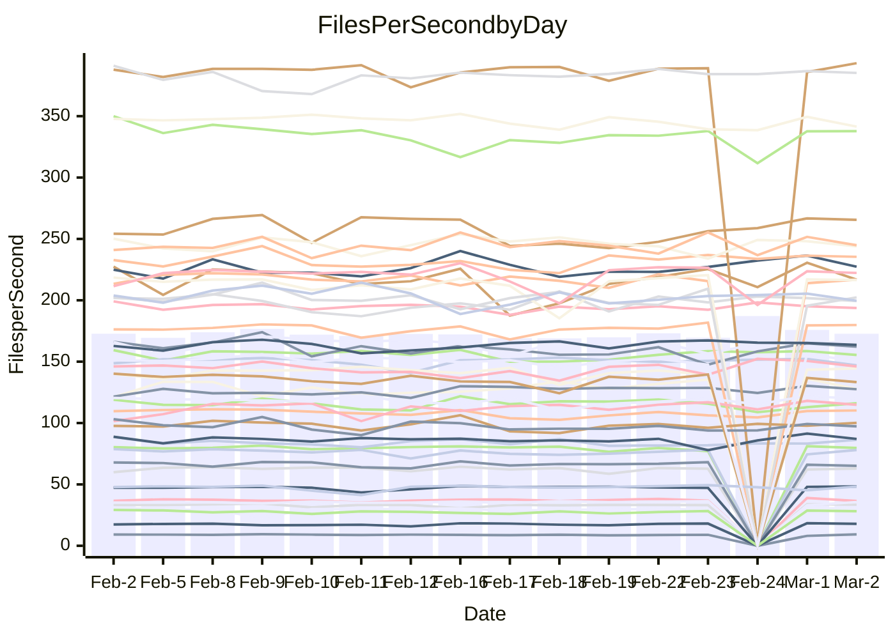

<!---
# This file is auto-generated. Do not edit.
# cspell:disable
--->
# Performance Report

## Daily Performance

## Time to Process Files

| Repository                                      | Elapsed | Min/Avg/Max           |   SD | SD Graph                |
| ----------------------------------------------- | ------: | :-------------------: | ---: | ----------------------- |
| AdaDoom3/AdaDoom3                    |    3.07 | 3.0 /   3.1 /   3.4   | 0.09 | `    ┣━━┻━●╋━━┻━━┫    ` |
| alexiosc/megistos                    |    7.53 | 7.1 /   7.4 /   8.2   | 0.22 | `    ┣━━┻━━╋━●┻━━┫    ` |
| apollographql/apollo-server          |    2.30 | 2.2 /   2.3 /   2.5   | 0.07 | `     ┣━┻━━●━━┻━┫     ` |
| aspnetboilerplate/aspnetboilerplate  |    9.67 | 9.3 /  10.0 /  11.3   | 0.41 | `    ┣━━●━━╋━━┻━━┫    ` |
| aws-amplify/docs                     |   12.18 | 11.5 /  12.4 /  13.1  | 0.35 | `    ┣━━┻●━╋━━┻━━┫    ` |
| Azure/azure-rest-api-specs           |    9.03 | 8.8 /   9.4 /  10.5   | 0.48 | `    ┣━━┻●━╋━━┻━━┫    ` |
| bitjson/typescript-starter           |    0.64 | 0.6 /   0.7 /   0.9   | 0.04 | `     ┣━┻●━╋━━┻━┫     ` |
| caddyserver/caddy                    |    3.26 | 3.1 /   3.4 /   3.8   | 0.16 | `    ┣━━┻●━╋━━┻━━┫    ` |
| canada-ca/open-source-logiciel-libre |    0.74 | 0.7 /   0.8 /   1.0   | 0.05 | `     ┣━●━━╋━━┻━┫     ` |
| chef/chef                            |    5.45 | 5.2 /   5.7 /   8.2   | 0.52 | `    ┣━━┻━●╋━━┻━━┫    ` |
| dart-lang/sdk                        |   60.36 | 59.1 /  62.0 /  68.9  | 2.29 | `  ┣━━━┻●━━╋━━━┻━━━┫  ` |
| django/django                        |   14.68 | 14.2 /  14.6 /  15.6  | 0.30 | `    ┣━━┻━━╋●━┻━━┫    ` |
| eslint/eslint                        |   10.42 | 9.8 /  10.4 /  11.9   | 0.41 | `    ┣━━┻━━●━━┻━━┫    ` |
| exonum/exonum                        |    3.60 | 3.0 /   3.3 /   3.7   | 0.15 | `    ┣━━┻━━╋━━┻━━┫●   ` |
| flutter/samples                      |   17.51 | 16.5 /  17.4 /  19.9  | 0.72 | `   ┣━━━┻━━●━━┻━━━┫   ` |
| gitbucket/gitbucket                  |    3.27 | 3.1 /   3.2 /   3.5   | 0.11 | `    ┣━━┻━━╋●━┻━━┫    ` |
| googleapis/google-cloud-cpp          |  129.29 | 125.1 / 131.4 / 145.3 | 4.30 | `  ┣━━━┻━●━╋━━━┻━━━┫  ` |
| graphql/express-graphql              |    0.72 | 0.7 /   0.7 /   0.8   | 0.02 | `     ┣━━●━╋━┻━━┫     ` |
| graphql/graphql-js                   |    2.32 | 2.2 /   2.3 /   2.5   | 0.07 | `     ┣━┻━━╋●━┻━┫     ` |
| graphql/graphql-relay-js             |    0.73 | 0.7 /   0.8 /   0.9   | 0.03 | `     ┣━┻●━╋━━┻━┫     ` |
| graphql/graphql-spec                 |    0.84 | 0.8 /   0.9 /   1.1   | 0.06 | `     ┣━┻━●╋━━┻━┫     ` |
| iluwatar/java-design-patterns        |   11.79 | 10.9 /  12.0 /  14.4  | 0.62 | `   ┣━━━┻━●╋━━┻━━━┫   ` |
| ktaranov/sqlserver-kit               |    6.41 | 6.1 /   6.4 /   7.0   | 0.24 | `    ┣━━┻━━●━━┻━━┫    ` |
| liriliri/licia                       |    3.72 | 3.5 /   3.7 /   3.9   | 0.09 | `    ┣━━┻━━●━━┻━━┫    ` |
| MartinThoma/LaTeX-examples           |    7.09 | 6.2 /   6.6 /   7.6   | 0.25 | `    ┣━━┻━━╋━━┻━━●    ` |
| mdx-js/mdx                           |    1.59 | 1.5 /   1.6 /   1.9   | 0.08 | `     ┣━┻●━╋━━┻━┫     ` |
| microsoft/TypeScript-Website         |    5.24 | 5.0 /   5.4 /   5.9   | 0.21 | `    ┣━━┻●━╋━━┻━━┫    ` |
| MicrosoftDocs/PowerShell-Docs        |   23.30 | 22.5 /  24.2 /  28.9  | 1.27 | `   ┣━━┻━●━╋━━━┻━━┫   ` |
| neovim/nvim-lspconfig                |    3.37 | 3.1 /   3.3 /   3.7   | 0.12 | `    ┣━━┻━━╋━●┻━━┫    ` |
| pagekit/pagekit                      |    3.31 | 3.3 /   3.4 /   3.7   | 0.10 | `    ┣━━●━━╋━━┻━━┫    ` |
| php/php-src                          |   24.66 | 21.1 /  23.0 /  26.5  | 1.31 | `   ┣━━┻━━━╋━━━┻●━┫   ` |
| plasticrake/tplink-smarthome-api     |    0.98 | 0.9 /   0.9 /   1.1   | 0.04 | `     ┣━┻━━╋━━●━┫     ` |
| prettier/prettier                    |    6.50 | 6.2 /   6.6 /   7.2   | 0.19 | `    ┣━━┻━●╋━━┻━━┫    ` |
| pycontribs/jira                      |    1.26 | 1.2 /   1.3 /   1.5   | 0.05 | `     ┣━┻━●╋━━┻━┫     ` |
| RustPython/RustPython                |    4.24 | 4.1 /   4.3 /   4.8   | 0.15 | `    ┣━━┻━●╋━━┻━━┫    ` |
| shoelace-style/shoelace              |    2.47 | 2.4 /   2.5 /   2.8   | 0.08 | `     ┣━┻━━●━━┻━┫     ` |
| slint-ui/slint                       |   10.52 | 9.2 /  10.1 /  13.1   | 0.65 | `    ┣━━┻━━╋━●┻━━┫    ` |
| SoftwareBrothers/admin-bro           |    2.15 | 2.1 /   2.2 /   2.4   | 0.08 | `     ┣━┻●━╋━━┻━┫     ` |
| sveltejs/svelte                      |   18.64 | 18.4 /  18.8 /  20.1  | 0.37 | `    ┣━━┻●━╋━━┻━━┫    ` |
| TheAlgorithms/Python                 |    5.71 | 5.3 /   5.6 /   6.2   | 0.21 | `    ┣━━┻━━╋●━┻━━┫    ` |
| twbs/bootstrap                       |    1.21 | 1.1 /   1.2 /   1.4   | 0.06 | `     ┣━┻━●╋━━┻━┫     ` |
| typescript-cheatsheets/react         |    1.07 | 1.1 /   1.1 /   1.3   | 0.04 | `     ┣━●━━╋━━┻━┫     ` |
| typescript-eslint/typescript-eslint  |    3.85 | 3.6 /   3.7 /   3.9   | 0.07 | `    ┣━━┻━━╋━━┻━━●    ` |
| vitest-dev/vitest                    |    7.90 | 7.6 /   8.1 /   9.2   | 0.28 | `    ┣━━●━━╋━━┻━━┫    ` |
| w3c/aria-practices                   |    3.01 | 2.9 /   3.0 /   3.3   | 0.10 | `    ┣━━┻━━╋●━┻━━┫    ` |
| w3c/specberus                        |    1.67 | 1.6 /   1.7 /   1.9   | 0.06 | `     ┣━┻━●╋━━┻━┫     ` |
| webdeveric/webpack-assets-manifest   |    0.66 | 0.7 /   0.7 /   0.8   | 0.04 | `     ┣━┻●━╋━━┻━┫     ` |
| webpack/webpack                      |    4.79 | 4.6 /   5.0 /   5.6   | 0.21 | `    ┣━━┻●━╋━━┻━━┫    ` |
| wireapp/wire-desktop                 |    0.90 | 0.9 /   0.9 /   1.1   | 0.05 | `     ┣━┻━━●━━┻━┫     ` |
| wireapp/wire-webapp                  |    8.89 | 8.3 /   8.8 /  10.0   | 0.28 | `    ┣━━┻━━╋●━┻━━┫    ` |

Note:
- Elapsed time is in seconds.

## Files per Second over Time

| Repository                                      | Files |    Sec |    Fps |    Rel | Trend Fps              |    N |
| ----------------------------------------------- | ----: | -----: | -----: | -----: | ---------------------- | ---: |
| AdaDoom3/AdaDoom3                    |   103 |   3.07 |  33.57 |  1.20% | `▇▆▇▇████▆▇▆▇▇▇██▇▇▇▇` |   37 |
| alexiosc/megistos                    |   583 |   7.53 |  77.43 | -2.42% | `█▇▇▆▄▇██▇█▇▆▅███▆██▆` |   37 |
| apollographql/apollo-server          |   250 |   2.30 | 108.53 |  0.26% | `▅▄▇▆▄▇▆▅▇▆▇▇▄▅▇▆▇▆█▆` |   39 |
| aspnetboilerplate/aspnetboilerplate  |  2246 |   9.67 | 232.28 |  3.24% | `▆▃▇▇▆█▆▅▅▅▅▆▇▇▇▆▅▇▇▇` |   38 |
| aws-amplify/docs                     |  2867 |  12.18 | 235.46 |  1.44% | `▆▇▆▅▇▆▆▅▅▆▆█▅▆▆▅▇▆▇▆` |   39 |
| Azure/azure-rest-api-specs           |  2419 |   9.03 | 267.96 |  5.35% | `▄▅▅▅▅▅▇▆▄▃█▅█▇███▇██` |   39 |
| bitjson/typescript-starter           |    20 |   0.64 |  31.23 |  5.63% | `▇▇▆▇▇▇▆█▆▇▇▇▇▇█▇█▇▇█` |   37 |
| caddyserver/caddy                    |   279 |   3.26 |  85.46 |  2.51% | `▅▇▇▄▇▆▇█▅█▃▆▆▇▇████▇` |   39 |
| canada-ca/open-source-logiciel-libre |     7 |   0.74 |   9.44 |  6.22% | `▇▇▇▄█▂▅▇▇▆▇▇█▆▅█▇███` |   37 |
| chef/chef                            |  1204 |   5.45 | 221.01 |  3.15% | `▇█▅▆▇▆▆█▇████▇█▇▇█▅▇` |   38 |
| dart-lang/sdk                        | 10158 |  60.36 | 168.28 |  3.12% | `▆▆▆█▇█▇▇▇███▄▇▇▇▇███` |   39 |
| django/django                        |  2833 |  14.68 | 193.04 | -0.42% | `▇▇█▆▇█▇▇█▇▇▇▆█▇█▅██▇` |   39 |
| eslint/eslint                        |  2060 |  10.42 | 197.63 |  0.05% | `▅▆▆▅▇█▇████▇▇██▇█▇█▇` |   39 |
| exonum/exonum                        |   421 |   3.60 | 117.03 | -9.80% | `▇▇▆▅▆▅█▇▅▇▆▇▇██▇▇▆▅▄` |   37 |
| flutter/samples                      |  2693 |  17.51 | 153.81 | -0.71% | `▇▅▇█▃█▇█▆█▄▇█▇▇▇▇▆▆▇` |   38 |
| gitbucket/gitbucket                  |   412 |   3.27 | 126.00 | -0.75% | `▇▇▇▇▇▅▆██▇▇▆█▆▇▅▇▇▇▆` |   39 |
| googleapis/google-cloud-cpp          | 19818 | 129.29 | 153.28 |  1.52% | `▅▅▆▅███▆▇▆▇▇█▃█▇▆▆▅▇` |   38 |
| graphql/express-graphql              |    26 |   0.72 |  36.01 |  1.64% | `██▇▆▇▅█▇▇█▆▇█▇▄█▇▇▆▇` |   37 |
| graphql/graphql-js                   |   344 |   2.32 | 148.50 | -1.00% | `██▇▇▇██▆▇▇█▇████▇▄▇▇` |   39 |
| graphql/graphql-relay-js             |    28 |   0.73 |  38.33 |  2.97% | `▆▇▇█▇▆▇▇████▆▇█▃█▇▇█` |   37 |
| graphql/graphql-spec                 |    15 |   0.84 |  17.79 |  1.69% | `▇█▇▄▄█▇▇▇█▇█████▇▇█▇` |   38 |
| iluwatar/java-design-patterns        |  1927 |  11.79 | 163.43 |  2.20% | `▇██▇▄█▇▇▇██▃█▇█▇██▇█` |   38 |
| ktaranov/sqlserver-kit               |   489 |   6.41 |  76.26 | -0.20% | `▅▆▆▆▇▄▇▇▇▇▇▃█▆▆▇█▇▇▆` |   37 |
| liriliri/licia                       |  1434 |   3.72 | 385.85 | -0.18% | `▇▆▆▆▅▆▅█▇▇▇▇▆▇▇█▇█▇▇` |   37 |
| MartinThoma/LaTeX-examples           |  1409 |   7.09 | 198.71 | -7.58% | `▃▇▇▇▇▆▇█▇▇█▅█▇▇██▇▇▅` |   37 |
| mdx-js/mdx                           |   141 |   1.59 |  88.72 |  3.36% | `▆▇▆▇▄▄██▇▇▇▅▃▆█▇▆▆▇▇` |   38 |
| microsoft/TypeScript-Website         |   760 |   5.24 | 145.09 |  2.38% | `▄▅▇█▅▇█▅▇██▆▆▇▇▇▇█▇▇` |   38 |
| MicrosoftDocs/PowerShell-Docs        |  2709 |  23.30 | 116.26 |  3.41% | `▇▇▇▆▄█▇▇█▅██▇▆█▇▇▇▇▇` |   39 |
| neovim/nvim-lspconfig                |   381 |   3.37 | 112.95 | -2.69% | `▆▇▇█▇▆▇██▇▇▇▅▅▆▆▇▇▇▆` |   39 |
| pagekit/pagekit                      |   741 |   3.31 | 223.60 |  2.94% | `▇▄▇▅▇▆█▇▇█▇▇▅█▆▅▆▇██` |   37 |
| php/php-src                          |  2221 |  24.66 |  90.08 | -7.08% | `▃▇█▅▆█▆▄▇▆▇▄▇▅▇▄██▇▄` |   39 |
| plasticrake/tplink-smarthome-api     |    62 |   0.98 |  63.36 | -4.47% | `▇▆▇▇▇█▇█▅██▇██▇█▅█▇▆` |   37 |
| prettier/prettier                    |  2197 |   6.50 | 338.22 |  1.05% | `▇█▇▆▇█▆▆▇█▇█▇▄▇█▇▇█▇` |   39 |
| pycontribs/jira                      |    80 |   1.26 |  63.64 |  2.04% | `▇▆▃▆▇▃▇███▆▆█▆▇██▆▆▇` |   37 |
| RustPython/RustPython                |   628 |   4.24 | 147.99 |  2.18% | `▆▇▇▆▇▇▇▆▆█▇▅▅██▆▆█▆▇` |   39 |
| shoelace-style/shoelace              |   438 |   2.47 | 177.11 |  0.23% | `▇▇█▆▇█▇▇▇▇▇▆██▇███▇▇` |   37 |
| slint-ui/slint                       |  2060 |  10.52 | 195.74 | -3.04% | `▇▇▂▇█▇█▆▆▆██▇▇▇▇▇▇▇▆` |   39 |
| SoftwareBrothers/admin-bro           |   441 |   2.15 | 205.15 |  2.27% | `▇▅▅▆▇▆▄▄▆▆▇▆▇█▅▆▆▆▇▇` |   37 |
| sveltejs/svelte                      |  7230 |  18.64 | 387.91 |  1.32% | `▇█▇▇▇▇█▇███▇█▇▇▇██▆█` |   39 |
| TheAlgorithms/Python                 |  1369 |   5.71 | 239.84 | -1.96% | `▇█▆▇███▅██▆█▄██▆▇██▆` |   39 |
| twbs/bootstrap                       |   120 |   1.21 |  99.16 |  1.03% | `████▃█▇▇█▇▇▇▆▇▇▇██▇▇` |   39 |
| typescript-cheatsheets/react         |    53 |   1.07 |  49.36 |  4.05% | `▇▇▇█▇▇▇▇▇▇▇▇█▆▇▆█▇██` |   37 |
| typescript-eslint/typescript-eslint  |  1267 |   3.85 | 329.30 | -4.92% | `█▇▇███▇▆█▆█▅█▆██▇▇▇▅` |   39 |
| vitest-dev/vitest                    |  1980 |   7.90 | 250.55 |  3.04% | `▆▇▅▇▇▅▇▆▆▅▅▇█▆▇▆▇▆▆▇` |   39 |
| w3c/aria-practices                   |   405 |   3.01 | 134.38 | -1.01% | `▄█▇▇▇▇▇▆▅█▅▇▇█▇▅▅█▆▆` |   37 |
| w3c/specberus                        |   203 |   1.67 | 121.55 |  2.85% | `█▇▅▆▅▆▇█▃▇█▇▇▆█▇▇▇▆█` |   39 |
| webdeveric/webpack-assets-manifest   |    19 |   0.66 |  28.65 |  4.24% | `▇▇▇▄▄▇▇▇▅█▇█████▇▇▇█` |   37 |
| webpack/webpack                      |  1096 |   4.79 | 228.86 |  3.32% | `▆▇▆▆▇▇▆█▆▅▇▇▆▃▆▆▅▅▇▇` |   39 |
| wireapp/wire-desktop                 |    43 |   0.90 |  47.79 |  0.40% | `▆█▇▇▇▇█▇█▇▇██▇▆▇▆██▇` |   39 |
| wireapp/wire-webapp                  |  1460 |   8.89 | 164.17 |  0.54% | `▃▆▇█▆▇▇█▇▇▆█▇▇▇▇▇▇▆▇` |   39 |

## Data Throughput

| Repository                                      | Files |    Sec |     Kps |    Rel | Trend Kps              |    N |
| ----------------------------------------------- | ----: | -----: | ------: | -----: | ---------------------- | ---: |
| AdaDoom3/AdaDoom3                    |   103 |   3.07 |  713.45 |  1.20% | `▇▆▇▇████▆▇▆▇▇▇██▇▇▇▇` |   37 |
| alexiosc/megistos                    |   583 |   7.53 |  608.45 | -2.42% | `█▇▇▆▄▇██▇█▇▆▅███▆██▆` |   37 |
| apollographql/apollo-server          |   250 |   2.30 |  869.09 |  0.27% | `▅▄▇▆▄▇▆▅▇▆▇▇▄▅▇▆▇▆█▆` |   39 |
| aspnetboilerplate/aspnetboilerplate  |  2246 |   9.67 |  546.67 |  3.25% | `▆▃▇▇▆█▆▅▅▅▅▆▇▇▇▆▅▇▇▇` |   38 |
| aws-amplify/docs                     |  2867 |  12.18 |  812.14 |  1.52% | `▆▇▆▅▇▆▆▅▅▆▆█▅▆▆▅▇▆▇▆` |   39 |
| Azure/azure-rest-api-specs           |  2419 |   9.03 |  759.46 |  4.26% | `▄▅▅▅▅▅▇▆▄▃█▅█▆▇▇█▆▇▇` |   39 |
| bitjson/typescript-starter           |    20 |   0.64 |  124.92 |  5.63% | `▇▇▆▇▇▇▆█▆▇▇▇▇▇█▇█▇▇█` |   37 |
| caddyserver/caddy                    |   279 |   3.26 |  718.92 |  2.84% | `▅▇▇▄▇▆▇█▅█▃▆▆▇▇████▇` |   39 |
| canada-ca/open-source-logiciel-libre |     7 |   0.74 |   78.24 |  6.22% | `▇▇▇▄█▂▅▇▇▆▇▇█▆▅█▇███` |   37 |
| chef/chef                            |  1204 |   5.45 | 1015.66 |  3.17% | `▇█▅▆▇▆▆█▇████▇█▇▇█▅▇` |   38 |
| dart-lang/sdk                        | 10158 |  60.36 | 1178.23 |  2.74% | `▆▆▇█▇█▇█▇███▄▇▇▇▇███` |   39 |
| django/django                        |  2833 |  14.68 | 1190.60 | -0.45% | `▇▇█▆▇█▇▇█▇▇▇▆█▇█▅██▇` |   39 |
| eslint/eslint                        |  2060 |  10.42 | 1612.73 |  0.13% | `▅▆▆▅▇█▇████▇▇██▇█▇█▇` |   39 |
| exonum/exonum                        |   421 |   3.60 | 1119.42 | -9.80% | `▇▇▆▅▆▅█▇▅▇▆▇▇██▇▇▆▅▄` |   37 |
| flutter/samples                      |  2693 |  17.51 | 1256.16 | -0.50% | `▇▅▇█▃█▇█▆█▄▇█▇▇▇▇▆▆▆` |   38 |
| gitbucket/gitbucket                  |   412 |   3.27 |  569.75 | -0.75% | `▇▇▇▇▇▅▆██▇▇▆█▆▇▅▇▇▇▆` |   39 |
| googleapis/google-cloud-cpp          | 19818 | 129.29 | 1202.87 |  1.60% | `▅▅▆▅███▆▇▆▇▇█▃█▇▆▆▅▇` |   38 |
| graphql/express-graphql              |    26 |   0.72 |  164.81 |  1.64% | `██▇▆▇▅█▇▇█▆▇█▇▄█▇▇▆▇` |   37 |
| graphql/graphql-js                   |   344 |   2.32 |  836.16 | -0.90% | `██▇▇▇██▆▇▇█▇████▇▄▇▇` |   39 |
| graphql/graphql-relay-js             |    28 |   0.73 |  150.58 |  2.97% | `▆▇▇█▇▆▇▇████▆▇█▃█▇▇█` |   37 |
| graphql/graphql-spec                 |    15 |   0.84 |  655.76 |  1.73% | `▇█▇▄▄█▇▇▇█▇█████▇▇█▇` |   38 |
| iluwatar/java-design-patterns        |  1927 |  11.79 |  500.89 |  2.16% | `▇██▇▄█▇▇▇██▃█▇█▇██▇█` |   38 |
| ktaranov/sqlserver-kit               |   489 |   6.41 | 1153.69 | -0.20% | `▅▆▆▆▇▄▇▇▇▇▇▃█▆▆▇█▇▇▆` |   37 |
| liriliri/licia                       |  1434 |   3.72 |  457.15 | -0.18% | `▇▆▆▆▅▆▅█▇▇▇▇▆▇▇█▇█▇▇` |   37 |
| MartinThoma/LaTeX-examples           |  1409 |   7.09 |  410.38 | -7.58% | `▃▇▇▇▇▆▇█▇▇█▅█▇▇██▇▇▅` |   37 |
| mdx-js/mdx                           |   141 |   1.59 |  411.50 |  3.38% | `▆▇▆▇▄▄██▇▇▇▅▃▆█▇▆▆▇▇` |   38 |
| microsoft/TypeScript-Website         |   760 |   5.24 | 1000.19 |  2.43% | `▄▅▇█▅▇█▅▇██▆▆▇▇▇▇█▇▇` |   38 |
| MicrosoftDocs/PowerShell-Docs        |  2709 |  23.30 | 1192.63 |  3.45% | `▇▇▇▆▄█▇▇█▅██▇▆█▇▇▇▇▇` |   39 |
| neovim/nvim-lspconfig                |   381 |   3.37 |  295.87 | -2.91% | `▆▇▇█▇▆▇██▇▇▇▅▄▆▆▇▇▆▆` |   39 |
| pagekit/pagekit                      |   741 |   3.31 |  466.21 |  2.94% | `▇▄▇▅▇▆█▇▇█▇▇▅█▆▅▆▇██` |   37 |
| php/php-src                          |  2221 |  24.66 | 1328.88 | -6.80% | `▄▇█▅▆█▆▄▇▆▇▄▇▅▇▄██▇▄` |   39 |
| plasticrake/tplink-smarthome-api     |    62 |   0.98 |  342.37 | -4.47% | `▇▆▇▇▇█▇█▅██▇██▇█▅█▇▆` |   37 |
| prettier/prettier                    |  2197 |   6.50 |  480.15 |  1.19% | `▇█▇▆▇█▆▆▇█▇█▇▅▇█▇▇██` |   39 |
| pycontribs/jira                      |    80 |   1.26 |  438.35 |  2.04% | `▇▆▃▆▇▃▇███▆▆█▆▇██▆▆▇` |   37 |
| RustPython/RustPython                |   628 |   4.24 | 1093.44 |  1.87% | `▆▇▇▆▇▇▇▆▆█▇▅▅█▇▆▆█▆▇` |   39 |
| shoelace-style/shoelace              |   438 |   2.47 |  853.58 |  0.25% | `▇▇█▆▇█▇▇▇▇▇▆██▇███▇▇` |   37 |
| slint-ui/slint                       |  2060 |  10.52 | 1238.69 | 15.14% | `▅▅▂▅▅▅▅▄▄▄▅▅▄██████▇` |   39 |
| SoftwareBrothers/admin-bro           |   441 |   2.15 |  452.17 |  2.27% | `▇▅▅▆▇▆▄▄▆▆▇▆▇█▅▆▆▆▇▇` |   37 |
| sveltejs/svelte                      |  7230 |  18.64 |  257.05 |  1.19% | `▇█▇▇▇▇█▇███▇█▇▇▇▇█▆█` |   39 |
| TheAlgorithms/Python                 |  1369 |   5.71 |  609.49 | -1.94% | `▇█▆▇███▅██▆█▄██▆▇██▆` |   39 |
| twbs/bootstrap                       |   120 |   1.21 |  795.78 |  1.03% | `████▃█▇▇█▇▇▇▆▇▇▇██▇▇` |   39 |
| typescript-cheatsheets/react         |    53 |   1.07 |  361.34 |  4.05% | `▇▇▇█▇▇▇▇▇▇▇▇█▆▇▆█▇██` |   37 |
| typescript-eslint/typescript-eslint  |  1267 |   3.85 | 1641.57 | -3.78% | `▇▇▇█▇█▆▆▇▆█▄█▆██▇▇▇▅` |   39 |
| vitest-dev/vitest                    |  1980 |   7.90 |  523.49 |  2.95% | `▆▇▅▇▇▅▇▆▆▅▅▇█▅▇▆▇▆▆▇` |   39 |
| w3c/aria-practices                   |   405 |   3.01 | 1247.95 | -1.01% | `▄█▇▇▇▇▇▆▅█▅▇▇█▇▅▅█▆▆` |   37 |
| w3c/specberus                        |   203 |   1.67 |  383.21 |  1.83% | `█▇▅▆▅▆▇█▃▇█▇▇▆▇▇▇▇▆▇` |   39 |
| webdeveric/webpack-assets-manifest   |    19 |   0.66 |  153.80 |  4.24% | `▇▇▇▄▄▇▇▇▅█▇█████▇▇▇█` |   37 |
| webpack/webpack                      |  1096 |   4.79 | 1009.22 |  3.29% | `▆▇▆▆▇▇▆█▆▅▇▇▆▃▆▆▅▅▇▇` |   39 |
| wireapp/wire-desktop                 |    43 |   0.90 |  211.15 |  0.40% | `▆█▇▇▇▇█▇█▇▇██▇▆▇▆██▇` |   39 |
| wireapp/wire-webapp                  |  1460 |   8.89 |  640.62 | -0.46% | `▃▆▇█▆▇▇█▇▇▆█▇▇▇▇▇▆▆▇` |   39 |

