<!---
# This file is auto-generated. Do not edit.
# cspell:disable
--->
# Performance Report

## Daily Performance

```mermaid
xychart-beta
    title Files Per Second by Day
    y-axis Files per Second
    x-axis Date [Mar-19, Mar-20, Mar-23, Mar-24, Mar-25, Mar-26, Mar-29, Mar-30, Apr-1, Apr-2, Apr-4, Apr-7, Apr-8, Apr-9, Apr-10, Apr-11, Apr-14, Apr-15, Apr-16, Apr-17, Apr-18]
    bar [165.10, 169.90, 170.54, 170.15, 169.46, 168.97, 169.16, 165.19, 167.12, 170.37, 169.84, 169.20, 170.31, 166.27, 166.91, 170.48, 169.33, 169.62, 167.60, 169.74, 170.11]
    line [106.75, 103.62, 105.75, 102.75, 105.38, 105.40, 108.89, 108.97, 105.55, 109.02, 109.07, 108.93, 102.51, 106.98, 109.00, 108.35, 103.95, 107.46, 107.98, 108.91, 105.36]
    line [9.18, 9.17, 9.01, 9.07, 9.18, 8.85, 8.88, 8.98, 8.86, 9.02, 8.96, 9.04, 7.54, 9.19, 9.07, 9.09, 8.79, 8.86, 9.07, 9.04, 8.99]
    line [28.97, 29.71, 29.66, 30.27, 30.92, 29.47, 28.68, 29.57, 28.57, 29.71, 29.80, 29.09, 30.39, 28.82, 29.85, 30.29, 29.17, 29.16, 30.32, 29.23, 29.21]
    line [222.32, 220.99, 231.13, 215.37, 218.33, 220.26, 228.02, 226.94, 217.16, 217.42, 227.00, 219.19, 223.64, 221.83, 216.60, 219.13, 224.29, 221.03, 219.41, 211.61, 230.95]
    line [76.04, 73.72, 80.38, 80.74, 79.45, 78.90, 77.54, 81.64, 79.42, 77.99, 80.60, 77.45, 79.26, 78.59, 74.22, 77.47, 71.52, 79.38, 78.34, 80.66, 80.40]
    line [77.00, 76.28, 80.89, 84.46, 87.70, 74.07, 80.80, 84.33, 78.70, 84.38, 79.63, 81.82, 77.99, 81.50, 83.68, 82.24, 79.00, 81.10, 76.32, 82.35, 81.47]
    line [31.92, 32.59, 32.86, 32.52, 33.58, 32.45, 33.01, 32.72, 32.66, 33.55, 32.53, 32.45, 32.84, 31.03, 33.00, 32.16, 32.22, 32.66, 32.69, 33.19, 31.82]
    line [194.92, 190.41, 196.34, 187.06, 199.37, 194.10, 194.60, 197.36, 195.73, 192.93, 191.61, 192.83, 195.35, 194.59, 189.25, 194.14, 192.92, 186.07, 185.77, 196.44, 186.87]
    line [229.07, 224.09, 230.48, 205.55, 231.40, 224.85, 237.49, 223.66, 231.23, 235.01, 220.71, 230.14, 228.37, 226.53, 212.60, 230.01, 224.21, 229.57, 224.99, 233.81, 227.09]
    line [123.62, 133.59, 125.56, 130.85, 117.33, 124.90, 126.70, 118.28, 118.73, 131.77, 121.36, 115.15, 130.27, 129.70, 106.78, 126.97, 127.64, 125.44, 128.53, 127.62, 129.93]
    line [126.56, 126.58, 127.48, 128.55, 123.13, 128.34, 129.63, 124.04, 124.98, 128.23, 124.77, 127.89, 127.66, 125.67, 123.96, 126.62, 121.49, 124.08, 125.35, 129.58, 125.95]
    line [255.67, 256.43, 250.90, 249.83, 254.84, 250.99, 267.50, 272.96, 257.38, 260.99, 254.08, 252.77, 256.08, 266.31, 262.37, 261.47, 254.20, 253.24, 261.07, 260.83, 254.06]
    line [194.84, 215.80, 209.89, 198.80, 198.73, 211.72, 221.65, 200.22, 211.45, 214.10, 213.54, 214.82, 216.50, 216.97, 214.34, 223.50, 215.07, 208.81, 218.55, 206.19, 206.80]
    line [178.85, 193.91, 191.22, 186.88, 188.85, 185.59, 189.39, 193.26, 187.15, 184.74, 187.37, 186.23, 190.68, 147.53, 183.37, 189.36, 186.25, 190.23, 184.91, 191.69, 172.96]
    line [37.21, 37.12, 36.04, 37.43, 37.77, 35.49, 38.47, 34.67, 37.33, 36.38, 33.48, 34.77, 37.91, 37.41, 35.78, 36.99, 37.77, 37.41, 38.03, 37.53, 34.65]
    line [34.93, 33.86, 35.93, 34.39, 35.01, 35.05, 34.45, 35.12, 35.58, 36.26, 35.35, 33.46, 33.90, 35.56, 34.65, 35.25, 33.95, 35.11, 35.60, 35.68, 36.75]
    line [17.78, 17.85, 17.67, 18.65, 17.61, 17.35, 16.76, 17.72, 17.35, 17.65, 17.28, 17.60, 16.96, 17.77, 17.06, 17.46, 17.21, 17.42, 17.60, 17.08, 17.13]
    line [146.20, 143.76, 151.81, 155.42, 148.92, 148.41, 153.58, 150.94, 143.07, 143.33, 149.63, 148.24, 150.53, 145.81, 135.51, 153.54, 148.49, 150.16, 149.84, 151.62, 151.83]
    line [156.51, 161.04, 158.05, 161.01, 161.14, 161.02, 161.23, 161.25, 154.49, 160.21, 159.01, 159.81, 159.07, 154.86, 161.50, 157.82, 150.49, 156.51, 145.27, 158.44, 147.70]
    line [140.65, 152.55, 155.16, 153.53, 151.77, 149.23, 157.46, 155.25, 144.83, 152.27, 154.71, 148.18, 156.04, 147.10, 154.73, 147.03, 148.45, 154.18, 145.25, 151.93, 152.41]
    line [86.52, 88.59, 87.54, 88.99, 86.43, 87.49, 88.18, 89.80, 85.13, 86.10, 87.57, 86.19, 87.38, 86.67, 88.15, 82.83, 86.26, 85.93, 88.01, 87.47, 89.58]
    line [373.57, 386.80, 387.88, 376.31, 372.07, 383.78, 387.22, 383.71, 379.46, 361.04, 377.52, 372.77, 388.59, 381.59, 348.04, 380.94, 383.05, 379.79, 379.24, 389.97, 390.21]
    line [211.47, 210.97, 213.69, 202.35, 210.95, 211.66, 216.55, 215.27, 211.34, 210.95, 214.71, 213.10, 213.49, 213.15, 207.01, 217.98, 213.40, 214.15, 209.08, 210.92, 213.75]
    line [108.97, 119.41, 115.10, 113.74, 110.71, 115.58, 119.01, 118.83, 116.74, 109.55, 112.13, 116.38, 109.02, 116.94, 120.00, 115.72, 178.30, 177.73, 180.34, 180.24, 181.43]
    line [75.87, 78.58, 77.74, 71.68, 76.76, 74.86, 76.49, 79.15, 75.48, 79.12, 77.09, 74.93, 76.78, 77.18, 78.18, 76.70, 76.29, 76.45, 76.07, 75.42, 79.51]
    line [141.37, 142.88, 143.59, 140.02, 140.41, 141.17, 142.23, 143.51, 141.89, 144.85, 135.75, 140.12, 141.93, 144.71, 138.12, 136.03, 141.29, 138.52, 140.48, 140.76, 139.15]
    line [59.37, 61.48, 63.14, 64.40, 63.55, 62.46, 63.93, 62.91, 63.90, 62.22, 64.11, 62.38, 62.53, 61.32, 54.24, 63.37, 63.45, 60.45, 62.38, 64.57, 64.92]
    line [67.09, 69.51, 67.29, 67.85, 66.26, 65.71, 66.97, 59.95, 64.70, 68.07, 62.75, 56.53, 64.20, 68.55, 66.50, 63.84, 67.31, 66.50, 66.41, 65.32, 66.32]
    line [334.31, 360.31, 338.88, 336.90, 337.64, 342.52, 344.39, 323.05, 332.32, 329.96, 332.43, 330.30, 334.01, 330.67, 335.10, 339.21, 338.50, 333.53, 327.92, 339.69, 340.80]
    line [220.59, 220.21, 221.85, 221.92, 208.33, 219.80, 213.72, 203.24, 214.01, 219.35, 211.25, 222.14, 222.81, 213.62, 192.45, 214.69, 213.97, 220.18, 219.45, 220.27, 217.58]
    line [143.42, 144.65, 147.15, 147.33, 145.61, 148.28, 144.08, 145.60, 137.08, 138.21, 138.98, 136.61, 140.82, 136.34, 137.38, 144.66, 145.14, 143.84, 144.20, 144.52, 135.70]
    line [197.25, 196.16, 202.64, 191.91, 205.03, 200.51, 203.16, 199.89, 196.17, 195.60, 198.67, 195.49, 190.29, 196.88, 194.92, 202.96, 194.19, 200.03, 194.80, 200.11, 202.44]
    line [162.39, 165.69, 157.58, 159.05, 160.24, 163.39, 166.67, 150.69, 158.40, 157.33, 163.45, 164.03, 166.16, 160.66, 159.82, 162.39, 162.85, 163.21, 157.56, 158.15, 159.39]
    line [172.38, 174.63, 177.02, 167.95, 176.21, 170.25, 176.92, 156.03, 170.40, 177.72, 173.91, 177.92, 179.08, 173.27, 175.00, 170.86, 165.94, 173.69, 173.55, 174.13, 178.69]
    line [95.36, 93.78, 99.68, 85.33, 95.39, 95.28, 93.74, 88.41, 97.83, 99.26, 98.35, 94.04, 92.16, 96.89, 89.38, 97.60, 95.04, 95.17, 95.45, 95.51, 100.73]
    line [46.89, 48.64, 46.98, 46.43, 46.81, 47.74, 46.04, 47.27, 46.31, 47.51, 45.90, 45.44, 47.98, 45.98, 48.61, 46.63, 47.25, 46.53, 46.91, 46.99, 46.24]
    line [97.73, 102.58, 98.57, 96.12, 102.27, 101.01, 101.78, 96.16, 99.80, 97.07, 97.79, 98.91, 96.86, 98.48, 95.78, 98.82, 98.24, 97.95, 94.18, 94.73, 99.15]
    line [107.14, 116.81, 113.12, 111.02, 111.29, 113.14, 115.11, 113.41, 110.41, 110.44, 115.08, 114.00, 113.95, 110.13, 115.10, 114.20, 113.57, 114.05, 114.46, 113.36, 113.49]
    line [116.83, 113.55, 119.52, 121.31, 121.15, 119.07, 117.19, 121.84, 113.82, 117.71, 115.26, 119.06, 114.45, 115.00, 120.23, 118.00, 118.40, 118.37, 116.05, 123.88, 120.59]
    line [27.43, 25.96, 27.86, 27.78, 28.31, 28.02, 26.46, 28.25, 22.36, 22.51, 22.71, 22.07, 22.74, 22.43, 65.92, 62.39, 66.34, 66.55, 64.05, 68.35, 68.37]
    line [238.89, 256.76, 241.27, 245.83, 239.85, 239.34, 241.08, 234.18, 235.67, 236.41, 224.18, 237.10, 241.63, 230.62, 246.29, 232.09, 242.10, 239.18, 228.11, 235.38, 248.58]
    line [185.85, 193.63, 189.34, 190.88, 193.34, 184.57, 195.49, 178.54, 190.68, 196.99, 187.71, 198.59, 197.91, 153.08, 193.37, 186.31, 191.86, 190.39, 197.86, 198.53, 202.72]
    line [329.89, 320.96, 338.59, 333.75, 333.80, 334.21, 340.82, 328.95, 338.30, 340.61, 333.96, 339.43, 331.60, 337.56, 339.68, 342.67, 340.53, 332.27, 335.32, 337.55, 342.94]
    line [48.83, 48.45, 48.40, 48.37, 48.20, 48.90, 49.50, 48.70, 48.07, 49.72, 48.96, 48.45, 48.17, 47.87, 50.31, 48.30, 48.77, 47.68, 47.69, 48.50, 48.43]
    line [244.31, 235.38, 249.28, 243.38, 245.38, 244.71, 244.86, 246.31, 247.68, 259.43, 240.39, 235.37, 241.80, 223.67, 256.52, 244.43, 247.02, 250.63, 247.99, 249.17, 246.18]
    line [204.21, 216.18, 225.66, 213.93, 214.05, 215.63, 222.67, 213.80, 214.66, 227.86, 215.51, 213.60, 219.74, 229.98, 210.41, 211.03, 220.37, 222.63, 214.45, 219.40, 206.52]
    line [159.90, 164.93, 161.22, 158.27, 163.28, 162.97, 167.80, 151.35, 162.59, 164.62, 163.01, 168.55, 162.80, 164.30, 168.75, 168.13, 157.11, 162.19, 160.72, 162.22, 166.02]
    line [137.53, 135.54, 135.53, 138.70, 135.08, 132.05, 139.13, 137.14, 134.77, 129.03, 132.92, 133.01, 131.94, 136.24, 139.59, 139.80, 133.78, 134.61, 128.41, 137.96, 135.85]
    line [377.16, 375.23, 378.95, 373.61, 378.51, 353.84, 382.13, 383.17, 373.36, 381.11, 371.41, 375.01, 366.15, 382.62, 383.48, 384.04, 359.97, 375.35, 369.72, 368.89, 378.60]
    line [142.11, 146.32, 150.21, 153.16, 149.16, 149.10, 141.11, 141.56, 145.52, 151.04, 149.76, 147.19, 149.14, 146.94, 144.05, 149.94, 148.30, 147.19, 146.95, 147.95, 148.99]
```

## Time to Process Files

| Repository                                      | Elapsed | Min/Avg/Max           |   SD | SD Graph                |
| ----------------------------------------------- | ------: | :-------------------: | ---: | ----------------------- |
| AdaDoom3/AdaDoom3                    |    3.24 | 3.0 /   3.2 /   3.4   | 0.07 | `     ┣━┻━━╋━━●━┫     ` |
| alexiosc/megistos                    |    7.25 | 6.9 /   7.5 /  11.6   | 0.64 | `    ┣━━┻━●╋━━┻━━┫    ` |
| apollographql/apollo-server          |    2.41 | 2.2 /   2.4 /   2.6   | 0.09 | `     ┣━┻━━╋━●┻━┫     ` |
| aspnetboilerplate/aspnetboilerplate  |    9.76 | 9.7 /  10.2 /  12.1   | 0.41 | `    ┣━━●━━╋━━┻━━┫    ` |
| aws-amplify/docs                     |   12.63 | 11.9 /  12.6 /  14.1  | 0.46 | `    ┣━━┻━━●━━┻━━┫    ` |
| Azure/azure-rest-api-specs           |    9.51 | 8.9 /   9.4 /  10.6   | 0.32 | `    ┣━━┻━━╋●━┻━━┫    ` |
| bitjson/typescript-starter           |    0.68 | 0.6 /   0.7 /   0.8   | 0.02 | `     ┣━━┻━●━┻━━┫     ` |
| caddyserver/caddy                    |    3.46 | 3.1 /   3.5 /   4.1   | 0.21 | `    ┣━━┻━●╋━━┻━━┫    ` |
| canada-ca/open-source-logiciel-libre |    0.78 | 0.7 /   0.8 /   1.0   | 0.04 | `     ┣━━┻●╋━┻━━┫     ` |
| chef/chef                            |    5.82 | 5.3 /   5.7 /   6.7   | 0.29 | `    ┣━━┻━━╋●━┻━━┫    ` |
| dart-lang/sdk                        |   64.53 | 59.3 /  63.9 /  69.2  | 2.08 | `  ┣━━━┻━━━╋●━━┻━━━┫  ` |
| django/django                        |   16.38 | 14.4 /  15.2 /  19.2  | 0.72 | `   ┣━━━┻━━╋━━┻━●━┫   ` |
| eslint/eslint                        |   11.02 | 9.9 /  10.7 /  12.0   | 0.36 | `    ┣━━┻━━╋━━●━━┫    ` |
| exonum/exonum                        |    3.24 | 3.1 /   3.4 /   3.9   | 0.21 | `    ┣━━┻●━╋━━┻━━┫    ` |
| flutter/samples                      |   17.71 | 17.1 /  18.1 /  21.7  | 1.01 | `   ┣━━━┻━●╋━━┻━━━┫   ` |
| gitbucket/gitbucket                  |    3.27 | 3.1 /   3.3 /   3.7   | 0.11 | `    ┣━━┻━━●━━┻━━┫    ` |
| googleapis/google-cloud-cpp          |  134.04 | 126.2 / 135.2 / 162.7 | 5.92 | `  ┣━━━┻━━●╋━━━┻━━━┫  ` |
| graphql/express-graphql              |    0.71 | 0.7 /   0.7 /   0.9   | 0.03 | `     ┣━●┻━╋━┻━━┫     ` |
| graphql/graphql-js                   |    2.27 | 2.2 /   2.3 /   2.6   | 0.08 | `     ┣━┻●━╋━━┻━┫     ` |
| graphql/graphql-relay-js             |    0.81 | 0.7 /   0.8 /   0.9   | 0.04 | `     ┣━┻━━╋━━●━┫     ` |
| graphql/graphql-spec                 |    0.88 | 0.8 /   0.9 /   1.0   | 0.03 | `     ┣━━┻━╋●┻━━┫     ` |
| iluwatar/java-design-patterns        |   13.37 | 11.9 /  12.5 /  14.4  | 0.55 | `    ┣━━┻━━╋━━┻━●┫    ` |
| ktaranov/sqlserver-kit               |    6.15 | 6.2 /   6.4 /   7.2   | 0.20 | `    ┣━●┻━━╋━━┻━━┫    ` |
| liriliri/licia                       |    3.68 | 3.7 /   3.8 /   4.1   | 0.10 | `    ┣━━●━━╋━━┻━━┫    ` |
| MartinThoma/LaTeX-examples           |    6.59 | 6.4 /   6.6 /   7.4   | 0.18 | `    ┣━━┻━●╋━━┻━━┫    ` |
| mdx-js/mdx                           |    1.57 | 1.5 /   1.6 /   1.8   | 0.05 | `     ┣━●━━╋━━┻━┫     ` |
| microsoft/TypeScript-Website         |    5.48 | 5.3 /   5.4 /   5.8   | 0.13 | `    ┣━━┻━━╋●━┻━━┫    ` |
| MicrosoftDocs/PowerShell-Docs        |   23.84 | 22.0 /  24.1 /  29.0  | 1.11 | `   ┣━━━┻━●╋━━┻━━━┫   ` |
| neovim/nvim-lspconfig                |    3.95 | 3.2 /   3.5 /   4.3   | 0.32 | `    ┣━━┻━━╋━━┻●━┫    ` |
| pagekit/pagekit                      |    3.41 | 3.2 /   3.4 /   3.9   | 0.12 | `    ┣━━┻━━●━━┻━━┫    ` |
| php/php-src                          |   22.06 | 21.3 /  23.4 /  26.5  | 1.28 | `   ┣━━●┻━━╋━━┻━━━┫   ` |
| plasticrake/tplink-smarthome-api     |    0.93 | 0.9 /   1.0 /   1.1   | 0.06 | `     ┣━┻━●╋━━┻━┫     ` |
| prettier/prettier                    |    6.58 | 6.2 /   6.7 /   7.1   | 0.17 | `    ┣━━┻●━╋━━┻━━┫    ` |
| pycontribs/jira                      |    1.22 | 1.2 /   1.3 /   1.5   | 0.05 | `     ┣━●━━╋━━┻━┫     ` |
| RustPython/RustPython                |    4.95 | 4.2 /   4.6 /   5.3   | 0.22 | `    ┣━━┻━━╋━━┻●━┫    ` |
| shoelace-style/shoelace              |    2.46 | 2.4 /   2.5 /   2.9   | 0.09 | `     ┣━┻●━╋━━┻━┫     ` |
| slint-ui/slint                       |   10.55 | 10.3 /  11.1 /  13.9  | 0.61 | `    ┣━━●━━╋━━┻━━┫    ` |
| SoftwareBrothers/admin-bro           |    2.18 | 2.1 /   2.2 /   2.4   | 0.07 | `     ┣━┻●━╋━━┻━┫     ` |
| sveltejs/svelte                      |   19.25 | 18.8 /  19.5 /  22.7  | 0.64 | `   ┣━━━┻━●╋━━┻━━━┫   ` |
| TheAlgorithms/Python                 |    5.57 | 5.3 /   5.6 /   6.4   | 0.20 | `    ┣━━┻━━●━━┻━━┫    ` |
| twbs/bootstrap                       |    1.21 | 1.2 /   1.2 /   1.3   | 0.04 | `     ┣━┻━●╋━━┻━┫     ` |
| typescript-cheatsheets/react         |    1.15 | 1.1 /   1.1 /   1.3   | 0.04 | `     ┣━┻━━╋●━┻━┫     ` |
| typescript-eslint/typescript-eslint  |    3.70 | 3.6 /   3.8 /   4.1   | 0.09 | `    ┣━━┻●━╋━━┻━━┫    ` |
| vitest-dev/vitest                    |    8.29 | 7.8 /   8.6 /  10.0   | 0.36 | `    ┣━━●━━╋━━┻━━┫    ` |
| w3c/aria-practices                   |    2.98 | 2.9 /   3.0 /   3.8   | 0.13 | `    ┣━━┻━●╋━━┻━━┫    ` |
| w3c/specberus                        |    1.69 | 1.6 /   1.7 /   2.0   | 0.07 | `     ┣━┻●━╋━━┻━┫     ` |
| webdeveric/webpack-assets-manifest   |    0.75 | 0.6 /   0.7 /   0.9   | 0.09 | `     ┣━┻━━╋━●┻━┫     ` |
| webpack/webpack                      |    5.32 | 4.8 /   5.1 /   5.5   | 0.18 | `    ┣━━┻━━╋━━┻●━┫    ` |
| wireapp/wire-desktop                 |    0.89 | 0.9 /   0.9 /   1.0   | 0.02 | `     ┣━━┻━●━┻━━┫     ` |
| wireapp/wire-webapp                  |    9.88 | 9.2 /   9.9 /  11.8   | 0.48 | `    ┣━━┻━━●━━┻━━┫    ` |

Note:
- Elapsed time is in seconds.

## Files per Second over Time

| Repository                                      | Files |    Sec |    Fps |    Rel | Trend Fps              |    N |
| ----------------------------------------------- | ----: | -----: | -----: | -----: | ---------------------- | ---: |
| AdaDoom3/AdaDoom3                    |   103 |   3.24 |  31.82 | -2.42% | `▇▆█▅▇▆▆▆▆▇█▇▅▇▇▇▅█▆▆` |   47 |
| alexiosc/megistos                    |   583 |   7.25 |  80.40 |  2.75% | `▆▇▇▇▆▇▇█▁▇▇▇▇▇▇▇▇▇▇▇` |   47 |
| apollographql/apollo-server          |   254 |   2.41 | 105.36 | -1.15% | `▇▄▇▇▇▄▇▅▇█▅▇▇█▇▅▇▇▇▆` |   49 |
| aspnetboilerplate/aspnetboilerplate  |  2255 |   9.76 | 230.95 |  4.42% | `▇▇█▇▆▇▇▇▇▅▇█▇▇▆▇▇▅▆█` |   48 |
| aws-amplify/docs                     |  2869 |  12.63 | 227.09 | -0.11% | `▇▇▇▅▇▇▇▆▆██▆▇▆▇▆███▇` |   50 |
| Azure/azure-rest-api-specs           |  2415 |   9.51 | 254.06 | -0.97% | `▆███▇▆▇▆▇▆▆▆▇▇▇▇█▇▇▆` |   50 |
| bitjson/typescript-starter           |    20 |   0.68 |  29.21 | -0.79% | `▅▇▇▅▇▇▅▇▅▆▆▅▇▆▇█▇▇▅▆` |   47 |
| caddyserver/caddy                    |   282 |   3.46 |  81.47 |  1.83% | `▆▅▇▇▇▅▇▄▇█▆▄█▅▅▅▅▆▇▇` |   49 |
| canada-ca/open-source-logiciel-libre |     7 |   0.78 |   8.99 |  0.77% | `█▃▄█▇██▇▅▅█▇▇██▇▇▇█▇` |   47 |
| chef/chef                            |  1204 |   5.82 | 206.80 | -1.89% | `▆█▇▇██▆▇█▇▅▇▆▇███▇▅▆` |   50 |
| dart-lang/sdk                        | 10285 |  64.53 | 159.39 | -1.09% | `▇▇▆▆▆▇▅▆▆▆▅█▅▆▄▅▅▅▆▅` |   50 |
| django/django                        |  2833 |  16.38 | 172.96 | -7.24% | `▇█▂▇▇▆▇▇█▇█▇█▇▆▇▇▇█▅` |   50 |
| eslint/eslint                        |  2060 |  11.02 | 186.87 | -3.09% | `▇█▇▆▇▇▇▅█▇▄▆▅▇▃▆▆█▇▆` |   50 |
| exonum/exonum                        |   421 |   3.24 | 129.93 |  4.87% | `▅█▇▇▃▇▇▇▇▇▄▆█▇▇▇▆▆█▇` |   47 |
| flutter/samples                      |  2699 |  17.71 | 152.41 |  1.68% | `██▆█▆▇▄█▇██▇██▇▃▇▇▇▇` |   50 |
| gitbucket/gitbucket                  |   412 |   3.27 | 125.95 |  0.01% | `█▇▇▇▇▇▆▃▇▆▇▇▆▇▇▆███▇` |   50 |
| googleapis/google-cloud-cpp          | 19971 | 134.04 | 148.99 |  1.23% | `▇█▇▇█▇▇▇█▇▇▆█▆█▇█▇▇█` |   50 |
| graphql/express-graphql              |    26 |   0.71 |  36.75 |  4.97% | `▇▄█▇▇▇▆▇▄▆█▇▇██▆▇▇▇█` |   47 |
| graphql/graphql-js                   |   344 |   2.27 | 151.83 |  2.35% | `▇▇▆▄█▇█▆▇▇█▇▇██▆▆▇██` |   49 |
| graphql/graphql-relay-js             |    28 |   0.81 |  34.65 | -5.90% | `█▆█▇▆▇▇█▇▇▆▇▇▆██▇▇▇▅` |   47 |
| graphql/graphql-spec                 |    15 |   0.88 |  17.13 | -1.84% | `▆▃█▇▆▇▆▆▆▇▇▇▇▇▇█▇▅▇▆` |   48 |
| iluwatar/java-design-patterns        |  1975 |  13.37 | 147.70 | -5.72% | `▇█▇█▇▄▆▇▆▇▇▇█▄▃▄▇▇█▅` |   50 |
| ktaranov/sqlserver-kit               |   489 |   6.15 |  79.51 |  4.26% | `▇█▆▇█▇▆▇█▆▇▇▇▅▇▇█▆▇█` |   48 |
| liriliri/licia                       |  1437 |   3.68 | 390.21 |  2.85% | `▇██▇▄▇▆█▇▇▇▇▇▆▆▇▇█▇█` |   47 |
| MartinThoma/LaTeX-examples           |  1409 |   6.59 | 213.75 |  0.70% | `▇▇█▇▆█▇█▇▇██▇▆█▅█▆▇▇` |   47 |
| mdx-js/mdx                           |   141 |   1.57 |  89.58 |  3.21% | `▇▆▆▇▅▇▆▅▇▅▇▇▄▆▆█▇█▆▇` |   49 |
| microsoft/TypeScript-Website         |   763 |   5.48 | 139.15 | -1.16% | `█▆█▆▆▅█▇▇▆▆▇▆▆█▆▇▆▇▆` |   50 |
| MicrosoftDocs/PowerShell-Docs        |  2706 |  23.84 | 113.49 |  0.69% | `█▇▆█▇▇▇▇█▇▇██▇██▇▇▇▇` |   50 |
| neovim/nvim-lspconfig                |   717 |   3.95 | 181.43 | 36.91% | `▂▂▃▃▂█▇▇███▇██▇█████` |   50 |
| pagekit/pagekit                      |   741 |   3.41 | 217.58 |  0.38% | `▇█▇▆▃▆▆▅▇█▆▇▇▇▇▇▆▇▇▇` |   47 |
| php/php-src                          |  2222 |  22.06 | 100.73 |  5.78% | `▄▇▇▅▇█▅▇▆▇█▇▃▅▅█▇▅██` |   50 |
| plasticrake/tplink-smarthome-api     |    62 |   0.93 |  66.32 |  1.50% | `▅█▅█▇▆███▇▇█▇█▇█▆▇▇▇` |   47 |
| prettier/prettier                    |  2242 |   6.58 | 340.80 |  1.70% | `▆▆▆▆▇▆█▅█▆▆▇▅▆▄▆▆▇▇▇` |   50 |
| pycontribs/jira                      |    79 |   1.22 |  64.92 |  3.89% | `▅▇▆▆▃▇▇▆▇▆▅▆▅▆▇▇▇▇██` |   49 |
| RustPython/RustPython                |   672 |   4.95 | 135.70 | -4.73% | `▆▇▆▆███▇███▆███▇▇█▇▅` |   50 |
| shoelace-style/shoelace              |   439 |   2.46 | 178.69 |  3.25% | `███▇▇▇▇▃▇▇▇▇█▇█▆▇█▆█` |   47 |
| slint-ui/slint                       |  2139 |  10.55 | 202.72 |  6.06% | `▇▇▂▇▆▆▇▇▆▇▆▆▇▇▆███▇█` |   50 |
| SoftwareBrothers/admin-bro           |   441 |   2.18 | 202.44 |  2.36% | `▅▄▇▇▇█▅▇█▇████▇▅▆███` |   47 |
| sveltejs/svelte                      |  7287 |  19.25 | 378.60 |  1.47% | `▆████▃▇▇▇██▇▇█▅█▇▇▇█` |   50 |
| TheAlgorithms/Python                 |  1372 |   5.57 | 246.18 |  0.39% | `▆▆▄█▆▇▆▇▇▆█▇▆▅▇██▇▇▇` |   50 |
| twbs/bootstrap                       |   120 |   1.21 |  99.15 |  0.96% | `▆█▇▆▇▆▇██▆█▇█▆▆▅▆█▄█` |   50 |
| typescript-cheatsheets/react         |    53 |   1.15 |  46.24 | -1.12% | `▆▅█▅▇▆▆▆▇▆▆▅▆▅▇▇▅▇▅▆` |   47 |
| typescript-eslint/typescript-eslint  |  1269 |   3.70 | 342.94 |  2.12% | `▆▇▇▇██▇█▇▇▇▄█▇▅▇██▇█` |   50 |
| vitest-dev/vitest                    |  2060 |   8.29 | 248.58 |  4.67% | `▇▇▆█▆▇▆██▆▇█▇▇▄▆▆▆▇█` |   50 |
| w3c/aria-practices                   |   405 |   2.98 | 135.85 |  0.91% | `▇▇▆▇██▆▇█▇▇▇▇▂█▇▇█▇▇` |   49 |
| w3c/specberus                        |   204 |   1.69 | 120.59 |  2.52% | `▅▆▆▇▆▇▆▇▆▇▇▆▆▇▆▃▇█▇▇` |   49 |
| webdeveric/webpack-assets-manifest   |    51 |   0.75 |  68.37 | 81.49% | `▁▁▁▁█▇▇████▇██▆█████` |   48 |
| webpack/webpack                      |  1099 |   5.32 | 206.52 | -4.68% | `▇▆█▅▅▆▇▆▇▇▇█▇▇▅▆▅▇▆▄` |   50 |
| wireapp/wire-desktop                 |    43 |   0.89 |  48.43 | -0.06% | `▇▆▆█▇▇▇█▆▇▅▅█▇▆▇▄█▆▇` |   50 |
| wireapp/wire-webapp                  |  1641 |   9.88 | 166.02 |  2.24% | `▆▇▇██▃██▅▅█▇▆▅▆▇▇▆▇▇` |   50 |

## Data Throughput

| Repository                                      | Files |    Sec |     Kps |    Rel | Trend Kps              |    N |
| ----------------------------------------------- | ----: | -----: | ------: | -----: | ---------------------- | ---: |
| AdaDoom3/AdaDoom3                    |   103 |   3.24 |  676.36 | -2.42% | `▇▆█▅▇▆▆▆▆▇█▇▅▇▇▇▅█▆▆` |   47 |
| alexiosc/megistos                    |   583 |   7.25 |  631.74 |  2.75% | `▆▇▇▇▆▇▇█▁▇▇▇▇▇▇▇▇▇▇▇` |   47 |
| apollographql/apollo-server          |   254 |   2.41 |  835.03 | -1.88% | `▇▄▇█▇▄▇▅▇█▅▇▇█▇▅▇▇▇▆` |   49 |
| aspnetboilerplate/aspnetboilerplate  |  2255 |   9.76 |  543.64 |  4.43% | `▇▇█▇▆▇▇▇▇▅▇█▇▇▆▇▇▅▆█` |   48 |
| aws-amplify/docs                     |  2869 |  12.63 |  786.64 |  0.03% | `▇▇▇▅▇▇▇▆▆██▆▇▆▇▆███▇` |   50 |
| Azure/azure-rest-api-specs           |  2415 |   9.51 |  724.74 | -1.06% | `▆████▆▇▆▇▆▆▆▇▇▇▇█▇▇▆` |   50 |
| bitjson/typescript-starter           |    20 |   0.68 |  116.85 | -0.79% | `▅▇▇▅▇▇▅▇▅▆▆▅▇▆▇█▇▇▅▆` |   47 |
| caddyserver/caddy                    |   282 |   3.46 |  694.79 |  1.90% | `▆▅▇▇▇▅▇▄▇█▆▄█▅▅▅▅▆▇▇` |   49 |
| canada-ca/open-source-logiciel-libre |     7 |   0.78 |   74.53 |  0.77% | `█▃▄█▇██▇▅▅█▇▇██▇▇▇█▇` |   47 |
| chef/chef                            |  1204 |   5.82 |  951.05 | -1.89% | `▆█▇▇██▆▇█▇▅▇▆▇███▇▅▆` |   50 |
| dart-lang/sdk                        | 10285 |  64.53 | 1104.58 | -1.32% | `▇▇▆▅▆▇▅▆▆▆▅█▅▆▄▅▅▄▆▅` |   50 |
| django/django                        |  2833 |  16.38 | 1071.92 | -7.18% | `▇█▂▇▇▆▇▇█▇█▇█▇▆▇▇▇█▅` |   50 |
| eslint/eslint                        |  2060 |  11.02 | 1333.37 | -5.02% | `▇█▇▆▇▇▇▅█▇▄▆▅▇▃▆▆█▇▆` |   50 |
| exonum/exonum                        |   421 |   3.24 | 1242.85 |  4.87% | `▅█▇▇▃▇▇▇▇▇▄▆█▇▇▇▆▆█▇` |   47 |
| flutter/samples                      |  2699 |  17.71 | 1242.97 |  1.99% | `██▆█▆▇▄█▇██▇██▇▃▇▇▇▇` |   50 |
| gitbucket/gitbucket                  |   412 |   3.27 |  569.51 |  0.01% | `█▇▇▇▇▇▆▃▇▆▇▇▆▇▇▆███▇` |   50 |
| googleapis/google-cloud-cpp          | 19971 | 134.04 | 1177.52 |  1.14% | `██▇▇█▇▇▇█▇▇▆█▆█▇█▇▇█` |   50 |
| graphql/express-graphql              |    26 |   0.71 |  168.20 |  4.97% | `▇▄█▇▇▇▆▇▄▆█▇▇██▆▇▇▇█` |   47 |
| graphql/graphql-js                   |   344 |   2.27 |  857.60 |  2.55% | `▇▇▆▄█▇█▆▇▇█▇▇██▆▆▇██` |   49 |
| graphql/graphql-relay-js             |    28 |   0.81 |  136.14 | -5.90% | `█▆█▇▆▇▇█▇▇▆▇▇▆██▇▇▇▅` |   47 |
| graphql/graphql-spec                 |    15 |   0.88 |  632.82 | -1.84% | `▆▃█▇▆▇▆▆▆▇▇▇▇▇▇█▇▅▇▆` |   48 |
| iluwatar/java-design-patterns        |  1975 |  13.37 |  455.88 | -5.55% | `▇█▇█▇▄▆▇▆▇▇▇█▄▃▄▇▇█▅` |   50 |
| ktaranov/sqlserver-kit               |   489 |   6.15 | 1203.22 |  4.27% | `▇█▆▇█▇▆▇█▆▇▇▇▅▇▇█▆▇█` |   48 |
| liriliri/licia                       |  1437 |   3.68 |  464.89 |  2.95% | `▇██▇▄▇▆█▇▇▇▇▇▆▆▇▇█▇█` |   47 |
| MartinThoma/LaTeX-examples           |  1409 |   6.59 |  441.46 |  0.70% | `▇▇█▇▆█▇█▇▇██▇▆█▅█▆▇▇` |   47 |
| mdx-js/mdx                           |   141 |   1.57 |  416.15 |  3.12% | `▇▆▆▇▅▇▆▄▇▅▇▇▄▆▆█▇█▆▇` |   49 |
| microsoft/TypeScript-Website         |   763 |   5.48 |  959.49 | -1.16% | `█▆█▆▆▅█▇▇▆▆▇▆▆█▆▇▆▇▆` |   50 |
| MicrosoftDocs/PowerShell-Docs        |  2706 |  23.84 | 1165.93 |  0.73% | `█▇▆█▇▇▇▇█▇▇██▇██▇▇▇▇` |   50 |
| neovim/nvim-lspconfig                |   717 |   3.95 |  279.36 | -4.91% | `▅▆▇█▇▅▄▃▅▄▅▃▅▄▄▅▅▄▅▅` |   50 |
| pagekit/pagekit                      |   741 |   3.41 |  453.65 |  0.38% | `▇█▇▆▃▆▆▅▇█▆▇▇▇▇▇▆▇▇▇` |   47 |
| php/php-src                          |  2222 |  22.06 | 1488.91 |  5.84% | `▄▇▇▅▇█▅▇▆▇█▇▄▅▅█▇▅██` |   50 |
| plasticrake/tplink-smarthome-api     |    62 |   0.93 |  358.34 |  1.50% | `▅█▅█▇▆███▇▇█▇█▇█▆▇▇▇` |   47 |
| prettier/prettier                    |  2242 |   6.58 |  480.03 |  1.74% | `▆▆▆▆▇▆█▅█▆▆▇▅▆▄▆▆▇▇▇` |   50 |
| pycontribs/jira                      |    79 |   1.22 |  456.11 |  4.80% | `▅▇▆▆▃▇▇▆▇▆▅▆▅▆▇▇▇▇██` |   49 |
| RustPython/RustPython                |   672 |   4.95 | 1041.96 | -3.46% | `▆▇▅▆▇██▇███▆███▇▇█▇▆` |   50 |
| shoelace-style/shoelace              |   439 |   2.46 |  863.31 |  3.25% | `███▇▇▇▇▃▇▇▇▇█▇█▆▇█▆█` |   47 |
| slint-ui/slint                       |  2139 |  10.55 | 1280.50 |  6.12% | `▇▇▂▇▆▆▇▇▆▇▆▆▇▇▆███▇█` |   50 |
| SoftwareBrothers/admin-bro           |   441 |   2.18 |  446.19 |  2.36% | `▅▄▇▇▇█▅▇█▇████▇▅▆███` |   47 |
| sveltejs/svelte                      |  7287 |  19.25 |  250.63 |  1.24% | `▆████▃▇▇▇▇█▇▇█▅█▇▇▇█` |   50 |
| TheAlgorithms/Python                 |  1372 |   5.57 |  625.67 |  0.41% | `▆▆▄█▆▇▆▇▇▆█▇▆▅▇██▇▇▇` |   50 |
| twbs/bootstrap                       |   120 |   1.21 |  799.78 |  1.25% | `▆█▇▆▇▆▇██▆█▇█▆▆▅▆█▄█` |   50 |
| typescript-cheatsheets/react         |    53 |   1.15 |  338.53 | -1.12% | `▆▅█▅▇▆▆▆▇▆▆▅▆▅▇▇▅▇▅▆` |   47 |
| typescript-eslint/typescript-eslint  |  1269 |   3.70 | 1744.43 |  2.34% | `▆▇▇▇██▇█▇▇▇▄█▇▅▇██▇█` |   50 |
| vitest-dev/vitest                    |  2060 |   8.29 |  536.03 |  6.03% | `▇▇▆█▆▇▆██▆▇█▇▇▄▆▆▆▇█` |   50 |
| w3c/aria-practices                   |   405 |   2.98 | 1261.56 |  0.91% | `▇▇▆▇██▆▇█▇▇▇▇▂█▇▇█▇▇` |   49 |
| w3c/specberus                        |   204 |   1.69 |  378.92 |  2.55% | `▅▆▆▇▆▇▆▇▆▇▇▆▆▇▆▃▇█▇▇` |   49 |
| webdeveric/webpack-assets-manifest   |    51 |   0.75 |  164.89 | 49.27% | `▁▁▁▁█▇█████▇██▆█████` |   48 |
| webpack/webpack                      |  1099 |   5.32 |  920.43 | -4.35% | `▇▆█▅▅▆▇▆▇▇▇█▇▇▅▆▅▇▆▅` |   50 |
| wireapp/wire-desktop                 |    43 |   0.89 |  213.98 | -0.06% | `▇▆▆█▇▇▇█▆▇▅▅█▇▆▇▄█▆▇` |   50 |
| wireapp/wire-webapp                  |  1641 |   9.88 |  619.98 |  1.75% | `▆▇▇██▃██▅▅█▇▆▅▆▇▇▆▇▇` |   50 |

