<!---
# This file is auto-generated. Do not edit.
# cspell:disable
--->
# Performance Report

## Daily Performance

```mermaid
xychart-beta
    title Files Per Second by Day
    y-axis Files per Second
    x-axis Date [Sep-23, Sep-29, Sep-30, Oct-1, Oct-2, Oct-5, Oct-6, Oct-7, Oct-8, Oct-11, Oct-12, Oct-13, Oct-14, Oct-16, Oct-17, Oct-18, Oct-21, Oct-22, Oct-23]
    bar [170.60, 174.68, 172.58, 170.62, 174.06, 173.76, 175.18, 167.77, 172.56, 174.72, 174.80, 173.09, 173.37, 171.88, 174.30, 173.86, 172.74, 172.61, 172.14]
    line [9.26, 8.29, 0.00, 8.90, 8.75, 9.30, 8.76, 9.01, 8.84, 9.20, 8.48, 9.17, 9.48, 9.28, 9.10, 9.12, 8.95, 8.89, 8.49]
    line [31.63, 30.68, 0.00, 31.32, 30.89, 30.33, 30.00, 31.45, 30.76, 31.21, 29.46, 30.45, 30.91, 31.66, 29.92, 29.27, 30.95, 30.84, 29.99]
    line [38.14, 38.94, 0.00, 39.96, 38.12, 39.36, 39.89, 40.71, 37.67, 39.08, 38.81, 40.21, 39.36, 39.94, 38.11, 38.52, 41.37, 37.05, 40.89]
    line [89.08, 89.06, 0.00, 90.96, 91.55, 91.45, 89.01, 89.93, 92.54, 91.94, 92.43, 91.86, 91.14, 90.69, 91.18, 87.36, 93.34, 93.18, 82.29]
    line [158.09, 156.96, 161.98, 156.93, 156.41, 149.87, 157.99, 141.60, 155.38, 153.06, 161.38, 158.74, 159.24, 161.88, 155.36, 154.50, 143.25, 156.49, 145.61]
    line [18.71, 18.44, 0.00, 13.99, 17.93, 18.69, 18.90, 19.50, 18.93, 19.44, 19.72, 19.51, 18.92, 19.27, 19.01, 18.84, 16.78, 19.07, 19.12]
    line [109.01, 117.33, 114.51, 112.29, 112.71, 117.07, 113.67, 118.94, 116.57, 114.56, 116.10, 116.86, 116.83, 117.87, 118.37, 115.66, 119.79, 118.77, 95.15]
    line [184.98, 195.97, 189.74, 185.35, 183.52, 187.14, 186.91, 184.49, 190.34, 184.90, 191.40, 193.56, 191.09, 191.36, 187.40, 185.38, 193.38, 182.52, 180.32]
    line [230.98, 235.16, 0.00, 230.90, 232.18, 230.80, 223.37, 230.96, 230.80, 237.38, 239.08, 243.71, 228.11, 235.14, 233.58, 229.04, 209.70, 222.69, 240.93]
    line [132.42, 137.90, 131.39, 125.40, 131.62, 137.96, 132.77, 133.94, 139.73, 137.65, 140.36, 140.00, 123.61, 135.20, 129.27, 133.50, 139.86, 140.61, 129.12]
    line [63.41, 65.35, 0.00, 69.02, 66.69, 69.13, 67.47, 67.16, 68.00, 67.55, 64.68, 61.84, 67.72, 68.13, 67.23, 67.46, 65.60, 71.06, 65.67]
    line [152.50, 152.06, 143.32, 149.19, 148.32, 152.02, 145.55, 150.72, 145.51, 147.65, 155.73, 148.69, 146.82, 150.02, 148.38, 148.64, 146.42, 146.46, 155.68]
    line [37.18, 36.89, 0.00, 37.27, 36.89, 37.25, 36.15, 31.44, 37.05, 36.96, 37.36, 36.75, 36.38, 37.98, 37.80, 36.32, 38.40, 38.32, 37.90]
    line [140.59, 139.11, 138.01, 142.88, 137.23, 141.05, 142.08, 136.09, 140.30, 140.84, 142.21, 147.18, 133.82, 140.49, 141.85, 141.91, 145.10, 135.69, 146.76]
    line [420.42, 425.42, 0.00, 405.76, 418.50, 419.89, 411.38, 400.59, 419.52, 424.04, 423.37, 423.41, 407.55, 424.20, 415.41, 410.40, 414.96, 405.79, 426.16]
    line [258.54, 258.01, 259.58, 248.67, 257.34, 264.03, 258.40, 245.57, 255.62, 256.53, 267.31, 267.66, 271.96, 270.84, 266.39, 258.05, 257.69, 259.44, 256.98]
    line [141.10, 137.72, 0.00, 139.61, 138.23, 136.68, 137.77, 141.66, 138.90, 142.32, 142.51, 137.71, 135.01, 140.27, 135.89, 138.60, 124.39, 134.27, 116.97]
    line [92.41, 91.76, 86.84, 88.64, 90.41, 87.11, 90.10, 90.92, 89.47, 92.20, 91.07, 91.35, 87.96, 91.83, 91.01, 90.68, 93.39, 91.11, 88.61]
    line [70.97, 67.35, 0.00, 70.29, 68.90, 69.72, 69.41, 70.25, 70.73, 71.85, 70.24, 72.17, 71.82, 69.22, 70.57, 67.77, 67.10, 70.17, 71.83]
    line [216.90, 207.46, 223.39, 229.16, 221.30, 218.51, 213.71, 226.50, 211.28, 231.85, 230.37, 233.32, 218.23, 222.04, 221.33, 231.29, 252.64, 228.25, 215.24]
    line [354.59, 368.19, 364.07, 344.36, 361.41, 361.68, 365.40, 347.49, 364.22, 351.61, 365.32, 378.13, 367.52, 369.90, 372.60, 361.81, 376.06, 362.13, 346.29]
    line [123.97, 123.26, 124.35, 122.36, 124.05, 124.82, 124.36, 126.90, 126.65, 124.16, 125.33, 122.83, 128.73, 120.08, 122.38, 126.17, 124.19, 125.87, 124.31]
    line [81.81, 82.67, 0.00, 83.49, 80.99, 81.07, 83.35, 85.60, 81.23, 82.10, 82.91, 83.29, 81.05, 81.24, 77.20, 84.94, 83.46, 82.34, 83.32]
    line [205.66, 217.69, 0.00, 214.10, 212.26, 218.65, 218.73, 213.23, 218.63, 223.89, 215.19, 205.22, 220.23, 216.68, 218.16, 220.43, 223.97, 228.35, 228.86]
    line [77.47, 76.93, 0.00, 78.07, 78.18, 79.10, 80.49, 80.39, 81.56, 80.21, 80.63, 79.72, 79.95, 79.77, 80.38, 79.55, 82.21, 78.31, 78.54]
    line [207.79, 207.90, 201.29, 209.19, 206.95, 209.81, 203.73, 200.20, 213.26, 206.70, 211.33, 212.01, 211.48, 206.48, 206.94, 210.10, 211.32, 199.45, 213.46]
    line [168.41, 169.31, 0.00, 170.99, 166.63, 164.65, 167.66, 167.88, 167.80, 168.10, 174.64, 169.36, 170.48, 169.67, 166.46, 169.00, 171.27, 164.48, 171.11]
    line [214.31, 216.24, 0.00, 216.91, 219.11, 218.12, 224.03, 220.33, 226.62, 230.28, 218.75, 223.84, 224.67, 219.28, 231.16, 225.93, 229.67, 218.18, 227.38]
    line [172.95, 176.46, 163.78, 167.39, 166.94, 167.31, 168.16, 155.92, 171.13, 172.58, 170.12, 170.46, 174.49, 152.64, 164.05, 168.36, 163.48, 159.34, 173.62]
    line [207.60, 206.93, 205.06, 202.44, 206.85, 213.52, 209.33, 205.65, 212.19, 211.98, 207.11, 214.60, 202.46, 213.50, 213.81, 214.92, 213.00, 213.41, 214.78]
    line [33.11, 34.81, 0.00, 35.17, 34.81, 34.91, 35.03, 36.57, 35.78, 36.79, 36.72, 35.66, 36.75, 36.68, 36.03, 36.10, 36.43, 36.94, 36.67]
    line [236.21, 245.48, 0.00, 255.93, 241.02, 253.94, 247.24, 250.16, 247.84, 257.30, 241.45, 254.85, 253.81, 253.85, 248.10, 247.42, 238.80, 262.90, 248.44]
    line [251.75, 245.20, 245.06, 224.85, 248.59, 243.98, 250.11, 234.68, 247.40, 251.29, 257.74, 255.41, 250.57, 247.95, 253.44, 242.56, 254.11, 256.86, 249.28]
    line [49.44, 50.07, 0.00, 50.63, 49.63, 51.74, 50.84, 49.20, 50.07, 51.24, 50.63, 50.15, 51.45, 51.01, 50.35, 51.32, 53.46, 46.12, 49.40]
    line [391.20, 384.82, 375.34, 397.41, 398.74, 397.51, 404.63, 387.08, 393.22, 408.11, 410.12, 411.75, 386.03, 403.96, 419.31, 408.08, 401.79, 399.31, 382.29]
    line [90.71, 92.55, 89.39, 93.96, 94.53, 91.86, 93.63, 92.24, 93.65, 93.28, 96.70, 96.06, 93.00, 96.27, 92.47, 95.96, 96.28, 93.87, 95.22]
    line [118.45, 114.87, 112.49, 118.05, 117.81, 119.24, 117.86, 123.32, 114.00, 121.45, 118.50, 116.19, 118.44, 119.43, 121.65, 119.33, 124.21, 117.86, 119.78]
    line [29.18, 25.62, 0.00, 29.72, 27.11, 28.75, 26.92, 29.01, 28.90, 29.46, 28.10, 29.78, 29.63, 29.09, 29.33, 28.60, 29.80, 28.33, 25.49]
    line [361.81, 351.17, 345.43, 358.65, 356.52, 361.50, 361.77, 337.36, 348.77, 353.66, 372.23, 376.04, 354.55, 358.07, 353.81, 350.92, 362.82, 350.78, 363.27]
    line [250.28, 251.57, 258.18, 242.58, 250.83, 263.10, 252.70, 241.96, 249.38, 255.08, 251.27, 258.06, 251.04, 251.87, 258.44, 260.62, 266.74, 272.86, 260.97]
    line [146.78, 144.54, 144.66, 146.29, 145.95, 142.41, 140.78, 134.58, 143.93, 146.90, 145.68, 147.98, 140.44, 144.66, 137.91, 137.66, 138.36, 127.76, 133.69]
    line [246.89, 242.54, 243.09, 224.03, 244.08, 244.73, 243.65, 240.74, 243.74, 239.12, 246.59, 246.26, 243.61, 240.37, 233.15, 240.44, 229.84, 231.76, 242.17]
    line [48.45, 51.30, 50.59, 50.58, 49.72, 51.81, 51.47, 51.46, 49.27, 52.29, 51.68, 51.92, 50.91, 49.80, 51.60, 51.57, 50.73, 49.55, 50.08]
    line [102.79, 108.89, 103.13, 103.52, 105.79, 106.73, 104.92, 104.71, 106.75, 108.13, 101.27, 106.27, 109.34, 109.10, 105.65, 106.04, 107.40, 108.94, 98.00]
    line [170.91, 168.95, 166.28, 173.86, 166.13, 172.49, 168.21, 168.21, 165.09, 168.91, 166.70, 169.55, 168.33, 170.24, 171.32, 170.52, 162.53, 171.19, 165.57]
    line [122.56, 121.09, 0.00, 125.59, 123.97, 124.90, 124.88, 121.42, 120.13, 125.23, 126.18, 127.75, 127.77, 117.26, 121.50, 127.79, 127.14, 125.32, 128.03]
    line [167.67, 161.60, 161.14, 157.44, 164.03, 168.37, 169.06, 165.80, 166.84, 164.39, 168.52, 168.53, 167.35, 169.36, 164.97, 162.63, 164.65, 169.49, 165.19]
    line [163.31, 169.03, 172.29, 155.24, 169.60, 174.57, 174.90, 177.64, 175.96, 179.86, 179.47, 169.37, 180.42, 175.22, 172.19, 177.33, 175.53, 181.52, 177.17]
    line [142.14, 152.04, 143.84, 146.29, 149.93, 144.74, 149.38, 131.76, 142.06, 143.05, 142.42, 140.40, 142.06, 140.23, 146.76, 143.25, 139.48, 140.37, 140.25]
```

## Time to Process Files

| Repository                                      | Elapsed | Min/Avg/Max           |   SD | SD Graph                |
| ----------------------------------------------- | ------: | :-------------------: | ---: | ----------------------- |
| AdaDoom3/AdaDoom3                    |    2.81 | 2.8 /   2.9 /   3.1   | 0.08 | `    ┣━━┻●━╋━━┻━━┫    ` |
| alexiosc/megistos                    |    7.42 | 6.9 /   7.3 /   7.7   | 0.18 | `    ┣━━┻━━╋━●┻━━┫    ` |
| apollographql/apollo-server          |    2.65 | 2.0 /   2.2 /   2.4   | 0.08 | `       ┣┻━╋━┻┫      ●` |
| aspnetboilerplate/aspnetboilerplate  |    9.04 | 8.5 /  10.4 /  12.0   | 0.98 | `   ┣━●━┻━━╋━━┻━━━┫   ` |
| aws-amplify/docs                     |   11.37 | 10.9 /  11.4 /  12.6  | 0.41 | `    ┣━━┻━━●━━┻━━┫    ` |
| Azure/azure-rest-api-specs           |   14.66 | 13.5 /  14.4 /  15.6  | 0.54 | `   ┣━━━┻━━╋━●┻━━━┫   ` |
| bitjson/typescript-starter           |    0.67 | 0.6 /   0.7 /   0.8   | 0.04 | `     ┣━┻━━╋●━┻━┫     ` |
| caddyserver/caddy                    |    3.13 | 2.9 /   3.1 /   3.3   | 0.11 | `    ┣━━┻━━╋━●┻━━┫    ` |
| canada-ca/open-source-logiciel-libre |    0.82 | 0.7 /   0.8 /   0.9   | 0.04 | `     ┣━┻━━╋━━●━┫     ` |
| chef/chef                            |    5.58 | 4.8 /   5.4 /   5.9   | 0.25 | `    ┣━━┻━━╋━●┻━━┫    ` |
| dart-lang/sdk                        |   55.28 | 52.9 /  55.9 /  62.6  | 1.98 | `  ┣━━━┻━━●╋━━━┻━━━┫  ` |
| django/django                        |   13.10 | 12.9 /  13.4 /  14.0  | 0.27 | `    ┣━●┻━━╋━━┻━━┫    ` |
| eslint/eslint                        |    9.39 | 9.1 /   9.6 /  10.3   | 0.28 | `    ┣━━┻●━╋━━┻━━┫    ` |
| exonum/exonum                        |    3.60 | 2.9 /   3.0 /   3.4   | 0.10 | `      ┣━┻━╋━┻━┫     ●` |
| flutter/samples                      |   16.05 | 14.7 /  16.9 /  22.6  | 1.16 | `   ┣━━━●━━╋━━┻━━━┫   ` |
| gitbucket/gitbucket                  |    3.18 | 2.9 /   3.1 /   3.4   | 0.13 | `    ┣━━┻━━╋━━●━━┫    ` |
| googleapis/google-cloud-cpp          |  140.36 | 129.1 / 137.0 / 149.4 | 4.33 | `  ┣━━━┻━━━╋━━●┻━━━┫  ` |
| graphql/express-graphql              |    0.69 | 0.7 /   0.7 /   0.8   | 0.04 | `     ┣━┻━●╋━━┻━┫     ` |
| graphql/graphql-js                   |    2.31 | 2.0 /   2.1 /   2.4   | 0.09 | `     ┣━┻━━╋━━┻━●     ` |
| graphql/graphql-relay-js             |    0.68 | 0.7 /   0.7 /   0.9   | 0.03 | `     ┣━┻●━╋━━┻━┫     ` |
| graphql/graphql-spec                 |    0.78 | 0.8 /   0.8 /   1.1   | 0.06 | `     ┣━┻━●╋━━┻━┫     ` |
| iluwatar/java-design-patterns        |   10.74 | 10.4 /  10.9 /  11.5  | 0.22 | `    ┣━━┻●━╋━━┻━━┫    ` |
| ktaranov/sqlserver-kit               |    5.87 | 5.7 /   6.0 /   6.4   | 0.21 | `    ┣━━┻━●╋━━┻━━┫    ` |
| liriliri/licia                       |    3.34 | 3.3 /   3.4 /   3.6   | 0.10 | `    ┣━━┻●━╋━━┻━━┫    ` |
| MartinThoma/LaTeX-examples           |    6.20 | 6.0 /   6.3 /   7.0   | 0.24 | `    ┣━━┻●━╋━━┻━━┫    ` |
| mdx-js/mdx                           |    1.73 | 1.5 /   1.6 /   1.8   | 0.06 | `     ┣━┻━━╋━━┻━┫●    ` |
| microsoft/TypeScript-Website         |    4.86 | 4.8 /   5.1 /   5.5   | 0.19 | `    ┣━●┻━━╋━━┻━━┫    ` |
| MicrosoftDocs/PowerShell-Docs        |   22.47 | 21.5 /  22.7 /  24.1  | 0.68 | `   ┣━━━┻━●╋━━┻━━━┫   ` |
| neovim/nvim-lspconfig                |    2.93 | 2.8 /   2.9 /   3.1   | 0.09 | `    ┣━━┻━━╋●━┻━━┫    ` |
| pagekit/pagekit                      |    3.08 | 3.0 /   3.2 /   3.6   | 0.13 | `    ┣━━●━━╋━━┻━━┫    ` |
| php/php-src                          |   23.22 | 21.9 /  23.5 /  26.0  | 0.82 | `   ┣━━━┻━●╋━━┻━━━┫   ` |
| plasticrake/tplink-smarthome-api     |    0.86 | 0.8 /   0.9 /   1.0   | 0.03 | `     ┣━┻●━╋━━┻━┫     ` |
| prettier/prettier                    |    6.37 | 5.8 /   6.1 /   7.0   | 0.23 | `    ┣━━┻━━╋━━┻●━┫    ` |
| pycontribs/jira                      |    1.22 | 1.1 /   1.2 /   1.4   | 0.05 | `     ┣━┻━━╋●━┻━┫     ` |
| RustPython/RustPython                |    4.23 | 4.2 /   4.4 /   4.9   | 0.16 | `    ┣━●┻━━╋━━┻━━┫    ` |
| shoelace-style/shoelace              |    2.42 | 2.2 /   2.3 /   2.5   | 0.06 | `     ┣━┻━━╋━━┻●┫     ` |
| SoftwareBrothers/admin-bro           |    1.93 | 1.9 /   2.0 /   2.3   | 0.08 | `     ┣━●━━╋━━┻━┫     ` |
| sveltejs/svelte                      |   19.88 | 17.8 /  18.7 /  20.0  | 0.51 | `   ┣━━━┻━━╋━━┻━━━┫●  ` |
| TheAlgorithms/Python                 |    5.28 | 4.9 /   5.2 /   6.2   | 0.24 | `    ┣━━┻━━╋●━┻━━┫    ` |
| twbs/bootstrap                       |    1.22 | 1.1 /   1.1 /   1.3   | 0.04 | `     ┣━┻━━╋━━┻━┫●    ` |
| typescript-cheatsheets/react         |    1.07 | 1.0 /   1.0 /   1.2   | 0.04 | `     ┣━┻━━╋━●┻━┫     ` |
| typescript-eslint/typescript-eslint  |    3.44 | 3.3 /   3.5 /   3.7   | 0.10 | `    ┣━━┻●━╋━━┻━━┫    ` |
| vitest-dev/vitest                    |    6.97 | 6.6 /   7.1 /   7.6   | 0.24 | `    ┣━━┻━●╋━━┻━━┫    ` |
| w3c/aria-practices                   |    3.01 | 2.7 /   2.8 /   3.2   | 0.11 | `    ┣━━┻━━╋━━┻━●┫    ` |
| w3c/specberus                        |    1.56 | 1.5 /   1.6 /   1.8   | 0.06 | `     ┣━┻●━╋━━┻━┫     ` |
| webdeveric/webpack-assets-manifest   |    0.75 | 0.6 /   0.7 /   0.8   | 0.04 | `     ┣━┻━━╋━━┻━●     ` |
| webpack/webpack                      |    4.49 | 4.2 /   4.5 /   4.8   | 0.15 | `    ┣━━┻━━●━━┻━━┫    ` |
| wireapp/wire-desktop                 |    0.86 | 0.8 /   0.8 /   0.9   | 0.02 | `     ┣━━┻━╋━●━━┫     ` |
| wireapp/wire-webapp                  |    7.45 | 6.9 /   7.4 /   8.0   | 0.23 | `    ┣━━┻━━╋●━┻━━┫    ` |

Note:
- Elapsed time is in seconds.

## Files per Second over Time

| Repository                                      | Files |    Sec |    Fps |     Rel | Trend Fps              |    N |
| ----------------------------------------------- | ----: | -----: | -----: | ------: | ---------------------- | ---: |
| AdaDoom3/AdaDoom3                    |   103 |   2.81 |  36.67 |   2.28% | `█▇██▇▆█▇▇█▇▇▆█▆▇▇▇██` |   36 |
| alexiosc/megistos                    |   583 |   7.42 |  78.54 |  -1.46% | `▆█▆▇▆▆▆▆▅▆▇▆▇▆▆▄█▇▅▆` |   36 |
| apollographql/apollo-server          |   252 |   2.65 |  95.15 | -17.84% | `▃▇▇▆▇▆▇▆▇▇▇▇▇▇▇█▄▇▇▁` |   37 |
| aspnetboilerplate/aspnetboilerplate  |  2246 |   9.04 | 248.44 |  -0.50% | `▇█▆▅█▆▇▇▇▇▇▆▆▆█▆▅▅█▆` |   36 |
| aws-amplify/docs                     |  2835 |  11.37 | 249.28 |   0.38% | `▇▇██▇██▆█▄██▇▄▇▅▇▇█▇` |   37 |
| Azure/azure-rest-api-specs           |  2427 |  14.66 | 165.57 |  -2.03% | `▅▆▅▆▆▆█▄▆▆▇▇▆▇▆▄█▅▆▅` |   37 |
| bitjson/typescript-starter           |    20 |   0.67 |  29.99 |  -1.89% | `██▅█▇▇█▇████▅▇▇▇▂▇▇▇` |   36 |
| caddyserver/caddy                    |   277 |   3.13 |  88.61 |  -2.03% | `███▆▇▇▆▅█▅█▅█▄██▇█▇▆` |   37 |
| canada-ca/open-source-logiciel-libre |     7 |   0.82 |   8.49 |  -5.99% | `▇▇▅▅▆▇▇█▇▇▆▇▆▆▇▆▆▆▆▅` |   36 |
| chef/chef                            |  1201 |   5.58 | 215.24 |  -3.97% | `▇▅▅▆▆▆▆▃▅▅▄▄▅▅▆▆▇█▅▄` |   37 |
| dart-lang/sdk                        |  9793 |  55.28 | 177.17 |   1.46% | `▇▇▇█▅▆▇█▆▇▇▆▇▇▇▆▇▇█▇` |   37 |
| django/django                        |  2796 |  13.10 | 213.46 |   2.63% | `▇▇▇█▇██▇▆▇▆▇▆██▇▆█▅█` |   37 |
| eslint/eslint                        |  2017 |   9.39 | 214.78 |   1.99% | `▇▄█▄▇▇▆▄▆█▆█▆▆██▇▇▇▇` |   37 |
| exonum/exonum                        |   421 |   3.60 | 116.97 | -15.47% | `██▇██▆▇▅█▇▇▇▆▆██▅▃▆▂` |   36 |
| flutter/samples                      |  2786 |  16.05 | 173.62 |   3.80% | `█▇█▇█▇██▇▂▇▆█▇▇█▇▇▆█` |   37 |
| gitbucket/gitbucket                  |   411 |   3.18 | 129.12 |  -4.16% | `██▇███▃▄▇▇▅▇▃▆▄▇███▅` |   37 |
| googleapis/google-cloud-cpp          | 19686 | 140.36 | 140.25 |  -2.48% | `▇▅▆▇▆▆▆▇▇▇▄█▇▆▇▇▇▆▆▆` |   37 |
| graphql/express-graphql              |    26 |   0.69 |  37.90 |   2.75% | `▅█▇▇▇▇▆▇▇███▇▇██▃███` |   36 |
| graphql/graphql-js                   |   336 |   2.31 | 145.61 |  -6.53% | `▆██▇█▆▆███▇▆▇▆▅▅█▄▇▄` |   37 |
| graphql/graphql-relay-js             |    28 |   0.68 |  40.89 |   4.63% | `▇▇▆▇█▇▆▇▇▇▇▆▆█▃█▇█▅█` |   36 |
| graphql/graphql-spec                 |    15 |   0.78 |  19.12 |   1.81% | `▇█████▇▇█▇█▇▇▇▇▇▇▅▇▇` |   36 |
| iluwatar/java-design-patterns        |  1838 |  10.74 | 171.11 |   1.58% | `▆▆█▇▅▇▇▆▆▇▆▇▅▆▆▆▇▇▅▇` |   36 |
| ktaranov/sqlserver-kit               |   489 |   5.87 |  83.32 |   1.37% | `▅▇▆█▆█▅▇▅█▆▅▄▇███▇▇▇` |   36 |
| liriliri/licia                       |  1424 |   3.34 | 426.16 |   2.20% | `▇▇▇▇█▆▇▄▆███▅▄▇▄▇▆▅▇` |   36 |
| MartinThoma/LaTeX-examples           |  1409 |   6.20 | 227.38 |   1.91% | `█▇▆▆█▆▆▇▆▄█▇███▆▇▇▆▇` |   36 |
| mdx-js/mdx                           |   142 |   1.73 |  82.29 |  -9.38% | `▇▅▇▇▅█▇▆▄█▇▇▆▆▆▆▃▇▇▄` |   36 |
| microsoft/TypeScript-Website         |   757 |   4.86 | 155.68 |   4.66% | `▆▇▇█▇▄▅▆▇▅▆▇▅▆█▆▄▅▅▇` |   37 |
| MicrosoftDocs/PowerShell-Docs        |  2692 |  22.47 | 119.78 |   0.89% | `▇▇▅▇▇▄▆▇▇▅▇█▆▇▆▇▅█▆▇` |   37 |
| neovim/nvim-lspconfig                |   364 |   2.93 | 124.31 |  -0.10% | `▅█▆█▇▅▇█▄▇▄▆▅▇█▅█▆▇▆` |   37 |
| pagekit/pagekit                      |   741 |   3.08 | 240.93 |   3.99% | `▆▇▇▇▇▇█▃▅▇▇▇▆▄▇▆▆▃▅▇` |   36 |
| php/php-src                          |  2211 |  23.22 |  95.22 |   1.28% | `▆▇█▆▇▇▃█▇▇▆▆▅▇▇▇▅▇▆▆` |   37 |
| plasticrake/tplink-smarthome-api     |    62 |   0.86 |  71.83 |   2.72% | `█▇▇▇█▇█▇▇▆▆▇▇▇▃▇▇▆▇▇` |   36 |
| prettier/prettier                    |  2207 |   6.37 | 346.29 |  -4.68% | `▃▇▇▇██▇██▆███▇█▅▇█▇▆` |   37 |
| pycontribs/jira                      |    80 |   1.22 |  65.67 |  -2.11% | `▆▇▄▇▇▃▆██▇▇▇▆▇▇▆▇▆█▆` |   36 |
| RustPython/RustPython                |   621 |   4.23 | 146.76 |   4.39% | `▇▅▇▆▇█▆▄▆█▅▆▇██▅▆▇▅█` |   37 |
| shoelace-style/shoelace              |   437 |   2.42 | 180.32 |  -4.03% | `▆▇▇▇█▇█▇▇▇█▆▇▇▆▅▆█▅▅` |   37 |
| SoftwareBrothers/admin-bro           |   441 |   1.93 | 228.86 |   5.17% | `█▇▄█▃▇▇▇▆▇▆█▆▇█▇▆▇██` |   36 |
| sveltejs/svelte                      |  7601 |  19.88 | 382.29 |  -4.80% | `▇▇▇▇▇▇▆▄▇▇▆███▆▆▇▆▆▅` |   37 |
| TheAlgorithms/Python                 |  1358 |   5.28 | 256.98 |  -1.52% | `██▇██▇██████▇▆█▆▆▆▇▆` |   37 |
| twbs/bootstrap                       |   120 |   1.22 |  98.00 |  -7.84% | `▆█▃▇▅██▇▇▇▇▇▆▇▇▇▅▇▇▄` |   37 |
| typescript-cheatsheets/react         |    53 |   1.07 |  49.40 |  -2.51% | `▅█▆▆▆▆▇▇▆▇▇▇▅▆▇█▇█▄▆` |   36 |
| typescript-eslint/typescript-eslint  |  1251 |   3.44 | 363.27 |   1.74% | `▅▅████▆▆▆▆▇▆▅█▆▅▄▇▅▇` |   37 |
| vitest-dev/vitest                    |  1818 |   6.97 | 260.97 |   2.30% | `▆▄▄▆▆▅▆▅▆▆▃▅▇▅█▆▆▇█▆` |   37 |
| w3c/aria-practices                   |   403 |   3.01 | 133.69 |  -6.22% | `▇▇▆█▇█▅▇▇▅█▄▇▅▅▅▆▅▃▄` |   37 |
| w3c/specberus                        |   200 |   1.56 | 128.03 |   3.00% | `▇▆▇▇█▇██▇▃▆▅▇█████▇█` |   36 |
| webdeveric/webpack-assets-manifest   |    19 |   0.75 |  25.49 | -11.00% | `██▄███▇█▇▇██▇▇█▆▆█▆▄` |   36 |
| webpack/webpack                      |  1087 |   4.49 | 242.17 |   0.42% | `▆▅▇▇▆█▆▇▆▅▇▅▅▇▄▇▇▅▅▆` |   37 |
| wireapp/wire-desktop                 |    43 |   0.86 |  50.08 |  -1.82% | `██▆█▇▇▅█▅▆▇█▆▇▆█▇▆▆▆` |   37 |
| wireapp/wire-webapp                  |  1230 |   7.45 | 165.19 |  -0.47% | `▄██▇▇▇█▆█▇▇▇▆▇▄▇▆▆█▇` |   37 |

## Data Throughput

| Repository                                      | Files |    Sec |     Kps |     Rel | Trend Kps              |    N |
| ----------------------------------------------- | ----: | -----: | ------: | ------: | ---------------------- | ---: |
| AdaDoom3/AdaDoom3                    |   103 |   2.81 |  779.36 |   2.28% | `█▇██▇▆█▇▇█▇▇▆█▆▇▇▇██` |   36 |
| alexiosc/megistos                    |   583 |   7.42 |  617.16 |  -1.46% | `▆█▆▇▆▆▆▆▅▆▇▆▇▆▆▄█▇▅▆` |   36 |
| apollographql/apollo-server          |   252 |   2.65 |  753.27 | -17.91% | `▃▇▇▆▇▆▇▆▇▇▇▇▇▇▇█▄▇▇▁` |   37 |
| aspnetboilerplate/aspnetboilerplate  |  2246 |   9.04 |  584.37 |   0.31% | `▇▇▆▄█▆▇▆▇▇▇▇▆▆█▆▅▅█▆` |   36 |
| aws-amplify/docs                     |  2835 |  11.37 |  833.06 |   0.47% | `▇▇██▇██▆█▄██▇▄▇▅▇▇█▇` |   37 |
| Azure/azure-rest-api-specs           |  2427 |  14.66 |  475.08 |  -1.71% | `▅▆▅▆▆▆█▄▇▆▇▇▆█▆▄█▅▇▅` |   37 |
| bitjson/typescript-starter           |    20 |   0.67 |  119.96 |  -1.89% | `██▅█▇▇█▇████▅▇▇▇▂▇▇▇` |   36 |
| caddyserver/caddy                    |   277 |   3.13 |  732.56 |  -1.49% | `███▆▇▇▆▅█▅█▆█▄██▇█▇▆` |   37 |
| canada-ca/open-source-logiciel-libre |     7 |   0.82 |   70.32 |  -5.99% | `▇▇▅▅▆▇▇█▇▇▆▇▆▆▇▆▆▆▆▅` |   36 |
| chef/chef                            |  1201 |   5.58 |  987.83 |  -3.96% | `▇▅▅▆▆▆▆▃▅▅▄▄▅▅▆▆▇█▅▄` |   37 |
| dart-lang/sdk                        |  9793 |  55.28 | 1277.86 |   1.35% | `▇▇▇█▅▆▇█▆▇▇▆▇▇▇▆▇▇█▇` |   37 |
| django/django                        |  2796 |  13.10 | 1309.44 |   2.79% | `▇▇▇█▇██▇▆▇▆▇▆██▇▆█▅█` |   37 |
| eslint/eslint                        |  2017 |   9.39 | 1755.30 |   2.08% | `▇▄█▄▇▇▆▄▆█▆█▆▆██▇▇▇▇` |   37 |
| exonum/exonum                        |   421 |   3.60 | 1118.85 | -15.47% | `██▇██▆▇▅█▇▇▇▆▆██▅▃▆▂` |   36 |
| flutter/samples                      |  2786 |  16.05 | 1370.72 |   5.32% | `█▇█▇█▇██▇▂█▆██▇█▇▇▆█` |   37 |
| gitbucket/gitbucket                  |   411 |   3.18 |  583.39 |  -4.16% | `██▇███▃▄▇▇▅▇▃▆▄▇███▅` |   37 |
| googleapis/google-cloud-cpp          | 19686 | 140.36 | 1088.24 |   0.69% | `▇▆▆▇▆▆▆▇▇▇▄█▇▆▇▇▇▆▆▆` |   37 |
| graphql/express-graphql              |    26 |   0.69 |  173.49 |   2.75% | `▅█▇▇▇▇▆▇▇███▇▇██▃███` |   36 |
| graphql/graphql-js                   |   336 |   2.31 |  825.55 |  -7.04% | `▆██▇█▆▆███▇▆▇▆▅▅█▄▆▄` |   37 |
| graphql/graphql-relay-js             |    28 |   0.68 |  160.64 |   4.63% | `▇▇▆▇█▇▆▇▇▇▇▆▆█▃█▇█▅█` |   36 |
| graphql/graphql-spec                 |    15 |   0.78 |  702.45 |   1.81% | `▇█████▇▇█▇█▇▇▇▇▇▇▅▇▇` |   36 |
| iluwatar/java-design-patterns        |  1838 |  10.74 |  526.84 |   1.61% | `▆▆█▇▅▇▇▆▆▇▆▇▅▆▆▆▇▇▅▇` |   36 |
| ktaranov/sqlserver-kit               |   489 |   5.87 | 1260.34 |   1.37% | `▅▇▆█▆█▅▇▅█▆▅▄▇███▇▇▇` |   36 |
| liriliri/licia                       |  1424 |   3.34 |  502.18 |   2.18% | `▇▇▇▇█▆▇▄▆███▅▄▇▄▇▆▅▇` |   36 |
| MartinThoma/LaTeX-examples           |  1409 |   6.20 |  469.61 |   1.84% | `█▇▆▆█▆▆▇▆▄█▇███▆▇▇▆▇` |   36 |
| mdx-js/mdx                           |   142 |   1.73 |  381.89 |  -8.48% | `▇▅▇▇▅█▇▆▄█▇▇▆▆▆▆▃██▄` |   36 |
| microsoft/TypeScript-Website         |   757 |   4.86 | 1065.71 |   4.69% | `▆▇▇█▇▄▅▆▇▅▆▇▅▆█▆▄▅▅▇` |   37 |
| MicrosoftDocs/PowerShell-Docs        |  2692 |  22.47 | 1224.20 |   0.90% | `▇▇▅▇▇▄▆▇▇▅▇█▆▇▆▇▅█▆▇` |   37 |
| neovim/nvim-lspconfig                |   364 |   2.93 |  321.70 |  -0.45% | `▅█▆█▇▅▇█▄▆▄▆▅▇█▅█▆▇▆` |   37 |
| pagekit/pagekit                      |   741 |   3.08 |  502.35 |   3.99% | `▆▇▇▇▇▇█▃▅▇▇▇▆▄▇▆▆▃▅▇` |   36 |
| php/php-src                          |  2211 |  23.22 | 1392.84 |   1.39% | `▆▇█▆▇▇▃█▇▇▆▆▅▇▇▇▅▇▆▆` |   37 |
| plasticrake/tplink-smarthome-api     |    62 |   0.86 |  388.12 |   2.72% | `█▇▇▇█▇█▇▇▆▆▇▇▇▃▇▇▆▇▇` |   36 |
| prettier/prettier                    |  2207 |   6.37 |  483.26 |  -4.56% | `▃▇▇▇██▇██▆███▇█▅▇█▇▆` |   37 |
| pycontribs/jira                      |    80 |   1.22 |  452.27 |  -2.11% | `▆▇▄▇▇▃▆██▇▇▇▆▇▇▆▇▆█▆` |   36 |
| RustPython/RustPython                |   621 |   4.23 | 1080.26 |   4.39% | `▇▅▇▆▇█▆▄▆█▅▆▇██▅▆▇▅█` |   37 |
| shoelace-style/shoelace              |   437 |   2.42 |  862.42 |  -3.58% | `▆▇▇▇█▇▇▆▇▇█▆▇▇▆▅▆█▆▅` |   37 |
| SoftwareBrothers/admin-bro           |   441 |   1.93 |  504.43 |   5.17% | `█▇▄█▃▇▇▇▆▇▆█▆▇█▇▆▇██` |   36 |
| sveltejs/svelte                      |  7601 |  19.88 |  277.02 |  -4.53% | `▇▆▇▇▇▇▆▄█▇▆███▆▇▇▆▆▅` |   37 |
| TheAlgorithms/Python                 |  1358 |   5.28 |  650.78 |  -1.51% | `██▇██▇██████▇▆█▆▆▆▇▆` |   37 |
| twbs/bootstrap                       |   120 |   1.22 |  785.62 |  -7.77% | `▆█▃▇▅██▇▇▇▇▇▆▇▇▇▅▇▇▄` |   37 |
| typescript-cheatsheets/react         |    53 |   1.07 |  361.62 |  -2.27% | `▅▇▆▆▆▆▇▇▅▇▇▇▅▆▇█▆█▄▆` |   36 |
| typescript-eslint/typescript-eslint  |  1251 |   3.44 | 1699.93 |   2.09% | `▅▅████▆▆▆▆▇▆▅█▆▅▄▇▆▇` |   37 |
| vitest-dev/vitest                    |  1818 |   6.97 |  531.42 |   1.72% | `▆▄▄▆▇▆▆▅▆▆▃▅▇▅█▆▆▇█▆` |   37 |
| w3c/aria-practices                   |   403 |   3.01 | 1246.66 |  -6.19% | `▇▇▆█▇█▅▇▇▅█▄▇▅▅▅▆▅▃▄` |   37 |
| w3c/specberus                        |   200 |   1.56 |  408.40 |   3.00% | `▇▆▇▇█▇██▇▃▆▅▇█████▇█` |   36 |
| webdeveric/webpack-assets-manifest   |    19 |   0.75 |  136.84 | -11.00% | `██▄███▇█▇▇██▇▇█▆▆█▆▄` |   36 |
| webpack/webpack                      |  1087 |   4.49 | 1062.91 |   1.04% | `▆▅▇▇▆█▆▇▇▅▇▅▅▇▅▇▇▅▅▇` |   37 |
| wireapp/wire-desktop                 |    43 |   0.86 |  220.12 |  -1.82% | `██▆█▇▇▅█▅▆▇█▆▇▆█▇▆▆▆` |   37 |
| wireapp/wire-webapp                  |  1230 |   7.45 |  699.99 |  -0.33% | `▄██▇▇▇█▆█▇▇▇▆▇▄▇▆▇█▇` |   37 |

