<!---
# This file is auto-generated. Do not edit.
# cspell:disable
--->
# Performance Report

## Daily Performance

```mermaid
xychart-beta
    title Files Per Second by Day
    y-axis Files per Second
    x-axis Date [Jan-13, Jan-14, Jan-15, Jan-16, Jan-18, Jan-20, Jan-21, Jan-22, Jan-26, Jan-27, Jan-28, Jan-29, Feb-2, Feb-5, Feb-8, Feb-9, Feb-10]
    bar [167.48, 169.75, 163.88, 166.13, 174.50, 168.43, 169.86, 170.44, 173.21, 172.82, 168.69, 170.17, 172.76, 169.39, 173.94, 176.68, 175.92]
    line [142.76, 141.64, 141.15, 123.99, 143.49, 147.59, 143.59, 141.42, 143.21, 141.20, 143.98, 143.78, 140.14, 135.87, 142.86, 142.75, 145.78]
    line [106.48, 111.07, 106.70, 105.83, 110.59, 105.90, 107.50, 104.30, 108.52, 110.13, 106.78, 107.20, 109.65, 110.63, 111.16, 110.94, 107.39]
    line [83.13, 74.36, 86.16, 86.38, 84.98, 80.87, 81.08, 81.74, 87.91, 80.34, 86.50, 86.84, 88.66, 83.22, 85.59, 83.52, 83.65]
    line [127.26, 126.67, 127.57, 126.01, 128.09, 123.93, 133.11, 122.76, 127.88, 128.69, 130.23, 128.77, 121.54, 127.82, 124.27, 124.62, 130.92]
    line [114.87, 112.73, 121.37, 119.21, 111.41, 120.28, 114.69, 112.28, 117.78, 116.14, 114.78, 110.96, 118.96, 114.84, 114.56, 119.99, 114.32]
    line [187.54, 191.28, 196.46, 192.64, 192.25, 187.45, 187.38, 192.87, 195.04, 191.69, 194.48, 178.97, 199.11, 192.32, 196.15, 196.80, 189.67]
    line [196.30, 189.40, 186.97, 192.92, 206.92, 196.43, 199.84, 197.78, 203.69, 196.52, 194.52, 195.98, 201.87, 201.12, 204.97, 199.43, 189.43]
    line [218.81, 223.94, 217.59, 191.78, 206.70, 229.01, 219.68, 219.77, 209.49, 204.94, 198.04, 223.32, 227.45, 204.37, 225.14, 223.42, 0.00]
    line [160.36, 157.59, 157.97, 159.04, 161.40, 158.69, 156.26, 158.43, 164.60, 154.09, 155.59, 154.71, 166.16, 160.94, 165.57, 174.04, 0.00]
    line [152.68, 160.69, 156.79, 156.81, 155.73, 146.52, 155.23, 146.60, 152.95, 153.44, 146.68, 148.04, 159.34, 150.93, 158.41, 157.97, 0.00]
    line [338.80, 330.51, 341.37, 332.29, 317.17, 344.00, 340.27, 346.07, 341.26, 330.59, 326.24, 336.05, 350.02, 336.18, 342.95, 339.36, 338.01]
    line [112.95, 112.89, 112.17, 115.75, 121.13, 117.45, 107.89, 115.63, 108.80, 113.98, 108.63, 112.03, 101.57, 107.21, 115.59, 114.29, 114.92]
    line [145.30, 149.05, 140.78, 149.26, 147.65, 139.36, 140.95, 149.41, 138.21, 138.55, 146.90, 148.25, 146.04, 146.87, 144.71, 150.09, 148.55]
    line [228.64, 236.61, 179.24, 231.58, 227.41, 232.25, 239.53, 241.09, 233.83, 229.73, 231.27, 235.75, 232.76, 227.56, 235.60, 244.14, 222.23]
    line [201.84, 183.49, 193.18, 186.41, 206.76, 190.09, 194.48, 202.39, 197.93, 196.32, 205.82, 204.70, 203.85, 198.04, 207.86, 211.91, 207.60]
    line [243.64, 250.04, 233.42, 245.62, 241.64, 242.10, 243.52, 243.78, 252.46, 245.33, 245.88, 247.56, 250.17, 242.23, 239.94, 251.24, 249.64]
    line [45.48, 47.52, 48.15, 46.82, 48.44, 0.00, 45.59, 47.24, 46.87, 46.43, 46.80, 47.45, 47.29, 47.35, 47.86, 48.05, 0.00]
    line [339.94, 351.75, 349.84, 352.46, 347.95, 349.61, 348.67, 336.98, 334.45, 346.57, 346.60, 352.58, 347.78, 346.57, 347.57, 348.75, 348.58]
    line [243.18, 235.07, 210.91, 252.26, 245.25, 247.79, 237.71, 245.48, 250.24, 239.03, 246.34, 215.04, 240.95, 243.60, 242.70, 251.69, 242.52]
    line [366.78, 394.48, 380.24, 387.08, 391.19, 385.76, 384.74, 382.99, 381.11, 378.87, 384.64, 371.32, 391.09, 379.53, 386.07, 370.43, 379.86]
    line [118.82, 119.70, 120.72, 120.60, 119.83, 111.61, 121.49, 119.94, 120.57, 119.01, 117.99, 117.30, 120.43, 119.43, 118.96, 118.43, 113.56]
    line [48.15, 49.96, 48.86, 49.35, 49.61, 49.98, 48.14, 47.57, 46.02, 47.96, 48.80, 46.78, 47.79, 48.42, 47.97, 48.95, 47.50]
    line [100.22, 103.42, 102.77, 104.55, 104.84, 96.90, 99.42, 91.88, 98.65, 96.11, 99.25, 100.66, 103.18, 98.24, 96.65, 104.96, 91.61]
    line [156.59, 163.92, 156.50, 162.70, 162.52, 155.39, 161.05, 158.62, 159.47, 158.84, 149.03, 155.81, 162.82, 158.93, 165.88, 167.89, 164.62]
    line [107.78, 110.93, 111.50, 98.69, 111.74, 0.00, 0.00, 0.00, 256.11, 255.68, 274.20, 237.51, 254.20, 253.57, 266.34, 269.39, 250.66]
    line [160.33, 159.51, 160.62, 164.27, 165.83, 163.17, 162.82, 166.39, 165.48, 164.06, 162.34, 156.27, 166.07, 155.61, 164.06, 170.66, 170.77]
    line [153.24, 158.05, 143.97, 146.11, 167.84, 138.47, 151.83, 152.31, 153.48, 154.19, 144.39, 154.19, 151.10, 150.58, 152.48, 156.02, 151.70]
    line [30.13, 29.74, 28.69, 30.19, 29.74, 0.00, 30.87, 30.00, 28.70, 30.12, 29.90, 29.99, 31.08, 29.80, 28.87, 23.26, 0.00]
    line [9.09, 8.82, 8.93, 8.76, 8.99, 0.00, 9.21, 8.99, 8.69, 9.06, 9.17, 8.90, 9.14, 9.10, 8.87, 9.39, 0.00]
    line [37.19, 37.15, 36.65, 38.13, 37.95, 0.00, 37.76, 37.89, 38.81, 37.93, 37.35, 37.58, 36.65, 37.87, 37.52, 36.62, 0.00]
    line [35.46, 35.24, 35.59, 35.58, 35.07, 0.00, 35.24, 34.68, 33.94, 35.92, 35.70, 34.97, 35.24, 35.24, 35.29, 34.51, 0.00]
    line [18.04, 18.04, 18.22, 17.23, 17.55, 0.00, 17.39, 18.17, 18.55, 17.57, 16.82, 17.76, 17.39, 17.79, 18.01, 16.74, 15.49]
    line [33.01, 34.00, 33.70, 33.67, 33.62, 0.00, 32.53, 32.97, 33.70, 32.82, 33.62, 33.93, 33.23, 33.25, 33.77, 34.38, 0.00]
    line [146.13, 148.32, 143.55, 147.19, 151.83, 146.83, 148.17, 142.81, 152.72, 147.54, 147.09, 145.41, 148.70, 151.93, 151.71, 152.93, 154.34]
    line [77.54, 79.76, 78.94, 80.05, 79.79, 0.00, 78.41, 81.03, 80.80, 79.69, 83.58, 77.01, 80.34, 79.32, 79.86, 81.63, 0.00]
    line [382.18, 391.17, 394.86, 389.55, 393.53, 0.00, 392.61, 391.87, 384.72, 385.87, 389.43, 389.76, 387.86, 381.95, 388.55, 388.50, 0.00]
    line [133.26, 132.31, 127.23, 131.76, 132.93, 0.00, 127.27, 127.81, 130.32, 132.03, 125.54, 132.09, 121.09, 133.64, 133.48, 121.84, 0.00]
    line [225.53, 218.14, 222.73, 239.07, 237.86, 219.38, 227.33, 226.70, 233.87, 217.12, 216.93, 224.01, 224.86, 217.64, 233.33, 222.49, 0.00]
    line [85.54, 86.15, 85.12, 85.43, 82.51, 0.00, 87.43, 86.48, 87.49, 84.71, 86.94, 81.29, 88.85, 83.51, 88.25, 87.06, 0.00]
    line [72.97, 78.65, 78.72, 77.98, 76.03, 0.00, 77.82, 78.41, 77.74, 77.78, 73.82, 74.60, 78.73, 76.88, 78.62, 77.47, 0.00]
    line [214.18, 220.74, 215.80, 207.87, 219.52, 0.00, 214.36, 216.75, 217.84, 220.87, 215.44, 214.77, 213.40, 220.70, 222.08, 221.01, 0.00]
    line [210.61, 215.07, 220.69, 214.26, 215.48, 0.00, 214.23, 216.83, 222.41, 215.81, 211.64, 216.10, 218.52, 215.06, 216.88, 216.99, 0.00]
    line [66.66, 65.78, 67.40, 65.04, 63.23, 0.00, 67.48, 67.27, 65.41, 67.07, 67.22, 68.71, 67.83, 67.42, 64.50, 68.29, 0.00]
    line [62.15, 63.63, 63.52, 64.93, 61.26, 0.00, 63.19, 63.24, 64.72, 62.00, 60.00, 63.28, 59.94, 63.60, 64.06, 62.64, 0.00]
    line [93.83, 104.36, 95.41, 100.49, 100.17, 98.43, 101.26, 97.05, 98.45, 98.30, 100.11, 81.16, 97.62, 97.16, 101.86, 100.35, 98.22]
    line [172.87, 181.24, 165.83, 179.67, 178.49, 0.00, 174.64, 178.29, 177.69, 180.46, 173.36, 171.47, 176.27, 176.08, 177.50, 180.37, 0.00]
    line [27.25, 28.25, 26.29, 26.94, 27.92, 0.00, 27.74, 27.10, 28.41, 27.77, 28.43, 27.26, 29.20, 28.78, 27.22, 28.25, 0.00]
    line [134.58, 123.64, 135.23, 140.79, 137.86, 0.00, 141.02, 138.02, 132.73, 140.24, 138.48, 133.03, 140.20, 137.55, 139.32, 138.06, 0.00]
    line [214.77, 211.68, 227.93, 222.84, 225.57, 0.00, 229.76, 226.99, 229.64, 213.50, 236.23, 220.41, 211.45, 222.13, 224.72, 223.26, 213.93]
    line [202.65, 212.27, 207.96, 201.68, 204.97, 200.41, 200.50, 201.35, 196.11, 202.03, 205.84, 210.33, 202.30, 198.84, 204.68, 214.35, 0.00]
```

## Time to Process Files

| Repository                                      | Elapsed | Min/Avg/Max           |   SD | SD Graph                |
| ----------------------------------------------- | ------: | :-------------------: | ---: | ----------------------- |
| AdaDoom3/AdaDoom3                    |    3.00 | 3.0 /   3.1 /   3.3   | 0.07 | `     ┣●┻━━╋━━┻━┫     ` |
| alexiosc/megistos                    |    7.14 | 6.8 /   7.3 /   8.0   | 0.20 | `    ┣━━●━━╋━━┻━━┫    ` |
| apollographql/apollo-server          |    2.33 | 2.2 /   2.3 /   2.6   | 0.08 | `     ┣━┻━━╋●━┻━┫     ` |
| aspnetboilerplate/aspnetboilerplate  |   10.10 | 9.4 /  10.0 /  11.3   | 0.41 | `    ┣━━┻━━╋●━┻━━┫    ` |
| aws-amplify/docs                     |   12.90 | 11.7 /  12.5 /  16.0  | 0.80 | `   ┣━━━┻━━╋━●┻━━━┫   ` |
| Azure/azure-rest-api-specs           |    9.45 | 0.0 /  11.2 /  24.9   | 7.65 | `   ┣━━┻━━●╋━━━┻━━┫   ` |
| bitjson/typescript-starter           |    0.86 | 0.6 /   0.7 /   0.7   | 0.02 | `        ┣┻╋┻┫       ●` |
| caddyserver/caddy                    |    3.34 | 3.1 /   3.4 /   3.8   | 0.16 | `    ┣━━┻━━●━━┻━━┫    ` |
| canada-ca/open-source-logiciel-libre |    0.75 | 0.7 /   0.8 /   0.8   | 0.02 | `     ┣●━┻━╋━┻━━┫     ` |
| chef/chef                            |    5.39 | 5.3 /   5.7 /   6.6   | 0.32 | `    ┣━━●━━╋━━┻━━┫    ` |
| dart-lang/sdk                        |   59.07 | 59.1 /  62.3 /  67.6  | 2.11 | `  ┣━●━┻━━━╋━━━┻━━━┫  ` |
| django/django                        |   14.90 | 14.2 /  14.7 /  16.4  | 0.46 | `    ┣━━┻━━╋●━┻━━┫    ` |
| eslint/eslint                        |   10.82 | 9.8 /  10.3 /  10.9   | 0.28 | `    ┣━━┻━━╋━━┻━━●    ` |
| exonum/exonum                        |    3.46 | 3.0 /   3.2 /   3.5   | 0.12 | `    ┣━━┻━━╋━━┻━●┫    ` |
| flutter/samples                      |   17.14 | 16.7 /  17.7 /  19.5  | 0.67 | `   ┣━━━●━━╋━━┻━━━┫   ` |
| gitbucket/gitbucket                  |    3.15 | 3.0 /   3.2 /   3.6   | 0.11 | `    ┣━━┻●━╋━━┻━━┫    ` |
| googleapis/google-cloud-cpp          |  130.64 | 117.6 / 130.5 / 142.8 | 5.20 | `  ┣━━━┻━━━●━━━┻━━━┫  ` |
| graphql/express-graphql              |    0.75 | 0.7 /   0.7 /   0.8   | 0.02 | `     ┣━━┻━╋━●━━┫     ` |
| graphql/graphql-js                   |    2.22 | 2.2 /   2.3 /   2.5   | 0.06 | `     ┣━●━━╋━━┻━┫     ` |
| graphql/graphql-relay-js             |    0.76 | 0.7 /   0.7 /   0.8   | 0.01 | `     ┣━━┻━╋━┻●━┫     ` |
| graphql/graphql-spec                 |    0.97 | 0.8 /   0.8 /   0.9   | 0.02 | `      ┣━┻━╋━┻━┫     ●` |
| iluwatar/java-design-patterns        |   10.93 | 11.4 /  11.9 /  13.0  | 0.35 | ` ●  ┣━━┻━━╋━━┻━━┫    ` |
| ktaranov/sqlserver-kit               |    6.31 | 6.1 /   6.4 /   7.2   | 0.22 | `    ┣━━┻━●╋━━┻━━┫    ` |
| liriliri/licia                       |    3.69 | 3.6 /   3.7 /   3.9   | 0.06 | `     ┣━┻━━●━━┻━┫     ` |
| MartinThoma/LaTeX-examples           |    6.49 | 6.3 /   6.5 /   6.8   | 0.13 | `    ┣━━┻━●╋━━┻━━┫    ` |
| mdx-js/mdx                           |    1.62 | 1.6 /   1.7 /   1.9   | 0.06 | `     ┣━┻●━╋━━┻━┫     ` |
| microsoft/TypeScript-Website         |    5.21 | 5.1 /   5.4 /   6.1   | 0.23 | `    ┣━━┻●━╋━━┻━━┫    ` |
| MicrosoftDocs/PowerShell-Docs        |   23.57 | 18.5 /  23.1 /  27.3  | 2.45 | `   ┣━━┻━━━╋●━━┻━━┫   ` |
| neovim/nvim-lspconfig                |    3.32 | 3.1 /   3.3 /   3.6   | 0.12 | `    ┣━━┻━━╋●━┻━━┫    ` |
| pagekit/pagekit                      |    3.35 | 3.3 /   3.4 /   3.6   | 0.08 | `    ┣━━┻●━╋━━┻━━┫    ` |
| php/php-src                          |   24.20 | 21.0 /  22.4 /  26.5  | 1.29 | `   ┣━━━┻━━╋━━┻━●━┫   ` |
| plasticrake/tplink-smarthome-api     |    0.91 | 0.9 /   0.9 /   1.0   | 0.03 | `     ┣━━●━╋━┻━━┫     ` |
| prettier/prettier                    |    6.50 | 6.3 /   6.6 /   7.1   | 0.17 | `    ┣━━┻━●╋━━┻━━┫    ` |
| pycontribs/jira                      |    1.28 | 1.2 /   1.3 /   1.4   | 0.04 | `     ┣━┻━━●━━┻━┫     ` |
| RustPython/RustPython                |    4.17 | 4.1 /   4.3 /   4.7   | 0.14 | `    ┣━━┻●━╋━━┻━━┫    ` |
| shoelace-style/shoelace              |    2.43 | 2.4 /   2.5 /   2.7   | 0.07 | `     ┣━┻●━╋━━┻━┫     ` |
| slint-ui/slint                       |    9.66 | 9.4 /  10.0 /  11.2   | 0.46 | `    ┣━━┻●━╋━━┻━━┫    ` |
| SoftwareBrothers/admin-bro           |    2.06 | 2.1 /   2.2 /   2.3   | 0.07 | `     ●━┻━━╋━━┻━┫     ` |
| sveltejs/svelte                      |   18.93 | 18.1 /  18.9 /  22.2  | 0.74 | `   ┣━━━┻━━●━━┻━━━┫   ` |
| TheAlgorithms/Python                 |    5.48 | 5.4 /   5.6 /   6.1   | 0.15 | `    ┣━━┻●━╋━━┻━━┫    ` |
| twbs/bootstrap                       |    1.22 | 1.1 /   1.2 /   1.5   | 0.07 | `     ┣━┻━━●━━┻━┫     ` |
| typescript-cheatsheets/react         |    1.10 | 1.1 /   1.1 /   1.3   | 0.04 | `     ┣━┻●━╋━━┻━┫     ` |
| typescript-eslint/typescript-eslint  |    3.68 | 3.6 /   3.7 /   3.8   | 0.06 | `     ┣━┻━●╋━━┻━┫     ` |
| vitest-dev/vitest                    |    8.13 | 7.7 /   8.1 /   9.2   | 0.34 | `    ┣━━┻━━●━━┻━━┫    ` |
| w3c/aria-practices                   |    2.93 | 2.9 /   3.0 /   3.3   | 0.10 | `    ┣━━┻━●╋━━┻━━┫    ` |
| w3c/specberus                        |    1.76 | 1.6 /   1.7 /   1.8   | 0.03 | `     ┣━┻━━╋━━┻━┫ ●   ` |
| webdeveric/webpack-assets-manifest   |    0.67 | 0.7 /   0.7 /   0.7   | 0.02 | `     ┣━━┻●╋━┻━━┫     ` |
| webpack/webpack                      |    5.12 | 4.6 /   4.9 /   5.4   | 0.18 | `    ┣━━┻━━╋━━●━━┫    ` |
| wireapp/wire-desktop                 |    0.91 | 0.9 /   0.9 /   0.9   | 0.02 | `     ┣━━┻━╋━●━━┫     ` |
| wireapp/wire-webapp                  |    8.63 | 8.2 /   8.6 /   9.3   | 0.28 | `    ┣━━┻━━╋●━┻━━┫    ` |

Note:
- Elapsed time is in seconds.

## Files per Second over Time

| Repository                                      | Files |    Sec |    Fps |     Rel | Trend Fps              |    N |
| ----------------------------------------------- | ----: | -----: | -----: | ------: | ---------------------- | ---: |
| AdaDoom3/AdaDoom3                    |   103 |   3.00 |  34.38 |   3.24% | `▇▇▇▅▇▅▇▆▇█▆█▇█▄▇▇▇██` |   24 |
| alexiosc/megistos                    |   583 |   7.14 |  81.63 |   2.48% | `▆▆▆▅▆▆▆▆▆▆█▅▆▆▅▅▆▆▅▇` |   24 |
| apollographql/apollo-server          |   250 |   2.33 | 107.39 |  -0.91% | `▆▆▅▆▇▇▇█▆▆▆▇▇▇▇█▇▇▇▆` |   28 |
| aspnetboilerplate/aspnetboilerplate  |  2246 |  10.10 | 222.49 |  -0.85% | `█▆▇▆▇▇█▅▆▆▅▆▆▆▇▃▆▇█▆` |   25 |
| aws-amplify/docs                     |  2867 |  12.90 | 222.23 |  -3.71% | `████▇▇▆▇▆█▇▇▆▇▆▇▇▇█▆` |   28 |
| Azure/azure-rest-api-specs           |  2369 |   9.45 | 250.66 |  47.80% | `▁▁▁▁██▇███▇█▇██▇███▇` |   28 |
| bitjson/typescript-starter           |    20 |   0.86 |  23.26 | -22.16% | `▇▆█▇█▅▅▇▇▇▆▇█▅▇▇▆▇▄ ` |   24 |
| caddyserver/caddy                    |   279 |   3.34 |  83.65 |   0.27% | `▅▆▆▅█▇▄▄█▇▇█▇▄▇▇▆█▆▆` |   28 |
| canada-ca/open-source-logiciel-libre |     7 |   0.75 |   9.39 |   4.04% | `▅▆▆█▆▆▅▆▇▇▇▆▇█▅▇▆▄▇█` |   24 |
| chef/chef                            |  1204 |   5.39 | 223.42 |   4.69% | `█▇▇▇▇▆▆▅▄▆▃▇█▆▆▅▄█▇▇` |   27 |
| dart-lang/sdk                        | 10088 |  59.07 | 170.77 |   5.34% | `▇▆▇▇▇▇▆▇▆▇▅▇▆▄▆▄▇▇██` |   28 |
| django/django                        |  2826 |  14.90 | 189.67 |  -1.03% | `▆▆▇▇▇▆▇▇█▆▅█▇▇▇▆▇██▆` |   28 |
| eslint/eslint                        |  2049 |  10.82 | 189.43 |  -4.38% | `▇▇▆▆▇▆▄▇▅▆▆▇█▆▆▇█▇▇▅` |   28 |
| exonum/exonum                        |   421 |   3.46 | 121.84 |  -6.71% | `▆▇▆▄▆▅▆▆▆▆▃▆▄█▆▅▇▇▇▄` |   24 |
| flutter/samples                      |  2707 |  17.14 | 157.97 |   3.39% | `▅█▆▆▅▇▇▆█▇▃▆█▇▅▇▆█▇█` |   27 |
| gitbucket/gitbucket                  |   412 |   3.15 | 130.92 |   2.91% | `█▇▇▃▆▆▆▇▇▆▆▅▇▆▆▇▄▆▅▇` |   28 |
| googleapis/google-cloud-cpp          | 19819 | 130.64 | 151.70 |  -0.03% | `█▆▆▇▇▇█▇▆▄▇▇▇█▄▆▆██▇` |   28 |
| graphql/express-graphql              |    26 |   0.75 |  34.51 |  -2.18% | `▆▆▇▅▄▇▅█▆▇▆▆▆▆▆▆▆▆▆▅` |   24 |
| graphql/graphql-js                   |   343 |   2.22 | 154.34 |   4.00% | `▆▇▆▇▄█▆▇▆▇▆▇██▇█▇███` |   26 |
| graphql/graphql-relay-js             |    28 |   0.76 |  36.62 |  -2.67% | `▇▇▆▇▇██▇▇▆▇▇▆▇▇▇▇▇▆▆` |   24 |
| graphql/graphql-spec                 |    15 |   0.97 |  15.49 | -12.52% | `▆▆▆█▇█▆▆▅▄▆▆▇▇▇▆▇▇▄▂` |   25 |
| iluwatar/java-design-patterns        |  1902 |  10.93 | 174.04 |   9.16% | `▆▅▅▅▄▆▆▆▃▅▄▅▇▆▅▆▆▇▆█` |   26 |
| ktaranov/sqlserver-kit               |   489 |   6.31 |  77.47 |   0.95% | `▇▇▇▇█▇▇▇▇▆▅▆█▇▇▆▇██▇` |   24 |
| liriliri/licia                       |  1434 |   3.69 | 388.50 |   0.23% | `▇██▇▇█▇▆█▇▇▇▇█▆▇▅▇▇▇` |   24 |
| MartinThoma/LaTeX-examples           |  1409 |   6.49 | 216.99 |   0.82% | `▆▇▆▇▇▇█▆█▇▅▇▇▆▇▇▆▆█▇` |   24 |
| mdx-js/mdx                           |   141 |   1.62 |  87.06 |   1.67% | `▇▆█▇▇▇▇▆▇█▇▅█▆▆▃██▇▇` |   24 |
| microsoft/TypeScript-Website         |   760 |   5.21 | 145.78 |   3.35% | `█▇█▆▇▇▆▇█▇▇▇▆▄█▅▆█▇█` |   28 |
| MicrosoftDocs/PowerShell-Docs        |  2708 |  23.57 | 114.92 |   2.66% | `█▃▇█▆█▆▇▅▆▇▄▆▆▅▄█▇▇▇` |   28 |
| neovim/nvim-lspconfig                |   379 |   3.32 | 114.32 |  -0.98% | `█▅█▄▇█▇▅▇▆▅█▆▆▆█▆▆█▆` |   28 |
| pagekit/pagekit                      |   741 |   3.35 | 221.01 |   1.72% | `▅▇▆▆▇▆▇▇██▅▆▆▇█▇▇▇█▇` |   24 |
| php/php-src                          |  2217 |  24.20 |  91.61 |  -7.62% | `▇▆▇▃▇▃▇▇█▆▇█▅▇▇▇▇▅█▅` |   28 |
| plasticrake/tplink-smarthome-api     |    62 |   0.91 |  68.29 |   2.42% | `▆▅▇█▇▇▆▆█▇▇██▇██▇▄▇█` |   24 |
| prettier/prettier                    |  2198 |   6.50 | 338.01 |   0.31% | `▇▇██▇▄▇▇▅▆▇█▆▇▆▇▇█▇▇` |   28 |
| pycontribs/jira                      |    80 |   1.28 |  62.64 |  -0.25% | `█▆▇▇▇▇█▆▇▇▃▇▅▇█▇▇▇█▇` |   24 |
| RustPython/RustPython                |   620 |   4.17 | 148.55 |   2.53% | `█▄██▅▇▅▄█▆█▇▇▇▇▇▇▆██` |   28 |
| shoelace-style/shoelace              |   438 |   2.43 | 180.37 |   2.53% | `▇▇▇▆▇▇▇▇█▇▅▆▇▅█▆█▇▇█` |   24 |
| slint-ui/slint                       |  2005 |   9.66 | 207.60 |   4.03% | `▆▅▇▆▆▃▇▇▇█▇▇█▆▄▇▇██▇` |   28 |
| SoftwareBrothers/admin-bro           |   441 |   2.06 | 214.35 |   5.73% | `▆▆▅▆▇▄▅▅▇▇▆▇▆█▄▄▆▇▆█` |   25 |
| sveltejs/svelte                      |  7191 |  18.93 | 379.86 |  -0.14% | `██▇█▇▇█▇█▇▇████▆▇█▇▇` |   28 |
| TheAlgorithms/Python                 |  1369 |   5.48 | 249.64 |   2.19% | `▇▇▆▇█▇▇▇█▆▇█▇█▄▇▅▇██` |   28 |
| twbs/bootstrap                       |   120 |   1.22 |  98.22 |   0.38% | `▇▇▆▇▇▅▇▇▇▇▂▆█▇▆▄▇▇▇▇` |   27 |
| typescript-cheatsheets/react         |    53 |   1.10 |  48.05 |   2.51% | `▇█▇▅▇█▇▇▇▇▇▇▇█▇█▆▇██` |   25 |
| typescript-eslint/typescript-eslint  |  1282 |   3.68 | 348.58 |   0.82% | `▇▇▆▅▅▇▇▆▇▆█▇▆▆█▇▆█▇▇` |   28 |
| vitest-dev/vitest                    |  1972 |   8.13 | 242.52 |   0.48% | `▆▇█▇█▇▆▇▇█▄▇█▇▇▇▇▇█▇` |   28 |
| w3c/aria-practices                   |   405 |   2.93 | 138.06 |   0.66% | `█▇██▇█▆██▇▇▆█▇▇█▇█▇▇` |   24 |
| w3c/specberus                        |   200 |   1.76 | 113.56 |  -4.69% | `█████▇▇█▇▇▇███▇▆▆█▇▅` |   28 |
| webdeveric/webpack-assets-manifest   |    19 |   0.67 |  28.25 |   1.57% | `▅▇▇▆▆▅▇▆▇▇▇▆████▇▇▅▇` |   24 |
| webpack/webpack                      |  1095 |   5.12 | 213.93 |  -3.95% | `▆▇▇▇▆▇▆▃██▆▄▅▆▆▆▇▆▆▅` |   25 |
| wireapp/wire-desktop                 |    43 |   0.91 |  47.50 |  -1.74% | `▆▇▅▇▅▅█▇▇█▆▇█▇▆▇▆▇█▆` |   29 |
| wireapp/wire-webapp                  |  1421 |   8.63 | 164.62 |   3.47% | `▇▆▅▇▆▄▇▇▄▄▆▇▆▇▆▆▇██▇` |   28 |

## Data Throughput

| Repository                                      | Files |    Sec |     Kps |     Rel | Trend Kps              |    N |
| ----------------------------------------------- | ----: | -----: | ------: | ------: | ---------------------- | ---: |
| AdaDoom3/AdaDoom3                    |   103 |   3.00 |  730.66 |   3.24% | `▇▇▇▅▇▅▇▆▇█▆█▇█▄▇▇▇██` |   24 |
| alexiosc/megistos                    |   583 |   7.14 |  641.38 |   2.48% | `▆▆▆▅▆▆▆▆▆▆█▅▆▆▅▅▆▆▅▇` |   24 |
| apollographql/apollo-server          |   250 |   2.33 |  860.00 |  -0.88% | `▆▆▅▆▇▇▇█▆▆▆▇▇▇▇█▇▇▇▆` |   28 |
| aspnetboilerplate/aspnetboilerplate  |  2246 |  10.10 |  523.52 |  -0.84% | `█▆▇▆▇▇█▅▆▆▅▆▆▆▇▃▆▇█▆` |   25 |
| aws-amplify/docs                     |  2867 |  12.90 |  765.14 |  -3.53% | `▇███▇▇▆▇▆█▇▇▆▇▆▇▇▇█▆` |   28 |
| Azure/azure-rest-api-specs           |  2369 |   9.45 |  717.79 |  21.45% | `▂▂▁▂▇█▇███▇▇▇██▇███▇` |   23 |
| bitjson/typescript-starter           |    20 |   0.86 |   93.05 | -22.16% | `▇▆█▇█▅▅▇▇▇▆▇█▅▇▇▆▇▄ ` |   24 |
| caddyserver/caddy                    |   279 |   3.34 |  698.30 |   0.34% | `▅▆▆▅█▇▄▄█▆▇█▇▄▇▇▆█▆▆` |   28 |
| canada-ca/open-source-logiciel-libre |     7 |   0.75 |   77.77 |   4.04% | `▅▆▆█▆▆▅▆▇▇▇▆▇█▅▇▆▄▇█` |   24 |
| chef/chef                            |  1204 |   5.39 | 1026.53 |   4.72% | `█▇▇▇▇▆▆▅▄▆▃▇█▆▆▅▄█▇▇` |   27 |
| dart-lang/sdk                        | 10088 |  59.07 | 1198.95 |   4.09% | `█▆████▆▇▆█▆█▆▄▆▄▇▇██` |   28 |
| django/django                        |  2826 |  14.90 | 1171.45 |  -1.08% | `▆▆▇▇▇▆▇▇█▆▅█▇▇▇▆▇██▆` |   28 |
| eslint/eslint                        |  2049 |  10.82 | 1546.14 |  -4.59% | `▇▇▆▆▇▆▅▇▅▆▆▇█▆▆▇█▇▇▅` |   28 |
| exonum/exonum                        |   421 |   3.46 | 1165.42 |  -6.71% | `▆▇▆▄▆▅▆▆▆▆▃▆▄█▆▅▇▇▇▄` |   24 |
| flutter/samples                      |  2707 |  17.14 | 1277.62 |   3.15% | `▅█▆▆▅▇▇▆█▇▃▆█▇▄▇▆█▇█` |   27 |
| gitbucket/gitbucket                  |   412 |   3.15 |  591.99 |   2.89% | `█▇▇▃▆▆▆▇▇▆▆▅▇▆▆▇▄▆▅▇` |   28 |
| googleapis/google-cloud-cpp          | 19819 | 130.64 | 1188.28 |   0.11% | `▇▆▆▇▇▇█▇▆▄▇▇▇█▄▆▆██▇` |   28 |
| graphql/express-graphql              |    26 |   0.75 |  157.93 |  -2.18% | `▆▆▇▅▄▇▅█▆▇▆▆▆▆▆▆▆▆▆▅` |   24 |
| graphql/graphql-js                   |   343 |   2.22 |  867.52 |   3.31% | `▇▇▆▇▄█▆▇▆▇▆▇██▇█▇███` |   26 |
| graphql/graphql-relay-js             |    28 |   0.76 |  143.85 |  -2.67% | `▇▇▆▇▇██▇▇▆▇▇▆▇▇▇▇▇▆▆` |   24 |
| graphql/graphql-spec                 |    15 |   0.97 |  571.03 | -12.36% | `▆▆▆█▇█▆▆▅▄▆▆▇▇▇▆▇▇▄▂` |   25 |
| iluwatar/java-design-patterns        |  1902 |  10.93 |  533.66 |   9.10% | `▆▅▅▅▄▆▆▆▃▅▄▅▇▆▅▆▆▇▆█` |   26 |
| ktaranov/sqlserver-kit               |   489 |   6.31 | 1172.00 |   0.95% | `▇▇▇▇█▇▇▇▇▆▅▆█▇▇▆▇██▇` |   24 |
| liriliri/licia                       |  1434 |   3.69 |  460.30 |   0.23% | `▇██▇▇█▇▆█▇▇▇▇█▆▇▅▇▇▇` |   24 |
| MartinThoma/LaTeX-examples           |  1409 |   6.49 |  448.15 |   0.82% | `▆▇▆▇▇▇█▆█▇▅▇▇▆▇▇▆▆█▇` |   24 |
| mdx-js/mdx                           |   141 |   1.62 |  403.80 |   1.87% | `▇▆█▇▇▇▇▆▇█▇▅█▆▆▃██▇▇` |   24 |
| microsoft/TypeScript-Website         |   760 |   5.21 | 1004.71 |   3.92% | `█▇█▆▇▇▆▇█▇▇▆▆▄█▅▆█▇█` |   28 |
| MicrosoftDocs/PowerShell-Docs        |  2708 |  23.57 | 1178.48 |   3.45% | `█▃▇█▆█▆▇▅▆▇▄▆▆▅▄█▇▇▇` |   28 |
| neovim/nvim-lspconfig                |   379 |   3.32 |  300.42 |  -0.59% | `█▅█▄▇█▇▆▇▆▅█▆▆▆█▆▇█▆` |   28 |
| pagekit/pagekit                      |   741 |   3.35 |  460.81 |   1.72% | `▅▇▆▆▇▆▇▇██▅▆▆▇█▇▇▇█▇` |   24 |
| php/php-src                          |  2217 |  24.20 | 1342.07 |  -7.63% | `▇▆▇▃▆▃▇▇▇▆▇█▅▇▇▇▇▅█▅` |   28 |
| plasticrake/tplink-smarthome-api     |    62 |   0.91 |  368.98 |   2.42% | `▆▅▇█▇▇▆▆█▇▇██▇██▇▄▇█` |   24 |
| prettier/prettier                    |  2198 |   6.50 |  480.10 |   0.94% | `▇▇██▇▄▇▇▅▆▇█▆▇▆▇▇▇▇▇` |   28 |
| pycontribs/jira                      |    80 |   1.28 |  431.43 |  -0.25% | `█▆▇▇▇▇█▆▇▇▃▇▅▇█▇▇▇█▇` |   24 |
| RustPython/RustPython                |   620 |   4.17 | 1101.44 |   2.63% | `█▄██▅▇▅▄█▆█▇▇▇▇▇▇▆██` |   28 |
| shoelace-style/shoelace              |   438 |   2.43 |  869.30 |   2.79% | `▇▇▇▆▇▇▇▇█▇▅▆▇▅█▆█▇▇█` |   24 |
| slint-ui/slint                       |  2005 |   9.66 | 1076.01 |   4.53% | `▆▅▇▆▆▃▇▇▇▇▇▇█▆▄▇▇███` |   28 |
| SoftwareBrothers/admin-bro           |   441 |   2.06 |  472.44 |   5.73% | `▆▆▅▆▇▄▅▅▇▇▆▇▆█▄▄▆▇▆█` |   25 |
| sveltejs/svelte                      |  7191 |  18.93 |  252.18 |  -0.08% | `██▇█▇▇█▇█▇▇████▆▇█▇▇` |   28 |
| TheAlgorithms/Python                 |  1369 |   5.48 |  634.21 |   2.17% | `▇▇▆▇█▇▇▇█▆▇█▇█▄▇▅▇██` |   28 |
| twbs/bootstrap                       |   120 |   1.22 |  788.23 |   0.38% | `▇▇▆▇▇▅▇▇▇▇▂▆█▇▆▄▇▇▇▇` |   27 |
| typescript-cheatsheets/react         |    53 |   1.10 |  351.73 |   2.51% | `▇█▇▅▇█▇▇▇▇▇▇▇█▇█▆▇██` |   25 |
| typescript-eslint/typescript-eslint  |  1282 |   3.68 | 1713.01 |   1.78% | `▆▇▆▅▅▇▇▆▇▆▇▇▆▆█▇▆█▇▇` |   28 |
| vitest-dev/vitest                    |  1972 |   8.13 |  506.56 |   0.79% | `▆▇█▇█▇▆▇▇█▄▇██▇▇▇▇█▇` |   28 |
| w3c/aria-practices                   |   405 |   2.93 | 1282.04 |   0.66% | `█▇██▇█▆██▇▇▆█▇▇█▇█▇▇` |   24 |
| w3c/specberus                        |   200 |   1.76 |  362.24 |  -4.69% | `█████▇▇█▇▇▇███▇▆▆█▇▅` |   28 |
| webdeveric/webpack-assets-manifest   |    19 |   0.67 |  151.68 |   1.57% | `▅▇▇▆▆▅▇▆▇▇▇▆████▇▇▅▇` |   24 |
| webpack/webpack                      |  1095 |   5.12 |  944.22 |  -3.91% | `▆▇▇▇▆▇▆▃██▆▄▅▆▆▆▇▆▆▅` |   25 |
| wireapp/wire-desktop                 |    43 |   0.91 |  209.90 |  -1.74% | `▆▇▅▇▅▅█▇▇█▆▇█▇▆▇▆▇█▆` |   29 |
| wireapp/wire-webapp                  |  1421 |   8.63 |  651.41 |   1.64% | `█▇▆█▇▅▇█▅▄▆▇▆▆▆▆▇██▇` |   28 |

