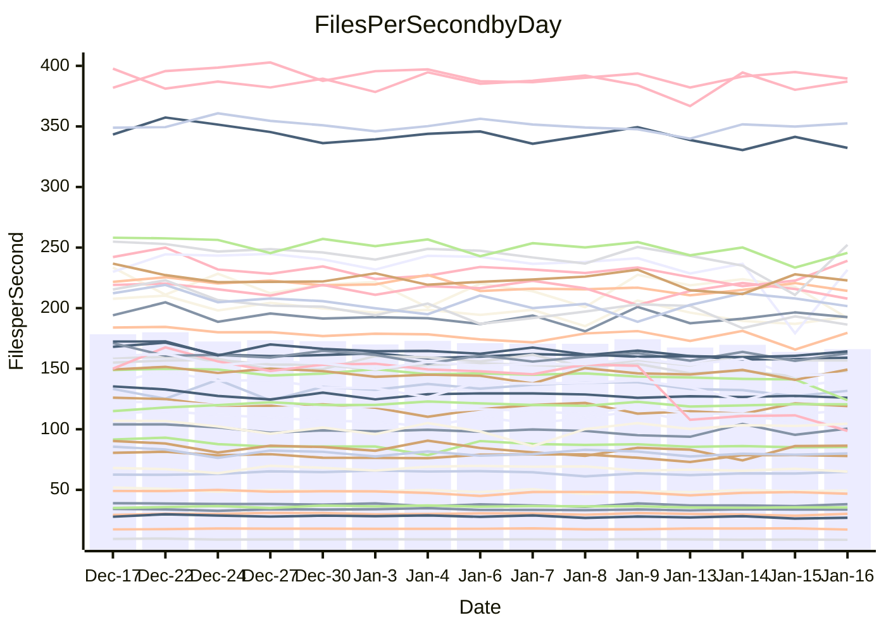

<!---
# This file is auto-generated. Do not edit.
# cspell:disable
--->
# Performance Report

## Daily Performance

## Time to Process Files

| Repository                                      | Elapsed | Min/Avg/Max           |   SD | SD Graph                |
| ----------------------------------------------- | ------: | :-------------------: | ---: | ----------------------- |
| AdaDoom3/AdaDoom3                    |    3.06 | 3.0 /   3.1 /   3.2   | 0.06 | `     ┣━┻━━●━━┻━┫     ` |
| alexiosc/megistos                    |    7.28 | 6.8 /   7.3 /   8.1   | 0.31 | `    ┣━━┻━━●━━┻━━┫    ` |
| apollographql/apollo-server          |    2.36 | 2.2 /   2.3 /   2.8   | 0.12 | `    ┣━━┻━━╋●━┻━━┫    ` |
| aspnetboilerplate/aspnetboilerplate  |    9.39 | 9.0 /   9.8 /  10.4   | 0.33 | `    ┣━━●━━╋━━┻━━┫    ` |
| aws-amplify/docs                     |   12.37 | 11.6 /  12.2 /  16.0  | 0.83 | `   ┣━━━┻━━╋●━┻━━━┫   ` |
| Azure/azure-rest-api-specs           |   23.95 | 14.4 /  17.1 /  24.9  | 2.53 | `   ┣━━┻━━━╋━━━┻━━┫  ●` |
| bitjson/typescript-starter           |    0.66 | 0.6 /   0.7 /   0.7   | 0.02 | `     ┣━━┻━●━┻━━┫     ` |
| caddyserver/caddy                    |    3.23 | 3.1 /   3.3 /   3.8   | 0.18 | `    ┣━━┻●━╋━━┻━━┫    ` |
| canada-ca/open-source-logiciel-libre |    0.80 | 0.7 /   0.8 /   0.8   | 0.02 | `     ┣━━┻━╋━┻━━●     ` |
| chef/chef                            |    6.28 | 5.2 /   5.5 /   6.6   | 0.32 | `    ┣━━┻━━╋━━┻━━┫●   ` |
| dart-lang/sdk                        |   61.34 | 58.1 /  61.2 /  67.3  | 2.02 | `  ┣━━━┻━━━●━━━┻━━━┫  ` |
| django/django                        |   14.64 | 13.7 /  14.8 /  16.4  | 0.60 | `   ┣━━━┻━●╋━━┻━━━┫   ` |
| eslint/eslint                        |   10.56 | 9.7 /  10.3 /  11.2   | 0.37 | `    ┣━━┻━━╋━●┻━━┫    ` |
| exonum/exonum                        |    3.20 | 2.9 /   3.1 /   3.5   | 0.12 | `    ┣━━┻━━╋●━┻━━┫    ` |
| flutter/samples                      |   17.15 | 16.2 /  17.3 /  22.0  | 1.05 | `   ┣━━━┻━●╋━━┻━━━┫   ` |
| gitbucket/gitbucket                  |    3.27 | 3.0 /   3.2 /   3.4   | 0.09 | `    ┣━━┻━━╋━●┻━━┫    ` |
| googleapis/google-cloud-cpp          |  135.12 | 121.6 / 128.4 / 139.4 | 4.07 | `  ┣━━━┻━━━╋━━━┻━━●┫  ` |
| graphql/express-graphql              |    0.73 | 0.7 /   0.7 /   0.8   | 0.02 | `     ┣━━┻━╋━●━━┫     ` |
| graphql/graphql-js                   |    2.30 | 2.1 /   2.2 /   2.4   | 0.07 | `     ┣━┻━━╋━━●━┫     ` |
| graphql/graphql-relay-js             |    0.73 | 0.7 /   0.7 /   0.8   | 0.02 | `     ┣━━┻●╋━┻━━┫     ` |
| graphql/graphql-spec                 |    0.87 | 0.8 /   0.8 /   0.9   | 0.02 | `     ┣━━┻━╋━┻━━●     ` |
| iluwatar/java-design-patterns        |   11.90 | 10.8 /  11.5 /  12.2  | 0.33 | `    ┣━━┻━━╋━━┻●━┫    ` |
| ktaranov/sqlserver-kit               |    6.27 | 6.0 /   6.3 /   7.2   | 0.24 | `    ┣━━┻━━●━━┻━━┫    ` |
| liriliri/licia                       |    3.68 | 3.6 /   3.7 /   3.9   | 0.09 | `    ┣━━┻━━●━━┻━━┫    ` |
| MartinThoma/LaTeX-examples           |    6.58 | 6.2 /   6.5 /   6.8   | 0.16 | `    ┣━━┻━━╋━●┻━━┫    ` |
| mdx-js/mdx                           |    1.66 | 1.5 /   1.6 /   1.8   | 0.07 | `     ┣━┻━━╋●━┻━┫     ` |
| microsoft/TypeScript-Website         |    6.11 | 4.9 /   5.2 /   5.5   | 0.15 | `       ┣┻━╋━┻┫      ●` |
| MicrosoftDocs/PowerShell-Docs        |   19.32 | 17.6 /  19.2 /  21.5  | 0.87 | `   ┣━━━┻━━╋●━┻━━━┫   ` |
| neovim/nvim-lspconfig                |    3.15 | 2.9 /   3.2 /   3.5   | 0.13 | `    ┣━━┻━━●━━┻━━┫    ` |
| pagekit/pagekit                      |    3.56 | 3.1 /   3.4 /   3.8   | 0.16 | `    ┣━━┻━━╋━●┻━━┫    ` |
| php/php-src                          |   21.17 | 20.7 /  22.4 /  28.4  | 1.66 | `   ┣━━┻●━━╋━━━┻━━┫   ` |
| plasticrake/tplink-smarthome-api     |    0.95 | 0.9 /   0.9 /   1.0   | 0.03 | `     ┣━┻━━╋━━●━┫     ` |
| prettier/prettier                    |    6.64 | 6.1 /   6.4 /   7.2   | 0.19 | `    ┣━━┻━━╋━━●━━┫    ` |
| pycontribs/jira                      |    1.23 | 1.2 /   1.3 /   1.3   | 0.04 | `     ┣━┻━●╋━━┻━┫     ` |
| RustPython/RustPython                |    4.15 | 4.1 /   4.3 /   5.1   | 0.21 | `    ┣━━┻●━╋━━┻━━┫    ` |
| shoelace-style/shoelace              |    2.44 | 2.4 /   2.5 /   2.7   | 0.09 | `    ┣━━┻━●╋━━┻━━┫    ` |
| slint-ui/slint                       |   10.58 | 8.7 /   9.9 /  11.8   | 0.62 | `    ┣━━┻━━╋━━┻●━┫    ` |
| SoftwareBrothers/admin-bro           |    2.19 | 2.0 /   2.2 /   2.3   | 0.08 | `     ┣━┻━━╋●━┻━┫     ` |
| sveltejs/svelte                      |   18.46 | 17.9 /  18.6 /  22.2  | 0.76 | `   ┣━━━┻━●╋━━┻━━━┫   ` |
| TheAlgorithms/Python                 |    5.57 | 5.1 /   5.5 /   5.9   | 0.18 | `    ┣━━┻━━╋━●┻━━┫    ` |
| twbs/bootstrap                       |    1.19 | 1.1 /   1.2 /   1.3   | 0.05 | `     ┣━┻━●╋━━┻━┫     ` |
| typescript-cheatsheets/react         |    1.13 | 1.1 /   1.1 /   1.3   | 0.06 | `     ┣━┻━━╋●━┻━┫     ` |
| typescript-eslint/typescript-eslint  |    3.62 | 3.5 /   3.6 /   3.8   | 0.08 | `    ┣━━┻━●╋━━┻━━┫    ` |
| vitest-dev/vitest                    |    7.71 | 7.5 /   8.0 /   9.2   | 0.32 | `    ┣━━┻●━╋━━┻━━┫    ` |
| w3c/aria-practices                   |    2.88 | 2.7 /   3.0 /   3.3   | 0.14 | `    ┣━━┻●━╋━━┻━━┫    ` |
| w3c/specberus                        |    1.66 | 1.6 /   1.7 /   1.8   | 0.04 | `     ┣━┻━●╋━━┻━┫     ` |
| webdeveric/webpack-assets-manifest   |    0.71 | 0.6 /   0.7 /   0.8   | 0.03 | `     ┣━━┻━╋━┻●━┫     ` |
| webpack/webpack                      |    4.91 | 4.6 /   4.9 /   5.3   | 0.17 | `    ┣━━┻━━●━━┻━━┫    ` |
| wireapp/wire-desktop                 |    0.87 | 0.8 /   0.9 /   1.0   | 0.03 | `     ┣━┻━●╋━━┻━┫     ` |
| wireapp/wire-webapp                  |    8.27 | 7.8 /   8.4 /   8.9   | 0.26 | `    ┣━━┻━●╋━━┻━━┫    ` |

Note:
- Elapsed time is in seconds.

## Files per Second over Time

| Repository                                      | Files |    Sec |    Fps |     Rel | Trend Fps              |    N |
| ----------------------------------------------- | ----: | -----: | -----: | ------: | ---------------------- | ---: |
| AdaDoom3/AdaDoom3                    |   103 |   3.06 |  33.67 |   0.20% | `▇▆▇▇▆█▅▇▆▆▇▅▇▇▇▅▆▇▇▇` |   27 |
| alexiosc/megistos                    |   583 |   7.28 |  80.05 |   0.04% | `█▆▃▅█▇▅▆▆▆▇█▇▇▄▇▆▆▆▆` |   27 |
| apollographql/apollo-server          |   250 |   2.36 | 105.83 |  -2.34% | `▆▆▇▅▇▆█▇▃█▇▇█▇▇▄▇▇▆▆` |   29 |
| aspnetboilerplate/aspnetboilerplate  |  2246 |   9.39 | 239.07 |   3.75% | `▇▇▇▄▅▆▆█▇▆▇▅█▇▇▅▅▄▅█` |   27 |
| aws-amplify/docs                     |  2865 |  12.37 | 231.58 |  -1.64% | `█▇▇▇████▇████▇▇▅██▂▇` |   28 |
| Azure/azure-rest-api-specs           |  2364 |  23.95 |  98.69 | -30.94% | `▇██▇▇▇▇▇▆██▇▇▃▃▃▁▃▃▂` |   29 |
| bitjson/typescript-starter           |    20 |   0.66 |  30.19 |  -0.06% | `██▆▇▆▇█▇▇█▆▄██▇▇▇▆▅▇` |   27 |
| caddyserver/caddy                    |   279 |   3.23 |  86.38 |   3.42% | `▇▅▅█▆▅▇▅▃▆▄▄▆▇▆▇▄▃▇▇` |   29 |
| canada-ca/open-source-logiciel-libre |     7 |   0.80 |   8.76 |  -3.85% | `███▇█▇▇███▆▆▆█▇▇█▆▆▅` |   27 |
| chef/chef                            |  1204 |   6.28 | 191.78 | -11.93% | `▅▇▆█▅▆██▄▇▃▇█▆█▇▆▇▇▄` |   28 |
| dart-lang/sdk                        | 10077 |  61.34 | 164.27 |  -0.02% | `▆▇▆▇▇▇▅█▇▇▇▆▆▇▆▆▄▆▆▇` |   29 |
| django/django                        |  2820 |  14.64 | 192.64 |   0.73% | `▇▆▇▇▅▇▅█▆▇▆▄█▇▇▆▃▇▇▇` |   29 |
| eslint/eslint                        |  2038 |  10.56 | 192.92 |  -2.31% | `█▆▆▇▅▆▇▅▇█▄▅█▇▇▇▅▅▅▆` |   29 |
| exonum/exonum                        |   421 |   3.20 | 131.76 |  -1.60% | `▇▆▇▆▆█▇▆██▆███▇▇▆▆▅▆` |   27 |
| flutter/samples                      |  2690 |  17.15 | 156.81 |   0.76% | `▇█▇▇▆▇█▇▇█▇▅▇▇▇▆▆▇▇▇` |   29 |
| gitbucket/gitbucket                  |   412 |   3.27 | 126.01 |  -1.79% | `▄█▅▇▆████▆▆█▆▆▅█▇▆▇▆` |   29 |
| googleapis/google-cloud-cpp          | 19742 | 135.12 | 146.11 |  -5.05% | `▇▆▄▇█▇▅▅█▇▇▇█▆▇▇▇█▅▅` |   29 |
| graphql/express-graphql              |    26 |   0.73 |  35.58 |  -1.66% | `█▆▆▇██▇▇▇▇▇▇▇▇▇▆▅▆▆▆` |   27 |
| graphql/graphql-js                   |   339 |   2.30 | 147.19 |  -3.09% | `▇▇▇▄█▇▇█▇▇█▇▇█▅▆▆▆▅▆` |   27 |
| graphql/graphql-relay-js             |    28 |   0.73 |  38.13 |   1.04% | `▅█▇██▆▆█▅█▆▄▆██▅▆▆▆▇` |   27 |
| graphql/graphql-spec                 |    15 |   0.87 |  17.23 |  -3.73% | `▆▇▅▇█▆▆▇▆▇█▅▆▅▇▇▇▇▇▅` |   27 |
| iluwatar/java-design-patterns        |  1892 |  11.90 | 159.04 |  -1.57% | `▇█▆▆▇▄█▆▇█▅██▇▆▆▇▆▆▆` |   29 |
| ktaranov/sqlserver-kit               |   489 |   6.27 |  77.98 |   0.45% | `▆▆▇▆▆▆█▇█▇▇▇█▆▃▆▆▇▇▇` |   27 |
| liriliri/licia                       |  1434 |   3.68 | 389.55 |  -0.32% | `▅████▆▇██▇▅▇▇█▇▅▇▇█▇` |   28 |
| MartinThoma/LaTeX-examples           |  1409 |   6.58 | 214.26 |  -1.73% | `▅▇▆▇▇█▆▅▄▆▇▅▇▆▆▅▅▆▇▆` |   27 |
| mdx-js/mdx                           |   142 |   1.66 |  85.43 |  -1.76% | `▃█▅▆▄████▇▇▇▆▇▆▆▇▆▆▆` |   28 |
| microsoft/TypeScript-Website         |   757 |   6.11 | 123.99 | -14.95% | `█▆▇▆▇▇▅▆▇▅▆▇▆▇▅▆▄▅▅▁` |   29 |
| MicrosoftDocs/PowerShell-Docs        |  2236 |  19.32 | 115.75 |  -0.74% | `▇▇█▆▆▇▇▇▆▆▃█▇▇▃▆▇▆▆▇` |   29 |
| neovim/nvim-lspconfig                |   375 |   3.15 | 119.21 |   0.63% | `▇█▄▄▆▆▅▇▇▇▇█▅▆▅▄▆▅▇▇` |   29 |
| pagekit/pagekit                      |   741 |   3.56 | 207.87 |  -3.80% | `▆▅▃▇▅▆▆▆▇█▅▇▄▄▇▅▄▆▆▅` |   27 |
| php/php-src                          |  2213 |  21.17 | 104.55 |   5.46% | `▄▆██▇▆▇▅▂▅▇▇█▆█▇▇███` |   29 |
| plasticrake/tplink-smarthome-api     |    62 |   0.95 |  65.04 |  -3.87% | `▇█▆▆▇▇█▇▇▇█▇█▆▅▇▇▆▇▆` |   27 |
| prettier/prettier                    |  2205 |   6.64 | 332.29 |  -2.73% | `█▆█████▆▇▆▇██▇▆▇▇▆▇▆` |   29 |
| pycontribs/jira                      |    80 |   1.23 |  64.93 |   1.53% | `▇▇█▇█▇█▆█▆▆▄▅▆▇▅▅▆▆▇` |   27 |
| RustPython/RustPython                |   620 |   4.15 | 149.26 |   2.44% | `▅▇█▇██▅▇█▃██▇▇▇▆██▆█` |   29 |
| shoelace-style/shoelace              |   438 |   2.44 | 179.67 |   1.53% | `▇▆██▇▇▇▅▆▄▇█▇█▇▄▇█▄▇` |   28 |
| slint-ui/slint                       |  1973 |  10.58 | 186.41 |  -6.23% | `█▅▅▇▅█▃▅▅█▆▇▇▇▇▇▇▅▆▅` |   29 |
| SoftwareBrothers/admin-bro           |   441 |   2.19 | 201.68 |  -1.36% | `▅▆▆▄▇▅█▇▆▄█▇▆▄▆▆▇█▇▆` |   27 |
| sveltejs/svelte                      |  7145 |  18.46 | 387.08 |   0.82% | `▇▇▇█▇▇▇█▇███▇▇▇▇▃█▇▇` |   29 |
| TheAlgorithms/Python                 |  1367 |   5.57 | 245.62 |  -1.89% | `▇▅██▆▅▅▇▇▇▆▇▇▆▅▆▅▇▄▆` |   29 |
| twbs/bootstrap                       |   120 |   1.19 | 100.49 |   1.82% | `██▄▅▆▄▇▆▅▆▇▅▆▅▄▄▅█▅▆` |   28 |
| typescript-cheatsheets/react         |    53 |   1.13 |  46.82 |  -2.20% | `████▇▃███▇█▇▇▃▆▇▇▇▇▇` |   28 |
| typescript-eslint/typescript-eslint  |  1277 |   3.62 | 352.46 |   0.68% | `▅█▇▇▇██▆▇█▆▇▇▆▆▅▆▇▇▇` |   29 |
| vitest-dev/vitest                    |  1946 |   7.71 | 252.26 |   3.59% | `▇▆▆▇▇▇██▆▆▅▇█▇▇▇▇▆▃█` |   29 |
| w3c/aria-practices                   |   405 |   2.88 | 140.79 |   3.15% | `██▇▇▄▄▇▇▇▇▇▇▇█▅█▆▄▆█` |   27 |
| w3c/specberus                        |   200 |   1.66 | 120.60 |   0.47% | `▆▇▅▇▇▇▆▆▆▇█▄▇▆▅▆▇▆▇▇` |   28 |
| webdeveric/webpack-assets-manifest   |    19 |   0.71 |  26.94 |  -4.27% | `▆█▇▆██▆▇██▇▇▃▇▅▄█▇▅▅` |   27 |
| webpack/webpack                      |  1095 |   4.91 | 222.84 |  -0.15% | `▆▆█▆▆▅█▄▄▆▇▇▆▇▄▅▅▄▇▆` |   27 |
| wireapp/wire-desktop                 |    43 |   0.87 |  49.35 |   0.75% | `▆▆▇▇█▅▆███▇▄▇▆▆▆▆▇▇▇` |   29 |
| wireapp/wire-webapp                  |  1345 |   8.27 | 162.70 |   1.46% | `▆▇█▅▅██▅▅▇▇▆██▇▅▅█▆▇` |   29 |

## Data Throughput

| Repository                                      | Files |    Sec |     Kps |     Rel | Trend Kps              |    N |
| ----------------------------------------------- | ----: | -----: | ------: | ------: | ---------------------- | ---: |
| AdaDoom3/AdaDoom3                    |   103 |   3.06 |  715.64 |   0.20% | `▇▆▇▇▆█▅▇▆▆▇▅▇▇▇▅▆▇▇▇` |   27 |
| alexiosc/megistos                    |   583 |   7.28 |  629.02 |   0.04% | `█▆▃▅█▇▅▆▆▆▇█▇▇▄▇▆▆▆▆` |   27 |
| apollographql/apollo-server          |   250 |   2.36 |  847.08 |  -2.32% | `▆▆▇▅▇▆█▇▃█▇▇█▇▇▄▇▇▆▆` |   29 |
| aspnetboilerplate/aspnetboilerplate  |  2246 |   9.39 |  562.45 |   3.75% | `▇▇▇▄▅▆▆█▇▆▇▅█▇▇▅▅▄▅█` |   27 |
| aws-amplify/docs                     |  2865 |  12.37 |  794.33 |  -1.56% | `█▇▇▇████▇████▇▇▅██▂▇` |   28 |
| Azure/azure-rest-api-specs           |  2364 |  23.95 |  284.31 | -30.95% | `▇██▇▇▇▇▇▆██▇▇▃▃▃▁▃▃▂` |   29 |
| bitjson/typescript-starter           |    20 |   0.66 |  120.75 |  -0.06% | `██▆▇▆▇█▇▇█▆▄██▇▇▇▆▅▇` |   27 |
| caddyserver/caddy                    |   279 |   3.23 |  720.46 |   3.58% | `▇▅▅█▆▅▇▅▃▆▄▄▆▇▆▇▄▃▇▇` |   29 |
| canada-ca/open-source-logiciel-libre |     7 |   0.80 |   72.57 |  -3.85% | `███▇█▇▇███▆▆▆█▇▇█▆▆▅` |   27 |
| chef/chef                            |  1204 |   6.28 |  880.71 | -11.94% | `▅▇▆█▅▆██▄▇▃▇█▆█▇▆▇▇▄` |   28 |
| dart-lang/sdk                        | 10077 |  61.34 | 1171.69 |  -0.05% | `▇▇▇▇▇▇▅█▇▇▇▆▆▇▇▆▄▆▆▇` |   29 |
| django/django                        |  2820 |  14.64 | 1192.89 |   0.86% | `▇▆▇▇▅▇▅█▆▇▆▄█▇▇▆▃▇▇▇` |   29 |
| eslint/eslint                        |  2038 |  10.56 | 1576.80 |  -2.27% | `▇▆▆▇▅▆▇▅▇█▄▅█▇▇▇▅▅▅▆` |   29 |
| exonum/exonum                        |   421 |   3.20 | 1260.30 |  -1.60% | `▇▆▇▆▆█▇▆██▆███▇▇▆▆▅▆` |   27 |
| flutter/samples                      |  2690 |  17.15 | 1270.09 |   0.76% | `▇█▇▇▆▇█▇▇█▇▅▇▇▇▆▆▇▇▇` |   29 |
| gitbucket/gitbucket                  |   412 |   3.27 |  570.08 |  -1.78% | `▄█▅▇▆████▆▆█▆▆▅█▇▆▇▆` |   29 |
| googleapis/google-cloud-cpp          | 19742 | 135.12 | 1140.59 |  -5.10% | `▇▆▄▇█▇▅▅█▇▇▇█▆▇▇▇█▄▅` |   29 |
| graphql/express-graphql              |    26 |   0.73 |  162.83 |  -1.66% | `█▆▆▇██▇▇▇▇▇▇▇▇▇▆▅▆▆▆` |   27 |
| graphql/graphql-js                   |   339 |   2.30 |  836.26 |  -3.09% | `▇▇▇▄█▇▇█▇▇█▇▇█▅▆▆▆▅▆` |   27 |
| graphql/graphql-relay-js             |    28 |   0.73 |  149.79 |   1.04% | `▅█▇██▆▆█▅█▆▄▆██▅▆▆▆▇` |   27 |
| graphql/graphql-spec                 |    15 |   0.87 |  634.05 |  -3.73% | `▆▇▅▇█▆▆▇▆▇█▅▆▅▇▇▇▇▇▅` |   27 |
| iluwatar/java-design-patterns        |  1892 |  11.90 |  488.54 |  -1.82% | `▇█▆▆▇▄█▆▇█▅██▇▆▆▇▆▆▆` |   29 |
| ktaranov/sqlserver-kit               |   489 |   6.27 | 1179.71 |   0.45% | `▆▆▇▆▆▆█▇█▇▇▇█▆▃▆▆▇▇▇` |   27 |
| liriliri/licia                       |  1434 |   3.68 |  461.54 |  -0.32% | `▅████▆▇██▇▅▇▇█▇▅▇▇█▇` |   28 |
| MartinThoma/LaTeX-examples           |  1409 |   6.58 |  442.50 |  -1.73% | `▅▇▆▇▇█▆▅▄▆▇▅▇▆▆▅▅▆▇▆` |   27 |
| mdx-js/mdx                           |   142 |   1.66 |  395.27 |  -1.91% | `▃█▅▆▄████▇▇▇▆▇▆▆▇▆▆▆` |   28 |
| microsoft/TypeScript-Website         |   757 |   6.11 |  849.11 | -14.95% | `█▆▇▆▇▇▅▆▇▅▆▇▆▇▅▆▄▅▅▁` |   29 |
| MicrosoftDocs/PowerShell-Docs        |  2236 |  19.32 | 1156.30 |  -0.71% | `▇▇█▆▆▇▇▇▆▆▃█▇▇▃▆▇▆▆▇` |   29 |
| neovim/nvim-lspconfig                |   375 |   3.15 |  311.52 |   0.57% | `▇█▄▄▇▇▅▇▇▇▇█▅▆▅▄▆▅▇▇` |   29 |
| pagekit/pagekit                      |   741 |   3.56 |  433.42 |  -3.80% | `▆▅▃▇▅▆▆▆▇█▅▇▄▄▇▅▄▆▆▅` |   27 |
| php/php-src                          |  2213 |  21.17 | 1531.28 |   5.49% | `▄▆██▇▆▇▅▂▅▇▇█▆█▇▇███` |   29 |
| plasticrake/tplink-smarthome-api     |    62 |   0.95 |  351.41 |  -3.87% | `▇█▆▆▇▇█▇▇▇█▇█▆▅▇▇▆▇▆` |   27 |
| prettier/prettier                    |  2205 |   6.64 |  469.12 |  -2.74% | `█▆█████▇▇▆▇██▇▆▇▇▆▇▆` |   29 |
| pycontribs/jira                      |    80 |   1.23 |  447.23 |   1.53% | `▇▇█▇█▇█▆█▆▆▄▅▆▇▅▅▆▆▇` |   27 |
| RustPython/RustPython                |   620 |   4.15 | 1104.01 |   2.61% | `▅▇█▇██▅▇█▃██▇▇▇▆██▆█` |   29 |
| shoelace-style/shoelace              |   438 |   2.44 |  863.09 |   1.55% | `▇▆██▇▇▇▅▆▄▇█▇█▇▄▇█▄▇` |   28 |
| slint-ui/slint                       |  1973 |  10.58 |  957.37 |  -6.11% | `█▅▅▇▅█▃▅▅▇▆▆▇▇▇▇▇▅▆▅` |   29 |
| SoftwareBrothers/admin-bro           |   441 |   2.19 |  444.52 |  -1.36% | `▅▆▆▄▇▅█▇▆▄█▇▆▄▆▆▇█▇▆` |   27 |
| sveltejs/svelte                      |  7145 |  18.46 |  256.74 |   1.59% | `▇▇▇█▇▇▇█▇███▇▇▇█▃█▇█` |   29 |
| TheAlgorithms/Python                 |  1367 |   5.57 |  624.38 |  -1.75% | `▇▅██▆▅▅▇▇▇▆▇▇▆▅▆▅▇▄▆` |   29 |
| twbs/bootstrap                       |   120 |   1.19 |  806.42 |   1.82% | `██▄▅▆▄▇▆▅▆▇▅▆▅▄▄▅█▅▆` |   28 |
| typescript-cheatsheets/react         |    53 |   1.13 |  342.75 |  -2.20% | `████▇▃███▇█▇▇▃▆▇▇▇▇▇` |   28 |
| typescript-eslint/typescript-eslint  |  1277 |   3.62 | 1704.91 |   1.52% | `▅▇▇▇▇██▆▇█▆▇▇▆▆▆▆▇▇▇` |   29 |
| vitest-dev/vitest                    |  1946 |   7.71 |  519.56 |   3.39% | `▇▆▆█▇▇██▆▆▅▇█▇▇▇▇▆▃█` |   29 |
| w3c/aria-practices                   |   405 |   2.88 | 1307.43 |   3.15% | `██▇▇▄▄▇▇▇▇▇▇▇█▅█▆▄▆█` |   27 |
| w3c/specberus                        |   200 |   1.66 |  384.73 |   0.47% | `▆▇▅▇▇▇▆▆▆▇█▄▇▆▅▆▇▆▇▇` |   28 |
| webdeveric/webpack-assets-manifest   |    19 |   0.71 |  144.65 |  -4.27% | `▆█▇▆██▆▇██▇▇▃▇▅▄█▇▅▅` |   27 |
| webpack/webpack                      |  1095 |   4.91 |  983.13 |  -0.15% | `▆▆█▆▆▅█▄▄▆▇▇▆▇▄▅▅▄▇▆` |   27 |
| wireapp/wire-desktop                 |    43 |   0.87 |  218.05 |   0.75% | `▆▆▇▇█▅▆███▇▄▇▆▆▆▆▇▇▇` |   29 |
| wireapp/wire-webapp                  |  1345 |   8.27 |  657.56 |   1.35% | `▆▇█▅▅██▅▅▇▇▆█▇▇▅▄█▆▇` |   29 |

