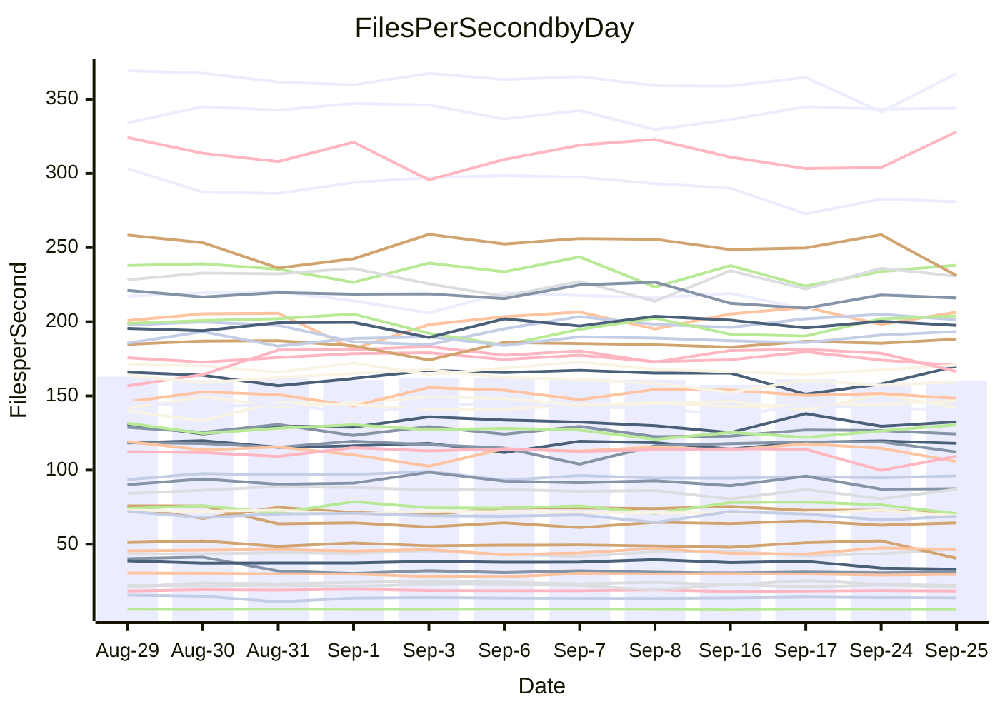

<!---
# This file is auto-generated. Do not edit.
# cspell:disable
--->
# Performance Report

## Daily Performance

## Time to Process Files

| Repository                                      | Elapsed | Min/Avg/Max           |   SD | SD Graph                |
| ----------------------------------------------- | ------: | :-------------------: | ---: | ----------------------- |
| AdaDoom3/AdaDoom3                    |    3.47 | 3.4 /   3.5 /   4.5   | 0.26 | `    ┣━━┻━━●━━┻━━┫    ` |
| alexiosc/megistos                    |    8.30 | 7.5 /   8.0 /   9.4   | 0.47 | `    ┣━━┻━━╋━●┻━━┫    ` |
| apollographql/apollo-server          |    2.88 | 2.6 /   2.7 /   2.9   | 0.11 | `    ┣━━┻━━╋━━┻●━┫    ` |
| aspnetboilerplate/aspnetboilerplate  |   10.60 | 10.2 /  10.5 /  11.1  | 0.22 | `    ┣━━┻━━╋●━┻━━┫    ` |
| aws-amplify/docs                     |   13.29 | 12.5 /  13.2 /  14.2  | 0.43 | `    ┣━━┻━━╋●━┻━━┫    ` |
| Azure/azure-rest-api-specs           |   10.64 | 9.4 /   9.7 /  10.5   | 0.29 | `    ┣━━┻━━╋━━┻━━┫   ●` |
| bitjson/typescript-starter           |    1.08 | 1.0 /   1.1 /   1.1   | 0.03 | `     ┣━━┻━╋━●━━┫     ` |
| caddyserver/caddy                    |    4.04 | 3.6 /   3.8 /   4.3   | 0.16 | `    ┣━━┻━━╋━━┻●━┫    ` |
| canada-ca/open-source-logiciel-libre |    1.17 | 1.1 /   1.2 /   1.3   | 0.04 | `     ┣━┻━━╋●━┻━┫     ` |
| chef/chef                            |    6.12 | 5.9 /   6.1 /   6.6   | 0.18 | `    ┣━━┻━━●━━┻━━┫    ` |
| dart-lang/sdk                        |   66.22 | 64.5 /  67.3 /  73.0  | 1.96 | `  ┣━━━┻━●━╋━━━┻━━━┫  ` |
| django/django                        |   15.26 | 14.9 /  15.5 /  16.4  | 0.33 | `    ┣━━┻●━╋━━┻━━┫    ` |
| eslint/eslint                        |   10.82 | 10.7 /  11.1 /  11.9  | 0.30 | `    ┣━━●━━╋━━┻━━┫    ` |
| exonum/exonum                        |    3.98 | 3.5 /   3.7 /   4.1   | 0.13 | `    ┣━━┻━━╋━━┻━━●    ` |
| flutter/samples                      |   16.35 | 16.3 /  17.0 /  19.7  | 0.73 | `   ┣━━━●━━╋━━┻━━━┫   ` |
| gitbucket/gitbucket                  |    3.68 | 3.5 /   3.6 /   4.0   | 0.16 | `    ┣━━┻━━╋━●┻━━┫    ` |
| googleapis/google-cloud-cpp          |  147.38 | 139.0 / 145.4 / 163.3 | 5.39 | `  ┣━━━┻━━━╋━●━┻━━━┫  ` |
| graphql/express-graphql              |    1.22 | 1.1 /   1.2 /   1.4   | 0.06 | `     ┣━┻━━╋━●┻━┫     ` |
| graphql/graphql-js                   |    2.93 | 2.7 /   2.9 /   3.1   | 0.09 | `     ┣━┻━━╋●━┻━┫     ` |
| graphql/graphql-relay-js             |    1.26 | 1.1 /   1.2 /   1.3   | 0.07 | `     ┣━┻━━╋━━●━┫     ` |
| graphql/graphql-spec                 |    1.37 | 1.0 /   1.3 /   1.5   | 0.14 | `     ┣━┻━━╋━●┻━┫     ` |
| iluwatar/java-design-patterns        |   13.43 | 12.8 /  13.2 /  13.9  | 0.35 | `    ┣━━┻━━╋━●┻━━┫    ` |
| ktaranov/sqlserver-kit               |    7.05 | 6.6 /   6.8 /   7.1   | 0.15 | `    ┣━━┻━━╋━━┻━●┫    ` |
| liriliri/licia                       |    4.18 | 4.1 /   4.2 /   4.4   | 0.08 | `    ┣━━┻━●╋━━┻━━┫    ` |
| MartinThoma/LaTeX-examples           |    6.91 | 6.9 /   7.2 /   7.8   | 0.27 | `    ┣━━●━━╋━━┻━━┫    ` |
| mdx-js/mdx                           |    2.05 | 1.9 /   2.0 /   2.2   | 0.07 | `     ┣━┻━━╋●━┻━┫     ` |
| microsoft/TypeScript-Website         |    5.74 | 5.5 /   5.9 /   6.5   | 0.29 | `    ┣━━┻━●╋━━┻━━┫    ` |
| MicrosoftDocs/PowerShell-Docs        |   24.78 | 23.3 /  24.2 /  27.1  | 0.87 | `   ┣━━━┻━━╋━●┻━━━┫   ` |
| neovim/nvim-lspconfig                |    4.46 | 4.2 /   4.3 /   4.5   | 0.07 | `    ┣━━┻━━╋━━┻━●┫    ` |
| pagekit/pagekit                      |    3.59 | 3.5 /   3.7 /   4.1   | 0.13 | `    ┣━━┻●━╋━━┻━━┫    ` |
| php/php-src                          |   26.38 | 25.3 /  26.7 /  29.3  | 1.00 | `   ┣━━━┻━●╋━━┻━━━┫   ` |
| plasticrake/tplink-smarthome-api     |    1.34 | 1.3 /   1.4 /   1.6   | 0.07 | `     ┣━┻●━╋━━┻━┫     ` |
| prettier/prettier                    |    7.03 | 7.0 /   7.3 /   7.9   | 0.25 | `    ┣━●┻━━╋━━┻━━┫    ` |
| pycontribs/jira                      |    1.95 | 1.5 /   1.6 /   1.7   | 0.07 | `      ┣━┻━╋━┻━┫     ●` |
| RustPython/RustPython                |    5.26 | 5.2 /   5.4 /   5.7   | 0.15 | `    ┣━━●━━╋━━┻━━┫    ` |
| shoelace-style/shoelace              |    3.09 | 2.9 /   3.0 /   3.1   | 0.07 | `     ┣━┻━━╋━━●━┫     ` |
| slint-ui/slint                       |   13.59 | 12.2 /  12.8 /  15.5  | 0.80 | `   ┣━━━┻━━╋━━●━━━┫   ` |
| SoftwareBrothers/admin-bro           |    2.58 | 2.5 /   2.6 /   2.8   | 0.06 | `     ┣━┻●━╋━━┻━┫     ` |
| sveltejs/svelte                      |   21.56 | 20.2 /  21.6 /  23.2  | 0.58 | `   ┣━━━┻━━●━━┻━━━┫   ` |
| TheAlgorithms/Python                 |    5.86 | 5.7 /   5.9 /   6.3   | 0.19 | `    ┣━━┻━●╋━━┻━━┫    ` |
| twbs/bootstrap                       |    1.83 | 1.5 /   1.8 /   2.0   | 0.14 | `     ┣━┻━━╋●━┻━┫     ` |
| typescript-cheatsheets/react         |    1.60 | 1.3 /   1.4 /   1.6   | 0.05 | `     ┣━┻━━╋━━┻━┫   ● ` |
| typescript-eslint/typescript-eslint  |    4.55 | 4.2 /   4.4 /   4.7   | 0.15 | `    ┣━━┻━━╋━━●━━┫    ` |
| vitest-dev/vitest                    |    9.60 | 9.2 /   9.7 /  12.0   | 0.64 | `    ┣━━┻━●╋━━┻━━┫    ` |
| w3c/aria-practices                   |    3.51 | 3.4 /   3.5 /   3.8   | 0.10 | `    ┣━━┻━━●━━┻━━┫    ` |
| w3c/specberus                        |    2.06 | 2.0 /   2.1 /   2.2   | 0.04 | `     ┣━┻━━●━━┻━┫     ` |
| webdeveric/webpack-assets-manifest   |    1.16 | 1.2 /   1.2 /   1.3   | 0.04 | `     ●━┻━━╋━━┻━┫     ` |
| webpack/webpack                      |    5.56 | 5.3 /   5.7 /   6.1   | 0.18 | `    ┣━━┻●━╋━━┻━━┫    ` |
| wireapp/wire-desktop                 |    1.36 | 1.0 /   1.3 /   1.4   | 0.14 | `     ┣━┻━━╋●━┻━┫     ` |
| wireapp/wire-webapp                  |   10.79 | 10.9 /  11.2 /  12.1  | 0.37 | `    ┣━●┻━━╋━━┻━━┫    ` |

Note:
- Elapsed time is in seconds.

## Files per Second over Time

| Repository                                      | Files |    Sec |    Fps |     Rel | Trend Fps             |    N |
| ----------------------------------------------- | ----: | -----: | -----: | ------: | --------------------- | ---: |
| AdaDoom3/AdaDoom3                    |   103 |   3.47 |  29.70 |   0.05% | `███████▆█▂███▇███▇▇` |   18 |
| alexiosc/megistos                    |   583 |   8.30 |  70.23 |  -3.64% | `▇█▃▃▇█▆▆▇▇▇▇▇▇█▇▇▇▆` |   18 |
| apollographql/apollo-server          |   252 |   2.88 |  87.42 |  -5.13% | `▅▇▄█▆▅▅█▆▆▅▄▇▆▄▅▇▄▄` |   18 |
| aspnetboilerplate/aspnetboilerplate  |  2286 |  10.60 | 215.66 |  -0.75% | `▇▇▇█▇▇▆▅▇▇█▇▇▆▆█▅▇▆` |   18 |
| aws-amplify/docs                     |  2871 |  13.29 | 216.10 |  -0.85% | `▇▆▆▇▅█▆▆▇▄▇▇▇█▅▆▅▆▆` |   18 |
| Azure/azure-rest-api-specs           |  2459 |  10.64 | 231.14 |  -8.01% | `█▇█▇▅▄▆█▇▇▇████▅▇█▄` |   18 |
| bitjson/typescript-starter           |    20 |   1.08 |  18.52 |  -1.67% | `▆█▇▇▇▇█▆▆▆▆▆▆▇▄▆▆▆▆` |   18 |
| caddyserver/caddy                    |   286 |   4.04 |  70.74 |  -6.01% | `▆█▆▆▇▃█▆▆▆▇▆█▅███▇▅` |   18 |
| canada-ca/open-source-logiciel-libre |     7 |   1.17 |   5.98 |  -1.91% | `█▇▇▆█▇▇▇█▇██▇▇▇▃▇▇▆` |   18 |
| chef/chef                            |  1208 |   6.12 | 197.49 |  -0.34% | `▆▇▇▄▆█▇▅█▇▇█▅█▇▇▆▇▇` |   18 |
| dart-lang/sdk                        | 10560 |  66.22 | 159.48 |  -0.63% | `▇▇▅▇▇▇██▇▆█▆▇▆▆▄▇▆▆` |   18 |
| django/django                        |  2874 |  15.26 | 188.32 |   1.82% | `▇▇▇█▇▇▆▄▆▇██▆▇▆▆▇▇▇` |   18 |
| eslint/eslint                        |  2093 |  10.82 | 193.37 |   2.89% | `▆▇▇█▄▇▇▇▄▆▇▇▆▇▅▇▆▇█` |   18 |
| exonum/exonum                        |   421 |   3.98 | 105.80 |  -7.02% | `█▇▅▇▇█▆▃▇▆▇▇▆▇▇▆█▇▄` |   18 |
| flutter/samples                      |  2400 |  16.35 | 146.81 |   3.79% | `▇▆▃▇███▇▆█▇▇██▇█▇██` |   18 |
| gitbucket/gitbucket                  |   413 |   3.68 | 112.27 |  -2.98% | `████▇▇█▇█▅█▄▄▇█▇██▆` |   18 |
| googleapis/google-cloud-cpp          | 20764 | 147.38 | 140.89 |  -1.20% | `██▅▇▇▇▆▇█▆█▇▆▇▃▇▇▆▆` |   18 |
| graphql/express-graphql              |    26 |   1.22 |  21.27 |  -4.20% | `▆▇▄▆▆▇▆▇▇▇▇▆▇▃▆█▅▇▅` |   18 |
| graphql/graphql-js                   |   364 |   2.93 | 124.32 |  -1.55% | `▇▅▆▇█▆▅▇▄▆▇█▆▅▅▅▆▆▆` |   18 |
| graphql/graphql-relay-js             |    28 |   1.26 |  22.21 |  -6.37% | `▃▆▆▇▃█▇█▇▆█▆▅▇▃▆█▅▄` |   18 |
| graphql/graphql-spec                 |    19 |   1.37 |  13.83 |   0.29% | `█▅██▂▂▅▆▄▆▆▅▅▅▆▅▆▆▆` |   18 |
| iluwatar/java-design-patterns        |  1992 |  13.43 | 148.32 |  -2.05% | `▅▇█▇█▆▅█▇██▅▇█▇█▇▇▆` |   18 |
| ktaranov/sqlserver-kit               |   489 |   7.05 |  69.32 |  -3.59% | `▇█▅▇█▆▅▇▅▇█▇▅▆▆▆▆▇▅` |   18 |
| liriliri/licia                       |  1437 |   4.18 | 343.97 |   0.95% | `▆██▇█▇██▇▇▆▇█▆▅██▇█` |   18 |
| MartinThoma/LaTeX-examples           |  1409 |   6.91 | 203.87 |   4.16% | `▇██▆▇██▆▄▄▅▆▇█▆▅▅██` |   18 |
| mdx-js/mdx                           |   141 |   2.05 |  68.88 |  -0.78% | `▇▅▆▄█▅▆▆▆▆▅▆▆▄▆█▆▄▆` |   18 |
| microsoft/TypeScript-Website         |   761 |   5.74 | 132.51 |   1.82% | `▆▇▅▃▇▅▆██▇▇▇▇▆▇▃█▆▇` |   18 |
| MicrosoftDocs/PowerShell-Docs        |  2708 |  24.78 | 109.30 |  -2.55% | `▇▆▇▇▅▇█▇▇██▆█▇█▇▇▃▆` |   18 |
| neovim/nvim-lspconfig                |   760 |   4.46 | 170.43 |  -2.85% | `▇▇▆▅▆███▇▅█▇█▆▇▇█▇▆` |   18 |
| pagekit/pagekit                      |   741 |   3.59 | 206.47 |   1.96% | `▇█▆██▇▃▆▇█▇█▇▆█▇█▆▇` |   18 |
| php/php-src                          |  2296 |  26.38 |  87.03 |   1.48% | `▆█▆▆█▇▇▇▇▆█▇▆▇▅▄▇▄▇` |   18 |
| plasticrake/tplink-smarthome-api     |    62 |   1.34 |  46.43 |   3.02% | `▇▇█▇▇▇▇▇▃▆▆▆▆██▄▅█▇` |   18 |
| prettier/prettier                    |  2305 |   7.03 | 328.11 |   5.16% | `█▆█▆▇▅▇▄▆▄█▆██▆▆▅▅█` |   18 |
| pycontribs/jira                      |    79 |   1.95 |  40.48 | -19.05% | `▇█▇▇▇▃▇▅▆▇▄▄█▅▅▅▇█ ` |   18 |
| RustPython/RustPython                |   687 |   5.26 | 130.53 |   3.11% | `█▄█▆▇▇█▇▇▇▇▇▆▅▅▇▅▇█` |   18 |
| shoelace-style/shoelace              |   439 |   3.09 | 142.17 |  -2.77% | `▅██▇▆▅▆██▆█▇▅▆▇▇▅█▅` |   18 |
| slint-ui/slint                       |  2263 |  13.59 | 166.50 |  -5.26% | `▄▆▇▃█████▇▇▇█▇▇██▇▆` |   18 |
| SoftwareBrothers/admin-bro           |   441 |   2.58 | 170.71 |   1.24% | `▇▇█▇▇▅█▆▇▇▇▇█▇▅▇▆▆▇` |   18 |
| sveltejs/svelte                      |  7920 |  21.56 | 367.34 |   1.31% | `▇█▆▅▆▅▆▆▇▆▅▆▆▆▆▅▆▄▆` |   18 |
| TheAlgorithms/Python                 |  1396 |   5.86 | 238.09 |   1.15% | `▇▇█▆▅█▅▇▅█▅██▄▇▇▄▆▇` |   18 |
| twbs/bootstrap                       |   118 |   1.83 |  64.44 |  -2.90% | `▇██▅▃▄▄▃▃▄▄▄▂▄▃▄▄▃▄` |   18 |
| typescript-cheatsheets/react         |    53 |   1.60 |  33.12 | -12.03% | `▇▆▅▇▇▅▆▇▇▇▇█▆█▇▆▇▃▃` |   18 |
| typescript-eslint/typescript-eslint  |  1279 |   4.55 | 280.96 |  -3.64% | `█▆▅▇▄█▇▇▇█▇▇▇▇▅▇▄▅▅` |   18 |
| vitest-dev/vitest                    |  2215 |   9.60 | 230.67 |   1.29% | `▇██▇▇██▇▇▂█▆█▅▇█▆█▇` |   18 |
| w3c/aria-practices                   |   414 |   3.51 | 118.05 |   1.07% | `▇▇██▅▇▆▇▄▆▄▇█▇▅▆▇▇▇` |   18 |
| w3c/specberus                        |   198 |   2.06 |  96.04 |   0.34% | `▅▇▆█▆▇▇█▆▆▄▆▇▆▆▆▆▆▆` |   18 |
| webdeveric/webpack-assets-manifest   |    54 |   1.16 |  46.57 |   6.62% | `▆▇▅▄▇▆▆▇▇▅▄▄▄▇▇▇▅▆█` |   18 |
| webpack/webpack                      |  1119 |   5.56 | 201.39 |   2.00% | `▆▇▆▆▇▅▄▄▆▅▆▆█▆▆▅▇▇▇` |   18 |
| wireapp/wire-desktop                 |    43 |   1.36 |  31.67 |  -5.22% | `▇██▇▃▃▂▃▂▂▃▃▃▃▂▂▃▂▃` |   18 |
| wireapp/wire-webapp                  |  1835 |  10.79 | 170.07 |   4.20% | `▇██▅▅▅▆▇▇▇▇▇█▇▇▇▄▅█` |   18 |

## Data Throughput

| Repository                                      | Files |    Sec |     Kps |     Rel | Trend Kps             |    N |
| ----------------------------------------------- | ----: | -----: | ------: | ------: | --------------------- | ---: |
| AdaDoom3/AdaDoom3                    |   103 |   3.47 |  631.12 |   0.05% | `███████▆█▂███▇███▇▇` |   18 |
| alexiosc/megistos                    |   583 |   8.30 |  551.82 |  -3.64% | `▇█▃▃▇█▆▆▇▇▇▇▇▇█▇▇▇▆` |   18 |
| apollographql/apollo-server          |   252 |   2.88 |  703.14 |  -5.13% | `▅▇▄█▆▅▅█▆▆▅▄▇▆▄▅▇▄▄` |   18 |
| aspnetboilerplate/aspnetboilerplate  |  2286 |  10.60 |  524.73 |  -0.75% | `▇▇▇█▇▇▆▅▇▇█▇▇▆▆█▅▇▆` |   18 |
| aws-amplify/docs                     |  2871 |  13.29 |  754.59 |  -0.85% | `▇▆▆▇▅█▆▆▇▄▇▇▇█▅▆▅▆▆` |   18 |
| Azure/azure-rest-api-specs           |  2459 |  10.64 |  609.38 |  -8.36% | `█▇█▇▅▄▆█▇▇▇██▇▇▅▆█▄` |   18 |
| bitjson/typescript-starter           |    20 |   1.08 |   74.08 |  -1.67% | `▆█▇▇▇▇█▆▆▆▆▆▆▇▄▆▆▆▆` |   18 |
| caddyserver/caddy                    |   286 |   4.04 |  603.74 |  -6.05% | `▆█▆▆▇▃█▆▆▆▇▆█▅███▇▅` |   18 |
| canada-ca/open-source-logiciel-libre |     7 |   1.17 |   49.52 |  -1.91% | `█▇▇▆█▇▇▇█▇██▇▇▇▃▇▇▆` |   18 |
| chef/chef                            |  1208 |   6.12 |  912.10 |  -0.36% | `▆▇▇▄▆█▇▅█▇▇█▅█▇▇▆▇▇` |   18 |
| dart-lang/sdk                        | 10560 |  66.22 | 1095.30 |   0.53% | `▇▇▅▆▇▇██▇▆█▆▇▆▆▄▇▆▇` |   18 |
| django/django                        |  2874 |  15.26 | 1179.60 |   1.70% | `▇▇▇█▇▇▆▄▆▇██▆▇▇▆▇▇▇` |   18 |
| eslint/eslint                        |  2093 |  10.82 | 1389.27 |   1.98% | `▆▇▇█▄▇▇▇▄▆▇▇▆▇▅▇▆▇▇` |   18 |
| exonum/exonum                        |   421 |   3.98 | 1012.04 |  -7.02% | `█▇▅▇▇█▆▃▇▆▇▇▆▇▇▆█▇▄` |   18 |
| flutter/samples                      |  2400 |  16.35 | 1310.08 |   3.79% | `▇▆▃▇███▇▆█▇▇██▇█▇██` |   18 |
| gitbucket/gitbucket                  |   413 |   3.68 |  510.23 |  -2.98% | `████▇▇█▇█▅█▄▄▇█▇██▆` |   18 |
| googleapis/google-cloud-cpp          | 20764 | 147.38 | 1142.86 |  -0.93% | `██▅▇▇▇▆▇█▆█▇▆▇▃█▇▇▆` |   18 |
| graphql/express-graphql              |    26 |   1.22 |   97.35 |  -4.20% | `▆▇▄▆▆▇▆▇▇▇▇▆▇▃▆█▅▇▅` |   18 |
| graphql/graphql-js                   |   364 |   2.93 |  714.51 |  -1.55% | `▇▅▆▇█▆▅▇▄▆▇█▆▅▅▅▆▆▆` |   18 |
| graphql/graphql-relay-js             |    28 |   1.26 |   87.25 |  -6.37% | `▃▆▆▇▃█▇█▇▆█▆▅▇▃▆█▅▄` |   18 |
| graphql/graphql-spec                 |    19 |   1.37 |  461.33 |  -1.75% | `█▅██▂▂▄▄▃▄▄▄▃▄▅▄▅▄▄` |   18 |
| iluwatar/java-design-patterns        |  1992 |  13.43 |  458.43 |  -2.05% | `▅▇█▇█▆▅█▇██▅▇█▇█▇▇▆` |   18 |
| ktaranov/sqlserver-kit               |   489 |   7.05 | 1049.57 |  -3.59% | `▇█▅▇█▆▅▇▅▇█▇▅▆▆▆▆▇▅` |   18 |
| liriliri/licia                       |  1437 |   4.18 |  409.79 |   0.95% | `▆██▇█▇██▇▇▆▇█▆▅██▇█` |   18 |
| MartinThoma/LaTeX-examples           |  1409 |   6.91 |  421.06 |   4.16% | `▇██▆▇██▆▄▄▅▆▇█▆▅▅██` |   18 |
| mdx-js/mdx                           |   141 |   2.05 |  320.49 |  -0.78% | `▇▅▆▄█▅▆▆▆▆▅▆▆▄▆█▆▄▆` |   18 |
| microsoft/TypeScript-Website         |   761 |   5.74 |  916.39 |   1.82% | `▆▇▅▃▇▅▆██▇▇▇▇▆▇▃█▆▇` |   18 |
| MicrosoftDocs/PowerShell-Docs        |  2708 |  24.78 | 1124.21 |  -2.53% | `▇▆▇▇▅▇█▇▇██▆█▇█▇▇▃▆` |   18 |
| neovim/nvim-lspconfig                |   760 |   4.46 |  282.33 |  -2.27% | `▇▇▆▅▆███▇▅▇▇█▆▇▇█▇▆` |   18 |
| pagekit/pagekit                      |   741 |   3.59 |  430.49 |   1.96% | `▇█▆██▇▃▆▇█▇█▇▆█▇█▆▇` |   18 |
| php/php-src                          |  2296 |  26.38 | 1512.88 |   1.34% | `▆█▆▆█▇▇▇▇▆█▇▆▆▅▃▇▄▇` |   18 |
| plasticrake/tplink-smarthome-api     |    62 |   1.34 |  250.86 |   3.02% | `▇▇█▇▇▇▇▇▃▆▆▆▆██▄▅█▇` |   18 |
| prettier/prettier                    |  2305 |   7.03 |  463.77 |   4.85% | `█▆█▆▇▅▇▄▆▄█▆██▆▆▅▅█` |   18 |
| pycontribs/jira                      |    79 |   1.95 |  286.95 | -19.05% | `▇█▇▇▇▃▇▅▆▇▄▄█▅▅▅▇█ ` |   18 |
| RustPython/RustPython                |   687 |   5.26 | 1030.92 |   3.52% | `█▄█▆▇▇█▇▇▇▇▇▆▅▆▇▅▇█` |   18 |
| shoelace-style/shoelace              |   439 |   3.09 |  686.89 |  -2.77% | `▅██▇▆▅▆██▆█▇▅▆▇▇▅█▅` |   18 |
| slint-ui/slint                       |  2263 |  13.59 | 1088.61 |  -5.14% | `▄▆▇▃█████▇▇▇█▇▇██▇▆` |   18 |
| SoftwareBrothers/admin-bro           |   441 |   2.58 |  376.25 |   1.24% | `▇▇█▇▇▅█▆▇▇▇▇█▇▅▇▆▆▇` |   18 |
| sveltejs/svelte                      |  7920 |  21.56 |  245.77 |   1.30% | `▇█▆▅▆▅▆▆▇▆▅▆▆▆▆▅▆▄▆` |   18 |
| TheAlgorithms/Python                 |  1396 |   5.86 |  605.13 |   1.21% | `▇▇█▆▅█▅▇▅█▅██▄▇▇▄▆▇` |   18 |
| twbs/bootstrap                       |   118 |   1.83 |  528.63 |  -2.94% | `▇██▅▄▄▄▃▃▄▄▄▂▄▃▄▄▃▄` |   18 |
| typescript-cheatsheets/react         |    53 |   1.60 |  244.95 | -12.03% | `▇▆▅▇▇▅▆▇▇▇▇█▆█▇▆▇▃▃` |   18 |
| typescript-eslint/typescript-eslint  |  1279 |   4.55 | 1438.17 |  -3.41% | `█▆▅▇▄█▇▇▇█▇▇▇▇▅█▄▅▅` |   18 |
| vitest-dev/vitest                    |  2215 |   9.60 |  520.69 |   1.89% | `▇██▇▇██▇▇▂█▆█▅▇█▆█▇` |   18 |
| w3c/aria-practices                   |   414 |   3.51 | 1100.64 |   1.26% | `▇▇██▅▇▆▇▄▆▄▇█▇▅▆▇█▇` |   18 |
| w3c/specberus                        |   198 |   2.06 |  301.71 |   0.34% | `▅▇▆█▆▇▇█▆▆▄▆▇▆▆▆▆▆▆` |   18 |
| webdeveric/webpack-assets-manifest   |    54 |   1.16 |  109.52 |   6.62% | `▆▇▅▄▇▆▆▇▇▅▄▄▄▇▇▇▅▆█` |   18 |
| webpack/webpack                      |  1119 |   5.56 |  912.83 |   1.85% | `▆▇▆▆▇▅▄▄▆▅▆▆█▆▆▅▇▇▇` |   18 |
| wireapp/wire-desktop                 |    43 |   1.36 |  146.57 |  -0.97% | `▇██▇▃▃▂▃▂▂▃▃▃▃▂▂▃▃▄` |   18 |
| wireapp/wire-webapp                  |  1835 |  10.79 |  610.57 |   4.65% | `▇██▅▅▅▆▇▇▇▇▇▇▇▇▇▄▅█` |   18 |

