<!---
# This file is auto-generated. Do not edit.
# cspell:disable
--->
# Performance Report

## Daily Performance

```mermaid
xychart-beta
    title Files Per Second by Day
    y-axis Files per Second
    x-axis Date [Jun-25, Jun-28, Jun-29, Jun-30, Jul-1, Jul-2, Jul-5, Jul-6, Jul-7, Jul-8, Jul-11, Jul-12, Jul-13, Jul-14, Jul-15, Jul-16, Jul-17, Jul-19, Jul-22, Jul-23, Jul-25]
    bar [53.90, 53.25, 54.88, 55.38, 53.96, 53.38, 53.29, 54.69, 54.15, 52.68, 52.74, 53.48, 58.79, 58.57, 57.68, 58.00, 58.84, 59.26, 58.68, 58.17, 58.39]
    line [23.54, 18.25, 23.79, 20.94, 23.87, 23.33, 23.15, 23.48, 22.48, 0.00, 21.53, 21.55, 23.37, 23.45, 21.90, 22.54, 22.12, 21.29, 22.30, 22.15, 21.80]
    line [27.99, 27.26, 28.55, 28.75, 28.24, 27.65, 26.29, 28.70, 26.38, 0.00, 25.97, 25.27, 27.83, 26.89, 27.74, 26.93, 27.57, 26.61, 27.38, 24.63, 26.67]
    line [7.04, 7.25, 7.16, 6.89, 7.22, 7.04, 7.03, 6.91, 7.06, 0.00, 7.05, 6.73, 7.02, 7.16, 6.36, 6.65, 7.05, 6.66, 6.84, 6.55, 6.93]
    line [7.95, 7.37, 8.15, 8.08, 8.03, 7.91, 7.73, 7.95, 8.03, 0.00, 7.64, 7.43, 7.58, 8.03, 7.85, 7.73, 7.70, 7.98, 7.91, 8.05, 7.85]
    line [30.27, 29.25, 28.15, 31.49, 30.25, 28.83, 30.14, 31.39, 30.96, 0.00, 28.64, 28.73, 29.33, 23.74, 27.78, 29.18, 29.05, 28.29, 28.99, 28.99, 29.44]
    line [58.45, 59.90, 60.37, 58.56, 57.32, 58.13, 59.40, 62.05, 58.77, 60.69, 57.88, 57.69, 63.02, 53.69, 62.28, 61.82, 60.90, 61.88, 63.11, 62.37, 64.88]
    line [36.60, 37.20, 36.77, 36.10, 36.00, 35.56, 34.93, 36.70, 36.34, 0.00, 34.76, 36.63, 37.65, 38.19, 37.44, 36.08, 36.17, 36.80, 36.33, 33.86, 38.11]
    line [60.11, 61.36, 61.09, 62.22, 60.39, 56.87, 58.80, 61.52, 59.73, 59.67, 57.25, 59.76, 62.00, 61.78, 58.43, 59.29, 60.30, 60.91, 58.60, 59.89, 60.48]
    line [35.78, 35.63, 35.36, 36.33, 35.60, 35.86, 35.14, 36.26, 35.11, 0.00, 35.79, 35.44, 36.86, 37.32, 34.63, 36.12, 35.95, 32.06, 35.91, 34.84, 36.62]
    line [8.16, 8.42, 8.39, 8.40, 8.24, 8.28, 8.19, 8.63, 8.37, 0.00, 8.11, 8.54, 11.44, 11.22, 11.35, 11.98, 12.04, 12.02, 11.90, 11.80, 11.58]
    line [23.38, 22.06, 23.24, 23.90, 23.42, 23.19, 23.32, 23.79, 23.42, 21.93, 22.47, 23.35, 26.70, 27.10, 27.20, 27.07, 27.01, 26.92, 27.47, 26.66, 27.46]
    line [55.32, 56.90, 57.36, 56.70, 55.42, 56.02, 55.97, 59.70, 57.75, 58.20, 58.17, 58.70, 57.65, 57.74, 58.09, 58.17, 60.81, 56.08, 57.71, 56.15, 56.52]
    line [111.49, 107.90, 114.19, 115.16, 113.05, 112.31, 110.93, 115.67, 112.16, 0.00, 108.89, 113.41, 118.00, 119.52, 118.41, 117.73, 118.60, 117.23, 116.11, 111.98, 115.12]
    line [176.61, 184.19, 181.53, 174.14, 177.27, 171.99, 172.23, 173.32, 175.11, 173.39, 173.74, 172.96, 175.55, 176.84, 169.75, 180.30, 182.30, 172.62, 176.61, 176.84, 174.87]
    line [18.25, 18.72, 18.97, 19.39, 18.97, 18.75, 18.86, 19.03, 18.73, 0.00, 18.00, 18.67, 22.06, 22.60, 22.13, 22.43, 22.72, 22.55, 21.86, 22.26, 22.80]
    line [35.76, 36.83, 37.61, 37.38, 38.58, 36.99, 37.44, 37.75, 37.85, 37.02, 34.25, 36.67, 39.28, 40.59, 38.43, 40.23, 39.01, 38.80, 38.78, 39.91, 38.07]
    line [62.74, 59.90, 62.95, 63.02, 62.92, 60.05, 59.94, 61.97, 60.87, 60.86, 61.32, 60.29, 63.66, 62.24, 62.09, 63.02, 61.85, 62.54, 62.41, 61.91, 60.52]
    line [34.98, 38.21, 37.49, 37.44, 36.89, 37.54, 37.39, 37.96, 37.38, 36.33, 35.68, 36.85, 48.54, 50.30, 48.98, 50.50, 50.58, 50.04, 48.89, 47.19, 49.40]
    line [20.77, 20.27, 21.23, 21.32, 20.26, 20.95, 20.54, 21.71, 21.11, 20.98, 20.82, 21.02, 23.42, 23.84, 23.28, 22.90, 23.01, 23.33, 23.62, 22.99, 22.39]
    line [41.49, 40.33, 40.64, 41.17, 29.01, 40.13, 39.92, 40.46, 40.58, 0.00, 37.95, 39.51, 38.75, 40.71, 39.33, 38.91, 39.62, 39.09, 35.48, 38.56, 39.82]
    line [54.03, 55.26, 55.00, 53.08, 56.15, 54.34, 55.22, 55.54, 54.83, 44.51, 54.58, 53.10, 57.69, 58.02, 49.37, 56.34, 57.82, 57.11, 53.36, 57.12, 56.22]
    line [29.87, 28.95, 29.93, 30.09, 26.38, 27.87, 29.69, 29.23, 28.58, 0.00, 29.03, 28.85, 30.81, 32.04, 31.20, 31.37, 32.22, 31.48, 32.54, 32.79, 29.36]
    line [97.85, 98.44, 101.25, 102.07, 102.24, 102.81, 99.98, 103.89, 102.63, 0.00, 97.06, 99.82, 103.83, 102.51, 105.16, 106.13, 103.87, 108.61, 104.49, 106.71, 104.99]
    line [96.66, 98.87, 96.32, 94.31, 100.99, 95.12, 94.46, 101.33, 98.77, 0.00, 95.14, 96.41, 102.68, 104.85, 103.75, 103.88, 102.51, 103.73, 100.66, 99.67, 97.50]
    line [59.57, 59.87, 57.70, 61.16, 59.63, 57.22, 58.32, 59.51, 59.81, 0.00, 58.62, 57.98, 59.77, 57.87, 59.15, 59.68, 58.63, 59.31, 59.48, 60.17, 59.23]
    line [75.99, 76.37, 77.11, 78.01, 75.37, 77.05, 77.75, 78.86, 75.50, 75.57, 76.15, 76.16, 78.89, 77.81, 76.80, 76.60, 79.47, 77.66, 72.69, 77.22, 77.62]
    line [157.79, 159.21, 162.83, 162.04, 163.63, 163.52, 159.46, 166.05, 164.00, 156.23, 162.57, 160.66, 161.32, 166.06, 161.19, 163.81, 162.95, 165.02, 159.52, 161.81, 168.29]
    line [185.19, 175.70, 182.89, 195.56, 184.76, 182.13, 189.18, 176.80, 183.73, 190.06, 183.23, 187.99, 186.87, 191.51, 181.06, 186.29, 182.66, 181.46, 188.04, 184.59, 182.73]
    line [95.18, 96.78, 93.41, 95.43, 94.64, 92.95, 92.70, 93.91, 93.91, 97.14, 94.93, 90.72, 96.63, 98.76, 91.36, 94.37, 96.15, 92.49, 93.02, 94.91, 89.30]
    line [31.96, 31.81, 31.48, 31.69, 31.23, 31.21, 32.29, 33.10, 33.36, 32.59, 32.17, 32.28, 32.99, 33.06, 30.97, 32.56, 32.53, 33.35, 32.20, 33.73, 33.48]
    line [51.11, 53.36, 53.41, 52.73, 52.59, 53.15, 52.86, 54.00, 52.16, 53.40, 52.17, 53.18, 59.26, 59.79, 58.32, 59.70, 59.73, 58.39, 58.96, 57.77, 53.59]
    line [68.42, 66.90, 67.92, 66.32, 68.05, 67.42, 66.36, 68.11, 66.59, 66.07, 65.01, 66.37, 68.01, 66.96, 68.08, 66.51, 64.55, 68.39, 67.76, 67.01, 63.01]
    line [73.58, 69.13, 73.39, 75.25, 74.70, 74.82, 74.90, 72.90, 74.49, 74.41, 75.29, 74.73, 78.12, 57.67, 77.25, 78.86, 77.06, 79.95, 75.86, 77.28, 76.90]
    line [41.96, 42.91, 41.69, 43.04, 42.05, 41.34, 42.15, 42.53, 40.91, 0.00, 41.76, 42.26, 44.10, 43.14, 44.26, 44.36, 45.16, 44.64, 44.46, 43.76, 44.27]
    line [22.92, 22.73, 21.28, 23.51, 21.26, 23.21, 22.78, 22.74, 21.42, 0.00, 22.47, 21.85, 20.95, 22.33, 21.90, 22.17, 21.82, 22.83, 22.16, 22.77, 21.75]
    line [25.27, 24.54, 24.33, 25.24, 24.74, 24.93, 22.81, 25.11, 24.25, 0.00, 24.97, 24.54, 25.28, 25.22, 25.17, 25.73, 24.02, 24.64, 25.68, 23.94, 23.53]
    line [31.67, 30.23, 30.55, 31.97, 29.38, 31.00, 30.73, 31.84, 31.72, 29.65, 28.10, 30.62, 32.03, 32.73, 31.18, 31.42, 32.25, 31.34, 31.55, 31.26, 31.72]
    line [78.56, 80.87, 80.11, 80.39, 77.44, 78.37, 79.33, 78.73, 76.97, 77.95, 76.23, 77.21, 85.30, 84.52, 82.01, 82.40, 84.30, 85.12, 84.40, 82.01, 80.65]
    line [38.83, 39.73, 39.63, 39.23, 41.65, 40.80, 40.60, 42.25, 39.96, 40.88, 41.31, 41.23, 42.19, 40.16, 39.43, 41.25, 42.15, 42.27, 42.09, 40.66, 40.57]
    line [43.04, 41.97, 42.58, 42.67, 39.88, 42.39, 42.24, 42.47, 42.51, 42.43, 41.92, 43.23, 46.44, 46.62, 45.76, 46.73, 47.06, 46.97, 46.44, 46.95, 46.14]
    line [90.30, 89.95, 88.48, 91.12, 91.92, 89.67, 90.03, 85.50, 91.69, 0.00, 89.71, 88.17, 90.21, 89.66, 89.77, 90.19, 90.20, 91.21, 89.43, 86.00, 86.42]
    line [174.90, 180.00, 190.11, 183.04, 188.67, 178.03, 182.58, 173.26, 181.48, 195.68, 179.78, 183.27, 193.41, 195.82, 190.82, 192.59, 191.36, 194.71, 189.55, 188.50, 189.47]
    line [54.16, 54.66, 55.22, 54.68, 56.12, 54.84, 54.28, 55.54, 55.40, 55.26, 53.33, 55.62, 56.85, 55.92, 57.21, 57.55, 59.10, 58.76, 57.86, 55.22, 55.94]
    line [28.93, 30.09, 29.83, 30.85, 30.72, 29.91, 29.74, 30.26, 30.42, 30.03, 30.14, 29.24, 29.88, 30.92, 31.24, 29.92, 31.01, 31.27, 31.17, 30.28, 29.96]
    line [18.89, 18.14, 19.45, 19.44, 19.46, 19.02, 18.32, 19.11, 19.25, 17.58, 19.30, 19.39, 22.38, 22.18, 21.73, 22.40, 21.26, 22.23, 22.16, 22.19, 21.98]
    line [48.02, 46.13, 48.38, 49.21, 46.17, 45.76, 46.03, 47.73, 47.13, 46.28, 44.48, 45.95, 52.42, 53.07, 51.85, 50.60, 52.55, 53.42, 52.64, 52.00, 53.17]
```

## Time to Process Files

| Repository                                      | Elapsed | Min/Avg/Max           |    SD | SD Graph                |
| ----------------------------------------------- | ------: | :-------------------: | ----: | ----------------------- |
| AdaDoom3/AdaDoom3                    |    8.90 | 8.4 /  10.5 /  13.3   |  1.89 | `    ┣━━●━━╋━━┻━━┫    ` |
| alexiosc/megistos                    |   25.57 | 25.2 /  28.6 /  34.4  |  2.66 | `    ┣━●┻━━╋━━┻━━┫    ` |
| apollographql/apollo-server          |    6.43 | 6.3 /   6.8 /   7.9   |  0.29 | `     ┣━●━━╋━━┻━┫     ` |
| aspnetboilerplate/aspnetboilerplate  |   23.79 | 22.5 /  23.9 /  25.7  |  0.80 | `    ┣━━┻━●╋━━┻━━┫    ` |
| aws-amplify/docs                     |   36.39 | 35.4 /  37.0 /  49.1  |  1.85 | `    ┣━━┻━●╋━━┻━━┫    ` |
| Azure/azure-rest-api-specs           |   31.20 | 28.5 /  31.5 /  41.2  |  1.72 | `    ┣━━┻━●╋━━┻━━┫    ` |
| bitjson/typescript-starter           |    0.92 | 0.8 /   0.9 /   1.1   |  0.05 | `     ┣━━┻━╋●┻━━┫     ` |
| caddyserver/caddy                    |   10.01 | 9.7 /  11.0 /  12.6   |  0.92 | `    ┣━━●━━╋━━┻━━┫    ` |
| canada-ca/open-source-logiciel-libre |    1.01 | 1.0 /   1.0 /   1.2   |  0.06 | `     ┣━━┻●╋━┻━━┫     ` |
| chef/chef                            |   20.86 | 18.9 /  20.6 /  22.6  |  0.66 | `    ┣━━┻━━╋●━┻━━┫    ` |
| django/django                        |   52.04 | 46.0 /  49.9 /  56.7  |  2.95 | `   ┣━━━┻━━╋━●┻━━━┫   ` |
| eslint/eslint                        |   32.12 | 30.0 /  31.4 /  34.2  |  0.89 | `    ┣━━┻━━╋━●┻━━┫    ` |
| exonum/exonum                        |   11.50 | 11.2 /  12.0 /  19.8  |  1.16 | `    ┣━━┻━●╋━━┻━━┫    ` |
| gitbucket/gitbucket                  |    6.33 | 6.4 /   6.8 /   7.7   |  0.31 | `     ┣●┻━━╋━━┻━┫     ` |
| googleapis/google-cloud-cpp          |  365.81 | 352.7 / 390.7 / 450.4 | 24.73 | `  ┣━━━●━━━╋━━━┻━━━┫  ` |
| graphql/express-graphql              |    0.97 | 0.9 /   1.0 /   1.1   |  0.06 | `     ┣━━┻━●━┻━━┫     ` |
| graphql/graphql-js                   |    5.51 | 5.4 /   5.7 /   6.2   |  0.24 | `     ┣━┻●━╋━━┻━┫     ` |
| graphql/graphql-relay-js             |    0.95 | 0.9 /   1.0 /   1.2   |  0.06 | `     ┣━━┻●╋━┻━━┫     ` |
| graphql/graphql-spec                 |    1.91 | 1.8 /   1.9 /   2.2   |  0.08 | `     ┣━━┻━●━┻━━┫     ` |
| iluwatar/java-design-patterns        |   32.70 | 31.1 /  33.6 /  49.2  |  2.95 | `    ┣━━┻━●╋━━┻━━┫    ` |
| ktaranov/sqlserver-kit               |   21.84 | 20.2 /  22.2 /  24.5  |  1.32 | `    ┣━━┻━●╋━━┻━━┫    ` |
| liriliri/licia                       |    8.09 | 7.5 /   8.1 /   8.8   |  0.25 | `     ┣━┻━━●━━┻━┫     ` |
| MartinThoma/LaTeX-examples           |   13.40 | 12.6 /  13.7 /  15.7  |  0.55 | `    ┣━━┻━●╋━━┻━━┫    ` |
| mdx-js/mdx                           |    3.78 | 3.5 /   3.8 /   5.0   |  0.23 | `     ┣━┻━━●━━┻━┫     ` |
| microsoft/TypeScript-Website         |   17.03 | 16.3 /  17.4 /  18.9  |  0.65 | `    ┣━━┻●━╋━━┻━━┫    ` |
| MicrosoftDocs/PowerShell-Docs        |   89.57 | 84.1 /  88.7 / 108.8  |  4.02 | `   ┣━━━┻━━╋●━┻━━━┫   ` |
| neovim/nvim-lspconfig                |    7.05 | 6.6 /   8.1 /  10.1   |  1.21 | `    ┣━━●━━╋━━┻━━┫    ` |
| pagekit/pagekit                      |    7.60 | 6.9 /   7.5 /   8.5   |  0.34 | `     ┣━┻━━╋●━┻━┫     ` |
| php/php-src                          |  100.22 | 96.6 / 107.1 / 125.2  |  8.47 | `   ┣━━┻●━━╋━━━┻━━┫   ` |
| plasticrake/tplink-smarthome-api     |    1.56 | 1.5 /   1.6 /   2.2   |  0.13 | `     ┣━━┻●╋━┻━━┫     ` |
| prettier/prettier                    |   12.94 | 12.7 /  13.4 /  14.0  |  0.27 | `    ┣●━┻━━╋━━┻━━┫    ` |
| pycontribs/jira                      |    2.66 | 2.2 /   2.6 /   3.0   |  0.15 | `     ┣━┻━━╋●━┻━┫     ` |
| RustPython/RustPython                |   13.26 | 12.7 /  13.8 /  15.3  |  0.70 | `    ┣━━┻●━╋━━┻━━┫    ` |
| shoelace-style/shoelace              |    7.38 | 6.9 /   7.4 /   8.1   |  0.24 | `     ┣━┻━━●━━┻━┫     ` |
| SoftwareBrothers/admin-bro           |    4.93 | 4.5 /   4.7 /   5.1   |  0.16 | `     ┣━┻━━╋━━┻●┫     ` |
| sveltejs/svelte                      |   36.90 | 34.9 /  36.8 /  39.9  |  1.28 | `    ┣━━┻━━●━━┻━━┫    ` |
| TheAlgorithms/Python                 |   16.58 | 15.1 /  16.5 /  18.0  |  0.71 | `    ┣━━┻━━●━━┻━━┫    ` |
| twbs/bootstrap                       |    3.58 | 3.4 /   3.7 /   4.0   |  0.13 | `     ┣━●━━╋━━┻━┫     ` |
| typescript-cheatsheets/react         |    2.25 | 2.0 /   2.1 /   2.5   |  0.11 | `     ┣━━┻━╋━┻●━┫     ` |
| typescript-eslint/typescript-eslint  |    6.86 | 6.3 /   6.7 /   7.1   |  0.20 | `     ┣━┻━━╋●━┻━┫     ` |
| w3c/aria-practices                   |    9.79 | 9.1 /   9.7 /  10.8   |  0.33 | `     ┣━┻━━╋●━┻━┫     ` |
| w3c/specberus                        |    3.17 | 2.8 /   3.0 /   3.2   |  0.08 | `     ┣━━┻━╋━┻━━┫●    ` |
| webdeveric/webpack-assets-manifest   |    0.87 | 0.8 /   0.9 /   1.0   |  0.05 | `     ┣━━┻━╋●┻━━┫     ` |
| webpack/webpack                      |   12.55 | 11.7 /  12.1 /  13.2  |  0.29 | `     ┣━┻━━╋━━┻●┫     ` |
| wireapp/wire-desktop                 |    1.36 | 1.3 /   1.4 /   1.6   |  0.06 | `     ┣━━┻━●━┻━━┫     ` |
| wireapp/wire-webapp                  |   21.24 | 19.3 /  20.9 /  22.9  |  0.76 | `    ┣━━┻━━╋●━┻━━┫    ` |

Note:
- Elapsed time is in seconds.

## Files per Second over Time

| Repository                                      | Files |    Sec |    Fps |    Rel | Trend Fps              |    N |
| ----------------------------------------------- | ----: | -----: | -----: | -----: | ---------------------- | ---: |
| AdaDoom3/AdaDoom3                    |   103 |   8.90 |  11.58 | 14.36% | `██▇▇██▇███▇▇████▇█▇▇` |   50 |
| alexiosc/megistos                    |   583 |  25.57 |  22.80 | 10.96% | `██▆█▇▇███▇██▇▇▆▆▇█▇█` |   50 |
| apollographql/apollo-server          |   245 |   6.43 |  38.11 |  5.22% | `▇▅▆▆▇▇▆█▆▇▆▇▅▇▇▆▆▃▆█` |   51 |
| aspnetboilerplate/aspnetboilerplate  |  2739 |  23.79 | 115.12 |  0.46% | `▇▇█▇▆▇▇▆█▇▅▆▆▇▇▅▇▅▄▆` |   50 |
| aws-amplify/docs                     |  2825 |  36.39 |  77.62 |  1.38% | `▇▇▆█████▇▇█▇▂▇▆▇▇▇▇█` |   53 |
| Azure/azure-rest-api-specs           |  2399 |  31.20 |  76.90 |  1.53% | `▇▇▇▇▆▇▇▇▇█▇▆▇▅▆▇▇▆▇▇` |   53 |
| bitjson/typescript-starter           |    20 |   0.92 |  21.80 | -2.59% | `▇▇█▇▇▇▆▆▃▆▇▇▆█▇▇▆▇▇▆` |   50 |
| caddyserver/caddy                    |   275 |  10.01 |  27.46 |  8.89% | `▇█▇▆▇▇▅█▇▇█▇▇██▇▇▇▆▇` |   53 |
| canada-ca/open-source-logiciel-libre |     7 |   1.01 |   6.93 |  0.97% | `█▇▅▅▆███▃▆▇▇▇█▆▆▃▇▇▇` |   50 |
| chef/chef                            |  1179 |  20.86 |  56.52 | -1.58% | `▇▆▇▅▇█▆▆▅▃▆▆▅▅▆▆▅▄▆▅` |   53 |
| django/django                        |  2789 |  52.04 |  53.59 | -4.34% | `███▇█▇▇▆██▇▇█▇▇▇▆▇▇▅` |   53 |
| eslint/eslint                        |  1944 |  32.12 |  60.52 | -2.14% | `▇▇▇█▆█▇▇▇▇▇▆▇▇▆█▆▆▇▆` |   53 |
| exonum/exonum                        |   421 |  11.50 |  36.62 |  3.39% | `██▇█▇▇▇▇▇█▁█▇▇▇█▇▇▇█` |   50 |
| gitbucket/gitbucket                  |   411 |   6.33 |  64.88 |  7.36% | `▇▆▆█▇▅▇▆▇▇▇█▇█▆▇▇▇▇█` |   52 |
| googleapis/google-cloud-cpp          | 19452 | 365.81 |  53.17 |  7.47% | `▅▇▇▅█▆█▇█▇█▇▇▆▇█▆▇▇▇` |   53 |
| graphql/express-graphql              |    26 |   0.97 |  26.67 | -1.05% | `▆█▆▇▆▇▇▇▇▆▆▇▇▇█▇▃▄▆▇` |   50 |
| graphql/graphql-js                   |   333 |   5.51 |  60.48 |  1.52% | `█▇▅█▆▇▇███▇▇▆▇▇▄▇▆▇▇` |   51 |
| graphql/graphql-relay-js             |    28 |   0.95 |  29.44 |  1.47% | `▇█▇▇▇▇▇▇█▄▇█▇▇▇▇█▇▆█` |   51 |
| graphql/graphql-spec                 |    15 |   1.91 |   7.85 |  0.34% | `▄▇▇▇▇▅▇▇▇██▇█▇▇▇██▇▇` |   50 |
| iluwatar/java-design-patterns        |  1838 |  32.70 |  56.22 |  2.84% | `██▇▇███▇▇█▄▇▆▇▇██▇▇▇` |   53 |
| ktaranov/sqlserver-kit               |   489 |  21.84 |  22.39 |  1.15% | `▇█▅▅▇▆▇▇█▆▇██▆▇█▇▇▆▆` |   52 |
| liriliri/licia                       |  1415 |   8.09 | 174.87 | -0.36% | `▇▇█▆█▆▇▄▆▆▇▇▇▅▅▆▆▆▇▆` |   52 |
| MartinThoma/LaTeX-examples           |  1407 |  13.40 | 104.99 |  1.80% | `▆█▇▆▇▇▆▇▇▇█▇▇▆▇▅▇▇▇▇` |   50 |
| mdx-js/mdx                           |   144 |   3.78 |  38.07 | -0.06% | `███▇▇██▇▆█▆█▇▆████▇▇` |   53 |
| microsoft/TypeScript-Website         |   754 |  17.03 |  44.27 |  2.46% | `▇██▇█████▆▇▇███▇█▅█▇` |   52 |
| MicrosoftDocs/PowerShell-Docs        |  2683 |  89.57 |  29.96 | -1.18% | `██▂█▇██▇██▇███▇▇▆▇▇▇` |   53 |
| neovim/nvim-lspconfig                |   348 |   7.05 |  49.40 | 13.64% | `██▇▇█▇▇▇▇▇▇▆▇▇▇▇▇▇▅▇` |   53 |
| pagekit/pagekit                      |   741 |   7.60 |  97.50 | -2.11% | `▇██▆▇▇▇█▇▇▇█▄▇▇▆▆▆▇▆` |   50 |
| php/php-src                          |  2203 | 100.22 |  21.98 |  6.43% | `▇███▆▇█▆████▇█▇▇██▇▇` |   53 |
| plasticrake/tplink-smarthome-api     |    62 |   1.56 |  39.82 |  2.28% | `▆▇▇█▇█▇▇▅█▇▆▇▇▅▂▆▇▇▇` |   50 |
| prettier/prettier                    |  2177 |  12.94 | 168.29 |  3.94% | `▆▆▇▆▆▆▆█▆▆▅▅▅▇▅▆▆▅▇▇` |   53 |
| pycontribs/jira                      |    78 |   2.66 |  29.36 | -3.53% | `▅▆▅▆▇▇▆▅▆▇▆▆▇▆▇▇▆█▆▄` |   51 |
| RustPython/RustPython                |   612 |  13.26 |  46.14 |  3.49% | `▆█▇▇▇▇▇██▆▇▇█▇▇▆▆▇█▇` |   52 |
| shoelace-style/shoelace              |   437 |   7.38 |  59.23 |  0.32% | `▇▇▅█▆▇▇▅▇██▆▇▇▇▇▇██▇` |   52 |
| SoftwareBrothers/admin-bro           |   440 |   4.93 |  89.30 | -4.81% | `█▇█▅▆█▇▇▄▆▇▅▇▆▇▇██▅▅` |   52 |
| sveltejs/svelte                      |  6992 |  36.90 | 189.47 |  1.31% | `▇▇▆█▇▇▇███▇▇█▇▆▇▇█▅▇` |   53 |
| TheAlgorithms/Python                 |  1337 |  16.58 |  80.65 | -0.53% | `▇▄▆▇▇▆▇▇█▇█▆▇▇▆▆▇▅▆▅` |   53 |
| twbs/bootstrap                       |   120 |   3.58 |  33.48 |  3.59% | `▆▆▆▅▇▄▆▆▆▆▄▅▅▆▄▆█▆▆▆` |   53 |
| typescript-cheatsheets/react         |    53 |   2.25 |  23.53 | -5.17% | `▇▇▇█▇▄▇▆▇▅▇██▆█▇▃▇█▅` |   51 |
| typescript-eslint/typescript-eslint  |  1253 |   6.86 | 182.73 | -1.23% | `▇▅▇▅▆▅▄▅▇▄▅▅▇▅█▆▇▅▅▅` |   53 |
| w3c/aria-practices                   |   397 |   9.79 |  40.57 | -1.07% | `▇▇▆▇▅▇▇█▆█▆▇█▇▇▇▇▆▄▆` |   51 |
| w3c/specberus                        |   200 |   3.17 |  63.01 | -6.08% | `▇▇█▄▅▆▇██▇▇█▆▆▇██▆▆▄` |   52 |
| webdeveric/webpack-assets-manifest   |    19 |   0.87 |  21.75 | -2.30% | `▇▆▆▅▅▅▆█▆▆▆▆▅▆▆▆▆▇▇▅` |   50 |
| webpack/webpack                      |  1085 |  12.55 |  86.42 | -3.57% | `█▇█▆▇▇▇▇▇█▇▇▆▇▇▇▄▇▆▆` |   52 |
| wireapp/wire-desktop                 |    43 |   1.36 |  31.72 |  2.04% | `▇▆█▇██▇▆▇███▅███▇▇▇▇` |   53 |
| wireapp/wire-webapp                  |  1188 |  21.24 |  55.94 | -0.49% | `▇▆▇▆▇█▇▇▇█▆▇▆▇▆█▄▆▆▆` |   53 |

## Data Throughput

| Repository                                      | Files |    Sec |    Kps |    Rel | Trend Kps              |    N |
| ----------------------------------------------- | ----: | -----: | -----: | -----: | ---------------------- | ---: |
| AdaDoom3/AdaDoom3                    |   103 |   8.90 | 246.08 |  2.97% | `██▇▇██▇███▇▇████▇█▇▇` |   31 |
| alexiosc/megistos                    |   583 |  25.57 | 179.13 |  5.08% | `██▆▇▇▇█▇█▆█▇▇▇▆▆▇█▇█` |   31 |
| apollographql/apollo-server          |   245 |   6.43 | 306.59 |  4.58% | `▇▅▆▆▇▇▆█▆▇▆▇▅▇▇▆▆▃▆█` |   32 |
| aspnetboilerplate/aspnetboilerplate  |  2739 |  23.79 | 273.03 | -0.95% | `▇▇█▇▆▇▇▆█▇▅▆▆▇▇▅▇▅▄▆` |   31 |
| aws-amplify/docs                     |  2825 |  36.39 | 256.39 |  1.55% | `▇▇▆█████▇▇█▇▂▇▆▇▇▇▇█` |   33 |
| Azure/azure-rest-api-specs           |  2399 |  31.20 | 217.75 |  0.13% | `▇▇▇▇▆▇▇▇▇█▇▆▇▅▆▇▇▆▆▆` |   33 |
| bitjson/typescript-starter           |    20 |   0.92 |  87.20 | -1.77% | `▆▇█▇▇▇▆▆▃▆▇▇▅█▇▇▆▇▇▆` |   31 |
| caddyserver/caddy                    |   275 |  10.01 | 221.48 |  3.77% | `▇█▇▆▇▇▅█▇▇█▇▇██▇▇▇▆▇` |   33 |
| canada-ca/open-source-logiciel-libre |     7 |   1.01 |  57.45 |  2.80% | `█▇▅▅▆███▃▆▇▇▇█▆▆▃▇▇▇` |   31 |
| chef/chef                            |  1179 |  20.86 | 261.64 | -2.24% | `▇▆▇▅▇█▆▆▅▃▆▆▅▅▆▆▅▄▆▅` |   33 |
| django/django                        |  2789 |  52.04 | 326.21 | -7.50% | `███▇█▇▇▆██▇▇█▇▇▇▆▇▇▅` |   33 |
| eslint/eslint                        |  1944 |  32.12 | 497.47 | -2.74% | `▇▇▇█▆█▇▇▇▇▇▆▇▇▆█▆▆▇▆` |   33 |
| exonum/exonum                        |   421 |  11.50 | 350.27 |  3.76% | `██▇█▇▇▇▇▇█▁█▇▇▇█▇▇▇█` |   31 |
| gitbucket/gitbucket                  |   411 |   6.33 | 293.16 |  5.80% | `▇▆▆█▇▅▇▆▇▇▇█▇█▆▇▇▇▇█` |   32 |
| googleapis/google-cloud-cpp          | 19452 | 365.81 | 379.05 |  4.11% | `▅▇▇▅█▆█▇█▇█▇▇▆▇█▆█▇▇` |   33 |
| graphql/express-graphql              |    26 |   0.97 | 122.09 | -0.06% | `▆█▆▇▆▇▇▇▇▆▆▇▇▇█▇▃▄▆▇` |   31 |
| graphql/graphql-js                   |   333 |   5.51 | 344.16 |  1.22% | `█▆▅█▆▇▇██▇▇▇▆▆▇▄▇▆▇▇` |   31 |
| graphql/graphql-relay-js             |    28 |   0.95 | 115.65 |  2.78% | `▇█▇▇▇▇▇▇█▄▇█▇▇▇▇█▇▆█` |   32 |
| graphql/graphql-spec                 |    15 |   1.91 | 288.32 |  0.81% | `▄▇▇▇▇▅▇▇▇██▇█▇▇▇██▇▇` |   31 |
| iluwatar/java-design-patterns        |  1838 |  32.70 | 172.99 |  2.40% | `██▇▇███▇▇█▄▇▆▇▇██▇█▇` |   33 |
| ktaranov/sqlserver-kit               |   489 |  21.84 | 338.60 | -2.17% | `▇█▅▅▇▆▇▇█▆▇██▆▇█▇▇▆▆` |   32 |
| liriliri/licia                       |  1415 |   8.09 | 205.88 | -0.57% | `▇▇█▆█▆▇▄▆▆▇▇▇▅▅▆▅▆▇▆` |   32 |
| MartinThoma/LaTeX-examples           |  1407 |  13.40 | 217.00 |  0.35% | `▆█▇▅▆▇▅▇▇▇█▇▆▆▆▄▇▆▇▆` |   31 |
| mdx-js/mdx                           |   144 |   3.78 | 173.41 | -1.35% | `███▇▇██▇▆█▆█▇▆████▇▇` |   33 |
| microsoft/TypeScript-Website         |   754 |  17.03 | 303.63 |  0.64% | `▇██▇█████▆▇▇███▇█▅█▇` |   33 |
| MicrosoftDocs/PowerShell-Docs        |  2683 |  89.57 | 305.64 | -1.86% | `██▂█▇██▇██▇███▇▇▆▇▇▇` |   33 |
| neovim/nvim-lspconfig                |   348 |   7.05 | 129.45 |  4.12% | `██▇▇█▇▇▇▇▇▇▆▇▇▇▇▇▇▅▇` |   33 |
| pagekit/pagekit                      |   741 |   7.60 | 203.28 | -4.07% | `▇██▆▇▇▆▇▆▇▇▇▄▇▆▆▅▆▆▅` |   31 |
| php/php-src                          |  2203 | 100.22 | 320.06 |  1.48% | `▇███▆▆█▆████▇█▇▇█▇▇▇` |   33 |
| plasticrake/tplink-smarthome-api     |    62 |   1.56 | 215.18 |  3.30% | `▆▇▇█▇█▇▇▅█▇▆▇▇▅▂▆▇▇▇` |   31 |
| prettier/prettier                    |  2177 |  12.94 | 234.78 |  3.90% | `▆▆▆▆▆▆▆█▆▆▅▅▅▇▅▅▅▅▇▇` |   33 |
| pycontribs/jira                      |    78 |   2.66 | 205.12 | -6.26% | `▅▅▅▆▇▆▆▅▆▆▆▆▇▆▇▇▆█▆▄` |   32 |
| RustPython/RustPython                |   612 |  13.26 | 342.63 |  0.25% | `▆▇▇▇▇▇▇██▆▇▇▇▇▇▆▆▇█▇` |   32 |
| shoelace-style/shoelace              |   437 |   7.38 | 277.98 | -0.09% | `▇▇▄█▆▇▇▅▇██▆▇▇▇▇▇█▇▇` |   33 |
| SoftwareBrothers/admin-bro           |   440 |   4.93 | 196.87 | -4.63% | `█▇█▅▆█▇▇▄▆▇▅▇▆▇▇██▅▅` |   32 |
| sveltejs/svelte                      |  6992 |  36.90 | 140.83 | -0.49% | `▇▇▆█▇▇▇███▇▇█▇▆▇▇█▅▇` |   33 |
| TheAlgorithms/Python                 |  1337 |  16.58 | 205.10 | -2.45% | `▇▄▆▇▇▆▇▇█▇█▆▇▇▆▆▇▅▆▅` |   33 |
| twbs/bootstrap                       |   120 |   3.58 | 268.12 |  3.04% | `▆▆▆▅▇▄▆▆▆▆▄▅▅▆▄▆█▆▆▆` |   33 |
| typescript-cheatsheets/react         |    53 |   2.25 | 171.85 | -5.86% | `▇▇▇█▇▄▇▆▇▅▇██▆█▇▃▇█▅` |   32 |
| typescript-eslint/typescript-eslint  |  1253 |   6.86 | 915.28 | -1.32% | `▇▅▇▅▅▅▄▅▇▄▅▅▇▅█▆▇▅▅▅` |   33 |
| w3c/aria-practices                   |   397 |   9.79 | 377.08 | -2.04% | `▆▇▆▇▅▇▇█▆█▆▇█▆▇▇▇▆▄▆` |   31 |
| w3c/specberus                        |   200 |   3.17 | 201.00 | -6.24% | `▇▇█▄▄▆▆██▇▇█▆▆▇██▆▆▄` |   32 |
| webdeveric/webpack-assets-manifest   |    19 |   0.87 | 116.78 | -1.62% | `▇▆▆▅▅▅▆█▆▆▆▆▅▆▆▆▆▇▇▅` |   31 |
| webpack/webpack                      |  1085 |  12.55 | 368.71 | -3.34% | `█▇█▆▇▇▇▇▇█▇▇▆▇▇▇▄▇▆▆` |   33 |
| wireapp/wire-desktop                 |    43 |   1.36 | 138.68 |  0.92% | `▇▆█▇██▇▆▇███▄█▇█▇▇▇▇` |   33 |
| wireapp/wire-webapp                  |  1188 |  21.24 | 239.69 | -2.58% | `▇▆▇▆▇█▇▇▇█▆▇▆▇▅▇▃▅▆▅` |   33 |

