<!---
# This file is auto-generated. Do not edit.
# cspell:disable
--->
# Performance Report

```mermaid
xychart-beta
    title Files Per Second by Day
    y-axis Files per Second
    x-axis Date [Jan-5, Jan-6, Jan-7, Jan-8, Jan-9, Jan-10, Jan-11, Jan-13, Jan-16, Jan-17, Jan-18, Jan-20, Jan-22, Jan-24, Jan-26, Jan-27, Jan-31, Feb-1, Feb-2, Feb-3, Feb-4]
    bar [165.99, 165.55, 169.22, 174.07, 185.19, 187.45, 188.92, 191.86, 190.29, 191.94, 196.32, 194.86, 191.82, 190.32, 191.51, 190.41, 192.01, 191.89, 188.72, 191.38, 191.53]
    line [19.93, 19.65, 21.35, 23.88, 24.29, 22.74, 25.52, 24.84, 24.50, 25.34, 23.52, 24.93, 24.42, 24.29, 23.65, 23.65, 21.57, 23.77, 24.71, 24.15, 25.08]
    line [321.99, 323.13, 336.38, 352.94, 374.70, 389.29, 376.57, 388.49, 375.32, 366.20, 389.54, 377.40, 385.33, 384.07, 389.49, 375.11, 344.39, 377.92, 368.78, 357.60, 385.97]
    line [144.06, 141.46, 148.01, 153.69, 163.45, 163.04, 162.47, 164.23, 164.63, 167.70, 160.91, 159.45, 163.50, 167.30, 165.36, 160.46, 164.87, 161.06, 158.29, 161.96, 170.92]
    line [168.35, 166.48, 160.20, 176.21, 192.32, 196.53, 187.68, 194.19, 197.24, 195.66, 200.40, 198.68, 192.03, 202.65, 197.73, 197.86, 185.13, 193.14, 197.96, 188.03, 184.80]
    line [40.41, 39.77, 41.67, 47.14, 50.43, 48.76, 50.39, 48.56, 48.63, 49.92, 47.96, 48.91, 48.82, 49.53, 48.99, 48.58, 48.96, 48.60, 48.80, 46.86, 41.97]
    line [35.32, 32.27, 37.29, 39.53, 40.03, 40.97, 40.73, 40.14, 39.37, 40.16, 40.57, 39.99, 39.45, 39.56, 40.89, 38.42, 41.91, 40.21, 40.30, 38.59, 41.57]
    line [77.04, 75.98, 75.37, 79.34, 80.97, 83.22, 85.10, 84.24, 85.04, 88.54, 87.62, 86.00, 85.64, 83.63, 82.99, 83.39, 81.99, 83.50, 81.95, 82.10, 84.08]
    line [119.96, 121.55, 126.54, 132.92, 138.94, 136.24, 140.09, 141.04, 141.83, 138.27, 139.82, 139.77, 142.05, 138.61, 141.46, 138.59, 143.14, 142.73, 142.84, 131.70, 131.01]
    line [28.44, 27.47, 29.34, 33.19, 34.45, 32.48, 34.06, 34.46, 35.93, 33.32, 35.23, 35.39, 34.93, 34.02, 34.09, 33.87, 34.29, 34.92, 32.72, 32.24, 33.76]
    line [40.38, 37.83, 41.50, 45.72, 48.43, 43.80, 48.21, 48.57, 48.55, 50.09, 48.39, 47.34, 47.51, 47.53, 47.48, 45.26, 47.60, 46.28, 48.66, 45.03, 42.12]
    line [5.79, 5.41, 5.66, 6.15, 6.86, 6.90, 6.81, 6.66, 6.97, 6.64, 6.91, 6.72, 6.67, 6.94, 6.67, 6.54, 6.62, 6.41, 6.91, 6.36, 6.82]
    line [46.25, 44.36, 47.22, 53.09, 55.75, 56.48, 57.02, 56.66, 55.93, 59.24, 56.01, 55.67, 55.20, 55.10, 53.59, 53.02, 57.11, 52.81, 55.66, 56.60, 55.56]
    line [15.82, 15.37, 16.82, 19.06, 19.36, 19.05, 20.04, 19.27, 20.18, 19.35, 20.14, 20.01, 18.93, 20.01, 19.80, 18.94, 17.77, 19.48, 18.59, 18.27, 19.76]
    line [204.66, 200.55, 205.66, 217.93, 227.16, 232.86, 230.33, 232.89, 233.09, 238.38, 239.45, 235.23, 231.97, 232.80, 236.05, 231.31, 219.07, 234.91, 232.08, 226.54, 206.00]
    line [163.97, 157.39, 159.96, 176.03, 182.37, 173.15, 184.83, 185.84, 185.90, 183.93, 185.28, 191.50, 191.17, 193.91, 185.17, 181.80, 175.63, 188.19, 178.84, 190.27, 187.59]
    line [65.48, 65.68, 67.02, 74.90, 75.80, 79.70, 78.59, 81.33, 81.33, 81.07, 83.41, 80.33, 81.35, 82.74, 85.67, 76.62, 69.80, 79.78, 83.19, 79.99, 76.74]
    line [91.70, 90.24, 93.64, 97.75, 101.99, 101.23, 103.65, 103.42, 102.46, 106.20, 105.37, 102.12, 105.87, 102.16, 102.14, 102.53, 103.49, 99.40, 99.16, 97.64, 100.07]
    line [107.29, 110.98, 110.70, 119.74, 122.80, 129.73, 128.79, 126.07, 129.88, 128.08, 130.23, 129.79, 127.22, 125.81, 130.48, 125.23, 130.52, 121.85, 125.25, 129.66, 129.26]
    line [93.11, 86.98, 96.48, 99.80, 107.59, 107.79, 102.30, 102.07, 100.69, 106.54, 108.37, 107.20, 104.26, 106.72, 105.14, 103.83, 105.85, 104.82, 108.27, 101.16, 107.54]
    line [185.17, 183.38, 197.81, 213.96, 231.09, 232.21, 230.83, 222.60, 231.13, 231.51, 240.11, 237.40, 232.15, 240.84, 231.74, 230.60, 238.25, 234.41, 226.71, 230.40, 234.07]
    line [78.74, 77.69, 75.81, 82.18, 88.38, 87.15, 87.31, 87.18, 90.31, 92.11, 92.40, 91.04, 90.36, 90.73, 88.98, 87.79, 92.24, 85.84, 87.34, 84.11, 81.75]
    line [291.75, 279.45, 292.30, 315.14, 325.37, 329.28, 331.31, 322.95, 325.07, 320.94, 337.71, 314.28, 338.34, 330.62, 332.64, 332.86, 330.58, 325.66, 323.17, 336.90, 345.88]
    line [21.71, 20.06, 22.54, 25.57, 25.37, 26.38, 26.59, 26.51, 25.26, 25.41, 25.96, 26.49, 25.80, 26.06, 26.20, 24.97, 23.09, 24.19, 23.67, 25.80, 22.53]
    line [195.28, 197.18, 199.76, 210.90, 223.95, 228.77, 221.68, 228.59, 230.59, 232.51, 236.40, 229.96, 235.68, 233.44, 228.13, 220.74, 229.98, 223.23, 220.66, 222.78, 234.37]
    line [196.07, 191.44, 191.98, 208.77, 213.46, 218.16, 220.17, 217.65, 213.84, 219.82, 216.50, 223.77, 218.30, 218.17, 216.51, 216.11, 223.69, 217.62, 221.92, 210.52, 210.60]
    line [13.75, 12.60, 13.58, 14.59, 15.66, 15.79, 15.64, 15.80, 15.80, 16.00, 15.45, 15.24, 15.02, 15.03, 15.29, 14.84, 15.62, 14.38, 14.96, 14.97, 15.60]
    line [237.65, 227.69, 241.17, 242.31, 251.84, 257.31, 259.03, 255.67, 262.65, 261.59, 266.80, 267.02, 266.61, 269.34, 261.80, 260.28, 260.12, 259.24, 266.03, 264.66, 253.89]
    line [115.93, 111.61, 116.47, 122.24, 129.36, 128.91, 133.62, 132.89, 135.43, 131.64, 136.76, 137.40, 132.80, 128.54, 132.65, 129.67, 126.00, 129.13, 135.02, 129.21, 127.68]
    line [168.22, 166.87, 176.13, 175.56, 186.67, 196.90, 196.60, 194.03, 194.99, 192.23, 197.19, 192.71, 195.01, 195.95, 192.00, 189.33, 196.17, 191.05, 192.93, 192.90, 193.69]
    line [194.33, 177.58, 179.97, 187.56, 204.85, 175.41, 212.66, 215.89, 200.52, 199.18, 198.97, 206.74, 209.26, 204.49, 217.13, 213.62, 216.87, 219.73, 217.00, 217.80, 212.32]
    line [67.68, 66.21, 71.65, 76.02, 80.93, 84.19, 83.66, 81.75, 85.70, 86.11, 85.86, 86.06, 84.27, 86.06, 83.34, 81.63, 80.82, 83.46, 83.98, 85.68, 83.44]
    line [192.90, 184.51, 177.92, 195.10, 212.88, 219.97, 208.62, 218.28, 221.67, 222.50, 222.49, 221.50, 215.62, 221.41, 212.75, 215.81, 222.32, 209.91, 217.01, 216.15, 211.06]
    line [245.35, 243.40, 249.06, 252.82, 269.41, 273.80, 263.96, 272.92, 261.41, 256.94, 266.46, 233.73, 255.35, 238.38, 229.34, 231.07, 215.86, 227.49, 237.43, 233.36, 226.26]
    line [30.32, 30.13, 30.52, 32.45, 34.68, 36.83, 37.61, 37.83, 37.29, 37.79, 38.08, 37.68, 37.40, 37.80, 38.01, 36.89, 36.96, 37.04, 36.98, 36.58, 36.62]
    line [146.47, 145.32, 149.61, 152.47, 167.66, 162.55, 150.60, 169.56, 173.92, 177.33, 173.32, 178.23, 175.77, 178.27, 178.37, 173.24, 175.53, 174.36, 175.31, 176.60, 175.33]
    line [129.55, 131.60, 134.11, 136.19, 147.37, 149.33, 150.95, 149.18, 146.30, 139.07, 151.18, 153.74, 153.12, 150.15, 146.49, 146.96, 143.93, 149.76, 150.71, 139.56, 148.09]
    line [227.89, 226.93, 235.13, 241.29, 256.22, 256.06, 239.94, 250.86, 255.23, 249.00, 265.06, 266.25, 265.39, 261.87, 267.56, 251.76, 251.39, 257.09, 256.60, 252.24, 260.84]
    line [156.23, 155.16, 163.04, 163.18, 170.50, 178.84, 176.33, 177.89, 180.64, 176.54, 181.96, 178.88, 180.40, 174.86, 177.54, 174.66, 177.76, 179.20, 178.55, 179.09, 181.10]
    line [226.42, 218.19, 221.48, 227.88, 240.46, 239.34, 239.80, 239.93, 238.57, 236.32, 249.26, 244.81, 244.90, 244.81, 248.38, 241.40, 249.14, 241.45, 239.07, 239.51, 253.15]
    line [114.96, 116.34, 117.08, 121.26, 127.78, 131.45, 132.46, 133.58, 134.83, 138.33, 137.42, 133.67, 135.32, 136.02, 132.00, 133.67, 130.01, 133.77, 131.00, 132.25, 129.20]
    line [366.42, 366.13, 364.89, 378.25, 407.03, 408.32, 400.13, 413.71, 402.27, 405.88, 422.55, 417.95, 422.87, 425.03, 422.04, 415.46, 422.79, 413.85, 411.47, 422.24, 427.79]
    line [82.57, 85.29, 87.34, 86.74, 95.27, 97.94, 97.30, 98.25, 99.69, 99.56, 100.21, 102.10, 97.82, 100.22, 98.35, 98.09, 97.24, 99.79, 99.21, 94.63, 99.55]
    line [234.19, 223.75, 225.18, 243.31, 257.18, 256.97, 252.12, 251.26, 250.15, 255.66, 262.96, 271.72, 264.80, 259.27, 265.80, 263.72, 257.16, 251.63, 250.02, 261.80, 240.73]
    line [62.63, 59.94, 62.94, 68.03, 71.19, 73.13, 70.56, 71.46, 69.64, 73.60, 68.98, 70.36, 68.71, 69.89, 68.59, 68.16, 64.96, 64.42, 71.54, 66.41, 69.87]
    line [198.78, 192.42, 197.28, 209.87, 213.91, 219.61, 218.24, 213.27, 217.66, 218.45, 221.48, 225.59, 221.54, 226.67, 217.21, 209.84, 210.58, 224.80, 219.16, 222.44, 210.07]
    line [318.36, 304.42, 303.41, 319.39, 327.56, 357.94, 329.89, 337.22, 342.27, 345.00, 356.14, 349.54, 352.62, 353.32, 354.47, 340.16, 355.36, 343.22, 341.35, 343.34, 349.14]
    line [116.77, 113.59, 115.36, 119.01, 126.14, 130.00, 129.60, 128.50, 127.21, 130.68, 134.03, 132.53, 130.75, 129.59, 130.75, 126.15, 128.28, 128.07, 127.23, 125.91, 129.56]
    line [104.85, 102.99, 109.30, 116.77, 127.71, 114.20, 134.12, 122.32, 127.81, 135.76, 135.82, 124.24, 127.06, 126.29, 124.09, 118.58, 122.01, 124.68, 121.40, 124.27, 123.73]
    line [173.75, 179.71, 177.60, 181.52, 194.07, 204.27, 201.52, 203.28, 190.39, 203.06, 207.16, 206.41, 203.60, 205.03, 203.50, 200.03, 203.99, 203.12, 208.67, 201.18, 199.92]
    line [150.17, 151.88, 156.83, 157.18, 166.03, 166.95, 174.59, 178.01, 176.93, 175.50, 183.23, 181.65, 172.80, 167.02, 174.50, 177.97, 180.67, 179.91, 166.82, 180.26, 180.59]
```

Daily Performance

Time to Process Files

| Repository                                      | Elapsed | Min/Avg/Max           |   SD | SD Graph                |
| ----------------------------------------------- | ------: | :-------------------: | ---: | ----------------------- |
| AdaDoom3/AdaDoom3                    |    2.81 | 2.6 /   2.9 /   3.5   | 0.26 | `    ┣━━┻━●╋━━┻━━┫    ` |
| alexiosc/megistos                    |    6.99 | 6.6 /   7.3 /   9.9   | 0.70 | `    ┣━━┻━●╋━━┻━━┫    ` |
| apollographql/apollo-server          |    2.54 | 2.3 /   2.5 /   2.9   | 0.15 | `     ┣━┻━━●━━┻━┫     ` |
| aspnetboilerplate/aspnetboilerplate  |    9.00 | 8.3 /   9.0 /  10.6   | 0.50 | `    ┣━━┻━━●━━┻━━┫    ` |
| aws-amplify/docs                     |   11.35 | 11.3 /  12.1 /  13.4  | 0.52 | `    ┣━●┻━━╋━━┻━━┫    ` |
| Azure/azure-rest-api-specs           |   10.15 | 8.6 /   9.7 /  11.7   | 0.70 | `    ┣━━┻━━╋━●┻━━┫    ` |
| bitjson/typescript-starter           |    1.01 | 1.0 /   1.1 /   1.4   | 0.11 | `     ┣━┻━●╋━━┻━┫     ` |
| caddyserver/caddy                    |    3.56 | 3.1 /   3.4 /   3.9   | 0.21 | `    ┣━━┻━━╋━━●━━┫    ` |
| canada-ca/open-source-logiciel-libre |    1.03 | 1.0 /   1.1 /   1.4   | 0.10 | `     ┣━┻●━╋━━┻━┫     ` |
| chef/chef                            |    5.12 | 5.0 /   5.4 /   6.2   | 0.35 | `    ┣━━●━━╋━━┻━━┫    ` |
| dart-lang/sdk                        |   54.91 | 50.2 /  55.6 /  66.4  | 3.27 | `  ┣━━━┻━━●╋━━━┻━━━┫  ` |
| django/django                        |   13.69 | 12.6 /  13.8 /  17.0  | 1.02 | `   ┣━━━┻━━●━━┻━━━┫   ` |
| eslint/eslint                        |    9.78 | 9.0 /   9.7 /  11.3   | 0.53 | `    ┣━━┻━━●━━┻━━┫    ` |
| exonum/exonum                        |    3.26 | 3.2 /   3.4 /   4.1   | 0.22 | `    ┣━━┻●━╋━━┻━━┫    ` |
| flutter/samples                      |   14.11 | 13.4 /  14.7 /  22.6  | 1.52 | `   ┣━━━┻━●╋━━┻━━━┫   ` |
| gitbucket/gitbucket                  |    3.24 | 3.0 /   3.2 /   4.0   | 0.23 | `    ┣━━┻━━●━━┻━━┫    ` |
| googleapis/google-cloud-cpp          |  116.42 | 113.8 / 123.3 / 145.3 | 8.47 | `  ┣━━━┻●━━╋━━━┻━━━┫  ` |
| graphql/express-graphql              |    1.04 | 1.0 /   1.1 /   1.4   | 0.10 | `     ┣━┻●━╋━━┻━┫     ` |
| graphql/graphql-js                   |    2.81 | 2.5 /   2.7 /   3.2   | 0.17 | `    ┣━━┻━━╋━●┻━━┫    ` |
| graphql/graphql-relay-js             |    1.24 | 1.0 /   1.1 /   1.5   | 0.11 | `     ┣━┻━━╋━●┻━┫     ` |
| graphql/graphql-spec                 |    1.22 | 1.2 /   1.3 /   1.6   | 0.10 | `     ┣━┻●━╋━━┻━┫     ` |
| iluwatar/java-design-patterns        |   11.00 | 10.8 /  11.5 /  13.0  | 0.64 | `    ┣━━●━━╋━━┻━━┫    ` |
| ktaranov/sqlserver-kit               |    5.83 | 5.5 /   5.9 /   6.6   | 0.30 | `    ┣━━┻━●╋━━┻━━┫    ` |
| liriliri/licia                       |    3.72 | 3.6 /   3.9 /   4.7   | 0.27 | `    ┣━━┻●━╋━━┻━━┫    ` |
| MartinThoma/LaTeX-examples           |    6.02 | 5.8 /   6.3 /   8.5   | 0.63 | `    ┣━━┻●━╋━━┻━━┫    ` |
| mdx-js/mdx                           |    1.84 | 1.4 /   1.8 /   2.2   | 0.17 | `     ┣━┻━━●━━┻━┫     ` |
| microsoft/TypeScript-Website         |    5.14 | 4.9 /   5.3 /   6.2   | 0.32 | `    ┣━━┻━●╋━━┻━━┫    ` |
| MicrosoftDocs/PowerShell-Docs        |   20.49 | 19.1 /  20.4 /  24.0  | 1.22 | `   ┣━━━┻━━●━━┻━━━┫   ` |
| neovim/nvim-lspconfig                |    4.16 | 3.8 /   4.1 /   4.9   | 0.30 | `    ┣━━┻━━╋●━┻━━┫    ` |
| pagekit/pagekit                      |    3.53 | 3.2 /   3.5 /   4.0   | 0.20 | `    ┣━━┻━━╋●━┻━━┫    ` |
| php/php-src                          |   22.77 | 21.7 /  23.8 /  30.2  | 1.68 | `   ┣━━━┻●━╋━━┻━━━┫   ` |
| plasticrake/tplink-smarthome-api     |    1.48 | 1.2 /   1.3 /   1.7   | 0.12 | `     ┣━┻━━╋━━┻●┫     ` |
| prettier/prettier                    |    7.60 | 7.0 /   7.6 /   8.5   | 0.39 | `    ┣━━┻━━●━━┻━━┫    ` |
| pycontribs/jira                      |    1.42 | 1.3 /   1.5 /   1.9   | 0.14 | `     ┣━┻━●╋━━┻━┫     ` |
| RustPython/RustPython                |    6.03 | 5.2 /   6.0 /   7.4   | 0.52 | `    ┣━━┻━━●━━┻━━┫    ` |
| shoelace-style/shoelace              |    2.57 | 2.6 /   2.8 /   3.3   | 0.16 | `    ┣━●┻━━╋━━┻━━┫    ` |
| slint-ui/slint                       |   12.83 | 11.8 /  13.1 /  15.4  | 0.89 | `    ┣━━┻━●╋━━┻━━┫    ` |
| SoftwareBrothers/admin-bro           |    2.35 | 2.3 /   2.4 /   2.9   | 0.17 | `    ┣━━┻●━╋━━┻━━┫    ` |
| sveltejs/svelte                      |   19.56 | 19.3 /  20.5 /  23.9  | 1.10 | `   ┣━━━●━━╋━━┻━━━┫   ` |
| TheAlgorithms/Python                 |    5.37 | 5.2 /   5.6 /   6.7   | 0.34 | `    ┣━━┻●━╋━━┻━━┫    ` |
| twbs/bootstrap                       |    1.69 | 1.6 /   1.7 /   2.1   | 0.12 | `     ┣━┻━●╋━━┻━┫     ` |
| typescript-cheatsheets/react         |    1.28 | 1.3 /   1.4 /   1.9   | 0.11 | `     ┣━┻●━╋━━┻━┫     ` |
| typescript-eslint/typescript-eslint  |    3.78 | 3.8 /   4.1 /   5.0   | 0.28 | `    ┣━━●━━╋━━┻━━┫    ` |
| vitest-dev/vitest                    |   11.04 | 8.5 /  10.0 /  11.7   | 0.77 | `    ┣━━┻━━╋━━┻●━┫    ` |
| w3c/aria-practices                   |    3.20 | 3.0 /   3.3 /   3.8   | 0.20 | `    ┣━━┻━●╋━━┻━━┫    ` |
| w3c/specberus                        |    1.83 | 1.8 /   1.9 /   2.6   | 0.15 | `     ┣━┻●━╋━━┻━┫     ` |
| webdeveric/webpack-assets-manifest   |    1.31 | 1.0 /   1.2 /   1.6   | 0.12 | `     ┣━┻━━╋━●┻━┫     ` |
| webpack/webpack                      |    5.53 | 4.7 /   5.0 /   5.9   | 0.31 | `    ┣━━┻━━╋━━┻━●┫    ` |
| wireapp/wire-desktop                 |    1.30 | 1.2 /   1.3 /   1.7   | 0.12 | `     ┣━┻━●╋━━┻━┫     ` |
| wireapp/wire-webapp                  |   10.69 | 9.1 /  10.5 /  11.8   | 0.55 | `    ┣━━┻━━╋●━┻━━┫    ` |

Note:
- Elapsed time is in seconds.

Files per Second over Time

| Repository                                      | Files |    Sec |    Fps |     Rel | Trend Fps              |    N |
| ----------------------------------------------- | ----: | -----: | -----: | ------: | ---------------------- | ---: |
| AdaDoom3/AdaDoom3                    |   103 |   2.81 |  36.62 |   2.23% | `██▇▆█▇▇██▆▇█▇█▇█▇▇▇▇` |   62 |
| alexiosc/megistos                    |   583 |   6.99 |  83.44 |   3.32% | `█▆▇▇▇▇▇▆▇▇▇█▇▇▇▇█▇█▇` |   62 |
| apollographql/apollo-server          |   254 |   2.54 | 100.07 |  -0.24% | `█▅▅▇▇█▅▇▇█▇▄▆▇▇▄▆▆▄▆` |   62 |
| aspnetboilerplate/aspnetboilerplate  |  2286 |   9.00 | 253.89 |  -0.85% | `▇▆▇▇▆▇▆▇▇▇▇▇▆▇█▇▆█▇▆` |   62 |
| aws-amplify/docs                     |  2874 |  11.35 | 253.15 |   6.25% | `▇▇▇▇▆▇▇▆▆▆█▇▇▇▇▆▆▇▆█` |   62 |
| Azure/azure-rest-api-specs           |  2444 |  10.15 | 240.73 |  -5.08% | `▇▇▇▅▅▆██▇█▆▃▆█▅▆▆█▆▅` |   62 |
| bitjson/typescript-starter           |    20 |   1.01 |  19.76 |   5.15% | `▇█▆█▅██▆▆▆▅██▆█▅▄▇▆▇` |   62 |
| caddyserver/caddy                    |   291 |   3.56 |  81.75 |  -5.60% | `█▆▆▇▇▆▇█▇▅█▇▅▆█▅▅▆▅▅` |   62 |
| canada-ca/open-source-logiciel-libre |     7 |   1.03 |   6.82 |   5.22% | `▇▅▆▇▇▇▇▅▆▆▇▆▅▇▇█▄▇▆▇` |   62 |
| chef/chef                            |  1199 |   5.12 | 234.37 |   5.86% | `█▆▇█▇▆▇▇▅▄█▆█▆▆▆▆▇▆█` |   62 |
| dart-lang/sdk                        | 10978 |  54.91 | 199.92 |   1.45% | `▇▇▇▆▄▇▇▆▇▆▇▇▆▆█▆▆▇▆▆` |   62 |
| django/django                        |  2890 |  13.69 | 211.06 |   0.27% | `█▆▇▇███▇▇▆█▆▇▇█▇▇▇█▇` |   62 |
| eslint/eslint                        |  2060 |   9.78 | 210.60 |  -1.11% | `▇▇▇█▇▆▇▆▇██▇▇███▆▇▆▆` |   62 |
| exonum/exonum                        |   421 |   3.26 | 129.26 |   4.13% | `██▇▇▇█▇█▅▇█▆▅▇▇▇████` |   62 |
| flutter/samples                      |  2474 |  14.11 | 175.33 |   4.65% | `██▇▇▇█▇▇▇██▇█▇▇███▇█` |   62 |
| gitbucket/gitbucket                  |   414 |   3.24 | 127.68 |  -0.76% | `█▇▆▆█▆▇█▆█▆▆█▆██▇▆▇▆` |   62 |
| googleapis/google-cloud-cpp          | 21024 | 116.42 | 180.59 |   5.44% | `█▆▇█▇▇███▇████▄▇█▇██` |   62 |
| graphql/express-graphql              |    26 |   1.04 |  25.08 |   6.68% | `▇▇██▇██▆▄▇▅█▇▆██▇█▇█` |   62 |
| graphql/graphql-js                   |   368 |   2.81 | 131.01 |  -4.08% | `█▆▇█▇▆▅▇▇▇█▇█▇█▇▆▃▇▅` |   62 |
| graphql/graphql-relay-js             |    28 |   1.24 |  22.53 |  -9.22% | `▇███▇▄▅▅██▅▇▆▅▆▅▇▇▇▅` |   62 |
| graphql/graphql-spec                 |    19 |   1.22 |  15.60 |   4.97% | `█▇▇▇▇▆▆█▆▇█▆▇▆█▆█▇▆█` |   62 |
| iluwatar/java-design-patterns        |  1992 |  11.00 | 181.10 |   4.45% | `▇▆▇▅█▅▅▇▇█▇▇█▇█▇▇█▇█` |   62 |
| ktaranov/sqlserver-kit               |   490 |   5.83 |  84.08 |   1.89% | `█▅▇█▆▇▆▆██▇█▆▇█▅▆▆▇▇` |   62 |
| liriliri/licia                       |  1437 |   3.72 | 385.97 |   4.88% | `██▇▇▇▆▇▆▆▆▅█▇▆▇▆▆▆▄▇` |   62 |
| MartinThoma/LaTeX-examples           |  1409 |   6.02 | 234.07 |   4.46% | `█▇█▇█▇▆▇▇████▇▇▇▇▇██` |   62 |
| mdx-js/mdx                           |   141 |   1.84 |  76.74 |  -0.96% | `▅█▄▄▂▅▃▅▄▅▃▄▅▅▅▅▄▅▅▄` |   62 |
| microsoft/TypeScript-Website         |   761 |   5.14 | 148.09 |   2.02% | `▇▆▇▇▇▆█▆█▅▆▇▇▇█▇▇▅▄▇` |   62 |
| MicrosoftDocs/PowerShell-Docs        |  2647 |  20.49 | 129.20 |  -0.56% | `▇▇█▇▇██▇██▇██▇▇▇█▇▇▇` |   62 |
| neovim/nvim-lspconfig                |   769 |   4.16 | 184.80 |  -2.55% | `▇▇▇▇█▇██▇▇▆▇█▆█▇▇▆▅▆` |   62 |
| pagekit/pagekit                      |   741 |   3.53 | 210.07 |  -1.82% | `█▆▄▆▄██▅▆▆▆▇██▇▇█▇▇▆` |   62 |
| php/php-src                          |  2267 |  22.77 |  99.55 |   3.94% | `▇▇██▇█▇▇█▆▇███▇█▆▇▆█` |   62 |
| plasticrake/tplink-smarthome-api     |    62 |   1.48 |  41.97 | -11.45% | `▇▇█▇▇▆▇▇▇▇▇▇▇▇█▆▇▄▇▄` |   62 |
| prettier/prettier                    |  2653 |   7.60 | 349.14 |   3.64% | `▇█▇▆▇▇▇▆▇▇██▇▅█▆▇▆█▇` |   62 |
| pycontribs/jira                      |    79 |   1.42 |  55.56 |   3.85% | `▇▄█▆▇▄▇▆▅▆█▆▅▆▇▇█▇▇▇` |   62 |
| RustPython/RustPython                |   746 |   6.03 | 123.73 |   1.89% | `█▇▇▇▆▄█▇█▇▇██▇█▆▇███` |   62 |
| shoelace-style/shoelace              |   439 |   2.57 | 170.92 |   7.55% | `▇█▇▄▅█▇▇▇▇▇▇▆▇▆▇█▇▆█` |   62 |
| slint-ui/slint                       |  2724 |  12.83 | 212.32 |   3.93% | `█▆▇█▇▇█▇▇▇██▇██▇▇██▇` |   62 |
| SoftwareBrothers/admin-bro           |   441 |   2.35 | 187.59 |   3.71% | `▇▅█▇█▅▆▄██▆▇█▇▇▆█▇█▇` |   62 |
| sveltejs/svelte                      |  8367 |  19.56 | 427.79 |   5.56% | `██▇▇█▇▇█▇██▇▇▇▇▇▇███` |   62 |
| TheAlgorithms/Python                 |  1401 |   5.37 | 260.84 |   3.65% | `██▇▇▆▇▇▅▆▆▆█▇▆▇▇▆▇▇▇` |   62 |
| twbs/bootstrap                       |   118 |   1.69 |  69.87 |   2.99% | `▇▅▆▇▇▅▆▆▇▇▅▇▅▃█▇▆▄▇▇` |   62 |
| typescript-cheatsheets/react         |    53 |   1.28 |  41.57 |   7.01% | `▇█▆▇█▅▇▆▇▇██▇▇▇▇▇▆▇█` |   62 |
| typescript-eslint/typescript-eslint  |  1307 |   3.78 | 345.88 |   7.77% | `█▇▇▇█▆█▇▇█▇█▆▇▇▆▇█▇█` |   62 |
| vitest-dev/vitest                    |  2498 |  11.04 | 226.26 |  -8.08% | `▇▄▅█▅▆█▅▃▅▄▅▆▅▇▆▅▆▆▅` |   62 |
| w3c/aria-practices                   |   414 |   3.20 | 129.56 |   2.76% | `█▇▇▇▄█▅██▄▇▆▇▇▆██▇▅▇` |   62 |
| w3c/specberus                        |   197 |   1.83 | 107.54 |   5.18% | `▇▇▆▇█▇▇▇█▇███▇██▇▅██` |   62 |
| webdeveric/webpack-assets-manifest   |    55 |   1.31 |  42.12 |  -8.12% | `██▇▆▅▇▆▆▃▄▆▆▆▅▇▇▄▆▆▅` |   62 |
| webpack/webpack                      |  1139 |   5.53 | 206.00 |  -9.19% | `▇████▇▇▅█▇▆▇██▇▇▆▆▇▄` |   62 |
| wireapp/wire-desktop                 |    44 |   1.30 |  33.76 |   1.56% | `█▅▆▆█▇█▆▅█▇▇█▇█▅▅▅▇▇` |   62 |
| wireapp/wire-webapp                  |  2071 |  10.69 | 193.69 |   3.01% | `▇▅▆▅▇██▆▇▇██▆▇▆█▇█▇▇` |   62 |

Data Throughput

| Repository                                      | Files |    Sec |     Kps |     Rel | Trend Kps              |    N |
| ----------------------------------------------- | ----: | -----: | ------: | ------: | ---------------------- | ---: |
| AdaDoom3/AdaDoom3                    |   103 |   2.81 |  778.16 |   2.23% | `██▇▆█▇▇██▆▇█▇█▇█▇▇▇▇` |   62 |
| alexiosc/megistos                    |   583 |   6.99 |  655.61 |   3.32% | `█▆▇▇▇▇▇▆▇▇▇█▇▇▇▇█▇█▇` |   62 |
| apollographql/apollo-server          |   254 |   2.54 |  819.10 |  -0.22% | `█▅▅▇▇█▅▇▇█▇▄▆▇▇▄▆▆▄▆` |   62 |
| aspnetboilerplate/aspnetboilerplate  |  2286 |   9.00 |  617.73 |  -0.85% | `▇▆▇▇▆▇▆▇▇▇▇▇▆▇█▇▆█▇▆` |   62 |
| aws-amplify/docs                     |  2874 |  11.35 |  884.79 |   6.25% | `▇▇▇▇▆▇▇▆▆▆█▇▇▇▇▆▆▇▆█` |   62 |
| Azure/azure-rest-api-specs           |  2444 |  10.15 |  630.49 |  -5.75% | `▇▇▇▅▅▆██▇█▆▃▆█▅▆▆█▆▅` |   62 |
| bitjson/typescript-starter           |    20 |   1.01 |   79.04 |   5.15% | `▇█▆█▅██▆▆▆▅██▆█▅▄▇▆▇` |   62 |
| caddyserver/caddy                    |   291 |   3.56 |  716.36 |  -5.67% | `█▆▆▇▇▆▇█▇▅█▇▅▆█▅▅▆▅▅` |   62 |
| canada-ca/open-source-logiciel-libre |     7 |   1.03 |   56.54 |   5.22% | `▇▅▆▇▇▇▇▅▆▆▇▆▅▇▇█▄▇▆▇` |   62 |
| chef/chef                            |  1199 |   5.12 | 1099.31 |   6.56% | `█▆▇█▇▆▇▇▅▄█▆█▆▆▆▆▇▆█` |   62 |
| dart-lang/sdk                        | 10978 |  54.91 | 1357.42 |   1.55% | `▇▇▇▆▄▇▇▆▇▆▇▇▆▆█▆▆▇▆▆` |   62 |
| django/django                        |  2890 |  13.69 | 1331.65 |   0.36% | `█▆▇▇███▇▇▆█▆▇▇█▇▇▇█▇` |   62 |
| eslint/eslint                        |  2060 |   9.78 | 1459.98 |  -0.87% | `▇▇▇█▇▆▇▆▇██▇▇███▆▇▆▆` |   62 |
| exonum/exonum                        |   421 |   3.26 | 1236.45 |   4.13% | `██▇▇▇█▇█▅▇█▆▅▇▇▇████` |   62 |
| flutter/samples                      |  2474 |  14.11 | 1524.04 |   3.63% | `██▇▇▇█▇▇▇██▇█▇▇██▇▇▇` |   62 |
| gitbucket/gitbucket                  |   414 |   3.24 |  581.65 |  -0.75% | `█▇▆▆█▆▇█▆█▆▆█▆██▇▆▇▆` |   62 |
| googleapis/google-cloud-cpp          | 21024 | 116.42 | 1470.93 |   5.45% | `█▆▇█▇▇███▇████▄▇█▇██` |   62 |
| graphql/express-graphql              |    26 |   1.04 |  114.78 |   6.68% | `▇▇██▇██▆▄▇▅█▇▆██▇█▇█` |   62 |
| graphql/graphql-js                   |   368 |   2.81 |  762.59 |  -3.94% | `█▆▇█▇▆▅▇▇▇█▇█▇█▇▆▃▇▅` |   62 |
| graphql/graphql-relay-js             |    28 |   1.24 |   88.52 |  -9.22% | `▇███▇▄▅▅██▅▇▆▅▆▅▇▇▇▅` |   62 |
| graphql/graphql-spec                 |    19 |   1.22 |  520.56 |   4.97% | `█▇▇▇▇▆▆█▆▇█▆▇▆█▆█▇▆█` |   62 |
| iluwatar/java-design-patterns        |  1992 |  11.00 |  559.74 |   4.45% | `▇▆▇▅█▅▅▇▇█▇▇█▇█▇▇█▇█` |   62 |
| ktaranov/sqlserver-kit               |   490 |   5.83 | 1270.93 |   1.72% | `█▅▇█▆▇▆▆██▇█▆▇█▅▆▆▇▇` |   62 |
| liriliri/licia                       |  1437 |   3.72 |  459.83 |   4.88% | `██▇▇▇▆▇▆▆▆▅█▇▆▇▆▆▆▄▇` |   62 |
| MartinThoma/LaTeX-examples           |  1409 |   6.02 |  483.42 |   4.46% | `█▇█▇█▇▆▇▇████▇▇▇▇▇██` |   62 |
| mdx-js/mdx                           |   141 |   1.84 |  356.48 |  -0.96% | `▅█▄▄▂▅▃▅▄▅▃▄▅▅▅▅▄▅▅▄` |   62 |
| microsoft/TypeScript-Website         |   761 |   5.14 | 1024.35 |   2.02% | `▇▆▇▇▇▆█▆█▅▆▇▇▇█▇▇▅▄▇` |   62 |
| MicrosoftDocs/PowerShell-Docs        |  2647 |  20.49 | 1350.87 |  -0.48% | `▇▇█▇▇██▇██▇██▇▇▇█▇▇▇` |   62 |
| neovim/nvim-lspconfig                |   769 |   4.16 |  347.26 |  -1.79% | `▇▇▇▇█▇██▇▇▆▇█▆██▇▇▆▆` |   62 |
| pagekit/pagekit                      |   741 |   3.53 |  437.99 |  -1.82% | `█▆▄▆▄██▅▆▆▆▇██▇▇█▇▇▆` |   62 |
| php/php-src                          |  2267 |  22.77 | 1737.09 |   3.73% | `▇▇██▇█▇▇█▆▇███▇█▆▇▆█` |   62 |
| plasticrake/tplink-smarthome-api     |    62 |   1.48 |  226.80 | -11.45% | `▇▇█▇▇▆▇▇▇▇▇▇▇▇█▆▇▄▇▄` |   62 |
| prettier/prettier                    |  2653 |   7.60 |  481.14 |   0.95% | `▇█▇▆▆▇▇▆▇▆██▇▅▇▅▆▅▇▇` |   62 |
| pycontribs/jira                      |    79 |   1.42 |  393.87 |   3.85% | `▇▄█▆▇▄▇▆▅▆█▆▅▆▇▇█▇▇▇` |   62 |
| RustPython/RustPython                |   746 |   6.03 | 1651.32 |   9.83% | `▇▇▇▇▆▄▇▇█▇▇▇█▇█▇▇███` |   62 |
| shoelace-style/shoelace              |   439 |   2.57 |  825.77 |   7.55% | `▇█▇▄▅█▇▇▇▇▇▇▆▇▆▇█▇▆█` |   62 |
| slint-ui/slint                       |  2724 |  12.83 | 1327.22 |   4.80% | `█▆▇█▇▇█▇▇▇██▇██▇███▇` |   62 |
| SoftwareBrothers/admin-bro           |   441 |   2.35 |  413.47 |   3.71% | `▇▅█▇█▅▆▄██▆▇█▇▇▆█▇█▇` |   62 |
| sveltejs/svelte                      |  8367 |  19.56 |  288.11 |   5.82% | `██▇▇█▇▇█▇██▇▇▇▇▇▇███` |   62 |
| TheAlgorithms/Python                 |  1401 |   5.37 |  664.11 |   3.64% | `██▇▇▆▇▇▅▆▆▆█▇▆▇▇▆▇▇▇` |   62 |
| twbs/bootstrap                       |   118 |   1.69 |  573.75 |   2.99% | `▇▅▆▇▇▅▆▆▇▇▅▇▅▃█▇▆▄▇▇` |   62 |
| typescript-cheatsheets/react         |    53 |   1.28 |  307.44 |   7.01% | `▇█▆▇█▅▇▆▇▇██▇▇▇▇▇▆▇█` |   62 |
| typescript-eslint/typescript-eslint  |  1307 |   3.78 | 1820.72 |   8.76% | `█▇▇▇█▆█▇▇█▇█▆▇▇▆▇█▇█` |   62 |
| vitest-dev/vitest                    |  2498 |  11.04 |  667.01 |   6.98% | `▇▅▆█▆▇█▆▅▆▅▆▇▆█▆▆▇▇▆` |   62 |
| w3c/aria-practices                   |   414 |   3.20 | 1210.12 |   2.88% | `█▇▇▇▄█▅██▄▇▆▇▇▆██▇▅▇` |   62 |
| w3c/specberus                        |   197 |   1.83 |  340.10 |   5.18% | `▇▇▆▇█▇▇▇█▇███▇██▇▅██` |   62 |
| webdeveric/webpack-assets-manifest   |    55 |   1.31 |   96.48 |  -8.12% | `██▇▆▅▇▆▆▃▄▆▆▆▅▇▇▄▆▆▅` |   62 |
| webpack/webpack                      |  1139 |   5.53 |  958.21 |  -8.88% | `▇████▇▇▅█▇▆▇██▇▇▆▆▇▄` |   62 |
| wireapp/wire-desktop                 |    44 |   1.30 |  150.38 |   1.56% | `█▅▆▆█▇█▆▅█▇▇█▇█▅▅▅▇▇` |   62 |
| wireapp/wire-webapp                  |  2071 |  10.69 |  751.95 |   4.04% | `█▆▆▅▇██▇▇███▆▇▆█▇█▇▇` |   62 |

