<!---
# This file is auto-generated. Do not edit.
# cspell:disable
--->
# Performance Report

## Daily Performance

```mermaid
xychart-beta
    title Files Per Second by Day
    y-axis Files per Second
    x-axis Date [Jul-15, Jul-17, Jul-18, Jul-19, Jul-20, Jul-22, Jul-23, Jul-26, Jul-27, Jul-28, Jul-29, Jul-30, Aug-3, Aug-6, Aug-8, Aug-11, Aug-12, Aug-13]
    bar [162.24, 160.81, 162.11, 161.80, 162.84, 161.83, 163.82, 164.32, 165.56, 162.55, 163.67, 162.66, 162.42, 162.15, 159.78, 161.87, 161.59, 160.12]
    line [28.20, 27.23, 28.58, 28.56, 28.51, 28.41, 26.08, 28.71, 28.53, 28.56, 28.21, 28.32, 27.98, 27.09, 27.59, 24.33, 24.19, 23.40]
    line [25.90, 26.40, 26.69, 26.50, 26.68, 26.34, 25.46, 26.08, 26.71, 26.98, 26.19, 26.72, 24.58, 26.54, 27.00, 22.24, 23.36, 22.81]
    line [6.93, 7.35, 7.41, 7.13, 7.42, 7.37, 6.94, 7.34, 7.37, 6.62, 7.52, 6.92, 6.91, 7.06, 7.47, 6.09, 6.22, 6.12]
    line [111.84, 112.66, 103.82, 121.72, 123.96, 116.30, 121.57, 112.16, 111.54, 116.14, 122.06, 116.65, 117.60, 120.09, 120.85, 115.35, 116.69, 115.74]
    line [50.53, 52.10, 52.76, 51.07, 51.44, 50.43, 43.97, 51.67, 52.73, 46.52, 53.63, 45.66, 48.27, 50.39, 51.68, 50.89, 50.88, 50.22]
    line [131.04, 131.83, 130.19, 128.92, 127.23, 131.88, 120.40, 132.81, 129.34, 133.97, 130.74, 135.91, 126.83, 133.33, 126.61, 126.72, 128.04, 119.05]
    line [49.25, 50.85, 53.53, 52.69, 53.02, 51.19, 53.86, 50.78, 43.58, 47.06, 54.57, 52.43, 53.03, 51.13, 48.90, 45.53, 44.69, 45.18]
    line [21.51, 20.58, 21.30, 22.19, 22.10, 21.88, 20.15, 20.04, 21.91, 21.31, 20.80, 22.35, 21.72, 21.80, 22.54, 19.07, 18.54, 16.95]
    line [104.33, 107.04, 105.42, 107.07, 111.31, 108.98, 109.47, 108.84, 109.00, 95.94, 106.70, 91.83, 102.88, 105.40, 104.69, 93.74, 97.45, 98.22]
    line [162.59, 171.56, 160.94, 175.73, 180.87, 179.86, 173.49, 175.22, 181.17, 166.29, 176.78, 179.24, 162.30, 170.51, 173.47, 171.46, 176.49, 170.50]
    line [74.39, 74.57, 72.87, 76.84, 75.79, 76.25, 77.55, 75.81, 77.91, 68.05, 77.31, 74.56, 75.13, 76.66, 73.32, 70.77, 69.86, 70.01]
    line [202.48, 205.11, 209.83, 198.16, 198.05, 204.69, 200.38, 204.18, 172.00, 190.59, 211.20, 199.37, 206.67, 202.54, 202.61, 193.89, 195.05, 196.60]
    line [83.17, 86.61, 84.55, 85.67, 84.70, 86.32, 83.67, 87.12, 83.64, 82.58, 83.71, 79.08, 83.62, 84.88, 87.82, 77.70, 75.58, 76.94]
    line [70.30, 71.38, 70.52, 71.04, 71.91, 72.70, 69.86, 70.37, 73.91, 70.30, 66.36, 70.57, 74.92, 69.05, 71.64, 71.63, 73.23, 72.55]
    line [200.74, 200.72, 202.94, 201.36, 202.08, 200.55, 197.73, 195.25, 206.51, 204.03, 201.53, 197.81, 198.32, 202.22, 209.23, 208.13, 206.12, 205.21]
    line [312.53, 315.03, 314.69, 310.30, 312.46, 311.42, 307.91, 317.83, 314.26, 289.97, 313.11, 312.72, 310.96, 309.18, 308.97, 296.59, 300.81, 290.46]
    line [94.33, 97.04, 97.24, 95.75, 98.78, 99.06, 97.00, 99.07, 98.61, 97.42, 91.49, 92.79, 89.32, 93.72, 96.32, 95.66, 97.25, 93.41]
    line [134.40, 126.35, 129.62, 126.47, 133.10, 134.27, 132.41, 128.75, 133.45, 135.04, 127.98, 132.62, 137.05, 127.16, 104.34, 135.34, 130.97, 132.26]
    line [17.52, 15.60, 17.77, 17.44, 17.98, 17.51, 17.20, 17.96, 18.17, 17.67, 18.43, 18.02, 17.45, 17.65, 18.37, 15.99, 15.64, 15.11]
    line [131.25, 137.83, 130.35, 133.37, 136.93, 134.10, 136.61, 135.79, 138.26, 135.57, 135.43, 135.66, 135.43, 131.19, 135.23, 122.44, 127.81, 121.17]
    line [216.81, 214.69, 207.39, 210.58, 210.83, 219.91, 218.25, 211.67, 213.25, 185.65, 222.45, 210.28, 204.15, 217.44, 218.55, 218.05, 216.13, 212.80]
    line [195.83, 198.09, 197.68, 202.31, 195.34, 188.56, 195.30, 203.49, 200.63, 204.54, 191.76, 201.55, 202.60, 200.71, 195.89, 203.57, 199.20, 201.23]
    line [46.18, 45.89, 46.88, 47.09, 45.82, 46.71, 46.24, 45.49, 45.13, 45.94, 46.54, 43.06, 46.57, 45.56, 45.66, 38.22, 37.79, 38.23]
    line [111.02, 114.16, 117.75, 114.86, 117.38, 110.16, 107.68, 105.10, 115.28, 117.30, 115.27, 112.83, 117.78, 117.94, 116.33, 116.04, 112.64, 113.43]
    line [186.39, 179.31, 182.07, 181.92, 182.11, 183.75, 180.78, 184.81, 182.65, 188.37, 181.75, 185.70, 188.91, 182.68, 183.70, 188.70, 193.07, 183.50]
    line [53.08, 52.40, 51.77, 52.01, 53.58, 51.27, 46.96, 53.48, 52.00, 51.65, 49.61, 53.65, 44.73, 52.88, 49.80, 44.85, 44.73, 46.28]
    line [72.48, 75.77, 73.22, 74.96, 75.84, 73.04, 75.74, 77.07, 71.05, 77.49, 68.74, 76.65, 76.34, 76.92, 73.53, 74.78, 72.96, 75.57]
    line [178.07, 178.35, 166.36, 178.14, 177.77, 166.91, 179.23, 177.92, 175.97, 161.59, 176.09, 174.17, 181.77, 175.87, 181.75, 171.06, 170.80, 168.18]
    line [157.54, 152.05, 156.89, 159.37, 154.51, 154.84, 151.75, 154.10, 154.75, 150.75, 157.93, 147.43, 158.79, 154.00, 151.10, 147.11, 146.86, 146.10]
    line [124.17, 123.39, 123.52, 123.46, 121.92, 119.72, 124.69, 119.65, 127.83, 120.71, 118.86, 118.39, 116.67, 121.26, 128.17, 119.97, 117.10, 115.21]
    line [353.27, 340.52, 356.06, 341.72, 349.11, 334.55, 350.21, 337.72, 352.09, 361.09, 347.33, 342.33, 341.03, 346.90, 355.56, 335.17, 325.27, 335.20]
    line [29.15, 29.59, 30.29, 29.57, 30.13, 31.01, 27.77, 29.48, 29.26, 29.06, 30.88, 29.94, 29.48, 30.19, 29.03, 29.67, 29.60, 30.33]
    line [136.98, 153.14, 154.96, 149.05, 154.95, 153.94, 155.48, 143.79, 152.94, 153.75, 148.60, 152.63, 153.39, 148.93, 139.04, 152.86, 154.13, 144.07]
    line [238.10, 228.16, 232.72, 230.57, 231.48, 227.16, 226.70, 229.01, 239.01, 232.02, 223.69, 237.66, 221.63, 233.74, 234.59, 230.11, 226.13, 243.15]
    line [178.90, 178.60, 191.51, 185.47, 186.89, 174.56, 188.32, 179.58, 184.08, 186.53, 177.20, 179.37, 187.46, 183.38, 182.66, 171.17, 182.41, 178.32]
    line [188.27, 193.42, 194.63, 190.82, 194.01, 187.89, 193.41, 192.42, 195.47, 187.19, 193.79, 191.90, 194.07, 182.58, 166.07, 194.86, 199.17, 196.17]
    line [153.93, 161.48, 163.65, 163.25, 166.55, 162.82, 167.25, 160.14, 165.42, 161.19, 158.31, 161.70, 164.91, 162.58, 157.48, 162.05, 151.08, 164.19]
    line [218.19, 235.84, 238.63, 231.13, 236.94, 230.60, 225.84, 222.04, 240.74, 232.71, 223.95, 236.98, 238.93, 227.08, 231.94, 225.75, 230.29, 219.53]
    line [176.01, 174.98, 183.26, 182.49, 185.76, 184.64, 175.39, 183.80, 178.20, 177.82, 176.95, 183.37, 187.31, 181.39, 178.30, 186.48, 183.29, 179.27]
    line [141.85, 143.07, 141.02, 142.51, 144.87, 145.54, 138.82, 146.01, 144.90, 140.82, 142.51, 147.27, 145.58, 142.12, 131.06, 143.98, 142.41, 148.62]
    line [223.29, 222.43, 207.49, 215.75, 219.62, 220.62, 217.24, 221.48, 226.19, 223.44, 219.34, 210.97, 220.37, 215.62, 211.22, 214.76, 212.79, 213.14]
    line [82.81, 78.74, 86.89, 84.13, 85.63, 87.55, 88.29, 86.90, 87.47, 84.26, 79.87, 88.81, 81.39, 83.97, 85.77, 84.48, 86.21, 84.78]
    line [110.43, 112.10, 103.78, 114.93, 115.08, 104.93, 111.58, 112.75, 113.47, 109.84, 109.80, 112.55, 113.19, 109.88, 98.38, 112.00, 114.17, 108.57]
    line [37.77, 38.11, 36.22, 38.46, 39.54, 38.13, 38.75, 38.94, 38.82, 39.51, 39.23, 37.37, 39.03, 38.14, 38.18, 37.54, 37.60, 36.71]
    line [75.08, 77.97, 77.53, 74.65, 70.42, 69.35, 79.56, 76.05, 68.90, 73.77, 75.65, 74.99, 75.71, 77.66, 78.66, 78.35, 77.65, 75.86]
    line [253.64, 246.87, 251.37, 244.82, 253.83, 256.85, 255.68, 251.95, 256.48, 257.08, 259.44, 255.93, 249.24, 251.79, 254.83, 253.26, 251.44, 230.32]
    line [311.74, 310.63, 315.98, 317.85, 311.01, 317.69, 306.96, 309.97, 300.54, 300.28, 316.56, 309.78, 307.09, 310.74, 319.60, 305.87, 304.71, 313.08]
    line [365.39, 364.51, 354.54, 367.49, 364.21, 365.97, 356.16, 367.24, 369.57, 363.41, 359.37, 369.40, 357.63, 359.56, 362.02, 369.62, 366.45, 360.63]
    line [157.31, 155.54, 162.49, 157.44, 160.47, 161.66, 162.86, 164.94, 160.13, 159.49, 164.72, 159.99, 159.02, 159.32, 152.64, 157.58, 166.90, 158.63]
    line [149.87, 144.29, 144.20, 143.50, 142.28, 141.37, 147.86, 147.77, 151.94, 147.31, 150.10, 142.92, 143.82, 144.85, 146.35, 145.37, 140.27, 142.62]
```

## Time to Process Files

| Repository                                      | Elapsed | Min/Avg/Max           |   SD | SD Graph                |
| ----------------------------------------------- | ------: | :-------------------: | ---: | ----------------------- |
| AdaDoom3/AdaDoom3                    |    3.42 | 3.3 /   3.5 /   3.7   | 0.10 | `    ┣━━┻━●╋━━┻━━┫    ` |
| alexiosc/megistos                    |    7.63 | 7.4 /   7.8 /   8.5   | 0.27 | `    ┣━━┻●━╋━━┻━━┫    ` |
| apollographql/apollo-server          |    2.84 | 2.5 /   2.6 /   2.8   | 0.08 | `     ┣━┻━━╋━━┻━┫  ●  ` |
| aspnetboilerplate/aspnetboilerplate  |   11.15 | 10.1 /  10.6 /  12.2  | 0.38 | `    ┣━━┻━━╋━━┻●━┫    ` |
| aws-amplify/docs                     |   13.74 | 12.7 /  13.2 /  14.2  | 0.45 | `    ┣━━┻━━╋━━┻●━┫    ` |
| Azure/azure-rest-api-specs           |   11.34 | 9.4 /   9.7 /  10.5   | 0.24 | `       ┣┻━╋━┻┫      ●` |
| bitjson/typescript-starter           |    1.26 | 0.9 /   1.0 /   1.1   | 0.07 | `     ┣━┻━━╋━━┻━┫    ●` |
| caddyserver/caddy                    |    3.74 | 3.6 /   3.8 /   4.1   | 0.17 | `    ┣━━┻━●╋━━┻━━┫    ` |
| canada-ca/open-source-logiciel-libre |    1.15 | 0.9 /   1.0 /   1.2   | 0.08 | `     ┣━┻━━╋━━┻━●     ` |
| chef/chef                            |    6.10 | 5.9 /   6.3 /   7.7   | 0.35 | `    ┣━━┻●━╋━━┻━━┫    ` |
| dart-lang/sdk                        |   68.70 | 63.3 /  67.2 /  72.1  | 2.13 | `  ┣━━━┻━━━╋━━●┻━━━┫  ` |
| django/django                        |   16.36 | 14.8 /  15.7 /  17.7  | 0.48 | `    ┣━━┻━━╋━━┻●━┫    ` |
| eslint/eslint                        |   11.56 | 10.6 /  11.3 /  12.7  | 0.38 | `    ┣━━┻━━╋━●┻━━┫    ` |
| exonum/exonum                        |    3.58 | 3.4 /   3.6 /   4.2   | 0.21 | `    ┣━━┻━━●━━┻━━┫    ` |
| flutter/samples                      |   16.45 | 16.5 /  17.1 /  18.7  | 0.48 | `    ┣●━┻━━╋━━┻━━┫    ` |
| gitbucket/gitbucket                  |    3.71 | 3.5 /   3.6 /   3.9   | 0.13 | `    ┣━━┻━━╋━●┻━━┫    ` |
| googleapis/google-cloud-cpp          |  141.99 | 135.4 / 142.3 / 153.9 | 4.72 | `  ┣━━━┻━━━●━━━┻━━━┫  ` |
| graphql/express-graphql              |    1.16 | 1.0 /   1.0 /   1.2   | 0.07 | `     ┣━┻━━╋━━┻━●     ` |
| graphql/graphql-js                   |    3.17 | 2.6 /   2.7 /   3.1   | 0.11 | `     ┣━┻━━╋━━┻━┫    ●` |
| graphql/graphql-relay-js             |    1.18 | 0.9 /   1.0 /   1.2   | 0.07 | `     ┣━┻━━╋━━┻━●     ` |
| graphql/graphql-spec                 |    1.02 | 0.9 /   0.9 /   1.1   | 0.06 | `     ┣━┻━━╋━━●━┫     ` |
| iluwatar/java-design-patterns        |   13.91 | 12.6 /  13.3 /  16.5  | 0.74 | `   ┣━━━┻━━╋━━●━━━┫   ` |
| ktaranov/sqlserver-kit               |    6.52 | 6.5 /   6.9 /   7.4   | 0.22 | `    ┣●━┻━━╋━━┻━━┫    ` |
| liriliri/licia                       |    4.24 | 4.0 /   4.2 /   4.6   | 0.15 | `    ┣━━┻━━╋●━┻━━┫    ` |
| MartinThoma/LaTeX-examples           |    6.96 | 6.8 /   7.1 /   7.5   | 0.19 | `    ┣━━┻●━╋━━┻━━┫    ` |
| mdx-js/mdx                           |    1.97 | 1.8 /   1.9 /   2.2   | 0.09 | `     ┣━┻━━╋━●┻━┫     ` |
| microsoft/TypeScript-Website         |    5.57 | 5.5 /   5.9 /   7.3   | 0.33 | `    ┣━━●━━╋━━┻━━┫    ` |
| MicrosoftDocs/PowerShell-Docs        |   24.95 | 23.2 /  24.3 /  27.5  | 0.86 | `   ┣━━━┻━━╋━━●━━━┫   ` |
| neovim/nvim-lspconfig                |    4.42 | 4.1 /   4.3 /   4.9   | 0.17 | `    ┣━━┻━━╋●━┻━━┫    ` |
| pagekit/pagekit                      |    3.52 | 3.5 /   3.7 /   4.0   | 0.10 | `    ┣━●┻━━╋━━┻━━┫    ` |
| php/php-src                          |   26.30 | 25.6 /  27.1 /  30.2  | 1.23 | `   ┣━━━┻●━╋━━┻━━━┫   ` |
| plasticrake/tplink-smarthome-api     |    1.34 | 1.1 /   1.2 /   1.4   | 0.09 | `     ┣━┻━━╋━━●━┫     ` |
| prettier/prettier                    |    7.14 | 7.1 /   7.3 /   7.7   | 0.17 | `    ┣━━●━━╋━━┻━━┫    ` |
| pycontribs/jira                      |    1.49 | 1.5 /   1.6 /   1.8   | 0.08 | `     ┣━●━━╋━━┻━┫     ` |
| RustPython/RustPython                |    5.81 | 5.0 /   5.3 /   5.7   | 0.19 | `    ┣━━┻━━╋━━┻━━┫ ●  ` |
| shoelace-style/shoelace              |    3.00 | 2.7 /   2.9 /   3.3   | 0.12 | `    ┣━━┻━━╋━━●━━┫    ` |
| slint-ui/slint                       |   12.32 | 11.4 /  12.2 /  14.7  | 0.57 | `    ┣━━┻━━╋●━┻━━┫    ` |
| SoftwareBrothers/admin-bro           |    2.59 | 2.4 /   2.5 /   2.7   | 0.08 | `     ┣━┻━━╋━━●━┫     ` |
| sveltejs/svelte                      |   21.33 | 20.4 /  21.1 /  21.9  | 0.41 | `   ┣━━━┻━━╋━●┻━━━┫   ` |
| TheAlgorithms/Python                 |    5.75 | 5.6 /   6.0 /   6.9   | 0.26 | `    ┣━━●━━╋━━┻━━┫    ` |
| twbs/bootstrap                       |    1.53 | 1.3 /   1.4 /   1.6   | 0.08 | `     ┣━┻━━╋━━┻●┫     ` |
| typescript-cheatsheets/react         |    1.43 | 1.3 /   1.4 /   1.5   | 0.05 | `     ┣━┻━━╋━●┻━┫     ` |
| typescript-eslint/typescript-eslint  |    4.27 | 4.0 /   4.1 /   4.5   | 0.12 | `    ┣━━┻━━╋━━●━━┫    ` |
| vitest-dev/vitest                    |   10.14 | 8.9 /   9.4 /  10.2   | 0.37 | `    ┣━━┻━━╋━━┻━━●    ` |
| w3c/aria-practices                   |    3.56 | 3.2 /   3.4 /   3.6   | 0.11 | `    ┣━━┻━━╋━━┻━●┫    ` |
| w3c/specberus                        |    2.08 | 1.8 /   2.0 /   2.6   | 0.16 | `    ┣━━┻━━╋━●┻━━┫    ` |
| webdeveric/webpack-assets-manifest   |    1.19 | 1.0 /   1.1 /   1.2   | 0.08 | `     ┣━┻━━╋━━┻●┫     ` |
| webpack/webpack                      |    5.76 | 5.3 /   5.6 /   6.5   | 0.24 | `    ┣━━┻━━╋━●┻━━┫    ` |
| wireapp/wire-desktop                 |    1.17 | 0.9 /   1.0 /   1.3   | 0.10 | `     ┣━┻━━╋━━┻━●     ` |
| wireapp/wire-webapp                  |   10.93 | 10.8 /  11.3 /  13.3  | 0.49 | `    ┣━━┻●━╋━━┻━━┫    ` |

Note:
- Elapsed time is in seconds.

## Files per Second over Time

| Repository                                      | Files |    Sec |    Fps |     Rel | Trend Fps              |    N |
| ----------------------------------------------- | ----: | -----: | -----: | ------: | ---------------------- | ---: |
| AdaDoom3/AdaDoom3                    |   103 |   3.42 |  30.11 |   1.40% | `▆▇▆▆█▇▇▆▇▇▇▆▅▇█▇▅▇█▇` |   34 |
| alexiosc/megistos                    |   583 |   7.63 |  76.46 |   2.19% | `▇█▅█▄▆█▇█▇▇▆▆▅█▆▇▄▆▇` |   34 |
| apollographql/apollo-server          |   252 |   2.84 |  88.67 |  -7.64% | `███▇▅▅▆▄▇▅▆▇▇▇▆▇▇██▄` |   34 |
| aspnetboilerplate/aspnetboilerplate  |  2286 |  11.15 | 204.96 |  -4.03% | `▆▆▆▃█▆▆▅█▇▆▇▇█▆▇▆█▇▅` |   34 |
| aws-amplify/docs                     |  2871 |  13.74 | 208.88 |  -3.89% | `▇▇██▇▄▇▇█▇▄▆▇▅▆▇▆▄▇▅` |   34 |
| Azure/azure-rest-api-specs           |  2444 |  11.34 | 215.59 | -14.28% | `▇▇███▇█▇▇▇▇▇▇█▇▇▆█▆▂` |   34 |
| bitjson/typescript-starter           |    20 |   1.26 |  15.88 | -24.21% | `▇▄▇▇▆▇█▇▇▇▇█▅▃▄▅▂▄▃▁` |   34 |
| caddyserver/caddy                    |   285 |   3.74 |  76.24 |   0.63% | `▆▇▄▆▇▅▇▇██▆██▇██▇▇▆▇` |   34 |
| canada-ca/open-source-logiciel-libre |     7 |   1.15 |   6.10 | -12.37% | `▇██▅█▆▆▆▆▇▆█▄▃▂▄▄▄▃▃` |   34 |
| chef/chef                            |  1207 |   6.10 | 197.88 |   3.44% | `█▅▇▆▇▇▆▇▂▇▇▃▇▆▇▇█▇▇▇` |   34 |
| dart-lang/sdk                        | 10753 |  68.70 | 156.52 |  -2.07% | `▇▇▆▆▇▇▅▆▇▄▇▄▆▅▆█▇▇▆▅` |   34 |
| django/django                        |  2849 |  16.36 | 174.16 |  -4.11% | `▇▇▆▆▆▇▇▇▆▇▅▆▇▇█▇▆▇▇▅` |   34 |
| eslint/eslint                        |  2081 |  11.56 | 179.98 |  -2.53% | `▇▆▆▇▆▇▆▇▅▇▅▆▇▆▇▇██▇▅` |   34 |
| exonum/exonum                        |   421 |   3.58 | 117.71 |   0.66% | `▄▇▅▆█▅█▇▇▆█▇▇▅▇▆▆▇▆▇` |   34 |
| flutter/samples                      |  2452 |  16.45 | 149.08 |   4.17% | `▇▇▇▆▇▇█▇▅▇█▄▇█▆▆▇▆██` |   34 |
| gitbucket/gitbucket                  |   413 |   3.71 | 111.42 |  -2.42% | `▄▄▇█▇▅▇████▇█▇▆▅▅█▇▆` |   34 |
| googleapis/google-cloud-cpp          | 20602 | 141.99 | 145.09 |   0.26% | `█▇█▇█▅▇▆▇▆▇▇▇▅█▆▆▄▅▆` |   34 |
| graphql/express-graphql              |    26 |   1.16 |  22.46 | -12.43% | `▇▇██▇▇█▆▇███▃▃▄▄▃▅▄▃` |   34 |
| graphql/graphql-js                   |   364 |   3.17 | 114.84 | -13.47% | `█▇█▇▇▇█▇▅▇▇▇▄▆▃▅▆▆▆▂` |   34 |
| graphql/graphql-relay-js             |    28 |   1.18 |  23.64 | -13.18% | `█▆▇▇▇▇▇▇▆▆▆▆▄▄▃▃▄▄▂▃` |   34 |
| graphql/graphql-spec                 |    16 |   1.02 |  15.75 |  -7.97% | `█▇█▇██▇▇▆▇▇█▅▅▅▃▅▅▃▄` |   34 |
| iluwatar/java-design-patterns        |  1992 |  13.91 | 143.18 |  -4.66% | `▇▅▇▇▇▇▇▇██▅▅█▆█▇█▇▆▆` |   34 |
| ktaranov/sqlserver-kit               |   489 |   6.52 |  75.05 |   5.55% | `▄▇█▆▄▅▇█▆▆▄▆▆▇▆██▆▆█` |   34 |
| liriliri/licia                       |  1437 |   4.24 | 339.12 |  -1.00% | `▅▆▇█▇█▅▆▆▇▇█▆▆▅▆▄▄▅▆` |   34 |
| MartinThoma/LaTeX-examples           |  1409 |   6.96 | 202.51 |   1.47% | `▇█▇█▅▇▇▇▇▇▇▆██▇█▇▅▇▇` |   34 |
| mdx-js/mdx                           |   141 |   1.97 |  71.70 |  -3.55% | `▇▇█▄█▆▇▇███▆▅▆▅▆▃▆▄▆` |   34 |
| microsoft/TypeScript-Website         |   761 |   5.57 | 136.55 |   5.24% | `▇▆▇█▇█▇█▇▆▆▂████▆█▇█` |   34 |
| MicrosoftDocs/PowerShell-Docs        |  2708 |  24.95 | 108.53 |  -2.75% | `▇▇▇▆▆▆█▇▆▆▇▃▇▇▇▇▇█▆▆` |   34 |
| neovim/nvim-lspconfig                |   752 |   4.42 | 170.03 |  -1.84% | `▇▇█▅▇██▅▇▄▇▇▆▇▆█▆▇▆▆` |   34 |
| pagekit/pagekit                      |   741 |   3.52 | 210.54 |   4.18% | `▆▄▇▇▆▆▅▆▇▅▇███▇▇▇▇▆█` |   34 |
| php/php-src                          |  2281 |  26.30 |  86.75 |   2.64% | `█▆▇▆▅▇█▅▄▇█▇▇▇▆▇▆█▆▇` |   34 |
| plasticrake/tplink-smarthome-api     |    62 |   1.34 |  46.40 |  -8.08% | `██▇▇▆██▃██▇▆▄▄▃▃▃▄▄▄` |   34 |
| prettier/prettier                    |  2285 |   7.14 | 319.99 |   3.02% | `█▅▅▅█▇▇▆▅█▇█▇▇▅▅▆▆▆█` |   34 |
| pycontribs/jira                      |    79 |   1.49 |  53.09 |   5.31% | `█▇█▄█▄▄▅▅█▆▇▆▇▇▇▆▇▅█` |   34 |
| RustPython/RustPython                |   683 |   5.81 | 117.66 |  -9.26% | `▇▇▆▇▆██▅█▆█▅▄▇▅▆▅▆▄▃` |   34 |
| shoelace-style/shoelace              |   439 |   3.00 | 146.30 |  -4.47% | `▆█▇▆██▃██▆▆▆▆▅▆▆▅▅▅▅` |   34 |
| slint-ui/slint                       |  2225 |  12.32 | 180.57 |  -0.53% | `▇▆██▇█▆███▇▇▇▃█▇▇█▆▇` |   34 |
| SoftwareBrothers/admin-bro           |   441 |   2.59 | 170.16 |  -2.78% | `▇█▇▄▇▇▆█▆▇██▆▅▆▆▅▆▅▆` |   34 |
| sveltejs/svelte                      |  7787 |  21.33 | 365.11 |   0.15% | `▇▇█▇▆▇█▆▆▇▆▆▇█▇█▆█▆▇` |   34 |
| TheAlgorithms/Python                 |  1390 |   5.75 | 241.75 |   4.55% | `▆▆▇▆▅█▆▅▆▆▇▇▇█▃▇▆▃█▇` |   34 |
| twbs/bootstrap                       |   118 |   1.53 |  77.18 |  -7.05% | `██▇▆▇▆▄▇█▅██▄▅▅▅▃▃▄▄` |   34 |
| typescript-cheatsheets/react         |    53 |   1.43 |  37.12 |  -2.76% | `▇▇▇██▄█▇▅█▇▇▆▇▅▇▇▅▅▆` |   34 |
| typescript-eslint/typescript-eslint  |  1276 |   4.27 | 298.75 |  -3.08% | `███▅▇█▇▇█▇▇▇▅▆▆▆▆▆▄▆` |   34 |
| vitest-dev/vitest                    |  2189 |  10.14 | 215.78 |  -6.27% | `▇▄█▇▆███▅▆▇▇▅▆▆▅▇▇▆▄` |   34 |
| w3c/aria-practices                   |   409 |   3.56 | 114.93 |  -5.30% | `▅▆█▆▅▄▇▅▆▆▆█▆▅▆▅▄▅▄▄` |   34 |
| w3c/specberus                        |   203 |   2.08 |  97.53 |  -5.82% | `███▆██▂▇██▇▇▆▅▅▆▆▆▆▆` |   34 |
| webdeveric/webpack-assets-manifest   |    54 |   1.19 |  45.35 |  -9.39% | `▅▇▃▄█▇▇▇▇▆▆▅▃▄▄▄▃▃▃▄` |   34 |
| webpack/webpack                      |  1110 |   5.76 | 192.77 |  -3.43% | `▇▇▃▅█▅██▇▆▇▇▆▅▆▆▆▆▇▆` |   34 |
| wireapp/wire-desktop                 |    43 |   1.17 |  36.69 | -17.29% | `▇▇▇▇█▄██▇█▇▇▃▄▆▅▅▂▅▄` |   34 |
| wireapp/wire-webapp                  |  1829 |  10.93 | 167.26 |   3.88% | `▇▆█▇▆▇▇▇█▇▆▆█▆▇▇▅▃▇█` |   34 |

## Data Throughput

| Repository                                      | Files |    Sec |     Kps |     Rel | Trend Kps              |    N |
| ----------------------------------------------- | ----: | -----: | ------: | ------: | ---------------------- | ---: |
| AdaDoom3/AdaDoom3                    |   103 |   3.42 |  640.01 |   1.40% | `▆▇▆▆█▇▇▆▇▇▇▆▅▇█▇▅▇█▇` |   34 |
| alexiosc/megistos                    |   583 |   7.63 |  600.78 |   2.19% | `▇█▅█▄▆█▇█▇▇▆▆▅█▆▇▄▆▇` |   34 |
| apollographql/apollo-server          |   252 |   2.84 |  713.26 |  -7.64% | `███▇▅▅▆▄▇▅▆▇▇▇▆▇▇██▄` |   34 |
| aspnetboilerplate/aspnetboilerplate  |  2286 |  11.15 |  498.58 |  -2.27% | `▆▆▆▃█▆▆▆█▇▇▇██▆▇▆██▆` |   34 |
| aws-amplify/docs                     |  2871 |  13.74 |  729.37 |  -3.74% | `▇▇██▇▄▇▇█▇▄▆▇▅▆▇▆▄▇▅` |   34 |
| Azure/azure-rest-api-specs           |  2444 |  11.34 |  573.12 | -15.51% | `▇▇███▇█▆▆▇▇▇▇▇▇▇▆█▆▁` |   34 |
| bitjson/typescript-starter           |    20 |   1.26 |   63.53 | -24.21% | `▇▄▇▇▆▇█▇▇▇▇█▅▃▄▅▂▄▃▁` |   34 |
| caddyserver/caddy                    |   285 |   3.74 |  649.48 |   0.86% | `▆▇▄▆▇▅▇▇██▆██▇██▇▇▇▇` |   34 |
| canada-ca/open-source-logiciel-libre |     7 |   1.15 |   50.57 | -12.37% | `▇██▅█▆▆▆▆▇▆█▄▃▂▄▄▄▃▃` |   34 |
| chef/chef                            |  1207 |   6.10 |  913.68 |   3.57% | `█▅▇▆▇▇▆▇▂▇▇▃▇▆▇▇█▇▇▇` |   34 |
| dart-lang/sdk                        | 10753 |  68.70 | 1058.09 |  -2.48% | `█▇▆▆▇▇▆▆▇▄▇▄▆▅▆█▇▇▆▅` |   34 |
| django/django                        |  2849 |  16.36 | 1090.19 |  -3.77% | `▇▆▆▆▆▇▇▇▆▇▅▆▇▇█▇▆▇▇▅` |   34 |
| eslint/eslint                        |  2081 |  11.56 | 1308.37 |  -2.23% | `▇▅▆▇▆▇▆▇▆▇▅▆▇▆▇▇██▇▆` |   34 |
| exonum/exonum                        |   421 |   3.58 | 1125.89 |   0.66% | `▄▇▅▆█▅█▇▇▆█▇▇▅▇▆▆▇▆▇` |   34 |
| flutter/samples                      |  2452 |  16.45 | 1310.05 |   4.17% | `▇▇▇▆▇▇█▇▅▇█▄▇█▆▆▇▆██` |   34 |
| gitbucket/gitbucket                  |   413 |   3.71 |  506.36 |  -2.14% | `▄▄▇▇▇▅▇████▇█▇▆▅▅█▇▆` |   34 |
| googleapis/google-cloud-cpp          | 20602 | 141.99 | 1170.63 |   0.69% | `█▇█▇█▅▇▆▇▆▇▇▇▅█▆▆▄▅▇` |   34 |
| graphql/express-graphql              |    26 |   1.16 |  102.79 | -12.43% | `▇▇██▇▇█▆▇███▃▃▄▄▃▅▄▃` |   34 |
| graphql/graphql-js                   |   364 |   3.17 |  660.01 | -13.47% | `█▇█▇▇▇█▇▅▇▇▇▄▆▃▅▆▆▆▂` |   34 |
| graphql/graphql-relay-js             |    28 |   1.18 |   92.89 | -13.18% | `█▆▇▇▇▇▇▇▆▆▆▆▄▄▃▃▄▄▂▃` |   34 |
| graphql/graphql-spec                 |    16 |   1.02 |  570.91 |  -7.97% | `█▇█▇██▇▇▆▇▇█▅▅▅▃▅▅▃▄` |   34 |
| iluwatar/java-design-patterns        |  1992 |  13.91 |  442.56 |  -4.66% | `▇▅▇▇▇▇▇▇██▅▅█▆█▇█▇▆▆` |   34 |
| ktaranov/sqlserver-kit               |   489 |   6.52 | 1136.06 |   5.55% | `▄▇█▆▄▅▇█▆▆▄▆▆▇▆██▆▆█` |   34 |
| liriliri/licia                       |  1437 |   4.24 |  404.01 |  -1.00% | `▅▆▇█▇█▅▆▆▇▇█▆▆▅▆▄▄▅▆` |   34 |
| MartinThoma/LaTeX-examples           |  1409 |   6.96 |  418.25 |   1.47% | `▇█▇█▅▇▇▇▇▇▇▆██▇█▇▅▇▇` |   34 |
| mdx-js/mdx                           |   141 |   1.97 |  333.59 |  -3.43% | `▇▇█▄█▆▇▇███▆▅▆▅▆▃▆▄▆` |   34 |
| microsoft/TypeScript-Website         |   761 |   5.57 |  944.35 |   5.35% | `▇▆▇█▇█▇█▇▆▆▂████▆█▇█` |   34 |
| MicrosoftDocs/PowerShell-Docs        |  2708 |  24.95 | 1115.49 |  -2.73% | `▇▇▇▆▆▆█▇▆▆▇▃▇▇▇▇▇█▆▆` |   34 |
| neovim/nvim-lspconfig                |   752 |   4.42 |  274.04 |  -1.65% | `▇▇█▅▇██▅▇▄▇▇▆▇▆█▆▇▆▆` |   34 |
| pagekit/pagekit                      |   741 |   3.52 |  438.97 |   4.18% | `▆▄▇▇▆▆▅▆▇▅▇███▇▇▇▇▆█` |   34 |
| php/php-src                          |  2281 |  26.30 | 1509.28 |   2.79% | `█▇▇▆▅▇█▅▄▇█▇▇▇▆▇▆█▆▇` |   34 |
| plasticrake/tplink-smarthome-api     |    62 |   1.34 |  250.70 |  -8.08% | `██▇▇▆██▃██▇▆▄▄▃▃▃▄▄▄` |   34 |
| prettier/prettier                    |  2285 |   7.14 |  454.01 |   2.87% | `█▅▅▅█▇▇▆▅█▇█▇▇▅▅▆▆▆█` |   34 |
| pycontribs/jira                      |    79 |   1.49 |  376.36 |   5.06% | `█▇█▄█▄▄▅▅█▆▇▆▇▇▇▆▇▅█` |   34 |
| RustPython/RustPython                |   683 |   5.81 |  922.98 |  -9.01% | `▇▇▆▇▆██▅█▆█▅▄▇▅▆▆▆▄▃` |   34 |
| shoelace-style/shoelace              |   439 |   3.00 |  706.84 |  -4.47% | `▆█▇▆██▃██▆▆▆▆▅▆▆▅▅▅▅` |   34 |
| slint-ui/slint                       |  2225 |  12.32 | 1178.11 |  -0.05% | `▇▆██▇█▆███▇█▇▃█▇▇█▇▇` |   34 |
| SoftwareBrothers/admin-bro           |   441 |   2.59 |  375.04 |  -2.78% | `▇█▇▄▇▇▆█▆▇██▆▅▆▆▅▆▅▆` |   34 |
| sveltejs/svelte                      |  7787 |  21.33 |  244.47 |   0.44% | `▇▇█▇▆▇█▆▆▇▆▇▇███▆█▆▇` |   34 |
| TheAlgorithms/Python                 |  1390 |   5.75 |  613.59 |   4.55% | `▆▆▇▆▅█▆▅▆▆▇▇▇█▃▇▆▃█▇` |   34 |
| twbs/bootstrap                       |   118 |   1.53 |  633.83 |  -7.05% | `██▇▆▇▆▄▇█▅██▄▅▅▅▃▃▄▄` |   34 |
| typescript-cheatsheets/react         |    53 |   1.43 |  271.04 |  -2.76% | `▇▇▇██▄█▇▅█▇▇▆▇▅▇▇▅▅▆` |   34 |
| typescript-eslint/typescript-eslint  |  1276 |   4.27 | 1525.13 |  -3.08% | `███▅▇█▇▇█▇▇▇▅▆▆▆▆▆▄▆` |   34 |
| vitest-dev/vitest                    |  2189 |  10.14 |  485.49 |  -4.22% | `▇▄█▇▆███▅▇██▆▇▇▆██▆▅` |   34 |
| w3c/aria-practices                   |   409 |   3.56 | 1069.25 |  -5.30% | `▅▆█▆▅▄▇▅▆▆▆█▆▅▆▅▄▅▄▄` |   34 |
| w3c/specberus                        |   203 |   2.08 |  303.65 |  -5.82% | `███▆██▂▇██▇▇▆▅▅▆▆▆▆▆` |   34 |
| webdeveric/webpack-assets-manifest   |    54 |   1.19 |  106.66 |  -8.89% | `▅▇▃▄█▇▇▇▇▆▆▅▄▄▄▄▃▃▄▄` |   34 |
| webpack/webpack                      |  1110 |   5.76 |  873.72 |  -3.09% | `▇▇▃▅█▅██▇▆▇▇▆▅▆▆▆▆▇▆` |   34 |
| wireapp/wire-desktop                 |    43 |   1.17 |  162.13 | -17.29% | `▇▇▇▇█▄██▇█▇▇▃▄▆▅▅▂▅▄` |   34 |
| wireapp/wire-webapp                  |  1829 |  10.93 |  597.36 |   4.09% | `▇▆█▇▆▇▇██▇▆▆█▆▇▇▅▃▇█` |   34 |

