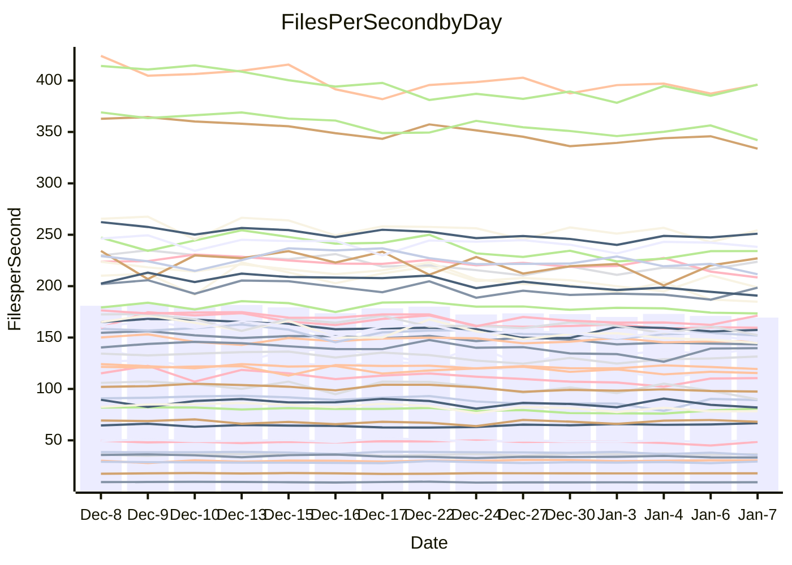

<!---
# This file is auto-generated. Do not edit.
# cspell:disable
--->
# Performance Report

## Daily Performance

## Time to Process Files

| Repository                                      | Elapsed | Min/Avg/Max           |   SD | SD Graph                |
| ----------------------------------------------- | ------: | :-------------------: | ---: | ----------------------- |
| AdaDoom3/AdaDoom3                    |    3.09 | 2.8 /   3.0 /   3.2   | 0.10 | `    ┣━━┻━━╋━━●━━┫    ` |
| alexiosc/megistos                    |    7.44 | 6.7 /   7.1 /   8.1   | 0.33 | `    ┣━━┻━━╋━━●━━┫    ` |
| apollographql/apollo-server          |    2.26 | 2.0 /   2.3 /   2.4   | 0.09 | `     ┣━┻━━●━━┻━┫     ` |
| aspnetboilerplate/aspnetboilerplate  |    9.59 | 8.8 /   9.4 /  10.4   | 0.39 | `    ┣━━┻━━╋●━┻━━┫    ` |
| aws-amplify/docs                     |   12.02 | 11.5 /  11.9 /  12.5  | 0.33 | `    ┣━━┻━━╋━●┻━━┫    ` |
| Azure/azure-rest-api-specs           |   16.67 | 13.8 /  15.4 /  17.0  | 0.83 | `   ┣━━━┻━━╋━━┻━●━┫   ` |
| bitjson/typescript-starter           |    0.65 | 0.6 /   0.7 /   0.7   | 0.02 | `     ┣━━┻●╋━┻━━┫     ` |
| caddyserver/caddy                    |    3.41 | 3.0 /   3.2 /   3.7   | 0.16 | `    ┣━━┻━━╋━━●━━┫    ` |
| canada-ca/open-source-logiciel-libre |    0.76 | 0.7 /   0.8 /   0.8   | 0.02 | `     ┣━━┻━●━┻━━┫     ` |
| chef/chef                            |    5.30 | 5.0 /   5.4 /   6.0   | 0.27 | `    ┣━━┻━●╋━━┻━━┫    ` |
| dart-lang/sdk                        |   58.69 | 55.8 /  59.5 /  65.0  | 2.00 | `  ┣━━━┻━●━╋━━━┻━━━┫  ` |
| django/django                        |   14.19 | 13.5 /  14.4 /  15.5  | 0.58 | `   ┣━━━┻━●╋━━┻━━━┫   ` |
| eslint/eslint                        |   10.68 | 9.5 /  10.0 /  10.9   | 0.39 | `    ┣━━┻━━╋━━┻━●┫    ` |
| exonum/exonum                        |    3.01 | 2.9 /   3.2 /   3.7   | 0.18 | `    ┣━━┻●━╋━━┻━━┫    ` |
| flutter/samples                      |   17.10 | 15.9 /  17.0 /  22.0  | 1.10 | `   ┣━━━┻━━●━━┻━━━┫   ` |
| gitbucket/gitbucket                  |    3.13 | 2.9 /   3.1 /   3.4   | 0.12 | `    ┣━━┻━━●━━┻━━┫    ` |
| googleapis/google-cloud-cpp          |  134.76 | 117.0 / 126.5 / 139.4 | 5.24 | `  ┣━━━┻━━━╋━━━┻━━●┫  ` |
| graphql/express-graphql              |    0.71 | 0.7 /   0.7 /   0.8   | 0.02 | `     ┣━━┻●╋━┻━━┫     ` |
| graphql/graphql-js                   |    2.23 | 2.1 /   2.2 /   2.4   | 0.08 | `     ┣━┻━━╋●━┻━┫     ` |
| graphql/graphql-relay-js             |    0.79 | 0.7 /   0.7 /   0.8   | 0.02 | `     ┣━━┻━╋━┻━━┫ ●   ` |
| graphql/graphql-spec                 |    0.84 | 0.8 /   0.8 /   0.9   | 0.02 | `     ┣━━┻━●━┻━━┫     ` |
| iluwatar/java-design-patterns        |   11.59 | 10.6 /  11.3 /  13.6  | 0.56 | `    ┣━━┻━━╋●━┻━━┫    ` |
| ktaranov/sqlserver-kit               |    6.05 | 5.9 /   6.2 /   6.6   | 0.21 | `    ┣━━┻●━╋━━┻━━┫    ` |
| liriliri/licia                       |    3.62 | 3.2 /   3.6 /   3.8   | 0.13 | `    ┣━━┻━━╋●━┻━━┫    ` |
| MartinThoma/LaTeX-examples           |    6.76 | 6.1 /   6.3 /   6.7   | 0.14 | `    ┣━━┻━━╋━━┻━━┫  ● ` |
| mdx-js/mdx                           |    1.59 | 1.5 /   1.6 /   1.8   | 0.08 | `     ┣━┻━━●━━┻━┫     ` |
| microsoft/TypeScript-Website         |    5.17 | 4.9 /   5.1 /   5.4   | 0.12 | `    ┣━━┻━━╋●━┻━━┫    ` |
| MicrosoftDocs/PowerShell-Docs        |   19.34 | 17.6 /  18.8 /  25.8  | 1.42 | `   ┣━━━┻━━╋●━┻━━━┫   ` |
| neovim/nvim-lspconfig                |    3.09 | 2.8 /   3.1 /   3.4   | 0.13 | `    ┣━━┻━━╋●━┻━━┫    ` |
| pagekit/pagekit                      |    3.31 | 3.0 /   3.4 /   3.8   | 0.17 | `    ┣━━┻━●╋━━┻━━┫    ` |
| php/php-src                          |   24.60 | 20.3 /  21.9 /  25.7  | 1.32 | `   ┣━━━┻━━╋━━┻━━━●   ` |
| plasticrake/tplink-smarthome-api     |    0.91 | 0.9 /   0.9 /   1.0   | 0.03 | `     ┣━┻━━●━━┻━┫     ` |
| prettier/prettier                    |    6.60 | 6.0 /   6.3 /   7.2   | 0.23 | `    ┣━━┻━━╋━━┻●━┫    ` |
| pycontribs/jira                      |    1.20 | 1.2 /   1.2 /   1.3   | 0.03 | `     ┣━●━━╋━━┻━┫     ` |
| RustPython/RustPython                |    4.33 | 3.9 /   4.2 /   4.6   | 0.16 | `    ┣━━┻━━╋━━●━━┫    ` |
| shoelace-style/shoelace              |    2.52 | 2.3 /   2.4 /   2.6   | 0.06 | `     ┣━┻━━╋━━●━┫     ` |
| slint-ui/slint                       |   10.63 | 8.4 /   9.4 /  11.8   | 0.72 | `    ┣━━┻━━╋━━┻━●┫    ` |
| SoftwareBrothers/admin-bro           |    2.22 | 2.0 /   2.1 /   2.3   | 0.09 | `     ┣━┻━━╋━━●━┫     ` |
| sveltejs/svelte                      |   18.00 | 17.0 /  18.1 /  18.9  | 0.56 | `   ┣━━━┻━━●━━┻━━━┫   ` |
| TheAlgorithms/Python                 |    5.38 | 5.0 /   5.3 /   5.8   | 0.21 | `    ┣━━┻━━╋●━┻━━┫    ` |
| twbs/bootstrap                       |    1.23 | 1.1 /   1.2 /   1.4   | 0.05 | `     ┣━┻━━╋━●┻━┫     ` |
| typescript-cheatsheets/react         |    1.09 | 1.0 /   1.1 /   1.3   | 0.04 | `     ┣━┻━━●━━┻━┫     ` |
| typescript-eslint/typescript-eslint  |    3.73 | 3.4 /   3.6 /   3.8   | 0.09 | `    ┣━━┻━━╋━━┻━●┫    ` |
| vitest-dev/vitest                    |    7.74 | 7.1 /   7.7 /   8.2   | 0.29 | `    ┣━━┻━━╋●━┻━━┫    ` |
| w3c/aria-practices                   |    2.90 | 2.7 /   2.9 /   3.2   | 0.14 | `    ┣━━┻━━●━━┻━━┫    ` |
| w3c/specberus                        |    1.68 | 1.6 /   1.6 /   1.7   | 0.03 | `     ┣━┻━━╋━●┻━┫     ` |
| webdeveric/webpack-assets-manifest   |    0.65 | 0.6 /   0.7 /   0.7   | 0.01 | `     ┣━●┻━╋━┻━━┫     ` |
| webpack/webpack                      |    5.17 | 4.5 /   4.8 /   5.3   | 0.20 | `    ┣━━┻━━╋━━┻━●┫    ` |
| wireapp/wire-desktop                 |    0.85 | 0.8 /   0.9 /   0.9   | 0.03 | `     ┣━━●━╋━┻━━┫     ` |
| wireapp/wire-webapp                  |    8.77 | 7.4 /   8.1 /   8.7   | 0.33 | `    ┣━━┻━━╋━━┻━━┫●   ` |

Note:
- Elapsed time is in seconds.

## Files per Second over Time

| Repository                                      | Files |    Sec |    Fps |     Rel | Trend Fps              |    N |
| ----------------------------------------------- | ----: | -----: | -----: | ------: | ---------------------- | ---: |
| AdaDoom3/AdaDoom3                    |   103 |   3.09 |  33.29 |  -3.64% | `▇▇█▆▅▄▄▆▅▆▆▅▄▆▅▅▆▄▆▅` |   28 |
| alexiosc/megistos                    |   583 |   7.44 |  78.38 |  -4.14% | `█▇▇█▇▅▅▇▇▇▇▇▆▃▅█▇▅▆▅` |   28 |
| apollographql/apollo-server          |   250 |   2.26 | 110.54 |  -0.54% | `▆▆▇█▇▇▇▆▅▆▅▅▅▄▇▄▇▅▇▇` |   30 |
| aspnetboilerplate/aspnetboilerplate  |  2246 |   9.59 | 234.12 |  -1.67% | `██▆▇█▇▅▅▅▆▆▆▆▆▃▄▅▅▇▆` |   28 |
| aws-amplify/docs                     |  2863 |  12.02 | 238.21 |  -1.46% | `█▆█▅▇▇█▇██▇▅▇▅▆▅▇▇▇▆` |   29 |
| Azure/azure-rest-api-specs           |  2413 |  16.67 | 144.77 |  -7.55% | `▃▅▅█▆▆▄▅▅▆▅▆▄▆▆▅▄▄▄▄` |   30 |
| bitjson/typescript-starter           |    20 |   0.65 |  30.57 |   1.29% | `▇▆▇▆▇▇▆██▇███▆▇▅▇█▆▇` |   28 |
| caddyserver/caddy                    |   279 |   3.41 |  81.91 |  -4.87% | `▇▅█▇▅▄▆▇▇▇▇▄▆▄▅█▆▅▇▅` |   30 |
| canada-ca/open-source-logiciel-libre |     7 |   0.76 |   9.24 |   0.25% | `▇▄▅▇█▄▅▅▅▅▅▆▆▆▅▆▅▅▆▆` |   28 |
| chef/chef                            |  1204 |   5.30 | 227.07 |   1.59% | `█▆▇█▅▇█▆▄▆▇▇▄▆▅▇▃▅█▇` |   28 |
| dart-lang/sdk                        | 10056 |  58.69 | 171.33 |   1.70% | `▇▇██▆▅▇█▆█▇▆▆▇▆▆▇▆▄█` |   30 |
| django/django                        |  2817 |  14.19 | 198.57 |   1.13% | `▇▇▆█▄▆▆▇▅▆▄▇▆▅▇▆▄▆▄▇` |   30 |
| eslint/eslint                        |  2038 |  10.68 | 190.76 |  -6.04% | `█▇██▇▅▇▇▇▆▇▄▇▅▅▆▄▅▆▅` |   30 |
| exonum/exonum                        |   421 |   3.01 | 139.69 |   4.48% | `▇█▆▆▅▇█▄▅▇█▇▆▇▆▆▇▇▆▇` |   28 |
| flutter/samples                      |  2690 |  17.10 | 157.33 |  -0.91% | `██▇█▇▇▆▆█▇█▂▇███▆▇█▇` |   30 |
| gitbucket/gitbucket                  |   412 |   3.13 | 131.55 |   0.47% | `▇▅█▇▅▆▅▅▇▇▅▇▄▇▄▆▆▇▇▇` |   30 |
| googleapis/google-cloud-cpp          | 19742 | 134.76 | 146.50 |  -6.29% | `▅▅██▆▆▇▆▇▆▇▆▇▆▄▇▇▆▄▅` |   30 |
| graphql/express-graphql              |    26 |   0.71 |  36.59 |   0.82% | `▆▇█▆▆▇█▇▄███▆▆▇██▇▇▇` |   28 |
| graphql/graphql-js                   |   339 |   2.23 | 152.06 |  -1.47% | `▆▅▄▇▇▇█▇▆▇▇▆▆▆▄▇▇▇▇▆` |   29 |
| graphql/graphql-relay-js             |    28 |   0.79 |  35.62 |  -6.62% | `▅▅▅██▇██▆▇▆▅█▇██▅▆█▄` |   28 |
| graphql/graphql-spec                 |    15 |   0.84 |  17.87 |  -0.03% | `▇▇▇▆▆█▇▇██▇▇█▆▇█▇▆█▇` |   28 |
| iluwatar/java-design-patterns        |  1849 |  11.59 | 159.56 |  -2.35% | `▇▇██▇▆▆▇▇▇▆▆▇▇▆▆▇▅▇▆` |   30 |
| ktaranov/sqlserver-kit               |   489 |   6.05 |  80.79 |   1.69% | `▅▇█▇▇▇▅▆▇▆▆▄▄▆▄▄▅▆▆▇` |   29 |
| liriliri/licia                       |  1434 |   3.62 | 395.98 |  -1.13% | `▇▆▆▇▇███▇█▆▅▇█▇▇▅▆▇▇` |   29 |
| MartinThoma/LaTeX-examples           |  1409 |   6.76 | 208.46 |  -6.19% | `▇▇▇▇█▇▆▇▇▇▇▅▇▆▇▇█▆▅▄` |   28 |
| mdx-js/mdx                           |   142 |   1.59 |  89.26 |   0.43% | `▇▇██▆▇▇▅█▇▆▃▇▅▅▃▇▇▇▇` |   29 |
| microsoft/TypeScript-Website         |   757 |   5.17 | 146.42 |  -0.93% | `▆▆▇▇█▆▅▆▇█▅▅█▆▇▆▇▆▄▆` |   29 |
| MicrosoftDocs/PowerShell-Docs        |  2232 |  19.34 | 115.44 |  -2.90% | `█▇▇▇▇▇▇▇█▆▅▆▇▇▇▆▆▇▇▆` |   30 |
| neovim/nvim-lspconfig                |   373 |   3.09 | 120.65 |  -0.74% | `▇▇██▆▇▅▇▆▇▇▇▆█▄▄▆▆▄▇` |   30 |
| pagekit/pagekit                      |   741 |   3.31 | 223.76 |   1.01% | `██▇▆▆▆▅▆▃█▅▆▅▃▇▅▆▆▆▇` |   28 |
| php/php-src                          |  2212 |  24.60 |  89.91 | -11.48% | `▃▅██▇▇▇▄▇▆▇▇▃▆▇█▆▅▆▄` |   30 |
| plasticrake/tplink-smarthome-api     |    62 |   0.91 |  68.06 |   0.41% | `▇▅▆▇▇▇▃▇█▆▇▇█▆▆▇▇█▇▇` |   28 |
| prettier/prettier                    |  2203 |   6.60 | 333.80 |  -4.43% | `██▇██▇▇▇▇▇▇▃▇▅▇▇▇▇▇▆` |   30 |
| pycontribs/jira                      |    80 |   1.20 |  66.63 |   3.23% | `▆▆▆▅▅▅▇▇▇▅▇▇▇█▇█▇█▆█` |   28 |
| RustPython/RustPython                |   621 |   4.33 | 143.40 |  -3.87% | `██▇█▆▇▇█▇▇▇▇▄▆█▆▇▇▄▆` |   30 |
| shoelace-style/shoelace              |   438 |   2.52 | 173.49 |  -3.21% | `▆▆██▇▇█▇▆█▆▆▆█▇▇▇▇▄▆` |   30 |
| slint-ui/slint                       |  1964 |  10.63 | 184.82 | -11.04% | `█▇▇█▇▆▇▅▇▅▅▇▇▅▄▆▅▆▂▄` |   30 |
| SoftwareBrothers/admin-bro           |   441 |   2.22 | 198.78 |  -4.24% | `▇▅▇▇█▇▅▆▇▇▇▅▅▆▃▆▄▇▆▅` |   28 |
| sveltejs/svelte                      |  7130 |  18.00 | 396.01 |   0.50% | `███▆▇▇▆▆██▆▆▅▅▆█▆▇▇█` |   30 |
| TheAlgorithms/Python                 |  1367 |   5.38 | 254.26 |  -0.51% | `▇▄▇▇▆▆▄▆█▆▅▆▆▄▇▇▅▅▄▆` |   30 |
| twbs/bootstrap                       |   120 |   1.23 |  97.48 |  -2.92% | `▃▆▇▇█▅▅▅▅▅▆█▇▄▅▆▄▆▆▅` |   30 |
| typescript-cheatsheets/react         |    53 |   1.09 |  48.48 |   0.03% | `▇▇▇█▇██▇▇█▇▇▇▇█▇▇▃█▇` |   28 |
| typescript-eslint/typescript-eslint  |  1275 |   3.73 | 342.03 |  -4.39% | `▇█▆▆█▇▇▇▇▆▇▆▄▇▆▇▇█▇▆` |   30 |
| vitest-dev/vitest                    |  1942 |   7.74 | 251.03 |   0.33% | `▇▅██▇▆▇▇▇▆▅▇▇▅▅▇▇▆█▇` |   30 |
| w3c/aria-practices                   |   405 |   2.90 | 139.70 |   0.52% | `▆▅▇▆█▇▆▇▆▄▃▇▇▆▆▃▄▆▆▆` |   29 |
| w3c/specberus                        |   200 |   1.68 | 119.38 |  -1.56% | `██▇▅▆▆▇█▇▇▇▆▆▇▅▇██▆▆` |   29 |
| webdeveric/webpack-assets-manifest   |    19 |   0.65 |  29.36 |   3.07% | `▆▅▆▅█▆▇▆▅▇▇▅▇▆▅▇▇▅▅▇` |   28 |
| webpack/webpack                      |  1095 |   5.17 | 211.59 |  -6.89% | `█▆██▆▆▅▅▆▆▆▅▅█▆▆▅▇▄▄` |   29 |
| wireapp/wire-desktop                 |    43 |   0.85 |  50.45 |   2.30% | `▆▅█▇▅▆▇▇▇▇▅▅▅▆▇▇▇▄▅▇` |   30 |
| wireapp/wire-webapp                  |  1337 |   8.77 | 152.39 |  -7.34% | `▇▆█▆▆▆▅▅▇▇▆▇▅▆▇▄▄▇▆▄` |   30 |

## Data Throughput

| Repository                                      | Files |    Sec |     Kps |     Rel | Trend Kps              |    N |
| ----------------------------------------------- | ----: | -----: | ------: | ------: | ---------------------- | ---: |
| AdaDoom3/AdaDoom3                    |   103 |   3.09 |  707.45 |  -3.64% | `▇▇█▆▅▄▄▆▅▆▆▅▄▆▅▅▆▄▆▅` |   28 |
| alexiosc/megistos                    |   583 |   7.44 |  615.88 |  -4.14% | `█▇▇█▇▅▅▇▇▇▇▇▆▃▅█▇▅▆▅` |   28 |
| apollographql/apollo-server          |   250 |   2.26 |  884.76 |  -0.38% | `▆▆▇█▇▇▇▆▅▆▅▅▅▄▇▄▇▅▇▇` |   30 |
| aspnetboilerplate/aspnetboilerplate  |  2246 |   9.59 |  550.79 |  -1.67% | `██▆▇█▇▅▅▅▆▆▆▆▆▃▄▅▅▇▆` |   28 |
| aws-amplify/docs                     |  2863 |  12.02 |  816.23 |  -1.33% | `█▆█▅▇▇█▇██▇▅▇▅▆▅▇▇▇▆` |   29 |
| Azure/azure-rest-api-specs           |  2413 |  16.67 |  417.33 |  -7.47% | `▃▅▅█▆▆▄▅▅▆▅▆▄▇▆▅▄▄▅▄` |   30 |
| bitjson/typescript-starter           |    20 |   0.65 |  122.27 |   1.29% | `▇▆▇▆▇▇▆██▇███▆▇▅▇█▆▇` |   28 |
| caddyserver/caddy                    |   279 |   3.41 |  682.31 |  -4.69% | `▆▅█▇▅▄▆▇▇▇▇▄▆▅▅█▆▅▇▅` |   30 |
| canada-ca/open-source-logiciel-libre |     7 |   0.76 |   76.54 |   0.25% | `▇▄▅▇█▄▅▅▅▅▅▆▆▆▅▆▅▅▆▆` |   28 |
| chef/chef                            |  1204 |   5.30 | 1042.93 |   1.60% | `█▆▇█▅▇█▆▄▆▇▇▄▆▅▇▃▅█▇` |   28 |
| dart-lang/sdk                        | 10056 |  58.69 | 1220.44 |   1.52% | `▇▇██▆▅▇█▆█▇▆▆▇▆▆▇▆▄█` |   30 |
| django/django                        |  2817 |  14.19 | 1228.57 |   1.29% | `▇▇▆█▄▇▆▇▅▆▄▇▆▅▇▆▄▆▄▇` |   30 |
| eslint/eslint                        |  2038 |  10.68 | 1558.48 |  -5.90% | `█▇██▇▅▇▇▇▆▇▅▇▅▅▆▄▅▆▅` |   30 |
| exonum/exonum                        |   421 |   3.01 | 1336.16 |   4.48% | `▇█▆▆▅▇█▄▅▇█▇▆▇▆▆▇▇▆▇` |   28 |
| flutter/samples                      |  2690 |  17.10 | 1274.30 |  -0.91% | `██▇█▇▇▆▆█▇█▂▇███▆▇█▇` |   30 |
| gitbucket/gitbucket                  |   412 |   3.13 |  595.19 |   0.48% | `▇▅█▇▅▆▅▅▇▇▅▇▄▇▄▆▆▇▇▇` |   30 |
| googleapis/google-cloud-cpp          | 19742 | 134.76 | 1143.55 |  -6.34% | `▅▅██▆▆▇▆▇▆▇▆▇▆▄▇▇▆▄▅` |   30 |
| graphql/express-graphql              |    26 |   0.71 |  167.47 |   0.82% | `▆▇█▆▆▇█▇▄███▆▆▇██▇▇▇` |   28 |
| graphql/graphql-js                   |   339 |   2.23 |  863.93 |  -1.47% | `▆▅▄▇▇▇█▇▆▇▇▆▆▆▄▇▇▇▇▆` |   29 |
| graphql/graphql-relay-js             |    28 |   0.79 |  139.93 |  -6.62% | `▅▅▅██▇██▆▇▆▅█▇██▅▆█▄` |   28 |
| graphql/graphql-spec                 |    15 |   0.84 |  657.47 |  -0.02% | `▇▇▇▆▆█▇▇██▇▇█▆▇█▇▆█▇` |   28 |
| iluwatar/java-design-patterns        |  1849 |  11.59 |  491.71 |  -2.35% | `▇▇██▇▆▆▇▇▇▆▆▇▇▆▆▇▅▇▆` |   30 |
| ktaranov/sqlserver-kit               |   489 |   6.05 | 1222.21 |   1.68% | `▅▇█▇▇▇▅▆▇▆▆▄▄▆▄▄▅▆▆▇` |   29 |
| liriliri/licia                       |  1434 |   3.62 |  469.15 |  -1.13% | `▇▆▆▇▇███▇█▆▅▇█▇▇▅▆▇▇` |   29 |
| MartinThoma/LaTeX-examples           |  1409 |   6.76 |  430.53 |  -6.19% | `▇▇▇▇█▇▆▇▇▇▇▅▇▆▇▇█▆▅▄` |   28 |
| mdx-js/mdx                           |   142 |   1.59 |  412.97 |   0.16% | `▇▇██▆▇▇▅█▇▆▃▇▅▅▃▇▇▇▇` |   29 |
| microsoft/TypeScript-Website         |   757 |   5.17 | 1002.70 |  -0.93% | `▆▆▇▇█▆▅▆▇█▅▅█▆▇▆▇▆▄▆` |   29 |
| MicrosoftDocs/PowerShell-Docs        |  2232 |  19.34 | 1153.04 |  -2.82% | `█▇▇▇▇▇▇▇█▆▅▆▇▇▇▆▆▇▇▆` |   30 |
| neovim/nvim-lspconfig                |   373 |   3.09 |  316.03 |  -0.22% | `▇▇██▆▇▅▇▆▇▇▇▆█▄▄▆▆▄▇` |   30 |
| pagekit/pagekit                      |   741 |   3.31 |  466.54 |   1.01% | `██▇▆▆▆▅▆▃█▅▆▅▃▇▅▆▆▆▇` |   28 |
| php/php-src                          |  2212 |  24.60 | 1317.01 | -11.41% | `▃▅██▇▇▇▄▇▆▇▇▃▆▇█▆▅▆▄` |   30 |
| plasticrake/tplink-smarthome-api     |    62 |   0.91 |  367.75 |   0.41% | `▇▅▆▇▇▇▃▇█▆▇▇█▆▆▇▇█▇▇` |   28 |
| prettier/prettier                    |  2203 |   6.60 |  471.23 |  -4.60% | `██▇██▇▇▇▇▇▇▃▇▅▇▇▇▇▇▆` |   30 |
| pycontribs/jira                      |    80 |   1.20 |  458.90 |   3.23% | `▆▆▆▅▅▅▇▇▇▅▇▇▇█▇█▇█▆█` |   28 |
| RustPython/RustPython                |   621 |   4.33 | 1058.53 |  -3.83% | `██▇█▆▇▇█▇▇▇▇▄▆█▆▇▇▄▆` |   30 |
| shoelace-style/shoelace              |   438 |   2.52 |  833.41 |  -3.15% | `▆▆██▇▇█▇▆█▆▆▆█▇▇▇▇▄▆` |   30 |
| slint-ui/slint                       |  1964 |  10.63 |  946.05 | -11.08% | `█▇▇█▇▆▇▅▇▅▅▇▇▅▄▆▄▆▂▄` |   30 |
| SoftwareBrothers/admin-bro           |   441 |   2.22 |  438.14 |  -4.24% | `▇▅▇▇█▇▅▆▇▇▇▅▅▆▃▆▄▇▆▅` |   28 |
| sveltejs/svelte                      |  7130 |  18.00 |  260.38 |   0.05% | `███▆▇▇▆▆██▆▇▅▆▆█▇▇▇█` |   30 |
| TheAlgorithms/Python                 |  1367 |   5.38 |  646.15 |  -0.23% | `▇▄▇▇▆▆▄▆█▆▅▆▆▄▇▇▆▅▄▆` |   30 |
| twbs/bootstrap                       |   120 |   1.23 |  782.27 |  -2.92% | `▃▆▇▇█▅▅▅▅▅▆█▇▄▅▆▄▆▆▅` |   30 |
| typescript-cheatsheets/react         |    53 |   1.09 |  354.89 |   0.03% | `▇▇▇█▇██▇▇█▇▇▇▇█▇▇▃█▇` |   28 |
| typescript-eslint/typescript-eslint  |  1275 |   3.73 | 1644.67 |  -3.53% | `▇█▆▆█▇▇▇▇▇▇▆▄▇▇▇▇██▆` |   30 |
| vitest-dev/vitest                    |  1942 |   7.74 |  517.19 |   0.37% | `▇▅██▇▇▇██▆▅▇▇▅▅▇▇▆█▇` |   30 |
| w3c/aria-practices                   |   405 |   2.90 | 1297.32 |   0.38% | `▆▅▇▆█▇▆▇▆▄▃▇▇▆▆▃▄▆▆▆` |   29 |
| w3c/specberus                        |   200 |   1.68 |  380.82 |  -1.56% | `██▇▅▆▆▇█▇▇▇▆▆▇▅▇██▆▆` |   29 |
| webdeveric/webpack-assets-manifest   |    19 |   0.65 |  157.60 |   3.07% | `▆▅▆▅█▆▇▆▅▇▇▅▇▆▅▇▇▅▅▇` |   28 |
| webpack/webpack                      |  1095 |   5.17 |  933.53 |  -6.88% | `█▆██▆▆▅▅▆▆▆▆▅█▆▆▅▇▄▄` |   29 |
| wireapp/wire-desktop                 |    43 |   0.85 |  222.94 |   2.35% | `▆▅█▇▅▆▇▇▇▇▅▅▅▆▇▇▇▄▅▇` |   30 |
| wireapp/wire-webapp                  |  1337 |   8.77 |  616.63 |  -7.63% | `▇▆█▆▆▆▅▅▇▇▆▇▅▆▇▄▄▇▆▄` |   30 |

