<!---
# This file is auto-generated. Do not edit.
# cspell:disable
--->
# Performance Report

## Daily Performance

```mermaid
xychart-beta
    title Files Per Second by Day
    y-axis Files per Second
    x-axis Date [May-12, May-13, May-14, May-15, May-16, May-18, May-19, May-20, May-23, May-26, May-27, May-28, Jun-2, Jun-3, Jun-4, Jun-5, Jun-6, Jun-7, Jun-8, Jun-9, Jun-10, Jun-11]
    bar [166.34, 172.19, 166.30, 168.97, 170.53, 170.36, 168.47, 166.35, 167.96, 170.65, 166.96, 169.46, 169.96, 167.33, 166.18, 163.49, 167.64, 166.67, 170.13, 167.55, 162.35, 81.00]
    line [79.58, 78.43, 72.10, 77.35, 81.14, 78.37, 76.94, 80.65, 76.65, 82.54, 75.89, 77.47, 73.86, 74.85, 71.14, 76.14, 78.15, 82.81, 79.64, 79.01, 70.82, 47.81]
    line [86.71, 84.47, 88.90, 88.97, 89.34, 88.33, 86.97, 88.46, 88.03, 86.15, 86.86, 88.34, 85.50, 84.47, 88.02, 88.72, 85.27, 89.11, 82.67, 88.45, 84.36, 78.91]
    line [108.06, 108.54, 99.38, 107.08, 107.13, 109.20, 107.30, 109.63, 102.83, 110.16, 104.19, 109.94, 104.58, 100.60, 104.91, 105.40, 103.85, 106.22, 109.49, 108.40, 100.17, 83.62]
    line [147.69, 147.02, 142.52, 145.54, 149.90, 147.54, 148.35, 146.43, 150.96, 150.26, 137.65, 149.96, 147.05, 148.67, 143.16, 145.94, 143.30, 134.96, 144.03, 143.02, 149.83, 116.77]
    line [334.33, 332.82, 320.86, 333.17, 332.61, 335.87, 332.27, 328.58, 331.96, 332.86, 326.59, 328.18, 330.50, 324.04, 333.26, 322.71, 333.34, 330.40, 327.16, 331.90, 323.14, 193.67]
    line [139.20, 144.62, 127.45, 143.99, 141.77, 143.07, 145.59, 141.58, 135.01, 142.18, 138.23, 142.50, 144.46, 138.26, 141.73, 144.23, 142.34, 139.73, 144.07, 140.57, 144.39, 90.26]
    line [47.37, 46.30, 48.69, 48.22, 49.55, 48.73, 48.79, 48.29, 46.50, 48.65, 48.11, 48.53, 45.73, 48.27, 48.30, 47.93, 47.89, 48.02, 48.77, 46.64, 45.94, 44.73]
    line [340.62, 334.56, 294.73, 334.87, 315.41, 346.35, 334.68, 334.65, 336.21, 336.65, 339.29, 320.69, 338.05, 333.16, 341.58, 330.05, 336.69, 331.37, 341.98, 331.53, 337.68, 179.65]
    line [179.93, 194.66, 187.78, 191.72, 196.34, 187.34, 185.35, 189.04, 192.39, 186.34, 187.29, 189.95, 184.53, 188.39, 185.43, 180.94, 188.95, 192.45, 187.05, 185.74, 177.64, 71.30]
    line [69.77, 67.94, 63.43, 64.29, 66.74, 65.81, 66.84, 66.34, 68.16, 66.47, 61.90, 67.30, 66.98, 65.52, 63.49, 66.01, 65.37, 69.17, 67.00, 68.40, 68.60, 63.27]
    line [256.31, 245.89, 226.73, 248.94, 227.93, 245.76, 244.49, 245.02, 249.85, 247.35, 234.97, 257.03, 246.00, 240.49, 248.05, 241.53, 240.02, 250.72, 249.07, 243.35, 230.21, 79.75]
    line [205.57, 220.26, 196.51, 205.48, 197.40, 209.57, 208.50, 215.95, 219.60, 210.18, 213.28, 212.12, 220.46, 209.25, 209.34, 207.30, 195.72, 199.83, 209.95, 194.96, 213.85, 122.31]
    line [189.93, 194.03, 194.59, 196.19, 191.05, 192.47, 177.89, 192.16, 190.92, 193.68, 178.94, 172.60, 191.14, 184.47, 180.81, 182.21, 194.17, 193.46, 193.48, 195.01, 190.90, 72.89]
    line [242.94, 244.80, 245.38, 242.84, 244.51, 242.53, 234.41, 245.11, 237.94, 239.51, 236.94, 237.65, 241.45, 240.17, 238.54, 237.31, 234.14, 229.58, 244.42, 243.79, 239.33, 81.97]
    line [124.68, 121.17, 123.75, 127.64, 128.53, 126.42, 126.77, 120.74, 126.60, 125.67, 123.56, 125.85, 123.16, 123.10, 122.32, 125.12, 124.06, 124.88, 126.90, 127.99, 124.73, 61.61]
    line [195.81, 199.38, 179.78, 176.57, 191.99, 188.23, 196.89, 184.41, 189.52, 192.06, 177.15, 178.96, 184.54, 184.81, 185.74, 189.51, 188.80, 197.42, 184.56, 185.39, 175.70, 134.26]
    line [143.08, 139.04, 127.38, 143.64, 143.63, 143.64, 138.45, 140.67, 141.36, 140.42, 139.81, 139.15, 143.14, 140.08, 138.53, 141.10, 136.12, 141.18, 140.04, 142.05, 141.88, 66.42]
    line [184.57, 179.69, 190.06, 187.90, 186.22, 189.65, 187.06, 187.21, 189.27, 188.81, 187.98, 187.78, 177.77, 184.03, 180.33, 185.60, 181.36, 181.92, 188.23, 188.91, 180.00, 68.86]
    line [148.91, 151.04, 141.64, 143.30, 152.80, 151.43, 149.63, 151.63, 149.82, 148.87, 152.29, 152.18, 146.83, 146.85, 149.33, 152.93, 149.35, 153.74, 153.91, 150.81, 139.91, 68.51]
    line [166.91, 166.88, 159.89, 163.94, 170.50, 166.49, 162.92, 166.27, 164.82, 169.22, 155.11, 163.74, 161.68, 166.56, 168.03, 163.74, 168.68, 168.50, 167.45, 164.46, 166.51, 69.39]
    line [218.54, 215.87, 198.70, 198.92, 193.26, 206.82, 208.12, 200.26, 208.33, 208.13, 206.60, 213.74, 210.83, 203.35, 203.68, 215.12, 220.07, 216.34, 222.20, 218.63, 215.45, 131.94]
    line [115.50, 113.50, 113.65, 116.71, 113.77, 111.44, 115.40, 113.43, 112.49, 114.58, 117.54, 113.89, 113.32, 110.93, 114.82, 116.20, 110.99, 111.90, 113.82, 109.84, 106.42, 109.81]
    line [225.21, 225.16, 230.32, 208.51, 223.18, 229.26, 224.98, 230.86, 231.74, 226.83, 229.07, 218.04, 228.28, 213.28, 208.94, 221.41, 223.40, 228.84, 234.29, 227.02, 228.77, 207.17]
    line [268.20, 264.65, 271.47, 262.16, 268.02, 265.09, 258.04, 267.05, 255.94, 257.76, 255.79, 260.96, 252.34, 260.36, 252.30, 249.54, 253.41, 262.59, 260.07, 261.63, 234.80, 184.90]
    line [91.17, 98.66, 94.02, 90.96, 99.83, 91.94, 88.40, 90.08, 92.28, 97.44, 94.80, 98.23, 84.40, 87.80, 85.09, 84.81, 89.37, 83.72, 89.94, 85.93, 72.73, 50.04]
    line [164.14, 168.22, 165.47, 169.61, 162.55, 163.57, 157.32, 160.08, 164.41, 165.93, 161.02, 168.94, 162.90, 166.32, 157.04, 157.22, 160.62, 160.99, 161.40, 162.90, 146.98, 71.76]
    line [146.80, 151.99, 141.37, 146.91, 150.57, 149.37, 149.78, 140.84, 145.19, 146.87, 145.21, 148.86, 148.30, 147.22, 148.06, 137.39, 147.79, 143.52, 149.79, 142.40, 146.80, 69.13]
    line [10.31, 10.27, 9.90, 9.33, 9.97, 9.95, 10.01, 9.91, 9.31, 9.58, 10.09, 9.91, 9.92, 9.53, 9.28, 10.06, 10.19, 9.49, 10.16, 10.41, 10.23, 10.05]
    line [35.78, 32.88, 35.46, 35.61, 32.66, 32.30, 35.13, 33.62, 35.61, 34.38, 35.47, 33.75, 35.37, 34.22, 32.93, 35.76, 34.34, 33.08, 34.79, 30.45, 36.74, 33.58]
    line [26.75, 29.76, 30.51, 30.52, 29.81, 30.62, 29.84, 28.21, 27.37, 29.89, 29.97, 29.26, 26.66, 29.18, 29.82, 30.31, 29.19, 29.49, 29.31, 30.11, 30.11, 28.48]
    line [133.35, 122.61, 133.53, 133.12, 131.47, 131.60, 132.60, 130.97, 127.07, 128.33, 122.44, 116.90, 125.01, 123.38, 123.79, 117.07, 125.94, 118.40, 118.39, 121.53, 129.30, 127.94]
    line [82.11, 85.57, 83.56, 85.40, 85.46, 86.28, 87.70, 83.40, 85.76, 87.23, 86.22, 87.00, 88.85, 85.35, 85.47, 89.21, 83.88, 87.59, 84.94, 85.33, 87.27, 48.11]
    line [190.41, 187.82, 203.06, 199.79, 204.27, 205.03, 195.35, 198.93, 186.91, 198.66, 199.24, 175.34, 196.23, 196.86, 189.06, 201.96, 198.84, 198.16, 197.09, 193.40, 192.55, 174.75]
    line [379.30, 373.05, 365.07, 381.01, 380.59, 377.82, 377.10, 377.94, 382.62, 377.83, 380.47, 381.86, 371.54, 374.06, 373.98, 371.38, 376.26, 368.01, 380.10, 379.55, 383.29, 350.86]
    line [16.32, 16.77, 17.92, 17.71, 17.58, 17.65, 16.96, 17.30, 17.64, 17.45, 17.18, 17.51, 16.57, 17.42, 16.78, 16.53, 16.44, 17.51, 17.66, 17.41, 17.50, 17.23]
    line [36.66, 37.79, 37.24, 36.68, 36.93, 37.19, 36.50, 37.36, 36.38, 38.01, 36.71, 34.78, 33.91, 36.69, 37.31, 37.44, 37.24, 35.30, 34.77, 36.25, 37.82, 28.95]
    line [45.93, 47.77, 45.98, 48.12, 46.48, 48.80, 46.77, 46.21, 46.03, 45.45, 46.05, 45.56, 40.22, 45.53, 45.18, 46.69, 45.37, 46.01, 47.36, 45.48, 45.06, 32.62]
    line [217.29, 215.75, 197.30, 214.87, 209.14, 211.55, 213.63, 211.52, 212.12, 209.73, 211.01, 213.71, 214.38, 214.29, 209.74, 209.84, 206.76, 201.57, 215.78, 212.77, 213.18, 70.44]
    line [58.65, 60.35, 63.19, 61.20, 62.95, 62.89, 60.12, 59.81, 61.51, 60.65, 60.71, 60.16, 61.03, 59.59, 60.87, 59.62, 60.76, 62.31, 62.61, 63.50, 58.41, 39.12]
    line [169.50, 174.44, 178.32, 174.09, 174.49, 176.32, 175.06, 172.88, 170.72, 168.50, 169.00, 171.65, 172.08, 171.12, 171.41, 171.98, 173.13, 171.37, 173.71, 173.55, 167.26, 141.07]
    line [75.68, 77.38, 75.72, 74.53, 76.86, 72.12, 77.17, 77.17, 76.67, 74.85, 76.23, 75.12, 76.51, 74.07, 73.11, 74.81, 76.32, 76.71, 76.80, 73.74, 74.27, 46.26]
    line [208.07, 219.61, 196.71, 217.50, 208.81, 206.53, 221.15, 213.00, 216.38, 218.77, 212.39, 203.78, 212.56, 214.03, 221.77, 221.19, 224.37, 218.89, 220.13, 221.21, 219.70, 74.32]
    line [67.95, 67.86, 67.59, 62.41, 66.69, 67.14, 67.37, 65.68, 64.90, 66.54, 65.92, 61.45, 66.55, 63.66, 66.39, 61.22, 66.87, 62.38, 67.14, 67.89, 65.57, 59.93]
    line [125.90, 125.82, 123.46, 122.18, 122.11, 124.34, 125.23, 124.43, 115.02, 121.98, 123.80, 115.09, 129.03, 122.28, 116.92, 123.22, 114.34, 124.65, 123.68, 119.64, 124.80, 89.25]
    line [221.99, 217.52, 232.11, 221.53, 218.22, 226.74, 223.86, 221.34, 220.21, 220.12, 213.01, 224.63, 217.35, 221.03, 221.25, 213.65, 229.70, 223.48, 219.68, 227.92, 202.72, 81.02]
    line [128.69, 133.43, 136.60, 125.12, 133.23, 134.94, 134.09, 128.45, 130.01, 134.41, 130.99, 133.32, 137.46, 133.16, 131.72, 138.89, 137.60, 137.33, 133.44, 128.55, 130.54, 105.03]
    line [73.82, 79.33, 79.19, 79.44, 75.54, 82.49, 78.33, 77.90, 79.31, 77.89, 78.87, 79.08, 78.31, 73.00, 75.74, 76.85, 75.23, 78.81, 80.33, 77.10, 77.48, 48.10]
    line [32.72, 33.28, 32.89, 30.56, 31.82, 33.25, 32.21, 32.32, 32.24, 32.56, 32.77, 31.93, 31.50, 31.70, 32.51, 32.67, 32.05, 32.77, 33.08, 31.95, 32.91, 25.01]
    line [382.33, 383.40, 373.36, 376.94, 373.43, 377.39, 360.07, 376.99, 368.71, 369.17, 371.49, 369.90, 373.28, 367.80, 363.68, 370.07, 366.52, 374.25, 374.25, 369.07, 378.68, 93.41]
    line [154.32, 150.31, 157.94, 153.23, 153.21, 157.46, 157.66, 156.52, 145.53, 155.04, 142.71, 139.43, 150.16, 152.90, 156.03, 151.19, 149.91, 156.27, 156.23, 153.60, 155.11, 70.63]
```

## Time to Process Files

| Repository                                      | Elapsed | Min/Avg/Max           |   SD | SD Graph                |
| ----------------------------------------------- | ------: | :-------------------: | ---: | ----------------------- |
| AdaDoom3/AdaDoom3                    |    4.12 | 3.0 /   3.2 /   3.6   | 0.09 | `        ┣┻╋┻┫       ●` |
| alexiosc/megistos                    |   12.12 | 7.0 /   7.5 /   8.2   | 0.26 | `         ┣╋┫        ●` |
| apollographql/apollo-server          |    3.05 | 2.3 /   2.4 /   2.8   | 0.10 | `       ┣┻━╋━┻┫      ●` |
| aspnetboilerplate/aspnetboilerplate  |   27.88 | 9.7 /  10.3 /  11.6   | 0.35 | `          ┫         ●` |
| aws-amplify/docs                     |   13.86 | 12.1 /  12.8 /  15.7  | 0.72 | `   ┣━━━┻━━╋━━┻━●━┫   ` |
| Azure/azure-rest-api-specs           |   12.99 | 8.7 /   9.2 /  10.2   | 0.36 | `        ┣┻╋┻┫       ●` |
| bitjson/typescript-starter           |    0.70 | 0.6 /   0.7 /   0.9   | 0.04 | `     ┣━┻━━╋●━┻━┫     ` |
| caddyserver/caddy                    |    5.94 | 3.3 /   3.7 /   4.2   | 0.22 | `        ┣┻╋┻┫       ●` |
| canada-ca/open-source-logiciel-libre |    0.70 | 0.7 /   0.7 /   0.9   | 0.05 | `     ┣━┻━●╋━━┻━┫     ` |
| chef/chef                            |    9.85 | 5.4 /   5.8 /   6.5   | 0.28 | `         ┣╋┫        ●` |
| dart-lang/sdk                        |  148.26 | 60.6 /  64.7 /  72.4  | 2.47 | `         ┣┻┫        ●` |
| django/django                        |   41.27 | 14.5 /  15.3 /  16.2  | 0.43 | `          ┫         ●` |
| eslint/eslint                        |   28.37 | 10.3 /  10.9 /  12.3  | 0.51 | `         ┣┻┫        ●` |
| exonum/exonum                        |    3.29 | 3.1 /   3.3 /   3.7   | 0.18 | `    ┣━━┻━●╋━━┻━━┫    ` |
| flutter/samples                      |   38.78 | 16.9 /  17.7 /  19.5  | 0.54 | `         ┣┻┫        ●` |
| gitbucket/gitbucket                  |    6.69 | 3.2 /   3.3 /   3.7   | 0.12 | `         ┣┻┫        ●` |
| googleapis/google-cloud-cpp          |  295.86 | 132.1 / 139.5 / 153.3 | 4.98 | `         ┣┻┫        ●` |
| graphql/express-graphql              |    0.77 | 0.7 /   0.8 /   0.9   | 0.05 | `     ┣━┻━━╋●━┻━┫     ` |
| graphql/graphql-js                   |    3.07 | 2.2 /   2.4 /   2.8   | 0.13 | `      ┣━┻━╋━┻━┫     ●` |
| graphql/graphql-relay-js             |    0.97 | 0.7 /   0.8 /   0.9   | 0.03 | `       ┣┻━╋━┻┫      ●` |
| graphql/graphql-spec                 |    0.87 | 0.8 /   0.9 /   1.0   | 0.03 | `     ┣━━┻━●━┻━━┫     ` |
| iluwatar/java-design-patterns        |   28.20 | 12.3 /  13.1 /  15.4  | 0.63 | `         ┣┻┫        ●` |
| ktaranov/sqlserver-kit               |   10.57 | 6.2 /   6.5 /   7.0   | 0.18 | `         ┣┻┫        ●` |
| liriliri/licia                       |    4.10 | 3.7 /   3.8 /   4.0   | 0.07 | `     ┣━┻━━╋━━┻━┫    ●` |
| MartinThoma/LaTeX-examples           |   20.00 | 6.4 /   6.7 /   7.5   | 0.22 | `          ┫         ●` |
| mdx-js/mdx                           |    2.93 | 1.5 /   1.6 /   1.8   | 0.05 | `         ┣┻┫        ●` |
| microsoft/TypeScript-Website         |   11.44 | 5.1 /   5.4 /   6.0   | 0.18 | `         ┣┻┫        ●` |
| MicrosoftDocs/PowerShell-Docs        |   24.65 | 22.6 /  23.8 /  25.8  | 0.79 | `   ┣━━━┻━━╋━━┻●━━┫   ` |
| neovim/nvim-lspconfig                |   10.48 | 3.7 /   4.0 /   4.3   | 0.13 | `          ┫         ●` |
| pagekit/pagekit                      |    9.97 | 3.2 /   3.4 /   3.8   | 0.12 | `          ┫         ●` |
| php/php-src                          |   45.39 | 21.9 /  24.8 /  31.2  | 2.23 | `        ┣┻╋┻┫       ●` |
| plasticrake/tplink-smarthome-api     |    1.03 | 0.9 /   0.9 /   1.1   | 0.04 | `     ┣━┻━━╋━━┻━●     ` |
| prettier/prettier                    |   11.92 | 6.6 /   6.9 /   7.3   | 0.16 | `         ┣┻┫        ●` |
| pycontribs/jira                      |    2.02 | 1.2 /   1.3 /   1.4   | 0.05 | `         ┣╋┫        ●` |
| RustPython/RustPython                |    7.47 | 4.6 /   4.8 /   5.3   | 0.17 | `         ┣╋┫        ●` |
| shoelace-style/shoelace              |    3.11 | 2.5 /   2.6 /   2.8   | 0.07 | `       ┣━┻╋┻━┫      ●` |
| slint-ui/slint                       |   16.20 | 10.4 /  11.6 /  13.4  | 0.63 | `       ┣━┻╋┻━┫      ●` |
| SoftwareBrothers/admin-bro           |    2.52 | 2.1 /   2.2 /   2.5   | 0.09 | `     ┣━┻━━╋━━┻━┫  ●  ` |
| sveltejs/svelte                      |   80.12 | 18.5 /  20.0 /  21.6  | 0.56 | `          ┫         ●` |
| TheAlgorithms/Python                 |   17.42 | 5.4 /   5.7 /   6.5   | 0.23 | `          ┫         ●` |
| twbs/bootstrap                       |    1.50 | 1.3 /   1.4 /   1.5   | 0.04 | `     ┣━┻━━╋━━┻━┫  ●  ` |
| typescript-cheatsheets/react         |    1.62 | 1.1 /   1.2 /   1.3   | 0.05 | `        ┣┻╋┻┫       ●` |
| typescript-eslint/typescript-eslint  |    7.07 | 3.6 /   3.8 /   4.3   | 0.12 | `         ┣┻┫        ●` |
| vitest-dev/vitest                    |   25.86 | 8.3 /   8.7 /   9.7   | 0.26 | `          ┫         ●` |
| w3c/aria-practices                   |    3.86 | 2.9 /   3.1 /   3.5   | 0.14 | `      ┣━┻━╋━┻━┫     ●` |
| w3c/specberus                        |    2.29 | 1.6 /   1.7 /   2.2   | 0.09 | `       ┣┻━╋━┻┫      ●` |
| webdeveric/webpack-assets-manifest   |    0.85 | 0.8 /   0.8 /   0.9   | 0.03 | `     ┣━━┻━╋━┻━●┫     ` |
| webpack/webpack                      |    8.32 | 4.9 /   5.3 /   6.0   | 0.28 | `        ┣┻╋┻┫       ●` |
| wireapp/wire-desktop                 |    0.96 | 0.8 /   0.9 /   1.0   | 0.03 | `     ┣━┻━━╋━━┻━●     ` |
| wireapp/wire-webapp                  |   25.15 | 9.9 /  10.5 /  11.9   | 0.41 | `         ┣┻┫        ●` |

Note:
- Elapsed time is in seconds.

## Files per Second over Time

| Repository                                      | Files |    Sec |    Fps |     Rel | Trend Fps              |    N |
| ----------------------------------------------- | ----: | -----: | -----: | ------: | ---------------------- | ---: |
| AdaDoom3/AdaDoom3                    |   103 |   4.12 |  25.01 | -22.80% | `██▇▆▇▆▇▇▇█▇▇▇▇▇▇█▇█ ` |   45 |
| alexiosc/megistos                    |   583 |  12.12 |  48.10 | -38.25% | `▇▇▇▇▄▅▆▆▆▆▇▇▄▇▇██▆▇ ` |   45 |
| apollographql/apollo-server          |   255 |   3.05 |  83.62 | -21.55% | `▅█▆█▃▆█▆▇▆▆▇▆██▇▇▇▅▁` |   48 |
| aspnetboilerplate/aspnetboilerplate  |  2259 |  27.88 |  81.02 | -63.25% | `▅▇▇▆▇▇▇▆▇▅▇██▇▇▇▆█▄ ` |   46 |
| aws-amplify/docs                     |  2871 |  13.86 | 207.17 |  -7.93% | `▆▇▇▆▅▅▂██▅▇▆▇▇██▇▇▇▅` |   49 |
| Azure/azure-rest-api-specs           |  2402 |  12.99 | 184.90 | -28.67% | `▇▅▆▅█▆▇▄▄▇▇▄▇▇▆██▆▃ ` |   49 |
| bitjson/typescript-starter           |    20 |   0.70 |  28.48 |  -3.15% | `█▇▇▅▇▇▇▇▇▇█▇▇▇▇▇▇██▆` |   45 |
| caddyserver/caddy                    |   284 |   5.94 |  47.81 | -38.56% | `▆▆▃▄▅▄▃▄▄▆▅▆▇█▅██▄▄ ` |   48 |
| canada-ca/open-source-logiciel-libre |     7 |   0.70 |  10.05 |   2.27% | `█▇▇▇▇▅▇▆▃█▇█▇▆▆▇▇██▇` |   46 |
| chef/chef                            |  1205 |   9.85 | 122.31 | -41.56% | `▇██▆▇▅█▆▇▅▄▅▅▅█▅▆▃▇ ` |   49 |
| dart-lang/sdk                        | 10639 | 148.26 |  71.76 | -55.83% | `██▆█▆▅▄▇▅▆▇▅▇▅▆▇█▅▃ ` |   49 |
| django/django                        |  2842 |  41.27 |  68.86 | -62.95% | `▇▅▄▆▇▄▇▅▇▆▇▄▅▇█▆▇█▅ ` |   49 |
| eslint/eslint                        |  2068 |  28.37 |  72.89 | -61.47% | `▄▇▆▇▄▇▅▃▇▄▇▇▇▇▇▇▆█▇ ` |   49 |
| exonum/exonum                        |   421 |   3.29 | 127.94 |   1.42% | `▄▄▄▆▆▄█▃▅▃▄▄█▄▄▅▃▅▆▆` |   45 |
| flutter/samples                      |  2657 |  38.78 |  68.51 | -54.31% | `█▇▆▆▆▇▅▇█▇▆▆▇█▇█▇▆▄ ` |   48 |
| gitbucket/gitbucket                  |   412 |   6.69 |  61.61 | -50.62% | `█▇▆▆▇█▇▅█▇█▆▇▇████▇ ` |   49 |
| googleapis/google-cloud-cpp          | 20454 | 295.86 |  69.13 | -52.73% | `▇▇█▇▇▇▇▇▅▄▇▇▇▅███▄▇ ` |   49 |
| graphql/express-graphql              |    26 |   0.77 |  33.58 |  -2.07% | `█▇▆▇▇▆▇▂▇▇▇▆█▄▇▆▇▄█▆` |   45 |
| graphql/graphql-js                   |   359 |   3.07 | 116.77 | -19.99% | `██▇▇▇▇▇▇▅█▆▅█▆▃▇▆▆█▁` |   48 |
| graphql/graphql-relay-js             |    28 |   0.97 |  28.95 | -21.37% | `▄█▅▅▇▇█▇▇█▇▇▇█▄█▃▆█▁` |   45 |
| graphql/graphql-spec                 |    15 |   0.87 |  17.23 |  -0.13% | `▇▇▅▇█▅▆▆▅▅▅▅▇█▇█▇▇▇▇` |   46 |
| iluwatar/java-design-patterns        |  1992 |  28.20 |  70.63 | -53.70% | `▆▅▅▇▇▇█▇▇▆█▆▇█▇▇█▇▇ ` |   45 |
| ktaranov/sqlserver-kit               |   489 |  10.57 |  46.26 | -38.81% | `▇█▇▇▇▅▅▄█▇▆▇██▇█▇▆▆ ` |   45 |
| liriliri/licia                       |  1437 |   4.10 | 350.86 |  -6.97% | `█▇▇▆▇▆█▅▇▆▇▆▇▇▅▇▇▇▇▄` |   45 |
| MartinThoma/LaTeX-examples           |  1409 |  20.00 |  70.44 | -66.63% | `▇▇▇▇▇▇█▆▆▆▇█▅█▃█▇▇▇ ` |   45 |
| mdx-js/mdx                           |   141 |   2.93 |  48.11 | -43.98% | `▇▇▇█▆▇▇▇▆███▄▇█▆▇▆▇ ` |   45 |
| microsoft/TypeScript-Website         |   760 |  11.44 |  66.42 | -52.70% | `▇▆▆█▇▆▆▆▇▆▇▇▄▇▆▆▇▇▇ ` |   48 |
| MicrosoftDocs/PowerShell-Docs        |  2707 |  24.65 | 109.81 |  -3.47% | `▇█▆█▅█▆███▆▆▆▇█▇▅▇▅▆` |   49 |
| neovim/nvim-lspconfig                |   747 |  10.48 |  71.30 | -62.02% | `▇▅▇▆█▄█▇▆▅▇███▆█▅█▅ ` |   49 |
| pagekit/pagekit                      |   741 |   9.97 |  74.32 | -65.58% | `▇▅▅▆▇▅▇▇█▇▇█▇█▆▇▇▇▇ ` |   45 |
| php/php-src                          |  2271 |  45.39 |  50.04 | -44.97% | `█▆▄▅▆▅▄▅▅▅▆▆▆▃▆▆▅▆▂ ` |   49 |
| plasticrake/tplink-smarthome-api     |    62 |   1.03 |  59.93 |  -8.75% | `▇▇▅▇▇▅█▇▇▃██▇▅▇▇██▇▅` |   45 |
| prettier/prettier                    |  2309 |  11.92 | 193.67 | -41.38% | `▇▇▇▇▅▇█▇▆▆█▇▆██▅▇▇▆ ` |   49 |
| pycontribs/jira                      |    79 |   2.02 |  39.12 | -35.81% | `▇▇▆▆▆▅▆▆▆▅▆▆▆▇▇█▆█▅ ` |   45 |
| RustPython/RustPython                |   674 |   7.47 |  90.26 | -36.06% | `▅▇█▇▅▆▇█▇█▇▇▇▆█▇▇▆█ ` |   48 |
| shoelace-style/shoelace              |   439 |   3.11 | 141.07 | -17.98% | `▇▇▇▇▇▇█▇▆▇▇█▇▆█▇▇▇▆▁` |   45 |
| slint-ui/slint                       |  2175 |  16.20 | 134.26 | -28.39% | `▅▅▆▅▇▇▄▇█▅▇▆▇█▅▆▇▅▅ ` |   49 |
| SoftwareBrothers/admin-bro           |   441 |   2.52 | 174.75 | -11.02% | `▅█▃▇▇▇▇▄▅█▇▇█▇▇▆█▆▆▃` |   46 |
| sveltejs/svelte                      |  7484 |  80.12 |  93.41 | -74.87% | `▇▇▇▆▇▇█▄▇▇█▅█▇▇█▇▇█ ` |   48 |
| TheAlgorithms/Python                 |  1389 |  17.42 |  79.75 | -67.36% | `██▆▇▆▇█▇▇▆▆▆▇█▆█▆▇▅ ` |   49 |
| twbs/bootstrap                       |   118 |   1.50 |  78.91 |  -9.36% | `▇▆▇▅▇█▇▇█▇▇▅▇█▄▇▇▇▆▄` |   49 |
| typescript-cheatsheets/react         |    53 |   1.62 |  32.62 | -29.27% | `▇▆▇▃▆▇█▄▇▇▇▆▇█▆█▇▇▆ ` |   46 |
| typescript-eslint/typescript-eslint  |  1271 |   7.07 | 179.65 | -46.33% | `▆▇█▇▇███▆█▇▇█▆▇█▇▆▇ ` |   49 |
| vitest-dev/vitest                    |  2120 |  25.86 |  81.97 | -65.85% | `▇▇██▇▇█▆▇▇▅█▄▇██▇█▇ ` |   49 |
| w3c/aria-practices                   |   405 |   3.86 | 105.03 | -20.83% | `▇▆▇▆▇▇▆▅█▇▇▇▇▇▆▇▆▅▆▁` |   47 |
| w3c/specberus                        |   204 |   2.29 |  89.25 | -26.85% | `▇▆█▆█▇▅▆█▆▆▅▇█▇▇▇▆▇▁` |   46 |
| webdeveric/webpack-assets-manifest   |    54 |   0.85 |  63.27 |  -4.47% | `▇▇▆▆▆▆▄▆▆▆▆▆▇█▆▇█▇▇▅` |   48 |
| webpack/webpack                      |  1098 |   8.32 | 131.94 | -36.84% | `▇▆▇▄▇▆▅▆▆█▇█▇▇███▇▇ ` |   49 |
| wireapp/wire-desktop                 |    43 |   0.96 |  44.73 |  -6.72% | `█▄▇▇██▆█▇▇▇▇▇███▆▆▆▅` |   49 |
| wireapp/wire-webapp                  |  1745 |  25.15 |  69.39 | -58.06% | `▆▇▅▇▆▇▆█▆▇▆█▇▇▇▇▇▆▇ ` |   49 |

## Data Throughput

| Repository                                      | Files |    Sec |     Kps |     Rel | Trend Kps              |    N |
| ----------------------------------------------- | ----: | -----: | ------: | ------: | ---------------------- | ---: |
| AdaDoom3/AdaDoom3                    |   103 |   4.12 |  531.63 | -22.80% | `██▇▆▇▆▇▇▇█▇▇▇▇▇▇█▇█ ` |   45 |
| alexiosc/megistos                    |   583 |  12.12 |  377.94 | -38.25% | `▇▇▇▇▄▅▆▆▆▆▇▇▄▇▇██▆▇ ` |   45 |
| apollographql/apollo-server          |   255 |   3.05 |  661.40 | -21.75% | `▅█▆█▃▆█▆▇▆▆▇▆██▇▇▇▅▁` |   48 |
| aspnetboilerplate/aspnetboilerplate  |  2259 |  27.88 |  190.63 | -63.25% | `▅▇▇▆▇▇▇▆▇▅▇██▇▇▇▆█▄ ` |   46 |
| aws-amplify/docs                     |  2871 |  13.86 |  720.45 |  -7.84% | `▆▇▇▆▅▅▂██▅▇▆▇▇██▇▇▇▅` |   49 |
| Azure/azure-rest-api-specs           |  2402 |  12.99 |  507.19 | -28.38% | `▇▅▆▅█▆▇▄▄▇▇▄▇▇▆█▇▆▃ ` |   49 |
| bitjson/typescript-starter           |    20 |   0.70 |  113.92 |  -3.15% | `█▇▇▅▇▇▇▇▇▇█▇▇▇▇▇▇██▆` |   45 |
| caddyserver/caddy                    |   284 |   5.94 |  406.23 | -38.51% | `▆▆▃▄▅▄▃▄▄▆▅▆▇█▅██▄▄ ` |   48 |
| canada-ca/open-source-logiciel-libre |     7 |   0.70 |   83.25 |   2.27% | `█▇▇▇▇▅▇▆▃█▇█▇▆▆▇▇██▇` |   46 |
| chef/chef                            |  1205 |   9.85 |  562.73 | -41.54% | `▇██▆▇▅█▆▇▅▄▅▅▅█▅▆▃▇ ` |   49 |
| dart-lang/sdk                        | 10639 | 148.26 |  489.04 | -55.99% | `██▆█▆▅▄▇▅▆▇▅▇▅▆▇█▅▃ ` |   49 |
| django/django                        |  2842 |  41.27 |  427.24 | -62.90% | `▇▅▄▆▇▄▇▅▇▆▇▄▅▇█▆▇█▅ ` |   49 |
| eslint/eslint                        |  2068 |  28.37 |  528.30 | -61.13% | `▄▇▆▇▄▇▅▃▇▄▇▇▆▇▇▇▆█▇ ` |   49 |
| exonum/exonum                        |   421 |   3.29 | 1223.75 |   1.42% | `▄▄▄▆▆▄█▃▅▃▄▄█▄▄▅▃▅▆▆` |   45 |
| flutter/samples                      |  2657 |  38.78 |  565.02 | -54.31% | `█▇▆▆▆▇▅▇█▇▆▆▇█▇█▇▆▄ ` |   48 |
| gitbucket/gitbucket                  |   412 |   6.69 |  278.57 | -50.62% | `█▇▆▆▇█▇▅█▇█▆▇▇████▇ ` |   49 |
| googleapis/google-cloud-cpp          | 20454 | 295.86 |  550.88 | -52.58% | `▇▇█▇▇▇▇▇▆▄▇▇▇▅███▄▇ ` |   49 |
| graphql/express-graphql              |    26 |   0.77 |  153.68 |  -2.07% | `█▇▆▇▇▆▇▂▇▇▇▆█▄▇▆▇▄█▆` |   45 |
| graphql/graphql-js                   |   359 |   3.07 |  673.33 | -19.10% | `███▇███▇▅█▇▆█▇▃▇▇▇█▂` |   48 |
| graphql/graphql-relay-js             |    28 |   0.97 |  113.75 | -21.37% | `▄█▅▅▇▇█▇▇█▇▇▇█▄█▃▆█▁` |   45 |
| graphql/graphql-spec                 |    15 |   0.87 |  644.33 |   0.37% | `▇▇▅▇█▅▆▆▅▅▅▅▇█▇██▇▇▇` |   46 |
| iluwatar/java-design-patterns        |  1992 |  28.20 |  218.30 | -53.68% | `▆▅▅▇▇▇█▇▇▆█▆▇█▇▇█▇▇ ` |   45 |
| ktaranov/sqlserver-kit               |   489 |  10.57 |  700.13 | -38.81% | `▇█▇▇▇▅▅▄█▇▆▇██▇█▇▆▆ ` |   45 |
| liriliri/licia                       |  1437 |   4.10 |  418.01 |  -6.97% | `█▇▇▆▇▆█▅▇▆▇▆▇▇▅▇▇▇▇▄` |   45 |
| MartinThoma/LaTeX-examples           |  1409 |  20.00 |  145.47 | -66.63% | `▇▇▇▇▇▇█▆▆▆▇█▅█▃█▇▇▇ ` |   45 |
| mdx-js/mdx                           |   141 |   2.93 |  223.51 | -43.98% | `▇▇▇█▆▇▇▇▆███▄▇█▆▇▆▇ ` |   45 |
| microsoft/TypeScript-Website         |   760 |  11.44 |  458.74 | -52.67% | `▇▆▆█▇▆▆▆▇▆▇▇▄▇▆▆▇▇▇ ` |   48 |
| MicrosoftDocs/PowerShell-Docs        |  2707 |  24.65 | 1128.29 |  -3.47% | `▇█▆█▅█▆███▆▆▆▇█▇▅▇▅▆` |   49 |
| neovim/nvim-lspconfig                |   747 |  10.48 |  113.96 | -61.96% | `▇▅▇▆█▄█▇▆▅▇███▆█▅█▅ ` |   49 |
| pagekit/pagekit                      |   741 |   9.97 |  154.97 | -65.58% | `▇▅▅▆▇▅▇▇█▇▇█▇█▆▇▇▇▇ ` |   45 |
| php/php-src                          |  2271 |  45.39 |  870.15 | -38.92% | `▇█▆▇█▇▆▇▇▇███▅██▇█▄ ` |   49 |
| plasticrake/tplink-smarthome-api     |    62 |   1.03 |  323.83 |  -8.75% | `▇▇▅▇▇▅█▇▇▃██▇▅▇▇██▇▅` |   45 |
| prettier/prettier                    |  2309 |  11.92 |  269.99 | -41.46% | `▇▇▇▇▅▇█▇▆▆█▇▆██▅▇▇▆ ` |   49 |
| pycontribs/jira                      |    79 |   2.02 |  278.27 | -35.81% | `▇▇▆▆▆▅▆▆▆▅▆▆▆▇▇█▆█▅ ` |   45 |
| RustPython/RustPython                |   674 |   7.47 |  696.90 | -35.97% | `▅▇█▇▅▆▇█▇█▇▇▇▆█▇▇▆█ ` |   48 |
| shoelace-style/shoelace              |   439 |   3.11 |  681.57 | -17.98% | `▇▇▇▇▇▇█▇▆▇▇█▇▆█▇▇▇▆▁` |   45 |
| slint-ui/slint                       |  2175 |  16.20 |  866.64 | -27.89% | `▅▅▆▅▇▇▄▇█▅▇▆▇█▅▆▇▅▅ ` |   49 |
| SoftwareBrothers/admin-bro           |   441 |   2.52 |  385.15 | -11.02% | `▅█▃▇▇▇▇▄▅█▇▇█▇▇▆█▆▆▃` |   46 |
| sveltejs/svelte                      |  7484 |  80.12 |   62.12 | -74.87% | `▇▇▇▆▇▇█▄▇▇█▅█▇▇█▇▇█ ` |   48 |
| TheAlgorithms/Python                 |  1389 |  17.42 |  202.50 | -67.31% | `██▆▇▆▇█▇▇▆▆▆▇█▆█▆▇▅ ` |   49 |
| twbs/bootstrap                       |   118 |   1.50 |  647.37 |  -9.21% | `▇▆▇▅▇█▇▇█▇▇▅▇█▄▇▇▇▆▄` |   49 |
| typescript-cheatsheets/react         |    53 |   1.62 |  238.16 | -29.35% | `▇▆▇▃▆▇█▄▇▇▇▆▇█▆█▇▇▆ ` |   46 |
| typescript-eslint/typescript-eslint  |  1271 |   7.07 |  909.14 | -46.90% | `▆▇▇▇▇███▅█▇▇█▆▇█▇▆▇ ` |   49 |
| vitest-dev/vitest                    |  2120 |  25.86 |  181.19 | -65.26% | `▆▇▇▇▇▇▇▆▇▆▅█▄▇████▇ ` |   49 |
| w3c/aria-practices                   |   405 |   3.86 |  975.62 | -20.83% | `▇▆▇▆▇▇▆▅█▇▇▇▇▇▆▇▆▅▆▁` |   47 |
| w3c/specberus                        |   204 |   2.29 |  280.43 | -26.85% | `▇▆█▆█▇▅▆█▆▆▅▇█▇▇▇▆▇▁` |   46 |
| webdeveric/webpack-assets-manifest   |    54 |   0.85 |  147.64 |  -5.42% | `▇▇▆▆▆▆▄▆▆▆▆▆▇█▆▇▇▇▇▅` |   48 |
| webpack/webpack                      |  1098 |   8.32 |  593.63 | -36.82% | `▇▆▇▄▇▆▅▆▆█▇█▇▇███▇▇ ` |   49 |
| wireapp/wire-desktop                 |    43 |   0.96 |  197.63 |  -6.72% | `█▄▇▇██▆█▇▇▇▇▇███▆▆▆▅` |   49 |
| wireapp/wire-webapp                  |  1745 |  25.15 |  250.59 | -58.26% | `▆▇▅▇▆▇▆█▆▇▆█▇▇▇▇▇▆▇ ` |   49 |

